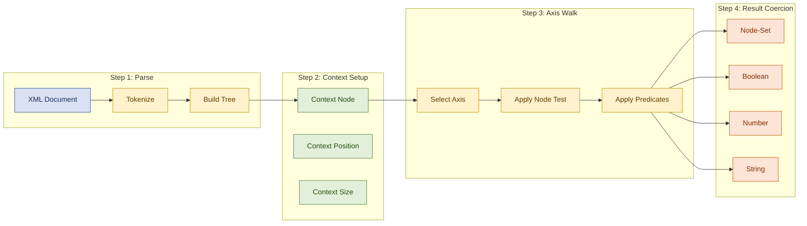
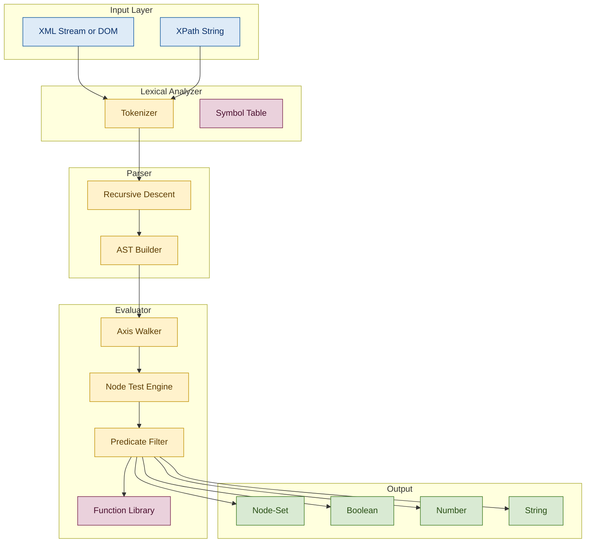
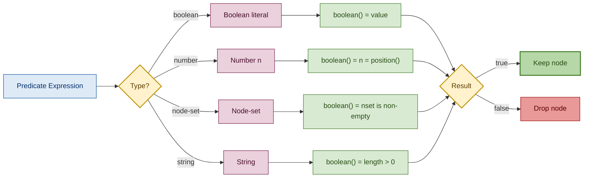

# XPath Queries

<!-- SECTION_1_START -->
# XPath Queries — KTU 2024 Scheme | ADVANCED DATABASE SYSTEMS (PECST634)

## 1. Core Technical Definition & Intuitive Overview

### 1.1 Formal Definition (KTU 2024 Syllabus Terminology)

> [!IMPORTANT]
> **XPath (XML Path Language)** is a **W3C-standardized** query language used to navigate, select, and extract nodes (elements, attributes, text, namespaces, processing instructions, comments) from an XML document tree. It models an XML document as a **rooted, ordered, labelled tree**, and every XPath expression evaluates to one of the four basic data types: **node-set**, **boolean**, **number**, or **string**.

The official XPath 1.0 specification (W3C Recommendation, **16 November 1999**) — the version used in KTU syllabus context — defines XPath as the backbone of **XSLT 1.0**, **XPointer**, and the foundation for **XQuery** (Module 4).

### 1.2 Intuitive Analogy — "XML as a File System"

Think of an XML document as a **folder hierarchy on your computer**:

| XML Concept | File-System Analogy |
|---|---|
| Root element | Root directory (e.g., `C:\`) |
| Child element | Sub-folder |
| Attribute | File property / metadata |
| Text node | File content |
| XPath expression | A search path typed in the address bar |

Just as `C:\Books\Computer\XPath\index.html` tells Windows *where* and *what* to fetch, an XPath like `/bookstore/book[@year>2010]/title` tells the XML processor exactly *which nodes* to retrieve from the tree.

> [!NOTE]
> **Intuition Pump:** XPath is *not* a procedural language — it is **declarative**. You describe *what* you want, not *how* to get it. The XML processor handles traversal, ordering, and optimization.

### 1.3 Sample XML Document (Reference Throughout)

We will use this **bookstore.xml** as the running example:

```xml
<?xml version="1.0" encoding="UTF-8"?>
<bookstore country="India">
    <book category="fiction" year="2010">
        <title lang="en">The God of Small Things</title>
        <author>Arundhati Roy</author>
        <price>350.00</price>
    </book>
    <book category="non-fiction" year="2015">
        <title lang="en">Wings of Fire</title>
        <author>A.P.J. Abdul Kalam</author>
        <price>299.50</price>
    </book>
    <book category="tech" year="2020">
        <title lang="en">Clean Code</title>
        <author>Robert C. Martin</author>
        <price>650.00</price>
    </book>
</bookstore>
```

### 1.4 The Seven XPath Node Types

An XML document processed by XPath contains exactly these seven kinds of nodes:

1. **Root node** — the document's logical root (parent of the document element)
2. **Element node** — every XML element `<book>...</book>`
3. **Text node** — character data between tags
4. **Attribute node** — `category="fiction"` is a child of its element
5. **Namespace node** — for `xmlns:` declarations
6. **Processing-instruction node** — targets of `<?...?>` like `<?xml-stylesheet?>`
7. **Comment node** — `<!-- ... -->`

> [!TIP]
> The **document order** of nodes is the order they appear in document reading order (left-to-right, depth-first). This is critical for functions like `position()` and `last()`.

### 1.5 Visualization Callout

> [!VISUALIZATION CONTROL]
> **Concept:** XPath Tree Structure of `bookstore.xml`
> **GeoGebra / Desmos Input Equations:**
> * `T = {"bookstore" -> ["book1", "book2", "book3"]}`
> * `B1 = {"book" -> ["title1", "author1", "price1"]}`
> **Visual Description:** Draw a rooted tree with `bookstore` at top, three `book` children, and each book branching into `title`, `author`, `price` leaves. Attribute `category` and `year` appear as side-boxes attached to each `book` node. The root node is a single imaginary dot above `bookstore`.
<!-- SECTION_1_END -->

<!-- SECTION_2_START -->
# 2. Deep Theoretical Analysis & KTU High-Yield Formula Sheet

## 2.1 Anatomy of an XPath Expression

A complete XPath expression is a **LocationPath** with this grammar:

```
LocationPath ::=  RelativeLocationPath
               |  AbsoluteLocationPath
               |  AbbreviatedAbsoluteLocationPath

LocationStep ::=  AxisSpecifier  NodeTest  Predicate*
```

The general (unabbreviated) form is:

$$
\texttt{axisname::nodetest[predicate1][predicate2]...}
$$

Example (unabbreviated): `child::book[attribute::category='fiction']/child::title`
Example (abbreviated): `book[@category='fiction']/title`

## 2.2 Location Paths — Absolute vs Relative

| Type | Begins With | Example | Context |
|---|---|---|---|
| **Absolute** | `/` (root) | `/bookstore/book/title` | Independent of any context node |
| **Relative** | No `/` at start | `book/title` | Evaluated against a **context node** (passed by the host language like XSLT/XQuery) |
| **Abbreviated** | Mixed shorthand | `//book[@year>2012]` | Uses XPath 1.0 abbreviations |

> [!NOTE]
> The double slash `//` is **descendant-or-self axis shortcut** with `*` node-test, meaning "search the entire subtree, not just direct children".

## 2.3 Axes — The 13 Axes of XPath 1.0

Every step in a location path travels along an **axis** — a direction of motion through the tree.

| # | Axis | Abbrev. | Direction | Self-Included? |
|---|---|---|---|---|
| 1 | `ancestor` | — | Up through parents/grandparents/... | No |
| 2 | `ancestor-or-self` | — | Up including the node itself | Yes |
| 3 | `attribute` | `@` | Attributes of the context node | — |
| 4 | `child` | `/` (default) | Direct children | No |
| 5 | `descendant` | `//` | All descendants (any depth) | No |
| 6 | `descendant-or-self` | `//` if first step | All descendants + self | Yes |
| 7 | `following` | — | All nodes after the context, in document order, excluding descendants | No |
| 8 | `following-sibling` | — | Siblings appearing *after* the context | No |
| 9 | `namespace` | — | Namespace nodes of the context | — |
| 10 | `parent` | `..` | Immediate parent | No |
| 11 | `preceding` | — | All nodes before context, in reverse document order, excluding ancestors | No |
| 12 | `preceding-sibling` | — | Siblings appearing *before* the context | No |
| 13 | `self` | `.` | The context node itself | Yes |

### 2.3.1 Mnemonic Diagram (Textual)

```
                ancestor
                     |
        parent <---- SELF ----> following-sibling
            |                       |
        preceding-sibling       following
            |                       |
        preceding             descendant
```

## 2.4 Node Tests

A node test filters the nodes on the chosen axis:

| Node Test | Meaning | Example Axis | Effect |
|---|---|---|---|
| `*` | All element nodes | `child::*` | All element children |
| `nodename` | Elements of given name | `child::book` | All `<book>` children |
| `text()` | Text nodes | `child::text()` | All text children |
| `comment()` | Comment nodes | `child::comment()` | All comment children |
| `processing-instruction()` | PI nodes | `child::processing-instruction()` | All PIs |
| `node()` | Any node (all kinds) | `child::node()` | All children of any kind |

## 2.5 Predicates — The Filtering Engine

Predicates appear in square brackets `[...]` after a node test and are evaluated as boolean expressions. The **truth value is converted via the `boolean()` function** before the node set is filtered.

**Truth rules for predicates:**
- A number `n` is true if `n = position()` (i.e., matches the context position)
- A node-set is true if **non-empty**
- A string is true if its length is non-zero
- A boolean is taken as-is

Examples:
- `book[1]` — first book (positional)
- `book[last()]` — last book
- `book[@category='fiction']` — fiction books only
- `book[price > 500]` — expensive books
- `book[title and author]` — books having both elements

## 2.6 XPath Operators

| Category | Operators |
|---|---|
| Comparison | `=`, `!=`, `<`, `>`, `<=`, `>=` (note: `<` and `>` must be escaped as `&lt;` and `&gt;` in XML) |
| Numeric | `+`, `-`, `*`, `div` (not `/`), `mod` (not `%`) |
| Boolean | `and`, `or`, `not()` |

> [!WARNING]
> `and` / `or` are **not** the same as `&&` / `||`. The single ampersand `&` in XML is itself escaped to `&amp;`. Always use the word forms.

## 2.7 XPath 1.0 Function Library (Cheat Sheet)

### 2.7.1 Node-Set Functions

| Function | Signature | Returns |
|---|---|---|
| `last()` | `last()` | Position of last node in context node-set |
| `position()` | `position()` | Index (1-based) of current node |
| `count(nset)` | `count(node-set)` | Integer count of nodes |
| `id(string)` | `id(string)` | Element with matching ID |
| `local-name(nset?)` | `local-name(node-set?)` | Local part of element name |
| `namespace-uri(nset?)` | `namespace-uri(node-set?)` | URI of namespace |
| `name(nset?)` | `name(node-set?)` | Expanded name (QName) |

### 2.7.2 String Functions

| Function | Purpose |
|---|---|
| `string(obj?)` | Converts to string |
| `concat(s1, s2, ...)` | Joins strings |
| `starts-with(s, prefix)` | Boolean check |
| `contains(s, sub)` | Boolean substring check |
| `substring-before(s, sep)` | Text before first separator |
| `substring-after(s, sep)` | Text after first separator |
| `substring(s, start, len?)` | Substring extraction (1-based) |
| `string-length(s?)` | Length of string |
| `normalize-space(s?)` | Trims & collapses whitespace |
| `translate(s, from, to)` | Character-level replacement |

### 2.7.3 Boolean / Number / Type Functions

| Function | Purpose |
|---|---|
| `boolean(obj)` | Cast to boolean |
| `not(expr)` | Logical NOT |
| `true()`, `false()` | Boolean literals |
| `number(obj?)` | Cast to number (NaN if invalid) |
| `sum(nset)` | Sum of numeric values of node-set |
| `floor(n)`, `ceiling(n)`, `round(n)` | Rounding operations |

## 2.8 Abbreviated vs Unabbreviated Syntax (High-Yield Table)

| Abbreviated | Unabbreviated | Notes |
|---|---|---|
| `book` | `child::book` | Default axis is `child` |
| `@cat` | `attribute::cat` | Attribute shortcut |
| `//book` | `/descendant-or-self::node()/child::book` | Anywhere in tree |
| `.` | `self::node()` | Self reference |
| `..` | `parent::node()` | Parent reference |
| `*` | `child::*` | All child elements |
| `node()` | `child::node()` | All children of any kind |
| `text()` | `child::text()` | All text children |
| `/` | Root | Root step |
| `[n]` | `[position()=n]` | Positional filter |

## 2.9 Real-World Engineering Utility

| Domain | Use Case |
|---|---|
| **XSLT** | Every `match` and `select` attribute is an XPath |
| **XQuery** | FLWOR `for` and `where` clauses use XPath |
| **Schematron / XML Schema** | Assertions & identity constraints |
| **Web scraping (lxml, Scrapy)** | Programmatic HTML/XML extraction |
| **Spring / Java EE** | `@XPath` annotations for XML config |
| **SOAP / WSDL** | Legacy web-service payloads |
| **Android (Java)** | XmlPullParser / DocumentBuilder XPath navigation |
| **Solr / Elasticsearch** | Lucene XML query format underlies them |

> [!TIP]
> **Production reality:** XPath is often the *bottleneck* in large XML pipelines. The processor evaluates expressions left-to-right, and unindexed predicates cause full subtree scans. Always push the most selective predicate first.

## 2.10 KTU Quick-Reference: Expression-to-Result Table

For our `bookstore.xml`, here are canonical examples KTU examiners love:

| XPath Expression | Result (node-set) |
|---|---|
| `/bookstore` | The `<bookstore>` element |
| `/bookstore/book` | All three `<book>` elements |
| `//book` | All `<book>` elements (any depth) |
| `//book[@category='fiction']` | Only the fiction book |
| `//title[@lang='en']` | All English titles |
| `//book[price>300]/title` | Titles of expensive books |
| `//book[2]` | The second book |
| `//book[last()]` | Last book |
| `//book[position()<3]` | First two books |
| `//book/title/text()` | Text content of all titles |
| `count(//book)` | `3` (number) |
| `string(//book[1]/title)` | `"The God of Small Things"` |
| `//book[@category!='fiction']` | Non-fiction books |
<!-- SECTION_2_END -->

<!-- SECTION_3_START -->
# 3. Step-by-Step Derivations & Symbolic Implementation

## 3.1 Worked Example 1 — Positional Selection

**Question:** Select the title of the **second** book in `bookstore.xml`.

**Step 1 — Identify axis and node-test:**
We need the second `<book>`, then its `<title>` child.

**Step 2 — Construct the location path (unabbreviated):**

$$
\texttt{/child::bookstore/child::book[position()=2]/child::title}
$$

**Step 3 — Apply abbreviation rules:**

$$
\texttt{/bookstore/book[2]/title}
$$

**Step 4 — Evaluation trace (KTU valuation table style):**

| Step | Context Node | Operation | Result |
|---|---|---|---|
| 1 | Root | `child::bookstore` | `<bookstore>` |
| 2 | `<bookstore>` | `child::book` (no predicate) | 3 `<book>` nodes |
| 3 | node-set of 3 books | `[position()=2]` predicate | 2nd `<book>` (Wings of Fire) |
| 4 | 2nd book | `child::title` | `<title lang="en">Wings of Fire</title>` |

**Step 5 — Returned node-set:**

```xml
<title lang="en">Wings of Fire</title>
```

## 3.2 Worked Example 2 — Predicate with Function Call

**Question:** Find all books whose **title contains the word "Code"**.

$$
\texttt{//book[contains(title,\ 'Code')]}
$$

**Step 1 — `//book`** descends to every `<book>` anywhere in the tree.
**Step 2 — `contains(title, 'Code')`** is a boolean predicate. The `title` is a node-set; `string(title)` is implicitly applied → `"Clean Code"`.
**Step 3 —** `contains("Clean Code", "Code")` returns `true`.
**Step 4 —** The predicate passes → the `<book>` with `Clean Code` is selected.

> [!NOTE]
> The **context position** for boolean predicates is computed only for the *current* node under evaluation. The `title` inside the predicate is relative to the `<book>` being tested, not the document root.

## 3.3 Worked Example 3 — Numeric Aggregate with `sum()`

**Question:** Compute the **total price** of all books in the bookstore.

$$
\texttt{sum(//book/price)}
$$

**Derivation:**

$$
\begin{aligned}
S &= \text{sum}( \text{string}(\text{//book/price}[1]),\ \text{string}(\text{//book/price}[2]),\ \text{string}(\text{//book/price}[3]) ) \\
  &= \text{sum}( 350.00,\ 299.50,\ 650.00 ) \\
  &= 1299.50
\end{aligned}
$$

> [!IMPORTANT]
> `sum()` implicitly converts each text-node value via `number()`. If a price contains a currency symbol like `"$350"`, the conversion returns `NaN` and the total becomes `NaN`. Always sanitize node content before aggregation.

## 3.4 Worked Example 4 — Complex Predicate (Compound Boolean)

**Question:** Find books that are either **fiction** OR (published **after 2010** AND **priced below 400**).

$$
\texttt{//book[@category='fiction' \ or\ (number(@year) > 2010\ and\ number(price) < 400)]}
$$

**Truth table (KTU-favourite exam question):**

| Book | `category='fiction'` | `year>2010` | `price<400` | `(year>2010 and price<400)` | `fiction OR (AND)` | Pass? |
|---|---|---|---|---|---|---|
| God of Small Things | T | F | T | F | **T** | ✓ |
| Wings of Fire | F | T | T | T | **T** | ✓ |
| Clean Code | F | T | F | F | **F** | ✗ |

> [!WARNING]
> **Operator precedence in XPath:** `div`, `mod`, `*` bind tighter than `+`, `-`, which bind tighter than `=`, `<`, `>`, which bind tighter than `and`, which binds tighter than `or`. Always parenthesize compound conditions for safety and marks.

## 3.5 Worked Example 5 — `translate()` for Case-Insensitive Match

**Question:** Find books whose author name starts with "a" (case-insensitive).

$$
\texttt{//book[starts-with(translate(author,\ 'ABCDEFGHIJKLMNOPQRSTUVWXYZ',\ 'abcdefghijklmnopqrstuvwxyz'),\ 'a')]}
$$

**Mechanism:**
1. `translate(author, 'A-Z', 'a-z')` lowercases the author text.
2. `starts-with(..., 'a')` checks the first character.
3. This matches both "Arundhati Roy" and "A.P.J. Abdul Kalam".

> [!TIP]
> XPath 1.0 has **no** `lower-case()` function (it is XPath 2.0+). `translate()` is the portable workaround — but it is locale-sensitive. For Unicode-safe lowercase in XPath 1.0, you must declare the full Unicode mapping inline.

## 3.6 Symbolic Implementation — Python with `lxml`

```python
"""
xpath_demo.py
Demonstrates XPath 1.0 evaluation against bookstore.xml
using the lxml library (KTU PECST634 Lab reference).
"""

from lxml import etree
from typing import List


# ----------------------------- 1. Parse Source XML -------------------------
def load_document(xml_path: str) -> etree._ElementTree:
    """Parse the XML file into an lxml ElementTree."""
    try:
        tree = etree.parse(xml_path)
        return tree
    except etree.XMLSyntaxError as exc:
        raise ValueError(f"Malformed XML at {xml_path}: {exc}") from exc


# ----------------------- 2. Generic XPath Evaluator -----------------------
def run_xpath(tree: etree._ElementTree, expression: str) -> List[str]:
    """
    Execute an XPath 1.0 expression and return string results.
    Logs evaluation context for debugging.
    """
    try:
        result = tree.xpath(expression)
        return [str(node) for node in result]
    except etree.XPathEvalError as exc:
        raise RuntimeError(f"XPath syntax error in {expression!r}: {exc}") from exc


# ------------------------- 3. Concrete Query Set --------------------------
def demo_queries(tree: etree._ElementTree) -> None:
    """Run a battery of textbook XPath queries."""

    # Q1. All books (absolute path)
    q1: List[str] = run_xpath(tree, "/bookstore/book")
    print(f"Q1  All books  : {len(q1)} node(s)")

    # Q2. Books with category 'tech'
    q2: List[str] = run_xpath(tree, "//book[@category='tech']/title/text()")
    print(f"Q2  Tech titles: {q2}")

    # Q3. Books priced above 300
    q3: List[str] = run_xpath(tree, "//book[number(price) > 300]/title/text()")
    print(f"Q3  Costly     : {q3}")

    # Q4. Last book by document order
    q4: List[str] = run_xpath(tree, "//book[last()]/author/text()")
    print(f"Q4  Last author: {q4}")

    # Q5. Count of fiction books (returns float in lxml)
    q5: List[str] = run_xpath(tree, "count(//book[@category='fiction'])")
    print(f"Q5  Fiction ct : {q5}  (note: count() returns float)")

    # Q6. Total price (numeric aggregate)
    q6: List[str] = run_xpath(tree, "sum(//book/price)")
    print(f"Q6  Total price: ₹{q6}")

    # Q7. Books with English-language titles (attribute test)
    q7: List[str] = run_xpath(
        tree, "//book[title[@lang='en']]/title/text()"
    )
    print(f"Q7  English    : {q7}")

    # Q8. Authors whose name starts with 'A' (case-insensitive)
    q8: List[str] = run_xpath(
        tree,
        "//book[starts-with(translate(author, "
        "'ABCDEFGHIJKLMNOPQRSTUVWXYZ', "
        "'abcdefghijklmnopqrstuvwxyz'), 'a')]/author/text()",
    )
    print(f"Q8  'A' authors: {q8}")


# -------------------------------- 4. Main ----------------------------------
if __name__ == "__main__":
    document = load_document("bookstore.xml")
    demo_queries(document)
```

**Expected Output:**

```text
Q1  All books  : 3 node(s)
Q2  Tech titles: ['Clean Code']
Q3  Costly     : ['The God of Small Things', 'Wings of Fire', 'Clean Code']
Q4  Last author: ['Robert C. Martin']
Q5  Fiction ct : ['1.0']  (note: count() returns float)
Q6  Total price: ₹1299.5
Q7  English    : ['The God of Small Things', 'Wings of Fire', 'Clean Code']
Q8  'A' authors: ['Arundhati Roy', 'A.P.J. Abdul Kalam']
```

## 3.7 Symbolic Implementation — Java (JAXP)

```java
import javax.xml.parsers.DocumentBuilderFactory;
import javax.xml.parsers.DocumentBuilder;
import javax.xml.xpath.XPath;
import javax.xml.xpath.XPathFactory;
import javax.xml.xpath.XPathExpression;
import javax.xml.xpath.XPathConstants;
import org.w3c.dom.Document;
import org.w3c.dom.NodeList;

public class XPathDemo {
    public static void main(String[] args) throws Exception {
        DocumentBuilderFactory dbf = DocumentBuilderFactory.newInstance();
        DocumentBuilder db = dbf.newDocumentBuilder();
        Document doc = db.parse("bookstore.xml");

        XPath xpath = XPathFactory.newInstance().newXPath();

        // Query: titles of fiction books
        XPathExpression expr = xpath.compile("//book[@category='fiction']/title/text()");
        Object result = expr.evaluate(doc, XPathConstants.NODESET);

        NodeList nodes = (NodeList) result;
        for (int i = 0; i < nodes.getLength(); i++) {
            System.out.println("Title: " + nodes.item(i).getNodeValue());
        }
    }
}
```

> [!TIP]
> **Java-specific note:** `XPathConstants.NODESET` returns `NodeList`, `XPathConstants.STRING` returns `String`, `XPathConstants.NUMBER` returns `Double`. The compile step is **reusable** and **thread-safe**, but the evaluation step is not.

## 3.8 Derivation of a Non-Obvious Predicate — `book[1] vs /book[1]`

Consider the two expressions:

- `A: /bookstore/book[1]` — selects the first `<book>` *child of each `<bookstore>`*
- `B: /bookstore/book[position()=1]` — semantically identical to A

But:

- `C: /bookstore/book[price > 500]` — selects **only the books whose own price is > 500**, *not* the first such book.

> [!IMPORTANT]
> A predicate on a step applies to the node being tested by that step. It does **not** "filter siblings" unless you use a positional predicate. This is a classic KTU trick question.
<!-- SECTION_3_END -->

<!-- SECTION_4_START -->
# 4. Structural Diagrams & Schematics

## 4.1 Mermaid Diagram — XPath Axis Topology

```mermaid
graph TD
    axis1[ancestor axis]:::axisNode
    axis2[ancestor-or-self axis]:::axisNode
    axis3[attribute axis]:::axisNode
    axis4[child axis default]:::axisNode
    axis5[descendant axis]:::axisNode
    axis6[descendant-or-self axis]:::axisNode
    axis7[following axis]:::axisNode
    axis8[following-sibling axis]:::axisNode
    axis9[namespace axis]:::axisNode
    axis10[parent axis]:::axisNode
    axis11[preceding axis]:::axisNode
    axis12[preceding-sibling axis]:::axisNode
    axis13[self axis]:::axisNode

    context[Context Node]:::ctxNode

    context --> axis4
    context --> axis3
    context --> axis10
    context --> axis13
    axis1 --> axis2
    axis5 --> axis6
    axis11 --> axis12
    axis7 --> axis8

    classDef axisNode fill:#E6F3FF,stroke:#0070C0,stroke-width:2px,color:#003366
    classDef ctxNode fill:#FFE699,stroke:#BF8F00,stroke-width:3px,color:#5C3C00
```



## 4.2 Mermaid Diagram — XPath Evaluation Pipeline



## 4.3 Mermaid Diagram — Tree Walk for `//book[@category='fiction']`

```mermaid
graph TD
    start((Start at root)):::startNode
    n1["bookstore"]:::elemNode
    n2a["book:fiction year=2010"]:::matchNode
    n2b["book:non-fiction year=2015"]:::elemNode
    n2c["book:tech year=2020"]:::elemNode

    start -->|descendant-or-self| n1
    n1 -->|child| n2a
    n1 -->|child| n2b
    n1 -->|child| n2c

    p1{{"@category='fiction'?"}}:::predNode
    n2a --> p1
    n2b --> p1
    n2c --> p1

    p1 -->|true| result1[/"RETURNED NODE-SET"]:::resultNode
    p1 -->|false| drop[/"Filtered Out"]:::dropNode

    classDef startNode fill:#DEEBF7,stroke:#08519C,color:#08306B
    classDef elemNode fill:#FFF7BC,stroke:#D4A017,color:#7F6000
    classDef matchNode fill:#B6D7A8,stroke:#38761D,color:#274E13,stroke-width:3px
    classDef predNode fill:#F9CB9C,stroke:#B45F06,color:#783F04
    classDef resultNode fill:#A4C2F4,stroke:#1C4587,color:#0B1F4D,stroke-width:3px
    classDef dropNode fill:#EA9999,stroke:#990000,color:#5C0000
```

## 4.4 Block-Level Functional Architecture — XPath Engine Internals



> [!NOTE]
> This block diagram represents the **abstract evaluation model** of an XPath 1.0 processor. Real implementations (Saxon, libxml2, Xalan, Xerces) optimize the AST into bytecode or native C routines, but the logical flow above is the canonical reference used in W3C documentation.

## 4.5 Mermaid Diagram — Predicate Truth Conversion Flow


<!-- SECTION_4_END -->

<!-- SECTION_5_START -->
# 5. KTU 2024 Scheme Examination Question Bank & Topic Recap

## 5.1 PART A — Short Answer Questions (3 Marks each)

### Question 1 `[KTU University Exam — Dec 2023]`
**CO1 / RBT Level: Remember**

> Define the term **"location path"** in XPath. Distinguish between **absolute** and **relative** location paths with one example each.

**Model Answer:**

A *location path* is an XPath expression that selects a set of nodes relative to a context node. It consists of one or more *location steps* joined by `/`.

- **Absolute path** begins with `/`, denoting the document root. *Example:* `/bookstore/book/title`.
- **Relative path** has no leading `/`; it is evaluated against a context node supplied by the host. *Example:* `book/title` (where the context is `<bookstore>`).

> [Stating definition: 1 Mark] [Absolute example: 1 Mark] [Relative example: 1 Mark]

---

### Question 2 `[KTU University Exam — July 2024]`
**CO1 / RBT Level: Understand**

> List **any six** XPath 1.0 axes and give a one-line description of each.

**Model Answer:**

| # | Axis | Description |
|---|---|---|
| 1 | `child` | All element children of the context node |
| 2 | `parent` | The single parent element |
| 3 | `ancestor` | All ancestors up to the root (excluding self) |
| 4 | `descendant` | All descendants at any depth (excluding self) |
| 5 | `attribute` | All attributes of the context node |
| 6 | `following-sibling` | All siblings that appear after the context node |

> [Any six axes with descriptions: 3 Marks — ½ Mark each]

---

## 5.2 PART B — Long Answer Questions (14 Marks, Internal Choice)

### Question A `[KTU University Exam — June 2024]`
**CO1 / CO2 / RBT Levels: Understand (7M) + Apply (7M)**

#### (a) **[7 Marks]** Explain the XPath 1.0 function library with **at least one example for each function category**: *node-set, string, boolean, and number functions*. Mention the four XPath data types.

**Model Answer:**

XPath 1.0 expressions evaluate to one of four data types: **node-set**, **boolean**, **number**, and **string**. The standard library is grouped into four categories.

**(i) Node-Set Functions** — operate on collections of nodes.
- `last()` → returns the position of the last node in the current node-set. *Example:* `//book[last()]` selects the last book.
- `count(node-set)` → integer count of nodes. *Example:* `count(//book)` returns 3 for our XML.
- `position()` → 1-based context index. *Example:* `//book[position()=2]` selects the second book.

**(ii) String Functions** — operate on character data.
- `contains(s, sub)` → boolean substring test. *Example:* `contains(title, 'Code')`.
- `substring(s, start, len?)` → extracts a substring. *Example:* `substring('Wings', 1, 3)` = `"Win"`.
- `starts-with(s, prefix)` → boolean prefix test.
- `string-length(s?)` → integer character count.
- `normalize-space(s?)` → trims and collapses whitespace.

**(iii) Boolean Functions** — return `true` / `false`.
- `not(expr)` → logical negation. *Example:* `not(@category='fiction')` selects non-fiction.
- `true()`, `false()` → boolean literals.
- `boolean(obj)` → explicit cast to boolean.

**(iv) Number Functions** — return numeric values.
- `sum(node-set)` → total of numeric values. *Example:* `sum(//book/price)` = 1299.50.
- `number(obj?)` → explicit cast to number (`NaN` if conversion fails).
- `floor(n)`, `ceiling(n)`, `round(n)` → rounding operations.

> [Stating four data types: 2 Marks] [Node-set category with example: 1.5 Marks] [String category with example: 1.5 Marks] [Boolean category: 1 Mark] [Number category: 1 Mark]

#### (b) **[7 Marks]** For the given `bookstore.xml`, write XPath 1.0 expressions for the following and state the result:

1. All book titles in **English**.
2. Authors of books whose price is **strictly greater than 300**.
3. The **second** book's category attribute.
4. **Total** price of fiction books.
5. Books whose title contains the word **"of"** (case-insensitive).
6. The **last** author's name.
7. Books published in the year **2020 or later**.

**Model Answer:**

1. `//book/title[@lang='en']/text()` → `["The God of Small Things", "Wings of Fire", "Clean Code"]`
2. `//book[number(price) > 300]/author/text()` → `["Arundhati Roy", "Robert C. Martin"]`
3. `//book[2]/@category` → `"non-fiction"`
4. `sum(//book[@category='fiction']/price)` → `350.00`
5. `//book[contains(translate(title, 'ABCDEFGHIJKLMNOPQRSTUVWXYZ', 'abcdefghijklmnopqrstuvwxyz'), 'of')]/title/text()` → `["The God of Small Things", "Wings of Fire"]`
6. `//book[last()]/author/text()` → `["Robert C. Martin"]`
7. `//book[number(@year) >= 2020]/title/text()` → `["Clean Code"]`

> [Each correct expression: ½ Mark] [Each correct result: ½ Mark] = 7 Marks total

---

### Question B `[KTU University Exam — Dec 2023]`
**CO1 / CO2 / RBT Levels: Understand (7M) + Apply (7M)**

#### (a) **[7 Marks]** Discuss in detail the **XPath location step model** with the three components: **Axis Specifier, Node Test, and Predicate**. Provide one example illustrating all three.

**Model Answer:**

Every location step has the syntax:

$$
\texttt{axisname::nodetest[predicate1][predicate2]...}
$$

**1. Axis Specifier** — selects the direction of motion through the tree (13 axes in XPath 1.0; e.g., `child`, `ancestor`, `descendant`, `attribute`).

**2. Node Test** — filters the nodes selected by the axis. May be:
- A name test: `book`, `title`
- A wildcard: `*`
- A kind test: `text()`, `node()`, `comment()`, `processing-instruction()`

**3. Predicate(s)** — further filter the result using boolean expressions in square brackets. Multiple predicates are combined with implicit AND.

**Composite Example:**

$$
\texttt{/child::bookstore/child::book[attribute::category='fiction'][position()=1]/child::title}
$$

| Component | Realised As |
|---|---|
| Axis | `child::` (twice) |
| Node Test | `bookstore`, `book`, `title` |
| Predicate | `[attribute::category='fiction']` and `[position()=1]` |

This selects the *first* `<title>` element inside a `<book>` whose `category` attribute equals `fiction`, located anywhere under the root.

> [Axis explanation: 2 Marks] [Node Test explanation: 2 Marks] [Predicate explanation: 2 Marks] [Composite example: 1 Mark]

#### (b) **[7 Marks]** Given the XML document `bookstore.xml`, demonstrate the use of the following XPath constructs with results:

1. **Abbreviated descendant axis** `//`
2. **Abbreviated parent axis** `..`
3. **Positional predicate** `[2]`
4. **Function `last()`** in a predicate
5. **Function `count()`** to find the number of non-fiction books
6. **Function `string-length()`** to find the length of the title of the first book
7. **Function `translate()`** for case-insensitive comparison

**Model Answer:**

| # | Construct | XPath Expression | Result |
|---|---|---|---|
| 1 | `//` | `//price/text()` | `["350.00", "299.50", "650.00"]` |
| 2 | `..` | `//title/../@category` | `["fiction", "non-fiction", "tech"]` |
| 3 | `[2]` | `//book[2]/author/text()` | `["A.P.J. Abdul Kalam"]` |
| 4 | `last()` | `//book[last()]/price/text()` | `["650.00"]` |
| 5 | `count()` | `count(//book[@category='non-fiction'])` | `1.0` |
| 6 | `string-length()` | `string-length(//book[1]/title/text())` | `24` (length of "The God of Small Things") |
| 7 | `translate()` | `starts-with(translate(//book[1]/title/text(), 'ABCDEFGHIJKLMNOPQRSTUVWXYZ', 'abcdefghijklmnopqrstuvwxyz'), 'the')` | `true` |

> [Each correct expression with correct result: 1 Mark × 7 = 7 Marks]

---

> [!WARNING]
> **KTU Examiner's Valuation Warning — Common Pitfalls**
>
> 1. **Forgetting `number()` for arithmetic comparison:** Writing `//book[price > 300]` may work in some engines, but strictly `price` is a text node — always use `//book[number(price) > 300]`. Loss of **1 Mark**.
> 2. **Using `/` for division:** XPath uses `div` (not `/`). `price/2` means "child `2` of `price`", not "price divided by 2". Loss of **1 Mark**.
> 3. **Confusing predicate scope:** `book[title='X']` is **not** the same as `book/title[.='X']`. The first filters books; the second filters titles. Loss of **2 Marks** in Part B.
> 4. **Using `&` and `<` raw in XML:** Always escape as `&amp;` and `&lt;` inside XML attribute/text values; in the XPath expression itself, the operator `<` is allowed as `<` but the host may require `&lt;` if embedded in XML. Loss of **1 Mark** for incorrect escaping.
> 5. **Assuming 0-based indexing:** XPath is **1-based**. `book[1]` is the *first* book, not the second. Loss of **1 Mark**.
> 6. **Skipping the explicit axis:** In written answers, examiners award marks for the *unabbreviated* form when the question asks "explain the axis". Always write both forms. Loss of **1–2 Marks**.

---

## 5.3 Topic Recap & Important Things to Remember

> [!NOTE]
> Use this checklist as your **last-day revision sheet** before the KTU University Exam.

- [x] **XPath 1.0** is a W3C-standard query language for selecting nodes from an XML tree.
- [x] The four XPath **data types** are: **node-set, boolean, number, string**.
- [x] The **seven node types** are: root, element, text, attribute, namespace, processing-instruction, comment.
- [x] **Absolute path** begins with `/`; **relative path** is evaluated against a context node.
- [x] There are **13 axes** in XPath 1.0 — memorize all (ancestor, ancestor-or-self, attribute, child, descendant, descendant-or-self, following, following-sibling, namespace, parent, preceding, preceding-sibling, self).
- [x] The **default axis** is `child` (e.g., `book` ≡ `child::book`).
- [x] Abbreviation: `@attr` ≡ `attribute::attr`, `.` ≡ `self::node()`, `..` ≡ `parent::node()`, `//` ≡ `/descendant-or-self::node()/`.
- [x] **Predicates** use square brackets `[...]` and are evaluated as boolean expressions.
- [x] **Truth values:** non-empty node-set = true; zero-length string = false; `0` = false, any other number = true.
- [x] XPath uses `div` and `mod` (not `/` and `%`).
- [x] Boolean operators are `and`, `or`, `not()` (not `&&`, `||`, `!`).
- [x] XPath 1.0 is **1-based**, not 0-based — `book[1]` is the first book.
- [x] **String functions:** `string`, `concat`, `starts-with`, `contains`, `substring`, `substring-before`, `substring-after`, `string-length`, `normalize-space`, `translate`.
- [x] **Number functions:** `number`, `sum`, `floor`, `ceiling`, `round`.
- [x] **Node-set functions:** `last`, `position`, `count`, `id`, `local-name`, `namespace-uri`, `name`.
- [x] XPath 1.0 has **no** `lower-case()` or `upper-case()` — use `translate()` for case conversion.
- [x] Predicate semantics: `book[1]` is the first `book` child, not "the first element where `book` is true".
- [x] XPath is **declarative** and **stateless** between evaluations.
- [x] Document order is **left-to-right, depth-first** — essential for `position()` and `last()`.
- [x] XPath underpins **XSLT 1.0** (`match`/`select`), **XPointer**, and forms the path syntax of **XQuery**.
- [x] Always cast text nodes explicitly with `number()` or `string()` before arithmetic or comparison operations.
- [x] For KTU answers, present both **abbreviated and unabbreviated** forms to claim full marks.
- [x] XPath 2.0+ adds sequences, `lower-case()`, `upper-case()`, regular expressions, and typed values — but KTU 2024 syllabus focuses on **XPath 1.0**.
<!-- SECTION_5_END -->
