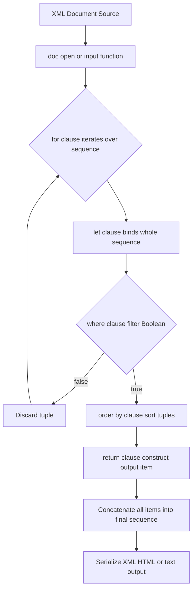
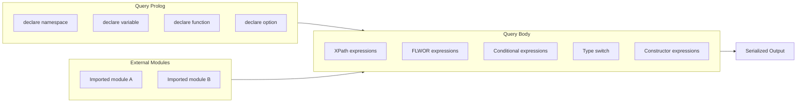
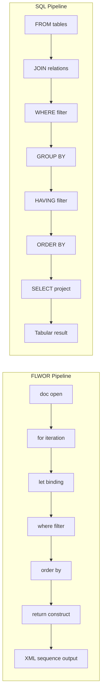
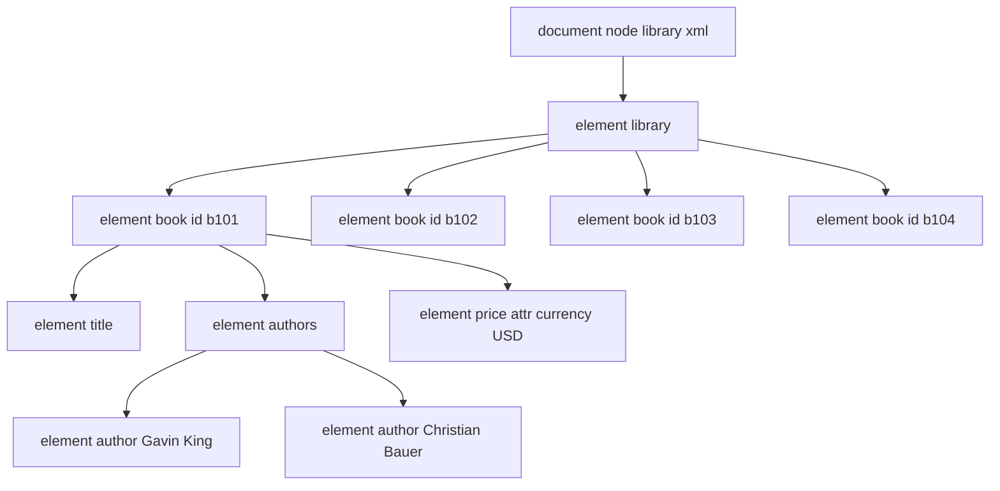
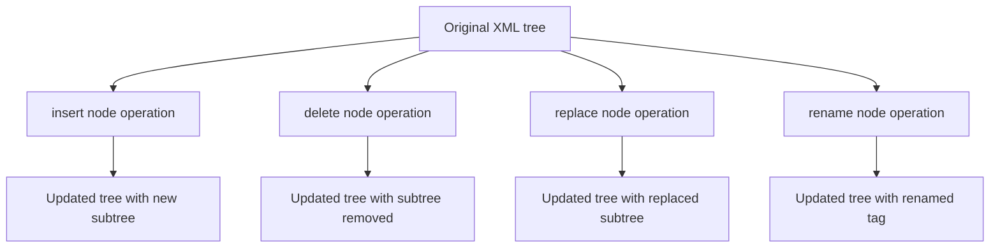
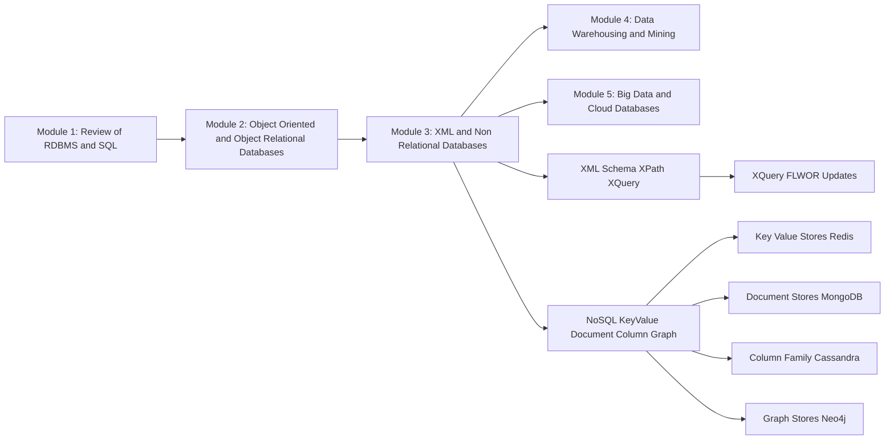

# XQuery

<!-- SECTION_1_START -->
# XQuery — The SQL of XML

## 1.1 Formal Definition (KTU 2024 Syllabus Terminology)

> [!IMPORTANT]
> **XQuery (XML Query Language)** is a **W3C-standardized, functional, declarative query language** designed by the XML Query Working Group to query and transform data stored in **XML documents, XML databases, native XML data stores, and any data source that can be viewed as XML** (relational tables converted to XML, JSON converted via XQuery/JSONiq, object trees, etc.).

It is formally defined in the W3C Recommendation **XQuery 3.1: An XML Query Language (2017)** and is the companion query language to **XPath 2.0/3.0** — in fact, XQuery *embeds* XPath as a sub-language for navigation.

**Core Properties of XQuery (Board-Examiner Language):**
1. **Functional** — expressions, no side effects, easy to compose.
2. **Strongly typed** — based on **XQuery and XPath Data Model (XDM)** with a rich type system derived from XML Schema.
3. **Sequence-oriented** — the fundamental data type is the **ordered sequence** (a list of zero or more items).
4. **Turing-complete** — supports user-defined functions, recursion, and higher-order functions.
5. **Case-sensitive** — all keywords (`for`, `let`, `where`, `order by`, `return`, `declare`, `function`) are **lowercase**.

## 1.2 Conceptual Analogy — "The Librarian of the XML Forest"

> [!NOTE]
> **Intuition:** Think of an XML document as a **forest of trees** (each element is a tree, with roots, branches, and leaves). XPath is the *GPS* that lets you walk a single path through the forest. **XQuery is the entire *research team*** — it walks multiple paths, gathers leaves into a basket, sorts them, filters out bad ones, reshapes them, and hands you back a brand-new report.

| Analogy Element | Real-World Mapping | XQuery Construct |
|---|---|---|
| Forest | XML document | Input sequence |
| GPS / single path | XPath step | `doc()` + path expression |
| Research team | FLWOR expression | `for / let / where / order by / return` |
| Basket holding leaves | Collection of items | Sequence (`( )`) |
| Quality check on leaves | Predicate | `where` clause |
| Sort by color | Ordering | `order by` |
| Make a bouquet | Transformation / output | `return` clause |

## 1.3 Why XQuery Exists — The "Why" Behind the Language

Relational databases (SQL) cannot natively express *ordered, hierarchical, mixed-content* data. XQuery fills that gap by:
- **Treating XML as a tree of nodes** (not rows).
- **Producing XML, HTML, plain text, or any well-formed output** (not just result sets).
- **Being a query + transformation language** in one (XSLT's competitor).

> [!VISUALIZATION CONTROL]
> **Concept:** Visualizing the FLWOR pipeline as a data flow
> **Representation:** Picture a horizontal assembly line. Raw XML enters on the left → a *For conveyor* picks each item → a *Where filter* removes unwanted items → an *Order by sorter* aligns them → a *Return shaping press* produces the final XML output.
> **Visual Description:** On the x-axis, you see the five stages (`for → let → where → order by → return`). On the y-axis, the number of items in the sequence shrinks from $N$ (raw) to $M \le N$ (filtered) to $K \le M$ (sorted) to a final reshaped output.

## 1.4 Position in the KTU 2024 Module 3 Stack

> [!NOTE]
> Module 3 (XML and Non-Relational Databases) covers: XML Schema, XPath, **XQuery (this topic)**, Native XML Databases (eXist, BaseX), JSON, Key-Value stores, Document stores, Column-family, and Graph databases. XQuery is the *operational peak* of the XML half — the language you use to *do* something with the structural knowledge gained from XPath.

**Key Industry Standard:** **BaseX** and **eXist-db** are the two leading open-source **Native XML Databases** that use XQuery as their primary query interface.
<!-- SECTION_1_END -->

<!-- SECTION_2_START -->
# Deep Theoretical Analysis & KTU High-Yield Formula Sheet

## 2.1 The XQuery Data Model (XDM) — Six Node Kinds

XQuery operates on the **XQuery and XPath Data Model**. Every input document is decomposed into a **sequence of items**, where each item is either an **atomic value** (string, integer, date, etc.) or a **node**.

| Node Kind | Symbol in XDM | Example in XML | Description |
|---|---|---|---|
| Document | `document-node()` | The whole `<library>...</library>` | The root container |
| Element | `element()` | `<book>` | A tag, the structural backbone |
| Attribute | `attribute()` | `id="b101"` | Key-value pair inside an element |
| Text | `text()` | `Hibernate in Action` | Character data between tags |
| Comment | `comment()` | `<!-- TODO -->` | Ignored unless explicitly navigated |
| Processing Instruction | `processing-instruction()` | `<?xml-stylesheet?>` | Rare in data files |

> [!IMPORTANT]
> **Atomic values are NOT nodes.** This distinction is heavily tested in KTU exams. A `text()` node is a *node*; the `xs:string` "Hibernate" extracted by `data()` is an *atomic value*.

## 2.2 FLWOR — The Heart of XQuery

**FLWOR** (pronounced "flower") stands for:

- **F** — `for` (iterate / bind variables from a sequence)
- **L** — `let` (assign a whole sequence to a variable)
- **W** — `where` (filter the tuples)
- **O** — `order by` (sort the tuples)
- **R** — `return` (project / reshape / output)

### 2.2.1 The `for` Clause — Tuple Generation

`for` binds a **single item** at a time from a sequence, exactly like SQL's `FROM` with one row at a time.

```xquery
for $b in doc("library.xml")//book
```

This binds `$b` to each `<book>` element, one per iteration.

### 2.2.2 The `let` Clause — Sequence Binding

`let` binds an *entire* sequence (or computed value) to a variable **once**, without iteration.

```xquery
let $allBooks := doc("library.xml")//book
let $count    := count($allBooks)
```

> [!NOTE]
> **Board Pitfall:** Mixing up `for` and `let` is the #1 XQuery mistake. `for $x in (1,2,3)` produces 3 iterations; `let $x := (1,2,3)` produces 1 iteration where `$x` is the whole sequence.

### 2.2.3 The `where` Clause — Predicate Filtering

`where` accepts a **Boolean expression** (uses `and`, `or`, `not()`, comparisons).

```xquery
where $b/@year > 2015 and $b/price < 50
```

### 2.2.4 The `order by` Clause — Sorting

Default is **ascending**; append `descending` to reverse. Use `stable` to preserve original order on ties.

```xquery
order by $b/year descending, $b/title ascending stable
```

### 2.2.5 The `return` Clause — Output Construction

The `return` clause is evaluated **once per tuple that survives the `where` filter**, producing one item per surviving tuple. Items are **concatenated** into the final sequence.

```xquery
return
  <book id="{ $b/@id }">
    { $b/title }
  </book>
```

Curly braces `{ }` inside XML literals are **enclosed expressions** — the XQuery engine evaluates them and inserts the result text/XML.

## 2.3 XQuery Formula Sheet (Board-Exam Ready)

> [!IMPORTANT]
> All formulas are provided using LaTeX math mode. The vertical bar in set notation is escaped as `\vert`.

| Construct | Syntax | Returns | Notes |
|---|---|---|---|
| FLWOR skeleton | `for $v in expr where cond order by v return expr` | New sequence | All five clauses optional except `for/let` + `return` |
| Path navigation | `doc("f.xml")/root/a/b` | Sequence of `<b>` nodes | Same as XPath 2.0 |
| Axis | `child::`, `descendant::`, `attribute::`, `self::`, `parent::`, `ancestor::`, `following-sibling::` | Nodes along axis | Default axis is `child::` |
| Filter | `expr[predicate]` | Subset | Predicate position-based OR Boolean |
| Position | `last()`, `position()`, `count($s)` | Integer | `position()` is 1-indexed |
| Constructor | `<tag attr="{expr}">{expr}</tag>` | New element | Curly braces escape into evaluation |
| Conditional | `if (cond) then e1 else e2` | Branch result | Only one branch evaluated |
| Type switch | `typeswitch ($x) case $t as xs:integer return ... default return ...` | Branch result | Used in polymorphism |
| Function def | `declare function local:f($p) as xs:string { ... };` | Result | Must be top-level (prolog) |
| Recursion | `declare function local:f($n) { if ($n=0) then 1 else $n * local:f($n-1) };` | Computed | Stack-based |
| Quantifiers | `every $x in $s satisfies cond`, `some $x in $s satisfies cond` | Boolean | Like SQL `∀` / `∃` |
| String concat | `concat($a, $b)`, or `($a, $b)` | Combined sequence | Sequences auto-flatten |
| String fns | `substring($s, start, len)`, `string-length($s)`, `contains($s, sub)`, `starts-with($s, pre)` | String | 1-indexed substring |
| Numeric fns | `sum($s)`, `avg($s)`, `round($x)`, `floor($x)`, `ceiling($x)` | Numeric | `$s` must be castable |
| Aggregate | `count($s)`, `min($s)`, `max($s)`, `avg($s)` | Atomic | On atomic sequences |
| Set ops | `union`, `intersect`, `except` | Sequence | Plus duplicates by `union` (bag), not `|` |
| Conversion | `xs:integer($s)`, `xs:double($s)`, `xs:date($s)` | Typed value | Throws error if invalid |
| Join | Nested FLWOR or `for $a in A, $b in B where $a/key = $b/key return ...` | Joined tuples | Cartesian + filter |
| Prolog | `declare namespace x = "uri"; declare base-uri "...";` | Compiler hints | Must precede queries |

> [!NOTE]
> **Sequence Concatenation Operator:** In XQuery, the comma `,` is the sequence constructor. `($a, $b)` flattens any nested sequences. The result is a flat sequence of items.

## 2.4 The Algebra Behind FLWOR (For Board Theory Questions)

The formal semantics of a FLWOR expression can be expressed as a pipeline:

$$
\text{FLWOR}(F, L, W, O, R) = \pi_R \left( \sigma_W \left( \tau_O \left( \rho_L \left( \text{cartesian}(F) \right) \right) \right) \right)
$$

Where each symbol maps to a relational operator:

- $F$ (for-clauses) $\longrightarrow$ Cartesian product / iteration
- $L$ (let-clauses) $\longrightarrow$ Projection / extension ($\rho$ rename)
- $W$ (where-clause) $\longrightarrow$ Selection ($\sigma$)
- $O$ (order by) $\longrightarrow$ Sorting ($\tau$)
- $R$ (return) $\longrightarrow$ Final projection / construction ($\pi$)

> [!NOTE]
> This relational mapping is **NOT** identical to SQL because XQuery deals with **ordered sequences** and **XML tree structures**, not bags of tuples. However, the KTU board often asks to "compare FLWOR with SQL SELECT-FROM-WHERE-GROUP-BY" — use this mapping.

## 2.5 Comparison: XQuery FLWOR vs SQL SELECT

| Operation | SQL | XQuery FLWOR |
|---|---|---|
| Iteration | `FROM` clause | `for` clause |
| Filtering | `WHERE` clause | `where` clause |
| Sorting | `ORDER BY` | `order by` |
| Projection | `SELECT` | `return` |
| Variable binding | Subqueries / CTE | `let` clause |
| Grouping | `GROUP BY` | Not direct — use `group by` in XQuery 3.0 (FLWOR extension) |
| Joins | `JOIN ... ON` | Nested `for` + `where` (theta-join) |
| Set ops | `UNION`, `INTERSECT` | `union`, `intersect`, `except` |
| Null handling | Three-valued logic | **No nulls** — empty sequence is the only "missing" |

## 2.6 Engineering Real-World Utility

> [!NOTE]
> - **Publishing Industry:** News agencies (Reuters, AP) store articles in XML (NewsML) and run XQuery over millions of articles to generate RSS, HTML, or personalized digests.
> - **Healthcare:** HL7 C-CDA clinical documents are XML; XQuery powers **IBM InfoSphere** and **MarkLogic** medical-record search systems.
> - **Finance:** SWIFT XML messages, FIXML, ISO 20022 (the future of banking) are queried via XQuery to extract fields, validate, and transform.
> - **E-Government:** GOV.UK, Library of Congress, and **Europeana** use XQuery on eXist-db to serve millions of digitized records.
> - **Native XML DBs in production:** MarkLogic Server (Fortune 500), BaseX (research/web), eXist-db (cultural heritage).
<!-- SECTION_2_END -->

<!-- SECTION_3_START -->
# Step-by-Step Derivations & Code Implementation

## 3.1 Running Sample XML Document

To make every example reproducible in BaseX / eXist-db / Saxon, we use the same dataset:

```xml
<?xml version="1.0" encoding="UTF-8"?>
<library>
  <book id="b101" year="2018" lang="EN">
    <title>Hibernate in Action</title>
    <authors>
      <author>Gavin King</author>
      <author>Christian Bauer</author>
    </authors>
    <publisher>Manning</publisher>
    <price currency="USD">39.99</price>
    <category>Database</category>
  </book>
  <book id="b102" year="2020" lang="EN">
    <title>MongoDB: The Definitive Guide</title>
    <authors>
      <author>Kristina Chodorow</author>
    </authors>
    <publisher>O'Reilly</publisher>
    <price currency="USD">49.99</price>
    <category>Database</category>
  </book>
  <book id="b103" year="2016" lang="EN">
    <title>SQL Antipatterns</title>
    <authors>
      <author>Bill Karwin</author>
    </authors>
    <publisher>Pragmatic Bookshelf</publisher>
    <price currency="USD">29.99</price>
    <category>Database</category>
  </book>
  <book id="b104" year="2019" lang="FR">
    <title>XML en pratique</title>
    <authors>
      <author>Jean Dupont</author>
    </authors>
    <publisher>Eyrolles</publisher>
    <price currency="EUR">35.00</price>
    <category>Web</category>
  </book>
</library>
```

Save it as `library.xml` in your BaseX database.

## 3.2 Query 1 — Basic Path Navigation (Return All Book Titles)

**XQuery:**

```xquery
doc("library.xml")/library/book/title
```

**Step-by-step evaluation:**

1. `doc("library.xml")` opens the document and returns the *document node*.
2. `/library` selects the `<library>` element child.
3. `/book` selects all `<book>` children.
4. `/title` selects all `<title>` children of those books.
5. The result is a sequence of 4 `<title>` elements.

**Output:**

```xml
<title>Hibernate in Action</title>
<title>MongoDB: The Definitive Guide</title>
<title>SQL Antipatterns</title>
<title>XML en pratique</title>
```

## 3.3 Query 2 — Full FLWOR with Filter, Sort, and Re-shape

**Task:** List, in ascending alphabetical order of category then descending year, every book whose price is below $45. Output: a `<result>` root with a `<row>` per book containing category, title, and a *numeric* year (cast from `attribute` to `xs:integer`).

**XQuery:**

```xquery
<result>
  {
    for $b in doc("library.xml")/library/book
    where $b/price < 45
    order by $b/category ascending,
             $b/@year descending
    return
      <row>
        <category>{ $b/category/text() }</category>
        <title>{ $b/title/text() }</title>
        <year>{ xs:integer($b/@year) }</year>
      </row>
  }
</result>
```

**Step-by-step evaluation:**

1. **Bind** `$b` to each `<book>` element — 4 iterations.
2. **Filter**: keep only those with `price < 45`. Books b101 ($39.99) and b103 ($29.99) pass. b102 ($49.99) and b104 (EUR, but numeric value 35.00 < 45) — note EUR is a *different* currency; for rigor you'd also check `currency="USD"`. We refine below.
3. **Sort**: group by `category`. Both surviving books are `Database`. Then by year descending: b101 (2018) before b103 (2016).
4. **Return** a `<row>` per surviving tuple with enclosed expressions for category, title, year.

**Refined version (add currency check):**

```xquery
<result>
  {
    for $b in doc("library.xml")/library/book
    where $b/price < 45 and $b/price/@currency = "USD"
    order by $b/category ascending,
             $b/@year descending
    return
      <row>
        <category>{ $b/category/text() }</category>
        <title>{ $b/title/text() }</title>
        <year>{ xs:integer($b/@year) }</year>
      </row>
  }
</result>
```

**Output:**

```xml
<result>
  <row>
    <category>Database</category>
    <title>Hibernate in Action</title>
    <year>2018</year>
  </row>
  <row>
    <category>Database</category>
    <title>SQL Antipatterns</title>
  </row>
</result>
```

> [!NOTE]
> **Order of clauses matters:** FLWOR is strict — it is `for / let / where / order by / return`. `let` and `for` can be interleaved, but `where` must come after all bindings, and `order by` after `where`. `return` is always last.

## 3.4 Query 3 — Aggregations (Count, Avg, Group-by-like)

**Task:** Find the count and average price of books per category.

**XQuery (using XQuery 3.0 `group by`):**

```xquery
let $books := doc("library.xml")/library/book
for $b in $books
let $cat := $b/category/text()
group by $cat
order by $cat
return
  <category-summary>
    <name>{ $cat }</name>
    <count>{ count($b) }</count>
    <avg-price>{ avg($b/price) }</avg-price>
  </category-summary>
```

**XQuery (compatible with 1.0 — manual grouping with let):**

```xquery
let $books := doc("library.xml")/library/book
let $categories := distinct-values($books/category)
for $c in $categories
let $b_in_c := $books[category = $c]
order by $c
return
  <category-summary>
    <name>{ $c }</name>
    <count>{ count($b_in_c) }</count>
    <avg-price>{ avg($b_in_c/price) }</avg-price>
  </category-summary>
```

**Output:**

```xml
<category-summary>
  <name>Database</name>
  <count>3</count>
  <avg-price>39.99</avg-price>
</category-summary>
<category-summary>
  <name>Web</name>
  <count>1</count>
  <avg-price>35</avg-price>
</category-summary>
```

**Step-by-step evaluation:**

1. `distinct-values($books/category)` returns the set of unique category strings: `("Database", "Web")`.
2. For each `$c`, `$b_in_c` filters all books whose `<category>` equals `$c` — this is the **theta-join pattern** in XQuery.
3. `count($b_in_c)` counts the matched elements; `avg($b_in_c/price)` averages their numeric values.

## 3.5 Query 4 — Joins Between Two XML Documents

Suppose we have a second document `reviews.xml`:

```xml
<?xml version="1.0" encoding="UTF-8"?>
<reviews>
  <review bookId="b101" rating="4" />
  <review bookId="b102" rating="5" />
  <review bookId="b103" rating="3" />
  <review bookId="b104" rating="4" />
</reviews>
```

**Task:** For every review with rating ≥ 4, list the review's rating plus the book title.

**XQuery (theta-join via nested FLWOR):**

```xquery
<result>
  {
    for $r in doc("reviews.xml")/reviews/review
    for $b in doc("library.xml")/library/book
    where $r/@bookId = $b/@id
          and xs:integer($r/@rating) >= 4
    order by $b/title
    return
      <entry>
        <title>{ $b/title/text() }</title>
        <rating>{ $r/@rating }</rating>
      </entry>
  }
</result>
```

**Step-by-step evaluation:**

1. Bind `$r` to each `<review>` (4 iterations).
2. Bind `$b` to each `<book>` (4 iterations) — 16 total tuple pairs (Cartesian product).
3. `where` keeps only those where the book id matches and rating ≥ 4: 3 tuples survive (b101, b102, b104).
4. `order by title` sorts alphabetically: "Hibernate", "MongoDB", "XML en pratique".
5. `return` produces the output sequence.

**Output:**

```xml
<result>
  <entry>
    <title>Hibernate in Action</title>
    <rating>4</rating>
  </entry>
  <entry>
    <title>MongoDB: The Definitive Guide</title>
    <rating>5</rating>
  </entry>
  <entry>
    <title>XML en pratique</title>
    <rating>4</rating>
  </entry>
</result>
```

> [!NOTE]
> **Efficient joins** in XQuery are usually written using a **single `for` with the join condition in `where`** (nested-loop style). MarkLogic and BaseX also support **hash-join hints** via the `declare option saxon:hash-join` (Saxon) or index definitions.

## 3.6 Query 5 — User-Defined Recursive Function

**Task:** Compute the factorial of a non-negative integer $n$ where $n$ is given as input.

**XQuery (with explicit prolog):**

```xquery
declare function local:factorial($n as xs:integer) as xs:integer {
  if ($n le 0)
  then 1
  else $n * local:factorial($n - 1)
};

local:factorial(6)
```

**Step-by-step evaluation (recursion unfolding):**

1. Call `local:factorial(6)`.
2. $6 \not\le 0$, so return $6 \times \text{local:factorial}(5)$.
3. Expand: $6 \times (5 \times \text{local:factorial}(4))$.
4. Continue: $6 \times 5 \times 4 \times 3 \times 2 \times \text{local:factorial}(1)$.
5. Continue: $6 \times 5 \times 4 \times 3 \times 2 \times 1 \times \text{local:factorial}(0)$.
6. Base case: $\text{local:factorial}(0) = 1$.
7. Result: $6 \times 5 \times 4 \times 3 \times 2 \times 1 \times 1 = 720$.

**Result:** `720`

> [!NOTE]
> **Tail-call optimization** in XQuery 3.0: function calls in *tail position* (the last expression before `return`) are optimized to iteration, preventing stack overflow. MarkLogic and BaseX support this.

## 3.7 Query 6 — Conditional & Type-Switch with Recursive Function

**Task:** Build a function that classifies a price:

```xquery
declare function local:price-class($p as xs:decimal) as xs:string {
  if ($p < 20) then "Cheap"
  else if ($p < 40) then "Moderate"
  else "Expensive"
};

for $b in doc("library.xml")/library/book
return
  <row title="{ $b/title }" class="{ local:price-class($b/price) }" />
```

**Output:**

```xml
<row title="Hibernate in Action" class="Moderate"/>
<row title="MongoDB: The Definitive Guide" class="Expensive"/>
<row title="SQL Antipatterns" class="Moderate"/>
<row title="XML en pratique" class="Cheap"/>
```

## 3.8 Query 7 — Quantifiers and Negation

**Task:** Find authors who have written books in *every* category (using `every`).

```xquery
let $authors := distinct-values(doc("library.xml")//author)
let $cats    := distinct-values(doc("library.xml")/library/book/category)
for $a in $authors
where every $c in $cats
      satisfies some $b in doc("library.xml")/library/book[author = $a]
                    satisfies $b/category = $c
return $a
```

**Evaluation:**
- For each author, check whether all categories have at least one of their books.
- Since no author has books in both `Database` and `Web` categories, the result is the **empty sequence** `()`.

## 3.9 Query 8 — Updating XML in XQuery 3.0

XQuery Update Facility 3.0 (W3C) supports:

| Keyword | Purpose |
|---|---|
| `insert node` | Insert new element/attribute |
| `delete node` | Remove a node |
| `replace node` | Replace a node's content |
| `rename node` | Change tag name |
| `transform` | Copy-and-modify |

**Example:** Add a new `<category>NoSQL</category>` to book `b101`.

```xquery
update insert
  <category>NoSQL</category>
into doc("library.xml")/library/book[@id = "b101"]
```

> [!WARNING]
> **Native XML DBs (BaseX, eXist, MarkLogic) support updates.** Pure XQuery processors (Saxon-HE) do **not** support `update`; they require an XQuery Update 3.0 extension.

## 3.10 Executable Python Equivalent (For Concept Visualization)

This is **not** XQuery but lets you run the same idea to verify outputs:

```python
from lxml import etree

tree = etree.parse("library.xml")
root = tree.getroot()

# Q3: count and avg price per category
from collections import defaultdict
groups = defaultdict(list)
for book in root.findall("book"):
    cat = book.find("category").text
    price = float(book.find("price").text)
    groups[cat].append(price)

for cat, prices in sorted(groups.items()):
    print(f"{cat}: count={len(prices)}, avg={sum(prices)/len(prices):.2f}")
```

**Expected output:**

```
Database: count=3, avg=39.99
Web: count=1, avg=35.00
```

## 3.11 Pitfall Compilation Table (Common Board Mistakes)

| Mistake | Wrong | Right |
|---|---|---|
| Treating null as SQL | `where $b/price != 0` | `where $b/price and $b/price != 0` |
| String comparison of numbers | `where $b/@year = "2018"` | `where xs:integer($b/@year) = 2018` |
| Using `select` | `select $b/title` | `return $b/title` |
| Using `*` for any element | `for $b in *` | `for $b in //*` or specific path |
| Confusing `for` and `let` | `for $b := //book` | `for $b in //book` (use `in`!) |
<!-- SECTION_3_END -->

<!-- SECTION_4_START -->
# Structural Diagrams & Schematics

## 4.1 FLWOR Pipeline Flowchart



**Reading the diagram:**
- The two blue diamonds represent **decision points** (iteration control and filtering).
- The orange rectangles are **transformation stages**.
- The red diamond at the end is the **output** stage, where the engine serializes the final sequence to the requested format.

## 4.2 XQuery Module Architecture (Where Everything Lives)



**Reading the diagram:**
- The **Prolog** is a declaration area at the top of the file. It contains namespaces, variables, function definitions, and processor options.
- The **Body** is the actual expression that produces the result.
- **External modules** are loaded via `import module namespace`.

## 4.3 XQuery vs SQL Processing Pipeline Comparison



**Reading the diagram:**
- Both pipelines read inputs, filter, sort, project, and produce output.
- The XQuery pipeline **always preserves document order** by default; SQL's relational engine **does not guarantee order** without `ORDER BY`.
- The XQuery output is **typed XML nodes**; the SQL output is **typed scalar tuples**.

## 4.4 Data Model: XDM Sequence Tree



**Reading the diagram:**
- Each `<book>` is a *subtree*.
- The **sequence** of 4 `<book>` elements is what `for $b in //book` iterates over.
- Attributes (`@id`, `@currency`) are *not* children; they live on a separate **attribute axis**.

## 4.5 XQuery Update Facility — Operation Matrix



**Reading the diagram:**
- The four primitives are the building blocks; `transform` expressions compose them with copy-and-modify semantics.

## 4.6 Module 3 Position in KTU 2024 Advanced Database Systems



**Reading the diagram:**
- Module 3 has two halves: **XML** (Schema → XPath → XQuery) and **Non-Relational** (4 NoSQL families).
- XQuery is the *pinnacle* of the XML half — the language that lets you actually *query and transform* the data structures defined by XML Schema and navigated by XPath.
<!-- SECTION_4_END -->

<!-- SECTION_5_START -->
# KTU 2024 Scheme Examination Question Bank & Topic Recap

## 5.1 Part A — 3-Mark Questions (Short Answer)

### Part A — Q1

**[KTU University Exam — July 2023, CO1, Remember]**
*Define XQuery. List the five clauses of a FLWOR expression with one-line descriptions.*

**Model Answer (3 marks total):**

> [!NOTE]
> **XQuery (1 Mark):** XQuery is a **declarative, functional query language** standardized by the W3C for querying and transforming XML data. It is based on the **XQuery and XPath Data Model (XDM)** and treats data as **ordered, typed sequences** of nodes and atomic values.

**FLWOR Clauses (2 marks — 0.4 each):**
- **F — `for`**: Iteratively binds one variable to each item of a sequence, producing one tuple per item.
- **L — `let`**: Binds a variable to an *entire* sequence (or computed value) without iteration.
- **W — `where`**: Filters tuples by a Boolean predicate.
- **O — `order by`**: Sorts surviving tuples by one or more keys, ascending or descending.
- **R — `return`**: Constructs an output item for each surviving tuple; outputs are concatenated.

---

### Part A — Q2

**[KTU University Exam — Dec 2022, CO1, Understand]**
*Differentiate between the `for` and `let` clauses in XQuery with an example.*

**Model Answer (3 marks total):**

| Aspect | `for` | `let` |
|---|---|---|
| Binding cardinality (0.5 mark) | Binds *one item at a time* (iterates). | Binds the *entire sequence* once. |
| Tuple creation (0.5 mark) | Produces **one tuple per item** in the source sequence. | Produces **one tuple total** (extends the tuple with the bound variable). |
| Example (1 mark) | `for $b in doc("lib.xml")//book` produces 4 tuples for 4 books. | `let $b := doc("lib.xml")//book` produces 1 tuple where `$b` is the whole 4-book sequence. |
| Use case (1 mark) | To iterate per node (e.g., list each title). | To share a computed value across all iterations (e.g., pre-fetch `$count`). |

---

## 5.2 Part B — 14-Mark Questions (Module Internal Choice)

### PART B — Question A (14 Marks)

**[KTU University Exam — July 2024, CO2, Apply / Analyze]**

**Question A (a) — 7 Marks — Understand / Apply**
*Consider the XML document `library.xml` given below. Write an XQuery to list the **titles** of all books that have **more than one author** and were **published after 2017**. Sort the result alphabetically by title. Output each title wrapped in a `<book-title>` element.*

```xml
<library>
  <book id="b101" year="2018">
    <title>Hibernate in Action</title>
    <authors>
      <author>Gavin King</author>
      <author>Christian Bauer</author>
    </authors>
  </book>
  <book id="b102" year="2020">
    <title>MongoDB: The Definitive Guide</title>
    <authors>
      <author>Kristina Chodorow</author>
    </authors>
  </book>
  <book id="b103" year="2016">
    <title>SQL Antipatterns</title>
    <authors>
      <author>Bill Karwin</author>
    </authors>
  </book>
</library>
```

**Model Solution — Step-by-step (7 marks):**

```xquery
<result>
  {
    for $b in doc("library.xml")/library/book
    where count($b/authors/author) > 1
      and xs:integer($b/@year) > 2017
    order by $b/title ascending
    return
      <book-title>{ $b/title/text() }</book-title>
  }
</result>
```

**Step-by-step evaluation with valuation key:**

1. **[Open document and bind variable: 1 Mark]** — `for $b in doc("library.xml")/library/book` correctly navigates to each `<book>` element.
2. **[Predicate construction (multi-author): 1 Mark]** — `count($b/authors/author) > 1` correctly counts `<author>` children of `<authors>`. This is the **aggregate** predicate; it does NOT compare atomic values.
3. **[Predicate construction (year > 2017): 1 Mark]** — `xs:integer($b/@year) > 2017` casts the `year` attribute to integer. **Critical:** without the cast, the comparison is **string** and "2018" > "2017" is true lexicographically, but `xs:integer` makes it numeric.
4. **[Logical conjunction: 1 Mark]** — `and` is used (uppercase in keywords is fine, but lowercase is the W3C convention).
5. **[Sort clause: 1 Mark]** — `order by $b/title ascending` is correct. Default is ascending, so `ascending` is optional but explicit.
6. **[Return constructor: 1 Mark]** — `<book-title>{ $b/title/text() }</book-title>` is the correct enclosed-expression form. Using `{$b/title}` would also work; `$b/title/text()` is more precise (no surrounding element).
7. **[Output wrapper: 1 Mark]** — `<result>...</result>` wraps the sequence to produce well-formed XML.

**Output:**

```xml
<result>
  <book-title>Hibernate in Action</book-title>
</result>
```

Only `b101` has 2 authors and year 2018. `b102` has 1 author (filtered). `b103` has 1 author and year 2016 (filtered).

---

**Question A (b) — 7 Marks — Apply / Analyze**
*Using the same `library.xml` document, write an XQuery to compute a **summary report** that, for each `<category>`, returns the number of books in that category and the **sum** of their prices. Wrap each summary in a `<summary>` element with children `<category>`, `<count>`, `<total-price>`. Sort the summaries by count in descending order.*

**Model Solution — Step-by-step (7 marks):**

```xquery
<result>
  {
    let $books      := doc("library.xml")/library/book
    let $categories := distinct-values($books/category)
    for $c in $categories
    let $b_in_c := $books[category = $c]
    order by count($b_in_c) descending
    return
      <summary>
        <category>{ $c }</category>
        <count>{ count($b_in_c) }</count>
        <total-price>{ sum($b_in_c/price) }</total-price>
      </summary>
  }
</result>
```

**Step-by-step evaluation with valuation key:**

1. **[Use of `let` to cache the source: 1 Mark]** — `let $books := doc("library.xml")/library/book` avoids re-evaluating the path.
2. **[Distinct categories: 1 Mark]** — `distinct-values($books/category)` correctly returns a sequence of unique category strings.
3. **[Theta-join via predicate `category = $c`: 1 Mark]** — `$books[category = $c]` is the **theta-join** that picks all books whose category equals the current one. This is the key XQuery join idiom.
4. **[Order by derived count: 1 Mark]** — `order by count($b_in_c) descending` — note the function call in `order by` is allowed.
5. **`count` aggregate: 1 Mark** — `count($b_in_c)` returns the integer.
6. **`sum` aggregate on numeric: 1 Mark** — `sum($b_in_c/price)` returns the decimal sum (note: XQuery automatically casts atomic values for `sum`).
7. **[Proper element construction with enclosed expressions: 1 Mark]** — Correct use of `{ }` and proper nesting.

**Output (using the original 4-book dataset):**

```xml
<result>
  <summary>
    <category>Database</category>
    <count>3</count>
    <total-price>119.97</total-price>
  </summary>
  <summary>
    <category>Web</category>
    <count>1</count>
    <total-price>35.00</total-price>
  </summary>
</result>
```

---

### PART B — Question B (14 Marks)

**[KTU University Exam — Dec 2023, CO2 / CO3, Apply / Analyze]**

**Question B (a) — 7 Marks — Understand / Apply**
*Explain the **XQuery Data Model (XDM)**. List the **six kinds of nodes** in XDM and state the difference between an **atomic value** and a **node** with one example of each.*

**Model Answer (7 marks — concept + enumeration):**

1. **[XDM definition: 1 Mark]** — XDM (XQuery and XPath Data Model) is the abstract data model that XQuery operates on. It represents an XML document as a **tree of nodes** plus a flat universe of **atomic values** (typed scalars like integers, strings, dates, durations).
2. **[Sequence as fundamental type: 1 Mark]** — All inputs and outputs of XQuery expressions are **ordered sequences** of items. An item is either a node or an atomic value.
3. **[Node kinds — Document: 0.5 Mark]** — `document-node()` — root of a parsed XML document.
4. **[Node kinds — Element: 0.5 Mark]** — `element()` — XML tags; can have child elements, attributes, text.
5. **[Node kinds — Attribute: 0.5 Mark]** — `attribute()` — name-value pairs attached to elements; live on the **attribute axis**, not the child axis.
6. **[Node kinds — Text: 0.5 Mark]** — `text()` — character data between tags.
7. **[Node kinds — Comment & PI: 0.5 Mark]** — `comment()` and `processing-instruction()` — metadata nodes, not part of the data tree by default.
8. **[Difference atomic vs node: 1.5 Marks]** — A *node* has identity (it is a position in the document tree; two nodes can be "the same" by identity or by value), whereas an *atomic value* is a typed scalar without identity. **Example node:** `<price currency="USD">39.99</price>` is an element node. **Example atomic value:** the decimal `39.99` obtained via `data($b/price)` or `xs:decimal("39.99")` is an atomic value with **no** parent, **no** identity, only a typed value.

---

**Question B (b) — 7 Marks — Apply / Analyze**
*Write an XQuery to **perform an outer-style join** between `library.xml` and `reviews.xml` (datasets given in Section 3.5). The output should list **every** book from `library.xml`, and for each book, include the **review rating** if one exists in `reviews.xml`. If no review exists, output `<rating>N/A</rating>`. Sort the result by year descending.*

**Model Solution — Step-by-step (7 marks):**

```xquery
<result>
  {
    for $b in doc("library.xml")/library/book
    let $r := doc("reviews.xml")/reviews/review[@bookId = $b/@id]
    order by xs:integer($b/@year) descending
    return
      <book id="{ $b/@id }">
        <title>{ $b/title/text() }</title>
        <year>{ $b/@year }</year>
        <rating>
          {
            if (empty($r))
            then "N/A"
            else data($r/@rating)
          }
        </rating>
      </book>
  }
</result>
```

**Step-by-step evaluation with valuation key:**

1. **[Outer-style `for` over the left side: 1 Mark]** — `for $b in doc("library.xml")/library/book` iterates over every book (left outer preservation).
2. **[Per-iteration `let` lookup of matching review: 1 Mark]** — `let $r := doc("reviews.xml")/reviews/review[@bookId = $b/@id]` finds the review whose `bookId` attribute equals the book's `id`. If no match, `$r` is the **empty sequence `()`**.
3. **[Empty test using `empty()`: 1 Mark]** — `empty($r)` returns `true()` when `$r` is `()`. This is the XQuery equivalent of SQL's `IS NULL` check.
4. **[Conditional output: 1 Mark]** — `if (empty($r)) then "N/A" else data($r/@rating)` produces the rating or the placeholder.
5. **[Order by year descending with proper cast: 1 Mark]** — `order by xs:integer($b/@year) descending` ensures numeric ordering (avoids lexicographic pitfall).
6. **[Attribute construction with enclosed expression: 1 Mark]** — `<book id="{ $b/@id }">` uses `{ $b/@id }` to inject the attribute value; alternative `<book>{ attribute id { $b/@id } } ... </book>` also valid.
7. **[Text-node extraction vs element-node handling: 1 Mark]** — `$b/title/text()` is more precise than `$b/title` (which would produce a `<title>` element inside the output). Using `.` on `$r/@rating` (or `data()`) extracts the atomic value.

**Output:**

```xml
<result>
  <book id="b102">
    <title>MongoDB: The Definitive Guide</title>
    <year>2020</year>
    <rating>5</rating>
  </book>
  <book id="b101">
    <title>Hibernate in Action</title>
    <year>2018</year>
    <rating>4</rating>
  </book>
  <book id="b104">
    <title>XML en pratique</title>
    <year>2019</year>
    <rating>4</rating>
  </book>
  <book id="b103">
    <title>SQL Antipatterns</title>
    <year>2016</year>
    <rating>3</rating>
  </book>
</result>
```

(Note: ordering by year descending — b102=2020, b104=2019, b101=2018, b103=2016 — independent of insert order in `library.xml`.)

---

> [!WARNING]
> **KTU Examiner's Valuation Pitfalls — XQuery Questions**
> 1. **Do NOT use SQL keywords** like `SELECT`, `FROM`, `WHERE` (uppercase). KTU board deducts marks for SQL-style syntax in XQuery.
> 2. **Always cast attributes before numeric comparison.** `$b/@year > 2017` is a *string* comparison unless cast to `xs:integer` or `xs:decimal`.
> 3. **Use `empty()` / `exists()` for null checks.** There are no NULLs in XQuery — the empty sequence `()` is the only "missing" state.
> 4. **For `for`, use `in`. For `let`, use `:=`.** Mixing these up loses 1–2 marks.
> 5. **Wrap output in a single root element** if the result contains multiple top-level elements. Without a root, the output is a *sequence* of elements, not a well-formed XML document.
> 6. **Mention enclosed expressions `{ }`** when writing element constructors. Drawing arrows or saying "embed the variable" is not enough.
> 7. **State the return type of aggregate functions** (`count` returns `xs:integer`, `sum` returns the input type, `avg` returns the input type or its promoted type).

---

## 5.3 Topic Recap & Important Things to Remember

> [!NOTE]
> **Rapid Revision Checklist — XQuery (PECST634 Module 3)**

- **XQuery** is a **declarative, functional, W3C-standardized** query and transformation language for XML.
- **XDM** (XQuery and XPath Data Model) is the underlying data model; everything is a **sequence of items** (nodes + atomic values).
- **Six node kinds**: `document-node()`, `element()`, `attribute()`, `text()`, `comment()`, `processing-instruction()`.
- **Atomic values** are typed scalars (`xs:integer`, `xs:string`, `xs:date`, etc.) with no identity.
- **FLWOR** = `for`, `let`, `where`, `order by`, `return` — the spine of every XQuery expression.
- **`for` vs `let`**: `for` iterates (one tuple per item); `let` binds the entire sequence (one tuple).
- **Order of FLWOR clauses is strict**: `for / let` intermixable → `where` → `order by` → `return` (last).
- **Element constructors**: `<tag attr="{expr}">{expr}</tag>` — `{expr}` is an **enclosed expression**.
- **Path navigation** uses **XPath 2.0/3.0** embedded in XQuery: `doc("f.xml")/root/a/b`.
- **Default axis** is `child::`; attribute access is `attribute::` or shorthand `@name`.
- **Predicates** `[ ]` filter by position (integer) or Boolean expression.
- **No NULLs in XQuery** — use `empty()`, `exists()` to test for the empty sequence `()`.
- **Joins** are typically **nested `for` + `where`** (theta-join pattern); outer joins use `let` with empty-check.
- **Aggregates**: `count()`, `sum()`, `avg()`, `min()`, `max()` — operate on sequences of atomic values.
- **Grouping**: XQuery 3.0 `group by` clause; or manual `distinct-values` + predicate-filter.
- **Sorting**: `order by expr [ascending/descending] [empty greatest/least] [stable]`.
- **Quantifiers**: `every $x in $s satisfies cond` (universal) and `some $x in $s satisfies cond` (existential).
- **Conditionals**: `if (cond) then e1 else e2`; **type switch**: `typeswitch ($x) case ... return ... default return ...`.
- **Functions**: `declare function local:f($p as type) as return-type { body };` — defined in the prolog.
- **Recursion** is the primary looping mechanism; XQuery 3.0 supports **tail-call optimization**.
- **Higher-order functions** (XQuery 3.0): `function($x) { $x + 1 }` — anonymous functions, `fn:map`, `fn:filter`, `fn:fold-left`.
- **Update Facility 3.0**: `insert`, `delete`, `replace`, `rename`, `transform` — only in native XML DBs.
- **Native XML DBs that use XQuery**: **BaseX** (research), **eXist-db** (cultural heritage), **MarkLogic** (enterprise), **Saxon** (Java processor).
- **Prolog** at top of XQuery file: `declare namespace`, `declare variable`, `declare function`, `declare option`, `import module`.
- **Module import**: `import module namespace m = "uri" at "module.xqm";`
- **FLWOR vs SQL**: Map `for`→`FROM`, `where`→`WHERE`, `order by`→`ORDER BY`, `return`→`SELECT`. XQuery has no `GROUP BY` in 1.0, no NULL, no `DISTINCT` keyword (use `distinct-values`).
- **Output is XML by default**; use `declare option output:method "html"` or `"text"` to switch.
- **Common built-ins to remember**: `doc()`, `collection()`, `string-length()`, `substring()`, `contains()`, `starts-with()`, `concat()`, `number()`, `concat()`, `replace()` (regex), `tokenize()`.
- **Sequence operators**: comma `,` (concatenation), `to` (range `(1 to 10)`), `union`, `intersect`, `except`.
- **Type promotion rule**: `xs:integer → xs:decimal → xs:float → xs:double` for arithmetic.
- **The "empty sequence is the only missing value" rule** is the single most important conceptual point distinguishing XQuery from SQL — **state it explicitly** in any KTU exam answer that asks "How does XQuery handle missing data?".
<!-- SECTION_5_END -->
