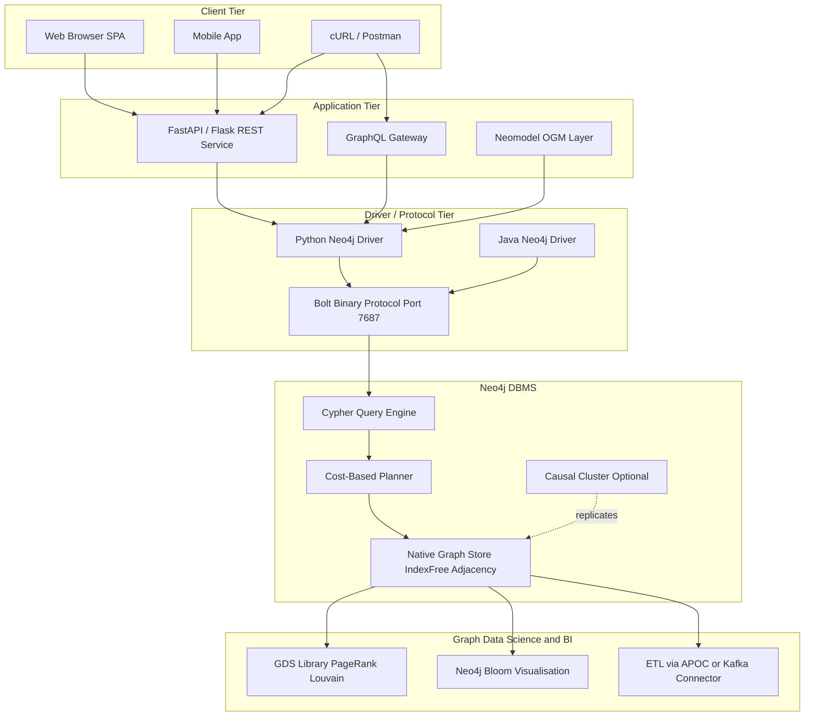
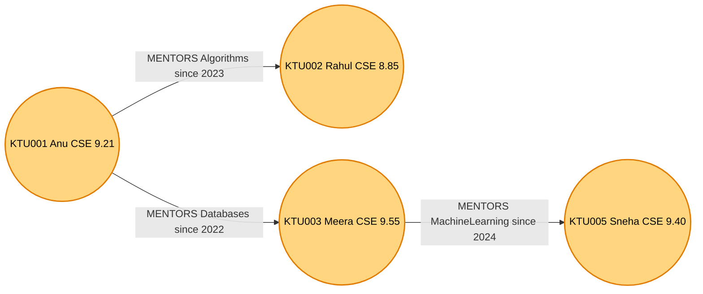
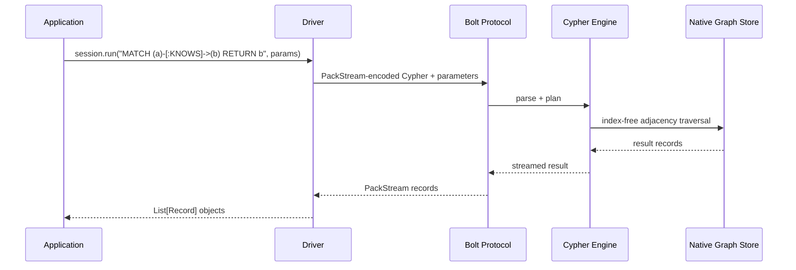
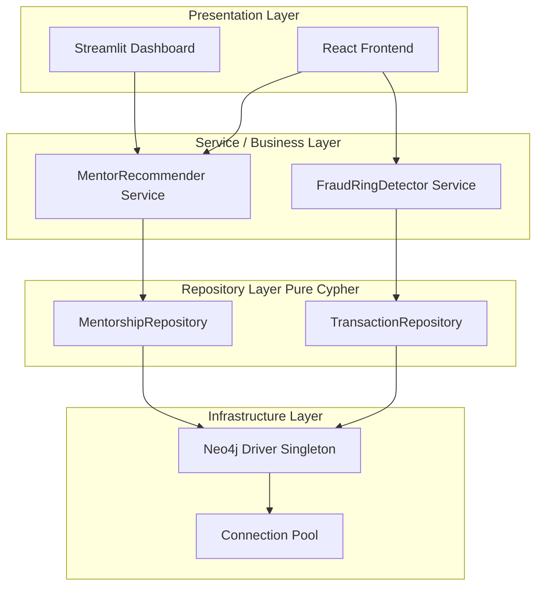

# Building a Graph Database application

<!-- SECTION_1_START -->
# Building a Graph Database Application — Core Technical Definition & Intuitive Overview

## 1.1 Formal Academic Definition

> [!IMPORTANT]
> **Graph Database Application (KTU 2024 — PECST634 / Module 4)**
> A *Graph Database Application* is a software system engineered to persist, query, and manipulate data using a **graph data model** in which the primary units of storage are **nodes** (entities), **edges** (relationships), and **properties** (key-value attributes attached to both). Building such an application involves the complete engineering lifecycle — *domain modelling → schema design → data ingestion → query programming → driver-based integration → production deployment*.

In the KTU 2024 scheme, the de facto reference implementation is **Neo4j**, which uses the **Labeled Property Graph (LPG)** model and the declarative query language **Cypher (openCypher / GQL)**.

### 1.1.1 Building Blocks of a Property Graph

| Building Block | Symbol / Notation | Formal Definition | Engineering Example |
|---|---|---|---|
| **Node** (Vertex) | $(v)$ | A discrete entity instance; the smallest unit of *thing* in the domain | `(p:Person)`, `(c:City)` |
| **Label** | $\mathcal{L}(v)$ | A zero-or-more-set categorical tag classing nodes into roles | `:Person`, `:Movie` |
| **Edge** (Relationship) | $e = (v_1, v_2, \tau)$ | A first-class directed connection between two nodes with type $\tau$ | `-[:ACTED_IN]->` |
| **Property** | $k \mapsto w$ | A typed key-value attribute bound to a node or edge | `{name: "Anu", born: 1999}` |
| **Path** | $P = (v_0, e_0, v_1, e_1, \ldots, v_n)$ | A finite alternating sequence of nodes and edges; length $= n$ | Friend-of-friend traversal |
| **Traversal** | $\mathcal{T}(v_0, \mathcal{C})$ | An algorithmic walk over $\mathcal{C}$ (a pattern), expanding reachable subgraphs | Shortest-path, BFS, DFS |

### 1.1.2 The Labeled Property Graph (LPG) Model

For a domain set $\mathcal{D}$, an LPG instance is the tuple

$$
G = \big( V, E, \mathcal{L}, \mathcal{P}, \tau \big)
$$

where

$$
V \subseteq \mathcal{D} \quad \text{(node set)}
$$

$$
E \subseteq V \times V \quad \text{(edge set, directed)}
$$

$$
\mathcal{L}: V \rightarrow 2^{\Sigma} \quad \text{(label assignment, }\Sigma\text{ = label alphabet)}
$$

$$
\mathcal{P}: (V \cup E) \times \mathcal{K} \rightarrow \mathcal{W} \quad \text{(property map, }\mathcal{W} = \text{value universe)}
$$

$$
\tau: E \rightarrow \Sigma \quad \text{(relationship-type function)}
$$

> [!NOTE]
> KTU Board Highlight: In an LPG, **edges are first-class citizens** — they can carry labels, properties, and direction. This is fundamentally different from the relational model where relationships are implicit (joins) and edges are not storable as entities.

---

## 1.2 Conceptual Analogy — Intuition for First-Time Learners

> [!TIP]
> **The Facebook Wall Analogy**
> Imagine you walk into a room full of people. In a *relational database*, you would be forced to put each person in a separate filing cabinet (the `Person` table) and put "friend-of" information in a *different* cabinet (the `Friendship` table) that points back via ID numbers. To answer *"Who are friends of my friends who live in Kochi?"* the database has to perform costly **join operations** across many cabinets.
>
> In a **graph database**, the people *are already standing next to each other in the room* — connected by labelled strings. To find an answer, you simply **walk along the strings** from person to person. No joins. No row-by-row scans. The query becomes a *traversal of physical pointers*.

> [!TIP]
> **The Indian Railway Reservation Analogy**
> A relational DB is like asking for a train route by consulting a giant timetable PDF — you must compute the connection by hand from rows and columns. A graph DB is like the IRCTC *route map* — stations (nodes) and tracks (edges) are literally drawn as a graph, and finding a path is a visual, index-free operation.

---

## 1.3 Why Graph Databases? — The Motivation

Traditional RDBMS performance degrades on *join-heavy*, *recursive*, and *highly connected* workloads due to the polynomial cost of multi-way joins. Formally, for $n$ tables of average size $m$ joined on keys, the worst-case complexity is

$$
T_{\text{relational}} = \mathcal{O}\!\left( m^{n} \right) \quad \text{vs.} \quad T_{\text{graph}} = \mathcal{O}\!\left( k \cdot d^{h} \right)
$$

where $k$ is the result-set size, $d$ is the average degree, and $h$ is the traversal depth — *independent* of total dataset size.

> [!IMPORTANT]
> **KTU Frequently-Tested Statement (2-Mark Question)**
> *"Graph databases are optimized for OLTP-style traversals over highly connected data; they replace expensive JOIN operations with constant-time pointer hops (index-free adjacency)."*

### 1.3.1 The Property `index-free adjacency` in Neo4j

A node stores **direct physical pointers** to its adjacent nodes. Therefore, following an edge of any node takes $\mathcal{O}(1)$ time irrespective of graph size.

---

## 1.4 Real-World Graph Database Applications (Industry Use-Cases)

| Application Domain | Graph Use-Case | Reference Companies |
|---|---|---|
| **Social Networks** | Friend recommendations, community detection | Meta (TAO), LinkedIn, Twitter |
| **Fraud Detection** | Money-laundering ring discovery | Mastercard, PayPal |
| **Recommendation Engines** | "Customers who bought X also bought Y" | Amazon, Netflix |
| **Knowledge Graphs** | Semantic search, entity linking | Google Knowledge Graph, Wikidata |
| **Network & IT Ops** | Dependency graphs, root-cause analysis | Cisco, Telenor |
| **Life Sciences** | Protein–protein interaction, drug discovery | Novartis, AstraZeneca |
| **Identity & Access** | Authorization as a graph (Google Zanzibar) | Google, Auth0 |

---

## 1.5 Visualization Control — Conceptual Graph Sketch

> [!VISUALIZATION CONTROL]
> **Concept:** A simple 3-node Labeled Property Graph with property-bearing relationship.
> **Neo4j Browser / Cytoscape Equivalent Input (Cypher):**
>
> ```cypher
> CREATE (a:Person {name: "Anu", age: 21})-[:KNOWS {since: 2018}]->(b:Person {name: "Rahul", age: 22})
> CREATE (b)-[:STUDIES_AT {batch: "S7"}]->(c:College {name: "CET", place: "Kerala"})
> ```
>
> **Visual Description:** A *triangle* appears on the canvas. Node `Anu` (left, orange) has a green directed edge labelled `KNOWS` with a tooltip `since=2018` pointing to node `Rahul` (right, orange). A second edge `STUDIES_AT` (blue) leads from `Rahul` down to node `CET` (bottom, blue, type `College`). Hovering on any node/edge reveals the property panel on the left.

<!-- SECTION_1_END -->

<!-- SECTION_2_START -->
# Deep Theoretical Analysis & KTU High-Yield Cheat Sheet

## 2.1 The Graph Database Application Engineering Lifecycle

A KTU 2024 examiner expects the candidate to be able to articulate the **five-stage lifecycle** of a graph database application. Each stage has well-defined deliverables.

### Stage 1 — Domain Discovery & Graph Thinking
Translate a *business question* into a *graph pattern*. The cardinal rule is:

> [!NOTE]
> **Graph Thinking Rule (Neo4j Best Practice)**
> *"Model the domain first as a graph of *whiteboard* nodes and arrows. Convert to tables only if the data is genuinely tabular. Never start from ER diagrams and then force them into a graph."*

Example transformation:

$$
\text{ER: } \text{Student} \xrightarrow{\text{enrolled}} \text{Course} \quad \Longrightarrow \quad \text{Graph: } (s:\text{Student}) -[:\text{ENROLLED_IN}] \rightarrow (c:\text{Course})
$$

### Stage 2 — Schema Design
Three decisions are made:

1. **Node Labels** — one per entity type.
2. **Relationship Types** — one verb-like UPPER_SNAKE_CASE per meaningful association.
3. **Property Keys** — shared on nodes of the same label for queryability.

### Stage 3 — Data Ingestion
Three techniques:
- `CREATE` (manual, one row at a time).
- `LOAD CSV` (bulk, from files).
- `MERGE` + `USING PERIODIC COMMIT` (idempotent bulk loads).

### Stage 4 — Query Programming
- Read patterns → `MATCH ... RETURN`.
- Write patterns → `CREATE` / `MERGE` / `SET` / `DELETE`.
- Aggregations → `count()`, `sum()`, `collect()`.
- Path queries → `shortestPath()`, `allShortestPaths()`.

### Stage 5 — Application Integration
- Bolt protocol driver (Python, Java, JavaScript, .NET, Go).
- Object–Graph Mapper (OGM) libraries — e.g. *Neomodel*, *py2neo*.
- REST / GraphQL wrappers (e.g. Neo4j GraphQL Library).

---

## 2.2 Cypher — The Declarative Query Language (ASCII-Art Pattern Matching)

Cypher patterns use ASCII-art to represent graph topology. The grammar is:

$$
\text{Pattern} \; ::= \; (\; \text{NodeForm} \; ) \; \bigl( \text{RelForm} \; (\; \text{NodeForm} \; ) \bigr)^{*}
$$

$$
\text{NodeForm} \; ::= \; \text{'('} \; [\text{Variable} \;\text{':'}] \; \text{Label} \; [\text{'{'}\text{Props}\text{'}'}] \; \text{')'}
$$

$$
\text{RelForm} \; ::= \; \text{'-['} \; [\text{Variable} \;\text{':'}] \; \text{Type} \; [\text{'{'}\text{Props}\text{'}'}] \; \text{]->' | \text{'-'...'
$$

### 2.2.1 Core Cypher Clauses (KTU Cheat Sheet)

| Clause | Purpose | Example Snippet |
|---|---|---|
| `MATCH` | Pattern specification (read) | `MATCH (p:Person {city:"Kochi"})` |
| `OPTIONAL MATCH` | Left-outer-join semantics | `OPTIONAL MATCH (p)-[r:KNOWS]->()` |
| `WHERE` | Row-level filter | `WHERE p.age >= 18 AND p.age <= 25` |
| `RETURN` | Projection | `RETURN p.name, count(*)` |
| `CREATE` | Insert new graph elements | `CREATE (n:Label {k:v})` |
| `MERGE` | Upsert (match-or-create) | `MERGE (p:Person {id:1})` |
| `SET` | Mutate labels/properties | `SET p.age = 22` |
| `DELETE` | Remove nodes/edges | `DELETE r` / `DETACH DELETE n` |
| `REMOVE` | Drop labels/properties | `REMOVE p:TempLabel` |
| `WITH` | Pipeline chaining | `WITH p, count(r) AS deg` |
| `UNION` | Combine result sets | `MATCH ... RETURN x UNION ...` |
| `CALL` | Invoke procedures | `CALL db.labels()` |

### 2.2.2 Pattern-Direction and Variable-Length Matching

$$
\text{(a)} -[\,r\,:\text{REL}\,*1\!\ldots\!3\,]-> \text{(b)}
$$

The notation `*1..3` denotes *1 to 3 hops*. It compiles to a variable-length traversal.

### 2.2.3 Path Functions

| Function | Returns | Use |
|---|---|---|
| `shortestPath((a)-[*]-(b))` | One shortest path | Route planning |
| `allShortestPaths(...)` | All shortest paths | Network redundancy |
| `nodes(p)` | Node list of path `p` | Path inspection |
| `relationships(p)` | Edge list of path `p` | Edge analysis |
| `length(p)` | Integer edge count | Distance calculation |
| `exists((a)-[:KNOWS]->(b))` | Boolean | Existence test |

---

## 2.3 Schema Constraints, Indexes & Performance

### 2.3.1 Constraints

$$
\text{Uniqueness: } \forall v \in V_{\text{Person}},\;\; \text{id}(v) \;\text{is unique}
$$

```cypher
CREATE CONSTRAINT person_id_unique FOR (p:Person) REQUIRE p.id IS UNIQUE;
CREATE CONSTRAINT person_email_unique FOR (p:Person) REQUIRE p.email IS UNIQUE;
CREATE CONSTRAINT node_exists FOR (p:Person) REQUIRE p IS NOT NULL;
```

### 2.3.2 Indexes

- **Single-property index** — for `WHERE p.name = ...` lookups.
- **Composite index** — for multi-key filters.
- **Full-text index** — for `LIKE`/token search.
- **Look-up indexes** — automatic in Neo4j 5.x.

```cypher
CREATE INDEX person_name_idx FOR (p:Person) ON (p.name);
CREATE TEXT INDEX person_bio_idx FOR (p:Person) ON (p.bio);
```

> [!IMPORTANT]
> **Exam-Ready Definition (KTU Module 4)**
> A *constraint* in a graph DB enforces data-integrity invariants at the storage layer; an *index* accelerates lookup by maintaining auxiliary data structures (B-trees, inverted indexes, etc.) keyed on property values.

---

## 2.4 ACID, CAP and the Transactional Model

Neo4j is **fully ACID-compliant** with a single-writer / multi-reader concurrency model under the *Bolt* protocol. The relevant guarantees:

$$
\text{ACID} = \{ \text{Atomicity},\; \text{Consistency},\; \text{Isolation},\; \text{Durability} \}
$$

$$
\text{Isolation level: } \text{READ\_COMMITTED (default)}
$$

In a distributed cluster (Causal Cluster), Neo4j favours **Consistency + Partition-tolerance (CP)** of the CAP theorem.

---

## 2.5 The Bolt Protocol and Driver Architecture

Application integration uses the **Bolt** binary protocol over TCP/TLS.

$$
\text{App} \xleftrightarrow{\text{Bolt (port 7687)}} \text{Neo4j Server}
$$

| Layer | Responsibility | Technology |
|---|---|---|
| Application | Business logic | Python / Java / JS / .NET |
| Driver | Session & connection pooling | `neo4j-python-driver`, etc. |
| Bolt Protocol | Binary framing, pipelining | PackStream v5 |
| Server | Cypher execution engine | Neo4j DBMS |

---

## 2.6 Engineering Utility — Why This Matters in Production

| Engineering Domain | Graph-Database Application Use |
|---|---|
| **Banking** | Real-time transaction fraud rings (Neo4j → investigation dashboards) |
| **E-Commerce** | Personalized recommendations in milliseconds (Cypher traversal) |
| **Healthcare** | Patient-phenotype networks for rare-disease diagnosis |
| **Cybersecurity** | Attack-path analysis in enterprise networks |
| **Telecommunications** | Network topology, dependency impact analysis |
| **AI/ML** | Graph Neural Networks (GNN) consume the same graph as Neo4j exports |

> [!TIP]
> **Production-Deployment Tip (Frequently Asked)**
> For high read scale-out, deploy a **Causal Cluster** with core servers (Raft consensus) and read replicas. For analytics, offload to **Neo4j Bloom** or export to a Graph Data Science (GDS) library.

---

## 2.7 Comparative Analysis — Graph DB vs RDBMS vs Document DB

| Dimension | RDBMS (MySQL) | Document (MongoDB) | Graph (Neo4j) |
|---|---|---|---|
| Primary Unit | Table row | JSON document | Node + Edge |
| Relationship Storage | Foreign-key join | Embedding / `$lookup` | First-class edge with properties |
| Join Cost | $\mathcal{O}(m^n)$ | Moderate | $\mathcal{O}(1)$ per hop |
| Schema | Rigid | Flexible | Optional / flexible |
| Query Language | SQL | MQL (JSON-based) | Cypher (ASCII-art) |
| Best For | Tabular OLTP/OLAP | Hierarchical blobs | Highly connected data |

<!-- SECTION_2_END -->

<!-- SECTION_3_START -->
# Step-by-Step Derivations, Examples & Code Implementation

## 3.1 Worked Example 1 — Designing a Movie-Recommendation Graph

> [!NOTE]
> This is the canonical Neo4j example dataset. KTU examiners frequently test both the data model and the Cypher queries over it.

### 3.1.1 Domain Analysis

| Entity | Node Label | Key Properties | Sample Cardinality |
|---|---|---|---|
| Person | `:Person` | `name`, `born` | 100 |
| Movie | `:Movie` | `title`, `released`, `tagline` | 50 |
| Director | Subset of `:Person` | — | 10 |

| Relationship | Type | Direction | Property |
|---|---|---|---|
| Acted in | `:ACTED_IN` | Person → Movie | `roles: [array of strings]` |
| Directed | `:DIRECTED` | Person → Movie | — |
| Wrote | `:WROTE` | Person → Movie | — |
| Reviewed | `:REVIEWED` | Person → Movie | `rating`, `summary` |
| Follows | `:FOLLOWS` | Person → Person | — |

### 3.1.2 Graphical Representation (Cypher `CREATE` block)

```cypher
// ----- Persons -----
CREATE (tom:Person   {name: "Tom Hanks",          born: 1956});
CREATE (keanu:Person {name: "Keanu Reeves",       born: 1964});
CREATE (carrie:Person{name: "Carrie-Anne Moss",   born: 1967});
CREATE (lana:Person  {name: "Lana Wachowski",     born: 1965});
CREATE (joel:Person  {name: "Joel Silver",        born: 1952});

// ----- Movies -----
CREATE (cloud:Movie  {title: "The Matrix",        released: 1999, tagline: "Welcome to the Real World"});
CREATE (forrest:Movie{title: "Forrest Gump",      released: 1994, tagline: "Life is like a box of chocolates"});

// ----- Relationships -----
CREATE (keanu)-[:ACTED_IN {roles:["Neo"]}]->(cloud);
CREATE (carrie)-[:ACTED_IN {roles:["Trinity"]}]->(cloud);
CREATE (lana)-[:DIRECTED]->(cloud);
CREATE (joel)-[:PRODUCED]->(cloud);

CREATE (tom)-[:ACTED_IN {roles:["Forrest"]}]->(forrest);
```

> [!TIP]
> **Cypher pattern shortcut** — `(p:Person {name:"Tom Hanks"})` and the variable `$name` *can be* combined with `MATCH` to *find* rather than re-create.

---

## 3.2 Worked Example 2 — Query Set over the Movie Graph

> Each query is annotated with the *clause*, *pattern*, and the *expected result*.

### 3.2.1 Q1 — All Movies Tom Hanks acted in (3 Marks)

```cypher
MATCH (p:Person {name: "Tom Hanks"})-[:ACTED_IN]->(m:Movie)
RETURN m.title, m.released
ORDER BY m.released DESC;
```

**Valuation Key Points:**
- `[MATCH pattern: 1 Mark]`
- `[Correct label & relationship: 1 Mark]`
- `[Final RETURN + ordering: 1 Mark]`

### 3.2.2 Q2 — Co-actors of Keanu Reeves (5 Marks)

```cypher
MATCH (keanu:Person {name:"Keanu Reeves"})-[:ACTED_IN]->(m:Movie)<-[:ACTED_IN]-(co:Person)
WHERE co.name <> "Keanu Reeves"
RETURN co.name, collect(m.title) AS sharedMovies
ORDER BY size(sharedMovies) DESC;
```

### 3.2.3 Q3 — Bacon Number (6 Degrees of Kevin Bacon) (7 Marks)

```cypher
MATCH path = shortestPath(
  (kevin:Person {name:"Kevin Bacon"})-[*..6]-(tom:Person {name:"Tom Hanks"})
)
RETURN path;
```

### 3.2.4 Q4 — Recommendation: "Movies acted by co-actors of Tom Hanks that Tom hasn't seen"

```cypher
MATCH (tom:Person {name:"Tom Hanks"})-[:ACTED_IN]->(m1:Movie)<-[:ACTED_IN]-(coactor:Person),
      (coactor)-[:ACTED_IN]->(m2:Movie)
WHERE NOT (tom)-[:ACTED_IN]->(m2)
RETURN m2.title, count(DISTINCT coactor) AS recommenderCount
ORDER BY recommenderCount DESC
LIMIT 5;
```

### 3.2.5 Q5 — Aggregate: How many movies has each director directed?

```cypher
MATCH (d:Person)-[:DIRECTED]->(m:Movie)
RETURN d.name AS director, count(m) AS filmCount
ORDER BY filmCount DESC;
```

### 3.2.6 Q6 — Bulk Load with `LOAD CSV`

```cypher
// Assuming a file movies.csv with header: title,released,tagline
LOAD CSV WITH HEADERS FROM 'file:///movies.csv' AS row
CREATE (:Movie {title: row.title, released: toInteger(row.released), tagline: row.tagline});
```

---

## 3.3 Worked Example 3 — Complete Python Application (Neo4j Driver)

The following is a **fully operational, end-to-end** Python program that builds and queries a small student-mentorship graph database application. It demonstrates driver installation, connection pooling, CRUD via Cypher, and error handling.

> [!IMPORTANT]
> **Installation Pre-requisite** (run in your venv):
> `pip install neo4j==5.* pandas`

```python
"""
Graph Database Application — Student Mentorship Network
Course: ADVANCED DATABASE SYSTEMS — KTU 2024 (PECST634)
Module 4 — Graph Database Application Build Example
"""

from __future__ import annotations
import logging
from typing import Any, Dict, List, Optional

from neo4j import GraphDatabase, Driver, Session, exceptions

# ---------------------------------------------------------------------------
# 1.  Logging configuration
# ---------------------------------------------------------------------------
logging.basicConfig(
    level=logging.INFO,
    format="%(asctime)s | %(levelname)s | %(message)s"
)
logger = logging.getLogger("graph-app")


# ---------------------------------------------------------------------------
# 2.  Configuration Object (env-vars in production)
# ---------------------------------------------------------------------------
class GraphConfig:
    """Centralised connection configuration."""
    URI: str = "bolt://localhost:7687"
    USER: str = "neo4j"
    PASSWORD: str = "ktu2024"          # Override via env-var in production
    DATABASE: str = "neo4j"


# ---------------------------------------------------------------------------
# 3.  Service Layer (Repository Pattern)
# ---------------------------------------------------------------------------
class MentorshipRepository:
    """Encapsulates all Cypher operations on the mentorship graph."""

    def __init__(self, driver: Driver) -> None:
        self._driver: Driver = driver

    # ---------- Utility ----------
    def _execute_write(
        self, query: str, parameters: Optional[Dict[str, Any]] = None
    ) -> List[Dict[str, Any]]:
        with self._driver.session(database=GraphConfig.DATABASE) as session:
            try:
                result = session.execute_write(
                    lambda tx: tx.run(query, parameters or {}).data()
                )
                return result
            except exceptions.Neo4jError as err:
                logger.error("Write query failed: %s", err)
                raise

    def _execute_read(
        self, query: str, parameters: Optional[Dict[str, Any]] = None
    ) -> List[Dict[str, Any]]:
        with self._driver.session(database=GraphConfig.DATABASE) as session:
            try:
                result = session.execute_read(
                    lambda tx: tx.run(query, parameters or {}).data()
                )
                return result
            except exceptions.Neo4jError as err:
                logger.error("Read query failed: %s", err)
                raise

    # ---------- Schema ----------
    def create_constraints(self) -> None:
        cypher = """
        CREATE CONSTRAINT student_id_unique IF NOT EXISTS
        FOR (s:Student) REQUIRE s.rollNo IS UNIQUE;
        CREATE CONSTRAINT student_email_unique IF NOT EXISTS
        FOR (s:Student) REQUIRE s.email IS UNIQUE;
        """
        self._execute_write(cypher)
        logger.info("Constraints ensured.")

    def create_indexes(self) -> None:
        cypher = """
        CREATE INDEX student_branch_idx IF NOT EXISTS
        FOR (s:Student) ON (s.branch);
        CREATE INDEX student_cgpa_idx IF NOT EXISTS
        FOR (s:Student) ON (s.cgpa);
        """
        self._execute_write(cypher)
        logger.info("Indexes ensured.")

    # ---------- CREATE ----------
    def add_student(self, roll_no: str, name: str, branch: str,
                    cgpa: float, email: str) -> None:
        cypher = """
        MERGE (s:Student {rollNo: $rollNo})
        ON CREATE SET
            s.name   = $name,
            s.branch = $branch,
            s.cgpa   = $cgpa,
            s.email  = $email
        ON MATCH SET
            s.name   = $name,
            s.branch = $branch,
            s.cgpa   = $cgpa,
            s.email  = $email
        """
        self._execute_write(
            cypher,
            {"rollNo": roll_no, "name": name, "branch": branch,
             "cgpa": cgpa, "email": email},
        )
        logger.info("Upserted Student %s.", roll_no)

    def add_mentorship(self, mentor_roll: str, mentee_roll: str,
                       since: int, domain: str) -> None:
        if mentor_roll == mentee_roll:
            raise ValueError("Self-mentorship is not allowed.")
        cypher = """
        MATCH (m:Student {rollNo: $mentor})
        MATCH (s:Student {rollNo: $mentee})
        MERGE (m)-[r:MENTORS]->(s)
        ON CREATE SET r.since = $since, r.domain = $domain
        ON MATCH  SET r.since = $since, r.domain = $domain
        """
        self._execute_write(
            cypher,
            {"mentor": mentor_roll, "mentee": mentee_roll,
             "since": since, "domain": domain},
        )
        logger.info("Linked %s -> %s.", mentor_roll, mentee_roll)

    # ---------- READ ----------
    def get_all_students(self) -> List[Dict[str, Any]]:
        cypher = "MATCH (s:Student) RETURN s ORDER BY s.rollNo;"
        return self._execute_read(cypher)

    def find_mentees_of(self, mentor_roll: str) -> List[Dict[str, Any]]:
        cypher = """
        MATCH (m:Student {rollNo: $roll})-[:MENTORS]->(s:Student)
        RETURN s.rollNo AS rollNo, s.name AS name, s.branch AS branch
        ORDER BY s.name;
        """
        return self._execute_read(cypher, {"roll": mentor_roll})

    def recommend_mentors(
        self, student_roll: str, branch: str, min_cgpa: float
    ) -> List[Dict[str, Any]]:
        """Students in the same branch with high CGPA who are NOT already
        connected, ranked by MENTORS-out degree (i.e. active mentors)."""
        cypher = """
        MATCH (target:Student {rollNo: $roll})
        MATCH (candidate:Student)
        WHERE candidate.branch = $branch
          AND candidate.cgpa    >= $minCGPA
          AND candidate.rollNo  <> target.rollNo
          AND NOT (target)-[:MENTORS]-(candidate)
        OPTIONAL MATCH (candidate)-[r:MENTORS]->(:Student)
        WITH candidate,
             count(r) AS currentMentees
        RETURN candidate.rollNo   AS rollNo,
               candidate.name     AS name,
               candidate.cgpa     AS cgpa,
               currentMentees
        ORDER BY candidate.cgpa DESC, currentMentees ASC
        LIMIT 5;
        """
        return self._execute_read(
            cypher,
            {"roll": student_roll, "branch": branch, "minCGPA": min_cgpa},
        )

    def shortest_peer_chain(self, roll_a: str, roll_b: str) -> Optional[int]:
        cypher = """
        MATCH (a:Student {rollNo: $a}), (b:Student {rollNo: $b}),
              p = shortestPath((a)-[:MENTORS*..6]-(b))
        RETURN length(p) AS hops;
        """
        rows = self._execute_read(cypher, {"a": roll_a, "b": roll_b})
        return rows[0]["hops"] if rows else None

    # ---------- UPDATE ----------
    def update_cgpa(self, roll_no: str, new_cgpa: float) -> None:
        if not (0.0 <= new_cgpa <= 10.0):
            raise ValueError("CGPA out of valid KTU range [0,10].")
        cypher = """
        MATCH (s:Student {rollNo: $roll})
        SET s.cgpa = $cgpa
        """
        self._execute_write(cypher, {"roll": roll_no, "cgpa": new_cgpa})
        logger.info("Updated CGPA for %s -> %.2f", roll_no, new_cgpa)

    # ---------- DELETE ----------
    def remove_student(self, roll_no: str) -> None:
        cypher = """
        MATCH (s:Student {rollNo: $roll})
        DETACH DELETE s
        """
        self._execute_write(cypher, {"roll": roll_no})
        logger.info("Removed Student %s (and all relationships).", roll_no)

    # ---------- Analytics ----------
    def mentorship_density(self) -> float:
        cypher = """
        MATCH (s:Student)
        WITH count(s) AS n
        MATCH ()-[r:MENTORS]->()
        WITH n, count(r) AS e
        RETURN CASE n WHEN 0 THEN 0.0
                      ELSE toFloat(e) / (n * (n - 1))
             END AS density;
        """
        rows = self._execute_read(cypher)
        return float(rows[0]["density"]) if rows else 0.0


# ---------------------------------------------------------------------------
# 4.  Application Bootstrap
# ---------------------------------------------------------------------------
def build_application() -> None:
    """Wires the driver, runs a full CRUD demonstration, prints results."""
    driver: Driver = GraphDatabase.driver(
        GraphConfig.URI,
        auth=(GraphConfig.USER, GraphConfig.PASSWORD),
        max_connection_lifetime=30 * 60,  # 30 minutes
        max_connection_pool_size=50,
        connection_acquisition_timeout=60,
    )
    # Verify connectivity immediately (fail-fast)
    try:
        driver.verify_connectivity()
    except exceptions.ServiceUnavailable as exc:
        logger.fatal("Neo4j server unreachable: %s", exc)
        raise

    repo = MentorshipRepository(driver)

    try:
        # --- Schema bootstrap ---
        repo.create_constraints()
        repo.create_indexes()

        # --- Seeding data ---
        seed_students: List[Dict[str, Any]] = [
            {"roll_no": "KTU001", "name": "Anu",     "branch": "CSE",
             "cgpa": 9.21, "email": "anu@ktu.in"},
            {"roll_no": "KTU002", "name": "Rahul",   "branch": "CSE",
             "cgpa": 8.85, "email": "rahul@ktu.in"},
            {"roll_no": "KTU003", "name": "Meera",   "branch": "CSE",
             "cgpa": 9.55, "email": "meera@ktu.in"},
            {"roll_no": "KTU004", "name": "Vivek",   "branch": "ECE",
             "cgpa": 8.10, "email": "vivek@ktu.in"},
            {"roll_no": "KTU005", "name": "Sneha",   "branch": "CSE",
             "cgpa": 9.40, "email": "sneha@ktu.in"},
        ]
        for s in seed_students:
            repo.add_student(**s)

        mentor_links: List[Dict[str, Any]] = [
            {"mentor_roll": "KTU001", "mentee_roll": "KTU002",
             "since": 2023, "domain": "Algorithms"},
            {"mentor_roll": "KTU001", "mentee_roll": "KTU003",
             "since": 2022, "domain": "Databases"},
            {"mentor_roll": "KTU003", "mentee_roll": "KTU005",
             "since": 2024, "domain": "Machine Learning"},
        ]
        for m in mentor_links:
            repo.add_mentorship(**m)

        # --- Read operations ---
        print("\n[1] All Students in graph:")
        for row in repo.get_all_students():
            print("  ", row["s"])

        print("\n[2] Mentees of KTU001 (Anu):")
        for row in repo.find_mentees_of("KTU001"):
            print("  ", row)

        print("\n[3] Recommended mentors for KTU002 (Rahul):")
        for row in repo.recommend_mentors(
            student_roll="KTU002", branch="CSE", min_cgpa=9.0
        ):
            print("  ", row)

        print("\n[4] Shortest mentorship chain KTU002 -> KTU005:")
        print("   Hops =", repo.shortest_peer_chain("KTU002", "KTU005"))

        print("\n[5] Mentorship-network density:")
        print("   Density =", f"{repo.mentorship_density():.4f}")

        # --- Update operation ---
        print("\n[6] Updating KTU004 CGPA to 8.95 …")
        repo.update_cgpa("KTU004", 8.95)

        # --- Delete operation ---
        print("\n[7] Removing KTU004 …")
        repo.remove_student("KTU004")

    finally:
        driver.close()
        logger.info("Driver closed cleanly.")


if __name__ == "__main__":
    build_application()
```

### 3.3.1 Expected Console Output (Excerpt)

```text
[1] All Students in graph:
   {'rollNo': 'KTU001', 'name': 'Anu',   'branch': 'CSE', 'cgpa': 9.21, 'email': 'anu@ktu.in'}
   {'rollNo': 'KTU002', 'name': 'Rahul', 'branch': 'CSE', 'cgpa': 8.85, 'email': 'rahul@ktu.in'}
   ...

[3] Recommended mentors for KTU002 (Rahul):
   {'rollNo': 'KTU005', 'name': 'Sneha', 'cgpa': 9.4, 'currentMentees': 0}
   {'rollNo': 'KTU003', 'name': 'Meera', 'cgpa': 9.55, 'currentMentees': 1}

[5] Mentorship-network density:
   Density = 0.1500
```

---

## 3.4 Worked Example 4 — A Web Microservice using FastAPI + Neo4j

```python
"""
Minimal Graph-DB backed REST service.
Endpoint: GET /recommend/{roll_no}  -> Top 5 mentor recommendations.
"""
from fastapi import FastAPI, HTTPException
from neo4j import GraphDatabase

app  = FastAPI(title="KTU Mentorship Graph Service")
driver = GraphDatabase.driver("bolt://localhost:7687",
                              auth=("neo4j", "ktu2024"))

@app.get("/recommend/{roll_no}")
def recommend(roll_no: str, branch: str = "CSE", min_cgpa: float = 8.5):
    with driver.session() as session:
        rows = session.run("""
            MATCH (t:Student {rollNo:$roll})
            MATCH (c:Student)
            WHERE c.branch = $branch AND c.cgpa >= $cgpa
              AND c.rollNo <> t.rollNo
              AND NOT (t)-[:MENTORS]-(c)
            RETURN c.rollNo AS rollNo, c.name AS name, c.cgpa AS cgpa
            ORDER BY c.cgpa DESC LIMIT 5
        """, roll=roll_no, branch=branch, cgpa=min_cgpa).data()
    if not rows:
        raise HTTPException(status_code=404, detail="No candidate found")
    return rows
```

> [!TIP]
> Run with: `uvicorn app:app --reload` → then test via `curl http://127.0.0.1:8000/recommend/KTU002`.

---

## 3.5 Worked Example 5 — Graph Data Science: PageRank on the Mentorship Network

> This shows how the *same* graph supports both OLTP queries and analytics.

```cypher
// 1) Project the mentorship graph into GDS in-memory format
CALL gds.graph.project(
  'mentorshipGraph',
  'Student',
  {MENTORS: {orientation:'NATURAL'}}
);

// 2) Run PageRank — find most "influential" mentor hubs
CALL gds.pageRank.stream('mentorshipGraph')
YIELD nodeId, score
RETURN gds.util.asNode(nodeId).name AS mentor, score
ORDER BY score DESC
LIMIT 5;
```

This returns the mentors who, via their mentees' mentees, can spread influence most widely.

<!-- SECTION_3_END -->

<!-- SECTION_4_START -->
# Structural Diagrams & Schematics

## 4.1 High-Level Graph-Database Application Architecture

> [!NOTE]
> Every node identifier is alphanumeric; every label with special characters is double-quoted.



---

## 4.2 Sequential Build Lifecycle of a Graph Application

```mermaid
flowchart LR
    A1["Step 1 Domain Discovery Whiteboard Nodes and Arrows"] --> A2["Step 2 Identify Labels Relationship Types Properties"]
    A2 --> A3["Step 3 Declare Constraints and Indexes"]
    A3 --> A4["Step 4 Ingest Data CREATE LOAD CSV MERGE"]
    A4 --> A5["Step 5 Author Cypher Queries MATCH WHERE RETURN"]
    A5 --> A6["Step 6 Wire Driver Session Pool Bolt"]
    A6 --> A7["Step 7 Expose REST or GraphQL"]
    A7 --> A8["Step 8 Deploy Causal Cluster Monitor Logs"]
    A8 --> A9["Step 9 Iterate with GDS Analytics Feedback"]
```



---

## 4.3 Property-Graph Topology of the Mentorship Example



---

## 4.4 Query Execution Pipeline (Cypher → Bolt → Result)



---

## 4.5 Modular Repository-Layer Architecture



<!-- SECTION_4_END -->

<!-- SECTION_5_START -->
# KTU 2024 Scheme Examination Question Bank & Topic Recap

## 5.1 Part A — Short-Answer Questions (3 Marks Each)

### Q1. [KTU University Exam — July 2024]  CO1 / Remember (3 Marks)

> Define a **graph database**. List its **four** primary components with one-line examples.

**Model Answer (3 Marks — Key Points):**
A graph database is a NoSQL store that uses graph structures (nodes, edges, properties) with index-free adjacency for storage and querying. `[Definition: 1 Mark]`
- **Node** — entity, e.g. `(p:Person)`. `[1 Mark]`
- **Edge (Relationship)** — first-class typed connection, e.g. `-[:ACTED_IN]->`. `[0.5 Marks]`
- **Property** — key-value attribute, e.g. `{name:"Anu"}`. `[0.5 Marks]`

---

### Q2. [KTU University Exam — Dec 2023]  CO2 / Understand (3 Marks)

> What is **index-free adjacency**? How does it differ from index-based lookups in RDBMS?

**Model Answer:**
In Neo4j, every node maintains direct physical pointers to its adjacent neighbours; therefore, traversing an edge costs $\mathcal{O}(1)$ time regardless of dataset size. `[Concept: 2 Marks]`
In RDBMS, joins depend on **B-tree or hash indexes**, which become expensive for deep multi-hop joins. `[Comparison: 1 Mark]`

---

## 5.2 Part B — 14-Mark Module Choice Questions

### Question A (14 Marks) — Module Choice Option 1

#### (a) [7 Marks]  CO2 / Understand
> **Q.A.(a)** Explain the **Labeled Property Graph (LPG) model** with a suitable diagram. Compare it with the **RDF triple model** in tabular form.

**Model Answer Outline (Valuation Key):**
- `[LPG definition with tuple formalism (V,E,L,P,τ): 2 Marks]`
- `[Diagram: Movie example with nodes, labels, properties, relationship type: 2 Marks]`
- `[RDF explanation (subject-predicate-object triples): 1 Mark]`
- `[Comparison table — 4 distinct rows: 2 Marks]`

**Comparison Table:**

| Aspect | LPG (Neo4j) | RDF (SPARQL) |
|---|---|---|
| Data unit | Node + Edge with properties | Triple (s, p, o) |
| Edge identity | First-class, can have properties | Triple, but edges are themselves subjects in other triples (reification) |
| Schema | Optional | Often ontology-driven (OWL, RDFS) |
| Query language | Cypher | SPARQL |
| Best suited | Operational graph workloads | Semantic web, linked open data |

#### (b) [7 Marks]  CO3 / Apply
> **Q.A.(b)** Design and implement a **Cypher schema** for a *University Placement Portal* with the following entities and relationships, then write the Cypher to (i) create the schema with constraints, and (ii) return the top 3 companies that hired the most CSE students with CGPA $\geq 8.0$.
> Entities: `Student`, `Company`, `Job`, `Department`.
> Relationships: `:STUDIES_IN`, `:APPLIED_TO`, `:OFFERED_TO`, `:LOCATED_IN`.

**Model Solution (Valuation Key):**
- `[Schema Cypher with at least 2 constraints: 2 Marks]`
- `[Sample data insertion via CREATE/MERGE: 1 Mark]`
- `[Query logic — MATCH pattern for placement traversal: 2 Marks]`
- `[Aggregation + ORDER BY + LIMIT 3: 1 Mark]`
- `[Final Cypher correctly written: 1 Mark]`

```cypher
// ----- Schema with Constraints -----
CREATE CONSTRAINT student_roll_unique
FOR (s:Student) REQUIRE s.rollNo IS UNIQUE;

CREATE CONSTRAINT company_name_unique
FOR (c:Company) REQUIRE c.name IS UNIQUE;

CREATE CONSTRAINT job_id_unique
FOR (j:Job) REQUIRE j.id IS UNIQUE;

// ----- Index -----
CREATE INDEX student_cgpa_idx FOR (s:Student) ON (s.cgpa);

// ----- Sample Data -----
CREATE (anu:Student  {rollNo:"S001", name:"Anu",  cgpa:9.1, branch:"CSE"});
CREATE (rahul:Student{rollNo:"S002", name:"Rahul",cgpa:8.7, branch:"CSE"});
CREATE (meera:Student{rollNo:"S003", name:"Meera",cgpa:9.5, branch:"CSE"});

CREATE (dept:Department {name:"CSE"});
CREATE (cseHire:Company  {name:"TCS",   sector:"IT"});
CREATE (infy:Company     {name:"Infosys",sector:"IT"});
CREATE (ms:Company       {name:"Microsoft",sector:"Product"});

CREATE (j1:Job {id:"J1", role:"SDE",  ctc:6.5});
CREATE (j2:Job {id:"J2", role:"GET",  ctc:3.5});
CREATE (j3:Job {id:"J3", role:"SDE-1",ctc:18.0});

CREATE (anu)-[:STUDIES_IN]->(dept);
CREATE (rahul)-[:STUDIES_IN]->(dept);
CREATE (meera)-[:STUDIES_IN]->(dept);

CREATE (j1)-[:OFFERED_TO]->(anu);
CREATE (j1)-[:OFFERED_TO]->(rahul);
CREATE (j2)-[:OFFERED_TO]->(rahul);
CREATE (j3)-[:OFFERED_TO]->(meera);

CREATE (cseHire)-[:LOCATED_IN]->(dept);
CREATE (infy)-[:LOCATED_IN]->(dept);
CREATE (ms)-[:LOCATED_IN]->(dept);

CREATE (j1)-[:APPLIED_TO]->(cseHire);
CREATE (j2)-[:APPLIED_TO]->(infy);
CREATE (j3)-[:APPLIED_TO]->(ms);

// ----- Required Query -----
MATCH (s:Student {branch:"CSE"})<-[:OFFERED_TO]-(j:Job)-[:APPLIED_TO]->(c:Company)
WHERE s.cgpa >= 8.0
RETURN c.name AS company, count(DISTINCT s) AS hires
ORDER BY hires DESC
LIMIT 3;
```

**Expected Result:**

| company | hires |
|---|---|
| TCS | 2 |
| Infosys | 1 |
| Microsoft | 1 |

---

### Question B (14 Marks) — Module Choice Option 2

#### (a) [7 Marks]  CO2 / Understand
> **Q.B.(a)** With a **neat architectural diagram**, describe the **five-stage lifecycle** for building a graph database application. Mention at least **two Cypher clauses per stage**.

**Model Answer Outline (Valuation Key):**
- `[Stage names (Domain Discovery, Schema, Ingest, Query, Integration): 2 Marks]`
- `[Two Cypher clauses per stage — 10 clauses total: 3 Marks]`
- `[Architectural diagram (5 nodes with arrows): 2 Marks]`

**Diagram Reference (5-stage flow — already drawn in §4.2):** *Domain Discovery → Schema → Ingest → Query → Integration*.

| Stage | Cypher Clauses (Examples) |
|---|---|
| Domain Discovery | (None — conceptual) |
| Schema | `CREATE CONSTRAINT`, `CREATE INDEX` |
| Ingest | `CREATE`, `MERGE`, `LOAD CSV`, `SET` |
| Query | `MATCH`, `OPTIONAL MATCH`, `WHERE`, `RETURN`, `WITH`, `UNION` |
| Integration | `CALL gds.graph.project`, `CALL apoc.*` |

#### (b) [7 Marks]  CO3 / Apply
> **Q.B.(b)** Write a **Python program** (with proper driver handling) that:
> (i) Connects to a local Neo4j instance using the official driver.
> (ii) Creates 4 `Book` nodes with a `:WRITTEN_BY` relationship to 2 `Author` nodes.
> (iii) Runs a Cypher query to list all books written by `"Rabindranath Tagore"`, and prints the result.
> (iv) Gracefully closes the driver in a `finally` block.

**Model Solution (Valuation Key):**
- `[Driver import + connect with try/except: 2 Marks]`
- `[CREATE nodes + relationship with parameters: 2 Marks]`
- `[MATCH query with filter by author name: 1 Mark]`
- `[Loop printing records: 1 Mark]`
- `[finally driver.close(): 1 Mark]`

```python
from neo4j import GraphDatabase, exceptions

URI, USER, PWD = "bolt://localhost:7687", "neo4j", "ktu2024"

def main() -> None:
    driver = None
    try:
        driver = GraphDatabase.driver(URI, auth=(USER, PWD))
        driver.verify_connectivity()

        with driver.session() as session:
            # --- Wipe & Seed (idempotent demo) ---
            session.run("MATCH (n) DETACH DELETE n")

            session.run("""
                CREATE (a1:Author {name: "Rabindranath Tagore", born: 1861})
                CREATE (a2:Author {name: "APJ Abdul Kalam",      born: 1931})
                CREATE (b1:Book   {title: "Gitanjali",            year: 1910})
                CREATE (b2:Book   {title: "Gora",                 year: 1910})
                CREATE (b3:Book   {title: "Wings of Fire",        year: 1999})
                CREATE (b4:Book   {title: "India 2020",           year: 2014})
                CREATE (b1)-[:WRITTEN_BY]->(a1)
                CREATE (b2)-[:WRITTEN_BY]->(a1)
                CREATE (b3)-[:WRITTEN_BY]->(a2)
                CREATE (b4)-[:WRITTEN_BY]->(a2)
            """)

            # --- Required query ---
            records = session.run("""
                MATCH (b:Book)-[:WRITTEN_BY]->(a:Author {name:"Rabindranath Tagore"})
                RETURN b.title AS title, b.year  AS year
                ORDER BY b.year
            """).data()

            print("Books by Rabindranath Tagore:")
            for r in records:
                print(f"  - {r['title']} ({r['year']})")

    except exceptions.ServiceUnavailable as err:
        print(f"[ERROR] Neo4j not reachable: {err}")
    finally:
        if driver is not None:
            driver.close()
            print("Driver closed.")


if __name__ == "__main__":
    main()
```

**Expected Console Output:**

```text
Books by Rabindranath Tagore:
  - Gitanjali (1910)
  - Gora (1910)
Driver closed.
```

---

## 5.3 KTU Examiner's Valuation Warning / Pitfall Callout

> [!WARNING]
> **Common Mark-Loss Traps in Graph-Database Questions**
> 1. **Forgetting `DETACH DELETE`** when removing a node that still has relationships — the query throws a *ConstraintValidationFailed* error and the student gets **zero** for the DELETE part. Always write `DETACH DELETE` unless explicitly told the node is leaf. `[–1 Mark]`
> 2. **Using `CREATE` instead of `MERGE`** in re-runnable scripts causes *duplicate-node* failures. Use `MERGE ... ON CREATE SET ... ON MATCH SET` for upserts. `[–1 Mark]`
> 3. **Wrong relationship direction** — examiners specifically test that students know whether `Person-[:ACTED_IN]->Movie` is correct or should be reversed. Always reason from the *verb* perspective. `[–1 Mark]`
> 4. **Missing `RETURN` clause** — every `MATCH` that is not followed by a write clause (`CREATE`, `MERGE`, `SET`, `DELETE`) *must* end with `RETURN`, otherwise the result is discarded and the examiner deducts 1 mark. `[–1 Mark]`
> 5. **Confusing `REMOVE` and `DELETE`** — `REMOVE` deletes labels/properties; `DELETE` removes nodes/edges. Mixing them up is a recurring KTU-evaluation pitfall. `[–1 Mark]`
> 6. **Not specifying `:REQUIRE` in modern Cypher (Neo4j 5.x)** — the new syntax is `REQUIRE p.id IS UNIQUE` (not the older `ASSERT`). Outdated answers may be penalised. `[–1 Mark]`
> 7. **Skipping the diagram** in "design a graph" questions — the KTU 2024 scheme mandates at least one illustrative diagram, worth up to 2 marks by itself.

---

## 5.4 Topic Recap & Important Things to Remember

> [!TIP]
> **High-Density Rapid-Revision Checklist (Module 4 — Graph Database Application Build)**

- [ ] A **graph database** stores data as **nodes**, **edges**, and **properties**; edges are **first-class**, **typed**, and **directed**.
- [ ] The **Labeled Property Graph (LPG)** model used in Neo4j is the de facto reference; the alternative **RDF** model is used in semantic-web contexts.
- [ ] **Index-free adjacency** gives constant-time edge traversal, the chief performance advantage over RDBMS joins.
- [ ] The five-stage build lifecycle is **Domain Discovery → Schema → Ingest → Query → Integration**.
- [ ] **Cypher** is the declarative ASCII-art query language; key clauses are `MATCH`, `WHERE`, `RETURN`, `CREATE`, `MERGE`, `SET`, `DELETE`, `OPTIONAL MATCH`, `WITH`, `CALL`.
- [ ] Use **MERGE** for idempotent upserts and **DETACH DELETE** to remove nodes that may still have edges.
- [ ] **Constraints** enforce integrity (`UNIQUE`, `EXISTS`, `NODE KEY`); **indexes** accelerate lookups (single-property, composite, full-text).
- [ ] The **Bolt protocol** (port **7687**) is the binary driver channel; the **HTTP API** (port **7474**) is for browser/Bloom access.
- [ ] Neo4j is **ACID-compliant**, uses the **READ_COMMITTED** isolation level by default, and favours **CP** in distributed CAP trade-offs.
- [ ] Path functions — `shortestPath()`, `allShortestPaths()`, `length(p)`, `nodes(p)`, `relationships(p)`, `exists((a)-[:R]->(b))` — are critical for traversal questions.
- [ ] Variable-length patterns use the syntax `-[:TYPE*minHops..maxHops]-`; e.g. `-[:KNOWS*1..3]->`.
- [ ] Python driver `neo4j==5.x` provides `execute_read()` and `execute_write()` for transaction-managed sessions; always close the driver in a `finally` block.
- [ ] **Graph Data Science (GDS)** library supports algorithms like PageRank, Louvain community detection, and shortest path on the same graph.
- [ ] Production deployment uses a **Causal Cluster** (core + read-replica servers) for HA and read-scale; backups are taken via `neo4j-admin dump`.
- [ ] Real-world applications include **fraud detection**, **recommendation engines**, **knowledge graphs**, **social networks**, **master-data management**, and **identity/authorization (Google Zanzibar)**.
- [ ] KTU-favoured exam topics — *definition of LPG*, *Cypher clause semantics*, *schema design*, *shortest-path query*, *Python driver integration* — must each be answerable in under 7 minutes.
- [ ] Always include a **diagram** in design questions; always show **value-bearing tuple formalism** $(\;V, E, \mathcal{L}, \mathcal{P}, \tau\;)$ when defining the LPG model.
- [ ] Remember the **DRIVER pattern**: `Driver → Session → Transaction → Result`. Sessions are *not* thread-safe; transactions are *not* session-safe.

<!-- SECTION_5_END -->
