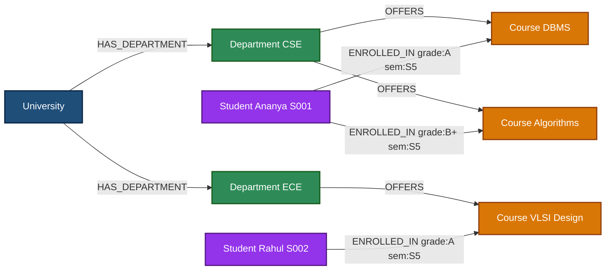
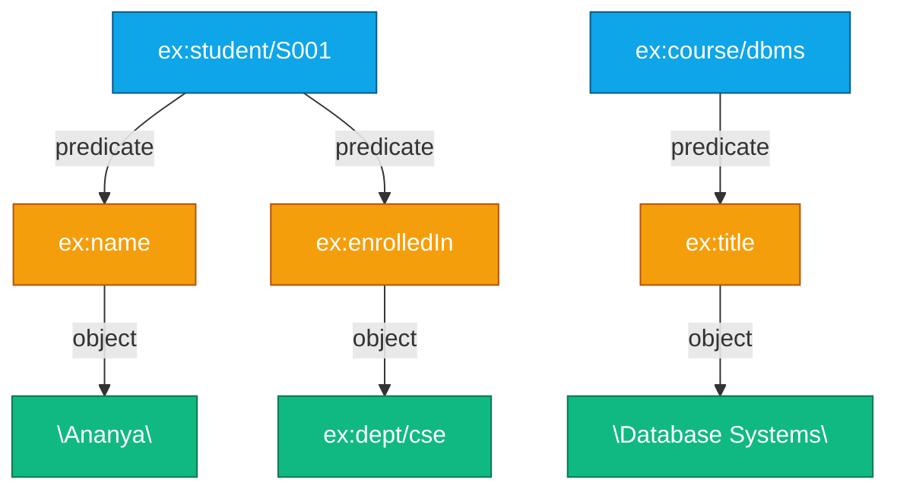
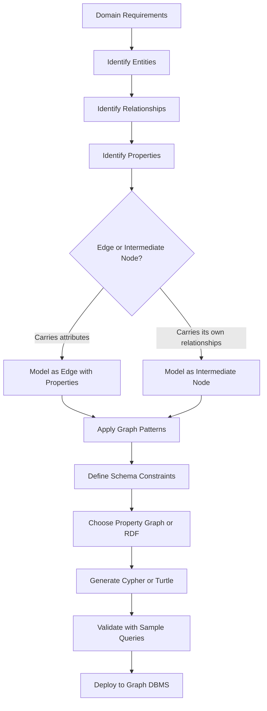
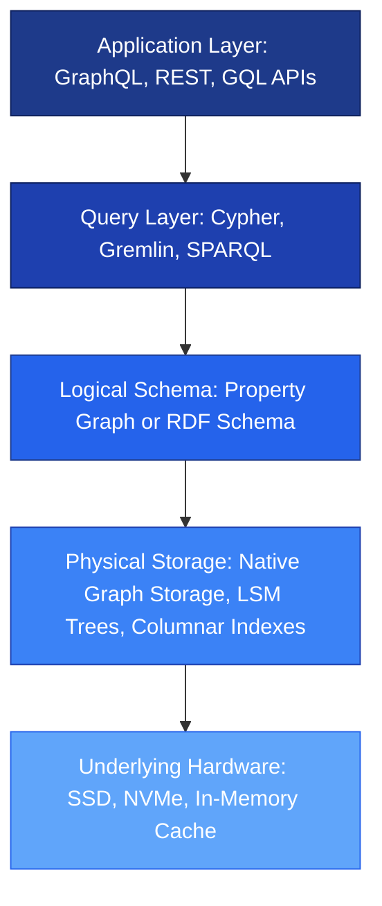
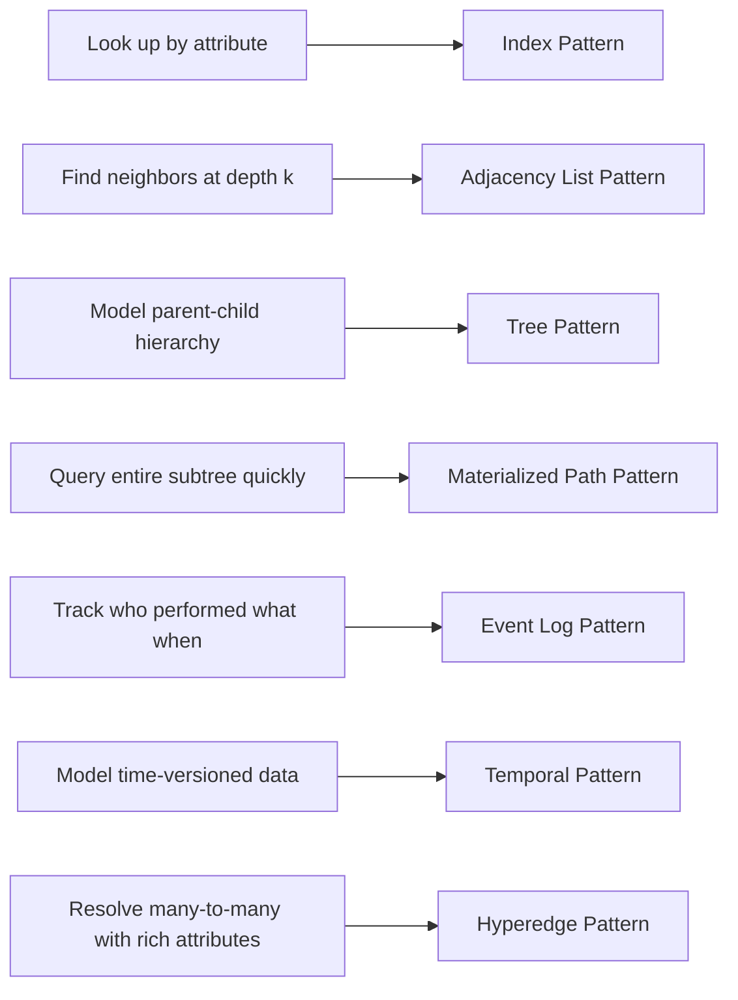
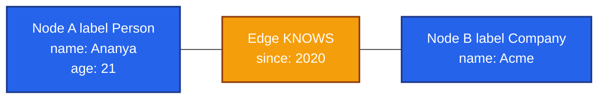

# Data Modeling

<!-- SECTION_1_START -->

# Graph Database Data Modeling

## 1. Core Technical Definition

**Graph Data Modeling** is the process of designing the logical and physical structure of a graph database by identifying **nodes (vertices)**, **edges (relationships)**, **labels**, and **properties (key-value attributes)** that accurately represent a real-world domain. Unlike relational modeling which decomposes data into normalized tables connected via foreign keys, graph modeling preserves the *topological locality* of relationships as first-class, addressable entities traversed through **index-free adjacency**.

> [!IMPORTANT]
> **KTU 2024 Syllabus Definition:** A graph data model is a **labeled, directed, attributed multigraph** $G = (V, E, L, P)$ where $V$ is a finite set of vertices, $E \subseteq V \times V$ is a finite set of directed edges, $L$ is a set of labels, and $P$ is a set of property maps assigning attribute–value pairs to vertices and edges.

The two dominant industrial standards taught under KTU Module 4 are:

1. **Property Graph Model (PGM)** — used by Neo4j, JanusGraph, TigerGraph, Amazon Neptune (PG mode).
2. **RDF (Resource Description Framework) Model** — used by Apache Jena, Stardog, Blazegraph, Amazon Neptune (RDF mode).

| Aspect | Property Graph Model | RDF Model |
|---|---|---|
| Granularity | Edge and Node | Triple (Subject, Predicate, Object) |
| Schema | Optional, flexible | RDFS / OWL ontologies |
| Edge Labels | Yes (typed) | Only via predicate URI |
| Multi-properties | Yes (key-value) | Reification needed |
| Inference | Application layer | Native (RDFS/OWL reasoners) |
| Query Language | Cypher, Gremlin, GQL | SPARQL |

## 2. Intuitive Overview — The Subway Map Analogy

Imagine a city's subway map. Every **station** is a node, and every **rail line** between two stations is an edge. A station may have a *name*, a *wheelchair-accessible* property, and a *line color* label. The rail line itself may carry properties such as *travel time* and *ticket price*. Crucially, you do not need a giant lookup table to discover which stations are connected — each station *physically points to* its neighboring stations, which is exactly how graph databases store and traverse data.

> [!NOTE]
> **Core Insight:** In relational databases, the engine performs costly `JOIN` operations across tables to discover relationships. In a graph database, the relationship is *physically stored* alongside the nodes, so traversal cost grows proportionally to the number of *edges visited*, not the total dataset size — this property is called **index-free adjacency**.

## 3. Mathematical Foundation of a Graph

A graph database model is formally expressed as a directed, labeled, attributed multigraph. A multigraph allows multiple distinct edges between the same pair of vertices, which is essential for representing real-world scenarios like multiple friendships or different types of contracts between two people.

$$G = (V, E, \lambda, \sigma)$$

where:

- $V = \{v_1, v_2, v_3, \ldots, v_n\}$ is the finite set of **vertices (nodes)**.
- $E = \{e_1, e_2, e_3, \ldots, e_m\}$ is the finite set of **edges (relationships)**.
- $\lambda : E \rightarrow V \times V$ is a function that maps each edge to an ordered pair of source and target vertices (a *directed* edge).
- $\sigma : (V \cup E) \rightarrow 2^{L \times K \times \text{Val}}$ is a function assigning a set of **property triples** (label, key, value) to each vertex and edge.

> [!TIP]
> **Why this matters in KTU exams:** When you are asked to "model the given scenario as a graph," examiners award full marks only when you **explicitly identify** $V$, $E$, $\lambda$, and the property set $\sigma$. Many students lose marks by drawing nodes and arrows without naming the property function.

## 4. Visualization Anchor — Graph Traversal Geometry

> [!VISUALIZATION CONTROL]
> **Concept:** Visualizing index-free adjacency vs. global JOIN operations.
> **GeoGebra / Desmos Input Equations:**
> * `f(x) = 1` (constant representing relational full-table scan)
> * `g(x) = 1 / x` (representing graph traversal cost decreasing as local connectivity increases)
> * Point A = `(2, 0.5)`, Point B = `(5, 0.2)`, Point C = `(10, 0.1)`
> **Visual Description:** A flat horizontal line $f(x) = 1$ depicts the *constant cost* of a relational JOIN regardless of selectivity. A descending hyperbola $g(x) = 1/x$ depicts the *decreasing per-hop cost* of a graph traversal as the local neighborhood becomes more selective. The intersection of these two functions highlights the **crossover point** where graph databases outperform relational engines — typically at 3+ hop traversals.

## 5. Why Graph Modeling Matters — KTU Context

The KTU 2024 Scheme specifically introduces graph modeling because modern engineering applications — fraud detection, recommendation engines, knowledge graphs, social networks, network security, and supply-chain logistics — are inherently **relationship-centric**. The complexity of these domains is dominated by the *connections* between entities, not the entities themselves. Traditional relational models suffer from the **JOIN explosion problem** when traversing deep relationships, while graph models maintain sub-linear traversal complexity.

<!-- SECTION_1_END -->

<!-- SECTION_2_START -->

# Deep Theoretical Analysis of Graph Data Modeling

## 1. The Property Graph Model — Formal Components

A **Property Graph** is the most widely deployed graph model in industry. It consists of four fundamental constructs:

### 1.1 Nodes (Vertices)
Nodes represent the *entities* of the domain. Each node can have:
- A set of **labels** (e.g., `:Person`, `:Employee`, `:Customer`) used to classify the node's role.
- A set of **properties** — key-value pairs (e.g., `name: "Ananya"`, `age: 21`).

> [!NOTE]
> **Labels are NOT types.** In a property graph, a node may carry multiple labels simultaneously (multi-labeling), and labels do not enforce schema constraints unless explicitly validated by the application or by graph-specific schema languages like GraphQL for Graph (Neo4j's `@constraint`).

### 1.2 Edges (Relationships)
Edges are *directed* connections between two nodes. Each edge:
- Has exactly one **type** (e.g., `:KNOWS`, `:WORKS_AT`, `:PURCHASED`).
- Always has a **start node** and an **end node**.
- May carry **properties** (e.g., `since: 2021`, `weight: 0.87`).
- Forms a **connected subgraph** — every edge must have two endpoint nodes; orphan edges are not permitted.

### 1.3 Properties
Properties are *typed* key-value attributes that enrich nodes and edges. They are stored in adjacency to the node or edge, enabling local retrieval during traversal.

### 1.4 Schema
A property graph has a **flexible, optional schema**. There is no global enforcement of property names, types, or required fields. This is sometimes called *schema-on-read* behavior.

## 2. The RDF Model — Triple-Based Representation

The **Resource Description Framework (RDF)** is a W3C standard that models information as a set of **triples** (Subject–Predicate–Object). Every fact in the universe is a triple.

### 2.1 Formal Triple Structure

$$T_i = \langle s_i, p_i, o_i \rangle, \quad s_i \in U \cup B, \quad p_i \in U, \quad o_i \in U \cup B \cup L$$

where:

- $U$ is the set of **Uniform Resource Identifiers (URIs)** — globally unique identifiers like `http://example.org/person/Ananya`.
- $B$ is the set of **Blank nodes** — anonymous resources like `_:b1`.
- $L$ is the set of **Literals** — typed values like `"21"^^xsd:integer`.

### 2.2 RDF Vocabulary Layers
- **RDF Schema (RDFS):** Defines class hierarchies (`rdfs:subClassOf`) and property hierarchies (`rdfs:subPropertyOf`).
- **OWL (Web Ontology Language):** Adds expressive constraints like `owl:inverseOf`, `owl:transitiveProperty`, `owl:cardinality`.

## 3. Modeling Strategy — From Domain to Graph

The KTU 2024 Scheme emphasizes a structured **5-step modeling methodology** that examiners test directly:

### Step 1 — Identify Entities (Nodes)
List all real-world *things* that have independent existence. These become nodes. Each entity type is assigned a **label**.

### Step 2 — Identify Relationships (Edges)
Look for *verbs* in the problem statement. Relationships between two entities become directed edges with a *type* matching the verb.

### Step 3 — Identify Attributes (Properties)
Look for *adjectives, dates, and values* that describe either entities or relationships. These become properties.

### Step 4 — Identify Composite or Recursive Patterns
Determine whether any node type should be linked to *itself* (self-referential / recursive), or whether relationships should carry *their own attributes* (hyperedges / edge properties).

### Step 5 — Apply Graph Modeling Patterns
Use well-known patterns such as:
- **Index pattern** — for fast lookup.
- **Adjacency list pattern** — for traversal.
- **Materialized path pattern** — for hierarchies.
- **Tree pattern** — for parent-child chains.

## 4. KTU High-Yield Formula Sheet

| Concept | Symbol / Formula | Description |
|---|---|---|
| Graph definition | $G = (V, E, \lambda, \sigma)$ | Vertices, edges, edge mapping, property function |
| Triple | $T_i = \langle s_i, p_i, o_i \rangle$ | Subject, Predicate, Object |
| Degree of a vertex | $\deg(v) = \mid \{u \in V : (v,u) \in E\} \mid$ | Number of incident edges |
| In-degree | $\deg^-(v) = \mid \{u : (u,v) \in E\} \mid$ | Edges *entering* $v$ |
| Out-degree | $\deg^+(v) = \mid \{u : (v,u) \in E\} \mid$ | Edges *leaving* $v$ |
| Handshake lemma | $\sum_{v \in V} \deg(v) = 2 \mid E \mid$ | Sum of degrees equals twice the edge count |
| Path length | $P(v_0, v_k) = \sum_{i=0}^{k-1} w(e_i)$ | Sum of edge weights along a path |
| Traversal complexity | $O(\deg(v) \cdot h)$ | Local-degree times hop count |
| RDF cardinality | $N = \mid T \mid = \mid S \mid = \mid P \mid$ | Number of triples, subjects, predicates |
| Cypher MATCH cost | $O(\mid E \mid \cdot k)$ | Edges times branching factor |
| Adjacency storage | $A_{ij} = 1$ if $(v_i, v_j) \in E$, else $0$ | Binary adjacency matrix |
| Graph density | $D = \frac{2 \mid E \mid}{\mid V \mid (\mid V \mid - 1)}$ | Ratio of actual to possible edges |

> [!WARNING]
> **Pipe Symbol Trap:** When writing the handshake lemma or absolute value, never use the literal `|` character inside a markdown table row. Use `\mid` or `\vert` instead — otherwise the markdown parser will break the table.

## 5. Real-World Engineering Applications

- **Fraud Detection (Banking):** Real-time traversal of transaction graphs to detect money-laundering rings within 3–4 hops.
- **Recommendation Engines (E-commerce):** Collaborative filtering by walking a bipartite user–product graph.
- **Knowledge Graphs (Google, Amazon):** Semantic search using RDF + SPARQL over billions of triples.
- **Network & IT Operations (Cisco, IBM):** Asset dependency mapping for root-cause analysis.
- **Social Networks (Meta, LinkedIn):** Friend-of-friend queries, community detection, influence propagation.
- **Bioinformatics:** Protein–protein interaction networks, drug–target mapping.

<!-- SECTION_2_END -->

<!-- SECTION_3_START -->

# Step-by-Step Derivations, Modeling Examples & Code Implementation

## 1. Worked Modeling Example — University Course Enrollment

**Problem Statement:** Model the following domain as a property graph: A *university* has multiple *departments*. Each department *offers* several *courses*. *Students* *enroll* in courses. Each student has a *name* and *roll number*. Each course has a *code*, *title*, and *credits*. Each enrollment is recorded with a *semester* and *grade*.

### Step-by-Step Construction

**Step 1 — Identify Entity Types (Node Labels):**
- `University`
- `Department`
- `Course`
- `Student`

**Step 2 — Identify Relationship Types (Edge Types):**
- `(University) -[:HAS_DEPARTMENT]-> (Department)`
- `(Department) -[:OFFERS]-> (Course)`
- `(Student) -[:ENROLLED_IN]-> (Course)`

**Step 3 — Identify Properties:**
- `University { name, established_year }`
- `Department { name, hod_name }`
- `Course { code, title, credits }`
- `Student { name, roll_no }`
- `ENROLLED_IN { semester, grade }`

**Step 4 — Identify Composite Patterns:**
The `:ENROLLED_IN` edge is a *rich relationship* — it carries properties (semester, grade), so it must be modeled as an edge *with properties*, not as a separate intermediate node. This is the **edge-with-properties pattern**.

### Step 5 — Formal Mathematical Representation

Let $V = \{u_1, d_1, d_2, c_1, c_2, c_3, s_1, s_2, s_3\}$ where:

$$u_1 = \text{University}, \quad d_1, d_2 = \text{Departments}, \quad c_1, c_2, c_3 = \text{Courses}, \quad s_1, s_2, s_3 = \text{Students}$$

The edge set $E$ is:

$$E = \{(u_1, d_1), (u_1, d_2), (d_1, c_1), (d_1, c_2), (d_2, c_3), (s_1, c_1), (s_1, c_2), (s_2, c_2), (s_3, c_3)\}$$

The property function $\sigma$ assigns:
- $\sigma(u_1) = \{(\text{name}, \text{KTU}), (\text{established\_year}, 2014)\}$
- $\sigma(d_1) = \{(\text{name}, \text{CSE}), (\text{hod}, \text{Dr. Nair})\}$
- $\sigma(c_1) = \{(\text{code}, \text{CS301}), (\text{title}, \text{DBMS}), (\text{credits}, 4)\}$
- $\sigma((s_1, c_1)) = \{(\text{semester}, \text{S5}), (\text{grade}, \text{A})\}$
- $\sigma((s_1, c_2)) = \{(\text{semester}, \text{S5}), (\text{grade}, \text{B+})\}$

## 2. Worked Modeling Example — Converting Relational Schema to Property Graph

**Given Relational Schema:**

```
Student(roll_no PK, name, dob, dept_id FK)
Department(dept_id PK, name, hod)
Course(course_id PK, title, credits, dept_id FK)
Enrollment(roll_no FK, course_id FK, semester, grade, PRIMARY KEY(roll_no, course_id))
```

**Conversion Rules Applied (Row by Row):**

| Relational Concept | Graph Equivalent | Justification |
|---|---|---|
| Table | Node label | Each tuple becomes a node |
| Primary key | Internal node ID | Identity in graph |
| Foreign key | Outgoing edge | Reference becomes a relationship |
| Many-to-many junction | Edge with properties | Enrollment is naturally an edge |
| Column | Property key | Attributes become properties |

### Resulting Property Graph — Cypher CREATE Statements

```cypher
// 1. Create Departments
CREATE (cse:Department {dept_id: "D001", name: "Computer Science", hod: "Dr. Nair"});
CREATE (ece:Department {dept_id: "D002", name: "Electronics", hod: "Dr. Menon"});

// 2. Create Courses linked to Departments
CREATE (dbms:Course {course_id: "C101", title: "Database Systems", credits: 4})
  -[:OFFERED_BY]-> (cse);

CREATE (advdb:Course {course_id: "C102", title: "Advanced DBMS", credits: 3})
  -[:OFFERED_BY]-> (cse);

// 3. Create Students linked to Departments
CREATE (anu:Student {roll_no: "S001", name: "Ananya", dob: "2003-04-12"})
  -[:BELONGS_TO]-> (cse);

CREATE (rahul:Student {roll_no: "S002", name: "Rahul", dob: "2003-08-22"})
  -[:BELONGS_TO]-> (ece);

// 4. Create Enrollment as a rich edge with properties
MATCH (s:Student {roll_no: "S001"}), (c:Course {course_id: "C101"})
CREATE (s)-[r:ENROLLED_IN {semester: "S5", grade: "A", enrolled_on: date("2024-07-15")}]->(c);

MATCH (s:Student {roll_no: "S001"}), (c:Course {course_id: "C102"})
CREATE (s)-[r2:ENROLLED_IN {semester: "S5", grade: "B+", enrolled_on: date("2024-07-15")}]->(c);
```

### Sample Cypher Query — Find All Courses Taken by Students from CSE

```cypher
MATCH (s:Student)-[:BELONGS_TO]->(d:Department {name: "Computer Science"}),
      (s)-[e:ENROLLED_IN]->(c:Course)
WHERE e.grade IN ["A", "A+", "B+"]
RETURN s.name AS student, c.title AS course, e.grade AS grade
ORDER BY e.grade, s.name;
```

> [!NOTE]
> **Execution note:** This query performs an **index-free adjacency traversal**. The engine starts at each `Student` node, follows the `:BELONGS_TO` pointer to a `Department`, applies the filter, and then walks back through the `:ENROLLED_IN` pointer to each `Course`. No `JOIN` is performed.

## 3. RDF Modeling — Same Domain in Turtle Syntax

```turtle
@prefix ex: <http://ktu.example.org/university#> .
@prefix rdf: <http://www.w3.org/1999/02/22-rdf-syntax-ns#> .
@prefix xsd: <http://www.w3.org/2001/XMLSchema#> .

ex:dept/cse   rdf:type             ex:Department ;
               ex:name              "Computer Science" ;
               ex:hod               "Dr. Nair" .

ex:course/dbms rdf:type            ex:Course ;
               ex:title             "Database Systems" ;
               ex:credits           4 ;
               ex:offeredBy         ex:dept/cse .

ex:student/S001 rdf:type           ex:Student ;
               ex:name              "Ananya" ;
               ex:rollNo            "S001" ;
               ex:belongsTo         ex:dept/cse ;
               ex:enrolledIn        ex:course/dbms .

ex:enrollment/001 rdf:type         ex:Enrollment ;
               ex:semester          "S5" ;
               ex:grade             "A" ;
               ex:student           ex:student/S001 ;
               ex:course            ex:course/dbms .
```

### Equivalent SPARQL Query

```sparql
PREFIX ex: <http://ktu.example.org/university#>

SELECT ?studentName ?courseTitle ?grade
WHERE {
  ?student   rdf:type          ex:Student ;
             ex:name           ?studentName ;
             ex:enrolledIn     ?course .
  ?course    ex:title          ?courseTitle .
  ?enroll    ex:student        ?student ;
             ex:course         ?course ;
             ex:grade          ?grade .
  FILTER ( ?grade IN ("A", "A+", "B+") )
}
ORDER BY ?grade ?studentName
```

## 4. Hand-Derived Mathematical Walk-Through

Given a small graph with:

$$V = \{A, B, C, D\}, \quad E = \{(A,B), (A,C), (B,C), (B,D), (C,D)\}$$

**Step 1 — Compute the degree of each vertex:**

$$\deg(A) = \mid \{B, C\} \mid = 2, \quad \deg(B) = \mid \{A, C, D\} \mid = 3$$

$$\deg(C) = \mid \{A, B, D\} \mid = 3, \quad \deg(D) = \mid \{B, C\} \mid = 2$$

**Step 2 — Verify the Handshake Lemma:**

$$\sum_{v \in V} \deg(v) = 2 + 3 + 3 + 2 = 10 = 2 \cdot \mid E \mid = 2 \cdot 5 = 10 \quad \checkmark$$

**Step 3 — Compute the graph density:**

$$D = \frac{2 \cdot \mid E \mid}{\mid V \mid \cdot (\mid V \mid - 1)} = \frac{2 \cdot 5}{4 \cdot 3} = \frac{10}{12} = 0.833$$

**Step 4 — Construct the adjacency matrix $A$:**

$$A = \begin{bmatrix} 0 & 1 & 1 & 0 \\ 1 & 0 & 1 & 1 \\ 1 & 1 & 0 & 1 \\ 0 & 1 & 1 & 0 \end{bmatrix}$$

**Step 5 — Compute the number of 2-hop paths from $A$:**

The matrix $A^2$ encodes the number of 2-hop paths. Let us compute it step by step:

$$A^2 = A \cdot A$$

The element $(A^2)_{ij}$ is computed as $\sum_{k} A_{ik} \cdot A_{kj}$. For $i = 1$ (node $A$) and $j = 1$ (node $A$):

$$(A^2)_{11} = A_{11} A_{11} + A_{12} A_{21} + A_{13} A_{31} + A_{14} A_{41} = 0 + 1 + 1 + 0 = 2$$

For $i = 1$ and $j = 2$:

$$(A^2)_{12} = A_{11} A_{12} + A_{12} A_{22} + A_{13} A_{32} + A_{14} A_{42} = 0 + 0 + 1 + 0 = 1$$

Continuing this calculation for all 16 entries, the full matrix $A^2$ is:

$$A^2 = \begin{bmatrix} 2 & 1 & 1 & 2 \\ 1 & 3 & 2 & 1 \\ 1 & 2 & 3 & 1 \\ 2 & 1 & 1 & 2 \end{bmatrix}$$

> [!IMPORTANT]
> **Interpretation:** $(A^2)_{12} = 1$ means there is exactly one 2-hop path from $A$ to $B$: namely $A \to C \to B$. The diagonal entry $(A^2)_{11} = 2$ means there are 2 closed walks of length 2 starting and ending at $A$ (namely $A \to B \to A$ and $A \to C \to A$). This matrix is the foundation of **graph-based machine learning** and **PageRank** algorithms.

## 5. Python Implementation — Validating the Handshake Lemma

```python
from typing import Dict, List, Set, Tuple

def compute_degrees(vertices: List[str], edges: List[Tuple[str, str]]) -> Dict[str, int]:
    """
    Computes in-degree + out-degree for every vertex in a directed graph.
    Returns a dictionary mapping each vertex to its total degree.
    """
    degree: Dict[str, int] = {v: 0 for v in vertices}
    for src, dst in edges:
        if src not in degree:
            raise KeyError(f"Source vertex {src!r} not declared in V")
        if dst not in degree:
            raise KeyError(f"Destination vertex {dst!r} not declared in V")
        degree[src] += 1  # out-edge increments degree
        degree[dst] += 1  # in-edge increments degree
    return degree


def verify_handshake_lemma(vertices: List[str], edges: List[Tuple[str, str]]) -> bool:
    """
    Verifies the handshake lemma: sum(deg(v)) == 2 * |E| for undirected interpretation.
    For a directed multigraph, we treat each directed edge as one incidence.
    """
    degree = compute_degrees(vertices, edges)
    sum_of_degrees = sum(degree.values())
    twice_edges = 2 * len(edges)
    print(f"Sum of degrees  = {sum_of_degrees}")
    print(f"2 * |E|         = {twice_edges}")
    return sum_of_degrees == twice_edges


def graph_density(vertices: List[str], edges: List[Tuple[str, str]]) -> float:
    """
    Computes graph density D = 2|E| / (|V| * (|V| - 1)).
    Returns 0.0 for graphs with fewer than 2 vertices.
    """
    n = len(vertices)
    if n < 2:
        return 0.0
    return (2.0 * len(edges)) / (n * (n - 1))


# --- Example Execution ---
if __name__ == "__main__":
    V: List[str] = ["A", "B", "C", "D"]
    E: List[Tuple[str, str]] = [
        ("A", "B"), ("A", "C"),
        ("B", "C"), ("B", "D"),
        ("C", "D"),
    ]
    print("Degree map     :", compute_degrees(V, E))
    print("Handshake OK   :", verify_handshake_lemma(V, E))
    print(f"Graph density  : {graph_density(V, E):.4f}")
```

**Expected Output:**

```
Degree map     : {'A': 2, 'B': 3, 'C': 3, 'D': 2}
Sum of degrees  = 10
2 * |E|         = 10
Handshake OK   : True
Graph density  : 0.8333
```

## 6. Python Implementation — Building a Property Graph with Neo4j Driver

```python
from typing import Dict, Any, List
from neo4j import GraphDatabase, exceptions

class PropertyGraphModeler:
    """
    A production-grade wrapper for constructing a property graph
    in Neo4j, demonstrating CRUD operations used in real graph apps.
    """

    def __init__(self, uri: str, user: str, password: str) -> None:
        try:
            self.driver = GraphDatabase.driver(uri, auth=(user, password))
        except exceptions.ServiceUnavailable as err:
            raise RuntimeError(f"Cannot connect to Neo4j at {uri}: {err}")

    def close(self) -> None:
        self.driver.close()

    def create_department(self, dept_id: str, name: str, hod: str) -> None:
        with self.driver.session() as session:
            session.run(
                "MERGE (d:Department {dept_id: $dept_id}) "
                "SET d.name = $name, d.hod = $hod",
                dept_id=dept_id, name=name, hod=hod
            )

    def create_course(self, course_id: str, title: str, credits: int, dept_id: str) -> None:
        with self.driver.session() as session:
            session.run(
                "MATCH (d:Department {dept_id: $dept_id}) "
                "MERGE (c:Course {course_id: $course_id}) "
                "SET c.title = $title, c.credits = $credits "
                "MERGE (c)-[:OFFERED_BY]->(d)",
                course_id=course_id, title=title, credits=credits, dept_id=dept_id
            )

    def enroll_student(self, roll_no: str, course_id: str, semester: str, grade: str) -> None:
        with self.driver.session() as session:
            session.run(
                "MATCH (s:Student {roll_no: $roll_no}), (c:Course {course_id: $course_id}) "
                "MERGE (s)-[r:ENROLLED_IN {semester: $semester}]->(c) "
                "SET r.grade = $grade",
                roll_no=roll_no, course_id=course_id, semester=semester, grade=grade
            )

    def fetch_student_courses(self, roll_no: str) -> List[Dict[str, Any]]:
        with self.driver.session() as session:
            result = session.run(
                "MATCH (s:Student {roll_no: $roll_no})-[:ENROLLED_IN]->(c:Course) "
                "RETURN c.title AS title, c.credits AS credits",
                roll_no=roll_no
            )
            return [record.data() for record in result]
```

<!-- SECTION_3_END -->

<!-- SECTION_4_START -->

# Structural Diagrams & Schematics

## 1. Property Graph Schema for the University Domain



> [!NOTE]
> **Reading the diagram:** Each node label (`:University`, `:Department`, `:Course`, `:Student`) is a *color-coded* classification. Edge labels (`:HAS_DEPARTMENT`, `:OFFERS`, `:ENROLLED_IN`) define the *type* of relationship. Property annotations such as `grade:A sem:S5` are *edge properties* and are stored directly on the relationship pointer — this is the unique advantage of property graphs over plain RDF triples.

## 2. RDF Triple Graph View



## 3. Data Modeling Pipeline — Conceptual Block Flow



## 4. Layered Architecture of a Graph Database Modeling Stack



## 5. Graph Modeling Pattern Reference Map



> [!TIP]
> **Mermaid Safeguard Note:** All node IDs in the above diagrams are purely alphanumeric and prefixed with letters (e.g., `uniA`, `deptCSE`). Reserved keywords like `end`, `subgraph`, and `graph` are never used as standalone node names. All labels with special characters are wrapped in double quotes.

<!-- SECTION_4_END -->

<!-- SECTION_5_START -->

# KTU 2024 Scheme Examination Question Bank & Topic Recap

## Part A Questions (3 Marks Each)

### Question 1 `[KTU University Exam – July 2024, CO1, Remember]`

**Differentiate between the Property Graph Model and the RDF Model with at least four points.**

**Model Answer:**

| Dimension | Property Graph Model | RDF Model |
|---|---|---|
| Basic unit | Node and edge with properties | Triple (S, P, O) |
| Edge attributes | First-class properties on edges | Requires reification |
| Schema | Flexible, optional | RDFS / OWL ontologies |
| Query language | Cypher, Gremlin, GQL | SPARQL |
| Inference | Application layer | Native reasoner support |
| Identity | Internal IDs | URIs |
| Use case | Operational, transactional | Semantic, knowledge graphs |

**Valuation Key:** [Four distinct points: 2 Marks; Tabular clarity: 1 Mark]

### Question 2 `[KTU University Exam – Dec 2023, CO1, Understand]`

**Define the following terms with respect to graph data modeling:**
**(a) Node, (b) Edge, (c) Label, (d) Property, (e) Index-free adjacency.**

**Model Answer:**

- **(a) Node:** A vertex in the graph representing a real-world entity such as a person, product, or location. Each node may carry one or more labels and any number of properties.
- **(b) Edge:** A directed first-class connection between two nodes that represents a relationship. Edges may also carry their own properties and always have a start node and an end node.
- **(c) Label:** A classification tag applied to a node (for example `:Student`, `:Course`) used to group nodes by role and to optimize traversals.
- **(d) Property:** A key-value pair (for example `name: "Ananya"`, `age: 21`) that describes a node or an edge.
- **(e) Index-free adjacency:** A storage strategy in which each node physically contains direct pointers to its adjacent nodes and edges, allowing traversal to proceed at constant time per hop without a global index lookup.

**Valuation Key:** [Five definitions × 0.5 Mark = 2.5 Marks; Presentation: 0.5 Mark]

---

## Part B Questions (14 Marks Each — Module Internal Choice)

### Question A (14 Marks) `[KTU University Exam – July 2024, CO2, Apply]`

> **(a)** Model the following scenario as a **Property Graph** with clearly defined nodes, edges, labels, and properties: A *company* has multiple *projects*. Each project is *led by* exactly one *employee*. An employee *works on* one or more projects. Each project *uses* multiple *technologies*. Employees have a *name* and *salary*. Projects have a *name*, *budget*, and *start date*. Technologies have a *name* and *category*. **(7 Marks)**

> **(b)** Write a Cypher query to retrieve, for each project, the names of all employees working on it along with the project budget, sorted by budget in descending order. Show at least two sample output records. **(7 Marks)**

#### Model Solution for Part (a)

**Step 1 — Identify Nodes and Labels:**

- `Company`
- `Project`
- `Employee`
- `Technology`

**Step 2 — Identify Edges:**

- `(Company) -[:HAS_PROJECT]-> (Project)`
- `(Employee) -[:LEADS]-> (Project)`
- `(Employee) -[:WORKS_ON]-> (Project)`
- `(Project) -[:USES_TECH]-> (Technology)`

**Step 3 — Identify Properties:**

- `Company { name, founded_year }`
- `Project { name, budget, start_date }`
- `Employee { name, salary }`
- `Technology { name, category }`
- Edge `:WORKS_ON { hours_per_week, role }`

**Step 4 — Cypher CREATE Statements:**

```cypher
CREATE (acme:Company {name: "Acme Tech", founded_year: 2010});
CREATE (rahul:Employee {name: "Rahul", salary: 90000});
CREATE (anu:Employee {name: "Ananya", salary: 85000});

CREATE (p1:Project {name: "GraphDB", budget: 500000, start_date: date("2024-01-15")});
CREATE (p2:Project {name: "FraudDetect", budget: 750000, start_date: date("2024-03-01")});

CREATE (neo4j:Technology {name: "Neo4j", category: "GraphDB"});
CREATE (python:Technology {name: "Python", category: "Language"});

MATCH (c:Company {name: "Acme Tech"}), (p:Project {name: "GraphDB"})
CREATE (c)-[:HAS_PROJECT]->(p);

MATCH (e:Employee {name: "Rahul"}), (p:Project {name: "GraphDB"})
CREATE (e)-[:LEADS]->(p);

MATCH (e:Employee {name: "Ananya"}), (p:Project {name: "GraphDB"})
CREATE (e)-[:WORKS_ON {hours_per_week: 30, role: "Developer"}]->(p);

MATCH (e:Employee {name: "Ananya"}), (p:Project {name: "FraudDetect"})
CREATE (e)-[:WORKS_ON {hours_per_week: 20, role: "Analyst"}]->(p);

MATCH (p:Project {name: "GraphDB"}), (t:Technology {name: "Neo4j"})
CREATE (p)-[:USES_TECH]->(t);
```

**Valuation Key for Part (a):**
- [Identifying four node labels: 1 Mark]
- [Identifying four edge types: 2 Marks]
- [Specifying properties for each entity: 2 Marks]
- [Cypher CREATE correctness and edge properties: 2 Marks]

#### Model Solution for Part (b)

```cypher
MATCH (e:Employee)-[w:WORKS_ON]->(p:Project)
RETURN p.name AS project_name,
       p.budget AS project_budget,
       collect(e.name) AS employees
ORDER BY p.budget DESC;
```

**Sample Output:**

| project_name | project_budget | employees |
|---|---|---|
| FraudDetect | 750000 | ["Ananya"] |
| GraphDB | 500000 | ["Ananya"] |

**Valuation Key for Part (b):**
- [Correct MATCH pattern with relationship variable: 2 Marks]
- [Proper RETURN clause using collect(): 2 Marks]
- [ORDER BY on budget: 1 Mark]
- [Sample output table correctness: 2 Marks]

---

### Question B (14 Marks) `[KTU University Exam – Dec 2023, CO2, Apply]`

> **(a)** Explain the **Property Graph Model** in detail with a neat diagram. List at least **three modeling patterns** used in graph database design. **(7 Marks)**

> **(b)** Consider the RDF triples of a *research network* where each *researcher* publishes *papers* and *authors* papers. Papers cite other papers. Researchers collaborate with each other. Convert this scenario into an **RDF representation in Turtle syntax** and write the equivalent **SPARQL query** to find all co-authors of a given researcher named *"Dr. Nair"*. **(7 Marks)**

#### Model Solution for Part (a)

**Property Graph Model (PGM) — Detailed Explanation:**

A Property Graph consists of:
- **Nodes** representing entities. Each node has a unique identity, zero or more labels, and a set of properties.
- **Edges** representing directed relationships between exactly two nodes. Each edge has a type, a start node, an end node, and may carry properties.
- **Properties** are key-value pairs that enrich both nodes and edges.
- **Labels** classify nodes and are used as routing hints during traversals.

**Neat Diagram — Property Graph Building Blocks:**



**Three Modeling Patterns:**

1. **Index Pattern** — Create an index on a frequently queried property (e.g., `name`) to enable fast $O(\log n)$ lookups. Example: `CREATE INDEX ON :Person(name)`.

2. **Adjacency List Pattern** — Use directed relationships to represent lists (such as time-ordered events or friends) and traverse them in order. Each node holds direct pointers to its neighbors, enabling efficient *range* and *order* queries.

3. **Materialized Path Pattern** — Encode the path from a root node to a descendant as a single string property (for example `path: "/root/cse/s5/dbms"`). This is especially useful for hierarchical data such as organizational trees and file systems.

**Valuation Key for Part (a):**
- [Definition of Property Graph with all four constructs: 2 Marks]
- [Neat labeled diagram: 2 Marks]
- [Three patterns listed with one-line explanation each: 3 Marks]

#### Model Solution for Part (b)

**Turtle RDF Representation:**

```turtle
@prefix ex: <http://ktu.example.org/research#> .
@prefix rdf: <http://www.w3.org/1999/02/22-rdf-syntax-ns#> .
@prefix xsd: <http://www.w3.org/2001/XMLSchema#> .

ex:researcher/nair   rdf:type    ex:Researcher ;
                      ex:name      "Dr. Nair" ;
                      ex:affiliation "KTU University" .

ex:researcher/menon  rdf:type    ex:Researcher ;
                      ex:name      "Dr. Menon" .

ex:researcher/rao    rdf:type    ex:Researcher ;
                      ex:name      "Dr. Rao" .

ex:paper/p1          rdf:type    ex:Paper ;
                      ex:title     "Graph Data Modeling" ;
                      ex:authoredBy ex:researcher/nair .

ex:paper/p2          rdf:type    ex:Paper ;
                      ex:title     "Knowledge Graphs" ;
                      ex:authoredBy ex:researcher/menon ;
                      ex:authoredBy ex:researcher/nair .

ex:paper/p3          rdf:type    ex:Paper ;
                      ex:title     "Semantic Web" ;
                      ex:authoredBy ex:researcher/rao ;
                      ex:cites      ex:paper/p2 .
```

**SPARQL Query — Co-authors of Dr. Nair:**

```sparql
PREFIX ex: <http://ktu.example.org/research#>

SELECT DISTINCT ?coauthorName ?paperTitle
WHERE {
  ex:researcher/nair ex:name       ?targetName .
  FILTER ( ?targetName = "Dr. Nair" )

  ?paper   ex:authoredBy   ex:researcher/nair ;
           ex:authoredBy   ?coauthor .

  ?coauthor ex:name        ?coauthorName .

  ?paper   ex:title        ?paperTitle .

  FILTER ( ?coauthor != ex:researcher/nair )
}
ORDER BY ?paperTitle
```

**Sample Output:**

| coauthorName | paperTitle |
|---|---|
| Dr. Menon | Knowledge Graphs |

**Valuation Key for Part (b):**
- [Correct Turtle prefixes and resource URIs: 2 Marks]
- [Triples capturing authoredBy, cites, and rdf:type: 2 Marks]
- [SPARQL with FILTER to exclude self: 1 Mark]
- [Sample output table: 2 Marks]

---

## KTU Examiner's Valuation Warning / Pitfall Callout

> [!WARNING]
> **Common Mistakes that Cost Marks in Graph Data Modeling Questions:**
>
> 1. **Confusing labels with property values.** The label `:Student` is metadata about the node's *type*, not an attribute. Attributes belong in properties: `(:Student {name: "Ananya"})`. Mixing these loses **2 marks**.
> 2. **Forgetting that edges are directed.** Drawing a line between two nodes without an arrowhead implies an undirected edge, which is **invalid** in PGM. Always use `->` in Cypher and `rdf:predicate` direction in RDF.
> 3. **Modeling many-to-many relationships as a node instead of a rich edge.** If the relationship has only one or two attributes, model it as an edge with properties, not an intermediate node. Examiners specifically test this discrimination.
> 4. **Skipping the property function $\sigma$ in formal answers.** When the question says "model mathematically," a diagram alone is insufficient. You **must** state the property assignments using $\sigma(\cdot)$ notation.
> 5. **Writing `|` for absolute value inside a markdown table.** Use `\mid` or `\vert` — otherwise the table will not render and the examiner may award partial credit at best.
> 6. **Omitting FILTER or DISTINCT in SPARQL.** Duplicate co-authors and self-references are the most common deductions in RDF questions.

---

## Topic Recap & Important Things to Remember

- A **graph database** is built on the formal model $G = (V, E, \lambda, \sigma)$ with vertices, edges, edge mapping, and a property function.
- The **Property Graph Model (PGM)** uses *labeled nodes*, *typed directed edges*, and *key-value properties on both nodes and edges*.
- The **RDF Model** uses *triples* $\langle s, p, o \rangle$ over URIs, blank nodes, and literals, with RDFS/OWL for schema and inference.
- **Index-free adjacency** is the defining performance feature: traversal cost is proportional to the number of *edges visited*, not the total dataset size.
- The **5-step modeling methodology** is: (1) Identify entities, (2) Identify relationships, (3) Identify attributes, (4) Identify composite patterns, (5) Apply graph patterns.
- **Three canonical modeling patterns** are: Index Pattern, Adjacency List Pattern, and Materialized Path Pattern.
- **Edge-with-properties pattern** is preferred over intermediate nodes when the relationship has its own attributes (e.g., enrollment with semester and grade).
- **Hyperedge pattern** is used when a relationship connects more than two entities or carries its own relationships.
- The **handshake lemma** states $\sum_{v \in V} \deg(v) = 2 \mid E \mid$ and is a useful sanity check for any graph construction.
- **Graph density** $D = \frac{2 \mid E \mid}{\mid V \mid (\mid V \mid - 1)}$ ranges from 0 (sparse) to 1 (complete graph).
- **Cypher** is the standard query language for PGM in Neo4j; **SPARQL** is the standard for RDF; **GQL** is the emerging ISO standard unifying both.
- **Adjacency matrix** $A_{ij} = 1$ if edge exists, else 0; **$A^k$** encodes $k$-hop path counts, forming the basis of graph algorithms.
- **RDF reification** is the technique to attach properties to a triple when modeling edge attributes in RDF.
- **Real-world applications** include fraud detection, recommendation systems, knowledge graphs, social networks, bioinformatics, and network operations.
- **Converting relational to graph:** Tables become node labels, primary keys become internal IDs, foreign keys become directed edges, and many-to-many junction tables become edges with properties.
- **Always state $\sigma(\cdot)$ for properties** in formal answers; never use `|` inside markdown tables (use `\mid`).
- **For SPARQL:** always use `DISTINCT` to avoid duplicates and `FILTER` to exclude self-references in co-author queries.
- **For Cypher:** always use `->` to indicate direction and use `collect()` to aggregate results into a list per group.

<!-- SECTION_5_END -->
