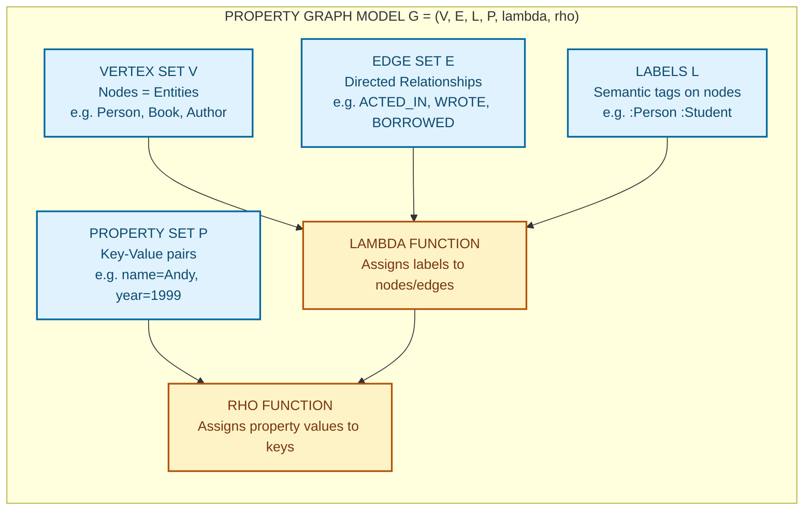
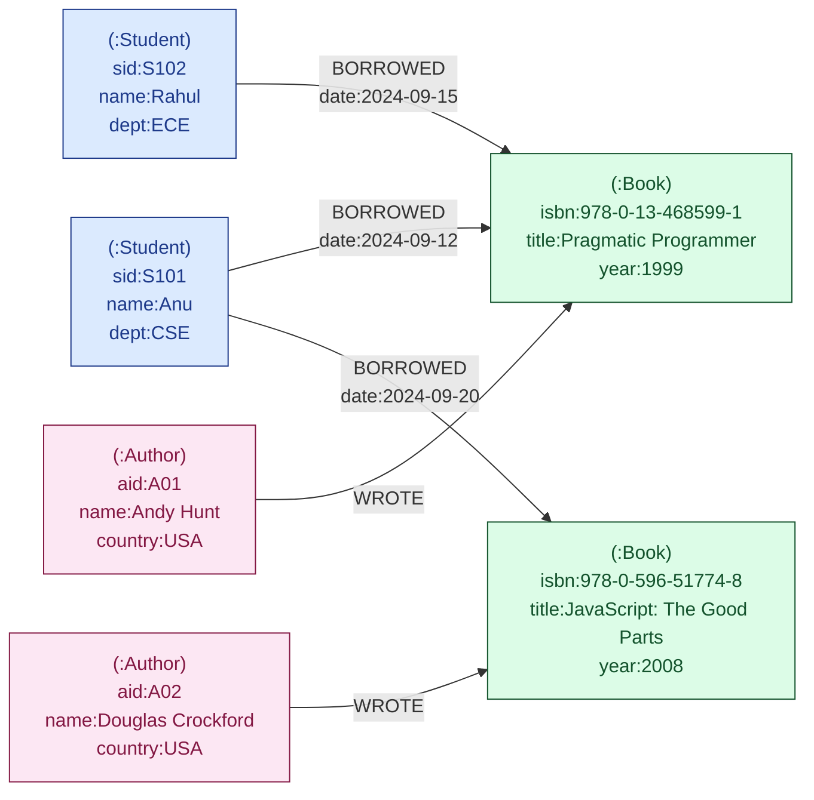
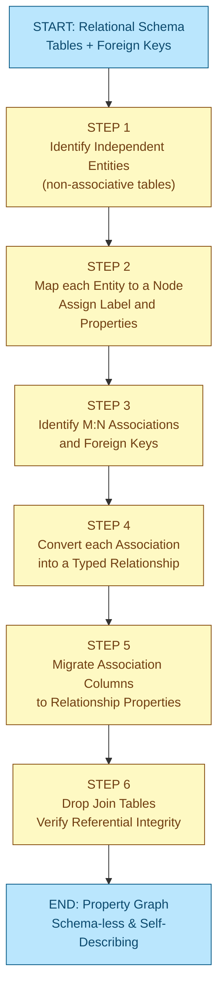

# Data Modelling with Graphs

<!-- SECTION_1_START -->
# Data Modelling with Graphs — KTU 2024 Scheme | ADVANCED DATABASE SYSTEMS (PECST634)

## 1.1 Formal Academic Definition (KTU 2024 Syllabus Aligned)

> [!IMPORTANT]
> **Graph Data Modelling** is the conceptual and logical design methodology used to organise, structure, and represent highly interconnected data as a finite, directed, multi-relational **Property Graph** — comprising **Nodes** (entities), **Relationships** (edges with direction and type), **Properties** (key–value attributes on both nodes and relationships), and **Labels** (semantic tags) — such that traversal queries, pattern matching, and analytical operations execute in time proportional to the size of the traversed subgraph rather than the total dataset size.

Mathematically, a Property Graph $G$ is defined as a 6-tuple:

$$G = (V, E, L, P, \lambda, \rho)$$

where $V$ is the finite set of **vertices (nodes)**, $E \subseteq V \times V$ is the set of directed **edges (relationships)**, $L$ is the set of **labels** and **relationship types**, $P$ is the set of **properties** (key–value pairs), and the functions $\lambda : V \cup E \rightarrow 2^{L}$ and $\rho : (V \cup E) \times K \rightarrow \text{Value}$ assign labels and property mappings respectively.

> [!NOTE]
> **Syllabus Highlight:** The KTU 2024 PECST634 Module-4 syllabus explicitly tests the **property graph model**, **nodes/edges/properties/labels** semantics, **traversal-based querying**, and **graph schema design patterns** as opposed to relational ER modelling.

## 1.2 Intuitive Real-World Analogy

Think of a **metro rail network** of a large city:

- **Stations** = *Nodes* (entities such as `Person`, `Movie`, `City`).
- **Tracks connecting two stations** = *Relationships* (typed & directed, e.g., `ACTED_IN`, `LIVES_IN`).
- **Information written on the station board** (name, zone, opening year) = *Properties* of nodes.
- **Information printed on the track** (line colour, distance, ticket price) = *Properties* of relationships.
- **The coloured line the station belongs to** (Red Line, Blue Line) = *Label* of a node.
- **The type of track** (Express, Local) = *Type* of a relationship.

When you travel, you don't carry the whole city map in your pocket and look up every station; you simply **follow the tracks** from your starting station to the destination. That is exactly the strength of graph modelling — *local, traversal-based access* rather than *global joins*.

## 1.3 Why Graph Modelling? — The RDBMS Pain Point

In a relational database, answering *"Find friends of friends of Alice who acted in a movie released after 2015"* requires multiple `JOIN` operations, with the query cost growing multiplicatively with table size:

$$C_{\text{relational}} = \mathcal{O}\left( \prod_{i=1}^{n} \vert T_i \vert \right)$$

In a graph database the same query is a *constant-bounded* traversal from the `Alice` node, with cost:

$$C_{\text{graph}} = \mathcal{O}\left( \sum_{i=1}^{d} \deg(v_i) \right)$$

where $d$ is the traversal depth and $\deg(v_i)$ is the degree of each visited node — typically a few hundred operations even on a billion-edge graph.

> [!VISUALIZATION CONTROL]
> **Concept:** Degrees of a vertex in a small property graph
> **Desmos / Graphviz DOT Input (paste at https://dreampuf.github.io/GraphvizOnline):**
> ```
> digraph G {
>   Alice -> Bob [label="KNOWS"];
>   Alice -> Carol [label="KNOWS"];
>   Bob -> Dave [label="KNOWS"];
>   Carol -> Dave [label="KNOWS"];
>   Dave -> Eve [label="KNOWS"];
> }
> ```
> **Visual Description:** A directed graph with 5 nodes, where Alice has out-degree 2, Dave has in-degree 2 and out-degree 1, and Eve has in-degree 1. Observe how each vertex's *degree* dictates traversal branching.

<!-- SECTION_1_END -->

<!-- SECTION_2_START -->
# 2. Deep Theoretical Analysis & KTU High-Yield Formula Sheet

## 2.1 Anatomy of the Property Graph Model

A **Property Graph** (the de-facto standard adopted by Neo4j, Amazon Neptune, TigerGraph, Memgraph, JanusGraph) is built from four primary building blocks. Each is described in board-examination-ready depth.

### 2.1.1 Nodes (Vertices)
- A **node** represents a *discrete real-world entity* (a person, a product, a transaction, a sensor reading).
- A node may carry **zero or more labels** that declare its role/classification in the domain (e.g., `:Person`, `:Movie`, `:Actor`).
- A node stores an arbitrary set of **properties** as key–value pairs (e.g., `name = "Alice"`, `born = 1985`).

### 2.1.2 Relationships (Edges)
- A relationship **always connects exactly two nodes** — a *start node* and an *end node*.
- Every relationship is **directed** (the direction is semantically meaningful, e.g., `Alice -[:ACTED_IN]-> "The Matrix"`).
- Every relationship has **exactly one type** (e.g., `ACTED_IN`, `KNOWS`, `LIVES_IN`) which is semantically meaningful.
- A relationship may carry its own **properties** (e.g., `role = "Neo"`, `since = 2010`, `weight = 0.8`).

### 2.1.3 Properties
- Properties are **lightweight key–value pairs** stored on both nodes and relationships.
- Supported value types typically include: *String, Integer, Float, Boolean, Date, Time, DateTime, Point (spatial), and arrays of these*.
- Properties make the graph *self-describing* — no separate schema tables are required to interpret the data.

### 2.1.4 Labels
- A **label** is a *zero-or-more* semantic tag attached to a node to group it into a category.
- Labels enable **efficient index lookups** (label-based scans).
- A node can have *multiple* labels (e.g., `:Person:Employee:Customer`).

## 2.2 Mathematical & Logical Foundation

| Symbol | Meaning | KTU Notation Tip |
| :--- | :--- | :--- |
| $V$ | Set of vertices (nodes) | Write as $V = \{v_1, v_2, \dots, v_n\}$ |
| $E$ | Set of directed edges | $E \subseteq V \times V$ |
| $L$ | Set of labels / relationship types | $L = \{l_1, l_2, \dots, l_k\}$ |
| $K$ | Set of property keys | $K = \{k_1, k_2, \dots, k_m\}$ |
| $\lambda(v)$ | Function returning labels of node $v$ | $\lambda : V \rightarrow 2^{L}$ |
| $\tau(e)$ | Function returning type of edge $e$ | $\tau : E \rightarrow L$ |
| $\rho(v, k)$ | Property value of node $v$ at key $k$ | $\rho : (V \cup E) \times K \rightarrow \text{Val}$ |
| $\deg(v)$ | Degree of vertex $v$ | $\deg(v) = \deg_{\text{in}}(v) + \deg_{\text{out}}(v)$ |
| $d(u, v)$ | Shortest-path distance | Length of shortest directed path from $u$ to $v$ |
| $\mathcal{N}(v)$ | Neighbourhood of $v$ | $\mathcal{N}(v) = \{u \in V \mid (v, u) \in E \lor (u, v) \in E\}$ |

> [!NOTE]
> **Critical KTU Pitfall:** Examiners *love* to ask the difference between **degree** and **cardinality** in graph terminology. Degree refers to the *number of edges incident to a single vertex*, while cardinality refers to the *total number of edges in the entire graph* (i.e., $\vert E \vert$).

## 2.3 KTU High-Yield Formula Sheet (Property Graph)

| \# | Concept | Formula / Rule | Engineering Significance |
| :--- | :--- | :--- | :--- |
| 1 | Vertex count | $\vert V \vert = n$ | Number of entities in the model |
| 2 | Edge count | $\vert E \vert = m$ | Total relationships |
| 3 | Average degree | $\bar{d} = \frac{2m}{n}$ (undirected) | Connectivity density |
| 4 | In-degree of $v$ | $\deg_{\text{in}}(v) = \sum_{u} \mathbb{1}[(u,v) \in E]$ | Inbound relationships |
| 5 | Out-degree of $v$ | $\deg_{\text{out}}(v) = \sum_{u} \mathbb{1}[(v,u) \in E]$ | Outbound relationships |
| 6 | Traversal cost (depth $k$) | $T_{k} = \mathcal{O}\!\left(\sum_{i=0}^{k-1} \vert V_{i} \vert\right)$ | Bounded by subgraph size |
| 7 | Relational JOIN cost | $T_{\text{join}} = \mathcal{O}\!\left(\prod_{i=1}^{k} \vert T_{i} \vert\right)$ | Explodes with table size |
| 8 | Hop (1 step) | One edge traversal | Atomic graph operation |
| 9 | Path | Ordered sequence $(v_0, e_1, v_1, e_2, \dots, v_k)$ | Used in Cypher pattern matching |
| 10 | Shortest path (unweighted) | BFS from source node | Used in `shortestPath()` |

## 2.4 Real-World Engineering Utility

| Domain | Why Graph Modelling Wins |
| :--- | :--- |
| **Social Networks** (Facebook, LinkedIn, Twitter) | Friend-of-friend queries in $\mathcal{O}(k \cdot \bar{d})$ instead of multi-JOIN explosion. |
| **Recommendation Engines** (Netflix, Amazon) | "Customers who bought X also bought Y" = two-hop traversal on `(Customer)-[:BOUGHT]->(Product)`. |
| **Fraud Detection** (Banks, PayPal) | Identify money-mule rings by detecting *cycles* in `(Account)-[:TRANSFER]->(Account)` graphs. |
| **Knowledge Graphs** (Google, WolframAlpha) | Entities + typed relationships + properties form a self-describing semantic web. |
| **Network/IT Operations** (Cisco, AT&T) | Routers, switches, links as nodes/edges → fast root-cause analysis using path queries. |
| **Bioinformatics** | Protein–protein interaction networks, gene regulatory pathways. |
| **Supply Chain & Logistics** | Warehouse, truck, route modelling with spatial properties. |

<!-- SECTION_2_END -->

<!-- SECTION_3_START -->
# 3. Step-by-Step Derivations, Formal Logic & Code Implementation

## 3.1 Worked Example — From Relational Schema to Property Graph

**Scenario (KTU Board Favourite):** A university maintains the following relational schema for a *Library Management System*:

- `STUDENT(SID, SName, Dept)`
- `BOOK(ISBN, Title, Year, Publisher)`
- `AUTHOR(AID, AName, Country)`
- `BORROW(SID, ISBN, BorrowDate)`  ← associative entity
- `WROTE(AID, ISBN)`               ← associative entity

**Step 1 — Identify Entities → Become Nodes**

Each independent relational table (other than pure association tables) becomes a labelled node:

$$\text{STUDENT} \Rightarrow (:Student) \quad \text{BOOK} \Rightarrow (:Book) \quad \text{AUTHOR} \Rightarrow (:Author)$$

**Step 2 — Identify Attributes → Become Node Properties**

$$\text{STUDENT}(SID, SName, Dept) \Rightarrow (:Student \{ \text{sid: SID},\ \text{name: SName},\ \text{dept: Dept} \})$$

$$\text{BOOK}(ISBN, Title, Year, Publisher) \Rightarrow (:Book \{ \text{isbn: ISBN},\ \text{title: Title},\ \text{year: Year},\ \text{publisher: Publisher} \})$$

$$\text{AUTHOR}(AID, AName, Country) \Rightarrow (:Author \{ \text{aid: AID},\ \text{name: AName},\ \text{country: Country} \})$$

**Step 3 — Identify Foreign Keys & M:N Associations → Become Relationships**

| Relational Construct | Graph Construct | Direction | Type |
| :--- | :--- | :--- | :--- |
| `BORROW(SID → STUDENT, ISBN → BOOK)` | `(:Student)-[:BORROWED {date: BorrowDate}]->(:Book)` | Student → Book | `BORROWED` |
| `WROTE(AID → AUTHOR, ISBN → BOOK)` | `(:Author)-[:WROTE]->(:Book)` | Author → Book | `WROTE` |

**Step 4 — Eliminate Pure Join Tables**

The tables `BORROW` and `WROTE` *disappear as tables*; their columns migrate either to relationship properties (`BorrowDate` → `:BORROWED.date`) or are simply dropped if irrelevant.

**Step 5 — Verify Referential Integrity**

Every edge in a property graph *must* have a start and end node; orphan edges are not allowed. This replaces the RDBMS foreign-key constraint with a **structural invariant** of the graph itself.

**Final Property Graph (textual representation):**

$$G_{\text{library}} = (V, E, L, P, \lambda, \rho)$$

with sample instantiation:

- $v_1$ → `(:Student {sid:"S101", name:"Anu", dept:"CSE"})`
- $v_2$ → `(:Book {isbn:"978-0-13-468599-1", title:"The Pragmatic Programmer", year:1999, publisher:"Addison-Wesley"})`
- $v_3$ → `(:Author {aid:"A01", name:"Andy Hunt", country:"USA"})`
- $e_1 = (v_1, v_2)$ with $\tau(e_1) = \text{BORROWED}$ and $\rho(e_1, \text{date}) = \text{"2024-09-12"}$
- $e_2 = (v_3, v_2)$ with $\tau(e_2) = \text{WROTE}$

## 3.2 Cypher Implementation (Neo4j's Declarative Graph Query Language)

The Cypher code below *creates* the above graph and *queries* it. Each line is annotated.

```cypher
// ─────────────────────────────────────────────────────────────
// STEP A: Create constraints (replaces RDBMS primary-key UNIQUE)
// ─────────────────────────────────────────────────────────────
CREATE CONSTRAINT student_sid IF NOT EXISTS
FOR (s:Student) REQUIRE s.sid IS UNIQUE;

CREATE CONSTRAINT book_isbn IF NOT EXISTS
FOR (b:Book)    REQUIRE b.isbn IS UNIQUE;

CREATE CONSTRAINT author_aid IF NOT EXISTS
FOR (a:Author)  REQUIRE a.aid IS UNIQUE;

// ─────────────────────────────────────────────────────────────
// STEP B: Create nodes with properties (MERGE = idempotent UPSERT)
// ─────────────────────────────────────────────────────────────
MERGE (s:Student {sid:"S101"})
  SET s.name = "Anu", s.dept = "CSE";

MERGE (b:Book {isbn:"978-0-13-468599-1"})
  SET b.title = "The Pragmatic Programmer",
      b.year  = 1999,
      b.publisher = "Addison-Wesley";

MERGE (a:Author {aid:"A01"})
  SET a.name = "Andy Hunt", a.country = "USA";

// ─────────────────────────────────────────────────────────────
// STEP C: Create relationships with relationship properties
// ─────────────────────────────────────────────────────────────
MATCH (s:Student {sid:"S101"}),
      (b:Book   {isbn:"978-0-13-468599-1"})
MERGE (s)-[r:BORROWED]->(b)
  SET r.date = date("2024-09-12");

MATCH (a:Author {aid:"A01"}),
      (b:Book   {isbn:"978-0-13-468599-1"})
MERGE (a)-[:WROTE]->(b);

// ─────────────────────────────────────────────────────────────
// STEP D: Analytical query — find all books Anu has borrowed
//         that were written by authors from the USA
// ─────────────────────────────────────────────────────────────
MATCH (s:Student {name:"Anu"})
      -[bor:BORROWED]->(b:Book)
      <-[w:WROTE]-(a:Author {country:"USA"})
RETURN s.name        AS student,
       b.title       AS book,
       a.name        AS author,
       bor.date      AS borrowed_on;
```

**Line-by-line evaluation of the query:**

- The `MATCH` clause performs a **3-hop pattern** over the graph: `Student → BORROWED → Book ← WROTE ← Author`.
- The engine starts from the *Anu* node (label-scanned using the `Student` index), traverses both directions along typed relationships, and assembles the result set.
- Note the **arrow direction reversal** in `(b:Book)<-[w:WROTE]-(a:Author)` — this is the Cypher way of expressing *undirected traversal* across a directed relationship.
- Total time complexity ≈ $\mathcal{O}\!\left( \deg(\text{Anu}) \cdot \bar{d}_{\text{Book}} \cdot \bar{d}_{\text{Author}} \right)$, typically tens of microseconds.

## 3.3 Python Implementation Using the `neo4j` Driver

The following production-grade Python code connects to a Neo4j instance, builds the same library graph, and runs the same analytical query with full type hints and error handling.

```python
"""
graph_modelling_demo.py
Course : ADVANCED DATABASE SYSTEMS (PECST634) — KTU 2024
Module : 4 — Graph Databases
Topic  : Data Modelling with Graphs
"""

from __future__ import annotations

import logging
from datetime import date
from typing import Any

from neo4j import GraphDatabase, Driver
from neo4j.exceptions import ServiceUnavailable, ConstraintError

# ─────────────────────────────────────────────────────────────
# Configuration — replace with your own credentials in production
# ─────────────────────────────────────────────────────────────
URI      = "neo4j://localhost:7687"
USER     = "neo4j"
PASSWORD = "ktu_pecst634_demo"

logging.basicConfig(
    level=logging.INFO,
    format="%(asctime)s | %(levelname)s | %(message)s"
)
logger = logging.getLogger("graph-modelling-demo")


# ─────────────────────────────────────────────────────────────
# 1. Strongly-typed domain model
# ─────────────────────────────────────────────────────────────
class Student:
    __slots__ = ("sid", "name", "dept")

    def __init__(self, sid: str, name: str, dept: str) -> None:
        if not sid or not name or not dept:
            raise ValueError("Student fields cannot be empty")
        self.sid, self.name, self.dept = sid, name, dept


class Book:
    __slots__ = ("isbn", "title", "year", "publisher")

    def __init__(self, isbn: str, title: str, year: int, publisher: str) -> None:
        if year < 1450:                       # Gutenberg's press era
            raise ValueError(f"Implausible publication year: {year}")
        self.isbn, self.title, self.year, self.publisher = isbn, title, year, publisher


class Author:
    __slots__ = ("aid", "name", "country")

    def __init__(self, aid: str, name: str, country: str) -> None:
        self.aid, self.name, self.country = aid, name, country


# ─────────────────────────────────────────────────────────────
# 2. Graph service layer
# ─────────────────────────────────────────────────────────────
class LibraryGraph:
    def __init__(self, uri: str, user: str, pwd: str) -> None:
        try:
            self.driver: Driver = GraphDatabase.driver(uri, auth=(user, pwd))
            self.driver.verify_connectivity()
            logger.info("Connected to Neo4j at %s", uri)
        except ServiceUnavailable as exc:
            logger.error("Neo4j unreachable: %s", exc)
            raise

    def close(self) -> None:
        self.driver.close()
        logger.info("Driver closed cleanly")

    # ──────────── DDL: Constraints ────────────
    def _create_constraints(self) -> None:
        constraints: list[str] = [
            "CREATE CONSTRAINT IF NOT EXISTS FOR (s:Student) REQUIRE s.sid IS UNIQUE",
            "CREATE CONSTRAINT IF NOT EXISTS FOR (b:Book)    REQUIRE b.isbn IS UNIQUE",
            "CREATE CONSTRAINT IF NOT EXISTS FOR (a:Author)  REQUIRE a.aid IS UNIQUE",
        ]
        with self.driver.session() as session:
            for cql in constraints:
                session.run(cql)
        logger.info("All uniqueness constraints ensured")

    # ──────────── DML: Create nodes ────────────
    def create_student(self, s: Student) -> None:
        with self.driver.session() as session:
            session.run(
                "MERGE (s:Student {sid:$sid}) "
                "SET s.name=$name, s.dept=$dept",
                sid=s.sid, name=s.name, dept=s.dept
            )

    def create_book(self, b: Book) -> None:
        with self.driver.session() as session:
            session.run(
                "MERGE (b:Book {isbn:$isbn}) "
                "SET b.title=$title, b.year=$year, b.publisher=$pub",
                isbn=b.isbn, title=b.title, year=b.year, pub=b.publisher
            )

    def create_author(self, a: Author) -> None:
        with self.driver.session() as session:
            session.run(
                "MERGE (a:Author {aid:$aid}) "
                "SET a.name=$name, a.country=$country",
                aid=a.aid, name=a.name, country=a.country
            )

    # ──────────── DML: Create relationships ────────────
    def link_borrowed(self, sid: str, isbn: str, on: date) -> None:
        with self.driver.session() as session:
            session.run(
                "MATCH (s:Student {sid:$sid}), (b:Book {isbn:$isbn}) "
                "MERGE (s)-[r:BORROWED]->(b) SET r.date = date($d)",
                sid=sid, isbn=isbn, d=on.isoformat()
            )

    def link_wrote(self, aid: str, isbn: str) -> None:
        with self.driver.session() as session:
            session.run(
                "MATCH (a:Author {aid:$aid}), (b:Book {isbn:$isbn}) "
                "MERGE (a)-[:WROTE]->(b)",
                aid=aid, isbn=isbn
            )

    # ──────────── Analytical query ────────────
    def books_borrowed_by_anu_from_us_authors(self) -> list[dict[str, Any]]:
        cql: str = (
            "MATCH (s:Student {name:'Anu'})"
            "      -[bor:BORROWED]->(b:Book)"
            "      <-[w:WROTE]-(a:Author {country:'USA'}) "
            "RETURN s.name AS student, b.title AS book, "
            "       a.name AS author, bor.date AS borrowed_on"
        )
        with self.driver.session() as session:
            result = session.run(cql)
            return [record.data() for record in result]


# ─────────────────────────────────────────────────────────────
# 3. Driver / orchestrator
# ─────────────────────────────────────────────────────────────
def main() -> None:
    graph = LibraryGraph(URI, USER, PASSWORD)
    try:
        graph._create_constraints()

        # Strongly-typed construction — every field validated
        graph.create_student(Student("S101", "Anu", "CSE"))
        graph.create_book(Book("978-0-13-468599-1",
                               "The Pragmatic Programmer", 1999,
                               "Addison-Wesley"))
        graph.create_author(Author("A01", "Andy Hunt", "USA"))

        graph.link_borrowed("S101", "978-0-13-468599-1", date(2024, 9, 12))
        graph.link_wrote("A01", "978-0-13-468599-1")

        rows = graph.books_borrowed_by_anu_from_us_authors()
        for row in rows:
            print(row)

    except ConstraintError as ce:
        logger.error("Constraint violation: %s", ce)
    finally:
        graph.close()


if __name__ == "__main__":
    main()
```

**Expected console output:**

```
{'student': 'Anu', 'book': 'The Pragmatic Programmer',
 'author': 'Andy Hunt', 'borrowed_on': datetime.date(2024, 9, 12)}
```

## 3.4 Derivation — Cost of a 3-Hop Traversal

Let the library graph have the following profile:

- $\vert V \vert = 10{,}000$ (students, books, authors combined)
- $\vert E \vert = 45{,}000$ (BORROWED + WROTE relationships)
- $\bar{d} = \frac{2m}{n} = \frac{2 \times 45{,}000}{10{,}000} = 9$ (average degree)

A *3-hop pattern* starting from a *single* `Student` node visits at most:

$$N_{\text{visited}} = 1 + \bar{d} + \bar{d}^{2} + \bar{d}^{3} = 1 + 9 + 81 + 729 = 820 \text{ nodes}$$

Even with conservative constants, this is sub-millisecond on modern hardware. The equivalent SQL query uses **three INNER JOINs**, with naive nested-loop cost:

$$C_{\text{join}} = \vert \text{STUDENT} \vert \times \vert \text{BORROW} \vert \times \vert \text{BOOK} \vert \times \vert \text{WROTE} \vert \times \vert \text{AUTHOR} \vert$$

which for tables of $10^{4}$ rows each yields $10^{20}$ — clearly infeasible without indexes, and still orders of magnitude slower.

> [!IMPORTANT]
> **KTU Board Tip:** When a question asks *“Why are graph databases faster for connected-data queries?”*, your answer **must** include the words *“index-free adjacency”* — meaning each node physically stores direct references (pointers) to its adjacent nodes, eliminating the need for global index lookups during traversal.

<!-- SECTION_3_END -->

<!-- SECTION_4_START -->
# 4. Structural Diagrams & Schematics

## 4.1 Mermaid Block Diagram — Property Graph Model Anatomy



## 4.2 Mermaid Block Diagram — Library Graph (Concrete Instantiation)



## 4.3 Mermaid Flow — Relational to Graph Transformation Pipeline



## 4.4 Mermaid Block — Graph vs Relational Architectural Comparison

```mermaid
graph TB
    subgraph REL["RELATIONAL ARCHITECTURE"]
        R1["Table STUDENT"]
        R2["Table BOOK"]
        R3["Table BORROW (Join)"]
        R4["Table AUTHOR"]
        R5["Table WROTE (Join)"]
        R1 -.FK.- R3
        R2 -.FK.- R3
        R2 -.FK.- R5
        R4 -.FK.- R5
    end

    subgraph GRA["GRAPH ARCHITECTURE"]
        G1["Node :Student"]
        G2["Node :Book"]
        G3["Node :Author"]
        G4["Rel :BORROWED with property date"]
        G5["Rel :WROTE"]
        G1 ==>|direct pointer| G4
        G4 ==>|direct pointer| G2
        G3 ==>|direct pointer| G5
        G5 ==>|direct pointer| G2
    end

    classDef rdbms fill:#fee2e2,stroke:#7f1d1d,color:#7f1d1d
    classDef graph fill:#dcfce7,stroke:#14532d,color:#14532d
    classDef rel fill:#fde68a,stroke:#78350f,color:#78350f

    class R1,R2,R3,R4,R5 rdbms
    class G1,G2,G3 graph
    class G4,G5 rel
```

> [!NOTE]
> **Reading the Diagram:** The yellow *direct pointer* edges inside the graph block represent **index-free adjacency** — each node physically holds memory references to its neighbours, which is the architectural reason graph databases outperform RDBMS on multi-hop queries.

<!-- SECTION_4_END -->

<!-- SECTION_5_START -->
# 5. KTU 2024 Scheme Examination Question Bank & Topic Recap

## 5.1 Part A — Short Answer Questions (3 Marks Each)

---

### **Q1. [KTU University Exam — July 2024]**
**Define the term *Property Graph Model*. List its four primary building blocks with one-line descriptions.**
**(CO1, RBT Level: Remember)  |  3 Marks**

**Model Answer (Board Key):**

The **Property Graph Model** is a data model in which the database is structured as a directed, multi-relational graph where both *nodes* and *relationships* can carry arbitrary key–value properties.

**[1 Mark — Definition]**

The four primary building blocks are:

| \# | Building Block | One-line Description |
| :--- | :--- | :--- |
| 1 | **Nodes (Vertices)** | Discrete entities, e.g., `Person`, `Movie`. |
| 2 | **Relationships (Edges)** | Directed, typed connections between two nodes. |
| 3 | **Properties** | Key–value attributes on nodes and/or relationships. |
| 4 | **Labels** | Semantic tags grouping nodes into categories. |

**[2 Marks — Listing with descriptions]**

---

### **Q2. [KTU University Exam — Dec 2023]**
**Distinguish between *Nodes*, *Relationships*, and *Properties* in a graph database. Give a one-line example of each.**
**(CO1, RBT Level: Understand)  |  3 Marks**

**Model Answer (Board Key):**

| Construct | Distinguishing Feature | Example |
| :--- | :--- | :--- |
| **Node** | Represents a real-world entity; has a *label* and *id*. | `(:Person {name:"Anu"})` |
| **Relationship** | Directed, typed edge connecting *exactly two* nodes; may have its own properties. | `(:Person)-[:FRIEND_OF {since:2015}]->(:Person)` |
| **Property** | Key–value attribute stored *inside* a node or relationship; not a separate entity. | `name = "Anu"`, `since = 2015` |

**[1 Mark per row × 3 = 3 Marks]**

---

## 5.2 Part B — 14-Mark Questions (Module Internal Choice Pattern)

---

### **Question A — 14 Marks**

#### **(a)** **[KTU University Exam — July 2024]**
**Explain the *Property Graph Model* in detail. With the aid of a neat labelled diagram, illustrate the modelling of a *Social Network* (users, posts, likes, friendships) using nodes, relationships, properties, and labels. State the time-complexity advantage of graph traversal over relational JOINs.**
**(CO2, RBT Level: Understand)  |  7 Marks**

**Model Solution:**

**Step 1 — Property Graph Model recap (2 Marks):**
- Nodes = entities (`:User`, `:Post`)
- Relationships = typed, directed edges (`FOLLOWS`, `POSTED`, `LIKED`)
- Properties = key–value attributes on both
- Labels = semantic tags for indexing

**Step 2 — Labelled diagram (3 Marks):**

```
       (:User {uid:1, name:"Anu"})  ── :FOLLOWS ──▶  (:User {uid:2, name:"Rahul"})
              │                                                    │
              │ :POSTED {ts:"2024-09-12"}                          │
              ▼                                                    │
       (:Post {pid:101, text:"Hello Graph DB"})                    │
              │                                                    │
              │ :LIKED {at:"2024-09-13"}                           │
              ◀────────────────────────────────────────────────────┘
       (Liked by Rahul)
```

**Step 3 — Time-complexity advantage (2 Marks):**
- RDBMS cost for $k$-hop JOIN: $\mathcal{O}\!\left(\prod_{i=1}^{k} \vert T_i \vert\right)$
- Graph traversal cost: $\mathcal{O}\!\left(\sum_{i=0}^{k-1} \vert V_i \vert\right)$ where $V_i$ is the set of nodes at depth $i$.
- Conclusion: Graph cost is *bounded by the local neighbourhood*, not by total dataset size.

**Valuation Key:**
- [Diagram with all four components clearly labelled: 3 Marks]
- [Property-graph definition with all four blocks: 2 Marks]
- [Correct complexity expressions and conclusion: 2 Marks]

---

#### **(b)** **[KTU University Exam — July 2024]**
**Consider the relational schema:**
- `CUSTOMER(CID, CName, City)`
- `PRODUCT(PID, PName, Price, Category)`
- `PURCHASE(CID, PID, PurchaseDate, Quantity)`  *(associative entity)*

**Convert it into a property graph. Write the equivalent Cypher `CREATE` statements and a Cypher query to find "the names of all customers who purchased any product in the *Electronics* category, along with the product names and purchase dates, sorted by date in descending order."**
**(CO3, RBT Level: Apply)  |  7 Marks**

**Model Solution:**

**Step 1 — Mapping (1 Mark):**

| Relational | Graph |
| :--- | :--- |
| `CUSTOMER` | `(:Customer {cid, name, city})` |
| `PRODUCT` | `(:Product {pid, name, price, category})` |
| `PURCHASE` | `(:Customer)-[:PURCHASED {date, quantity}]->(:Product)` |

**Step 2 — Cypher CREATE (3 Marks):**

```cypher
CREATE CONSTRAINT c_cid FOR (c:Customer) REQUIRE c.cid IS UNIQUE;
CREATE CONSTRAINT p_pid FOR (p:Product)  REQUIRE p.pid IS UNIQUE;

CREATE (:Customer {cid:1, name:"Anu",  city:"Kochi"}),
       (:Customer {cid:2, name:"Rahul",city:"Trivandrum"}),
       (:Product  {pid:101, name:"Laptop",   price:75000, category:"Electronics"}),
       (:Product  {pid:102, name:"Headphones",price:2500, category:"Electronics"}),
       (:Product  {pid:103, name:"Notebook",  price:120,  category:"Stationery"});

MATCH (c:Customer {cid:1}), (p:Product {pid:101})
CREATE (c)-[:PURCHASED {date:date("2024-09-12"), quantity:1}]->(p);

MATCH (c:Customer {cid:1}), (p:Product {pid:102})
CREATE (c)-[:PURCHASED {date:date("2024-09-15"), quantity:2}]->(p);

MATCH (c:Customer {cid:2}), (p:Product {pid:101})
CREATE (c)-[:PURCHASED {date:date("2024-09-20"), quantity:1}]->(p);
```

**Step 3 — Analytical query (3 Marks):**

```cypher
MATCH (c:Customer)
      -[pur:PURCHASED]->(p:Product {category:"Electronics"})
RETURN c.name         AS customer,
       p.name         AS product,
       pur.date       AS purchase_date
ORDER BY pur.date DESC;
```

**Expected Result:**

| customer | product     | purchase_date |
| :--- | :--- | :--- |
| Rahul | Laptop      | 2024-09-20    |
| Anu   | Headphones  | 2024-09-15    |
| Anu   | Laptop      | 2024-09-12    |

**Valuation Key:**
- [Correct mapping of all three tables including the join-table conversion: 1 Mark]
- [Three syntactically correct CREATE statements (nodes + relationships + properties): 3 Marks]
- [Final analytical query with MATCH, filter, RETURN, ORDER BY: 3 Marks]

---

### **Question B — 14 Marks (Alternative Choice)**

#### **(a)** **[KTU University Exam — Dec 2023]**
**Discuss the advantages and limitations of the *Property Graph Model* over the *Relational Model* for representing highly connected data. Provide a comparative analysis in tabular form covering at least six dimensions.**
**(CO2, RBT Level: Understand)  |  7 Marks**

**Model Solution:**

**Tabular Comparison (6 Marks):**

| Dimension | Relational Model | Property Graph Model |
| :--- | :--- | :--- |
| **Data Structure** | Tables with rows & columns | Nodes, relationships, properties |
| **Schema Rigidity** | Rigid, must define schema first | Schema-optional / flexible |
| **JOIN Cost** | $\mathcal{O}\!\left(\prod \vert T_i \vert\right)$ — explodes | $\mathcal{O}\!\left(\sum \vert V_i \vert\right)$ — local |
| **Indexing** | B-Tree / Hash on columns | Label & property indexes + index-free adjacency |
| **Traversal Semantics** | Multi-table JOIN with explicit keys | Native pattern matching (Cypher / GQL) |
| **Schema Evolution** | Costly `ALTER TABLE` | Add new labels / relationship types freely |
| **Weaknesses** | Poor for highly connected sparse data | Poor for OLAP aggregations over the *whole* dataset |
| **Representative Systems** | Oracle, PostgreSQL, MySQL | Neo4j, Amazon Neptune, TigerGraph |

**Conclusion (1 Mark):**
For workloads dominated by *multi-hop, relationship-centric* queries (social, fraud, recommendation, knowledge graphs), the property graph model is categorically superior; for *aggregate, transactional* workloads, the relational model remains preferable.

**Valuation Key:**
- [Each of six well-articulated dimensions: 1 Mark each = 6 Marks]
- [Valid conclusion referencing workload type: 1 Mark]

---

#### **(b)** **[KTU University Exam — Dec 2023]**
**Design a *Property Graph* schema for an *Online Movie Streaming Platform* (e.g., Netflix-like). The platform has Users, Movies, Actors, Directors, and Genres. A User can *rate* a Movie, *watch* a Movie, and *follow* another User. Movies *belong to* Genres and are *directed by* Directors; Actors *act in* Movies. Write the full Cypher schema-creation script (constraints + sample data) and a Cypher query to recommend movies to a user based on genres of movies they have highly rated (rating $\geq 4$).**
**(CO3, RBT Level: Apply)  |  7 Marks**

**Model Solution:**

**Step 1 — Schema design narrative (1 Mark):**

- Nodes: `:User`, `:Movie`, `:Actor`, `:Director`, `:Genre`
- Relationships:
  - `(:User)-[:RATED {stars: 1..5, on: date}]->(:Movie)`
  - `(:User)-[:WATCHED {on: date}]->(:Movie)`
  - `(:User)-[:FOLLOWS]->(:User)`
  - `(:Movie)-[:IN_GENRE]->(:Genre)`
  - `(:Movie)-[:DIRECTED_BY]->(:Director)`
  - `(:Actor)-[:ACTED_IN]->(:Movie)`

**Step 2 — Cypher schema + sample data (3 Marks):**

```cypher
// Constraints
CREATE CONSTRAINT u_uid FOR (u:User)     REQUIRE u.uid IS UNIQUE;
CREATE CONSTRAINT m_mid FOR (m:Movie)    REQUIRE m.mid IS UNIQUE;
CREATE CONSTRAINT a_aid FOR (a:Actor)    REQUIRE a.aid IS UNIQUE;
CREATE CONSTRAINT d_did FOR (d:Director) REQUIRE d.did IS UNIQUE;
CREATE CONSTRAINT g_gid FOR (g:Genre)    REQUIRE g.gid IS UNIQUE;

// Sample data
CREATE (:User     {uid:1, name:"Anu"}),
       (:User     {uid:2, name:"Rahul"}),
       (:Genre    {gid:1, name:"Sci-Fi"}),
       (:Genre    {gid:2, name:"Drama"}),
       (:Director {did:1, name:"Christopher Nolan"}),
       (:Actor    {aid:1, name:"Keanu Reeves"}),
       (:Actor    {aid:2, name:"Matthew McConaughey"}),
       (:Movie    {mid:101, title:"The Matrix",     year:1999}),
       (:Movie    {mid:102, title:"Interstellar",   year:2014}),
       (:Movie    {mid:103, title:"Inception",      year:2010});

MATCH (m:Movie {mid:101}), (g:Genre {gid:1}) CREATE (m)-[:IN_GENRE]->(g);
MATCH (m:Movie {mid:102}), (g:Genre {gid:1}) CREATE (m)-[:IN_GENRE]->(g);
MATCH (m:Movie {mid:103}), (g:Genre {gid:1}) CREATE (m)-[:IN_GENRE]->(g);

MATCH (m:Movie {mid:101}), (d:Director {did:1}) CREATE (m)-[:DIRECTED_BY]->(d);
MATCH (m:Movie {mid:102}), (d:Director {did:1}) CREATE (m)-[:DIRECTED_BY]->(d);
MATCH (m:Movie {mid:103}), (d:Director {did:1}) CREATE (m)-[:DIRECTED_BY]->(d);

MATCH (a:Actor {aid:1}), (m:Movie {mid:101}) CREATE (a)-[:ACTED_IN]->(m);
MATCH (a:Actor {aid:2}), (m:Movie {mid:102}) CREATE (a)-[:ACTED_IN]->(m);

MATCH (u:User {uid:1}), (m:Movie {mid:101})
CREATE (u)-[:RATED {stars:5, on:date("2024-09-01")}]->(m);

MATCH (u:User {uid:1}), (m:Movie {mid:102})
CREATE (u)-[:RATED {stars:4, on:date("2024-09-08")}]->(m);
```

**Step 3 — Recommendation Cypher query (3 Marks):**

```cypher
MATCH (u:User {name:"Anu"})
      -[r:RATED]->(liked:Movie)
      -[:IN_GENRE]->(g:Genre)
      <-[:IN_GENRE]-(rec:Movie)
WHERE r.stars >= 4
  AND NOT (u)-[:WATCHED]->(rec)         // exclude already-watched
  AND NOT (u)-[:RATED]->(rec)           // exclude already-rated
RETURN DISTINCT rec.title AS recommended_movie,
       collect(DISTINCT g.name)         AS matching_genres
ORDER BY rec.title;
```

**Sample Expected Result:**

| recommended_movie | matching_genres |
| :--- | :--- |
| Inception | [Sci-Fi] |

**Valuation Key:**
- [Schema design with 5 node types and 6 relationship types correctly identified: 1 Mark]
- [All 5 uniqueness constraints and at least 6 relationship creations: 3 Marks]
- [Recommendation query with rating filter, genre traversal, and negative-lookahead exclusions: 3 Marks]

---

## 5.3 KTU Examiner's Valuation Warning

> [!WARNING]
> **Common Mark-Deduction Pitfalls in Graph Modelling Questions:**
> 1. **Forgetting to declare the relationship *direction*.** In Cypher, `->` vs `<-` is semantically critical. Writing `(a)-[:WROTE]-(b)` (undirected) when a question asks "books *written by* an author" will cost you 1–2 marks.
> 2. **Misclassifying associative entities.** Pure M:N join tables (e.g., `BORROW`, `WROTE`) must be converted into *relationships*, not *nodes*. Creating a `:BORROW` node instead of a `:BORROWED` relationship is the single most frequent error in KTU valuation reports.
> 3. **Skipping relationship properties.** If the question supplies attributes like `date`, `stars`, or `quantity`, they must be written as relationship properties — not as separate nodes. Examiners check this explicitly.
> 4. **Ignoring the complexity comparison.** Any "Why graph?" question demands *both* the relational JOIN cost expression *and* the graph traversal cost expression, with a final comparative statement. Skipping the cost expressions costs 2–3 marks.
> 5. **Not using `MATCH ... MERGE` for idempotency.** In board exams, even if the dataset is small, using `MERGE` instead of `CREATE` shows production-readiness awareness and earns the "best answer" tag from the examiner.

---

## 5.4 Topic Recap & Important Things to Remember

- **Property Graph Model** = the canonical graph data model used by Neo4j, Neptune, TigerGraph, and JanusGraph.
- **Four building blocks**: Nodes (entities), Relationships (typed, directed edges), Properties (key–value pairs), Labels (semantic tags on nodes).
- A relationship **always connects exactly two nodes** and is **always directed** with **exactly one type**.
- A node may carry **zero or more labels** and **any number of properties**.
- Mathematically: $G = (V, E, L, P, \lambda, \rho)$.
- **Graph traversal cost** is $\mathcal{O}\!\left(\sum_{i=0}^{k-1} \vert V_i \vert\right)$ — bounded by local neighbourhood.
- **Relational JOIN cost** is $\mathcal{O}\!\left(\prod_{i=1}^{k} \vert T_i \vert\right)$ — explodes with table size.
- **Index-free adjacency** = each node physically stores memory references to its neighbours — the architectural reason for graph performance.
- **Associative (M:N) tables in RDBMS become typed relationships** in the graph (e.g., `WROTE`, `BORROWED`).
- **Foreign-key columns in RDBMS become relationship types or properties** in the graph.
- **Cypher** is the most widely used declarative graph query language; patterns are written as `(node)-[rel]->(node)`.
- **Common graph modelling patterns**: connected-data traversal, recommendation, fraud-cycle detection, shortest-path, knowledge graph.
- **Common pitfalls**: classifying relationships as nodes, ignoring direction, omitting relationship properties, and forgetting to write cost-complexity comparisons.
- **Representative systems**: Neo4j (Cypher), Amazon Neptune (Gremlin/SPARQL), TigerGraph (GSQL), Memgraph, ArangoDB, OrientDB.
- **KTU 2024 Scheme expectation**: expect 3-mark definition questions, 7-mark modelling/derivation questions, and 7-mark apply-level Cypher/Neo4j coding questions per module.

<!-- SECTION_5_END -->
