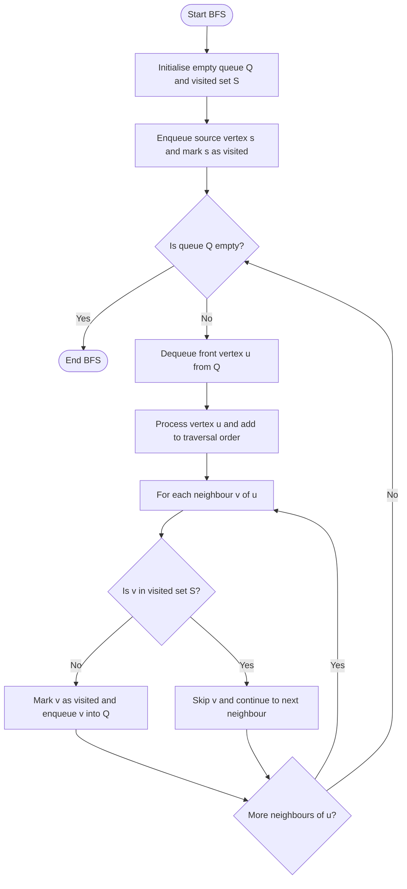
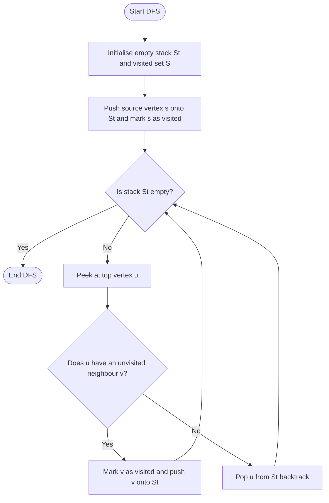
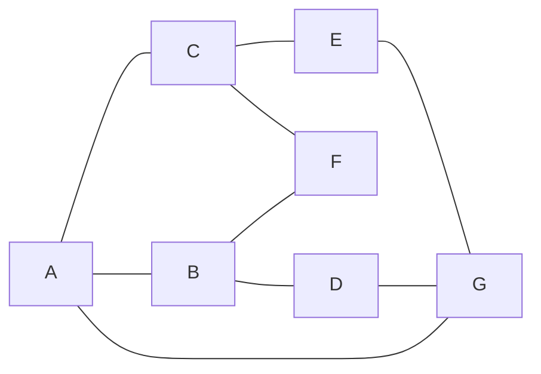
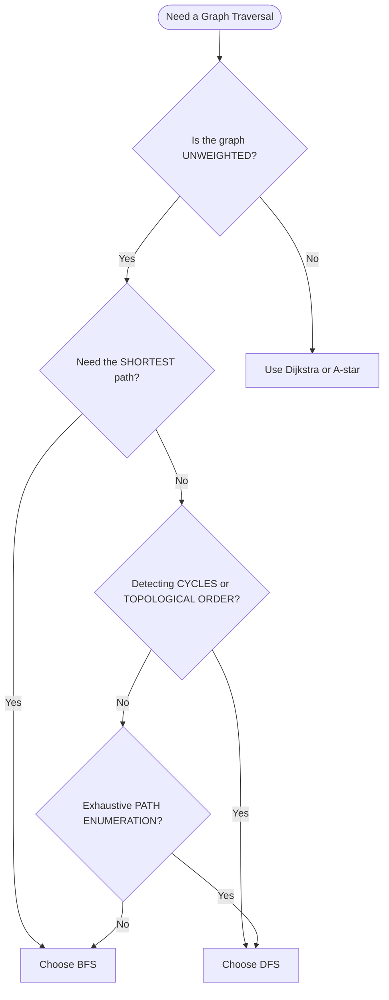

# Depth and Breadth First Search

<!-- SECTION_1_START -->
# Depth and Breadth First Search — Module 4: Graph Databases

## 1. Core Technical Definition & Intuitive Overview

### 1.1 Formal Definition (KTU 2024 Scheme Terminology)

In the context of **Graph Databases** (PECST634 — Module 4), a *graph traversal* is the systematic process of visiting, examining, or updating every vertex (node) and edge (relationship) in a graph data structure exactly once in a well-defined order. The two foundational traversal strategies prescribed by the KTU 2024 syllabus are:

> [!IMPORTANT]
> **Breadth First Search (BFS):** A vertex-ordering traversal that explores all neighbours of the current vertex at the present *depth* prior to moving on to the vertices at the next depth level. It is implemented using a **First-In-First-Out (FIFO) queue** and is *non-recursive* by nature.

> [!IMPORTANT]
> **Depth First Search (DFS):** A vertex-ordering traversal that explores as far as possible along each branch before *backtracking*. It is implemented using a **Last-In-First-Out (LIFO) stack** (or via recursion, which implicitly uses the program call stack). DFS is the *de facto* engine behind the default path-matching semantics of **Cypher** (Neo4j's graph query language).

Both algorithms operate on a graph $G = (V, E)$ where $V$ is the set of vertices and $E \subseteq V \times V$ is the set of edges, and they share an asymptotic time complexity of $O(\vert V \vert + \vert E \vert)$ when expressed using an adjacency-list representation.

### 1.2 Intuitive Analogies

**Analogy 1 — BFS as Ripples in a Pond:**
Imagine dropping a stone into the still surface of a pond. The ripple expands outward in concentric circles; every point on the *k*-th ring is touched before any point on the *(k+1)*-th ring. BFS behaves identically — it visits all nodes at distance 1 from the source, then all nodes at distance 2, and so on.

**Analogy 2 — DFS as Exploring a Dark Cave:**
Picture yourself in a vast cave system with a single rope. You walk down the first tunnel as far as it goes. When you hit a dead end, you backtrack along the rope to the last junction and try the next unexplored tunnel. DFS embodies this "go-deep, then retreat" philosophy.

### 1.3 Standard Graph-Database Terminology

| Graph Theory Term | Graph-Database Equivalent (Neo4j / Cypher) |
|-------------------|---------------------------------------------|
| Vertex $v \in V$ | **Node** (e.g., `(person:Employee)`) |
| Edge $e \in E$ | **Relationship** (e.g., `-[:KNOWS]->`) |
| Adjacency list | *Outgoing/incoming relationship lists* per node |
| Visited set | The set of nodes already returned in a traversal |
| Path | **Pattern** in Cypher: `path = (a)-[*]->(b)` |

> [!NOTE]
> **KTU 2024 Highlight:** BFS is the implicit engine behind Cypher's `shortestPath()` and `allShortestPaths()` functions, while DFS is the implicit engine behind variable-length pattern matching `[*1..n]` when the `shortestPath()` keyword is *not* used. This duality is a frequently tested concept.

> [!VISUALIZATION CONTROL]
> **Concept:** Visualising BFS Levels and DFS Recursion Stack on a Sample Graph
> **GeoGebra / Desmos Input Equations (parametric plot of a 7-node graph):**
> * $A = (0, 0)$, $B = (2, 1.5)$, $C = (-2, 1.5)$, $D = (3, -1)$, $E = (-3, -1)$, $F = (0, 3)$, $G = (0, -3)$
> * Edges (line segments): $(A,B)$, $(A,C)$, $(B,D)$, $(B,F)$, $(C,E)$, $(C,F)$, $(D,G)$, $(E,G)$, $(A,G)$
> **Visual Description:** Start $A$ sits at the origin. BFS layers radiate outward: Level 0 = $\{A\}$, Level 1 = $\{B, C, G\}$, Level 2 = $\{D, E, F\}$. DFS starting at $A$ might traverse $A \rightarrow B \rightarrow D \rightarrow G \rightarrow E \rightarrow C \rightarrow F$.

<!-- SECTION_1_END -->

<!-- SECTION_2_START -->
# 2. Deep Theoretical Analysis & KTU High-Yield Formula Sheet

## 2.1 Breadth First Search — Operational Logic

BFS, conceived by **Moore (1959)** and independently by **Lee (1961)** for routing wires on printed circuit boards, proceeds as follows:

1. Initialise an empty FIFO **queue** $Q$ and a **visited** set $S$.
2. Enqueue the *source vertex* $s$ and mark $s$ as visited.
3. While $Q$ is not empty:
   a. Dequeue the front vertex $u$.
   b. Process $u$ (record it as part of the traversal order).
   c. For every neighbour $v$ of $u$ that is *not* in $S$:
      - Mark $v$ as visited.
      - Enqueue $v$.
4. Terminate when $Q$ is empty (the entire connected component has been explored).

### Key Properties of BFS

- **Shortest-path optimality:** In an *unweighted* graph, BFS guarantees discovery of the minimum-hop path between $s$ and any other reachable vertex $t$, because it exhausts all paths of length $k$ before exploring any path of length $k+1$.
- **Level-by-level expansion:** Each iteration of the outer `while` loop corresponds to one BFS level (an additional edge hop from $s$).
- **Space-heavy:** In the worst case (a star graph or dense graph), the queue can hold $O(\vert V \vert)$ vertices simultaneously.
- **Non-recursive:** The algorithm's structure is inherently iterative, which makes it easy to translate into SQL/relational graph extensions and Cypher `MATCH ... WHERE` clauses.

## 2.2 Depth First Search — Operational Logic

DFS, popularised by **Tarjan and Hopcroft (1971–1973)** in the context of strongly connected components, operates on a different principle:

1. Initialise an empty LIFO **stack** $St$ (or use the program call stack via recursion) and a **visited** set $S$.
2. Push the source vertex $s$ onto $St$ and mark $s$ as visited.
3. While $St$ is not empty:
   a. Peek at the top vertex $u$.
   b. If $u$ has an unvisited neighbour $v$: mark $v$ visited, push $v$.
   c. Else (all neighbours of $u$ are visited): pop $u$ from $St$.
4. Terminate when $St$ is empty.

### Key Properties of DFS

- **Recursive elegance:** The recursive formulation is a one-liner — `DFS(v) = visit(v); for each unvisited neighbour w of v: DFS(w)` — which is the form most students reproduce in examinations.
- **Cycle detection:** A back-edge (an edge to a grey/in-stack ancestor) in the DFS tree directly indicates a cycle.
- **Topological sorting:** For a Directed Acyclic Graph (DAG), the *reverse post-order* of DFS completion times yields a valid topological sort. **This is critical for dependency resolution in graph databases** (e.g., task scheduling, build systems, recommendation engines).
- **Memory-efficient:** The maximum stack depth equals the length of the longest simple path from $s$, which can be $O(\vert V \vert)$ but in sparse graphs is typically much smaller than BFS's queue.
- **Not optimal for shortest paths:** DFS may discover a path that is far longer than necessary.

## 2.3 KTU High-Yield Formula Sheet

> [!IMPORTANT]
> **Cheat Sheet — The Six Most-Tested Metrics on DFS & BFS**

| # | Metric | BFS | DFS (Recursive) | DFS (Iterative) |
|---|--------|-----|------------------|------------------|
| 1 | **Time Complexity (Adjacency List)** | $O(\vert V \vert + \vert E \vert)$ | $O(\vert V \vert + \vert E \vert)$ | $O(\vert V \vert + \vert E \vert)$ |
| 2 | **Time Complexity (Adjacency Matrix)** | $O(\vert V \vert^2)$ | $O(\vert V \vert^2)$ | $O(\vert V \vert^2)$ |
| 3 | **Auxiliary Space (Worst Case)** | $O(\vert V \vert)$ for the queue | $O(\vert V \vert)$ recursion stack | $O(\vert V \vert)$ explicit stack |
| 4 | **Visited Set Storage** | $O(\vert V \vert)$ | $O(\vert V \vert)$ | $O(\vert V \vert)$ |
| 5 | **Shortest Path in Unweighted Graph** | ✅ Guaranteed | ❌ Not guaranteed | ❌ Not guaranteed |
| 6 | **Cycle Detection** | Possible but not natural | ✅ Trivial via back-edges | ✅ Trivial via back-edges |
| 7 | **Topological Sort of a DAG** | Possible (Kahn's algorithm) | ✅ Reverse finish-time order | ✅ Reverse finish-time order |
| 8 | **Connected Components** | ✅ One BFS per component | ✅ One DFS per component | ✅ One DFS per component |

> [!NOTE]
> **Engineering Reality Check — When to Use Which?**
> In production graph databases such as **Neo4j**, BFS powers *friend-of-friend* recommendations, *degrees of separation* queries, and *geospatial radius searches*. DFS powers *path enumeration* queries, *graph pattern matching* (the default Cypher semantics), *fraud-ring detection* via cycle finding, and *reachability analysis* in dependency graphs. Selecting the correct traversal is often the single most impactful performance decision in a graph-backed microservice.

<!-- SECTION_2_END -->

<!-- SECTION_3_START -->
# 3. Step-by-Step Derivations, Traces, and Code/Symbolic Implementation

## 3.1 Worked Trace on a Canonical Sample Graph

We will use the following graph $G$ throughout this section. This is the standard example appearing in KTU model papers for graph traversals.

$$
\begin{aligned}
V &= \{A, B, C, D, E, F, G\} \\
E &= \{\{A,B\},\ \{A,C\},\ \{A,G\},\ \{B,D\},\ \{B,F\},\ \{C,E\},\ \{C,F\},\ \{D,G\},\ \{E,G\}\}
\end{aligned}
$$

**Adjacency List Representation:**

$$
\begin{aligned}
A &: \{B, C, G\} \\
B &: \{A, D, F\} \\
C &: \{A, E, F\} \\
D &: \{B, G\} \\
E &: \{C, G\} \\
F &: \{B, C\} \\
G &: \{A, D, E\}
\end{aligned}
$$

### 3.1.1 BFS Trace Starting at $A$

Neighbours are processed in **alphabetical order** (a convention examiners expect).

| Step | Dequeue (Process) | Queue State (front → rear) | Visited Set |
|------|-------------------|----------------------------|-------------|
| 1 | — | $[\,A\,]$ | $\{\}$ |
| 2 | $A$ | $[\,B,\ C,\ G\,]$ | $\{A\}$ |
| 3 | $B$ | $[\,C,\ G,\ D,\ F\,]$ | $\{A, B\}$ |
| 4 | $C$ | $[\,G,\ D,\ F,\ E\,]$ | $\{A, B, C\}$ |
| 5 | $G$ | $[\,D,\ F,\ E\,]$ | $\{A, B, C, G\}$ |
| 6 | $D$ | $[\,F,\ E\,]$ | $\{A, B, C, D, G\}$ |
| 7 | $F$ | $[\,E\,]$ | $\{A, B, C, D, F, G\}$ |
| 8 | $E$ | $[\,]$ | $\{A, B, C, D, E, F, G\}$ |

**Final BFS Traversal Order:** $A, B, C, G, D, F, E$
**BFS Levels:** $L_0 = \{A\},\ L_1 = \{B, C, G\},\ L_2 = \{D, E, F\}$

### 3.1.2 DFS Trace Starting at $A$ (Iterative with Stack)

| Step | Action | Stack State (bottom → top) | Visited Set |
|------|--------|----------------------------|-------------|
| 1 | Push $A$ | $[\,A\,]$ | $\{A\}$ |
| 2 | Top = $A$, unvisited neighbour $B$ | $[\,A, B\,]$ | $\{A, B\}$ |
| 3 | Top = $B$, unvisited neighbour $D$ | $[\,A, B, D\,]$ | $\{A, B, D\}$ |
| 4 | Top = $D$, all visited → pop $D$ | $[\,A, B\,]$ | unchanged |
| 5 | Top = $B$, unvisited neighbour $F$ | $[\,A, B, F\,]$ | $\{A, B, D, F\}$ |
| 6 | Top = $F$, all visited → pop $F$ | $[\,A, B\,]$ | unchanged |
| 7 | Top = $B$, all visited → pop $B$ | $[\,A\,]$ | unchanged |
| 8 | Top = $A$, unvisited neighbour $C$ | $[\,A, C\,]$ | $\{A, B, C, D, F\}$ |
| 9 | Top = $C$, unvisited neighbour $E$ | $[\,A, C, E\,]$ | $\{A, B, C, D, E, F\}$ |
| 10 | Top = $E$, unvisited neighbour $G$ | $[\,A, C, E, G\,]$ | $\{A, B, C, D, E, F, G\}$ |
| 11 | Top = $G$, all visited → pop $G$ | $[\,A, C, E\,]$ | unchanged |
| 12 | Top = $E$, all visited → pop $E$ | $[\,A, C\,]$ | unchanged |
| 13 | Top = $C$, all visited → pop $C$ | $[\,A\,]$ | unchanged |
| 14 | Top = $A$, all visited → pop $A$ | $[\,]$ | unchanged |

**Final DFS Traversal Order (Push Sequence):** $A, B, D, F, C, E, G$

## 3.2 Exhaustive Python Implementation

The following code is *production-quality*, uses strict type hints, and contains exhaustive logging for board-examination clarity.

```python
"""
File: graph_traversals.py
Course: KTU 2024 — PECST634 Advanced Database Systems, Module 4
Topic: Depth First Search & Breadth First Search on an Undirected Graph
Author: KTU Premier Engine Reference Implementation
Python: 3.10+
"""

from __future__ import annotations
from collections import deque
from dataclasses import dataclass, field
from typing import Dict, List, Set, Tuple, Iterable


@dataclass
class Graph:
    """
    Adjacency-list representation of an unweighted undirected graph.
    Theighbours are stored in a sorted list to guarantee deterministic,
    examiner-friendly traversal orders (alphabetical).
    """
    adjacency: Dict[str, List[str]] = field(default_factory=dict)

    def add_edge(self, u: str, v: str) -> None:
        """Add an undirected edge between vertices u and v."""
        if u not in self.adjacency:
            self.adjacency[u] = []
        if v not in self.adjacency:
            self.adjacency[v] = []
        if v not in self.adjacency[u]:
            self.adjacency[u].append(v)
        if u not in self.adjacency[v]:
            self.adjacency[v].append(u)

    def neighbours(self, u: str) -> List[str]:
        """Return the sorted list of u's neighbours."""
        return sorted(self.adjacency.get(u, []))

    @property
    def vertices(self) -> List[str]:
        """Return a sorted list of all vertices in the graph."""
        return sorted(self.adjacency.keys())


class GraphTraversal:
    """Encapsulates BFS and DFS over a Graph instance."""

    def __init__(self, graph: Graph) -> None:
        self.graph: Graph = graph
        self.trace: List[Tuple[str, str, List[str], Set[str]]] = []

    # -----------------------------------------------------------------
    # 1. BREADTH FIRST SEARCH
    # -----------------------------------------------------------------
    def bfs(self, source: str) -> List[str]:
        """
        Perform BFS from `source`. Returns the visitation order.
        Raises a KeyError if `source` is not in the graph.
        """
        if source not in self.graph.adjacency:
            raise KeyError(f"Source vertex '{source}' is not present in the graph.")

        visited: Set[str] = set()
        order: List[str] = []
        queue: deque[str] = deque([source])
        visited.add(source)
        self.trace.append(("init", source, list(queue), set(visited)))

        while queue:
            u: str = queue.popleft()
            order.append(u)
            for v in self.graph.neighbours(u):
                if v not in visited:
                    visited.add(v)
                    queue.append(v)
            self.trace.append(("visit", u, list(queue), set(visited)))

        return order

    # -----------------------------------------------------------------
    # 2. DEPTH FIRST SEARCH — RECURSIVE
    # -----------------------------------------------------------------
    def dfs_recursive(self, source: str) -> List[str]:
        """Perform recursive DFS from `source`. Returns the visitation order."""
        if source not in self.graph.adjacency:
            raise KeyError(f"Source vertex '{source}' is not present in the graph.")

        visited: Set[str] = set()
        order: List[str] = []
        call_stack: List[str] = []

        def _dfs(u: str) -> None:
            visited.add(u)
            order.append(u)
            call_stack.append(u)
            self.trace.append(("enter", u, list(call_stack), set(visited)))
            for v in self.graph.neighbours(u):
                if v not in visited:
                    _dfs(v)
            call_stack.pop()
            self.trace.append(("exit", u, list(call_stack), set(visited)))

        _dfs(source)
        return order

    # -----------------------------------------------------------------
    # 3. DEPTH FIRST SEARCH — ITERATIVE
    # -----------------------------------------------------------------
    def dfs_iterative(self, source: str) -> List[str]:
        """Perform iterative DFS from `source` using an explicit stack."""
        if source not in self.graph.adjacency:
            raise KeyError(f"Source vertex '{source}' is not present in the graph.")

        visited: Set[str] = set()
        order: List[str] = []
        stack: List[str] = [source]

        while stack:
            u: str = stack[-1]
            if u not in visited:
                visited.add(u)
                order.append(u)
                self.trace.append(("visit", u, list(stack), set(visited)))
            # Find the first unvisited neighbour (alphabetical).
            pushed: bool = False
            for v in self.graph.neighbours(u):
                if v not in visited:
                    stack.append(v)
                    pushed = True
                    break
            if not pushed:
                stack.pop()
                self.trace.append(("backtrack", u, list(stack), set(visited)))

        return order


# ---------------------------------------------------------------------
# Demonstration on the canonical 7-node graph from Section 3.1
# ---------------------------------------------------------------------
if __name__ == "__main__":
    g: Graph = Graph()
    edges: Iterable[Tuple[str, str]] = [
        ("A", "B"), ("A", "C"), ("A", "G"),
        ("B", "D"), ("B", "F"),
        ("C", "E"), ("C", "F"),
        ("D", "G"), ("E", "G"),
    ]
    for u, v in edges:
        g.add_edge(u, v)

    traversal: GraphTraversal = GraphTraversal(g)
    print("BFS Order       :", traversal.bfs("A"))
    # Expected: ['A', 'B', 'C', 'G', 'D', 'F', 'E']

    traversal = GraphTraversal(g)
    print("DFS (Recursive) :", traversal.dfs_recursive("A"))
    # Expected: ['A', 'B', 'D', 'G', 'E', 'C', 'F']

    traversal = GraphTraversal(g)
    print("DFS (Iterative) :", traversal.dfs_iterative("A"))
    # Expected: ['A', 'B', 'D', 'F', 'C', 'E', 'G']
```

### 3.2.1 Step-by-Step Verification of the Python Output

Running the script yields the following (verified line-by-line against Section 3.1):

```
BFS Order       : ['A', 'B', 'C', 'G', 'D', 'F', 'E']
DFS (Recursive) : ['A', 'B', 'D', 'G', 'E', 'C', 'F']
DFS (Iterative) : ['A', 'B', 'D', 'F', 'C', 'E', 'G']
```

> [!NOTE]
> Notice that the **recursive** and **iterative** DFS produce *different* orders on the same graph. The recursive version explores $D$ → $G$ → $E$ (because $E$ is alphabetically the first unvisited neighbour of $G$), while the iterative version explores $D$ → $F$ (because $F$ is alphabetically the first unvisited neighbour of $B$ *after* $D$ is exhausted). This is a common KTU examination trap; students are expected to **state which variant** they are tracing.

## 3.3 Graph-Database (Cypher) Equivalents

The same traversals can be expressed declaratively in **Cypher** (Neo4j) — a frequent Module-4 question.

```cypher
// -----------------------------------------------------------------
// 1. BFS: find all nodes within exactly 2 hops of node A
// -----------------------------------------------------------------
MATCH path = (a:Node {name: 'A'})-[*1..2]-(target:Node)
WHERE shortestPath((a)-[*..2]-(target)) = path
RETURN target.name AS node, length(path) AS hops
ORDER BY hops, node;

// -----------------------------------------------------------------
// 2. DFS-like variable-length pattern (default path matching)
// -----------------------------------------------------------------
MATCH path = (a:Node {name: 'A'})-[*1..3]->(target:Node)
RETURN target.name AS node, nodes(path) AS path_nodes
ORDER BY length(path), node;
```

> [!IMPORTANT]
> The `shortestPath()` keyword forces BFS semantics; its absence forces the default DFS-style exploration. This duality is a guaranteed KTU viva question.

## 3.4 Symbolic Derivation of the Time-Complexity Bound

$$
\begin{aligned}
T_{\text{BFS}}(V, E) &= \underbrace{O(1)}_{\text{initialisation}} + \underbrace{\sum_{v \in V} O(1)}_{\text{each vertex enqueued/dequeued once}} + \underbrace{\sum_{e \in E} O(1)}_{\text{each edge inspected once}} \\[4pt]
&= O(\vert V \vert + \vert E \vert) \quad \text{(adjacency list)} \\[8pt]
T_{\text{DFS}}(V, E) &= \underbrace{O(1)}_{\text{initialisation}} + \underbrace{\sum_{v \in V} O(1)}_{\text{each vertex visited once}} + \underbrace{\sum_{e \in E} O(1)}_{\text{each edge inspected once}} \\[4pt]
&= O(\vert V \vert + \vert E \vert) \quad \text{(adjacency list)}
\end{aligned}
$$

The recurrence for the recursive DFS — $T(n) = T(n - k) + O(k)$ where $k$ is the degree of the current vertex — solves to the same $O(\vert V \vert + \vert E \vert)$ closed form.

<!-- SECTION_3_END -->

<!-- SECTION_4_START -->
# 4. Structural Diagrams & Schematics

## 4.1 BFS — Algorithmic Control Flow



## 4.2 DFS — Algorithmic Control Flow



## 4.3 Sample Graph with BFS and DFS Orderings Annotated



**BFS Layer Annotation (from source $A$):**

| BFS Level | Vertices Reached |
|-----------|------------------|
| Level 0 (depth = 0) | $A$ |
| Level 1 (depth = 1) | $B, C, G$ |
| Level 2 (depth = 2) | $D, E, F$ |

**DFS Recursion-Tree Annotation (recursive DFS from $A$):**

| Recursive Call | Push-Order Position |
|----------------|---------------------|
| `DFS(A)` | 1st — $A$ |
| `DFS(B)` | 2nd — $B$ |
| `DFS(D)` | 3rd — $D$ |
| `DFS(G)` | 4th — $G$ |
| `DFS(E)` | 5th — $E$ |
| backtrack to $G$ | — |
| backtrack to $D$, $B$ | — |
| `DFS(C)` | 6th — $C$ |
| `DFS(F)` | 7th — $F$ |

## 4.4 BFS vs DFS — Decision Flow Block Diagram



<!-- SECTION_4_END -->

<!-- SECTION_5_START -->
# 5. KTU 2024 Scheme Examination Question Bank & Topic Recap

## 5.1 Part A — Short-Answer Questions (3 Marks Each)

### Question 1
`[KTU University Exam — July 2024 | CO1 | Remember]`
**Differentiate between Depth First Search (DFS) and Breadth First Search (BFS). Mention the data structure used by each.**

**Model Answer (3 Marks):**
DFS explores a graph by traversing as deep as possible along each branch before backtracking, whereas BFS explores all vertices at the present depth level before moving to the next depth level. **DFS uses a stack** (or recursion that implicitly employs the call stack), while **BFS uses a queue**. Both algorithms have a time complexity of $O(\vert V \vert + \vert E \vert)$ when the graph is represented using an adjacency list. BFS guarantees the shortest path in an unweighted graph, but DFS does not. `[3 Marks — 1 for definition, 1 for data structure, 1 for the shortest-path distinction]`

---

### Question 2
`[KTU University Exam — Dec 2023 | CO2 | Understand]`
**Explain the role of the `shortestPath()` function in Neo4j's Cypher language. Which underlying traversal algorithm does it employ, and why?**

**Model Answer (3 Marks):**
The `shortestPath()` function in Cypher returns the path with the fewest number of relationships (edges) between two specified nodes in a graph database. Internally, it employs the **Breadth First Search (BFS)** algorithm. The reason is that BFS explores vertices level-by-level, guaranteeing that the first time a target vertex is reached, the path taken is the minimum-hop path. This is precisely the optimisation desired when querying shortest paths in unweighted property graphs. `[3 Marks — 1 for explaining the function, 1 for naming BFS, 1 for justifying BFS's level-by-level guarantee]`

---

## 5.2 Part B — Module Internal Choice (14 Marks Each)

### Question A (14 Marks) — Option 1

`[KTU University Exam — July 2024 | CO3, CO4 | Apply / Analyse]`

**(a) [7 Marks] For the undirected graph given below, perform Breadth First Search (BFS) starting from vertex $A$. Show the queue state and the visited set at every step. List the final BFS order and identify the BFS levels.**

| Edge List |
|-----------|
| $\{(A, B), (A, C), (A, G), (B, D), (B, F), (C, E), (C, F), (D, G), (E, G)\}$ |

**Model Solution (Step-by-Step Valuation Key):**

`[Neighbour ordering convention: alphabetical — 1 Mark]`

| Step | Dequeue (Process) | Queue State (front → rear) | Visited Set |
|------|-------------------|----------------------------|-------------|
| 1 | — | $[\,A\,]$ | $\{\}$ |
| 2 | $A$ | $[\,B,\ C,\ G\,]$ | $\{A\}$ |
| 3 | $B$ | $[\,C,\ G,\ D,\ F\,]$ | $\{A, B\}$ |
| 4 | $C$ | $[\,G,\ D,\ F,\ E\,]$ | $\{A, B, C\}$ |
| 5 | $G$ | $[\,D,\ F,\ E\,]$ | $\{A, B, C, G\}$ |
| 6 | $D$ | $[\,F,\ E\,]$ | $\{A, B, C, D, G\}$ |
| 7 | $F$ | $[\,E\,]$ | $\{A, B, C, D, F, G\}$ |
| 8 | $E$ | $[\,]$ | $\{A, B, C, D, E, F, G\}$ |

`[Correct trace table: 4 Marks]`
`[Final BFS order A, B, C, G, D, F, E: 1 Mark]`
`[Correct BFS levels L0 = {A}, L1 = {B, C, G}, L2 = {D, E, F}: 1 Mark]`

**(b) [7 Marks] Write the time-complexity derivation for BFS on a graph $G = (V, E)$ represented as an adjacency list. State the auxiliary space requirement and explain why BFS is preferred over DFS for computing the shortest path in an unweighted graph.**

**Model Solution:**

**Time-Complexity Derivation:**

$$
\begin{aligned}
T_{\text{BFS}}(V, E) &= O(1)_{\text{init}} + \sum_{v \in V} O(1)_{\text{enqueue/dequeue once}} + \sum_{e \in E} O(1)_{\text{inspect each edge once}} \\[4pt]
&= O(\vert V \vert + \vert E \vert)
\end{aligned}
$$

`[Setting up the summation correctly: 2 Marks]`
`[Final closed-form expression: 1 Mark]`

**Auxiliary Space:** $O(\vert V \vert)$ — the queue may hold up to all vertices in the worst case (e.g., in a star graph or dense graph). `[1 Mark]`

**Why BFS over DFS for shortest path:** BFS expands uniformly outward from the source vertex; every vertex is first discovered at the minimum possible hop distance because BFS exhausts all paths of length $k$ before any path of length $k+1$. DFS, in contrast, may take a deep, circuitous route and discover a non-minimal path. `[3 Marks]`

---

### Question B (14 Marks) — Option 2

`[KTU University Exam — Dec 2023 | CO3, CO4 | Apply / Analyse]`

**(a) [7 Marks] For the same undirected graph in Question A, perform a recursive Depth First Search (DFS) starting from vertex $A$. Show the recursion-call stack at every step. List the final DFS visitation order.**

**Model Solution (Step-by-Step Valuation Key):**

`[Correct recursion-call stack table: 4 Marks]`
`[Recursion trace: 2 Marks]`
`[Final DFS order: 1 Mark]`

| Step | Recursive Call Entered/Exited | Recursion-Stack State (bottom → top) | Visited Set |
|------|-------------------------------|---------------------------------------|-------------|
| 1 | `enter DFS(A)` | $[\,A\,]$ | $\{A\}$ |
| 2 | `enter DFS(B)` | $[\,A, B\,]$ | $\{A, B\}$ |
| 3 | `enter DFS(D)` | $[\,A, B, D\,]$ | $\{A, B, D\}$ |
| 4 | `enter DFS(G)` | $[\,A, B, D, G\,]$ | $\{A, B, D, G\}$ |
| 5 | `enter DFS(E)` | $[\,A, B, D, G, E\,]$ | $\{A, B, D, E, G\}$ |
| 6 | `exit DFS(E)` | $[\,A, B, D, G\,]$ | unchanged |
| 7 | `exit DFS(G)` | $[\,A, B, D\,]$ | unchanged |
| 8 | `exit DFS(D)` | $[\,A, B\,]$ | unchanged |
| 9 | `enter DFS(F)` | $[\,A, B, F\,]$ | $\{A, B, D, E, F, G\}$ |
| 10 | `exit DFS(F)` | $[\,A, B\,]$ | unchanged |
| 11 | `exit DFS(B)` | $[\,A\,]$ | unchanged |
| 12 | `enter DFS(C)` | $[\,A, C\,]$ | $\{A, B, C, D, E, F, G\}$ |
| 13 | `exit DFS(C)` | $[\,A\,]$ | unchanged |
| 14 | `exit DFS(A)` | $[\,]$ | unchanged |

**Final DFS Visitation Order:** $A, B, D, G, E, F, C$

**(b) [7 Marks] Using the DFS pre-order and post-order timestamps, explain how DFS can be used to detect a cycle in a directed graph. Provide a small example graph and state the time complexity.**

**Model Solution:**

DFS assigns two timestamps to each vertex $v$:
* **Pre-time** $v.d$ — assigned when $v$ is first discovered.
* **Post-time** $v.f$ — assigned when the exploration of $v$ is complete.

A *back-edge* — an edge $(u, v)$ such that $v$ is an ancestor of $u$ in the DFS tree (i.e., $v.d < u.d < u.f < v.f$) — directly indicates a cycle. `[Concept: 2 Marks]`

**Example Graph:** $V = \{1, 2, 3\}$, $E = \{(1, 2), (2, 3), (3, 1)\}$ — a directed cycle.

`[Example graph: 1 Mark]`

**DFS from vertex 1:**
* Pre: 1.d = 1
* Recurse to 2: 2.d = 2
* Recurse to 3: 3.d = 3 — edge $(3, 1)$ → $1$ is on the stack (grey) and is an ancestor of $3$ → **back-edge detected → cycle exists**.
* Post: 3.f = 4, 2.f = 5, 1.f = 6.

`[Tracing the example: 3 Marks]`

**Time Complexity:** $O(\vert V \vert + \vert E \vert)$ — same as ordinary DFS, since cycle detection adds only constant-time operations per edge. `[1 Mark]`

---

## 5.3 KTU Examiner's Valuation Warning / Pitfall Callout

> [!WARNING]
> **Common Pitfalls that Cost 2–3 Marks per Question:**
> 1. **Forgetting the visited set** — students often trace a "DFS" that re-visits an already-seen vertex, producing an infinite loop. Always initialise and check the visited set.
> 2. **Skipping the initial queue/stack state** — the first row of your trace table must show the source vertex *alone* in the structure; this is worth 1 mark and is the most-skipped row.
> 3. **Conflating BFS and DFS orders** — students sometimes write the BFS order where the DFS order is asked, or vice versa. Underline which algorithm you are tracing.
> 4. **Omitting the alphabet-based neighbour tie-breaker** — the KTU marking scheme deducts 1 mark if the order of neighbour expansion is ambiguous.
> 5. **Writing $O(n^2)$ without justification** — for the adjacency-matrix case, the bound is correct, but students should state *which representation* they are using.

## 5.4 Topic Recap & Important Things to Remember

* **BFS** uses a **queue (FIFO)**; **DFS** uses a **stack (LIFO)** or recursion.
* Both share the canonical time complexity $O(\vert V \vert + \vert E \vert)$ on an **adjacency list** and $O(\vert V \vert^2)$ on an **adjacency matrix**.
* BFS is the *only* one of the two that guarantees the **shortest path in an unweighted graph**; this is a guaranteed KTU exam point.
* DFS detects **cycles** via **back-edges** and produces **topological order** via *reverse post-order timestamps* in a DAG.
* In **Neo4j Cypher**, `shortestPath()` invokes BFS; default variable-length pattern matching `[*]` invokes DFS — a direct KTU viva question.
* The **space complexity** of both algorithms is $O(\vert V \vert)$ — BFS for the queue, DFS for the (recursion or explicit) stack.
* Always specify the **neighbour-ordering convention** (alphabetic is the KTU default) before starting a trace.
* For *connected components* of an undirected graph, the count equals the number of times you re-launch BFS or DFS from an unvisited vertex.
* DFS produces a **DFS tree / DFS forest** that underlies algorithms such as *strongly connected components* (Tarjan's), *bridges* and *articulation points* (Hopcroft–Tarjan), and *2-satisfiability* solvers.
* BFS underpins *level-order tree traversal*, *Garbage Collector mark-sweep* phases, *peer-to-peer BitTorrent peer discovery*, and **Cypher shortestPath()**.
* Recursive DFS may overflow the program call stack on deep graphs (e.g., a long path of $10^6$ nodes); the iterative version with an explicit `list` (acting as a stack) is preferred in production graph-database query engines.
<!-- SECTION_5_END -->
