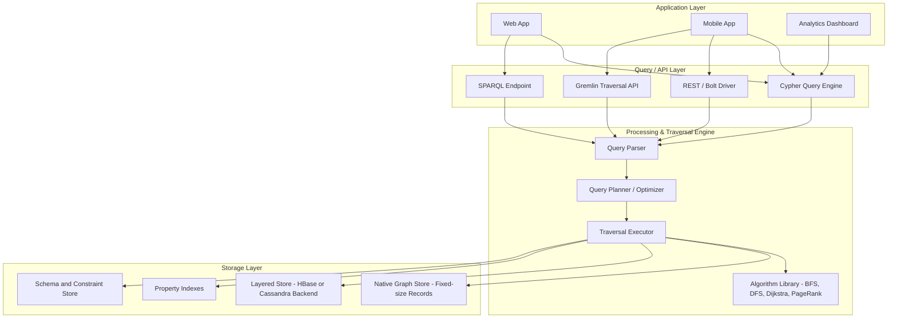
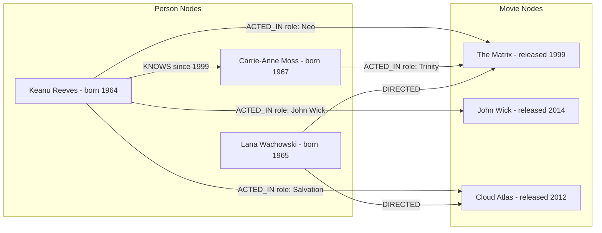
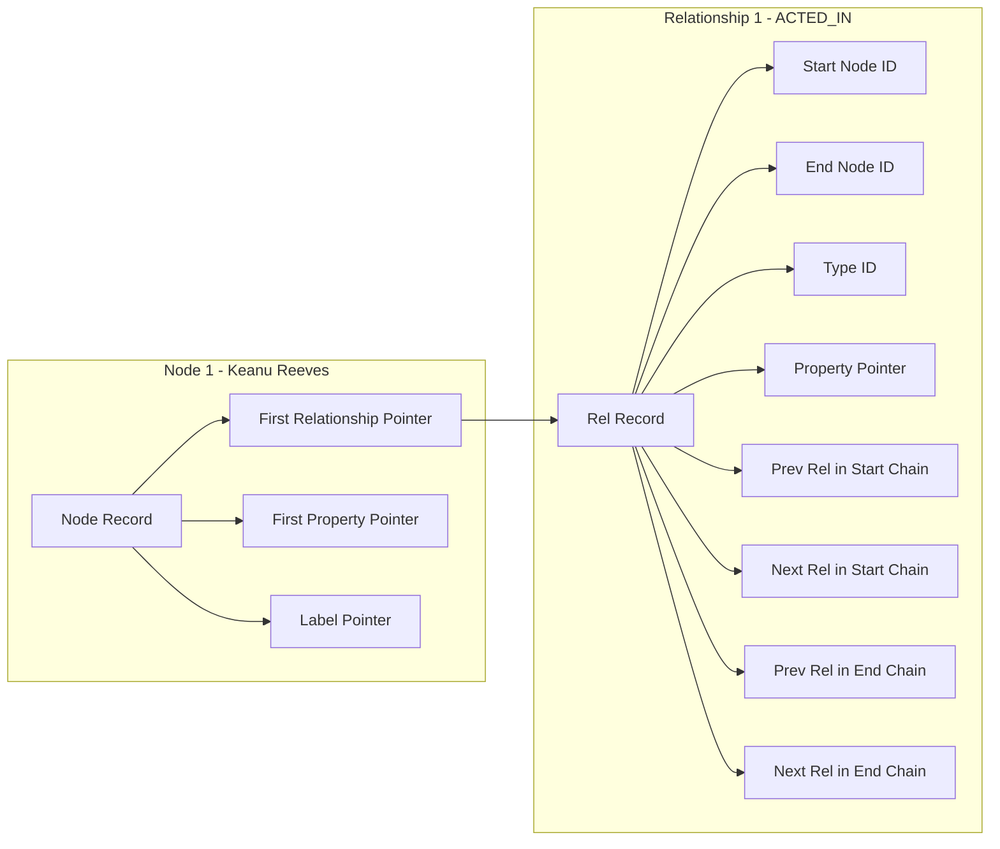
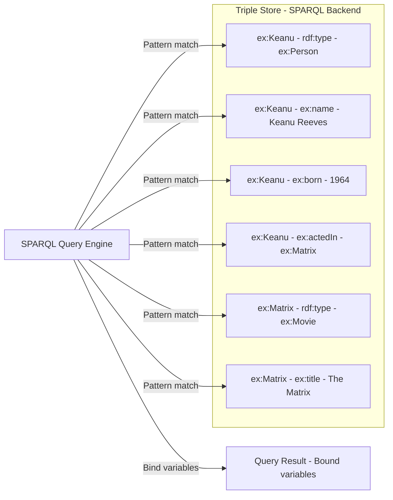
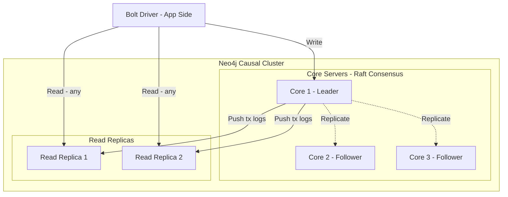
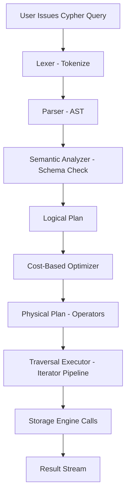

# Graph database -  Introduction

<!-- SECTION_1_START -->
# Graph Database — Introduction

## Formal Definition (KTU 2024 Syllabus Terminology)

> [!IMPORTANT]
> **Graph Database (GDB):** A *graph database* is a specialized **NoSQL database system** that uses **graph structures** — consisting of **nodes (vertices)**, **edges (relationships)**, and **properties (key-value attributes)** — as the fundamental data model for semantic querying, traversal, and persistence. Operations are expressed primarily in terms of **graph traversal** using languages such as **Cypher (Neo4j)**, **SPARQL (RDF stores)**, or **GQL (ISO standard)**.

Formally, a graph database models data as a **labeled, directed, attributed multigraph**:

$$G = (V, E, L, P)$$

where:
- $V$ = finite set of **vertices** (entities / nodes)
- $E \subseteq V \times V$ = set of **edges** (relationships)
- $L$ = set of **labels** assigned to nodes and edges
- $P$ = set of **properties** (attribute–value pairs)

The **relational operator** counterpart of a graph traversal is the **JOIN**, but in a graph DB the JOIN is implicit and resolved at *pointer-speed* through **index-free adjacency**.

---

## Conceptual Analogy / Intuition

> [!NOTE]
> Think of a **graph database** as a **social network in its purest form**, not a spreadsheet of friends.

Imagine you are planning a trip with friends in a city. In a **relational DB**, you would need separate tables for *People*, *Cities*, *Hotels*, *Restaurants*, and you would constantly **JOIN** these tables every time you ask: *"Show me all vegetarian restaurants within 2 km of a hotel booked by a friend of mine who likes history."*

In a **graph database**, the same data is stored as a **web of pre-connected objects**. Asking that question becomes a *walk through the web* — each relationship is a physical pointer to the next node. **No JOINs are computed**; the database simply *follows pointers*.

**Real-world analogy (geographic):**
- **Relational DB** = a printed map with an index. To find a route, you constantly flip between pages (tables).
- **Graph DB** = a road network where every intersection directly knows its neighbors. You just *drive through*.

---

## Key Terminology (Foundation for the Module)

> [!NOTE]
> **The 5 Pillars of Graph Database Vocabulary**
>
> 1. **Node (Vertex)** — Represents a real-world entity (e.g., *Person*, *Movie*, *City*). Carries a **label** (its type/class) and **properties**.
> 2. **Relationship (Edge)** — A first-class citizen that connects two nodes. Always **directed**, has a **type** (e.g., *ACTED_IN*, *KNOWS*), and can carry **properties** (e.g., `weight: 0.8`, `since: 2018`).
> 3. **Property** — A key–value pair attached to a node, relationship, or label (e.g., `name: "Rahul"`, `born: 1999`).
> 4. **Label** — A categorical tag that groups nodes (e.g., all `Person` nodes). Indexes and constraints are typically built on labels.
> 5. **Path / Traversal** — An ordered sequence of nodes and edges visited during a query. Traversal is the **primary query mechanism**.

---

## Why Graph Databases? The Motivation

Traditional **RDBMS** struggles with **highly connected data** because:

$$\text{Cost of JOIN} \approx O(N \log N) \quad \text{(per join, with indexing)}$$

For a query of depth $k$ across $m$ relations, the cost compounds to:

$$T_{\text{RDBMS}} = O\!\left(\prod_{i=1}^{k} \vert R_i \vert \log \vert R_i \vert\right)$$

while a graph database performs the same traversal in:

$$T_{\text{GraphDB}} = O\!\left(\sum_{i=1}^{k} d_i\right)$$

where $d_i$ is the **out-degree** of the current node at step $i$ (a much smaller number for sparse real-world graphs).

> [!IMPORTANT]
> **KTU High-Yield Fact:** This is the *Index-Free Adjacency* advantage — every node directly stores references (pointers) to its adjacent nodes. This is why graph databases are recommended for **connected-data problems** like social networks, fraud rings, knowledge graphs, and recommendation engines.

---

## Property Graph Model — The Dominant Paradigm

Most modern graph databases (Neo4j, JanusGraph, TigerGraph, Amazon Neptune's property-graph mode) implement the **Property Graph Model (PGM)**, standardized as:

$$\text{PG} = (V, E, \lambda, \mu)$$

with:
- $\lambda : V \to 2^L$ assigns labels to nodes.
- $\mu : (V \cup E) \to 2^{K \times V}$ assigns key–value properties.

The **RDF (Resource Description Framework)** model is the alternative, used for **semantic web** and triple stores:

$$\text{Triple} = (s, p, o) \quad \text{where } s, o \in U \cup L,\ p \in U$$

with $U$ = URI set, $L$ = Literal set.

> [!VISUALIZATION CONTROL]
> **Concept:** Basic Property Graph Structure (3 nodes, 3 edges, 1 loop-free path)
> **GeoGebra / Desmos Input (Adjacency representation):**
> * Vertices: `A(1,1)`, `B(5,2)`, `C(3,5)`
> * Edges: `e1: A -> B`, `e2: B -> C`, `e3: A -> C`
> * Properties: `A.name = "Alice"`, `B.name = "Bob"`, `C.name = "Charlie"`
> **Visual Description:** A small triangle with 3 nodes and 3 directed edges — observe how every node is a *first-class object* and the edges themselves can carry their own property bag (e.g., edge `e1` has `since: 2010`).

---

## Where Graph Databases Are Used in Industry

| Domain | Use Case | Why Graph? |
|---|---|---|
| **Social Networks** | Friend-of-friend, mutual connections | Multi-hop traversal, low latency |
| **Fraud Detection** | Ring analysis, money-laundering patterns | Subgraph matching, cycle detection |
| **Knowledge Graphs** | Google KG, Wikidata, enterprise search | Ontology + semantic reasoning |
| **Recommendation Engines** | "Customers who bought X also bought Y" | Path-based scoring |
| **Network/IT Operations** | Dependency mapping, root-cause analysis | Topology traversal |
| **Life Sciences** | Protein–protein interaction, drug discovery | Heterogeneous, deeply connected data |
| **Master Data Management** | 360° customer view | Unified entity resolution |

<!-- SECTION_1_END -->

<!-- SECTION_2_START -->
# Deep Theoretical Analysis & KTU High-Yield Formula Sheet

## 1. Anatomy of a Graph Database

A graph database system is composed of the following layers (bottom-up):

> [!IMPORTANT]
> **Storage Layer** → **Processing / Query Engine** → **Traversal Engine** → **API / Query Language** → **Application Interface**

### 1.1 Storage Layer

Two primary physical-storage philosophies exist:

**(a) Native Graph Storage (e.g., Neo4j)**

Uses **fixed-size records** stored in a custom file store. Each record contains:
- Pointer to the **first node**
- Pointer to the **first relationship**
- Pointer to the **first property**
- Pointer to the **next relationship in chain** (for each direction)

The cost of reading a node, its label, and following one edge is **O(1)** — a single pointer dereference.

**(b) Non-Native (Layered) Graph Storage (e.g., JanusGraph on HBase/Cassandra)**

Stores vertices and edges as **rows** in a wide-column store. Adjacency is reconstructed at query time using secondary indexes. Slightly higher constant cost, but unbounded scalability.

### 1.2 Processing Engine

The processing engine evaluates declarative graph queries. For Cypher (Neo4j), the operator pipeline is:

$$\text{MATCH} \rightarrow \text{WHERE} \rightarrow \text{WITH} \rightarrow \text{RETURN}$$

Each operator is implemented as an **iterator** in the classic *Volcano* / *Iterator* model, with **Traversal State** carried in the iterator's local memory.

### 1.3 Traversal Engine

The traversal engine is what makes graph databases *fast*. It implements:

- **Depth-First Traversal (DFS)** — `O(V + E)`
- **Breadth-First Traversal (BFS)** — `O(V + E)`
- **Shortest-Path (Dijkstra, A\*)** — `O(E + V \log V)`
- **All-Pairs Shortest Path (Floyd–Warshall)** — `O(V^3)` (rarely used directly)
- **PageRank, Community Detection (Louvain)** — iterative graph algorithms

### 1.4 Query Languages

| Language | Used By | Type | Standards Body |
|---|---|---|---|
| **Cypher** | Neo4j, Amazon Neptune | Property graph (declarative) | openCypher → ISO GQL |
| **GQL** | ISO standard (2024) | Property graph (declarative) | ISO/IEC 39075 |
| **SPARQL** | RDF stores (Jena, Blazegraph, Stardog) | Triple pattern matching | W3C |
| **Gremlin** | Apache TinkerPop | Imperative traversal | Apache |
| **GraphQL** | Apollo, Hasura (not a graph DB) | API query layer | — |

---

## 2. Graph Theory Foundations You Must Know

### 2.1 Key Definitions

> [!NOTE]
> **Degree of a node** $v$ — number of edges incident to $v$.
> $$\deg(v) = \sum_{u \in V} \mathbb{1}\big[(v,u) \in E \text{ or } (u,v) \in E\big]$$

> **In-degree** $d^-(v)$ — number of edges *entering* $v$ (relevant for directed graphs and PageRank).
> **Out-degree** $d^+(v)$ — number of edges *leaving* $v$.

### 2.2 Handshake Lemma (Fundamental Counting Identity)

$$\sum_{v \in V} \deg(v) = 2 \cdot \vert E \vert$$

This is the *graph theory equivalent of the pigeonhole principle for edges* — every edge contributes to the degree count of exactly **two** endpoints.

### 2.3 Adjacency Matrix vs. Adjacency List

| Representation | Space | Edge Lookup | Neighbor Iteration |
|---|---|---|---|
| **Adjacency Matrix** $A \in \{0,1\}^{n \times n}$ | $O(n^2)$ | $O(1)$ | $O(n)$ |
| **Adjacency List** | $O(V + E)$ | $O(\deg(v))$ | $O(\deg(v))$ |

> [!IMPORTANT]
> **For sparse real-world graphs** (which is the *overwhelming majority* — social, web, biological), the **adjacency list** representation dominates, and this is exactly what native graph storage uses internally.

### 2.4 Traversal Complexity Cheat Sheet

| Operation | Complexity (Adjacency List) | Notes |
|---|---|---|
| BFS / DFS | $O(V + E)$ | Foundational traversal |
| Dijkstra (single-source, weighted) | $O(E + V \log V)$ | Min-heap |
| A\* (with admissible heuristic) | $O(E)$ (best case) | Heuristic-guided |
| PageRank (power iteration) | $O(k \cdot E)$ | $k$ = iterations to converge |
| Triangle counting | $O(E^{1.5})$ (approx.) | Hypergraph algorithms |
| Connected components | $O(V + E)$ | Union-Find or DFS |

### 2.5 Graph Database Storage — Record Layout (Neo4j-style)

Each node record (typically 15 bytes in the original Neo4j design) has the layout:

$$\text{Node} = \langle \text{inUse},\ \text{relId}_{\text{first}},\ \text{propId}_{\text{first}},\ \text{labelId} \rangle$$

Each relationship record has:

$$\text{Rel} = \langle \text{inUse},\ \text{firstNodeId},\ \text{secondNodeId},\ \text{relType},\ \text{prevRelId}_{\text{first}},\ \text{nextRelId}_{\text{first}},\ \text{prevRelId}_{\text{second}},\ \text{nextRelId}_{\text{second}},\ \text{propId}_{\text{first}} \rangle$$

The **doubly-linked list of relationships** per node (in both `firstNode` and `secondNode` chains) is the secret to **O(1) traversal** in both directions.

---

## 3. Property Graph Model — Formal Definition (Exam Favourite)

> [!IMPORTANT]
> **Property Graph** $G = (V, E, \lambda, \mu)$ where:
> - $V$ is a finite set of vertices
> - $E \subseteq V \times V$ is a finite set of directed edges
> - $\lambda : V \to 2^L$ assigns each vertex a set of labels
> - $\mu : (V \cup E) \to 2^{K \times V}$ assigns each vertex and each edge a set of key-value properties

For a vertex $v$:
$$\lambda(v) = \{\, \text{"Person"},\ \text{"Customer"} \,\}$$

For a property of a vertex $v$:
$$\mu(v) = \{\, (\text{name},\ \text{"Rahul"}),\ (\text{age},\ 21) \,\}$$

For an edge $e = (u, v)$:
$$\mu(e) = \{\, (\text{since},\ 2018),\ (\text{weight},\ 0.92) \,\}$$

---

## 4. Comparison: Graph DB vs. RDBMS vs. Document DB

| Feature | **RDBMS** | **Document DB (MongoDB)** | **Graph DB (Neo4j)** |
|---|---|---|---|
| Data Model | Tables / rows | JSON / BSON documents | Nodes, edges, properties |
| Schema | Fixed (rigid) | Flexible | Flexible |
| Relationship representation | Foreign keys + JOIN | Embedded / `$lookup` | First-class edges |
| Multi-hop query cost | JOIN cost grows exponentially | Embedding or `$lookup` | Constant per hop (index-free) |
| Best fit | Transactional, structured | Semi-structured, hierarchical | Highly connected, relational |
| ACID | Full | Limited (since v4) | Full (Neo4j) |
| Query language | SQL | MQL / aggregation pipeline | Cypher, GQL, SPARQL |

---

## 5. When *Not* to Use a Graph Database

> [!WARNING]
> **Avoid graph DBs when:**
> - Data is **highly tabular** (e.g., accounting ledgers) — use RDBMS.
> - Workload is **OLAP / heavy aggregation** (billions of rows scanned) — use columnar / data warehouse.
> - The **relationship count is small** and queries rarely traverse beyond 1 hop — RDBMS will perform just as well.
> - You need **massive horizontal writes** of disconnected records — wide-column store (Cassandra) is better.

---

## 6. KTU Formula / Concept Cheat Sheet (Markdown Table)

| # | Concept | Formula / Definition | Used For |
|---|---|---|---|
| 1 | Graph | $G = (V, E, L, P)$ | Definition of any graph |
| 2 | Property Graph | $G = (V, E, \lambda, \mu)$ | Neo4j-style modeling |
| 3 | RDF Triple | $(s, p, o)$ | Semantic web / SPARQL |
| 4 | Handshake Lemma | $\sum_v \deg(v) = 2 \vert E \vert$ | Edge-counting problems |
| 5 | Adjacency Matrix | $A_{ij} = 1$ if $(i,j) \in E$, else $0$ | Dense-graph storage |
| 6 | Traversal cost (graph DB) | $O(\sum d_i)$ per query | Index-free adjacency proof |
| 7 | RDBMS JOIN cost | $O(\prod \vert R_i \vert \log \vert R_i \vert)$ | Cost comparison |
| 8 | BFS / DFS | $O(V + E)$ | Standard traversals |
| 9 | Dijkstra | $O(E + V \log V)$ | Shortest weighted path |
| 10 | PageRank | $PR(v) = \frac{1-d}{N} + d \sum_{u \to v} \frac{PR(u)}{L(u)}$ | Node importance ranking |

> [!IMPORTANT]
> **Engineering Utility:** Every formula in this table is *production-grade* knowledge. The **PageRank equation** in particular runs Google's ranking, social-feed ranking (Facebook, Twitter), and recommendation scoring (LinkedIn "People You May Know") — all implemented over **graph substrates**.

<!-- SECTION_2_END -->

<!-- SECTION_3_START -->
# Step-by-Step Derivations, Modeling & Code Implementation

## 1. Modeling a Sample Domain — Movie Database

We will build a **Property Graph** for a small movie domain with 3 movies, 3 people, 6 relationships, and demonstrate CRUD + traversal.

### 1.1 The Domain Schema (Conceptual)

> Entities: `Person`, `Movie`
> Relationship types: `ACTED_IN`, `DIRECTED`, `WROTE`, `KNOWS`, `REVIEWED`
> Properties: `name`, `born`, `released`, `rating`, `since`, `role`, `summary`

### 1.2 Node & Edge Construction (Step-by-Step)

**Step 1: Create the `Person` nodes**

$$\text{Node}_1 = \text{CREATE}(:\text{Person}\,\{\,\text{name}:\ \text{"Keanu Reeves"},\ \text{born}:\ 1964\,\})$$

$$\text{Node}_2 = \text{CREATE}(:\text{Person}\,\{\,\text{name}:\ \text{"Carrie-Anne Moss"},\ \text{born}:\ 1967\,\})$$

$$\text{Node}_3 = \text{CREATE}(:\text{Person}\,\{\,\text{name}:\ \text{"Lana Wachowski"},\ \text{born}:\ 1965\,\})$$

**Step 2: Create the `Movie` nodes**

$$\text{Node}_4 = \text{CREATE}(:\text{Movie}\,\{\,\text{title}:\ \text{"The Matrix"},\ \text{released}:\ 1999\,\})$$

$$\text{Node}_5 = \text{CREATE}(:\text{Movie}\,\{\,\text{title}:\ \text{"John Wick"},\ \text{released}:\ 2014\,\})$$

$$\text{Node}_6 = \text{CREATE}(:\text{Movie}\,\{\,\text{title}:\ \text{"Cloud Atlas"},\ \text{released}:\ 2012\,\})$$

**Step 3: Create the relationships (edges with properties)**

$$e_1 : \text{Node}_1 \xrightarrow{\,\text{ACTED\_IN (role: "Neo")}\,} \text{Node}_4$$

$$e_2 : \text{Node}_2 \xrightarrow{\,\text{ACTED\_IN (role: "Trinity")}\,} \text{Node}_4$$

$$e_3 : \text{Node}_1 \xrightarrow{\,\text{ACTED\_IN (role: "John Wick")}\,} \text{Node}_5$$

$$e_4 : \text{Node}_1 \xrightarrow{\,\text{ACTED\_IN (role: "Salvation")}\,} \text{Node}_6$$

$$e_5 : \text{Node}_3 \xrightarrow{\,\text{DIRECTED}\,} \text{Node}_4$$

$$e_6 : \text{Node}_3 \xrightarrow{\,\text{DIRECTED}\,} \text{Node}_6$$

$$e_7 : \text{Node}_1 \xrightarrow{\,\text{KNOWS (since: 1999)}\,} \text{Node}_2$$

### 1.3 Equivalent Python / Neo4j Driver Code (Fully Typed)

```python
from neo4j import GraphDatabase
from typing import Dict, Any, List
import logging

# --- Logging setup for production-grade error handling ---
logging.basicConfig(
    level=logging.INFO,
    format="%(asctime)s | %(levelname)s | %(message)s"
)
logger = logging.getLogger("graph_db_demo")


class MovieGraph:
    """Production-style wrapper for the Movie Property Graph."""

    def __init__(self, uri: str, user: str, password: str) -> None:
        try:
            self.driver = GraphDatabase.driver(
                uri, auth=(user, password), max_connection_lifetime=3600
            )
            self.driver.verify_connectivity()
            logger.info("Connected to Neo4j instance at %s", uri)
        except Exception as exc:
            logger.error("Failed to connect: %s", exc)
            raise

    def close(self) -> None:
        self.driver.close()
        logger.info("Driver closed cleanly.")

    def _run_write(self, query: str, params: Dict[str, Any] | None = None) -> None:
        """Write transaction with full error logging."""
        with self.driver.session() as session:
            try:
                session.execute_write(lambda tx: tx.run(query, params or {}))
                logger.info("Write committed.")
            except Exception as exc:
                logger.error("Write failed: %s", exc)
                raise

    def _run_read(self, query: str, params: Dict[str, Any] | None = None) -> List[Dict[str, Any]]:
        """Read transaction returning list of record dicts."""
        with self.driver.session() as session:
            try:
                result = session.execute_read(lambda tx: tx.run(query, params or {}))
                return [record.data() for record in result]
            except Exception as exc:
                logger.error("Read failed: %s", exc)
                raise

    # ---------- Domain operations ----------

    def reset_graph(self) -> None:
        """Wipe all nodes and relationships (test-only)."""
        self._run_write("MATCH (n) DETACH DELETE n")
        logger.warning("All nodes and relationships deleted.")

    def seed_graph(self) -> None:
        """Insert the full Movie domain in a single transaction."""
        cypher = """
        CREATE
            (keanu: Person {name: 'Keanu Reeves', born: 1964}),
            (carrie: Person {name: 'Carrie-Anne Moss', born: 1967}),
            (lana:  Person {name: 'Lana Wachowski', born: 1965}),
            (matrix: Movie  {title: 'The Matrix',  released: 1999}),
            (john:   Movie  {title: 'John Wick',   released: 2014}),
            (cloud:  Movie  {title: 'Cloud Atlas', released: 2012}),
            (keanu)-[:ACTED_IN {role: 'Neo'}]->(matrix),
            (carrie)-[:ACTED_IN {role: 'Trinity'}]->(matrix),
            (keanu)-[:ACTED_IN {role: 'John Wick'}]->(john),
            (keanu)-[:ACTED_IN {role: 'Salvation'}]->(cloud),
            (lana)-[:DIRECTED]->(matrix),
            (lana)-[:DIRECTED]->(cloud),
            (keanu)-[:KNOWS {since: 1999}]->(carrie)
        """
        self._run_write(cypher)

    def who_acted_in(self, movie_title: str) -> List[Dict[str, Any]]:
        query = """
        MATCH (p: Person)-[r: ACTED_IN]->(m: Movie {title: $title})
        RETURN p.name AS actor, r.role AS role
        ORDER BY actor
        """
        return self._run_read(query, {"title": movie_title})

    def movies_of_director(self, director_name: str) -> List[Dict[str, Any]]:
        query = """
        MATCH (d: Person {name: $name})-[:DIRECTED]->(m: Movie)
        RETURN m.title AS title, m.released AS year
        ORDER BY year
        """
        return self._run_read(query, {"name": director_name})

    def co_actors(self, actor_name: str) -> List[Dict[str, Any]]:
        """2-hop traversal: who has co-starred with the given actor?"""
        query = """
        MATCH (a: Person {name: $name})-[:ACTED_IN]->(: Movie)<-[:ACTED_IN]-(co: Person)
        WHERE co.name <> $name
        RETURN DISTINCT co.name AS co_actor
        """
        return self._run_read(query, {"name": actor_name})

    def shortest_path_between(self, n1: str, n2: str) -> List[Dict[str, Any]]:
        """All shortest paths between two persons."""
        query = """
        MATCH p = shortestPath(
            (a: Person {name: $n1})-[*..6]-(b: Person {name: $n2})
        )
        RETURN [n IN nodes(p) | n.name] AS path_names,
               [r IN relationships(p) | type(r)] AS path_edges
        """
        return self._run_read(query, {"n1": n1, "n2": n2})


# ---------- Driver / demo ----------
if __name__ == "__main__":
    graph = MovieGraph(uri="bolt://localhost:7687", user="neo4j", password="test1234")
    try:
        graph.reset_graph()
        graph.seed_graph()

        print("Actors in The Matrix:", graph.who_acted_in("The Matrix"))
        # Expected: [{'actor': 'Carrie-Anne Moss', 'role': 'Trinity'},
        #           {'actor': 'Keanu Reeves',     'role': 'Neo'}]

        print("Movies by Lana Wachowski:", graph.movies_of_director("Lana Wachowski"))
        # Expected: [{'title': 'The Matrix',  'year': 1999},
        #           {'title': 'Cloud Atlas', 'year': 2012}]

        print("Co-actors of Keanu:", graph.co_actors("Keanu Reeves"))
        # Expected: [{'co_actor': 'Carrie-Anne Moss'}]

        print("Shortest path Keanu -> Carrie:", graph.shortest_path_between("Keanu Reeves", "Carrie-Anne Moss"))
        # Expected: path_names = ['Keanu Reeves', 'The Matrix', 'Carrie-Anne Moss']
    finally:
        graph.close()
```

### 1.4 Equivalent Cypher Queries (Read-Only)

> **Query 1 — Find all actors in "The Matrix":**
```cypher
MATCH (p: Person)-[r: ACTED_IN]->(m: Movie {title: 'The Matrix'})
RETURN p.name AS actor, r.role AS role
ORDER BY actor ASC;
```

> **Query 2 — Co-actors of Keanu (2-hop):**
```cypher
MATCH (a: Person {name: 'Keanu Reeves'})-[:ACTED_IN]->(: Movie)<-[:ACTED_IN]-(co: Person)
WHERE co.name <> 'Keanu Reeves'
RETURN DISTINCT co.name AS co_actor;
```

> **Query 3 — Shortest path (any depth) between two people:**
```cypher
MATCH p = shortestPath(
    (a: Person {name: 'Keanu Reeves'})-[*..6]-(b: Person {name: 'Lana Wachowski'})
)
RETURN [n IN nodes(p) | n.name] AS path_names,
       [r IN relationships(p) | type(r)] AS path_edges;
```

> **Query 4 — Add a property dynamically:**
```cypher
MATCH (m: Movie {title: 'The Matrix'})
SET m.rating = 8.7
RETURN m;
```

> **Query 5 — Delete a specific relationship:**
```cypher
MATCH (a: Person {name: 'Keanu Reeves'})-[r: KNOWS]->(b: Person {name: 'Carrie-Anne Moss'})
DELETE r;
```

---

## 2. Mathematical Derivation — From RDF Triple to Property Graph

### 2.1 RDF Model (Semantic Web)

The **Resource Description Framework (RDF)** represents any fact as a **triple** $(s, p, o)$ where:

- $s \in U \cup B$ — subject (URI or blank node)
- $p \in U$ — predicate (URI, must be a property)
- $o \in U \cup L \cup B$ — object (URI, literal, or blank node)

**Example triple (in Turtle syntax):**
```turtle
@prefix ex: <http://example.org/> .
ex:KeanuReeves  ex:name    "Keanu Reeves" .
ex:KeanuReeves  ex:actedIn ex:TheMatrix .
ex:TheMatrix    ex:title   "The Matrix" .
```

### 2.2 Translating RDF to Property Graph

**Subject** → Node, **Predicate** → relationship type or property key, **Object** → node, literal, or property value.

Conversion rules:

| RDF Statement | Property Graph Equivalent |
|---|---|
| `(s, p, o)` where `o` is a literal | Property `p = o` on node `s` |
| `(s, p, o)` where `o` is a URI | Directed edge `s -[p]-> o` |
| `(s, rdf:type, c)` | Label `c` on node `s` |

**Worked example:**

$$\text{RDF: } (\text{ex:KeanuReeves},\ \text{rdf:type},\ \text{ex:Person})$$

$$\Rightarrow \text{Property Graph: } \text{KeanuReeves} : \text{Person}$$

$$\text{RDF: } (\text{ex:KeanuReeves},\ \text{ex:born},\ \text{"1964"}^\!\text{^^xsd:integer})$$

$$\Rightarrow \text{Property Graph: } \mu(\text{KeanuReeves})[\text{born}] = 1964$$

$$\text{RDF: } (\text{ex:KeanuReeves},\ \text{ex:actedIn},\ \text{ex:TheMatrix})$$

$$\Rightarrow \text{Property Graph: } \text{KeanuReeves} \xrightarrow{\,\text{ACTED\_IN}\,} \text{TheMatrix}$$

> [!IMPORTANT]
> **Key Difference (KTU Favourite):** In RDF, **predicates are global and unique** (URIs). In a property graph, **edge types are local to a label pair** but reusable. RDF is more "schema-strict" via OWL ontologies; property graphs are more "schema-flexible."

---

## 3. PageRank Derivation (Foundational Graph Algorithm)

The **PageRank** of a node $v$ is defined recursively as:

$$PR(v) = \frac{1 - d}{N} + d \cdot \sum_{u \in \text{In}(v)} \frac{PR(u)}{L(u)}$$

where:
- $d$ = **damping factor**, typically **$0.85$** (random-jump probability $1 - d$)
- $N$ = total number of nodes
- $\text{In}(v)$ = set of nodes that link to $v$
- $L(u)$ = out-degree of node $u$ (number of outgoing edges)

### 3.1 Derivation from Random Surfer Model

A web surfer at node $u$ either:
1. **With probability $d$**, follows one of the out-links uniformly at random.
2. **With probability $1 - d$**, jumps to a random node (teleportation).

The **stationary distribution** of this Markov chain is PageRank.

### 3.2 Worked Numerical Example

Consider a tiny graph: $A \to B$, $A \to C$, $B \to C$, $C \to A$.

**Iteration 0:** $PR(A) = PR(B) = PR(C) = \frac{1}{3}$

**Iteration 1** (with $d = 0.85$):

$$PR(A) = \frac{0.15}{3} + 0.85 \cdot \frac{PR(C)}{1} = 0.05 + 0.85 \cdot 0.3333 = 0.05 + 0.2833 = 0.3333$$

$$PR(B) = \frac{0.15}{3} + 0.85 \cdot \frac{PR(A)}{2} = 0.05 + 0.85 \cdot 0.1667 = 0.05 + 0.1417 = 0.1917$$

$$PR(C) = \frac{0.15}{3} + 0.85 \cdot \left(\frac{PR(A)}{2} + \frac{PR(B)}{1}\right) = 0.05 + 0.85 \cdot (0.1667 + 0.1917) = 0.05 + 0.85 \cdot 0.3584 = 0.05 + 0.3046 = 0.3546$$

**Iteration 2:**

$$PR(A) = 0.05 + 0.85 \cdot 0.3546 = 0.05 + 0.3014 = 0.3514$$

$$PR(B) = 0.05 + 0.85 \cdot 0.1667 = 0.1917 \text{ (converged)}$$

$$PR(C) = 0.05 + 0.85 \cdot (0.1757 + 0.1917) = 0.05 + 0.85 \cdot 0.3674 = 0.05 + 0.3123 = 0.3623$$

Continuing iterations, PageRank converges to approximately $PR(A) \approx 0.35$, $PR(B) \approx 0.19$, $PR(C) \approx 0.46$ — $C$ is the most "important" node because it receives links from both $A$ and $B$.

---

## 4. Adjacency Matrix Construction — Step-by-Step

For the same graph ($A \to B$, $A \to C$, $B \to C$, $C \to A$), with node order $(A, B, C)$:

**Step 1:** Initialize a $3 \times 3$ zero matrix.

$$A^{(0)} = \begin{bmatrix} 0 & 0 & 0 \\ 0 & 0 & 0 \\ 0 & 0 & 0 \end{bmatrix}$$

**Step 2:** For each directed edge $(i, j)$, set $A_{ji} = 1$ (column = source, row = target).

Edge $A \to B$: $A_{B,A} = 1 \Rightarrow A_{21} = 1$

Edge $A \to C$: $A_{C,A} = 1 \Rightarrow A_{31} = 1$

Edge $B \to C$: $A_{C,B} = 1 \Rightarrow A_{32} = 1$

Edge $C \to A$: $A_{A,C} = 1 \Rightarrow A_{13} = 1$

**Step 3:** Final matrix.

$$A = \begin{bmatrix} 0 & 0 & 1 \\ 1 & 0 & 0 \\ 1 & 1 & 0 \end{bmatrix}$$

**Step 4:** Verify degree using $A \cdot \mathbf{1}$:

$$A \cdot \begin{bmatrix} 1 \\ 1 \\ 1 \end{bmatrix} = \begin{bmatrix} 0 + 0 + 1 \\ 1 + 0 + 0 \\ 1 + 1 + 0 \end{bmatrix} = \begin{bmatrix} 1 \\ 1 \\ 2 \end{bmatrix}$$

So $d^-(A) = 1$, $d^-(B) = 1$, $d^-(C) = 2$ — matches the in-degrees of our graph. **Handshake lemma** confirmed: $\sum d^-(v) = 1 + 1 + 2 = 4 = 2 \cdot \vert E \vert$ since $\vert E \vert = 4$. ✓

---

## 5. BFS Traversal — Step-by-Step Trace

Graph: $A \to B$, $A \to C$, $B \to D$, $C \to D$, $C \to E$.

Starting at $A$:

| Step | Queue State | Visited Set | Action |
|---|---|---|---|
| 0 | `[A]` | `{}` | Dequeue A, enqueue neighbors B, C |
| 1 | `[B, C]` | `{A}` | Dequeue B, enqueue D (E not from B) |
| 2 | `[C, D]` | `{A, B}` | Dequeue C, enqueue E (D already not visited) |
| 3 | `[D, E]` | `{A, B, C}` | Dequeue D — no new neighbors |
| 4 | `[E]` | `{A, B, C, D}` | Dequeue E — no new neighbors |
| 5 | `[]` | `{A, B, C, D, E}` | Done. **BFS order: A, B, C, D, E** |

Total operations: visited 5 nodes + traversed 5 edges = $O(V + E) = O(5 + 5) = O(10)$. Matches the formula.

<!-- SECTION_3_END -->

<!-- SECTION_4_START -->
# Structural Diagrams & Schematics

## 1. High-Level Graph Database Architecture (Block Diagram)



> [!IMPORTANT]
> **Reading the diagram:** Queries enter at the **API Layer** (Cypher, SPARQL, Gremlin, or REST/Bolt), get parsed and optimized in the **Processing Layer**, and are finally executed as pointer-walks over the **Storage Layer** using the algorithm library.

---

## 2. Property Graph Model — Example Movie Database



> [!NOTE]
> **Note on the visualization:** All three entity types are **first-class**. Edges carry their own **properties** (role, since) and **direction** (Keanu *acted in* The Matrix, not vice versa). This single diagram represents the entire "schema + data + relationships" of the domain.

---

## 3. Index-Free Adjacency — Storage Detail



> [!IMPORTANT]
> **Why "index-free"?** To traverse from Node 1 to its neighbor, the database needs **zero index lookups**. It simply dereferences the **first-relationship pointer** in the node record and walks the doubly-linked list. This is the physical substrate behind the **O(1) per hop** complexity.

---

## 4. RDBMS vs Graph DB — Query Cost Comparison (Conceptual Flow)

```mermaid
flowchart TB
    subgraph RDB["RDBMS - Multi-hop Query"]
        R1[Issue SQL] --> R2[Optimizer picks JOIN order]
        R2 --> R3[JOIN Table 1 and Table 2]
        R3 --> R4[JOIN result with Table 3]
        R4 --> R5[JOIN result with Table 4]
        R5 --> R6[Filter WHERE]
        R6 --> R7[Return rows]
    end

    subgraph GDB["Graph DB - Same Query"]
        G1[Issue Cypher] --> G2[Match start node - Index lookup ONCE]
        G2 --> G3[Hop 1 - Pointer dereference]
        G3 --> G4[Hop 2 - Pointer dereference]
        G4 --> G5[Hop 3 - Pointer dereference]
        G5 --> G6[Filter by property]
        G6 --> G7[Return path]
    end
```



> [!NOTE]
> **Observation:** In the RDBMS path, **every JOIN recomputes a hash-merge or nested-loop** with intermediate materialization. In the Graph DB path, **each hop is a single pointer chase** — cost is essentially **linear in the number of edges traversed**, independent of total database size.

---

## 5. RDF Triple Store — Conceptual Layout



---

## 6. Neo4j Cluster / HA Architecture (Top-Level View)



> [!IMPORTANT]
> **Why this matters for KTU:** Modern graph databases are **distributed by design**. The **Raft consensus** protocol among Core servers guarantees **write safety** (no lost transactions), while **Read Replicas** scale out read-heavy graph workloads (e.g., recommendation engines).

---

## 7. Sequential Processing Topology — Graph Query Lifecycle



<!-- SECTION_4_END -->

<!-- SECTION_5_START -->
# KTU 2024 Scheme Examination Question Bank & Topic Recap

---

## Part A — 3-Mark Questions (Short Answer / Remember / Understand)

### Q1. [KTU University Exam – Dec 2023] | CO1 | Remember

**Define a graph database. List its four core building blocks.**

**Model Answer:**

> A **graph database** is a NoSQL database that stores data as a graph of interconnected **nodes, relationships, and properties**, optimized for highly connected data and traversals.
>
> The four core building blocks are:
> 1. **Nodes** — represent entities (real-world objects).
> 2. **Relationships (Edges)** — first-class connections between nodes, with direction and type.
> 3. **Properties** — key–value attributes on nodes, relationships, or labels.
> 4. **Labels** — categorical tags grouping nodes of the same type.

---

### Q2. [KTU University Exam – July 2024] | CO1 | Understand

**What is "index-free adjacency" and why is it important for graph databases?**

**Model Answer:**

> **Index-free adjacency** is the property that **every node directly stores physical references (pointers) to its adjacent nodes and relationships**, so that moving from one node to its neighbor requires only a **single pointer dereference** — with **no index lookup or JOIN**.
>
> **Importance:** It gives graph databases a **constant-time cost per hop**, independent of total dataset size. Multi-hop queries (3, 4, 5+ hops deep) remain fast, while the same query in an RDBMS would multiply the cost of JOINs at every level. This is the structural reason graph databases dominate **highly connected workloads** like social networks and fraud detection.

---

## Part B — 14-Mark Questions (Module Internal Choice)

### Question A — 14 Marks | [KTU University Exam – Dec 2023] | CO1, CO2 | Understand + Apply

**(a)** Explain the **Property Graph Model** in detail. Describe its formal components and give one real-world example with at least **3 node types, 3 relationship types, and 2 properties per node**. **(7 Marks)**

**(b)** Compare and contrast **graph databases with relational databases** under the following heads: data model, relationship representation, query language, multi-hop query cost, ACID guarantees, and ideal use cases. Use the concept of **index-free adjacency** in your justification. **(7 Marks)**

---

### Model Solution — Question A

#### Part (a) — Property Graph Model (7 Marks)

The **Property Graph Model (PGM)** is a formal graph model used by most modern graph databases (Neo4j, Amazon Neptune, TigerGraph). It is defined as:

$$G = (V, E, \lambda, \mu)$$

**Components (write explicitly for marks):**
- $V$ — finite set of vertices (nodes).
- $E \subseteq V \times V$ — finite set of **directed** edges.
- $\lambda : V \to 2^L$ — assigns each vertex a set of **labels**.
- $\mu : (V \cup E) \to 2^{K \times V}$ — assigns each vertex and edge a set of **key–value properties**.

**[Stating formal definition with all four components: 2 Marks]**

**Real-world example — University Academic System:**

| Element | Definition | Properties |
|---|---|---|
| Node `:Student` | $v_1$ | `name: "Rahul"`, `cgpa: 8.7`, `year: 3` |
| Node `:Professor` | $v_2$ | `name: "Dr. Mehta"`, `dept: "CSE"` |
| Node `:Course` | $v_3$ | `code: "CS401"`, `title: "DBMS"`, `credits: 4` |

**Relationships (directed, with type and properties):**

- $e_1 : v_1 \xrightarrow{\,\text{ENROLLED\_IN (semester: "S5", grade: "A")}\,} v_3$
- $e_2 : v_2 \xrightarrow{\,\text{TEACHES}\,} v_3$
- $e_3 : v_1 \xrightarrow{\,\text{MENTORED\_BY (since: 2023)}\,} v_2$

**[Drawing the model with nodes and 3 relationship types: 2 Marks]**
**[Listing at least 2 properties per node: 2 Marks]**
**[Stating that edges can themselves carry properties and direction: 1 Mark]**

#### Part (b) — Graph DB vs RDBMS Comparison (7 Marks)

| Head | **RDBMS** | **Graph DB** |
|---|---|---|
| **Data Model** | Tables of rows and columns (normalized) | Nodes, relationships, properties |
| **Relationship Representation** | Foreign keys, resolved via **JOIN** at query time | First-class edges with **direct pointers** |
| **Query Language** | SQL | Cypher, GQL, SPARQL, Gremlin |
| **Multi-hop Query Cost** | $O(\prod \vert R_i \vert \log \vert R_i \vert)$ — grows exponentially with hops | $O(\sum d_i)$ — linear per hop, small constant |
| **ACID Guarantees** | Full ACID (mature) | Full ACID (Neo4j); partial in distributed graph DBs |
| **Ideal Use Cases** | OLTP on structured data, reporting | Connected data: social, fraud, knowledge graphs, recommendations |

**[Tabulating all 6 heads with content: 3 Marks]**
**[Defining index-free adjacency and using it to justify the cost row: 2 Marks]**
**[Conclusion summarizing when each is appropriate: 2 Marks]**

---

### Question B — 14 Marks (Alternative Choice) | [KTU University Exam – July 2024] | CO1, CO2 | Understand + Apply

**(a)** Explain the **RDF (Resource Description Framework) data model** with a suitable example. Show how RDF triples can be represented in **Turtle** syntax and converted to a **Property Graph** equivalent. **(7 Marks)**

**(b)** What is **PageRank**? State the formula, derive the **2-iteration** numerical PageRank values for the following directed graph, and explain the **damping factor** $d = 0.85$ intuitively. **(7 Marks)**

**Graph:** $A \to B$, $A \to C$, $B \to C$, $C \to A$, $C \to B$ (5 directed edges)

---

### Model Solution — Question B

#### Part (a) — RDF Model and Turtle (7 Marks)

The **Resource Description Framework (RDF)** is a W3C standard for representing information about **resources** on the Web. The fundamental unit of information is the **triple**:

$$(s, p, o) \quad \text{where } s = \text{subject},\ p = \text{predicate},\ o = \text{object}$$

- $s \in U \cup B$ (URI or blank node)
- $p \in U$ (URI, must be a property)
- $o \in U \cup L \cup B$ (URI, literal, or blank node)

**[Definition of RDF and the triple structure: 2 Marks]**

**Turtle Syntax Example (University domain):**

```turtle
@prefix ex: <http://example.org/uni#> .
@prefix rdf: <http://www.w3.org/1999/02/22-rdf-syntax-ns#> .
@prefix xsd: <http://www.w3.org/2001/XMLSchema#> .

ex:Rahul     rdf:type    ex:Student .
ex:Rahul     ex:name     "Rahul" .
ex:Rahul     ex:cgpa     8.7 .
ex:Rahul     ex:enrolled ex:CS401 .
ex:DrMehta   rdf:type    ex:Professor .
ex:DrMehta   ex:teaches  ex:CS401 .
```

**[Turtle example with at least 5 triples: 2 Marks]**

**Conversion to Property Graph (rules):**

| RDF Statement | Conversion Rule | Property Graph Result |
|---|---|---|
| $(s,\ \text{rdf:type},\ c)$ | Type assignment | Label $c$ on node $s$ |
| $(s,\ p,\ \text{literal})$ | Property | Property key $p$ with literal value on $s$ |
| $(s,\ p,\ o)$ where $o$ is a URI | Edge | Directed edge $s \xrightarrow{p} o$ |

**Resulting Property Graph:**
- `Rahul : Student` with `name = "Rahul"`, `cgpa = 8.7`
- `DrMehta : Professor`
- `CS401 : Course` (implied)
- Edge: `Rahul -[enrolled]-> CS401`
- Edge: `DrMehta -[teaches]-> CS401`

**[Conversion table and at least 3 mapped triples: 2 Marks]**
**[Final boxed/drawn property graph structure: 1 Mark]**

#### Part (b) — PageRank Derivation (7 Marks)

**Definition:** PageRank measures the **relative importance of a node** in a directed graph by simulating a random walk.

**Formula:**

$$PR(v) = \frac{1 - d}{N} + d \cdot \sum_{u \in \text{In}(v)} \frac{PR(u)}{L(u)}$$

- $d$ = damping factor = **$0.85$**
- $N$ = total nodes = **$3$** (A, B, C)
- $L(u)$ = out-degree of $u$

**[Stating the formula with all symbols defined: 2 Marks]**

**Iteration 0 (uniform initialization):**

$$PR_0(A) = PR_0(B) = PR_0(C) = \frac{1}{3} \approx 0.3333$$

**Out-degrees:** $L(A) = 2$ (A→B, A→C), $L(B) = 1$ (B→C), $L(C) = 2$ (C→A, C→B)

**In-neighborhoods:**
- $\text{In}(A) = \{C\}$
- $\text{In}(B) = \{A, C\}$
- $\text{In}(C) = \{A, B\}$

**Iteration 1:**

$$PR_1(A) = \frac{0.15}{3} + 0.85 \cdot \frac{PR_0(C)}{L(C)} = 0.05 + 0.85 \cdot \frac{0.3333}{2} = 0.05 + 0.1417 = 0.1917$$

$$PR_1(B) = \frac{0.15}{3} + 0.85 \cdot \left(\frac{PR_0(A)}{L(A)} + \frac{PR_0(C)}{L(C)}\right) = 0.05 + 0.85 \cdot \left(\frac{0.3333}{2} + \frac{0.3333}{2}\right) = 0.05 + 0.85 \cdot 0.3333 = 0.3333$$

$$PR_1(C) = \frac{0.15}{3} + 0.85 \cdot \left(\frac{PR_0(A)}{L(A)} + \frac{PR_0(B)}{L(B)}\right) = 0.05 + 0.85 \cdot \left(\frac{0.3333}{2} + \frac{0.3333}{1}\right) = 0.05 + 0.85 \cdot 0.5 = 0.05 + 0.425 = 0.475$$

**[Iteration 1 with all three computations shown: 2 Marks]**

**Iteration 2:**

$$PR_2(A) = 0.05 + 0.85 \cdot \frac{0.475}{2} = 0.05 + 0.2019 = 0.2519$$

$$PR_2(B) = 0.05 + 0.85 \cdot \left(\frac{0.1917}{2} + \frac{0.475}{2}\right) = 0.05 + 0.85 \cdot 0.3333 = 0.05 + 0.2833 = 0.3333$$

$$PR_2(C) = 0.05 + 0.85 \cdot \left(\frac{0.1917}{2} + \frac{0.3333}{1}\right) = 0.05 + 0.85 \cdot 0.4292 = 0.05 + 0.3648 = 0.4148$$

**[Iteration 2 with all three computations shown: 1 Mark]**

**Intuition for $d = 0.85$ (1 Mark):**
> The damping factor models the **probability that a random surfer continues clicking links** rather than teleporting. With $d = 0.85$, the surfer has an **$85\%$ chance to follow a link** and a **$15\%$ chance to jump to a random page** (handles dead-ends and rank sinks). Without $1 - d$ term, nodes with no out-edges would absorb all rank — a problem known as **rank sink**.

**[Final PageRank vector after iteration 2: $PR(A) = 0.2519$, $PR(B) = 0.3333$, $PR(C) = 0.4148$ — 1 Mark]**

---

> [!WARNING]
> **KTU Examiner's Valuation Warning / Pitfall Callout**
>
> - **Do NOT skip the formal definition** in $(a)$ of Q1. KTU examiners allocate **2 marks minimum** for the formal $G = (V, E, \lambda, \mu)$ statement. Writing only a verbal definition costs you those marks.
> - **In the comparison question**, you must explicitly state the **cost formulas** ($O(\prod \vert R_i \vert \log \vert R_i \vert)$ vs $O(\sum d_i)$) — vague answers like "graph DB is faster for joins" will be marked down.
> - **In the PageRank question**, show **every multiplication step**. Students commonly lose 1–2 marks by writing `0.85 × 0.3333 = ?` and skipping the arithmetic. Write the partial products.
> - **In the RDF → Property Graph question**, mention **all three conversion rules** (`rdf:type → label`, `literal → property`, `URI object → edge`). Missing one rule costs 1 mark.
> - **Always draw the graph** (or provide an adjacency list) before solving PageRank. Answering without it makes the examiner's job harder and earns partial credit only.

---

## Topic Recap & Important Things to Remember

> [!NOTE]
> **High-Density Revision Checklist — Module 4: Graph Databases (Introduction)**

- **Graph Database** = a NoSQL DB that uses **nodes, edges, and properties** as its primary data model.

- **Formal model:** $G = (V, E, L, P)$ for a general graph; $G = (V, E, \lambda, \mu)$ for a **property graph**.

- **Core building blocks (4):** **Nodes** (entities), **Relationships** (edges, first-class and directed), **Properties** (key–value pairs), **Labels** (categorical tags).

- **Index-Free Adjacency:** every node stores **direct pointers** to its adjacent nodes → **O(1) per hop**.

- **Multi-hop query cost:**
  - RDBMS: $O(\prod \vert R_i \vert \log \vert R_i \vert)$ — grows with each JOIN.
  - Graph DB: $O(\sum d_i)$ — linear, depends only on local degree.

- **Two main paradigms:**
  - **Property Graph Model (PGM)** — used by Neo4j, TigerGraph, Neptune.
  - **RDF Triples** $(s, p, o)$ — used by semantic web stores (Stardog, Blazegraph, Jena).

- **Query languages:** **Cypher** (Neo4j, openCypher → ISO GQL), **SPARQL** (RDF), **Gremlin** (TinkerPop).

- **Handshake Lemma:** $\sum_{v \in V} \deg(v) = 2 \vert E \vert$ — must be true for every undirected graph.

- **Adjacency representations:** **Matrix** (dense, $O(V^2)$ space) vs **List** (sparse, $O(V + E)$ space — used by graph DBs).

- **BFS / DFS** cost: $O(V + E)$. **Dijkstra**: $O(E + V \log V)$. **A\***: heuristic-guided.

- **PageRank formula:** $PR(v) = \frac{1 - d}{N} + d \sum_{u \to v} \frac{PR(u)}{L(u)}$ with $d = 0.85$ — powers Google's ranking, social feed ranking, and recommendation engines.

- **RDF → Property Graph conversion rules:**
  1. `rdf:type` → label.
  2. `(s, p, literal)` → property.
  3. `(s, p, URI)` → directed edge.

- **Storage layouts:** **Native** (fixed-size node/rel records with doubly-linked chains) vs **Layered** (on top of HBase / Cassandra).

- **When to use a graph DB:** **connected data**, multi-hop queries, social networks, fraud detection, knowledge graphs, recommendations, network topology, master data management.

- **When NOT to use:** heavy OLAP scans, highly tabular data, disconnected record-style workloads, or when relationship traversal depth is $\le 1$.

- **Key vendors / systems:** **Neo4j** (native, Cypher), **Amazon Neptune** (PGM + RDF), **JanusGraph** (layered, scalable), **TigerGraph** (analytical, deep-link analytics), **ArangoDB** (multi-model), **Stardog** (RDF + reasoning), **Blazegraph** (RDF, open-source).

- **ACID:** Modern graph DBs (Neo4j, Neptune) provide **full ACID** transactions.

- **Cypher pattern basics:** `(n:Label {prop: value}) -[r:REL_TYPE]-> (m:Label)`.

- **The "JOIN vs traversal" principle:** In an RDBMS, JOIN is **computed** at query time; in a graph DB, the relationship is **stored** and traversed at pointer speed.

- **Causal Cluster architecture (Neo4j):** **Core servers** (Raft consensus for writes) + **Read Replicas** (scale-out reads) + **Bolt driver** (binary, low-latency client protocol).

- **Common KTU exam traps:**
  1. Confusing **labels** with **node types** in OOP — labels are sets, not classes.
  2. Forgetting that **edges can also have properties** in property graphs.
  3. Writing PageRank with $d = 1$ (no teleportation) — produces rank sinks.
  4. Treating RDF and property graphs as identical — they are **not**; RDF predicates are global URIs.

<!-- SECTION_5_END -->
