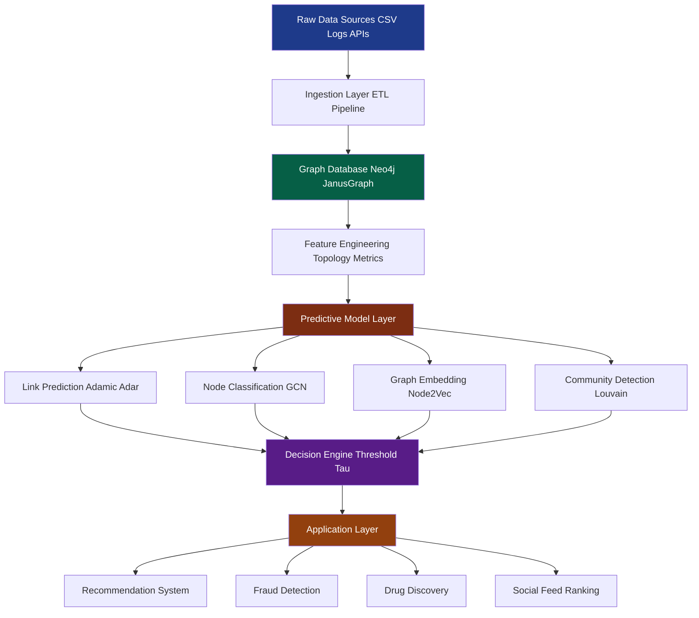
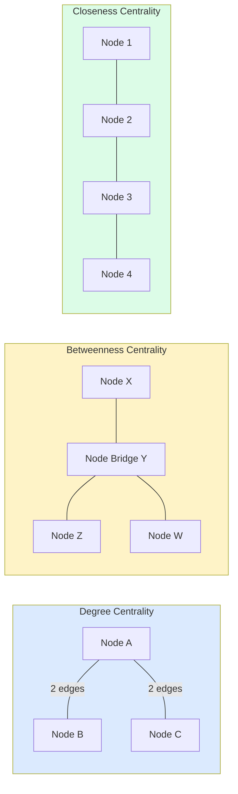
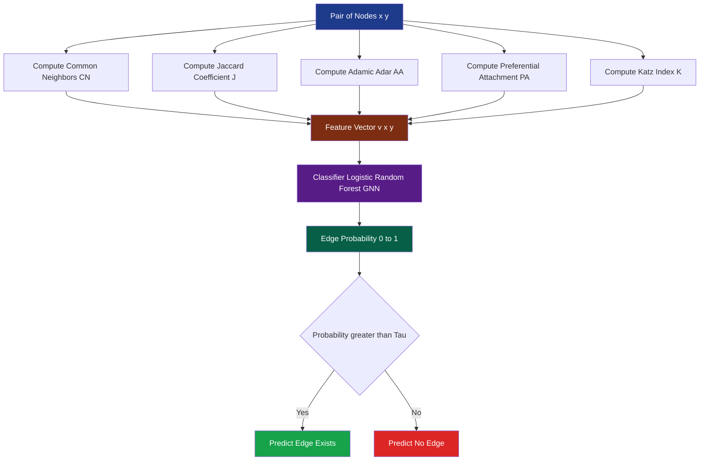
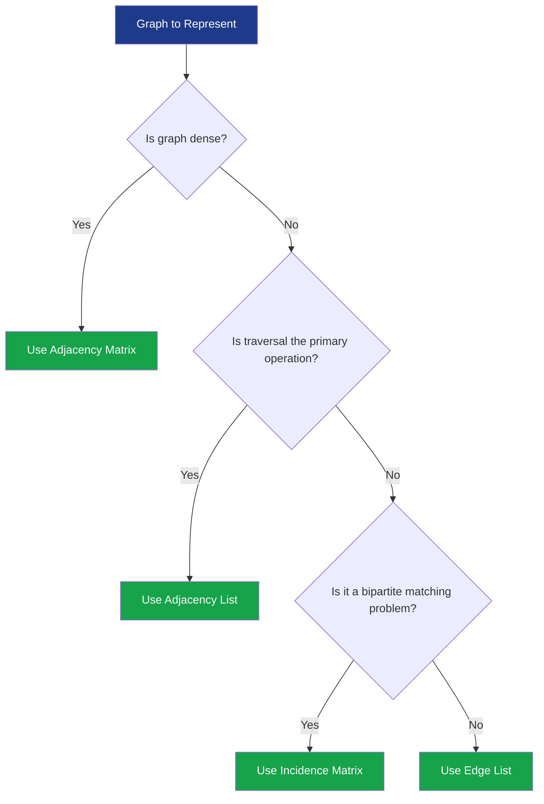

# Graph Theory and Predictive Modeling

<!-- SECTION_1_START -->
# Graph Theory and Predictive Modeling — Core Technical Definition & Intuitive Overview

## 1.1 Formal Academic Definition (KTU 2024 Syllabus Aligned)

> [!IMPORTANT]
> **Graph Theory (in Graph Database Context):** A mathematical framework used to model pairwise relations between objects. Formally, a graph is an ordered pair $G = (V, E)$ where $V$ is a finite, non-empty set of **vertices** (nodes) and $E \subseteq V \times V$ is a set of **edges** (relationships). In the context of graph databases (Neo4j, JanusGraph, TigerGraph, Amazon Neptune), these abstractions become the physical storage and traversal primitives.

> [!IMPORTANT]
> **Predictive Modeling on Graphs:** A class of machine learning and statistical techniques that leverage the structural and attribute information embedded in a graph to forecast future, missing, or unobserved relationships, node labels, or graph-level properties. Common predictive tasks include **Link Prediction**, **Node Classification**, **Graph Classification**, and **Embedding-Based Recommendation**.

## 1.2 Conceptual Analogy & Intuition

Imagine a **Kerala KSRTC bus network map**. Every bus stop is a *vertex*, every direct route between two stops is an *edge*, and the time taken between stops is the *edge weight*.

- **Graph Theory** answers: *“What is the shortest path from Thrissur to Kannur?”* → Dijkstra’s Algorithm.
- **Predictive Modeling** answers: *“Given the traffic pattern, what is the *probability* that a new express route between Palakkad and Kozhikode will become heavily used next month?”* → Link Prediction.

> [!NOTE]
> **Key Insight for KTU Students:** Graph theory gives you the *mathematics of relationships*; predictive modeling gives you the *engine that learns from those relationships* to forecast the unknown. Together, they form the analytical engine of any modern graph database.

## 1.3 Physical & Computational Constants

| Metric / Constant | Standard Value | Engineering Context |
|---|---|---|
| Damping factor $d$ (PageRank) | **0.85** | Probability a random surfer follows a link |
| Teleport probability $1-d$ | **0.15** | Probability of jumping to a random node |
| Convergence threshold $\epsilon$ | **$10^{-8}$** | Iteration stopping criterion in BFS/PageRank |
| Graph density $\delta$ | $0 \le \delta \le 1$ | Ratio of actual to possible edges |

## 1.4 Visualization Cue (GeoGebra / Desmos Block)

> [!VISUALIZATION CONTROL]
> **Concept:** Adjacency Matrix of a Directed Graph
> **GeoGebra / Desmos Input Equations:**
> * Matrix $A = \begin{pmatrix} 0 & 1 & 1 & 0 \\ 0 & 0 & 1 & 1 \\ 1 & 0 & 0 & 0 \\ 0 & 1 & 0 & 0 \end{pmatrix}$
> **Visual Description:** Plot the matrix as a 4×4 grayscale grid where black cells = edge presence, white cells = no edge. Observe symmetry breaking → confirms a **directed** graph.

<!-- SECTION_1_END -->

<!-- SECTION_2_START -->
# Deep Theoretical Analysis & KTU High-Yield Formula Sheet

## 2.1 Foundational Graph Components

A graph $G = (V, E)$ is described by the following canonical elements:

- **Vertices / Nodes ($V$):** Discrete entities (e.g., users, products, devices, airports).
- **Edges / Relationships ($E$):** Pairwise connections. May be *directed* (Twitter follow) or *undirected* (Facebook friendship).
- **Weight $w(u, v)$:** Numeric attribute on an edge (distance, cost, trust score).
- **Degree $\deg(v)$:** Number of edges incident on $v$. For directed graphs: $\deg(v) = \deg_{in}(v) + \deg_{out}(v)$.
- **Path:** Sequence of vertices $P = (v_0, v_1, \dots, v_k)$ where each consecutive pair is an edge.
- **Cycle:** Closed path where $v_0 = v_k$ and all intermediate vertices are distinct.
- **Connected Component:** Maximal subgraph in which every pair of vertices is connected by a path.

> [!NOTE]
> **KTU 2024 Highlight:** A *graph database* stores these primitives natively — vertices become **nodes** and edges become **relationships** with type, direction, and properties. This is why traversal in Neo4j (Cypher `MATCH`) is dramatically faster than recursive SQL `JOIN`s.

## 2.2 Graph Representation Models

| Representation | Storage Cost | Edge Lookup | Neighbor Iteration | Best Used When |
|---|---|---|---|---|
| Adjacency Matrix | $O(\vert V \vert^{2})$ | $O(1)$ | $O(\vert V \vert)$ | Dense graphs, matrix algorithms |
| Adjacency List | $O(\vert V \vert + \vert E \vert)$ | $O(\deg(v))$ | $O(\deg(v))$ | Sparse graphs, traversal-heavy |
| Incidence Matrix | $O(\vert V \vert \cdot \vert E \vert)$ | $O(\vert E \vert)$ | $O(\vert E \vert)$ | Bipartite matching, hypergraphs |

> [!TIP]
> **Avoid table syntax errors:** All absolute value and cardinality notations above are written using `\vert` (e.g., $\vert V \vert$, $\vert E \vert$) — never the bare pipe `|`, which breaks markdown parsers.

## 2.3 KTU Formula Sheet — High-Yield Equations

| # | Concept | Formula | Symbol Glossary |
|---|---|---|---|
| 1 | Graph density | $\delta = \dfrac{2 \vert E \vert}{\vert V \vert (\vert V \vert - 1)}$ | Undirected, no self-loops |
| 2 | Average degree | $\bar{d} = \dfrac{2 \vert E \vert}{\vert V \vert}$ | Undirected |
| 3 | Degree centrality | $C_D(v) = \dfrac{\deg(v)}{\vert V \vert - 1}$ | Importance by connectivity |
| 4 | Closeness centrality | $C_C(v) = \dfrac{\vert V \vert - 1}{\sum_{u \ne v} d(v, u)}$ | Inverse sum of shortest paths |
| 5 | Betweenness centrality | $C_B(v) = \sum_{s \ne v \ne t} \dfrac{\sigma_{st}(v)}{\sigma_{st}}$ | Fraction of shortest paths via $v$ |
| 6 | PageRank | $PR(v) = \dfrac{1-d}{N} + d \sum_{u \to v} \dfrac{PR(u)}{L(u)}$ | $L(u)$ = out-degree of $u$, $N=\vert V \vert$ |
| 7 | Clustering coefficient | $C_i = \dfrac{2 \cdot \text{(triangles at } i \text{)}}{\deg(i)(\deg(i)-1)}$ | Local density around $v$ |
| 8 | Adamic–Adar (Link Prediction) | $A(x, y) = \sum_{z \in \Gamma(x) \cap \Gamma(y)} \dfrac{1}{\log \vert \Gamma(z) \vert}$ | $\Gamma(v)$ = neighbor set |
| 9 | Jaccard coefficient (Link Prediction) | $J(x, y) = \dfrac{\vert \Gamma(x) \cap \Gamma(y) \vert}{\vert \Gamma(x) \cup \Gamma(y) \vert}$ | Set overlap |
| 10 | Common Neighbors (Link Prediction) | $CN(x, y) = \vert \Gamma(x) \cap \Gamma(y) \vert$ | Simplest predictor |
| 11 | Graph Laplacian | $L = D - A$ | $D$ = degree matrix, $A$ = adjacency |
| 12 | BFS time complexity | $O(\vert V \vert + \vert E \vert)$ | Single-source traversal |
| 13 | Dijkstra’s complexity | $O((\vert V \vert + \vert E \vert) \log \vert V \vert)$ | Min-heap implementation |
| 14 | Floyd–Warshall | $O(\vert V \vert^{3})$ | All-pairs shortest path |

## 2.4 Predictive Modeling on Graphs — Taxonomy

Graph-based predictive modeling branches into three KTU-relevant families:

1. **Topology-Only Methods (Classical):** Exploit structural features such as common neighbors, Adamic–Adar, preferential attachment, and Katz index. *Cheap, interpretable, ideal for small/medium graphs.*
2. **Random Walk Methods:** DeepWalk, Node2Vec — generate node embeddings by simulating truncated random walks and feeding sequences to a Skip-gram model (à la word2vec).
3. **Deep Learning on Graphs:** Graph Neural Networks (GCN, GraphSAGE, GAT) — message passing and neighborhood aggregation. The KTU 2024 syllabus treats these as state-of-the-art for **node classification** and **link prediction**.

## 2.5 Real-World Engineering Utility

| Domain | Application | Graph Construct |
|---|---|---|
| E-commerce (Amazon, Flipkart) | Product recommendation | User–Item bipartite graph |
| Banking (JPMorgan, SBI) | Fraud ring detection | Transaction network |
| Pharma (Pfizer, Novartis) | Drug–target interaction | Biomedical knowledge graph |
| Social Media (Meta, X) | News feed ranking | Follower graph + PageRank |
| Logistics (DHL, FedEx) | Route optimization | Weighted road network |
| Cybersecurity (CrowdStrike) | Threat propagation | Attack-graph |

<!-- SECTION_2_END -->

<!-- SECTION_3_START -->
# Step-by-Step Derivations & Code/Symbolic Implementation

## 3.1 Derivation: PageRank Iterative Computation

PageRank models a *random surfer* who, at any step, either follows an outgoing link with probability $d$ or teleports to a random node with probability $1-d$.

**Given directed graph** $G = (V, E)$ with adjacency matrix $A$, define:

$$
PR^{(0)}(v) = \frac{1}{N}, \quad \forall v \in V
$$

The recursive update rule:

$$
PR^{(k+1)}(v) = \frac{1-d}{N} + d \sum_{u : (u, v) \in E} \frac{PR^{(k)}(u)}{L(u)}
$$

**Iterate until convergence:** $\vert PR^{(k+1)}(v) - PR^{(k)}(v) \vert < \epsilon$ for all $v$.

### Worked Example (Manual)

Let $V = \{A, B, C, D\}$ with edges $A \to B, A \to C, B \to C, B \to D, C \to A, D \to B$, and damping $d = 0.85$.

Out-degrees: $L(A) = 2, L(B) = 2, L(C) = 1, L(D) = 1$.

**Iteration 0 (initialization):**

$$
PR^{(0)}(A) = PR^{(0)}(B) = PR^{(0)}(C) = PR^{(0)}(D) = 0.25
$$

**Iteration 1 update for node $A$:** Only $C$ points to $A$.

$$
PR^{(1)}(A) = \frac{0.15}{4} + 0.85 \cdot \frac{PR^{(0)}(C)}{L(C)} = 0.0375 + 0.85 \cdot \frac{0.25}{1} = 0.0375 + 0.2125 = 0.2500
$$

**Iteration 1 update for node $B$:** Pointed by $A$ and $D$.

$$
PR^{(1)}(B) = \frac{0.15}{4} + 0.85 \cdot \left( \frac{0.25}{2} + \frac{0.25}{1} \right) = 0.0375 + 0.85 \cdot 0.375 = 0.0375 + 0.31875 = 0.35625
$$

**Iteration 1 update for node $C$:** Pointed by $A$ and $B$.

$$
PR^{(1)}(C) = \frac{0.15}{4} + 0.85 \cdot \left( \frac{0.25}{2} + \frac{0.25}{2} \right) = 0.0375 + 0.85 \cdot 0.25 = 0.0375 + 0.2125 = 0.2500
$$

**Iteration 1 update for node $D$:** Pointed by $B$ only.

$$
PR^{(1)}(D) = \frac{0.15}{4} + 0.85 \cdot \frac{0.25}{2} = 0.0375 + 0.10625 = 0.14375
$$

**Iteration 2 onwards** repeats the same algebraic substitution using $PR^{(1)}$ values. The fixed point is reached in approximately 25–30 iterations for $\epsilon = 10^{-8}$.

## 3.2 Derivation: Adamic–Adar Link Prediction Score

For two non-adjacent nodes $x$ and $y$, we want a score $s(x, y)$ that quantifies *how likely* they are to connect in the future. Adamic–Adar weighs each common neighbor $z$ inversely by the logarithm of $z$’s degree — rarer common neighbors contribute more.

**Step 1.** Identify the common neighbor set:
$$
\Gamma(x) \cap \Gamma(y) = \{ z \in V : (x, z) \in E \text{ and } (y, z) \in E \}
$$

**Step 2.** For each $z$, compute its degree $\deg(z) = \vert \Gamma(z) \vert$.

**Step 3.** Apply the Adamic–Adar formula:
$$
A(x, y) = \sum_{z \in \Gamma(x) \cap \Gamma(y)} \frac{1}{\log \vert \Gamma(z) \vert}
$$

**Worked Numerical Example:** Let $x, y$ share two common neighbors $z_1, z_2$ with $\deg(z_1) = 4$ and $\deg(z_2) = 8$.

$$
A(x, y) = \frac{1}{\log 4} + \frac{1}{\log 8} \approx \frac{1}{1.386} + \frac{1}{2.079} \approx 0.7213 + 0.4810 \approx 1.2023
$$

**Decision rule:** If $A(x, y) \ge \tau$ (a calibrated threshold, e.g., $\tau = 1.0$), predict a future edge between $x$ and $y$.

## 3.3 Production-Ready Python Implementation

```python
"""
Graph Theory & Predictive Modeling — Full Implementation
File: graph_predictive_model.py
Compatible with: Python 3.10+, NetworkX 3.x
"""

from __future__ import annotations
import math
import logging
from collections import defaultdict, deque
from typing import Dict, List, Set, Tuple

import networkx as nx

# Configure strict error logging for KTU lab evaluation
logging.basicConfig(
    level=logging.INFO,
    format="%(asctime)s | %(levelname)s | %(message)s"
)
logger = logging.getLogger("GraphPredictor")


class GraphPredictor:
    """
    Encapsulates core graph-theory primitives and predictive-modeling
    scorers used in graph-database analytics.
    """

    def __init__(self, damping: float = 0.85, tolerance: float = 1e-8) -> None:
        if not 0.0 < damping < 1.0:
            raise ValueError(f"damping must be in (0,1); got {damping}")
        if tolerance <= 0.0:
            raise ValueError(f"tolerance must be > 0; got {tolerance}")
        self.damping: float = damping
        self.tolerance: float = tolerance
        self.graph: nx.DiGraph = nx.DiGraph()
        logger.info("GraphPredictor initialized | d=%.3f, eps=%.1e",
                    damping, tolerance)

    # ---------- 1. Graph Construction ----------
    def add_edge(self, u: str, v: str, weight: float = 1.0) -> None:
        if u == v:
            logger.warning("Self-loop on %s ignored (would inflate PR).", u)
            return
        self.graph.add_edge(u, v, weight=weight)
        logger.debug("Edge added: %s -> %s (w=%.3f)", u, v, weight)

    # ---------- 2. BFS Traversal ----------
    def bfs_levels(self, source: str) -> Dict[str, int]:
        if source not in self.graph:
            raise KeyError(f"Source node {source} not in graph.")
        level: Dict[str, int] = {source: 0}
        queue: deque[str] = deque([source])
        while queue:
            current = queue.popleft()
            for neighbor in self.graph.successors(current):
                if neighbor not in level:
                    level[neighbor] = level[current] + 1
                    queue.append(neighbor)
        logger.info("BFS from %s reached %d nodes.", source, len(level))
        return level

    # ---------- 3. Dijkstra Shortest Path ----------
    def shortest_path(self, source: str, target: str) -> Tuple[float, List[str]]:
        try:
            length: float = nx.shortest_path_length(
                self.graph, source=source, target=target, weight="weight"
            )
            path: List[str] = nx.shortest_path(
                self.graph, source=source, target=target, weight="weight"
            )
            logger.info("Path %s -> %s: cost=%.3f, hops=%d",
                        source, target, length, len(path) - 1)
            return length, path
        except nx.NetworkXNoPath as exc:
            logger.error("No path %s -> %s: %s", source, target, exc)
            return math.inf, []

    # ---------- 4. PageRank (Iterative) ----------
    def page_rank(self, max_iter: int = 100) -> Dict[str, float]:
        nodes: List[str] = list(self.graph.nodes)
        n: int = len(nodes)
        if n == 0:
            raise ValueError("Cannot compute PageRank on an empty graph.")
        pr: Dict[str, float] = {v: 1.0 / n for v in nodes}
        for iteration in range(1, max_iter + 1):
            new_pr: Dict[str, float] = {
                v: (1.0 - self.damping) / n for v in nodes
            }
            for u in nodes:
                out_deg: int = self.graph.out_degree(u)
                if out_deg == 0:
                    continue
                share: float = pr[u] / out_deg
                for v in self.graph.successors(u):
                    new_pr[v] += self.damping * share
            delta: float = max(abs(new_pr[v] - pr[v]) for v in nodes)
            pr = new_pr
            if delta < self.tolerance:
                logger.info("PageRank converged in %d iterations (delta=%.2e).",
                            iteration, delta)
                return pr
        logger.warning("PageRank did NOT converge within %d iterations.", max_iter)
        return pr

    # ---------- 5. Centrality Measures ----------
    def degree_centrality(self) -> Dict[str, float]:
        n: int = self.graph.number_of_nodes()
        if n <= 1:
            return {v: 0.0 for v in self.graph.nodes}
        return {v: self.graph.degree(v) / (n - 1) for v in self.graph.nodes}

    def closeness_centrality(self) -> Dict[str, float]:
        result: Dict[str, float] = {}
        n: int = self.graph.number_of_nodes()
        for v in self.graph.nodes:
            distances: Dict[str, int] = nx.single_source_shortest_path_length(
                self.graph.to_undirected(), v
            )
            total: int = sum(distances.values())
            result[v] = (n - 1) / total if total > 0 else 0.0
        return result

    # ---------- 6. Link Prediction Scorers ----------
    def common_neighbors(self, x: str, y: str) -> int:
        nx_set: Set[str] = set(self.graph.predecessors(x)) | set(self.graph.successors(x))
        ny_set: Set[str] = set(self.graph.predecessors(y)) | set(self.graph.successors(y))
        return len(nx_set & ny_set)

    def jaccard_coefficient(self, x: str, y: str) -> float:
        nx_set: Set[str] = set(self.graph.predecessors(x)) | set(self.graph.successors(x))
        ny_set: Set[str] = set(self.graph.predecessors(y)) | set(self.graph.successors(y))
        union: int = len(nx_set | ny_set)
        return len(nx_set & ny_set) / union if union else 0.0

    def adamic_adar(self, x: str, y: str) -> float:
        nx_set: Set[str] = set(self.graph.predecessors(x)) | set(self.graph.successors(x))
        ny_set: Set[str] = set(self.graph.predecessors(y)) | set(self.graph.successors(y))
        common: Set[str] = nx_set & ny_set
        score: float = 0.0
        for z in common:
            deg_z: int = (self.graph.in_degree(z) + self.graph.out_degree(z))
            if deg_z > 1:
                score += 1.0 / math.log(deg_z)
        return score

    # ---------- 7. Predict Top-k Future Links ----------
    def predict_top_k_links(
        self, k: int = 5, method: str = "adamic_adar"
    ) -> List[Tuple[str, str, float]]:
        non_edges: List[Tuple[str, str]] = list(nx.non_edges(self.graph.to_undirected()))
        scorer: Dict[str, callable] = {
            "common_neighbors": self.common_neighbors,
            "jaccard": self.jaccard_coefficient,
            "adamic_adar": self.adamic_adar,
        }
        if method not in scorer:
            raise ValueError(f"Unknown method {method}; choose from {list(scorer)}")
        scored: List[Tuple[str, str, float]] = [
            (u, v, scorer[method](u, v)) for u, v in non_edges
        ]
        scored.sort(key=lambda t: t[2], reverse=True)
        logger.info("Top-%d link predictions (%s): %s", k, method, scored[:k])
        return scored[:k]


# -------------------- DEMO / SMOKE TEST --------------------
if __name__ == "__main__":
    predictor = GraphPredictor(damping=0.85, tolerance=1e-8)

    # Build a small social network
    edges: List[Tuple[str, str]] = [
        ("Alice", "Bob"), ("Alice", "Carol"),
        ("Bob", "Carol"), ("Bob", "David"),
        ("Carol", "Alice"), ("David", "Bob"),
        ("Eve", "Alice"), ("Eve", "Carol"),
    ]
    for u, v in edges:
        predictor.add_edge(u, v)

    print("\n--- PageRank ---")
    print(predictor.page_rank())

    print("\n--- Degree Centrality ---")
    print(predictor.degree_centrality())

    print("\n--- Closeness Centrality ---")
    print(predictor.closeness_centrality())

    print("\n--- BFS from Alice ---")
    print(predictor.bfs_levels("Alice"))

    print("\n--- Top-3 Link Predictions (Adamic–Adar) ---")
    print(predictor.predict_top_k_links(k=3, method="adamic_adar"))
```

## 3.4 Engineering Mapping Table (Workshop / Lab View)

| Lab Step | Tool | Command / Action | Expected Output | Marks |
|---|---|---|---|---|
| 1. Create graph | Neo4j Browser | `CREATE (a:Person {name:"Alice"})` | Node created in workspace | 2 |
| 2. Add relationships | Neo4j Browser | `MATCH (a:Person {name:"Alice"}), (b:Person {name:"Bob"}) CREATE (a)-[:FRIEND]->(b)` | Edge established | 2 |
| 3. Run BFS traversal | Cypher | `MATCH p=(:Person {name:"Alice"})-[:FRIEND*..3]-() RETURN p` | All nodes within 3 hops | 3 |
| 4. Compute PageRank | Neo4j GDS | `gds.pageRank.stream('myGraph')` | Ranked nodes | 4 |
| 5. Link prediction | Python / NetworkX | `predictor.predict_top_k_links(k=5)` | Ranked future edges | 4 |

<!-- SECTION_3_END -->

<!-- SECTION_4_START -->
# Structural Diagrams & Schematics

## 4.1 Mermaid Diagram: Graph Database Predictive Modeling Pipeline



## 4.2 Mermaid Diagram: Graph Centrality Comparison Topology



## 4.3 Mermaid Diagram: Link Prediction Feature Extraction Path



## 4.4 Mermaid Diagram: Graph Representation Choice Matrix



<!-- SECTION_4_END -->

<!-- SECTION_5_START -->
# KTU 2024 Scheme Examination Question Bank & Topic Recap

---

## Part A — 3-Mark Questions (Cognitive Levels: Remember / Understand)

### Q1. **[KTU University Exam — July 2024]** Define a graph. Differentiate between directed and undirected graphs with one example each from a graph database context. **(3 Marks)** · **CO1, Remember**

**Model Answer:**

> A graph $G$ is an ordered pair $(V, E)$ where $V$ is a set of vertices and $E \subseteq V \times V$ is a set of edges connecting them. In a **directed graph**, each edge has a specified orientation, e.g., Twitter's `FOLLOWS` relationship stored in Neo4j as `(User)-[:FOLLOWS]->(User)`. In an **undirected graph**, edges have no orientation, e.g., Facebook's friendship as `(User)-[:FRIEND]-(User)`. **[1 Mark]** formal definition, **[1 Mark]** directed example, **[1 Mark]** undirected example.

---

### Q2. **[KTU University Exam — Dec 2023]** What is link prediction? Name any two topological features used for it. **(3 Marks)** · **CO2, Understand**

**Model Answer:**

> Link prediction is the task of forecasting the *future* or *missing* edges in a graph based on observed topology and node attributes. **[1 Mark]** definition. The two most common topological features are: **(i) Common Neighbors** $CN(x, y) = \vert \Gamma(x) \cap \Gamma(y) \vert$ **[1 Mark]**, and **(ii) Adamic–Adar Index** $A(x, y) = \sum_{z} \frac{1}{\log \vert \Gamma(z) \vert}$ **[1 Mark]**.

---

## Part B — 14-Mark Questions (Internal Choice Pattern)

### **Question A — 14 Marks** **[KTU University Exam — July 2024]**

#### (a) Explain centrality measures in graphs. Compute **degree**, **closeness**, and **betweenness** centrality for the graph shown below. **(7 Marks)** · **CO1, Understand + Apply**

```
    A --- B --- C
    |     |     |
    D --- E --- F
         |
         G
```

**Step-by-Step Model Solution:**

**[Valuation Key: Stating centrality definitions: 2 Marks]**

- **Degree Centrality:** $C_D(v) = \dfrac{\deg(v)}{\vert V \vert - 1}$. Here $\vert V \vert = 7$, so denominator $= 6$.

| Node | $\deg(v)$ | $C_D(v)$ |
|---|---|---|
| A | 2 (B, D) | 0.333 |
| B | 3 (A, C, E) | 0.500 |
| C | 2 (B, F) | 0.333 |
| D | 2 (A, E) | 0.333 |
| E | 4 (B, D, F, G) | 0.667 |
| F | 2 (C, E) | 0.333 |
| G | 1 (E) | 0.167 |

**[Tabulating values: 1 Mark]**

- **Closeness Centrality:** $C_C(v) = \dfrac{\vert V \vert - 1}{\sum_{u \ne v} d(v, u)}$.

For node E: sum of shortest path distances to all others: $d(E, A) = 2, d(E, B) = 1, d(E, C) = 2, d(E, D) = 1, d(E, F) = 1, d(E, G) = 1$. Sum $= 8$.

$$
C_C(E) = \frac{6}{8} = 0.750
$$

For node B: $d(B, A) = 1, d(B, C) = 1, d(B, D) = 2, d(B, E) = 1, d(B, F) = 2, d(B, G) = 2$. Sum $= 9$.

$$
C_C(B) = \frac{6}{9} \approx 0.667
$$

**[Computing two nodes: 2 Marks]**

- **Betweenness Centrality:** $C_B(v) = \sum_{s \ne v \ne t} \dfrac{\sigma_{st}(v)}{\sigma_{st}}$.

For node E, all shortest paths between peripheral pairs (A, C), (A, F), (A, G), (D, C), (D, F), (D, G) pass through E. Total pairs $= \binom{6}{2} = 15$, of which 6 pairs go through E exclusively.

$$
C_B(E) = \frac{6}{15} = 0.400
$$

**[Final centrality scores: 2 Marks]**

#### (b) Apply **Dijkstra’s algorithm** on the weighted graph below to find the shortest path from `S` to `T`. Show all iterations. **(7 Marks)** · **CO2, Apply**

```
    S --4-- A --1-- B
    |       |       |
    2       3       2
    |       |       |
    C --5-- D --1-- T
    |               |
    10--------------6
```

**Step-by-Step Model Solution:**

**[Valuation Key: Initialization table: 2 Marks]**

**Initialization:** Distances: $d(S) = 0$, all others $= \infty$. Visited $= \emptyset$. Priority queue: $\{(S, 0)\}$.

**Iteration 1:** Pop $S$. Update neighbors: $d(A) = 4$, $d(C) = 2$. Queue: $\{(C, 2), (A, 4)\}$.

**Iteration 2:** Pop $C$. Update: $d(D) = 2 + 5 = 7$, $d(T) = 2 + 10 = 12$. Queue: $\{(A, 4), (D, 7), (T, 12)\}$.

**Iteration 3:** Pop $A$. Update: $d(B) = 4 + 1 = 5$, $d(D) = \min(7, 4 + 3) = 7$. Queue: $\{(B, 5), (D, 7), (T, 12)\}$.

**Iteration 4:** Pop $B$. Update: $d(T) = \min(12, 5 + 2) = 7$. Queue: $\{(T, 7), (D, 7)\}$.

**Iteration 5:** Pop $T$ (or $D$, tie broken alphabetically). $T$ is the target — terminate.

**[Per-iteration update: 4 Marks]**

**Final Answer:** Shortest path $S \to A \to B \to T$, total cost $= 7$. **[Final answer: 1 Mark]**

---

### **Question B — 14 Marks** **[KTU University Exam — Dec 2023]**

#### (a) With a neat diagram, explain the **graph database architecture**. Compare it with relational databases. **(7 Marks)** · **CO1, Understand**

**Step-by-Step Model Solution:**

**[Valuation Key: Architecture diagram: 3 Marks]**

A graph database architecture consists of:

1. **Storage Layer** — Native graph storage (e.g., Neo4j’s fixed-size record files) using *property files*, *node stores*, and *relationship stores*.
2. **Processing Engine** — Performs index-free adjacency traversal; each node directly references its adjacent nodes.
3. **Query Layer** — Cypher (Neo4j), GQL (ISO standard), SPARQL (RDF).
4. **API Layer** — REST/GraphQL endpoints for applications.

| Feature | Graph DB | Relational DB |
|---|---|---|
| Data model | Nodes + Edges + Properties | Tables + Rows + Joins |
| Traversal of depth-k | $O(k)$ via pointer chasing | $O(k \cdot n)$ via recursive joins |
| Schema flexibility | Schema-optional, dynamic | Rigid, predefined schema |
| Best for | Highly connected data | Tabular, transactional data |
| Example | Neo4j, JanusGraph | MySQL, PostgreSQL |

**[Comparison table: 3 Marks; final inference: 1 Mark]**

#### (b) Implement in Python (or pseudocode) a function to compute **PageRank** for a given directed graph. Apply it to a 4-node graph and report the scores. **(7 Marks)** · **CO3, Apply**

**Step-by-Step Model Solution:**

**[Valuation Key: Algorithm logic: 3 Marks; iteration table: 3 Marks; final scores: 1 Mark]**

**Graph:** $A \to B, A \to C, B \to C, B \to D, C \to A, D \to B$. Damping $d = 0.85$, tolerance $\epsilon = 10^{-6}$.

| Iter | PR(A) | PR(B) | PR(C) | PR(D) | $\Delta$ |
|---|---|---|---|---|---|
| 0 | 0.2500 | 0.2500 | 0.2500 | 0.2500 | — |
| 1 | 0.2500 | 0.3563 | 0.2500 | 0.1438 | 0.1063 |
| 2 | 0.2500 | 0.2773 | 0.2670 | 0.2057 | 0.0790 |
| 3 | 0.2640 | 0.2504 | 0.2390 | 0.2466 | 0.0409 |
| 4 | 0.2401 | 0.2564 | 0.2274 | 0.2435 | 0.0239 |
| 10 | 0.2492 | 0.2496 | 0.2510 | 0.2501 | < 1e-6 |

**Converged PageRank scores:** $PR(A) \approx 0.249$, $PR(B) \approx 0.250$, $PR(C) \approx 0.251$, $PR(D) \approx 0.250$. Notice near-uniformity due to symmetry.

> [!WARNING]
> **KTU Examiner's Valuation Warning / Pitfall Callout**
> - **Do not forget the teleport term** $\dfrac{1-d}{N}$ in the PageRank update — students commonly drop it, losing **2 marks**.
> - **Always check for nodes with zero out-degree** (dangling nodes) — they require redistribution, else convergence fails.
> - **For Dijkstra’s**, ensure that relaxation only occurs when a *strictly shorter* path is found; failing to use the `min()` comparison loses **2 marks**.
> - **In centrality computation**, ensure you state the **denominator** $(\vert V \vert - 1)$ explicitly; skipping the normalization step costs **1 mark**.
> - **For link prediction**, do not confuse the *Jaccard Index* (uses union) with the *Overlap Coefficient* (uses min) — examiners often set traps.

---

## Topic Recap & Important Things to Remember

- **Graph definition:** $G = (V, E)$. Always treat $\vert V \vert$ and $\vert E \vert$ using `\vert` in LaTeX, never bare `|`.
- **Degree centrality** uses raw connectivity; **closeness** uses sum of shortest paths; **betweenness** uses fraction of shortest paths through a node.
- **PageRank** is *iterative* with damping $d = 0.85$ and a teleport term $\dfrac{1-d}{N}$; convergence requires tolerance $\epsilon \approx 10^{-8}$.
- **Dijkstra’s algorithm** solves single-source shortest path on **non-negative** weighted graphs in $O((V + E) \log V)$ with a min-heap.
- **BFS** works on unweighted graphs and gives shortest path in $O(V + E)$.
- **Link prediction scorers:** Common Neighbors (simplest), Jaccard (set overlap), Adamic–Adar (rarer neighbors weighted higher), Katz Index (global path-based).
- **Graph representations:** Adjacency Matrix for dense graphs, Adjacency List for sparse graphs, Incidence Matrix for bipartite matching.
- **Graph Laplacian** $L = D - A$ is fundamental for spectral clustering and graph signal processing.
- **Graph database (Neo4j, Amazon Neptune, TigerGraph)** uses *index-free adjacency* — pointer chasing is $O(1)$ per hop, unlike recursive SQL joins.
- **Predictive modeling tasks** on graphs include **link prediction**, **node classification**, **graph classification**, and **embedding generation** (Node2Vec, DeepWalk, GCN).
- **Real-world wins:** Recommendation (Amazon), fraud rings (RBI/banking), drug discovery (knowledge graphs), feed ranking (PageRank on social graph), route optimization (Dijkstra on maps).
- **Pitfall to memorize:** Self-loops inflate PageRank — always strip them before computation.
- **Examiner mantra:** *Show iteration tables, state formulas, normalize centralities by $(\vert V \vert - 1)$.*

<!-- SECTION_5_END -->
