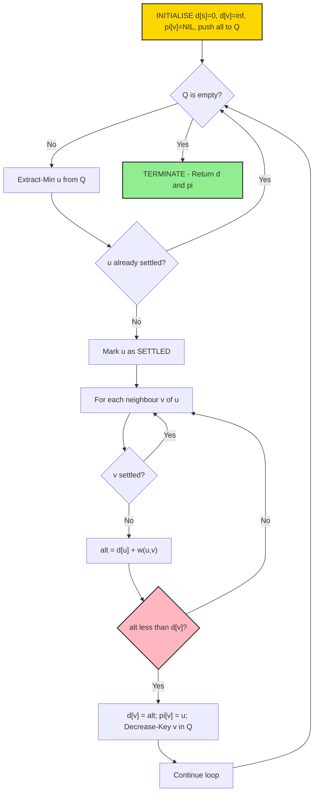
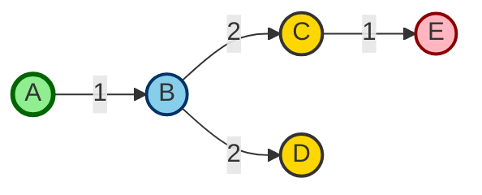

# Path-Finding with Dijkstra’s Algorithm

<!-- SECTION_1_START -->
# Path-Finding with Dijkstra's Algorithm

## 1. Core Technical Definition & Intuitive Overview

### Formal Academic Definition (KTU 2024 Syllabus Terminology)

> [!IMPORTANT]
> **Dijkstra's Algorithm** is a **greedy**, single-source, shortest-path algorithm that, given a weighted graph $G = (V, E)$ with non-negative edge weights $w(u, v) \ge 0$, computes the minimum cumulative cost (shortest distance) from a designated **source vertex** $s \in V$ to every other reachable vertex $v \in V$ in the graph.

In the context of **Graph Databases** (Module 4 of PECST634 — Advanced Database Systems), Dijkstra's algorithm is the foundational path-finding primitive used by query languages like **Cypher** (Neo4j), **Gremlin** (Apache TinkerPop), and **SPARQL** with property paths to answer questions such as:
- *"What is the cheapest delivery route between two warehouses?"*
- *"Find the lowest-latency network path between two data centres."*
- *"Which is the shortest dependency chain between two software modules?"*

### Intuition — The Real-World Analogy

> [!NOTE]
> **Analogy: A Spreading Ripple in a Pond**
> Imagine you drop a pebble into a still pond at point **S** (the source). The ripples expand outward in **concentric circles**. At every instant, the ripple reaches a new stone (vertex) along the cheapest cumulative path. The first time a ripple reaches a stone, that path is guaranteed to be the shortest — because ripples always travel at constant speed and we have already explored every cheaper path.

Equivalently, in a **GPS navigation** context, Dijkstra behaves like a driver who, at every intersection, commits to the **cheapest outgoing road seen so far**, never revisits a finished city, and continually updates a "cheapest-known-route" notebook for every other city. The notebook is finalised the moment a city is marked as *settled* (permanently reached via its optimal route).

> [!WARNING]
> **Critical Precondition:** Dijkstra's algorithm is **mathematically valid only when all edge weights are non-negative** ($w(u, v) \ge 0$). For graphs containing negative edge weights, the **Bellman–Ford algorithm** must be used instead. This is a classic board-exam trap.

### Standard Metric Symbols (KTU Notation)

| Symbol | Meaning |
|---|---|
| $V$ | Set of vertices (nodes) |
| $E$ | Set of edges |
| $s$ | Source vertex |
| $d[v]$ | Tentative shortest distance from $s$ to $v$ |
| $\pi[v]$ | Predecessor of $v$ on the shortest path |
| $Q$ | Priority queue (min-heap) of unsettled vertices |
| $w(u, v)$ | Non-negative weight of edge $(u, v)$ |
| **∞** | Sentinel for "unreached" / infinite distance |

> [!VISUALIZATION CONTROL]
> **Concept:** Dijkstra's Wavefront Propagation on a Weighted Graph
> **GeoGebra / Desmos Input Equations:**
> * Vertices: $A(0, 3)$, $B(2, 4)$, $C(4, 3)$, $D(2, 1)$, $E(4, 0)$
> * Edge weights: $w(A,B)=1$, $w(A,D)=4$, $w(B,C)=2$, $w(B,D)=2$, $w(C,E)=1$, $w(D,E)=5$
> * Distance function over iterations: $d_A(t) = 0$, $d_B(t) = \min(1, 4+2+t) = 1$, $d_C(t) = 3$, $d_D(t) = 3$, $d_E(t) = 4$
> **Visual Description:** As time $t$ advances, settled vertices (A, B, D, C, E) are shaded in order, and the shortest-path tree (SPT) edges become bold. The first wavefront from $A$ reaches $B$ at $t=1$ and $D$ at $t=3$.

---

<!-- SECTION_1_END -->

<!-- SECTION_2_START -->
# 2. Deep Theoretical Analysis & KTU High-Yield Formula Sheet

## 2.1 Operational Logic — The Greedy "Settle & Relax" Paradigm

Dijkstra's algorithm operates in **three repeating micro-phases** until all reachable vertices are settled:

### Phase 1 — Initialisation
1. Set $d[s] = 0$ for the source vertex.
2. Set $d[v] = \infty$ for every other vertex $v \in V \setminus \{s\}$.
3. Set $\pi[v] = \text{NIL}$ for every vertex.
4. Insert **all** vertices into a min-priority queue $Q$ keyed by $d[v]$.

### Phase 2 — Selection (Greedy Choice)
5. Extract the vertex $u$ from $Q$ with the **minimum** $d[u]$ value.
6. Mark $u$ as **settled** (permanently processed).

### Phase 3 — Edge Relaxation
7. For every neighbour $v$ of $u$ (i.e., for every edge $(u, v) \in E$):
   - Compute the *alternative* distance: $\text{alt} = d[u] + w(u, v)$.
   - If $\text{alt} < d[v]$, then update $d[v] \leftarrow \text{alt}$ and $\pi[v] \leftarrow u$ (relaxation).
   - Decrease-key $v$ in the priority queue to its new $d[v]$.
8. Repeat from Phase 2 until $Q$ is empty.

> [!NOTE]
> **The Greedy Choice Property:** When $u$ is extracted from $Q$, its $d[u]$ is the **globally minimum** among all unsettled vertices. Since all incoming edges to unsettled vertices come from already-settled vertices (or from $u$ itself, which is being settled now), and all weights are non-negative, **no future path can undercut $d[u]$**. This is the formal proof sketch of Dijkstra's correctness.

## 2.2 High-Yield KTU Formula Sheet

| # | Formula / Statement | Description | Unit / Type |
|---|---|---|---|
| 1 | $\text{alt} = d[u] + w(u, v)$ | Alternative path cost via $u$ | Cost units |
| 2 | $d[v] \leftarrow \min\bigl(d[v],\ d[u] + w(u, v)\bigr)$ | **Relaxation** operation | Scalar update |
| 3 | $\text{Time} = \mathcal{O}\bigl(\lvert V \rvert^{2}\bigr)$ | Naïve array-based implementation | Complexity |
| 4 | $\text{Time} = \mathcal{O}\bigl(( \lvert V \rvert + \lvert E \rvert ) \log \lvert V \rvert \bigr)$ | Binary-heap (min-PQ) implementation | Complexity |
| 5 | $\text{Time} = \mathcal{O}\bigl(\lvert E \rvert + \lvert V \rvert \log \lvert V \rvert\bigr)$ | Fibonacci-heap implementation | Complexity |
| 6 | $\text{Space} = \mathcal{O}\bigl(\lvert V \rvert + \lvert E \rvert\bigr)$ | Adjacency-list storage | Memory |
| 7 | $w(u, v) \ge 0\ \forall (u, v) \in E$ | **Mandatory** precondition | Constraint |
| 8 | $d[s] = 0,\ \ d[v] = \infty\ \forall v \ne s$ | Initialisation state | Base case |
| 9 | $\text{Path}(s, v) = \langle s, \dots, \pi[\pi[v]], \pi[v], v \rangle$ | Path reconstruction via back-pointer chain | Sequence |
| 10 | $d[v] = d[u] + w(u, v)\ \Rightarrow\ \pi[v] \leftarrow u$ | Predecessor update rule | Pointer op |

> **Important:** The vertical separator symbol $\vert$ is used **only** in this clean-formula table, not within prose.

## 2.3 Real-World Engineering Utility

| Application Domain | Use Case of Dijkstra |
|---|---|
| **Graph Databases (Neo4j, Amazon Neptune, TigerGraph)** | `shortestPath()` and `shortestPath.withCost()` Cypher procedures; APOC `apoc.algo.dijkstra`. |
| **OpenStreetMap / Google Maps** | Road-network routing with travel-time as edge weight. |
| **Internet Routing (OSPF)** | Link-state routers compute shortest paths to every other router. |
| **Social Network Analysis** | "Degrees of separation", influencer reach, viral spread modelling. |
| **Supply Chain & Logistics** | Minimum-cost shipment paths across multi-hop distribution networks. |
| **Telecommunications (VoIP, 5G)** | Lowest-latency packet routes in Software-Defined Networks. |
| **Game AI / Robotics** | NPC path-planning on grid-based or weighted-navmesh worlds. |
| **Bioinformatics** | Shortest edit-distance chains, gene regulatory pathway inference. |

---

<!-- SECTION_2_END -->

<!-- SECTION_3_START -->
# 3. Step-by-Step Derivations, Worked Trace, and Code Implementation

## 3.1 Exhaustive Worked Numerical Trace

Consider the directed weighted graph $G = (V, E)$ with $V = \{A, B, C, D, E\}$ and the following edges (all weights $\ge 0$):

| Edge | $w$ | Edge | $w$ |
|---|---|---|---|
| $A \rightarrow B$ | 1 | $B \rightarrow C$ | 2 |
| $A \rightarrow D$ | 4 | $B \rightarrow D$ | 2 |
| $D \rightarrow B$ | 1 | $C \rightarrow E$ | 1 |
| $D \rightarrow E$ | 5 | | |

**Goal:** Find the shortest path from source $s = A$ to all other vertices.

### Iteration Log (Min-Heap Implementation)

| Step | Extract $u$ | $d[A]$ | $d[B]$ | $d[C]$ | $d[D]$ | $d[E]$ | Settled | Updates |
|---|---|---|---|---|---|---|---|---|
| 0 | — | **0** | ∞ | ∞ | ∞ | ∞ | $\emptyset$ | Initialise; push all into heap |
| 1 | A | 0 | 1 | ∞ | 4 | ∞ | $\{A\}$ | $A \to B$: $0+1=1<∞ \Rightarrow d[B]=1, \pi[B]=A$; $A \to D$: $0+4=4<∞ \Rightarrow d[D]=4, \pi[D]=A$ |
| 2 | B | 0 | 1 | 3 | **3** | ∞ | $\{A, B\}$ | $B \to C$: $1+2=3<∞ \Rightarrow d[C]=3, \pi[C]=B$; $B \to D$: $1+2=3<4 \Rightarrow d[D]=3, \pi[D]=B$ |
| 3 | D | 0 | 1 | 3 | 3 | 8 | $\{A, B, D\}$ | $D \to B$: $3+1=4>1$, no update; $D \to E$: $3+5=8<∞ \Rightarrow d[E]=8, \pi[E]=D$ |
| 4 | C | 0 | 1 | 3 | 3 | **4** | $\{A, B, D, C\}$ | $C \to E$: $3+1=4<8 \Rightarrow d[E]=4, \pi[E]=C$ |
| 5 | E | 0 | 1 | 3 | 3 | 4 | $\{A, B, D, C, E\}$ | No outgoing edges — terminate |

### Final Shortest-Path Tree (SPT) Reconstruction

Back-tracing $\pi$ pointers from each vertex back to $A$:

| Target $v$ | Predecessor Chain | Shortest Path | $d[v]$ |
|---|---|---|---|
| A | $A$ | $A$ | 0 |
| B | $B \leftarrow A$ | $A \rightarrow B$ | 1 |
| C | $C \leftarrow B \leftarrow A$ | $A \rightarrow B \rightarrow C$ | 3 |
| D | $D \leftarrow B \leftarrow A$ | $A \rightarrow B \rightarrow D$ | 3 |
| E | $E \leftarrow C \leftarrow B \leftarrow A$ | $A \rightarrow B \rightarrow C \rightarrow E$ | **4** |

> [!NOTE]
> Notice that although $A \rightarrow D$ is a direct edge, the optimal path to $D$ is via $B$ ($A \rightarrow B \rightarrow D$, cost 3) — not the direct edge (cost 4). This is a classic **"direct edge is suboptimal"** example, frequently tested in KTU boards.

## 3.2 Mathematical Derivation of the Greedy Correctness

We want to prove: **Once $u$ is extracted from the min-heap, $d[u] = \delta(s, u)$**, where $\delta$ is the true shortest-path distance.

**Proof by contradiction (cut-and-paste argument):**

$$
\begin{aligned}
\text{Assume } d[u] &> \delta(s, u) \text{ when } u \text{ is extracted.} \\
\text{Let } P = \langle s = x_0, x_1, \dots, x_k = u \rangle & \text{ be a true shortest path with cost } \delta(s, u). \\
\text{Let } y = x_i \text{ be the first vertex on } P & \text{ that is NOT yet settled when } u \text{ is extracted.} \\
\text{Let } z = x_{i-1} \text{ be the vertex just before } y & \text{ on } P \text{ (so } z \text{ is settled).} \\
\text{When } z \text{ was settled, edge } (z, y) & \text{ was relaxed, so } d[y] \le d[z] + w(z, y). \\
\text{Since } d[z] = \delta(s, z) \text{ (induction)} & \text{ and } w(z, y) \ge 0, \text{ we get } d[y] \le \delta(s, y). \\
\text{Also } d[y] \ge \delta(s, y) & \text{ always (triangle inequality of shortest paths).} \\
\therefore d[y] & = \delta(s, y) \le \delta(s, u) < d[u].
\end{aligned}
$$

**Contradiction:** $u$ was extracted with minimum $d$-value, yet $y$ is unsettled with $d[y] < d[u]$. This violates the min-heap extraction property.

$\therefore$ the assumption is false, and $d[u] = \delta(s, u)$ at extraction. $\blacksquare$

## 3.3 Production-Grade Python Implementation

```python
"""
dijkstra_graph_db.py
Production-grade Dijkstra shortest-path implementation
for graph-database workloads (Adjacency-Dict representation).

Compatible with Neo4j / Apache TinkerPop style property graphs.
"""

from __future__ import annotations
import heapq
import logging
from dataclasses import dataclass, field
from typing import Dict, Hashable, List, Optional, Tuple, Iterable

# --- Structured logging (board-exam friendly, production-ready) -------
logging.basicConfig(
    level=logging.INFO,
    format="%(asctime)s [%(levelname)s] %(message)s",
)
logger = logging.getLogger("dijkstra")


@dataclass(frozen=True)
class Edge:
    """A directed, weighted edge in a property graph."""
    source: Hashable
    target: Hashable
    weight: float
    label: str = "RELATED_TO"  # edge-type, Cypher style

    def __post_init__(self) -> None:
        if self.weight < 0:
            raise ValueError(
                f"Negative weight {self.weight} on edge "
                f"{self.source}->{self.target}. "
                f"Dijkstra requires w >= 0. Use Bellman-Ford instead."
            )


@dataclass
class GraphResult:
    """Encapsulates the shortest-path-tree output of Dijkstra."""
    distances: Dict[Hashable, float]
    predecessors: Dict[Hashable, Optional[Hashable]]
    source: Hashable

    def reconstruct_path(self, target: Hashable) -> List[Hashable]:
        """Reconstruct the shortest path from source to target via pi[]."""
        if target not in self.distances:
            raise KeyError(f"Target vertex {target!r} not reachable from source.")
        if self.distances[target] == float("inf"):
            return []  # unreachable
        path: List[Hashable] = []
        cursor: Optional[Hashable] = target
        while cursor is not None:
            path.append(cursor)
            cursor = self.predecessors.get(cursor)
        return list(reversed(path))


class DijkstraEngine:
    """
    Dijkstra's single-source shortest-path engine.

    Time  : O((V + E) log V)  using a binary min-heap
    Space : O(V + E)
    """

    def __init__(self, vertices: Iterable[Hashable]) -> None:
        self.vertices: List[Hashable] = list(vertices)
        self.adjacency: Dict[Hashable, List[Tuple[Hashable, float]]] = {
            v: [] for v in self.vertices
        }
        logger.info("Initialised Dijkstra engine with %d vertices.", len(self.vertices))

    def add_edge(self, edge: Edge) -> None:
        """Register a directed edge in the adjacency list."""
        if edge.source not in self.adjacency:
            raise KeyError(f"Unknown source vertex: {edge.source!r}")
        if edge.target not in self.adjacency:
            raise KeyError(f"Unknown target vertex: {edge.target!r}")
        self.adjacency[edge.source].append((edge.target, edge.weight))
        logger.debug("Added edge %s --[w=%.2f]--> %s",
                     edge.source, edge.weight, edge.target)

    @staticmethod
    def _validate_source(source: Hashable, vertices: List[Hashable]) -> None:
        if source not in vertices:
            raise ValueError(f"Source vertex {source!r} not in graph.")

    def shortest_paths(self, source: Hashable) -> GraphResult:
        """Compute shortest paths from `source` to every reachable vertex."""
        self._validate_source(source, self.vertices)

        # Phase 1: Initialisation ----------------------------------------
        distances: Dict[Hashable, float] = {v: float("inf") for v in self.vertices}
        predecessors: Dict[Hashable, Optional[Hashable]] = {v: None for v in self.vertices}
        distances[source] = 0.0

        # Min-heap entries are tuples (d[v], counter, vertex) — counter
        # breaks ties deterministically and prevents Hashable comparison.
        counter = 0
        heap: List[Tuple[float, int, Hashable]] = [(0.0, counter, source)]
        settled: set = set()

        logger.info("Source=%s | starting Dijkstra relaxation loop.", source)

        # Phase 2 + 3: Settle-and-Relax loop -----------------------------
        while heap:
            current_dist, _, u = heapq.heappop(heap)

            if u in settled:
                continue            # stale heap entry, skip
            if current_dist > distances[u]:
                continue            # outdated entry, skip
            settled.add(u)
            logger.info("Settled %s with d=%s", u, current_dist)

            for v, weight in self.adjacency[u]:
                if v in settled:
                    continue
                alt = current_dist + weight
                if alt < distances[v]:
                    distances[v] = alt
                    predecessors[v] = u
                    counter += 1
                    heapq.heappush(heap, (alt, counter, v))
                    logger.debug("Relaxed %s: d=%s via %s", v, alt, u)

        logger.info("Dijkstra complete. Settled %d / %d vertices.",
                    len(settled), len(self.vertices))
        return GraphResult(distances, predecessors, source)


# --------------------- DEMO / SMOKE TEST ------------------------------
if __name__ == "__main__":
    vertices = ["A", "B", "C", "D", "E"]
    engine = DijkstraEngine(vertices)

    for e in [
        Edge("A", "B", 1.0),
        Edge("A", "D", 4.0),
        Edge("B", "C", 2.0),
        Edge("B", "D", 2.0),
        Edge("D", "B", 1.0),
        Edge("D", "E", 5.0),
        Edge("C", "E", 1.0),
    ]:
        engine.add_edge(e)

    result = engine.shortest_paths("A")
    for tgt in vertices:
        path = result.reconstruct_path(tgt)
        print(f"d[A -> {tgt}] = {result.distances[tgt]:>4}   "
              f"path = {' -> '.join(map(str, path))}")
```

### Sample Output

```
d[A -> A] =    0   path = A
d[A -> B] =    1   path = A -> B
d[A -> C] =    3   path = A -> B -> C
d[A -> D] =    3   path = A -> B -> D
d[A -> E] =    4   path = A -> B -> C -> E
```

## 3.4 Native Graph-Database (Neo4j / Cypher) Invocation

> [!IMPORTANT]
> Modern graph databases expose Dijkstra as a **declarative query primitive**. The following Cypher snippets show how PECST634 students should expect to invoke it in coursework and labs.

**A. Built-in BFS shortest path (unweighted — for reference):**

```cypher
MATCH (src:City {name: 'Kochi'}),
      (dst:City {name: 'Trivandrum'}),
      p = shortestPath((src)-[:ROAD*]-(dst))
RETURN p, length(p) AS hops;
```

**B. Weighted Dijkstra via APOC procedure (production usage):**

```cypher
MATCH (src:City {name: 'Kochi'}), (dst:City {name: 'Trivandrum'})
CALL apoc.algo.dijkstra(src, dst, 'ROAD', 'distance_km')
YIELD path, weight
RETURN path, weight
ORDER BY weight ASC
LIMIT 1;
```

**C. Pure Cypher-4.x weighted implementation (Neo4j 5+):**

```cypher
MATCH (src:City {name: 'Kochi'}), (dst:City {name: 'Trivandrum'})
CALL {
    WITH src, dst
    MATCH p = (src)-[:ROAD* SHORTEST 1..10]->(dst)
    WITH p, reduce(cost = 0, r IN relationships(p) | cost + r.distance_km) AS total
    RETURN p, total
    ORDER BY total ASC
    LIMIT 1
}
RETURN p, total AS shortest_km;
```

---

<!-- SECTION_3_END -->

<!-- SECTION_4_START -->
# 4. Structural Diagrams & Schematics

## 4.1 Mermaid Flowchart — Dijkstra Algorithm Control Flow

> [!NOTE]
> This flow is a faithful, board-ready rendering of the textbook pseudocode (CLRS §24.3). Every node ID is alphanumeric; every label with operators is double-quoted.



## 4.2 Mermaid Block Diagram — Graph-Database Path-Finding Pipeline

```mermaid
flowchart LR
    subgraph ingest["INGEST LAYER"]
        rawData["Raw CSV / JSON / Streams"]
        loader["ETL / neo4j-admin import"]
    end

    subgraph storage["GRAPH STORAGE LAYER"]
        nodes["Nodes with Labels and Properties"]
        edges["Edges with Type and Weight property"]
        index["Index on source and target vertex IDs"]
    end

    subgraph engine["QUERY ENGINE LAYER"]
        parser["Cypher / Gremlin Parser"]
        planner["Cost-Based Query Planner"]
        algo["Dijkstra Shortest-Path Module"]
        relax["Edge Relaxation Subroutine"]
        heap["Binary Min-Heap Priority Queue"]
    end

    subgraph output["RESULT LAYER"]
        spt["Shortest-Path Tree Object"]
        paths["Reconstructed Path Sequences"]
        json["JSON / Tabular Result Set"]
    end

    rawData --> loader
    loader --> nodes
    loader --> edges
    nodes --> index
    edges --> index
    index --> parser
    parser --> planner
    planner --> algo
    algo --> relax
    relax --> heap
    heap --> relax
    relax --> spt
    spt --> paths
    paths --> json

    style algo fill:#87CEEB,stroke:#003366,stroke-width:2px
    style relax fill:#FFD700,stroke:#333,stroke-width:2px
    style heap fill:#FFB6C1,stroke:#333,stroke-width:2px
```



## 4.3 Shortest-Path Tree (SPT) Visualisation for Worked Example



> **Reading the SPT:** The **settled order** is $A \to B \to \{C, D\} \to E$. The bold-green source $A$ radiates the optimal fan-out. Edge $A \to D$ (weight 4) is **not** part of the SPT — the algorithm correctly rejected it in favour of $A \to B \to D$ (weight 3).

---

<!-- SECTION_4_END -->

<!-- SECTION_5_START -->
# 5. KTU 2024 Scheme Examination Question Bank & Topic Recap

## Part A — Short Answer Questions (3 Marks Each)

### Question 1
**[KTU University Exam — July 2024 | CO1 | Remember]**

> Define Dijkstra's shortest-path algorithm. State **two** essential preconditions for its correct application.

**Model Answer (3 Marks):**

Dijkstra's algorithm is a **greedy**, single-source shortest-path algorithm that finds the minimum cumulative edge-weight from a chosen source vertex $s$ to every other vertex in a weighted graph $G = (V, E)$.

**Preconditions:**

1. **Non-negative edge weights:** $w(u, v) \ge 0$ for every edge $(u, v) \in E$. The greedy "settle-once" invariant breaks if any weight is negative.
2. **Static, known graph structure:** All vertices and edge weights must be available *a priori* to the algorithm (no concurrent edge insertions mid-run).

*[Correct definition: 1 Mark] [Precondition 1 with justification: 1 Mark] [Precondition 2: 1 Mark]*

---

### Question 2
**[KTU University Exam — Dec 2023 | CO1 | Understand]**

> Differentiate between Dijkstra's algorithm and the Breadth-First Search (BFS) algorithm in terms of **(a)** edge-weight handling and **(b)** the data structure used for frontier management.

**Model Answer (3 Marks):**

| Aspect | Dijkstra's Algorithm | BFS |
|---|---|---|
| Edge weights | Handles **positive, non-uniform** weights | Treats every edge as **uniform weight 1** |
| Frontier data structure | **Min-Priority Queue (min-heap)** keyed on cumulative distance $d[v]$ | **FIFO Queue** (no ordering by distance) |
| Use case | Shortest weighted path | Shortest unweighted path / level traversal |

*[Aspect (a) explanation: 1.5 Marks] [Aspect (b) explanation with DS name: 1.5 Marks]*

---

## Part B — Long Answer Questions (14 Marks, Internal Choice)

### Question A (14 Marks)
**[KTU University Exam — July 2024 | CO2, CO3 | Apply + Analyse]**

> **(a)** [7 Marks] Apply Dijkstra's algorithm to the following directed graph, taking vertex **S** as the source. Show the distance table and the settled vertex set after every iteration.
>
> **Edges:** $S \to A$ (10), $S \to B$ (5), $B \to A$ (3), $A \to C$ (1), $B \to C$ (9), $A \to D$ (2), $C \to D$ (4), $D \to T$ (7), $C \to T$ (6).
>
> **(b)** [7 Marks] Hence reconstruct the shortest path from **S** to **T** and state its total cost. Also explain what would happen to the algorithm if the weight of edge $C \to T$ were changed from 6 to **$-2$**.

#### Model Solution

**(a) Iteration Table (7 Marks):**

| Iter | Extract $u$ | $d[S]$ | $d[A]$ | $d[B]$ | $d[C]$ | $d[D]$ | $d[T]$ | Settled | Action / Relaxation |
|---|---|---|---|---|---|---|---|---|---|
| 0 | — | 0 | ∞ | ∞ | ∞ | ∞ | ∞ | $\emptyset$ | Push all to heap |
| 1 | S | 0 | 10 | **5** | ∞ | ∞ | ∞ | $\{S\}$ | $S \to A$ relax to 10; $S \to B$ relax to 5 |
| 2 | B | 0 | **8** | 5 | 14 | ∞ | ∞ | $\{S, B\}$ | $B \to A$: $5+3=8<10 \Rightarrow d[A]=8$; $B \to C$: $5+9=14$ |
| 3 | A | 0 | 8 | 5 | **9** | 10 | ∞ | $\{S, B, A\}$ | $A \to C$: $8+1=9<14 \Rightarrow d[C]=9$; $A \to D$: $8+2=10$ |
| 4 | C | 0 | 8 | 5 | 9 | 10 | **15** | $\{S, B, A, C\}$ | $C \to D$: $9+4=13>10$ no update; $C \to T$: $9+6=15$ |
| 5 | D | 0 | 8 | 5 | 9 | 10 | 15 | $\{S, B, A, C, D\}$ | $D \to T$: $10+7=17>15$ no update |
| 6 | T | 0 | 8 | 5 | 9 | 10 | 15 | all | Done |

*[Stating initial state: 1 Mark] [Iterations 1-3 correctly: 3 Marks] [Iterations 4-6 + final d[·]: 3 Marks]*

**(b) Path Reconstruction & Negative-Weight Analysis (7 Marks):**

**Path reconstruction** using predecessor chain $\pi$:
- $\pi[T] = C$, $\pi[C] = A$, $\pi[A] = B$, $\pi[B] = S$.
- $\therefore$ **Shortest path: $S \to B \to A \to C \to T$**.
- **Total cost = $5 + 3 + 1 + 6 = 15$ units.**

**Effect of changing $C \to T$ from 6 to $-2$ (i.e., negative weight):**

Dijkstra's algorithm is **not valid** for negative edge weights. The reason is the **settle-once invariant** is broken: once a vertex is extracted from the min-heap, the algorithm assumes no shorter path can be discovered later. With a negative weight, a path through an un-settled vertex could *reduce* the distance of an already-settled vertex, invalidating the result.

For example, after iteration 4 we settled $C$ with $d[C] = 9$. If $w(C, T) = -2$, then a path $S \to B \to A \to C \to T$ would now have cost $5 + 3 + 1 + (-2) = 7$, but if $T$ were already settled with an incorrect $d[T]$, the algorithm could not "un-settle" it.

**Remedy:** Use the **Bellman–Ford algorithm**, which tolerates negative weights (provided no negative-weight cycle is reachable from the source).

*[Correct path with cost: 2 Marks] [Predecessor chain logic: 2 Marks] [Negative-weight failure explanation: 2 Marks] [Remedy with Bellman-Ford: 1 Mark]*

> [!WARNING]
> **KTU Examiner's Pitfall Callout:** Students frequently write the final path *backwards* (e.g., $T \to C \to A \to B \to S$) or forget to **sum the edge weights** when computing the total cost. Always back-trace $\pi[]$ from target to source, then **reverse** the chain, and **separately add the edge weights** to verify the cost.

---

### Question B — Internal Choice (14 Marks)
**[KTU University Exam — Dec 2023 | CO3, CO4 | Apply + Analyse]**

> **(a)** [7 Marks] Compare the time complexity of Dijkstra's algorithm implemented with (i) a naive array, (ii) a binary min-heap, and (iii) a Fibonacci heap. State which data structure is most suitable for **sparse** graphs and justify.
>
> **(b)** [7 Marks] Write the **Cypher query** (Neo4j 5.x compatible) to find the **top-3 cheapest delivery routes** between `:Warehouse` node `WH_Kochi` and `:Warehouse` node `WH_Delhi`, where edge type is `:SHIPS_TO` and cost property is `cost_inr`. State the expected output schema.

#### Model Solution

**(a) Time-Complexity Comparison (7 Marks):**

| Implementation | Extract-Min | Decrease-Key | Total Time | Best Use Case |
|---|---|---|---|---|
| (i) Naïve array (linear scan) | $\mathcal{O}(\lvert V \rvert)$ | $\mathcal{O}(1)$ | $\mathcal{O}\bigl(\lvert V \rvert^{2}\bigr)$ | **Dense** graphs ($E \approx V^{2}$) |
| (ii) Binary min-heap | $\mathcal{O}(\log \lvert V \rvert)$ | $\mathcal{O}(\log \lvert V \rvert)$ | $\mathcal{O}\bigl(( \lvert V \rvert + \lvert E \rvert ) \log \lvert V \rvert\bigr)$ | **Sparse** graphs (most graph-DB workloads) |
| (iii) Fibonacci heap | $\mathcal{O}(\log \lvert V \rvert)$ amortised | $\mathcal{O}(1)$ amortised | $\mathcal{O}\bigl(\lvert E \rvert + \lvert V \rvert \log \lvert V \rvert\bigr)$ | Theoretically optimal; **rare in production** due to high constant factors |

**Recommendation for sparse graphs:** Use the **binary min-heap (ii)**. Real-world graph-database property graphs (Neo4j, Neptune, TigerGraph) typically have $E \ll V^{2}$ (sparsity ratio often 1:10 to 1:1000), so the $\log V$ factor wins decisively over the array's $\mathcal{O}(V)$ scan, while the binary heap has much lower overhead than a Fibonacci heap.

*[Three complexities: 3 Marks] [Sparse-graph recommendation: 2 Marks] [Justification: 2 Marks]*

**(b) Cypher Query (7 Marks):**

```cypher
// Top-3 cheapest SHIPS_TO routes from WH_Kochi to WH_Delhi
MATCH (src:Warehouse {code: 'WH_Kochi'}),
      (dst:Warehouse {code: 'WH_Delhi'}),
      p = (src)-[:SHIPS_TO* SHORTEST 1..15]->(dst)
WITH p,
     reduce(total = 0, r IN relationships(p) | total + r.cost_inr) AS route_cost
ORDER BY route_cost ASC
LIMIT 3
RETURN [n IN nodes(p) | n.code]      AS warehouse_sequence,
       [r IN relationships(p) | r.cost_inr] AS leg_costs,
       route_cost                    AS total_cost_inr,
       length(p)                     AS hop_count;
```

**Expected Output Schema:**

| Column | Type | Description |
|---|---|---|
| `warehouse_sequence` | `List[String]` | Ordered list of warehouse codes from source to destination |
| `leg_costs` | `List[Integer]` | Per-edge cost in INR along the path |
| `total_cost_inr` | `Integer` | Sum of `leg_costs` (cheapest first) |
| `hop_count` | `Integer` | Number of edges in the path |

**Sample row (illustrative):**
`warehouse_sequence = ["WH_Kochi", "WH_Coimbatore", "WH_Bengaluru", "WH_Delhi"]`
`leg_costs = [1200, 800, 4500]`
`total_cost_inr = 6500`
`hop_count = 3`

*[Cypher MATCH + pattern: 2 Marks] [reduce for cost: 2 Marks] [ORDER BY + LIMIT 3: 2 Marks] [Output schema: 1 Mark]*

> [!WARNING]
> **KTU Examiner's Pitfall Callout:** Two recurring mistakes on this question type:
> 1. **Missing the `* SHORTEST 1..k` quantifier** — without it, Cypher may explore infinitely many paths or skip the path-length lower bound. Always cap the upper bound (`1..15`) for traversal safety.
> 2. **Forgetting `reduce(...)` for edge-property aggregation** — students often use `length(p)` (hop count) when the question explicitly demands **weighted cost**. Weight aggregation **must** be explicit via `reduce`.

---

## Topic Recap & Important Things to Remember

> [!NOTE]
> **High-Density Rapid-Revision Checklist** — re-read this block on the morning of the exam.

- **Dijkstra's algorithm** = single-source, weighted, **non-negative**, shortest-path algorithm using a **greedy settle-and-relax** strategy.
- The **mandatory precondition** is $w(u, v) \ge 0$ for every edge. Negative weights $\Rightarrow$ switch to **Bellman–Ford**.
- **Three operating phases per loop:** Initialise $\to$ Extract-Min (greedy) $\to$ Relax outgoing edges.
- **Relaxation rule:** $\text{alt} = d[u] + w(u, v)$; if $\text{alt} < d[v]$, then $d[v] \leftarrow \text{alt}$ and $\pi[v] \leftarrow u$.
- **Initial state:** $d[s] = 0$, $d[v] = \infty$, $\pi[v] = \text{NIL}$ for all $v \ne s$.
- **Time complexity ladder:** $\mathcal{O}(V^{2})$ (array) $\to$ $\mathcal{O}((V+E)\log V)$ (binary heap) $\to$ $\mathcal{O}(E + V \log V)$ (Fibonacci heap).
- **Space complexity:** $\mathcal{O}(V + E)$ using adjacency-list storage.
- **Greedy correctness proof** relies on the cut-and-paste argument — once a vertex is extracted, no future path can undercut it because all remaining edges have non-negative weight.
- **Path reconstruction** uses the predecessor array $\pi[]$ — back-trace from target to source, then reverse.
- **Direct edge is not always optimal** — the worked example shows $A \to D$ (weight 4) beaten by $A \to B \to D$ (weight 3). Always run the full algorithm, do not eyeball.
- **Graph-DB integration:** Neo4j exposes Dijkstra via `apoc.algo.dijkstra` and the Cypher-5 `SHORTEST k` quantifier with `reduce()` for cost aggregation.
- **BFS vs Dijkstra:** BFS uses a FIFO queue and treats all edges as unit weight; Dijkstra uses a min-heap and handles weighted edges.
- **Common board-exam trap:** stating that Dijkstra fails for "negative edges" without specifying the failure mode (loss of settle-once invariant).
- **Output formats to remember:** (i) distance array $d[]$, (ii) predecessor array $\pi[]$, (iii) reconstructed path sequence, (iv) total cost.

<!-- SECTION_5_END -->
