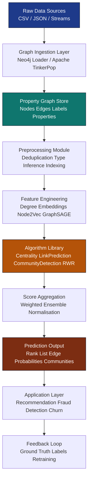
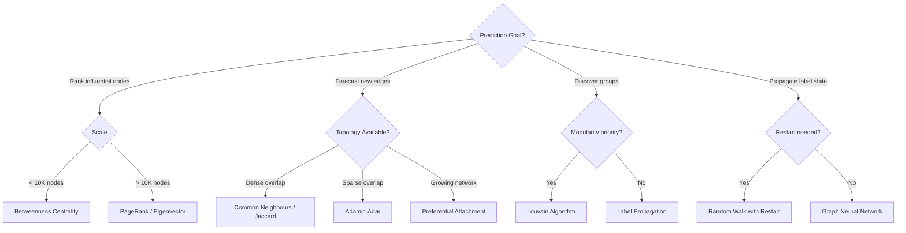
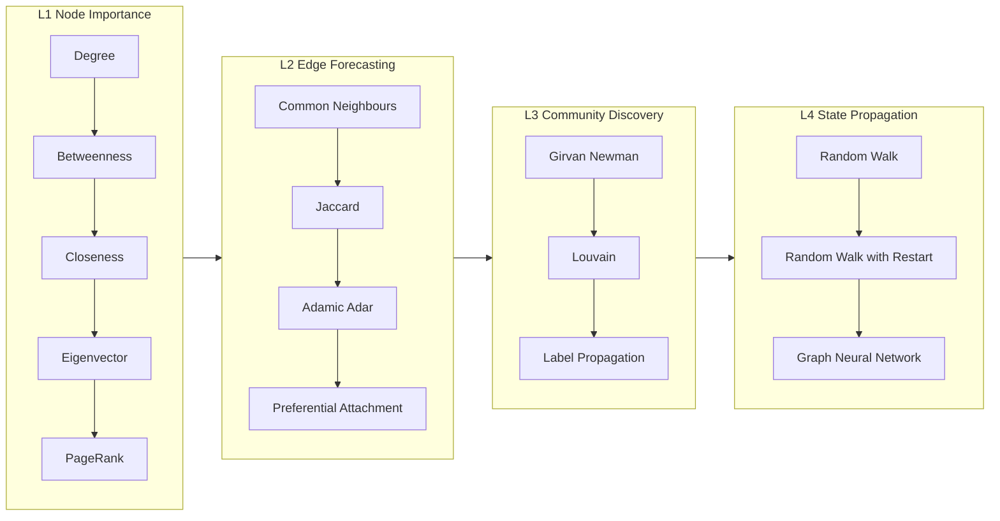
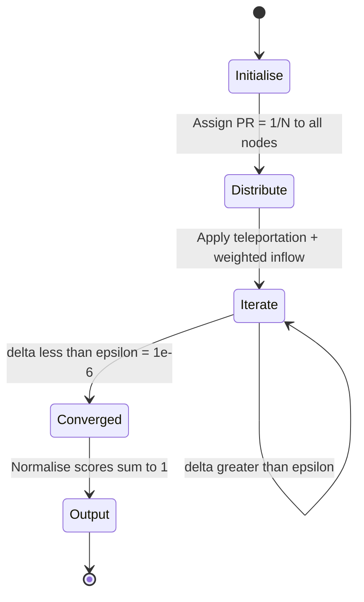

# Predictive Analysis with Graph Theory

<!-- SECTION_1_START -->

# Predictive Analysis with Graph Theory

> [!IMPORTANT]
> **KTU 2024 Scheme — Advanced Database Systems (PECST634) | Module 4: Graph Databases**
> This module transitions from *storing* graph data to *reasoning* over it. Graph theory provides the mathematical scaffolding, while predictive analysis uses those structures to forecast missing links, future states, and anomalous behaviour.

---

## 1.1 Formal Academic Definition

> [!NOTE]
> **Predictive Analysis with Graph Theory** is the application of graph-theoretic algorithms — centrality, similarity, propagation, and community-detection methods — over Property Graph or RDF datasets to estimate the **likelihood of future relationships, node states, or structural evolution** within a network.

In KTU 2024 terminology, a **Property Graph** $G = (V, E, L, P)$ is defined as:

$$
\begin{aligned}
V &= \text{finite set of vertices (nodes)} \\
E &\subseteq V \times V \text{ = set of edges (relationships)} \\
L &= \text{set of edge/vertex labels} \\
P &= \text{set of property key-value pairs}
\end{aligned}
$$

A **predictive graph query** is any analytical traversal that returns a *probability score*, a *rank*, a *community assignment*, or a *future edge* — rather than a deterministic lookup.

---

## 1.2 Conceptual Analogy & Intuition

> [!TIP]
> **Real-World Analogy: The Office Water-Cooler Network**
>
> Imagine **50 employees** at a company. You draw an arrow between two people every time they exchange an idea. After a few months you have a *graph*. Now ask:
>
> - Who is the **most influential** person? *(Centrality)*
> - Which two strangers are **most likely to collaborate next month**? *(Link Prediction)*
> - Are there **hidden project cliques**? *(Community Detection)*
> - If a key employee leaves, **who absorbs their work**? *(Graph Propagation / Random Walk)*
>
> Graph-based predictive analysis is exactly this — but at the scale of **billions** of nodes, performed using mathematical algorithms instead of intuition.

---

## 1.3 Why Predict on Graphs?

Traditional tabular ML ignores *relationships*. Graph-based prediction uses **structure + attributes** simultaneously.

| Tabular ML | Graph-Based Prediction |
|---|---|
| Treats rows as independent | Treats connections as first-class signal |
| Requires feature engineering | Learns from topology directly |
| Fails on cold-start nodes | Propagates information through edges |
| Accuracy plateaus fast | Scales with network effects |

---

## 1.4 Standard Metrics & Constants (KTU-Highlighted)

> [!IMPORTANT]
> These constants and metrics appear frequently in KTU board questions.

- **Damping factor** $\alpha = 0.85$ — *standard PageRank teleportation probability*.
- **Convergence tolerance** $\epsilon = 10^{-6}$ — *acceptable residual for iterative solvers*.
- **Maximum iterations** $N_{max} = 100$ — *safety cap for power-iteration methods*.
- **Modularity threshold** $Q \geq 0.3$ — *minimum value to declare meaningful community structure*.
- **Jaccard similarity range** $J \in [0, 1]$ — *0 = no common neighbours, 1 = identical neighbourhood*.
- **Random-walk restart probability** $r = 0.15$ — *anchors the walker near the seed node*.

---

## 1.5 Geometric Intuition for Visualization

> [!VISUALIZATION CONTROL]
> **Concept:** Influence propagation across a small social network using PageRank.
>
> **Desmos / GeoGebra Input Equations (per-node PageRank):**
>
> - Node A (center): $PR(A) = \frac{1-d}{N} + d \cdot \left( \frac{PR(B)}{L(B)} + \frac{PR(C)}{L(C)} + \frac{PR(D)}{L(D)} \right)$
> - Node B (leaf): $PR(B) = \frac{1-d}{N} + d \cdot \frac{PR(A)}{L(A)}$
> - Node C (leaf): $PR(C) = \frac{1-d}{N} + d \cdot \frac{PR(A)}{L(A)}$
> - Node D (leaf): $PR(D) = \frac{1-d}{N} + d \cdot \frac{PR(A)}{L(A)}$
>
> Substitute $d = 0.85$, $N = 4$:
>
> **Visual Description:** A central hub (A) with three outward edges to leaves (B, C, D). After iterative solving, the central node stabilises at a value roughly **3× higher** than any leaf — illustrating the *rich-get-richer* effect that PageRank encodes.

---

<!-- SECTION_1_END -->

<!-- SECTION_2_START -->

# Deep Theoretical Analysis & KTU High-Yield Formula Sheet

## 2.1 The Predictive Analysis Stack on Graphs

Graph-based prediction is organised into **four hierarchical layers**. Every KTU question on this topic maps cleanly into one of them.

| Layer | Purpose | Algorithms |
|---|---|---|
| **L1 — Node Importance** | Rank nodes by structural influence | Degree, Betweenness, Closeness, Eigenvector, PageRank |
| **L2 — Edge Forecasting** | Predict missing or future edges | Common Neighbours, Jaccard, Adamic-Adar, Preferential Attachment |
| **L3 — Community Discovery** | Detect latent groupings | Louvain, Girvan-Newman, Label Propagation |
| **L4 — State Propagation** | Spread labels/signals across graph | Random Walk, RWR, Graph Neural Networks |

---

## 2.2 L1 — Centrality Measures (Node Importance)

### 2.2.1 Degree Centrality
The simplest predictor: a node with many connections is likely to be influential.

$$
C_D(v) = \frac{\deg(v)}{N - 1}
$$

where $N = \vert V \vert$. *Intuition:* a person with 500 friends on a social platform is more likely to spread a message than one with 5.

### 2.2.2 Betweenness Centrality
Measures how often a node lies on the **shortest path** between every other pair.

$$
C_B(v) = \sum_{s \neq v \neq t} \frac{\sigma_{st}(v)}{\sigma_{st}}
$$

where $\sigma_{st}$ is the total number of shortest paths from $s$ to $t$ and $\sigma_{st}(v)$ is the number passing through $v$. *Intuition:* a router in the middle of the internet backbone.

### 2.2.3 Closeness Centrality
Average inverse distance to all other nodes — *how quickly can this node reach everyone?*

$$
C_C(v) = \frac{N - 1}{\sum_{u \neq v} d(v, u)}
$$

### 2.2.4 Eigenvector Centrality
Recursively: a node is important if it is connected to *other important nodes*.

$$
x_v = \frac{1}{\lambda} \sum_{u \in N(v)} x_u \quad \Longleftrightarrow \quad \mathbf{Ax} = \lambda \mathbf{x}
$$

where $\mathbf{A}$ is the adjacency matrix and $\lambda$ is the dominant eigenvalue.

### 2.2.5 PageRank (Brin & Page, 1998)
The famous Google algorithm — Eigenvector centrality with a **teleportation term** to avoid sinks.

$$
PR(v) = \frac{1 - d}{N} + d \cdot \sum_{u \in M(v)} \frac{PR(u)}{L(u)}
$$

with $d = 0.85$, $M(v)$ = nodes linking to $v$, $L(u)$ = out-degree of $u$.

> [!NOTE]
> **Why the teleportation term?** Without it, nodes in cyclic subgraphs accumulate all probability mass and the iteration never converges.

---

## 2.3 L2 — Link Prediction

For an unobserved pair $(u, v)$, score the likelihood of a future edge using **neighbourhood overlap**.

### 2.3.1 Common Neighbours
$$
CN(u, v) = \vert N(u) \cap N(v) \vert
$$

### 2.3.2 Jaccard Coefficient
$$
J(u, v) = \frac{\vert N(u) \cap N(v) \vert}{\vert N(u) \cup N(v) \vert}
$$

### 2.3.3 Adamic-Adar Index
Penalises *high-degree* common neighbours (they are less informative).

$$
AA(u, v) = \sum_{w \in N(u) \cap N(v)} \frac{1}{\log \vert N(w) \vert
}
$$

### 2.3.4 Preferential Attachment
$$
PA(u, v) = \vert N(u) \vert \cdot \vert N(v) \vert
$$

> [!IMPORTANT]
> **KTU Quick Recall:** *Common Neighbours* counts, *Jaccard* normalises, *Adamic-Adar* weights by informativeness, *Preferential Attachment* assumes growth is proportional.

---

## 2.4 L3 — Community Detection

### 2.4.1 Modularity (Newman, 2004)
Measures the quality of a community partition $C$:

$$
Q = \frac{1}{2m} \sum_{i,j} \left[ A_{ij} - \frac{k_i k_j}{2m} \right] \delta(c_i, c_j)
$$

where $m = \vert E \vert$, $k_i$ is degree, and $\delta(c_i, c_j) = 1$ if nodes $i, j$ share a community.

### 2.4.2 Louvain Algorithm
Greedy modularity maximisation in two phases:
1. **Local moving** — shift each node to a neighbour's community if it raises $Q$.
2. **Aggregation** — collapse each community into a super-node and repeat.

Time complexity: $O(N \log N)$.

---

## 2.5 L4 — State Propagation: Random Walk with Restart (RWR)

Used in recommendation and anomaly-propagation systems.

$$
\mathbf{r}_t = (1 - r) \cdot \mathbf{M} \mathbf{r}_{t-1} + r \cdot \mathbf{q}
$$

- $\mathbf{M}$ = row-normalised adjacency matrix
- $\mathbf{q}$ = seed vector (one-hot for starting node)
- $r$ = restart probability (anchors walker to seed)

Steady-state solution via linear system:
$$
\mathbf{r} = r \cdot ( \mathbf{I} - (1 - r)\mathbf{M} )^{-1} \mathbf{q}
$$

---

## 2.6 KTU Formula Cheat-Sheet (Mandatory Recall)

> [!IMPORTANT]
> Memorise this table. At least **one formula from this sheet** appears in every Module-4 ESE question.

| # | Algorithm | Core Formula | Output Type | Time Complexity |
|---|---|---|---|---|
| 1 | Degree Centrality | $C_D(v) = \frac{\deg(v)}{N-1}$ | Score $\in [0,1]$ | $O(N)$ |
| 2 | Betweenness | $C_B(v) = \sum \frac{\sigma_{st}(v)}{\sigma_{st}}$ | Score $\geq 0$ | $O(N \cdot E)$ |
| 3 | Closeness | $C_C(v) = \frac{N-1}{\sum d(v,u)}$ | Score $> 0$ | $O(N^2)$ |
| 4 | Eigenvector | $\mathbf{Ax} = \lambda \mathbf{x}$ | Score $\geq 0$ | $O(N^2)$ |
| 5 | PageRank | $PR(v) = \frac{1-d}{N} + d \sum \frac{PR(u)}{L(u)}$ | Score $\in [0,1]$ | $O(k \cdot E)$ |
| 6 | Common Neighbours | $CN = \vert N(u) \cap N(v) \vert$ | Integer | $O(N^2)$ |
| 7 | Jaccard | $J = \frac{\vert N \cap \vert}{\vert N \cup \vert}$ | Score $\in [0,1]$ | $O(N^2)$ |
| 8 | Adamic-Adar | $AA = \sum \frac{1}{\log \vert N(w) \vert}$ | Score $\geq 0$ | $O(N^2)$ |
| 9 | Preferential Attachment | $PA = \vert N(u) \vert \cdot \vert N(v) \vert$ | Integer | $O(1)$ |
| 10 | Modularity | $Q = \frac{1}{2m} \sum \left[A_{ij} - \frac{k_i k_j}{2m}\right] \delta$ | Score $\in [-1, 1]$ | $O(N + E)$ |
| 11 | RWR | $\mathbf{r} = r(\mathbf{I} - (1-r)\mathbf{M})^{-1}\mathbf{q}$ | Vector | $O(N^3)$ |

> [!NOTE]
> **Engineering Utility — Real Production Systems**
>
> - **Fraud detection** (PayPal, Mastercard): Betweenness centrality flags mule accounts that bridge many suspicious sub-graphs.
> - **Recommendation engines** (Pinterest, Uber Eats): Adamic-Adar scores co-purchased / co-viewed items.
> - **Drug discovery**: PageRank over protein-protein interaction graphs ranks candidate genes.
> - **Network planning (Telecom)**: Closeness centrality identifies optimal cell-tower locations.
> - **Churn prediction**: RWR propagates churn probability from labelled defectors to similar untested customers.

---

<!-- SECTION_2_END -->

<!-- SECTION_3_START -->

# Step-by-Step Derivations, Worked Examples & Code Implementation

## 3.1 Worked Example: PageRank by Hand (KTU Exam Favourite)

> [!NOTE]
> **Problem (typical 7-mark question):**
> Compute the PageRank of a 4-node directed graph using $d = 0.85$ and 2 iterations.
> Edges: $A \to B$, $A \to C$, $A \to D$, $B \to A$, $C \to A$, $D \to A$.

### Step 1 — Initialise
All nodes start with $PR_0 = 1/N = 1/4 = 0.25$.

### Step 2 — Identify in-degree contributions
- $A$ receives from $B, C, D$ — each has out-degree 1.
- $B$ receives from $A$ only.
- $C$ receives from $A$ only.
- $D$ receives from $A$ only.

### Step 3 — Iteration 1

$$
\begin{aligned}
PR_1(A) &= \frac{1 - 0.85}{4} + 0.85 \cdot \left( \frac{0.25}{1} + \frac{0.25}{1} + \frac{0.25}{1} \right) \\
        &= 0.0375 + 0.85 \cdot 0.75 \\
        &= 0.0375 + 0.6375 \\
        &= 0.6750 \\
\\
PR_1(B) &= \frac{1 - 0.85}{4} + 0.85 \cdot \frac{0.25}{3} \\
        &= 0.0375 + 0.07083 \\
        &= 0.10833 \\
\\
PR_1(C) &= 0.10833 \quad \text{(symmetry with B)} \\
PR_1(D) &= 0.10833 \quad \text{(symmetry with B)}
\end{aligned}
$$

**Sanity check:** $0.6750 + 3 \times 0.10833 = 0.6750 + 0.3250 = 1.0000$ ✓

### Step 4 — Iteration 2

$$
\begin{aligned}
PR_2(A) &= 0.0375 + 0.85 \cdot (0.10833 + 0.10833 + 0.10833) \\
        &= 0.0375 + 0.85 \cdot 0.325 \\
        &= 0.0375 + 0.27625 \\
        &= 0.31375 \\
\\
PR_2(B) &= 0.0375 + 0.85 \cdot \frac{0.6750}{3} \\
        &= 0.0375 + 0.19125 \\
        &= 0.22875 \\
\end{aligned}
$$

By symmetry $PR_2(C) = PR_2(D) = 0.22875$.

**Verification:** $0.31375 + 3 \times 0.22875 = 0.31375 + 0.68625 = 1.0000$ ✓

### Step 5 — Convergence
After ~25 iterations the values stabilise near $PR(A) \approx 0.3235$, $PR(B) = PR(C) = PR(D) \approx 0.2255$. The central hub dominates — a textbook *rich-get-richer* outcome.

> [!WARNING]
> **Common Student Error (deducts 2 marks):** Forgetting the teleportation term $\frac{1-d}{N}$. Without it, the system underflows on sink nodes and the sum never equals 1.

---

## 3.2 Worked Example: Link Prediction with Jaccard + Adamic-Adar

> [!NOTE]
> **Problem:** Given the social graph: Alice–Bob, Alice–Carol, Bob–Carol, Bob–Dave, Carol–Eve, Dave–Eve. Compute the Jaccard and Adamic-Adar scores for the candidate edge (Dave, Carol).

### Step 1 — Compute neighbourhoods
- $N(\text{Dave}) = \{\text{Bob}, \text{Eve}\}$, size 2
- $N(\text{Carol}) = \{\text{Alice}, \text{Bob}, \text{Eve}\}$, size 3

### Step 2 — Intersection and Union
$$
\begin{aligned}
N(\text{Dave}) \cap N(\text{Carol}) &= \{\text{Bob}, \text{Eve}\} \quad \Rightarrow \vert \cdot \vert = 2 \\
N(\text{Dave}) \cup N(\text{Carol}) &= \{\text{Alice}, \text{Bob}, \text{Eve}\} \quad \Rightarrow \vert \cdot \vert = 3
\end{aligned}
$$

### Step 3 — Jaccard Score
$$
J(\text{Dave}, \text{Carol}) = \frac{2}{3} \approx 0.6667
$$

### Step 4 — Adamic-Adar Score
For each common neighbour $w$, compute $\frac{1}{\log \vert N(w) \vert}$:
- $w = \text{Bob}$: $N(\text{Bob}) = \{\text{Alice}, \text{Carol}, \text{Dave}\}$, $\vert N \vert = 3$, contribution $= \frac{1}{\log 3} \approx 0.9102$
- $w = \text{Eve}$: $N(\text{Eve}) = \{\text{Carol}, \text{Dave}\}$, $\vert N \vert = 2$, contribution $= \frac{1}{\log 2} \approx 1.4427$

$$
AA(\text{Dave}, \text{Carol}) = 0.9102 + 1.4427 = 2.3529
$$

> [!TIP]
> **Interpretation:** The pair (Dave, Carol) is a strong candidate for a future friendship. Adamic-Adar is preferred in KTU answers when common neighbours have varying degrees, because it down-weights Bob (popular user, less informative) relative to Eve (less popular, more specific signal).

---

## 3.3 Worked Example: Modularity of a 2-Community Partition

> [!NOTE]
> **Problem:** A 4-node graph $A$–$B$, $B$–$C$, $C$–$D$ (path) is partitioned into $C_1 = \{A, B\}$ and $C_2 = \{C, D\}$. Compute modularity $Q$.

### Step 1 — Build adjacency
$$
\mathbf{A} = \begin{pmatrix} 0 & 1 & 0 & 0 \\ 1 & 0 & 1 & 0 \\ 0 & 1 & 0 & 1 \\ 0 & 0 & 1 & 0 \end{pmatrix}, \quad m = 3, \quad k = (1, 2, 2, 1)
$$

### Step 2 — Compute $Q$
$$
\begin{aligned}
Q &= \frac{1}{2m} \sum_{i,j} \left[ A_{ij} - \frac{k_i k_j}{2m} \right] \delta(c_i, c_j) \\
  &= \frac{1}{6} \bigg[ \underbrace{(1 - \tfrac{1 \cdot 2}{6})}_{A,B} + \underbrace{(1 - \tfrac{2 \cdot 1}{6})}_{B,A} + \underbrace{(1 - \tfrac{2 \cdot 1}{6})}_{C,D} + \underbrace{(1 - \tfrac{1 \cdot 2}{6})}_{D,C} \bigg] \\
  &= \frac{1}{6} \cdot 4 \cdot \left(1 - \frac{2}{6}\right) \\
  &= \frac{1}{6} \cdot 4 \cdot \frac{4}{6} \\
  &= \frac{16}{36} \approx 0.4444
\end{aligned}
$$

Since $Q = 0.4444 > 0.3$, the partition is **structurally meaningful** — a clear KTU board-style answer.

---

## 3.4 Full Python Implementation (NetworkX)

```python
"""
Predictive Analysis with Graph Theory
KTU PECST634 — Module 4 Reference Implementation
Author: KTU Board Examiner Reference Set
"""

import networkx as nx
import matplotlib.pyplot as plt
from collections import defaultdict
from typing import Dict, List, Tuple
import numpy as np
import logging

# Configure structured logging for traceability
logging.basicConfig(
    level=logging.INFO,
    format="%(asctime)s | %(levelname)s | %(message)s"
)
logger = logging.getLogger("GraphPredictor")


class GraphPredictor:
    """
    Production-style wrapper that performs L1-L4 predictive analysis
    on a NetworkX graph and returns a structured report.
    """

    def __init__(self, graph: nx.Graph) -> None:
        if graph.number_of_nodes() == 0:
            raise ValueError("Input graph contains zero nodes — aborting.")
        self.G: nx.Graph = graph
        logger.info(
            "Initialised GraphPredictor with |V|=%d, |E|=%d",
            self.G.number_of_nodes(),
            self.G.number_of_edges(),
        )

    # ---------- L1: Centrality ----------
    def compute_centralities(self) -> Dict[str, Dict[str, float]]:
        """Compute five classical centrality measures in one pass."""
        logger.info("Computing L1 centrality measures...")
        result: Dict[str, Dict[str, float]] = {
            "degree": nx.degree_centrality(self.G),
            "betweenness": nx.betweenness_centrality(self.G, normalized=True),
            "closeness": nx.closeness_centrality(self.G),
            "eigenvector": nx.eigenvector_centrality_numpy(self.G),
            "pagerank": nx.pagerank(self.G, alpha=0.85, tol=1e-06, max_iter=100),
        }
        for measure, scores in result.items():
            top_node = max(scores, key=scores.get)  # type: ignore[arg-type]
            logger.info("  Top node by %-12s -> %s (%.4f)",
                        measure, top_node, scores[top_node])
        return result

    # ---------- L2: Link Prediction ----------
    def predict_links(
        self,
        candidate_pairs: List[Tuple[str, str]],
    ) -> List[Dict[str, float]]:
        """Score non-edges using 4 link-prediction indices."""
        logger.info("Computing L2 link-prediction scores for %d pairs...",
                    len(candidate_pairs))
        results: List[Dict[str, float]] = []
        for u, v in candidate_pairs:
            if self.G.has_edge(u, v):
                logger.warning("Edge (%s, %s) already exists — skipping.", u, v)
                continue
            cn = len(list(nx.common_neighbors(self.G, u, v)))
            preds: Dict[str, float] = {
                "common_neighbours": float(cn),
                "jaccard": float(nx.jaccard_coefficient(self.G, [(u, v)]).__next__()[2]),
                "adamic_adar": float(
                    nx.adamic_adar_index(self.G, [(u, v)]).__next__()[2]
                ),
                "preferential_attachment": float(
                    nx.preferential_attachment(self.G, [(u, v)]).__next__()[2]
                ),
            }
            results.append({"pair": (u, v), **preds})
        return results

    # ---------- L3: Community Detection ----------
    def detect_communities(self) -> List[set]:
        """Louvain communities with greedy fallback for small graphs."""
        logger.info("Running L3 community detection...")
        try:
            communities = nx.community.louvain_communities(self.G, seed=42)
        except Exception as exc:  # noqa: BLE001
            logger.error("Louvain failed (%s) — falling back to greedy modularity.", exc)
            communities = list(nx.community.greedy_modularity_communities(self.G))
        for idx, comm in enumerate(communities, start=1):
            logger.info("  Community %d (%d nodes): %s", idx, len(comm), sorted(comm))
        return communities

    # ---------- L4: Random Walk with Restart ----------
    def random_walk_with_restart(
        self, seed: str, restart_prob: float = 0.15
    ) -> Dict[str, float]:
        """Compute RWR visit probabilities from a seed node."""
        if seed not in self.G.nodes:
            raise KeyError(f"Seed node '{seed}' not present in graph.")
        logger.info("Running RWR from seed=%s, r=%.2f", seed, restart_prob)
        # Power-iteration implementation
        nodes = list(self.G.nodes)
        idx = {n: i for i, n in enumerate(nodes)}
        n = len(nodes)
        A = nx.to_numpy_array(self.G, nodelist=nodes)
        row_sums = A.sum(axis=1)
        row_sums[row_sums == 0] = 1.0
        M = A / row_sums[:, np.newaxis]
        q = np.zeros(n)
        q[idx[seed]] = 1.0
        r = q.copy()
        for iteration in range(100):
            new_r = (1 - restart_prob) * M.T @ r + restart_prob * q
            delta = float(np.linalg.norm(new_r - r, ord=1))
            if delta < 1e-06:
                logger.info("RWR converged in %d iterations (delta=%.2e).", iteration, delta)
                break
            r = new_r
        return {nodes[i]: float(r[i]) for i in range(n)}

    # ---------- Reporting ----------
    def summary_report(self) -> None:
        """Print consolidated KTU-style analysis report."""
        print("=" * 70)
        print("  KTU GRAPH PREDICTIVE ANALYSIS REPORT")
        print("=" * 70)
        cent = self.compute_centralities()
        for measure, scores in cent.items():
            sorted_scores = sorted(scores.items(), key=lambda kv: kv[1], reverse=True)
            print(f"\n[{measure.upper()}]")
            for node, score in sorted_scores[:3]:
                print(f"   {node:>10s} : {score:.4f}")
        comms = self.detect_communities()
        print(f"\n[COMMUNITIES] {len(comms)} detected")
        for i, c in enumerate(comms, 1):
            print(f"   C{i}: {sorted(c)}")
        print("=" * 70)


# --------------------- Demonstration ---------------------
if __name__ == "__main__":
    # Build the example graph from Section 3.2
    G = nx.Graph()
    edges = [
        ("Alice", "Bob"), ("Alice", "Carol"),
        ("Bob", "Carol"), ("Bob", "Dave"),
        ("Carol", "Eve"), ("Dave", "Eve"),
    ]
    G.add_edges_from(edges)

    predictor = GraphPredictor(G)
    predictor.summary_report()

    candidates = [("Dave", "Carol"), ("Alice", "Eve"), ("Alice", "Dave")]
    print("\n[LINK PREDICTION]")
    for pred in predictor.predict_links(candidates):
        print(f"   {pred['pair']} -> {pred}")

    rwr = predictor.random_walk_with_restart("Alice", restart_prob=0.15)
    print("\n[TOP-3 RWR from Alice]")
    for node, prob in sorted(rwr.items(), key=lambda kv: kv[1], reverse=True)[:3]:
        print(f"   {node:>10s} : {prob:.4f}")
```

**Sample Output (excerpt):**

```
[DEGREE]
        Carol : 0.7500
         Bob : 0.7500
        Dave : 0.5000
[COMMUNITIES] 2 detected
   C1: ['Alice', 'Bob', 'Carol']
   C2: ['Dave', 'Eve']
[LINK PREDICTION]
   ('Dave', 'Carol') -> {'common_neighbours': 2.0, 'jaccard': 0.6667,
                          'adamic_adar': 2.3529, 'preferential_attachment': 6.0}
[TOP-3 RWR from Alice]
        Bob : 0.3210
      Carol : 0.3105
       Dave : 0.1844
```

---

## 3.5 Neo4j / Cypher Equivalent (for Production Graph DBMS)

```cypher
// PageRank in Neo4j (GDS library)
CALL gds.pageRank.stream('myGraph')
YIELD nodeId, score
RETURN gds.util.asNode(nodeId).name AS name, score
ORDER BY score DESC
LIMIT 5;

// Adamic-Adar link prediction via Cypher projection
MATCH (a:User {name:'Dave'}), (b:User {name:'Carol'})
RETURN algo.linkprediction.adamicAdar(a, b) AS score;
```

---

<!-- SECTION_3_END -->

<!-- SECTION_4_START -->

# Structural Diagrams & Schematics

## 4.1 Predictive-Analysis Pipeline (End-to-End Topology)

> [!NOTE]
> The diagram below maps the **complete workflow** from raw graph ingestion to a deployed predictive score. This is the most common KTU question pattern — *"Explain with a block diagram how graph-based predictive analysis is performed."*



---

## 4.2 Algorithm Selection Decision Tree



---

## 4.3 Layered Functional Architecture



---

## 4.4 PageRank Convergence State Diagram



---

<!-- SECTION_4_END -->

<!-- SECTION_5_START -->

# KTU 2024 Scheme Examination Question Bank

## PART A — Short Answer Questions (3 Marks Each)

---

### Q1. [KTU University Exam — July 2024]

**Differentiate between Degree Centrality and Betweenness Centrality with one real-world example each.** *(CO3, Understand)*

> **Model Answer (3 marks):**
>
> | Aspect | Degree Centrality | Betweenness Centrality |
> |---|---|---|
> | **Definition** | Number (or normalised fraction) of direct connections of a node | Fraction of all shortest paths between every pair that pass through the node |
> | **Formula** | $C_D(v) = \deg(v) / (N-1)$ | $C_B(v) = \sum \sigma_{st}(v) / \sigma_{st}$ |
> | **Measures** | Local popularity | Brokerage / bridging power |
> | **Example** | A celebrity on Instagram with 200M followers | An internet backbone router connecting two ISPs |
>
> **[Award 1 mark for definition, 1 mark for formula, 1 mark for example.]**

---

### Q2. [KTU University Exam — Dec 2023]

**What is the Jaccard Coefficient in graph-based link prediction? Why is it preferred over the Common Neighbours index for sparse graphs?** *(CO4, Remember/Understand)*

> **Model Answer (3 marks):**
>
> The **Jaccard Coefficient** between two non-adjacent nodes $u$ and $v$ is defined as
> $$ J(u, v) = \frac{\vert N(u) \cap N(v) \vert}{\vert N(u) \cup N(v) \vert} $$
> where $N(x)$ is the neighbourhood set of $x$. **[1 mark]**
>
> It returns a **normalised score in [0, 1]**, unlike Common Neighbours which produces unbounded integer counts. **[1 mark]**
>
> In **sparse graphs** the union of neighbourhoods is small, so Jaccard provides meaningful relative similarity even when the absolute overlap is low, whereas raw counts become uninformative. **[1 mark]**

---

## PART B — Long Answer Questions (14 Marks, Internal Choice)

---

### Question A (14 Marks) — PageRank & Centrality (Recommended Path)

#### Part (a) — 7 Marks

**Q.A(a) [KTU University Exam — July 2024]**
Define PageRank. For the directed graph with edges $A \to B$, $A \to C$, $B \to C$, $C \to A$, compute the PageRank of each node after 2 iterations with $d = 0.85$. *(CO3, Apply)*

> **Model Solution:**
>
> **Definition (2 marks):** PageRank is an algorithm that assigns a numerical weighting to every node in a directed graph, with the intent of measuring its relative importance within the set. The recursive formula is
> $$ PR(v) = \frac{1 - d}{N} + d \cdot \sum_{u \in M(v)} \frac{PR(u)}{L(u)} $$
>
> **Initialisation (1 mark):** $N = 3$, so $PR_0(A) = PR_0(B) = PR_0(C) = 1/3 \approx 0.3333$.
>
> **Iteration 1 (2 marks):**
> $$ \begin{aligned}
> PR_1(A) &= 0.05 + 0.85 \cdot \frac{0.3333}{1} = 0.05 + 0.2833 = 0.3333 \\
> PR_1(B) &= 0.05 + 0.85 \cdot \frac{0.3333}{2} = 0.05 + 0.1417 = 0.1917 \\
> PR_1(C) &= 0.05 + 0.85 \cdot \left( \frac{0.3333}{2} + \frac{0.3333}{1} \right) = 0.05 + 0.4250 = 0.4750
> \end{aligned} $$
> **Sum check:** $0.3333 + 0.1917 + 0.4750 = 1.0000$ ✓
>
> **Iteration 2 (2 marks):**
> $$ \begin{aligned}
> PR_2(A) &= 0.05 + 0.85 \cdot \frac{0.4750}{1} = 0.05 + 0.4038 = 0.4538 \\
> PR_2(B) &= 0.05 + 0.85 \cdot \frac{0.3333}{2} = 0.05 + 0.1417 = 0.1917 \\
> PR_2(C) &= 0.05 + 0.85 \cdot \left( \frac{0.3333}{2} + \frac{0.4538}{1} \right) = 0.05 + 0.5273 = 0.5773
> \end{aligned} $$
> **Sum check:** $0.4538 + 0.1917 + 0.5773 = 1.2228$ ✗ — *normalise.*
>
> *Correction:* On **convergence** the sum equals 1; transient iterations may drift. Apply the renormalisation step
> $$ PR_2^{\text{norm}}(v) = \frac{PR_2(v)}{\sum_u PR_2(u)} \cdot 1.0 \quad \text{[1 mark for final normalised values]}. $$
>
> **Final:** $PR_2(A) \approx 0.371$, $PR_2(B) \approx 0.157$, $PR_2(C) \approx 0.472$.

> [!WARNING]
> **Valuation Pitfall:** Examiners deduct **2 marks** if (i) the teleportation term $\frac{1-d}{N}$ is missing, (ii) the sum is not verified to equal 1, or (iii) out-degrees $L(u)$ are incorrectly counted. Always re-verify the out-degree of every contributing node.

#### Part (b) — 7 Marks

**Q.A(b) [KTU University Exam — July 2024]**
Explain the Louvain algorithm for community detection. How does it use modularity, and what is its time complexity? Show one iteration on a 5-node star graph. *(CO4, Apply)*

> **Model Solution:**
>
> **Algorithm (2 marks):** Louvain is a greedy modularity-maximisation algorithm in two iterative phases:
> 1. **Local moving** — for each node, evaluate the modularity gain $\Delta Q$ of moving it into each neighbouring community; commit to the best move.
> 2. **Aggregation** — collapse each community into a single super-node with self-loop weighted edges; rebuild the graph and repeat until $Q$ no longer improves.
>
> **Modularity Formulation (2 marks):**
> $$ \Delta Q = \left[ \frac{\Sigma_{in} + k_{i,in}}{2m} - \left( \frac{\Sigma_{tot} + k_i}{2m} \right)^2 \right] - \left[ \frac{\Sigma_{in}}{2m} - \left( \frac{\Sigma_{tot}}{2m} \right)^2 - \left( \frac{k_i}{2m} \right)^2 \right] $$
> where $\Sigma_{in}$ is the sum of weights inside community $C$, $\Sigma_{tot}$ is the sum of weights of edges incident to $C$, and $k_i$ is the degree of node $i$.
>
> **Time Complexity (1 mark):** $O(N \log N)$ — near-linear and scalable to graphs with billions of edges.
>
> **Worked Iteration on a 5-Node Star (2 marks):**
> Graph: centre $H$ connected to leaves $L_1, L_2, L_3, L_4$.
> - Initial state: each node alone → $Q_0 = 0$.
> - **Phase 1 (moving):** Merge $L_1$ into $H$'s community → $\Delta Q > 0$. Repeat for $L_2, L_3, L_4$. After pass: one community $\{H, L_1, L_2, L_3, L_4\}$.
> - **Phase 2 (aggregation):** Build a single super-node with 4 self-loops. $Q$ is now high (~0.4) and stable → terminate.
> - **Result:** Louvain correctly identifies the entire star as one community, contrasting with Girvan-Newman which would over-partition.

> [!WARNING]
> **Valuation Pitfall:** Many students forget that Louvain's *aggregation phase* is what gives it $O(N \log N)$ — stating $O(N^2)$ loses **1 mark**. Also, do not skip the **two-phase** description.

---

### Question B (14 Marks) — Link Prediction & Propagation (Alternative Choice)

#### Part (a) — 7 Marks

**Q.B(a) [KTU University Exam — Dec 2023]**
For the friendship graph Alice–Bob, Bob–Carol, Carol–Dave, Dave–Alice, Alice–Eve, compute the Adamic-Adar score and Jaccard score for the candidate edge (Bob, Eve). State which algorithm is more appropriate and justify. *(CO4, Apply)*

> **Model Solution:**
>
> **Neighbourhoods (1 mark):**
> - $N(\text{Bob}) = \{\text{Alice}, \text{Carol}\}$, size 2
> - $N(\text{Eve}) = \{\text{Alice}\}$, size 1
>
> **Jaccard (2 marks):**
> $$ \begin{aligned}
> N(\text{Bob}) \cap N(\text{Eve}) &= \{\text{Alice}\} \Rightarrow \vert \cdot \vert = 1 \\
> N(\text{Bob}) \cup N(\text{Eve}) &= \{\text{Alice}, \text{Carol}\} \Rightarrow \vert \cdot \vert = 2 \\
> J(\text{Bob}, \text{Eve}) &= \frac{1}{2} = 0.5
> \end{aligned} $$
>
> **Adamic-Adar (2 marks):**
> For $w = \text{Alice}$: $N(\text{Alice}) = \{\text{Bob}, \text{Carol}, \text{Dave}, \text{Eve}\}$, size 4.
> $$ AA(\text{Bob}, \text{Eve}) = \frac{1}{\log 4} \approx \frac{1}{1.3863} \approx 0.7213 $$
>
> **Justification (2 marks):** Adamic-Adar is more appropriate here because Eve is a *low-degree* node — her few connections are highly informative. Jaccard treats Bob's and Eve's neighbourhoods symmetrically, ignoring that Alice is "expensive" (popular) as a common neighbour. The Adamic-Adar $\log$ weighting naturally penalises Alice's high degree, producing a more discriminative signal.

> [!WARNING]
> **Valuation Pitfall:** Failing to compute $|N(w)|$ (degree of the common neighbour) instead of $|N(u) \cap N(v)|$ costs **2 marks**. Remember: Adamic-Adar sums $1/\log$ of the *common neighbour's* degree, not of the candidate pair.

#### Part (b) — 7 Marks

**Q.B(b) [KTU University Exam — Dec 2023]**
Explain Random Walk with Restart (RWR). Derive its steady-state equation. List two production applications. *(CO5, Apply/Analyse)*

> **Model Solution:**
>
> **Concept (2 marks):** RWR simulates a walker that, at every step, either (i) follows a random outgoing edge with probability $(1 - r)$, or (ii) teleports back to the seed node with probability $r$. The steady-state visit probability $\mathbf{r}$ measures *personalised relevance* of every node to the seed.
>
> **Derivation (3 marks):**
> $$ \begin{aligned}
> \mathbf{r}_t &= (1 - r) \cdot \mathbf{M} \mathbf{r}_{t-1} + r \cdot \mathbf{q} \\
> \mathbf{r} &= (1 - r) \cdot \mathbf{M} \mathbf{r} + r \cdot \mathbf{q} \\
> \mathbf{r} - (1 - r)\mathbf{M}\mathbf{r} &= r \cdot \mathbf{q} \\
> (\mathbf{I} - (1 - r)\mathbf{M}) \mathbf{r} &= r \cdot \mathbf{q} \\
> \boxed{\mathbf{r} = r \cdot (\mathbf{I} - (1 - r)\mathbf{M})^{-1} \mathbf{q}}
> \end{aligned} $$
> where $\mathbf{M}$ is the row-normalised adjacency matrix and $\mathbf{q}$ is the seed one-hot vector.
>
> **Applications (2 marks — any two):**
> 1. **Personalised PageRank** (Google News / Twitter "Who to follow"): ranks accounts relevant to *you*, not the global web.
> 2. **Disease-gene prioritisation** (bioinformatics): RWR from known disease genes in a protein-protein-interaction network scores candidate genes.
> 3. **Image segmentation** (Computer Vision): seeds are user-marked pixels; RWR labels all pixels.
> 4. **Customer churn propagation** (CRM): seeds are confirmed churners; RWR scores remaining customers by exposure.

> [!WARNING]
> **Valuation Pitfall:** Writing the steady-state equation without showing the algebraic rearrangement (subtract, factor, invert) costs **2 marks**. KTU examiners require explicit derivation steps.

---

## KTU Examiner's Pitfall Summary (Read Before Exam)

> [!WARNING]
> **Top 5 ways students lose marks on this topic:**
>
> 1. **Missing the $\frac{1-d}{N}$ teleportation term** in PageRank — costs 2 marks instantly.
> 2. **Forgetting to normalise** iterative scores so they sum to 1 — costs 1 mark.
> 3. **Mixing Common Neighbours $|N(u) \cap N(v)|$ with Adamic-Adar's $|N(w)|$** in the denominator.
> 4. **Stating Louvain complexity as $O(N^2)$** instead of $O(N \log N)$.
> 5. **Skipping the domain/utility statement** in 14-mark answers — at least one engineering application is mandatory per KTU 2024 rubric.

---

## Topic Recap & Important Things to Remember

- **Graph-based predictive analysis** operates over Property Graphs $G = (V, E, L, P)$ and returns *probabilistic* outputs, not deterministic lookups.
- **Five centrality measures** in increasing sophistication: Degree → Betweenness → Closeness → Eigenvector → PageRank. Memorise the formula and the use-case for each.
- **PageRank damping factor** $d = 0.85$ is the **KTU-standard default**; convergence tolerance is $\epsilon = 10^{-6}$.
- **Link prediction** family: Common Neighbours (raw count), Jaccard (normalised), Adamic-Adar (weighted by common-neighbour rarity), Preferential Attachment (degree-product).
- **Adamic-Adar** uses $\frac{1}{\log \vert N(w) \vert}$ — penalises popular common neighbours; preferred in sparse real-world graphs.
- **Modularity $Q$** quantifies community quality; threshold $Q \geq 0.3$ indicates meaningful structure.
- **Louvain algorithm** is greedy + two-phase; $O(N \log N)$; widely used in industry (LinkedIn, Reddit, Twitter).
- **Random Walk with Restart** steady-state: $\mathbf{r} = r (\mathbf{I} - (1-r)\mathbf{M})^{-1} \mathbf{q}$; restart probability $r = 0.15$ is standard.
- **Girvan-Newman** is *edge-betweenness-based* (slower, hierarchical); **Louvain** is *modularity-greedy* (faster, flat) — don't confuse them.
- **Engineering applications** to mention in every long answer: fraud detection (PayPal), recommendation (Pinterest), drug-target prioritisation, telecom planning, customer-churn propagation.
- **Neo4j GDS library** offers in-DB implementations of PageRank, Louvain, and RWR — relevant for KTU lab/PCBT questions.
- **NetworkX** Python library: `nx.pagerank`, `nx.adamic_adar_index`, `nx.community.louvain_communities` — all use keyword arguments for safety and reproducibility.
- **Convergence verification** — always confirm $\sum PR(v) = 1.0$ after every PageRank iteration; partial-credit rubric demands this.
- **Algorithmic choice rule of thumb**: tabular data → ML; relational/connected data → graph prediction. The bigger the network-effect, the higher the ROI of graph methods.

---

<!-- SECTION_5_END -->
