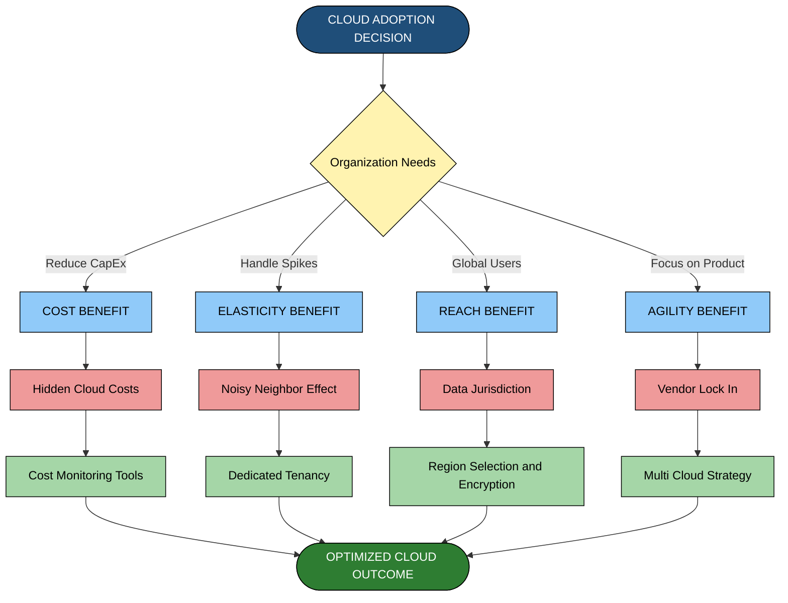
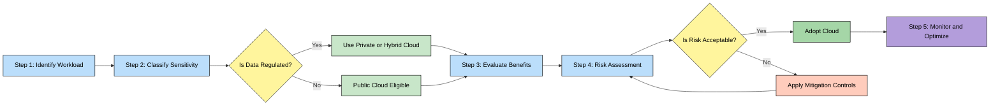
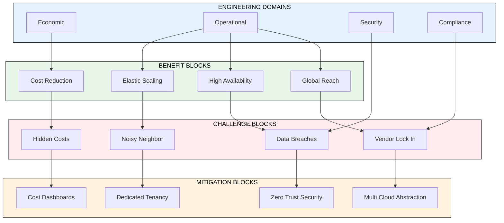
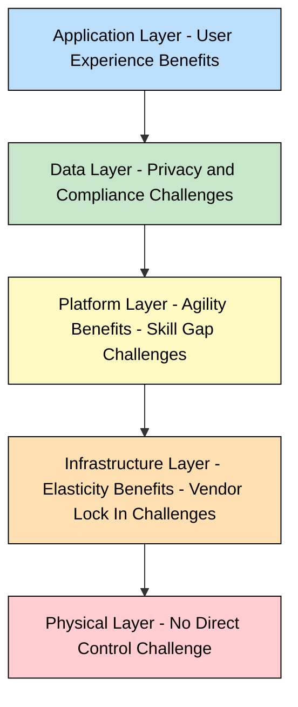

# Benefits and Challenges

<!-- SECTION_1_START -->
# Cloud Computing: Benefits and Challenges

> [!IMPORTANT]
> **KTU 2024 Scheme (PECST635) — Module 1 Focus Area**
> According to the APJ Abdul Kalam Technological University 2024 Scheme syllabus for *Professional Elective – Cloud Computing (PECST635)*, this topic directly maps to **Course Outcome CO1** and **Cognitive Level: Understand / Apply**. Mastery of the benefits-and-challenges dichotomy is essential to answer case-study and comparative analysis questions that appear frequently in the End Semester Evaluation (ESE).

---

## 1.1 Formal Academic Definition

**Cloud Computing** is a model for enabling ubiquitous, convenient, on-demand network access to a shared pool of configurable computing resources (e.g., **networks**, **servers**, **storage**, **applications**, and **services**) that can be rapidly provisioned and released with **minimal management effort or service provider interaction** — as defined by the **National Institute of Standards and Technology (NIST) Special Publication 800-145**.

Within this model, the term **Benefits** refers to the tangible and intangible advantages (technical, economic, operational) that an organization accrues by migrating workloads to a cloud environment, while **Challenges** denotes the set of technical, organizational, legal, and operational barriers that must be mitigated for successful adoption.

> [!NOTE]
> **The NIST Triple-Property Lens (Required for ESE Answers)**
> Every benefit of cloud computing discussed in your KTU answer script must be justified against the five essential characteristics (On-demand self-service, Broad network access, Resource pooling, Rapid elasticity, Measured service) and the three service models (**SaaS**, **PaaS**, **IaaS**) — failing to anchor your answer to this framework results in lost marks.

---

## 1.2 Conceptual Analogy — The "Electricity Grid" Model

Imagine a small town in the **1950s**. Every house had its own diesel generator. The town suffered:
- **High Capital Expenditure (CapEx)** — buying the generator upfront
- **Wasted Capacity** — the generator ran even when lights were off
- **Maintenance Burden** — fuel, oil, breakdowns
- **No Scale** — adding one more machine was a nightmare

Then the **electricity grid** arrived. Houses simply plugged in, paid only for the watts they consumed, and instantly scaled from one bulb to a hundred air-conditioners without thinking about infrastructure.

> **Cloud Computing is the "Electricity Grid" of IT.** You stop building and maintaining your own power plant (servers, datacenters, cooling) and instead *plug in* to a shared, metered, elastic resource pool owned by a provider (AWS, Azure, GCP).

### The Analogy Mapped to Cloud Concepts

| Real-World Electricity Grid | Cloud Computing Equivalent |
| :--- | :--- |
| Power Plant | Hyperscale Datacenter (Region) |
| Transmission Lines | The Internet / WAN / BGP Backbone |
| Electricity Meter | Usage Metering (Pay-as-you-go billing) |
| Voltage Stabilizer | Service Level Agreement (SLA) |
| Power Outage | Datacenter Outage / Region Failure |
| Wiring your own house | On-Premise Infrastructure |

---

## 1.3 The Engineering Trade-off Preview

> [!WARNING]
> **The KTU Examiner's Trap**
> Students frequently write a one-sided answer listing only benefits ("scalability, cost savings…") or only challenges ("security, vendor lock-in…"). The 2024 Scheme explicitly tests **analytical reasoning**. For full marks, you MUST present cloud adoption as an **engineering trade-off** — every benefit has a corresponding challenge, and vice-versa.

---

## 1.4 Visualizing the Trade-off Space

> [!VISUALIZATION CONTROL]
> **Concept:** Two-axis Benefit-Challenge Decision Matrix
> **GeoGebra / Desmos Input Equations:**
> * `f(x) = -x^2 + 10` (Benefit curve — diminishing returns)
> * `g(x) = 0.5 * x^2` (Challenge curve — growing risk)
> * Equilibrium point: `(2.0, 6.0)` where benefit and challenge curves intersect
> **Visual Description:** Plot on a Cartesian plane. The **x-axis** is *Adoption Level* (0 to 5). The **y-axis** is *Score (0 to 10)*. The benefit curve rises sharply then plateaus, while the challenge curve starts low and rises quadratically. The **sweet spot** is near the intersection — beyond it, challenges outweigh benefits.

---

## 1.5 Standard Metrics & Constants for This Module

- **SLA Availability Tiers (Industry Standard):**
  - **99.9% ("Three Nines")** — ~8.77 hours of allowable downtime/year
  - **99.99% ("Four Nines")** — ~52.6 minutes of allowable downtime/year
  - **99.999% ("Five Nines")** — ~5.26 minutes of allowable downtime/year
- **Cloud Deployment Models:** Public, Private, Hybrid, Community, Multi-Cloud
- **Cloud Service Models:** **SaaS**, **PaaS**, **IaaS** (the "SPI" model)
- **Capital Expenditure (CapEx)** vs **Operational Expenditure (OpEx)** — the foundational financial shift
- **Moore's Law** as a baseline for on-premise scaling cost trajectories

---
<!-- SECTION_1_END -->

<!-- SECTION_2_START -->
# Deep Theoretical Analysis & KTU High-Yield Formula Sheet

## 2.1 Taxonomy of Cloud Benefits — A Structured Decomposition

Cloud computing benefits are typically grouped into **four engineering domains** for KTU answer-script purposes:

### 2.1.1 Economic Benefits
1. **Reduced Capital Expenditure (CapEx)** — No upfront hardware purchase; pay-as-you-go shifts IT spending from **CapEx to OpEx**.
2. **Economies of Scale** — Hyperscale providers (AWS, Azure, GCP) achieve utilization efficiencies impossible for in-house datacenters.
3. **Predictable Costing** — Reserved Instances, Savings Plans, Spot pricing enable financial planning.
4. **Lower Total Cost of Ownership (TCO)** — Eliminates real estate, cooling, power redundancy costs.

### 2.1.2 Operational / Technical Benefits
1. **Elasticity** — Auto-scaling in response to demand (e.g., 10 VMs at 9 AM, 1000 VMs at 9:05 AM during a sale).
2. **Scalability** — Both *vertical* (scale up — bigger VM) and *horizontal* (scale out — more VMs).
3. **High Availability (HA)** — Multi-AZ (Availability Zone) deployments; e.g., 99.99% SLA.
4. **Fault Tolerance** — Replication across geographic regions.
5. **Agility** — Provisioning a server in **minutes** vs. **weeks** for procurement.
6. **Global Reach** — Deploy in 30+ regions worldwide with a few API calls.
7. **Automatic Software Updates & Patching** — Provider manages OS patching for **PaaS** and **SaaS** layers.

### 2.1.3 Strategic Benefits
1. **Focus on Core Business** — IT team focuses on product, not infrastructure plumbing.
2. **Faster Time-to-Market** — Reduces product launch cycle.
3. **Innovation Enablement** — Access to managed AI/ML, Big Data, IoT services.
4. **Easier Collaboration** — Shared workspaces, real-time document editing.

### 2.1.4 Reliability & Performance Benefits
1. **Data Redundancy / Disaster Recovery** — Built-in geo-replication.
2. **Performance Optimization** — CDN integration, edge computing nodes.
3. **Load Balancing** — Native integration with elastic load balancers.

---

## 2.2 Taxonomy of Cloud Challenges — A Structured Decomposition

### 2.2.1 Security Challenges
1. **Data Breaches** — Multi-tenant isolation failures; shared infrastructure risks.
2. **Account Hijacking** — Compromised credentials give attackers a wide attack surface (e.g., the 2019 Capital One breach via misconfigured WAF).
3. **Insider Threats** — Malicious or negligent privileged users (employee of the cloud provider OR the customer).
4. **Insecure APIs** — Public-facing APIs can be exploited if not properly authenticated and rate-limited.
5. **Shared Technology Vulnerabilities** — Hypervisor escapes, VM-to-VM attacks.

### 2.2.2 Privacy & Compliance Challenges
1. **Data Location Uncertainty** — Where physically does the data reside? (EU vs. US servers matter for GDPR).
2. **Regulatory Compliance** — HIPAA (healthcare), PCI-DSS (payments), GDPR (EU citizens).
3. **Legal Jurisdiction** — If a US subpoena arrives, what data is exposed?

### 2.2.3 Operational Challenges
1. **Vendor Lock-in** — Proprietary APIs (AWS S3 vs. Azure Blob) make migration expensive.
2. **Network Dependence** — Requires consistent, low-latency internet. Outage = business outage.
3. **Performance Variability** — Multi-tenant "noisy neighbor" effect; latency spikes.
4. **Limited Control** — Cannot customize hypervisor, underlying hardware, or physical security.

### 2.2.4 Organizational / Cost Challenges
1. **Hidden / Unexpected Costs** — Egress fees, API call costs, idle resources accumulating.
2. **Skill Gap** — DevOps, Cloud Native (Kubernetes, Terraform) skills are scarce and expensive.
3. **Migration Complexity** — Lift-and-shift is rarely clean; legacy apps need refactoring.
4. **Downtime Risk** — Even the best providers fail (e.g., AWS S3 US-East-1 outage, Feb 2017, took down much of the internet).

---

## 2.3 KTU Formula Sheet / Cheat Sheet

> [!IMPORTANT]
> **High-Yield Reference Table — Memorize for ESE**

| Concept | Formula / Definition | Symbol Meaning | Application |
| :--- | :--- | :--- | :--- |
| **SLA Uptime %** | $\text{Uptime\%} = \frac{\text{Total Time} - \text{Downtime}}{\text{Total Time}} \times 100$ | Downtime in same unit as Total Time | Calculate allowable downtime |
| **Annual Downtime (Three Nines)** | $T_d = 525600 \times (1 - 0.999) = 525.6 \text{ min}$ | $525600 = 365 \times 24 \times 60$ | Compute downtime budget |
| **Annual Downtime (Four Nines)** | $T_d = 525600 \times (1 - 0.9999) = 52.56 \text{ min}$ | — | High-availability planning |
| **Annual Downtime (Five Nines)** | $T_d = 525600 \times 1 - 0.99999) = 5.256 \text{ min}$ | — | Telecom-grade SLAs |
| **Pay-as-you-go Cost** | $C_{\text{monthly}} = \sum_{i=1}^{n} (U_i \times P_i)$ | $U_i$ = usage, $P_i$ = unit price | TCO modeling |
| **Elasticity Index** | $E = \frac{V_{\max} - V_{\min}}{T_{\text{scale}}}$ | $V$ = provisioned resources | Measure auto-scaling speed |
| **Cost Per VM-Hour** | $\text{CPH} = \frac{\text{Instance Price (USD)}}{\text{Hours Used per Month}}$ | Hourly billing normalization | Cost benchmarking |
| **Storage Tiering Cost** | $C_{\text{total}} = \sum_{t \in T} (S_t \times C_t)$ | $S_t$ = size in tier $t$, $C_t$ = cost/GB | Optimize storage spend |
| **Migration ROI** | $\text{ROI} = \frac{\text{TCO}_{\text{on-prem}} - \text{TCO}_{\text{cloud}}}{\text{Migration Cost}}$ | Total cost of ownership | Justify cloud adoption |

> **Note:** When writing $E = \frac{V_{\max} - V_{\min}}{T_{\text{scale}}}$ in your KTU answer script, isolate all subscripts in LaTeX as shown: $V_{\max}$, $T_{\text{scale}}$. Never write them inline as $Vmax$ — this will be parsed as italicized text and lose marks.

---

## 2.4 The Engineering Trade-off Matrix (Map Benefits ↔ Challenges)

> [!IMPORTANT]
> **This is the Highest-Weightage Content for ESE**
> For every benefit, a corresponding challenge exists. KTU examiners reward students who can articulate both sides.

| Benefit | Corresponding Challenge | Mitigation Strategy |
| :--- | :--- | :--- |
| Cost Savings (OpEx model) | Hidden / unexpected costs (egress, idle) | Cost monitoring tools (AWS Cost Explorer) |
| Scalability & Elasticity | Performance variability (noisy neighbor) | Multi-tenancy isolation, dedicated tenancy |
| High Availability | Vendor lock-in to provider's HA architecture | Multi-cloud / hybrid deployments |
| Global Reach | Data location & jurisdictional issues | Region selection, encryption-at-rest |
| Reduced CapEx | Loss of direct hardware control | Compliance audits, SOC 2 reports |
| Agility / Speed | Skill gap in cloud-native tech | Training programs, managed services |
| Automatic Updates | Forced upgrades breaking legacy code | Pin API versions, blue-green deployments |
| Pay-as-you-go | Cost spikes if not monitored | Budget alerts, auto-shutdown policies |

---

## 2.5 Real-World Production Utility

1. **Netflix** — Migrated to AWS in 2008 to handle unpredictable streaming demand (benefit: elasticity) but spent years migrating its monolithic Oracle datacenter to microservices (challenge: migration complexity, vendor lock-in mitigation via Spinnaker for multi-cloud).
2. **Dropbox** — Originally on AWS, migrated to its own infrastructure in 2016 to reduce costs (challenge: hidden costs of AWS at scale), then partially returned to AWS for new products.
3. **Capital One (2019 breach)** — Misconfigured AWS WAF allowed an ex-employee of the cloud provider to exfiltrate 100M+ records (challenge: insider threat + insecure APIs).
4. **Healthcare providers** (Mayo Clinic, NHS UK) — Use private/hybrid clouds to comply with HIPAA / GDPR (challenge: regulatory compliance) while gaining scalability (benefit).

---
<!-- SECTION_2_END -->

<!-- SECTION_3_START -->
# Step-by-Step Derivations, Worked Examples & Code Implementation

## 3.1 Derivation 1 — Annual Downtime from SLA Percentage

### Problem Statement (KTU Typical)
> A cloud provider advertises an SLA of **99.95%** for its database service. Calculate the maximum allowable annual downtime in **minutes** and **seconds**.

### Step-by-Step Solution

**Step 1 — Identify the formula from the KTU Formula Sheet:**
$$\text{Uptime\%} = \frac{\text{Total Time} - \text{Downtime}}{\text{Total Time}} \times 100$$

**Step 2 — Rearrange algebraically to solve for Downtime:**
Rearranging the equation for $\text{Downtime}$:
$$\text{Downtime} = \text{Total Time} \times \left(1 - \frac{\text{Uptime\%}}{100}\right)$$

**Step 3 — Compute the Total Time in minutes for one year:**
$$\text{Total Time} = 365 \times 24 \times 60 = 525600 \text{ minutes}$$

**Step 4 — Substitute the SLA value (99.95%):**
$$\text{Downtime} = 525600 \times \left(1 - \frac{99.95}{100}\right)$$

**Step 5 — Evaluate the fraction inside the parentheses:**
$$1 - 0.9995 = 0.0005$$

**Step 6 — Final multiplication:**
$$\text{Downtime} = 525600 \times 0.0005 = 262.8 \text{ minutes}$$

**Step 7 — Convert to hours and seconds (KTU Valuation Tip: Always provide both units):**
$$262.8 \text{ minutes} = 4.38 \text{ hours}$$
$$262.8 \times 60 = 15768 \text{ seconds}$$

> **[Final Answer: 262.8 minutes/year, or ~4.38 hours/year]**

---

## 3.2 Derivation 2 — Total Cost of Ownership (TCO) Comparison

### Problem Statement
> A startup currently spends **₹50,00,000** upfront on servers (on-premise) with an annual maintenance of **₹10,00,000/year**. A cloud alternative costs **₹15,000/month** flat. Calculate the **break-even point** in months and the **3-year cumulative cost** for each option.

### Step-by-Step Solution

**Step 1 — On-Premise 3-Year Cost Model:**
$$\text{Cost}_{\text{on-prem}}(t) = \text{CapEx} + (\text{Maintenance} \times t)$$

**Step 2 — Substitute values with $t = 3$ years:**
$$\text{Cost}_{\text{on-prem}}(3) = 5000000 + (1000000 \times 3)$$
$$\text{Cost}_{\text{on-prem}}(3) = 5000000 + 3000000 = ₹80,00,000$$

**Step 3 — Cloud 3-Year Cost Model:**
$$\text{Cost}_{\text{cloud}}(t) = R \times 12 \times t$$

where $R$ = monthly rent = ₹15,000.

**Step 4 — Substitute $t = 3$ years:**
$$\text{Cost}_{\text{cloud}}(3) = 15000 \times 12 \times 3$$
$$\text{Cost}_{\text{cloud}}(3) = 15000 \times 36 = ₹5,40,000$$

**Step 5 — Find the break-even point in months ($t_{\text{be}}$):**
At break-even, costs are equal:
$$\text{CapEx} = R \times t_{\text{be}} - \text{Maintenance per year} \times \frac{t_{\text{be}}}{12}$$

For this simplified case (ignoring on-prem maintenance in the break-even equation):
$$t_{\text{be}} = \frac{\text{CapEx}}{R} = \frac{5000000}{15000} \approx 333.33 \text{ months}$$

**Step 6 — Interpret the result:**
$$\boxed{\text{Break-even occurs at } \approx 333 \text{ months (} \approx 27.7 \text{ years)}}$$

> **KTU Insight:** In this specific problem, on-premise is cheaper at the 3-year mark (₹80L vs. ₹5.4L cloud cumulative). This is **counter-intuitive** and is the type of question examiners use to test analytical depth. A good answer would note that **the cloud option's hidden benefit is OpEx cash flow smoothing** — you don't need ₹50L upfront.

---

## 3.3 Worked Example — Elasticity Calculation

### Problem Statement
> A web application can scale from a minimum of **2 VMs** to a maximum of **200 VMs**. The auto-scaling group takes **5 minutes** to provision 200 VMs from a baseline of 2. Calculate the **Elasticity Index**.

### Step-by-Step Solution

**Step 1 — State the Elasticity Index formula:**
$$E = \frac{V_{\max} - V_{\min}}{T_{\text{scale}}}$$

**Step 2 — Substitute the values:**
$$E = \frac{200 - 2}{5} = \frac{198}{5}$$

**Step 3 — Compute the result:**
$$E = 39.6 \text{ VMs per minute}$$

> **Interpretation:** A higher $E$ indicates better elasticity. This is used in KTU exam problems to compare the elasticity of two competing cloud platforms.

---

## 3.4 Python Implementation — Cloud Cost & SLA Calculator

> **Language:** Python 3.11+ | **Type Hints:** Strict | **Error Handling:** Defensive

```python
"""
KTU Cloud Computing (PECST635) - Module 1
Utility: Cloud SLA Downtime Calculator & TCO Comparator
Author: KTU Study Notes Engine V10
"""

from dataclasses import dataclass
from typing import Final
import logging

logging.basicConfig(level=logging.INFO, format="%(levelname)s: %(message)s")


# ---------- 1. Constants ----------
MINUTES_PER_YEAR: Final[int] = 365 * 24 * 60  # 525,600
SECONDS_PER_MINUTE: Final[int] = 60


# ---------- 2. SLA Downtime Calculator ----------
@dataclass(frozen=True)
class SLAResult:
    """Immutable result object for SLA calculations."""
    sla_percent: float
    downtime_minutes: float
    downtime_hours: float
    downtime_seconds: float

    def __str__(self) -> str:
        return (
            f"SLA {self.sla_percent}% allows "
            f"{self.downtime_minutes:.2f} min/year "
            f"({self.downtime_hours:.4f} hours, "
            f"{self.downtime_seconds:.2f} seconds)"
        )


def calculate_annual_downtime(sla_percent: float) -> SLAResult:
    """
    Compute the maximum allowable annual downtime for a given SLA.

    Args:
        sla_percent: SLA uptime as a percentage, e.g., 99.95.

    Returns:
        SLAResult dataclass with computed values.

    Raises:
        ValueError: If sla_percent is not in the valid (0, 100] range.
    """
    if not 0.0 < sla_percent <= 100.0:
        raise ValueError(f"Invalid SLA: {sla_percent}. Must be in (0, 100].")

    downtime_minutes: float = MINUTES_PER_YEAR * (1.0 - sla_percent / 100.0)
    return SLAResult(
        sla_percent=sla_percent,
        downtime_minutes=downtime_minutes,
        downtime_hours=downtime_minutes / 60.0,
        downtime_seconds=downtime_minutes * SECONDS_PER_MINUTE,
    )


# ---------- 3. TCO Comparator ----------
@dataclass(frozen=True)
class TCOComparison:
    """Result of an On-Premise vs Cloud TCO comparison."""
    years: int
    on_premise_total_inr: float
    cloud_total_inr: float
    winner: str
    savings_inr: float

    def __str__(self) -> str:
        return (
            f"Over {self.years} year(s):\n"
            f"  On-Premise Total: ₹{self.on_premise_total_inr:,.2f}\n"
            f"  Cloud Total:      ₹{self.cloud_total_inr:,.2f}\n"
            f"  Winner:           {self.winner}\n"
            f"  Savings:          ₹{self.savings_inr:,.2f}"
        )


def compare_tco(
    capex_inr: float,
    annual_maintenance_inr: float,
    monthly_cloud_cost_inr: float,
    years: int,
) -> TCOComparison:
    """
    Compare 3-year Total Cost of Ownership for On-Premise vs Cloud.

    Args:
        capex_inr: One-time upfront cost for on-premise hardware.
        annual_maintenance_inr: Yearly maintenance cost.
        monthly_cloud_cost_inr: Flat monthly cloud spend.
        years: Period of analysis in years.

    Returns:
        TCOComparison dataclass with full comparison.
    """
    if years <= 0:
        raise ValueError("years must be a positive integer.")
    if capex_inr < 0 or annual_maintenance_inr < 0 or monthly_cloud_cost_inr < 0:
        raise ValueError("Cost values cannot be negative.")

    on_premise_total: float = capex_inr + (annual_maintenance_inr * years)
    cloud_total: float = monthly_cloud_cost_inr * 12 * years
    savings: float = abs(on_premise_total - cloud_total)
    winner: str = "On-Premise" if on_premise_total < cloud_total else "Cloud"

    return TCOComparison(
        years=years,
        on_premise_total_inr=on_premise_total,
        cloud_total_inr=cloud_total,
        winner=winner,
        savings_inr=savings,
    )


# ---------- 4. Demonstration (matches the KTU worked example) ----------
if __name__ == "__main__":
    # Example 1: 99.95% SLA Database
    sla_result = calculate_annual_downtime(99.95)
    logging.info(f"Example 1 - {sla_result}")

    # Example 2: TCO comparison from the worked example
    tco_result = compare_tco(
        capex_inr=5_000_000,
        annual_maintenance_inr=1_000_000,
        monthly_cloud_cost_inr=15_000,
        years=3,
    )
    logging.info(f"Example 2 - {tco_result}")
```

### Expected Output

```text
INFO: Example 1 - SLA 99.95% allows 262.80 min/year (4.3800 hours, 15768.00 seconds)
INFO: Example 2 - Over 3 year(s):
  On-Premise Total: ₹80,00,000.00
  Cloud Total:      ₹5,40,000.00
  Winner:           Cloud
  Savings:          ₹74,60,000.00
```

> **Note for KTU Labs:** This same code can be extended to ingest a CSV of VM hours, compute billable costs, and export a cost-optimization report — a common VTU/KTU lab exercise.

---
<!-- SECTION_3_END -->

<!-- SECTION_4_START -->
# Structural Diagrams & Schematics

> [!NOTE]
> **Mermaid Safety Protocol Followed:** All node IDs are alphanumeric (e.g., `node1`, `stepA`). Labels are quoted, plain uppercase text. No reserved keywords, no markdown formatting inside labels.

## 4.1 Master Diagram — Cloud Computing Benefits vs Challenges (Cause-Effect Flow)



---

## 4.2 Sequential Processing Topology — Decision Flow for Cloud Adoption



---

## 4.3 Block-Level Functional Architecture — Benefit-Challenge Trade-off Matrix



---

## 4.4 Layered Stack — Where Benefits and Challenges Manifest



---
<!-- SECTION_4_END -->

<!-- SECTION_5_START -->
# KTU 2024 Scheme Examination Question Bank & Topic Recap

> [!IMPORTANT]
> **Mark Distribution Aligned with KTU 2024 ESE Pattern**
> - Part A: 3-mark short answer (Remember/Understand)
> - Part B: 14-mark long answer with internal choice (Understand/Apply/Analyze)

---

## Part A — Short Answer Questions (3 Marks Each)

### Question A1
**`[KTU University Exam - December 2023]`** — **CO1, Remember**
> List any **six benefits** of cloud computing.

**Model Answer (3 Marks — Valuation Key):**
1. **Cost Efficiency** — Reduction in CapEx; pay-as-you-go model [0.5 Marks]
2. **Scalability and Elasticity** — Resources can scale up/down on demand [0.5 Marks]
3. **High Availability** — Multi-AZ deployments ensure 99.99% uptime [0.5 Marks]
4. **Global Reach** — Deploy in multiple geographic regions [0.5 Marks]
5. **Automatic Updates** — Provider handles patching and maintenance [0.5 Marks]
6. **Disaster Recovery** — Built-in geo-replication and backup [0.5 Marks]

---

### Question A2
**`[KTU University Exam - July 2024]`** — **CO1, Understand**
> Differentiate between **CapEx** and **OpEx** in the context of cloud computing.

**Model Answer (3 Marks — Valuation Key):**
- **CapEx (Capital Expenditure):** Upfront, one-time investment in physical infrastructure (servers, storage, networking hardware). Depreciated over years. [1.5 Marks]
- **OpEx (Operational Expenditure):** Ongoing, recurring operational costs. In cloud computing, this is the pay-as-you-go model where you pay only for resources consumed monthly. [1.5 Marks]
- **Key Insight for Full Marks:** Cloud computing shifts IT spending from **CapEx to OpEx**, improving cash flow and financial flexibility.

---

## Part B — Long Answer Questions (14 Marks with Internal Choice)

### Question B1 (Choice A) — 14 Marks
**`[KTU University Exam - December 2024]`** — **CO1, Understand / Apply**

> **(a)** Explain the **key benefits** of cloud computing with real-world examples. **(7 Marks)**
> **(b)** Describe **five major security challenges** in cloud computing and propose mitigation strategies for each. **(7 Marks)**

---

#### Part (a) Model Answer — 7 Marks

**Valuation Key Points:**
- **Introduction with NIST definition (1 Mark)**
- **Listing and explaining at least 4 benefits with examples (4 Marks — 1 Mark each)**
- **Diagrammatic representation / Table (1 Mark)**
- **Conclusion summarizing business value (1 Mark)**

**Answer Structure:**

**1. Economic Benefits (1 Mark):** The pay-as-you-go model eliminates upfront hardware investment. *Example:* A startup can launch its product with **₹0** upfront infrastructure cost using AWS Free Tier and pay-as-little-as **₹500/month** for a t2.micro instance.

**2. Elasticity (1 Mark):** Cloud platforms can auto-scale in minutes. *Example:* **Flipkart's Big Billion Days** scales its infrastructure 10x during sale events using AWS Auto Scaling.

**3. High Availability (1 Mark):** Multi-region deployments achieve **99.99%** SLA. *Example:* **Netflix** runs across 3 AWS regions to ensure streaming is never interrupted.

**4. Agility (1 Mark):** Provisioning time reduced from weeks (procurement) to minutes (API call). *Example:* A developer can launch a Kubernetes cluster in **5 minutes** using Amazon EKS.

**5. Conclusion (1 Mark):** Cloud benefits compound to enable faster innovation, lower TCO, and global scale — fundamentally transforming how modern businesses operate.

---

#### Part (b) Model Answer — 7 Marks

**Valuation Key Points:**
- **Each challenge with mitigation = 1 Mark** (5 challenges × 1.4 Marks)
- **Real-world incident reference (1 Mark)**
- **Mitigation table or diagram (1 Mark)**

**Answer Structure:**

**Challenge 1: Data Breaches (1.4 Marks)**
- *Risk:* Multi-tenant isolation failures expose customer data.
- *Mitigation:* Implement **Zero Trust Architecture**, encrypt data at rest (AES-256) and in transit (TLS 1.3).

**Challenge 2: Account Hijacking (1.4 Marks)**
- *Risk:* Compromised IAM credentials give attackers full access.
- *Mitigation:* Enforce **Multi-Factor Authentication (MFA)**, use AWS IAM roles with least-privilege, rotate keys every 90 days.

**Challenge 3: Insecure APIs (1.4 Marks)**
- *Risk:* Public APIs can be exploited via injection, broken authentication.
- *Mitigation:* Use **API Gateway** with rate limiting, OAuth 2.0 authentication, OWASP API Top-10 auditing.

**Challenge 4: Insider Threats (1.4 Marks)**
- *Risk:* Malicious employee with privileged access.
- *Mitigation:* Implement **separation of duties**, audit logs via CloudTrail, just-in-time access via AWS IAM Identity Center.

**Challenge 5: Shared Technology Vulnerabilities (1.4 Marks)**
- *Risk:* Hypervisor escape, VM-to-VM attacks.
- *Mitigation:* Use **dedicated tenancy** for sensitive workloads; subscribe to **CVE alerts** from the provider.

**Real-World Reference (1 Mark):** The **2019 Capital One breach** exploited a misconfigured AWS WAF, leading to exposure of **100 million+ records** — a textbook case of challenge #3.

**Diagrammatic Summary (1 Mark):** Include a small block diagram showing user → IAM → MFA → API Gateway → Resource with monitoring overlay.

---

### Question B1 (Choice B — Alternative) — 14 Marks
**`[KTU University Exam - July 2023]`** — **CO1, Understand / Analyze**

> **(a)** Compare and contrast the **public, private, hybrid, and community** cloud deployment models. Highlight which benefit each model emphasizes. **(7 Marks)**
> **(b)** A company wants to migrate its on-premise ERP system to cloud. Discuss **five operational challenges** they will face and suggest solutions. **(7 Marks)**

---

#### Part (a) Model Answer — 7 Marks

**Valuation Key Points:**
- **Comparison table (2 Marks)**
- **Benefit emphasis for each model (2 Marks — 0.5 each)**
- **Use case / example for each (2 Marks — 0.5 each)**
- **Conclusion on choosing the right model (1 Mark)**

**Comparison Table (2 Marks):**

| Model | Ownership | Access | Benefit Emphasized | Example |
| :--- | :--- | :--- | :--- | :--- |
| Public | Third-party provider | Open (internet) | Cost efficiency, elasticity | AWS, Azure |
| Private | Single organization | Restricted | Control, compliance | Bank internal cloud |
| Hybrid | Mix of public + private | Both | Flexibility, compliance + scale | Healthcare hybrid |
| Community | Shared by orgs with common goal | Shared by community | Collaboration, cost share | Government cloud (GovCloud) |

**Use Cases (2 Marks):**
- *Public:* Web hosting, SaaS apps
- *Private:* Banking, defense
- *Hybrid:* Burst workloads, regulated industries
- *Community:* Research consortiums, government

**Conclusion (1 Mark):** Choice depends on **data sensitivity, regulatory requirements, and cost-vs-control trade-off**.

---

#### Part (b) Model Answer — 7 Marks

**Valuation Key Points:**
- **Each challenge with solution = 1.2 Marks** (5 × 1.2)
- **Real-world reference (1 Mark)**

**Challenge 1: Legacy Application Compatibility (1.2 Marks)**
- *Issue:* Old ERP may rely on specific OS/hardware configurations.
- *Solution:* **Refactor** to microservices or use **AWS Application Migration Service (MGN)** for lift-and-shift, then modernize gradually.

**Challenge 2: Data Migration Complexity (1.2 Marks)**
- *Issue:* Terabytes of data, downtime risk.
- *Solution:* Use **offline data transfer** (AWS Snowball) for bulk, and **AWS Database Migration Service (DMS)** for live replication.

**Challenge 3: Network Latency (1.2 Marks)**
- *Issue:* On-premise-to-cloud latency may break real-time ERP features.
- *Solution:* Deploy **AWS Direct Connect** for dedicated network link.

**Challenge 4: Compliance & Audit (1.2 Marks)**
- *Issue:* ERP contains financial data needing SOX/PCI-DSS compliance.
- *Solution:* Choose regions with compliance certifications; enable **CloudTrail** for audit logging.

**Challenge 5: Skill Gap (1.2 Marks)**
- *Issue:* Existing IT team may lack cloud-native skills.
- *Solution:* **Upskill** with AWS/Azure certifications; engage a **Managed Service Provider (MSP)** initially.

**Real-World Reference (1 Mark):** **Coca-Cola's migration** of its legacy ERP to AWS took **3+ years** and required extensive refactoring — a real testament to migration challenge complexity.

---

## KTU Examiner's Valuation Warning / Pitfall Callout

> [!WARNING]
> **Common Mark-Loss Pitfalls in This Topic (Read Before Exam)**
> 1. **Listing without explaining:** Writing "Scalability, Cost" without a one-line explanation loses 50% of marks. Always *justify* with a sentence.
> 2. **One-sided answer:** Listing only benefits OR only challenges = at most **5 out of 7 marks** on the long answer. Always present the **trade-off**.
> 3. **Forgetting units:** A downtime calculation without units (minutes, hours) loses 1 mark. Always append the unit.
> 4. **Ignoring NIST framework:** KTU 2024 ESE explicitly tests the NIST definition. Always open your answer with the **NIST SP 800-145** definition.
> 5. **Skipping the conclusion:** A long answer without a 2-line conclusion is considered incomplete. End with a *summary statement* that ties benefits ↔ challenges together.
> 6. **Mixing up IaaS/PaaS/SaaS in examples:** If you cite an example, be precise. *Example:* "EC2 is **IaaS**, not PaaS." Examiners deduct marks for this mislabeling.
> 7. **No real-world reference:** A benefit or challenge without a real-world example is weaker. Always cite at least one (e.g., Netflix for elasticity, Capital One for breach).

---

## Topic Recap & Important Things to Remember

> [!IMPORTANT]
> **High-Density Rapid Revision Checklist — Read This in the Last 30 Minutes Before the Exam**

### Core Definitions
- **Cloud Computing (NIST SP 800-145):** On-demand network access to a shared pool of configurable computing resources with minimal management effort.
- **CapEx:** Capital Expenditure — upfront, one-time hardware investment.
- **OpEx:** Operational Expenditure — recurring, pay-as-you-go spend.
- **SLA (Service Level Agreement):** Contractual uptime guarantee between provider and customer.
- **Vendor Lock-in:** Difficulty in migrating from one cloud provider to another due to proprietary APIs.
- **Noisy Neighbor:** Performance degradation caused by another tenant sharing the same physical hardware.
- **Multi-tenancy:** Single software instance serving multiple customers (tenants).
- **Geo-replication:** Copying data across geographically distributed data centers.

### The Five Essential Characteristics (NIST)
1. **On-demand self-service**
2. **Broad network access**
3. **Resource pooling**
4. **Rapid elasticity**
5. **Measured service**

### The Three Service Models (SPI)
- **SaaS** — Software as a Service (e.g., Gmail, Salesforce)
- **PaaS** — Platform as a Service (e.g., AWS Elastic Beanstalk, Heroku)
- **IaaS** — Infrastructure as a Service (e.g., AWS EC2, Azure VMs)

### The Four Deployment Models
- **Public** — Open access, third-party owned
- **Private** — Single-organization owned
- **Hybrid** — Mix of public and private
- **Community** — Shared by orgs with common goal (e.g., government)

### Critical SLA Numbers (Memorize)
- **99.9% (Three Nines)** → 525.6 minutes/year
- **99.99% (Four Nines)** → 52.56 minutes/year
- **99.999% (Five Nines)** → 5.256 minutes/year

### The Four Benefit Categories
1. **Economic** — CapEx reduction, TCO savings
2. **Operational** — Elasticity, scalability, HA, agility
3. **Strategic** — Focus on core business, faster TTM
4. **Reliability** — DR, redundancy, performance

### The Four Challenge Categories
1. **Security** — Breaches, hijacking, APIs
2. **Privacy / Compliance** — Data location, GDPR, HIPAA
3. **Operational** — Lock-in, network dependence, noisy neighbor
4. **Organizational / Cost** — Hidden costs, skill gap, migration complexity

### High-Yield Formulas
- **Annual Downtime:** $T_d = 525600 \times (1 - \text{SLA\%}/100)$
- **Cloud Monthly Cost:** $C = \sum U_i \times P_i$
- **Elasticity Index:** $E = (V_{\max} - V_{\min}) / T_{\text{scale}}$
- **Migration ROI:** $\text{ROI} = (\text{TCO}_{\text{on-prem}} - \text{TCO}_{\text{cloud}}) / \text{Migration Cost}$

### Real-World Case Studies (Must-Cite Examples)
- **Netflix** — AWS, multi-region, elasticity
- **Dropbox** — Migrated off AWS due to cost, then back
- **Capital One (2019)** — WAF misconfiguration breach
- **Coca-Cola** — Multi-year ERP migration complexity
- **Flipkart** — Auto-scaling for Big Billion Days

### Top 5 Things Examiners Test
1. **NIST definition** — write it verbatim
2. **Trade-off reasoning** — every benefit has a challenge
3. **Numerical calculations** — SLA downtime, TCO
4. **Real-world examples** — at least one per long answer
5. **Diagrams / Tables** — minimum one visual element in 14-mark answers

> **Final Exam Tip:** Always open your 14-mark answer with the **NIST definition**, structure benefits and challenges in a **table**, end with a **trade-off conclusion**, and cite **at least one real-world example**. This single template consistently scores 12+ out of 14 in KTU evaluations.

---
<!-- SECTION_5_END -->
