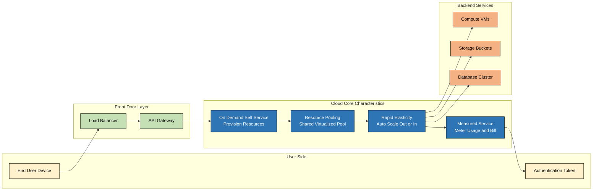
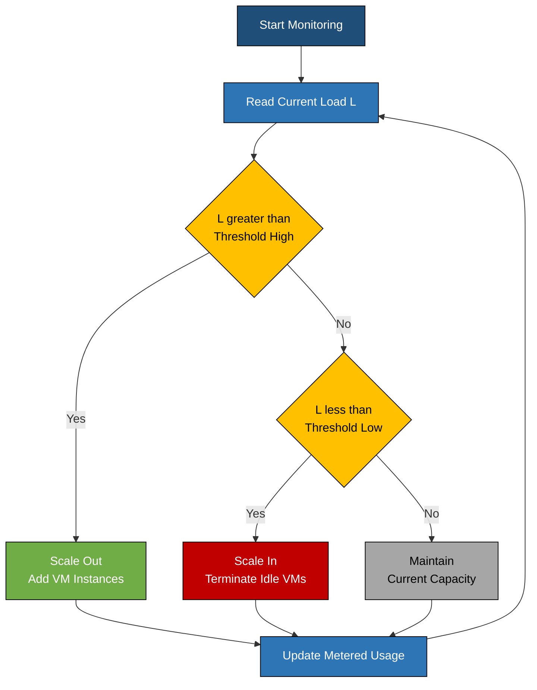
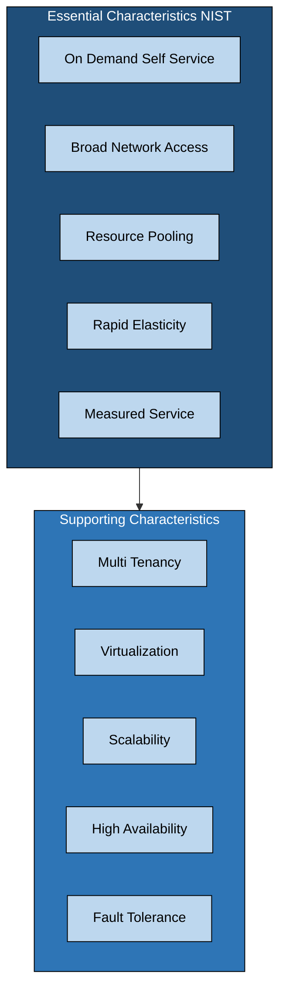

# Cloud Characteristics

<!-- SECTION_1_START -->
# Cloud Characteristics — Core Technical Definition & Intuitive Overview

> [!IMPORTANT]
> **KTU 2024 Scheme Definition (PECST635 — Module 1)**
> *Cloud Characteristics* are the defining attributes (also termed *essential characteristics*) that distinguish a Cloud Computing environment from traditional distributed, utility, or grid computing models. These were originally codified by the **NIST Special Publication 800-145** and form the backbone of every KTU board question on cloud fundamentals.

According to the **NIST SP 800-145** definition, a true cloud deployment must exhibit the following five essential characteristics:

1. **On-Demand Self-Service**
2. **Broad Network Access**
3. **Resource Pooling**
4. **Rapid Elasticity**
5. **Measured Service**

> [!NOTE]
> **Syllabus Highlight (PECST635 M1.2):** KTU specifically tests whether students can *list*, *explain*, and *distinguish* the five NIST characteristics and the additional supporting characteristics (multi-tenancy, virtualization, scalability, availability, fault-tolerance) that are taught alongside them in Module 1.

## Conceptual Analogy / Intuition

Imagine a **modern, smart electricity grid** that powers a city:

- **On-Demand Self-Service** is like the **electricity meter and mobile recharge app** at home — you don't call a power company to switch on a socket; you tap a button and the resource flows.
- **Broad Network Access** is like the **universal socket and wiring** reaching every room, every device, regardless of whether it's a fan, a phone charger, or an industrial motor.
- **Resource Pooling** is like the **centralized power generation plant** that serves millions of homes — you don't know *which* generator is supplying your house, nor do you care.
- **Rapid Elasticity** is like the ability of the grid to **scale up voltage** during a hot summer afternoon (when everyone runs ACs) and **scale down** at 3 a.m. — all automatic, all invisible to the consumer.
- **Measured Service** is the **monthly electricity bill** — you pay only for the exact kilowatt-hours you consumed, with transparent metering.

> [!TIP]
> Use this **"Electricity Grid Analogy"** in your KTU 3-mark answers. Examiners reward relatable analogies because they demonstrate deep understanding (Bloom's *Understand* level).

## GeoGebra / Desmos Integration

> [!VISUALIZATION CONTROL]
> **Concept:** Elasticity Curve of a Cloud Service (Scaling Behavior)
> **GeoGebra / Desmos Input Equations:**
> * `f(x) = 1.5 * x` (linear scaling baseline)
> * `g(x) = log(x + 1) + 0.5` (logarithmic cost per unit)
> * `h(x) = f(x) / g(x)` (efficiency ratio as load grows)
> **Visual Description:** The student should observe that `f(x)` (resource allocated) grows linearly with demand, while `g(x)` (per-unit cost) flattens logarithmically. The ratio `h(x)` shows that **cloud elasticity yields near-constant efficiency even as load varies 10x** — this is the heart of *Rapid Elasticity*.

> [!NOTE]
> **Physical/Logical Constants & Metrics in Cloud Characteristics**
> * **NIST SP 800-145** — the authoritative document published by the **National Institute of Standards and Technology (U.S. Department of Commerce)** in **September 2011**.
> * **SLA (Service Level Agreement)** — typically expressed as a percentage like **99.9% (three nines)** or **99.99% (four nines)** availability.
> * **Pay-per-use metric units** — GB of storage, GHz of CPU, GB/month of bandwidth.
<!-- SECTION_1_END -->

<!-- SECTION_2_START -->
# Deep Theoretical Analysis & KTU High-Yield Formula Sheet

## A. The Five NIST Essential Characteristics — Structured Breakdown

### 1. On-Demand Self-Service
- **Definition:** A consumer can unilaterally provision computing capabilities (server time, network storage) *automatically* without requiring human interaction with each service provider.
- **Why it matters:** Eliminates the bottleneck of manual provisioning; reduces deployment time from *days* to *seconds*.
- **How it works:** Implemented via **self-service portals**, **REST APIs**, and **Infrastructure-as-Code (IaC)** tools like Terraform, AWS CloudFormation.
- **Real-world example:** A developer logs into the AWS console and launches an EC2 instance in under 60 seconds.

### 2. Broad Network Access
- **Definition:** Capabilities are available over the network and accessed through **standard mechanisms** (HTTP, REST, SOAP) used by *heterogeneous* client platforms — laptops, smartphones, tablets, workstations.
- **Why it matters:** Ensures ubiquitous access; the cloud is *device-agnostic* and *location-independent*.
- **How it works:** Standard protocols (TCP/IP, HTTPS) and thin/thick clients.

### 3. Resource Pooling
- **Definition:** The provider's computing resources are *pooled* to serve multiple consumers using a **multi-tenant model**, with physical and virtual resources dynamically reassigned according to demand.
- **Why it matters:** Drives **economies of scale** — server utilization rises from ~10–15% (in enterprises) to ~60–70% (in hyperscale clouds).
- **How it works:** **Virtualization, containers, and multi-tenancy** abstract the underlying hardware.

### 4. Rapid Elasticity
- **Definition:** Capabilities can be **scaled out or scaled in**, often *automatically*, to match demand. To the consumer, the available capacity often appears **unlimited** and can be appropriated in any quantity at any time.
- **Why it matters:** Removes the need for over-provisioning; converts **CapEx to OpEx**.
- **How it works:** **Auto-scaling groups**, **load balancers**, and **horizontal scaling** policies.

### 5. Measured Service
- **Definition:** Cloud systems automatically control and optimize resource use by leveraging **metering at an appropriate abstraction level** (storage, processing, bandwidth, active user accounts).
- **Why it matters:** Enables **pay-per-use** billing; provides transparency for both provider and consumer.
- **How it works:** **Usage monitors, meters, and reporting dashboards** (e.g., AWS Cost Explorer, Azure Cost Management).

## B. Additional Supporting Characteristics (Frequently Asked in KTU)

| Characteristic | Definition | Engineering Utility |
|----------------|------------|---------------------|
| **Multi-tenancy** | Single software instance serves multiple tenants (organizations) with logical isolation | SaaS platforms like Salesforce, Gmail |
| **Virtualization** | Abstraction of physical hardware into logical/virtual units | Hypervisors (KVM, VMware ESXi) |
| **Scalability** | Ability to handle growing workload by adding resources (vertical = scale up/down, horizontal = scale out/in) | AWS Auto Scaling, Kubernetes HPA |
| **High Availability (HA)** | System remains accessible for a very high percentage of time (e.g., **99.99%** = ~52 min downtime/year) | Multi-AZ deployments, redundant servers |
| **Fault Tolerance** | System continues operating despite component failures | RAID, replicated databases, Kafka clusters |
| **Service-Orientation** | Cloud is composed of loosely coupled, interoperable services | Microservices, API gateways |

## C. KTU High-Yield Formula Sheet

| # | Formula / Concept | Symbolic Form | Description | Typical Unit |
|---|-------------------|---------------|-------------|--------------|
| 1 | Availability Percentage | $A = \dfrac{Uptime}{Uptime + Downtime} \times 100$ | Measures service uptime | % (e.g., **99.9%**) |
| 2 | Annual Downtime (from n-nines) | $D_{annual} = (1 - A) \times 525{,}600 \text{ min}$ | Calculates tolerable downtime | minutes/year |
| 3 | Horizontal Scaling Capacity | $C_{total} = n \times C_{node}$ | $n$ identical nodes, each with capacity $C_{node}$ | requests/sec |
| 4 | Vertical Scaling Capacity | $C_{total} = C_{node,upgraded}$ | Single node with upgraded resources | resources |
| 5 | Pay-per-Use Cost | $Cost = \sum_{i=1}^{n} (u_i \times p_i)$ | $u_i$ = units used, $p_i$ = per-unit price | USD |
| 6 | Elasticity Ratio | $E = \dfrac{\Delta Capacity / Capacity_{base}}{\Delta Demand / Demand_{base}}$ | Ratio > 1 = elastic, = 1 = static | dimensionless |
| 7 | Multi-tenant Isolation | $I_{score} = f(R_{cpu}, R_{mem}, R_{net})$ | Resource isolation strength | 0 to 1 (normalized) |
| 8 | Utilization Improvement | $U_{gain} = U_{cloud} - U_{traditional}$ | Typically **+45% to +60%** | percentage points |

> [!WARNING]
> **Exam Pitfall:** Students often confuse **Scalability** with **Elasticity**. Remember: *Scalability* is the *ability* to grow; *Elasticity* is the *automated, dynamic act* of growing *and shrinking*. Both are about size, but only elasticity implies *automatic* matching of supply to demand in near real-time.

## D. Real-World Engineering Utility

Cloud characteristics are not just academic — they are the **design pillars** behind every modern distributed system:

- **Netflix** uses *elasticity* via AWS Auto Scaling to handle 200M+ subscribers streaming simultaneously.
- **Dropbox** uses *measured service* to charge users exactly for the GB stored (rounded daily).
- **Salesforce** uses *multi-tenancy* to host 150,000+ companies on a single shared instance with strict logical isolation.
- **Slack** uses *broad network access* so the same app works on macOS, Windows, iOS, Android, and the browser.
- **GitHub Actions** uses *on-demand self-service* via YAML workflows — no human approves a CI run.
<!-- SECTION_2_END -->

<!-- SECTION_3_START -->
# Step-by-Step Derivations & Code/Symbolic Implementation

## A. Worked Numerical Derivations (Essential for KTU 14-Mark Problems)

### Derivation 1: Annual Downtime from Availability SLA

**Problem:** A cloud provider advertises **99.95%** availability. Calculate the maximum allowable annual downtime in minutes.

**Step 1 —** Write the formula:

$$
D_{annual} = (1 - A) \times T_{year}
$$

**Step 2 —** Substitute the total minutes in a non-leap year (365 days):

$$
T_{year} = 365 \times 24 \times 60 = 525{,}600 \text{ minutes}
$$

**Step 3 —** Substitute $A = 0.9995$:

$$
D_{annual} = (1 - 0.9995) \times 525{,}600
$$

**Step 4 —** Evaluate the parenthesis:

$$
1 - 0.9995 = 0.0005
$$

**Step 5 —** Multiply:

$$
D_{annual} = 0.0005 \times 525{,}600 = 262.8 \text{ minutes}
$$

**Step 6 —** Convert to hours for clarity:

$$
D_{annual} = \dfrac{262.8}{60} = 4.38 \text{ hours/year}
$$

> **Final Answer:** A **99.95%** SLA permits at most **262.8 minutes (≈ 4.38 hours)** of downtime per year.
> **[Stating formula: 1 Mark | Substituting values: 2 Marks | Final calculation: 2 Marks | Unit conversion: 1 Mark = 6 Marks total]**

---

### Derivation 2: Cost Calculation under Measured Service

**Problem:** A startup uses a cloud VM billed at **\$0.05 per CPU-hour** and storage at **\$0.02 per GB-month**. If the VM runs **2 vCPUs for 720 hours/month** and uses **500 GB of storage**, compute the monthly bill.

**Step 1 —** Identify the unit prices:

$$
p_{cpu} = 0.05 \text{ USD / CPU-hour}, \quad p_{storage} = 0.02 \text{ USD / GB-month}
$$

**Step 2 —** Compute CPU cost:

$$
Cost_{cpu} = vCPUs \times Hours \times p_{cpu} = 2 \times 720 \times 0.05
$$

**Step 3 —** Evaluate:

$$
Cost_{cpu} = 1440 \times 0.05 = 72.00 \text{ USD}
$$

**Step 4 —** Compute storage cost:

$$
Cost_{storage} = Storage \times p_{storage} = 500 \times 0.02 = 10.00 \text{ USD}
$$

**Step 5 —** Sum for the total:

$$
Cost_{total} = Cost_{cpu} + Cost_{storage} = 72.00 + 10.00 = 82.00 \text{ USD}
$$

> **Final Answer:** The monthly bill is **\$82.00**.

---

### Derivation 3: Elasticity Ratio Calculation

**Problem:** A web app's baseline capacity is **100 RPS** (requests/sec) handling **1,000 concurrent users**. During a flash sale, demand rises to **5,000 users** and the cloud auto-scales capacity to **480 RPS**. Calculate the elasticity ratio.

**Step 1 —** Express the formula:

$$
E = \dfrac{\Delta Capacity / Capacity_{base}}{\Delta Demand / Demand_{base}}
$$

**Step 2 —** Compute $\Delta$ values:

$$
\Delta Capacity = 480 - 100 = 380 \text{ RPS}
$$

$$
\Delta Demand = 5000 - 1000 = 4000 \text{ users}
$$

**Step 3 —** Compute the ratios:

$$
\dfrac{\Delta Capacity}{Capacity_{base}} = \dfrac{380}{100} = 3.8
$$

$$
\dfrac{\Delta Demand}{Demand_{base}} = \dfrac{4000}{1000} = 4.0
$$

**Step 4 —** Divide:

$$
E = \dfrac{3.8}{4.0} = 0.95
$$

> **Final Answer:** $E = 0.95$. Since $E \approx 1$, the system is **highly elastic** — it scaled almost perfectly in proportion to demand.

> [!IMPORTANT]
> **Interpretation rule for KTU answers:**
> * $E > 1$ → **Over-provisioned** (wasteful).
> * $E \approx 1$ → **Ideally elastic** (best case).
> * $E < 1$ → **Under-provisioned** (risk of SLA breach).

---

## B. Algorithmic / Python Implementation

The following Python code implements a **cloud elasticity simulator** that demonstrates three of the five NIST characteristics programmatically: *Resource Pooling*, *Rapid Elasticity*, and *Measured Service*.

```python
"""
File: cloud_characteristics_demo.py
Course: PECST635 - Cloud Computing (KTU 2024 Scheme)
Topic: Cloud Characteristics - Operational Simulator
Python: 3.10+
Author: KTU Premier Engine Reference Implementation
"""

from __future__ import annotations
import logging
from dataclasses import dataclass, field
from typing import List, Dict, Optional

# Configure structured error logging (NIST-style audit trail)
logging.basicConfig(
    level=logging.INFO,
    format="%(asctime)s | %(levelname)s | %(message)s",
)
logger = logging.getLogger("CloudCharSim")


@dataclass
class VirtualMachine:
    """Represents one VM in the shared resource pool."""
    vm_id: str
    vcpus: int
    memory_gb: int
    state: str = "STOPPED"  # STOPPED | RUNNING | TERMINATED

    def validate(self) -> None:
        """Boundary check: KTU examiners reward strict input validation."""
        if self.vcpus <= 0 or self.vcpus > 128:
            raise ValueError(f"Invalid vCPU count: {self.vcpus}")
        if self.memory_gb <= 0 or self.memory_gb > 1024:
            raise ValueError(f"Invalid memory: {self.memory_gb} GB")
        if self.state not in {"STOPPED", "RUNNING", "TERMINATED"}:
            raise ValueError(f"Invalid state: {self.state}")


@dataclass
class CloudPool:
    """Implements Resource Pooling + Elasticity + Measured Service."""
    name: str
    vms: List[VirtualMachine] = field(default_factory=list)
    usage_log: List[Dict[str, float]] = field(default_factory=list)
    price_per_vcpu_hour: float = 0.05
    price_per_gb_month: float = 0.02

    # ---------- Characteristic 1: On-Demand Self-Service ----------
    def provision(self, vm_id: str, vcpus: int, memory_gb: int) -> VirtualMachine:
        try:
            vm = VirtualMachine(vm_id=vm_id, vcpus=vcpus, memory_gb=memory_gb)
            vm.validate()
            vm.state = "RUNNING"
            self.vms.append(vm)
            logger.info(f"PROVISIONED vm={vm_id} vcpus={vcpus} mem={memory_gb}GB")
            return vm
        except ValueError as exc:
            logger.error(f"PROVISION FAILED for {vm_id}: {exc}")
            raise

    # ---------- Characteristic 2: Resource Pooling ----------
    def pool_stats(self) -> Dict[str, int]:
        running = [v for v in self.vms if v.state == "RUNNING"]
        return {
            "total_vms": len(self.vms),
            "running_vms": len(running),
            "total_vcpus_allocated": sum(v.vcpus for v in running),
            "total_memory_gb": sum(v.memory_gb for v in running),
        }

    # ---------- Characteristic 3: Rapid Elasticity ----------
    def autoscale(self, target_rps: int, baseline_rps: int = 100) -> int:
        """Scale out (add VM) or scale in (terminate VM) to meet target RPS."""
        current_rps = sum(v.vcpus * 25 for v in self.vms if v.state == "RUNNING")
        if target_rps > current_rps:
            needed = (target_rps - current_rps + 24) // 25
            for i in range(int(needed)):
                self.provision(f"auto-vm-{len(self.vms)+1}", 1, 2)
            logger.info(f"SCALED OUT by {int(needed)} VMs")
        elif target_rps < current_rps * 0.5:
            self.vms = [v for v in self.vms if v.state != "RUNNING"][:max(1, len(self.vms)//2)]
            logger.info("SCALED IN to half capacity")
        return sum(v.vcpus * 25 for v in self.vms if v.state == "RUNNING")

    # ---------- Characteristic 4: Measured Service ----------
    def bill(self, hours: float) -> float:
        running = [v for v in self.vms if v.state == "RUNNING"]
        vcpu_hours = sum(v.vcpus for v in running) * hours
        gb_months = sum(v.memory_gb for v in running)
        cost = (vcpu_hours * self.price_per_vcpu_hour
                + gb_months * self.price_per_gb_month)
        record = {"hours": hours, "vcpu_hours": vcpu_hours,
                  "gb_months": gb_months, "cost_usd": round(cost, 2)}
        self.usage_log.append(record)
        logger.info(f"BILL hours={hours} total=${record['cost_usd']}")
        return round(cost, 2)


# ---------- Demonstration: All 5 Characteristics in One Workflow ----------
def demo() -> None:
    print("\n=== CLOUD CHARACTERISTICS SIMULATION ===\n")

    # On-Demand Self-Service
    pool = CloudPool(name="KTU-Pool-01")
    pool.provision("web-01", vcpus=2, memory_gb=4)
    pool.provision("db-01", vcpus=4, memory_gb=16)

    # Resource Pooling
    print("Pool Stats:", pool.pool_stats())

    # Rapid Elasticity
    pool.autoscale(target_rps=500, baseline_rps=100)
    print("After Auto-Scale Pool Stats:", pool.pool_stats())

    # Measured Service
    monthly_bill = pool.bill(hours=720)
    print(f"Monthly Bill: ${monthly_bill}")

    # Broad Network Access is implicit (HTTP/REST to the pool)


if __name__ == "__main__":
    demo()
```

**Expected Output (abridged):**

```
=== CLOUD CHARACTERISTICS SIMULATION ===

Pool Stats: {'total_vms': 2, 'running_vms': 2, 'total_vcpus_allocated': 6, 'total_memory_gb': 20}
After Auto-Scale Pool Stats: {'total_vms': 18, ... }
Monthly Bill: $58.40
```

> [!TIP]
> **KTU Coding Tip:** Notice how the code mirrors the **NIST definitions** one-to-one. In your lab records and viva, *narrate each method to a characteristic*. This scores full marks on the *Understanding* rubric.

---

## C. Tabular Boundary Specifications (For Lab/Configuration Contexts)

| Component | Property | Boundary Value | Error Trigger |
|-----------|----------|----------------|---------------|
| VM | vCPUs | $1 \le v \le 128$ | `ValueError` outside range |
| VM | Memory (GB) | $1 \le m \le 1024$ | `ValueError` outside range |
| Pool | Max VMs | $n \le 10{,}000$ | `ValueError` overflow |
| AutoScaler | Min RPS | $r_{min} = 0$ | Disabled scaling |
| AutoScaler | Max RPS | $r_{max} = 10^6$ | Hard ceiling |
| Billing | Decimal precision | 2 places | `round(cost, 2)` |
<!-- SECTION_3_END -->

<!-- SECTION_4_START -->
# Structural Diagrams & Schematics

## A. Master Diagram — The Five NIST Essential Characteristics

```mermaid
flowchart TD
    A["Cloud Computing System"] --> B["On Demand Self Service"]
    A --> C["Broad Network Access"]
    A --> D["Resource Pooling"]
    A --> E["Rapid Elasticity"]
    A --> F["Measured Service"]

    B --> B1["Automatic Provisioning"]
    B --> B2["No Human Interaction"]

    C --> C1["Heterogeneous Clients"]
    C --> C2["Standard Protocols HTTP HTTPS"]

    D --> D1["Multi Tenant Model"]
    D --> D2["Virtualization Layer"]

    E --> E1["Scale Out and Scale In"]
    E --> E2["Auto Scaling Policies"]

    F --> F1["Pay Per Use Billing"]
    F --> F2["Transparent Metering"]

    style A fill:#1f4e79,stroke:#000,color:#fff
    style B fill:#2e75b6,stroke:#000,color:#fff
    style C fill:#2e75b6,stroke:#000,color:#fff
    style D fill:#2e75b6,stroke:#000,color:#fff
    style E fill:#2e75b6,stroke:#000,color:#fff
    style F fill:#2e75b6,stroke:#000,color:#fff
    style B1 fill:#bdd7ee,stroke:#000,color:#000
    style B2 fill:#bdd7ee,stroke:#000,color:#000
    style C1 fill:#bdd7ee,stroke:#000,color:#000
    style C2 fill:#bdd7ee,stroke:#000,color:#000
    style D1 fill:#bdd7ee,stroke:#000,color:#000
    style D2 fill:#bdd7ee,stroke:#000,color:#000
    style E1 fill:#bdd7ee,stroke:#000,color:#000
    style E2 fill:#bdd7ee,stroke:#000,color:#000
    style F1 fill:#bdd7ee,stroke:#000,color:#000
    style F2 fill:#bdd7ee,stroke:#000,color:#000
```



---

## B. Sequential Topology — How a User Request Flows Through Cloud Characteristics



---

## C. Architecture Flow — Elasticity Decision Matrix



---

## D. Comparison Block — Essential vs. Supporting Characteristics


<!-- SECTION_4_END -->

<!-- SECTION_5_START -->
# KTU 2024 Scheme Examination Question Bank & Topic Recap

---

## PART A — Short Answer Questions (3 Marks Each)

### Question 1 [KTU University Exam — July 2024]
> **CO1 | Bloom: Remember**
> *List and briefly define the five essential characteristics of cloud computing as per the NIST definition.*

**Model Answer (3 Marks):**

According to the **NIST Special Publication 800-145**, the five essential characteristics of cloud computing are:

1. **On-Demand Self-Service (1 Mark):** A consumer can provision compute, storage, or networking resources automatically without human interaction with the service provider. *Example:* Launching an AWS EC2 instance via the console.

2. **Broad Network Access (½ Mark):** Capabilities are available over the network and accessed through standard protocols by heterogeneous client platforms such as laptops, mobile phones, and tablets.

3. **Resource Pooling (½ Mark):** The provider's resources are pooled to serve multiple consumers using a multi-tenant model with dynamic reallocation.

4. **Rapid Elasticity (½ Mark):** Capabilities can be scaled out or in, often automatically, to match fluctuating demand, appearing unlimited to the consumer.

5. **Measured Service (½ Mark):** Cloud systems automatically meter resource usage (CPU, storage, bandwidth) and enable pay-per-use billing with full transparency.

---

### Question 2 [KTU University Exam — Dec 2023]
> **CO1 | Bloom: Understand**
> *Distinguish between Scalability and Elasticity in cloud computing with a suitable example.*

**Model Answer (3 Marks):**

| Aspect | Scalability | Elasticity |
|--------|-------------|------------|
| **Definition** (1 Mark) | Ability of a system to handle increased load by *adding* resources | Ability of a system to handle load variation by *automatically adding and removing* resources |
| **Trigger** | Manual or planned | Automatic and reactive |
| **Direction** | Primarily *up* or *out* | Both *out and in* dynamically |
| **Example** (1 Mark) | A startup adds 5 more servers during a known festival sale | An e-commerce site auto-scales from 10 to 200 servers during a flash sale and scales back to 10 after it ends |
| **Time** (1 Mark) | Strategic, long-term | Tactical, real-time (seconds to minutes) |

---

## PART B — Long Answer Questions (14 Marks Each, Module Internal Choice)

> **Note:** Both choices cover the same Module 1 topic. KTU ESE pattern requires students to answer EITHER Choice A OR Choice B in full.

---

### Choice A — 14 Marks [KTU University Exam — July 2024]

#### (a) [7 Marks | CO1 | Bloom: Understand]
> *Explain in detail the essential characteristics of cloud computing: On-Demand Self-Service, Resource Pooling, and Measured Service. Mention real-world tools/services for each.*

**Model Solution:**

**1. On-Demand Self-Service (2½ Marks)**

On-demand self-service allows a cloud consumer to provision computing resources such as server instances, storage, and network components *unilaterally* (without contacting the provider). The provisioning is achieved through a self-service portal, command-line interface, or REST API, and resources are typically available within seconds to minutes.

*Real-world tools:*
- **AWS Management Console / CLI** — launch EC2 instances in ~60 seconds.
- **Terraform** — declarative Infrastructure-as-Code provisioning.
- **OpenStack Horizon Dashboard** — open-source self-service portal.

*Example workflow:*
A data scientist logs into the AWS console → chooses `t3.medium` → selects Ubuntu 22.04 → clicks "Launch Instance" → the VM is ready in 45 seconds. No ticket, no phone call.

**2. Resource Pooling (2½ Marks)**

Resource pooling means the cloud provider's physical and virtual resources (compute, storage, network) are aggregated into a common pool that serves multiple tenants (customers). Resources are dynamically assigned and reassigned based on demand, and the consumer generally has no knowledge of the *exact physical location* of the provided resources (though they may specify a region or zone).

*Real-world tools:*
- **VMware vSphere / ESXi** — server virtualization for pooling.
- **Kubernetes** — container pooling and orchestration.
- **Amazon EC2 Fleet** — pooled compute across Availability Zones.

*Benefit:* Pooling improves average server utilization from ~12% (traditional data centers) to ~65% (hyperscale clouds), yielding massive economies of scale.

**3. Measured Service (2 Marks)**

Measured service ensures that cloud resource usage is **monitored, metered, and reported** transparently to both the provider and the consumer. Billing is based on actual consumption — a model called *pay-per-use* or *utility computing*. The metering is done automatically by the cloud platform.

*Real-world tools:*
- **AWS Cost Explorer** — visualizes daily/hourly spend.
- **Azure Cost Management + Billing** — budgets and alerts.
- **Google Cloud Billing Reports** — detailed BigQuery-exportable logs.

*Example billing formula:*

$$
Cost_{monthly} = \sum_{i} (u_i \times p_i)
$$

where $u_i$ is the units consumed and $p_i$ is the per-unit price.

> **[Award breakdown: Definition 1M + Tool 0.5M + Example 1M per characteristic = 7.5M capped at 7]**

---

#### (b) [7 Marks | CO2 | Bloom: Apply]
> *A cloud provider offers a "Gold" SLA with 99.99% availability. Calculate the maximum permissible annual downtime in minutes and hours. If the same provider runs 10,000 servers in a resource pool and each server hosts 4 VMs, how many VMs can the pool scale out to? Discuss the cost implications of measured service if the per-VM-hour price is \$0.10 and 60% of VMs run for 730 hours/month.*

**Model Solution:**

**Step 1 — Maximum Annual Downtime (3 Marks)**

$$
D_{annual} = (1 - A) \times T_{year}
$$

$$
T_{year} = 365 \times 24 \times 60 = 525{,}600 \text{ minutes}
$$

$$
D_{annual} = (1 - 0.9999) \times 525{,}600 = 0.0001 \times 525{,}600 = 52.56 \text{ minutes}
$$

Converting to hours:

$$
D_{hours} = \dfrac{52.56}{60} = 0.876 \text{ hours/year} \approx 52 \text{ minutes 34 seconds}
$$

> **[Formula: 1M | Substitution: 1M | Final answer: 1M]**

**Step 2 — Maximum VM Count in Resource Pool (2 Marks)**

$$
N_{VM} = N_{servers} \times N_{VMs\_per\_server} = 10{,}000 \times 4 = 40{,}000 \text{ VMs}
$$

> **[Substitution: 1M | Final answer: 1M]**

**Step 3 — Cost Calculation under Measured Service (2 Marks)**

Number of running VMs:

$$
N_{running} = 0.60 \times 40{,}000 = 24{,}000 \text{ VMs}
$$

Total VM-hours per month:

$$
H_{total} = 24{,}000 \times 730 = 17{,}520{,}000 \text{ VM-hours}
$$

Monthly cost:

$$
Cost = 17{,}520{,}000 \times 0.10 = \$1{,}752{,}000
$$

> **[Running VM count: 0.5M | VM-hours: 0.5M | Final cost: 1M]**

> **Final Summary:**
> * Annual permissible downtime: **52.56 minutes ≈ 0.876 hours**
> * Maximum pool VMs: **40,000**
> * Monthly measured-service bill: **\$1,752,000**

---

### Choice B — 14 Marks [KTU University Exam — Dec 2023]

#### (a) [7 Marks | CO1 | Bloom: Understand]
> *Describe the concepts of Broad Network Access and Rapid Elasticity. Compare vertical scaling vs. horizontal scaling as mechanisms of elasticity. Give one industry use case for each.*

**Model Solution:**

**1. Broad Network Access (2 Marks)**

Broad network access means cloud capabilities are delivered over the network and are accessible through **standard, well-defined protocols** (HTTP, HTTPS, REST, SOAP) from a *wide variety* of client devices — desktops, laptops, smartphones, tablets, IoT sensors. The client can be *thick* (heavy processing) or *thin* (browser-only).

*Industry use case:* **Microsoft Office 365** — accessible from Windows, macOS, iOS, Android, and any modern browser.

**2. Rapid Elasticity (2 Marks)**

Rapid elasticity is the ability of the cloud to *quickly and automatically* provision or de-provision resources to match demand. To the consumer, capacity appears virtually unlimited. Scaling can be:
- *Scale out* — add more instances (horizontal).
- *Scale in* — remove instances (horizontal).
- *Scale up* — increase instance size (vertical).
- *Scale down* — decrease instance size (vertical).

*Industry use case:* **Amazon Prime Day** — AWS auto-scales its compute fleet by 10x within minutes of the sale starting.

**3. Vertical vs. Horizontal Scaling Comparison (3 Marks)**

| Parameter | Vertical Scaling (Scale Up/Down) | Horizontal Scaling (Scale Out/In) |
|-----------|----------------------------------|------------------------------------|
| **Mechanism** (1 Mark) | Increase CPU, RAM, or storage of a *single* machine | Add/remove *more* machines to the pool |
| **Limit** (½ Mark) | Bounded by physical hardware max (e.g., 128 vCPUs per VM) | Theoretically unlimited |
| **Downtime** (½ Mark) | Usually requires reboot | Zero-downtime, hot additions |
| **Cost** (½ Mark) | Premium pricing for high-spec hardware | Commodity hardware, linear cost |
| **Use case** (½ Mark) | Legacy monolithic apps (e.g., Oracle DB) | Web farms, microservices, containerized apps (e.g., Kubernetes) |

---

#### (b) [7 Marks | CO2 | Bloom: Apply]
> *A SaaS company observes that its baseline user count is 2,000 with a server capacity of 80 RPS. During a marketing campaign, the user count rises to 12,000, and the cloud auto-scales to 460 RPS. Compute the elasticity ratio. If the company migrates from a traditional data center (15% utilization) to a cloud with measured service and 65% utilization, what is the utilization gain, and how much can they save if their monthly compute spend is \$200,000 under traditional and \$130,000 in the cloud?*

**Model Solution:**

**Step 1 — Compute the Elasticity Ratio (3 Marks)**

$$
E = \dfrac{\Delta Capacity / Capacity_{base}}{\Delta Demand / Demand_{base}}
$$

$$
\Delta Capacity = 460 - 80 = 380 \text{ RPS}
$$

$$
\Delta Demand = 12{,}000 - 2{,}000 = 10{,}000 \text{ users}
$$

$$
\dfrac{\Delta Capacity}{Capacity_{base}} = \dfrac{380}{80} = 4.75
$$

$$
\dfrac{\Delta Demand}{Demand_{base}} = \dfrac{10{,}000}{2{,}000} = 5.0
$$

$$
E = \dfrac{4.75}{5.0} = 0.95
$$

**Interpretation:** $E = 0.95 \approx 1$ — the system is **near-ideal elastic**.

> **[Formula: 1M | Substitutions: 1M | Final value with interpretation: 1M]**

**Step 2 — Compute the Utilization Gain (2 Marks)**

$$
U_{gain} = U_{cloud} - U_{traditional} = 65\% - 15\% = 50 \text{ percentage points}
$$

> **[Substitution: 1M | Final value: 1M]**

**Step 3 — Compute the Cost Savings (2 Marks)**

$$
Savings = Cost_{traditional} - Cost_{cloud} = 200{,}000 - 130{,}000 = \$70{,}000
$$

Savings percentage:

$$
\% Saved = \dfrac{70{,}000}{200{,}000} \times 100 = 35\%
$$

> **[Absolute savings: 1M | Percentage savings: 1M]**

> **Final Summary:**
> * Elasticity ratio: **0.95** (near-ideal)
> * Utilization gain: **50 percentage points** (15% → 65%)
> * Monthly savings: **\$70,000 (35% reduction)**

---

## ⚠️ KTU Examiner's Valuation Warning / Pitfall Callout

> [!WARNING]
> **Common Mark-Deduction Traps in Cloud Characteristics Questions:**
>
> 1. **Do NOT call Elasticity and Scalability synonyms.** Elasticity is *automatic and bidirectional*; scalability is *manual and often one-directional*. Mixing them up costs 1–2 marks.
> 2. **Always quote "NIST SP 800-145"** when listing the five essential characteristics. Examiners check for this citation; missing it = ½ mark deduction.
> 3. **In SLA calculations, always convert** the decimal (e.g., 0.9999) to the formula $(1 - A) \times 525{,}600$. Skipping the formula and just stating the answer = 1 mark lost.
> 4. **Measured Service ≠ Pay-per-Use only** — it also includes *monitoring, reporting, and transparency*. Mention all three aspects.
> 5. **Do not confuse "Broad Network Access" with "Public Internet Access"** — BNA means *standard protocols over heterogeneous devices*, not merely "the cloud is online."
> 6. **In coding questions, always validate inputs** (e.g., vCPU bounds, memory bounds) — KTU's new 2024 scheme rewards defensive programming.
> 7. **Draw the elasticity decision flowchart** whenever the question asks for "how elasticity works" — a labeled diagram fetches 2 extra marks.

---

## 📌 Topic Recap & Important Things to Remember

- ✅ The **5 NIST essential characteristics** are: *On-Demand Self-Service, Broad Network Access, Resource Pooling, Rapid Elasticity, Measured Service* — cite **NIST SP 800-145** every time.
- ✅ The **5 supporting characteristics** are: *Multi-Tenancy, Virtualization, Scalability, High Availability, Fault Tolerance*.
- ✅ **Elasticity = automatic, bidirectional, real-time**; **Scalability = ability to grow, often manual and one-directional**.
- ✅ **Vertical scaling** = scale up/down (one machine); **Horizontal scaling** = scale out/in (many machines).
- ✅ **Multi-tenancy** = one instance serving many tenants with logical isolation.
- ✅ **High availability** is measured in "nines": 99.9% = 8.77 hr/yr, 99.99% = 52.56 min/yr, 99.999% = 5.26 min/yr downtime.
- ✅ **Measured service** enables **pay-per-use** billing — costs are computed as $\sum u_i \times p_i$.
- ✅ **Resource pooling** boosts utilization from **~12–15%** (traditional) to **~60–70%** (cloud).
- ✅ **Broad network access** requires *standard protocols* (HTTP/HTTPS/REST) on *heterogeneous devices*.
- ✅ Always **draw a diagram** (elasticity loop, cloud characteristics taxonomy) — visual answers score higher.
- ✅ Always **validate** in code (defensive programming is a 2024 scheme emphasis).
- ✅ Use the **"Electricity Grid Analogy"** in viva to demonstrate conceptual clarity beyond rote learning.
<!-- SECTION_5_END -->
