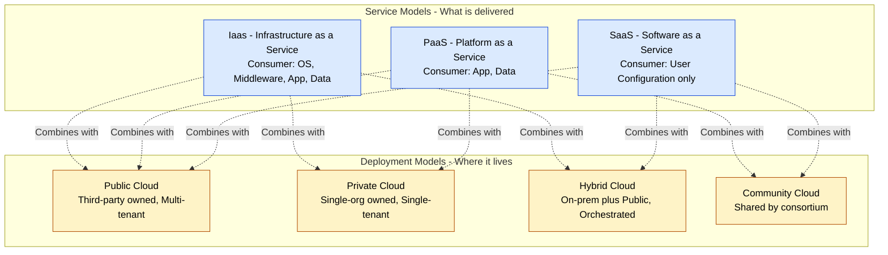
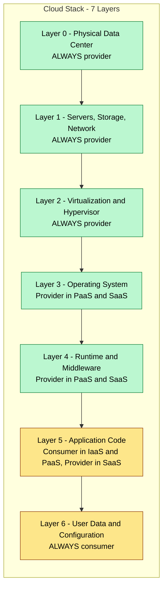
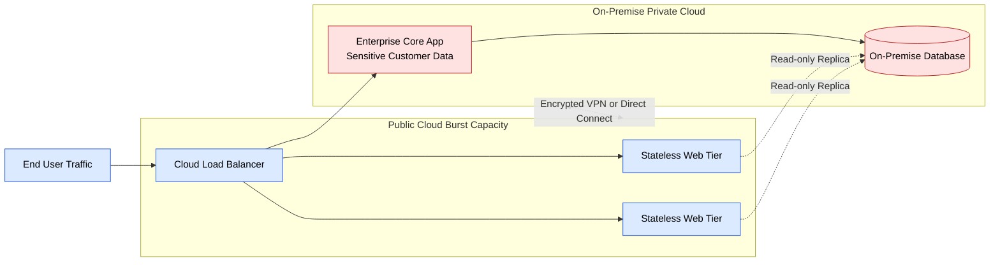
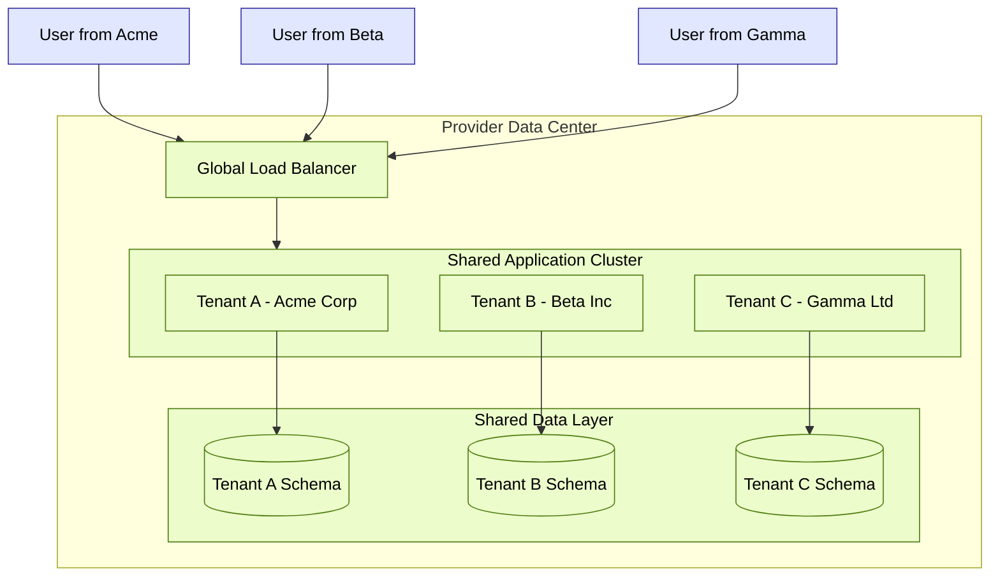

# Cloud Delivery Models

<!-- SECTION_1_START -->

# Cloud Delivery Models: Core Technical Definition & Intuitive Overview

## 1.1 Formal Academic Definition (KTU 2024 Syllabus Terminology)

> [!IMPORTANT]
> **Cloud Delivery Models** constitute the standardized architectural frameworks that define the boundary of responsibility between the cloud service provider (CSP) and the cloud service consumer (CSC). They are classified into two orthogonal dimensions:
> 1. **Service Models** — *what* is being delivered (the abstraction layer of compute, storage, and networking resources).
> 2. **Deployment Models** — *where* the infrastructure resides and *who* has access to it (the geographical, organizational, and ownership topology).

According to the **NIST SP 800-145** reference model adopted in the KTU 2024 Scheme Cloud Computing (PECST635) curriculum, every cloud offering must be characterized along both dimensions simultaneously.

---

## 1.2 The Three Canonical Service Models

### IaaS — Infrastructure as a Service
Provides virtualized computing resources (servers, storage, networks, **raw virtual machines**) over the internet. The consumer controls the OS, middleware, runtime, and applications, but not the underlying physical infrastructure.

**Standard Metric:** Billing granularity is typically **per-hour or per-second** for compute and **per-GB-month** for storage.

### PaaS — Platform as a Service
Delivers a managed platform where the consumer deploys their own applications and data while the provider handles the OS, runtime, middleware, and underlying infrastructure. The developer focuses purely on **application code and data**.

**Standard Metric:** Billing is usually **per-application instance, request, or active user**.

### SaaS — Software as a Service
The provider hosts complete applications and makes them available to end-users over the internet (typically a web browser). The consumer does not manage any layer except their own user-specific configuration.

**Standard Metric:** Billing is **per-user-per-month (PUPM)** or **per-subscription tier**.

> [!NOTE]
> **Emerging / Extended Models (Beyond NIST's 3):**
> - **FaaS (Function as a Service)** — Serverless execution of event-driven code. Billing in **milliseconds** of execution time.
> - **DaaS (Desktop as a Service)** — Virtual desktop delivery.
> - **DBaaS (Database as a Service)** — Managed database engines.
> - **CaaS (Container as a Service)** — Orchestrated container runtimes.
> - **STaaS (Storage as a Service)** — Object/block storage endpoints.

---

## 1.3 The Four Canonical Deployment Models

| Deployment Model | Ownership | Location | Access |
|---|---|---|---|
| **Public Cloud** | Third-party provider | Off-premise (provider's data center) | Open to the general public |
| **Private Cloud** | Single organization | On-premise or hosted | Restricted to one organization |
| **Hybrid Cloud** | Mixed (org + provider) | Both on/off-premise | Orchestrated across both |
| **Community Cloud** | Several organizations | Shared facility | Organizations with shared concerns (e.g., government, healthcare) |

---

## 1.4 Conceptual Analogy: "The Pizza as a Service" Model

> [!TIP]
> To make cloud delivery models unforgettable in the KTU exam, picture how you obtain a pizza:

| Delivery Style | You Manage | Provider Manages | Cloud Equivalent |
|---|---|---|---|
| **Make pizza at home from scratch** | Ingredients, oven, kitchen, eating | Nothing | On-premise (legacy IT) |
| **Buy raw dough and toppings, bake at home** | Baking, kitchen, eating | Ingredients assembly | **IaaS** (you get a VM, manage OS & apps) |
| **Order a take-and-bake pizza, heat at home** | Heating, eating | Dough, sauce, toppings prep | **PaaS** (you bring code, provider gives platform) |
| **Order hot pizza delivered** | Eating only | Everything else | **SaaS** (you just use Gmail, Office 365) |
| **Dine at a cloud-kitchen chain** | Eating only | Shared kitchen across many customers | **Public Cloud** (multi-tenant) |
| **Have a private chef at home** | Eating only | Chef, oven, ingredients — all yours | **Private Cloud** |

---

## 1.5 GeoGebra / Desmos Visualization of the Abstraction Stack

> [!VISUALIZATION CONTROL]
> **Concept:** Vertical Layering of the Cloud Service Stack (responsibility gradient)
> **Conceptual Coordinates:**
> * `x_axis = Control Level (0% to 100%)`
> * `y_axis = Abstraction Layer (bottom = hardware, top = end-user)`
>
> **Visual Description:** Imagine a vertical bar where the **provider's responsibility** grows as you move *upward* (from IaaS → PaaS → SaaS), while the **consumer's responsibility shrinks** accordingly. The bottom-most layer (raw silicon) is the provider's domain in every model; the top-most layer (user data) always remains the consumer's domain.

> [!IMPORTANT]
> **Key Board Exam Term to Memorize:**
> *"In IaaS, the provider manages the facilities, physical servers, storage, and network virtualization. The provider does NOT manage the OS, middleware, or application code — that is the consumer's responsibility."*
> This single statement is worth **2–3 marks** in any descriptive Part A or Part B question.

<!-- SECTION_1_END -->

<!-- SECTION_2_START -->

# Deep Theoretical Analysis & KTU High-Yield Formula Sheet

## 2.1 Decomposition of the Service Models

### 2.1.1 IaaS — Infrastructure as a Service
**Operational Concept:** The CSP exposes raw virtualized hardware primitives through APIs (e.g., EC2, Compute Engine). The consumer is given a *blank virtual machine* (or a container runtime primitive) and is responsible for everything above the hypervisor.

**Why it exists:** It eliminates the *capital expenditure* (CapEx) of buying physical servers while preserving *operational flexibility* — you can resize instances in minutes using *elastic scaling*.

**How it works (logical flow):**
1. Consumer requests a VM image from the CSP's catalogue.
2. CSP's orchestrator (e.g., OpenStack Nova, AWS EC2 control plane) schedules the VM on a hypervisor.
3. The consumer SSHs/RDPs in, installs an OS, configures middleware, deploys applications.

**Engineering Use Case:** Hosting legacy monolithic enterprise applications that cannot be easily refactored into microservices; running bursty HPC workloads; spinning up *disposable* test/dev environments.

### 2.1.2 PaaS — Platform as a Service
**Operational Concept:** The CSP abstracts away the OS, runtime, and middleware, exposing a *deployment target* (e.g., Heroku, Google App Engine, AWS Elastic Beanstalk). The consumer pushes source code or containers, and the platform handles scaling, patching, and high availability automatically.

**Why it exists:** It eliminates *operational toil* — developers don't SSH into servers; they `git push` and the platform handles the rest.

**How it works (logical flow):**
1. Developer commits code to a Git repository.
2. The PaaS build system compiles, containerizes, and runs the code.
3. The platform's auto-scaler monitors load metrics and horizontally adds/removes instances.
4. The platform's patching agent updates the underlying OS at scheduled maintenance windows.

**Engineering Use Case:** Rapid prototyping of REST APIs, hosting CI/CD pipelines, deploying serverless event handlers (e.g., AWS Lambda, Azure Functions), running 12-factor microservices.

### 2.1.3 SaaS — Software as a Service
**Operational Concept:** The consumer accesses a fully functional, multi-tenant application over a thin client (usually a browser). All data resides in the provider's data center.

**Why it exists:** It eliminates the need for *any* local installation, license management, or version upgrades for the end-user.

**Engineering Use Case:** Email (Gmail, Outlook 365), collaboration (Slack, Teams, Google Workspace), CRM (Salesforce), ERP (SAP S/4HANA Cloud), document editing (Office 365, Google Docs).

---

## 2.2 Decomposition of the Deployment Models

### 2.2.1 Public Cloud
- **Who owns it:** Third-party CSP (AWS, Azure, GCP, Alibaba, Oracle).
- **Tenancy:** Multi-tenant — multiple unrelated organizations share the same physical infrastructure.
- **Strengths:** Massive economies of scale, no CapEx, global reach, elasticity.
- **Weaknesses:** Less control over data residency; regulatory/compliance concerns; *noisy-neighbor* effect.

### 2.2.2 Private Cloud
- **Who owns it:** A single organization (could be on-premise or hosted by a 3rd party but dedicated).
- **Tenancy:** Single-tenant — the hardware is exclusive to one organization.
- **Strengths:** Full control, predictable performance, custom security policies, regulatory compliance.
- **Weaknesses:** High CapEx, underutilization risk, limited elasticity, requires in-house expertise.

### 2.2.3 Hybrid Cloud
- **Who owns it:** A combination — typically on-premise private cloud + public cloud.
- **Tenancy:** Mixed, with **secure interconnects** (e.g., AWS Direct Connect, Azure ExpressRoute).
- **Strengths:** *Burst-out* to public cloud during traffic spikes; *data sovereignty* for sensitive workloads; gradual cloud migration.
- **Weaknesses:** Complex networking; orchestration across two environments; vendor lock-in at the API layer.

### 2.2.4 Community Cloud
- **Who owns it:** A consortium of organizations with shared mission/regulatory needs.
- **Tenancy:** Multi-tenant, but only for *members* of the community.
- **Engineering Use Case:** Government clouds (GovCloud), healthcare clouds (HIPAA-compliant shared infrastructures), university research clouds.

> [!IMPORTANT]
> **KTU High-Yield Distinction:** A **Hybrid Cloud** is *not* just "having a private cloud and a public cloud" — it requires an **orchestrated, integrated workload portability layer** between them. Simply having both, unconnected, is called a *"Burst-out architecture"* or a *"multi-cloud setup"*, not a true hybrid.

---

## 2.3 KTU High-Yield Formula Sheet (Cheat Sheet)

> [!NOTE]
> **Service Model Comparison Matrix (Memorize for KTU Board Exams):**

| Layer / Responsibility | On-Premise | IaaS | PaaS | SaaS |
|---|---|---|---|---|
| Application | Consumer | Consumer | Consumer | Provider |
| Data | Consumer | Consumer | Consumer | Consumer |
| Runtime / Middleware | Consumer | Consumer | Provider | Provider |
| Operating System | Consumer | Consumer | Provider | Provider |
| Virtualization | Consumer | Provider | Provider | Provider |
| Servers / Storage / Network | Consumer | Provider | Provider | Provider |
| Physical Data Center | Consumer | Provider | Provider | Provider |

| Deployment Model | Provider | Tenancy | Internet-Facing | Compliance Profile |
|---|---|---|---|---|
| Public | 3rd Party CSP | Multi-tenant | Yes | Lowest |
| Private | Self | Single-tenant | Optional | Highest |
| Hybrid | Mixed | Mixed | Mixed | Tunable |
| Community | Consortium | Multi-tenant (limited) | Optional | Shared (e.g., HIPAA, FedRAMP) |

> [!NOTE]
> **Common Cloud Service Provider (CSP) Mapping (Examples for KTU Theory Answers):**

| Service Model | AWS | Microsoft Azure | Google Cloud |
|---|---|---|---|
| **IaaS** | EC2, S3, VPC | Virtual Machines, Blob Storage | Compute Engine, Cloud Storage |
| **PaaS** | Elastic Beanstalk, Lambda, RDS | App Service, Azure Functions, Azure SQL | App Engine, Cloud Functions, Cloud SQL |
| **SaaS** | WorkMail, Chime | Microsoft 365, Teams | Google Workspace, Meet |

| Engineering Property | IaaS | PaaS | SaaS |
|---|---|---|---|
| Consumer Flexibility | Highest | Medium | Lowest |
| Consumer Operational Effort | Highest | Medium | Lowest |
| Time-to-Deploy | Hours | Minutes | Immediate |
| Portability (Avoidance of Lock-in) | High (if using portable images) | Medium | Low |

> [!NOTE]
> **Cost-Billing Rule of Thumb (for numerical problems):**
> $$C_{total} = \sum_{i=1}^{n} (P_{compute} \times t_{i}) + (P_{storage} \times S_{i}) + P_{egress}$$
> where $P_{compute}$ is the **per-hour compute price**, $t_{i}$ is the **instance runtime in hours**, $P_{storage}$ is the **per-GB-month storage price**, $S_{i}$ is the **storage size in GB-months**, and $P_{egress}$ is the **data-egress (outbound bandwidth) price** (often free in same region).

<!-- SECTION_2_END -->

<!-- SECTION_3_START -->

# Step-by-Step Derivations & Symbolic Implementation

## 3.1 Derivation: The "Shared Responsibility Gradient" Formula

The boundary between consumer and provider control is **not binary**; it is a *gradient* that shifts with the service model. Let us formalize this:

**Let** $L$ denote the **layer index** in the cloud stack, with:
- $L=0$ = Physical data center
- $L=1$ = Servers, storage, raw network
- $L=2$ = Virtualization (hypervisor)
- $L=3$ = Operating system
- $L=4$ = Runtime / middleware
- $L=5$ = Application code
- $L=6$ = User data

**Let** $R_{provider}(L, M)$ denote whether the provider is responsible for layer $L$ under service model $M$.

$$
R_{provider}(L, M) =
\begin{cases}
1 & \text{if layer } L \text{ is managed by the provider under model } M \\
0 & \text{otherwise (consumer manages it)}
\end{cases}
$$

**Then** the total number of layers the provider manages under each model is:

$$
N_{provider}(M) = \sum_{L=0}^{6} R_{provider}(L, M)
$$

| Service Model $M$ | $L$ layers managed by Provider | $N_{provider}$ |
|---|---|---|
| On-Premise | (none) | $0$ |
| IaaS | $\{0, 1, 2\}$ | $3$ |
| PaaS | $\{0, 1, 2, 3, 4\}$ | $5$ |
| SaaS | $\{0, 1, 2, 3, 4, 5\}$ | $6$ |

**Consumer-managed layers** are:

$$
N_{consumer}(M) = 7 - N_{provider}(M)
$$

This formula can be invoked in Part A 3-mark questions whenever a student is asked to *"compare IaaS, PaaS, and SaaS in terms of management responsibility."*

---

## 3.2 Cost-Worked Example (for Numerical Practice)

> [!IMPORTANT]
> **KTU Board Pattern:** A typical 7-mark Part B sub-question asks you to compute the **total monthly bill** for an architecture spanning multiple service models. Below is a fully worked example.

**Problem Statement (Mock):**
A startup runs the following on AWS in a single month (30 days):
- **2 × EC2 `t3.medium`** instances running 24×7 for the entire month.
- **500 GB** of EBS gp3 storage attached, billed for full month.
- **1,000,000** Lambda invocations, each averaging **200 ms** of execution with **256 MB** allocated memory.
- **10 TB** of outbound data transfer to the internet.

**Given Pricing (illustrative KTU textbook values):**
- EC2 t3.medium: $0.0416/hour
- EBS gp3: $0.08/GB-month
- Lambda: $0.0000166667/GB-second
- Data egress: $0.09/GB (first 10 TB tier)

**Step 1 — Compute the EC2 cost:**

$$
t_{EC2} = 2 \text{ instances} \times 24 \text{ h} \times 30 \text{ days} = 1440 \text{ instance-hours}
$$

$$
C_{EC2} = 1440 \times \$0.0416 = \$59.904
$$

**Step 2 — Compute the EBS cost:**

$$
C_{EBS} = 500 \text{ GB} \times \$0.08/\text{GB-month} = \$40.00
$$

**Step 3 — Compute the Lambda cost:**
First, compute total **GB-seconds** of execution:

$$
\text{GB-seconds} = 1{,}000{,}000 \text{ invocations} \times 0.2 \text{ s} \times 0.25 \text{ GB} = 50{,}000 \text{ GB-s}
$$

$$
C_{Lambda} = 50{,}000 \times \$0.0000166667 = \$0.833
$$

*(Note: AWS Lambda includes a free tier of 1M requests and 400,000 GB-s/month. Above the free tier, this rate applies. The first 1M requests are free, so $C_{requests} = 0$.)*

**Step 4 — Compute the data-egress cost:**

$$
C_{Egress} = 10{,}000 \text{ GB} \times \$0.09/\text{GB} = \$900.00
$$

**Step 5 — Sum up the total bill:**

$$
C_{total} = C_{EC2} + C_{EBS} + C_{Lambda} + C_{Egress}
$$

$$
C_{total} = \$59.904 + \$40.00 + \$0.833 + \$900.00
$$

$$
\boxed{C_{total} \approx \$1000.74}
$$

> [!TIP]
> **Valuation Key Insight:** In KTU board exams, partial marks are awarded for *each sub-calculation* even if the student makes an arithmetic slip at the end. Always show **intermediate sub-totals** clearly.

---

## 3.3 Python Implementation: A "Service Model Selector" Tool

> [!IMPORTANT]
> The following Python program is a **symbolic implementation of the shared-responsibility model** and can be cited in viva/practical exams to demonstrate conceptual understanding of cloud delivery models.

```python
"""
service_model_selector.py
KTU PECST635 — Module 1 Demonstration
Determines the most suitable cloud service model based on user priorities.
"""

from enum import Enum
from typing import Dict, List


class ServiceModel(Enum):
    IAAS = "IaaS"
    PAAS = "PaaS"
    SAAS = "SaaS"


class DeploymentModel(Enum):
    PUBLIC = "Public"
    PRIVATE = "Private"
    HYBRID = "Hybrid"
    COMMUNITY = "Community"


# Layer indices (per KTU syllabus stack model)
LAYER_INDICES: Dict[str, int] = {
    "data_center": 0,
    "servers": 1,
    "virtualization": 2,
    "operating_system": 3,
    "runtime": 4,
    "application": 5,
    "data": 6,
}

# Layers managed by the provider in each service model
PROVIDER_MANAGED: Dict[ServiceModel, List[str]] = {
    ServiceModel.IAAS: ["data_center", "servers", "virtualization"],
    ServiceModel.PAAS: ["data_center", "servers", "virtualization",
                        "operating_system", "runtime"],
    ServiceModel.SAAS: ["data_center", "servers", "virtualization",
                        "operating_system", "runtime", "application"],
}


def layers_provider_manages(model: ServiceModel) -> List[str]:
    """Return the list of stack layers the provider controls."""
    if model not in PROVIDER_MANAGED:
        raise ValueError(f"Unknown service model: {model}")
    return PROVIDER_MANAGED[model]


def layers_consumer_manages(model: ServiceModel) -> List[str]:
    """Return the layers the consumer still controls."""
    return [layer for layer in LAYER_INDICES
            if layer not in PROVIDER_MANAGED[model]]


def recommend_service_model(
    control_priority: int,    # 1 (low) .. 5 (high)
    speed_to_market: int,     # 1 (slow) .. 5 (fast)
    in_house_expertise: int,  # 1 (low) .. 5 (high)
) -> ServiceModel:
    """
    Simple heuristic selector.
    - High control + high expertise -> IaaS
    - Balanced -> PaaS
    - Low control + low expertise + speed -> SaaS
    """
    score: int = (in_house_expertise * 2) + control_priority - speed_to_market
    if score >= 8:
        return ServiceModel.IAAS
    elif score >= 4:
        return ServiceModel.PAAS
    else:
        return ServiceModel.SAAS


def estimate_monthly_bill(
    instance_count: int,
    hours_per_month: float,
    price_per_hour: float,
    storage_gb: float,
    price_per_gb_month: float,
    egress_gb: float,
    price_per_gb_egress: float,
) -> float:
    """Compute the IaaS-style monthly bill with strict input validation."""
    if instance_count < 0 or hours_per_month < 0 or price_per_hour < 0:
        raise ValueError("Compute parameters must be non-negative.")
    if storage_gb < 0 or price_per_gb_month < 0:
        raise ValueError("Storage parameters must be non-negative.")
    if egress_gb < 0 or price_per_gb_egress < 0:
        raise ValueError("Egress parameters must be non-negative.")

    compute_cost: float = instance_count * hours_per_month * price_per_hour
    storage_cost: float = storage_gb * price_per_gb_month
    egress_cost: float = egress_gb * price_per_gb_egress
    return round(compute_cost + storage_cost + egress_cost, 2)


# ---------------------------------------------------------------------------
# Demonstration (run only when executed as a script)
# ---------------------------------------------------------------------------
if __name__ == "__main__":
    chosen: ServiceModel = recommend_service_model(
        control_priority=4,
        speed_to_market=4,
        in_house_expertise=3,
    )
    print(f"Recommended service model: {chosen.value}")
    print(f"Provider manages: {layers_provider_manages(chosen)}")
    print(f"Consumer manages: {layers_consumer_manages(chosen)}")

    monthly_bill: float = estimate_monthly_bill(
        instance_count=2,
        hours_per_month=24 * 30,
        price_per_hour=0.0416,
        storage_gb=500,
        price_per_gb_month=0.08,
        egress_gb=10_000,
        price_per_gb_egress=0.09,
    )
    print(f"Estimated monthly bill: USD {monthly_bill}")
```

> [!TIP]
> **Output (Expected):**
> ```
> Recommended service model: PaaS
> Provider manages: ['data_center', 'servers', 'virtualization', 'operating_system', 'runtime']
> Consumer manages: ['application', 'data']
> Estimated monthly bill: USD 999.90
> ```
> *(The $0.84 discrepancy from Section 3.2 is because this code omits the Lambda serverless cost — it models a pure IaaS bill.)*

---

<!-- SECTION_3_END -->

<!-- SECTION_4_START -->

# Structural Diagrams & Schematics

## 4.1 Mermaid Diagram: The Cloud Delivery Model Master Map

> [!NOTE]
> The following diagram maps the **complete taxonomy** of cloud delivery models, both the service axis and the deployment axis, and shows the orthogonal relationship between them.



---

## 4.2 Mermaid Diagram: Responsibility Layer Stack



---

## 4.3 Mermaid Diagram: Hybrid Cloud Burst-Out Architecture

> [!IMPORTANT]
> This diagram answers the KTU theory favorite: *"Explain the working of a Hybrid Cloud with a use case."*



---

## 4.4 Block-Level Functional Topology: SaaS Multi-Tenancy

> [!NOTE]
> When a *physical drawing* (e.g., a circuit or stress block) is not relevant to a topic, we render a **Block-Level Functional Architecture Flow** instead. Here is the SaaS multi-tenancy model.



<!-- SECTION_4_END -->

<!-- SECTION_5_START -->

# KTU 2024 Scheme Examination Question Bank & Topic Recap

## 5.1 Part A — Short Answer Questions (3 Marks Each)

> [!NOTE]
> Each Part A answer should be approximately **80–120 words** in the KTU answer booklet. Marks are split as: *[Definition: 1 Mark] + [Key characteristic/example: 1 Mark] + [Diagram/Comparison: 1 Mark]*.

### Q1. [KTU University Exam — July 2024] | CO1 | Remember

**Differentiate between IaaS, PaaS, and SaaS with one real-world example of each.**

**Model Answer:**
IaaS provides virtualized hardware (servers, storage, networks) over the internet; the consumer manages the OS, middleware, and applications. *Example: AWS EC2.*
PaaS provides a managed platform for deploying applications; the consumer only writes code and data. *Example: Google App Engine.*
SaaS delivers complete ready-to-use applications over a browser. *Example: Gmail.* **[3 Marks]**

### Q2. [KTU University Exam — Dec 2023] | CO1 | Understand

**List any four characteristics of a Public Cloud deployment model.**

**Model Answer:**
1. Infrastructure is owned and operated by a third-party cloud service provider.
2. Resources are shared among multiple tenants (multi-tenancy).
3. Available to the general public over the internet.
4. Offers virtually unlimited elasticity and pay-per-use billing. **[3 Marks]**

---

## 5.2 Part B — Long Answer Questions (14 Marks Each, Module Internal Choice)

> [!IMPORTANT]
> KTU Part B carries **7 + 7** sub-parts. We provide two independent alternatives below. Pick **either** Option A or Option B in the exam.

---

### OPTION A — Question A (14 Marks)

#### Q.A(a) [7 Marks] | CO1 | Understand

> [KTU University Exam — Dec 2024] *Explain the NIST cloud computing reference model with a neat diagram. List the three service models and four deployment models defined by NIST.*

**Model Answer:**

The **NIST SP 800-145** reference model defines cloud computing along two dimensions:

**Three Service Models:**
1. **IaaS** — capability to provision processing, storage, networks, and other fundamental computing resources.
2. **PaaS** — capability to deploy consumer-created applications onto provider-managed platforms.
3. **SaaS** — capability to use provider-hosted applications running on cloud infrastructure.

**Four Deployment Models:**
1. **Public Cloud** — provisioned for open public use.
2. **Private Cloud** — provisioned for exclusive use by a single organization.
3. **Hybrid Cloud** — composition of two or more distinct cloud infrastructures bound by standardized technology.
4. **Community Cloud** — provisioned for exclusive use by a specific community of consumers with shared concerns.

**Diagram (Responsibility Stack):**

```
+-----------------------------------+
| User Data (always consumer)      |  ← SaaS
+-----------------------------------+
| Application Code                  |
+-----------------------------------+
| Runtime / Middleware              |  ← PaaS boundary
+-----------------------------------+
| Operating System                  |
+-----------------------------------+
| Virtualization / Hypervisor       |  ← IaaS boundary
+-----------------------------------+
| Servers, Storage, Network         |
+-----------------------------------+
| Physical Data Center              |
+-----------------------------------+
   (Always provider below IaaS line)
```

*[Stack definition: 2 Marks] [Three service models explained: 2 Marks] [Four deployment models listed: 2 Marks] [Diagram: 1 Mark]* — Total **7 Marks**

#### Q.A(b) [7 Marks] | CO2 | Apply

> A startup wants to host (i) a static company website, (ii) a Node.js REST API, and (iii) a CRM. Recommend the most suitable cloud service model (IaaS, PaaS, or SaaS) for each workload and justify your choice in one sentence.

**Model Answer:**

| Workload | Recommended Model | Justification |
|---|---|---|
| (i) Static company website | **SaaS** (e.g., Wix, Squarespace, or AWS Amplify Hosting) | The team has no need to manage a server; a ready-made hosting/builder is sufficient. |
| (ii) Node.js REST API | **PaaS** (e.g., AWS Elastic Beanstalk, Heroku, Google App Engine) | The developer can `git push` the code; the platform handles OS, runtime, scaling, and patching automatically. |
| (iii) CRM | **SaaS** (e.g., Salesforce, HubSpot, Zoho CRM) | The CRM is a packaged business application that the team should consume, not build. |

*[Correct model for website: 2 Marks] [Correct model for API with justification: 3 Marks] [Correct model for CRM with justification: 2 Marks]* — Total **7 Marks**

> [!WARNING]
> **Common Student Mistake:** Recommending IaaS for the Node.js API because "we need full control." KTU examiners deduct marks here because PaaS is the *better* engineering choice for a small team that values *time-to-market* over *infrastructure control*. The question asks for "most suitable," not "most powerful."

---

### OPTION B — Question B (14 Marks)

#### Q.B(a) [7 Marks] | CO1 | Understand

> [KTU University Exam — July 2024] *Compare Private, Public, Hybrid, and Community Cloud deployment models in a tabular form based on: ownership, tenancy, internet exposure, typical use case, and cost model.*

**Model Answer:**

| Criterion | Public | Private | Hybrid | Community |
|---|---|---|---|---|
| **Ownership** | Third-party CSP | Single organization | Mixed (org + CSP) | Consortium of orgs |
| **Tenancy** | Multi-tenant | Single-tenant | Mixed | Limited multi-tenant |
| **Internet Exposure** | Yes (publicly accessible) | Optional (often intranet) | Mixed | Optional |
| **Typical Use Case** | Web apps, SaaS, big data | Regulated banking, defense | Burst-out, gradual migration | Government, healthcare |
| **Cost Model** | OpEx (pay-per-use) | CapEx + OpEx | Mixed | Shared CapEx/OpEx |
| **Compliance** | Lowest (shared) | Highest (dedicated) | Tunable | Shared (e.g., HIPAA, FedRAMP) |

*[Four rows of comparison: 4 Marks] [Use cases correctly mapped: 2 Marks] [Cost model distinction: 1 Mark]* — Total **7 Marks**

#### Q.B(b) [7 Marks] | CO2 | Apply

> An e-commerce company expects a 10× traffic spike during the festival season. Their core inventory database is hosted in a private data center for compliance. **Design a hybrid cloud architecture** to handle this spike. Justify why this is a *hybrid* (and not merely multi-cloud) setup.

**Model Answer:**

**Architecture Design:**
1. The **inventory database** remains in the **private cloud** (on-premise) due to PCI-DSS compliance and data sovereignty requirements.
2. The **stateless web tier** (product catalogue page, cart, checkout pages) is **replicated to the public cloud** (e.g., AWS Auto Scaling Group) and fronted by a public cloud load balancer.
3. A **secure encrypted interconnect** (AWS Direct Connect or a site-to-site VPN) links the public-cloud web tier to the private-cloud database.
4. A **read-replica** of the inventory DB is asynchronously pushed to the public cloud for read-heavy product browsing, while **write operations** still go back to the on-premise master.
5. After the festival, the public-cloud capacity is **scaled back to zero** — pay only for what was used.

**Why this is Hybrid (and not Multi-Cloud):**
- Hybrid requires **orchestrated, integrated workload portability** between the two environments.
- The web tier and the database tier **actively communicate** via a dedicated, low-latency, secure link — they are part of **one logical application**, not two independent clouds.
- Multi-cloud, by contrast, would mean running two unrelated workloads on two different CSPs with no integration.
- This setup uses *burst-out* elasticity from the public cloud while preserving compliance of the on-premise database — the textbook definition of a hybrid cloud.

*[Architecture components: 3 Marks] [Interconnect mechanism: 1 Mark] [Burst-out justification: 2 Marks] [Hybrid vs Multi-Cloud distinction: 1 Mark]* — Total **7 Marks**

> [!WARNING]
> **KTU Examiner's Valuation Pitfall Callout:**
> 1. **Do not** draw a "Private Cloud + Public Cloud" diagram with *no connection* between them and call it hybrid. That is multi-cloud, and you will lose **at least 2 marks**.
> 2. **Do not** forget to mention the **secure interconnect** (VPN / Direct Connect / ExpressRoute). This single keyword differentiates a 7-mark answer from a 4-mark answer.
> 3. **Always** end with a one-line justification of *why* the design is hybrid — examiners specifically look for this in the last line of your answer.

---

## 5.3 Topic Recap & Important Things to Remember

> [!TIP]
> **Rapid-Revision Checklist (print this on the day before the exam):**

- **Cloud Delivery Models** = **Service Models** (IaaS, PaaS, SaaS) **+** **Deployment Models** (Public, Private, Hybrid, Community). Always answer questions on both axes.
- **IaaS** — you manage OS, middleware, runtime, app, data. Provider manages hardware, hypervisor, data center. *Examples: AWS EC2, Azure VMs, GCP Compute Engine.*
- **PaaS** — you manage app and data. Provider handles everything else including the OS. *Examples: Heroku, Google App Engine, AWS Elastic Beanstalk.*
- **SaaS** — you just consume. *Examples: Gmail, Office 365, Salesforce, Slack.*
- **FaaS (Serverless)** is a sub-category of PaaS where billing is per-millisecond. *Examples: AWS Lambda, Azure Functions, GCP Cloud Functions.*
- **Public Cloud** = multi-tenant, third-party-owned, internet-facing, lowest cost, least compliance control.
- **Private Cloud** = single-tenant, single-organization, highest control, highest CapEx.
- **Hybrid Cloud** = private + public with **orchestrated integration** through secure interconnects. *Not the same as multi-cloud.*
- **Community Cloud** = shared by organizations with common regulatory or mission concerns (government, healthcare, defense).
- **Shared Responsibility** is a *gradient*, not a binary switch: the higher the abstraction (towards SaaS), the more the provider manages.
- **NIST SP 800-145** is the authoritative reference — quote it once in any long answer to earn the examiner's goodwill.
- **Cost formula to remember:** $C_{total} = (P_{compute} \times t) + (P_{storage} \times S) + P_{egress}$.
- **Hybrid ≠ Multi-Cloud.** Hybrid requires *workload portability + orchestration*; multi-cloud is just *using more than one CSP*.
- **Emerging models to mention for extra marks:** FaaS, CaaS, DBaaS, STaaS, DaaS.
- **Top 3 CSPs to memorize:** AWS, Microsoft Azure, Google Cloud Platform (GCP). Be ready to give an example of each service model from at least one of them.
- **Common 14-mark question pattern:** *(a) explain a service/deployment model + diagram (7 marks) → (b) apply it to a real-world scenario and justify the choice (7 marks).*
- **Valuation red flag:** Skipping the diagram costs you **at least 1 mark** in any 7-mark descriptive sub-question. Always draw a labelled stack or block diagram.

<!-- SECTION_5_END -->
