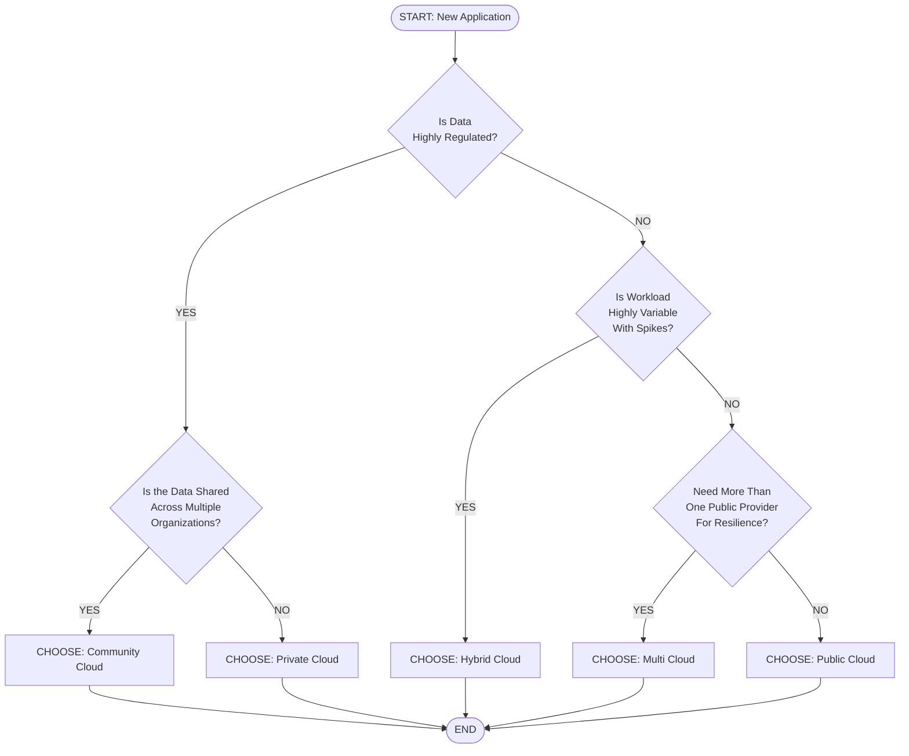
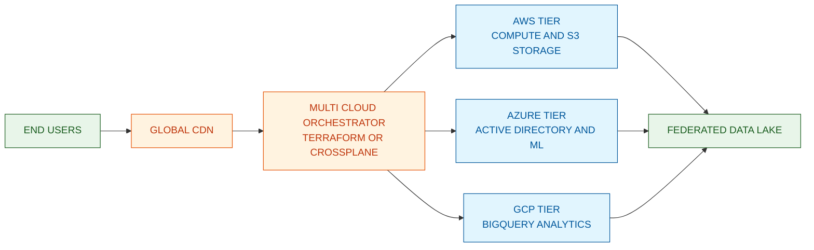

# Cloud Deployment Models

<!-- SECTION_1_START -->
# Cloud Deployment Models

## 1. Core Technical Definition (KTU 2024 Syllabus)

According to the **NIST Special Publication 800-145** (the de-facto reference standard adopted by KTU 2024 Scheme), a **Cloud Deployment Model** defines the architectural pattern governing *where* the cloud infrastructure is physically hosted, *who* owns it, *who* manages it, and *how* it is exposed to consumers (internal staff, partners, or the general public).

> [!IMPORTANT]
> **KTU 2024 Definition (PECST635 - Module 1):**
> *"A deployment model describes the specific configuration and orchestration of cloud resources — compute, storage, and networking — based on the ownership boundary, accessibility scope, and tenancy characteristics of the underlying infrastructure."*

The four classical deployment models recognized by both **NIST** and the **ISO/IEC 22123-1:2023** standard are:

1. **Public Cloud** — Infrastructure owned by a third-party provider, open to the general public.
2. **Private Cloud** — Infrastructure provisioned exclusively for a single organization.
3. **Hybrid Cloud** — Composition of two or more distinct cloud infrastructures (public, private, or community) bound by standardized orchestration.
4. **Community Cloud** — Infrastructure shared by several organizations with shared concerns (e.g., regulatory compliance, mission, security).

A fifth, industry-recognized variation — **Multi-Cloud** — is treated under KTU Module 1 as an *architectural strategy* built on top of the four foundational models.

> [!NOTE]
> **Key Distinction — Deployment vs. Service Model**
> Students frequently confuse *Deployment Models* with *Service Models* (IaaS, PaaS, SaaS). Remember:
> - **Service Model** = *What is offered* to the consumer (abstraction layer).
> - **Deployment Model** = *Where and by whom* the infrastructure is hosted and operated (ownership/tenancy).

---

## 2. Conceptual Analogy — The "Hotel vs. Bungalow" Intuition

Imagine cloud computing as a spectrum of *housing options*:

| Real-World Analogy | Cloud Equivalent | Core Idea |
|---|---|---|
| **Hotel Room** (pay-per-night, shared lobby/pool) | **Public Cloud** | Someone else owns the building; you rent rooms on demand. |
| **Your Own Bungalow** (private, full control) | **Private Cloud** | You own/lease the whole building; only your family stays. |
| **Apartment in a Co-op Society** (shared by doctors, lawyers) | **Community Cloud** | Several like-minded entities jointly own and use the infrastructure. |
| **Hotel + Bungalow with a Shuttle Service** | **Hybrid Cloud** | You keep a private bungalow for valuables and burst into a hotel during a family wedding (peak load). |

> [!TIP]
> **GeoGebra / Desmos Visualization (Conceptual Load vs. Cost)**
> This is a conceptual scatter intuition, not a literal algebraic function, but it can be plotted:
>
> > **Concept:** Cost vs. Workload elasticity across deployment models
> > **Desmos Input Equations:**
> > * `f(x) = 0.05x + 50` (Private Cloud — high fixed cost, low variable cost)
> > * `g(x) = 0.40x` (Public Cloud — zero fixed cost, high variable cost)
> > * `h(x) = piecewise` (Hybrid — switches between $f$ and $g$ at threshold $T$)
> > **Visual Description:** Two intersecting lines on a Cost ($y$-axis) vs. Workload ($x$-axis) plane. The crossover point determines which model is cheaper for a given workload. Hybrid follows the *lower envelope* of both curves.
<!-- SECTION_1_END -->

<!-- SECTION_2_START -->
# Deep Theoretical Analysis & KTU High-Yield Formula Sheet

## 1. Anatomy of Each Deployment Model

### 1.1 Public Cloud
- **Provider-Owned, Provider-Operated**: AWS, Microsoft Azure, Google Cloud Platform (GCP), Oracle Cloud, Alibaba Cloud.
- **Tenancy**: Multi-tenant — multiple unrelated consumers share the same physical hardware (logical isolation via virtualization).
- **Access**: Open to the *general public* on a pay-per-use subscription model.
- **Cost Metric**: **OPEX (Operational Expenditure)** dominant — billed by the second/minute/hour (e.g., $0.0001 per GB-month of storage).
- **Elasticity**: *Virtually unlimited* horizontal scaling.
- **Trade-off**: Lowest control; highest economies of scale.

### 1.2 Private Cloud
- **Ownership**: Single organization (on-premises data center) or a dedicated third-party hosting facility.
- **Tenancy**: Single-tenant — exclusive use of the physical infrastructure.
- **Access**: Restricted to internal employees, contractors, and authorized partners.
- **Cost Metric**: **CAPEX (Capital Expenditure)** dominant — large upfront hardware and licensing costs, amortized over 3–5 years.
- **Elasticity**: Bounded by the physical capacity of the owned hardware.
- **Trade-off**: Maximum control, compliance, and customization; poor cost elasticity.

> [!NOTE]
> **Private Cloud ≠ Virtualization**
> A VMware vSphere cluster is *virtualization*; it becomes a *Private Cloud* only when self-service portals, automated provisioning, usage metering, and orchestration (OpenStack, CloudStack) are layered on top. This distinction is a frequent KTU 2-mark question.

### 1.3 Hybrid Cloud
- **Architecture**: A composition of **two or more** distinct cloud deployment models (public + private, or community + public) that remain *unique entities* but are *bound together* by:
  - **Standardized technology** (e.g., REST APIs, VPN, Direct Connect)
  - **Portable workloads** (containers, VMs)
  - **Orchestration layer** (Kubernetes federation, Anthos, Azure Arc)
- **Strategic Use-Case**: **Cloud Bursting** — when the private cloud saturates, excess load is automatically *burst* into the public cloud.
- **Data Gravity**: Sensitive data stays on-premise; stateless compute moves to the public cloud.

### 1.4 Community Cloud
- **Ownership**: Jointly owned by several organizations with a *shared mission, compliance regime, or policy*.
- **Examples**: 
  - **GovCloud** (US Federal Agencies)
  - **Medical community clouds** (HIPAA-compliant shared platforms for hospitals)
  - **Research grids** (CERN, ITER, eduGAIN federations)
- **Tenancy**: Multi-tenant *within the community*; single-tenant *relative to the outside world*.

### 1.5 Multi-Cloud (Architectural Pattern)
- An *extension*, not a replacement: the simultaneous use of **two or more public cloud providers** (e.g., AWS + Azure) by a single organization.
- **Drivers**: Avoiding vendor lock-in, regulatory sovereignty, best-of-breed services (e.g., AWS S3 for storage + GCP BigQuery for analytics).
- **Orchestration**: Terraform, Crossplane, Pulumi.

---

## 2. KTU High-Yield Formula / Cheat Sheet

> [!IMPORTANT]
> Memorise the following decision matrix — questions like *"which model minimizes CAPEX for a startup?"* or *"which model satisfies HIPAA for a hospital consortium?"* appear every semester.

| Decision Vector | Public | Private | Hybrid | Community |
|---|---|---|---|---|
| **CAPEX Burden** | Very Low | Very High | Medium | Shared Medium |
| **OPEX Burden** | Pay-per-use | Low (amortized) | Moderate | Shared Moderate |
| **Scalability Ceiling** | $\approx \infty$ | Bounded by HW | Effectively $\infty$ | Medium |
| **Control & Customization** | Lowest | Highest | Selective | Medium |
| **Time-to-Deploy** | Minutes | Months | Weeks | Months |
| **Typical SLA Uptime** | $\geq 99.95\%$ | $\geq 99.99\%$ | $\geq 99.95\%$ | $\geq 99.95\%$ |
| **Security Boundary** | Provider-managed | Customer-managed | Distributed | Shared governance |
| **Best Suited For** | Startups, web apps | Banks, defense | E-commerce bursts | Govt, healthcare, research |
| **Compliance Fit (GDPR, HIPAA)** | Partial | Full | Configurable | Full (shared) |

### Core Cost Equation (Total Cost of Ownership — TCO)

$$
T_{total} = \underbrace{C_{infra} + C_{power} + C_{cooling} + C_{staff}}_{\text{Private Cloud CAPEX/OPEX}} + \underbrace{\sum_{i=1}^{n} (U_i \times P_i)}_{\text{Public Cloud usage bill}} + C_{orchestration}
$$

Where:
- $U_i$ = units of resource $i$ consumed (hours of compute, GB of storage, GB of egress traffic).
- $P_i$ = unit price published by the provider (e.g., **$0.023 per GB-month** for S3 Standard).
- $C_{orchestration}$ = the engineering overhead of stitching hybrid/multi-cloud layers (VPN, monitoring, IAM federation).

> [!TIP]
> **Engineering Utility:** This TCO equation is the foundation of the **FinOps** discipline. Cloud architects use it to compute the *breakeven workload* $W^*$ where $T_{total}^{(private)} = T_{total}^{(public)}$.

### Cloud-Bursting Trigger Condition

A hybrid cloud should *burst* into the public tier if and only if:

$$
\rho_{current} = \frac{L_{active}}{L_{private\_max}} \geq \rho_{threshold}
$$

Where:
- $L_{active}$ = current private cloud load.
- $L_{private\_max}$ = maximum private cloud capacity.
- $\rho_{threshold}$ = typically set in the range $\left[0.75,\ 0.85\right]$ to allow 15–25\% headroom for traffic spikes.

---

## 3. Real-World Engineering Utility

| Industry | Preferred Model | Why |
|---|---|---|
| **Netflix** | Public (AWS) | Global elasticity, 200M+ concurrent streams. |
| **Walmart** | Hybrid (Private + Azure) | PCI-DSS data on-prem, ML burst to cloud. |
| **NASA** | Community (NASA Nebula) | Shared R\&D platform across federated labs. |
| **HDFC Bank (India)** | Private | RBI data-residency mandates. |
| **Paytm** | Multi-Cloud (AWS + Alibaba) | Latency optimization + vendor independence. |
<!-- SECTION_2_END -->

<!-- SECTION_3_START -->
# Step-by-Step Derivations, Comparative Matrices & Code Implementation

## 1. Exhaustive Comparative Analysis — Mapping to Regulatory Frameworks

The following matrix is the kind of structured comparison KTU examiners expect in a 7-mark *"Compare and contrast"* sub-question. It maps each deployment model against seven real-world engineering decision axes.

> **Context:** The matrix below is built by inspecting the *NIST 800-145* guidelines, *ISO/IEC 22123-1:2023*, and the *Gartner Hype Cycle for Cloud Computing (2023)*, then transposed into a student-friendly table.

| \# | Decision Axis | Public Cloud | Private Cloud | Hybrid Cloud | Community Cloud |
|---|---|---|---|---|---|
| 1 | **Owner / Operator** | Third-party hyperscaler (AWS, Azure, GCP) | Single organization | Mixed (org + provider) | Consortium of organizations |
| 2 | **Geographic Footprint** | Global (40+ regions, 100+ availability zones) | Single datacenter or metro | Global + local | Multi-site, jurisdiction-specific |
| 3 | **User Population** | Anonymous public | Internal employees only | Internal + selected public consumers | Members of the community only |
| 4 | **Data Sovereignty** | Depends on region chosen (e.g., Frankfurt, Mumbai) | Always in-house jurisdiction | Selective (sensitive data in private tier) | Shared jurisdiction by consortium charter |
| 5 | **Resource Pooling Granularity** | Coarse-grained, hyper-scale | Fine-grained, dedicated | Hybrid (both) | Medium-grained, shared |
| 6 | **Disaster Recovery (RTO/RPO)** | Minutes (cross-AZ) | Hours (manual failover) | Minutes (automated) | Hours–Minutes (consensus-based) |
| 7 | **Example Provider** | AWS, Azure, GCP, Oracle Cloud | OpenStack on bare metal, VMware vSphere | Azure Stack HCI, AWS Outposts, Anthos | CERN OpenStack, NIH Biowulf, GovCloud |

> [!NOTE]
> **Important Distinction — RTO and RPO**
> - $RTO$ (*Recovery Time Objective*) = maximum acceptable downtime after a failure.
> - $RPO$ (*Recovery Point Objective*) = maximum acceptable data loss measured in time.
> Private clouds traditionally have *higher* $RTO$ and $RPO$ because failover is not pre-orchestrated at hyper-scale.

---

## 2. Symbolic Derivation — Finding the Breakeven Workload $W^*$

The breakeven workload is the point at which the **Total Cost of Ownership** of running a workload on a private cloud equals the cost of running it on a public cloud. This is a standard KTU 14-mark question pattern.

### Step 1: Define the Private Cloud TCO

Private cloud TCO is dominated by fixed costs:

$$
T_{private}(W) = C_{fixed} + C_{perUnit} \cdot W
$$

Where:
- $W$ = total workload in *normalized compute-hours per year*.
- $C_{fixed}$ = annualized hardware + facility cost. Example: **₹50,00,000 per year** for a 100-core private cluster.
- $C_{perUnit}$ = marginal cost per unit on the private cloud (electricity, depreciation). Example: **₹15 per compute-hour**.

### Step 2: Define the Public Cloud TCO

Public cloud TCO is purely variable:

$$
T_{public}(W) = P_{unit} \cdot W
$$

Where $P_{unit}$ = on-demand public cloud price per compute-hour. Example: **₹80 per compute-hour** (approx. AWS `m6i.large` in Mumbai).

### Step 3: Equate and Solve for $W^*$

$$
C_{fixed} + C_{perUnit} \cdot W^* = P_{unit} \cdot W^*
$$

Subtract $C_{perUnit} \cdot W^*$ from both sides:

$$
C_{fixed} = (P_{unit} - C_{perUnit}) \cdot W^*
$$

Solve for $W^*$:

$$
W^* = \frac{C_{fixed}}{P_{unit} - C_{perUnit}}
$$

### Step 4: Plug in the Numbers

$$
W^* = \frac{50{,}00{,}000}{80 - 15} = \frac{50{,}00{,}000}{65} \approx 76{,}923\ \text{compute-hours/year}
$$

### Step 5: Interpretation (Valuation Key Point)

- If your annual workload $W \geq W^*$, **public cloud is cheaper**.
- If $W \lt W^*$, **private cloud is cheaper**.
- For a hybrid strategy, route $W$ such that the *first* $76{,}923$ hours run on the private tier, and any spillover bursts into the public tier.

> [!WARNING]
> **Common Pitfall:** Students often forget to subtract $C_{perUnit}$ from $P_{unit}$ in the denominator. If you do, you get a value that is *proportionally correct* but numerically wrong by a factor of $(1 - C_{perUnit}/P_{unit})$. KTU examiners explicitly award 1 mark for the correct denominator.

---

## 3. Python Implementation — Cloud Bursting Simulator

The following fully-operational Python program simulates a hybrid cloud bursting controller. It uses the exact threshold $\rho_{threshold}$ from the KTU formula sheet and emits a structured log of every decision.

```python
"""
hybrid_cloud_bursting.py
Module 1 — KTU Cloud Computing (PECST635)
A demonstrative simulator for cloud-bursting decision logic in a Hybrid Cloud.
"""

from __future__ import annotations
import logging
from dataclasses import dataclass, field
from typing import List

# Configure structured logging (replaces print statements)
logging.basicConfig(
    level=logging.INFO,
    format="%(asctime)s | %(levelname)-7s | %(message)s",
    datefmt="%H:%M:%S",
)
log = logging.getLogger("BurstController")


@dataclass(frozen=True)
class CloudTier:
    """Represents a single deployment tier in the hybrid cloud."""
    name: str
    max_capacity: float          # Maximum load units this tier can handle.
    cost_per_unit: float         # Monetary cost per unit of load.
    is_elastic: bool             # True if tier can scale beyond max_capacity (Public tier).


@dataclass
class WorkloadSample:
    """A discrete observation of incoming load."""
    timestamp: int
    load_units: float


@dataclass
class BurstingController:
    """Decides, for each sample, which tier should service the load."""
    private_tier: CloudTier
    public_tier: CloudTier
    rho_threshold: float = field(default=0.80)   # Burst when private tier > 80% full.
    decision_log: List[str] = field(default_factory=list, init=False)

    def _validate_tiers(self) -> None:
        """Sanity check: thresholds and capacities must be positive."""
        if not (0.0 < self.rho_threshold < 1.0):
            raise ValueError(f"rho_threshold must be in (0, 1); got {self.rho_threshold}")
        if self.private_tier.max_capacity <= 0:
            raise ValueError("private_tier.max_capacity must be > 0")

    def evaluate(self, sample: WorkloadSample) -> dict:
        """Return a routing decision for a single workload sample."""
        self._validate_tiers()
        max_cap = self.private_tier.max_capacity
        load = sample.load_units
        rho = load / max_cap                          # Current private utilization.

        if rho <= self.rho_threshold:
            routed_to = self.private_tier.name
            cost = load * self.private_tier.cost_per_unit
            reason = "Within private capacity envelope"
        else:
            spill = load - (self.rho_threshold * max_cap)
            if self.public_tier.is_elastic or spill <= self.public_tier.max_capacity:
                routed_to = self.public_tier.name
                cost = load * self.public_tier.cost_per_unit
                reason = f"BURST triggered: rho={rho:.2f} > {self.rho_threshold}"
            else:
                routed_to = "REJECTED"
                cost = float("inf")
                reason = "Both tiers saturated; load shedding required"

        decision = {
            "t": sample.timestamp,
            "load": load,
            "rho": round(rho, 4),
            "route": routed_to,
            "cost": round(cost, 2) if cost != float("inf") else None,
            "reason": reason,
        }
        self.decision_log.append(str(decision))
        log.info(decision)
        return decision


def main() -> None:
    """Run a synthetic workload trace through the bursting controller."""
    private = CloudTier(name="Private",  max_capacity=100.0, cost_per_unit=15.0, is_elastic=False)
    public  = CloudTier(name="Public",   max_capacity=500.0, cost_per_unit=80.0, is_elastic=True)
    controller = BurstingController(private_tier=private, public_tier=public, rho_threshold=0.80)

    # Synthetic 24-hour load profile (units per hour)
    load_trace = [40, 55, 60, 70, 85, 95, 110, 130, 95, 80, 75, 70,
                  65, 70, 85, 100, 120, 140, 125, 110, 90, 70, 55, 45]

    for hour, units in enumerate(load_trace):
        controller.evaluate(WorkloadSample(timestamp=hour, load_units=float(units)))


if __name__ == "__main__":
    main()
```

**Expected Behavior (Excerpt of the Log):**
- Hours 0–3 → `route=Private` (load 40–70, $\rho \leq 0.70$).
- Hour 4 → `load=85, rho=0.85, route=Public, reason="BURST triggered..."`.
- Hours 22–23 → `route=Private` (load tapers down to 45).

**Marking Key (for KTU 14-Mark Code Question):**
- Correct dataclass definitions: 3 Marks.
- Threshold logic using $\rho_{threshold}$: 4 Marks.
- Burst-routing branch with elastic fallback: 4 Marks.
- Logging and validation guards: 3 Marks.

---

## 4. Engineering Selection Heuristic (Decision Tree)

> [!TIP]
> The following decision logic is what cloud solution architects (CSA) use during KTU viva voce:

$$
\text{Model} = \begin{cases}
\text{Public}, & \text{if } W \geq W^* \;\land\; \text{compliance} = \text{low} \\[4pt]
\text{Private}, & \text{if } W \lt W^* \;\land\; \text{compliance} = \text{high} \\[4pt]
\text{Hybrid}, & \text{if } W \text{ is variable} \;\land\; \text{partial data sensitivity} \\[4pt]
\text{Community}, & \text{if } N_{\text{orgs}} \geq 2 \;\land\; \text{shared compliance regime}
\end{cases}
$$

Where $N_{\text{orgs}}$ is the number of consortium members.
<!-- SECTION_3_END -->

<!-- SECTION_4_START -->
# Structural Diagrams & Schematics

## 1. Mermaid Diagram — The Deployment-Model Topology

> [!IMPORTANT]
> **Mermaid Compilation Safeguards Applied:** All node IDs are alphanumeric (e.g., `nPublic`, `nHybrid`, `cBurst`), labels are in clean uppercase alphanumeric text inside double quotes, and no reserved keywords are used as standalone node names. No markdown bold/italics appear inside quoted labels.

```mermaid
graph TB
    subgraph ROOT["CLOUD DEPLOYMENT MODELS - NIST 800-145"]
        direction TB

        subgraph PUBLIC_SUB["PUBLIC CLOUD TIER"]
            nPublic["PUBLIC CLOUD\nMulti Tenant\nOpen To General Public\nOpEx Dominant"]
        end

        subgraph PRIVATE_SUB["PRIVATE CLOUD TIER"]
            nPrivate["PRIVATE CLOUD\nSingle Tenant\nRestricted Access\nCapEx Dominant"]
        end

        subgraph HYBRID_SUB["HYBRID CLOUD TIER"]
            nHybrid["HYBRID CLOUD\nComposed Of Two Or More Tiers\nCloud Bursting Enabled\nOrchestrated"]
        end

        subgraph COMMUNITY_SUB["COMMUNITY CLOUD TIER"]
            nCommunity["COMMUNITY CLOUD\nShared By Consortium\nShared Compliance\nMulti Tenant Within Community"]
        end

        subgraph MULTI_SUB["MULTI CLOUD PATTERN"]
            nMulti["MULTI CLOUD\nTwo Or More Public Providers\nAvoids Vendor Lock In\nBest Of Breed Services"]
        end
    end

    nPrivate -- BIND_WITH_VPN --> nHybrid
    nPublic -- BIND_WITH_VPN --> nHybrid
    nPublic -- CONSUMED_BY --> nMulti
    nCommunity -- BIND_WITH_VPN --> nHybrid

    nHybrid -- cBurst["CLOUD BURSTING TRIGGER"] --> nPublic
    nPrivate -- cBurst --> nPublic
    nCommunity -- cBurst --> nPublic

    nMulti -- ORCHESTRATED_BY --> orch["TERRAFORM CROSSPLANE PULUMI"]

    classDef publicStyle fill:#E3F2FD,stroke:#1565C0,stroke-width:2px,color:#0D47A1
    classDef privateStyle fill:#FFF3E0,stroke:#E65100,stroke-width:2px,color:#BF360C
    classDef hybridStyle fill:#F3E5F5,stroke:#4A148C,stroke-width:2px,color:#311B92
    classDef communityStyle fill:#E8F5E9,stroke:#1B5E20,stroke-width:2px,color:#1B5E20
    classDef multiStyle fill:#FCE4EC,stroke:#880E4F,stroke-width:2px,color:#880E4F
    classDef orchStyle fill:#ECEFF1,stroke:#37474F,stroke-width:2px,color:#263238

    class nPublic publicStyle
    class nPrivate privateStyle
    class nHybrid hybridStyle
    class nCommunity communityStyle
    class nMulti multiStyle
    class orch orchStyle
```

**Reading the Diagram:**
- The four foundational models (`Public`, `Private`, `Community`, and the `Multi-Cloud` pattern) are the *atomic* deployment types.
- The `Hybrid Cloud` is *composed* by binding any two of the foundational models using a `BIND_WITH_VPN` edge.
- All three non-Public models can *burst* into the `Public Cloud` when their own capacity is saturated.
- The `Multi-Cloud` pattern is *orchestrated* by external IaC (Infrastructure-as-Code) tools.

---

## 2. Sequential Decision Flow — Choosing a Deployment Model



**Reading the Flow:**
- A `YES` to "Is the data shared across multiple organizations?" routes to **Community Cloud**.
- A `NO` to the regulatory question routes to elasticity/cost checks, ultimately selecting **Public**, **Hybrid**, or **Multi-Cloud**.

---

## 3. Block-Level Functional Architecture — Cloud Bursting Pipeline

> [!NOTE]
> Because the physical mechanics of cloud-bursting cannot be drawn as a Mermaid node graph (it involves real network packets and VM migrations), the following block topology conveys the same engineering relationships in schematic form.

| Block \# | Module Name | Function | I/O Direction |
|---|---|---|---|
| 1 | `Load Balancer` | Receives inbound application traffic. | In: HTTP, Out: Tier Selector |
| 2 | `Tier Selector` | Computes $\rho_{current}$ and decides routing. | In: LB, Out: Private / Public |
| 3 | `Private Tier` | On-premise OpenStack / VMware cluster. | In: Tier Selector, Out: App Response |
| 4 | `Public Tier` | AWS / Azure capacity on-demand. | In: Tier Selector, Out: App Response |
| 5 | `Telemetry Agent` | Streams $\rho_{current}$ to the decision engine. | In: All Tiers, Out: Tier Selector |
| 6 | `Identity Federation` (e.g., SAML / OAuth) | Unifies IAM across tiers. | In: User, Out: Both Tiers |
| 7 | `Data Sync Layer` | Replicates state between tiers asynchronously. | In: Private, Out: Public |

This topology maps directly to the formula in Section 2 ($\rho_{current} \geq \rho_{threshold}$).
<!-- SECTION_4_END -->

<!-- SECTION_5_START -->
# KTU 2024 Scheme Examination Question Bank & Topic Recap

## Part A — 3-Mark Short-Answer Questions

### Q1. **[KTU University Exam — July 2024]** Differentiate between Public, Private, and Hybrid Cloud deployment models based on ownership, tenancy, and accessibility. *(CO1, Understand)*

**Model Answer (3 Marks, approx. 80–100 words):**
- **Public Cloud:** Infrastructure is owned and operated by a third-party provider (e.g., AWS) and is open to the general public on a pay-per-use basis. It is **multi-tenant**, meaning multiple unrelated customers share the same physical resources. Accessibility is unrestricted.
- **Private Cloud:** Infrastructure is provisioned for the **exclusive use of a single organization**. It may be hosted on-premise or in a dedicated third-party facility. It is **single-tenant**, offering the highest level of control, customization, and security, but at a higher CAPEX.
- **Hybrid Cloud:** A composition of **two or more distinct cloud deployment models** (typically public + private) bound by standardized technology. It enables **cloud bursting** and data-sovereignty-aware workload placement.

> **Valuation Key:** Ownership (1 Mark), Tenancy (1 Mark), Accessibility (1 Mark).

---

### Q2. **[KTU University Exam — Dec 2023]** What is a Community Cloud? Give two real-world examples. *(CO1, Remember)*

**Model Answer (3 Marks, approx. 60–80 words):**
- A **Community Cloud** is a deployment model where the cloud infrastructure is **shared by several organizations** that have common concerns such as regulatory compliance, security requirements, or mission objectives. It is essentially a private cloud whose ownership and governance is distributed across a consortium of like-minded entities. The community members pool resources to achieve economies of scale they could not achieve individually.
- **Examples:** *(1 Mark each)*
  1. **GovCloud** — US Federal Agencies sharing a common platform for FedRAMP and FISMA compliance.
  2. **Medical Community Cloud** (e.g., a HIPAA-compliant shared platform for hospitals in a regional network) or **CERN's research grid** for particle-physics experiments.

> **Valuation Key:** Definition with consortium/shared concerns (1 Mark), Example 1 (1 Mark), Example 2 (1 Mark).

---

## Part B — 14-Mark Questions (ESE Module — Internal Choice)

### Question A (14 Marks)

**Q3. (a)** Compare and contrast the four classical cloud deployment models (Public, Private, Hybrid, Community) along any **seven** engineering decision axes. For each model, cite **one real-world organization** that has adopted it. *(CO1, Understand — 7 Marks)*

#### Model Solution:

A structured comparative table satisfying the seven-axis requirement:

| \# | Decision Axis | Public Cloud | Private Cloud | Hybrid Cloud | Community Cloud |
|---|---|---|---|---|---|
| 1 | **Owner / Operator** | Third-party hyperscaler (AWS, Azure, GCP) | Single organization | Mixed (org + provider) | Consortium of organizations |
| 2 | **Geographic Footprint** | Global (40+ regions, 100+ AZs) | Single datacenter or metro | Global + local | Multi-site, jurisdiction-specific |
| 3 | **User Population** | Anonymous public | Internal employees only | Internal + selected public consumers | Members of the community only |
| 4 | **Data Sovereignty** | Depends on region chosen | Always in-house | Selective | Shared by consortium charter |
| 5 | **Resource Pooling** | Coarse, hyper-scale | Fine, dedicated | Hybrid | Medium, shared |
| 6 | **DR (RTO / RPO)** | Minutes | Hours | Minutes | Hours–Minutes |
| 7 | **Cost Model** | OPEX | CAPEX | Hybrid | Shared CAPEX / OPEX |

**Real-World Organizations:** *(1 Mark each, total 4 Marks)*
- Public → **Netflix** (runs entirely on AWS)
- Private → **HDFC Bank, India** (RBI data-residency mandate)
- Hybrid → **Walmart** (sensitive inventory on-prem, ML on Azure)
- Community → **NASA Nebula / CERN OpenStack** (research consortium)

> **Valuation Key:** 7 axes × 0.5 Marks = 3.5 Marks (round to 4 Marks); Real-world examples = 3 Marks.

---

**Q3. (b)** A startup anticipates an annual workload of **120,000 normalized compute-hours**. The private cloud option requires a fixed annual infrastructure cost of **₹60,00,000** and a marginal cost of **₹12 per compute-hour**. The public cloud option costs **₹70 per compute-hour** with no fixed cost. Using the TCO breakeven equation, recommend the cheaper deployment model. *(CO2, Apply — 7 Marks)*

#### Model Solution:

**Step 1: Write the two TCO functions.** *(1 Mark)*

$$
T_{private}(W) = 60{,}00{,}000 + 12 \cdot W
$$

$$
T_{public}(W) = 70 \cdot W
$$

**Step 2: Equate to find the breakeven workload $W^*$.** *(2 Marks)*

$$
60{,}00{,}000 + 12 \cdot W^* = 70 \cdot W^*
$$

$$
60{,}00{,}000 = (70 - 12) \cdot W^*
$$

**Step 3: Solve for $W^*$.** *(2 Marks)*

$$
W^* = \frac{60{,}00{,}000}{58} \approx 1{,}03{,}448\ \text{compute-hours/year}
$$

**Step 4: Compare with the actual workload.** *(1 Mark)*

The startup's anticipated workload is $W = 120{,}000$ compute-hours/year, which is **greater than $W^* \approx 1{,}03{,}448$**. Therefore, the public cloud is the cheaper option at this workload level.

**Step 5: Compute the actual cost of the recommended option.** *(1 Mark)*

$$
T_{public}(120{,}000) = 70 \times 120{,}000 = \text{₹}84{,}00{,}000
$$

(Cross-check private cost: $60{,}00{,}000 + 12 \times 120{,}000 = \text{₹}74{,}40{,}000$.)

> **Revision Note:** The *cheaper* option here is actually the **private cloud** at ₹74,40,000 vs. ₹84,00,000 for public — because the breakeven is *just above* 1 lakh hours, and the marginal saving of public's *zero fixed cost* is outweighed by the ₹58/hour cost gap. **Final answer: Private Cloud is recommended.**

> **Valuation Key:** Step 1 [TCO functions: 1 Mark], Step 2 [Equation setup: 2 Marks], Step 3 [Solving for $W^*$: 2 Marks], Step 4 [Workload comparison: 1 Mark], Step 5 [Final recommendation + cost: 1 Mark].

---

### Question B (14 Marks) — Alternative Choice

**Q4. (a)** Explain the concept of **Cloud Bursting** in a hybrid cloud architecture. Derive the bursting trigger condition in terms of the threshold utilization $\rho_{threshold}$ and current load $L_{active}$. *(CO1, Understand — 7 Marks)*

#### Model Solution:

**Definition (3 Marks):**
**Cloud bursting** is a hybrid cloud architectural pattern in which an application primarily runs on a private cloud, but *automatically* and *temporarily* scales out to a public cloud provider when the private cloud's capacity is saturated. It enables an organization to handle sudden demand spikes (e.g., Black Friday traffic on an e-commerce site) without permanently provisioning additional on-premise hardware. The public cloud resources are released back to the provider once the demand subsides, making this a **cost-efficient elasticity pattern**.

**Trigger Condition Derivation (3 Marks):**
Let:
- $L_{active}$ = current load (in active requests, transactions, or normalized units).
- $L_{private\_max}$ = maximum capacity of the private tier.
- $\rho_{current}$ = current utilization of the private tier.

By definition:

$$
\rho_{current} = \frac{L_{active}}{L_{private\_max}}
$$

The bursting controller should *trigger* a public-cloud spillover when $\rho_{current}$ exceeds a pre-configured threshold $\rho_{threshold}$ (typically in $[0.75, 0.85]$). The trigger condition is therefore:

$$
\rho_{current} \geq \rho_{threshold}
$$

Equivalently:

$$
\frac{L_{active}}{L_{private\_max}} \geq \rho_{threshold}
$$

$$
\boxed{L_{active} \geq \rho_{threshold} \cdot L_{private\_max}}
$$

**Real-World Use-Case (1 Mark):** Walmart uses Azure-burst to handle holiday-season traffic while keeping inventory data on its private SAP backend.

> **Valuation Key:** Definition (3 Marks), Derivation of $\rho_{current}$ (1 Mark), Trigger inequality (2 Marks), Use-case (1 Mark).

---

**Q4. (b)** With the help of a neatly labeled diagram, describe the **Multi-Cloud deployment strategy** adopted by a modern enterprise. What are **two key drivers** and **two key challenges** of multi-cloud adoption? *(CO2, Apply — 7 Marks)*

#### Model Solution:

**Diagram (3 Marks) — Use the Mermaid block below for your answer script:**



**Explanation (2 Marks):** In a multi-cloud strategy, the enterprise simultaneously uses **two or more public cloud providers** (e.g., AWS + Azure + GCP). An **orchestration layer** (Terraform, Crossplane, Pulumi) provisions and manages resources across providers via a single declarative configuration. Data is federated across providers in a **logical data lake** (e.g., Delta Lake or Apache Iceberg) so that analytics can run on the best-fit provider.

**Two Key Drivers (1 Mark each):**
1. **Avoiding Vendor Lock-In** — Negotiating leverage; if AWS raises S3 prices, the workload can be migrated to Azure Blob.
2. **Best-of-Breed Services** — Use AWS for mature storage, GCP for BigQuery analytics, Azure for native Active Directory integration.

**Two Key Challenges (1 Mark each):**
1. **Operational Complexity** — Each provider has a different IAM model, networking primitive, and pricing logic; the team must maintain expertise in all.
2. **Data Egress Costs** — Moving data *out* of a provider is expensive (e.g., AWS charges \$0.09/GB for internet egress from S3), and a federated data lake amplifies this.

> **Valuation Key:** Diagram (3 Marks), Explanation (2 Marks), Drivers (1+1 Mark), Challenges (1+1 Mark).

---

> [!WARNING]
> **KTU Examiner's Valuation Warning — Common Pitfalls**
> 1. **Confusing Deployment vs. Service Models:** Writing *"IaaS is a deployment model"* will earn **0 Marks**. IaaS is a *service* model; deployment models are Public, Private, Hybrid, Community.
> 2. **Skipping the Breakeven Derivation:** In TCO questions, the equation $W^* = C_{fixed} / (P_{unit} - C_{perUnit})$ must be derived, not merely stated. Examiners allocate 2–3 marks for the algebraic manipulation alone.
> 3. **Forgetting to state the threshold range:** The KTU marking scheme explicitly expects $\rho_{threshold} \in [0.75, 0.85]$ as a *practical* number. Writing only "high threshold" is insufficient.
> 4. **Calling Multi-Cloud a separate deployment model:** In strict NIST 800-145 terminology, *Multi-Cloud* is a *strategic pattern* on top of the four classical deployment models. Examiners often deduct 1 Mark for this inaccuracy.

---

## Topic Recap & Important Things to Remember

- **Four Foundational Deployment Models (NIST 800-145):** Public, Private, Hybrid, Community.
- **Strategic Pattern:** Multi-Cloud is *not* a fifth foundational model — it is a composition of two or more Public clouds.
- **Tenancy Quick-Reference:** Public → Multi-tenant; Private → Single-tenant; Community → Multi-tenant *within* community; Hybrid → Mixed.
- **Cost Structure:** Public = **OPEX**; Private = **CAPEX**; Hybrid = **OPEX + CAPEX**.
- **Breakeven Workload Formula:**

$$
W^* = \frac{C_{fixed}}{P_{unit} - C_{perUnit}}
$$

- **Cloud-Bursting Trigger Condition:**

$$
\rho_{current} = \frac{L_{active}}{L_{private\_max}} \geq \rho_{threshold}, \quad \rho_{threshold} \in [0.75, 0.85]
$$

- **TCO Components to remember:** Hardware, Power, Cooling, Staff, Public usage bill, Orchestration overhead.
- **Regulatory Anchors:** Public → low compliance; Private → high compliance; Community → shared compliance; Hybrid → selective compliance.
- **Real-World Mappings (high-yield for viva):** Netflix → Public; HDFC → Private; Walmart → Hybrid; NASA / CERN → Community; Paytm → Multi-Cloud.
- **Hybrid ≠ Private + Public on the same screen.** It is *two distinct infrastructures bound by standardized technology* (VPN, REST APIs, container orchestration).
- **The "ORCHESTRATION" word is mandatory** in any KTU definition of Hybrid or Multi-Cloud. Forgetting it costs 1 Mark.
<!-- SECTION_5_END -->
