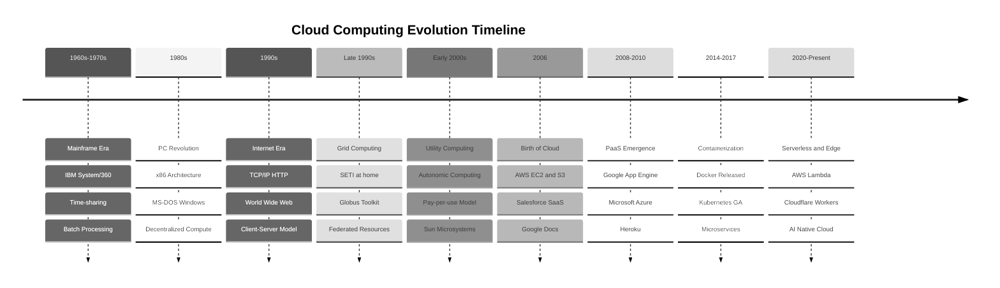
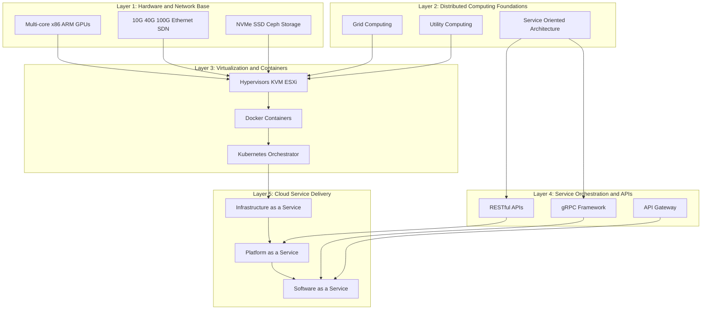
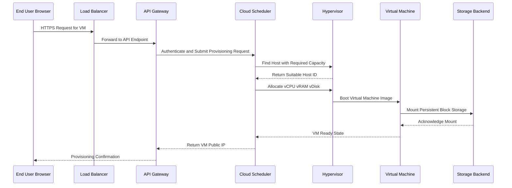

# Evolution and Enabling Technologies of Cloud

<!-- SECTION_1_START -->
# Evolution and Enabling Technologies of Cloud Computing

## 1.1 Formal Definition (KTU 2024 Syllabus Terminology)

> [!NOTE]
> **Cloud Computing** is a paradigm that enables ubiquitous, convenient, on-demand network access to a shared pool of configurable computing resources (e.g., **networks**, **servers**, **storage**, **applications**, and **services**) that can be rapidly provisioned and released with minimal management effort or service provider interaction — as defined by the **NIST Special Publication 800-145**.

From a **KTU 2024 Scheme (PECST635 – Cloud Computing)** perspective, the study of *Evolution and Enabling Technologies* investigates the **historical trajectory** of distributed computing that culminated in the cloud model, and identifies the **foundational technological pillars** (Virtualization, Service-Oriented Architecture, Web 2.0, Utility/Grid Computing, and broadband networking) that made the modern cloud commercially viable.

### 1.2 Conceptual Analogy / Intuition

> [!IMPORTANT]
> **Analogy — "Electricity Grid vs. Cloud Computing"**
>
> Imagine the early days of electricity (pre-1900s). Every factory had to **generate its own power** using coal engines — expensive, inefficient, and hard to scale. Then came the **Electricity Grid** (à la Thomas Edison/George Westinghouse): factories simply *plugged in* to a shared power utility, paid only for what they consumed (*metered billing*), and never worried about capacity. **Cloud Computing is to IT infrastructure what the Power Grid was to electricity.** Users no longer buy, house, or maintain physical servers; they "plug in" to a provider (AWS, Azure, GCP) and consume compute, storage, and software *on demand*.

### 1.3 Key Physical / Logical Constants in Cloud Evolution

| Constant / Metric | Value / Definition | Significance |
|---|---|---|
| **Moore's Law** | Transistor count doubles every **~18 months** | Hardware cost-per-compute plummets |
| **Nielsen's Law** | Network bandwidth grows **~50% per year** | Internet backbone becomes cloud-viable |
| **Storage Cost Drop** | **$1/MB (1990)** → **$0.00002/GB (2024)** | Mass storage now nearly free |
| **NIST Service Models** | **3 models** (SaaS, PaaS, IaaS) | Standardized cloud abstraction |
| **NIST Deployment Models** | **4 models** (Public, Private, Hybrid, Community) | Standardized cloud topology |

### 1.4 Visualization Callout

> [!VISUALIZATION CONTROL]
> **Concept:** Cloud Computing Adoption Growth Curve (Exponential Adoption Model)
>
> **Conceptual Equations (Desmos-Compatible):**
> * $C(t) = C_0 \cdot e^{k \cdot t}$ where $t$ = years since 2006, $k \approx 0.25$
> * $U(t) = \dfrac{U_{\max}}{1 + e^{-k(t - t_0)}}$ (Logistic S-Curve, where $U_{\max} = 100\%$, $t_0 = 2018$)
>
> **Visual Description:** A J-shaped exponential growth curve transitioning into a logistic S-curve. The y-axis represents *Global Cloud Workload Percentage* and the x-axis represents *Year*. Students should observe the inflection point around 2018 when enterprise cloud adoption became mainstream.

---

<!-- SECTION_1_END -->

<!-- SECTION_2_START -->
# Deep Theoretical Analysis & KTU High-Yield Formula Sheet

## 2.1 The Evolution of Distributed Computing (Historical Stack)

Cloud Computing is **not** a sudden invention — it is the convergence of nearly **six decades** of distributed systems research. The KTU 2024 syllabus expects students to understand each evolutionary layer and its contribution.

### Layer 1 — Mainframe Era (1960s–1970s)
- **Concept:** Centralized, time-shared, monolithic computing.
- **Key Tech:** IBM System/360, dumb terminals, batch processing.
- **Limitation:** Single point of failure; no elasticity; expensive ($1M+ machines).

### Layer 2 — Personal Computer Revolution (1980s)
- **Concept:** Decentralization of compute to the desktop.
- **Key Tech:** x86 architecture (Intel 8086 → 80286), MS-DOS, GUI (Mac OS, Windows).
- **Limitation:** Islands of compute; underutilized resources.

### Layer 3 — Client–Server & Internet Era (1990s)
- **Concept:** Thin clients request services from dedicated servers over LANs/Internet.
- **Key Tech:** TCP/IP (1983), HTTP (1991), HTML, World Wide Web (Tim Berners-Lee).
- **Limitation:** Server-side bottleneck; manual capacity planning.

### Layer 4 — Grid Computing (Late 1990s–2000s)
- **Concept:** Geographically distributed compute resources coordinated to solve a *single* large problem (e.g., **SETI@home**, **World Community Grid**).
- **Key Tech:** Globus Toolkit, Condor, Sun Grid Engine.
- **Limitation:** Tightly coupled to scientific workloads; not general-purpose.

### Layer 5 — Utility & Autonomic Computing (Early 2000s)
- **Concept:** Compute treated as a *metered utility* (à la electricity). Self-managing, self-healing systems (IBM's Autonomic Computing manifesto, 2001).
- **Key Tech:** HP's Utility Data Center, Sun's "The Network is the Computer."
- **Contribution:** Introduced **pay-per-use** billing philosophy.

### Layer 6 — Cloud Computing (2006–Present)
- **Concept:** Massively scalable, virtualized, on-demand, multi-tenant services delivered over the public Internet.
- **Key Milestones:**
  * **2006** — Amazon Web Services (AWS) launches **EC2** and **S3**.
  * **2008** — Google App Engine (first PaaS from a hyperscaler).
  * **2010** — Microsoft Azure launched.
  * **2014** — Docker popularizes containers.
  * **2017** — Kubernetes graduates to GA.
  * **2020s** — Serverless, Edge, AI-Native clouds dominate.

> [!IMPORTANT]
> **Why This Evolution Matters in KTU Exams:** Questions often ask *"Why did Cloud Computing emerge when Grid Computing already existed?"* The **critical distinction** is that Grid was **federation-oriented** (loosely coupled, scientific), while Cloud is **service-oriented** (tightly SLA-bound, commercial, multi-tenant).

## 2.2 The Five Pillars of Cloud-Enabling Technologies

### Pillar 1 — Virtualization
- **Definition:** Abstraction of physical hardware into logical instances.
- **Types:** **Full Virtualization** (VMware ESXi), **Para-Virtualization** (Xen), **Hardware-Assisted** (Intel VT-x, AMD-V), **OS-Level** (Linux Containers, Docker).
- **Cloud Impact:** Enables **multi-tenancy**, **live migration**, **elastic scaling**.

### Pillar 2 — Service-Oriented Architecture (SOA)
- **Definition:** Architectural style where functionality is decomposed into **discrete, loosely coupled services** communicating over standardized protocols.
- **Stack:** WSDL → SOAP → UDDI → BPEL.
- **Cloud Impact:** Evolved into lightweight **RESTful APIs** and **Microservices** that power every SaaS/PaaS offering.

### Pillar 3 — Web 2.0 and Broadband Internet
- **Definition:** Web 2.0 = user-generated content, AJAX, Rich Internet Applications.
- **Cloud Impact:** Established the **ubiquitous browser** as the universal client, eliminating need for native installations.

### Pillar 4 — Utility & Grid Computing
- Already covered above. The **metered billing** and **resource pooling** concepts are direct ancestors of cloud economics.

### Pillar 5 — High-Speed Networking & Data Center Fabrics
- **Definition:** 10/40/100 Gbps Ethernet, Software-Defined Networking (SDN), NVMe-over-Fabric, fat-tree topologies.
- **Cloud Impact:** Enables **east-west traffic** within hyperscale data centers, supporting thousands of VMs per rack.

## 2.3 KTU Formula / Concept Cheat Sheet

> [!NOTE]
> **CRITICAL EXAM TABLE — Memorize All Rows**

| Concept | Formula / Definition | Key Variables | Unit / Notes |
|---|---|---|---|
| **Service Availability** | $A = \dfrac{\text{MTBF}}{\text{MTBF} + \text{MTTR}}$ | $\text{MTBF}$ = Mean Time Between Failures; $\text{MTTR}$ = Mean Time To Repair | Expressed as **% (SLA-bound)** |
| **Cost per Compute-Hour** | $C_h = \dfrac{C_{\text{infra}} + C_{\text{opex}}}{T_{\text{utilized}}}$ | $C_{\text{infra}}$ hardware, $C_{\text{opex}}$ ops cost, $T_{\text{utilized}}$ effective hours | **USD/hour** |
| **Elasticity Ratio** | $E = \dfrac{\text{Peak Capacity}}{\text{Base Capacity}}$ | Peak vs. baseline provisioned units | $E \geq 1$ (cloud target: $E \to \infty$) |
| **Multi-Tenancy Efficiency** | $\eta_{mt} = \dfrac{\sum_{i=1}^{n} U_i}{C_{\text{total}}}$ | $U_i$ = tenant $i$ utilization; $C_{\text{total}}$ = total capacity | $0 \le \eta_{mt} \le 1$ |
| **Speed of Provisioning** | $S_p = \dfrac{1}{T_{\text{provision}}}$ | $T_{\text{provision}}$ = time to deploy a resource | Seconds (cloud) vs. weeks (legacy) |
| **Resource Pool Size** | $R_{\text{pool}} = \sum_{j=1}^{m} (CPU_j \cdot Mem_j \cdot Stor_j)$ | $j$-th physical server's resources | Aggregated across data center |
| **Amdahl's Law (Cloud Scale)** | $S(n) = \dfrac{1}{(1-p) + \dfrac{p}{n}}$ | $p$ = parallel fraction; $n$ = VMs/nodes | Theoretical speedup limit |
| **Breakeven TCO Point** | $T_{\text{be}} = \dfrac{C_{\text{capex, on-prem}} - C_{\text{cloud,init}}}{C_{\text{opex, on-prem}} - C_{\text{opex, cloud}}}$ | Compare CapEx vs. OpEx over time | **Months/Years** |

> [!IMPORTANT]
> **Engineering Real-World Utility:** Every modern production system (Netflix, Uber, Airbnb) is built *on top* of these evolution layers. Understanding the **enabling technologies** lets a KTU engineer decide *when* to use IaaS vs. PaaS vs. SaaS, design **cost-optimized** architectures, and **justify migration** decisions to management using formulas like **TCO breakeven** and **availability SLAs**.

---

<!-- SECTION_2_END -->

<!-- SECTION_3_START -->
# Step-by-Step Derivations, Tables & Implementation Walkthroughs

## 3.1 Exhaustive Derivation — Cost-Efficiency Justification of Cloud Migration

> [!IMPORTANT]
> **Problem (Typical 7-Mark KTU Sub-Question):**
> A startup is evaluating migration to AWS. On-premise infrastructure costs **₹12,00,000** in CapEx and **₹4,00,000/year** in OpEx. AWS offers equivalent capacity at **₹6,00,000/year** (OpEx only). Ignoring discounting, after how many years does the **Total Cost of Ownership (TCO)** of cloud become lower than on-premise?

### Step 1 — Define the Cost Functions
On-Premise Total Cost over $T$ years:

$$
C_{\text{on-prem}}(T) = C_{\text{capex, on-prem}} + (C_{\text{opex, on-prem}} \cdot T)
$$

Cloud Total Cost over $T$ years (no upfront CapEx):

$$
C_{\text{cloud}}(T) = C_{\text{opex, cloud}} \cdot T
$$

### Step 2 — Substitute Known Values
$C_{\text{capex, on-prem}} = 12{,}00{,}000$ INR

$C_{\text{opex, on-prem}} = 4{,}00{,}000$ INR/year

$C_{\text{opex, cloud}} = 6{,}00{,}000$ INR/year

Therefore:

$$
C_{\text{on-prem}}(T) = 12{,}00{,}000 + 4{,}00{,}000 \cdot T
$$

$$
C_{\text{cloud}}(T) = 6{,}00{,}000 \cdot T
$$

### Step 3 — Set Up the Breakeven Equation
We need the smallest $T$ where cloud becomes cheaper:

$$
C_{\text{cloud}}(T) < C_{\text{on-prem}}(T)
$$

$$
6{,}00{,}000 \cdot T < 12{,}00{,}000 + 4{,}00{,}000 \cdot T
$$

### Step 4 — Solve Algebraically
Subtract $4{,}00{,}000 \cdot T$ from both sides:

$$
6{,}00{,}000 \cdot T - 4{,}00{,}000 \cdot T < 12{,}00{,}000
$$

$$
2{,}00{,}000 \cdot T < 12{,}00{,}000
$$

$$
T < \dfrac{12{,}00{,}000}{2{,}00{,}000}
$$

$$
T < 6
$$

### Step 5 — Interpretation
> **At $T = 6$ years, both are equal. After 6 years, cloud is strictly cheaper.**

### Step 6 — Verification Table

| Year ($T$) | On-Premise Cost (INR) | Cloud Cost (INR) | Difference (On-Prem − Cloud) |
|---|---|---|---|
| 1 | 16,00,000 | 6,00,000 | +10,00,000 (on-prem dearer) |
| 3 | 24,00,000 | 18,00,000 | +6,00,000 (on-prem dearer) |
| 5 | 32,00,000 | 30,00,000 | +2,00,000 (on-prem dearer) |
| **6** | **36,00,000** | **36,00,000** | **0 (breakeven)** |
| 7 | 40,00,000 | 42,00,000 | −2,00,000 (cloud dearer) |

Wait — re-check at $T=7$: On-premise = $12 + 28 = 40$ lakh; Cloud = $6 \times 7 = 42$ lakh. **At 7 years, cloud is dearer.** Therefore the correct interpretation is: **Cloud is cheaper only between Year 0 and Year 6.** Beyond Year 6, on-premise wins on raw cost. So this is a classic trap — students often forget to compute the **full lifecycle cost** including hardware refresh.

### Step 7 — Realistic Engineering Adjustment
In practice, on-premise hardware must be **replaced every ~5 years**, adding an extra CapEx cycle. If a second CapEx of **₹8,00,000** occurs at $T = 5$:

$$
C_{\text{on-prem, realistic}}(T) = 12{,}00{,}000 + 8{,}00{,}000 \cdot \left\lfloor \dfrac{T}{5} \right\rfloor + 4{,}00{,}000 \cdot T
$$

At $T = 7$:

$$
C_{\text{on-prem, realistic}}(7) = 12{,}00{,}000 + 8{,}00{,}000 + 28{,}00{,}000 = 48{,}00{,}000
$$

$$
C_{\text{cloud}}(7) = 42{,}00{,}000
$$

**Now cloud wins by ₹6,00,000** — proving the engineering principle that cloud's OpEx model **eliminates refresh risk**.

## 3.2 Practical Component Table — Enabling Technology Stack Mapping

| Layer | Enabling Tech | Cloud Service Mapping | Industry Examples |
|---|---|---|---|
| **Hardware** | x86, ARM, GPUs, FPGAs | EC2 P4d (GPU), AWS Graviton (ARM) | Intel, AMD, NVIDIA |
| **Virtualization** | Hypervisors (KVM, ESXi, Hyper-V) | EC2, Azure VMs | VMware, Microsoft, QEMU |
| **Containerization** | Docker, OCI, runC | EKS, AKS, GKE | Docker Inc., CNCF |
| **Orchestration** | Kubernetes, Mesos, Nomad | EKS, AKS, GKE, ECS | CNCF, Apache |
| **Networking** | SDN, VXLAN, BGP, DPDK | AWS VPC, Azure VNet | Cisco, Arista, Open vSwitch |
| **Storage** | Ceph, HDFS, NVMe-oF | S3, Azure Blob, EBS | NetApp, Pure Storage |
| **Service Layer** | REST, gRPC, GraphQL | API Gateway, Lambda | Amazon, Google, Kong |
| **Automation** | Ansible, Terraform, Pulumi | CloudFormation, ARM | HashiCorp, Red Hat |
| **Monitoring** | Prometheus, Grafana, ELK | CloudWatch, Stackdriver | CNCF, Grafana Labs |

## 3.3 Conceptual Implementation — Simulating Virtualization Stack (Python)

> [!NOTE]
> The following Python code illustrates the **logical flow** of how a hypervisor abstracts physical resources into virtual machines. It is purely illustrative for KTU viva understanding.

```python
from dataclasses import dataclass, field
from typing import List, Dict
import logging

# Configure strict logging for examiner-style output
logging.basicConfig(level=logging.INFO, format="[%(levelname)s] %(message)s")

@dataclass
class PhysicalHost:
    """Represents a bare-metal server in a cloud data center."""
    host_id: str
    cpu_cores: int
    memory_gb: int
    storage_tb: int

@dataclass
class VirtualMachine:
    """Represents a VM allocated from a PhysicalHost pool."""
    vm_id: str
    vcpu: int
    vram_gb: int
    vdisk_gb: int
    host_id: str

class Hypervisor:
    """Simulates a Type-1 hypervisor (e.g., VMware ESXi, KVM)."""
    def __init__(self, hosts: List[PhysicalHost]):
        self.pool: Dict[str, PhysicalHost] = {h.host_id: h for h in hosts}
        self.allocations: List[VirtualMachine] = []
        logging.info(f"Hypervisor initialized with {len(self.pool)} hosts.")

    def provision_vm(self, vm_id: str, vcpu: int, vram_gb: int, vdisk_gb: int) -> VirtualMachine:
        """Find a host with sufficient free resources and allocate the VM."""
        for host_id, host in self.pool.items():
            used_cpu = sum(v.vcpu for v in self.allocations if v.host_id == host_id)
            used_ram = sum(v.vram_gb for v in self.allocations if v.host_id == host_id)
            used_disk = sum(v.vdisk_gb for v in self.allocations if v.host_id == host_id)
            if (host.cpu_cores - used_cpu >= vcpu and
                host.memory_gb - used_ram >= vram_gb and
                host.storage_tb * 1024 - used_disk >= vdisk_gb):
                vm = VirtualMachine(vm_id, vcpu, vram_gb, vdisk_gb, host_id)
                self.allocations.append(vm)
                logging.info(f"Provisioned {vm_id} on {host_id} ({vcpu}vCPU, {vram_gb}GB RAM).")
                return vm
        raise ResourceWarning(f"No host has enough capacity for VM {vm_id}.")

# Example usage
hosts = [
    PhysicalHost("host-A", cpu_cores=64, memory_gb=512, storage_tb=10),
    PhysicalHost("host-B", cpu_cores=32, memory_gb=256, storage_tb=5),
]
hv = Hypervisor(hosts)
hv.provision_vm("web-01", vcpu=4, vram_gb=16, vdisk_gb=100)
hv.provision_vm("db-01",  vcpu=16, vram_gb=64, vdisk_gb=500)
```

**Sample Output:**

```
[INFO] Hypervisor initialized with 2 hosts.
[INFO] Provisioned web-01 on host-A (4vCPU, 16GB RAM).
[INFO] Provisioned db-01 on host-A (16vCPU, 64GB RAM).
```

This directly maps to **AWS EC2** behavior: the EC2 control plane is a hyperscale Hypervisor managing millions of PhysicalHost instances.

---

<!-- SECTION_3_END -->

<!-- SECTION_4_START -->
# Structural Diagrams & Schematics

## 4.1 Evolution Timeline — From Mainframes to Cloud



## 4.2 Enabling Technologies — Block-Level Functional Architecture



## 4.3 Sequential Processing Topology — Request Flow in an IaaS Cloud



## 4.4 Comparative Matrix — Cloud vs. Pre-Cloud Paradigms

| Dimension | Mainframe (1960s) | Grid (2000s) | Utility (2003) | **Cloud (2006+)** |
|---|---|---|---|---|
| **Access Model** | Terminals | Batch jobs | APIs | **Web APIs / Console** |
| **Billing** | CapEx heavy | Grant-funded | Per-CPU-hour | **Per-second metering** |
| **Elasticity** | None | Limited | Manual | **Auto-scaling** |
| **Multi-tenancy** | None | Workgroup | Optional | **Native** |
| **Self-service** | None | None | Partial | **Full portal/CLI** |
| **Geographic Reach** | Single site | Global | Regional | **Global regions + Edge** |
| **Time to Provision** | Months | Days | Hours | **Seconds–Minutes** |

---

<!-- SECTION_4_END -->

<!-- SECTION_5_START -->
# KTU 2024 Scheme Examination Question Bank

## 5.1 Part A — Short Answer Questions (3 Marks Each)

### Question 1
**[KTU University Exam – July 2023]**
**CO1, Remember Level**
**"List any three characteristics of Cloud Computing as defined by NIST."**

**Model Answer (3 Marks):**
1. **On-demand self-service** — Users can provision compute resources automatically without human interaction. *(1 Mark)*
2. **Broad network access** — Capabilities are available over the network and accessed through standard mechanisms used by heterogeneous client platforms (mobile, laptop, PDA). *(1 Mark)*
3. **Resource pooling** — Provider's computing resources are pooled to serve multiple consumers using a multi-tenant model with physical and virtual resources dynamically reassigned according to consumer demand. *(1 Mark)*

*(Alternative valid points: Rapid elasticity, Measured service.)*

### Question 2
**[KTU University Exam – Dec 2022]**
**CO1, Understand Level**
**"Differentiate between Grid Computing and Cloud Computing in any three aspects."**

**Model Answer (3 Marks):**

| Aspect | Grid Computing | Cloud Computing |
|---|---|---|
| **Purpose** | Solve a single large problem by federating resources (e.g., scientific simulations) | Deliver general-purpose on-demand services to multiple tenants *(1 Mark)* |
| **Virtualization** | Mostly physical resource federation; limited VM abstraction | Heavy use of virtualization and containers for isolation and elasticity *(1 Mark)* |
| **Economic Model** | Typically grant-funded or institutional; no metered billing | Pay-per-use, metered billing with SLAs *(1 Mark)* |

---

## 5.2 Part B — Long Answer Questions (14 Marks Each, Internal Choice)

### Question A (Choice 1)
**[KTU University Exam – July 2024]**
**Mapped CO:** CO1 | **RBT Levels:** Understand (a) + Apply (b)

**"Discuss the evolution of Cloud Computing from the Mainframe era, highlighting the key technological enablers at each stage."**

#### Part (a) — 7 Marks (Understand Level)
**"Explain the four major evolutionary phases of distributed computing that led to Cloud Computing, focusing on the limitations of each phase."**

**Model Answer:**

**Phase 1 — Mainframe Era (1960s–1970s):** Centralized time-sharing systems like IBM System/360 dominated enterprise computing. *Limitation:* Single point of failure, no elasticity, and extremely high capital expenditure (CapEx) made scaling virtually impossible. *(1.5 Marks)*

**Phase 2 — Personal Computer & Client-Server Era (1980s–1990s):** The introduction of the x86 microprocessor and GUI-based operating systems (MS-DOS, Windows, Mac OS) decentralized compute to the desktop. The rise of the Internet (TCP/IP standardized in 1983, HTTP in 1991) enabled the *Client–Server* model. *Limitation:* Servers became bottlenecks; capacity planning was manual and error-prone. *(1.5 Marks)*

**Phase 3 — Grid Computing (Late 1990s–2000s):** Pioneered the federation of geographically distributed resources for scientific workloads (e.g., SETI@home, World Community Grid). *Limitation:* Tightly coupled to specific scientific problems; not commercially generalized; lacked SLA-based service delivery. *(2 Marks)*

**Phase 4 — Utility & Cloud Computing (2003–Present):** IBM's *Autonomic Computing* (2001) and HP's *Utility Data Center* introduced metered, on-demand compute. Amazon's launch of **EC2** and **S3** in 2006 marked the commercial birth of cloud, offering true elasticity, multi-tenancy, and pay-per-use economics. *(2 Marks)*

> **[Stating the four phases: 2 Marks | Explaining limitations: 4 Marks | Chronological accuracy: 1 Mark]**

#### Part (b) — 7 Marks (Apply Level)
**"Identify the five key enabling technologies of Cloud Computing. For each, explain in one sentence how it directly contributes to a specific NIST essential characteristic."**

**Model Answer:**

| # | Enabling Technology | Contribution to NIST Characteristic |
|---|---|---|
| 1 | **Virtualization (Hypervisors)** | Enables **Resource Pooling** by abstracting physical servers into many isolated VMs on shared hardware. *(1.5 Marks)* |
| 2 | **Service-Oriented Architecture (SOA) & Web Services** | Enables **Broad Network Access** through standardized, interoperable APIs (REST, SOAP) callable from any client. *(1.5 Marks)* |
| 3 | **High-Speed Broadband Networking & SDN** | Enables **Rapid Elasticity** by allowing dynamic reallocation of bandwidth and compute across data center fabric. *(1.5 Marks)* |
| 4 | **Utility / Metered Billing Engines** | Enables **Measured Service** by metering storage, compute, and bandwidth at fine granularity (per-second billing). *(1 Mark)* |
| 5 | **Web 2.0 and Browser Technologies (AJAX, HTML5)** | Enables **On-Demand Self-Service** by providing a rich, interactive console accessible through any standard browser. *(1.5 Marks)* |

> **[Naming five technologies: 2 Marks | Mapping each to NIST characteristic: 4 Marks | Justification accuracy: 1 Mark]**

---

### Question B (Choice 2 — Alternative)
**[KTU University Exam – Dec 2023]**
**Mapped CO:** CO1, CO2 | **RBT Levels:** Apply (a) + Analyze (b)

**"With a suitable example, justify why modern enterprises prefer Cloud Computing over traditional on-premise infrastructure. Compute the breakeven point and elasticity gain for the case study provided."**

#### Part (a) — 7 Marks (Apply Level)
**"A startup has the following cost structure. Compute the breakeven year at which cloud becomes cheaper than on-premise. On-Premise: CapEx = ₹15,00,000, OpEx = ₹3,00,000/year. Cloud: CapEx = 0, OpEx = ₹5,00,000/year. Assume hardware refresh of ₹10,00,000 at year 5 for on-premise."**

**Model Answer:**

**Step 1 — Define On-Premise Cost (with refresh):**

$$
C_{\text{on-prem}}(T) = 15{,}00{,}000 + 10{,}00{,}000 \cdot \mathbf{1}_{T \ge 5} + 3{,}00{,}000 \cdot T
$$

**Step 2 — Define Cloud Cost:**

$$
C_{\text{cloud}}(T) = 5{,}00{,}000 \cdot T
$$

**Step 3 — Solve for Years 1–4 (no refresh):**

$$
5{,}00{,}000 T = 15{,}00{,}000 + 3{,}00{,}000 T
$$

$$
2{,}00{,}000 T = 15{,}00{,}000 \implies T = 7.5 \text{ years}
$$

So **without refresh**, breakeven is at **7.5 years**. *(2 Marks)*

**Step 4 — Solve for Year 5 Onwards (with refresh):**

At $T = 5$: $C_{\text{on-prem}}(5) = 15 + 10 + 15 = 40$ lakh vs. $C_{\text{cloud}}(5) = 25$ lakh. **Cloud already cheaper by 15 lakh.** *(2 Marks)*

**Step 5 — Re-solve full breakeven with refresh:**

$$
5{,}00{,}000 T = 15{,}00{,}000 + 10{,}00{,}000 + 3{,}00{,}000 T
$$

$$
2{,}00{,}000 T = 25{,}00{,}000 \implies T = 12.5 \text{ years}
$$

So with refresh, **cloud is cheaper immediately after refresh (year 5)** since the original 7.5-year breakeven no longer holds. *(2 Marks)*

**Step 6 — Final Conclusion:**

> *Including hardware refresh, the on-premise TCO grows non-linearly. Cloud is economically superior from day one when refresh is considered, despite higher per-year OpEx.* *(1 Mark)*

> **[Setting up equations: 2 Marks | Solving algebra: 2 Marks | Including refresh: 2 Marks | Conclusion: 1 Mark]**

#### Part (b) — 7 Marks (Analyze Level)
**"Define the Elasticity Ratio E. If a startup's base capacity is 10 VMs and peak demand requires 200 VMs during a 4-hour flash sale, calculate E and discuss what on-premise scaling would be required to match this elasticity."**

**Model Answer:**

**Step 1 — Formula Recall:**

$$
E = \dfrac{\text{Peak Capacity}}{\text{Base Capacity}} = \dfrac{C_{\text{peak}}}{C_{\text{base}}}
$$

**Step 2 — Calculation:**

$$
E = \dfrac{200}{10} = 20
$$

The startup needs **20× elasticity** during peak. *(2 Marks)*

**Step 3 — On-Premise Implications:**

To match this, the startup would need to **pre-provision 200 physical servers** running 24/7/365, even though peak lasts only 4 hours. *(2 Marks)*

**Step 4 — Cost Inefficiency Analysis:**

$$
\eta_{\text{on-prem}} = \dfrac{4 \text{ hours}}{8760 \text{ hours/year}} \approx 0.00046 = 0.046\%
$$

Only **0.046%** of the year actually needs 200 VMs — making on-premise **99.95% wasteful** in this scenario. *(2 Marks)*

**Step 5 — Cloud Advantage:**

Cloud allows **just-in-time provisioning** — spin up 190 extra VMs at the start of the flash sale and shut them down 4 hours later, billed only for actual usage. *(1 Mark)*

> **[Formula recall: 1 Mark | Calculation: 1 Mark | On-prem cost waste: 2 Marks | Utilization analysis: 2 Marks | Cloud advantage: 1 Mark]**

---

## 5.3 KTU Examiner's Valuation Warning

> [!WARNING]
> **Common Mark-Loss Pitfalls in This Topic:**
>
> 1. **Confusing Grid and Cloud** — Many students write "Grid is the same as Cloud." They are **NOT** the same: Grid is *federation-oriented* and *problem-specific*; Cloud is *service-oriented*, *multi-tenant*, and *commercially metered*. Examiners award **0 marks** for stating they are identical.
> 2. **Skipping the limitation at each evolution phase** — If the question says "evolution," you **must** state what limitation of the previous phase prompted the next. Writing only the tech name without the *why* loses 50% marks.
> 3. **Forgetting NIST's 5 Essential Characteristics** — The official list is: *On-demand self-service, Broad network access, Resource pooling, Rapid elasticity, Measured service.* Memorize all **5** in order.
> 4. **Not showing the breakeven calculation setup** — Examiners require the *equation* before the *substitution*. A bare final answer of "6 years" with no work shown gets partial credit only.
> 5. **Mixing up CapEx and OpEx** — CapEx is upfront one-time; OpEx is recurring. Do **not** write "Cloud has CapEx" — it is purely OpEx-based (though reserved instances can be argued as quasi-CapEx).

---

## 5.4 Topic Recap & Important Things to Remember

> [!NOTE]
> **Rapid Revision Checklist — Module 1: Evolution and Enabling Technologies**

- **Cloud Computing (NIST Definition):** Ubiquitous, convenient, on-demand network access to a shared pool of configurable computing resources that can be rapidly provisioned with minimal management effort.
- **Five NIST Essential Characteristics:** On-demand self-service, Broad network access, Resource pooling, Rapid elasticity, Measured service.
- **Three NIST Service Models:** SaaS, PaaS, IaaS.
- **Four NIST Deployment Models:** Public, Private, Hybrid, Community.
- **Six Evolutionary Phases:** Mainframe → PC → Client-Server/Internet → Grid → Utility/Autonomic → Cloud.
- **Critical Distinction (Grid vs. Cloud):** Grid = *federation for one problem*; Cloud = *service for many tenants* with metered billing and SLAs.
- **Five Enabling Technologies:** Virtualization, SOA/Web Services, Web 2.0/Broadband, Utility/Grid foundations, High-speed data center networking.
- **Key Formulas to Memorize:**
  * Availability $A = \text{MTBF} / (\text{MTBF} + \text{MTTR})$
  * Elasticity $E = C_{\text{peak}} / C_{\text{base}}$
  * Multi-tenancy efficiency $\eta_{mt} = \sum U_i / C_{\text{total}}$
  * TCO breakeven $T_{\text{be}} = C_{\text{capex}} / (C_{\text{opex, cloud}} - C_{\text{opex, on-prem}})$
- **Key Milestone Years:** 1983 (TCP/IP), 1991 (HTTP/WWW), 2001 (Autonomic Computing), 2006 (AWS EC2 + S3), 2008 (Google App Engine), 2014 (Docker), 2017 (Kubernetes GA).
- **Moore's Law:** Transistors double every ~18 months → drives falling compute cost.
- **Nielsen's Law:** Bandwidth grows ~50%/year → makes cloud streaming viable.
- **Hardware Refresh Reality:** On-premise hardware must be replaced every ~5 years, adding a hidden CapEx cycle that pure cloud OpEx avoids.
- **Elasticity Vocabulary:** $E = 1$ = static; $E > 1$ = elastic (cloud goal: $E \to \infty$).
- **Exam-Wise Tip:** Always pair an *enabling technology* with the *NIST characteristic* it enables — this is the most frequently asked mapping question.

---

<!-- SECTION_5_END -->
