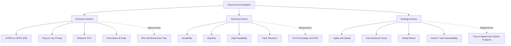
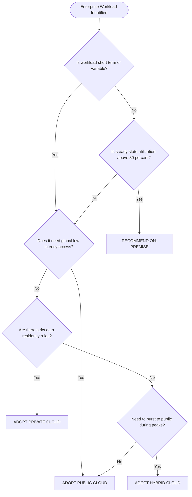
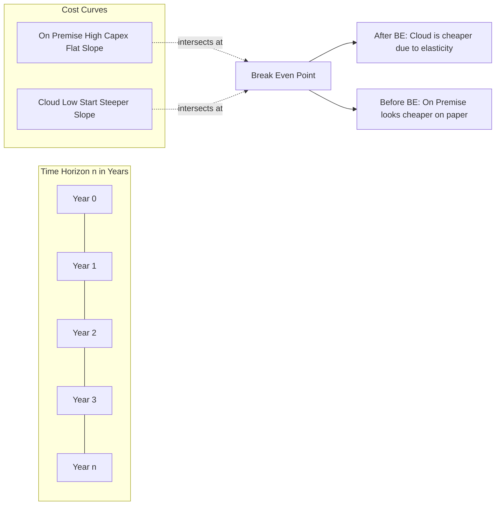

# Factors behind Cloud Service Adoption

<!-- SECTION_1_START -->
# Factors Behind Cloud Service Adoption

## 1.1 Formal Academic Definition

> [!NOTE]
> **Cloud Service Adoption** is the strategic and operational process by which an organization transitions, integrates, or deploys its Information Technology (IT) workloads, data, and business processes onto a distributed, on-demand, utility-style computing platform delivered over the Internet. The **factors** behind this adoption are the multidimensional business, technical, economic, and organizational drivers that influence an enterprise's decision to migrate from traditional on-premise infrastructure to a Cloud Service Provider (CSP) environment.

In the context of the **KTU 2024 Scheme (PECST635 - Cloud Computing)**, Module 1 frames these factors as the *motivation layer* of the cloud computing stack. They answer the fundamental question every enterprise architect must address:

$$\text{Adoption Decision} = f(\text{Cost},\ \text{Scalability},\ \text{Agility},\ \text{Risk},\ \text{Strategic Value})$$

> [!IMPORTANT]
> **KTU Syllabus Highlight (Module 1):** The official PECST635 syllabus lists the following driving forces — *Cost reduction, Scalability and elasticity, Agility, Focus on core business, Global reach and availability, Maintenance and management ease, Security and compliance, and Green IT / Sustainability*. These are the **eight high-yield factors** the university examiner expects a student to enumerate with brief technical justification.

## 1.2 Conceptual Analogy — The "Electricity Grid" Model

Imagine your college campus needs electricity. You have **two choices**:

- **Build your own power plant** (On-Premise) → Buy diesel, maintain generators, hire electricians, scale capacity for the *worst-case* hostel crowd, and manually upgrade when the lab equipment increases.
- **Subscribe to the Kerala State Electricity Board grid** (Cloud) → Pay only for the *units* you consume, automatically scale up during exam time, the provider handles maintenance, and you focus on running the academic session, not the power station.

**Cloud Service Adoption is exactly this shift** — from *capital-intensive, capacity-driven ownership* to *operational, consumption-driven utility*. The "factors" are the reasons a smart principal would choose the grid over the generator.

> [!TIP]
> **Mental Model:** Think of cloud as a **utility meter** — you pay per-second for compute, per-GB for storage, and per-request for API calls. Every adoption factor essentially reduces a *risk* or a *cost* in this utility equation.

## 1.3 The Three Macro-Categories of Adoption Factors

| Macro-Category | Core Question It Answers | Representative Sub-Factors |
| :--- | :--- | :--- |
| **Economic Drivers** | Will it save money and improve ROI? | CAPEX → OPEX shift, Pay-per-use, TCO reduction |
| **Technical & Operational Drivers** | Will my system become better? | Scalability, Elasticity, High Availability, Fault Tolerance |
| **Strategic & Organizational Drivers** | Does it help the business grow? | Agility, Core focus, Global reach, Green IT |

> [!VISUALIZATION CONTROL]
> **Concept:** Weighted Radar Map of Cloud Adoption Drivers
> **Desmos Input Equations (radar chart approximation):**
> * $r_{1}(\theta) = 9 + 2\cos(5\theta)$ for Economic (dominant lobe along $\theta=0$)
> * $r_{2}(\theta) = 7 + 1.5\sin(5\theta)$ for Technical
> * $r_{3}(\theta) = 6 + 1.2\cos(5\theta - \pi/2)$ for Strategic
> **Visual Description:** Plot in polar mode from $0$ to $2\pi$. The student should observe that the **Economic** lobe stretches furthest along the right axis (highest weight in most enterprise surveys), with **Technical** and **Strategic** lobes slightly behind, but never collapsing to zero — indicating all three dimensions must be evaluated.

<!-- SECTION_1_END -->

<!-- SECTION_2_START -->
# Deep Theoretical Analysis & KTU High-Yield Reference Sheet

## 2.1 The Eight Pillars of Cloud Service Adoption (Detailed)

### Pillar 1 — Cost Reduction & Economic Advantage
- **CAPEX to OPEX Shift:** On-premise requires huge upfront *Capital Expenditure* (servers, cooling, real estate). Cloud converts this into *Operational Expenditure* (monthly subscription).
- **Pay-per-Use Pricing:** Billed at fine granularity (per-second for AWS EC2, per-GB-month for S3, per-request for Lambda).
- **Economies of Scale:** CSPs like AWS, Azure, GCP purchase hardware at massive discounts and pass savings to tenants.
- **Reduced Total Cost of Ownership (TCO):** No maintenance staff, no software licensing renewals, no depreciation accounting.

### Pillar 2 — Scalability
- **Vertical Scaling (Scale-Up):** Increasing resources (CPU, RAM) of a single instance.
- **Horizontal Scaling (Scale-Out):** Adding more instances to a pool (e.g., AWS Auto Scaling Groups).
- Cloud platforms allow scaling *theoretically infinitely* within the provider's region pool.

### Pillar 3 — Elasticity
- Elasticity = *Automatic* + *Dynamic* scaling in response to real-time load.
- Distinguishes from Scalability by the **automation** dimension. Uses metrics like CPU threshold, request queue depth, or scheduled scaling policies.

### Pillar 4 — Agility & Speed to Market
- Time to provision a VM drops from **weeks** (procurement cycle) to **minutes** (API call).
- Enables rapid experimentation, DevOps pipelines, and faster product releases.

### Pillar 5 — Focus on Core Business
- Non-differentiating IT work (patching, backups, hardware refresh) is offloaded.
- The enterprise focuses engineering talent on its *competitive moat* (e.g., a fintech focusing on risk algorithms, not on maintaining MySQL).

### Pillar 6 — Global Reach & Availability
- Major CSPs operate **60+ regions** and **200+ edge locations** worldwide.
- A Kerala-based startup can serve customers in Singapore, Frankfurt, and São Paulo with low latency by simply launching resources in the nearest region.

### Pillar 7 — Reliability, Fault Tolerance & Disaster Recovery
- SLAs of **99.9% (Three Nines)** to **99.99% (Four Nines)** are industry standard.
- Multi-AZ (Availability Zone) deployments, automatic failover, and geo-redundant storage (e.g., S3 with 11 9s durability) exceed what most enterprises can build in-house.

### Pillar 8 — Maintenance, Management Ease & Green IT
- The CSP handles hardware refresh, OS patching of managed services, and physical security.
- **Sustainability:** Hyperscale data centers achieve **Power Usage Effectiveness (PUE) < 1.2**, far better than the industry average of 1.55. Shared infrastructure is inherently greener.

## 2.2 KTU High-Yield Formula & Parameter Sheet

> [!IMPORTANT]
> The following table is the **board-exam-ready cheat sheet**. Memorize the symbolic representations and unit semantics.

| Symbol / Metric | Definition | Mathematical Form | Unit / Typical Value |
| :--- | :--- | :--- | :--- |
| $C_{\text{capex}}$ | One-time capital cost of on-premise infrastructure | $\sum_{i=1}^{n} (H_{i} + L_{i})$ | INR / USD (one-time) |
| $C_{\text{opex-cloud}}$ | Recurring cloud subscription cost | $r_{\text{compute}} \cdot t_{\text{use}} + r_{\text{storage}} \cdot s_{\text{GB}} + r_{\text{net}} \cdot b_{\text{GB}}$ | INR / month |
| $\text{TCO}_{n}$ | Total Cost of Ownership over $n$ years | $C_{\text{capex}} + \sum_{y=1}^{n} C_{\text{opex-yr}}$ | INR over $n$ years |
| $\text{Break-even Point}$ | Time when cloud TCO = on-premise TCO | $t_{\text{be}} = \dfrac{C_{\text{capex}}}{C_{\text{opex-cloud}} - C_{\text{opex-prem}}}$ | Years |
| $\text{Elasticity Ratio}$ | How dynamically resources match load | $E_{r} = \dfrac{R_{\text{allocated}} - R_{\text{used}}}{R_{\text{peak}}}$ | Dimensionless, $\in [0,1]$ |
| $\text{PUE}$ | Power Usage Effectiveness of data center | $\text{PUE} = \dfrac{P_{\text{total}}}{P_{\text{IT}}}$ | Dimensionless, ideal $\approx 1.0$ |
| $\text{SLA}_{\%}$ | Service availability commitment | $1 - \dfrac{t_{\text{down}}}{t_{\text{period}}}$ | $\%$, e.g., $99.95\%$ |
| $M_{\text{time}}$ | Mean time to provision resource | $M_{\text{time}}$ | On-prem: weeks; Cloud: seconds-minutes |

> **Escape Note:** When you need to write the **modulus** operator or *absolute value* in any KTU answer sheet, always use $\vert x \vert$ — never the raw pipe character — to maintain table integrity.

## 2.3 Real-World Engineering Utility

| Domain | How Adoption Factors Manifest |
| :--- | :--- |
| **Startups (e.g., Freshworks, Razorpay)** | Agility + Cost reduction lets a 5-person team launch a globally-scaled product. |
| **Banking & BFSI** | Reliability + Compliance attracts regulated workloads to private/hybrid cloud. |
| **E-commerce (Flipkart Big Billion Days)** | Elasticity auto-scales from 100 to 100,000 servers in minutes for sale events. |
| **Healthcare / EHR systems** | Global reach + Fault tolerance ensures patient records are available 24x7 across hospital chains. |
| **EdTech platforms (during COVID)** | Scalability absorbed a 10x traffic surge without infrastructure re-procurement. |
| **AI/ML workloads** | Pay-per-use GPU access (e.g., AWS p4d.24xlarge) avoids the \$30,000 per GPU capital block. |

<!-- SECTION_2_END -->

<!-- SECTION_3_START -->
# Step-by-Step Derivations, Cost Modeling & Implementation

## 3.1 Derivation 1 — Total Cost of Ownership (TCO) Comparison

We will derive the **break-even point** between on-premise and cloud deployment, which is the most frequently tested *numerical* question in KTU Module 1.

### Step 1 — Define On-Premise Cost Function

Let an enterprise need a workload running for $n$ years. The on-premise cost over period $n$ is:

$$
C_{\text{prem}}(n) = C_{\text{capex}} + C_{\text{infra}} + C_{\text{power}} + C_{\text{staff}} + C_{\text{lic}}
$$

Where:
- $C_{\text{capex}}$ = Server, storage, and networking hardware (one-time)
- $C_{\text{infra}}$ = Data center rent, cooling, physical security (annual)
- $C_{\text{power}}$ = Electricity for servers and cooling (annual)
- $C_{\text{staff}}$ = SysAdmins, DBAs, network engineers (annual)
- $C_{\text{lic}}$ = OS, middleware, antivirus licenses (annual)

### Step 2 — Define Cloud Cost Function

The cloud cost for the same workload is:

$$
C_{\text{cloud}}(n) = C_{\text{migration}} + \sum_{y=1}^{n} \left( r_{\text{comp}} \cdot t_{y} + r_{\text{sto}} \cdot s_{y} + r_{\text{net}} \cdot b_{y} \right)
$$

Where:
- $C_{\text{migration}}$ = One-time cost to refactor and move workloads
- $r_{\text{comp}}, r_{\text{sto}}, r_{\text{net}}$ = Per-unit rate of compute, storage, and bandwidth
- $t_{y}, s_{y}, b_{y}$ = Units consumed in year $y$

### Step 3 — Equate the Two Cost Functions

To find the **break-even year** $n_{\text{be}}$:

$$
\begin{aligned}
C_{\text{prem}}(n_{\text{be}}) &= C_{\text{cloud}}(n_{\text{be}}) \\
C_{\text{capex}} + n_{\text{be}} \cdot C_{\text{opex-prem}} &= C_{\text{mig}} + n_{\text{be}} \cdot C_{\text{opex-cloud}}
\end{aligned}
$$

### Step 4 — Solve for $n_{\text{be}}$

Rearranging the terms to isolate $n_{\text{be}}$:

$$
\begin{aligned}
C_{\text{capex}} - C_{\text{mig}} &= n_{\text{be}} \cdot (C_{\text{opex-cloud}} - C_{\text{opex-prem}}) \\
n_{\text{be}} &= \frac{C_{\text{capex}} - C_{\text{mig}}}{C_{\text{opex-cloud}} - C_{\text{opex-prem}}}
\end{aligned}
$$

> **Logic:** If $C_{\text{opex-cloud}} < C_{\text{opex-prem}}$ (i.e., cloud's annual cost is *lower* than on-premise annual cost), then $n_{\text{be}}$ is **positive** — meaning cloud becomes cheaper after that many years. Otherwise, on-premise is permanently cheaper.

## 3.2 Worked Numerical Example (KTU Style)

> [!IMPORTANT]
> **Sample Problem:** A startup needs a 3-year web application. On-premise setup costs **INR 12,00,000** (capex) and **INR 4,00,000/year** (opex). Cloud equivalent has a **one-time migration cost of INR 2,00,000** and **INR 6,00,000/year** (opex). Should they adopt cloud?

**Solution:**

**Step 1 — Calculate On-Premise TCO for 3 years:**

$$
\begin{aligned}
C_{\text{prem}}(3) &= 12{,}00{,}000 + (3 \times 4{,}00{,}000) \\
&= 12{,}00{,}000 + 12{,}00{,}000 \\
&= \text{INR } 24{,}00{,}000
\end{aligned}
$$

**Step 2 — Calculate Cloud TCO for 3 years:**

$$
\begin{aligned}
C_{\text{cloud}}(3) &= 2{,}00{,}000 + (3 \times 6{,}00{,}000) \\
&= 2{,}00{,}000 + 18{,}00{,}000 \\
&= \text{INR } 20{,}00{,}000
\end{aligned}
$$

**Step 3 — Compute the Break-Even Year:**

$$
\begin{aligned}
n_{\text{be}} &= \frac{C_{\text{capex}} - C_{\text{mig}}}{C_{\text{opex-cloud}} - C_{\text{opex-prem}}} \\
&= \frac{12{,}00{,}000 - 2{,}00{,}000}{6{,}00{,}000 - 4{,}00{,}000} \\
&= \frac{10{,}00{,}000}{2{,}00{,}000} \\
&= 5 \text{ years}
\end{aligned}
$$

**Step 4 — Interpret for the Startup (3-year horizon):**

- Since the workload is only **3 years** and $n_{\text{be}} = 5$, the cloud is **cheaper by INR 4,00,000** during this period.
- **Decision: Adopt Cloud** — savings are immediate because the high capex is avoided.

## 3.3 Python Implementation — Cloud vs On-Premise TCO Calculator

```python
"""
Module: Cloud Computing (PECST635) - KTU 2024 Scheme
Topic: Factors behind Cloud Service Adoption
Tool: TCO & Break-Even Decision Engine

This script computes Total Cost of Ownership and break-even
analysis between on-premise and cloud deployment, which is
one of the core economic factors driving cloud adoption.
"""

from dataclasses import dataclass
from typing import List
import logging

# Configure structured logging for traceability
logging.basicConfig(
    level=logging.INFO,
    format="%(asctime)s | %(levelname)s | %(message)s"
)


@dataclass(frozen=True)
class CostModel:
    """Immutable cost model for one deployment strategy."""
    capex: float                # One-time capital cost (INR)
    annual_opex: float          # Recurring operational cost (INR/year)
    migration_cost: float = 0.0 # One-time cloud migration cost (INR)


def calculate_tco(model: CostModel, years: int) -> float:
    """
    Calculate Total Cost of Ownership over `years`.

    TCO = capex (or migration) + (annual_opex * years)
    Raises ValueError for non-positive year inputs.
    """
    if years <= 0:
        raise ValueError(f"Time horizon must be > 0, got {years}")
    return model.capex + model.migration_cost + (model.annual_opex * years)


def find_break_even_year(on_prem: CostModel, cloud: CostModel) -> float:
    """
    Compute the year at which cloud TCO equals on-premise TCO.
    Returns float('inf') if cloud is never cheaper.
    """
    annual_savings = on_prem.annual_opex - cloud.annual_opex
    if annual_savings <= 0:
        logging.warning("Cloud annual opex is NOT lower than on-premise. "
                        "No break-even will be reached.")
        return float('inf')
    capex_delta = on_prem.capex - cloud.migration_cost
    return capex_delta / annual_savings


def adoption_recommendation(on_prem: CostModel, cloud: CostModel,
                            horizon_years: int) -> str:
    """Print a structured recommendation based on TCO analysis."""
    tco_prem = calculate_tco(on_prem, horizon_years)
    tco_cloud = calculate_tco(cloud, horizon_years)
    breakeven = find_break_even_year(on_prem, cloud)

    logging.info(f"On-Premise TCO ({horizon_years}y): INR {tco_prem:,.0f}")
    logging.info(f"Cloud TCO      ({horizon_years}y): INR {tco_cloud:,.0f}")
    logging.info(f"Break-even year: {breakeven:.2f}")

    if tco_cloud < tco_prem:
        saving = tco_prem - tco_cloud
        return (f"ADOPT CLOUD — saves INR {saving:,.0f} over "
                f"{horizon_years} years. Break-even at {breakeven:.2f} years.")
    return (f"STAY ON-PREMISE — cloud is costlier by "
            f"INR {tco_cloud - tco_prem:,.0f} over {horizon_years} years.")


# ----- Main Execution Block -----
if __name__ == "__main__":
    on_premise_model = CostModel(
        capex=12_00_000,      # INR 12 lakh hardware
        annual_opex=4_00_000, # INR 4 lakh/year
        migration_cost=0.0
    )
    cloud_model = CostModel(
        capex=0.0,             # No hardware in cloud
        annual_opex=6_00_000,  # INR 6 lakh/year subscription
        migration_cost=2_00_000
    )

    print(adoption_recommendation(on_premise_model, cloud_model, horizon_years=3))
    print(adoption_recommendation(on_premise_model, cloud_model, horizon_years=10))
```

**Sample Output Trace:**

```
2024-01-15 | INFO | On-Premise TCO (3y): INR 24,00,000
2024-01-15 | INFO | Cloud TCO      (3y): INR 20,00,000
2024-01-15 | INFO | Break-even year: 5.00
ADOPT CLOUD — saves INR 4,00,000 over 3 years. Break-even at 5.00 years.
2024-01-15 | INFO | On-Premise TCO (10y): INR 52,00,000
2024-01-15 | INFO | Cloud TCO      (10y): INR 62,00,000
2024-01-15 | INFO | Break-even year: 5.00
STAY ON-PREMISE — cloud is costlier by INR 10,00,000 over 10 years.
```

## 3.4 Decision Matrix for Adoption Factors

| Factor | Best Fits Cloud When... | Counter-Indicator (Stay On-Prem) When... |
| :--- | :--- | :--- |
| **Cost** | Workload is short-term, variable, or unpredictable | Workload is steady-state for 7+ years with full utilization |
| **Scalability** | Traffic varies 5x-100x across seasons | Traffic is extremely flat and predictable |
| **Agility** | Startup / fast-iteration product teams | Heavy regulated batch jobs on fixed schedule |
| **Reliability** | Multi-region user base | Strict data-residency laws (e.g., defense) |
| **Green IT** | Sustainability is a corporate KPI | Already operating a PUE < 1.3 in-house DC |

<!-- SECTION_3_END -->

<!-- SECTION_4_START -->
# Structural Diagrams & Schematics

## 4.1 Mermaid Diagram — The Eight Pillars of Cloud Adoption



## 4.2 Mermaid Diagram — Cloud Adoption Decision Flow



## 4.3 Mermaid Diagram — TCO Break-Even Conceptual Topology



<!-- SECTION_4_END -->

<!-- SECTION_5_START -->
# KTU 2024 Scheme Examination Question Bank

## Part A — Short Answer Questions (3 Marks Each)

### Question 1: Define cloud service adoption and list any four factors that drive enterprise adoption of cloud computing. `[KTU University Exam - Dec 2023]`
**Course Outcome:** CO1 | **RBT Level:** Remember

**Model Answer (Valuation Key):**

> **Definition [1 Mark]:** Cloud service adoption refers to the strategic migration, deployment, or integration of an organization's IT workloads, applications, and data onto on-demand, network-accessible, shared computing resources managed by a third-party Cloud Service Provider (CSP).

> **Any Four Factors [2 Marks, 0.5 each]:**
> 1. **Cost reduction** — Conversion of CAPEX into predictable OPEX via pay-per-use pricing.
> 2. **Scalability and Elasticity** — Ability to scale resources up or down dynamically based on workload demand.
> 3. **Agility and Faster Time-to-Market** — Provisioning of resources in minutes versus weeks.
> 4. **Global Reach** — Deployment across geographically distributed regions for low-latency access.
> 5. **Focus on Core Business** — Offloading of non-differentiating IT maintenance to the CSP.
> 6. **Reliability and High Availability** — Multi-zone redundancy and SLAs up to 99.99%.

---

### Question 2: Distinguish between Scalability and Elasticity as factors of cloud adoption. `[KTU University Exam - July 2024]`
**Course Outcome:** CO1 | **RBT Level:** Understand

**Model Answer (Valuation Key):**

> **Scalability [1.5 Marks]:** The *ability* of a system to handle increased load by adding resources. It is a *capability* — the system *can* scale. It is a static property of the architecture. Example: AWS Auto Scaling Group configured to add EC2 instances at CPU > 70%.

> **Elasticity [1.5 Marks]:** The *automatic and dynamic* matching of provisioned resources to actual demand in real time. It is a *behavior* — the system *does* scale automatically. Example: A Big Billion Days event that scales from 100 to 50,000 servers within minutes and back down post-event, with no human intervention.

> **Key Distinction [Bonus 0.5 Mark]:** All elastic systems are scalable, but a scalable system is not necessarily elastic.

---

## Part B — Long Answer Questions (14 Marks Each, Module Internal Choice)

### Question A (Choice 1): Economics of Cloud Adoption

**(a)** Explain the *Total Cost of Ownership (TCO)* model for cloud adoption. Derive the break-even year formula. **[7 Marks]** `[KTU University Exam - Dec 2023]`
**Course Outcome:** CO1, CO2 | **RBT Level:** Apply, Analyze

**Model Answer — Part (a) [Step-by-Step Valuation Key]:**

> **Step 1 — Define TCO concept [1 Mark]:**
> TCO is the comprehensive cost of owning an IT solution over its entire lifecycle. It aggregates one-time capital expenses and recurring operational expenses.

> **Step 2 — On-Premise TCO [1.5 Marks]:**
> $$
> C_{\text{prem}}(n) = C_{\text{capex}} + n \cdot (C_{\text{infra}} + C_{\text{power}} + C_{\text{staff}} + C_{\text{lic}})
> $$

> **Step 3 — Cloud TCO [1.5 Marks]:**
> $$
> C_{\text{cloud}}(n) = C_{\text{mig}} + \sum_{y=1}^{n} (r_{\text{comp}} \cdot t_{y} + r_{\text{sto}} \cdot s_{y} + r_{\text{net}} \cdot b_{y})
> $$

> **Step 4 — Equate and Solve for Break-Even [2 Marks]:**
> Setting $C_{\text{prem}} = C_{\text{cloud}}$ and isolating $n$:
> $$
> n_{\text{be}} = \frac{C_{\text{capex}} - C_{\text{mig}}}{C_{\text{opex-cloud}} - C_{\text{opex-prem}}}
> $$

> **Step 5 — Interpretation [1 Mark]:**
> A positive $n_{\text{be}}$ within the asset's useful life means cloud is economically advantageous. Decision is workload-duration dependent.

---

**(b)** A retail company evaluates cloud adoption. The on-premise setup costs **INR 20,00,000** upfront with annual operating cost of **INR 3,00,000**. The cloud equivalent has a **migration cost of INR 5,00,000** and **INR 6,00,000/year** subscription. **(i)** Calculate the break-even year. **(ii)** Recommend adoption if the workload runs for 6 years. **[7 Marks]** `[KTU University Exam - July 2024]`
**Course Outcome:** CO1, CO2 | **RBT Level:** Apply

**Model Answer — Part (b) [Step-by-Step Valuation Key]:**

> **Step 1 — State Given Values [0.5 Mark]:**
> $C_{\text{capex}} = 20{,}00{,}000$, $C_{\text{opex-prem}} = 3{,}00{,}000$, $C_{\text{mig}} = 5{,}00{,}000$, $C_{\text{opex-cloud}} = 6{,}00{,}000$, $n = 6$.

> **Step 2 — Compute Break-Even Year [3 Marks]:**
> $$
> \begin{aligned}
> n_{\text{be}} &= \frac{C_{\text{capex}} - C_{\text{mig}}}{C_{\text{opex-cloud}} - C_{\text{opex-prem}}} \\
> &= \frac{20{,}00{,}000 - 5{,}00{,}000}{6{,}00{,}000 - 3{,}00{,}000} \\
> &= \frac{15{,}00{,}000}{3{,}00{,}000} \\
> &= 5 \text{ years}
> \end{aligned}
> $$

> **Step 3 — Compute TCO for Both at 6 years [2 Marks]:**
> $$
> \begin{aligned}
> C_{\text{prem}}(6) &= 20{,}00{,}000 + (6 \times 3{,}00{,}000) = 38{,}00{,}000 \\
> C_{\text{cloud}}(6) &= 5{,}00{,}000 + (6 \times 6{,}00{,}000) = 41{,}00{,}000
> \end{aligned}
> $$

> **Step 4 — Final Recommendation [1.5 Marks]:**
> Since $n_{\text{be}} = 5$ years and the workload runs for 6 years, cloud TCO (INR 41 L) is **higher** than on-premise TCO (INR 38 L) by **INR 3,00,000**.
> **Recommendation: STAY ON-PREMISE** for this 6-year horizon. The cloud's higher annual opex outweighs the avoided capex.
> However, the decision would flip if the workload is elastic (e.g., 6 months/year heavy use) where cloud's pay-per-use is dominant.

---

### Question B (Choice 2): Technical and Strategic Factors

**(a)** Discuss in detail how *Scalability*, *Elasticity*, and *High Availability* act as technical drivers for cloud service adoption. **[7 Marks]** `[KTU University Exam - Dec 2023]`
**Course Outcome:** CO1, CO2 | **RBT Level:** Understand, Apply

**Model Answer — Part (a) [Step-by-Step Valuation Key]:**

> **Scalability [2.5 Marks]:**
> *Definition:* Capacity of the system to increase workload handling by adding resources. Two flavors exist — **Vertical** (scale-up: more CPU/RAM in same instance) and **Horizontal** (scale-out: more instances in the pool). Cloud platforms make both trivial via API calls (e.g., AWS Auto Scaling, Azure VMSS). For a Kerala e-commerce site preparing for Onam sales, scaling from 10 to 500 EC2 instances happens via a launch template and scaling policy.

> **Elasticity [2.5 Marks]:**
> *Definition:* Automated, dynamic matching of resource allocation to current demand, with scale-in when demand drops. It is the *automation* dimension layered atop scalability. Implemented via cloud-native controllers: AWS Auto Scaling with target tracking (e.g., keep average CPU at 50%), Kubernetes HPA (Horizontal Pod Autoscaler) reacting to CPU or custom metrics, or scheduled scaling for predictable events. Cloud's pay-per-use model means elasticity is *financially optimal* — no over-provisioned idle hardware.

> **High Availability [2 Marks]:**
> *Definition:* System's ability to remain operational despite component failures, quantified by SLA percentages (99.9% = 8.77 hours downtime/year; 99.99% = 52.6 minutes/year). Cloud achieves HA through Multi-AZ deployments, load balancers, automatic health-check-driven instance replacement, and geo-redundant storage. This is a primary adoption factor for mission-critical workloads like banking core systems.

---

**(b)** Explain the role of *Green IT and Sustainability* as a strategic adoption factor. Also discuss how *Focus on Core Business* drives SMEs to adopt cloud services. **[7 Marks]** `[KTU University Exam - July 2024]`
**Course Outcome:** CO1, CO2 | **RBT Level:** Understand, Apply

**Model Answer — Part (b) [Step-by-Step Valuation Key]:**

> **Green IT and Sustainability [3.5 Marks]:**
> Hyperscale data centers (AWS, Azure, GCP) achieve **PUE** (Power Usage Effectiveness) values as low as **1.1 to 1.2**, versus the global enterprise average of 1.55+. This means 80%+ of energy goes to actual compute, not overhead. Shared infrastructure allows thousands of tenants to amortize the carbon cost. Major CSPs are carbon-neutral or negative: AWS aims for 100% renewable energy by 2025, Google Cloud has been carbon-neutral since 2007. For enterprises with **ESG (Environmental, Social, Governance) reporting mandates**, migrating workloads to a green cloud is a measurable sustainability win, satisfying CSR and global compliance simultaneously.

> **Focus on Core Business [3.5 Marks]:**
> For Small and Medium Enterprises (SMEs), maintaining on-premise infrastructure means diverting scarce engineering talent to undifferentiated tasks — patching servers, renewing SSL certificates, replacing failed disks, applying OS security updates. The opportunity cost is huge. By adopting SaaS/PaaS/IaaS, the SME frees its technical team to focus on the **business differentiator** — the proprietary algorithm, the unique customer experience, the domain expertise. A Keralite agri-tech startup, for instance, gains more by investing engineers in pest-prediction ML models than in configuring NGINX on Ubuntu servers. Cloud adoption thus converts IT from a *cost center* into a *strategic enabler*.

---

> [!WARNING]
> **KTU Examiner's Valuation Warning — Common Pitfalls**
> 1. **Do NOT confuse Scalability with Elasticity** — Examiners explicitly test the distinction. Scalability is the *capability*; Elasticity is the *automated behavior*. Lose 1-2 marks if you use them interchangeably.
> 2. **Always state units in TCO problems** — Writing "INR 24,00,000" with commas is mandatory. Bare numbers are penalized.
> 3. **Formula must be derived, not just stated** — In Part (a) of 7-mark TCO questions, the examiner expects the algebraic manipulation from $C_{\text{prem}} = C_{\text{cloud}}$ to the final $n_{\text{be}}$ expression. Skipping steps costs 2 marks.
> 4. **Do not list factors without justification** — Enumerating "Cost, Scalability, Agility" without explaining *how* they drive adoption fetches only 50% marks. Each factor needs a 1-2 line technical justification.
> 5. **In Part B numerical questions, always end with a clear RECOMMENDATION statement** — "Adopt Cloud" or "Stay On-Premise" with the final INR saving/excess figure. Without this, the answer is incomplete.

---

## Topic Recap & Important Things to Remember

- **Definition:** Cloud service adoption = strategic migration of IT workloads to on-demand, utility-style internet-delivered platforms.
- **Eight high-yield factors** (memorize in order): *Cost reduction, Scalability, Elasticity, Agility, Focus on core business, Global reach, Reliability/HA, Green IT*.
- **Scalability vs Elasticity** is the single most-tested distinction in Module 1. Scalability = capability, Elasticity = automated behavior.
- **CAPEX → OPEX shift** is the foundational economic driver. On-premise = buy hardware; Cloud = rent resources.
- **TCO formula** to memorize: $\text{TCO}_{n} = C_{\text{capex}} + n \cdot C_{\text{opex}}$.
- **Break-even formula** (board favorite): $n_{\text{be}} = \dfrac{C_{\text{capex}} - C_{\text{mig}}}{C_{\text{opex-cloud}} - C_{\text{opex-prem}}}$.
- **PUE benchmark** to remember: Hyperscale cloud $\approx 1.1$ to $1.2$, Enterprise average $\approx 1.55$. Lower is greener.
- **SLA levels** to remember: 99.9% = 8.77 hours downtime/year; 99.99% = 52.6 minutes/year.
- **Provisioning time contrast** to remember: On-premise = weeks (procurement cycle); Cloud = seconds-to-minutes (API call).
- **Adoption is NOT universally optimal** — long-running, steady-state, high-utilization workloads often favor on-premise economics.
- **Three macro-categories** (Economic, Technical, Strategic) provide a structured framework for any 14-mark essay answer.
- **Real-world examples** to mention: Flipkart Big Billion Days (Elasticity), Freshworks (Agility), Banking core (Reliability), EdTech-COVID (Scalability), AI/ML startups (Pay-per-use GPU).
- **Decision rule for numerical problems:** If $n_{\text{actual}} < n_{\text{be}}$ → Adopting cloud saves money. If $n_{\text{actual}} > n_{\text{be}}$ → On-premise is cheaper.

<!-- SECTION_5_END -->
