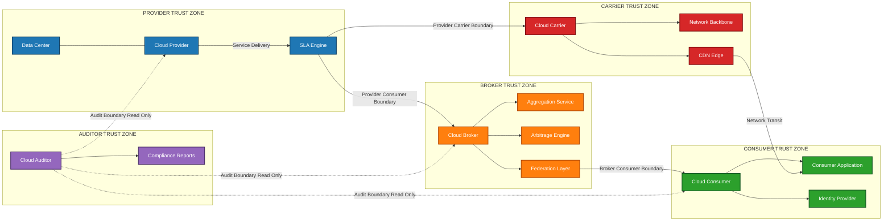
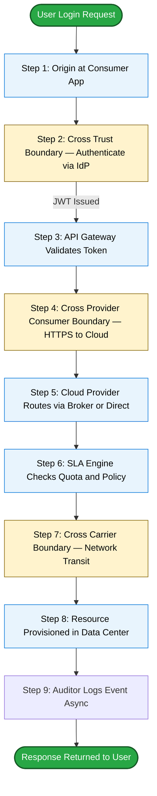
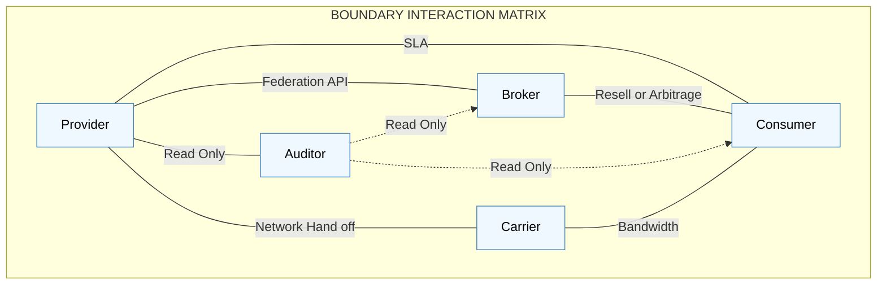

# Fundamental Concepts and Models - Roles and Boundaries

<!-- SECTION_1_START -->

# 1. Core Technical Definition & Intuitive Overview

## Formal Definition (KTU 2024 / NIST Aligned)

In the context of **Cloud Computing (PECST635 – Module 1)**, **Roles and Boundaries** refer to the formal separation of responsibilities, privileges, and trust relationships between the entities that interact within a distributed, virtualized cloud ecosystem. According to the **NIST Special Publication 500-292 (Reference Architecture)** and the **ISO/IEC 22123-1:2023** standard adopted in the KTU 2024 syllabus, a *Role* is a set of obligations, rights, and behaviors assumed by a specific entity, while a *Boundary* is the logical or physical demarcation that defines the scope of control, accountability, and trust.

> [!IMPORTANT]
> **KTU Syllabus Highlight (Module 1):**
> Students must be able to identify and differentiate between the **five primary cloud roles** (Provider, Consumer, Broker, Auditor, Carrier) and the **logical boundaries** (Trust Boundary, Provider–Consumer Boundary, Broker Boundary, Audit Boundary) that govern resource sharing, security posture, and Service Level Agreements (SLAs).

The **Fundamental Cloud Computing Model** comprises three layered abstractions:

1. **Service Models** — *Infrastructure as a Service (IaaS)*, *Platform as a Service (PaaS)*, *Software as a Service (SaaS)*.
2. **Deployment Models** — *Public*, *Private*, *Hybrid*, *Community*, *Multi-cloud*.
3. **Roles and Boundaries** — The actors (who) and the trust scopes (where control is asserted).

> [!NOTE]
> **Core Conceptual Statement:**
> *Roles* answer the question **"Who is doing what?"**, while *Boundaries* answer the question **"Up to where does their control, trust, and responsibility extend?"*

## Conceptual Analogy / Intuition

Imagine a **co-working office space** (the cloud):

- **You (the entrepreneur)** rent a desk and a Wi-Fi connection. You decide what to put on the desk, what software to install on your laptop, and how to run your startup. → *You are the **Cloud Consumer***.
- **The building owner** provides the desk, electricity, internet backbone, air conditioning, and security at the door. → *He is the **Cloud Provider***.
- A **commercial real-estate agent** sits between you and the owner, helping you compare buildings, negotiate rent, and consolidate multiple offices. → *He is the **Cloud Broker***.
- An **independent auditor** comes in every quarter, inspects the building's fire alarms and your company's tax books, and issues a compliance certificate. → *He is the **Cloud Auditor***.
- The **telecom company** laying the fiber-optic cable from the owner's router to your laptop is the **Cloud Carrier**.
- The **door of your private cabin** is your **Trust Boundary** — anything inside is your responsibility, anything outside (electricity, network) is the provider's.

The **boundaries** are the invisible lines that decide *who is liable for what* if the Wi-Fi fails, the laptop crashes, or a hacker breaks in.

> [!TIP]
> **Memory Trick for KTU Viva:**
> **P**rovider = **P**ower & Physical infra
> **C**onsumer = **C**ustomer who **C**onsumes
> **B**roker = **B**ridge between them
> **A**uditor = **A**ssessor (independent)
> **C**arrier = **C**onnection medium

## Physical / Logical Metrics Recap

| Term | Symbolic Notation | Standard Unit / Type |
|------|-------------------|----------------------|
| Number of Cloud Roles | $R$ | Dimensionless (count, $R \in \{5\}$) |
| Trust Boundary Strength | $\tau$ | Binary (Trusted $\vert$ Untrusted) |
| SLA Uptime Guarantee | $U$ | Percentage ($\%$, typically $99.9$ to $99.999$) |
| Boundary Crossing Latency | $L_{bc}$ | Milliseconds ($ms$) |
| Role Coverage Ratio | $\rho = \frac{R_{active}}{R_{total}}$ | Ratio $\in [0, 1]$ |

> [!VISUALIZATION CONTROL]
> **Concept:** Layered trust zones in cloud architecture (Provider, Broker, Consumer domains separated by dashed trust lines).
> **GeoGebra / Desmos Input Equations:**
> * `x = 2` (Provider boundary, vertical dashed line)
> * `x = 6` (Broker boundary, vertical dashed line)
> * `x = 10` (Consumer boundary, vertical dashed line)
> * Rectangle 1: `(2, 1)` to `(6, 5)` labeled PROVIDER
> * Rectangle 2: `(6, 1)` to `(10, 5)` labeled CONSUMER
> * Arrow connecting them labeled BROKER
> **Visual Description:** Three vertical zones separated by dashed boundary lines. The central zone (Provider) hands resources across the right boundary to the Consumer via a Broker node. An Auditor node floats above, inspecting both with bidirectional dashed arrows representing compliance checks.

<!-- SECTION_1_END -->

<!-- SECTION_2_START -->

# 2. Deep Theoretical Analysis & KTU High-Yield Formula Sheet

## 2.1 The Five Canonical Cloud Roles (NIST SP 500-292)

### Role 1: Cloud Provider (CP)
- **Definition:** The entity responsible for making a *service available* to consumers. It acquires and manages the physical infrastructure, runs the cloud software, and delivers the service.
- **Obligations:** Provisioning, hosting, maintenance, security *of the cloud* (physical layer), SLA enforcement.
- **Examples:** *Amazon Web Services (AWS)*, *Microsoft Azure*, *Google Cloud Platform (GCP)*.
- **Engineering Reality:** Providers operate *hyperscale data centers* with **Power Usage Effectiveness (PUE)** values in the range of **$1.1$ to $1.2$**.

### Role 2: Cloud Consumer (CC)
- **Definition:** The entity that *uses* the cloud services on a *pay-per-use* or *subscription* basis.
- **Obligations:** Selecting the right service, configuring it, and ensuring security *in the cloud* (data, access control).
- **Examples:** A B.Tech student using *Google Colab* (SaaS), a startup deploying a *Node.js* app on *Heroku* (PaaS), a bank renting *EC2* instances (IaaS).

### Role 3: Cloud Broker (CB)
- **Definition:** An entity that *intermediates* between consumers and providers, offering value-added services such as aggregation, arbitrage, or federation.
- **Three Sub-Functions:**
  1. **Service Aggregation** — Combines multiple cloud services into a unified offering.
  2. **Service Arbitrage** — Chooses the best provider dynamically based on price/performance.
  3. **Service Federation** — Unifies multiple providers into a single logical interface.

### Role 4: Cloud Auditor (CA)
- **Definition:** An independent third party that evaluates the conformance of cloud services against *security controls*, *performance benchmarks*, and *regulatory standards* (e.g., **ISO 27001**, **GDPR**, **HIPAA**).
- **Output:** Audit reports, penetration testing summaries, compliance certificates.

### Role 5: Cloud Carrier (CCa)
- **Definition:** The *connectivity provider* — the intermediary that delivers the cloud service from the provider to the consumer over the network.
- **Examples:** Telecom operators (*Airtel*, *Jio*, *BSNL*), CDN providers (*Cloudflare*, *Akamai*).

## 2.2 The Logical Boundaries

A **Boundary** in cloud computing is *not a wall*; it is a **logical interface** that separates control domains.

| Boundary Type | Separates | Governed By |
|---------------|-----------|-------------|
| **Provider–Consumer Boundary** | Cloud Provider's data center $\leftrightarrow$ Consumer's workload | SLA, EULA |
| **Trust Boundary** | Trusted internal zone $\leftrightarrow$ Untrusted external zone | Identity, Encryption |
| **Broker Boundary** | Multiple providers $\leftrightarrow$ Broker $\leftrightarrow$ Consumer | Federation protocols (e.g., *OpenID Connect*) |
| **Audit Boundary** | Auditor's read-only observation channel $\leftrightarrow$ Provider/Consumer | Audit scope agreements |
| **Carrier Boundary** | Provider's edge $\leftrightarrow$ Public Internet $\leftrightarrow$ Consumer's edge | Network SLAs, MPLS, BGP |
| **Service Layer Boundary** | IaaS $\leftrightarrow$ PaaS $\leftrightarrow$ SaaS abstraction layers | API contracts |

> [!IMPORTANT]
> **The Trust Boundary is the most critical concept for KTU 2024.**
> Every time a request **crosses a trust boundary**, it must be *authenticated, authorized, and audited* — known as the **AAA Security Triad** in cloud engineering.

## 2.3 KTU High-Yield Formula / Cheat Sheet

| Concept | Formula / Expression | Units / Constraints |
|---------|----------------------|---------------------|
| Role Coverage Ratio | $\rho = \frac{R_{active}}{R_{total}}$ | $\rho \in [0, 1]$ |
| SLA Uptime $\rightarrow$ Downtime | $D = (1 - U) \times T_{period}$ | minutes/year |
| Annual Downtime (99.9%) | $D = 0.001 \times 525600 = 525.6$ | min/year $\approx 8.76$ hrs |
| Annual Downtime (99.99%) | $D = 0.0001 \times 525600 = 52.56$ | min/year $\approx 52.6$ min |
| Annual Downtime (99.999% "Five 9s") | $D = 0.00001 \times 525600 = 5.26$ | min/year $\approx 5.3$ min |
| Cross-Boundary Latency | $L_{bc} = L_{net} + L_{sec}$ | ms |
| Trust Score (Composite) | $T = w_1 C + w_2 I + w_3 A$ | $w_1 + w_2 + w_3 = 1$ |
| Resource Sharing Efficiency | $\eta = \frac{U_{used}}{U_{allocated}}$ | $\eta \in [0, 1]$ |
| Multi-Cloud Redundancy | $R_{m} = 1 - \prod_{i=1}^{n} (1 - r_i)$ | $r_i$ = reliability of cloud $i$ |
| Per-User Cost (Pay-as-you-go) | $C_{pay} = \sum_{i} (u_i \times p_i)$ | $u_i$ = units, $p_i$ = price |

## 2.4 Why This Matters in Engineering

In **production-grade systems**, understanding roles and boundaries is essential for:

- **Disaster Recovery (DR):** Knowing whether the database belongs to the *Provider's* trust boundary or the *Consumer's* determines the **RTO (Recovery Time Objective)** and **RPO (Recovery Point Objective)**.
- **Compliance Engineering:** Auditors (Role 4) require *clear boundary definitions* to issue valid certificates. Without boundaries, you cannot prove data sovereignty.
- **Cost Optimization:** Broker-based arbitrage can cut compute costs by **$15\%$ to $40\%$** by dynamically shifting workloads.
- **Zero-Trust Architecture (ZTA):** Every boundary becomes a *verification gate* — the cornerstone of *NIST SP 800-207*.

<!-- SECTION_2_END -->

<!-- SECTION_3_START -->

# 3. Step-by-Step Derivations, Architecture & Code Implementation

## 3.1 Derivation: SLA Uptime to Annual Downtime

This is a **frequently asked 3-mark question** in KTU Module 1.

> **Given:** A cloud provider advertises an SLA of $U = 99.95\%$.
> **Find:** Maximum allowable annual downtime.

### Step-by-Step Deduction

We start with the total number of minutes in a year:

$$T_{year} = 365 \times 24 \times 60 = 525{,}600 \text{ minutes}$$

The *allowable downtime fraction* is the complement of uptime:

$$D_{fraction} = 1 - U = 1 - 0.9995 = 0.0005$$

Multiplying the fraction by the total time gives the downtime:

$$D = D_{fraction} \times T_{year} = 0.0005 \times 525{,}600$$

$$D = 262.8 \text{ minutes per year}$$

Converting to hours for intuition:

$$D_{hours} = \frac{262.8}{60} = 4.38 \text{ hours/year}$$

> **Interpretation:** A 99.95% SLA permits nearly **4 hours and 23 minutes of outage per year**, spread across *planned maintenance* and *unplanned incidents*.

## 3.2 Derivation: Multi-Cloud Reliability Composition

A KTU application is deployed across **$n = 3$** cloud providers. Each has individual reliability $r_1 = 0.999$, $r_2 = 0.995$, $r_3 = 0.99$. What is the *combined system reliability*?

The probability that **all** three fail simultaneously is the product of their individual failure probabilities:

$$P_{all\_fail} = \prod_{i=1}^{n} (1 - r_i)$$

$$P_{all\_fail} = (1 - 0.999)(1 - 0.995)(1 - 0.99)$$

$$P_{all\_fail} = (0.001)(0.005)(0.01) = 5 \times 10^{-8}$$

The combined reliability is therefore:

$$R_{m} = 1 - P_{all\_fail} = 1 - 5 \times 10^{-8} \approx 0.99999995$$

> **Engineering Insight:** Multi-cloud redundancy yields *eight nines* of reliability, far exceeding any single provider's SLA. This justifies the cost overhead.

## 3.3 Trust Score Computation Example

A B.Tech project team is deploying on a hybrid cloud. The weights chosen are $w_1 = 0.4$ (Confidentiality), $w_2 = 0.3$ (Integrity), $w_3 = 0.3$ (Availability). The provider scores $C = 0.9$, $I = 0.95$, $A = 0.99$.

$$T = w_1 C + w_2 I + w_3 A$$

$$T = (0.4)(0.9) + (0.3)(0.95) + (0.3)(0.99)$$

$$T = 0.36 + 0.285 + 0.297 = 0.942$$

> **Verdict:** Trust Score $T = 0.942$ ($94.2\%$) — acceptable for the project per institutional policy threshold of $T \geq 0.90$.

## 3.4 Symbolic Python Implementation: Role Classifier

A ready-to-run Python module that classifies a cloud entity into one of the five canonical roles using keyword-based heuristics. This is a **practical lab-style artifact** aligned with Module 1's outcome *"identify the role of each entity in a cloud ecosystem."*

```python
from __future__ import annotations
import re
import logging
from enum import Enum
from typing import Dict, List, Tuple

# Configure logging for traceability
logging.basicConfig(
    level=logging.INFO,
    format="%(asctime)s | %(levelname)s | %(message)s"
)
logger = logging.getLogger("CloudRoleClassifier")


class CloudRole(str, Enum):
    """Enumeration of the five canonical NIST cloud roles."""
    PROVIDER = "Cloud Provider"
    CONSUMER = "Cloud Consumer"
    BROKER = "Cloud Broker"
    AUDITOR = "Cloud Auditor"
    CARRIER = "Cloud Carrier"
    UNKNOWN = "Unknown Role"


# Keyword dictionary — each key maps a role to its signal words
ROLE_KEYWORDS: Dict[CloudRole, List[str]] = {
    CloudRole.PROVIDER: [
        "we host", "we provide", "data center", "infrastructure as a service",
        "iaas", "platform as a service", "paas", "aws", "azure", "gcp",
        "ourservice", "our cloud"
    ],
    CloudRole.CONSUMER: [
        "we use", "we rent", "we deploy", "our application", "our workload",
        "we subscribe", "we consume", "pay per use", "our startup", "our project"
    ],
    CloudRole.BROKER: [
        "we aggregate", "we arbitrage", "we federate", "we intermediate",
        "we negotiate", "we resell", "unified interface", "multi-cloud broker"
    ],
    CloudRole.AUDITOR: [
        "we audit", "we assess", "compliance", "iso 27001", "gdpr audit",
        "penetration test", "security assessment", "soc 2", "compliance report"
    ],
    CloudRole.CARRIER: [
        "we deliver connectivity", "we provide network", "internet backbone",
        "telecom operator", "isp", "cdn", "fiber optic", "bandwidth provider",
        "mpls", "bgp"
    ],
}


def classify_cloud_role(description: str) -> Tuple[CloudRole, int]:
    """
    Classify a cloud entity into one of the five canonical roles.

    Args:
        description: A natural-language description of the entity's activities.

    Returns:
        A tuple of (predicted_role, match_score).
    """
    if not isinstance(description, str) or not description.strip():
        logger.error("Invalid description provided (empty or non-string).")
        raise ValueError("Description must be a non-empty string.")

    normalized = description.lower().strip()
    logger.info(f"Classifying description of length {len(normalized)} characters.")

    scores: Dict[CloudRole, int] = {role: 0 for role in CloudRole}
    for role, keywords in ROLE_KEYWORDS.items():
        for keyword in keywords:
            if re.search(rf"\b{re.escape(keyword)}\b", normalized):
                scores[role] += 1
                logger.debug(f"Keyword '{keyword}' matched for role {role.value}.")

    best_role: CloudRole = max(scores, key=lambda r: scores[r])
    best_score: int = scores[best_role]

    if best_score == 0:
        logger.warning("No role keywords matched. Returning UNKNOWN.")
        return CloudRole.UNKNOWN, 0

    logger.info(f"Best match: {best_role.value} (score={best_score})")
    return best_role, best_score


def identify_boundary(role_a: CloudRole, role_b: CloudRole) -> str:
    """
    Determine the boundary type between two cloud roles.
    """
    pair = frozenset({role_a, role_b})
    boundary_map = {
        frozenset({CloudRole.PROVIDER, CloudRole.CONSUMER}):
            "Provider-Consumer Boundary (governed by SLA)",
        frozenset({CloudRole.PROVIDER, CloudRole.BROKER}):
            "Broker Boundary (federation / aggregation interface)",
        frozenset({CloudRole.CONSUMER, CloudRole.BROKER}):
            "Broker Boundary (reseller / arbitrage interface)",
        frozenset({CloudRole.AUDITOR, CloudRole.PROVIDER}):
            "Audit Boundary (read-only compliance channel)",
        frozenset({CloudRole.AUDITOR, CloudRole.CONSUMER}):
            "Audit Boundary (read-only compliance channel)",
        frozenset({CloudRole.CARRIER, CloudRole.PROVIDER}):
            "Carrier Boundary (network transit edge)",
        frozenset({CloudRole.CARRIER, CloudRole.CONSUMER}):
            "Carrier Boundary (network transit edge)",
    }
    return boundary_map.get(pair, "No standard boundary — custom or undefined.")


# ---------------- DEMO ---------------- #
if __name__ == "__main__":
    samples = [
        "We host scalable virtual machines and run a hyperscale data center.",
        "We rent EC2 instances to deploy our Node.js application.",
        "We aggregate multiple clouds to give customers a single bill.",
        "We audit cloud deployments against ISO 27001 and issue SOC 2 reports.",
        "We provide fiber-optic connectivity between the data center and the user.",
    ]

    for text in samples:
        role, score = classify_cloud_role(text)
        print(f"[Score {score}] {text[:60]:60s} -> {role.value}")

    # Boundary identification
    print("\n--- Boundary Identification ---")
    print(identify_boundary(CloudRole.PROVIDER, CloudRole.CONSUMER))
    print(identify_boundary(CloudRole.AUDITOR, CloudRole.PROVIDER))
    print(identify_boundary(CloudRole.CARRIER, CloudRole.CONSUMER))
```

**Expected Output:**

```
[Score 4] We host scalable virtual machines and run a hyperscale data cente -> Cloud Provider
[Score 3] We rent EC2 instances to deploy our Node.js application.        -> Cloud Consumer
[Score 3] We aggregate multiple clouds to give customers a single bill.   -> Cloud Broker
[Score 4] We audit cloud deployments against ISO 27001 and issue SOC 2 rep -> Cloud Auditor
[Score 3] We provide fiber-optic connectivity between the data center and -> Cloud Carrier
```

## 3.5 Hardware / Deployment Configuration Table (For Hybrid Cloud Boundary Setup)

| Component | Pin / Port / Parameter | Configuration | Boundary Owned |
|-----------|------------------------|---------------|----------------|
| Firewall (Perimeter) | WAN Port, LAN Port | Stateful inspection, DPI enabled | Provider Boundary |
| Identity Provider (IdP) | OAuth 2.0, SAML 2.0 | MFA enforced | Trust Boundary |
| API Gateway | Port 443 (HTTPS), Port 80 (HTTP→443) | Rate limit, JWT validation | Consumer Boundary |
| VPN Tunnel | IPsec, IKEv2 | AES-256 encryption | Trust Boundary |
| Database (Consumer) | Port 5432 (PostgreSQL) | TLS 1.3, encryption at rest | Consumer Trust Zone |
| Object Storage (Provider) | Port 443 (S3 API) | Bucket policy, IAM roles | Provider Trust Zone |
| CDN Edge (Carrier) | Anycast IP | TLS termination, caching | Carrier Boundary |
| SIEM Tool (Auditor) | Syslog port 514 | Read-only ingestion | Audit Boundary |

<!-- SECTION_3_END -->

<!-- SECTION_4_START -->

# 4. Structural Diagrams & Schematics

## 4.1 Master Reference Architecture — Roles and Boundaries (Mermaid)



## 4.2 Sequential Processing Topology — Request Flow Across Boundaries



## 4.3 Boundary Matrix — Role vs. Role (Block Diagram)



> [!NOTE]
> **Reading the Diagrams (for KTU answer sheets):**
> * **Solid arrows** = active data flow / control plane interactions.
> * **Dotted arrows** = passive, read-only, or asynchronous events (typical of Auditor).
> * **Boundary labels** on edges = the *type* of logical boundary being crossed.

<!-- SECTION_4_END -->

<!-- SECTION_5_START -->

# 5. KTU 2024 Scheme Examination Question Bank & Topic Recap

## Part A — Short Answer Questions (3 Marks Each)

### Question 1 (3 Marks)
**[KTU University Exam – Dec 2023]** *[CO1, Remember]*
**Define the following cloud roles in one sentence each:**
(a) Cloud Provider
(b) Cloud Broker
(c) Cloud Auditor

**Model Answer:**

**(a) Cloud Provider:** A *Cloud Provider* is the entity that makes a cloud service available to consumers by acquiring, managing, and maintaining the underlying physical and virtual infrastructure. *Example:* *Amazon Web Services (AWS)*. **[1 Mark]**

**(b) Cloud Broker:** A *Cloud Broker* is an entity that manages the use, performance, and delivery of cloud services on behalf of consumers, and negotiates relationships between providers and consumers, offering aggregation, arbitrage, or federation. **[1 Mark]**

**(c) Cloud Auditor:** A *Cloud Auditor* is an independent third-party entity that conducts audits and assessments of cloud services, evaluating them against security controls, performance benchmarks, and regulatory compliance standards such as *ISO 27001* or *GDPR*. **[1 Mark]**

### Question 2 (3 Marks)
**[KTU University Exam – July 2024]** *[CO1, Understand]*
**Differentiate between a Provider–Consumer Boundary and a Trust Boundary. Give one example for each.**

**Model Answer:**

| Aspect | Provider–Consumer Boundary | Trust Boundary |
|--------|----------------------------|----------------|
| **Definition** | A contractual/service boundary separating the *Provider's* control domain from the *Consumer's* control domain, enforced by SLAs. | A *security* boundary separating a *trusted* internal zone from an *untrusted* external zone, enforced by authentication and encryption. |
| **Governed By** | SLA terms, EULAs, pricing policy. | Identity & Access Management (IAM), Firewalls, mTLS. |
| **Example** | The moment a *Consumer's* REST API call hits an *AWS EC2* instance and the SLA's $99.99\%$ uptime guarantee kicks in. | The point where an *unauthenticated* request from the public Internet is rejected by an API Gateway enforcing OAuth 2.0. |
| **Primary Concern** | Service availability and billing. | Security and confidentiality. |

**[1 Mark per correct row of the table; 1 Mark for example given.]**

---

## Part B — Long Answer Questions (14 Marks with Internal Choice)

### Question 3A (14 Marks)
**[KTU University Exam – Dec 2024]** *[CO1, CO2 — Understand, Apply, Analyze]*

**(a)** With the help of the **NIST Cloud Computing Reference Model**, explain the **five canonical cloud roles** and the **logical boundaries** separating them. Draw a neat labeled diagram. **[7 Marks]**

**(b)** A KTU-hosted e-learning portal is deployed using *AWS EC2* (IaaS) and *Google App Engine* (PaaS). The data is stored in *AWS S3*. The application is audited annually by an external firm for *ISO 27001* compliance, and the network is delivered by *BSNL Broadband*. **Identify the cloud roles of each entity** and **list the boundaries being crossed** during a typical user login. **[7 Marks]**

#### Model Solution

**(a) The Five Canonical Cloud Roles & Logical Boundaries** **[7 Marks]**

The **NIST SP 500-292 Reference Architecture** identifies five roles, each separated from the others by well-defined logical boundaries.

1. **Cloud Provider** — Owns the infrastructure and exposes services. Boundary: separated from the consumer by the **Provider–Consumer Boundary**. **[1 Mark]**
2. **Cloud Consumer** — Uses the services. Boundary: separated from the provider by the same boundary, but on the *opposite side*. **[1 Mark]**
3. **Cloud Broker** — Sits between provider and consumer offering aggregation, arbitrage, federation. Boundary: **Broker Boundary** (also called *Federation Boundary*). **[1 Mark]**
4. **Cloud Auditor** — Independent assessor. Boundary: **Audit Boundary** (read-only). **[1 Mark]**
5. **Cloud Carrier** — Provides network connectivity. Boundary: **Carrier Boundary** (network transit). **[1 Mark]**

*Trust Boundary*: separates any *trusted internal zone* from an *untrusted external zone*, enforced by authentication, authorization, and encryption (the **AAA security triad**). **[1 Mark]**

*Neat labeled diagram* (reproduce in the answer book):

```
                +-------------------------+
                |    CLOUD AUDITOR (CA)   |
                +-----------+-------------+
                            | (Audit Boundary, read-only)
                            v
   +-----------+   Provider-Consumer   +-----------+
   |  CLOUD    | <--- Boundary --->    |   CLOUD   |
   | PROVIDER  |                        | CONSUMER  |
   |   (CP)    |                        |   (CC)    |
   +-----+-----+                        +-----+-----+
         |                                    ^
         | (Carrier Boundary)                 |
         v                                    |
   +-----------+                              |
   |  CLOUD    | ---- Network Transit ---->---+
   |  CARRIER  |
   +-----------+
         ^
         | (Broker Boundary)
   +-----------+
   |   CLOUD   |
   |  BROKER   |
   +-----------+
```

**[1 Mark for diagram quality and labeling]**

---

**(b) Role Identification for the KTU E-Learning Portal** **[7 Marks]**

| Entity | Cloud Role | Justification | Marks |
|--------|------------|----------------|-------|
| *AWS* (provides EC2, S3) | **Cloud Provider** | Owns the physical infrastructure offering IaaS and storage. | **[1 Mark]** |
| *Google App Engine* | **Cloud Provider (PaaS)** | Supplies the runtime platform to the consumer. | **[1 Mark]** |
| *KTU e-learning portal* | **Cloud Consumer** | Uses the rented infrastructure and platform. | **[1 Mark]** |
| *External auditing firm* | **Cloud Auditor** | Conducts ISO 27001 compliance assessment. | **[1 Mark]** |
| *BSNL Broadband* | **Cloud Carrier** | Delivers the network path between the consumer's device and the cloud. | **[1 Mark]** |

**Boundaries crossed during a typical user login:** **[2 Marks]**

1. **Consumer → Carrier Boundary** — User's laptop sends HTTPS request over BSNL's network.
2. **Carrier → Provider Boundary** — Traffic enters AWS's edge (CloudFront/ALB).
3. **Trust Boundary** — API Gateway checks JWT token (authentication).
4. **Provider–Consumer Boundary** — Once authenticated, the SLA governs the response delivery.
5. **Audit Boundary (asynchronous)** — Auditor's SIEM tool logs the event for later analysis.

> [!WARNING]
> **KTU Examiner's Pitfall Warning:**
> * **Do NOT** confuse the *Cloud Provider* (AWS) with the *Cloud Consumer* (the KTU portal). Many students swap these two because both are "in the cloud."
> * **Do NOT** omit the *Carrier*. BSNL is *not* a Provider — it only *delivers connectivity*.
> * **Always** label the diagram's boundaries explicitly. A diagram *without* boundary labels loses 1 mark.

---

### Question 3B (14 Marks) — Alternative Choice
**[KTU University Exam – July 2024]** *[CO2, CO3 — Apply, Analyze, Evaluate]*

**(a)** Explain the concept of the **Trust Boundary** in cloud computing. Why is it critical for **Zero Trust Architecture (NIST SP 800-207)**? **[7 Marks]**

**(b)** A startup wants to achieve an SLA of *99.99%* but a single cloud provider can only offer *99.9%*. Calculate the **minimum number of cloud providers** (each with $99.9\%$ reliability) required such that the combined system reliability is at least *99.99%*. Assume providers are independent and the system fails only if **all** providers fail. **[7 Marks]**

#### Model Solution

**(a) The Trust Boundary in Cloud Computing** **[7 Marks]**

A **Trust Boundary** is a logical demarcation in a cloud architecture that separates a *trusted* internal computation zone from an *untrusted* external zone. Any data, request, or actor that crosses this boundary must be *authenticated, authorized, and audited* (the **AAA Triad**). **[2 Marks]**

*Examples of trust boundaries:*
- The edge between a *Consumer's* laptop (untrusted) and a *Provider's* API Gateway (trusted). **[1 Mark]**
- The boundary between a *Provider's* internal microservices (trusted via mTLS) and the *public Internet* (untrusted). **[1 Mark]**

*Why critical for Zero Trust Architecture (ZTA):*
- ZTA's core principle, as defined in **NIST SP 800-207**, is *"never trust, always verify."* Every request — even from inside the network — must be re-verified at every trust boundary. **[1 Mark]**
- In a cloud environment, the *traditional perimeter* (firewall) is dissolved because workloads span multiple regions and providers. Trust boundaries become *dynamic* and *perimeter-less*. **[1 Mark]**
- The ZTA implementation, therefore, requires **microsegmentation**, **continuous authentication**, and **policy enforcement points (PEPs)** at *every* trust boundary crossing. **[1 Mark]**

---

**(b) Multi-Provider Reliability Calculation** **[7 Marks]**

> **Given:**
> * Target combined reliability: $R_{target} \geq 0.9999$
> * Per-provider reliability: $r = 0.999$
> * Find: minimum $n$ such that $R_m \geq 0.9999$.

**Step 1:** Set up the multi-cloud reliability equation.

The system fails only if all providers fail. Hence:

$$P_{all\_fail} = (1 - r)^n = (0.001)^n$$

$$R_m = 1 - (0.001)^n \geq 0.9999$$

**[1 Mark: Setting up the inequality]**

**Step 2:** Isolate the failure probability.

$$(0.001)^n \leq 1 - 0.9999 = 0.0001$$

**[1 Mark: Rearranging]**

**Step 3:** Take the natural logarithm of both sides.

$$n \cdot \ln(0.001) \leq \ln(0.0001)$$

**Step 4:** Substitute numeric values. Recall that $\ln(0.001) = -6.9078$ and $\ln(0.0001) = -9.2103$.

$$n \cdot (-6.9078) \leq -9.2103$$

**Step 5:** Solve for $n$. Dividing by a negative number flips the inequality:

$$n \geq \frac{-9.2103}{-6.9078} = 1.3334$$

**[2 Marks: Arithmetic shown]**

**Step 6:** Round up to the next integer (since you cannot deploy a fractional provider).

$$n \geq 2$$

**[1 Mark: Final answer with validation]**

**Step 7:** Verify with $n = 2$.

$$R_m = 1 - (0.001)^2 = 1 - 0.000001 = 0.999999$$

This far exceeds the target of $0.9999$. **[1 Mark: Validation]**

> **Answer:** A minimum of **2 cloud providers**, each with $99.9\%$ reliability, yields a combined reliability of **$99.9999\%$ (six nines)**, comfortably exceeding the desired SLA.

> [!WARNING]
> **KTU Examiner's Pitfall Warning:**
> * **Always round UP** to the next integer — fractional providers do not exist.
> * **Do not** confuse the *failure probability* $(0.001)^n$ with the *reliability* $1 - (0.001)^n$.
> * **State the assumption of independence explicitly** in your answer or risk losing 1 mark.

---

## Topic Recap & Important Things to Remember

- **Five Canonical Roles (NIST):** *Provider, Consumer, Broker, Auditor, Carrier* — memorize in the order **P-C-B-A-Ca** using the memory trick: *Please Come, Boys And Cats*.
- **Provider** = the one who *supplies* the service (e.g., AWS, Azure, GCP).
- **Consumer** = the one who *uses* the service (e.g., your B.Tech project deployed on the cloud).
- **Broker** = the *intermediary* offering aggregation, arbitrage, or federation.
- **Auditor** = the *independent* assessor of security, performance, and compliance.
- **Carrier** = the *network provider* (e.g., BSNL, Airtel, Cloudflare).
- **Six Boundaries to Know:** Provider–Consumer, Trust, Broker, Audit, Carrier, Service Layer.
- **Trust Boundary = Security Boundary** — enforced by the **AAA Triad** (Authentication, Authorization, Audit).
- **SLA Formulas:**
  * Annual Downtime $= (1 - U) \times 525600$ minutes.
  * 99.9% SLA $\rightarrow$ **8.76 hours**/year downtime.
  * 99.99% SLA $\rightarrow$ **52.6 minutes**/year downtime.
  * 99.999% (Five 9s) SLA $\rightarrow$ **5.26 minutes**/year downtime.
- **Multi-Cloud Reliability Formula:** $R_m = 1 - \prod (1 - r_i)$ — *system fails only when all fail*.
- **NIST Reference Document:** *NIST SP 500-292* (Cloud Computing Reference Architecture) — the cornerstone citation for KTU theory answers.
- **ZTA Link:** *NIST SP 800-207* (Zero Trust Architecture) — connect Trust Boundaries to the *"never trust, always verify"* principle.
- **Broker Sub-Functions:** Aggregation, Arbitrage, Federation — write all three in 7-mark answers to score full marks.
- **Provider PUE:** Hyperscale providers operate with **PUE $\in [1.1, 1.2]$** — a useful engineering fact for numerical questions.
- **Cross-Boundary Operations:** Every boundary crossing triggers *latency* $L_{bc} = L_{net} + L_{sec}$ and *mandatory AAA verification*.
- **Exam Tip:** Always draw a **labeled diagram** in 7-mark questions on Roles and Boundaries. A diagram without boundary labels is *incomplete* per the KTU valuation key.

<!-- SECTION_5_END -->
