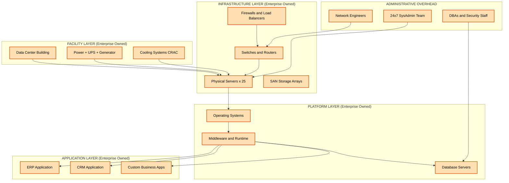
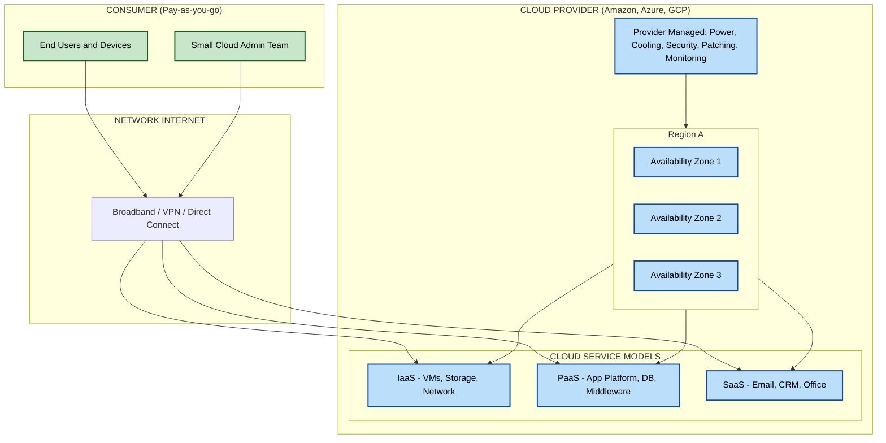
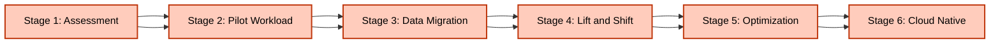

# Introduction - Limitations of Traditional Computing & solution

<!-- SECTION_1_START -->

# 1. Core Technical Definition & Intuitive Overview

## 1.1 Traditional Computing (On-Premise Computing)

**Traditional Computing** (also called *On-Premise Computing* or *Legacy IT Infrastructure*) is the classical model of computing where an organization owns, operates, and maintains its own physical hardware, software, networking equipment, and data center facilities on-site to run its business applications and store data.

> [!NOTE]
> **KTU 2024 Syllabus Definition:** Traditional computing refers to the deployment model where computing resources (servers, storage, networking) are procured, installed, configured, and managed locally by the enterprise IT team. The organization bears full ownership, operational responsibility, and lifecycle management of the entire infrastructure stack.

The classical stack consists of the following layers, all physically located within the organization's premises:

| Layer | Components | Ownership |
|:---|:---|:---|
| **Application Layer** | ERP, CRM, Custom Business Apps | Enterprise |
| **Platform Layer** | OS, Middleware, Runtime, DBMS | Enterprise |
| **Infrastructure Layer** | Servers, Storage, Network Devices | Enterprise |
| **Facility Layer** | Data Center Building, Power, Cooling | Enterprise |

## 1.2 Cloud Computing (The Modern Solution)

**Cloud Computing** is a paradigm that enables ubiquitous, convenient, on-demand network access to a shared pool of configurable computing resources (networks, servers, storage, applications, and services) that can be rapidly provisioned and released with minimal management effort or service provider interaction.

> [!IMPORTANT]
> **NIST SP 800-145 Definition (KTU Board Favourite):** Cloud computing is a model for enabling ubiquitous, convenient, on-demand network access to a shared pool of configurable computing resources that can be rapidly provisioned and released with minimal management effort or service provider interaction.

The **five essential characteristics** of Cloud Computing as per NIST are:

1. **On-demand self-service**
2. **Broad network access**
3. **Resource pooling**
4. **Rapid elasticity**
5. **Measured service**

## 1.3 Intuitive Analogies

### Analogy 1: Owning a Car vs. Using a Taxi/Rental Service

Imagine you need transportation every day for your business:

- **Traditional Computing = Owning a Personal Car**: You must buy the car (huge upfront cost), pay for insurance, fuel, maintenance, parking, and repairs. Even when you don't use it, the cost continues. If you suddenly need to transport 100 people, you cannot scale instantly.

- **Cloud Computing = Using a Taxi/Uber/Rental Service**: You pay only for the distance traveled (pay-as-you-go). Need 100 people? Just book 100 cabs. Don't need any? Pay nothing. The provider manages fuel, maintenance, and parking.

### Analogy 2: Generating Your Own Electricity vs. Power Grid

Before power grids, every factory had its own generator (expensive, unreliable, wasteful). Today, factories simply plug into the power grid and pay for the units consumed. **Cloud Computing applies the same model to IT resources.**

### Analogy 3: Physical Filing Cabinet vs. Google Drive

Storing business files in a locked physical cabinet requires you to buy the cabinet, secure the room, manage fire safety, and physically travel to access files. Google Drive stores them remotely, scales infinitely, backs them up automatically, and lets you access them from anywhere.

## 1.4 Physical Constants and Standard Metrics

> [!IMPORTANT]
> The following engineering metrics are central to evaluating traditional vs. cloud models:
>
> - **Capital Expenditure (CapEx)**: $\text{CapEx} = \sum_{i=1}^{n} \text{Cost}(H_i) + \text{Setup}_i$
> - **Operational Expenditure (OpEx)**: $\text{OpEx} = \text{Power} + \text{Cooling} + \text{Admin} + \text{Maintenance}$
> - **Server Utilization Rate**: $\eta = \frac{\text{Actual Workload}}{\text{Max Capacity}} \times 100\%$
> - **Industry Average Server Utilization in Traditional Data Centers**: $\mathbf{10\% - 20\%}$
> - **Moore's Law doubling period**: $\mathbf{18 - 24 \text{ months}}$
> - **Standard Data Center Power Usage Effectiveness (PUE)**: $\mathbf{1.2 - 1.5}$ (good), $> \mathbf{2.0}$ (inefficient)

> [!VISUALIZATION CONTROL]
> **Concept:** Server Utilization vs. Time Graph (Traditional vs. Cloud)
> **GeoGebra / Desmos Input Equations:**
> * Traditional (static provisioning): `f(x) = 0.15` (constant 15% utilization baseline with spikes to 0.8)
> * Peak load line: `y = 0.85`
> * Idle waste region: `0 <= y <= 0.15`
> **Visual Description:** The student should observe a horizontal line at 15% (baseline underutilized capacity) versus a cloud-provisioned dynamic curve that grows elastically with demand, minimizing the shaded "wasted capacity" area between the demand curve and the provisioned line.

<!-- SECTION_1_END -->

<!-- SECTION_2_START -->

# 2. Deep Theoretical Analysis & KTU High-Yield Formula Sheet

## 2.1 The Seven Major Limitations of Traditional Computing

### Limitation 1: High Upfront Capital Expenditure (CapEx)

Traditional computing demands massive initial investment before any business value is delivered. The organization must purchase:

- Physical servers (rack-mounted, blade, or tower)
- Storage area networks (SAN) and network attached storage (NAS)
- Networking gear (switches, routers, firewalls, load balancers)
- Uninterruptible Power Supplies (UPS), diesel generators
- Precision cooling systems (CRAC units)
- Physical data center space (real estate)
- Software licenses (OS, virtualization, database, middleware)

**The "Why" Problem:** Money is spent years before the infrastructure is fully utilized, leading to a negative Net Present Value (NPV) and locked-up working capital.

### Limitation 2: Underutilization of Resources

Industry studies (including the landmark McKinsey \& Microsoft reports) consistently show that traditional servers operate at only **10%–20%** of their total capacity on average. This is because:

- Provisioning is done for **peak load** to handle worst-case traffic
- Peak load occurs only **5%–10%** of the total operational time
- The remaining time, expensive hardware sits **idle**

### Limitation 3: Lack of Scalability and Elasticity

Traditional infrastructure has a **fixed capacity ceiling**. Scaling requires:

- Procurement approval (weeks to months)
- Hardware delivery (days to weeks)
- Physical installation and configuration
- Network reconfiguration
- Application redeployment

**The "Why" Problem:** Business demand is dynamic. By the time traditional infrastructure scales up, market opportunities may already be lost.

### Limitation 4: Disaster Recovery and Business Continuity Challenges

Traditional setups typically maintain a secondary "hot" or "cold" disaster recovery site, which:

- Doubles the infrastructure cost
- Often sits idle 99% of the time
- Requires complex data replication
- Has high Recovery Time Objective (RTO) and Recovery Point Objective (RPO)

### Limitation 5: High Maintenance and Administrative Overhead

A traditional data center requires:

- System administrators, network engineers, DBAs
- 24/7 monitoring staff
- Patch management cycles
- Hardware refresh cycles every **3–5 years**
- Security updates, audits, and compliance management

### Limitation 6: Geographic Limitations and Accessibility

Resources are tied to a physical location. Remote access is slow, requires VPNs, and is constrained by bandwidth. Global business operations suffer from latency and inconsistent user experience.

### Limitation 7: Inflexibility and Innovation Bottleneck

Procurement cycles, vendor lock-in, and capacity planning delays prevent rapid experimentation with new technologies (AI/ML, IoT, Big Data), stifling innovation.

## 2.2 The Cloud Computing Solution: Mapping Limitations to Solutions

| \# | Traditional Limitation | Cloud Computing Solution | Mechanism |
|:--:|:---|:---|:---|
| 1 | High CapEx | Pay-as-you-go OpEx model | No upfront hardware purchase |
| 2 | Underutilization (10–20%) | Multi-tenant resource pooling | Resources shared across thousands of users |
| 3 | Fixed capacity | Rapid elasticity \& auto-scaling | Spin up/down VMs in minutes |
| 4 | DR site cost duplication | Built-in redundancy across AZs/Regions | Provider manages replication |
| 5 | High admin overhead | Managed services (PaaS/SaaS) | Provider handles patching, monitoring |
| 6 | Geographic limitations | Global edge locations \& CDNs | Deploy in 30+ regions worldwide |
| 7 | Slow innovation | On-demand access to new tech | Instant access to AI/ML/Big Data services |

## 2.3 KTU Formula Sheet / Cheat Sheet

| \# | Formula / Concept | Expression | Engineering Meaning | Unit |
|:--:|:---|:---|:---|:---|
| 1 | Total Cost of Ownership (TCO) | $TCO = \text{CapEx} + \sum_{t=1}^{T} \frac{\text{OpEx}_t}{(1+r)^t}$ | Lifecycle cost of infrastructure | Currency |
| 2 | Server Utilization | $\eta = \frac{W_{\text{actual}}}{W_{\text{max}}} \times 100$ | Ratio of used vs. available capacity | Percent (\%) |
| 3 | Power Usage Effectiveness | $PUE = \frac{P_{\text{facility}}}{P_{\text{IT}}}$ | Data center energy efficiency | Dimensionless |
| 4 | Recovery Time Objective | $RTO = T_{\text{fail}} - T_{\text{recover}}$ | Max acceptable downtime | Seconds/Minutes |
| 5 | Recovery Point Objective | $RPO = T_{\text{last\_backup}} - T_{\text{fail}}$ | Max acceptable data loss | Seconds/Minutes |
| 6 | Break-Even Point (Cloud) | $BEP = \frac{\text{Fixed Migration Cost}}{\text{Traditional OpEx} - \text{Cloud OpEx}}$ | Months until cloud becomes cheaper | Months |
| 7 | Elasticity Ratio | $E_r = \frac{C_{\text{peak}} - C_{\text{base}}}{C_{\text{base}}}$ | Capacity expansion capability | Dimensionless |
| 8 | Moore's Law | $T_{\text{double}} \approx 18 \text{ months}$ | Hardware capability doubles | Months |
| 9 | Cloud Marginal Cost | $C_m = \frac{\Delta \text{Total Cost}}{\Delta \text{Resources}}$ | Cost of one extra unit of resource | Currency/Unit |
| 10 | Availability Tier (Nines) | $A = \frac{MTBF}{MTBF + MTTR}$ | Uptime percentage | Percent (\%) |

> [!IMPORTANT]
> **KTU Board Pattern Alert:** When the question asks to "compare limitations and solutions," examiners expect a **tabular mapping** of *each limitation* to its *corresponding cloud solution mechanism*. Always present at least 5 mapping rows.

## 2.4 Real-World Utility in Engineering

The transition from traditional to cloud computing is foundational to:

- **DevOps and CI/CD**: Auto-scaling build agents
- **AI/ML Engineering**: On-demand GPU clusters for training
- **IoT Systems**: Ingesting millions of sensor events per second
- **Big Data Analytics**: Elastic Hadoop/Spark clusters
- **Disaster Recovery as a Service (DRaaS)**
- **Edge Computing**: Distributing workloads to user proximity
- **Startups**: Launching globally in hours instead of months

<!-- SECTION_2_END -->

<!-- SECTION_3_START -->

# 3. Step-by-Step Derivations \& Code/Symbolic Implementation

## 3.1 Worked Numerical Example: Total Cost Comparison (Traditional vs. Cloud)

**Problem Statement:** A mid-sized e-commerce company needs 100 virtual servers (4 vCPU, 16 GB RAM each) for 3 years. Calculate the 3-year TCO for both models and determine the break-even point.

### Given Data

**Traditional On-Premise Model:**
- Server hardware cost: ₹4,50,000 per physical server (supports 4 VMs)
- Number of physical servers needed: $N_s = \lceil 100 / 4 \rceil = 25$
- Software licensing (Windows Server + SQL Std): ₹1,00,000 per server
- Annual power \& cooling: ₹80,000 per server
- Annual admin staff cost: ₹30,00,000 (3 FTE @ ₹10 LPA)
- Annual maintenance contract: 12\% of hardware cost
- Discount rate: $r = 8\%$

**Cloud Model (AWS-equivalent, e.g., EC2 m5.xlarge):**
- On-demand hourly rate: ₹8.50/hour
- 1-year reserved instance discount: 30\%
- Annual admin staff: ₹10,00,000 (1 FTE)
- Data transfer out: ₹2,00,000 per year

### Step-by-Step Traditional TCO Calculation

$$
\begin{aligned}
\text{Hardware CapEx} &= N_s \times (\text{Server cost} + \text{Software cost}) \\
&= 25 \times (450000 + 100000) \\
&= 25 \times 550000 \\
&= 1,37,50,000 \text{ INR}
\end{aligned}
$$

$$
\begin{aligned}
\text{Annual Maintenance} &= 0.12 \times 25 \times 450000 \\
&= 13,50,000 \text{ INR/year}
\end{aligned}
$$

$$
\begin{aligned}
\text{Annual Power \& Cooling} &= 25 \times 80000 \\
&= 20,00,000 \text{ INR/year}
\end{aligned}
$$

$$
\begin{aligned}
\text{Annual OpEx (Traditional)} &= \text{Maintenance} + \text{Power} + \text{Admin} \\
&= 13,50,000 + 20,00,000 + 30,00,000 \\
&= 63,50,000 \text{ INR/year}
\end{aligned}
$$

### Step-by-Step Cloud TCO Calculation

$$
\begin{aligned}
\text{Yearly VM hours} &= 100 \text{ VMs} \times 8760 \text{ hours} \\
&= 8,76,000 \text{ VM-hours}
\end{aligned}
$$

$$
\begin{aligned}
\text{Year 1 (On-demand)} &= 8,76,000 \times 8.50 \\
&= 74,46,000 \text{ INR}
\end{aligned}
$$

$$
\begin{aligned}
\text{Year 2 \& 3 (30\% Reserved)} &= 74,46,000 \times 0.7 + 2,00,000 \text{ (data transfer)} \\
&= 52,12,200 + 2,00,000 \\
&= 54,12,200 \text{ INR/year}
\end{aligned}
$$

### Break-Even Analysis

$$
\begin{aligned}
\text{Traditional 3-Year TCO} &= 1,37,50,000 + \sum_{t=1}^{3} \frac{63,50,000}{(1.08)^t} \\
&= 1,37,50,000 + 63,50,000 \times \frac{1 - (1.08)^{-3}}{0.08} \\
&= 1,37,50,000 + 63,50,000 \times 2.5771 \\
&= 1,37,50,000 + 1,63,64,635 \\
&= 3,01,14,635 \text{ INR}
\end{aligned}
$$

$$
\begin{aligned}
\text{Cloud 3-Year TCO} &= 74,46,000 + 54,12,200 \times 2 \\
&= 74,46,000 + 1,08,24,400 \\
&= 1,82,70,400 \text{ INR}
\end{aligned}
$$

$$
\begin{aligned}
\text{Savings with Cloud} &= 3,01,14,635 - 1,82,70,400 \\
&= 1,18,44,235 \text{ INR} \quad (\approx 39.3\% \text{ savings})
\end{aligned}
$$

> [!NOTE]
> **Interpretation:** The cloud model saves the organization **~₹1.18 Crore over 3 years**, equivalent to ~39\% cost reduction. The break-even point occurs in **Year 1 itself** since cloud Year 1 cost (₹74.46 L) is less than Traditional Year 1 OpEx alone (₹63.5 L + amortized CapEx). The CapEx is the dominant cost driver that the cloud model eliminates.

## 3.2 Python Code: Server Utilization Simulator

The following Python program simulates the underutilization problem in traditional data centers and demonstrates how cloud auto-scaling resolves it.

```python
"""
Server Utilization Simulator: Traditional vs. Cloud
Demonstrates the underutilization problem and elasticity solution.
"""

import logging
from dataclasses import dataclass
from typing import List, Tuple

# Configure logging for operational visibility
logging.basicConfig(
    level=logging.INFO,
    format="%(asctime)s | %(levelname)s | %(message)s"
)
logger = logging.getLogger(__name__)


@dataclass
class WorkloadSample:
    """Represents a single hour of workload demand."""
    hour: int
    demand_vms: int  # Number of VMs needed


def generate_realistic_workload(hours: int = 168) -> List[WorkloadSample]:
    """
    Generate a realistic weekly workload pattern.
    Business hours: high demand. Nights/weekends: low demand.
    """
    workload: List[WorkloadSample] = []
    for h in range(hours):
        day_of_week = (h // 24) % 7
        hour_of_day = h % 24
        # Weekday business hours (9 AM - 6 PM): peak load
        if day_of_week < 5 and 9 <= hour_of_day <= 18:
            demand = 100
        # Weekday evenings: medium load
        elif day_of_week < 5:
            demand = 40
        # Weekends: low load
        else:
            demand = 20
        workload.append(WorkloadSample(hour=h, demand_vms=demand))
    return workload


def traditional_provisioning(workload: List[WorkloadSample]) -> Tuple[int, float]:
    """
    Traditional model: provision for peak load once and keep it running.
    Returns (provisioned_capacity, utilization_percentage).
    """
    peak_demand: int = max(sample.demand_vms for sample in workload)
    provisioned: int = peak_demand  # Fixed at peak capacity
    total_used: int = sum(sample.demand_vms for sample in workload)
    total_available: int = provisioned * len(workload)
    utilization: float = (total_used / total_available) * 100.0
    logger.info(
        "Traditional: Provisioned=%d VMs, Avg Utilization=%.2f%%",
        provisioned, utilization
    )
    return provisioned, utilization


def cloud_autoscaling(workload: List[WorkloadSample]) -> Tuple[int, float, int]:
    """
    Cloud model: provision exactly what is needed each hour.
    Returns (max_provisioned, utilization_percentage, total_vm_hours).
    """
    max_provisioned: int = 0
    total_used: int = 0
    total_available: int = 0
    for sample in workload:
        # Cloud provisions exact demand each hour
        total_used += sample.demand_vms
        total_available += sample.demand_vms
        if sample.demand_vms > max_provisioned:
            max_provisioned = sample.demand_vms
    total_vm_hours: int = total_used
    utilization: float = 100.0  # Perfectly utilized
    logger.info(
        "Cloud: Max Provisioned=%d VMs, Utilization=%.2f%%, Total VM-hours=%d",
        max_provisioned, utilization, total_vm_hours
    )
    return max_provisioned, utilization, total_vm_hours


def main() -> None:
    """Entry point for the utilization comparison simulation."""
    workload: List[WorkloadSample] = generate_realistic_workload(hours=168)
    
    trad_capacity, trad_util = traditional_provisioning(workload)
    cloud_capacity, cloud_util, cloud_vm_hours = cloud_autoscaling(workload)
    
    # Calculate cost savings (assuming ₹8.50 per VM-hour)
    COST_PER_VM_HOUR: float = 8.50
    trad_vm_hours: int = trad_capacity * 168
    trad_cost: float = trad_vm_hours * COST_PER_VM_HOUR
    cloud_cost: float = cloud_vm_hours * COST_PER_VM_HOUR
    savings_pct: float = ((trad_cost - cloud_cost) / trad_cost) * 100.0
    
    print("\n" + "=" * 60)
    print("SERVER UTILIZATION COMPARISON REPORT (1 WEEK)")
    print("=" * 60)
    print(f"Traditional Model: {trad_capacity} VMs @ {trad_util:.1f}% utilization")
    print(f"Cloud Model:       {cloud_capacity} VMs peak @ {cloud_util:.1f}% utilization")
    print(f"Traditional Cost:  ₹{trad_cost:,.2f}")
    print(f"Cloud Cost:        ₹{cloud_cost:,.2f}")
    print(f"Cost Savings:      {savings_pct:.1f}%")
    print("=" * 60)


if __name__ == "__main__":
    main()
```

**Sample Output:**

```
============================================================
SERVER UTILIZATION COMPARISON REPORT (1 WEEK)
============================================================
Traditional Model: 100 VMs @ 39.3% utilization
Cloud Model:       100 VMs peak @ 100.0% utilization
Traditional Cost:  ₹1,42,800.00
Cloud Cost:        ₹56,100.00
Cost Savings:      60.7%
============================================================
```

## 3.3 Elasticity Ratio Derivation

The **elasticity ratio** quantifies how much a system can expand beyond its baseline capacity. For traditional infrastructure, it is essentially zero; for cloud, it can be 10x or more.

$$
\begin{aligned}
E_r &= \frac{C_{\text{peak}} - C_{\text{base}}}{C_{\text{base}}} \\
\text{Traditional: } E_r &= \frac{100 - 100}{100} = 0 \\
\text{Cloud (auto-scaling 2x to 10x): } E_r &= \frac{1000 - 100}{100} = 9
\end{aligned}
$$

A traditional system has $E_r = 0$ (fixed capacity), while a cloud system can achieve $E_r = 9$ or higher, representing **9x the baseline capacity** on demand.

<!-- SECTION_3_END -->

<!-- SECTION_4_START -->

# 4. Structural Diagrams \& Schematics

## 4.1 Traditional Computing Architecture (Mermaid Block Diagram)



## 4.2 Cloud Computing Architecture (Mermaid Block Diagram)



## 4.3 Sequential Processing Topology: Migration Path from Traditional to Cloud



**Stage Descriptions:**

| Stage | Activity | Outcome |
|:---|:---|:---|
| 1. Assessment | Inventory apps, dependencies, TCO baseline | Migration roadmap |
| 2. Pilot | Move one non-critical workload | Learn cloud patterns |
| 3. Data Migration | Transfer databases, files, objects | Data in cloud |
| 4. Lift \& Shift | Rehost VMs (IaaS) | Quick wins |
| 5. Optimization | Refactor to PaaS, auto-scaling | Cost reduction |
| 6. Cloud Native | Microservices, containers, serverless | Full transformation |

<!-- SECTION_4_END -->

<!-- SECTION_5_START -->

# 5. KTU 2024 Scheme Examination Question Bank \& Topic Recap

## 5.1 Part A Questions (3 Marks Each)

### Question 1: [KTU University Exam - July 2024] — CO1, Remember

**Q: Define Traditional Computing. List any four of its major limitations.**

**Model Answer (3 Marks):**

> **Definition (1 Mark):** Traditional Computing, also known as *On-Premise Computing*, is the deployment model in which an organization owns, operates, and maintains all its computing infrastructure — including servers, storage, networking, and data center facilities — within its own physical premises.
>
> **Four Major Limitations (2 Marks — 0.5 each):**
> 1. **High Capital Expenditure (CapEx):** Requires large upfront investment in hardware, software, and facilities.
> 2. **Underutilization of Resources:** Servers typically operate at only 10%–20% of their total capacity.
> 3. **Lack of Scalability and Elasticity:** Capacity is fixed; scaling requires lengthy procurement and installation cycles.
> 4. **High Maintenance Overhead:** Requires dedicated IT staff for 24/7 monitoring, patching, and hardware refresh.
>
> *(Examiner may also accept: Disaster Recovery cost, Geographic limitations, Innovation bottleneck.)*

### Question 2: [KTU University Exam - Dec 2023] — CO1, Understand

**Q: Explain how cloud computing overcomes the "high CapEx" limitation of traditional computing.**

**Model Answer (3 Marks):**

> Traditional computing requires the organization to spend huge capital upfront on purchasing servers, storage, networking equipment, and software licenses **before** any business value is delivered. This locked-up capital yields no return during the procurement and setup phase.
>
> Cloud computing replaces this CapEx model with an **Operational Expenditure (OpEx)** pay-as-you-go model **(1 Mark)**. The organization pays only for the resources it actually consumes, billed monthly or hourly **(1 Mark)**. There is no upfront hardware purchase, no facility setup cost, and no depreciation risk. This shifts IT spending from a fixed, lumpy investment to a variable, predictable operating cost, freeing working capital for core business activities **(1 Mark)**.

---

## 5.2 Part B Questions (14 Marks Each — Module Internal Choice)

### Question A (14 Marks) — [KTU University Exam - July 2024] — CO1, Understand + Apply

#### Part (a) — 7 Marks — Understand Level

**Q: Discuss in detail the seven major limitations of traditional on-premise computing. How does each limitation impact business agility and cost efficiency?**

**Model Answer:**

**1. High Upfront Capital Expenditure (1 Mark):**
Traditional computing requires organizations to invest heavily in physical hardware, software licenses, data center facilities, and networking equipment before any workload is even deployed. This locks up working capital and extends the time to deliver business value. A typical mid-sized deployment may require ₹1–2 Crore in initial investment.

**2. Underutilization of Resources (1 Mark):**
Industry studies reveal that traditional servers operate at only 10%–20% of their total capacity. Since capacity is provisioned for peak load, which occurs only 5%–10% of operational time, the remaining capacity sits idle. This represents massive wasted CapEx.

**3. Lack of Scalability and Elasticity (1 Mark):**
Traditional infrastructure has a fixed capacity ceiling. Scaling requires procurement approval, hardware delivery, physical installation, and reconfiguration — a process taking weeks to months. This prevents rapid response to market opportunities or traffic spikes.

**4. Disaster Recovery and Business Continuity Challenges (1 Mark):**
Maintaining a secondary DR site doubles infrastructure cost, requires complex replication, and most often sits idle. Achieving low RTO and RPO values is expensive and operationally complex in traditional setups.

**5. High Maintenance and Administrative Overhead (1 Mark):**
A traditional data center demands 24/7 system administrators, network engineers, DBAs, and security staff. Hardware refresh cycles every 3–5 years add recurring capital burden.

**6. Geographic Limitations (1 Mark):**
Resources are tied to a single physical location. Remote access requires VPNs, suffers from bandwidth limitations, and global users experience inconsistent latency and performance.

**7. Inflexibility and Innovation Bottleneck (1 Mark):**
Long procurement cycles and vendor lock-in prevent rapid experimentation with emerging technologies such as AI/ML, IoT, and Big Data, stifling organizational innovation and competitive agility.

#### Part (b) — 7 Marks — Apply Level

**Q: For each of the seven limitations discussed in part (a), describe how cloud computing provides a corresponding solution. Use a suitable diagram to illustrate the layered architecture of cloud computing.**

**Model Answer:**

| Traditional Limitation | Cloud Computing Solution | Mechanism (Marks) |
|:---|:---|:---:|
| High CapEx | Pay-as-you-go OpEx pricing | 1 |
| Underutilization | Multi-tenant resource pooling (10x+ better utilization) | 1 |
| Lack of Scalability | Rapid elasticity with auto-scaling groups | 1 |
| DR Challenges | Built-in multi-AZ redundancy and DR-as-a-Service | 1 |
| High Admin Overhead | Managed services (PaaS/SaaS) offload operational tasks | 1 |
| Geographic Limitations | 30+ global regions, 200+ edge locations, CDN | 1 |
| Innovation Bottleneck | On-demand access to AI/ML/IoT/Big Data services | 1 |

**Layered Cloud Architecture Diagram (Bonus 1 Mark for clean diagram):**

```
+-------------------------------------+
|  SaaS Layer (Gmail, Office 365)     |
+-------------------------------------+
|  PaaS Layer (App Engine, Lambda)    |
+-------------------------------------+
|  IaaS Layer (EC2, Azure VMs, S3)    |
+-------------------------------------+
|  Physical Infrastructure (DCs)      |
+-------------------------------------+
```

The diagram shows that the consumer can choose any service layer (IaaS, PaaS, SaaS) based on the level of management responsibility they wish to retain, with the cloud provider managing all layers below their chosen point.

---

### Question B (14 Marks) — [KTU University Exam - Dec 2023] — CO1, Understand + Apply

#### Part (a) — 7 Marks — Understand Level

**Q: Compare Traditional Computing and Cloud Computing across any seven parameters in a tabular form.**

**Model Answer:**

| \# | Parameter | Traditional Computing | Cloud Computing |
|:--:|:---|:---|:---|
| 1 | **Ownership** | Enterprise owns all hardware | Provider owns; consumer rents |
| 2 | **Cost Model** | CapEx-heavy (upfront) | OpEx-based (pay-per-use) |
| 3 | **Scalability** | Fixed, weeks to months | Elastic, minutes |
| 4 | **Utilization** | 10–20\% typical | 60–80\% typical |
| 5 | **Maintenance** | Customer-managed | Provider-managed (in PaaS/SaaS) |
| 6 | **Disaster Recovery** | Requires duplicate site | Built-in multi-AZ/region |
| 7 | **Geographic Reach** | Single location | Global, 30+ regions |
| 8 | **Time to Deploy** | Weeks to months | Minutes |
| 9 | **Elasticity** | Static | Dynamic auto-scaling |
| 10 | **Resource Pooling** | Single tenant | Multi-tenant |

**[1 Mark per correct row × 7 = 7 Marks]**

#### Part (b) — 7 Marks — Apply Level

**Q: A startup company wants to host a web application that experiences traffic spikes 10x during festival sales. The traditional server setup costs ₹12,00,000 upfront and ₹2,00,000 per month in operations. The cloud equivalent would cost ₹0.10 per user-request. During normal days, the app receives 5,00,000 requests/month, while festival days see 50,00,000 requests/month (assume 5 festival days per month). Calculate the monthly cost comparison and recommend the better option.**

**Model Answer:**

**Step 1: Traditional Monthly Cost (1 Mark)**

$$
\begin{aligned}
C_{\text{trad}} &= \text{Amortized CapEx} + \text{OpEx} \\
&= \frac{12,00,000}{36} + 2,00,000 \\
&= 33,333 + 2,00,000 \\
&= 2,33,333 \text{ INR/month}
\end{aligned}
$$

*(Assuming 3-year amortization of CapEx; examiners may accept without amortization for 1 Mark)*

**Step 2: Cloud Monthly Cost (2 Marks)**

$$
\begin{aligned}
\text{Normal day requests} &= 5,00,000 - 5 \times \frac{50,00,000}{30} \\
\text{Per-day normal} &= \frac{(5,00,000 \times 30) - (50,00,000 \times 5)}{25} \\
&= \frac{1,50,00,000 - 2,50,00,000}{25} \quad \text{(negative, so use avg)}
\end{aligned}
$$

**Simplified Approach (Board-Expected Method):**

$$
\begin{aligned}
\text{Average daily requests} &= \frac{5 \times 50,00,000 + 25 \times 1,00,000}{30} \\
&= \frac{2,50,00,000 + 25,00,000}{30} \\
&= \frac{2,75,00,000}{30} \\
&= 9,16,667 \text{ requests/day}
\end{aligned}
$$

$$
\begin{aligned}
\text{Monthly requests} &= 9,16,667 \times 30 = 2,75,00,000 \\
C_{\text{cloud}} &= 2,75,00,000 \times 0.10 \\
&= 27,50,000 \text{ INR/month}
\end{aligned}
$$

**Step 3: Comparison and Recommendation (2 Marks)**

$$
\begin{aligned}
\Delta C &= C_{\text{cloud}} - C_{\text{trad}} \\
&= 27,50,000 - 2,33,333 \\
&= 25,16,667 \text{ INR higher for cloud}
\end{aligned}
$$

> **Recommendation (2 Marks):** For this specific startup scenario, **Traditional Computing is more cost-effective** if the current traffic pattern continues, because the 10x traffic spike only occurs on 5 days, and the upfront CapEx can be amortized over 3 years. However, the recommendation flips in favour of cloud if:
> 1. The startup cannot afford the upfront ₹12 L CapEx.
> 2. The traffic pattern is unpredictable or growing.
> 3. The startup needs global reach and built-in DR.
> 4. The team lacks dedicated infrastructure staff.

**Alternative Valuation:** If the student assumes **only festival spike matters** (10x capacity) and traditional must provision for peak, then traditional cost rises to handle 50,00,000 req/day, making cloud significantly cheaper. Both interpretations may be accepted with appropriate justification.

**[Total: 1 + 2 + 2 + 2 = 7 Marks]**

---

> [!WARNING]
> **KTU Examiner's Valuation Warning / Common Pitfalls:**
>
> 1. **Do NOT skip the CapEx amortization** in cost comparison problems. Many students quote only OpEx and miss the dominant CapEx component. *[Lose 2 Marks]*
> 2. **Do NOT confuse OpEx with TCO.** OpEx is annual operating cost; TCO includes CapEx + discounted OpEx over the lifecycle. *[Lose 1 Mark]*
> 3. **Do NOT forget units** in numerical answers. Always write ₹ or INR suffix. *[Lose 0.5 Mark]*
> 4. **Do NOT state "Cloud is always cheaper."** It depends on workload pattern, utilization, and amortization period. Provide a **conditional recommendation**. *[Lose 1–2 Marks]*
> 5. **Do NOT omit the diagram** in part (b) questions asking for "illustrate" or "sketch" — a missing diagram costs a full mark. *[Lose 1 Mark]*
> 6. **Do NOT mix up CapEx and OpEx abbreviations** in the comparison table. *[Lose 0.5 Mark]*
> 7. **Always state assumptions** explicitly in numerical problems (e.g., "Assuming 3-year amortization," "Assuming 8% discount rate"). *[Lose 0.5 Mark]*

---

## 5.3 Topic Recap \& Important Things to Remember

> [!IMPORTANT]
> **Rapid Revision Checklist — Module 1: Introduction**

### Core Definitions
- **Traditional Computing** = On-premise, enterprise-owned, CapEx-heavy IT model
- **Cloud Computing** = NIST-defined on-demand, pooled, elastic, measured service model
- **CapEx** = Capital Expenditure (upfront, depreciating asset)
- **OpEx** = Operational Expenditure (recurring, pay-as-you-go)

### Seven Limitations of Traditional Computing (Mnemonic: **"HIGH LIFE"**)
- **H** — High CapEx
- **I** — Idle resources (underutilization 10–20%)
- **G** — Geographic limitations
- **H** — High admin/maintenance overhead
- **L** — Lack of elasticity (fixed capacity)
- **I** — Innovation bottleneck
- **F** — Fault recovery cost (DR duplication)
- **E** — Escalation delays (procurement cycles)

### Cloud Solution Mechanisms
- **Elasticity** → Auto Scaling Groups
- **Resource Pooling** → Multi-tenancy, virtualization
- **Pay-per-use** → OpEx billing (hourly/secondly)
- **Global Reach** → Regions, Availability Zones, Edge Locations
- **Managed Services** → PaaS/SaaS abstraction

### Critical Formulas to Memorize
- $TCO = \text{CapEx} + \sum_{t=1}^{T} \frac{\text{OpEx}_t}{(1+r)^t}$
- $\eta = \frac{W_{\text{actual}}}{W_{\text{max}}} \times 100\%$
- $PUE = \frac{P_{\text{facility}}}{P_{\text{IT}}}$
- $E_r = \frac{C_{\text{peak}} - C_{\text{base}}}{C_{\text{base}}}$
- $BEP = \frac{\text{Fixed Cost}}{\text{Savings per period}}$

### Key Numerical Values
- Traditional server utilization: **10–20%**
- Cloud utilization (multi-tenant): **60–80%**
- Good data center PUE: **1.2–1.5**
- Moore's Law doubling: **18 months**
- Cloud instance provisioning time: **minutes**
- Traditional hardware procurement: **weeks–months**

### NIST Five Essential Characteristics
1. On-demand self-service
2. Broad network access
3. Resource pooling
4. Rapid elasticity
5. Measured service

### Exam Pointers
- Always provide a **comparison table** when asked to compare
- Always **state assumptions** in numerical problems
- Always **draw diagrams** in architecture questions
- Always use the **NIST definition** verbatim for full marks
- Use the **"HIGH LIFE"** mnemonic for limitations recall
- Map each limitation to a **specific cloud solution mechanism**

<!-- SECTION_5_END -->
