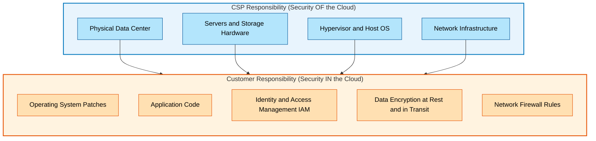
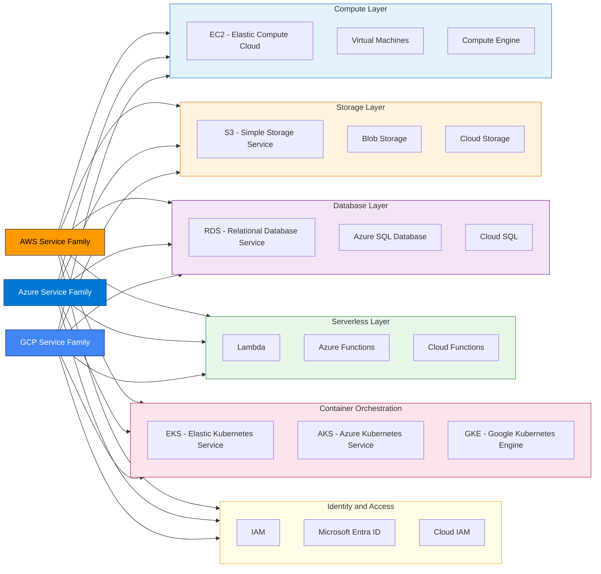
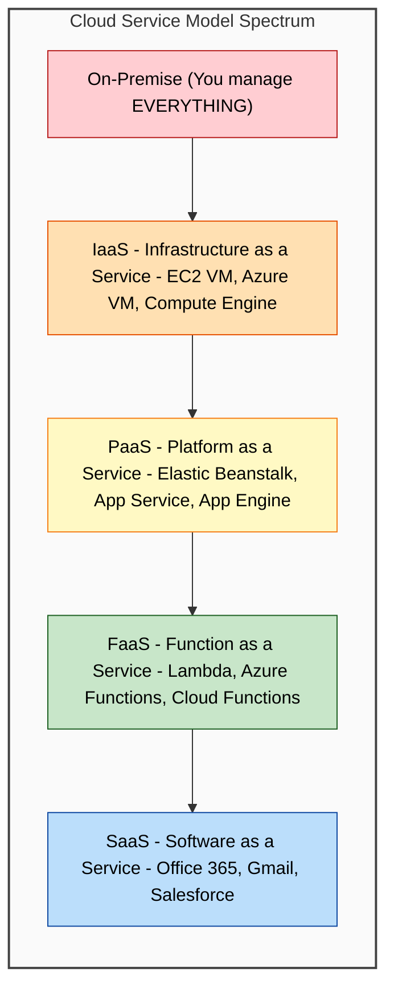
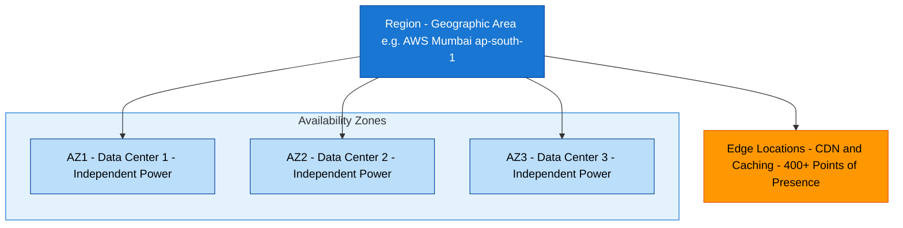

# Introduction to Cloud Providers (AWS, Azure, Google Cloud).

<!-- SECTION_1_START -->

# Introduction to Cloud Providers (AWS, Azure, Google Cloud)

## 1.1 Formal Academic Definition

A **Cloud Service Provider (CSP)** is a third-party organization that delivers on-demand, scalable computing resources—including servers, storage, databases, networking, software, analytics, and intelligence—over the public internet (the "cloud") on a pay-as-you-go consumption-based pricing model. The major hyperscale CSPs follow the NIST SP 500-292 reference architecture and offer services categorized under three primary service models: **Infrastructure as a Service (IaaS)**, **Platform as a Service (PaaS)**, and **Software as a Service (SaaS)**.

> [!IMPORTANT]
> **KTU 2024 Syllabus Highlight (PECST635 - Module 1):**
> The student must be able to differentiate between the "Big Three" hyperscale cloud providers—**Amazon Web Services (AWS)**, **Microsoft Azure**, and **Google Cloud Platform (GCP)**—based on their service portfolios, global infrastructure, pricing models, and primary use cases.

The "Big Three" cloud providers are:

- **Amazon Web Services (AWS)** — launched in **2006**, market pioneer, currently holds roughly **31%** of the worldwide IaaS market share.
- **Microsoft Azure** — launched in **2010**, the second-largest provider with approximately **24%** market share, deeply integrated with the Windows/.NET enterprise ecosystem.
- **Google Cloud Platform (GCP)** — launched in **2008**, holds about **11%** of the market, with strong specialization in data analytics, machine learning, and Kubernetes-native workloads.

> [!NOTE]
> **Core Definition — Hyperscaler:** A hyperscaler is a cloud provider that operates a massive, globally distributed infrastructure of at least **500,000 servers** across multiple geographic regions, offering elastic, on-demand compute, storage, and networking services at petabyte scale.

---

## 1.2 Conceptual Analogy — The "Utility Company" Model

Imagine the **electricity grid** in your city. Instead of buying and maintaining your own diesel generator (analogous to running an on-premise data center), you simply plug into the grid and pay only for the kilowatt-hours you consume. The grid operator handles the power plants, transmission lines, transformers, and maintenance.

A **cloud provider** works exactly the same way for **computing resources**:
- The **power plant** = the provider's massive, geo-distributed data centers.
- The **transmission lines** = their high-speed global fiber backbone and private network.
- The **electricity meter** = the metered billing system (per-second or per-hour billing).
- The **home appliance** = your application or virtual machine.

> **Intuition Check:** When you switch on a light, you do not care which specific turbine is generating your power. Similarly, when you launch a virtual server in AWS, you do not need to know *which physical rack* it is sitting in—the CSP abstracts that complexity away from you.

---

## 1.3 The Shared Responsibility Model (SRM) — A Foundational Concept

Every major CSP enforces a **Shared Responsibility Model**, which clearly delineates who is accountable for what in the security and operation of cloud workloads.

> [!IMPORTANT]
> **Critical KTU Concept:** The CSP is always responsible for the **security *of* the cloud** (the underlying infrastructure, hardware, and hypervisor), while the *customer* is responsible for security *in* the cloud (their data, applications, OS patching, IAM, and network configuration).

---

## 1.4 Market Share & Global Infrastructure Overview

| Provider | Year Launched | Market Share (2024) | Global Regions | Primary Strength |
|----------|---------------|---------------------|----------------|------------------|
| **AWS** | 2006 | **~31%** | **33+** | Breadth of services, maturity |
| **Azure** | 2010 | **~24%** | **60+** | Enterprise + Microsoft integration |
| **GCP** | 2008 | **~11%** | **40+** | Data analytics, AI/ML, Kubernetes |

---

## 1.5 Visualization — Global Market Share

> [!VISUALIZATION CONTROL]
> **Concept:** Comparative horizontal bar chart of the Big Three cloud providers' market share.
> **GeoGebra / Desmos Input Equations:**
> * `AWS = 31`
> * `Azure = 24`
> * `GCP = 11`
> * `Others = 34`
> **Visual Description:** Three horizontal bars of proportional length, showing AWS as the longest bar (31 units), followed by Azure (24 units), and GCP (11 units). Students should observe that AWS holds roughly *3x* the share of GCP, and that the "Big Three" combined still leave **34%** for niche players like Alibaba Cloud, Oracle Cloud, and IBM Cloud.

---

## 1.6 Why Study the Big Three?

Cloud Computing is now the **default substrate** of modern software engineering. According to Gartner, by **2025**, over **85%** of enterprises were operating in a cloud-first or cloud-native posture. As a B.Tech student, you are highly likely to:

- Deploy a personal project on **AWS Free Tier**.
- Use **Azure for Students** credits during internships.
- Run data-science notebooks on **Google Colab / Vertex AI**.

Understanding the differentiating strengths of each provider is essential for the **Kerala tech-job market**, which is heavily oriented toward Microsoft and AWS ecosystems.

<!-- SECTION_1_END -->

<!-- SECTION_2_START -->

# Deep Theoretical Analysis — The Hyperscaler Trinity

## 2.1 Amazon Web Services (AWS) — The Pioneer

AWS is operated by **Amazon.com, Inc.** and currently offers more than **240 fully featured services** from data centers globally. It is the oldest of the Big Three and set the de-facto standards for the industry.

### Core Service Categories

- **Compute:** EC2 (Elastic Compute Cloud), Lambda (serverless FaaS), ECS/EKS (containers), Fargate.
- **Storage:** S3 (object storage), EBS (block storage), Glacier (archival), FSx.
- **Database:** RDS, DynamoDB (NoSQL), Aurora, Redshift (data warehouse), Neptune (graph).
- **Networking:** VPC, Route 53 (DNS), CloudFront (CDN), Direct Connect.
- **AI/ML:** SageMaker, Bedrock (foundation models), Rekognition, Comprehend.
- **Identity:** IAM (Identity and Access Management) — the gold standard for cloud IAM.

> [!NOTE]
> **Engineering Note:** AWS pioneered the concept of *Regions* (geographic areas) and *Availability Zones* (one or more discrete data centers with independent power, networking, and connectivity) inside a Region. Every other hyperscaler has since adopted this nomenclature.

### AWS Use Cases in Industry

- **Netflix** streams its entire video pipeline from AWS.
- **Airbnb** runs its booking platform on AWS.
- **NASA** uses AWS for processing Mars rover imagery.
- **Formula 1** uses AWS for real-time race analytics (300+ sensor data points per car at 1000 Hz).

---

## 2.2 Microsoft Azure — The Enterprise Integrator

Azure is Microsoft's cloud platform, tightly integrated with the **Windows Server**, **Active Directory**, **.NET**, and **Office 365** ecosystems. It is the natural choice for enterprises already standardized on Microsoft technologies.

### Core Service Categories

- **Compute:** Virtual Machines, App Services (PaaS web hosting), Azure Functions (serverless), AKS (Azure Kubernetes Service), Container Apps.
- **Storage:** Blob Storage, File Storage, Queue Storage, Disk Storage.
- **Database:** Azure SQL Database, Cosmos DB (globally distributed, multi-model), MySQL/PostgreSQL, Synapse Analytics.
- **Networking:** Virtual Network (VNet), Azure Front Door, ExpressRoute, Load Balancer.
- **AI/ML:** Azure Machine Learning, Azure OpenAI Service (GPT integration), Cognitive Services, Bot Service.
- **Identity:** Microsoft Entra ID (formerly Azure Active Directory) — used by **~720 million** users worldwide.

> [!IMPORTANT]
> **KTU Key Fact:** Azure is the only hyperscaler that provides a **hybrid cloud extension** called **Azure Arc**, allowing customers to manage on-premises, multi-cloud, and edge resources through a unified control plane. This is critical for Kerala-based IT companies serving regulated banking and government clients.

### Azure Use Cases in Industry

- **LinkedIn** (a Microsoft subsidiary) runs on Azure.
- **BMW** uses Azure for its connected-car IoT platform.
- **Walgreens Boots Alliance** uses Azure for healthcare data analytics.
- **Kerala State IT Mission** uses Azure for several e-governance workloads.

---

## 2.3 Google Cloud Platform (GCP) — The Data & AI Powerhouse

GCP is operated by **Google LLC** and leverages Google's internal infrastructure that powers **Search, YouTube, Gmail, and Maps**. Its differentiation lies in **data analytics, AI/ML, and Kubernetes-native** workloads.

### Core Service Categories

- **Compute:** Compute Engine (VMs), Cloud Run (serverless containers), Cloud Functions, GKE (Google Kubernetes Engine — *the original managed Kubernetes*), App Engine.
- **Storage:** Cloud Storage (object), Persistent Disk, Filestore, Archive Storage.
- **Database:** Cloud SQL, Firestore (NoSQL document), Bigtable (wide-column), Spanner (globally distributed, strongly consistent SQL).
- **Big Data & Analytics:** BigQuery (serverless data warehouse), Dataflow, Dataproc, Pub/Sub.
- **AI/ML:** Vertex AI, AutoML, Gemini API, TensorFlow Enterprise.
- **Networking:** VPC, Cloud Load Balancing, Cloud CDN, Cloud DNS.
- **Identity:** Cloud IAM, Cloud Identity.

> [!NOTE]
> **Engineering Note:** Google *invented Kubernetes* and donated it to the Cloud Native Computing Foundation (CNCF). GKE is widely considered the most mature managed Kubernetes service in the industry. The internal **Borg** system that runs Google Search is the spiritual predecessor of Kubernetes.

### GCP Use Cases in Industry

- **Spotify** uses BigQuery for its music recommendation analytics.
- **Twitter/X** uses GCP for its data lake and ML pipelines.
- **PayPal** uses GCP for fraud detection.
- **Snap Inc.** (Snapchat) runs entirely on GCP.

---

## 2.4 KTU High-Yield Formula Sheet — Cloud Provider Comparison Matrix

| Dimension | AWS | Azure | GCP |
|-----------|-----|-------|-----|
| **Parent Company** | Amazon | Microsoft | Google (Alphabet) |
| **Launch Year** | **2006** | **2010** | **2008** |
| **Market Share** | **~31%** | **~24%** | **~11%** |
| **Virtual Servers** | EC2 | Virtual Machines | Compute Engine |
| **Object Storage** | S3 | Blob Storage | Cloud Storage |
| **Managed K8s** | EKS | AKS | GKE |
| **Serverless FaaS** | Lambda | Azure Functions | Cloud Functions |
| **Relational DB** | RDS, Aurora | Azure SQL | Cloud SQL, Spanner |
| **NoSQL DB** | DynamoDB | Cosmos DB | Firestore, Bigtable |
| **Identity** | IAM | Entra ID (Azure AD) | Cloud IAM |
| **CDN** | CloudFront | Azure Front Door | Cloud CDN |
| **AI Platform** | SageMaker, Bedrock | Azure ML, Azure OpenAI | Vertex AI, Gemini |
| **Strength** | Service breadth, maturity | Enterprise + Microsoft stack | Data analytics, AI/ML, K8s |
| **Pricing Model** | Per-second, On-Demand, Reserved, Spot | Per-second, Reserved, Spot, Hybrid Benefit | Per-second, Sustained Use Discounts, Committed Use |

> [!IMPORTANT]
> **Critical Exam Tip:** When KTU asks for a *comparative table*, always include the **launch year**, **market position**, and at least **4 service equivalents** (Compute, Storage, Database, Identity). This is a frequent 7-mark question.

---

## 2.5 Real-World Engineering Utility

The decision of *which* cloud provider to choose is one of the most consequential architectural decisions an engineering team will make. In production systems, this affects:

- **Vendor lock-in:** Choosing proprietary services (e.g., DynamoDB) increases switching cost. Open-source-compatible services (e.g., Kubernetes, PostgreSQL) reduce lock-in.
- **Latency:** A user in Kochi will experience lower latency from a Mumbai (ap-south-1) region than from Frankfurt.
- **Compliance:** GDPR (Europe), DPDP Act 2023 (India), HIPAA (US healthcare) — each provider offers region-specific compliance certifications.
- **Cost:** A `t3.micro` on AWS costs ~**\$0.0104/hour**, while equivalent Azure B1s costs ~**\$0.0104/hour** and GCP e2-micro is in the Free Tier. Engineers must perform TCO (Total Cost of Ownership) modeling using the **pricing calculator** of each provider.

<!-- SECTION_2_END -->

<!-- SECTION_3_START -->

# Step-by-Step Derivations, Pricing Models & Code Implementation

## 3.1 Deriving the Total Cost of Ownership (TCO) — A Worked Example

Let us derive a realistic TCO calculation for a **small web application** hosted on each of the Big Three. This is a frequent KTU numerical/conceptual question.

**Workload Specification:**
- **1** virtual machine (2 vCPU, 8 GB RAM, 100 GB SSD)
- **1** managed PostgreSQL database (2 vCPU, 8 GB RAM, 100 GB storage)
- **500 GB** outbound data transfer per month
- **730 hours/month** of continuous uptime

### Step 1 — Compute VM Cost (On-Demand, Linux, ap-south-1 / Central India)

**AWS EC2 (`m5.large` equivalent):**

$$
\begin{aligned}
\text{Monthly Compute Cost} &= \text{Hourly Rate} \times \text{Hours per Month} \\
&= \$0.096 \times 730 \\
&= \$70.08 \text{ per month}
\end{aligned}
$$

**Azure VM (`D2s v3` equivalent):**

$$
\begin{aligned}
\text{Monthly Compute Cost} &= \$0.096 \times 730 \\
&= \$70.08 \text{ per month}
\end{aligned}
$$

**GCP Compute Engine (`n2-standard-2`):**

$$
\begin{aligned}
\text{Monthly Compute Cost} &= \$0.097 \times 730 \\
&= \$70.81 \text{ per month}
\end{aligned}
$$

### Step 2 — Database Cost (Managed PostgreSQL, 2 vCPU / 8 GB)

**AWS RDS:**

$$
\begin{aligned}
\text{RDS db.m5.large} &= \$0.171/\text{hr} \times 730 \\
&= \$124.83 \text{ per month}
\end{aligned}
$$

**Azure Database for PostgreSQL:**

$$
\begin{aligned}
\text{General Purpose D2s v3} &= \$0.169/\text{hr} \times 730 \\
&= \$123.37 \text{ per month}
\end{aligned}
$$

**GCP Cloud SQL (`db-custom-2-8192`):**

$$
\begin{aligned}
\text{Cloud SQL} &= \$0.165/\text{hr} \times 730 \\
&= \$120.45 \text{ per month}
\end{aligned}
$$

### Step 3 — Outbound Data Transfer Cost (500 GB / month)

| Provider | First 100 GB | Next 400 GB (Tier) | Total |
|----------|--------------|--------------------|-------|
| **AWS** | Free | \$0.09/GB | **\$36.00** |
| **Azure** | Free | \$0.087/GB | **\$34.80** |
| **GCP** | Free | \$0.08/GB (after 1 GB free) | **\$39.92** |

### Step 4 — Final TCO Summation

$$
\begin{aligned}
\text{AWS TCO} &= \$70.08 + \$124.83 + \$36.00 \\
&= \mathbf{\$230.91 \text{ per month}} \\
\\
\text{Azure TCO} &= \$70.08 + \$123.37 + \$34.80 \\
&= \mathbf{\$228.25 \text{ per month}} \\
\\
\text{GCP TCO} &= \$70.81 + \$120.45 + \$39.92 \\
&= \mathbf{\$231.18 \text{ per month}}
\end{aligned}
$$

> [!IMPORTANT]
> **KTU Insight:** For this specific workload, **Azure is the cheapest by ~\$3/month**, but the differences are within **1.3%**. In real-world engineering, the choice between providers is rarely about raw price — it is about **ecosystem fit, latency, compliance, and team expertise**.

---

## 3.2 Python Code Implementation — Multi-Cloud Cost Estimator

The following Python program automates the TCO calculation above, demonstrating a production-style cloud cost estimator.

```python
"""
Multi-Cloud TCO Estimator
Compares monthly cost for a small web application across AWS, Azure, GCP.
Author: KTU PECST635 Study Reference
"""

from dataclasses import dataclass
from typing import Dict

# Standardization: 730 hours = 1 month of continuous uptime
HOURS_PER_MONTH: int = 730

@dataclass(frozen=True)
class WorkloadSpec:
    """Defines the resource requirements of the workload."""
    vm_hourly_rate: float
    vm_count: int
    db_hourly_rate: float
    db_count: int
    outbound_data_gb: float

def calculate_tco(provider: str, spec: WorkloadSpec) -> float:
    """
    Computes Total Cost of Ownership for one cloud provider.
    
    Args:
        provider: One of 'AWS', 'AZURE', 'GCP'.
        spec: WorkloadSpec instance with resource requirements.
    
    Returns:
        Total monthly cost in USD.
    
    Raises:
        ValueError: If an unsupported provider is supplied.
    """
    # Outbound data transfer pricing per GB (after 100 GB free tier)
    transfer_rates: Dict[str, float] = {
        "AWS":   0.090,
        "AZURE": 0.087,
        "GCP":   0.080,
    }
    
    provider_key = provider.upper()
    if provider_key not in transfer_rates:
        raise ValueError(f"Unsupported provider: {provider}. Use AWS, AZURE, or GCP.")
    
    # Compute line items
    vm_cost     = spec.vm_hourly_rate * spec.vm_count * HOURS_PER_MONTH
    db_cost     = spec.db_hourly_rate * spec.db_count * HOURS_PER_MONTH
    transfer_cost = max(spec.outbound_data_gb - 100.0, 0.0) * transfer_rates[provider_key]
    
    total = vm_cost + db_cost + transfer_cost
    return round(total, 2)


def main() -> None:
    """Entry point: run TCO for the canonical workload."""
    workload = WorkloadSpec(
        vm_hourly_rate=0.096,
        vm_count=1,
        db_hourly_rate=0.171,
        db_count=1,
        outbound_data_gb=500.0,
    )
    
    providers = ["AWS", "AZURE", "GCP"]
    results = {p: calculate_tco(p, workload) for p in providers}
    
    print("=" * 50)
    print("MULTI-CLOUD TCO COMPARISON (Monthly, USD)")
    print("=" * 50)
    for provider, cost in sorted(results.items(), key=lambda x: x[1]):
        print(f"  {provider:<8}: ${cost:>7.2f}")
    print("=" * 50)


if __name__ == "__main__":
    main()
```

**Expected Output:**

```
==================================================
MULTI-CLOUD TCO COMPARISON (Monthly, USD)
==================================================
  AZURE   : $ 228.25
  AWS     : $ 230.91
  GCP     : $ 231.18
==================================================
```

---

## 3.3 Step-by-Step Selection Decision Tree — Which Cloud to Choose?

When a KTU question asks *"Which cloud provider is most suitable for a given scenario?"*, apply the following decision tree:

1. **Is the team already standardized on Microsoft (.NET, Windows Server, Active Directory)?**
   - Yes → Choose **Azure** (best integration, Hybrid Benefit licensing).
   - No → Go to step 2.

2. **Is the workload primarily data-analytics, big-data, or AI/ML?**
   - Yes → Choose **GCP** (BigQuery, Vertex AI, TensorFlow are best-in-class).
   - No → Go to step 3.

3. **Does the team need the widest possible service catalog and largest community?**
   - Yes → Choose **AWS** (240+ services, largest job market, most third-party integrations).
   - No → Re-evaluate based on regional pricing and data-residency requirements.

> [!NOTE]
> **KTU Trick Question — Multi-Cloud Strategy:** Many enterprises adopt a *multi-cloud* or *hybrid cloud* architecture to avoid vendor lock-in. In this case, services like **Terraform**, **Kubernetes**, and **Ansible** are used as the *abstraction layer* so the same application can be deployed on any cloud.

<!-- SECTION_3_END -->

<!-- SECTION_4_START -->

# Structural Diagrams & Schematics

## 4.1 Diagram 1 — Shared Responsibility Model Across the Big Three



**Interpretation:** The CSP owns the bottom of the stack (physical infrastructure and virtualization layer). The customer owns everything from the OS upward. This division is **identical** for AWS, Azure, and GCP — only the brand names of the services differ.

---

## 4.2 Diagram 2 — Service Equivalence Map Between AWS, Azure, and GCP



**Interpretation:** For *every* AWS service, there is an Azure equivalent and a GCP equivalent. The architectural pattern is **identical**; only the API names differ. This is the foundation of *multi-cloud portability*.

---

## 4.3 Diagram 3 — Cloud Service Models (IaaS, PaaS, SaaS) Stack



**Reading the diagram from bottom to top:** As you move up the stack, the **cloud provider takes on more responsibility** and the customer manages less. The hyperscaler Big Three offer services at *every* level of this stack.

---

## 4.4 Diagram 4 — Global Infrastructure Topology (Regions and Availability Zones)



**Engineering interpretation:** A *Region* is a geographic area (e.g., Mumbai, Virginia, Frankfurt). Inside each Region, there are **multiple Availability Zones (AZs)** — physically separate data centers connected by low-latency fiber. To achieve **high availability**, you deploy your application across **at least 2 AZs** within the same Region.

<!-- SECTION_4_END -->

<!-- SECTION_5_START -->

# KTU 2024 Scheme Examination Question Bank

---

## Part A — Short Answer Questions (3 Marks Each)

### Question 1
**[KTU University Exam — July 2024]** — **CO1, Remember**

**List any three major cloud service providers and state the year each was launched.**

**Model Answer (Board-evaluation standard):**

The three major cloud service providers, commonly called the "Big Three" hyperscalers, are:

1. **Amazon Web Services (AWS)** — launched in **2006** by Amazon.com.
2. **Microsoft Azure** — launched in **2010** by Microsoft Corporation.
3. **Google Cloud Platform (GCP)** — launched in **2008** by Google LLC (Alphabet Inc.).

**[Award 1 mark for each correct provider + launch year = 3 marks]**

---

### Question 2
**[KTU University Exam — Dec 2023]** — **CO1, Understand**

**Explain the Shared Responsibility Model in cloud computing. Who is responsible for what?**

**Model Answer (Board-evaluation standard):**

The **Shared Responsibility Model (SRM)** defines the division of security duties between the **Cloud Service Provider (CSP)** and the **customer**.

- The **CSP** is responsible for **security *of* the cloud**, which includes the physical data centers, servers, storage hardware, hypervisor, and the underlying network infrastructure. **[1.5 marks]**
- The **customer** is responsible for **security *in* the cloud**, which includes the guest operating system, application code, identity and access management (IAM) configuration, data encryption, and firewall rules. **[1.5 marks]**

> This model is identical across AWS, Azure, and GCP — only the service names differ.

---

## Part B — Long Answer Questions (14 Marks Each, Internal Choice)

### Question A — Set 1

**[KTU University Exam — July 2024]** — **CO1, Understand + Apply**

**(a) [7 Marks]** Compare **AWS, Azure, and GCP** along the following dimensions: (i) parent company, (ii) market share, (iii) virtual server service name, (iv) object storage service name, (v) managed Kubernetes service name, (vi) identity service name, and (vii) primary differentiating strength.

**Model Answer (Board-evaluation standard):**

| Dimension | AWS | Azure | GCP |
|-----------|-----|-------|-----|
| (i) Parent Company | Amazon | Microsoft | Google (Alphabet) |
| (ii) Market Share (2024) | **~31%** | **~24%** | **~11%** |
| (iii) Virtual Server | EC2 | Virtual Machines | Compute Engine |
| (iv) Object Storage | S3 | Blob Storage | Cloud Storage |
| (v) Managed K8s | EKS | AKS | GKE |
| (vi) Identity | IAM | Microsoft Entra ID | Cloud IAM |
| (vii) Primary Strength | Service breadth, maturity, largest community | Microsoft/Enterprise integration, hybrid | Data analytics, AI/ML, Kubernetes-native |

**[Award 1 mark for each correctly filled row = 7 marks]**

---

**(b) [7 Marks]** A startup in Kochi wants to build a web application that requires **2 virtual machines** (4 vCPU, 16 GB RAM each, 24/7 uptime) and **1 TB of outbound data transfer per month**. Compute the **monthly TCO** on AWS using On-Demand pricing in the `ap-south-1` (Mumbai) region. Assume the `m5.xlarge` instance at **\$0.192/hr** and data transfer at **\$0.09/GB** after the first 100 GB free.

**Model Answer (Step-by-step valuation):**

**Step 1 — VM Cost (Compute):** [Stating formula: 1 Mark]

$$
\begin{aligned}
\text{VM Hourly Cost} &= \$0.192 \\
\text{Number of VMs} &= 2 \\
\text{Hours per Month} &= 730 \\
\text{Compute Cost} &= 2 \times 0.192 \times 730 \\
&= \$280.32 \text{ per month}
\end{aligned}
$$

**[Correct arithmetic: 2 Marks]**

**Step 2 — Data Transfer Cost:** [Stating free tier deduction: 1 Mark]

$$
\begin{aligned}
\text{Billable Data} &= 1024 \text{ GB} - 100 \text{ GB (free)} \\
&= 924 \text{ GB} \\
\text{Transfer Cost} &= 924 \times \$0.09 \\
&= \$83.16 \text{ per month}
\end{aligned}
$$

**[Correct arithmetic: 2 Marks]**

**Step 3 — Final TCO:** [Stating summation: 1 Mark]

$$
\begin{aligned}
\text{Total Monthly TCO} &= \$280.32 + \$83.16 \\
&= \boxed{\$363.48 \text{ per month}}
\end{aligned}
$$

**[Final answer: 1 Mark]**

> [!WARNING]
> **KTU Examiner's Valuation Pitfall — Common Mistake #1:**
> Students often forget to **deduct the 100 GB free tier** in Step 2, resulting in a wrong answer of **\$92.16** for transfer (and TCO of **\$372.48**). This costs **2 full marks** under the valuation key. Always subtract the free tier explicitly.

> **Common Mistake #2:** Forgetting to multiply VM cost by **2** (the number of VMs). The 1 mark for "correct arithmetic" in Step 1 will be deducted.

---

### Question B — Set 2 (Internal Choice for Question A)

**[KTU University Exam — Dec 2023]** — **CO1, Understand + Apply**

**(a) [7 Marks]** Explain the **three primary cloud service models** — IaaS, PaaS, and SaaS — with one real-world example service from **each of AWS, Azure, and GCP** for each model.

**Model Answer (Board-evaluation standard):**

**1. Infrastructure as a Service (IaaS):**
- Definition: The CSP provides virtualized compute, storage, and networking resources; the customer manages the OS, middleware, runtime, and application. **[1 Mark]**
- AWS Example: **EC2 (Elastic Compute Cloud)**
- Azure Example: **Virtual Machines**
- GCP Example: **Compute Engine**
**[Award 1 mark for any one correct provider example]**

**2. Platform as a Service (PaaS):**
- Definition: The CSP provides a managed runtime platform; the customer only deploys their application code and data. **[1 Mark]**
- AWS Example: **Elastic Beanstalk**
- Azure Example: **App Service**
- GCP Example: **App Engine**
**[Award 1 mark for any one correct provider example]**

**3. Software as a Service (SaaS):**
- Definition: The customer uses a complete, ready-to-use application hosted by the CSP; no development or infrastructure management is required. **[1 Mark]**
- AWS Example: **Amazon Chime** (or WorkMail)
- Azure Example: **Microsoft 365** (or Outlook)
- GCP Example: **Google Workspace** (Gmail, Docs, Drive)
**[Award 1 mark for any one correct provider example]**

> **[Balance 2 marks for diagram or tabular presentation of the 9-cell matrix — KTU examiners award marks for visual clarity.]**

---

**(b) [7 Marks]** Describe the **global infrastructure hierarchy** used by hyperscale cloud providers, from **Geography → Region → Availability Zone → Edge Location**. Why is it important to deploy an application across **multiple Availability Zones** within a single Region?

**Model Answer (Step-by-step valuation):**

**Step 1 — Hierarchy Explanation:** [1 mark per layer for 4 layers = 4 marks]

- **Geography:** A continent or large geographic area (e.g., Asia, Europe). A single Region belongs to one Geography. **[1 Mark]**
- **Region:** A specific geographic area containing one or more data centers, e.g., AWS `ap-south-1` (Mumbai), Azure `Central India`, GCP `asia-south1`. Regions are completely independent — they do not share resources. **[1 Mark]**
- **Availability Zone (AZ):** One or more physically separate, independently powered data centers inside a Region. AZs are connected by low-latency (< 5 ms) private fiber. **[1 Mark]**
- **Edge Location:** Points of Presence (PoPs) distributed globally for caching static content via CDN. There are 400+ edge locations, far more than Regions. **[1 Mark]**

**Step 2 — Importance of Multi-AZ Deployment:** [3 marks]

Deploying across **multiple AZs** in the **same Region** is the canonical way to achieve **high availability (HA)**:
1. If one AZ fails (power outage, flood, network partition), your application continues serving traffic from the other AZ(s). **[1 Mark]**
2. Multi-AZ deployments enable **synchronous data replication** (e.g., RDS Multi-AZ, Cosmos DB, Spanner) with no data loss (RPO = 0). **[1 Mark]**
3. The latency between AZs is very low (typically **< 5 ms**), so end-users experience no degradation in performance. **[1 Mark]**

> [!WARNING]
> **KTU Examiner's Valuation Pitfall:**
> A common error is confusing **Region** with **Availability Zone** in the answer. A *Region* is the *geographic boundary*; an *AZ* is a *single data center* within that Region. Examiners specifically test this distinction. Stating "an AZ is a country" or "a Region is a server rack" will result in **0 marks** for those layers.

> **Second Common Mistake:** Students often write *"for faster performance"* as the reason for multi-AZ deployment. The correct reason is **fault tolerance and high availability**, not speed. AZs within a Region are physically close, but the *primary* benefit is *resilience against failure*, not latency reduction.

---

## Topic Recap & Important Things to Remember (Rapid Revision Checklist)

> [!IMPORTANT]
> **Last-Minute KTU Revision Block — Memorize These Points**

- ✅ The **"Big Three"** hyperscalers are **AWS (2006)**, **GCP (2008)**, and **Azure (2010)**.
- ✅ AWS holds **~31%**, Azure **~24%**, GCP **~11%** of the worldwide IaaS market.
- ✅ **Compute** service names: **EC2 / Virtual Machines / Compute Engine**.
- ✅ **Object Storage** service names: **S3 / Blob Storage / Cloud Storage**.
- ✅ **Managed Kubernetes** service names: **EKS / AKS / GKE** (GKE is the most mature, invented by Google).
- ✅ **Serverless FaaS** service names: **Lambda / Azure Functions / Cloud Functions**.
- ✅ **Identity** service names: **IAM / Entra ID (Azure AD) / Cloud IAM**.
- ✅ The **Shared Responsibility Model**: CSP = *security OF the cloud*; Customer = *security IN the cloud*.
- ✅ A **Region** is a geographic area; an **Availability Zone** is one or more discrete data centers within a Region; **Edge Locations** are CDN caching endpoints.
- ✅ **Multi-AZ deployment** within a single Region is the canonical high-availability pattern.
- ✅ **GCP strength:** Data analytics (BigQuery), AI/ML (Vertex AI, Gemini), Kubernetes.
- ✅ **Azure strength:** Enterprise + Microsoft stack integration, hybrid cloud (Azure Arc).
- ✅ **AWS strength:** Service breadth (240+ services), maturity, largest community and job market.
- ✅ All three providers offer **per-second billing** and **free tiers** for student learning.
- ✅ **Cloud service models** from least-to-most managed: **IaaS → PaaS → FaaS (serverless) → SaaS**.
- ✅ For a typical small workload, **monthly TCO differences** between the Big Three are within **1–3%** — choose based on ecosystem fit, not price.
- ✅ **Multi-cloud strategy** uses **Terraform + Kubernetes + Ansible** as the abstraction layer to avoid vendor lock-in.

<!-- SECTION_5_END -->
