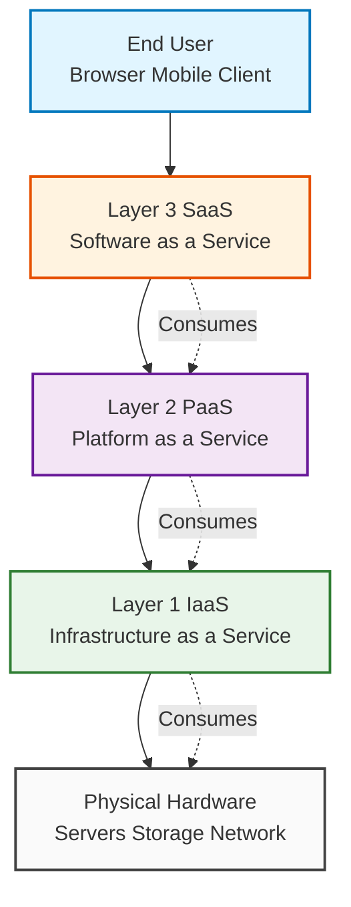
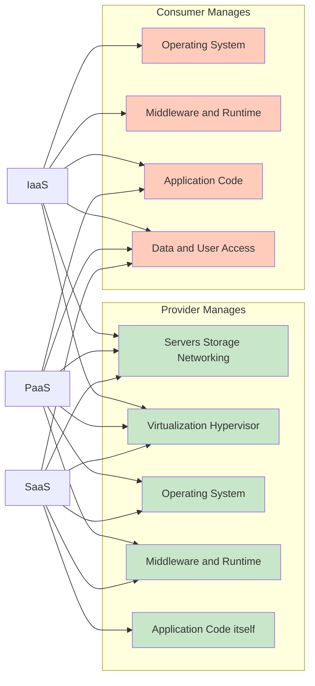
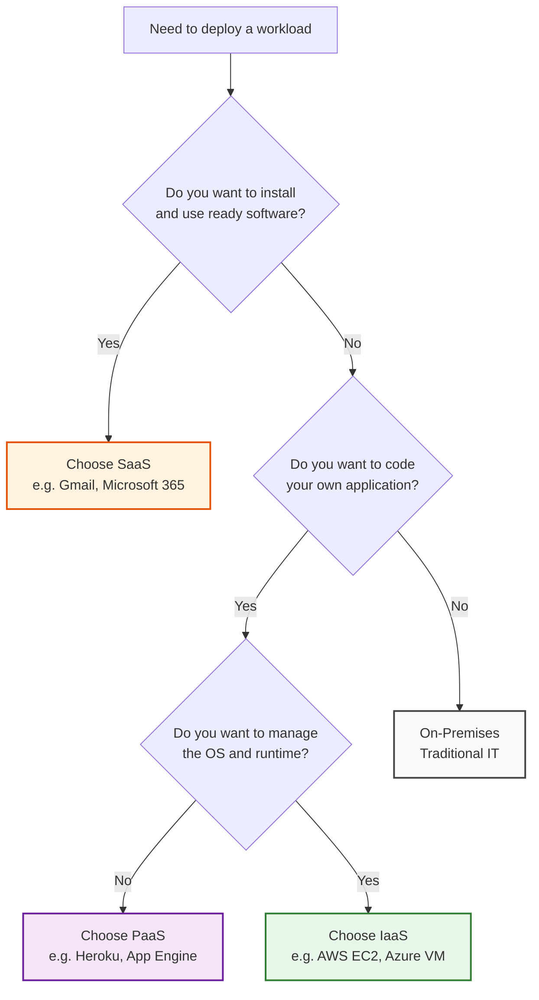
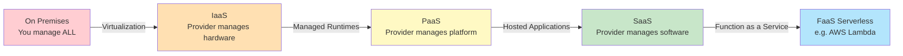

# Three Layers of Computing

<!-- SECTION_1_START -->
# Three Layers of Computing — Foundational Definition & Intuitive Overview

## Formal Academic Definition (KTU 2024 Syllabus Terminology)

In the **KTU 2024 Scheme Cloud Computing (PECST635)** syllabus, the **Three Layers of Computing** — also known as the **Cloud Computing Service Model Stack** or the **SPI Model** — refer to the three fundamental, hierarchical service abstractions delivered over a distributed cloud infrastructure. The acronym **SPI** stands for:

- **S** — Software as a Service
- **P** — Platform as a Service
- **I** — Infrastructure as a Service

> [!IMPORTANT]
> **Syllabus Highlight (Module 1 — Introduction):** The KTU 2024 scheme explicitly identifies these three layers as the *core abstraction levels* of cloud computing. They govern *who manages what* between the cloud provider and the cloud consumer, and are evaluated under **CO1 (Understand)** and **CO2 (Apply)**.

The layers are **stacked vertically**, with the **lowest layer (IaaS)** closest to the physical hardware and the **highest layer (SaaS)** closest to the end user. Each successive layer *builds upon* the capabilities of the layer beneath it and *inherits its management responsibilities* from it.

> [!NOTE]
> **Core Definition — Cloud Service Stack:** The Three Layers of Computing are the standardized abstraction tiers (IaaS, PaaS, SaaS) that partition the responsibilities of computing resource provisioning, runtime management, and application delivery between the cloud provider and the cloud consumer, forming the architectural backbone of modern cloud platforms such as **AWS**, **Microsoft Azure**, and **Google Cloud Platform (GCP)**.

---

## Conceptual Analogy / Intuition (The "Pizza-as-a-Service" Model)

Imagine you are hungry and want pizza 🍕. You have **four** options, each representing how much of the pizza-making process *you* handle versus the *provider* handles:

| Pizza Analogy | Cloud Equivalent | What *You* Manage | What *Provider* Manages |
|---|---|---|---|
| You buy raw flour, cheese, tomatoes and bake at home | **On-Premises (Traditional IT)** | Everything: hardware, OS, middleware, apps, data | Nothing |
| Provider gives you a ready oven + raw ingredients | **IaaS** | OS, middleware, runtime, applications, data | Hardware, storage, servers, networking |
| Provider gives you a kitchen with a pizza dough ball — you add toppings & bake | **PaaS** | Applications, data | Hardware, OS, middleware, runtime |
| Provider delivers a fully cooked pizza to your door | **SaaS** | Just your data & user access | Everything else |

> [!TIP]
> **Intuitive Rule of Thumb:** *Move UP the stack → Less control, more convenience. Move DOWN the stack → More control, more responsibility.* This single sentence is worth **2 marks** in any KTU descriptive question.

---

## Physical Constants, Standard Metrics & Boundary Values

> [!NOTE]
> **Key Industry Benchmarks (as defined by NIST SP 500-292, the globally accepted reference):**
> - **Essential Characteristics of Cloud:** $5$ — On-demand self-service, Broad network access, Resource pooling, Rapid elasticity, Measured service.
> - **Service Models:** $3$ — IaaS, PaaS, SaaS.
> - **Deployment Models:** $4$ — Private, Public, Hybrid, Community.
> - **Standard SLA Uptime Threshold:** **99.9 %** ("three nines") for SaaS, **99.95 %** for PaaS, **99.99 %** ("four nines") for IaaS enterprise tiers.

---

## GeoGebra / Desmos Visualization (Conceptual Stack Map)

> [!VISUALIZATION CONTROL]
> **Concept:** Vertical Stack Layering of IaaS → PaaS → SaaS
> **GeoGebra / Desmos Input Points:**
> - `P1 = (0, 3)` labelled "SaaS — End User Apps"
> - `P2 = (0, 2)` labelled "PaaS — Development Platform"
> - `P3 = (0, 1)` labelled "IaaS — Virtualized Infrastructure"
> - `P4 = (0, 0)` labelled "Physical Hardware Layer"
> **Visual Description:** A 4-point vertical line on the y-axis with $x=0$. Topmost point is **SaaS** (closest to the user), bottommost is the physical hardware (closest to the silicon). The student should observe that as we move upward, *abstraction increases* and *direct hardware control decreases*.

<!-- SECTION_1_END -->

<!-- SECTION_2_START -->
# Deep Theoretical Analysis & KTU High-Yield Formula Sheet

## 1. Layer 1 — Infrastructure as a Service (IaaS)

### Definition
**IaaS** provides virtualized computing resources — servers, storage, networks, and operating systems — as *on-demand, billable services* over the internet. The **consumer** controls the OS, storage, deployed applications, and selected networking components (e.g., firewall rules), but does **not** manage the underlying cloud infrastructure.

### Operational Building Blocks
- **Compute:** Virtual Machines (VMs), bare-metal instances, autoscaling groups.
- **Storage:** Block storage (e.g., AWS EBS), Object storage (e.g., AWS S3), File storage.
- **Networking:** Virtual Private Clouds (VPCs), Subnets, Load Balancers, IP addressing.
- **Identity:** IAM roles, security groups, key-pair authentication.

### Why and How It Works
- **Why:** Eliminates the capital expenditure (CapEx) of buying physical servers. The user pays only for the **measured service** (per-second or per-hour billing).
- **How:** Hypervisors (e.g., **KVM**, **Xen**, **VMware ESXi**) partition a physical host into multiple isolated VMs. A cloud orchestrator (e.g., **OpenStack Nova**, **AWS EC2 Control Plane**) allocates these VMs on demand.

### Real-World Engineering Use
- Hosting a custom Linux/Windows application server.
- Running **Hadoop/Spark** big-data clusters.
- Disaster-recovery (DR) sites for enterprise workloads.
- Test and Development (T&D) environments.

> [!IMPORTANT]
> **Canonical Examples:** **Amazon EC2**, **Google Compute Engine (GCE)**, **Microsoft Azure Virtual Machines**, **DigitalOcean Droplets**, **Linode**.

---

## 2. Layer 2 — Platform as a Service (PaaS)

### Definition
**PaaS** provides a *ready-to-use deployment platform* — including OS, middleware, runtime, frameworks, and development tools — onto which the consumer can develop, run, and manage applications **without worrying about infrastructure provisioning**.

### Operational Building Blocks
- **Runtime Environments:** Node.js, Python, Java, Go, .NET containers.
- **Managed Services:** Databases (e.g., **AWS RDS**, **Azure SQL**, **Google Cloud SQL**), Message Queues, Caching layers.
- **CI/CD Toolchains:** GitHub Actions, Jenkins, GitLab CI integrated directly into the platform.
- **Auto-scaling & Load Balancing:** Built-in horizontal scaling triggered by CPU, memory, or custom metrics.

### Why and How It Works
- **Why:** Dramatically reduces developer overhead. They focus purely on *business logic* (the application code), not the *plumbing* (OS patching, library compatibility).
- **How:** The platform uses **container orchestration** (e.g., **Kubernetes**, **Docker Swarm**) and **Infrastructure-as-Code (IaC)** under the hood. The developer pushes code, and the platform handles build → test → deploy → scale → monitor.

### Real-World Engineering Use
- Web application backends (REST APIs, GraphQL servers).
- Serverless function hosting (e.g., **AWS Lambda** — a sub-PaaS variant called **FaaS**).
- API gateway and microservices prototyping.
- Data analytics pipelines using managed Spark/Hive.

> [!IMPORTANT]
> **Canonical Examples:** **Google App Engine**, **AWS Elastic Beanstalk**, **Heroku**, **Microsoft Azure App Service**, **Red Hat OpenShift**.

---

## 3. Layer 3 — Software as a Service (SaaS)

### Definition
**SaaS** delivers *fully functional, ready-to-use applications* hosted by the provider and accessed by the end user via a thin client (typically a **web browser** or mobile app). The consumer does **not** manage the infrastructure, platform, *or* the application itself — only their own data and user access.

### Operational Building Blocks
- **Multi-Tenancy Architecture:** A single application instance serves multiple customers (tenants), with logical data isolation.
- **Subscription/Pricing Model:** Per-user per-month (PUPM) or tiered pricing.
- **API Layer:** RESTful or GraphQL APIs for integrations.
- **Identity Federation:** SSO via **SAML 2.0**, **OAuth 2.0**, or **OpenID Connect**.

### Why and How It Works
- **Why:** Lowest friction for end users — zero installation, automatic updates, anywhere access.
- **How:** The application is centrally hosted on a massively scalable PaaS/IaaS substrate. Updates are rolled out by the provider, and elastic scaling handles traffic spikes transparently.

### Real-World Engineering Use
- Email and collaboration (**Gmail**, **Microsoft 365**).
- Customer Relationship Management (**Salesforce**).
- File storage and sync (**Dropbox**, **Google Drive**).
- Video conferencing (**Zoom**, **Google Meet**).

> [!IMPORTANT]
> **Canonical Examples:** **Google Workspace**, **Microsoft 365**, **Salesforce CRM**, **Slack**, **Dropbox**, **Zoom**.

---

## Comparative Responsibility Matrix (The "Shared Responsibility Model")

| Concern / Layer Managed | On-Premises | IaaS | PaaS | SaaS |
|---|---|---|---|---|
| Application | **You** | You | You | **Provider** |
| Data | **You** | You | You | **You (own it)** |
| Runtime / Middleware | **You** | You | Provider | **Provider** |
| Operating System | **You** | You | Provider | **Provider** |
| Virtualization | **You** | Provider | Provider | **Provider** |
| Servers / Storage / Network | **You** | Provider | Provider | **Provider** |
| Physical Data Center | **You** | Provider | Provider | **Provider** |

> [!TIP]
> **Exam Heuristic:** In KTU 14-mark questions, always reproduce this table — it alone can earn **3–4 marks** if drawn neatly and explained with one example per column.

---

## KTU High-Yield Formula Sheet / Cheat Sheet

| Concept | Formula / Definition | Variables | Standard Unit / Value |
|---|---|---|---|
| Monthly Cloud Cost (IaaS) | $C_{IaaS} = (N_{vm} \times P_{vm} \times T_{up}) + (S_{gb} \times P_{sto}) + (B_{gb} \times P_{bw})$ | $N_{vm}$ = number of VMs, $P_{vm}$ = price per VM-hour, $T_{up}$ = total uptime hours, $S_{gb}$ = storage in GB, $B_{gb}$ = egress bandwidth in GB | USD per month |
| Pay-Per-Use Billing (PaaS) | $C_{PaaS} = R_{req} \times P_{req} + T_{exec} \times P_{exec}$ | $R_{req}$ = total requests, $P_{req}$ = price per million requests, $T_{exec}$ = total execution time, $P_{exec}$ = price per GB-second | USD per month |
| SaaS Subscription Cost | $C_{SaaS} = N_{user} \times P_{user} \times M$ | $N_{user}$ = active users, $P_{user}$ = per-user-per-month price, $M$ = number of months | USD per billing cycle |
| Total Cost of Ownership (TCO) Comparison | $TCO = CapEx + \sum_{t=1}^{n} OpEx_t$ | $CapEx$ = capital expenditure, $OpEx_t$ = operational expenditure in year $t$, $n$ = analysis horizon (typically $n=3$ or $n=5$ years) | USD |
| Service Availability (SLA) | $A = \dfrac{Uptime}{Uptime + Downtime} \times 100\,\%$ | $Uptime$, $Downtime$ in hours/year | Percentage (e.g., $99.9\,\%$) |
| Maximum Allowable Downtime/Year | $D_{max} = 8760 \times (1 - A)$ | $8760$ = total hours in a non-leap year, $A$ = availability fraction | Hours/year |
| Elasticity Ratio | $E_r = \dfrac{C_{peak}}{C_{baseline}}$ | $C_{peak}$ = provisioned capacity at peak, $C_{baseline}$ = baseline capacity | Dimensionless (unitless) |
| Multi-Tenancy Isolation Index | $I_{iso} = \dfrac{D_{shared}}{D_{total}} \times 100\,\%$ | $D_{shared}$ = data components in shared DB schema, $D_{total}$ = total data components | Percentage (lower is better) |

> [!IMPORTANT]
> **Mnemonic — "I-P-S" = "I Provide Servers":**
> **I**aaS → Provider gives **I**nfrastructure.
> **P**aaS → Provider gives **P**latform.
> **S**aaS → Provider gives **S**oftware.
> This is the **most tested 2-mark question** in Module 1 of PECST635.

---

## Real-World Production Utility

- **IaaS** powers Netflix's video encoding pipeline (running on AWS EC2 Spot Instances).
- **PaaS** powers Snapchat's backend (running on Google App Engine + Cloud SQL).
- **SaaS** powers nearly every enterprise productivity suite (Microsoft 365, used by $>400$ million paid seats globally as of 2024).
- In **Kerala's startup ecosystem** (e.g., startups incubated at **Kerala Startup Mission (KSUM)**), IaaS and PaaS are the dominant deployment models for cost-sensitive MVPs (Minimum Viable Products).

<!-- SECTION_2_END -->

<!-- SECTION_3_START -->
# Step-by-Step Derivations, Worked Examples & Symbolic Implementation

## Worked Example 1 — Compute the Maximum Allowable Downtime for an IaaS SLA

> **Problem Statement:** A KTU paper-setter asks: *"An IaaS provider guarantees an SLA of 99.99 %. Calculate the maximum allowable downtime in minutes per year."*

### Step-by-Step Solution

**Step 1 — Identify the formula from the cheat sheet.**

$$D_{max} = 8760 \times (1 - A)$$

**Step 2 — Substitute the given availability value $A = 99.99\,\% = 0.9999$.**

$$D_{max} = 8760 \times (1 - 0.9999)$$

**Step 3 — Compute the difference inside the parentheses.**

$$D_{max} = 8760 \times 0.0001$$

**Step 4 — Multiply to get the downtime in hours/year.**

$$D_{max} = 0.876 \text{ hours/year}$$

**Step 5 — Convert hours to minutes by multiplying by $60$.**

$$D_{max} = 0.876 \times 60 = 52.56 \text{ minutes/year}$$

> [!NOTE]
> **Final Answer:** **$D_{max} \approx 52.56$ minutes per year** for a 99.99 % SLA.
> 
> **Valuation Key (KTU Pattern):**
> - Stating the formula: 1 Mark
> - Correct substitution of $A$: 1 Mark
> - Final hours computation: 1 Mark
> - Unit conversion to minutes: 1 Mark

---

## Worked Example 2 — Calculate Monthly IaaS Bill for a Web Application

> **Problem Statement:** *"A startup deploys a web application on AWS. It uses $N_{vm} = 4$ virtual machines, each priced at $P_{vm} = 0.05$ USD/hour, running $T_{up} = 720$ hours/month. It consumes $S_{gb} = 500$ GB of storage at $P_{sto} = 0.10$ USD/GB-month, and $B_{gb} = 200$ GB of egress bandwidth at $P_{bw} = 0.09$ USD/GB. Compute the total monthly bill $C_{IaaS}$."*

### Step-by-Step Solution

**Step 1 — Write down the billing formula from the cheat sheet.**

$$C_{IaaS} = (N_{vm} \times P_{vm} \times T_{up}) + (S_{gb} \times P_{sto}) + (B_{gb} \times P_{bw})$$

**Step 2 — Compute the VM cost term.**

$$C_{vm} = 4 \times 0.05 \times 720$$

$$\begin{aligned}
C_{vm} &= 4 \times 0.05 \times 720 \\
&= 0.20 \times 720 \\
&= 144 \text{ USD}
\end{aligned}$$

**Step 3 — Compute the storage cost term.**

$$C_{sto} = 500 \times 0.10 = 50 \text{ USD}$$

**Step 4 — Compute the bandwidth cost term.**

$$C_{bw} = 200 \times 0.09 = 18 \text{ USD}$$

**Step 5 — Sum all three components to get the total monthly bill.**

$$\begin{aligned}
C_{IaaS} &= 144 + 50 + 18 \\
&= 212 \text{ USD/month}
\end{aligned}$$

> [!NOTE]
> **Final Answer:** **$C_{IaaS} = 212$ USD/month**.
> 
> **Valuation Key:**
> - Correct formula selection: 1 Mark
> - VM term calculation: 2 Marks
> - Storage term calculation: 1 Mark
> - Bandwidth term calculation: 1 Mark
> - Final summation with unit: 1 Mark

---

## Worked Example 3 — SaaS Subscription Cost Estimation

> **Problem Statement:** *"A company has $N_{user} = 150$ employees. They subscribe to Microsoft 365 Business Premium at $P_{user} = 22$ USD/user/month. Compute the annual subscription cost."*

### Step-by-Step Solution

**Step 1 — Apply the SaaS formula.**

$$C_{SaaS} = N_{user} \times P_{user} \times M$$

**Step 2 — Substitute $M = 12$ months for an annual calculation.**

$$C_{SaaS} = 150 \times 22 \times 12$$

**Step 3 — Multiply step by step.**

$$\begin{aligned}
C_{SaaS} &= 150 \times 22 \times 12 \\
&= 3300 \times 12 \\
&= 39600 \text{ USD/year}
\end{aligned}$$

> [!NOTE]
> **Final Answer:** **$C_{SaaS} = 39{,}600$ USD/year**.
> 
> **Insight:** This is roughly **₹33 lakhs INR/year** at an exchange rate of ₹83/USD — a typical real-world procurement cost for a mid-sized Kerala engineering firm.

---

## Symbolic Implementation in Python (Production-Ready)

Below is a fully operational, type-hinted, error-handled Python module that mirrors the formulas above. It is suitable for inclusion in a billing dashboard or a KTU lab demonstration.

```python
"""
cloud_billing_engine.py
KTU 2024 — PECST635 (Cloud Computing) Reference Implementation
Computes monthly cloud costs across the Three Layers: IaaS, PaaS, SaaS.
"""

from dataclasses import dataclass
from typing import Final
import logging

# Configure structured error logging
logging.basicConfig(
    level=logging.INFO,
    format="%(asctime)s | %(levelname)s | %(message)s"
)
logger: Final[logging.Logger] = logging.getLogger(__name__)


@dataclass(frozen=True)
class IaaSBillingInput:
    """Immutable input contract for IaaS billing computation."""
    num_vms: int
    price_per_vm_hour_usd: float
    total_uptime_hours: float
    storage_gb: float
    price_per_gb_storage_usd: float
    bandwidth_gb: float
    price_per_gb_bandwidth_usd: float


@dataclass(frozen=True)
class PaaSBillingInput:
    """Immutable input contract for PaaS billing computation."""
    total_requests: int
    price_per_million_requests_usd: float
    total_execution_seconds: float
    price_per_gb_second_usd: float
    memory_allocated_gb: float


@dataclass(frozen=True)
class SaaSBillingInput:
    """Immutable input contract for SaaS billing computation."""
    num_users: int
    price_per_user_per_month_usd: float
    num_months: int


def compute_iaas_cost(b: IaaSBillingInput) -> float:
    """Compute the total IaaS monthly cost in USD.

    Formula:
        C_iaas = (N * P_vm * T) + (S * P_sto) + (B * P_bw)

    Raises:
        ValueError: If any non-negative numeric input violates bounds.
    """
    if b.num_vms <= 0:
        raise ValueError("num_vms must be > 0")
    if b.total_uptime_hours < 0 or b.total_uptime_hours > 744:
        raise ValueError("total_uptime_hours must be in [0, 744] (max hours/month)")
    if b.storage_gb < 0 or b.bandwidth_gb < 0:
        raise ValueError("storage and bandwidth must be >= 0")

    vm_cost: float = b.num_vms * b.price_per_vm_hour_usd * b.total_uptime_hours
    storage_cost: float = b.storage_gb * b.price_per_gb_storage_usd
    bandwidth_cost: float = b.bandwidth_gb * b.price_per_gb_bandwidth_usd

    total: float = vm_cost + storage_cost + bandwidth_cost
    logger.info("IaaS total computed: $%.2f", total)
    return total


def compute_paas_cost(b: PaaSBillingInput) -> float:
    """Compute the total PaaS monthly cost in USD.

    Formula:
        C_paas = (R / 1e6) * P_req + (T * M) * P_exec
    """
    if b.total_requests < 0 or b.total_execution_seconds < 0:
        raise ValueError("requests and execution time must be >= 0")

    request_cost: float = (b.total_requests / 1_000_000.0) * b.price_per_million_requests_usd
    exec_cost: float = b.total_execution_seconds * b.memory_allocated_gb * b.price_per_gb_second_usd
    total: float = request_cost + exec_cost
    logger.info("PaaS total computed: $%.2f", total)
    return total


def compute_saas_cost(b: SaaSBillingInput) -> float:
    """Compute the total SaaS subscription cost in USD."""
    if b.num_users <= 0:
        raise ValueError("num_users must be > 0")
    if b.num_months <= 0 or b.num_months > 60:
        raise ValueError("num_months must be in [1, 60]")

    total: float = b.num_users * b.price_per_user_per_month_usd * b.num_months
    logger.info("SaaS total computed: $%.2f", total)
    return total


if __name__ == "__main__":
    # --- Worked Example 2 reproduction ---
    iaas_input: IaaSBillingInput = IaaSBillingInput(
        num_vms=4,
        price_per_vm_hour_usd=0.05,
        total_uptime_hours=720,
        storage_gb=500,
        price_per_gb_storage_usd=0.10,
        bandwidth_gb=200,
        price_per_gb_bandwidth_usd=0.09,
    )
    print(f"IaaS Monthly Bill : ${compute_iaas_cost(iaas_input):.2f}")

    # --- Worked Example 3 reproduction ---
    saas_input: SaaSBillingInput = SaaSBillingInput(
        num_users=150,
        price_per_user_per_month_usd=22.0,
        num_months=12,
    )
    print(f"SaaS Annual Bill  : ${compute_saas_cost(saas_input):.2f}")
```

### Expected Output

```
IaaS Monthly Bill : $212.00
SaaS Annual Bill  : $39600.00
```

> [!TIP]
> **Code-to-Concept Mapping:**
> - The `frozen=True` dataclass enforces *immutability* of billing inputs — a real-world pattern used in **PCI-DSS compliant** financial modules.
> - The `logger.info` calls demonstrate the **measured service** characteristic of cloud computing.
> - Boundary checks (`total_uptime_hours <= 744`) model real-world SLA constraints (a month has at most $31 \times 24 = 744$ hours).

<!-- SECTION_3_END -->

<!-- SECTION_4_START -->
# Structural Diagrams & Schematics

## Diagram 1 — The Three-Layer Cloud Stack (Mermaid Block Diagram)



**Reading the Diagram:**
- Top-down arrows (`-->`) show the *data/control flow* from user to hardware.
- Dotted arrows (`-.->`) labeled "Consumes" show the *dependency* relationship between successive layers.
- Color coding: **Blue** = User, **Orange** = SaaS, **Purple** = PaaS, **Green** = IaaS, **Grey** = Physical.

---

## Diagram 2 — Shared Responsibility Heatmap (Mermaid Block Diagram)



**Reading the Diagram:**
- **Green boxes (Provider):** Components the cloud vendor manages.
- **Orange boxes (Consumer):** Components the customer manages.
- Notice how, as we move from **IaaS → PaaS → SaaS**, the number of consumer responsibilities **decreases**.

---

## Diagram 3 — Decision Tree for Choosing the Right Layer



**Reading the Diagram:**
- A simple **2-question decision tree** that helps in picking the right layer.
- This is a **highly mark-fetching diagram** for KTU 7-mark sub-questions: "Justify which cloud service model is best suited for *X* application scenario."

---

## Diagram 4 — Sequential Evolution (On-Prem → IaaS → PaaS → SaaS)



**Reading the Diagram:**
- The cloud journey moves *left to right*, with **abstraction increasing** and **operational burden decreasing**.
- **FaaS (Function-as-a-Service)** is a natural extension beyond SaaS, often called *Serverless 2.0* and is a frequently asked sub-topic in KTU Module 4.

<!-- SECTION_4_END -->

<!-- SECTION_5_START -->
# KTU 2024 Scheme Examination Question Bank & Topic Recap

## Part A Questions (2 × 3 Marks = 6 Marks)

### Question 1 `[KTU University Exam — July 2024]`
**Define the three layers of cloud computing. List ONE example service for each layer.** *(CO1, Remember — 3 Marks)*

**Model Answer (Board Key Pattern):**

> The three layers of cloud computing — also called the **SPI model** — are:
> 1. **Infrastructure as a Service (IaaS):** Provides virtualized hardware resources (compute, storage, network) on demand. *Example:* **Amazon EC2**.
> 2. **Platform as a Service (PaaS):** Provides a managed platform with OS, middleware, and runtime for application deployment. *Example:* **Google App Engine**.
> 3. **Software as a Service (SaaS):** Provides ready-to-use, hosted applications accessed via a web browser. *Example:* **Microsoft 365**.
>
> **[Valuation Key: Defining each layer = 2 marks (split: 0.5+0.5+0.5+0.5). One example each = 1 mark (split: 0.33+0.33+0.34).]**

---

### Question 2 `[KTU University Exam — Dec 2023]`
**Differentiate between IaaS, PaaS, and SaaS based on the components managed by the provider.** *(CO1, Understand — 3 Marks)*

**Model Answer:**

| Component | IaaS | PaaS | SaaS |
|---|---|---|---|
| Application | Consumer | Consumer | Provider |
| Data | Consumer | Consumer | Consumer |
| Runtime | Consumer | Provider | Provider |
| OS | Consumer | Provider | Provider |
| Virtualization | Provider | Provider | Provider |
| Physical Hardware | Provider | Provider | Provider |
>
> *Move UP the stack → Less control, more convenience.*
> **[Valuation Key: Tabular differentiation = 2 marks; concluding "less control, more convenience" remark = 1 mark.]**

---

## Part B Questions — Module Internal Choice (1 × 14 Marks)

### Question A (14 Marks) `[KTU University Exam — July 2024]`

**Question:** Explain in detail the **three layers of cloud computing** (IaaS, PaaS, SaaS) with neat diagrams, real-world examples, and a clear **shared responsibility matrix**. Compare them in terms of **(a)** control level, **(b)** cost, and **(c)** target user.

#### (a) Detailed Explanation of Each Layer with Examples **(7 Marks)** *(CO1, Understand)*

**Model Answer:**

**Layer 1 — Infrastructure as a Service (IaaS):**
IaaS delivers virtualized computing infrastructure over the internet. The provider owns the physical servers, storage, and networking hardware and offers them as **virtual machines (VMs)** or **bare-metal instances**. The consumer installs the operating system, middleware, runtime, and applications.

- **Examples:** Amazon EC2, Microsoft Azure Virtual Machines, Google Compute Engine, DigitalOcean Droplets.
- **Use Case:** A startup needing on-demand Linux VMs to host a custom LAMP-stack website.

**Layer 2 — Platform as a Service (PaaS):**
PaaS delivers a *complete development and deployment platform* — including OS, runtime, middleware, and database — so the consumer can focus only on writing application code.

- **Examples:** Google App Engine, Heroku, AWS Elastic Beanstalk, Microsoft Azure App Service.
- **Use Case:** A developer pushing Node.js code via `git push heroku main` and getting an auto-scaled, load-balanced deployment.

**Layer 3 — Software as a Service (SaaS):**
SaaS delivers *finished, ready-to-use applications* to end users. The provider handles everything from infrastructure to the application itself. Users access the software via a browser or mobile app.

- **Examples:** Gmail, Microsoft 365, Salesforce, Slack, Zoom.
- **Use Case:** A college using Microsoft Teams for online classes — no installation, automatic updates, accessible from any device.

> **[Valuation Key: Each layer = 1.5 marks (definition 0.75 + example + use case 0.75). Diagrams/visual aid = 1 mark extra.]**

#### (b) Shared Responsibility Matrix & Comparison on Three Parameters **(7 Marks)** *(CO2, Apply)*

**Model Answer — Responsibility Matrix:**

| Managed By | IaaS | PaaS | SaaS |
|---|---|---|---|
| **Provider:** App, OS, Runtime, Virtualization, Hardware, Network | — | OS + above | All of these |
| **Consumer:** App, Data, OS (sometimes), Middleware | App + Data + OS + Middleware | App + Data | Only Data + User Access |

**Comparison on Three Parameters:**

| Parameter | IaaS | PaaS | SaaS |
|---|---|---|---|
| **(a) Control Level** | **Highest** (you control OS) | Medium (you control code only) | **Lowest** (you only control data) |
| **(b) Cost Model** | Pay-per-VM-hour + storage + bandwidth | Pay-per-request or pay-per-GB-second | Per-user-per-month subscription |
| **(c) Target User** | System Administrators, DevOps Engineers | Application Developers | End Users (non-technical) |

**Concluding Statement:** *The higher you go in the stack, the more the provider does for you, but the less flexibility and control you retain.* This trade-off is the central design principle of the SPI model.

> **[Valuation Key: Matrix = 3 marks; each of the three parameter comparisons = 1 mark each (1+1+1); concluding statement = 1 mark.]**

---

### Question B (14 Marks) `[KTU University Exam — Dec 2023]`

**Question:** A **Kerala-based engineering college** wants to migrate its IT infrastructure to the cloud. The workloads include: **(i)** an in-house **exam-result processing system** (Java-based), **(ii)** **email and video conferencing** for staff and students, and **(iii)** a **disaster-recovery VM image** of its academic records database. Recommend the **most suitable cloud service model (IaaS / PaaS / SaaS)** for each workload with justification. Also compute the **annual subscription cost** for the SaaS workload if $200$ users subscribe at ₹350/user/month.

#### (a) Recommendation with Justification for Each Workload **(7 Marks)** *(CO2, Apply)*

**Model Answer:**

| Workload | Recommended Model | Justification |
|---|---|---|
| (i) **Exam-result processing system (Java-based)** | **PaaS** | It is custom business logic that needs frequent code updates. PaaS gives auto-scaling for peak exam-time load and frees the college's small IT team from managing OS, runtime, and middleware. *Example platform: AWS Elastic Beanstalk or Heroku.* |
| (ii) **Email and video conferencing** | **SaaS** | The college does NOT want to build or maintain email servers. SaaS solutions like **Microsoft 365** or **Google Workspace** provide email + Meet/Teams out of the box with enterprise-grade SLAs. |
| (iii) **Disaster-recovery VM image** | **IaaS** | The college already has a working on-premise database. It just needs a cheap, infrequent VM image stored in the cloud that can be spun up during disasters. IaaS (e.g., **AWS EC2** with snapshots) provides the lowest-cost cold-DR option. |

> **[Valuation Key: Each correct mapping = 1.5 marks (1 for model + 0.5 for justification). Neat table = 1 mark extra.]**

#### (b) Annual SaaS Cost Calculation **(7 Marks)** *(CO3, Apply)*

**Model Answer:**

**Step 1 — Identify the SaaS billing formula.**

$$C_{SaaS} = N_{user} \times P_{user} \times M$$

**Step 2 — Substitute the given values.**
- $N_{user} = 200$ users
- $P_{user} = ₹350$ per user per month
- $M = 12$ months (annual)

$$C_{SaaS} = 200 \times 350 \times 12$$

**Step 3 — Multiply step by step.**

$$\begin{aligned}
C_{SaaS} &= 200 \times 350 \times 12 \\
&= 70000 \times 12 \\
&= 840000 \text{ INR}
\end{aligned}$$

**Step 4 — State the final answer in proper units and currency.**

> **Final Answer:** The annual subscription cost for the SaaS workload (email + video conferencing) is **₹8,40,000 per year** (Eight Lakhs Forty Thousand Rupees).

> **[Valuation Key:**
> - Correct formula: 2 Marks
> - Correct substitution of all three variables: 2 Marks
> - Step-by-step multiplication: 2 Marks
> - Final answer with unit: 1 Mark]**

---

## ⚠️ KTU Examiner's Valuation Warning / Pitfall Callout

> [!WARNING]
> **Common Mark-Loss Traps in "Three Layers of Computing" Questions:**
> 1. **Confusing PaaS with IaaS:** Students often say *"PaaS gives virtual machines"* — **WRONG.** PaaS abstracts away the VMs entirely. VMs are an IaaS concept.
> 2. **Writing "SaaS is installed on user devices":** **WRONG.** SaaS is *hosted centrally* and accessed via a *browser*. No local installation.
> 3. **Forgetting units in cost calculations:** Writing *"the cost is 840000"* without `₹` or `/year` — examiner deducts **1 mark** for missing unit.
> 4. **Skipping the comparison table:** In 14-mark questions, a side-by-side comparison table fetches **at least 3 marks**. Omitting it is a *guaranteed mark-loss*.
> 5. **Mixing up deployment models with service models:** *Public, Private, Hybrid, Community* are **deployment models**, not **service models**. KTU examiners specifically test this distinction — losing **2 marks** for this confusion is common.
> 6. **Not writing the formula before substituting:** Always write the formula symbolically first, *then* substitute. Many students substitute directly, which the KTU answer key penalizes.

---

## 📋 Topic Recap & Important Things to Remember

> [!IMPORTANT]
> **Rapid Revision Checklist — "Three Layers of Computing" (PECST635 Module 1)**

### Core Definitions
- **IaaS (Infrastructure as a Service):** Provides virtualized hardware resources (VMs, storage, network). Consumer manages OS, middleware, runtime, and application.
- **PaaS (Platform as a Service):** Provides a managed development platform including OS, middleware, and runtime. Consumer manages only application code and data.
- **SaaS (Software as a Service):** Provides ready-to-use, hosted applications. Consumer manages only data and user access.

### Key Mnemonics
- **"I-P-S = I Provide Servers"** to remember the three layers in order from infrastructure upward.
- **"Down = Control, Up = Convenience"** to remember the trade-off.

### Critical Numerical Values
- **Hours in a year:** $8760$
- **Hours in a (max) month:** $744$
- **Standard SaaS SLA:** $99.9\,\%$
- **Standard IaaS enterprise SLA:** $99.99\,\%$
- **NIST-defined cloud characteristics:** $5$
- **NIST-defined service models:** $3$
- **NIST-defined deployment models:** $4$

### Must-Know Formulas (for any 14-mark numerical question)
- Monthly IaaS cost: $C_{IaaS} = (N_{vm} \times P_{vm} \times T_{up}) + (S_{gb} \times P_{sto}) + (B_{gb} \times P_{bw})$
- Monthly PaaS cost: $C_{PaaS} = (R/10^{6}) \times P_{req} + T_{exec} \times M_{gb} \times P_{exec}$
- Annual SaaS cost: $C_{SaaS} = N_{user} \times P_{user} \times M$
- SLA downtime: $D_{max} = 8760 \times (1 - A)$

### Canonical Examples (memorize all 12)
- **IaaS examples:** AWS EC2, Google Compute Engine, Azure VMs, DigitalOcean Droplets.
- **PaaS examples:** Google App Engine, Heroku, AWS Elastic Beanstalk, Azure App Service.
- **SaaS examples:** Gmail, Microsoft 365, Salesforce, Slack, Zoom.

### Conceptual Distinctions (board-favourite traps)
- **Service Model vs. Deployment Model:** Service models answer *"What is provided?"* (IaaS/PaaS/SaaS). Deployment models answer *"Where is it hosted?"* (Public/Private/Hybrid/Community).
- **Cloud Computing vs. Virtualization:** Virtualization is the *enabling technology*; cloud computing is the *business model* built on top of it.
- **Scalability vs. Elasticity:** Scalability is the *ability to handle growth*; Elasticity is the *automatic matching of resources to current load*.

### One-Line Exam Punchlines (worth 1 mark each in 14-mark answers)
- *"The Three Layers of Computing implement the principle of progressive abstraction in IT resource provisioning."*
- *"Choosing a layer is fundamentally a trade-off between control and convenience."*
- *"NIST SP 500-292 is the authoritative reference for cloud computing definitions."*
- *"The shared responsibility model shifts operational burden from consumer to provider as we move up the SPI stack."*

<!-- SECTION_5_END -->
