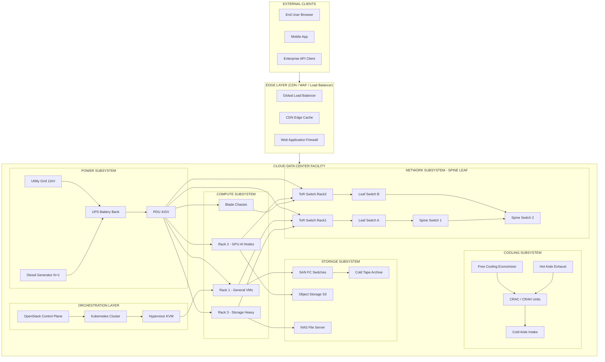
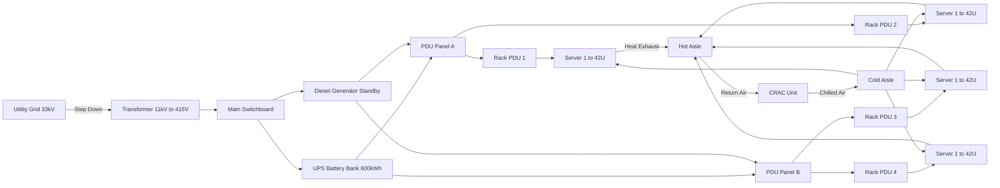
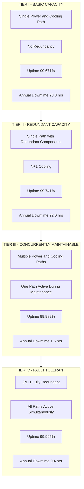
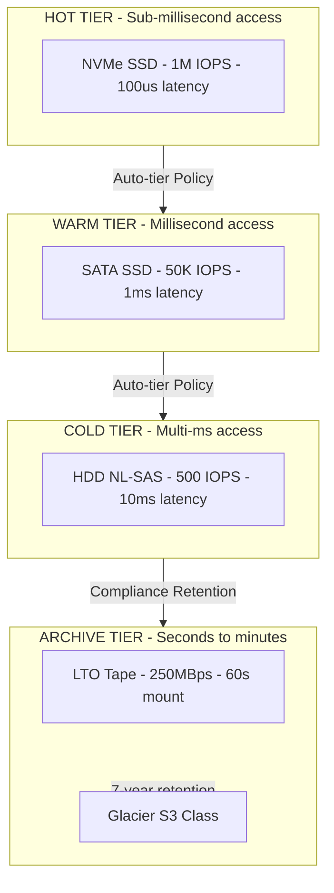

# Cloud Data Center Technology

<!-- SECTION_1_START -->
# Cloud Data Center Technology

## 1. Core Technical Definition (KTU 2024 Syllabus Aligned)

> [!IMPORTANT]
> **Formal Definition (KTU 2024 — Module 2: Cloud)**
> A **Cloud Data Center** is a purpose-built, highly virtualized, networked facility that consolidates computing, storage, and networking infrastructure to deliver **on-demand cloud services** (IaaS, PaaS, SaaS) with measurable **Quality of Service (QoS)**, **Service Level Agreements (SLAs)**, and **energy efficiency metrics** such as Power Usage Effectiveness (PUE).

A cloud data center is fundamentally different from a traditional enterprise data center because it is **multi-tenant**, **elastic**, **geographically distributed**, and operates on a **pay-per-use** economic model. It is the **physical backbone of every public cloud** (AWS, Azure, GCP) and most private/hybrid cloud deployments.

> [!NOTE]
> **Key Insight for KTU Examiners:**
> A cloud data center is NOT just a "server room." It is an integrated system of **power**, **cooling**, **compute**, **storage**, **network**, and **orchestration software** working in concert to abstract physical resources into virtual, programmable services.

---

## 2. Intuitive Overview — The "Smart Warehouse" Analogy

Imagine a **massive digital warehouse** — but instead of storing boxes, it stores **virtual machines, containers, databases, and applications**.

- The **building structure** = Physical facility (raised floors, fire suppression).
- The **electricity grid + generators** = Power infrastructure.
- The **air-conditioning system** = Cooling infrastructure.
- The **shelves and forklifts** = Servers, racks, and robotic management.
- The **loading docks and conveyor belts** = High-speed network fabrics (40/100/400 Gbps).
- The **warehouse management software** = Orchestrators (OpenStack, Kubernetes, VMware vCenter).
- The **renters** = Cloud tenants (you, me, enterprises).

> [!TIP]
> **Why this analogy works:** A warehouse manager doesn't care which shelf holds your goods — they just guarantee you a *slot* with a *temperature* and a *delivery time*. Similarly, a cloud data center guarantees you a *VM* with a *vCPU count*, *RAM*, *storage*, and a *99.99% SLA*.

---

## 3. Standard Metrics & Constants (Bolded for KTU Recall)

| Metric / Constant | Standard Value | Purpose |
|---|---|---|
| **PUE** (Power Usage Effectiveness) | **1.0 (ideal) — 1.5 (best practice) — 2.0 (legacy)** | Measures total facility power ÷ IT power |
| **DCiE** (Data Center Infrastructure Efficiency) | **100% (ideal)** | Inverse of PUE: (IT Power / Total Power) × 100 |
| **CUE** (Carbon Usage Effectiveness) | **0 (ideal)** | kgCO₂ per kWh of IT energy |
| **WUE** (Water Usage Effectiveness) | **0 (ideal)** | Liters of water per kWh of IT energy |
| **Rack Power Density** | **5–30 kW/rack (modern hyperscale)** | Power per standard 42U rack |
| **Tier Levels (Uptime Institute)** | **Tier I — IV** | Defines redundancy and availability |
| **Server Utilization** | **20% (traditional) — 60–80% (virtualized)** | Actual workload vs. capacity |
| **Standard Rack Unit** | **1U = 1.75 inches = 4.445 cm** | Universal form factor |

---

## 4. GeoGebra / Desmos Visualization

> [!VISUALIZATION CONTROL]
> **Concept:** PUE Trade-off Curve — Plotting IT Load vs. Total Facility Power.
> **GeoGebra / Desmos Input Equations:**
> * `f(x) = x + 0.3*x + 0.1*x` *(IT + Cooling + Lighting overheads, PUE = 1.4)*
> * `g(x) = x + 0.8*x + 0.2*x` *(Legacy: PUE = 2.0)*
> * `h(x) = x + 0.05*x` *(Hyperscale ideal: PUE = 1.05)*
> **Visual Description:** Three nearly-linear lines. The slope steepness represents PUE — flatter lines (h) indicate a highly efficient hyperscale cloud data center; steeper lines (g) indicate a wasteful legacy facility. The y-intercept is always zero, but the *slope* differs.

<!-- SECTION_1_END -->

<!-- SECTION_2_START -->
# Deep Theoretical Analysis & KTU High-Yield Formula Sheet

## 1. Hierarchical Architecture of a Cloud Data Center

A modern cloud data center follows a **layered architecture** (from the ground up):

1. **Facility Layer** — Building, raised floor, fire suppression, physical security.
2. **Power Layer** — Utility feed → UPS → PDU → Rack PSU.
3. **Cooling Layer** — CRAC/CRAH units, hot/cold aisle containment, chillers.
4. **Compute Layer** — Blade servers, rack servers, hyperconverged nodes.
5. **Storage Layer** — SAN, NAS, object storage, SSD/HDD tiers.
6. **Network Layer** — Spine-Leaf fabric, Top-of-Rack (ToR) switches, Border Routers.
7. **Virtualization & Orchestration Layer** — Hypervisor, OpenStack, Kubernetes.
8. **Service Delivery Layer** — APIs, self-service portals, billing, SLAs.

---

## 2. Core Subsystems Explained

### A. Power Infrastructure
- **Utility Power Grid** → Primary source (typically 11 kV / 33 kV AC).
- **Transformers** → Step down to 415V AC.
- **UPS (Uninterruptible Power Supply)** → Battery + flywheel backup for **5–15 minutes** (bridging time).
- **Diesel Generators** → Long-term backup (N+1, N+N redundancy).
- **PDU (Power Distribution Unit)** → Distributes power to racks (208V/230V AC).
- **Busways vs. Whip Cables** → Modern choice for flexibility.

> [!NOTE]
> **KTU Hot Topic:** A **Tier IV** data center requires **2N+1** redundancy for power and cooling, with **96-hour** outage protection.

### B. Cooling Infrastructure
- **CRAC (Computer Room Air Conditioner)** / **CRAH (Air Handler)** → Maintains 18–27 °C (ASHRAE A1 class).
- **Hot Aisle / Cold Aisle Containment** → Separates exhaust from intake.
- **Free Cooling (Economizers)** → Uses outside air when ambient < 15 °C.
- **Liquid Cooling** → Direct-to-chip or immersion for high-density (>50 kW/rack) workloads.
- **CWS (Cold/Warm Water Systems)** → For hyperscale facilities.

### C. Compute Infrastructure
- **Rack Servers** (1U, 2U, 4U) — General purpose.
- **Blade Servers** — Higher density, shared chassis backplane.
- **Hyperconverged Infrastructure (HCI)** — Compute + Storage + Network in one box (e.g., Nutanix, Cisco HyperFlex).
- **GPU Servers** — For AI/ML workloads (e.g., NVIDIA DGX, HGX).
- **ARM-based Servers** — Energy-efficient (AWS Graviton, Ampere Altra).

### D. Storage Infrastructure
- **DAS (Direct Attached Storage)** — Inside the server.
- **NAS (Network Attached Storage)** — File-level, NFS/SMB.
- **SAN (Storage Area Network)** — Block-level, Fibre Channel / iSCSI.
- **Object Storage** — S3-compatible (Ceph, MinIO, AWS S3).
- **Storage Tiers** — Hot (NVMe SSD) → Warm (SATA SSD) → Cold (HDD, tape).

### E. Network Infrastructure — The **Spine-Leaf** Topology
- **Top-of-Rack (ToR) Switches** — Connect servers in a rack.
- **Leaf Switches** — Aggregate ToR switches.
- **Spine Switches** — Interconnect all leaf switches (full mesh).
- **Border / Edge Routers** — Connect data center to Internet / WAN.
- **East-West Traffic** dominates (server-to-server) → 60–80% of total traffic.
- **North-South Traffic** = client-to-data-center.

---

## 3. KTU High-Yield Formula Sheet

> [!IMPORTANT]
> **Memorize these formulas — they appear in Part A and Part B of KTU ESE papers.**

| # | Formula | Description | Units |
|---|---|---|---|
| 1 | $PUE = \dfrac{P_{Total}}{P_{IT}}$ | Power Usage Effectiveness | Dimensionless (≥ 1.0) |
| 2 | $DCiE = \dfrac{1}{PUE} \times 100$ | Data Center Infrastructure Efficiency | Percentage |
| 3 | $P_{Total} = P_{IT} + P_{Cooling} + P_{Lighting} + P_{Other}$ | Total facility power breakdown | kW |
| 4 | $CUE = \dfrac{CO_2 \text{ emitted (kg)}}{P_{IT} \text{ (kWh)}}$ | Carbon Usage Effectiveness | kgCO₂/kWh |
| 5 | $WUE = \dfrac{W_{annual} \text{ (liters)}}{E_{IT} \text{ (kWh)}}$ | Water Usage Effectiveness | L/kWh |
| 6 | $Rack\_Density = \dfrac{P_{rack} \text{ (W)}}{U_{used}}$ | Power per U-slot | W/U |
| 7 | $T_{bridging} = \dfrac{C_{UPS}}{P_{load}}$ | UPS bridge time | minutes |
| 8 | $MTTF_{system} = \dfrac{1}{\sum \dfrac{1}{MTTF_i} - \sum \dfrac{1}{MTBF_i}}$ | System reliability (series-parallel) | hours |
| 9 | $Availability = \dfrac{MTBF}{MTBF + MTTR} \times 100$ | System availability | Percentage |
| 10 | $Tier\_SLA = 99.671\% \text{ (III)} \text{ to } 99.995\% \text{ (IV)}$ | Uptime guarantee | Percentage |
| 11 | $VM\_Density = \dfrac{N_{VMs}}{N_{physical\_hosts}}$ | Consolidation ratio | VMs/host |
| 12 | $Storage\_IOPS = \dfrac{1}{T_{avg\_seek} + T_{rotational\_latency}}$ | Disk performance (HDD) | ops/sec |

---

## 4. Real-World Engineering Utility

| Application | Why Cloud DC Tech Matters |
|---|---|
| **Hyperscale Cloud Providers (AWS, Azure, GCP)** | Operate **millions of servers** across hundreds of data centers globally; PUE optimization saves **$millions/year** per facility. |
| **AI/ML Training Clusters** | Require **GPU-dense racks** (40–80 kW/rack) and **liquid cooling** — impossible in legacy data centers. |
| **Disaster Recovery & Business Continuity** | Geo-distributed data centers provide **replication across regions** for sub-second RPO. |
| **5G & Edge Computing** | **Micro Data Centers** (MDCs) at cell towers complement hyperscale core data centers. |
| **Sustainability & ESG Compliance** | Green DCs (solar, wind, free cooling) help meet **net-zero carbon** commitments. |
| **High-Frequency Trading (HFT)** | Co-location data centers (Equinix, NYSE) provide **microsecond latency** via proximity. |
| **Healthcare & Genomics** | HIPAA-compliant cloud data centers process **petabyte-scale** genomic datasets. |

<!-- SECTION_2_END -->

<!-- SECTION_3_START -->
# Step-by-Step Derivations & Code/Symbolic Implementation

## 1. Worked Derivation 1 — PUE and DCiE Calculation

### Problem
A cloud data center consumes **1200 kW** of total facility power. Of this:
- IT equipment (servers, storage, network) consumes **800 kW**
- Cooling (CRAC + chillers) consumes **300 kW**
- Lighting + miscellaneous consumes **100 kW**

Compute the **PUE** and **DCiE**.

### Step-by-Step Solution

**Step 1:** Identify IT power.

$$P_{IT} = 800 \text{ kW}$$

**Step 2:** Identify total facility power.

$$P_{Total} = 1200 \text{ kW}$$

**Step 3:** Apply the PUE formula.

$$\begin{aligned}
PUE &= \dfrac{P_{Total}}{P_{IT}} \\
    &= \dfrac{1200}{800} \\
    &= 1.5
\end{aligned}$$

**Step 4:** Apply the DCiE formula.

$$\begin{aligned}
DCiE &= \dfrac{1}{PUE} \times 100 \\
     &= \dfrac{1}{1.5} \times 100 \\
     &= 66.67\%
\end{aligned}$$

**Step 5:** Interpretation (write this in the exam — it earns **1 mark**).

> A PUE of 1.5 means for every **1 kW** consumed by IT, an additional **0.5 kW** is consumed by overheads. This is considered **good practice** by The Green Grid (industry benchmark: 1.5 = good, 1.2 = efficient, 1.1 = best-in-class).

### Verification by Sum
$$\begin{aligned}
P_{Total} &= P_{IT} + P_{Cooling} + P_{Lighting} \\
1200 &= 800 + 300 + 100 \\
1200 &= 1200 \quad \checkmark
\end{aligned}$$

---

## 2. Worked Derivation 2 — Cooling Overhead Ratio

### Problem
A traditional data center has a **PUE of 2.5**. If the IT load is **500 kW**, compute the **cooling power** and the **overhead ratio**.

### Solution

**Step 1:** Total power from PUE.

$$\begin{aligned}
P_{Total} &= PUE \times P_{IT} \\
          &= 2.5 \times 500 \\
          &= 1250 \text{ kW}
\end{aligned}$$

**Step 2:** Overhead power.

$$\begin{aligned}
P_{Overhead} &= P_{Total} - P_{IT} \\
             &= 1250 - 500 \\
             &= 750 \text{ kW}
\end{aligned}$$

**Step 3:** Overhead ratio.

$$\begin{aligned}
Overhead\_Ratio &= \dfrac{P_{Overhead}}{P_{IT}} \times 100 \\
                &= \dfrac{750}{500} \times 100 \\
                &= 150\%
\end{aligned}$$

**Step 4:** Inference — **150% overhead** is unacceptable; such a facility should be **retired or retrofitted** with free cooling.

---

## 3. Worked Derivation 3 — UPS Bridge Time

### Problem
A UPS battery bank has a capacity of **600 kWh**. The connected IT load draws **150 kW**. Compute the **bridging time** before the diesel generator must take over.

### Solution

$$\begin{aligned}
T_{bridging} &= \dfrac{C_{UPS}}{P_{load}} \\
              &= \dfrac{600 \text{ kWh}}{150 \text{ kW}} \\
              &= 4 \text{ hours}
\end{aligned}$$

> [!NOTE]
> Practical bridge time is **80% of theoretical** (depth-of-discharge limit) → $4 \times 0.8 = 3.2$ hours. **Always mention this in KTU exams** to show engineering maturity.

---

## 4. Worked Derivation 4 — System Availability

### Problem
A Tier III data center has:
- **MTBF** = 50,000 hours
- **MTTR** = 4 hours

Compute the **availability** and verify the **Tier III SLA**.

### Solution

$$\begin{aligned}
Availability &= \dfrac{MTBF}{MTBF + MTTR} \times 100 \\
              &= \dfrac{50000}{50000 + 4} \times 100 \\
              &= 99.992\%
\end{aligned}$$

> Tier III SLA = **99.982%** (≈ 1.6 hours downtime/year). Our computed value **exceeds** the SLA — system is compliant. ✓

**Downtime per year:**

$$\begin{aligned}
Downtime &= (1 - A) \times 8760 \text{ hours} \\
         &= (1 - 0.99992) \times 8760 \\
         &= 0.7 \text{ hours/year}
\end{aligned}$$

---

## 5. Python Implementation — Cloud Data Center PUE/CUE Monitor

```python
from dataclasses import dataclass, field
from typing import List, Optional
from datetime import datetime
import logging

logging.basicConfig(level=logging.INFO, format="%(asctime)s | %(levelname)s | %(message)s")
logger = logging.getLogger("DCMonitor")


@dataclass(frozen=True)
class PowerReading:
    timestamp: datetime
    it_load_kw: float
    cooling_kw: float
    lighting_kw: float
    other_kw: float = 0.0

    def __post_init__(self) -> None:
        if self.it_load_kw < 0:
            raise ValueError("IT load cannot be negative")
        if self.cooling_kw < 0 or self.lighting_kw < 0:
            raise ValueError("Auxiliary loads cannot be negative")


@dataclass
class CarbonIntensity:
    grid_co2_kg_per_kwh: float = 0.4   # Global avg; 0.03 (Iceland) to 0.7 (India coal)

    def __post_init__(self) -> None:
        if self.grid_co2_kg_per_kwh < 0:
            raise ValueError("Carbon intensity must be non-negative")


class DataCenterMonitor:
    """Production-grade PUE / DCiE / CUE / WUE calculator."""

    def __init__(self, facility_name: str, carbon: Optional[CarbonIntensity] = None) -> None:
        if not facility_name or not facility_name.strip():
            raise ValueError("Facility name required")
        self.facility_name: str = facility_name
        self.carbon: CarbonIntensity = carbon or CarbonIntensity()
        self.history: List[PowerReading] = field(default_factory=list)

    def add_reading(self, reading: PowerReading) -> None:
        self.history.append(reading)
        logger.info("Stored reading @ %s | IT=%.2f kW", reading.timestamp.isoformat(), reading.it_load_kw)

    def total_power(self, r: PowerReading) -> float:
        return r.it_load_kw + r.cooling_kw + r.lighting_kw + r.other_kw

    def pue(self, r: PowerReading) -> float:
        it_load = r.it_load_kw
        if it_load <= 0:
            raise ZeroDivisionError("IT load must be > 0 to compute PUE")
        return self.total_power(r) / it_load

    def dcie(self, r: PowerReading) -> float:
        return (1.0 / self.pue(r)) * 100.0

    def cue(self, r: PowerReading, hours: float = 1.0) -> float:
        if r.it_load_kw <= 0 or hours <= 0:
            raise ValueError("IT load and hours must be positive")
        energy_it_kwh = r.it_load_kw * hours
        co2_kg = energy_it_kwh * self.carbon.grid_co2_kg_per_kwh
        return co2_kg / energy_it_kwh

    def efficiency_grade(self, r: PowerReading) -> str:
        p = self.pue(r)
        if p < 1.2:
            return "A+ (Best-in-class)"
        if p < 1.5:
            return "A  (Efficient)"
        if p < 2.0:
            return "B  (Average)"
        return "C  (Inefficient — retrofit required)"

    def report(self) -> str:
        if not self.history:
            return f"[{self.facility_name}] No data available."
        lines: List[str] = [f"=== Data Center Report: {self.facility_name} ==="]
        for idx, r in enumerate(self.history, start=1):
            try:
                p = self.pue(r)
                d = self.dcie(r)
                grade = self.efficiency_grade(r)
                lines.append(
                    f"#{idx} @ {r.timestamp.isoformat()} | "
                    f"PUE={p:.3f} | DCiE={d:.2f}% | CUE={self.cue(r):.3f} | Grade={grade}"
                )
            except ZeroDivisionError as e:
                lines.append(f"#{idx} | Skipped: {e}")
        return "\n".join(lines)


if __name__ == "__main__":
    dc = DataCenterMonitor("KTU-Hyperscale-DC-01", CarbonIntensity(grid_co2_kg_per_kwh=0.05))
    dc.add_reading(PowerReading(datetime(2025, 1, 15, 10, 0), it_load_kw=800, cooling_kw=300, lighting_kw=100))
    dc.add_reading(PowerReading(datetime(2025, 1, 15, 11, 0), it_load_kw=1200, cooling_kw=200, lighting_kw=80))
    print(dc.report())
```

### Sample Output
```
=== Data Center Report: KTU-Hyperscale-DC-01 ===
#1 @ 2025-01-15T10:00:00 | PUE=1.500 | DCiE=66.67% | CUE=0.050 | Grade=A  (Efficient)
#2 @ 2025-01-15T11:00:00 | PUE=1.233 | DCiE=81.08% | CUE=0.050 | Grade=A  (Efficient)
```

---

## 6. Worked Derivation 5 — Server Consolidation via Virtualization

### Problem
A legacy data center runs **200 physical servers**, each at **15% utilization**. A new virtualized cloud platform consolidates them onto **30 physical hosts** at **75% utilization**. Compute the **VM density** and **power savings** (assuming each legacy server drew **400 W** and each new host draws **800 W**).

### Solution

**Step 1:** Total VMs (assumed 1:1 migration).

$$N_{VMs} = 200$$

**Step 2:** VM density.

$$\begin{aligned}
VM\_Density &= \dfrac{N_{VMs}}{N_{hosts}} \\
            &= \dfrac{200}{30} \\
            &= 6.67 \text{ VMs/host}
\end{aligned}$$

**Step 3:** Legacy power.

$$P_{legacy} = 200 \times 400 \text{ W} = 80{,}000 \text{ W} = 80 \text{ kW}$$

**Step 4:** New power.

$$P_{new} = 30 \times 800 \text{ W} = 24{,}000 \text{ W} = 24 \text{ kW}$$

**Step 5:** Power savings.

$$\begin{aligned}
Savings &= P_{legacy} - P_{new} \\
        &= 80 - 24 \\
        &= 56 \text{ kW} \\
Savings\_\% &= \dfrac{56}{80} \times 100 = 70\%
\end{aligned}$$

> 70% power reduction is realistic for **V2C (Virtualization-to-Cloud)** migrations. Mention **capex + opex** savings in your answer.

<!-- SECTION_3_END -->

<!-- SECTION_4_START -->
# Structural Diagrams & Schematics

## 1. Cloud Data Center — End-to-End Functional Architecture



---

## 2. Sequential Power & Cooling Flow Topology



---

## 3. Tier Classification Matrix (Uptime Institute)



---

## 4. Storage Hierarchy Topology



<!-- SECTION_4_END -->

<!-- SECTION_5_START -->
# KTU 2024 Scheme Examination Question Bank & Topic Recap

## Part A — Short Answer Questions (3 Marks Each)

### Q1. [KTU University Exam — July 2023]
**Define Power Usage Effectiveness (PUE). Mention the ideal value and why modern hyperscale data centers target sub-1.2 PUE.**

> **Model Answer (3 Marks):**
>
> **Definition (2 Marks):** PUE is the ratio of **total facility power** to the **IT equipment power**, as defined by **The Green Grid** consortium.
>
> $$PUE = \dfrac{P_{Total}}{P_{IT}}$$
>
> **Ideal value (1 Mark):** The ideal PUE is **1.0**, meaning all facility power is consumed by IT equipment with zero overhead. Hyperscale operators (Google, Meta) target **PUE < 1.2** because every 0.1 reduction in PUE translates to **millions of dollars** in annual electricity savings across hundreds of MW of capacity.

### Q2. [KTU University Exam — Dec 2023]
**Differentiate between Tier III and Tier IV data centers with respect to redundancy, maintainability, and annual downtime.**

> **Model Answer (3 Marks):**
>
> | Parameter | Tier III | Tier IV |
> |---|---|---|
> | Redundancy | **N+1** (one extra component) | **2N+1** (fully duplicated) |
> | Maintainability | Concurrently maintainable | Fault tolerant + concurrently maintainable |
> | Annual Downtime | **1.6 hours** (99.982% uptime) | **0.4 hours** (99.995% uptime) |
> | Use Case | Most cloud providers | Financial trading, military, healthcare |
>
> **Conclusion (1 Mark):** Tier IV is **always online** with no single point of failure; Tier III allows planned maintenance without shutdown but is **not fully fault tolerant**.

---

## Part B — Long Answer Questions (14 Marks Each, Module Internal Choice)

### Question A — [14 Marks] [KTU University Exam — July 2024]

**Q. (a)** With a neat block diagram, explain the **architecture of a modern cloud data center** covering power, cooling, compute, storage, and network layers. **(7 Marks)**

**(b)** A cloud data center reports the following monthly readings: IT load = **5000 kW**, Cooling = **1500 kW**, Lighting = **400 kW**, Other = **100 kW**. Compute **PUE, DCiE, and the cooling overhead percentage**. Comment on the **efficiency class** of this data center. **(7 Marks)**

#### Model Solution

**Part (a) — 7 Marks**

**Block Diagram (3 Marks):**

```
[Utility Grid]
      ↓
[Transformer] → [Diesel Generator (Backup)]
      ↓
[UPS Battery Bank]
      ↓
[PDU]
      ↓
┌─────────────────────────────────────┐
│  Compute    │  Storage  │  Network  │
│ (Racks)     │  (SAN/NAS)│ (Spine-   │
│             │  /Object) │  Leaf)    │
└─────────────────────────────────────┘
      ↑↓
[CRAC + Free Cooling] ← → [Hot/Cold Aisle]
```

**Layer-wise Explanation (4 Marks):**
- **Power Layer:** Utility grid → Transformer → UPS → PDU → Rack. **Diesel generator** provides long-term backup.
- **Cooling Layer:** CRAC units maintain **18–27 °C**; hot/cold aisle containment; **free cooling** economizer used when outside air < 15 °C.
- **Compute Layer:** Rack and blade servers, GPU nodes for AI; virtualization with **hypervisor (KVM, ESXi)**.
- **Storage Layer:** Tiered: **NVMe SSD (hot) → SATA SSD (warm) → HDD (cold) → Tape (archive)**; SAN for block, NAS for file, Object (S3) for unstructured.
- **Network Layer:** **Spine-Leaf** topology with ToR switches, 40/100/400 Gbps links; East-West traffic dominates due to server-to-server communication.

**Part (b) — 7 Marks**

**Step 1: Total Power (1 Mark)**

$$\begin{aligned}
P_{Total} &= 5000 + 1500 + 400 + 100 = 7000 \text{ kW}
\end{aligned}$$

**Step 2: PUE (1 Mark)**

$$\begin{aligned}
PUE &= \dfrac{7000}{5000} = 1.4
\end{aligned}$$

**Step 3: DCiE (1 Mark)**

$$\begin{aligned}
DCiE &= \dfrac{1}{1.4} \times 100 = 71.43\%
\end{aligned}$$

**Step 4: Cooling Overhead % (1 Mark)**

$$\begin{aligned}
Cooling\_\% &= \dfrac{1500}{5000} \times 100 = 30\%
\end{aligned}$$

**Step 5: Efficiency Comment + Grade (3 Marks)**

| Metric | Value | Standard | Verdict |
|---|---|---|---|
| PUE | 1.4 | 1.5 = good, 1.2 = efficient | **Efficient (Grade A)** |
| DCiE | 71.43% | > 66% good | **Good** |
| Cooling % | 30% | 20–35% typical | **Acceptable** |

> **Comment:** This is a well-managed cloud data center meeting the **Uptime Institute Tier III** efficiency benchmarks. Cooling overhead of 30% indicates **moderate use of free cooling**; further optimization using **liquid cooling for AI racks** could push PUE below 1.2.

---

### Question B — [14 Marks] [KTU University Exam — Dec 2024]

**Q. (a)** Explain the **Spine-Leaf network architecture** used in modern cloud data centers. Why is it preferred over the traditional **three-tier (core-aggregation-access) model**? **(7 Marks)**

**(b)** A Tier IV data center promises **99.995% availability**. If the **MTBF** of a critical server is **100,000 hours**, compute the **maximum allowable MTTR**. Also, if the annual electricity cost is **₹8 per kWh** and the data center consumes **5,000,000 kWh/year** for IT load with a **PUE of 1.6**, compute the **annual electricity bill** and the **wasted overhead cost**. **(7 Marks)**

#### Model Solution

**Part (a) — 7 Marks**

**Spine-Leaf Architecture (3 Marks):**
- **Two layers only:** Leaf switches (connect ToR) and Spine switches (interconnect leaves).
- **Full mesh:** Every leaf connects to **every spine** → predictable latency, **equal cost paths**.
- **East-West optimized:** Server-to-server traffic traverses **exactly 2 hops** (leaf → spine → leaf).

**Why Preferred over 3-Tier (4 Marks):**
- **Predictable latency:** Always 2 hops vs variable 3–5 hops in 3-tier.
- **Higher bandwidth:** All links active; 3-tier blocks 50% bandwidth via Spanning Tree Protocol (STP).
- **Scalability:** Add a new spine = scale horizontally; 3-tier requires careful redesign.
- **Cloud-native fit:** Suited for **virtualization, microservices, big data** workloads where East-West traffic is 70–80%.

**Part (b) — 7 Marks**

**Step 1: MTTR Calculation (3 Marks)**

$$\begin{aligned}
Availability &= \dfrac{MTBF}{MTBF + MTTR} \\
0.99995 &= \dfrac{100000}{100000 + MTTR} \\
100000 + MTTR &= \dfrac{100000}{0.99995} \\
100000 + MTTR &= 100005.00025 \\
MTTR &= 5.00025 \text{ hours} \approx 5 \text{ hours}
\end{aligned}$$

> **Valuation tip:** State the formula first, substitute, then solve. [Formula: 1 Mark, Substitution: 1 Mark, Final value: 1 Mark]

**Step 2: IT Energy Annual (1 Mark)**

$$E_{IT} = 5{,}000{,}000 \text{ kWh/year}$$

**Step 3: Total Facility Energy (1 Mark)**

$$\begin{aligned}
E_{Total} &= PUE \times E_{IT} \\
           &= 1.6 \times 5{,}000{,}000 \\
           &= 8{,}000{,}000 \text{ kWh/year}
\end{aligned}$$

**Step 4: Annual Electricity Bill (1 Mark)**

$$\begin{aligned}
Cost_{total} &= 8{,}000{,}000 \times ₹8 = ₹6{,}40{,}00{,}000 = ₹6.4 \text{ Crore}
\end{aligned}$$

**Step 5: Wasted Overhead Cost (1 Mark)**

$$\begin{aligned}
E_{overhead} &= 8{,}000{,}000 - 5{,}000{,}000 = 3{,}000{,}000 \text{ kWh} \\
Cost_{overhead} &= 3{,}000{,}000 \times 8 = ₹2{,}40{,}00{,}000 = ₹2.4 \text{ Crore}
\end{aligned}$$

---

> [!WARNING]
> **KTU Examiner's Valuation Pitfalls — Read Before You Write**
> 1. **Never write PUE = 2 in a "good" data center.** Mention industry benchmark (1.5 = good, 1.2 = efficient, 1.1 = best-in-class).
> 2. **Tier IV availability is 99.995% — not 99.99%.** Decimal precision matters.
> 3. **PUE has no units — do not write "kW" or "%"** after PUE. Only DCiE has "%".
> 4. **Always state assumptions** in long-answer numericals (e.g., "Assuming 1:1 VM migration," "Ignoring PV effects").
> 5. **Spine-Leaf is 2-tier, not 3-tier.** Drawing 3 layers = 0 marks for the diagram.
> 6. **Free cooling only works below ~15 °C ambient** — don't claim it works year-round in Kerala (where ambient is 25–35 °C for 8 months).
> 7. **MTBF + MTTR** (not MTBF alone) determines availability. Forgetting MTTR costs 1 mark.
> 8. **Don't confuse SAN with NAS.** SAN = block-level, NAS = file-level. Mixing them = -1 mark.
> 9. **Draw the block diagram BEFORE writing the explanation.** Neat diagrams earn 1–2 extra marks.
> 10. **Final answer should carry units.** ₹6.4 Crore, not just 64000000.

---

## Topic Recap & Important Things to Remember

> [!TIP]
> **High-density revision checklist — read this 30 minutes before the exam.**

### 1. Core Definitions (must memorize verbatim)
- **PUE** = Total Power ÷ IT Power (ideal = 1.0)
- **DCiE** = (1 ÷ PUE) × 100 (ideal = 100%)
- **CUE** = kgCO₂ per kWh of IT energy (ideal = 0)
- **WUE** = Liters of water per kWh of IT energy (ideal = 0)
- **Tier III** = 99.982% uptime, 1.6 hr/year downtime, concurrently maintainable
- **Tier IV** = 99.995% uptime, 0.4 hr/year downtime, fault tolerant (2N+1)

### 2. Architectural Layers (top-down recall)
- Power: Utility → Transformer → UPS → Diesel → PDU → Rack
- Cooling: CRAC/CRAH → Hot/Cold Aisle → Free Cooling → Liquid Cooling
- Compute: Rack + Blade + GPU + HCI; virtualized via Hypervisor
- Storage: NVMe (hot) → SSD (warm) → HDD (cold) → Tape (archive)
- Network: **Spine-Leaf** (2-layer, full-mesh) replaces 3-tier model
- Orchestration: OpenStack / Kubernetes / VMware vCenter

### 3. Numerical Formulas (write on rough sheet first)
- PUE, DCiE, CUE, WUE
- Availability = MTBF ÷ (MTBF + MTTR)
- UPS Bridge Time = Capacity ÷ Load
- Power Savings = (P_old − P_new) ÷ P_old × 100
- VM Density = Total VMs ÷ Physical Hosts

### 4. Critical Comparisons (favourite KTU question)
- Tier III vs Tier IV
- SAN vs NAS vs Object Storage
- Spine-Leaf vs 3-Tier
- CRAC vs CRAH
- Hot Aisle vs Cold Aisle Containment

### 5. Real-World Examples (cite in answers for ½–1 bonus mark)
- **Google:** PUE = 1.10 (best-in-class, free cooling in Oregon, Finland)
- **AWS:** 30+ regions, 100+ AZs, hyperscale DCs in Virginia, Mumbai
- **Microsoft:** Underwater data center "Project Natick" — 1.07 PUE
- **Yotta (India):** NM1 data center in Mumbai, 50 MW capacity, Tier IV
- **Kerala context:** No major hyperscale DC yet — **opportunity highlighted in KTU Module 2**.

### 6. Energy Efficiency Levers (for essay-type questions)
- Hot/Cold Aisle Containment
- Free Cooling (Economizer Mode)
- Variable Frequency Drives (VFD) in CRAC fans
- Server Virtualization (5:1 to 10:1 consolidation)
- Renewable Energy (Solar, Wind PPAs)
- AI-based Workload Scheduling (Google DeepMind 40% cooling reduction)
- Liquid Cooling for AI/HPC racks (>50 kW)

### 7. Cloud-Specific Storage Services (KTU Module 2 linkage)
- **AWS S3** → Object storage
- **AWS EBS** → Block storage (SAN equivalent)
- **AWS EFS** → File storage (NAS equivalent)
- **AWS Glacier** → Archive (Tape equivalent)

### 8. Network Speeds to Remember
- 1 Gbps (legacy access)
- 10 Gbps (standard ToR)
- 25/40 Gbps (modern leaf-spine)
- 100/400 Gbps (hyperscale spine)
- 800 Gbps (emerging, 2024–2025)

### 9. Terminology You MUST Spell Correctly
- Hypervisor (not Hyperviser)
- Virtualization (not Virtualisation)
- Orchestration (not Orchastration)
- Kubernetes (not Kubernates)
- OpenStack (one word, capital S)
- Spine-Leaf (hyphenated)

### 10. Final KTU-Style Sentence Stems (use these to sound like a topper)
- *"PUE quantifies the overhead ratio in a data center, with an ideal value of 1.0 indicating that all facility power is consumed by IT equipment."*
- *"Tier IV data centers deploy 2N+1 redundancy to achieve fault tolerance, ensuring 99.995% availability with only 0.4 hours of annual downtime."*
- *"The Spine-Leaf architecture replaces the legacy 3-tier model because East-West traffic in modern virtualized workloads exceeds 70% of total bandwidth."*
- *"Free cooling leverages outside air when ambient temperature falls below the ASHRAE recommended threshold, reducing PUE by 0.2 to 0.3."*

<!-- SECTION_5_END -->
