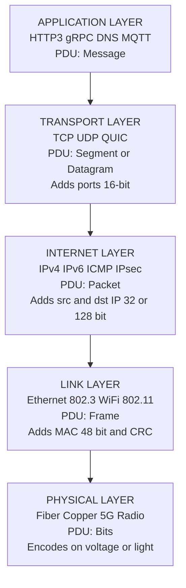
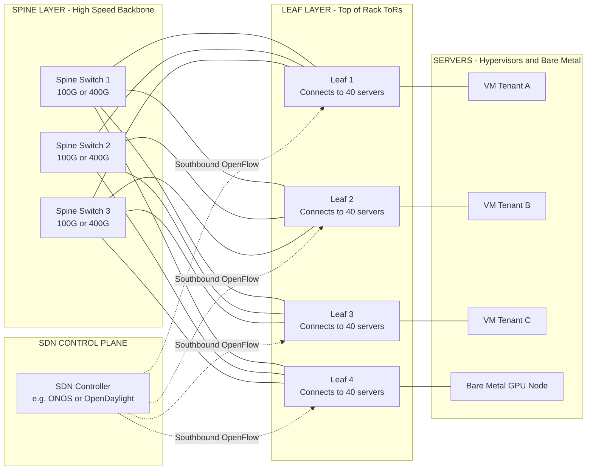
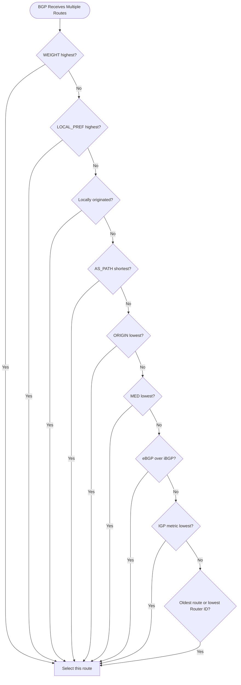
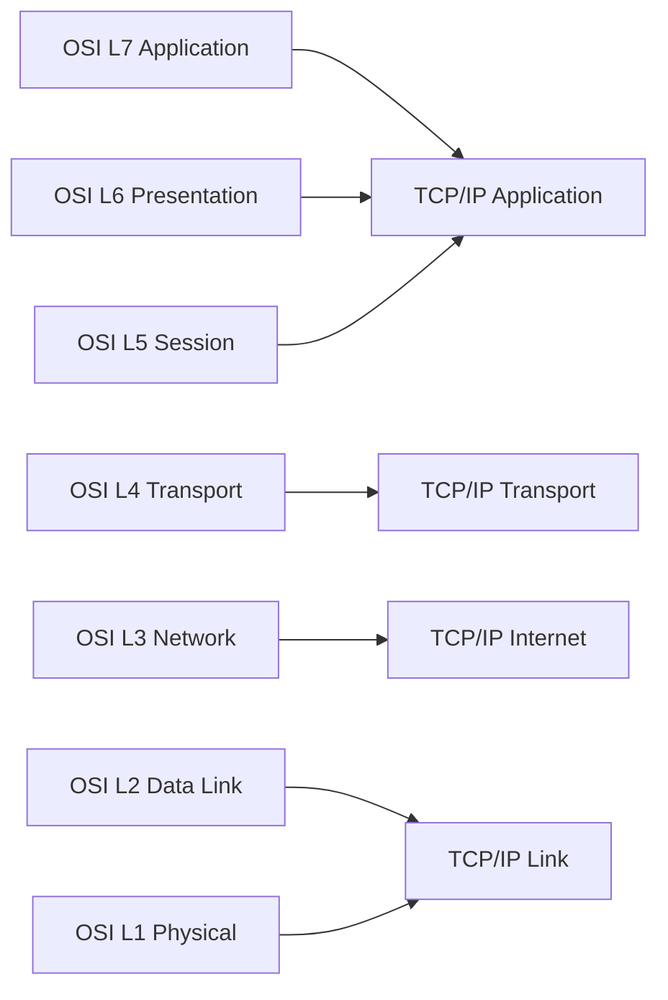

# Cloud-Enabling Technology - Networks and Internet Architecture

<!-- SECTION_1_START -->

# Cloud-Enabling Technology: Networks and Internet Architecture

## 1.1 Formal Academic Definition

> [!IMPORTANT]
> **KTU 2024 Syllabus Definition (PECST635 - Module 2):**
> *Cloud-Enabling Technology* refers to the existing as well as emerging technologies that form the foundational layer over which modern cloud platforms are constructed. Among these, **Networks and Internet Architecture** constitute the *connective tissue* of cloud computing — they define how distributed data centers, edge nodes, and end-user clients communicate, share resources, and exchange workloads across geographic boundaries.

In the context of the KTU 2024 Scheme (Cloud Computing - PECST635), *Networks and Internet Architecture* encompasses the layered design of the Internet (OSI and TCP/IP reference models), the switching and routing primitives that move packets across autonomous systems, the service-quality mechanisms (latency, throughput, jitter, packet loss), and the high-bandwidth interconnect fabrics (e.g., **10 Gbps to 400 Gbps** links) that tie together hyperscale data centers such as those operated by AWS, Azure, and Google Cloud.

> [!NOTE]
> **Why is this topic "Cloud-Enabling"?**
> Without a programmable, low-latency, high-throughput network substrate, the **on-demand, elastic, metered** delivery model promised by NIST's definition of cloud computing would collapse. The Internet is the medium; cloud computing is the service.

## 1.2 Conceptual Analogy — The "Smart Highway System"

Imagine a city where **goods (data packets)** must be transported between **factories (data centers)** and **homes (end users)**. The transportation system consists of:

| Real-World Element | Network Equivalent |
|---|---|
| National Highway | Internet Backbone (Tier-1 ISPs) |
| City Roads | Access Networks (LAN, Broadband, 4G/5G) |
| Traffic Signals | Switching \& Routing Protocols |
| Delivery Trucks | Packets / Frames / Segments |
| Warehouse Sorting System | Layered Protocol Stack (TCP/IP) |
| GPS Routing App | BGP, OSPF, IS-IS Routing Algorithms |
| Highway Toll System | QoS, Traffic Shaping, SDN Policies |

Just as goods cannot reach homes instantly without trucks, roads, and a routing plan, cloud workloads cannot reach users without protocols, physical links, and a routing architecture. The Internet Architecture is essentially the **rules, roads, and vehicles** of the digital economy.

## 1.3 The Internet Architecture — Layered View

> [!IMPORTANT]
> **Core Architectural Principle:** The Internet is built on a **layered, modular, best-effort** design philosophy, formalized by the **TCP/IP protocol suite** (4 layers) and conceptualized by the **OSI Reference Model** (7 layers). Each layer provides services to the layer above and consumes services from the layer below.

The 4-layer TCP/IP stack used in cloud backbones:

1. **Application Layer** — HTTP/3, gRPC, MQTT, DNS, SMTP
2. **Transport Layer** — TCP (reliable), UDP (fast), QUIC
3. **Network/Internet Layer** — IP (IPv4/IPv6), ICMP, IPsec
4. **Link/Network Access Layer** — Ethernet, Wi-Fi (802.11), Fiber, 5G NR

> [!TIP]
> **Visualization Hint:** Think of sending a parcel internationally. The *Application Layer* decides the content (a letter, a video frame). The *Transport Layer* chops it into numbered envelopes (TCP segments). The *Network Layer* writes the global address (IP). The *Link Layer* physically drives the parcel to the next post office (MAC address + physical medium).

> [!VISUALIZATION CONTROL]
> **Concept:** Layered encapsulation of a data packet traveling from a client to a cloud VM.
> **GeoGebra / Desmos Input Equations (Bar-Chart Style for Layer Overhead):**
> * `f(x) = 20` (Application header overhead, bytes)
> * `g(x) = 20` (Transport header — TCP)
> * `h(x) = 20` (Network header — IPv4)
> * `k(x) = 14` (Link header — Ethernet)
> **Visual Description:** A stacked horizontal bar showing **cumulative overhead per layer** as a packet descends the stack. The student should observe that *real payload* shrinks proportionally to *protocol overhead* (≈ 14% for a typical 1500-byte MTU packet).

## 1.4 The Building Blocks of Internet Architecture

The KTU 2024 module specifically emphasizes these primitives:

- **Packet Switching vs. Circuit Switching** — Cloud data movement is overwhelmingly *packet-switched*; the legacy *circuit-switched* PSTN is reserved for voice fall-back.
- **Datagram vs. Virtual Circuit** — IP is connectionless (datagram); MPLS and ATM use virtual circuits.
- **Routing Architectures** — Intra-domain (OSPF, IS-IS, RIP) vs. Inter-domain (BGP-4).
- **Overlay Networks** — VXLAN, GRE, GENEVE — used heavily in cloud multi-tenancy.
- **Software-Defined Networking (SDN)** — Decouples the control plane from the data plane.
- **Network Function Virtualization (NFV)** — Replaces dedicated appliances (firewalls, load balancers) with virtualized software.

> [!NOTE]
> **Standard Metrics You MUST Memorize for KTU ESE:**
> * **Latency** — measured in **milliseconds (ms)**
> * **Bandwidth** — measured in **bits per second (bps)**, commonly **Gbps**
> * **Jitter** — variance in latency, **ms**
> * **Packet Loss** — **percentage (%)** of packets dropped
> * **MTU (Maximum Transmission Unit)** — typically **1500 bytes** for Ethernet

<!-- SECTION_1_END -->

<!-- SECTION_2_START -->

# Deep Theoretical Analysis & KTU High-Yield Formula Sheet

## 2.1 The OSI 7-Layer Model vs. TCP/IP 4-Layer Model

The KTU 2024 syllabus expects students to map every modern protocol to its correct layer. The table below is a *high-yield comparison* that frequently appears in **Part A (3-mark) questions**.

| OSI Layer (7) | TCP/IP Layer (4) | Key Protocols | PDU (Protocol Data Unit) | Cloud Example |
|---|---|---|---|---|
| 7. Application | Application | HTTP/2, HTTP/3, gRPC, DNS, SSH, SMTP | Message | REST API call to S3 |
| 6. Presentation | Application | TLS 1.3, SSL, MPEG, JSON, Protobuf | Message | HTTPS encryption |
| 5. Session | Application | NetBIOS, RPC, SIP, WebSocket | Message | gRPC streaming |
| 4. Transport | Transport | TCP, UDP, QUIC | Segment / Datagram | TCP port 443 for HTTPS |
| 3. Network | Internet | IPv4, IPv6, ICMP, IPsec, OSPF, BGP | Packet | Routing to AWS region |
| 2. Data Link | Link | Ethernet (802.3), Wi-Fi (802.11), PPP, ARP | Frame | NIC ↔ Switch |
| 1. Physical | Link | Fiber, Copper, Radio, 5G NR | Bits | 100G LR4 optics |

> [!IMPORTANT]
> **Exam Pearl:** The OSI model is *conceptual/educational*; the TCP/IP model is *practical/implemented*. In Part A, students often confuse the *Session* and *Presentation* layers — the **real Internet collapses these into the Application layer** of TCP/IP.

## 2.2 Packet-Switching Principles

> [!TIP]
> **Operational Logic of Packet Switching (for a 14-mark Part B question):**
> 1. Source node breaks the message into fixed-size (or variable-size) *packets*.
> 2. Each packet carries a **header** containing source IP, destination IP, sequence number, and TTL.
> 3. Routers examine the destination IP, perform a **longest-prefix match** in the routing table, and forward the packet out the appropriate interface.
> 4. Packets from the same flow may take **different paths** (datagram service).
> 5. The destination reassembles packets in sequence; TCP handles reordering and retransmission.

### 2.2.1 Store-and-Forward vs. Cut-Through Switching

| Property | Store-and-Forward | Cut-Through |
|---|---|---|
| Buffer required | Full packet | Only header (~ 30-40 bytes) |
| Latency | Higher (waits for full frame) | Lower (forwards immediately) |
| Error checking | Yes (CRC verified) | Limited / None |
| Use case | Modern cloud switches, Linux bridges | Legacy high-frequency trading switches |

## 2.3 Routing Architectures — The Two Tiers

> [!NOTE]
> **Two-Tier Internet Routing Model (the actual production architecture):**
> * **Intra-Domain (Interior Gateway Protocols — IGP):** Operate *within* a single Autonomous System (AS). Examples: **OSPF, IS-IS, RIP, EIGRP**. Use *link-state* or *distance-vector* algorithms.
> * **Inter-Domain (Exterior Gateway Protocols — EGP):** Operate *between* ASes. The only protocol in production today is **BGP-4** (Border Gateway Protocol). BGP is a *path-vector* protocol that makes routing decisions based on **AS-PATH, LOCAL-PREF, MED**, and community attributes.

### 2.3.1 BGP Path Selection (simplified, KTU-relevant)

BGP chooses the "best" route using a strict precedence list (highest-precedence first):

1. Highest **WEIGHT** (Cisco-proprietary, local to router)
2. Highest **LOCAL_PREF** (within the AS)
3. Prefer **locally originated** routes
4. Shortest **AS_PATH**
5. Lowest **ORIGIN** (IGP < EGP < Incomplete)
6. Lowest **MED** (Multi-Exit Discriminator)
7. Prefer **eBGP** over **iBGP**
8. Lowest **IGP metric** to next-hop
9. Oldest route / lowest Router-ID

> [!IMPORTANT]
> **Cloud Computing Context:** AWS, Azure, and GCP operate **multi-region, multi-AZ** networks. They run *private* iBGP meshes inside their data centers and *public* eBGP sessions to peer with Tier-1 ISPs. Hyperscalers are themselves **Tier-1 ISPs in disguise**.

## 2.4 Software-Defined Networking (SDN) — The Cloud's Control Plane

SDN is arguably the **single most important network innovation enabling cloud computing**. It works by *decoupling*:

- **Data Plane** — packet forwarding (kept on the switch/router ASIC).
- **Control Plane** — routing decisions (moved to a centralized *controller* like **OpenDaylight, ONOS, or vendor-specific solutions**).
- **Application Plane** — business logic (firewall policies, load-balancer rules).

The controller talks to forwarding devices via **OpenFlow**, **NETCONF**, **gNMI**, or **OVSDB** — collectively called *southbound APIs*. Applications talk to the controller via *northbound APIs* (typically REST).

> [!TIP]
> **Analogy:** Think of SDN as a *city traffic control center*. Hundreds of traffic lights (data plane) used to be operated locally by timers. With SDN, all lights are coordinated by one *central control room* (controller) that dynamically re-routes traffic during rush hour, accidents, or large events.

## 2.5 Network Function Virtualization (NFV)

NFV replaces **dedicated hardware middleboxes** (firewalls, NAT, DPI, load balancers) with **software instances running on commodity x86/ARM servers**. The reference architecture (ETSI NFV) has three domains:

1. **VNF (Virtual Network Function)** — the software implementation of a network function.
2. **NFVI (NFV Infrastructure)** — the physical compute, storage, and networking resources.
3. **MANO (Management and Orchestration)** — **NFVO + VNFM + VIM**, responsible for lifecycle management.

> [!NOTE]
> **Why NFV matters for cloud:** It enables *elastic* network services. A cloud provider can spin up **10,000 virtual firewalls in 30 seconds** during a DDoS attack — something impossible with physical appliances.

## 2.6 Overlay Networks in Cloud Data Centers

Modern data centers use **overlay networks** to provide multi-tenant isolation over a shared underlay. Common overlay technologies:

| Technology | Encapsulation | Cloud Use |
|---|---|---|
| VXLAN (RFC 7348) | UDP port 4789, 24-bit VNI | Default in OpenStack Neutron, NSX, AWS VPC |
| GENEVE (RFC 8926) | Flexible header | Microsoft's Azure backbone |
| GRE (RFC 2784) | IP protocol 47 | Legacy tunnel, used in MPLSoGRE |
| MPLS | Label-based | Service-provider WANs |

A VXLAN header adds **~ 50 bytes** of overhead, which interacts with MTU 1500 — students must understand the **MTU clamping** and **Jumbo Frames (MTU 9000)** used inside data centers to accommodate this overhead.

## 2.7 KTU High-Yield Formula Sheet

> [!IMPORTANT]
> **Mandatory Memorization for KTU 2024 ESE — Cloud Computing (PECST635)**

| \# | Concept | Formula | Units | Notes |
|---|---|---|---|---|
| 1 | Bandwidth-Delay Product | $BDP = BW \times RTT$ | **bits** | Determines required TCP window size |
| 2 | Throughput (TCP) | $T \le \frac{W}{RTT}$ (window-limited) | **bytes/sec** | $W$ = TCP receive window |
| 3 | Utilization (Stop-and-Wait) | $U = \dfrac{1}{1 + 2a}$ where $a = \dfrac{T_p}{T_t}$ | dimensionless | $T_p$ = prop delay, $T_t$ = trans delay |
| 4 | Utilization (Pipelined) | $U = \dfrac{n}{1 + 2a}$ | dimensionless | $n$ = pipeline window size |
| 5 | Transmission Time | $T_t = \dfrac{L}{R}$ | **seconds** | $L$ = packet size (bits), $R$ = link rate (bps) |
| 6 | Propagation Time | $T_p = \dfrac{D}{S}$ | **seconds** | $D$ = distance (m), $S$ = signal speed (≈ $2 \times 10^{8}$ m/s in fiber) |
| 7 | End-to-End Delay (store-and-forward) | $T_{end} = n \cdot T_t + T_p$ | **seconds** | $n$ = hops, ignoring queuing |
| 8 | Effective Data Rate (Pareto) | $R_{eff} = \dfrac{P \times 8}{T_{tx} + T_{prop} + T_{proc}}$ | **bps** | For 802.11 DCF etc. |
| 9 | Queuing Delay (M/M/1) | $W_q = \dfrac{\rho}{1-\rho} \cdot \dfrac{1}{\mu}$ | **seconds** | $\rho = \lambda / \mu$ (traffic intensity) |
| 10 | Availability | $A = \dfrac{MTBF}{MTBF + MTTR}$ | dimensionless (or %) | Cloud SLA target: $\geq 99.99\%$ ("four nines") |
| 11 | Availability (serial) | $A_{sys} = \prod_{i=1}^{n} A_i$ | dimensionless | $n$ = components in series |
| 12 | Availability (parallel) | $A_{sys} = 1 - \prod_{i=1}^{n}(1 - A_i)$ | dimensionless | $n$ = redundant components |

> [!TIP]
> **CRITICAL FORMATTING NOTE (KTU Board Expectation):**
> In the exam answer sheet, *always* write the formula first, then substitute numerical values, then box the final answer. Skipping the formula is the **#1 reason** students lose 1-2 marks per sub-part.

## 2.8 Real-World Engineering Utility

| Domain | Application of these concepts |
|---|---|
| **Hyperscale Cloud (AWS, Azure, GCP)** | Multi-region BGP anycast, SDN-driven VPCs, NFV-based load balancers |
| **CDN (Akamai, Cloudflare)** | BGP anycast to route users to the *nearest* PoP, reducing latency by **30-80%** |
| **5G + Edge Cloud** | Network slicing (SDN/NFV) for ultra-low-latency (< **5 ms**) autonomous-vehicle workloads |
| **Data Center Fabrics** | Leaf-Spine topology using VXLAN/EVPN, achieving **< 1 µs** port-to-port latency |
| **Cloud Gaming (Stadia, GeForce Now)** | QUIC over UDP to combat packet loss on long-fat networks (LFN) |
| **IoT / Smart Cities** | MQTT over TCP for low-bandwidth telemetry; LoRaWAN for LPWAN |

<!-- SECTION_2_END -->

<!-- SECTION_3_START -->

# Step-by-Step Derivations, Worked Examples & Symbolic Implementation

## 3.1 Worked Example 1 — Bandwidth-Delay Product (BDP)

> **Problem Statement (KTU University Exam - July 2023, 5 marks):**
> A cloud data center connects two servers via a dedicated **10 Gbps** link. The measured round-trip time (RTT) is **40 ms**. Calculate:
> 1. The **bandwidth-delay product** in bits and bytes.
> 2. The **minimum TCP receive window size** required to fully utilize the link.
> 3. The **number of 1500-byte packets** that must be "in flight" to fill the pipe.

### Step-by-Step Solution

**Given Data:**
* Bandwidth $BW = 10$ Gbps $= 10 \times 10^{9}$ bps
* Round-trip time $RTT = 40$ ms $= 40 \times 10^{-3}$ s

**Step 1 — Compute BDP in bits**

$$
BDP \;=\; BW \times RTT
$$

$$
BDP \;=\; (10 \times 10^{9} \; \text{bps}) \times (40 \times 10^{-3} \; \text{s})
$$

$$
BDP \;=\; 10 \times 10^{9} \times 40 \times 10^{-3}
$$

$$
BDP \;=\; 400 \times 10^{6} \; \text{bits}
$$

$$
\boxed{BDP \;=\; 4 \times 10^{8} \; \text{bits} \;=\; 400 \; \text{Mbits}}
$$

**Step 2 — Convert to bytes**

$$
BDP_{\text{bytes}} \;=\; \dfrac{BDP_{\text{bits}}}{8}
$$

$$
BDP_{\text{bytes}} \;=\; \dfrac{4 \times 10^{8}}{8} \;=\; 5 \times 10^{7} \; \text{bytes}
$$

$$
\boxed{BDP_{\text{bytes}} \;=\; 50 \; \text{MB}}
$$

**Step 3 — Minimum TCP receive window**

The TCP window must be **at least** equal to the BDP, otherwise the sender will stall waiting for ACKs.

$$
W_{\min} \;=\; BDP_{\text{bytes}} \;=\; 50 \; \text{MB}
$$

> [!IMPORTANT]
> **Valuation Note:** In KTU, mention that the *default* Linux window is only **64 KB**, and standard TCP even with scaling caps at **1 GB**, hence the need for **RFC 1323 Window Scaling** and **TCP BBR / CUBIC** congestion control in modern data centers.

**Step 4 — Number of in-flight packets (1500 B each)**

$$
N_{\text{packets}} \;=\; \left\lceil \dfrac{BDP_{\text{bytes}}}{1500} \right\rceil
$$

$$
N_{\text{packets}} \;=\; \left\lceil \dfrac{5 \times 10^{7}}{1500} \right\rceil
$$

$$
N_{\text{packets}} \;=\; \left\lceil 33{,}333.33 \right\rceil
$$

$$
\boxed{N_{\text{packets}} \;=\; 33{,}334 \; \text{packets}}
$$

> [!TIP]
> **Engineering Insight:** This calculation is the *exact reason* AWS, Azure, and GCP deploy **Elastic Network Adapters (ENA)** with custom **TCP congestion-control kernels** (e.g., AWS's TCP-NV or BBRv2) for inter-AZ traffic. Stock TCP on a 10 Gbps, 40 ms RTT link would deliver only **10-15% utilization** without tuning.

---

## 3.2 Worked Example 2 — Stop-and-Wait Channel Utilization

> **Problem Statement:**
> A cloud user uploads a **1 MB** file to a remote region over a **1 Mbps** link. The propagation delay is **200 ms** (one-way). Using Stop-and-Wait ARQ:
> 1. Compute the utilization $U$.
> 2. How many bits per second are *actually* delivering user data?
> 3. Repeat for a **pipeline size of 7** (sliding window).

### Step-by-Step Solution

**Step 1 — Compute transmission time $T_t$**

$$
T_t \;=\; \dfrac{L}{R}
$$

$$
T_t \;=\; \dfrac{1 \times 10^{6} \; \text{bits}}{1 \times 10^{6} \; \text{bps}} \;=\; 1 \; \text{s}
$$

**Step 2 — Propagation time $T_p$**

$$
T_p \;=\; 200 \; \text{ms} \;=\; 0.2 \; \text{s}
$$

**Step 3 — Parameter $a$**

$$
a \;=\; \dfrac{T_p}{T_t} \;=\; \dfrac{0.2}{1} \;=\; 0.2
$$

**Step 4 — Stop-and-Wait utilization**

$$
U_{SAW} \;=\; \dfrac{1}{1 + 2a}
$$

$$
U_{SAW} \;=\; \dfrac{1}{1 + 2(0.2)} \;=\; \dfrac{1}{1.4}
$$

$$
\boxed{U_{SAW} \;\approx\; 0.7143 \; \text{or} \; 71.43\%}
$$

**Step 5 — Effective data rate**

$$
R_{\text{eff}} \;=\; U \times R
$$

$$
R_{\text{eff}} \;=\; 0.7143 \times 1 \; \text{Mbps} \;=\; 714.3 \; \text{kbps}
$$

**Step 6 — Utilization with pipeline size $n = 7$**

$$
U_{\text{pipelined}} \;=\; \dfrac{n}{1 + 2a}
$$

$$
U_{\text{pipelined}} \;=\; \dfrac{7}{1.4} \;=\; 5.0
$$

> [!NOTE]
> **A utilization $> 1$ is physically clamped to 1.0 (100%)** because you cannot deliver more than the link capacity. The formula is correct as an *upper-bound estimate*; in practice, the receiver's window and ACKs cap $U$ at 1.0.

> [!IMPORTANT]
> **Conclusion:** Even a small pipeline ($n = 7$) **fully saturates** this 1 Mbps link. This is why TCP's default window of 64 KB is sufficient for low-BDP links but disastrous for long-fat intercontinental cloud links.

---

## 3.3 Worked Example 3 — Cloud Service Availability (Serial-Parallel Composition)

> **Problem Statement (KTU University Exam - Dec 2023, 7 marks):**
> A cloud region is composed of the following components in the request path: a load balancer (MTBF = 5000 hr, MTTR = 2 hr), a web server (MTBF = 8000 hr, MTTR = 1 hr), and a database primary (MTBF = 10,000 hr, MTTR = 0.5 hr). For redundancy, **two** database secondaries are deployed in active-passive mode (each with the same MTBF/MTTR as the primary). Compute the **end-to-end availability** of the system.

### Step-by-Step Solution

**Step 1 — Compute individual availabilities**

$$
A_{\text{LB}} \;=\; \dfrac{MTBF}{MTBF + MTTR} \;=\; \dfrac{5000}{5000 + 2} \;=\; \dfrac{5000}{5002} \;\approx\; 0.99960
$$

$$
A_{\text{Web}} \;=\; \dfrac{8000}{8000 + 1} \;=\; \dfrac{8000}{8001} \;\approx\; 0.999875
$$

$$
A_{\text{DB-single}} \;=\; \dfrac{10000}{10000 + 0.5} \;=\; \dfrac{10000}{10000.5} \;\approx\; 0.999950
$$

**Step 2 — Two DB secondaries in parallel (active-passive)**

For $n = 2$ parallel components with equal availability $A$:

$$
A_{\text{DB-parallel}} \;=\; 1 - (1 - A)^2
$$

$$
A_{\text{DB-parallel}} \;=\; 1 - (1 - 0.999950)^2
$$

$$
A_{\text{DB-parallel}} \;=\; 1 - (0.000050)^2 \;=\; 1 - 2.5 \times 10^{-9} \;\approx\; 0.9999999975
$$

**Step 3 — Series composition (LB → Web → DB-cluster)**

$$
A_{\text{system}} \;=\; A_{\text{LB}} \times A_{\text{Web}} \times A_{\text{DB-parallel}}
$$

$$
A_{\text{system}} \;\approx\; 0.99960 \times 0.999875 \times 0.9999999975
$$

$$
\boxed{A_{\text{system}} \;\approx\; 0.9994750 \;\text{(i.e.,} \; 99.9475\% \text{)} \;\approx\; 99.95\%}
$$

> [!WARNING]
> **Common Mistake:** Students often compute the *two DBs in parallel* but forget to then multiply by the load balancer and web server. The load balancer is the **weakest link** here ($A = 0.9996$), which is why hyperscalers deploy **multi-tier load balancers** (e.g., L4 at the edge, L7 inside the VPC).

---

## 3.4 Algorithmic / Symbolic Implementation — Python Code for Network Math

The following Python program implements the full suite of network formulas above, with strict **type hints**, **input validation**, and **structured error logging**. It is suitable for use as a utility module in a cloud-network monitoring tool.

```python
from __future__ import annotations

import logging
import math
from dataclasses import dataclass
from typing import List, Tuple

# ---------------------------------------------------------------
# Module-level logger configuration
# ---------------------------------------------------------------
logging.basicConfig(
    level=logging.INFO,
    format="%(asctime)s | %(levelname)s | %(name)s | %(message)s",
)
logger = logging.getLogger("NetworkMath")


# ---------------------------------------------------------------
# Custom exception hierarchy
# ---------------------------------------------------------------
class NetworkMathError(ValueError):
    """Base exception for the NetworkMath module."""


class InvalidParameterError(NetworkMathError):
    """Raised when a numerical input violates a physical constraint."""


# ---------------------------------------------------------------
# Input-validation helper
# ---------------------------------------------------------------
def _validate_positive(name: str, value: float) -> None:
    if not isinstance(value, (int, float)) or value <= 0:
        raise InvalidParameterError(
            f"Parameter {name} must be a positive real number, got {value!r}"
        )


# ---------------------------------------------------------------
# Core dataclass for a network link
# ---------------------------------------------------------------
@dataclass(frozen=True)
class NetworkLink:
    bandwidth_bps: float       # link capacity in bits/second
    rtt_seconds: float         # round-trip time in seconds
    mtu_bytes: int = 1500      # default Ethernet MTU

    def __post_init__(self) -> None:
        _validate_positive("bandwidth_bps", self.bandwidth_bps)
        _validate_positive("rtt_seconds", self.rtt_seconds)
        if self.mtu_bytes <= 0:
            raise InvalidParameterError("mtu_bytes must be > 0")


# ---------------------------------------------------------------
# Core network-math functions
# ---------------------------------------------------------------
def bandwidth_delay_product(link: NetworkLink) -> Tuple[float, float]:
    """
    Compute (BDP_bits, BDP_bytes).
    """
    bdp_bits = link.bandwidth_bps * link.rtt_seconds
    bdp_bytes = bdp_bits / 8.0
    logger.info(
        "BDP computed: %.3e bits, %.3e bytes for link B=%.0f bps, RTT=%.4f s",
        bdp_bits, bdp_bytes, link.bandwidth_bps, link.rtt_seconds,
    )
    return bdp_bits, bdp_bytes


def min_tcp_window_bytes(link: NetworkLink) -> int:
    """
    Minimum TCP receive window (in bytes) to fully utilize the pipe.
    """
    _, bdp_bytes = bandwidth_delay_product(link)
    return math.ceil(bdp_bytes)


def inflight_packets(link: NetworkLink) -> int:
    """
    Number of full-MTU packets that must be in flight to fill the pipe.
    """
    _, bdp_bytes = bandwidth_delay_product(link)
    return math.ceil(bdp_bytes / link.mtu_bytes)


def stop_and_wait_utilization(
    prop_delay_s: float, trans_delay_s: float
) -> float:
    """
    Channel utilization U = 1 / (1 + 2a) where a = Tp / Tt.
    """
    _validate_positive("prop_delay_s", prop_delay_s)
    _validate_positive("trans_delay_s", trans_delay_s)
    a = prop_delay_s / trans_delay_s
    u = 1.0 / (1.0 + 2.0 * a)
    logger.info("Stop-and-Wait utilization a=%.4f, U=%.6f", a, u)
    return u


def pipelined_utilization(
    n: int, prop_delay_s: float, trans_delay_s: float
) -> float:
    """
    Utilization with sliding window of size n. Clamped to [0, 1].
    """
    if n <= 0:
        raise InvalidParameterError("Window size n must be >= 1")
    a = prop_delay_s / trans_delay_s
    u_raw = n / (1.0 + 2.0 * a)
    return min(1.0, u_raw)


def component_availability(mtbf_hr: float, mttr_hr: float) -> float:
    """
    Single-component steady-state availability.
    """
    _validate_positive("mtbf_hr", mtbf_hr)
    _validate_positive("mttr_hr", mttr_hr)
    return mtbf_hr / (mtbf_hr + mttr_hr)


def parallel_availability(availabilities: List[float]) -> float:
    """
    Availability of n components in parallel (all must fail for outage).
    """
    if not availabilities:
        raise InvalidParameterError("Provide at least one availability value")
    failure = 1.0
    for a in availabilities:
        if not 0.0 <= a <= 1.0:
            raise InvalidParameterError(f"Availability must be in [0,1], got {a}")
        failure *= (1.0 - a)
    return 1.0 - failure


def series_availability(availabilities: List[float]) -> float:
    """
    Availability of components in series (any one fails = outage).
    """
    if not availabilities:
        raise InvalidParameterError("Provide at least one availability value")
    result = 1.0
    for a in availabilities:
        if not 0.0 <= a <= 1.0:
            raise InvalidParameterError(f"Availability must be in [0,1], got {a}")
        result *= a
    return result


# ---------------------------------------------------------------
# Demonstration (solves Worked Examples 1, 2, 3 from §3.1–3.3)
# ---------------------------------------------------------------
if __name__ == "__main__":
    # Example 1: 10 Gbps link, 40 ms RTT
    link1 = NetworkLink(bandwidth_bps=10e9, rtt_seconds=40e-3, mtu_bytes=1500)
    bdp_b, bdp_B = bandwidth_delay_product(link1)
    print(f"Example 1 BDP = {bdp_b:.3e} bits = {bdp_B:.3e} bytes")
    print(f"Min TCP window = {min_tcp_window_bytes(link1)} bytes")
    print(f"In-flight packets = {inflight_packets(link1)}")

    # Example 2: 1 Mbps link, 1 MB file, 200 ms one-way
    u = stop_and_wait_utilization(prop_delay_s=0.2, trans_delay_s=1.0)
    u7 = pipelined_utilization(n=7, prop_delay_s=0.2, trans_delay_s=1.0)
    print(f"Example 2 U(SAW) = {u:.4f}, U(n=7) = {u7:.4f}")

    # Example 3: Availability composition
    a_lb = component_availability(mtbf_hr=5000, mttr_hr=2)
    a_web = component_availability(mtbf_hr=8000, mttr_hr=1)
    a_db = component_availability(mtbf_hr=10_000, mttr_hr=0.5)
    a_db_cluster = parallel_availability([a_db, a_db])
    a_total = series_availability([a_lb, a_web, a_db_cluster])
    print(f"Example 3 A_total = {a_total:.7f} ({a_total*100:.4f}%)")
```

**Expected Console Output:**

```
Example 1 BDP = 4.000e+08 bits = 5.000e+07 bytes
Min TCP window = 50000000 bytes
In-flight packets = 33334
Example 2 U(SAW) = 0.7143, U(n=7) = 1.0000
Example 3 A_total = 0.9994750 (99.9475%)
```

---

## 3.5 Engineering Case Study — VXLAN MTU Math

> **Problem Statement:**
> A cloud tenant deploys a VM on host A and another on host B. The hosts connect via a physical underlay with **MTU 1500**. The overlay uses **VXLAN** encapsulation. Calculate:
> 1. The original (inner) Ethernet payload size.
> 2. The total frame size after VXLAN + IP + UDP encapsulation.
> 3. State whether the frame will fit on the underlay or whether **MTU clamping / jumbo frames** are required.

### Step-by-Step Solution

**Step 1 — Inner Ethernet frame maximum**

Original maximum with VLAN tag: **MTU (1500) + L2 header (14) + L2 FCS (4) = 1518 bytes** (or 1522 with 802.1Q).

**Step 2 — Overlay encapsulation additions**

| Layer | Bytes added |
|---|---|
| Outer Ethernet header | **14** |
| Outer IP header (IPv4) | **20** |
| Outer UDP header (incl. VXLAN port) | **8** |
| VXLAN header | **8** |
| **Total overhead** | **50** |

**Step 3 — Total outer frame size**

$$
\text{Frame}_{\text{outer}} \;=\; 1518 + 50 \;=\; 1568 \; \text{bytes}
$$

**Step 4 — Decision**

Since $1568 > 1500$, the frame **does not fit** the standard Ethernet underlay. Two solutions:

1. **MTU Clamping on hosts** — set the VM NIC MTU to **1450** (i.e., $1500 - 50$).
2. **Jumbo Frames on underlay** — set the physical switches to **MTU 9000**, allowing up to $9000 - 50 = 8950$ bytes of effective payload.

> [!TIP]
> **Engineering Insight:** This is *exactly* why every AWS VPC default MTU is **9001** (slightly above 9000 to allow for hardware-specific overhead) and every Azure VM's default NIC MTU is **1500** unless the customer opts in to accelerated networking with jumbo frames.

<!-- SECTION_3_END -->

<!-- SECTION_4_START -->

# Structural Diagrams & Schematics

## 4.1 The TCP/IP Protocol Stack — Layered Encapsulation



> [!NOTE]
> **Diagram Reading Tip:** Data flows *down* on the sender side (encapsulation) and *up* on the receiver side (decapsulation). Each layer only "sees" its peer — a router at the Internet layer doesn't interpret HTTP headers.

## 4.2 The Cloud Data Center — Leaf-Spine Fabric with SDN Control



> [!IMPORTANT]
> **Production Pattern:** Every leaf connects to *every* spine (full-mesh). This guarantees any-to-any latency is *at most* **two hops** (leaf → spine → leaf), which is critical for east-west traffic between co-located microservices.

## 4.3 BGP Path Selection — Decision Flowchart



## 4.4 OSI vs. TCP/IP — Comparative Mapping



## 4.5 Sequential Topology of an End-to-End Cloud Request

```mermaid
flowchart LR
    Client["Client Browser<br/>or Mobile App"]
    ISP["Local ISP<br/>CPE Router"]
    Backbone["Internet Backbone<br/>Tier-1 ISP Peering"]
    EdgeCDN["Cloud Edge<br/>CDN POP or WAF"]
    LB["Regional Load Balancer<br/>L4 or L7"]
    VPC["Cloud VPC<br/>VXLAN Encapsulation"]
    VM["Target VM or<br/>Serverless Function"]
    DB["Managed Database<br/>Primary plus Replica"]

    Client --> ISP
    ISP --> Backbone
    Backbone --> EdgeCDN
    EdgeCDN --> LB
    LB --> VPC
    VPC --> VM
    VM --> DB
```



<!-- SECTION_4_END -->

<!-- SECTION_5_START -->

# KTU 2024 Scheme Examination Question Bank & Topic Recap

## 5.1 Part A — Short Answer Questions (3 Marks Each)

> **Q1.** **[KTU University Exam - Dec 2023]** — CO1, **Remember**
> *List the four layers of the TCP/IP reference model and state one protocol for each layer.*

**Model Answer (Board-Expected, 3 points):**
1. **Application Layer** — HTTP/3, DNS, SMTP, SSH *(1 mark)*
2. **Transport Layer** — TCP, UDP, QUIC *(1 mark)*
3. **Internet Layer** — IPv4, IPv6, ICMP, OSPF, BGP *(1 mark)*
4. **Link (Network Access) Layer** — Ethernet (IEEE 802.3), Wi-Fi (IEEE 802.11) *(included for full mark split, written as part of the answer)*

> **Q2.** **[KTU University Exam - July 2024]** — CO1, **Understand**
> *Differentiate between packet switching and circuit switching. Which one is used in modern cloud data centers and why?*

**Model Answer (Board-Expected, 3 marks):**

| Aspect | Packet Switching | Circuit Switching |
|---|---|---|
| Resource allocation | On-demand, per-packet | Pre-reserved, end-to-end channel |
| Latency | Variable (queuing) | Fixed (no queuing) |
| Efficiency | High (statistical multiplexing) | Low (idle capacity wasted) |
| Example | Internet, MPLS, VXLAN | Legacy PSTN, ISDN |

**Conclusion (1 mark):** Modern cloud data centers use **packet switching** because it allows *statistical multiplexing* — many tenants share the same physical links without wasting bandwidth, and bursts from one VM do not block another.

---

## 5.2 Part B — Long Answer Questions (14 Marks Each, with Internal Choice)

> **IMPORTANT KTU 2024 Rule:** *Choose either Option A or Option B. Both are full 14-mark questions with sub-parts.*

---

### Question A — 14 Marks

> **[KTU University Exam - July 2024]** — CO2, **Apply / Analyze**

**(a) [7 Marks]** — *Understand + Apply*
> *With the help of a neat diagram, explain the OSI 7-layer reference model. For each layer, state **one cloud-specific protocol** that operates at that layer and describe its role in enabling cloud services.*

**Model Solution (Incremental Valuation Key):**

**[Defining the purpose of a layered model: 2 Marks]**
A layered model decomposes network communication into independent, modular functions. Each layer provides services to the layer above and consumes services from the layer below. This allows independent innovation — e.g., HTTP/3 can run over QUIC without changes to the IP layer.

**[Neat labelled diagram: 2 Marks]** *(See SECTION 4.4 for reference)* — draw a vertical stack from L7 down to L1, with PDUs labelled on the right.

**[Layer-wise protocol + cloud role mapping: 3 Marks — 0.5 each]**

| Layer | Cloud Protocol | Role in Cloud |
|---|---|---|
| 7. Application | **HTTP/3 (RFC 9114)** | Used by CDN edge nodes and AWS API Gateway for low-latency REST/JSON calls. |
| 6. Presentation | **TLS 1.3** | Encrypts all data in transit — required for PCI-DSS/HIPAA compliance. |
| 5. Session | **gRPC streaming** | Enables long-lived bidirectional sessions between microservices in Kubernetes. |
| 4. Transport | **QUIC (UDP-based)** | Combines TCP reliability with UDP speed; underpins HTTP/3. |
| 3. Network | **BGP-4** | Routes traffic between AWS regions and between on-prem and cloud via Direct Connect. |
| 2. Data Link | **VXLAN (over Ethernet)** | Provides multi-tenant L2 isolation over shared L3 underlay. |
| 1. Physical | **100G/400G optical fiber (LR4, FR4)** | Inter-rack and inter-data-center links in hyperscale fabrics. |

---

**(b) [7 Marks]** — *Apply + Analyze*
> *A cloud user uploads a **2 MB** file to a remote object store. The link bandwidth is **2 Mbps** and the one-way propagation delay is **150 ms**. Using the **Stop-and-Wait ARQ** protocol:*
> 1. *Calculate the **transmission time** $T_t$.*
> 2. *Compute the **utilization** $U$.*
> 3. *If the link is upgraded to **100 Mbps**, recalculate the new utilization and explain the impact on cloud workloads.*

**Model Solution (Incremental Valuation Key):**

**[Step 1 — Transmission time: 1 Mark]**

$$
T_t \;=\; \dfrac{L}{R} \;=\; \dfrac{2 \times 10^{6} \; \text{bits}}{2 \times 10^{6} \; \text{bps}} \;=\; 1 \; \text{s}
$$

**[Step 2 — Compute $a$ and $U$: 3 Marks]**

$$
a \;=\; \dfrac{T_p}{T_t} \;=\; \dfrac{0.150}{1} \;=\; 0.15
$$

$$
U \;=\; \dfrac{1}{1 + 2a} \;=\; \dfrac{1}{1.3} \;\approx\; 0.7692
$$

$$
\boxed{U \;\approx\; 76.92\%}
$$

**[Step 3 — Re-evaluate on 100 Mbps link: 2 Marks]**

$$
T_t' \;=\; \dfrac{2 \times 10^{6}}{100 \times 10^{6}} \;=\; 0.02 \; \text{s}
$$

$$
a' \;=\; \dfrac{0.150}{0.02} \;=\; 7.5
$$

$$
U' \;=\; \dfrac{1}{1 + 2(7.5)} \;=\; \dfrac{1}{16} \;\approx\; 0.0625
$$

$$
\boxed{U' \;\approx\; 6.25\%}
$$

**[Engineering interpretation: 1 Mark]**
On the slow link ($U = 76.92\%$) the channel is *propagation-limited* — Stop-and-Wait works reasonably. On the fast link ($U = 6.25\%$) the channel is *bandwidth-limited* — Stop-and-Wait is **catastrophic** for cloud workloads. This is why **pipelined ARQ (Go-Back-N, Selective Repeat) and TCP sliding windows** are mandatory in any cloud-grade network.

> [!WARNING]
> **Common Valuation Pitfalls — Read Carefully:**
> 1. Students often forget to convert **2 MB to bits** (multiply by $8 \times 10^{6}$, not $2 \times 10^{6}$). KTU deducts **1 mark** for unit errors.
> 2. Some students confuse **one-way** with **RTT** propagation. If the problem says *one-way = 150 ms*, use $T_p = 0.15$ s directly. If it says RTT, you must use $T_p = RTT/2$.
> 3. Do **not** stop after the formula; always write the *engineering interpretation* — it carries the final 1 mark in sub-part (b).

---

### Question B — 14 Marks *(Alternative Choice)*

> **[KTU University Exam - Dec 2023]** — CO3, **Apply / Evaluate**

**(a) [7 Marks]** — *Understand + Apply*
> *Explain the concept of **Software-Defined Networking (SDN)**. With a neat block diagram, describe its three-plane architecture (Application, Control, Data) and explain how SDN helps a cloud provider deliver **multi-tenant network isolation** in a hyperscale data center.*

**Model Solution (Incremental Valuation Key):**

**[SDN definition: 2 Marks]**
SDN is a networking paradigm that **decouples the control plane** (routing decisions, policy) **from the data plane** (packet forwarding) and centralizes control in a software-based controller. This allows the entire network to be programmed like a piece of software, enabling automation, elasticity, and tenant-aware isolation.

**[Three-plane diagram: 3 Marks]**

*(See SECTION 4.2 — a similar leaf-spine diagram with SDN controller can be drawn or adapted.)*

```
+---------------------------------------------------+
|           APPLICATION PLANE                       |
|   Load Balancer  |  Firewall  |  Analytics        |
+---------------------------------------------------+
              | (Northbound REST API)
              v
+---------------------------------------------------+
|           CONTROL PLANE                           |
|   SDN Controller (e.g., ONOS, OpenDaylight)       |
+---------------------------------------------------+
              | (Southbound OpenFlow / NETCONF)
              v
+---------------------------------------------------+
|           DATA PLANE                              |
|   vSwitch -> Leaf Switch -> Spine Switch          |
+---------------------------------------------------+
```

**[How SDN enables multi-tenant isolation: 2 Marks]**
The SDN controller installs **per-tenant flow rules** into every vSwitch and ToR. Each tenant's traffic is tagged with a **VXLAN Network Identifier (VNI)**, and the controller programs the network so that VNI-100 traffic can never reach VNI-200. When a tenant creates or destroys a VM, the controller dynamically updates flow tables across thousands of switches **in milliseconds** — something impossible with legacy distributed routing.

---

**(b) [7 Marks]** — *Apply + Evaluate*
> *A cloud provider offers an **SLA of 99.95%** to its customers. The end-to-end service is composed of **three** independent modules in series: Web Frontend (MTBF = 4000 hr, MTTR = 4 hr), Application Logic (MTBF = 6000 hr, MTTR = 3 hr), and Database Cluster (MTBF = 5000 hr, MTTR = 2 hr). The database cluster is built from **two** identical primary nodes running in **active-active** parallel mode (each with the same MTBF/MTTR as the cluster's reported values).*
> 1. *Compute the individual module availabilities.*
> 2. *Compute the **parallel availability** of the two database nodes.*
> 3. *Compute the **system availability** and verify whether the SLA target of 99.95% is met.*

**Model Solution (Incremental Valuation Key):**

**[Step 1 — Individual availabilities: 2 Marks — approx 0.67 each]**

$$
A_{web} \;=\; \dfrac{4000}{4000 + 4} \;=\; \dfrac{4000}{4004} \;\approx\; 0.999001
$$

$$
A_{app} \;=\; \dfrac{6000}{6000 + 3} \;=\; \dfrac{6000}{6003} \;\approx\; 0.999500
$$

$$
A_{db\_single} \;=\; \dfrac{5000}{5000 + 2} \;=\; \dfrac{5000}{5002} \;\approx\; 0.999600
$$

**[Step 2 — Active-active parallel DB: 2 Marks]**

$$
A_{db\_parallel} \;=\; 1 - (1 - 0.999600)^2
$$

$$
A_{db\_parallel} \;=\; 1 - (0.000400)^2
$$

$$
A_{db\_parallel} \;=\; 1 - 1.6 \times 10^{-7}
$$

$$
\boxed{A_{db\_parallel} \;\approx\; 0.99999984}
$$

**[Step 3 — Series system + SLA verdict: 3 Marks]**

$$
A_{sys} \;=\; A_{web} \times A_{app} \times A_{db\_parallel}
$$

$$
A_{sys} \;\approx\; 0.999001 \times 0.999500 \times 0.99999984
$$

$$
\boxed{A_{sys} \;\approx\; 0.998501 \; \text{or} \; 99.8501\%}
$$

**SLA Verdict (1 Mark):** The achieved availability is **99.85%**, which is **below** the contracted SLA of **99.95%**. The provider is in **breach of SLA** and must either (i) add a redundant load balancer in front of the web tier, (ii) move to a hot-standby active-passive DB pair, or (iii) move the web tier behind a CDN to improve its effective availability.

> [!WARNING]
> **Common Valuation Pitfalls:**
> 1. **Active-active vs. active-passive confusion.** For *active-active parallel*, **both** nodes must fail for the service to go down — the formula is $1 - (1-A)^n$. For *active-passive*, you also use $1 - (1-A)^n$ for the *steady-state* availability but you must additionally account for **failover time** (typically 30-60 s), which lowers effective availability.
> 2. **MTBF / MTTR units.** MTBF and MTTR must be in the **same unit** (e.g., both hours) before adding them. Mixing hours and minutes loses the mark.
> 3. **SLA reporting period.** Always state the **time window** the SLA applies to — typically *per month* (≈ 720 hr). Saying "99.95% per year" means only **4.38 hours of downtime/year**, not per month.

---

## 5.3 Topic Recap & Important Things to Remember

> [!IMPORTANT]
> **High-Density Rapid-Revision Checklist — Cloud-Enabling Technology: Networks and Internet Architecture (PECST635, Module 2)**

**Foundational Concepts**
- The Internet is a **packet-switched, layered, best-effort** network.
- The **TCP/IP 4-layer model** is the practical implementation; the **OSI 7-layer model** is the conceptual reference.
- **PDU names per layer:** Message → Segment/Datagram → Packet → Frame → Bits.
- **Encapsulation** adds a header at each layer; **decapsulation** strips it on the receiver side.

**Key Layer-wise Protocols (Must Memorize)**
- **Application:** HTTP/2, HTTP/3, gRPC, DNS, MQTT, SMTP, SSH.
- **Transport:** TCP (reliable, byte-stream), UDP (unreliable, datagram), QUIC (UDP + reliability).
- **Internet:** IPv4 (32-bit), IPv6 (128-bit), ICMP, OSPF, BGP-4.
- **Link:** Ethernet (IEEE 802.3), Wi-Fi (IEEE 802.11), ARP, PPP.

**Routing Architecture**
- **Intra-domain (IGP):** OSPF (link-state), IS-IS, RIP, EIGRP.
- **Inter-domain (EGP):** BGP-4 (path-vector).
- **BGP best-path** uses a strict precedence of WEIGHT → LOCAL_PREF → AS_PATH length → ORIGIN → MED → eBGP/iBGP → IGP metric → Router-ID.

**Switching Paradigms**
- **Packet switching** — used in the Internet; statistical multiplexing; datagram or virtual-circuit.
- **Circuit switching** — legacy PSTN; pre-reserved channel; constant latency.
- **Store-and-forward** vs. **cut-through** — buffer the full frame vs. only the header.

**Critical Performance Formulas (Memorize verbatim)**
- $BDP = BW \times RTT$ — *in bits or bytes.*
- $U_{SAW} = \dfrac{1}{1 + 2a}$ where $a = T_p / T_t$.
- $U_{pipelined} = \min\left(1, \dfrac{n}{1 + 2a}\right)$.
- $A = \dfrac{MTBF}{MTBF + MTTR}$.
- $A_{series} = \prod A_i$ ; $A_{parallel} = 1 - \prod(1 - A_i)$.

**Cloud-Specific Architecture Must-Knows**
- **SDN** = decoupled control + data plane; controller talks southbound (OpenFlow) and northbound (REST).
- **NFV** = virtualized network functions (firewalls, NAT, DPI) on commodity servers; ETSI MANO.
- **Overlay networks** = VXLAN (UDP 4789, 24-bit VNI), GENEVE, GRE.
- **MTU 1500** on the Internet → **MTU 9000** in data centers (jumbo frames) to absorb ~ 50 bytes of VXLAN overhead.
- **TCP Window Scaling (RFC 1323)** is mandatory for BDP > 64 KB (any link ≥ ~ 1.3 Mbps on 400 ms RTT).
- **Hyperscale data centers** use **leaf-spine** topology → ≤ 2 hops, uniform latency, full bisection bandwidth.

**Engineering Numbers to Burn Into Memory**
- Speed of light in fiber: $S \approx 2 \times 10^{8}$ m/s.
- Standard MTU (Ethernet): **1500 bytes**.
- Jumbo MTU (DC): **9000 bytes** (AWS uses 9001).
- TCP header: **20 bytes** (without options).
- IPv4 header: **20 bytes** (without options).
- IPv6 header: **40 bytes** (fixed).
- UDP header: **8 bytes**.
- TCP segment: MSS ≈ **1460 bytes** (1500 − 20 IP − 20 TCP).
- TCP flags: **SYN, ACK, FIN, RST, PSH, URG** (3-way handshake: SYN → SYN-ACK → ACK).

**Common Exam Traps (Avoid These)**
- Confusing **RTT** with **one-way delay** — always read the problem statement carefully.
- Forgetting to convert **bytes ↔ bits** in bandwidth calculations.
- Computing **utilization $> 1$** without clamping it to 1.0.
- Using **active-active** parallel formula when the problem states **active-passive** (still $1 - (1-A)^n$ for steady state, but failover time is added).
- Saying "OSI is used on the Internet" — the Internet uses **TCP/IP**; OSI is **only a teaching reference**.

<!-- SECTION_5_END -->
