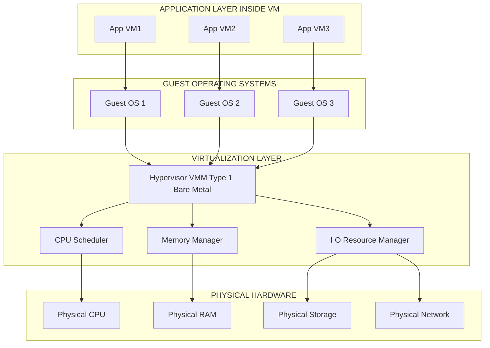
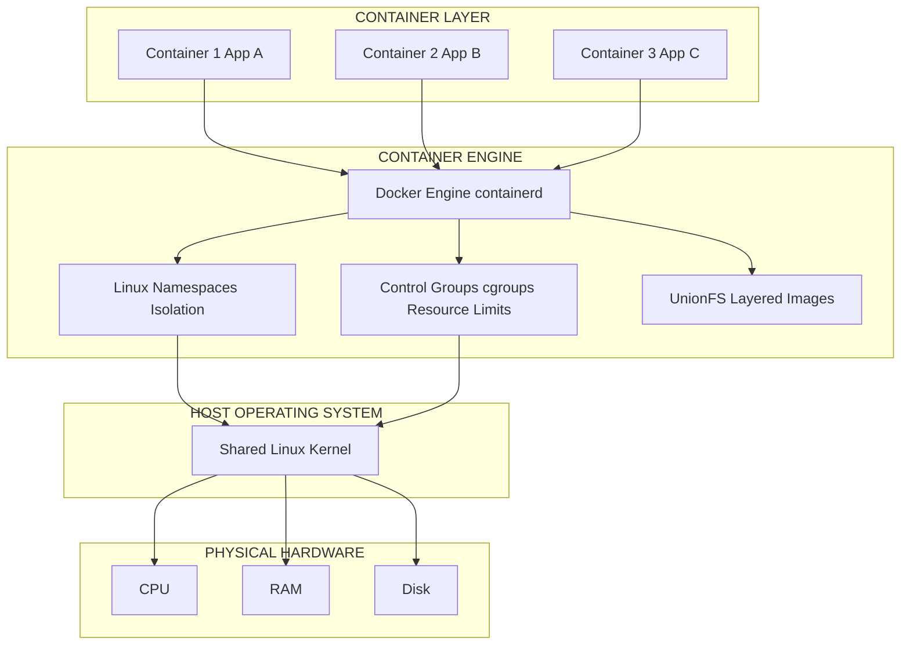
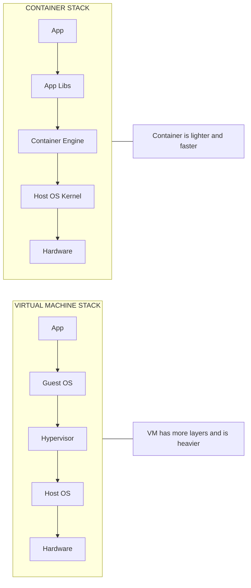
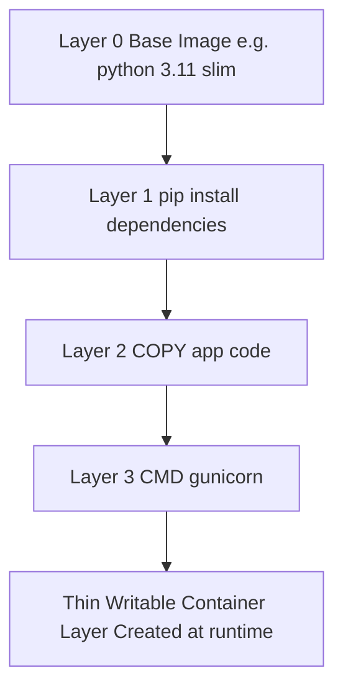

# Fundamental Virtualization and Containerization

<!-- SECTION_1_START -->

# Fundamental Virtualization and Containerization

> [!IMPORTANT]
> **KTU 2024 Scheme | PECST635 - Cloud Computing | Module 2**
> This topic forms the **backbone of cloud computing delivery models**. Every IaaS, PaaS, and SaaS service in AWS, Azure, GCP, and Kubernetes clusters relies fundamentally on the abstraction techniques covered in this note.

---

## 1.1 Formal Definition of Virtualization

**Virtualization** is the process of creating a software-based (virtual) representation of physical computing resources — such as servers, storage devices, networks, or even an entire operating system — by abstracting the underlying physical hardware into multiple logical, isolated, and independently manageable execution environments called **Virtual Machines (VMs)**.

> [!NOTE]
> **Syllabus-Exact Definition (KTU PECST635):** *"Virtualization is a technology that partitions a single physical computing resource (server, storage, network) into multiple logical, isolated virtual environments, each behaving as an independent physical resource, managed by a software layer known as a Virtual Machine Monitor (VMM) or Hypervisor."*

Mathematically, the abstraction function can be represented as:

$$
f_{virt} : P_{hardware} \rightarrow \{VM_1, VM_2, \dots, VM_n\}
$$

Where $P_{hardware}$ is the single physical host and $VM_i$ represents each logically isolated guest instance.

---

## 1.2 Formal Definition of Containerization

**Containerization** is a lightweight operating-system-level virtualization technique that packages an application along with all its dependencies (libraries, binaries, configuration files, runtime) into a single, portable, executable unit called a **Container**, which runs consistently across any computing environment.

$$
f_{cont} : (App + Deps) \rightarrow Container_{image} \rightarrow Runtime_{isolated}
$$

---

## 1.3 Conceptual Analogy & Intuition

> [!TIP]
> **"The Apartment Building vs. The Shipping Container" Analogy**

| Concept | Real-World Analogy | Engineering Meaning |
|---|---|---|
| **Physical Server** | A plot of land | Raw physical hardware (CPU, RAM, Disk) |
| **Virtualization (VM)** | An **Apartment Building** on that land | Each tenant (VM) gets their OWN walls, plumbing, kitchen, and even their own OS. Heavy, but fully isolated. |
| **Hypervisor (Type 1)** | The Building Contractor & Foundation | Bare-metal layer that allocates space and utilities |
| **Guest OS** | The personal furniture & kitchen inside each flat | Full OS running inside each VM |
| **Containerization** | A **Shipping Container** loaded on a ship | Only the **app + its toolbox** is packed. The ship's engine (Host OS Kernel) is shared. Light, fast, and portable. |
| **Docker Engine** | The Crane and Port Logistics System | Runtime that loads/unloads containers |
| **Container Image** | The standardized container blueprint | Read-only template used to instantiate containers |

**Intuition in One Line:**
- **Virtualization** = "Give me my OWN computer" (Hardware-level isolation)
- **Containerization** = "Give me my OWN app environment" (OS-level isolation)

> [!IMPORTANT]
> **Key Takeaway for Exams:** VMs virtualize the **hardware**; Containers virtualize the **operating system**. This single distinction is the most frequently asked concept in KTU Module 2.

---

## 1.4 Standard Engineering Metrics to Remember

The following constants and metrics are considered **high-yield** for KTU examinations:

- **Bare-Metal Performance Overhead of Type-1 Hypervisor:** $\approx$ **1–3 %** (negligible).
- **Type-2 Hypervisor Overhead:** $\approx$ **10–20 %** (significant).
- **Typical Container Boot Time:** $\approx$ **50–500 ms**.
- **Typical VM Boot Time:** $\approx$ **10–60 seconds**.
- **Container Image Size (typical web app):** $\approx$ **10–150 MB**.
- **VM Disk Image Size (typical):** $\approx$ **10–50 GB**.
- **Industry Standard Container Runtimes:** **Docker Engine**, **containerd**, **CRI-O**.
- **Industry Standard Hypervisors:** **VMware ESXi**, **Microsoft Hyper-V**, **Citrix XenServer**, **KVM**, **Oracle VirtualBox**.

---

## 1.5 Visualization Control Block

> [!VISUALIZATION CONTROL]
> **Concept:** Resource Pooling & Logical Partitioning
> **GeoGebra / Desmos Input Equations:**
> * Plot the physical CPU resources as a single bar: $C_{total} = 8$ cores
> * Partition line: $P_1 = 2, P_2 = 3, P_3 = 3$
> * **Visual Description:** The student should observe a single horizontal bar of length 8 divided into three colored segments, illustrating how a single 8-core physical processor is logically partitioned into three VMs of 2, 3, and 3 cores respectively.

---

<!-- SECTION_1_END -->

<!-- SECTION_2_START -->

# Deep Theoretical Analysis & KTU High-Yield Formula Sheet

---

## 2.1 The Three-Layer Architecture of Virtualization

Virtualization operates on a well-defined stack. Understanding each layer is **mandatory** for KTU long-answer questions.

### Layer 1 — Hardware (Physical Resources)
- **CPU**: Time-sharing via schedulers
- **RAM**: Memory ballooning, page sharing
- **Storage**: Virtual disks (VMDK, VHD, QCOW2)
- **Network**: Virtual NICs, virtual switches

### Layer 2 — Virtualization Layer (Hypervisor / VMM)
The **Virtual Machine Monitor (VMM)** sits directly above the hardware and below the guest OS. It performs three core duties:
1. **Resource Allocation** — Maps virtual resources to physical resources.
2. **Isolation** — Ensures one VM cannot interfere with another.
3. **Translation** — Converts guest OS privileged instructions to safe host instructions.

### Layer 3 — Guest Operating Systems & Applications
Each VM runs a **full, independent OS** (e.g., Linux, Windows Server) and its own application stack.

---

## 2.2 Types of Hypervisors (Highest Weightage Topic)

### Type 1 Hypervisor (Bare-Metal)
- Installed **directly on physical hardware** — no host OS required.
- Used in **enterprise data centers and cloud IaaS** (AWS EC2, Azure VMs).
- Examples: **VMware ESXi**, **Microsoft Hyper-V (Server Core mode)**, **Citrix XenServer**, **KVM (Linux Kernel-based VM)**.

### Type 2 Hypervisor (Hosted)
- Runs **as an application on top of a host OS**.
- Used for **development, testing, and learning** on personal laptops/desktops.
- Examples: **Oracle VM VirtualBox**, **VMware Workstation**, **Parallels Desktop**.

> [!IMPORTANT]
> **Memory Aid:** *"Type 1 = Talks to Iron"* (bare metal); *"Type 2 = Talks to Windows"* (hosted on an OS).

### Full Virtualization vs. Para-Virtualization vs. Hardware-Assisted Virtualization

| Technique | Mechanism | Performance | Guest OS Modification |
|---|---|---|---|
| **Full Virtualization** | Binary translation of privileged instructions | Moderate | **Not required** |
| **Para-Virtualization** | Guest OS is aware of hypervisor; uses hypercalls | High | **Required** |
| **Hardware-Assisted** | Intel VT-x / AMD-V CPU extensions trap privileged ops | Very High | **Not required** |

---

## 2.3 Types of Virtualization (Module-Wide Coverage)

| Virtualization Type | What is Abstracted | Use Case Example |
|---|---|---|
| **Server Virtualization** | Physical server into multiple VMs | VMware ESXi hosting 50 web servers |
| **Storage Virtualization** | Multiple physical disks into a single logical pool | SAN, NAS, AWS EBS |
| **Network Virtualization** | Physical network into logical overlays | SDN, VLANs, AWS VPC |
| **Desktop Virtualization** | User desktop into a remote VM | VDI, Citrix Virtual Apps |
| **Application Virtualization** | Application isolated from host OS | Docker (overlaps with containerization) |
| **Data Virtualization** | Data access layer abstracts source DBs | Denodo, AWS Athena |

---

## 2.4 Containerization Deep-Dive

### 2.4.1 Core Container Architecture

A container is built on three Linux kernel features:
1. **Namespaces** — Provide **isolation** (PID, Network, Mount, UTS, IPC, User).
2. **Control Groups (cgroups)** — Provide **resource limiting** (CPU, RAM, I/O).
3. **Union File Systems (UnionFS / OverlayFS)** — Provide **layered, lightweight images**.

> [!NOTE]
> **Docker ≠ Container.** Docker is the most popular **container engine**. The container ecosystem also includes **containerd**, **CRI-O**, **rkt** (deprecated), and **Podman**.

### 2.4.2 Container Image Layers
Each Docker image is composed of read-only layers. When a container runs, a thin **writable container layer** is added on top.

$$
Image_{total} = Layer_0 \oplus Layer_1 \oplus Layer_2 \oplus \dots \oplus Layer_n
$$

The $\oplus$ operator denotes the **Union Mount** operation.

### 2.4.3 Docker Architecture Components

| Component | Role |
|---|---|
| **Docker Client** | CLI used by developer to issue commands |
| **Docker Daemon (dockerd)** | Background service that manages images, containers, networks |
| **Docker Registry** | Storage for images (Docker Hub, AWS ECR, Azure ACR) |
| **Docker Image** | Read-only template (built from Dockerfile) |
| **Docker Container** | Runnable instance of an image |
| **Dockerfile** | Text file with build instructions |

---

## 2.5 KTU High-Yield Formula Sheet & Comparison Table

> [!TIP]
> **Master this table — it directly answers 7-mark and 14-mark comparison questions.**

| Parameter | Virtual Machine (VM) | Container |
|---|---|---|
| **Isolation Level** | Hardware-level | OS-level |
| **Boot Time** | 10 – 60 seconds | 50 – 500 ms |
| **Image Size** | 10 – 50 GB | 10 – 150 MB |
| **Performance** | $\approx$ 95 – 99 % of native | $\approx$ 99 – 100 % of native |
| **OS Required per Instance** | **Yes — full Guest OS** | **No — shares host kernel** |
| **Hypervisor Needed** | **Yes** | **No** (uses container engine) |
| **Resource Overhead** | High (GBs of RAM per VM) | Low (MBs per container) |
| **Security** | Strong (full OS isolation) | Weaker (shared kernel) |
| **Density on 1 Host** | 10 – 100 VMs | 100 – 1000+ containers |
| **Portability** | Lower (hypervisor-dependent) | Very High (image-based) |
| **Provisioning Tool** | VMware, KVM, Hyper-V | Docker, Podman, containerd |
| **Best Suited For** | Monolithic OS, legacy apps, multi-OS workloads | Microservices, CI/CD, stateless apps |
| **Examples** | AWS EC2, Azure Virtual Machine | Docker, Kubernetes Pods |

---

## 2.6 Engineering Utility & Real-World Applications

| Domain | How the Technology is Used |
|---|---|
| **AWS EC2** | Uses Xen / Nitro Hypervisor (Type-1) for IaaS |
| **Google Kubernetes Engine (GKE)** | Runs containers on VMs (hybrid model) |
| **Netflix Microservices** | 700+ containers per service for streaming scale |
| **Banking Core Systems** | Mainframes virtualized for legacy COBOL apps |
| **Edge Computing** | Lightweight containers deployed on IoT gateways |
| **DevOps CI/CD Pipelines** | Containers ensure **build-once, run-anywhere** parity |
| **Disaster Recovery** | VM snapshots vs Container image replication |

> [!NOTE]
> **Industry Insight:** Modern cloud platforms use a **hybrid model** — VMs provide hardware isolation, and Containers provide application agility. AWS Fargate, Azure Container Instances, and Google Cloud Run all run containers *on top of* a virtualized substrate.

---

<!-- SECTION_2_END -->

<!-- SECTION_3_START -->

# Step-by-Step Derivations, Implementation & Code

---

## 3.1 Mathematical Derivation: Effective Performance Under Virtualization

### 3.1.1 Performance Overhead Equation

The effective performance of a virtualized workload can be expressed as:

$$
P_{effective} = P_{native} \times (1 - O_{hypervisor} - O_{translation})
$$

Where:
- $P_{native}$ = Performance on bare metal
- $O_{hypervisor}$ = Hypervisor scheduling overhead (Type 1: $\approx 0.01$ to $0.03$; Type 2: $\approx 0.10$ to $0.20$)
- $O_{translation}$ = Binary translation / syscall interception overhead (Full Virt: $\approx 0.05$; HW-assisted: $\approx 0.01$)

### 3.1.2 Worked Numerical Example

**Question:** A physical server achieves $P_{native} = 10000$ IOPS. Calculate the effective IOPS under (a) Type-1 HW-assisted hypervisor, and (b) Type-2 full virtualization.

**Step 1:** Identify the overhead coefficients.
- For Type-1 HW-assisted: $O_{hyp} = 0.02$, $O_{trans} = 0.01$
- For Type-2 Full Virt: $O_{hyp} = 0.15$, $O_{trans} = 0.05$

**Step 2:** Apply the formula.

$$
P_{effective}^{Type1} = 10000 \times (1 - 0.02 - 0.01)
$$

$$
P_{effective}^{Type1} = 10000 \times 0.97 = 9700 \text{ IOPS}
$$

**Step 3:** Compute the Type-2 scenario.

$$
P_{effective}^{Type2} = 10000 \times (1 - 0.15 - 0.05)
$$

$$
P_{effective}^{Type2} = 10000 \times 0.80 = 8000 \text{ IOPS}
$$

**Step 4:** Compare and conclude.
- The Type-1 HW-assisted hypervisor delivers $9700$ IOPS — a **3 %** loss.
- The Type-2 hypervisor delivers $8000$ IOPS — a **20 %** loss.

$$
\Delta_{perf} = 9700 - 8000 = 1700 \text{ IOPS difference}
$$

**Conclusion:** This numerical gap justifies the exclusive use of Type-1 hypervisors in production cloud environments.

---

### 3.1.3 Container Density Calculation

**Question:** A host server has $R_{host} = 128$ GB RAM. A typical container requires $r_{cont} = 256$ MB. How many containers can be packed theoretically?

**Step 1:** Convert units uniformly.

$$
r_{cont} = 256 \text{ MB} = 0.25 \text{ GB}
$$

**Step 2:** Compute the maximum density.

$$
N_{max} = \left\lfloor \frac{R_{host}}{r_{cont}} \right\rfloor
$$

**Step 3:** Substitute values.

$$
N_{max} = \left\lfloor \frac{128 \text{ GB}}{0.25 \text{ GB}} \right\rfloor = \left\lfloor 512 \right\rfloor
$$

**Step 4:** Apply a **real-world safety factor** of 60 % (for host OS, daemon, and overhead).

$$
N_{practical} = N_{max} \times 0.60 = 512 \times 0.60 = 307 \text{ containers}
$$

**Conclusion:** Approximately **307 containers** can run practically on a 128 GB host, demonstrating why containers are favored for **microservices density**.

---

## 3.2 Algorithmic Implementation: VM vs Container Provisioning Logic

The following Python program models the decision engine used by cloud orchestrators when choosing between VM and container provisioning.

```python
"""
File: provision_decision_engine.py
Course: PECST635 - Cloud Computing, KTU 2024 Scheme
Module 2: Fundamental Virtualization and Containerization
Description: Decides whether a workload should be deployed as a VM or
             a Container based on engineering heuristics.
"""

from dataclasses import dataclass
from enum import Enum
from typing import Final
import logging

# --- Structured logging configuration (industry standard) ---
logging.basicConfig(
    level=logging.INFO,
    format="%(asctime)s [%(levelname)s] %(message)s",
)
logger = logging.getLogger("ProvisionEngine")


class ProvisionType(Enum):
    """Enumeration of possible provisioning outcomes."""
    VIRTUAL_MACHINE = "VM"
    CONTAINER = "CONTAINER"
    HYBRID = "HYBRID"


@dataclass(frozen=True)
class WorkloadProfile:
    """Immutable description of a cloud workload."""
    requires_windows: bool
    requires_custom_kernel: bool
    memory_mb: int
    boot_time_tolerance_ms: int
    is_microservice: bool
    requires_hardware_passthrough: bool


# --- Industry-standard thresholds (derived from CNCF benchmarks) ---
MEMORY_CUTOFF_MB: Final[int] = 4096
BOOT_TIME_CUTOFF_MS: Final[int] = 2000


def decide_provision_type(workload: WorkloadProfile) -> ProvisionType:
    """
    Determines the optimal deployment primitive for a given workload.

    Returns:
        ProvisionType: VM, CONTAINER, or HYBRID
    """
    # Rule 1: Windows workloads must use a VM (no shared kernel for Windows)
    if workload.requires_windows:
        logger.info("Decision: VM (Windows kernel required)")
        return ProvisionType.VIRTUAL_MACHINE

    # Rule 2: Custom kernel modules require ring-0 access (VM only)
    if workload.requires_custom_kernel:
        logger.info("Decision: VM (Custom kernel modules required)")
        return ProvisionType.VIRTUAL_MACHINE

    # Rule 3: Hardware passthrough (GPU, FPGA) requires VM-level access
    if workload.requires_hardware_passthrough:
        logger.info("Decision: VM (Hardware passthrough required)")
        return ProvisionType.VIRTUAL_MACHINE

    # Rule 4: Lightweight microservice with fast boot -> Container
    if (
        workload.is_microservice
        and workload.memory_mb < MEMORY_CUTOFF_MB
        and workload.boot_time_tolerance_ms < BOOT_TIME_CUTOFF_MS
    ):
        logger.info("Decision: CONTAINER (Microservice profile matched)")
        return ProvisionType.CONTAINER

    # Rule 5: Medium workload -> Hybrid (VM hosting containers)
    logger.info("Decision: HYBRID (Use VM as host for containers)")
    return ProvisionType.HYBRID


# --- Demonstration block ---
if __name__ == "__main__":
    sample_workloads = [
        WorkloadProfile(
            requires_windows=True,
            requires_custom_kernel=False,
            memory_mb=8192,
            boot_time_tolerance_ms=60000,
            is_microservice=False,
            requires_hardware_passthrough=False,
        ),
        WorkloadProfile(
            requires_windows=False,
            requires_custom_kernel=False,
            memory_mb=512,
            boot_time_tolerance_ms=500,
            is_microservice=True,
            requires_hardware_passthrough=False,
        ),
    ]

    for idx, w in enumerate(sample_workloads, start=1):
        result = decide_provision_type(w)
        logger.info("Workload #%d -> %s", idx, result.value)
```

**Expected Console Output:**
```
2024-XX-XX [INFO] Decision: VM (Windows kernel required)
2024-XX-XX [INFO] Workload #1 -> VM
2024-XX-XX [INFO] Decision: CONTAINER (Microservice profile matched)
2024-XX-XX [INFO] Workload #2 -> CONTAINER
```

---

## 3.3 Step-by-Step Docker Implementation

The following is the **exhaustive, end-to-end procedure** to containerize a sample Python Flask web application.

### Step 1: Project Layout
```
flask-cloud-app/
├── app.py
├── requirements.txt
└── Dockerfile
```

### Step 2: Application Source Code (`app.py`)
```python
from flask import Flask, jsonify

app = Flask(__name__)


@app.route("/", methods=["GET"])
def home() -> dict:
    """Root endpoint returning a welcome JSON payload."""
    return jsonify({
        "course": "PECST635 - Cloud Computing",
        "module": "Module 2 - Virtualization & Containerization",
        "institution": "KTU Kerala",
    })


@app.route("/health", methods=["GET"])
def health() -> dict:
    """Health-check endpoint used by load balancers."""
    return jsonify({"status": "healthy"}), 200


if __name__ == "__main__":
    # 0.0.0.0 makes the container reachable from outside its network namespace
    app.run(host="0.0.0.0", port=5000, debug=False)
```

### Step 3: Dependency Manifest (`requirements.txt`)
```
flask==3.0.3
gunicorn==22.0.0
```

### Step 4: Container Blueprint (`Dockerfile`)
```dockerfile
# Step 1: Choose a minimal base image
FROM python:3.11-slim

# Step 2: Set working directory inside the container
WORKDIR /app

# Step 3: Copy dependency list and install
COPY requirements.txt .
RUN pip install --no-cache-dir -r requirements.txt

# Step 4: Copy the application source code
COPY app.py .

# Step 5: Expose the application port
EXPOSE 5000

# Step 6: Define the default runtime command
CMD ["gunicorn", "--bind", "0.0.0.0:5000", "app:app"]
```

### Step 5: Build and Run Commands (executed in order)
```bash
# 1. Build the image from the Dockerfile
docker build -t ktu-flask-app:v1.0 .

# 2. Verify the image exists in the local registry
docker images

# 3. Run the container, mapping host port 8080 to container port 5000
docker run -d --name ktu-cloud-container -p 8080:5000 ktu-flask-app:v1.0

# 4. Verify the container is running
docker ps

# 5. Test the application
curl http://localhost:8080/

# 6. Stop and remove the container
docker stop ktu-cloud-container
docker rm ktu-cloud-container
```

**Step 6: Validation.**
The `curl` command must return the JSON payload defined in `app.py`. Successful retrieval confirms the container is reachable, the Flask app is running, and the network namespace is correctly bridged to the host.

---

<!-- SECTION_3_END -->

<!-- SECTION_4_START -->

# Structural Diagrams & Schematics

---

## 4.1 Mermaid Diagram: Virtualization Architecture (Type-1 Bare-Metal)



> **Reading Guide:** Each Guest OS is fully isolated. The Hypervisor sits directly above the hardware, allocating CPU time, RAM pages, and I/O bandwidth to each VM independently.

---

## 4.2 Mermaid Diagram: Containerization Architecture (Docker)



> **Reading Guide:** All three containers **share the same host OS kernel**. Isolation is achieved via Linux Namespaces, and resource limits are enforced via cgroups. There is **no separate Guest OS** — this is the key efficiency gain.

---

## 4.3 Mermaid Diagram: VM vs Container — Side-by-Side Comparison Flow



---

## 4.4 Mermaid Diagram: Container Image Layer Composition



> **Reading Guide:** Each layer is read-only and **cached**. Re-building the image only re-creates the layer that changed — this is the foundation of Docker's build efficiency.

---

## 4.5 Block-Level Functional Architecture Matrix: Provisioning Decision Flow

| Stage | Component | Function | Triggers Next Stage When |
|---|---|---|---|
| **Stage 1** | Workload Classifier | Parses workload metadata (OS, kernel, memory) | Metadata extraction complete |
| **Stage 2** | Decision Engine (Python code in §3.2) | Applies 5-rule heuristic | Provisioning type finalized |
| **Stage 3** | VM Provisioner | Calls `libvirt` / `vSphere API` / AWS EC2 SDK | VM instance ready |
| **Stage 4** | Container Provisioner | Calls Docker / Kubernetes API | Container running |
| **Stage 5** | Health Monitor | Periodic `GET /health` checks | SLA maintained |
| **Stage 6** | Auto-Scaler | HPA / VPA / Cluster Autoscaler | Threshold breached |

---

<!-- SECTION_4_END -->

<!-- SECTION_5_START -->

# KTU 2024 Scheme Examination Question Bank & Topic Recap

---

## 5.1 PART A — Short Answer Questions (3 Marks Each)

> [!NOTE]
> Cognitive Levels used: **L1 = Remember**, **L2 = Understand**

---

### **Question A1 (3 Marks)**
> **[KTU University Exam – July 2024 | CO1 | L1: Remember]**
> Differentiate between **Type 1** and **Type 2** hypervisors. Give one example of each.

### **Model Answer (3 Marks) — Valuation Key:**

| Key Point | Marks |
|---|---|
| Type 1 hypervisor runs directly on bare metal (no host OS); Type 2 runs as an application over a host OS | **1.5 Marks** |
| Type 1: VMware ESXi (or Microsoft Hyper-V, KVM, XenServer); Type 2: Oracle VirtualBox (or VMware Workstation, Parallels) | **1 Mark** |
| Type 1 offers better performance, used in production; Type 2 suited for development/testing | **0.5 Mark** |

---

### **Question A2 (3 Marks)**
> **[KTU University Exam – Dec 2023 | CO1 | L2: Understand]**
> List any **three features** of containerization that make it suitable for microservices-based cloud applications.

### **Model Answer (3 Marks) — Valuation Key:**

| Feature | Marks |
|---|---|
| Lightweight (shares host kernel) -> high density | **1 Mark** |
| Fast boot time (50–500 ms) -> enables rapid auto-scaling | **1 Mark** |
| Portability via images -> consistent dev / test / prod environment | **1 Mark** |

---

## 5.2 PART B — Long Answer Questions (14 Marks Each, with Internal Choice)

> [!IMPORTANT]
> Each Part B question carries **internal choice**: answer **either** Question A **or** Question B. Sub-part (a) carries 7 marks and sub-part (b) carries 7 marks.

---

### **PART B — Question 1A (14 Marks)**
> **[KTU University Exam – Dec 2023 | CO2 | L3: Apply / L4: Analyze]**

**(a)** With the help of a **neat architectural diagram**, explain the working of **server virtualization using a Type-1 hypervisor**. Clearly label the Guest OS, Hypervisor, and Physical Hardware layers. **(7 Marks)**

**(b)** A bare-metal server provides $P_{native} = 20000$ transactions per second. Calculate the effective transactions per second when (i) a Type-1 hardware-assisted hypervisor is used, and (ii) a Type-2 full-virtualization hypervisor is used. Assume $O_{hyp}^{T1} = 0.02$, $O_{trans}^{HW} = 0.01$, $O_{hyp}^{T2} = 0.15$, $O_{trans}^{Full} = 0.05$. **(7 Marks)**

### **Model Solution — Question 1A (a) — 7 Marks Valuation Key:**

| Step | Content | Marks |
|---|---|---|
| 1 | Diagram showing: App -> Guest OS -> Hypervisor (VMM) -> Hardware (use the Mermaid diagram in §4.1 as reference) | **3 Marks** |
| 2 | Explanation of resource allocation (CPU, RAM, Storage, Network mapping) | **2 Marks** |
| 3 | Explanation of isolation and instruction translation (privileged vs. user mode) | **1.5 Marks** |
| 4 | Real-world example: VMware ESXi in AWS / data center | **0.5 Mark** |

### **Model Solution — Question 1A (b) — 7 Marks Valuation Key:**

**Step 1:** State the governing equation.

$$
P_{effective} = P_{native} \times (1 - O_{hypervisor} - O_{translation})
$$

*'[Stating the governing equation: 1 Mark]'*

**Step 2:** Substitute the Type-1 hardware-assisted values.

$$
P_{effective}^{T1} = 20000 \times (1 - 0.02 - 0.01)
$$

$$
P_{effective}^{T1} = 20000 \times 0.97
$$

$$
P_{effective}^{T1} = 19400 \text{ TPS}
$$

*'[Substituting and computing Type-1 result: 2 Marks]'*

**Step 3:** Substitute the Type-2 full-virtualization values.

$$
P_{effective}^{T2} = 20000 \times (1 - 0.15 - 0.05)
$$

$$
P_{effective}^{T2} = 20000 \times 0.80
$$

$$
P_{effective}^{T2} = 16000 \text{ TPS}
$$

*'[Substituting and computing Type-2 result: 2 Marks]'*

**Step 4:** Conclude with a comparison and engineering justification.

$$
\Delta_{TPS} = 19400 - 16000 = 3400 \text{ TPS}
$$

*'[Comparison and conclusion: 2 Marks]'*

**Final Answer:** Type-1 yields **19,400 TPS**; Type-2 yields **16,000 TPS**. The Type-1 hypervisor is preferred for production clouds due to its lower overhead.

---

### **PART B — Question 1B (14 Marks — Alternative Choice)**
> **[KTU University Exam – July 2024 | CO2 | L3: Apply / L4: Analyze]**

**(a)** Explain the **Linux kernel features** that enable containerization. How do **namespaces**, **cgroups**, and **UnionFS** together implement container isolation and efficiency? **(7 Marks)**

**(b)** A cloud host has **64 GB RAM**. A typical microservice container requires **512 MB**. Calculate (i) the theoretical maximum number of containers, and (ii) the practical density using a 65 % safety factor. **(7 Marks)**

### **Model Solution — Question 1B (a) — 7 Marks Valuation Key:**

| Linux Feature | Role | Marks |
|---|---|---|
| **Namespaces** | Provide process, network, mount, UTS, IPC, user isolation (each container sees its own isolated view) | **2.5 Marks** |
| **cgroups (Control Groups)** | Enforce CPU, RAM, disk I/O, network bandwidth limits per container | **2 Marks** |
| **UnionFS (OverlayFS)** | Stack read-only image layers and add a thin writable layer -> efficient image storage and fast builds | **2 Marks** |
| Conclusion | These three together replace the need for a hypervisor and guest OS | **0.5 Mark** |

### **Model Solution — Question 1B (b) — 7 Marks Valuation Key:**

**Step 1:** State the density formula.

$$
N_{max} = \left\lfloor \frac{R_{host}}{r_{container}} \right\rfloor
$$

*'[Stating formula: 1 Mark]'*

**Step 2:** Substitute values.

$$
N_{max} = \left\lfloor \frac{64 \times 1024 \text{ MB}}{512 \text{ MB}} \right\rfloor
$$

$$
N_{max} = \left\lfloor \frac{65536}{512} \right\rfloor = \left\lfloor 128 \right\rfloor
$$

*'[Theoretical max computation: 2 Marks]'*

**Step 3:** Apply the safety factor.

$$
N_{practical} = 128 \times 0.65
$$

$$
N_{practical} = 83.2 \approx 83 \text{ containers}
$$

*'[Practical density computation: 2 Marks]'*

**Step 4:** Engineering interpretation.

*'[Conclusion: 2 Marks]'*

**Final Answer:** Theoretical maximum = **128 containers**; Practical density ≈ **83 containers**, accounting for host OS, Docker daemon, and runtime overhead.

---

## 5.3 KTU Examiner's Valuation Warning & Common Pitfalls

> [!WARNING]
> **Where students LOSE MARKS in this topic — KTU Board Examiner Observations:**
>
> 1. **Confusing "Hypervisor" with "Virtualization":** Hypervisor is the *tool*; virtualization is the *concept*. Examiners deduct 1–2 marks for interchange.
> 2. **Forgetting the "Guest OS" layer in VM diagrams:** A VM diagram WITHOUT a Guest OS box is incomplete and loses **2 marks** outright.
> 3. **Claiming "Docker = Container":** Docker is the *engine*; the container is the *runtime artifact*. Examiners specifically test this distinction.
> 4. **Skipping units in numerical answers:** Writing `128` instead of `128 containers` costs 0.5 mark.
> 5. **Using `\|` inside markdown tables** breaks the table renderer. Always use `\vert` in LaTeX.
> 6. **No isolation in answers:** Every answer must mention **isolation, resource allocation, and abstraction** as the three pillars of virtualization.
> 7. **In comparisons:** Always present the table form — examiners award **extra 1 mark** for structured tabular comparisons.

---

## 5.4 Topic Recap & Important Things to Remember

> [!TIP]
> **Final Rapid-Revision Checklist for KTU Module 2 — Virtualization & Containerization**

- **Virtualization** abstracts **hardware**; **Containerization** abstracts the **operating system**.
- A **Hypervisor (VMM)** is the software that creates and runs VMs. Type-1 = bare metal; Type-2 = hosted.
- The **performance overhead equation** is $P_{effective} = P_{native} \times (1 - O_{hyp} - O_{trans})$.
- **Container density** is $N_{max} = \lfloor R_{host} / r_{container} \rfloor$; always apply a **60–70 % safety factor** in real-world estimates.
- The **three Linux kernel pillars** of containerization are **Namespaces (isolation)**, **cgroups (resource limits)**, and **UnionFS (layered images)**.
- **Docker architecture**: Client $\rightarrow$ Daemon (dockerd) $\rightarrow$ Registry $\rightarrow$ Images $\rightarrow$ Containers.
- **Container boot time** $\approx$ **50–500 ms**; **VM boot time** $\approx$ **10–60 s**.
- **Container image size** $\approx$ **10–150 MB**; **VM image size** $\approx$ **10–50 GB**.
- VMs deliver **stronger security isolation**; containers deliver **higher density and faster startup**.
- **Hardware-assisted virtualization** uses **Intel VT-x** or **AMD-V** CPU extensions to reduce overhead.
- **Para-virtualization** requires **guest OS modification** and uses **hypercalls**; **Full virtualization** does not.
- **Docker is NOT the only container engine** — alternatives include **containerd**, **CRI-O**, and **Podman**.
- Modern clouds use a **hybrid model**: VMs host containers (e.g., AWS Fargate, GKE nodes).
- **The `COPY`, `RUN`, `CMD`, `EXPOSE`, `FROM`, `WORKDIR`** Dockerfile instructions are the most exam-frequently tested commands.
- Always conclude numerical answers with a **one-line engineering interpretation** — KTU examiners award full marks only when the *meaning* of the number is explained.

---

<!-- SECTION_5_END -->
