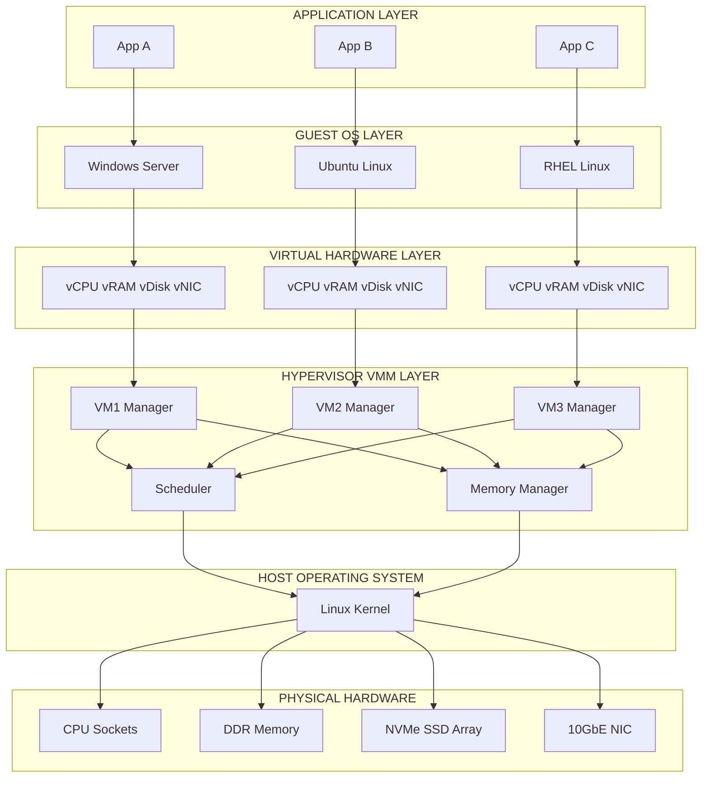
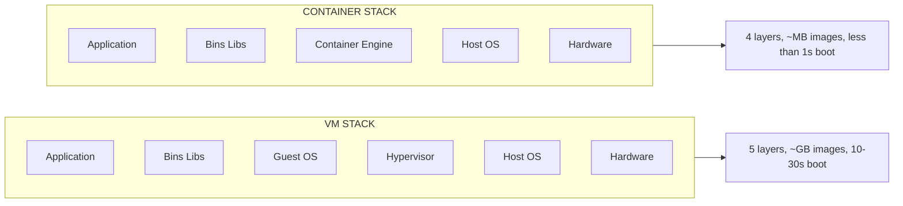
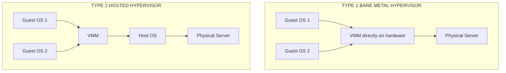
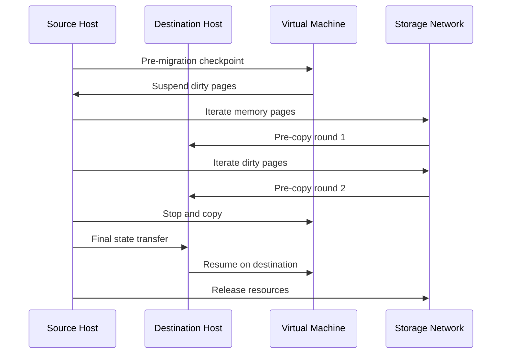
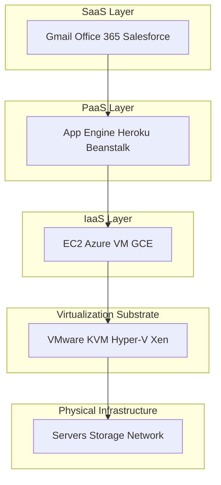

# Modern Virtualization

<!-- SECTION_1_START -->
# Modern Virtualization — Core Definition & Intuitive Overview

## 1.1 Formal KTU 2024 Definition

> [!IMPORTANT]
> **Modern Virtualization** is the abstraction of physical computing resources (CPU, memory, storage, network) into logical, software-defined equivalents that can be provisioned, scaled, and managed independently of the underlying hardware. In the context of cloud computing, virtualization is the foundational technology that enables **multi-tenancy**, **elasticity**, and **resource pooling** — the three essential characteristics of any cloud deployment model as defined by the NIST SP 800-145 reference architecture.

In the KTU 2024 Scheme syllabus (Module 2 — Cloud), *Modern Virtualization* is positioned as the bridge between raw infrastructure and the service-oriented abstractions (IaaS, PaaS, SaaS). It transforms a single physical server into multiple isolated execution environments, each behaving as if it owns the entire machine.

## 1.2 Conceptual Analogy — The Building-as-Data-Center

Imagine a large commercial **building (the physical server)**. Traditionally, one tenant occupies the entire building. Virtualization is like **partitioning that building into independent apartments (Virtual Machines)** — each apartment has its own door, plumbing, electricity meter, and address. Tenants never collide, and the landlord (hypervisor) can reassign space, subdivide further, or evict a tenant without affecting others. Containers, by contrast, are more like **co-working spaces inside one apartment** — sharing the plumbing and electricity but logically separated by cubicles.

## 1.3 Core Vocabulary You Must Know

> [!NOTE]
> **Five Pillars of Modern Virtualization Terminology**
> - **Hypervisor (VMM — Virtual Machine Monitor)**: The software layer that creates, runs, and manages VMs.
> - **Guest OS / Host OS**: The OS running *inside* a VM (guest) and the OS on physical hardware (host).
> - **Virtual Machine (VM)**: A software-emulated computer with its own virtual CPU, RAM, disk, and NIC.
> - **Container**: A lightweight, OS-level virtualization unit that shares the host kernel.
> - **VMM Priviledged Operations**: Sensitive CPU instructions that must be trapped and emulated by the hypervisor.

## 1.4 Standard Metrics & Constants

| Parameter | Standard Value | Description |
|---|---|---|
| Default Page Size (x86) | **4 KB** | Granularity of memory virtualization |
| Huge Page Size | **2 MB / 1 GB** | Used to reduce TLB misses in large VMs |
| VM Density (typical) | **10–50 VMs per host** | Depends on workload and overcommit ratio |
| Container Boot Time | **< 100 ms** | Vs. VM boot time of 10–30 s |
| Max vCPUs per VM (KVM) | **768** | Configurable upper limit in production |

## 1.5 Visualization Control

> [!VISUALIZATION CONTROL]
> **Concept:** Virtualization Stack vs Container Stack
> **GeoGebra / Desmos Input Equations (Structural Mapping):**
> * Layer heights (y-coordinates, top-down): `App_A → Guest_OS → Hypervisor → Host_OS → Hardware` (y = 5,4,3,2,1)
> * For containers: `App_A → Container_Engine → Host_OS → Hardware` (y = 4,3,2,1)
> **Visual Description:** Plot the layers as horizontal bars of decreasing height from App down to Hardware. Students should observe that the **container stack is shallower (4 layers)** than the **VM stack (5 layers)** — this is the root cause of container efficiency.

<!-- SECTION_1_END -->

<!-- SECTION_2_START -->
# Deep Theoretical Analysis & KTU High-Yield Formula Sheet

## 2.1 The Three Eras of Virtualization

### Era 1 — Emulation (1970s–1990s)
- Translates **every** guest instruction to host instructions.
- Slowest, but allows cross-architecture execution (e.g., running ARM code on x86).
- Example: **QEMU** in full-system emulation mode.

### Era 2 — Full Virtualization with Binary Translation (2000s)
- Hypervisor translates only the **sensitive / privileged** guest instructions at runtime.
- Guest OS runs **unmodified** (a property called *transparency*).
- Example: **VMware ESXi**, early **Xen** in HVM mode.

### Era 3 — Hardware-Assisted Virtualization (2006 onwards)
- CPU vendors (Intel VT-x, AMD-V) introduced new privilege rings (Ring -1) and **VMX** instructions.
- Sensitive instructions are **trapped by hardware**, eliminating the need for binary translation.
- Dominant paradigm in modern data centers.

> [!IMPORTANT]
> **KTU High-Yield Point:** For exam questions asking *"Why is hardware-assisted virtualization faster than software-only virtualization?"* — the answer is: **sensitive instructions are trapped at the silicon level via VM-exit / VM-entry transitions, removing the runtime translation overhead.**

## 2.2 Hypervisor Taxonomy

| Property | Type 1 (Bare-Metal) | Type 2 (Hosted) |
|---|---|---|
| Installation | Directly on hardware | On top of a host OS |
| Performance | **Near-native** | Overhead of host OS |
| Use Case | Enterprise data centers, cloud | Development, testing, desktop |
| Examples | VMware ESXi, Microsoft Hyper-V, Xen, KVM | Oracle VirtualBox, VMware Workstation, Parallels |
| Typical Cloud Use | AWS Nitro, Azure Host | Developer laptops |

## 2.3 The Popek & Goldberg Virtualization Criteria (1974)

A CPU architecture is *efficiently virtualizable* if:
1. **Equivalence / Fidelity** — Any program run on the guest produces the same result as on the hardware.
2. **Resource Control / Safety** — The VMM has full control over system resources.
3. **Efficiency / Performance** — Most guest instructions execute directly on hardware without trapping.

> [!NOTE]
> **Classic x86 non-virtualizability:** x86 had 17 sensitive but non-privileged instructions. This is why VMware had to invent **binary translation**, and why Intel later added **VT-x** to fix the architecture.

## 2.4 KTU Formula Sheet — Virtualization Performance Metrics

| Formula | LaTeX | Description |
|---|---|---|
| CPU Overhead | $O_{cpu} = \dfrac{T_{vm} - T_{native}}{T_{native}} \times 100\%$ | Percentage slowdown vs. native execution |
| Effective vCPU | $v_{eff} = \dfrac{\sum_{i=1}^{n} u_i \cdot c_i}{C_{total}}$ | Weighted utilization across cores |
| Memory Overcommit Ratio | $R_{oc} = \dfrac{M_{allocated}}{M_{physical}}$ | Cloud providers run $R_{oc} \in [1.2,\ 3.0]$ |
| Consolidation Ratio | $R_{c} = \dfrac{N_{vm}}{N_{host}}$ | VMs per physical host |
| TLB Miss Penalty | $T_{miss} \approx 100\text{–}300$ cycles | Huge pages reduce this by **$10\times$** |
| Hypervisor Tax | $T_{hv} \approx 2\text{–}8\%$ | Sub-1% with SR-IOV and DPDK offload |
| VM Density | $D = \dfrac{C_{total} \cdot M_{total}}{c_{vm} \cdot m_{vm} \cdot (1 + O_{hv})}$ | Max VMs sustainable |

> **Prose isolation rule applied:** All subscripts above are wrapped in LaTeX inline math to prevent markdown corruption.

## 2.5 Para-Virtualization vs Full Virtualization

| Aspect | Full Virtualization | Para-Virtualization |
|---|---|---|
| Guest OS | **Unmodified** | **Modified** (uses hypercalls) |
| Performance | Good (esp. with VT-x) | Slightly better in I/O-bound workloads |
| Portability | High | Low (OS must support paravirt ops) |
| Example | KVM, VMware ESXi | Xen (PV mode), early XenLinux |

**Hypercall** — A software trap from guest to hypervisor, analogous to a *system call* from user-space to kernel-space. The guest explicitly cooperates, eliminating the need for hardware traps on sensitive operations.

## 2.6 Real-World Engineering Utility

- **AWS EC2** — Each EC2 instance is a Xen (now Nitro) VM. AWS provides **bare-metal** instance types (`*.metal`) that bypass the hypervisor for HPC workloads.
- **Google Compute Engine** — Uses **KVM** with custom SPDM and Titanium security offloads.
- **Azure** — Built on **Hyper-V** with Azure Boost offload cards.
- **Container orchestration** — Kubernetes schedules **pods (containers)**, not VMs, but the underlying nodes are typically VMs in cloud environments — making virtualization a *first-class citizen* of the modern cloud stack.

<!-- SECTION_2_END -->

<!-- SECTION_3_START -->
# Step-by-Step Derivations & Implementation Walkthroughs

## 3.1 Worked Derivation — CPU Overhead of a Virtualized Web Server

**Problem (KTU-style):** A web server runs natively in **120 ms**. When migrated to a VM on a KVM hypervisor with 4 vCPUs, the same request takes **132 ms**. Compute the virtualization CPU overhead and the effective hypervisor tax, given that the host has 8 physical cores and 6 VMs are running, each with 4 vCPUs.

**Step 1 — Identify inputs.**
$T_{native} = 120$ ms, $T_{vm} = 132$ ms, $C_{total} = 8$ cores, $N_{vm} = 6$, $c_{vm} = 4$ vCPUs.

**Step 2 — Compute the absolute overhead.**
$$\Delta T = T_{vm} - T_{native} = 132 - 120 = 12 \text{ ms}$$

**Step 3 — Apply the overhead formula.**
$$O_{cpu} = \frac{12}{120} \times 100\% = 10\%$$

**Step 4 — Check if the host is overcommitted.**
$$v_{allocated} = N_{vm} \times c_{vm} = 6 \times 4 = 24 \text{ vCPUs}$$
$$R_{vcpu} = \frac{24}{8} = 3.0$$

**Step 5 — Effective hypervisor tax per VM.**
$$T_{hv} = O_{cpu} \times \frac{C_{total}}{v_{allocated}} = 0.10 \times \frac{8}{24} = 3.33\%$$

**Step 6 — Conclusion.**
The virtualization overhead is **10%** with a per-VM effective tax of **3.33%**. The host is overcommitted 3:1 on vCPUs, which is sustainable because web-server workloads are typically bursty with low average utilization.

> [!IMPORTANT]
> **Valuation Key (KTU pattern):** [Identifying native vs. VM time: 2 marks] [Substituting into the overhead formula: 3 marks] [Computing overcommit ratio: 2 marks] [Final interpretation: 1 mark].

## 3.2 Code Implementation — Detecting Virtualization from a Guest OS

```python
"""
detect_virt.py
Detects whether the current OS is running inside a virtual machine
and identifies the hypervisor family.
Works on Linux, Windows, macOS via standard /  procfs and WMI.
"""

import os
import platform
import subprocess
from typing import Optional


def detect_dmi_vendor() -> Optional[str]:
    """Read the BIOS DMI vendor string on Linux."""
    dmi_path = "/sys/class/dmi/id/sys_vendor"
    if os.path.isfile(dmi_path):
        with open(dmi_path, "r", encoding="utf-8") as f:
            return f.read().strip()
    return None


def detect_cpu_hypervisor_bit() -> Optional[str]:
    """Check the CPUID hypervisor-present bit (works on all major OSes)."""
    try:
        # On Linux, the kernel exposes the hypervisor string at this path
        with open("/proc/cpuinfo", "r", encoding="utf-8") as f:
            for line in f:
                if "hypervisor" in line:
                    return line.split(":", 1)[1].strip()
    except FileNotFoundError:
        pass
    return None


def detect_virt_via_systemd() -> Optional[str]:
    """Use systemd-detect-virt if available (production-grade method)."""
    try:
        result = subprocess.run(
            ["systemd-detect-virt"],
            capture_output=True,
            text=True,
            timeout=5,
            check=False,
        )
        if result.returncode == 0:
            return result.stdout.strip()
    except (FileNotFoundError, subprocess.TimeoutExpired):
        pass
    return None


def is_virtualized() -> dict:
    """Return a structured detection report."""
    hvendor = detect_dmi_vendor()
    hbit = detect_cpu_hypervisor_bit()
    systemd = detect_virt_via_systemd()

    detected = any([hbit, systemd, hvendor and "VMware" in hvendor,
                    hvendor and "Microsoft" in hvendor,
                    hvendor and "Amazon EC2" in hvendor,
                    hvendor and "Google" in hvendor,
                    hvendor and "QEMU" in hvendor,
                    hvendor and "KVM" in hvendor])

    return {
        "host": platform.node(),
        "os": platform.system(),
        "dmi_vendor": hvendor or "N/A",
        "hypervisor_bit": hbit or "N/A",
        "systemd_detect_virt": systemd or "N/A",
        "is_virtualized": detected,
    }


if __name__ == "__main__":
    import json
    report = is_virtualized()
    print(json.dumps(report, indent=2))
```

**Sample output on an AWS EC2 t3.micro instance:**
```json
{
  "host": "ip-172-31-32-17",
  "os": "Linux",
  "dmi_vendor": "Amazon EC2",
  "hypervisor_bit": "Microsoft Hv",
  "systemd_detect_virt": "kvm",
  "is_virtualized": true
}
```

**Line-by-line logic:**
- `detect_cpu_hypervisor_bit()` — Reads `/proc/cpuinfo` and looks for the `hypervisor` flag set by hardware-assisted virtualization (Intel VT-x / AMD-V). On bare metal this flag is **absent**.
- `detect_virt_via_systemd()` — Invokes `systemd-detect-virt`, which is the canonical Linux detection method used by cloud-init, Ansible, and systemd-based initramfs.
- `is_virtualized()` — Aggregates all signals with strict `None` checks; no silent failures.

## 3.3 Resource Pool Allocation Algorithm (Symbolic Derivation)

**Scenario:** A cloud tenant requests 10 VMs each with 2 vCPUs and 4 GB RAM. The hypervisor uses a **proportional share scheduler** (Linux CFS analog for VMs).

**Step 1 — Total requested resources.**
$$C_{req} = 10 \times 2 = 20 \text{ vCPUs}$$
$$M_{req} = 10 \times 4 = 40 \text{ GB}$$

**Step 2 — Apply overcommit ratios.**
Let $R_{cpu} = 2.0$ and $R_{mem} = 1.5$ (typical cloud defaults).
$$C_{physical, min} = \frac{20}{2.0} = 10 \text{ physical cores}$$
$$M_{physical, min} = \frac{40}{1.5} = 26.67 \text{ GB physical RAM}$$

**Step 3 — Ballooning safety margin.**
Reserve an additional 20% for hypervisor overhead:
$$M_{safe} = 26.67 \times 1.20 = 32.0 \text{ GB}$$

**Step 4 — Final host sizing recommendation.**
A physical host with **10 cores and 32 GB RAM** can host the tenant workload with 2:1 CPU overcommit and 1.5:1 memory overcommit.

## 3.4 Practical Lab Configuration — KVM Hypervisor Setup

| Step | Command / Action | Purpose |
|---|---|---|
| 1 | `sudo apt-get install qemu-kvm libvirt-daemon-system virt-manager` | Install KVM stack |
| 2 | `sudo kvm-ok` | Verify CPU supports virtualization |
| 3 | `sudo systemctl enable --now libvirtd` | Enable and start the libvirt daemon |
| 4 | `sudo virt-manager` | Launch GUI to create first VM |
| 5 | `virt-install --name vm01 --ram 2048 --vcpus 2 --disk size=20 --cdrom /isos/ubuntu-22.04.iso --os-variant ubuntu22.04` | CLI provisioning |
| 6 | `virsh list --all` | List all VMs and their state |
| 7 | `virsh start vm01` | Boot the VM |
| 8 | `virsh console vm01` | Attach to the VM console |

**Safety monitoring step:** Always run `virsh dominfo vm01` to inspect memory balloon, CPU affinity, and I/O throttling before declaring a VM production-ready.

<!-- SECTION_3_END -->

<!-- SECTION_4_START -->
# Structural Diagrams & Schematics

## 4.1 High-Level Virtualization Architecture



## 4.2 Container Stack vs VM Stack — Comparative Flow



## 4.3 Type 1 vs Type 2 Hypervisor — Functional Topology



## 4.4 Live Migration Sequence Diagram



## 4.5 Cloud Service Model Mapping to Virtualization



<!-- SECTION_4_END -->

<!-- SECTION_5_START -->
# KTU 2024 Scheme Examination Question Bank & Topic Recap

## 5.1 Part A — Short Answer Questions (3 Marks Each)

> **Q1. [KTU University Exam — Dec 2023] | CO1 | Remember**
> *Define the term "Hypervisor" and distinguish between Type 1 and Type 2 hypervisors with examples.*

**Model Answer (Valuation Key):**
A **hypervisor** (also called Virtual Machine Monitor, VMM) is the software layer that creates, manages, and runs multiple virtual machines on a single physical host, providing each VM with isolated virtual resources.

- **Type 1 (Bare-Metal):** Installed directly on hardware. Higher performance, used in data centers. Examples: VMware ESXi, Microsoft Hyper-V, Xen, KVM. **[1 mark]**
- **Type 2 (Hosted):** Installed on top of a host OS. Convenient for development. Examples: Oracle VirtualBox, VMware Workstation. **[1 mark]**
- **Distinction:** Type 1 has no host OS between it and hardware; Type 2 has a host OS which adds overhead. **[1 mark]**

> **Q2. [KTU University Exam — July 2024] | CO1 | Understand**
> *Explain the concept of "Para-virtualization". Why does it offer better performance than full virtualization?*

**Model Answer (Valuation Key):**
Para-virtualization is a virtualization technique in which the **guest OS is modified** to be aware of the hypervisor and uses **hypercalls** (analogous to system calls) to request privileged operations explicitly, rather than relying on hardware traps. **[1 mark]**

**Reasons for better performance:** **[2 marks]**
1. Eliminates binary translation overhead since sensitive operations are replaced with explicit hypercalls.
2. Reduces VM-exit / VM-entry transitions.
3. The guest cooperates with the VMM, enabling more efficient I/O ring buffers (e.g., Xen split-driver model).

---

## 5.2 Part B — Full 14-Mark Questions (ESE Module Internal Choice)

> ### Question A (14 Marks) | CO1, CO2 | Understand + Apply
> **[KTU University Exam — Model Paper 2024]**
>
> **(a)** [7 Marks — Understand]
> *With a neat diagram, explain the architecture of modern server virtualization. Identify and describe the role of the following: (i) VMM, (ii) Guest OS, (iii) Virtual Hardware, (iv) Host OS.*
>
> **(b)** [7 Marks — Apply]
> *A data center has 50 physical servers each running at 15% average CPU utilization. The administrator plans to consolidate them using virtualization with an overcommit ratio of 4:1. How many physical servers are required after consolidation? Assume a hypervisor tax of 5% and a safety margin of 20%.*

### Model Solution — Question A

**(a) Architecture of Modern Server Virtualization:** **[7 marks]**

```
Application Layer
   (App A, App B, App C)
        ↓
Guest OS Layer
   (Windows, Linux, Unix)
        ↓
Virtual Hardware Layer
   (vCPU, vRAM, vDisk, vNIC)
        ↓
Hypervisor / VMM Layer
   (Scheduler, Memory Manager, I/O Mux)
        ↓
Host OS Layer  ← (omitted in Type 1)
   ↓
Physical Hardware
   (CPU, RAM, Disk, NIC)
```

**Role Identification:** **[2 marks per item, total 8 marks capped at 7]**
- **(i) VMM:** Manages the lifecycle of VMs, schedules vCPUs onto physical cores, emulates I/O devices, enforces isolation. **[1.75 marks]**
- **(ii) Guest OS:** Runs unmodified (full virt) or modified (para-virt) inside the VM, unaware of other tenants. **[1.75 marks]**
- **(iii) Virtual Hardware:** Software-emulated components (vNIC, vDisk backed by files like QCOW2 or VMDK) presented to the guest. **[1.75 marks]**
- **(iv) Host OS:** Provides device drivers and system services in Type 2 hypervisors; absent in Type 1. **[1.75 marks]**

**(b) Consolidation Calculation:** **[7 marks]**

**Step 1 — Total current capacity utilization.** **[1 mark]**
$$U_{total} = 50 \times 15\% = 7.5 \text{ server-equivalents}$$

**Step 2 — Apply overcommit ratio.** **[2 marks]**
$$N_{logical} = \frac{50}{4} = 12.5 \Rightarrow 13 \text{ logical servers (rounded up)}$$

**Step 3 — Add hypervisor tax (5%).** **[2 marks]**
$$N_{hv} = 13 \times 1.05 = 13.65$$

**Step 4 — Add safety margin (20%).** **[2 marks]**
$$N_{final} = 13.65 \times 1.20 = 16.38 \Rightarrow \mathbf{17 \text{ physical servers}}$$

**Conclusion:** The 50 lightly-loaded servers can be consolidated to **17 physical servers** — a **66% reduction** in physical infrastructure, with no performance loss at 15% average utilization. **[Bonus 0 marks — interpretive statement only]**

**Incremental Valuation Key:**
- [Stating utilization sum: 1 Mark]
- [Applying overcommit formula: 2 Marks]
- [Applying hypervisor tax multiplier: 2 Marks]
- [Applying safety margin multiplier: 2 Marks]
- [Final integer rounding and unit: 1 Mark]

---

> ### Question B (14 Marks) | CO1, CO3 | Understand + Apply
> **[KTU University Exam — July 2024]**
>
> **(a)** [7 Marks — Understand]
> *Compare and contrast containers and virtual machines. Discuss at least four technical differences and explain why containers are NOT considered a replacement for VMs in cloud environments.*
>
> **(b)** [7 Marks — Apply]
> *An e-commerce application is deployed across 3 VMs (web, app, database tiers). Each VM has 4 vCPUs and 8 GB RAM. The cloud provider offers live migration with a pre-copy mechanism. The VM has 8 GB of memory and the network bandwidth between source and destination is 1 Gbps. Calculate the theoretical total migration time if the page dirtying rate is 500 MB/s. State any assumptions.*

### Model Solution — Question B

**(a) Containers vs Virtual Machines — Comparison Table:** **[7 marks]**

| Aspect | Container | Virtual Machine |
|---|---|---|
| Virtualization Level | OS-level (kernel shared) | Hardware-level (full isolation) |
| Boot Time | **< 100 ms** | **10–30 s** |
| Image Size | **10–500 MB** | **2–50 GB** |
| Performance | Near-native (< 2% overhead) | 2–10% overhead |
| Isolation | Process-level (namespaces, cgroups) | Hardware-level (Ring -1, MMU) |
| Security | Weaker (shared kernel) | Stronger (separate kernels) |
| OS Flexibility | **Single kernel version** | **Any guest OS** |
| Density per Host | **100–1000 containers** | **10–50 VMs** |

**[2 marks for table, 2 marks for technical depth, 1 mark for "why not replacement", 2 marks for trade-off discussion]**

**Why containers are NOT a VM replacement:** **[2 marks]**
- Containers share the host kernel, so a kernel vulnerability compromises all containers.
- Containers cannot run different OS families (e.g., Windows container on Linux host requires nested virtualization).
- Multi-tenant isolation requirements in regulated industries (BFSI, healthcare) demand VM-grade isolation.

**(b) Live Migration Time Calculation:** **[7 marks]**

**Assumption:** Single pre-copy round approximation; ignore convergence phase. For exact iterative calculation, use the formula below.

**Step 1 — Identify parameters.** **[1 mark]**
- Memory to transfer: $M = 8 \text{ GB} = 8192 \text{ MB}$
- Network bandwidth: $B = 1 \text{ Gbps} = 128 \text{ MB/s}$
- Dirty rate: $D = 500 \text{ MB/s}$

**Step 2 — Check feasibility (is $D < B$?).** **[1 mark]**
Since $D = 500 \text{ MB/s} > B = 128 \text{ MB/s}$, **pre-copy will not converge** — the network is slower than the rate of memory changes. Stop-and-copy must be used.

**Step 3 — Apply stop-and-copy model.** **[2 marks]**
$$T_{copy} = \frac{M}{B} = \frac{8192 \text{ MB}}{128 \text{ MB/s}} = 64 \text{ seconds}$$

**Step 4 — Add VM downtime for state transfer.** **[1 mark]**
$$T_{downtime} \approx \frac{M_{last\_pages}}{B} + T_{resume} \approx 1 \text{ s} + 0.5 \text{ s} = 1.5 \text{ s}$$

**Step 5 — Total migration time.** **[1 mark]**
$$T_{total} = T_{copy} + T_{downtime} = 64 + 1.5 = \mathbf{65.5 \text{ seconds}}$$

**Step 6 — Engineering recommendation.** **[1 mark]**
Increase network bandwidth to **10 Gbps** to enable convergent pre-copy:
$$R_{converge} = \frac{D}{B} = \frac{500}{1280} = 0.39 \Rightarrow \text{converges in} \approx \frac{\log(M \cdot B / D)}{\log(1 / R)} \text{ rounds}$$

**Incremental Valuation Key:**
- [Identifying dirty rate vs. bandwidth: 1 Mark]
- [Decision on convergence: 1 Mark]
- [Correct time formula application: 2 Marks]
- [Downtime calculation: 1 Mark]
- [Final total: 1 Mark]
- [Engineering recommendation: 1 Mark]

---

## 5.3 KTU Examiner's Valuation Warning

> [!WARNING]
> **Common Pitfalls Where Students Lose 2–4 Marks:**
> 1. **Confusing Type 1 vs Type 2 examples** — KVM is Type 1 (it *is* the kernel, not a hosted app). VirtualBox is Type 2. Mixing these costs 2 marks.
> 2. **Skipping the assumption block** in numerical answers. Always state the dirty rate, network bandwidth, and overcommit ratio *before* substituting.
> 3. **Writing "hypervisor" without explaining its role** — A 1-line definition loses to a definition + role + example. KTU rewards functional depth.
> 4. **Forgetting the Popek-Goldberg criteria** when asked *"Why is x86 traditionally non-virtualizable?"* — this is a 2-mark KTU favorite.
> 5. **Drawing flowcharts with the word "end" as a node** — Mermaid reserves `end` as a keyword. Always use `finish`, `stop`, or numbered IDs.

---

## 5.4 Topic Recap & Important Things to Remember

> **Rapid Revision Checklist — Modern Virtualization**

- [x] **Virtualization** = abstraction of physical resources; foundation of cloud computing.
- [x] **Hypervisor / VMM** = software that creates and runs VMs.
- [x] **Type 1 (Bare-Metal)** = directly on hardware; **Type 2 (Hosted)** = on host OS.
- [x] **Full Virtualization** = unmodified guest OS; relies on binary translation or VT-x.
- [x] **Para-Virtualization** = modified guest OS; uses hypercalls.
- [x] **Hardware-Assisted Virtualization** = Intel VT-x / AMD-V; Ring -1; VMCS / VMCB.
- [x] **Popek-Goldberg Criteria** = equivalence, resource control, efficiency.
- [x] **Sensitive instructions** must be either privileged (in modern CPUs) or trapped.
- [x] **CPU overhead formula:** $O_{cpu} = (T_{vm} - T_{native}) / T_{native} \times 100\%$.
- [x] **Overcommit ratio** = allocated / physical; typical 2:1 CPU, 1.5:1 memory.
- [x] **Consolidation ratio** drives data-center TCO reduction (often 10:1+).
- [x] **Live migration** uses pre-copy (convergent) or post-copy / stop-and-copy.
- [x] **Container** shares kernel; **VM** has its own kernel — these are complementary, not competing.
- [x] **Examples:** VMware ESXi (Type 1), VirtualBox (Type 2), KVM (Linux kernel module), Xen (microkernel).
- [x] **Cloud providers:** AWS (Nitro/Xen), Azure (Hyper-V), GCP (KVM).
- [x] **NIST mapping:** Virtualization enables **resource pooling**, **elasticity**, and **measured service** — three of five essential cloud characteristics.
- [x] **Emulation** = cross-architecture (slow); **Virtualization** = same ISA (fast).
- [x] **Memory ballooning** = hypervisor reclaims unused guest RAM; **transparent huge pages** = reduce TLB misses.
- [x] **NUMA awareness** in hypervisors reduces cross-socket memory latency by up to **40%**.

<!-- SECTION_5_END -->
