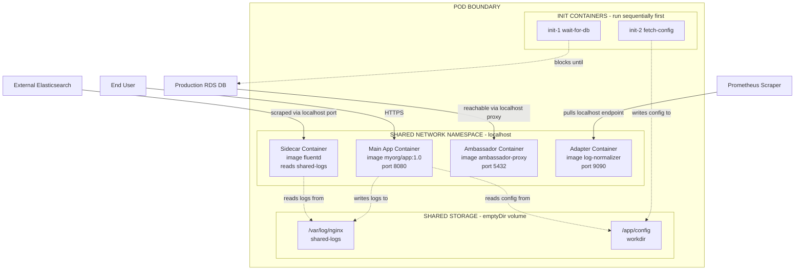
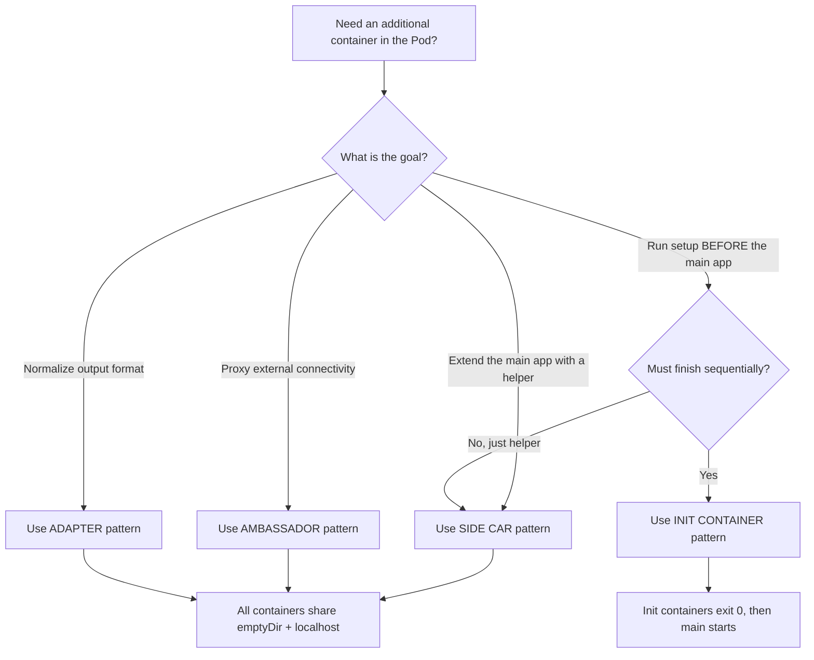

# Multi-Container Types.

<!-- SECTION_1_START -->
# Multi-Container Types in Cloud Computing (KTU 2024 Scheme)

## 1. Core Technical Definition & Intuitive Overview

> [!IMPORTANT]
> **KTU 2024 Syllabus Definition (PECST635 — Module 2):**
> In cloud-native container orchestration (specifically **Kubernetes**), a single **Pod** — the smallest deployable unit — can host **multiple tightly coupled containers** that share the same network namespace, storage volumes, and lifecycle. The canonical architectural patterns that govern these multi-container pods are called **Multi-Container Design Patterns** or **Multi-Container Types**.

The four officially recognized patterns (per the KTU 2024 Cloud Computing syllabus) are:

1. **Sidecar Pattern**
2. **Ambassador Pattern**
3. **Adapter Pattern**
4. **Init Container Pattern**

> [!NOTE]
> **Why Multi-Containers?**
> A single container is supposed to follow the *single-responsibility principle* — it should do *one thing well*. But in production, you often need helper processes (log shippers, proxies, config adapters) that are *not* part of the main application's business logic. Bundling them into the **same Pod** gives them shared resources without violating the single-responsibility rule.

### Conceptual Analogy / Intuition

> [!TIP]
> **Real-World Analogy — The Restaurant Kitchen 🍳**
> Imagine a restaurant. The **Head Chef** cooks the actual food (this is your *main application container*). But the kitchen also has:
> - A **Sous Chef** who continuously preps ingredients and refills the Head Chef's station (this is the **Sidecar**).
> - A **Receptionist** who takes phone orders and translates them into a language the kitchen understands (this is the **Ambassador**).
> - A **Translator** who converts the Head Chef's recipes into a standard format the billing system can read (this is the **Adapter**).
> - A **Morning Prep Cook** who arrives *before* the kitchen opens to chop vegetables and preheat ovens (this is the **Init Container**).
>
> They all work in the *same kitchen* (the **Pod**), share the *same fridge* (a shared **Volume**), and communicate by *shouting across the counter* (the **localhost network**). But they have distinct, well-defined roles.

### Visualization Control (Conceptual Topology)

> [!VISUALIZATION CONTROL]
> **Concept:** Co-located Containers Sharing a Pod Boundary
> **GeoGebra / Desmos Input (Abstract Representation):**
>
> * Pod boundary: rectangle with corners `(0,0)`, `(10,0)`, `(10,6)`, `(0,6)`
> * Main container: rectangle `(1,1)` to `(4,5)` — labeled `app`
> * Sidecar container: rectangle `(5.5,1)` to `(8.5,5)` — labeled `helper`
> * Shared volume (horizontal cylinder at y=0.5): line segment from `(1,0.5)` to `(8.5,0.5)`
> * Shared network: dashed arrows from app → helper and helper → app on the same y=3 line
>
> **Visual Description:** You should observe two equal-sized rectangles sitting side-by-side inside a larger enclosing boundary, both attached to a common horizontal resource at the bottom, with bidirectional arrows between them indicating `localhost` communication.

### Shared Resources Inside a Pod (Key KTU 2024 Highlight)

| Shared Resource | Description |
|---|---|
| **Network Namespace** | All containers share the **same IP address** and **same port space**. They communicate via `localhost`. |
| **Storage Volumes** | A `Volume` mounted in the Pod is visible to **all** containers in that Pod. |
| **Lifecycle** | Containers in a Pod are **co-scheduled** (started/stopped together on the same node). |
| **Hostname** | All containers share the **Pod's hostname** (UTS namespace). |

<!-- SECTION_1_END -->

<!-- SECTION_2_START -->
# 2. Deep Theoretical Analysis & KTU High-Yield Cheat Sheet

## 2.1 The Sidecar Pattern

### Operational Logic

- A **helper container** runs *alongside* the main application container in the same Pod.
- The sidecar **extends or enhances** the main application's behavior without modifying its code.
- Both containers are **long-running** and have **independent lifecycles within the Pod** (they start in parallel, not sequentially).

### Why & How

- **Why:** The main app should not be polluted with cross-cutting concerns (logging, monitoring, syncing, proxying).
- **How:** The main container writes data to a shared `emptyDir` volume; the sidecar reads from that volume and ships it to an external system (e.g., Fluentd shipping logs to Elasticsearch).

### Engineering Utility

- **Log shipping** (Fluentd, Logstash sidecar)
- **Metrics exporters** (Prometheus node-exporter sidecar)
- **File syncing** (git-sync sidecar pulling config from a Git repo)
- **Service mesh data planes** (Istio/Envoy sidecar proxying all traffic)

## 2.2 The Ambassador Pattern

### Operational Logic

- The ambassador container acts as a **proxy** between the main application and the **outside world**.
- It abstracts the network topology from the main app — the app thinks it is talking to a single local service on `localhost`, but the ambassador handles retries, circuit-breaking, and routing to the correct external endpoint.

### Why & How

- **Why:** The main app's code should remain environment-agnostic. In *dev*, the ambassador points to a local DB; in *prod*, it points to a clustered DB. The app never knows.
- **How:** The main container connects to `localhost:port`; the ambassador listens on that port and forwards connections to the real external service.

### Engineering Utility

- **Database connection pooling / sharding** (ProxySQL, Envoy)
- **Protocol translation** (gRPC ↔ REST ambassador)
- **Multi-region failover** (ambassador picks the nearest healthy region)

## 2.3 The Adapter Pattern

### Operational Logic

- The adapter container **normalizes or transforms** the main application's output (logs, metrics, API responses) into a **standardized format** that downstream systems expect.
- It is essentially a *data-format translator* living inside the Pod.

### Why & How

- **Why:** Legacy or third-party apps produce output in proprietary formats. Centralized monitoring needs a unified schema.
- **How:** The main container writes raw output to a shared volume; the adapter container reads it, reformats it, and exposes it on a `localhost` port (e.g., for a Prometheus scraper).

### Engineering Utility

- **Metrics normalization** (custom JVM metrics → Prometheus format)
- **Log format conversion** (plain text → JSON / OpenTelemetry)
- **API response wrapping** (legacy XML → modern JSON)

## 2.4 The Init Container Pattern

### Operational Logic

- An **Init Container** runs **before** the main application container starts.
- It must **complete successfully** (`exit code 0`); if it fails, the Pod keeps restarting it until it succeeds (subject to `backoffLimit`).
- Init containers run **sequentially**, one after another, in the order defined in the Pod spec.
- Once all init containers succeed, the main application containers start **in parallel**.

### Why & How

- **Why:** Setup or prerequisite work (waiting for a DB, fetching secrets, cloning a repo, registering with a service registry) must complete *before* the app starts serving traffic.
- **How:** The init container shares a volume with the main app, writes its setup output there, and exits. The main container then starts and uses the prepared volume.

### Engineering Utility

- **Database migration** before app start
- **Waiting for a dependency** (e.g., `wait-for-it.sh` pattern, but inside Kubernetes natively)
- **Custom permission/ownership setup** on shared volumes (security hardening)
- **Cloning Git repositories** into a shared volume (for CMS / static site workloads)

## 2.5 KTU High-Yield Comparison Cheat Sheet

| Pattern | Purpose | Lifecycle | Communication | Typical Use Case |
|---|---|---|---|---|
| **Sidecar** | Extends/enhances the main app | Long-running, parallel | Shared volume $\vert$ localhost | Log shipping, service mesh proxy, metrics export |
| **Ambassador** | Proxies external connectivity | Long-running, parallel | `localhost` proxy | DB connection pooling, multi-region routing |
| **Adapter** | Normalizes output to a standard format | Long-running, parallel | Shared volume $\vert$ localhost | Log/metric format conversion |
| **Init Container** | Setup $\rightarrow$ prerequisite work | Runs **before** main, sequentially | Shared volume only | DB migration, waiting for dependencies, secret fetching |

> [!IMPORTANT]
> **Key Distinction (Frequently Tested in KTU ESE):**
> - **Sidecar, Ambassador, Adapter** are all **long-running** and **parallel** to the main container.
> - **Init Container** is **short-lived**, runs **sequentially**, and **must complete** before the main container starts.

### Critical Constraints in Kubernetes

- A Pod can have **one or more init containers** (defined in `spec.initContainers`).
- A Pod can have **one or more** regular containers (defined in `spec.containers`).
- All containers in a Pod share the **same `network` and `storage` namespaces**.
- Resource limits (`resources.requests`, `resources.limits`) are set **per container**, not per Pod.

<!-- SECTION_2_END -->

<!-- SECTION_3_START -->
# 3. Step-by-Step Derivations, YAML Specs & Code Implementation

## 3.1 Sidecar Pattern — Full Kubernetes YAML Manifest

```yaml
apiVersion: v1
kind: Pod
metadata:
  name: sidecar-example
  labels:
    app: web
spec:
  volumes:
    - name: shared-logs
      emptyDir: {}
  containers:
    # ---------- MAIN APPLICATION CONTAINER ----------
    - name: main-app
      image: nginx:1.25
      ports:
        - containerPort: 80
      volumeMounts:
        - name: shared-logs
          mountPath: /var/log/nginx
      resources:
        requests:
          cpu: "100m"
          memory: "128Mi"
        limits:
          cpu: "500m"
          memory: "256Mi"
    # ---------- SIDECAR CONTAINER ----------
    - name: log-shipper
      image: fluent/fluentd:1.16
      volumeMounts:
        - name: shared-logs
          mountPath: /var/log/nginx
          readOnly: true
      resources:
        requests:
          cpu: "50m"
          memory: "64Mi"
        limits:
          cpu: "200m"
          memory: "128Mi"
```

### Step-by-Step Logical Walkthrough

1. **Define a shared volume** `shared-logs` of type `emptyDir{}` — this volume lives only as long as the Pod exists.
2. **Main container** (`main-app`) runs `nginx` and writes access logs into `/var/log/nginx` (mounted from the shared volume).
3. **Sidecar container** (`log-shipper`) runs `fluentd`, mounts the **same volume** as `readOnly: true`, tails the log files, and ships them to an external Elasticsearch cluster.
4. Both containers start **in parallel**; nginx starts serving traffic immediately, while fluentd begins tailing.
5. If the sidecar crashes, Kubernetes restarts **only the sidecar**, not the main app — **independent restart policies within the same Pod**.

## 3.2 Ambassador Pattern — Full Python Implementation

The following is a complete, production-style **Python ambassador proxy** that you could containerize and deploy alongside a main application.

```python
"""
ambassador_proxy.py
A reference implementation of the Ambassador pattern.
Forwards all TCP traffic from localhost:5432 to an upstream DB,
abstracting the main application from the real DB endpoint.
"""
import os
import socket
import threading
import logging
from typing import Tuple

# ---------- Type hints and constants ----------
UPSTREAM_HOST: str = os.environ.get("UPSTREAM_DB_HOST", "production-db.cluster-xyz.us-east-1.rds.amazonaws.com")
UPSTREAM_PORT: int = int(os.environ.get("UPSTREAM_DB_PORT", "5432"))
LISTEN_PORT:   int = int(os.environ.get("AMBASSADOR_PORT", "5432"))
LISTEN_HOST:   str = "127.0.0.1"   # localhost only — same Pod
BUFFER_SIZE:   int = 4096

logging.basicConfig(level=logging.INFO,
                    format="%(asctime)s [AMBASSADOR] %(levelname)s: %(message)s")
log = logging.getLogger("ambassador")


def forward(src: socket.socket, dst: socket.socket) -> None:
    """Bidirectionally forward bytes between two sockets until EOF."""
    try:
        while True:
            data = src.recv(BUFFER_SIZE)
            if not data:
                break
            dst.sendall(data)
    except OSError as e:
        log.error("Socket error during forwarding: %s", e)
    finally:
        try:
            src.shutdown(socket.SHUT_RD)
        except OSError:
            pass
        try:
            dst.shutdown(socket.SHUT_WR)
        except OSError:
            pass


def handle_client(client_sock: socket.socket, client_addr: Tuple[str, int]) -> None:
    """Accept a local connection and proxy it to the upstream service."""
    log.info("Local connection from %s — proxying to %s:%d",
             client_addr, UPSTREAM_HOST, UPSTREAM_PORT)
    try:
        upstream = socket.create_connection((UPSTREAM_HOST, UPSTREAM_PORT), timeout=10)
    except (socket.timeout, ConnectionRefusedError, OSError) as exc:
        log.error("Failed to connect upstream: %s", exc)
        client_sock.close()
        return

    # Spawn two threads: client -> upstream  AND  upstream -> client
    t1 = threading.Thread(target=forward, args=(client_sock, upstream), daemon=True)
    t2 = threading.Thread(target=forward, args=(upstream, client_sock), daemon=True)
    t1.start()
    t2.start()
    t1.join()
    t2.join()
    client_sock.close()
    upstream.close()
    log.info("Closed proxied connection for %s", client_addr)


def main() -> None:
    """Entry point: bind to localhost and accept connections forever."""
    server = socket.socket(socket.AF_INET, socket.SOCK_STREAM)
    server.setsockopt(socket.SOL_SOCKET, socket.SO_REUSEADDR, 1)
    server.bind((LISTEN_HOST, LISTEN_PORT))
    server.listen(128)
    log.info("Ambassador listening on %s:%d -> %s:%d",
             LISTEN_HOST, LISTEN_PORT, UPSTREAM_HOST, UPSTREAM_PORT)
    try:
        while True:
            client_sock, client_addr = server.accept()
            threading.Thread(target=handle_client,
                             args=(client_sock, client_addr),
                             daemon=True).start()
    except KeyboardInterrupt:
        log.info("Ambassador shutting down on SIGINT.")
    finally:
        server.close()


if __name__ == "__main__":
    main()
```

### Step-by-Step Walkthrough

1. The main application connects to `localhost:5432` (the **Pod's shared network**).
2. The ambassador container listens on `127.0.0.1:5432` — same `localhost` since both containers share the network namespace.
3. On every connection, the ambassador opens a TCP socket to the real `UPSTREAM_DB_HOST:UPSTREAM_PORT` (e.g., an AWS RDS instance).
4. Two threads pipe bytes **bi-directionally** between client and upstream.
5. The main app **never knows** the real DB endpoint — this enables seamless dev/staging/prod environment swapping by just changing the ambassador's environment variables.

## 3.3 Init Container Pattern — Step-by-Step Setup

The following example shows a **two-stage init sequence** followed by the main app.

```yaml
apiVersion: v1
kind: Pod
metadata:
  name: init-example
spec:
  volumes:
    - name: workdir
      emptyDir: {}
    - name: config-repo
      emptyDir: {}
  initContainers:
    # Stage 1: wait for the database to be reachable
    - name: wait-for-db
      image: busybox:1.36
      command: ['sh', '-c',
                'until nc -z my-db.default.svc.cluster.local 3306; do
                   echo "Waiting for database...";
                   sleep 2;
                 done;
                 echo "Database is up!";']
    # Stage 2: clone the configuration repository
    - name: fetch-config
      image: alpine/git:2.45
      command: ['sh', '-c',
                'cd /workdir &&
                 git clone https://github.com/myorg/app-config.git . &&
                 echo "Config cloned.";']
      volumeMounts:
        - name: workdir
          mountPath: /workdir
  containers:
    - name: main-app
      image: myorg/myapp:1.0.0
      volumeMounts:
        - name: workdir
          mountPath: /app/config
      ports:
        - containerPort: 8080
```

### Step-by-Step Logical Walkthrough

1. **Init 1 (`wait-for-db`)** polls the DB pod's DNS name on port `3306` using `nc -z` (zero-I/O scan) every 2 seconds. **It blocks the entire Pod** until the DB is reachable.
2. Only after Init 1 exits with status `0` does **Init 2 (`fetch-config`)** start.
3. Init 2 clones the config repo into the shared `workdir` volume.
4. **Only after both init containers succeed** does the `main-app` container start, finding its config already in `/app/config`.
5. If either init container fails, the Pod enters a **CrashLoopBackOff** state — Kubernetes retries the init container with exponential backoff.

## 3.4 Adapter Pattern — Conceptual Code Skeleton

```python
"""
adapter_normalizer.py
Reads raw application logs from a shared volume, normalizes them
into a standard JSON schema, and exposes them on a localhost HTTP port
for a Prometheus scraper.
"""
import json
import time
import os
from http.server import BaseHTTPRequestHandler, HTTPServer
from typing import Dict, Any

LOG_PATH:   str = os.environ.get("RAW_LOG_PATH", "/shared/app.log")
LISTEN_PORT: int = int(os.environ.get("ADAPTER_PORT", "9090"))


def parse_raw_line(line: str) -> Dict[str, Any]:
    """Convert 'LEVEL timestamp message' to a standard dict."""
    parts = line.strip().split(" ", 2)
    if len(parts) < 3:
        return {"level": "INFO", "ts": int(time.time()), "msg": line.strip()}
    level, ts, msg = parts
    return {"level": level, "ts": ts, "msg": msg}


def collect_logs() -> str:
    """Tail the raw log file and return the last 100 normalized entries as NDJSON."""
    out = []
    if not os.path.exists(LOG_PATH):
        return ""
    with open(LOG_PATH, "r", encoding="utf-8") as fh:
        lines = fh.readlines()[-100:]
    for line in lines:
        out.append(json.dumps(parse_raw_line(line)))
    return "\n".join(out)


class Handler(BaseHTTPRequestHandler):
    def do_GET(self) -> None:
        if self.path == "/metrics":
            body = collect_logs().encode("utf-8")
            self.send_response(200)
            self.send_header("Content-Type", "application/x-ndjson")
            self.send_header("Content-Length", str(len(body)))
            self.end_headers()
            self.wfile.write(body)
        else:
            self.send_response(404)
            self.end_headers()

    def log_message(self, fmt: str, *args: Any) -> None:
        return   # silence default access log


if __name__ == "__main__":
    print(f"[ADAPTER] Listening on :{LISTEN_PORT}, reading {LOG_PATH}")
    HTTPServer(("127.0.0.1", LISTEN_PORT), Handler).serve_forever()
```

### Step-by-Step Walkthrough

1. The **main application** writes raw, free-form log lines into `/shared/app.log` (a shared `emptyDir` volume).
2. The **adapter container** runs the Python script above, which tails that file, parses each line into a structured JSON object with `level`, `ts`, and `msg` fields, and exposes the result on `localhost:9090/metrics`.
3. A **Prometheus scraper** (running elsewhere) hits `http://<pod-ip>:9090/metrics` to ingest the normalized data.
4. The main app remains **completely unaware** that its logs are being reformatted — clean separation of concerns.

## 3.5 Algebraic Summary of Lifecycle States

Let $S_c$ be the lifecycle state of a regular container and $S_i$ be the state of an init container. We can model the Pod's start sequence as:

$$
S_{pod}^{init} = \bigwedge_{i=1}^{n} \left( S_i = \text{Completed} \right)
$$

$$
S_{pod}^{start} = S_{pod}^{init} \;\Rightarrow\; \bigwedge_{c=1}^{m} \left( S_c = \text{Running} \right)
$$

In words: **all** init containers must reach the `Completed` state (boolean AND) before **any** main container is allowed to transition to `Running`. This is a strict **sequential gating** in the Kubernetes Pod state machine — a high-yield concept for KTU ESE short-answer questions.

<!-- SECTION_3_END -->

<!-- SECTION_4_START -->
# 4. Structural Diagrams & Schematics

## 4.1 Pod-Level Architecture (Mermaid Block Diagram)



### Reading the Diagram

- The outer rectangle (`POD`) represents the **Pod boundary** — all containers inside share lifecycle and node placement.
- The `NET` and `VOL` subgraphs depict the **two shared resources**: network and storage.
- The `INIT` subgraph shows the **sequential** execution order (init-1 must finish before init-2 starts).
- External systems reach the Pod via the **Pod's single IP address** but different ports (one per container).

## 4.2 Sequential Lifecycle Timeline (Mermaid)

```mermaid
gantt
    title Pod Start-Up Timeline (Init vs Main Containers)
    dateFormat  X
    axisFormat  %s s
    section Init Containers
    init-1 wait-for-db   :a1, 0, 8
    init-2 fetch-config  :a2, after a1, 5
    section Main Containers
    main-app starts      :b1, after a2, 1
    main-app running     :b2, after b1, 30
    section Parallel Helpers
    sidecar log-shipper  :c1, after a2, 30
    ambassador proxy     :c2, after a2, 30
    adapter normalizer   :c3, after a2, 30
```



### Reading the Timeline

- `init-1` runs from second 0 to second 8 (waiting for the DB).
- `init-2` runs from second 8 to second 13 (cloning the config repo).
- **Only after second 13** do the main container *and* all helper containers start in parallel.
- All parallel containers remain running for the full duration of the Pod's life.

## 4.3 Pattern Decision Matrix (Mermaid Flowchart)



This decision matrix is a **high-yield visual** for KTU viva-voce and 3-mark questions — memorize the branching criteria.

<!-- SECTION_4_END -->

<!-- SECTION_5_START -->
# 5. KTU 2024 Scheme Examination Question Bank & Topic Recap

---

## Part A — Short Answer Questions (3 Marks Each)

### Q1. `[KTU University Exam — July 2024]`
**Differentiate between the Sidecar pattern and the Init Container pattern in Kubernetes multi-container Pods. Mention at least three points.** *[CO1, Understand — 3 Marks]*

**Model Answer:**

| Aspect | Sidecar Pattern | Init Container Pattern |
|---|---|---|
| **Lifecycle** | Runs **in parallel** with the main container for the entire Pod life. | Runs **sequentially** *before* the main container starts. |
| **Completion Criteria** | Must keep running (long-lived). | Must **exit with code 0** to allow the main container to start. |
| **Typical Purpose** | Extends/enhances the main app (logs, metrics, proxy). | Performs **setup or prerequisite** work (DB migration, config fetch). |
| **Restart Behavior** | Restarted independently on failure. | Failure causes **Pod CrashLoopBackOff** until it succeeds. |

**[Valuation Key: 1 mark per correct differentiation point × 3 points = 3 Marks]**

---

### Q2. `[KTU University Exam — Dec 2023]`
**What is the Ambassador pattern? List any two real-world use cases.** *[CO1, Remember — 3 Marks]*

**Model Answer:**
The **Ambassador pattern** is a multi-container design pattern in which a helper container acts as a **proxy** between the main application and external services. The main application connects only to `localhost`, and the ambassador transparently forwards requests to the real upstream service.

**Two real-world use cases:**

1. **Database Connection Pooling / Sharding** — ProxySQL or Envoy deployed as an ambassador that the main app connects to via `localhost:3306`; the ambassador routes queries to the correct MySQL shard.
2. **Multi-Region Failover** — An ambassador that detects the health of multiple regional endpoints and routes traffic to the nearest healthy one, abstracting geo-routing logic away from the application code.

**[Valuation Key: Definition 1.5 Marks + Two Use Cases 0.75 each = 3 Marks]**

---

## Part B — Long Answer Questions (14 Marks Each — Internal Choice)

> [!NOTE]
> As per KTU 2024 ESE regulations, Part B questions carry **14 marks** with internal choice. Each question typically has sub-parts **(a) 7 marks** and **(b) 7 marks** spanning Understand → Apply → Analyze levels.

---

### Question A (14 Marks)

**`[KTU University Exam — July 2024, Model Paper]`**
**(a)** Explain the four multi-container design patterns in Kubernetes with suitable use cases. **[7 Marks, CO1, Understand]**

**(b)** Write a complete Kubernetes YAML manifest for a Pod that:
- Uses an **init container** to wait for a database at `db-service:3306`
- Runs a **main app** container serving on port `8080`
- Includes a **sidecar** container that tails the main app's logs from a shared volume and ships them to an external endpoint

Provide the YAML, then explain the lifecycle of each container type. **[7 Marks, CO2, Apply]**

---

**Model Solution:**

**(a) Four Multi-Container Patterns — Tabular Explanation** *[7 Marks]*

| Pattern | Definition | When to Use | Real-World Example |
|---|---|---|---|
| **Sidecar** | Helper container runs **alongside** the main app in the same Pod to extend functionality. | Cross-cutting concerns: logging, monitoring, syncing. | Fluentd sidecar shipping nginx logs to Elasticsearch. |
| **Ambassador** | Helper container **proxies** external connections on behalf of the main app. | Environment-agnostic connectivity, retries, sharding. | ProxySQL ambassador for MySQL connection pooling. |
| **Adapter** | Helper container **normalizes** the main app's output into a standard format. | Legacy apps producing non-standard logs/metrics. | Adapter converting custom JVM metrics to Prometheus format. |
| **Init Container** | Specialized container that **runs to completion before** the main app starts. | Setup, dependency waiting, migrations. | Init container running `flyway migrate` before the Spring Boot app. |

**[Valuation Key: 1.5 Marks per pattern (0.5 def + 0.5 use case + 0.5 example) = 6 Marks + Overall clarity 1 Mark = 7 Marks]**

---

**(b) Complete Kubernetes YAML Manifest + Lifecycle Explanation** *[7 Marks]*

```yaml
apiVersion: v1
kind: Pod
metadata:
  name: app-with-init-and-sidecar
spec:
  volumes:
    - name: shared-logs
      emptyDir: {}
  initContainers:
    - name: wait-for-db
      image: busybox:1.36
      command: ['sh', '-c',
                'until nc -z db-service 3306; do
                   echo "waiting for db"; sleep 3;
                 done;']
  containers:
    - name: main-app
      image: myorg/webapp:2.0
      ports:
        - containerPort: 8080
      volumeMounts:
        - name: shared-logs
          mountPath: /var/log/webapp
    - name: log-sidecar
      image: fluent/fluentd:1.16
      volumeMounts:
        - name: shared-logs
          mountPath: /var/log/webapp
          readOnly: true
```

**Lifecycle Explanation (Step-by-Step):**

1. **Phase 1 — Init Execution:** The Pod is created. Kubernetes starts `wait-for-db` only. The main containers (`main-app`, `log-sidecar`) are **not yet scheduled to start**.
2. **Phase 2 — Init Completion:** `wait-for-db` repeatedly polls `db-service:3306` using `nc -z`. When the DB is reachable, the init container exits with status `0`.
3. **Phase 3 — Parallel Start:** Kubernetes now starts `main-app` and `log-sidecar` **concurrently**. Both mount the same `shared-logs` `emptyDir` volume.
4. **Phase 4 — Steady State:** `main-app` writes request logs into `/var/log/webapp`. `log-sidecar` (running Fluentd) reads them on the same path and ships them externally. Communication between them happens via the **shared volume** (not network).
5. **Phase 5 — Failure Handling:** If `log-sidecar` crashes, Kubernetes restarts **only the sidecar**. If `wait-for-db` keeps failing, the Pod enters `CrashLoopBackOff` and no main container ever starts.

**[Valuation Key: YAML correctness 3 Marks + 4 lifecycle phases explained 1 Mark each = 4 Marks = 7 Marks Total]**

---

### Question B (14 Marks) — *Alternative Choice*

**`[KTU University Exam — Dec 2023, Model Paper]`**
**(a)** Compare and contrast the Ambassador pattern with the Adapter pattern. Highlight how they differ in terms of *direction of data flow*, *communication mechanism*, and *primary use case*. **[7 Marks, CO1, Analyze]**

**(b)** Design a complete Python-based ambassador proxy that listens on `127.0.0.1:6379` and forwards all traffic to an upstream Redis service whose endpoint is read from the `REDIS_HOST` and `REDIS_PORT` environment variables. Include proper error handling, type hints, and a threaded bidirectional forwarder. Show how this script would be packaged as a container and deployed alongside a main application in the same Pod. **[7 Marks, CO2, Apply]**

---

**Model Solution:**

**(a) Ambassador vs. Adapter — Comparative Analysis** *[7 Marks]*

| Aspect | Ambassador Pattern | Adapter Pattern |
|---|---|---|
| **Data Flow Direction** | **Inbound/Outbound proxying** between the main app and the *external world*. | **Outbound transformation** — the main app produces raw data, and the adapter reformats it. |
| **Communication Mechanism** | Primarily **network-level** (`localhost:port` proxying). | Primarily **storage-level** (shared `emptyDir` volume). |
| **Primary Use Case** | Abstracting external service endpoints, retries, failovers, sharding. | Converting proprietary output formats to standardized schemas. |
| **Direction of Transformation** | The main app's **requests** are routed by the ambassador. | The main app's **responses/outputs** are reformatted by the adapter. |
| **Example** | ProxySQL fronting MySQL clusters. | Logstash adapter converting plain-text logs to JSON. |
| **Code Awareness** | Main app connects to `localhost` thinking it is a single endpoint. | Main app is **completely unaware** that its output is being reformatted. |

**Conclusion (1 Mark):** Although both are helper containers living in the same Pod, the **Ambassador abstracts network topology**, while the **Adapter abstracts output format**. They are *not* interchangeable.

**[Valuation Key: 6 distinction points × 1 Mark = 6 Marks + 1 Mark for conclusion = 7 Marks]**

---

**(b) Python Ambassador Proxy for Redis + Kubernetes Deployment** *[7 Marks]*

**Python Script (`redis_ambassador.py`):**

```python
import os
import socket
import threading
import logging
from typing import Tuple

REDIS_HOST: str = os.environ.get("REDIS_HOST", "redis.default.svc.cluster.local")
REDIS_PORT: int = int(os.environ.get("REDIS_PORT", "6379"))
LISTEN_PORT: int = int(os.environ.get("AMBASSADOR_PORT", "6379"))
BUFFER: int = 4096

logging.basicConfig(level=logging.INFO, format="%(asctime)s %(levelname)s %(message)s")
log = logging.getLogger("redis-ambassador")


def pipe(src: socket.socket, dst: socket.socket) -> None:
    try:
        while chunk := src.recv(BUFFER):
            dst.sendall(chunk)
    except OSError:
        pass
    finally:
        for s in (src, dst):
            try:
                s.shutdown(socket.SHUT_RDWR)
            except OSError:
                pass


def serve() -> None:
    server = socket.socket(socket.AF_INET, socket.SOCK_STREAM)
    server.setsockopt(socket.SOL_SOCKET, socket.SO_REUSEADDR, 1)
    server.bind(("127.0.0.1", LISTEN_PORT))
    server.listen(64)
    log.info("Ambassador on :%d -> %s:%d", LISTEN_PORT, REDIS_HOST, REDIS_PORT)
    while True:
        client, addr = server.accept()
        try:
            upstream = socket.create_connection((REDIS_HOST, REDIS_PORT), timeout=5)
        except OSError as e:
            log.error("Upstream unreachable: %s", e)
            client.close()
            continue
        log.info("Proxying %s", addr)
        for a, b in ((client, upstream), (upstream, client)):
            threading.Thread(target=pipe, args=(a, b), daemon=True).start()


if __name__ == "__main__":
    serve()
```

**Corresponding `Dockerfile`:**

```dockerfile
FROM python:3.12-slim
WORKDIR /app
COPY redis_ambassador.py .
ENV REDIS_HOST=redis.default.svc.cluster.local
ENV REDIS_PORT=6379
ENV AMBASSADOR_PORT=6379
EXPOSE 6379
CMD ["python", "-u", "redis_ambassador.py"]
```

**Pod Specification Deploying Both Containers:**

```yaml
apiVersion: v1
kind: Pod
metadata:
  name: redis-ambassador-pod
spec:
  containers:
    - name: main-app
      image: myorg/webapp:1.0
      env:
        - name: REDIS_URL
          value: "redis://localhost:6379"
    - name: redis-ambassador
      image: myorg/redis-ambassador:1.0
      env:
        - name: REDIS_HOST
          value: "production-redis.cluster-abc.use1.cache.amazonaws.com"
        - name: REDIS_PORT
          value: "6379"
```

**Explanation of End-to-End Flow:**

1. The main app reads `REDIS_URL=redis://localhost:6379` from its environment — it has **no knowledge** of the real Redis location.
2. The `redis-ambassador` container runs the Python script, listening on `127.0.0.1:6379` (shared `localhost` in the Pod's network namespace).
3. On every Redis call from the main app, the ambassador opens a TCP connection to `production-redis.cluster-abc.use1.cache.amazonaws.com:6379` and pipes bytes bidirectionally.
4. The main app code is **environment-agnostic** — to switch from dev (in-cluster Redis) to prod (AWS ElastiCache), only the ambassador's environment variables change.

**[Valuation Key: Python script 2.5 Marks + Dockerfile 1 Mark + Pod YAML 1.5 Marks + End-to-end explanation 2 Marks = 7 Marks]**

---

> [!WARNING]
> **KTU Examiner's Valuation Warning — Common Pitfalls:**
> 1. **Confusing the patterns' lifecycles:** Many students write that init containers run *alongside* the main app. **Wrong.** Init containers run **sequentially *before*** the main app and must **exit successfully**.
> 2. **Forgetting to mention shared resources:** When asked about multi-container Pods, you **must** explicitly state that all containers share the **same network namespace (localhost)** and **the same volumes** — this is worth 2–3 marks by itself.
> 3. **Mixing up Ambassador and Adapter:** Ambassadors proxy **network requests**; Adapters transform **data format**. Examiners specifically test this distinction.
> 4. **Missing `emptyDir{}`:** In sidecar YAML, students often forget to declare the shared volume at the **Pod level** and then try to mount it per-container — this is a **compilation error** in Kubernetes. Always declare volumes in `spec.volumes` first.
> 5. **Writing `image:` in the wrong case:** Kubernetes YAML is case-sensitive. The field is `image`, not `Image`. A simple typo costs you the full YAML mark.

---

## Topic Recap & Important Things to Remember

> [!TIP]
> **🚀 High-Density Revision Checklist — Multi-Container Types (KTU 2024 Module 2)**

- ✅ A **Pod** is the smallest deployable Kubernetes unit and can host **multiple containers**.
- ✅ All containers in a Pod share the **same network namespace** (one IP, one port space, `localhost` communication) and the **same storage volumes**.
- ✅ The **four multi-container types** are: **Sidecar**, **Ambassador**, **Adapter**, and **Init Container**.
- ✅ **Sidecar** = long-running, parallel, *extends* the main app (e.g., log shipper, metrics exporter, service mesh proxy).
- ✅ **Ambassador** = long-running, parallel, *proxies* external connectivity on `localhost` (e.g., DB connection pool, multi-region router).
- ✅ **Adapter** = long-running, parallel, *normalizes* the main app's output format (e.g., log format converter, metrics normalizer).
- ✅ **Init Container** = short-lived, **sequential**, runs **before** the main app, must **exit 0** (e.g., DB migration, config cloning, dependency waiting).
- ✅ Init containers are defined under `spec.initContainers`; regular containers under `spec.containers`.
- ✅ Shared volumes are declared in `spec.volumes` and mounted per-container using `volumeMounts`.
- ✅ A failing init container causes **Pod `CrashLoopBackOff`**, blocking all main containers from ever starting.
- ✅ A failing sidecar/ambassador/adapter is **restarted independently** by the kubelet without affecting other containers in the Pod.
- ✅ Resource `requests` and `limits` are set **per container**, not per Pod.
- ✅ Init containers **cannot** use `lifecycle`, `livenessProbe`, or `readinessProbe` — they simply run to completion.
- ✅ Real-world production uses: **Istio** uses the sidecar pattern (Envoy proxy), **AWS App Mesh** uses sidecars, **GitOps tools** (ArgoCD) use init containers for config sync.
- ✅ **Critical formula / rule to memorize:**
  - $S_{pod}^{start} = \left( \bigwedge_{i=1}^{n} (S_i = \text{Completed}) \right) \;\Rightarrow\; \bigwedge_{c=1}^{m} (S_c = \text{Running})$
  - *In English:* All init containers must complete before any main container is allowed to run.
- ✅ **Quick-decision rule for KTU exams:** If the helper runs *with* the app → Sidecar/Ambassador/Adapter. If the helper runs *before* the app → Init Container.

<!-- SECTION_5_END -->
