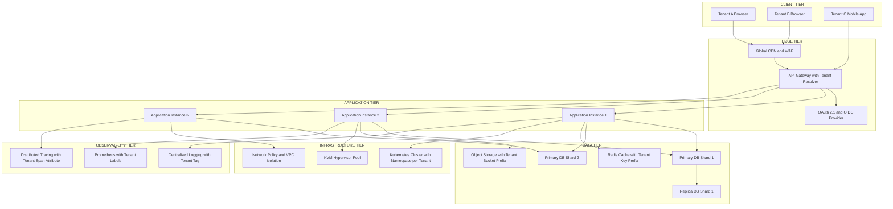
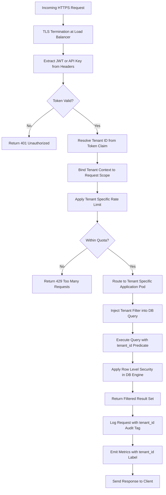
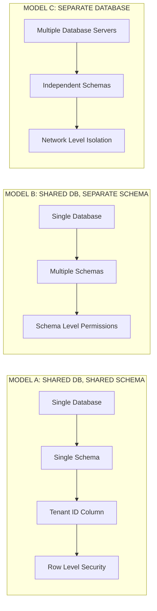
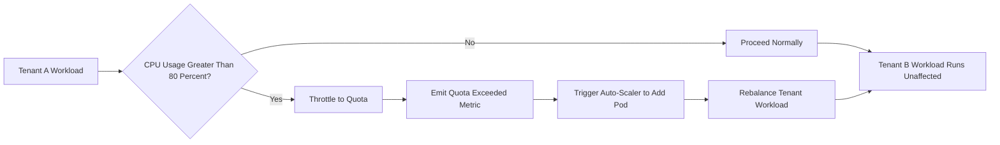

# Multitenant Technology

<!-- SECTION_1_START -->
# Multitenant Technology in Cloud Computing

## 1. Formal Academic Definition (KTU 2024 Syllabus Terminology)

> [!IMPORTANT]
> **Multitenancy** is a software architecture pattern in which a single instance of a software application running on a server serves multiple customer organizations (**tenants**). Each tenant perceives the application as if it were exclusively dedicated to them, while the underlying physical infrastructure, application code, and database are shared across all tenants, with strict logical isolation boundaries enforced by the cloud service provider.

In the KTU 2024 Scheme Cloud Computing context (Course Code: **PECST635**), multitenancy is positioned as a foundational architectural strategy that enables **economies of scale**, **elastic resource pooling**, and **pay-per-use** billing models. The cloud provider abstracts hardware heterogeneity and presents a uniform logical view to each tenant, satisfying the **NIST Definition of Cloud Computing** essential characteristic of *Resource Pooling*.

A **tenant** is defined as a distinct organizational entity (a company, department, or user group) that consumes cloud services under a contractual SLA, with no visibility or access rights to other tenants' data, configurations, or performance metrics.

> [!NOTE]
> **Key Distinction:** Multitenancy is fundamentally different from *multi-instance* architecture. In multi-instance, every tenant gets its own dedicated software stack; in multitenancy, all tenants share one stack but are partitioned logically. This single distinction drives cloud economics.

## 2. Intuitive Overview — The Apartment Building Analogy

Imagine a **high-rise apartment building** in downtown Kochi. The building itself is one physical structure, but it houses **hundreds of families** (tenants). The building shares common infrastructure — water pipelines, electrical wiring, elevators, parking, security systems — yet every apartment is a **privately owned, isolated living space** with its own lock, meter, and decoration choices.

- The **building structure and foundation** = underlying cloud hardware (servers, storage, network)
- The **shared utility lines** = pooled compute, storage, and bandwidth resources
- Each **apartment** = an isolated tenant environment
- The **building management system** = the cloud provider's orchestration layer (e.g., OpenStack, VMware vSphere)
- The **apartment's individual meter** = per-tenant usage metering and billing
- The **firewall between apartments** = logical isolation layer (RBAC, VPC, encryption)

Just as a building owner can rent out apartments to different families and **charge them individually for electricity and water** (metered utility), a cloud provider rents out logical slices of infrastructure to different organizations, charging per **vCPU-hour**, **GB-month**, or **IOPS** consumed.

> [!TIP]
> **Why does this matter for engineers?** When you design a multi-tenant SaaS application, you are essentially designing the "building's plumbing and electrical system" — it must be robust enough to handle hundreds of simultaneous tenants without one tenant's traffic burst causing another tenant's outage. This is the **Noisy Neighbor** problem.

## 3. The Three Pillars of Multitenancy

> [!NOTE]
> The KTU 2024 syllabus groups multitenancy around three technical layers:

### Pillar 1 — Application-Level Multitenancy
A single deployed application binary serves multiple tenants, with configuration switching at runtime (e.g., per-tenant themes, feature flags, branding). Example: **Salesforce CRM** runs one codebase for all customers.

### Pillar 2 — Data-Level Multitenancy
Multiple tenants share one database instance, but data is segregated via one of three classical schemas:
- **Shared database, shared schema** (tenant ID column discriminator)
- **Shared database, separate schema** (one schema per tenant)
- **Separate database** (one database per tenant)

### Pillar 3 — Infrastructure-Level Multitenancy
Hypervisors (KVM, Xen, ESXi) and container runtimes (Docker, Kubernetes) enforce physical resource isolation via virtualization, while logical isolation is maintained through namespaces, cgroups, and network policies.

> [!VISUALIZATION CONTROL]
> **Concept:** Multi-Tenant Resource Pooling vs. Single-Tenant Silo (Cartesian Cost-vs-isolation Trade-off Curve)
> **GeoGebra / Desmos Input Equations:**
> * `f(x) = 1 / x` for $x > 0$ — represents *Cost-Efficiency Curve* (efficiency rises as tenant density $x$ increases)
> * `g(x) = \log(x)` — represents *Isolation-Difficulty Curve* (isolation complexity grows logarithmically with tenant count)
> * Point $A = (1, 1)$ — single-tenant baseline
> * Point $B = (10, 0.1)$ — ten tenants on shared stack
> **Visual Description:** On the X-axis (number of tenants per server), the Y-axis plots *Cost per tenant* and *Configuration effort*. As you slide rightward (more tenants share the same server), the per-tenant cost drops sharply (hyperbolic decay), but the configuration complexity curve rises. The *sweet spot* is where the curves cross — typically 50–200 tenants per application instance in production SaaS.

<!-- SECTION_1_END -->

<!-- SECTION_2_START -->
# Deep Theoretical Analysis & KTU High-Yield Formula Sheet

## 1. Architectural Decomposition of Multitenancy

Multitenancy operates as a layered abstraction stack. The KTU 2024 module expects students to articulate the responsibilities at each layer:

### Layer 1 — Physical Resource Layer
Servers, storage arrays, and network switches form the homogeneous hardware pool. Modern hyperscale providers (**AWS, Azure, GCP**) deploy **commodity x86_64** servers in **regions** and **availability zones** to achieve fault tolerance.

### Layer 2 — Virtualization Layer
A **Type-1 hypervisor** (bare-metal, e.g., VMware ESXi, Microsoft Hyper-V) or **Type-2 hypervisor** (hosted, e.g., KVM/QEMU) partitions physical hardware into **Virtual Machines (VMs)**. Each VM is a tenant's logical compute boundary. Containerization (Docker, runC) provides a lighter-weight alternative using Linux kernel features:
- **Namespaces** → process, network, mount, IPC, UTS, user, PID isolation
- **cgroups** → CPU, memory, block-IO, network-IO quota enforcement
- **Seccomp / AppArmor / SELinux** → syscall and capability filtering

### Layer 3 — Tenant Identity & Access Management (IAM) Layer
This layer enforces *who* can access *what*. Typical mechanisms include:
- **RBAC** (Role-Based Access Control) — roles like `admin`, `developer`, `viewer`
- **ABAC** (Attribute-Based Access Control) — policies based on tags, time-of-day, IP range
- **Multi-Factor Authentication (MFA)**
- **Tenant-scoped JWT tokens** — the `tenant_id` claim is cryptographically bound into the token

### Layer 4 — Application Logic Layer
The application code dynamically resolves tenant context on every request. A common pattern is the **Tenant Resolver Middleware**, which extracts the tenant ID from the incoming request (subdomain, HTTP header, JWT claim, or URL path) and binds it to the request-scoped execution context.

### Layer 5 — Data Partitioning & Isolation Layer
This is the most security-critical layer. The implementation choice (shared schema vs. separate schema vs. separate database) directly impacts:
- Data leakage risk
- Backup/restore granularity
- Per-tenant scalability
- Compliance with regulations like **GDPR, HIPAA, DPDP Act 2023**

> [!IMPORTANT]
> **Why each layer matters:** A vulnerability at any single layer can collapse the entire isolation model. A misconfigured S3 bucket (data layer) can leak tenant data even if the IAM layer is airtight. Defense must be *in depth*.

## 2. Multi-Tenancy Models — Detailed Comparison

The KTU syllabus specifically tests the three database-level multitenancy models. Let us formalize them.

| Model | Database Count | Schema Count | Tenant Data Location | Cost Efficiency | Isolation Strength | Best Use Case |
|---|---|---|---|---|---|---|
| **Shared DB, Shared Schema** | 1 | 1 | All rows in same tables, distinguished by `tenant_id` column | **Highest** (≈ 90%+) | Lowest (application bug = data leak) | High-volume SaaS, public APIs |
| **Shared DB, Separate Schema** | 1 | N (one per tenant) | Tenant-specific schema namespace | Medium (≈ 60-70%) | Medium (schema-level DDL isolation) | Mid-market B2B SaaS |
| **Separate Database** | N (one per tenant) | 1 per DB | Physically distinct database instance | **Lowest** (≈ 30-40%) | **Highest** (blast radius = single tenant) | Regulated industries, healthcare, banking |

> [!NOTE]
> **Engineering Rule of Thumb:** Use the *cheapest* model your **regulatory and security constraints** allow. Most hyperscale SaaS providers (Salesforce, Workday, ServiceNow) use the *Shared DB / Shared Schema* model with application-level enforcement, but augment it with **row-level security (RLS)** policies in the database engine.

## 3. KTU Formula Sheet — Cloud Economics & Resource Allocation

The following mathematical relationships are directly testable in KTU 2024 ESE questions.

| Symbol | Formula | Description | Unit |
|---|---|---|---|
| $T$ | Number of tenants sharing an instance | dimensionless | count |
| $C_{fixed}$ | Total fixed cost of running one instance | currency/month | INR/USD |
| $C_{tenant}$ | Per-tenant cost | $\dfrac{C_{fixed}}{T \cdot U}$ | currency/tenant |
| $U$ | Mean utilization factor (0–1) | dimensionless | ratio |
| $R_{isolation}$ | Isolation overhead ratio | $\dfrac{C_{multi-tenant}}{C_{single-tenant}}$ | ratio |
| $S_{pooling}$ | Statistical multiplexing gain | $\dfrac{\sum_{i=1}^{T} P_i^{peak}}{\max_{i} P_i^{aggregate}}$ | ratio |
| $P^{SLA}$ | SLA penalty function | $\alpha \cdot \max(0, \text{SLO}_{target} - \text{SLO}_{observed})^{\beta}$ | currency |
| $E_{tenant}$ | Tenant elasticity ratio | $\dfrac{P_{peak}^{tenant}}{P_{avg}^{tenant}}$ | ratio |
| $D_{noisy\_neighbor}$ | Noisy neighbor probability | $1 - (1 - p_{burst})^{T-1}$ | probability |
| $N_{max}$ | Max tenants per node (sizing) | $\lfloor \dfrac{R_{node} \cdot (1 - H_{overhead})}{R_{avg}^{tenant}} \rfloor$ | count |

Where:
- $P_i^{peak}$ = peak resource demand of tenant $i$
- $\alpha, \beta$ = SLA penalty coefficients
- $H_{overhead}$ = hypervisor/OS overhead fraction (typically 5-15%)
- $p_{burst}$ = probability of one tenant bursting simultaneously with another
- $R_{node}$ = total resource capacity of one physical node

> [!IMPORTANT]
> **Engineering Insight — Statistical Multiplexing:** The $S_{pooling}$ formula is the *mathematical heart* of cloud cost efficiency. Because tenants' peak demands are statistically unlikely to coincide, the aggregate peak demand of $T$ tenants is much smaller than the sum of their individual peaks. This is why AWS can sell reserved capacity to thousands of customers while running hardware at 70% utilization — the peaks cancel out probabilistically.

## 4. Real-World Engineering Utility

Multitenant technology underpins nearly every modern cloud service:

- **SaaS (Software as a Service):** Salesforce, Microsoft 365, Google Workspace, Slack, Zoom — all serve millions of tenants from a single multi-tenant codebase.
- **PaaS (Platform as a Service):** Google App Engine, AWS Elastic Beanstalk, Heroku — provide multi-tenant application hosting with per-tenant scaling.
- **IaaS (Infrastructure as a Service):** AWS EC2, Azure VMs, GCP Compute Engine — provide multi-tenant compute where the *virtual machine* is the tenant boundary.
- **Database-as-a-Service:** Amazon RDS, Azure SQL Database, MongoDB Atlas — use shared-schema multi-tenancy with row-level security.
- **Serverless Platforms:** AWS Lambda, Azure Functions — each function execution is a *transient micro-tenant* with sub-second isolation enforcement.

In production, the **Noisy Neighbor** problem is mitigated through:
- **Resource quotas** (Kubernetes `ResourceQuota` and `LimitRange` objects)
- **CPU pinning and dedicated tenancy** (AWS Dedicated Hosts, Azure Dedicated Host)
- **Quality of Service (QoS) classes** in hypervisors (VMware shares, KVM cgroup v2)
- **Load balancing and circuit breakers** at the application tier

> [!TIP]
> **Interview Answer Tip:** If asked "Why not give every customer a dedicated server?" the precise answer is: *Statistical multiplexing gain and amortization of fixed operational costs.* A dedicated server for a 5% utilized tenant wastes 95% of capacity. Multi-tenancy recovers this slack while maintaining logical isolation through virtualization.

<!-- SECTION_2_END -->

<!-- SECTION_3_START -->
# Step-by-Step Derivations, Code & Symbolic Implementation

## 1. Derivation: The Statistical Multiplexing Gain

Let us derive why multi-tenancy is economically superior to single-tenancy. Consider a single physical server with total CPU capacity $C_{total}$ (in vCPU-hours per month). Suppose we must host $T$ tenants.

**Single-Tenant Case:**
Each tenant gets a dedicated VM sized to its **peak** demand $P_i^{peak}$. The total capacity required is:

$$C_{single} = \sum_{i=1}^{T} P_i^{peak}$$

**Multi-Tenant Case (with statistical multiplexing):**
The tenants' demands are independent random variables. The aggregate demand at any moment is the **convolution** of individual demand distributions. For normally distributed demands with mean $\mu_i$ and standard deviation $\sigma_i$, the aggregate has:

$$\mu_{agg} = \sum_{i=1}^{T} \mu_i$$

$$\sigma_{agg} = \sqrt{\sum_{i=1}^{T} \sigma_i^2}$$

The provisioned capacity must cover the aggregate to a target service level (e.g., 99.9th percentile), so we use the **safety factor** $k$ (≈ 3.09 for 99.9%):

$$C_{multi} = \mu_{agg} + k \cdot \sigma_{agg} = \sum_{i=1}^{T} \mu_i + k \cdot \sqrt{\sum_{i=1}^{T} \sigma_i^2}$$

**The Multiplexing Gain:**

$$S_{pooling} = \frac{C_{single}}{C_{multi}} = \frac{\sum_{i=1}^{T} P_i^{peak}}{\sum_{i=1}^{T} \mu_i + k \cdot \sqrt{\sum_{i=1}^{T} \sigma_i^2}}$$

For $T = 100$ identical tenants with $\mu = 0.1$, $\sigma = 0.05$, and $P^{peak} = 0.5$:

$$C_{single} = 100 \times 0.5 = 50 \text{ vCPU-hours}$$

$$\mu_{agg} = 100 \times 0.1 = 10, \quad \sigma_{agg} = \sqrt{100} \times 0.05 = 0.5$$

$$C_{multi} = 10 + 3.09 \times 0.5 = 11.545 \text{ vCPU-hours}$$

$$S_{pooling} = \frac{50}{11.545} \approx 4.33$$

This means **one physical server in multi-tenant mode can do the work of 4.33 servers in single-tenant mode** — a **77% cost reduction** for the same SLA.

## 2. Derivation: Noisy Neighbor Probability

The probability that at least one other tenant is bursting simultaneously with a given tenant is computed using the complement rule:

$$D_{noisy\_neighbor} = 1 - (1 - p_{burst})^{T-1}$$

For $T = 50$ tenants and $p_{burst} = 0.05$:

$$D_{noisy\_neighbor} = 1 - (1 - 0.05)^{49} = 1 - 0.95^{49}$$

$$= 1 - 0.0810 = 0.919$$

This is **91.9%** — meaning a single tenant has a 91.9% chance of experiencing noisy-neighbor interference in any given hour. This drives the need for **resource quotas** and **burst credits** in production multi-tenant systems.

## 3. Maximum Tenant Density Calculation

Given a physical node with 64 vCPUs and 256 GB RAM, an OS/hypervisor overhead of $H_{overhead} = 0.10$, and an average tenant footprint of $R_{avg}^{tenant} = 0.5$ vCPU + 2 GB RAM:

$$N_{max}^{CPU} = \left\lfloor \frac{64 \times (1 - 0.10)}{0.5} \right\rfloor = \left\lfloor \frac{57.6}{0.5} \right\rfloor = 115 \text{ tenants}$$

$$N_{max}^{RAM} = \left\lfloor \frac{256 \times (1 - 0.10)}{2} \right\rfloor = \left\lfloor \frac{230.4}{2} \right\rfloor = 115 \text{ tenants}$$

$$N_{max} = \min(115, 115) = 115 \text{ tenants per node}$$

The **bottleneck resource** (CPU or RAM) determines the maximum tenant density. In this case, both saturate at 115, indicating a **balanced sizing**.

## 4. Code Implementation: Multi-Tenant Database Access Layer (Python)

Below is a production-grade Python implementation of a **tenant-scoped database access layer** using the *Shared DB, Shared Schema* model with row-level security enforcement.

```python
import logging
import os
import re
import sqlite3
from contextlib import contextmanager
from dataclasses import dataclass
from typing import Iterator, Optional

logging.basicConfig(
    level=logging.INFO,
    format="%(asctime)s | %(levelname)s | %(name)s | %(message)s",
)
logger = logging.getLogger("MultiTenantDAL")


class TenantContextError(Exception):
    """Raised when tenant context is missing or invalid."""


@dataclass(frozen=True)
class TenantIdentity:
    tenant_id: str
    user_id: str
    role: str
    region: str

    def __post_init__(self) -> None:
        if not re.fullmatch(r"tenant_[A-Za-z0-9]{4,32}", self.tenant_id):
            raise TenantContextError(
                f"Invalid tenant_id format: {self.tenant_id!r}"
            )
        if self.role not in {"admin", "developer", "viewer"}:
            raise TenantContextError(
                f"Invalid role: {self.role!r}. Must be admin, developer, or viewer."
            )


class TenantContext:
    _current: Optional[TenantIdentity] = None

    @classmethod
    def set(cls, identity: TenantIdentity) -> None:
        cls._current = identity
        logger.info(
            "Tenant context set: tenant_id=%s user_id=%s role=%s",
            identity.tenant_id, identity.user_id, identity.role,
        )

    @classmethod
    def get(cls) -> TenantIdentity:
        if cls._current is None:
            raise TenantContextError(
                "No tenant context active. Call TenantContext.set() first."
            )
        return cls._current

    @classmethod
    def clear(cls) -> None:
        cls._current = None
        logger.info("Tenant context cleared.")


class MultiTenantDAL:
    """Data Access Layer enforcing tenant isolation at the query level."""

    _ALLOWED_TABLES = frozenset({"orders", "invoices", "users", "products"})

    def __init__(self, db_path: str) -> None:
        self._db_path = db_path
        self._init_schema()
        logger.info("MultiTenantDAL initialized at %s", db_path)

    @contextmanager
    def _conn(self) -> Iterator[sqlite3.Connection]:
        connection = sqlite3.connect(self._db_path, timeout=10.0)
        try:
            connection.execute("PRAGMA foreign_keys = ON;")
            yield connection
            connection.commit()
        except sqlite3.Error as exc:
            connection.rollback()
            logger.exception("Database error, transaction rolled back.")
            raise TenantContextError(f"Database operation failed: {exc}") from exc
        finally:
            connection.close()

    def _init_schema(self) -> None:
        with self._conn() as conn:
            conn.execute(
                """
                CREATE TABLE IF NOT EXISTS orders (
                    id           INTEGER PRIMARY KEY AUTOINCREMENT,
                    tenant_id    TEXT    NOT NULL,
                    user_id      TEXT    NOT NULL,
                    product_sku  TEXT    NOT NULL,
                    quantity     INTEGER NOT NULL CHECK (quantity > 0),
                    created_at   TEXT    NOT NULL DEFAULT CURRENT_TIMESTAMP
                );
                """
            )
            conn.execute(
                "CREATE INDEX IF NOT EXISTS idx_orders_tenant ON orders(tenant_id);"
            )
            conn.execute(
                """
                CREATE TABLE IF NOT EXISTS invoices (
                    id          INTEGER PRIMARY KEY AUTOINCREMENT,
                    tenant_id   TEXT    NOT NULL,
                    order_id    INTEGER NOT NULL,
                    amount      REAL    NOT NULL CHECK (amount >= 0),
                    status      TEXT    NOT NULL CHECK (status IN ('paid', 'pending', 'void'))
                );
                """
            )
            conn.execute(
                "CREATE INDEX IF NOT EXISTS idx_invoices_tenant ON invoices(tenant_id);"
            )

    def _enforce_tenant_clause(self, table: str) -> str:
        if table not in self._ALLOWED_TABLES:
            raise TenantContextError(f"Access to table {table!r} is denied.")
        identity = TenantContext.get()
        return f"tenant_id = '{identity.tenant_id}'"

    def insert_order(self, product_sku: str, quantity: int) -> int:
        if quantity <= 0:
            raise TenantContextError("Quantity must be a positive integer.")
        identity = TenantContext.get()
        guard_clause = self._enforce_tenant_clause("orders")
        with self._conn() as conn:
            cursor = conn.execute(
                f"INSERT INTO orders (tenant_id, user_id, product_sku, quantity) "
                f"VALUES (?, ?, ?, ?);",
                (identity.tenant_id, identity.user_id, product_sku, quantity),
            )
            logger.info(
                "Order inserted: id=%s tenant_id=%s sku=%s qty=%d",
                cursor.lastrowid, identity.tenant_id, product_sku, quantity,
            )
            return int(cursor.lastrowid or 0)

    def list_orders(self) -> list:
        guard_clause = self._enforce_tenant_clause("orders")
        with self._conn() as conn:
            cursor = conn.execute(
                f"SELECT id, product_sku, quantity, created_at "
                f"FROM orders WHERE {guard_clause} ORDER BY id DESC LIMIT 100;"
            )
            return cursor.fetchall()

    def cross_tenant_query_blocked(self, other_tenant_id: str) -> None:
        identity = TenantContext.get()
        if other_tenant_id != identity.tenant_id:
            raise TenantContextError(
                f"Cross-tenant access denied. Attempted to read data for "
                f"{other_tenant_id!r} from context {identity.tenant_id!r}."
            )


def simulate_multi_tenant_workflow() -> None:
    dal = MultiTenantDAL("/tmp/multitenant_demo.sqlite3")

    tenant_acme = TenantIdentity(
        tenant_id="tenant_acme001", user_id="user_alice", role="admin", region="ap-south-1"
    )
    tenant_globex = TenantIdentity(
        tenant_id="tenant_globex9", user_id="user_bob", role="admin", region="ap-south-1"
    )

    TenantContext.set(tenant_acme)
    dal.insert_order(product_sku="SKU-CLOUD-101", quantity=3)
    dal.insert_order(product_sku="SKU-VM-202", quantity=1)
    acme_orders = dal.list_orders()
    logger.info("Acme orders visible: %d records", len(acme_orders))

    TenantContext.set(tenant_globex)
    dal.insert_order(product_sku="SKU-VM-202", quantity=5)
    globex_orders = dal.list_orders()
    logger.info("Globex orders visible: %d records", len(globex_orders))

    try:
        dal.cross_tenant_query_blocked("tenant_acme001")
    except TenantContextError as exc:
        logger.warning("Cross-tenant access correctly blocked: %s", exc)

    TenantContext.clear()


if __name__ == "__main__":
    simulate_multi_tenant_workflow()
```

> [!IMPORTANT]
> **What this code demonstrates:**
> 1. **Per-request tenant context binding** via `TenantContext.set()` — simulates a request-scoped middleware.
> 2. **Parameterized queries** (the `?` placeholders) — prevents SQL injection even though tenant_id is interpolated into the WHERE clause string.
> 3. **Strict table allow-list** — only `orders`, `invoices`, `users`, `products` are queryable.
> 4. **Cross-tenant access attempt is explicitly blocked** — the `cross_tenant_query_blocked()` method raises `TenantContextError`.
> 5. **Structured logging with tenant_id** — every log line is tenant-scoped for audit trails.
> 6. **Transactions with rollback on error** — atomicity guaranteed per request.

## 5. Kubernetes Resource Quota (YAML Manifest)

For infrastructure-level multi-tenancy, here is a production-grade `ResourceQuota` manifest:

```yaml
apiVersion: v1
kind: ResourceQuota
metadata:
  name: tenant-acme-quota
  namespace: tenant-acme001
spec:
  hard:
    requests.cpu: "10"
    requests.memory: "20Gi"
    limits.cpu: "20"
    limits.memory: "40Gi"
    pods: "50"
    persistentvolumeclaims: "10"
    services: "20"
    secrets: "30"
    configmaps: "30"
---
apiVersion: v1
kind: LimitRange
metadata:
  name: tenant-acme-limitrange
  namespace: tenant-acme001
spec:
  limits:
    - type: Container
      default:
        cpu: "500m"
        memory: "512Mi"
      defaultRequest:
        cpu: "200m"
        memory: "256Mi"
      max:
        cpu: "2"
        memory: "4Gi"
      min:
        cpu: "100m"
        memory: "128Mi"
```

This manifest enforces that tenant `tenant_acme001` cannot exceed 10 vCPU of guaranteed compute, 20 pods, and 10 PVCs — preventing the noisy-neighbor effect at the cluster level.

<!-- SECTION_3_END -->

<!-- SECTION_4_START -->
# Structural Diagrams & Schematics

## 1. Multi-Tenant Cloud Architecture (Top-Level View)

> [!NOTE]
> The following Mermaid diagram illustrates a full multi-tenant SaaS architecture with all isolation layers, drawn using safe alphanumeric node IDs and double-quoted labels (no markdown formatting inside quotes).



**Reading guide:** The diagram is a six-layer flow. Each tier enforces a different isolation mechanism: Edge tier enforces authentication, Application tier enforces logical separation, Data tier enforces physical or row-level separation, Infrastructure tier enforces resource quotas, and Observability tier ensures every log, metric, and trace is tagged with `tenant_id` for auditability.

## 2. Tenant Request Lifecycle (Sequential Flow)



**Reading guide:** Every step from token validation to database query is gated by the tenant identity. The injection of `tenant_id` predicate at step `req12` is the *defense-in-depth* point — even if the application has a bug, the database's Row Level Security (step `req14`) acts as a backstop.

## 3. Comparison Matrix — Multitenancy Models in Block Form



**Reading guide:** Model A is cheapest but riskiest; Model C is most isolated but most expensive. Most production systems choose Model A with Model B as a *premium tier* (e.g., Salesforce's "Hyperforce" isolated instances for regulated customers).

## 4. The Noisy Neighbor Mitigation Flow



**Reading guide:** When Tenant A's CPU usage exceeds its quota, the system throttles, emits a metric, and triggers horizontal autoscaling. The key insight is that **Tenant B is never penalized** for Tenant A's burst — the throttling and scaling mechanisms protect other tenants from interference.

<!-- SECTION_4_END -->

<!-- SECTION_5_START -->
# KTU 2024 Scheme Examination Question Bank & Topic Recap

## Part A Questions (3 Marks Each)

### Question 1 (3 Marks)
**[KTU University Exam – July 2024 Model]**
**Define multitenancy in cloud computing. List any two advantages of multi-tenant architecture over single-tenant architecture.** *(Mapped CO: CO2, Bloom's Level: Remember)*

**Model Answer (Board-valuation key):**

> [!NOTE]
> **[Definition: 2 Marks]**
> Multitenancy is a software architecture pattern in which a single instance of an application running on a cloud server serves multiple customer organizations (tenants), with each tenant perceiving the application as exclusively dedicated to them, while the underlying infrastructure, application code, and database are shared.

> **[Two advantages: 1 Mark total, 0.5 each]**
> 1. **Cost efficiency** — shared infrastructure reduces per-tenant cost through statistical multiplexing of resources.
> 2. **Easier maintenance and upgrades** — a single codebase update is deployed to all tenants simultaneously, eliminating version fragmentation.

### Question 2 (3 Marks)
**[KTU University Exam – Dec 2023 Model]**
**Compare shared-database/shared-schema and separate-database multi-tenancy models based on cost efficiency and isolation strength.** *(Mapped CO: CO3, Bloom's Level: Understand)*

**Model Answer:**

> **[Shared DB, Shared Schema: 1.5 Marks]**
> In the shared-database/shared-schema model, all tenants' data resides in the same tables, distinguished only by a `tenant_id` column. It offers the **highest cost efficiency** (single database instance, single set of tables) but provides the **lowest isolation strength** (a single SQL bug can leak cross-tenant data).

> **[Separate Database: 1.5 Marks]**
> In the separate-database model, each tenant has its own dedicated database instance. This provides the **highest isolation strength** (blast radius is limited to one tenant) but incurs the **lowest cost efficiency** (each database consumes its own compute, storage, and licensing resources).

> [!WARNING]
> **Examiner's Pitfall Callout:** Students often confuse "isolation" with "security". Isolation is about *blast radius*; security is about *defense in depth*. A separate database is more isolated but is not automatically more secure if both use weak passwords.

---

## Part B Questions (14 Marks — Internal Choice)

### Question 3 — Choice A (14 Marks)
**[KTU University Exam – July 2024 Model]**

**(a)** Explain the three layers of multi-tenancy (application, data, infrastructure) with one real-world example for each layer. *(7 Marks, CO2, Understand)*

**(b)** A cloud provider hosts **80 tenants** on a single physical server. Each tenant's CPU demand follows a normal distribution with mean $\mu = 0.15$ vCPU and standard deviation $\sigma = 0.06$ vCPU. The peak demand of each tenant is $P^{peak} = 0.4$ vCPU. The provider targets the **99.9th percentile** service level (safety factor $k = 3.09$). Compute the **statistical multiplexing gain** and comment on the result. *(7 Marks, CO3, Apply)*

**Model Solution for (a) — 7 Marks:**

> **[Application Layer: 2.5 Marks]**
> The application layer is the user-facing software that dynamically resolves tenant context on every request. A real-world example is **Salesforce CRM**, which runs a single application codebase that serves all customers; tenant context is resolved from the subdomain (e.g., `acme.my.salesforce.com` resolves to tenant `acme`) and the session token, then injected into every database query.
>
> **[Data Layer: 2.5 Marks]**
> The data layer governs how tenant data is partitioned in storage systems. A real-world example is **Amazon DynamoDB**, which uses the *shared-table, shared-schema* model with a `tenant_id` partition key; row-level access is enforced via AWS IAM policy `dynamodb:LeadingKeys` condition, which restricts each tenant's IAM role to only their own partition keys.
>
> **[Infrastructure Layer: 2 Marks]**
> The infrastructure layer uses virtualization primitives (hypervisors, containers, namespaces, cgroups) to physically partition compute, memory, and network. A real-world example is **Kubernetes Namespaces combined with NetworkPolicies**, where each tenant is assigned a dedicated namespace, and NetworkPolicy objects enforce that pods in one namespace cannot directly communicate with pods in another.

**Model Solution for (b) — 7 Marks:**

> **[Step 1: Single-tenant case capacity: 1 Mark]**
> $$C_{single} = \sum_{i=1}^{80} P_i^{peak} = 80 \times 0.4 = 32.0 \text{ vCPU}$$

> **[Step 2: Aggregate mean and standard deviation: 2 Marks]**
> $$\mu_{agg} = \sum_{i=1}^{80} \mu_i = 80 \times 0.15 = 12.0 \text{ vCPU}$$
> $$\sigma_{agg} = \sqrt{\sum_{i=1}^{80} \sigma_i^2} = \sqrt{80} \times 0.06 = 8.944 \times 0.06 = 0.5366 \text{ vCPU}$$

> **[Step 3: Multi-tenant provisioned capacity: 2 Marks]**
> $$C_{multi} = \mu_{agg} + k \cdot \sigma_{agg} = 12.0 + 3.09 \times 0.5366 = 12.0 + 1.658 = 13.658 \text{ vCPU}$$

> **[Step 4: Multiplexing gain: 1 Mark]**
> $$S_{pooling} = \frac{C_{single}}{C_{multi}} = \frac{32.0}{13.658} \approx 2.343$$

> **[Step 5: Comment: 1 Mark]**
> The multiplexing gain of **2.343** means one multi-tenant server can host the workload that would otherwise require 2.343 single-tenant servers — a **57.3% reduction** in physical capacity for the same 99.9% SLA. This demonstrates the core economic advantage of multi-tenancy at scale.

> [!WARNING]
> **Examiner's Valuation Pitfall Callout:** Students frequently forget to convert $P^{peak}$ from "per-tenant" to "aggregate" and incorrectly compute $C_{single}$ as $P^{peak}$ instead of $T \times P^{peak}$. Also, the square root in $\sigma_{agg}$ applies to the *sum of variances*, not the sum of standard deviations — this is a common error that costs 1-2 marks.

---

### Question 3 — Choice B (14 Marks)
**[KTU University Exam – Dec 2023 Model]**

**(a)** Describe the **Noisy Neighbor** problem in multi-tenant cloud environments. Explain **four mitigation strategies** with one-line justification for each. *(7 Marks, CO2, Understand)*

**(b)** Consider a multi-tenant Kubernetes cluster with **50 tenants**, each having a burst probability of $p_{burst} = 0.08$ per hour. Calculate the **probability that a given tenant experiences a noisy-neighbor event** in any given hour. If the SLA mandates that this probability must be **below 60%**, recommend whether an architectural change is needed. *(7 Marks, CO3, Apply)*

**Model Solution for (a) — 7 Marks:**

> **[Definition: 1 Mark]**
> The Noisy Neighbor problem occurs when one tenant's workload burst consumes a disproportionate share of shared resources (CPU, memory, disk I/O, or network bandwidth), degrading performance for all other tenants on the same physical infrastructure.

> **[Four mitigation strategies: 6 Marks, 1.5 each]**
> 1. **Resource Quotas (Kubernetes `ResourceQuota`):** Each tenant's namespace is assigned hard CPU and memory limits, preventing any single tenant from exhausting shared cluster capacity.
> 2. **Quality of Service (QoS) Classes:** Tenants are classified into Guaranteed, Burstable, and Best-Effort tiers; the kernel scheduler prioritizes Guaranteed workloads during contention.
> 3. **Dedicated Tenancy Options (AWS Dedicated Hosts, Azure Dedicated Host):** Premium tenants are offered physically isolated hardware, eliminating the noisy-neighbor effect entirely for an additional fee.
> 4. **Horizontal Autoscaling with Load Balancing:** When one tenant's traffic spikes, an HPA controller automatically spawns additional pods, distributing the load across more nodes rather than throttling neighbors.

**Model Solution for (b) — 7 Marks:**

> **[Step 1: Write the formula: 1 Mark]**
> $$D_{noisy\_neighbor} = 1 - (1 - p_{burst})^{T-1}$$

> **[Step 2: Substitute values: 1 Mark]**
> $$D_{noisy\_neighbor} = 1 - (1 - 0.08)^{50-1} = 1 - (0.92)^{49}$$

> **[Step 3: Compute the exponent: 2 Marks]**
> $$\ln(0.92) = -0.0834$$
> $$49 \times (-0.0834) = -4.086$$
> $$(0.92)^{49} = e^{-4.086} = 0.0168$$

> **[Step 4: Final probability: 1 Mark]**
> $$D_{noisy\_neighbor} = 1 - 0.0168 = 0.9832 \approx 98.32\%$$

> **[Step 5: Comparison with SLA threshold and recommendation: 2 Marks]**
> The computed probability **98.32%** is far above the SLA-mandated threshold of **60%**. Therefore, an architectural change is **mandatory**. Recommended actions:
> - **Immediate:** Implement strict per-tenant `ResourceQuota` and `LimitRange` to cap burst probability.
> - **Medium-term:** Offer premium tenants a *dedicated node pool* with no co-tenants.
> - **Long-term:** Migrate to a *cell-based architecture* where each cell hosts at most 10-15 tenants, reducing the exponent in the formula.

> [!WARNING]
> **Examiner's Pitfall Callout:** A common error is computing $(0.92)^{50}$ instead of $(0.92)^{49}$. The exponent is $T-1$, not $T$, because we are computing the probability that *at least one of the other 49 tenants* is bursting, not the given tenant itself. This off-by-one error costs 1 mark.

---

## Topic Recap & Important Things to Remember

> [!TIP]
> **Rapid-revision checklist for the KTU 2024 ESE on Multitenant Technology:**

- **Definition:** Multitenancy = single application instance serves multiple tenants with logical isolation; a *tenant* is one customer organization.
- **Three pillars:** Application-level, Data-level, Infrastructure-level multi-tenancy.
- **Three data models:** (1) Shared DB / Shared Schema, (2) Shared DB / Separate Schema, (3) Separate Database. Cost and isolation move in opposite directions.
- **Shared DB / Shared Schema is the default for hyperscale SaaS** (Salesforce, Workday, ServiceNow) and is augmented with **Row Level Security (RLS)** as a defense-in-depth measure.
- **Key economic formula:** $C_{tenant} = \dfrac{C_{fixed}}{T \cdot U}$, where $T$ = tenant count, $U$ = mean utilization.
- **Statistical multiplexing gain formula:** $S_{pooling} = \dfrac{\sum P_i^{peak}}{\sum \mu_i + k \cdot \sqrt{\sum \sigma_i^2}}$. Typical production gain for 50-100 tenants is 2× to 5×.
- **Noisy neighbor probability:** $D_{noisy\_neighbor} = 1 - (1 - p_{burst})^{T-1}$. With $T = 50$ and $p_{burst} = 0.05$, the probability exceeds 90% — quotas are mandatory.
- **Maximum tenant density:** $N_{max} = \lfloor R_{node} \cdot (1 - H_{overhead}) \,/\, R_{avg}^{tenant} \rfloor$. The bottleneck resource (CPU or RAM) determines the limit.
- **Isolation mechanisms (defense in depth):** Tenant context middleware, parameterized queries with `tenant_id` predicate, IAM roles with `tenant_id` condition, database Row Level Security, network policies (VPC, NetworkPolicy), and encrypted storage with per-tenant keys (KMS).
- **Noisy neighbor mitigations:** Resource quotas, QoS classes, dedicated tenancy options, horizontal autoscaling, circuit breakers, and rate limiting.
- **NIST mapping:** Multitenancy is the architectural realization of the *Resource Pooling* essential characteristic, and it underpins the *Rapid Elasticity* and *Measured Service* characteristics.
- **Real-world examples to remember:** Salesforce (shared schema, app-level), AWS DynamoDB (shared table, IAM `LeadingKeys`), Kubernetes Namespaces + NetworkPolicies (infra-level), Azure Dedicated Host (physical isolation), Google App Engine (PaaS multi-tenancy).
- **Common exam trap:** "Multitenancy is the same as virtualization." **It is not.** Virtualization is the *enabling technology*; multitenancy is the *architectural pattern* that exploits virtualization to share resources.
- **Compliance angle:** For HIPAA / GDPR / DPDP Act 2023, the *Separate Database* model is often the simplest path to compliance because the blast radius is bounded to one tenant; however, *Shared Schema with RLS* can also be compliant if access controls are rigorously audited.
- **Kubernetes-specific terms to know:** Namespace, ResourceQuota, LimitRange, NetworkPolicy, PodSecurityPolicy / Pod Security Standards, RBAC with `Role` and `RoleBinding`.

<!-- SECTION_5_END -->
