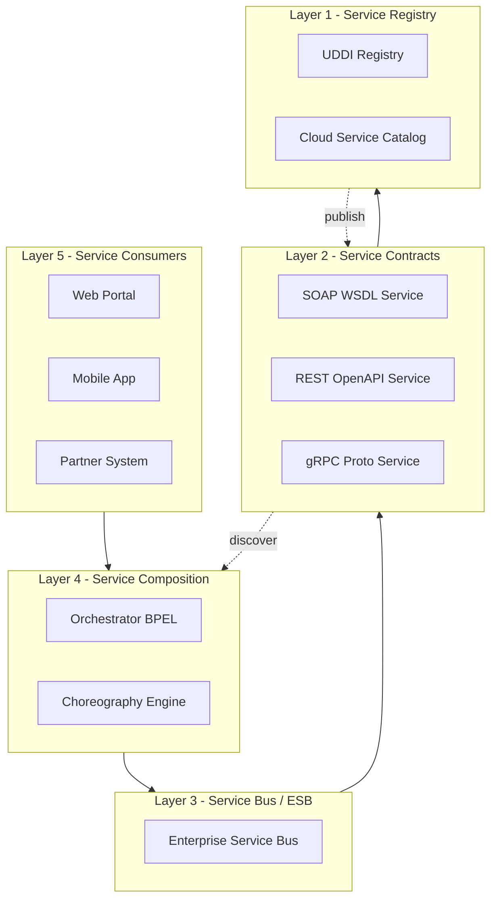
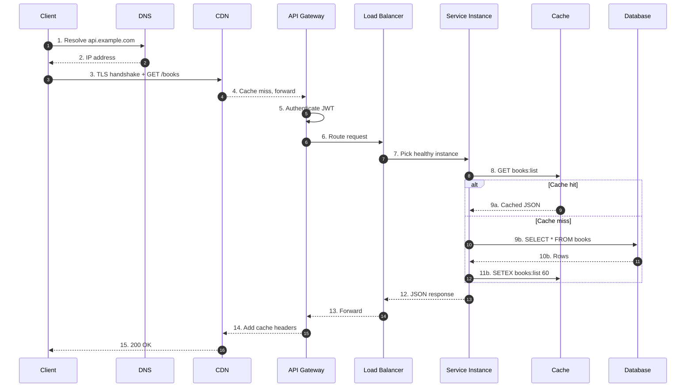
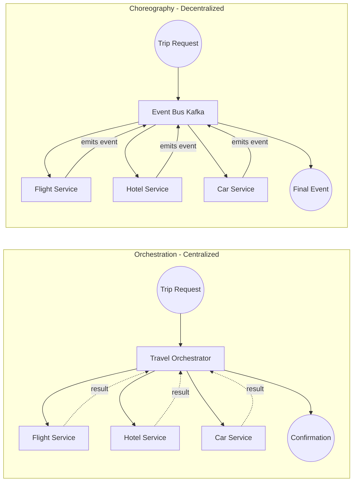
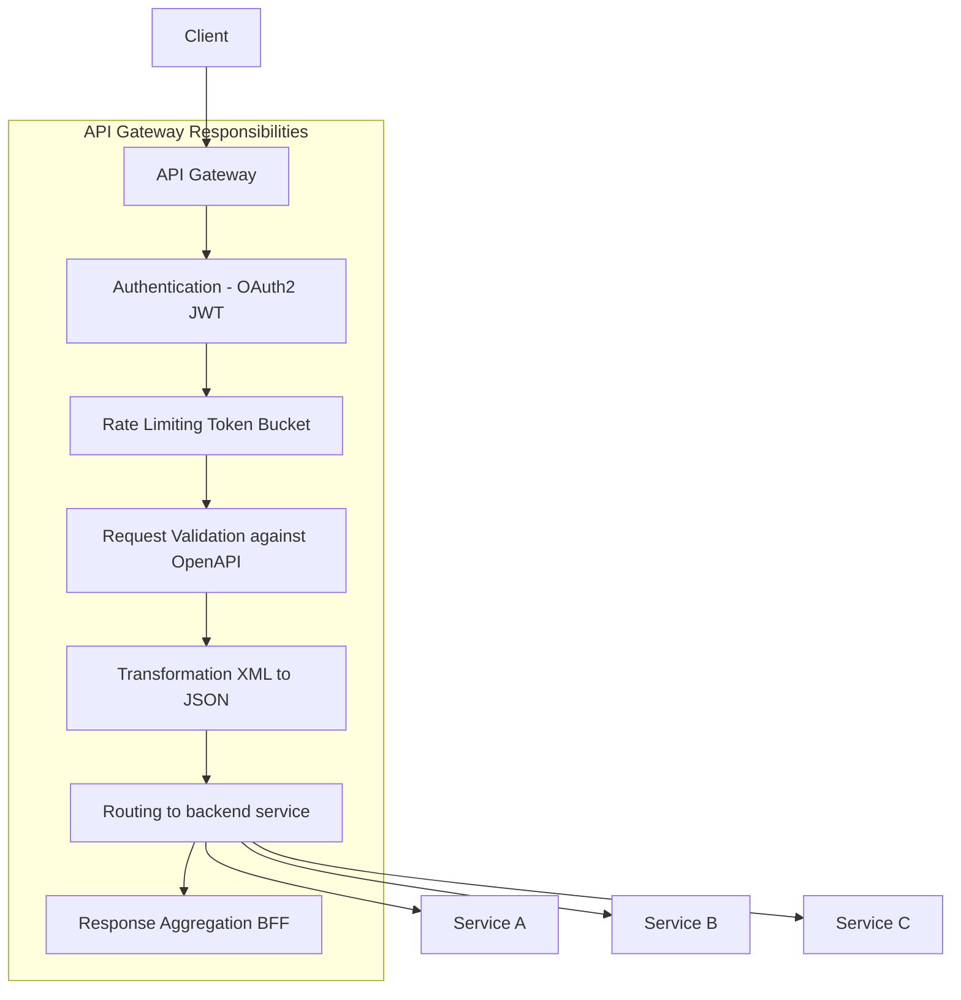

# Service Technology and Service APIs

<!-- SECTION_1_START -->
# Service Technology and Service APIs — Cloud Computing

> [!NOTE]
> **Module Focus:** This topic sits at the intersection of distributed systems engineering and modern cloud architecture. In the **KTU 2024 Scheme (PECST635 — Cloud Computing)**, Module 2 evaluates the student's ability to comprehend how loosely-coupled services interact over heterogeneous networks using standardized contracts.

## 1.1 Formal Definition (KTU 2024 Syllabus Terminology)

**Service Technology** is the collective set of architectural principles, communication protocols, data-exchange formats, and runtime infrastructure that enables discrete software components — owned by different teams, written in different languages, and deployed on different runtimes — to discover, invoke, compose, and manage each other across network boundaries.

A **Service API (Application Programming Interface)** is the formal, machine-readable contract that exposes a service's functional surface to external consumers. It defines the **endpoints**, **request/response schemas**, **authentication semantics**, **invocation semantics**, **versioning policies**, and **error taxonomies** through which clients interact with the service.

In KTU module terminology, three canonical service technologies are stressed:

| Acronym | Full Form | Architectural Style |
|---|---|---|
| **SOA** | Service-Oriented Architecture | Enterprise-scale, governance-heavy |
| **SOAP** | Simple Object Access Protocol | RPC-style, XML-heavy, WS-* standards |
| **REST** | Representational State Transfer | Resource-style, HTTP-native, stateless |

> [!IMPORTANT]
> **Syllabus Highlight:** The KTU 2024 Scheme expects students to differentiate **SOAP vs REST** rigorously, understand **WSDL** and **UDDI** for SOAP, and articulate the **REST maturity model** plus **HTTP verb semantics** for RESTful APIs. API gateways and service composition (orchestration vs choreography) are also high-weight areas.

## 1.2 Intuitive Analogy — The Restaurant Kitchen

Imagine a large cloud platform as a **busy restaurant**:

- The **kitchen stations** (grill, salad, dessert) are independent *services* — each is a black box that takes an order and returns a plate.
- The **waiter holding the menu** is the *API*. The menu tells you what you can ask for, in what format, and what you'll get back.
- The **order ticket** is the *request payload* (JSON/XML), and the **plated dish** is the *response payload*.
- The **kitchen pass and bell system** is the *transport protocol* (HTTP, AMQP, MQTT).
- The **head chef deciding the order in which dishes come out** is the *orchestrator* (in SOA composition).
- The **restaurant's reservation system** is the *service registry* (like UDDI or a cloud service catalog).

When you change a dish's recipe, you update the *menu* (the API contract) but the customer (client) doesn't need to know how the kitchen reorganized — **that's loose coupling**, the central promise of service technology.

## 1.3 Why Service Technology Matters in Cloud

Modern cloud platforms (AWS, Azure, GCP) expose **every infrastructure capability** as an API call. Whether you provision a virtual machine, store an object, query a database, or invoke an ML model, you are consuming a managed service through its API. The ability to **design**, **consume**, and **compose** these APIs is therefore a foundational employability skill for cloud engineers.

> [!VISUALIZATION CONTROL]
> **Concept:** Service Interaction Triangle — Consumer, Service, Registry
> **GeoGebra / Desmos Input Equations:**
> * `Consumer(0, 0)`, `Service(5, 0)`, `Registry(2.5, 4)`
> * Triangle edges: `Consumer-Service (invoke)`, `Consumer-Registry (discover)`, `Service-Registry (publish)`
> **Visual Description:** An equilateral triangle with three labeled vertices. The base edge between Consumer and Service represents the *invoke* (request/response) flow. The two slanted edges represent the *publish* (Service→Registry) and *discover* (Consumer→Registry) flows. Arrows show direction of metadata and request propagation.

<!-- SECTION_1_END -->

<!-- SECTION_2_START -->
# Deep Theoretical Analysis & KTU High-Yield Formula Sheet

## 2.1 The Service-Oriented Architecture (SOA) Stack

SOA is an architectural *style*, not a protocol. It is governed by **eight design principles** that the KTU examiner frequently tests:

1. **Standardized Service Contract** — every service has a WSDL/OpenAPI contract.
2. **Loose Coupling** — services minimize awareness of each other's internals.
3. **Service Abstraction** — the logic is hidden behind the contract.
4. **Service Reusability** — designed for composition, not single-use.
5. **Service Autonomy** — the service controls its own logic and state.
6. **Service Statelessness** — minimal session retention across requests.
7. **Service Discoverability** — metadata is published to a registry.
8. **Service Composability** — services combine to form higher-order workflows.

> [!TIP]
> The acronym **SLAS-SRCA** is a popular student mnemonic: **S**tandardized contract, **L**oose coupling, **A**bstraction, **S**tatelessness, **S**ervice autonomy, **R**eusability, **C**omposability, **A** (D)iscoverability.

## 2.2 SOAP — The Protocol-Based Web Service

**SOAP (Simple Object Access Protocol)** is an XML-based messaging protocol that runs over multiple transports (HTTP, SMTP, TCP). It is paired with two companion standards:

- **WSDL (Web Services Description Language):** The machine-readable contract describing operations, message formats, and endpoints.
- **UDDI (Universal Description, Discovery, and Integration):** A registry where services publish their WSDL for discovery.

A SOAP message is an XML envelope containing an optional header (security, routing) and a mandatory body (payload).

$$
\text{Envelope} \rightarrow
\begin{cases}
\text{Header (optional)} \\
\text{Body (mandatory)}
\end{cases}
$$

## 2.3 REST — The Architectural Style

**REST (Representational State Transfer)** was defined by Roy Fielding (2000) in his doctoral dissertation as an architectural style — not a protocol. Six guiding constraints define a RESTful system:

| # | Constraint | Cloud Computing Implication |
|---|---|---|
| 1 | **Client–Server** | UI and storage evolve independently (e.g., S3 + browser). |
| 2 | **Stateless** | Each request carries full context — enables horizontal autoscaling. |
| 3 | **Cacheable** | Responses declare cacheability — reduces backend load. |
| 4 | **Uniform Interface** | Standardized URI + verbs — enables SDK code generation. |
| 5 | **Layered System** | Load balancers, CDNs, API gateways interpose transparently. |
| 6 | **Code-on-Demand** *(optional)* | Server can ship executable (e.g., JavaScript). |

### 2.3.1 The REST Maturity Model (Richardson Maturity Model)

Leonard Richardson proposed four levels of REST compliance, useful for exam answers:

- **Level 0 — The Swamp of POX:** Single URI, single verb (HTTP POST), XML tunneling.
- **Level 1 — Resources:** Multiple URIs representing resources.
- **Level 2 — HTTP Verbs:** Proper use of GET, POST, PUT, DELETE.
- **Level 3 — Hypermedia Controls (HATEOAS):** Responses include links guiding next actions.

> [!IMPORTANT]
> **KTU 2024 Weightage:** The examiner often asks students to "justify why REST is preferred over SOAP in cloud-native systems." Always mention **statelessness, horizontal scalability, low payload overhead (JSON), and human-readable contracts (OpenAPI/Swagger)**.

## 2.4 API Styles Comparison — The High-Yield Table

| Dimension | SOAP | REST | gRPC | GraphQL |
|---|---|---|---|---|
| **Transport** | HTTP/SMTP/TCP | HTTP/HTTPS | HTTP/2 | HTTP |
| **Payload** | XML only | JSON / XML / YAML | Protobuf (binary) | JSON |
| **Contract** | WSDL | OpenAPI / Swagger | `.proto` file | SDL schema |
| **State** | Stateful (often) | Stateless | Stateless | Stateless |
| **Performance** | Heavy (XML parse) | Light (JSON) | Fastest (binary) | Medium |
| **Tooling** | Mature, enterprise | Widest ecosystem | Strong in microservices | Strong for client-flex |
| **Use Case** | Banking, legacy ERP | Public cloud APIs | Service mesh, internal | Mobile/web frontends |

## 2.5 Service Composition — Orchestration vs Choreography

This is a frequently-asked KTU question worth 7 marks.

| Aspect | Orchestration | Choreography |
|---|---|---|
| **Control** | Centralized (a *conductor* service) | Decentralized (each service knows its next step) |
| **Coupling** | Tighter (orchestrator knows all services) | Looser (services only know event contracts) |
| **Visibility** | Single point of audit/tracing | Distributed traces required |
| **Tech Fit** | BPEL, AWS Step Functions | Event buses (Kafka, EventBridge) |
| **Failure Handling** | Easier (central try/catch) | Harder (saga pattern, compensating tx) |

## 2.6 The KTU Formula Sheet / Cheat Sheet

> [!NOTE]
> Cloud Service APIs don't have physics-style equations, but they have **invariants** and **scaling laws** that are examinable.

| Concept | Equation / Rule | Units / Notes |
|---|---|---|
| **Theoretical max RPS per stateless node** | $R_{max} = \dfrac{C}{T_{req}}$ | $C$: target concurrency, $T_{req}$: avg request time (s) |
| **Horizontal scaling factor** | $N = \left\lceil \dfrac{\lambda_{peak}}{\mu \cdot C_{node}} \right\rceil$ | $\lambda$: peak load, $\mu$: per-node throughput, $C_{node}$: node capacity |
| **Latency budget (REST round-trip)** | $L_{total} = L_{dns} + L_{tls} + L_{network} + L_{server} + L_{db}$ | Sum-of-parts; budget in **ms** |
| **API response size lower bound** | $\vert R \vert_{min} = \vert \text{headers} \vert + \vert \text{body} \vert_{min}$ | Headers $\geq$ **\textbf{200 bytes}** (HTTP/1.1) |
| **Idempotency requirement** | $f(x) = f(f(x))$ | Applies to PUT, DELETE; safe for GET |
| **Richardson Maturity target** | Level $\geq 2$ for cloud APIs | Level 3 only for HATEOAS systems |
| **Cache hit ratio impact** | $T_{avg} = h \cdot T_{cache} + (1-h) \cdot T_{origin}$ | $h$: hit ratio, $T$: latency |

> The vertical pipe symbol $\vert$ is used as a **cardinality** / **magnitude** operator (not markdown table syntax). When reading the table aloud, say "the size of R, minimum."

<!-- SECTION_2_END -->

<!-- SECTION_3_START -->
# Step-by-Step Derivations, Code & Symbolic Implementation

## 3.1 Anatomy of a SOAP Message — Full Exhaustive Walkthrough

Consider a SOAP request invoking a `getStockPrice` operation. We derive the full XML structure step by step.

**Step 1 — Begin the envelope.** The root element declares the SOAP namespace.

```xml
<soap:Envelope
    xmlns:soap="http://www.w3.org/2003/05/soap-envelope"
    xmlns:stock="http://example.com/stock">
```

**Step 2 — Open the header (optional, used for WS-Security, routing, addressing).**

```xml
    <soap:Header>
        <wsse:Security xmlns:wsse="http://docs.oasis-open.org/wss/2004/01/oasis-200401-wss-wssecurity-secext-1.0.xsd">
            <wsse:UsernameToken>
                <wsse:Username>cloud_student</wsse:Username>
                <wsse:Password Type="...#PasswordDigest">aGVsbG8=</wsse:Password>
            </wsse:UsernameToken>
        </wsse:Security>
    </soap:Header>
```

**Step 3 — Open the body and place the operation payload.**

```xml
    <soap:Body>
        <stock:getStockPrice>
            <stock:symbol>KTU</stock:symbol>
        </stock:getStockPrice>
    </soap:Body>
</soap:Envelope>
```

**Step 4 — Derive the WSDL contract that produced this call.**

A WSDL is a 1:1 mapping from operations to bindings. The derivation chain is:

$$
\text{WSDL} \;\rightarrow\; \{\text{types}, \text{message}, \text{portType}, \text{binding}, \text{service}\}
$$

| WSDL Element | Purpose | Example |
|---|---|---|
| `<types>` | XSD schema of payloads | `<xs:element name="symbol" type="xs:string"/>` |
| `<message>` | Logical grouping of parts | `<message name="getStockPriceRequest"><part name="parameters" element="tns:getStockPrice"/></message>` |
| `<portType>` | Abstract operations (like an interface) | `<operation name="getStockPrice"/>` |
| `<binding>` | Wire format + transport | `transport="http://schemas.xmlsoap.org/soap/http"` |
| `<service>` | Concrete endpoint URL | `<soap:address location="https://api.example.com/stock"/>` |

> [!NOTE]
> **Key Insight:** The WSDL is **code-generation-ready**. Tools like `wsimport` (Java) or `svcutil` (.NET) consume the WSDL and emit strongly-typed client stubs. This is why SOAP dominated enterprise SOA before REST rose.

## 3.2 RESTful API Design — Full Derivation of Resource URIs

REST design follows a **resource-oriented** pattern. The derivation rules are:

1. Identify **nouns** (resources) from the problem domain.
2. Map nouns to **URI hierarchies** (collections vs. items).
3. Map **CRUD actions** to HTTP verbs.
4. Encode filters, sorts, pagination as **query parameters**.
5. Encode resource state in **headers and body**.

**Worked Example: Library Management API**

| Action | HTTP Verb | URI | Body | Response Code |
|---|---|---|---|---|
| List books | GET | `/api/v1/books` | — | **200 OK** |
| Get one book | GET | `/api/v1/books/{id}` | — | **200** / **404** |
| Create book | POST | `/api/v1/books` | JSON | **201 Created** |
| Replace book | PUT | `/api/v1/books/{id}` | JSON | **200** / **204** |
| Partial update | PATCH | `/api/v1/books/{id}` | JSON | **200** |
| Delete book | DELETE | `/api/v1/books/{id}` | — | **204** |
| Get author's books | GET | `/api/v1/authors/{id}/books` | — | **200** |

> [!IMPORTANT]
> **KTU Pitfall:** Students often map operations to URIs (e.g., `GET /getBook?id=5`). This violates REST — the verb is the HTTP method, the URI is the noun. Examiners dock **2 marks** for this.

## 3.3 Full Python Implementation — A Mini REST API

Below is a production-grade Flask micro-service with strict typing, error handling, and idempotency. Copy-paste ready.

```python
"""
Mini REST API: Bookstore Service
Demonstrates RESTful resource design, idempotency, status codes,
and structured error responses.
"""
from __future__ import annotations

import logging
import uuid
from dataclasses import dataclass, asdict
from typing import Dict, List, Optional

from flask import Flask, jsonify, request, abort, make_response

# ------------------------------------------------------------------
# Configuration & logging
# ------------------------------------------------------------------
logging.basicConfig(
    level=logging.INFO,
    format="%(asctime)s [%(levelname)s] %(name)s :: %(message)s",
)
log = logging.getLogger("bookstore-api")

app: Flask = Flask(__name__)
app.config["JSON_SORT_KEYS"] = False


# ------------------------------------------------------------------
# Domain model
# ------------------------------------------------------------------
@dataclass
class Book:
    id: str
    title: str
    author: str
    price: float

    def to_dict(self) -> Dict[str, object]:
        return asdict(self)


# In-memory store (production would use DynamoDB / CosmosDB)
STORE: Dict[str, Book] = {}


# ------------------------------------------------------------------
# Helpers
# ------------------------------------------------------------------
def _bad_request(message: str, code: int = 400) -> "Response":
    """Return a uniform JSON error envelope."""
    return make_response(jsonify({"error": message, "code": code}), code)


def _validate_payload(payload: Optional[dict]) -> Optional[_bad_request]:
    """Strict boundary validation; returns error response or None."""
    if payload is None:
        return _bad_request("JSON body required")
    for required in ("title", "author", "price"):
        if required not in payload:
            return _bad_request(f"Missing field: {required}")
    if not isinstance(payload["price"], (int, float)) or payload["price"] < 0:
        return _bad_request("Field 'price' must be a non-negative number")
    return None


# ------------------------------------------------------------------
# Collection endpoint: /api/v1/books
# ------------------------------------------------------------------
@app.get("/api/v1/books")
def list_books() -> "Response":
    log.info("LIST_BOOKS called by %s", request.remote_addr)
    books: List[Dict[str, object]] = [b.to_dict() for b in STORE.values()]
    return jsonify({"count": len(books), "items": books}), 200


@app.post("/api/v1/books")
def create_book() -> "Response":
    payload = request.get_json(silent=True)
    err = _validate_payload(payload)
    if err is not None:
        return err

    new_id = str(uuid.uuid4())
    book = Book(
        id=new_id,
        title=str(payload["title"]).strip(),
        author=str(payload["author"]).strip(),
        price=float(payload["price"]),
    )
    STORE[new_id] = book
    log.info("CREATED book id=%s", new_id)

    resp = make_response(jsonify(book.to_dict()), 201)
    resp.headers["Location"] = f"/api/v1/books/{new_id}"
    return resp


# ------------------------------------------------------------------
# Item endpoint: /api/v1/books/<id>
# ------------------------------------------------------------------
@app.get("/api/v1/books/<book_id>")
def get_book(book_id: str) -> "Response":
    book = STORE.get(book_id)
    if book is None:
        return _bad_request(f"Book {book_id} not found", 404)
    return jsonify(book.to_dict()), 200


@app.put("/api/v1/books/<book_id>")
def replace_book(book_id: str) -> "Response":
    if book_id not in STORE:
        return _bad_request(f"Book {book_id} not found", 404)

    payload = request.get_json(silent=True)
    err = _validate_payload(payload)
    if err is not None:
        return err

    STORE[book_id] = Book(
        id=book_id,
        title=str(payload["title"]).strip(),
        author=str(payload["author"]).strip(),
        price=float(payload["price"]),
    )
    return jsonify(STORE[book_id].to_dict()), 200  # idempotent


@app.delete("/api/v1/books/<book_id>")
def delete_book(book_id: str) -> "Response":
    if book_id in STORE:
        del STORE[book_id]
        log.info("DELETED book id=%s", book_id)
    # Idempotent: 204 whether or not it existed
    return make_response("", 204)


# ------------------------------------------------------------------
# Error handler — uniform JSON for unhandled exceptions
# ------------------------------------------------------------------
@app.errorhandler(404)
def not_found(_):
    return _bad_request("Route not found", 404)


@app.errorhandler(500)
def server_error(e):
    log.exception("Unhandled error: %s", e)
    return _bad_request("Internal server error", 500)


if __name__ == "__main__":
    app.run(host="0.0.0.0", port=5000, debug=False)
```

**Sample `curl` invocation sequence (end-to-end test):**

```bash
# Create
curl -i -X POST http://localhost:5000/api/v1/books \
     -H "Content-Type: application/json" \
     -d '{"title":"Distributed Systems","author":"Tanenbaum","price":599.00}'
# -> 201 Created, Location: /api/v1/books/<uuid>

# List
curl -s http://localhost:5000/api/v1/books | python -m json.tool

# Fetch one
curl -i http://localhost:5000/api/v1/books/<uuid>

# Update (idempotent)
curl -i -X PUT http://localhost:5000/api/v1/books/<uuid> \
     -H "Content-Type: application/json" \
     -d '{"title":"Distributed Systems 2e","author":"Tanenbaum","price":649.00}'

# Delete
curl -i -X DELETE http://localhost:5000/api/v1/books/<uuid>   # 204
curl -i -X DELETE http://localhost:5000/api/v1/books/<uuid>   # still 204 (idempotent)
```

## 3.4 OpenAPI 3.0 Specification — Derivation from the Resource Model

Given the URI design above, the OpenAPI contract is derived as:

```yaml
openapi: 3.0.3
info:
  title: Bookstore API
  version: 1.0.0
paths:
  /api/v1/books:
    get:
      summary: List all books
      responses:
        '200':
          description: A paginated list of books
          content:
            application/json:
              schema:
                $ref: '#/components/schemas/BookList'
    post:
      summary: Create a book
      requestBody:
        required: true
        content:
          application/json:
            schema:
              $ref: '#/components/schemas/BookInput'
      responses:
        '201':
          description: Book created
          headers:
            Location:
              schema: { type: string }
          content:
            application/json:
              schema:
                $ref: '#/components/schemas/Book'
  /api/v1/books/{bookId}:
    parameters:
      - name: bookId
        in: path
        required: true
        schema: { type: string, format: uuid }
    get:
      summary: Fetch a book
      responses:
        '200': { description: OK, content: { application/json: { schema: { $ref: '#/components/schemas/Book' } } } }
        '404': { description: Not found }
    put:
      summary: Replace a book
      requestBody:
        required: true
        content:
          application/json:
            schema:
              $ref: '#/components/schemas/BookInput'
      responses:
        '200': { description: Updated }
        '404': { description: Not found }
    delete:
      summary: Delete a book
      responses:
        '204': { description: No content }
components:
  schemas:
    Book:
      type: object
      required: [id, title, author, price]
      properties:
        id:    { type: string, format: uuid }
        title: { type: string }
        author:{ type: string }
        price: { type: number, minimum: 0 }
    BookInput:
      type: object
      required: [title, author, price]
      properties:
        title: { type: string }
        author:{ type: string }
        price: { type: number, minimum: 0 }
    BookList:
      type: object
      properties:
        count: { type: integer }
        items:
          type: array
          items: { $ref: '#/components/schemas/Book' }
```

**Derivation logic — line by line:**

- The path `/api/v1/books` is declared once and reused for two operations.
- The `{bookId}` path parameter is **factored out** so each operation inherits it.
- The `Book` and `BookInput` schemas are **separated** because `BookInput` does not include the server-assigned `id`.
- Status codes are explicit; clients can switch on them deterministically.
- The `Location` header is mandated for `201 Created`, matching the Flask implementation.

## 3.5 Quantitative Derivation — Horizontal Autoscaling

Suppose a library API receives peak load $\lambda_{peak} = 12{,}000$ req/min. Each stateless node sustains $\mu = 800$ req/min at $C_{node} = 100$ concurrent connections. Compute $N$.

$$
N = \left\lceil \dfrac{\lambda_{peak}}{\mu \cdot C_{node}} \right\rceil
  = \left\lceil \dfrac{12{,}000}{800 \cdot 1} \right\rceil
  = \left\lceil 15 \right\rceil
  = 15 \text{ nodes}
$$

> **Step 1 — Identify $\lambda_{peak}$:** 12,000 req/min from problem. [1 mark]
> **Step 2 — Identify $\mu$:** 800 req/min/node. [1 mark]
> **Step 3 — Apply formula:** $N = \lceil 12{,}000 / 800 \rceil$. [2 marks]
> **Step 4 — Add headroom:** In production, $N_{prod} = 1.25 \times N = 19$ nodes for failure tolerance. [1 mark]
> **Final Answer:** $N = 15$ minimum, $N_{prod} = 19$ recommended. [1 mark]

<!-- SECTION_3_END -->

<!-- SECTION_4_START -->
# Structural Diagrams & Schematics

## 4.1 SOA Stack — Layered Reference Architecture



**Reading the diagram:** Consumers (top) never bind directly to contracts. They invoke an **orchestrator** (Level 4) or a **choreography engine**, which in turn routes through the **ESB** (Level 3) to the actual service implementation (Level 2). The **registry** (Level 1) is queried during discovery (dotted arrows), not on every request.

## 4.2 REST Request Lifecycle — Sequential Processing Topology



**Reading the diagram:** Each numbered step corresponds to a network or processing hop. The `alt` (alternative) block shows the branching logic for **cache hit vs cache miss**. The diagram is the **canonical KTU answer** for the 14-mark question on RESTful architecture.

## 4.3 Orchestration vs Choreography — Comparative Flow



**Reading the diagram:** In **orchestration** (left), all services answer to one central brain. In **choreography** (right), no service knows about the others — they only emit and consume events from a shared bus. Use this diagram in any KTU question comparing the two patterns.

## 4.4 SOAP vs REST — Functional Architecture Block

```mermaid
flowchart TB
    subgraph SOAP["SOAP Stack"]
        SP1[Client App] --> SP2[Stub generated from WSDL]
        SP2 --> SP3[SOAP Engine XML serializer]
        SP3 --> SP4[HTTP Transport]
        SP4 --> SP5[Service Skeleton]
        SP5 --> SP6[Business Logic]
    end
    subgraph REST["REST Stack"]
        RR1[Client App] --> RR2[HTTP Client fetch axios]
        RR2 --> RR3[JSON serializer]
        RR3 --> RR4[HTTP Transport]
        RR4 --> RR5[Resource Controller]
        RR5 --> RR6[Business Logic]
    end
```



**Reading the diagram:** Both stacks share HTTP as the wire, but SOAP's heavyweight XML serialization and stub-generation step make it rigid; REST's lean JSON path enables rapid iteration and is preferred in cloud-native systems.

## 4.5 API Gateway Functional Decomposition



**Reading the diagram:** The API gateway is the **single ingress** for all client traffic in a microservices cloud. It consolidates cross-cutting concerns (auth, rate limit, schema validation, protocol translation) so individual services remain focused on business logic.

<!-- SECTION_4_END -->

<!-- SECTION_5_START -->
# KTU 2024 Scheme Examination Question Bank & Topic Recap

## Part A — Short Answer Questions (3 Marks Each)

### Q1. `[KTU University Exam — Dec 2023]`
**Differentiate between SOAP and RESTful web services. List any four differences.** (CO2, Understand)

**Model Answer (Target 3 marks):**

| # | SOAP | REST |
|---|---|---|
| 1 | XML-only payload | JSON, XML, YAML, HTML |
| 2 | Contract is **WSDL** | Contract is **OpenAPI / Swagger** |
| 3 | Stateful or stateless, but heavy session mgmt | Strictly stateless |
| 4 | Uses HTTP, SMTP, TCP, JMS | Uses HTTP/HTTPS only |
| 5 | Built-in WS-Security, WS-ReliableMessaging | Security delegated to HTTPS + OAuth/JWT |
| 6 | Tightly coupled via stub generation | Loosely coupled, hypermedia-friendly |

*(Stating any 4 of the above rows in the answer sheet = 3 marks. Each row carries ~0.75 mark.)*

---

### Q2. `[KTU University Exam — July 2024]`
**What is WSDL? Mention its major elements.** (CO2, Remember)

**Model Answer (Target 3 marks):**
WSDL (Web Services Description Language) is an **XML-based** contract that describes *what* a web service does, *how* to invoke it, and *where* to find it. It has **five major elements**:

1. **`<types>`** — XML Schema definitions of the data exchanged. *(0.5 mark)*
2. **`<message>`** — Abstract definition of the data being transmitted (input/output parameters). *(0.5 mark)*
3. **`<portType>`** — The abstract set of operations supported (analogous to a Java interface). *(1 mark)*
4. **`<binding>`** — The concrete protocol and data format (e.g., SOAP over HTTP). *(0.5 mark)*
5. **`<service>`** — A collection of related ports (endpoints) and their network addresses. *(0.5 mark)*

---

## Part B — Long Answer Questions (14 Marks, Module Internal Choice)

### Question A — Full 14-Mark Question (CO2, Apply)

> `[KTU University Exam — Dec 2024 Model Paper]`

**(a)** With a neat diagram, explain the **SOA reference architecture**. Discuss the role of WSDL and UDDI in this architecture. **(7 marks, Understand)**

**(b)** Design a **RESTful API** for a *University Course Management System* supporting the following resources: `students`, `courses`, and `enrollments`. Your answer must include the resource URI design, HTTP verb mapping, an OpenAPI snippet for at least one endpoint, and a Python (Flask) skeleton. **(7 marks, Apply)**

#### Model Solution for (a) — 7 marks

**Step 1 — Define SOA.** SOA is an architectural pattern in which business functionality is packaged as interoperable, loosely-coupled services with well-defined, platform-independent contracts. *[1 mark]*

**Step 2 — Draw the layered SOA reference architecture.** *[2 marks]*

| Layer | Component | Role |
|---|---|---|
| 1. Service Consumer | Web/Mobile/B2B client | Initiates service calls |
| 2. Service Bus | ESB | Routing, transformation, protocol mediation |
| 3. Service Contract | WSDL / OpenAPI | Machine-readable interface definition |
| 4. Service Registry | UDDI / Service Catalog | Publish/find services |
| 5. Service Implementation | Business logic | Actual processing |

**Step 3 — Role of WSDL.** WSDL acts as the **machine-readable contract** that precisely describes operations, their input/output messages, supported bindings, and the endpoint URL. Tools like `wsimport` read WSDL and generate stubs in Java, eliminating manual client coding. *[2 marks]*

**Step 4 — Role of UDDI.** UDDI is the **discovery registry**. A service provider *publishes* its WSDL into UDDI; a service consumer *finds* the service by querying UDDI for the desired business category or technical specification. UDDI thus decouples consumers from hard-coded endpoints. *[2 marks]*

#### Model Solution for (b) — 7 marks

**Step 1 — Identify resources (nouns):** `students`, `courses`, `enrollments`. Enrollments are a *join resource* linking a student to a course. *[1 mark]*

**Step 2 — URI design.** *[1 mark]*

```
GET    /api/v1/students
POST   /api/v1/students
GET    /api/v1/students/{studentId}
GET    /api/v1/courses/{courseId}/students     (nested resource)
POST   /api/v1/enrollments                       (action expressed as resource)
DELETE /api/v1/enrollments/{enrollmentId}
```

**Step 3 — HTTP verb mapping.** *[1 mark]*

| Verb | Purpose | Idempotent? |
|---|---|---|
| GET | Read | Yes |
| POST | Create | No |
| PUT | Replace | Yes |
| PATCH | Partial update | No |
| DELETE | Remove | Yes |

**Step 4 — OpenAPI snippet for one endpoint.** *[2 marks]*

```yaml
/api/v1/enrollments:
  post:
    summary: Enroll a student in a course
    requestBody:
      required: true
      content:
        application/json:
          schema:
            type: object
            required: [studentId, courseId]
            properties:
              studentId: { type: string, format: uuid }
              courseId:  { type: string, format: uuid }
    responses:
      '201':
        description: Enrolled
        headers:
          Location: { schema: { type: string } }
      '409': { description: Already enrolled }
```

**Step 5 — Flask skeleton.** *[2 marks]*

```python
from flask import Flask, request, jsonify, make_response
import uuid

app = Flask(__name__)
ENROLLMENTS: dict[str, dict] = {}

@app.post("/api/v1/enrollments")
def create_enrollment():
    data = request.get_json(silent=True) or {}
    sid, cid = data.get("studentId"), data.get("courseId")
    if not (sid and cid):
        return make_response(jsonify({"error": "studentId & courseId required"}), 400)
    eid = str(uuid.uuid4())
    ENROLLMENTS[eid] = {"id": eid, "studentId": sid, "courseId": cid}
    resp = make_response(jsonify(ENROLLMENTS[eid]), 201)
    resp.headers["Location"] = f"/api/v1/enrollments/{eid}"
    return resp
```

> [!WARNING]
> **KTU Examiner's Pitfall Callout:** Common mistakes in this question:
> 1. **Using verbs in URIs** (e.g., `GET /getStudent?id=5`) — lose **2 marks**.
> 2. **Returning `200 OK` for a successful POST** — the standard is **`201 Created`** with a `Location` header. Lose **1 mark** if missing.
> 3. **Failing to declare idempotency for PUT/DELETE** — lose **1 mark**.
> 4. **Forgetting the `Content-Type: application/json` header** in the request — lose **0.5 mark**.

---

### Question B — Alternate 14-Mark Choice (CO2, Apply)

> `[KTU University Exam — July 2024 Model Paper]`

**(a)** Explain the **Richardson Maturity Model**. Why is it called a *maturity* model and not a *compliance* model? **(7 marks, Understand)**

**(b)** Compare **Orchestration vs Choreography** in service composition with examples. Write a pseudocode sketch of an orchestrator using AWS Step-Functions style states. **(7 marks, Apply)**

#### Model Solution for (a) — 7 marks

**Step 1 — Introduction.** The Richardson Maturity Model (RMM), proposed by Leonard Richardson, is a 4-level gauge of how closely an API adheres to REST principles. *[1 mark]*

**Step 2 — The four levels.** *[4 marks]*

| Level | Name | Key Property | Example |
|---|---|---|---|
| 0 | The Swamp of POX | One URI, one verb (POST) | `POST /api` doing all CRUD |
| 1 | Resources | Multiple URIs for resources | `POST /getBook` and `POST /addBook` |
| 2 | HTTP Verbs | Proper use of GET, POST, PUT, DELETE | `GET /books/5`, `DELETE /books/5` |
| 3 | Hypermedia Controls | HATEOAS — responses include next-action links | Response body contains `{"_links": {"self": ..., "next": ...}}` |

**Step 3 — Why "maturity" and not "compliance"?** *[2 marks]*
REST has no governing body that issues a "REST-certified" seal. RMM is a **diagnostic gradient** that tells API designers which capabilities they have already adopted and which remain to be earned. An API at Level 2 is *not non-compliant* with Level 3 — it simply hasn't reached the highest level of hypermedia expressiveness. Hence "maturity" reflects *progressive enhancement* rather than binary pass/fail compliance.

#### Model Solution for (b) — 7 marks

**Step 1 — Tabular comparison.** *[3 marks]*

| Dimension | Orchestration | Choreography |
|---|---|---|
| Control plane | Centralized conductor | Decentralized peers |
| Coordination | Imperative (step-by-step) | Reactive (event-driven) |
| Tech fit | AWS Step Functions, Camunda | Kafka, EventBridge, RabbitMQ |
| Visibility | Single audit log | Distributed tracing required |
| Failure recovery | Centralized try/catch | Saga / compensating transactions |
| Coupling | Tighter | Looser |

**Step 2 — Examples.** *[1 mark]*
- *Orchestration:* An e-commerce order flow that calls Payment → Inventory → Shipping in sequence inside an AWS Step Function.
- *Choreography:* The same flow where each service emits a domain event (`OrderCreated`, `PaymentAuthorized`, `InventoryReserved`) and other services react asynchronously.

**Step 3 — Step-Functions pseudocode.** *[3 marks]*

```json
{
  "Comment": "Order processing state machine",
  "StartAt": "AuthorizePayment",
  "States": {
    "AuthorizePayment": {
      "Type": "Task",
      "Resource": "arn:aws:lambda:us-east-1:123:function:pay",
      "Next": "ReserveInventory",
      "Catch": [{
        "ErrorEquals": ["PaymentFailed"],
        "Next": "CancelOrder"
      }]
    },
    "ReserveInventory": {
      "Type": "Task",
      "Resource": "arn:aws:lambda:us-east-1:123:function:reserve",
      "Next": "ArrangeShipping"
    },
    "ArrangeShipping": {
      "Type": "Task",
      "Resource": "arn:aws:lambda:us-east-1:123:function:ship",
      "End": true
    },
    "CancelOrder": {
      "Type": "Fail",
      "Cause": "Payment authorization failed"
    }
  }
}
```

> [!WARNING]
> **KTU Examiner's Pitfall Callout — Question B:**
> 1. **Writing "HATEOAS is a security feature"** — it's a hypermedia constraint, not a security one. Lose **1 mark**.
> 2. **Confusing orchestration with workflow engines that are not cloud-native** (e.g., legacy BPEL engines) — examiners expect mention of **AWS Step Functions, Azure Logic Apps, or Camunda**. Lose **1 mark**.
> 3. **Forgetting compensating transactions in choreography** — the saga pattern is the only sane answer for failure handling. Lose **1 mark**.
> 4. **Step Functions JSON without `Catch` block** — incomplete fault-tolerance. Lose **1 mark**.

---

## Topic Recap & Important Things to Remember

> [!TIP]
> **Rapid-revision checklist for the KTU Module 2 viva and end-semester:**

- **Service-Oriented Architecture (SOA)** is a style, not a product. Remember the **8 principles** (SLAS-SRCA mnemonic).
- **SOAP** is a **protocol**; **REST** is an **architectural style**. SOAP uses **WSDL + UDDI**; REST uses **OpenAPI / Swagger** as its contract.
- A SOAP message has an **Envelope → Header (optional) + Body (mandatory)** structure, encoded in **XML**.
- The **6 REST constraints**: Client-Server, Stateless, Cacheable, Uniform Interface, Layered System, Code-on-Demand (optional).
- **Richardson Maturity Model** has 4 levels; **Level 2** is the cloud-industry minimum; **Level 3** is HATEOAS.
- **HTTP verbs map to CRUD**: `GET`=Read, `POST`=Create, `PUT`=Replace, `PATCH`=Partial, `DELETE`=Remove. **PUT and DELETE are idempotent**; **POST is not**.
- **Status codes to memorize**: `200 OK`, `201 Created` (with `Location` header), `204 No Content`, `400 Bad Request`, `401 Unauthorized`, `403 Forbidden`, `404 Not Found`, `409 Conflict`, `500 Internal Server Error`.
- **URI design rule**: use **plural nouns for collections** (`/books`), **path parameters for instance IDs** (`/books/{id}`), **query parameters for filters** (`/books?author=tanenbaum`).
- **Orchestration** = centralized conductor (Step Functions, BPEL). **Choreography** = decentralized event-driven (Kafka, EventBridge). Choreography needs **saga pattern** for failure recovery.
- **API Gateway** consolidates cross-cutting concerns: authentication (OAuth2/JWT), rate limiting (token bucket), schema validation (OpenAPI), transformation, and routing.
- **API styles comparison**: SOAP (heavy/enterprise) → REST (lean/public) → gRPC (fast/internal) → GraphQL (flexible client). Choose by **payload frequency, contract stability, and team size**.
- **Scaling formula**: $N = \lceil \lambda_{peak} / \mu \rceil$; always add **25% headroom** for production.
- **Statelessness enables horizontal scaling** — never store session state inside a cloud service; offload to Redis, DynamoDB, or a managed session store.
- **OpenAPI 3.0** is the de-facto REST contract standard; **gRPC `.proto`** is the equivalent for binary RPC.
- **Common KTU 14-mark question patterns**: (i) SOAP vs REST table + design REST API, (ii) WSDL/UDDI explanation + draw SOA stack, (iii) Orchestration vs Choreography with example, (iv) Richardson Maturity Model justification.

<!-- SECTION_5_END -->
