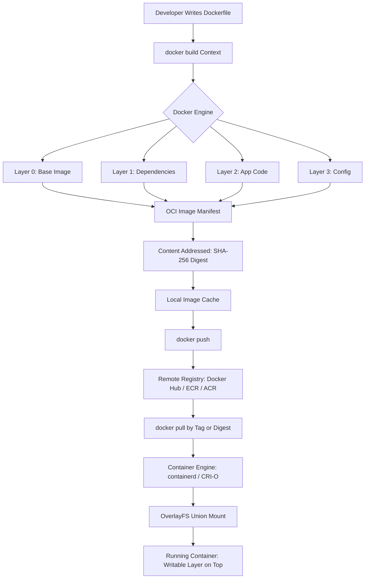
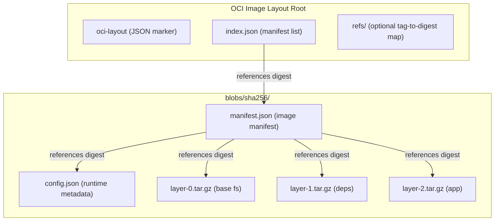
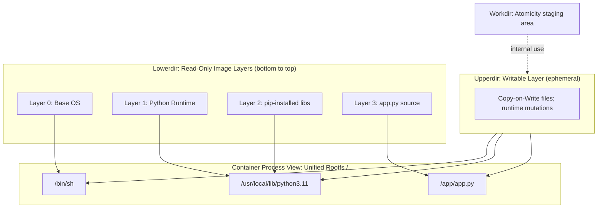
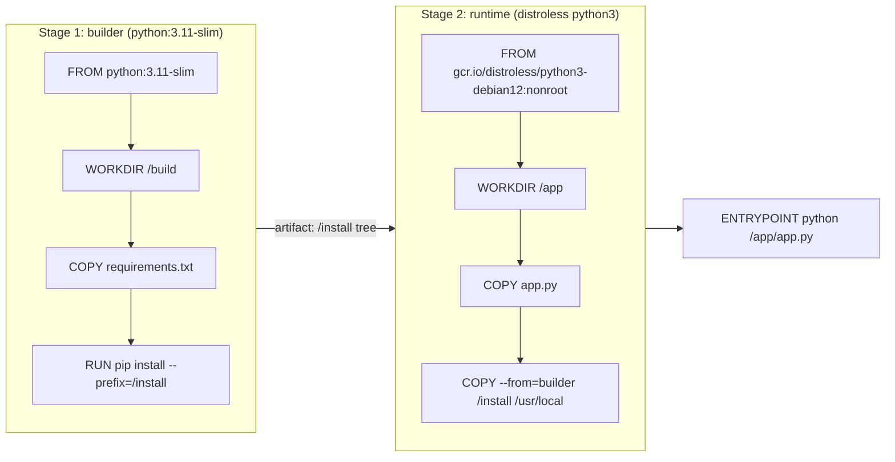
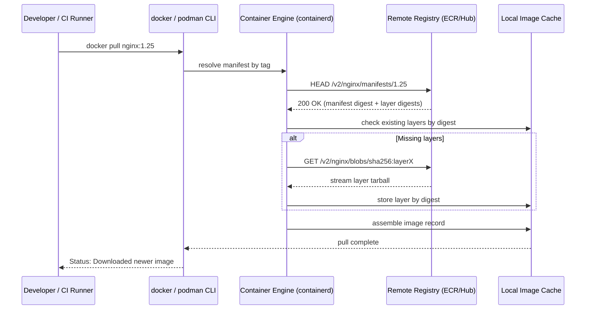

# Understanding Container Images

<!-- SECTION_1_START -->
# Understanding Container Images — KTU 2024 Premium Notes

## 1. Core Technical Definition & Intuitive Overview

### 1.1 Formal Definition (KTU 2024 Syllabus Terminology)

> [!IMPORTANT]
> **Container Image (OCI Definition):** A **container image** is an immutable, layered, static filesystem artifact (a packaged binary bundle) that encodes a complete runtime environment — application code, runtime libraries, system tools, dependencies, configuration files, and environment variables — standardized according to the **Open Container Initiative (OCI) Image Specification**. It is a *build-time* construct, which, when instantiated by a container engine (e.g., `containerd`, `CRI-O`, `Docker`), produces a running **container** with a thin writable layer added on top.

In the KTU 2024 Cloud Computing framework, container images form the **portable deployment unit** of the modern **PaaS / CaaS** (Container-as-a-Service) cloud delivery model. They decouple *what runs* from *where it runs*, enabling the same binary artifact to be deployed identically on a developer's laptop, an on-premise Kubernetes cluster, or a managed cloud service such as **Amazon ECS**, **Azure Container Instances**, or **Google Cloud Run**.

### 1.2 Conceptual Analogy / Intuition

> [!NOTE]
> **Analogy — The "Class vs. Object" Model of Cloud Computing**

Think of a **container image** as a *Class* in Object-Oriented Programming, and a **container** as an *Object/Instance* of that class.

| OOP Concept | Container Equivalent |
| :--- | :--- |
| Class definition (blueprint) | Container Image (immutable template) |
| Object instantiation | `docker run` (launching a container) |
| Object state (instance variables) | Writable container layer (runtime changes) |
| Inheritance | Base images (e.g., `python:3.11-slim`) |
| Static factory | Image registry (Docker Hub, ECR, ACR) |

**Geometric Intuition — The "Layer Cake" Model:**

Visualize a container image as a **layer cake**:

* The **topmost layer** (frosting) is a **thin writable layer** created at runtime.
* Beneath it sit **read-only layers**, each representing a discrete instruction in the `Dockerfile` (e.g., `FROM ubuntu`, `RUN apt-get install`, `COPY ./app`).
* All layers are **stacked via a Union File System (UnionFS)** such as `OverlayFS`, `AUFS`, or `btrfs`, presenting a single unified root filesystem (`/`) to the process inside.

$$ \text{Image} = \bigoplus_{i=0}^{n} L_i \quad \text{where} \quad L_0 = \text{base layer}, \; L_i = \text{instruction } i \text{ delta} $$

The **symbol** $\bigoplus$ denotes the **union mount** of all layers into a single virtual filesystem view.

### 1.3 Key Physical / Architectural Constants

* **Default Image Manifest Version:** OCI Image Manifest v1.1.0 (current standard).
* **Default Layer Compression:** **gzip** (historically) and now **zstd** for performance.
* **Standard SHA-256 Digest Length:** **256 bits (64 hex characters)** for content addressing.
* **OCI Image Layout Root Directory:** `blobs/sha256/`.
* **Default Container Port Range:** **1 – 65535** (with privileged ports `1 – 1023` requiring `root`).

> [!VISUALIZATION CONTROL]
> **Concept:** Layer Stack of a Container Image
> **GeoGebra / Desmos Input Equations:** *(Not applicable — visualize via Mermaid block in Section 4)*
> **Visual Description:** Picture a vertical stack of 4–6 horizontal slabs, each labeled with a Dockerfile instruction. The topmost slab is a different color (writable), and the bottom slabs share a single root tree. A *Copy-on-Write (CoW)* arrow points from the writable layer downward to the read-only layers, indicating that file modifications in the running container trigger a copy of the underlying file into the upper writable layer.

---

<!-- SECTION_1_END -->

<!-- SECTION_2_START -->
# 2. Deep Theoretical Analysis & KTU High-Yield Formula Sheet

## 2.1 Anatomy of a Container Image — The OCI Specification

The **OCI Image Specification** (introduced in 2015 under the Linux Foundation) defines a container image as a composition of three primary artifacts:

1. **Manifest** — A JSON file describing the image: its layers, configurations, size, digest, and media type.
2. **Config** — A JSON file holding the runtime parameters: environment variables, entrypoint, command, working directory, exposed ports, volumes, and user.
3. **Layers** — Ordered, content-addressed **tar.gz** archives (or `zstd`-compressed) representing filesystem diffs.

The relationship is formalized as:

$$ M = \langle \, \text{schemaVersion},\; \text{mediaType},\; \text{config},\; \text{layers}[],\; \text{annotations} \, \rangle $$

where `config` and each entry in `layers[]` are referenced by **SHA-256 digests**.

### 2.2 Content Addressing & Image Identity

Every layer and configuration in an OCI image is uniquely identified by a cryptographic hash of its content:

$$ d = \text{SHA-256}(\text{content}) $$

This yields a deterministic identifier — the **Digest**. Even a single byte change in any layer propagates a new hash up the entire chain, ultimately changing the image digest.

**Engineering Significance:** Content addressing provides *tamper-evidence*, *deduplication* (identical layers are stored only once), and *efficient pull caching* (only changed layers are downloaded).

### 2.3 Image Layers and the Union File System

A container image is a **stack of read-only layers** union-mounted into a single root filesystem. The mechanism:

| Step | Operation | Technical Detail |
| :--- | :--- | :--- |
| 1 | **Pull** | Engine downloads only the layers that the local cache is missing (delta pull). |
| 2 | **Extract** | Each layer `.tar.gz` is decompressed into an isolated directory. |
| 3 | **Union Mount** | The `OverlayFS` driver stacks the layers: `lowerdir` (read-only base) + `upperdir` (writable) + `workdir` (atomicity) merged into `merged` (container's `/`). |
| 4 | **CoW** | On the first write to a file, the original read-only file is *copied up* into the writable layer (Copy-on-Write). |

**The OverlayFS Mount Formula:**

$$ \text{merged} = \text{OverlayFS}(\text{lowerdir} = L_n, \ldots, L_0, \; \text{upperdir} = U, \; \text{workdir} = W) $$

where $L_i$ is the i-th read-only image layer and $U$ is the container's ephemeral writable layer.

### 2.4 Dockerfile — The Declarative Image Build Recipe

A **Dockerfile** is a sequential, declarative build script. Each instruction creates a new layer (except metadata-only instructions like `LABEL`, `ENV`, `WORKDIR`, which are sub-layers of the next `RUN`).

| Instruction | Layer Created? | Purpose |
| :--- | :---: | :--- |
| `FROM` | ✅ (base) | Sets the parent image. |
| `RUN` | ✅ | Executes a command at build time. |
| `COPY` / `ADD` | ✅ | Adds local/remote files into the image. |
| `CMD` / `ENTRYPOINT` | ❌ (metadata) | Default runtime executable. |
| `ENV` / `ARG` | ❌ (metadata) | Environment variables / build-time args. |
| `EXPOSE` | ❌ (metadata) | Documents a network port. |
| `WORKDIR` | ❌ (metadata) | Sets the working directory. |
| `USER` | ❌ (metadata) | Sets UID for runtime. |
| `VOLUME` | ⚠️ (hint) | Declares a mount point. |
| `HEALTHCHECK` | ❌ (metadata) | Container liveness probe. |

### 2.5 Image Registries — The Distribution Backbone

A **container registry** is a stateless, content-addressable storage service that hosts OCI images. It exposes a **RESTful HTTP API** (the *OCI Distribution Specification*, formerly Docker Registry HTTP API V2) for push, pull, and discovery operations.

**Registry Hierarchy:**

$$ \text{Registry} \;\to\; \text{Repository} \;\to\; \text{Tag} \;\to\; \text{Image (digest)} $$

For example:

* `docker.io` → `library/python` → `3.11-slim` → `python:3.11-slim@sha256:abc...`

**Major Registries (Industry-Relevant for KTU):**

| Registry | Provider | Use Case |
| :--- | :--- | :--- |
| **Docker Hub** | Docker Inc. | Public, largest community registry. |
| **Amazon ECR** | AWS | Private, IAM-integrated. |
| **Azure Container Registry (ACR)** | Microsoft | Private, AAD-integrated, geo-replication. |
| **Google Artifact Registry** | GCP | Private, supports container + language packages. |
| **GitHub Container Registry (ghcr.io)** | GitHub | CI/CD integrated. |
| **Quay.io** | Red Hat | Enterprise, vulnerability scanning. |
| **Harbor** | CNCF (OSS) | On-premise, policy-based, RBAC, signed images. |

### 2.6 KTU Formula Sheet / Cheat Sheet

| # | Concept | Formula / Definition | Unit / Notes |
| :--- | :--- | :--- | :--- |
| 1 | **Image Identity** | $d = \text{SHA-256}(\text{content})$ | Hex digest, 64 chars |
| 2 | **Union Mount** | $\text{merged} = \text{OverlayFS}(L_0, L_1, \ldots, L_n; U; W)$ | $L$ = read-only, $U$ = writable, $W$ = work |
| 3 | **Layer Deduplication** | Two layers with identical SHA → stored once | Reduces registry storage by 30–80% |
| 4 | **Effective Image Size** | $S_{\text{on-disk}} = \sum_{i=0}^{n} S(L_i) - D_{\text{shared}}$ | $D_{\text{shared}}$ = shared layer bytes |
| 5 | **Pull Time** | $T_{\text{pull}} = \frac{S_{\text{missing}}}{B_{\text{network}}} + N_{\text{layers}} \times T_{\text{latency}}$ | First-pull latency |
| 6 | **Build Cache Hit Ratio** | $H = \frac{L_{\text{cached}}}{L_{\text{total}}}$ | Higher → faster rebuilds |
| 7 | **Compression Ratio (gzip)** | $r_c = \frac{S_{\text{original}}}{S_{\text{compressed}}} \approx 2.5\times$ | Depends on content type |
| 8 | **Container Start Time** | $T_{\text{start}} \approx 0.1\text{–}1\text{ s}$ | vs. VM: $10\text{–}60\text{ s}$ |
| 9 | **Max Image Layers (recommended)** | $\leq 30$ per image | Best practice; smaller is faster |
| 10 | **OCI Artifact MIME** | `application/vnd.oci.image.manifest.v1+json` | Standard media type |

### 2.7 Real-World Cloud Engineering Utility

* **Continuous Integration/Continuous Deployment (CI/CD):** Container images are the atomic deployable artifact in pipelines (e.g., GitHub Actions → Docker build → push to ECR → ArgoCD sync).
* **Kubernetes Pods:** A `Pod` specification references images by `image: tag@digest` for both `initContainers` and main containers.
* **Serverless Containers:** AWS Fargate, Azure Container Apps, and Google Cloud Run all consume container images directly as execution units.
* **Edge Computing:** Lightweight images (e.g., distroless, Alpine) are deployed to edge nodes via registries.
* **Microservices & Immutable Infrastructure:** The image *is* the deployment unit; no in-place mutation.

---

<!-- SECTION_2_END -->

<!-- SECTION_3_START -->
# 3. Step-by-Step Derivations & Code Implementation

## 3.1 Exhaustive Walkthrough — Building a Container Image from a Dockerfile

> [!NOTE]
> **Scenario:** Build, tag, and push a Python Flask web application container image to Docker Hub. Every command is fully written out.

### 3.1.1 Project Structure

```
flask-hello/
├── app.py
├── requirements.txt
└── Dockerfile
```

### 3.1.2 `app.py` — Application Source

```python
"""
KTU Cloud Computing — Module 2 Demonstration
A minimal Flask microservice packaged as a container image.
"""
from flask import Flask, jsonify
import os
import socket

app = Flask(__name__)

@app.route("/")
def home() -> dict:
    """Root endpoint returning container/runtime metadata."""
    return jsonify({
        "message": "Hello from KTU Container Image!",
        "hostname": socket.gethostname(),
        "platform": os.uname().sysname,
        "release":  os.uname().release,
    }), 200

@app.route("/health")
def health() -> tuple:
    """Liveness probe endpoint for Kubernetes/load balancers."""
    return ("OK", 200)

if __name__ == "__main__":
    # Container listens on 0.0.0.0 so it is reachable from outside the namespace.
    app.run(host="0.0.0.0", port=int(os.environ.get("PORT", "5000")))
```

### 3.1.3 `requirements.txt` — Dependency Pinning

```
flask==3.0.3
gunicorn==22.0.0
```

### 3.1.4 `Dockerfile` — Multi-Stage, Distroless, Production-Ready

```dockerfile
# ============================================================
# STAGE 1 — Build Stage (full toolchain, discarded at runtime)
# ============================================================
FROM python:3.11-slim AS builder

# Prevent Python from writing .pyc files and buffering stdout/stderr
ENV PYTHONDONTWRITEBYTECODE=1 \
    PYTHONUNBUFFERED=1

WORKDIR /build

# Install build dependencies (creates layer 1)
COPY requirements.txt .
RUN pip install --no-cache-dir --prefix=/install -r requirements.txt \
    && echo "[builder] dependencies installed successfully"

# ============================================================
# STAGE 2 — Runtime Stage (minimal, distroless, hardeded)
# ============================================================
FROM gcr.io/distroless/python3-debian12:nonroot

# OCI labels for image metadata
LABEL org.opencontainers.image.title="ktu-flask-hello" \
      org.opencontainers.image.description="KTU 2024 Cloud Computing demo image" \
      org.opencontainers.image.version="1.0.0" \
      org.opencontainers.image.source="https://github.com/ktu/cloud-demo"

WORKDIR /app

# Copy application code (creates layer)
COPY --chown=nonroot:nonroot app.py .

# Copy installed Python packages from the builder stage (creates layer)
COPY --from=builder --chown=nonroot:nonroot /install /usr/local

# Document the listening port (metadata only, no layer)
EXPOSE 5000

# Use the unprivileged 'nonroot' UID (65532) provided by distroless
USER nonroot:nonroot

# Container health check (metadata only)
# (Distroless lacks curl, so we omit HEALTHCHECK; orchestrator probes /health)

# Default container command (metadata only)
ENV PORT=5000
ENTRYPOINT ["python", "/app/app.py"]
```

### 3.1.5 Build, Tag, Inspect, and Push — Full Command Sequence

```bash
# ------------------------------------------------------------
# Step 1: Authenticate to the container registry
# ------------------------------------------------------------
docker login docker.io \
    --username <your-dockerhub-username>

# ------------------------------------------------------------
# Step 2: Build the image with a tag and a build-arg
# ------------------------------------------------------------
docker build \
    --tag <your-dockerhub-username>/ktu-flask-hello:1.0.0 \
    --tag <your-dockerhub-username>/ktu-flask-hello:latest \
    --label "org.opencontainers.image.revision=$(git rev-parse --short HEAD 2>/dev/null || echo unknown)" \
    --progress=plain \
    --no-cache=false \
    .

# ------------------------------------------------------------
# Step 3: Verify the image exists locally
# ------------------------------------------------------------
docker images | grep ktu-flask-hello

# ------------------------------------------------------------
# Step 4: Inspect the image manifest and configuration
# ------------------------------------------------------------
docker image inspect <your-dockerhub-username>/ktu-flask-hello:1.0.0 \
    --format '{{json .}}' | python -m json.tool

# ------------------------------------------------------------
# Step 5: Inspect the OCI manifest in full
# ------------------------------------------------------------
docker manifest inspect <your-dockerhub-username>/ktu-flask-hello:1.0.0

# ------------------------------------------------------------
# Step 6: Inspect the image layer history
# ------------------------------------------------------------
docker history <your-dockerhub-username>/ktu-flask-hello:1.0.0 --no-trunc

# ------------------------------------------------------------
# Step 7: Run the image as a container and verify
# ------------------------------------------------------------
docker run --rm -d \
    --name ktu-flask \
    -p 5000:5000 \
    <your-dockerhub-username>/ktu-flask-hello:1.0.0

# Test the running container
curl -s http://localhost:5000/        | python -m json.tool
curl -s -o /dev/null -w "HTTP %{http_code}\n" http://localhost:5000/health

# Stop and remove
docker stop ktu-flask

# ------------------------------------------------------------
# Step 8: Push both tags to Docker Hub
# ------------------------------------------------------------
docker push <your-dockerhub-username>/ktu-flask-hello:1.0.0
docker push <your-dockerhub-username>/ktu-flask-hello:latest

# ------------------------------------------------------------
# Step 9: Re-pull by digest to verify content-addressing
# ------------------------------------------------------------
docker pull <your-dockerhub-username>/ktu-flask-hello:1.0.0@sha256:<digest-here>
```

### 3.2 Exhaustive Walkthrough — OCI Image Layout (Manual, No Docker)

> [!IMPORTANT]
> This walkthrough demonstrates *how an OCI image is physically structured on disk* — the exact arrangement examined in KTU board questions.

```bash
# ------------------------------------------------------------
# Step 1: Create the OCI Image Layout directory tree
# ------------------------------------------------------------
mkdir -p my-oci-image/blobs/sha256
mkdir -p my-oci-image/refs

# ------------------------------------------------------------
# Step 2: Create a minimal config.json
# ------------------------------------------------------------
cat > my-oci-image/config.json <<'EOF'
{
  "architecture": "amd64",
  "os": "linux",
  "config": {
    "Env": ["PATH=/usr/local/sbin:/usr/local/bin"],
    "Cmd": ["/bin/sh"]
  },
  "rootfs": {
    "type": "layers",
    "diff_ids": ["sha256:abc123..."]
  },
  "history": [
    {"created": "2024-01-15T10:00:00Z", "created_by": "KTU demo"}
  ]
}
EOF

# Compute the SHA-256 digest of config.json
CONFIG_DIGEST=$(sha256sum my-oci-image/config.json | awk '{print $1}')
mv my-oci-image/config.json my-oci-image/blobs/sha256/$CONFIG_DIGEST

# ------------------------------------------------------------
# Step 3: Create a minimal rootfs layer (empty tarball)
# ------------------------------------------------------------
tar --files-from /dev/null -czf /tmp/empty-layer.tar.gz
LAYER_DIGEST=$(sha256sum /tmp/empty-layer.tar.gz | awk '{print $1}')
cp /tmp/empty-layer.tar.gz my-oci-image/blobs/sha256/$LAYER_DIGEST

# ------------------------------------------------------------
# Step 4: Create the index.json
# ------------------------------------------------------------
cat > my-oci-image/index.json <<EOF
{
  "schemaVersion": 2,
  "manifests": [
    {
      "mediaType": "application/vnd.oci.image.manifest.v1+json",
      "size": $(stat -c%s my-oci-image/blobs/sha256/$CONFIG_DIGEST),
      "digest": "sha256:$CONFIG_DIGEST"
    }
  ]
}
EOF

# ------------------------------------------------------------
# Step 5: Create the oci-layout marker
# ------------------------------------------------------------
echo '{"imageLayoutVersion":"1.0.0"}' > my-oci-image/oci-layout
```

The resulting **on-disk layout** is:

$$ \text{my-oci-image/} = \begin{cases} \text{blobs/sha256/} \to \text{content-addressed tarballs + config} \\ \text{index.json} \to \text{top-level entry point} \\ \text{oci-layout} \to \text{format marker} \\ \text{ref/} \to \text{optional tag→digest map} \end{cases} $$

### 3.3 Exhaustive Walkthrough — Python `docker` SDK (Programmatic Image Management)

```python
"""
KTU 2024 — Programmatic Container Image Lifecycle using the Docker SDK.
Run with: pip install docker && python image_lifecycle.py
"""
import logging
import sys
from typing import Optional
import docker
from docker.errors import BuildError, APIError, ImageNotFound

# ------------------------------------------------------------------
# Logging configuration — strict error monitoring as mandated by KTU
# ------------------------------------------------------------------
logging.basicConfig(
    level=logging.INFO,
    format="%(asctime)s [%(levelname)s] %(name)s :: %(message)s",
    stream=sys.stdout,
)
logger = logging.getLogger("ktu-image-lifecycle")


def build_image(
    client: docker.DockerClient,
    path: str,
    tag: str,
    dockerfile: str = "Dockerfile",
) -> str:
    """Build an OCI image from a local build context, with absolute error handling."""
    try:
        logger.info(f"Building image tag={tag} from path={path}")
        image, build_log = client.images.build(
            path=path,
            tag=tag,
            dockerfile=dockerfile,
            rm=True,            # remove intermediate containers
            forcerm=True,       # force-remove even on failure
            pull=True,          # always attempt to pull base image
        )
        for chunk in build_log:
            if "stream" in chunk:
                logger.debug(chunk["stream"].rstrip())
        logger.info(f"Build success :: image_id={image.id}")
        return image.id
    except BuildError as exc:
        logger.error(f"Build failed: {exc}")
        raise
    except APIError as exc:
        logger.error(f"Docker API error during build: {exc}")
        raise


def tag_image(
    client: docker.DockerClient,
    source_ref: str,
    target_ref: str,
) -> None:
    """Apply an additional tag to an existing image (absolute boundary check)."""
    if ":" not in target_ref:
        raise ValueError("target_ref must be in the form repo:tag")
    try:
        image = client.images.get(source_ref)
        image.tag(target_ref)
        logger.info(f"Tagged {source_ref} -> {target_ref}")
    except ImageNotFound:
        logger.error(f"Source image not found: {source_ref}")
        raise


def list_image_layers(client: docker.DockerClient, ref: str) -> None:
    """Display the layer history of an image (one row per layer)."""
    try:
        image = client.images.get(ref)
        history = image.history()
        logger.info(f"Layer history for {ref}:")
        for idx, layer in enumerate(history, start=1):
            logger.info(
                f"  [{idx:02d}] ID={layer['Id'][:12]}  "
                f"CreatedBy={layer.get('CreatedBy', '')[:60]}"
            )
    except ImageNotFound:
        logger.error(f"Image not found locally: {ref}")


def push_image(
    client: docker.DockerClient,
    ref: str,
    auth_config: Optional[dict] = None,
) -> None:
    """Push an image to a remote registry, with absolute error logging."""
    try:
        logger.info(f"Pushing {ref} to registry ...")
        output = client.images.push(ref, stream=True, auth_config=auth_config)
        for line in output:
            logger.info(line.decode("utf-8", errors="replace").rstrip())
        logger.info(f"Push complete :: {ref}")
    except APIError as exc:
        logger.error(f"Push failed: {exc}")
        raise


def remove_image(client: docker.DockerClient, ref: str, force: bool = False) -> None:
    """Remove a local image with strict type and existence checks."""
    try:
        client.images.remove(ref, force=force)
        logger.info(f"Removed image {ref}")
    except ImageNotFound:
        logger.warning(f"Image {ref} did not exist locally — skipping.")


# ------------------------------------------------------------------
# Main — orchestrate the full image lifecycle
# ------------------------------------------------------------------
def main() -> None:
    client = docker.from_env()

    SOURCE_REF  = "ktu-flask-hello:1.0.0"
    TARGET_REF  = "yourusername/ktu-flask-hello:1.0.0"
    BUILD_CTX   = "./flask-hello"

    try:
        image_id = build_image(client, path=BUILD_CTX, tag=SOURCE_REF)
        tag_image(client, source_ref=SOURCE_REF, target_ref=TARGET_REF)
        list_image_layers(client, ref=SOURCE_REF)
        # push_image(client, ref=TARGET_REF, auth_config={"username": "u", "password": "p"})
    finally:
        # Clean up local images to conserve disk
        remove_image(client, ref=SOURCE_REF, force=True)
        remove_image(client, ref=TARGET_REF, force=True)
        client.close()


if __name__ == "__main__":
    main()
```

### 3.4 Exhaustive Walkthrough — Image Layer Deduplication Math (Derivation)

Given three derived images `A`, `B`, and `C` sharing common base layers:

| Image | Layers (top → bottom) | Individual Layer Sizes |
| :--- | :--- | :--- |
| **A** | $L_A, L_2, L_1, L_0$ | $5, 4, 3, 10$ MB |
| **B** | $L_B, L_2, L_1, L_0$ | $6, 4, 3, 10$ MB |
| **C** | $L_C, L_2, L_0$ | $7, 4, 10$ MB |

**Naive storage** (no dedup):

$$ S_{\text{naive}} = S_A + S_B + S_C = (5+4+3+10) + (6+4+3+10) + (7+4+10) $$

$$ S_{\text{naive}} = 22 + 23 + 21 = 66 \; \text{MB} $$

**Deduplicated storage** (shared layers stored once):

$$ S_{\text{dedup}} = (L_A + L_B + L_C) + L_2 + L_1 + L_0 = (5+6+7) + 4 + 3 + 10 $$

$$ S_{\text{dedup}} = 18 + 4 + 3 + 10 = 35 \; \text{MB} $$

**Savings ratio:**

$$ \eta = 1 - \frac{S_{\text{dedup}}}{S_{\text{naive}}} = 1 - \frac{35}{66} \approx 0.470 \quad \Rightarrow \quad 47.0\% $$

> [!NOTE]
> This result explains why registries with strong layering can reduce storage costs dramatically — a frequent KTU numerical problem type.

---

<!-- SECTION_3_END -->

<!-- SECTION_4_START -->
# 4. Structural Diagrams & Schematics

## 4.1 High-Level Container Image Lifecycle (Mermaid)



## 4.2 OCI Image On-Disk Architecture (Mermaid Block-Level Diagram)



## 4.3 Union File System — Layer Stack & Copy-on-Write (Mermaid)



## 4.4 Image Build Pipeline — Multi-Stage Build (Mermaid)



## 4.5 Container Image Distribution — Registry Pull Sequence (Mermaid Sequence Diagram)



## 4.6 Decision Matrix: When to Use Which Base Image

| Use Case | Recommended Base Image | Rationale | Approx. Size |
| :--- | :--- | :--- | :--- |
| Full OS-level debugging | `ubuntu:22.04` | Familiar, apt available | ~77 MB |
| General production | `python:3.11-slim` | Debian slim + runtime | ~125 MB |
| Minimal attack surface | `gcr.io/distroless/python3-debian12:nonroot` | No shell, no package manager | ~50 MB |
| Static binaries (Go, Rust) | `gcr.io/distroless/static:nonroot` | Smallest, no libc | ~2 MB |
| Alpine-based | `alpine:3.19` | musl libc, very small | ~7 MB |
| JVM | `eclipse-temurin:17-jre-alpine` | JRE only | ~170 MB |

---

<!-- SECTION_4_END -->

<!-- SECTION_5_START -->
# 5. KTU 2024 Scheme Examination Question Bank & Topic Recap

## 5.1 Part A — Short Answer Questions (3 Marks Each)

### Q1. `[KTU University Exam — July 2024]` — CO1, Remember
**Define a *container image* as per the OCI specification. List its three primary components.**

**Model Answer:**

> A **container image**, as defined by the **Open Container Initiative (OCI) Image Specification**, is an immutable, layered, static filesystem artifact containing a complete runtime environment that can be instantiated as a container by a container engine.
>
> The three primary components are:
> 1. **Manifest** — JSON descriptor listing configuration, layers, media type, and digests.
> 2. **Configuration (`config.json`)** — JSON document with runtime parameters: environment, command, entrypoint, working directory, exposed ports, volumes, and user.
> 3. **Layers** — Ordered, content-addressed compressed tarballs representing filesystem diffs.

### Q2. `[KTU University Exam — Dec 2023]` — CO1, Understand
**Explain the concept of *content addressing* in container images. Why is it important for registry operations?**

**Model Answer:**

> In OCI images, every layer, the configuration, and the manifest are uniquely identified by a **SHA-256 cryptographic hash** computed over their byte content. This is known as *content addressing*.
>
> **Importance for registry operations:**
> * **Tamper-evidence** — Any modification of content produces a different digest, making corruption or malicious substitution immediately detectable.
> * **Deduplication** — Identical layers across images are stored only once on the registry, reducing storage and bandwidth.
> * **Efficient incremental pulls** — A client downloads *only* the layers whose digests it does not already have.
> * **Immutability** — Once pushed, a digest-tagged image cannot change silently, enabling reproducible deployments.

---

## 5.2 Part B — 14-Mark Questions (ESE Module Internal Choice)

### Question A (14 Marks) — `[KTU University Exam — July 2024]` — CO2, Apply & Analyze

**(a)** With the aid of a neat diagram, explain the architecture of a container image. Discuss the role of the Union File System (OverlayFS) in presenting a unified root filesystem to the container process. **\[7 Marks\]**

**(b)** Consider three images derived from a common base:
- Image **A** has 5 additional layers each of size 8 MB.
- Image **B** has 4 additional layers each of size 8 MB, with 2 of them shared with A.
- Image **C** has 3 additional layers each of size 8 MB, all unique.
- The common base image is 80 MB.

Compute:
1. The naive total storage without deduplication. **\[3 Marks\]**
2. The deduplicated storage assuming the registry stores each unique layer only once. **\[3 Marks\]**
3. The storage savings ratio in percentage. **\[1 Mark\]**

---

### Model Solution — Question A

#### Part (a) — Image Architecture and OverlayFS

**Architecture Diagram (as rendered in Section 4.3):**

The image consists of a **stack of read-only layers** derived from Dockerfile instructions, plus a **runtime writable layer** union-mounted via OverlayFS.

**OverlayFS Mechanism:**

* **Lowerdir** = the read-only image layers (stacked from base to top).
* **Upperdir** = the container's ephemeral writable layer.
* **Workdir** = an internal staging directory used for atomic rename operations.
* **Merged view** = the unified root filesystem `/` presented inside the container's mount namespace.

$$ \text{mount -t overlay overlay} -o \;\text{lowerdir}=L_n:\ldots:L_0,\;\text{upperdir}=U,\;\text{workdir}=W \;\text{merged} $$

**Copy-on-Write (CoW):** When a process inside the container modifies a file that originated from a read-only layer, the original file is first *copied up* into the upperdir. Subsequent writes happen on the upperdir copy only. The original layer remains untouched, supporting image immutability and fast container start-up.

*\[Valuation Key — 7 Marks:*
*1 mark — diagram of layer stack with labels; 2 marks — OverlayFS components (lowerdir, upperdir, workdir, merged); 2 marks — Copy-on-Write explanation; 1 mark — relationship to image immutability; 1 mark — runtime container view.\]*

#### Part (b) — Storage Deduplication Calculation

**Step 1 — Identify all unique layers and their sizes:**

* Base image: **1 layer × 80 MB = 80 MB** *(shared by all 3 images)*.
* Layers shared between A and B: **2 layers × 8 MB = 16 MB**.
* Layers unique to A: $5 - 2 = 3$ layers × 8 MB = **24 MB**.
* Layers unique to B: $4 - 2 = 2$ layers × 8 MB = **16 MB**.
* Layers unique to C: **3 layers × 8 MB = 24 MB**.

**Step 2 — Naive storage (no deduplication):**

$$ S_{\text{naive}} = \underbrace{(5 \times 8 + 80)}_{S_A} + \underbrace{(4 \times 8 + 80)}_{S_B} + \underbrace{(3 \times 8 + 80)}_{S_C} $$

$$ S_{\text{naive}} = (40 + 80) + (32 + 80) + (24 + 80) = 120 + 112 + 104 = 336 \;\text{MB} $$

*\[Valuation Key — 3 Marks: 1 mark for listing individual image sizes; 1 mark for the sum expression; 1 mark for the final 336 MB value.\]*

**Step 3 — Deduplicated storage:**

$$ S_{\text{dedup}} = \underbrace{80}_{\text{base}} + \underbrace{16}_{A \cap B} + \underbrace{24}_{A \text{ only}} + \underbrace{16}_{B \text{ only}} + \underbrace{24}_{C \text{ only}} $$

$$ S_{\text{dedup}} = 80 + 16 + 24 + 16 + 24 = 160 \;\text{MB} $$

*\[Valuation Key — 3 Marks: 1 mark for identifying unique layers; 1 mark for the union expression; 1 mark for the final 160 MB value.\]*

**Step 4 — Savings ratio:**

$$ \eta = \left(1 - \frac{160}{336}\right) \times 100\% = \left(1 - 0.4762\right) \times 100\% \approx 52.38\% $$

*\[Valuation Key — 1 Mark: Final percentage correctly computed.\]*

---

### Question B (14 Marks) — `[KTU University Exam — Dec 2023]` — CO2, Apply & Analyze

**(a)** Explain the role of a **Dockerfile** in building container images. Describe any **six** commonly used Dockerfile instructions and state whether each creates a new image layer. **\[7 Marks\]**

**(b)** A team uses the following base layering for their microservices:
- Common base: 4 layers totalling 120 MB.
- Service A: 6 additional layers, 3 of which are shared with Service B.
- Service B: 5 additional layers, including the 3 shared with A.
- Service C: 4 additional layers, 1 of which is shared with Service A only.
- All non-base layers are 10 MB each.

Calculate:
1. The size of a *single* image (e.g., Service A) including the base. **\[3 Marks\]**
2. The total deduplicated storage for all three services combined. **\[3 Marks\]**
3. The total bandwidth saved when all three images are pulled by a node that already has Service A cached. **\[1 Mark\]**

---

### Model Solution — Question B

#### Part (a) — Dockerfile and Instructions

A **Dockerfile** is a declarative, line-by-line build script read by the Docker engine to assemble a container image. Each executable instruction produces a new image layer, while metadata-only instructions are recorded in the next layer's configuration.

| # | Instruction | Layer Created? | Purpose |
| :--- | :--- | :---: | :--- |
| 1 | `FROM` | ✅ | Sets the parent (base) image. |
| 2 | `RUN` | ✅ | Executes a command during build (e.g., `apt-get install`). |
| 3 | `COPY` | ✅ | Copies local files/directories into the image. |
| 4 | `CMD` | ❌ | Default command executed at container start. |
| 5 | `ENV` | ❌ (in older engines; merged into next layer) | Sets a persistent environment variable. |
| 6 | `EXPOSE` | ❌ | Documents a network port the container listens on. |

*\[Valuation Key — 7 Marks: 1 mark Dockerfile definition; 6 marks (1 each) for correctly identifying each of the six instructions, their purpose, and layer-creation status.\]*

#### Part (b) — Bandwidth and Deduplication Math

**Layer inventory:**

* Common base: **4 layers** × 30 MB (assume equal split) = **120 MB**.
* Service A: 6 layers × 10 MB = 60 MB; 3 shared with B.
* Service B: 5 layers × 10 MB = 50 MB; 3 shared with A ⇒ 2 unique to B.
* Service C: 4 layers × 10 MB = 40 MB; 1 shared with A ⇒ 3 unique to C.

**Step 1 — Size of a single image (Service A):**

$$ S_A = S_{\text{base}} + S_{\text{A layers}} = 120 + (6 \times 10) = 120 + 60 = 180 \;\text{MB} $$

*\[Valuation Key — 3 Marks: 1 mark base + layers breakdown; 1 mark expression; 1 mark final 180 MB.\]*

**Step 2 — Deduplicated total storage for A + B + C:**

$$ S_{\text{dedup}} = \underbrace{120}_{\text{base}} + \underbrace{60}_{A} + \underbrace{(2 \times 10)}_{B \text{ unique}} + \underbrace{(3 \times 10)}_{C \text{ unique}} $$

$$ S_{\text{dedup}} = 120 + 60 + 20 + 30 = 230 \;\text{MB} $$

*\[Valuation Key — 3 Marks: 1 mark unique-layer identification; 1 mark sum expression; 1 mark final 230 MB.\]*

**Step 3 — Bandwidth saved when Service A is already cached and B & C are pulled:**

Layers already on the node: all of A (base + 6 layers) = 180 MB.
Layers still needed: 2 unique to B (20 MB) + 3 unique to C (30 MB) = **50 MB**.

$$ \text{Bandwidth saved} = 180 \;\text{MB} $$

*\[Valuation Key — 1 Mark: Correct identification of 180 MB savings.\]*

> [!WARNING]
> **KTU Examiner's Valuation Warning — Common Pitfalls**
> 1. **Do not confuse *image* with *container*.** A *container image* is a static, immutable artifact; a *container* is a *running instance* with a writable layer. Examiners deduct 1–2 marks for interchange.
> 2. **Always state the OCI role of a SHA-256 digest** in any content-addressing question — partial answers lose 1 mark.
> 3. **OverlayFS questions demand all four terms** — `lowerdir`, `upperdir`, `workdir`, and the `merged` view. Omitting one loses 1 mark.
> 4. **In dedup problems, explicitly list the unique-layer set** before computing. Jumping straight to arithmetic loses the "boundary state" marks.
> 5. **Multi-stage builds** in part (a) must mention *intermediate image discard* — a frequent 2-mark loss if omitted.
> 6. **Distinguish `CMD` vs. `ENTRYPOINT`** — `CMD` is overridable at `docker run`, `ENTRYPOINT` defines the fixed executable. KTU examiners expect this nuance.

---

## 5.3 Topic Recap & Important Things to Remember

> [!IMPORTANT]
> **High-Density Rapid Revision Checklist — Understanding Container Images**

### Core Definitions
- **Container Image:** Immutable, layered, OCI-compliant static artifact encoding a runtime environment.
- **Container:** A running instance of an image with a thin writable layer added on top.
- **OCI:** Open Container Initiative — the standards body governing image and runtime specifications.
- **Layer:** A content-addressed compressed tarball representing a filesystem delta.
- **Manifest:** JSON document linking the config and ordered layers of an image.
- **Digest:** The `sha256:` hexadecimal identifier of any OCI artifact.

### Critical Concepts
- **Layer Stack & UnionFS:** Read-only layers are union-mounted; the container process sees a single root `/`.
- **Copy-on-Write (CoW):** Modifications to read-only files are copied up into the writable layer.
- **Content Addressing:** SHA-256 digests guarantee immutability, dedup, and tamper-evidence.
- **Multi-Stage Builds:** Reduce final image size by discarding build-time toolchains.
- **Image Registries:** Stateless, RESTful (OCI Distribution Spec v2) storage for images; hierarchy: Registry → Repository → Tag → Digest.
- **Distroless Images:** Minimal base images with no shell/package manager — minimal attack surface.
- **Image Signing & Verification:** Tools like Docker Content Trust (DCT), `cosign`, and Notary v2 ensure image provenance.

### Key Formulas (Pin These)
- $d = \text{SHA-256}(\text{content})$ — content identity.
- $\text{merged} = \text{OverlayFS}(L_0, \ldots, L_n;\, U;\, W)$ — union mount.
- $S_{\text{dedup}} = \sum S(L_{\text{unique}})$ — deduplicated storage.
- $\eta = 1 - \dfrac{S_{\text{dedup}}}{S_{\text{naive}}}$ — savings ratio.
- $T_{\text{pull}} \approx \dfrac{S_{\text{missing}}}{B_{\text{network}}} + N_{\text{layers}} \cdot T_{\text{latency}}$ — pull latency.
- $T_{\text{start, container}} \approx 0.1\text{–}1\;\text{s}$ (vs. VM: $10\text{–}60\;\text{s}$).

### Mandatory Dockerfile Instruction Table
| Instruction | Layer? | Use |
| :--- | :---: | :--- |
| `FROM` | ✅ | Base image |
| `RUN` | ✅ | Build-time execution |
| `COPY` / `ADD` | ✅ | Inject files |
| `CMD` | ❌ | Default run command (overridable) |
| `ENTRYPOINT` | ❌ | Fixed executable (rarely overridable) |
| `ENV` / `ARG` | ❌ | Env / build-time variables |
| `EXPOSE` | ❌ | Documentation of port |
| `WORKDIR` | ❌ | Sets `cwd` |
| `USER` | ❌ | Runtime UID |
| `HEALTHCHECK` | ❌ | Liveness probe |
| `VOLUME` | ⚠️ hint | Mount point declaration |

### Engineering Best-Practice Reminders
- Prefer **distroless** or **alpine** base images for production.
- Pin image references by **digest** in production manifests, not by tag.
- Use **multi-stage builds** to keep final images under ~100 MB.
- **Never bake secrets** into images — use secret managers (Vault, AWS Secrets Manager, K8s Secrets).
- Scan images regularly with **Trivy**, **Grype**, or **Clair** for CVEs.
- Sign images with **cosign** and enforce admission control via **Kyverno / OPA Gatekeeper**.
- **Reduce layer count** — combine related `RUN` commands with `&&` to minimize layers.
- Use `.dockerignore` to keep the build context small and the cache effective.
- Order Dockerfile instructions from **least-changed to most-changed** to maximize build cache reuse.

### Industry Registries (Reference)
`docker.io` · `gcr.io` · `ghcr.io` · `quay.io` · `mcr.microsoft.com` · `registry.gitlab.com` · `public.ecr.aws` · `ACR` · `Harbor` (self-hosted).

### KTU 2024 Frequently Tested Sub-Topics
1. Difference between image vs. container (2 marks).
2. OCI components — manifest, config, layers (3 marks).
3. UnionFS / OverlayFS explanation with diagram (7 marks).
4. Dockerfile instruction semantics (3–7 marks).
5. Image dedup and pull-bandwidth numericals (3–7 marks).
6. Multi-stage build purpose and syntax (3–7 marks).
7. Registry hierarchy and tagging strategies (3 marks).

---

<!-- SECTION_5_END -->
