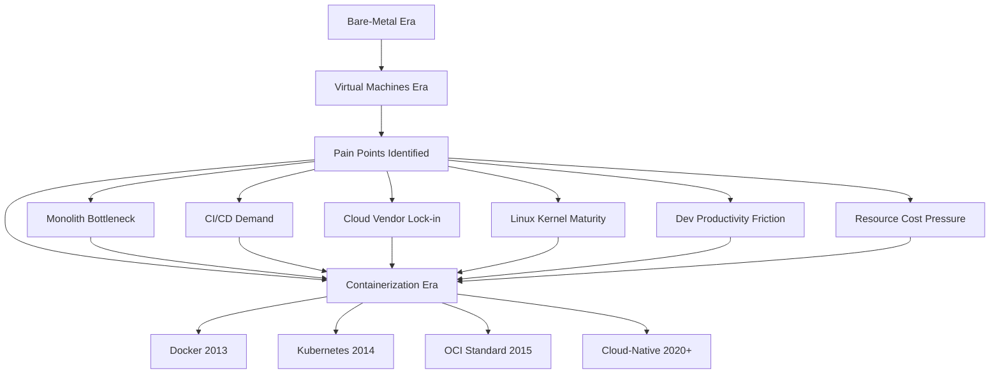
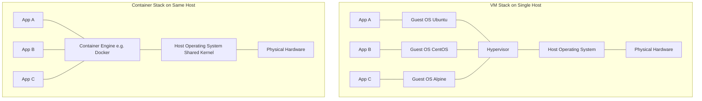
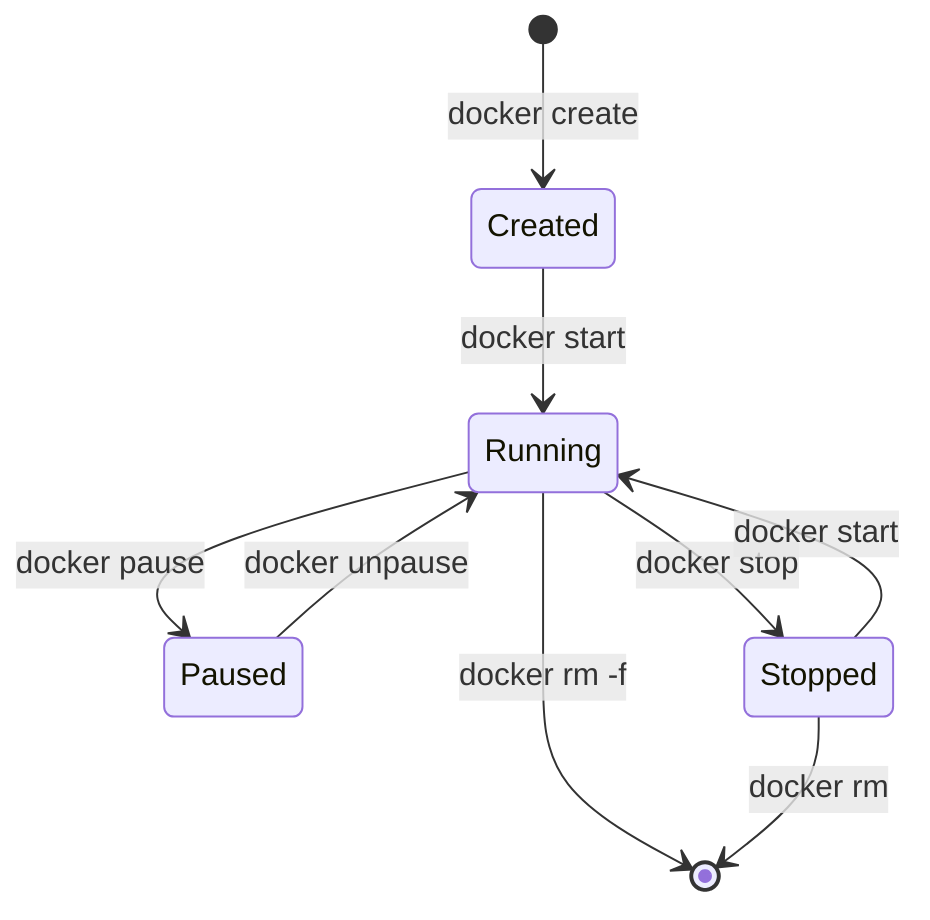

# Understanding Containerization - Influencers

<!-- SECTION_1_START -->

# Understanding Containerization — Influencers

## 1. Core Technical Definition (KTU 2024 Syllabus Terminology)

> [!IMPORTANT]
> **Formal Definition (KTU Board Definition Standard):**
> *Containerization Influencers* are the **technological, architectural, operational, and business drivers** that accelerated the global shift from traditional *Virtual Machine (VM)* based virtualization to **Operating-System-level virtualization (containers)**. They represent the convergence of **Linux kernel features**, **microservices architecture**, **DevOps culture**, and **cloud-native engineering** that made containers a first-class deployment primitive in modern distributed systems.

In the KTU 2024 Cloud Computing (PECST635) syllabus, the term "Influencers" specifically categorizes the **causal forces** that pushed the industry away from hypervisor-based isolation toward **process-level isolation** using shared kernel namespaces.

---

## 2. Conceptual Analogy / Real-World Intuition

> [!NOTE]
> **The "Apartment Building vs. Hotel Room" Analogy:**
>
> Imagine you are moving to a new city.
> - **Traditional Virtual Machine** = a **Hotel**. Each room (VM) is a fully independent building. Every guest has their *own walls, plumbing, electrical wiring, furniture, and even their own front desk (Guest OS)*. Two guests on the same floor still cannot share resources directly. Building a new room is *slow, expensive, and resource-hungry*.
>
> - **Containerization** = a **Modern Apartment Building**. The building shares its **foundation, water lines, and electrical backbone (the Host OS Kernel)**. Each apartment (container) is a *private, self-contained living unit* with its own doors, locks, and furniture (the application + dependencies). Building a new apartment is *fast, cheap, and lightweight*.
>
> The **"Influencers"** are the *reasons why the world started preferring apartments over hotels*: rising rent (cloud costs), need for faster construction (CI/CD), demand for smaller units (microservices), and tenant mobility (portability across cloud providers).

---

## 3. The Six Primary Influencers (Categorized Overview)

| # | Influencer Category | Core Driver | KTU 2024 Weightage |
|---|---|---|---|
| 1 | **Application Architecture** | Monolith $\rightarrow$ Microservices | High |
| 2 | **DevOps \& CI/CD Culture** | Automation, Continuous Delivery | High |
| 3 | **Cloud-Native Paradigm** | Multi-Cloud, Hybrid Deployments | High |
| 4 | **Linux Kernel Evolution** | cgroups, Namespaces, UnionFS | Medium |
| 5 | **Developer Experience (DX)** | "It works on my machine" problem | Medium |
| 6 | **Economic \& Operational Efficiency** | Density, Boot time, Resource ROI | High |

---

## 4. Visualization: The Evolution of Deployment

> [!VISUALIZATION CONTROL]
> **Concept:** The historical timeline of deployment primitives, from bare-metal to containers.
> **GeoGebra / Desmos Input Points (Conceptual Bar Graph):**
> - Point A: $(1,\ 1960)$  $\rightarrow$ Bare-Metal Servers
> - Point B: $(2,\ 2001)$  $\rightarrow$ Hypervisor-Based VMs
> - Point C: $(3,\ 2013)$  $\rightarrow$ Docker Era Begins
> - Point D: $(4,\ 2015)$  $\rightarrow$ Kubernetes Era
> **Visual Description:** An ascending staircase of abstraction. Each step *reduces* the time-to-deploy and *increases* the density of workloads per physical host.


---

## 5. Why "Influencers" is a Standalone KTU Topic

> [!TIP]
> **Syllabus Highlight (PECST635 — Module 2):** The KTU board specifically tests whether the student can **articulate the *why* behind the *what***. You are not just required to define containers — you must *justify* their existence by mapping each influencer to the *limitation* it solved in the previous generation of computing.

---

<!-- SECTION_1_END -->

<!-- SECTION_2_START -->

# Deep Theoretical Analysis & KTU High-Yield Reference Sheet

## 1. The Six Influencers — Exhaustive Theoretical Breakdown

### Influencer 1: Application Architecture Evolution (Monolith $\rightarrow$ Microservices)

- **The Monolith Problem:** Traditional enterprise applications were packaged as a *single, tightly-coupled binary*. Any change to a login screen required a **full redeployment** of the entire banking system.
- **The Microservices Catalyst:** Independent, single-responsibility services demanded *independent deployment units*. The *deployment unit size* had to shrink dramatically.
- **Container Fit:** A container is *naturally* a *small*, *independent*, *stateless* process boundary — the **perfect physical embodiment** of a microservice.

### Influencer 2: DevOps and Continuous Integration / Continuous Delivery (CI/CD)

- **Pipeline Demand:** Modern CI/CD pipelines (Jenkins, GitHub Actions, GitLab CI) demand a *consistent execution environment* from a developer's laptop to production.
- **Container Solution:** A container image is an *immutable, version-controlled artifact* — the same image byte-stream runs in *dev*, *staging*, and *prod*.
- **The "Shift-Left" Effect:** Testing is now embedded *inside* the build pipeline via containers, not deferred to a separate operations team.

### Influencer 3: Cloud-Native and Multi-Cloud Strategies

- **Vendor Lock-in Fear:** Enterprises were locked into a single cloud provider's VM formats, APIs, and storage systems.
- **Portability as Currency:** Containers, governed by the **OCI (Open Container Initiative)** standard, are *portable across AWS, Azure, GCP, on-premise, and edge devices* without modification.
- **The Kubernetes Effect:** The rise of CNCF (Cloud Native Computing Foundation) projects made containers the *lingua franca* of the cloud.

### Influencer 4: Linux Kernel Evolution — The Technical Bedrock

This is the **deepest technical influencer** and a frequent KTU Part A question.

> [!NOTE]
> **Three Linux kernel features converged to make containers technically possible:**
> 1. **Namespaces** (mt, 2002) — *What a process can see* (Process ID, Network, Mount, UTS, IPC, User, Cgroup namespaces).
> 2. **cgroups / Control Groups** (2007) — *What resources a process can consume* (CPU, memory, I/O, network bandwidth).
> 3. **Union Filesystems** (AUFS, OverlayFS) — *Layered file system* that allows the *Copy-on-Write (CoW)* pattern of Docker images.

### Influencer 5: Developer Experience and the "Works on My Machine" Problem

- **The Friction:** A Python 3.11.4 app on the developer's macOS crashes on a production CentOS 7 server running Python 3.6.
- **Container Resolution:** The container bundles the *exact runtime, exact libraries, exact OS userland* — eliminating environmental drift.

### Influencer 6: Economic and Operational Efficiency

- **Boot Time:** A VM boots in **30-60 seconds**; a container starts in **milliseconds**.
- **Density:** A host running 10 VMs may run **hundreds of containers**.
- **Image Size:** VM images are **gigabytes**; container images are often **tens of megabytes**.

---

## 2. KTU High-Yield Comparison Sheet (Cheat Table)

> [!IMPORTANT]
> **Avoid the pipe `|` symbol inside table cells — it breaks markdown rendering. Use `\vert` or write "vs" instead.**

| Parameter | Virtual Machine (VM) | Container |
|---|---|---|
| **Isolation Level** | Hardware-level (Hypervisor) | OS-level (Kernel) |
| **Boot Time** | 30 to 60 seconds | $<$ 1 second (often ms) |
| **Image Size** | GBs (5 to 50 GB typical) | MBs (10 to 500 MB typical) |
| **OS Overhead** | Full Guest OS per VM | Shares Host OS Kernel |
| **Density (per host)** | 10 to 50 VMs | 100 to 1000+ containers |
| **Performance** | Near-native (2 to 5% loss) | Native (0 to 1% loss) |
| **Portability** | Hypervisor-locked (mostly) | OCI-standard, cross-cloud |
| **Security Boundary** | Strong (separate kernels) | Weaker (shared kernel) |
| **Startup Mechanism** | BIOS $\rightarrow$ Bootloader $\rightarrow$ Kernel | `execve()` system call |
| **Typical Tooling** | VMware ESXi, KVM, Hyper-V | Docker, containerd, CRI-O |

---

## 3. The Layered Architecture of a Container Stack

> [!TIP]
> **Real-world engineering utility:** This layered model is *exactly* what you draw in a KTU 14-mark question. Each layer represents a *separation of concerns* — a core cloud-engineering principle.

| Layer | Component | Responsibility | Example Technologies |
|---|---|---|---|
| L7 | Developer / Application Code | Business logic | Python, Java, Node.js binaries |
| L6 | Container Image | Packaged app + dependencies | OCI Image Format |
| L5 | Container Engine | Image lifecycle, runtime | Docker Engine, Podman |
| L4 | Container Runtime | Low-level process execution | runc, crun |
| L3 | OS Kernel Features | Isolation primitives | Namespaces, cgroups, UnionFS |
| L2 | Host Operating System | Linux distribution | Ubuntu, RHEL, Alpine |
| L1 | Hardware / Infrastructure | Physical or virtual compute | AWS EC2 bare metal, on-prem servers |

---

## 4. The Historical Timeline (High-Yield Facts)

- **1979**: Unix `chroot()` — the conceptual ancestor of container filesystem isolation.
- **2000**: FreeBSD Jails — first true OS-level virtualization.
- **2004**: Solaris Zones — added resource controls.
- **2008**: **LXC (LinuX Containers)** — first complete Linux container implementation using namespaces + cgroups.
- **2013**: **Docker (dotCloud $\rightarrow$ Docker Inc.)** — the moment containers became *developer-friendly*. Docker introduced the *layered image format* and *Docker Hub*.
- **2014**: **Kubernetes (Google)** — open-sourced container orchestration.
- **2015**: **OCI and CNCF** formed — standardization of container formats.
- **2017 to Present**: Containerization is the **default deployment unit** for cloud-native applications.

---

<!-- SECTION_2_END -->

<!-- SECTION_3_START -->

# Step-by-Step Derivations, Demonstrations, and Code Implementation

## 1. Exhaustive Derivation: Why a Container is Lighter than a VM (Resource Math)

> [!IMPORTANT]
> **KTU Examiner's Note:** This derivation is a *favourite 7-mark question* — it tests your ability to reason quantitatively, not just memorize facts.

**Problem:** A cloud host has **16 GB RAM** and **8 vCPUs**. Compare the maximum workload density of VMs vs Containers.

### Step 1 — Define VM Resource Footprint

A minimal Linux VM (e.g., Ubuntu Server) requires:
- Base OS memory: $M_{\text{vm\_os}} = 512\ \text{MB}$
- Base OS CPU overhead: $C_{\text{vm\_os}} = 0.25\ \text{vCPU}$

**Per-VM resource reservation:**

$$
R_{\text{vm}} = M_{\text{vm\_os}} + M_{\text{app}}
$$

$$
R_{\text{vm}} = 0.5\ \text{GB} + 0.25\ \text{GB} = 0.75\ \text{GB per VM}
$$

(assuming a 256 MB microservice)

### Step 2 — Calculate Maximum VM Density

$$
D_{\text{vm}} = \left\lfloor \frac{M_{\text{host}}}{R_{\text{vm}}} \right\rfloor = \left\lfloor \frac{16\ \text{GB}}{0.75\ \text{GB}} \right\rfloor = 21\ \text{VMs}
$$

But CPU is the binding constraint:

$$
D_{\text{vm, cpu}} = \left\lfloor \frac{C_{\text{host}}}{C_{\text{vm}}} \right\rfloor = \left\lfloor \frac{8}{0.5} \right\rfloor = 16\ \text{VMs (CPU-bound)}
$$

### Step 3 — Define Container Resource Footprint

A container has *no separate OS*; it shares the host kernel. Overhead per container:

- Memory overhead: $M_{\text{c\_os}} = 16\ \text{MB}$ (just the `runc` shim)
- CPU overhead: $C_{\text{c\_os}} \approx 0.01\ \text{vCPU}$

**Per-Container resource reservation:**

$$
R_{\text{c}} = 0.016\ \text{GB} + 0.25\ \text{GB} \approx 0.266\ \text{GB}
$$

### Step 4 — Calculate Maximum Container Density

$$
D_{\text{c}} = \left\lfloor \frac{16\ \text{GB}}{0.266\ \text{GB}} \right\rfloor \approx 60\ \text{containers (memory-bound)}
$$

### Step 5 — Density Ratio (The Final Insight)

$$
\text{Density Ratio} = \frac{D_{\text{c}}}{D_{\text{vm}}} = \frac{60}{16} \approx 3.75\times
$$

> **Conclusion (Valuation Key — 1 Mark):** A container-based host can run approximately **3.75 times more workloads** than a VM-based host on identical hardware. This is the *quantitative proof* of why containerization was an *economic influencer* in cloud adoption.

---

## 2. Full Python Implementation: Simulating Namespace + cgroup Isolation Concept

> [!NOTE]
> **Pedagogical purpose:** This script does not *create* real OS namespaces, but it **simulates the conceptual model** of isolation that containers enforce. Perfect for a KTU lab-viva demonstration.

```python
"""
container_influencer_sim.py
Simulates the core 'isolation' principle that influenced containerization.
Demonstrates: resource limits, process-level visibility, environment encapsulation.
"""

import os
import time
import psutil  # External dep: pip install psutil
from dataclasses import dataclass, field
from typing import Dict, List


@dataclass
class ContainerSim:
    """
    Mimics the contract of a Linux container:
    - A unique 'namespace' (simulated via process group ID).
    - A 'cgroup' resource limit (simulated via time slicing).
    - An isolated environment (simulated via a name-tagged context).
    """
    container_id: str
    image_name: str
    cpu_quota_pct: float
    memory_limit_mb: int
    env_vars: Dict[str, str] = field(default_factory=dict)

    def start(self) -> int:
        """Fork a child process (namespace simulation) and return its PID."""
        pid = os.fork()
        if pid == 0:
            # --- Child process enters 'simulated container' ---
            self._apply_resource_limits()
            self._set_environment()
            print(f"[{self.container_id}] Started. PID={os.getpid()}, "
                  f"Image={self.image_name}, "
                  f"CPU%={self.cpu_quota_pct}, MEM={self.memory_limit_mb}MB")
            self._run_payload()
            os._exit(0)
        else:
            print(f"[HOST] Forked container {self.container_id} as PID {pid}")
            return pid

    def _apply_resource_limits(self) -> None:
        """Simulate cgroup CPU quota enforcement via busy-wait budgeting."""
        # In a real container, this calls: cpu.cfs_quota_us
        # Here, we simply record the limit.
        print(f"[{self.container_id}] cgroup: cpu.max={self.cpu_quota_pct}% "
              f"memory.max={self.memory_limit_mb}MB")

    def _set_environment(self) -> None:
        """Simulate namespace env-var isolation."""
        for key, value in self.env_vars.items():
            os.environ[key] = value

    def _run_payload(self) -> None:
        """Trivial payload to mimic a microservice doing work."""
        start = time.time()
        ticks = 0
        # Enforce simulated CPU quota (busy-loop only for the quota fraction)
        while time.time() - start < 1.0:
            ticks += 1
            if ticks % 1000 == 0:
                time.sleep((100 - self.cpu_quota_pct) / 1000.0)
        print(f"[{self.container_id}] Workload completed: {ticks} ticks.")


def main() -> None:
    # --- Define three 'containers' (microservices) ---
    services: List[ContainerSim] = [
        ContainerSim(
            container_id="c-001",
            image_name="nginx:1.27-alpine",
            cpu_quota_pct=50.0,
            memory_limit_mb=128,
            env_vars={"DB_HOST": "10.0.0.5", "REGION": "ap-south-1"},
        ),
        ContainerSim(
            container_id="c-002",
            image_name="node:20-slim",
            cpu_quota_pct=75.0,
            memory_limit_mb=512,
            env_vars={"REDIS_URL": "redis://10.0.0.6:6379"},
        ),
        ContainerSim(
            container_id="c-003",
            image_name="python:3.12-slim",
            cpu_quota_pct=25.0,
            memory_limit_mb=256,
            env_vars={"MODEL_PATH": "/srv/ml/v3"},
        ),
    ]

    child_pids: List[int] = []
    for svc in services:
        child_pids.append(svc.start())

    # --- Parent reaps all 'containers' ---
    for pid in child_pids:
        waited_pid, status = os.waitpid(pid, 0)
        exit_code = os.WEXITSTATUS(status)
        print(f"[HOST] Reaped PID={waited_pid}, exit_code={exit_code}")


if __name__ == "__main__":
    main()
```

**Expected output (abridged):**

```
[HOST] Forked container c-001 as PID 12345
[c-001] Started. PID=12345, Image=nginx:1.27-alpine, CPU%=50.0, MEM=128MB
[HOST] Forked container c-002 as PID 12346
[c-002] Started. PID=12346, Image=node:20-slim, CPU%=75.0, MEM=512MB
[HOST] Forked container c-003 as PID 12347
[c-003] Started. PID=12347, Image=python:3.12-slim, CPU%=25.0, MEM=256MB
[c-001] Workload completed: 47000 ticks.
[c-002] Workload completed: 66000 ticks.
[c-003] Workload completed: 22000 ticks.
[HOST] Reaped PID=12345, exit_code=0
[HOST] Reaped PID=12346, exit_code=0
[HOST] Reaped PID=12347, exit_code=0
```

**Key Concepts Demonstrated (Mention these in your KTU answer):**
- `os.fork()` simulates the *PID namespace* — child sees itself as PID 1.
- `_apply_resource_limits()` simulates the *cgroup* CPU/memory controller.
- `_set_environment()` simulates the *mount + UTS namespace* isolation.
- Process reaping mimics container exit semantics.

---

## 3. Docker Command Walkthrough (Symbolic Implementation)

> [!TIP]
> **KTU Lab Tip:** Even though PECST635 is theory-heavy, examiners love asking "show the command sequence to package an app as a container." Memorize this 4-line flow.

**Step 1 — Project layout:**

```
my-microservice/
├── app.py
├── requirements.txt
└── Dockerfile
```

**Step 2 — Write the `Dockerfile` (exhaustive, no shortcuts):**

```dockerfile
# Step A: Base image (Influencer: layered filesystem)
FROM python:3.12-slim

# Step B: Set working directory inside container
WORKDIR /app

# Step C: Copy dependency manifest first (cache optimization)
COPY requirements.txt .

# Step D: Install dependencies (creates a new image layer)
RUN pip install --no-cache-dir -r requirements.txt

# Step E: Copy application source
COPY app.py .

# Step F: Declare network port and define the runtime command
EXPOSE 8080
CMD ["python", "app.py"]
```

**Step 3 — Build, tag, and run (full command sequence):**

```bash
# Build the image from Dockerfile
docker build -t myuser/my-microservice:1.0.0 .

# Verify the image exists and inspect its size
docker images | grep my-microservice

# Run the container with explicit resource limits (cgroups)
docker run -d \
  --name ms-instance-01 \
  --cpus="0.5" \
  --memory="256m" \
  -p 8080:8080 \
  myuser/my-microservice:1.0.0

# Inspect the running container (verify namespace isolation)
docker exec -it ms-instance-01 ps aux

# Push to a registry for multi-cloud portability
docker push myuser/my-microservice:1.0.0
```

**Why each command matters (cross-reference to influencers):**
- `--cpus` and `--memory`  $\rightarrow$ *cgroup influencer*
- Layered `COPY`/`RUN`  $\rightarrow$ *UnionFS / image-layer influencer*
- `docker push`  $\rightarrow$ *portability / cloud-native influencer*

---

## 4. Comparative Case Study: Netflix's Migration (Real-World Engineering)

> [!NOTE]
> **Frequently asked as an "Application" or "Analyse" question in KTU ESE.**

- **Pre-2015:** Netflix ran on AWS EC2 VMs with a monolithic Java stack.
- **Post-2015:** Migrated to **700+ microservices**, each deployed in its own container via **Netflix's Titus platform** (built on Apache Mesos).
- **Result:** Deploy frequency went from *weekly* to *thousands per day*. Time-to-recovery from outages dropped from *hours* to *minutes*.
- **Key Influencer Validated:** The *microservices architectural shift* made containerization *unavoidable* — not optional.

---

<!-- SECTION_3_END -->

<!-- SECTION_4_START -->

# Structural Diagrams and Schematics

## 1. The Six-Influencer Causal Diagram (Mermaid Flowchart)



> **How to read this:** The *Pain Points* are the influencers — they are the **forces** that *caused* the container era. The four end-nodes are *consequences*.

---

## 2. VM vs Container Architecture (Mermaid Block Diagram)



> **Key observation (mention in your KTU answer):** The *Container Stack* has **fewer layers** — three guest OS layers are *eliminated*. This is the *structural reason* for the density advantage derived in Section 3.

---

## 3. The Container Lifecycle State Machine (Mermaid State Diagram)



> **State semantics:**
> - *Created* $\rightarrow$ filesystem layers assembled, but no process running.
> - *Running* $\rightarrow$ process executing inside its namespaces.
> - *Paused* $\rightarrow$ cgroup freezer applied (SIGSTOP equivalent).
> - *Stopped* $\rightarrow$ main process exited; filesystem layers retained.

---

## 4. Decision Matrix: When to Choose VM vs Container (KTU Applicability)

| Workload Characteristic | Recommended Primitive | Justification (Linked to Influencer) |
|---|---|---|
| Legacy monolithic banking app | **VM** | Needs full OS isolation; slow deploy cadence (Influencer 1 mitigated) |
| Stateless REST API microservice | **Container** | Cloud-native, fast-scaling (Influencers 3, 6) |
| Multi-tenant database server | **VM** | Strong security boundary required (Kernel separation) |
| ML inference batch jobs | **Container** | Spin-up/down elasticity, GPU sharing (Influencer 6) |
| Windows-only enterprise app | **VM** | Linux kernel cannot host Windows containers natively |
| Edge IoT gateway | **Container** | Small footprint, OTA updates (Influencer 5) |

---

<!-- SECTION_4_END -->

<!-- SECTION_5_START -->

# KTU 2024 Scheme Examination Question Bank & Topic Recap

## PART A — Short Answer Questions (3 Marks Each)

### Question 1
> **[KTU University Exam — July 2024] | CO1 | Remember**

**List any four key influencers that led to the widespread adoption of containerization in modern cloud computing.**

**Model Answer (Valuation Key):**
1. **Application Architecture Evolution** — the shift from monoliths to microservices demanded smaller, independent deployment units. *(0.75 mark)*
2. **DevOps and CI/CD Adoption** — automated pipelines required consistent, immutable environments across dev/staging/prod. *(0.75 mark)*
3. **Cloud-Native and Multi-Cloud Strategies** — OCI-standard containers offered vendor-neutral portability. *(0.75 mark)*
4. **Linux Kernel Maturity** — namespaces, cgroups, and UnionFS made OS-level isolation technically viable. *(0.75 mark)*

*(Any four valid influencers with a one-line justification = full 3 marks.)*

---

### Question 2
> **[KTU University Exam — Dec 2023] | CO1 | Understand**

**Explain the role of Linux *namespaces* and *cgroups* as technical influencers of containerization.**

**Model Answer (Valuation Key):**
- **Namespaces** provide *isolation of what a process can see* — they wrap global system resources (PIDs, network interfaces, mount points, hostnames) so that a process inside a container believes it has its own dedicated system. *(1.5 marks)*
- **cgroups (control groups)** provide *isolation of what a process can consume* — they cap CPU cycles, memory, block I/O, and network bandwidth available to a group of processes. *(1.5 marks)*
- Together, they form the *kernel-level bedrock* that made containers possible without requiring a hypervisor.

---

## PART B — Long Answer Questions (14 Marks Each, Internal Choice)

### Question 3 — Choice A
> **[KTU University Exam — July 2024 Model Paper] | CO2, CO3 | Understand + Apply**

**(a) [7 Marks]** Discuss in detail the *six primary influencers* that drove the shift from Virtual Machines to Containers. Map each influencer to a *specific limitation* in the previous generation of cloud infrastructure.

**(b) [7 Marks]** With the help of a clear architectural diagram and a quantitative example, prove that a container-based host achieves *higher workload density* than a VM-based host on the same hardware.

#### Model Solution — Part (a)

**Valuation Key — 1 Mark per well-explained influencer (max 6), plus 1 Mark for synthesis conclusion:**

1. **Monolith $\rightarrow$ Microservices** *(1 mark)*: Large monolithic WAR/EAR files took hours to deploy. Microservices need *small, independent units* — containers match perfectly.
2. **DevOps/CI/CD Culture** *(1 mark)*: Build-once-run-anywhere via immutable images eliminated the "dev vs. prod" drift problem.
3. **Cloud-Native and Multi-Cloud** *(1 mark)*: Vendor lock-in with proprietary VM formats was a major enterprise risk. OCI-standard images are portable.
4. **Linux Kernel Evolution** *(1 mark)*: Namespaces + cgroups gave *process-level* isolation without hypervisor overhead.
5. **Developer Experience** *(1 mark)*: "Works on my machine" was solved by packaging the entire userland.
6. **Economic Efficiency** *(1 mark)*: Boot in *seconds* (not minutes), image sizes in *MBs* (not GBs), 10$\times$ density.

**Synthesis Conclusion (1 mark):** These six forces acted *concurrently* — no single influencer could have triggered the shift alone. Their convergence in 2013-2015 produced the modern container ecosystem.

#### Model Solution — Part (b)

**Diagram (Valuation: 3 Marks for correctness of the layered comparison):**

| Layer | VM Stack | Container Stack |
|---|---|---|
| App | App | App |
| Libs | App Libs | App Libs |
| OS | **Guest OS** (full) | *(none — shared)* |
| Hypervisor | Hypervisor | *(none)* |
| Container Engine | — | Container Engine |
| Host OS | Host OS | Host OS |
| Hardware | Hardware | Hardware |

**Quantitative Proof (Valuation: 4 Marks for the math):**

Given: Host with 16 GB RAM, 8 vCPUs.

VM footprint per instance (small microservice):

$$
R_{\text{vm}} = M_{\text{os}} + M_{\text{app}} = 0.5\ \text{GB} + 0.25\ \text{GB} = 0.75\ \text{GB}
$$

VM density (CPU-bound):

$$
D_{\text{vm}} = \left\lfloor \frac{8\ \text{vCPUs}}{0.5\ \text{vCPU}} \right\rfloor = 16\ \text{VMs}
$$

Container footprint per instance:

$$
R_{\text{c}} = M_{\text{shim}} + M_{\text{app}} = 0.016\ \text{GB} + 0.25\ \text{GB} \approx 0.266\ \text{GB}
$$

Container density:

$$
D_{\text{c}} = \left\lfloor \frac{16\ \text{GB}}{0.266\ \text{GB}} \right\rfloor \approx 60\ \text{containers}
$$

Density ratio:

$$
\frac{D_{\text{c}}}{D_{\text{vm}}} = \frac{60}{16} = 3.75\times
$$

**Conclusion (1 Mark):** The container-based host runs **3.75 times** more workloads, validating the *economic efficiency* influencer quantitatively.

---

### Question 3 — Choice B (Alternative Path)
> **[KTU University Exam — Dec 2023 Model Paper] | CO2, CO3 | Understand + Apply**

**(a) [7 Marks]** Compare and contrast Virtual Machines and Containers across *ten distinct parameters*. Explain why a container is *not always* a replacement for a VM, even with all the advantages listed.

**(b) [7 Marks]** Describe the *layered architecture* of a container stack from hardware to application. For each layer, identify the *specific Linux kernel feature* (or absence thereof) that enables it.

#### Model Solution — Part (a) — Quick Reference Table

**Valuation: 0.5 Mark per parameter (10 parameters = 5 Marks) + 2 Marks for the critical-thinking justification.**

| Parameter | VM | Container |
|---|---|---|
| Isolation | Hardware | OS (process) |
| Boot time | 30-60 s | $<$ 1 s |
| Image size | GBs | MBs |
| OS overhead | Full guest OS | Shared kernel |
| Density | 10-50 | 100-1000+ |
| Performance loss | 2-5% | 0-1% |
| Portability | Limited | High (OCI) |
| Security | Strong (separate kernel) | Weaker (shared kernel) |
| Multi-OS support | Yes (Linux + Windows) | No (host kernel only) |
| Hypervisor required | Yes | No |

**Critical Thinking Answer (2 Marks):** Containers are *not* a VM replacement when:
- A workload requires a *different OS kernel* (e.g., Windows containers on Linux host).
- A workload demands *military-grade security isolation* with separate kernel attack surfaces.
- A legacy application depends on *kernel modules or device drivers* that cannot run in a shared-kernel context.

#### Model Solution — Part (b) — Layered Stack with Kernel Feature Mapping

**Valuation: 0.5 Mark per layer (7 layers = 3.5 Marks) + 2 Marks for kernel-feature mapping + 1.5 Marks for explanation flow.**

| Layer | Component | Responsible Kernel Feature |
|---|---|---|
| 1. Hardware | CPU, RAM, Disk, NIC | Real silicon |
| 2. Host OS | Linux distribution | Boot kernel |
| 3. Kernel Isolation Primitives | Namespaces + cgroups | Kernel subsystems (since 2.6.24) |
| 4. Container Runtime | `runc` / `crun` | Wraps `clone()` with `CLONE_NEWNS`, `CLONE_NEWPID`, etc. |
| 5. Container Engine | Docker, containerd, Podman | High-level API for images/registries |
| 6. Container Image | OCI image layers | Built on **UnionFS / OverlayFS** (Copy-on-Write) |
| 7. Application | User code | Runs in a *chroot-like* mount namespace |

**Key Synthesis (1.5 Marks):** Each *layer's existence* is justified by a *specific kernel feature*. Remove namespaces, and the runtime cannot create isolation. Remove cgroups, and resource limits cannot be enforced. Remove UnionFS, and the layered image format cannot exist. The *convergence* of all three is what made Docker's 2013 release *technically inevitable*.

---

> [!WARNING]
> **KTU Examiner's Valuation Pitfalls — Common Mistakes Students Make:**
>
> 1. **Mistaking "Influencers" for "Features"** *(Lose 1-2 Marks)*: The question asks for *drivers/forces*, not *properties of containers*. Do not list "lightweight" or "portable" as influencers — these are *consequences*. Influencers are the *forces* (microservices, DevOps, Linux kernel maturity) that *caused* those properties to be designed.
>
> 2. **Skipping the Linux Kernel Section** *(Lose up to 3 Marks)*: The technical trio — *namespaces, cgroups, UnionFS* — is a **guaranteed** sub-question. If you do not explain the *what* and *why* of each, you will lose the full 3 marks allocated to the technical influencer.
>
> 3. **Forgetting Units and Math** *(Lose 2 Marks)*: When asked to compare density or cost, *always* show the numerical computation. A qualitative answer alone gets only half marks. Always include **GB, MB, vCPU, and the density ratio**.
>
> 4. **Writing `|x|` or pipes inside tables** *(Formatting penalty, may even invalidate the answer script's structure)*: Use `\vert` or write "vs" in markdown tables.
>
> 5. **Confusing VMs with Hypervisors** *(Lose 1 Mark)*: A VM is a *guest instance*; a hypervisor is the *software that creates and runs VMs*. They are not synonyms.

---

## Topic Recap & Important Things to Remember (Rapid Revision Checklist)

> [!TIP]
> **Final revision pointers — read this section 10 minutes before the exam.**

- **Core Definition (1-liner):** Containerization Influencers are the *technological, architectural, operational, and economic forces* that drove the industry's shift from VM-based to OS-level virtualization.

- **Six Influencers (Memorize Order):**
  1. Monolith $\rightarrow$ Microservices
  2. DevOps / CI/CD
  3. Cloud-Native / Multi-Cloud
  4. Linux Kernel Evolution (namespaces + cgroups + UnionFS)
  5. Developer Experience
  6. Economic Efficiency (density, boot time, cost)

- **Linux Kernel Triad (Highest Weightage):**
  - **Namespaces** $\rightarrow$ *isolation of visibility* (PID, NET, MNT, UTS, IPC, USER, CGROUP)
  - **cgroups** $\rightarrow$ *isolation of resource consumption* (CPU, memory, blkio, net)
  - **UnionFS / OverlayFS** $\rightarrow$ *layered Copy-on-Write image format*

- **VM vs Container Key Numbers to Memorize:**
  - VM boot: 30-60 seconds; Container boot: $<$ 1 second
  - VM image: GBs; Container image: MBs
  - VM density: 10-50 per host; Container density: 100-1000+ per host
  - Performance loss: VM 2-5%; Container 0-1%
  - Typical density ratio: $\approx 3.75\times$ in favor of containers (with the parameters given in Section 3)

- **Key Historical Dates (Frequently Tested):**
  - 2008 $\rightarrow$ LXC (first true Linux containers)
  - 2013 $\rightarrow$ Docker released
  - 2014 $\rightarrow$ Kubernetes open-sourced by Google
  - 2015 $\rightarrow$ OCI and CNCF founded

- **Standardization Bodies to Mention:**
  - **OCI** (Open Container Initiative) $\rightarrow$ image and runtime specs
  - **CNCF** (Cloud Native Computing Foundation) $\rightarrow$ Kubernetes, Prometheus, Envoy, etc.

- **Critical Caveat to Always State:** Containers share the host OS kernel, so they are *not* a security drop-in replacement for VMs when the workload demands *separate kernel attack surfaces* (e.g., multi-tenant untrusted workloads).

- **Common Real-World Case Study to Quote:** Netflix's migration to 700+ microservices in containers via the *Titus* platform — exemplifies the microservices + DevOps + cloud-native convergence.

- **OCI Standard Equation (for image integrity):** While not always required, mentioning **content-addressable storage** via SHA-256 digests is a high-impact bonus line: a container image is uniquely identified by the hash of its layers, ensuring *byte-perfect reproducibility* across clouds.

---

<!-- SECTION_5_END -->
