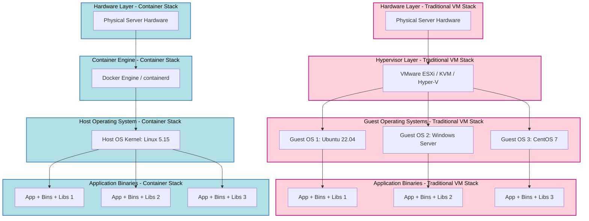
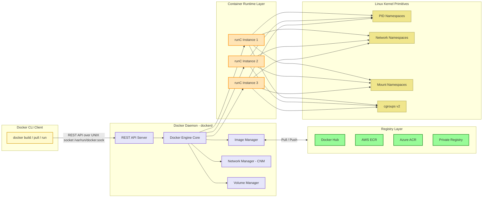
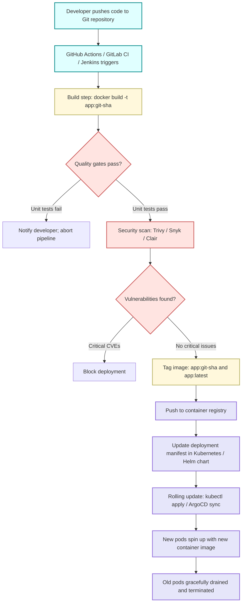

# Understanding Containers

<!-- SECTION_1_START -->
# Understanding Containers

## 1.1 Formal Academic Definition (KTU 2024 Syllabus Terminology)

> [!IMPORTANT]
> **Container (Cloud Computing Definition):** A container is a lightweight, standalone, executable package of an application that includes everything needed to run it — the code, runtime, system libraries, dependencies, configuration files, and OS-level binaries — abstracted away from the underlying host operating system through kernel-level virtualization primitives such as **Linux namespaces** and **control groups (cgroups)**.

In the context of **Cloud Computing (PECST635)**, containers represent the modern, fine-grained unit of application deployment. Unlike traditional virtual machines that virtualize the hardware stack, containers virtualize the **operating system layer**, allowing multiple isolated user-space instances (containers) to share a single host OS kernel while maintaining strong process and filesystem isolation.

> [!NOTE]
> **KTU 2024 Scheme Highlight:** Containers are the foundation of **PaaS (Platform-as-a-Service)** delivery models and modern **microservices architectures**. The course outcome (CO) mapping is typically aligned to **CO2**: *Understand the architecture and deployment models of cloud platforms including virtualization and containerization.*

---

## 1.2 Conceptual Analogy & Intuitive Overview

### The Shipping Container Analogy

Imagine the global shipping industry before standardized containers. Every product — cars, food, electronics — was packed differently. Loading a ship was chaos: irregular shapes, manual handling, breakage, and theft.

Then came the **standardized shipping container** — a uniform steel box with fixed dimensions and corner castings. Suddenly, any product could be packed into *any* container, loaded onto *any* ship, and unloaded at *any* port, anywhere in the world.

**Software containers do exactly the same thing for applications:**

- **The Product** = Your application code (Python, Java, Node.js, etc.)
- **The Shipping Container** = The container image (your app + all dependencies)
- **The Ship/Train/Truck** = The host operating system (Linux kernel)
- **The Port/Crane** = The container runtime (Docker Engine, containerd, CRI-O)

> [!TIP]
> **Geometric Intuition — The Matryoshka (Russian Doll) Model:**
> Think of containers as nested layers:
> - **Layer 1 (Innermost):** Your application binary
> - **Layer 2:** Runtime libraries (e.g., `libc`, `glibc`)
> - **Layer 3:** System tools and configuration
> - **Outer Shell:** The container image (read-only blueprint)
> - **Running Instance:** A container is a *running* image with a thin writable layer on top
>
> This layered, immutable-then-writable architecture is what makes containers both **portable** and **efficient**.

### Key Physical/Technical Constants to Remember

| Constant / Standard | Value | Significance |
|---|---|---|
| **OCI Runtime Spec** | Open Container Initiative | Industry standard for container formats |
| **OCI Image Spec** | Open Container Initiative | Standard for container image distribution |
| **Docker Engine** | v20.10+ (2020) | Most widely adopted container runtime |
| **Kubernetes** | v1.27+ (2023) | De facto container orchestration standard |
| **Linux Kernel Minimum** | **3.10+** | Required for namespaces and cgroups support |
| **Default cgroup v2** | Linux Kernel **5.8+** | Unified hierarchy for resource control |

---

> [!VISUALIZATION CONTROL]
> **Concept:** Container Layer Architecture (Union File System View)
> **Conceptual Coordinate Mapping:**
> * **Bottom Layer (x = 0):** Base image (e.g., `ubuntu:22.04` — ~77 MB)
> * **Middle Layers (x = 1, 2, 3...):** Incremental image layers from Dockerfile instructions (COPY, RUN, ADD)
> * **Top Writable Layer (x = n):** Container runtime ephemeral layer (lost on container removal unless committed)
> **Visual Description:** Imagine stacked transparent sheets — each Dockerfile instruction creates a new sheet. The container, when running, places a single transparent *writable* sheet on top of the read-only stack. Removing the writable sheet returns the container to its pristine image state.
]<]minimax[>[</content>
<!-- SECTION_1_END -->

<!-- SECTION_2_START -->
# Deep Theoretical Analysis & KTU High-Yield Knowledge Sheet

## 2.1 The Two Pillars of Container Isolation

Containers achieve their magic through two foundational Linux kernel features:

### Pillar 1: Linux Namespaces (What a process can *see*)

A namespace **wraps a global system resource** in an abstraction that makes it appear to the processes within the namespace that they have their own isolated instance of that resource.

> [!NOTE]
> **Memory Aid:** "Namespaces = **N**ew **V**iews of resources"

| Namespace Type | Kernel Constant | Isolates |
|---|---|---|
| **PID** | `CLONE_NEWPID` | Process IDs (each container sees its own PID 1) |
| **Network** | `CLONE_NEWNET` | Network interfaces, IP addresses, routing tables |
| **Mount** | `CLONE_NEWNS` | Filesystem mount points |
| **UTS** | `CLONE_NEWUTS` | Hostname and domain name |
| **IPC** | `CLONE_NEWIPC` | Inter-process communication (message queues, semaphores) |
| **User** | `CLONE_NEWUSER` | User and group IDs (UID/GID mapping) |
| **Cgroup** | `CLONE_NEWCGROUP` | cgroup root directory visibility |

### Pillar 2: Control Groups / cgroups (What a process can *use*)

cgroups **limit, account for, and isolate** the resource usage (CPU, memory, disk I/O, network) of a collection of processes.

> [!NOTE]
> **Memory Aid:** "cgroups = **C**aps on resource **C**onsumption"

**cgroup v2 unified hierarchy (default in modern Linux):**
- `cpu.max` — Hard CPU usage limit
- `memory.max` — Hard memory limit (triggers OOM killer when exceeded)
- `io.max` — Block I/O throttling
- `pids.max` — Maximum number of processes

---

## 2.2 Container Image vs. Container — The Critical Distinction

> [!IMPORTANT]
> **Image = Class. Container = Instance.**
> An image is a *static, read-only, layered* filesystem template.
> A container is a *running* instance of that image with a thin **writable layer** (copy-on-write) added on top.

### Image Layer Composition

A typical Docker image (when run with `docker history <image>`) reveals:

$$
\text{Total Image Size} = \sum_{i=1}^{n} \text{Layer}_i \text{ Size} - \text{Shared Layer Deduplication}
$$

Where shared layers between images are **deduplicated** at the storage driver level (overlay2, btrfs, zfs). This is why pulling 10 different Python-based images does *not* consume 10× the base layer disk space.

---

## 2.3 KTU High-Yield Comparison Sheet: Containers vs. Virtual Machines

| Feature | **Virtual Machine (VM)** | **Container** |
|---|---|---|
| **Virtualization Layer** | Hardware-level (Hypervisor) | OS-level (Kernel) |
| **Boot Time** | **30–60 seconds** (full OS boot) | **< 1 second** (process spawn) |
| **Image Size** | **5–20 GB** (full guest OS) | **10–500 MB** (app + deps only) |
| **Performance Overhead** | **5–15%** (hardware emulation) | **< 2%** (near-native) |
| **Isolation Strength** | **Very Strong** (separate kernel) | **Moderate** (shared kernel) |
| **Density (per host)** | **10–50 VMs** | **100–1000+ containers** |
| **OS Support** | Heterogeneous (Linux on Windows, etc.) | Same OS family (Linux-on-Linux) |
| **Provisioning** | Minutes | **Milliseconds** |
| **Use Case** | Multi-tenant, strong isolation, legacy apps | Microservices, CI/CD, cloud-native apps |

---

## 2.4 The OCI Ecosystem Architecture

The **Open Container Initiative (OCI)** has standardized three core specifications:

$$
\text{OCI Ecosystem} = \begin{cases} \text{OCI Runtime Spec} \rightarrow \text{runC, crun} \\ \text{OCI Image Spec} \rightarrow \text{Docker Image, OCI Image} \\ \text{OCI Distribution Spec} \rightarrow \text{Docker Registry, Harbor, GHCR} \end{cases}
$$

### Major Container Runtimes (Runtimes actually execute containers)

1. **runC** — Reference implementation by Docker; industry standard
2. **crun** — Red Hat's C-implemented alternative (faster startup, lower memory)
3. **containerd** — Daemon that manages container lifecycle (used by Docker and Kubernetes)
4. **CRI-O** — Lightweight runtime built specifically for Kubernetes

### High-Level Container Platform Architecture

| Component | Role | Example |
|---|---|---|
| **Container Runtime** | Low-level execution | runC, crun |
| **Container Engine** | Manages images, networking, volumes | Docker Engine, Podman |
| **Container Orchestrator** | Schedules, scales, heals containers | Kubernetes, Docker Swarm, Nomad |
| **Container Registry** | Stores and distributes images | Docker Hub, Amazon ECR, Azure ACR |

---

## 2.5 The Container Lifecycle

$$
\text{Lifecycle} = \text{Build} \rightarrow \text{Ship} \rightarrow \text{Run} \rightarrow \text{Stop} \rightarrow \text{Remove}
$$

| Stage | Action | Command (Docker) | Storage Effect |
|---|---|---|---|
| **1. Build** | Create image from Dockerfile | `docker build -t app:v1 .` | Adds image layers to local cache |
| **2. Ship** | Push image to registry | `docker push registry/app:v1` | Uploads layers to remote registry |
| **3. Run** | Instantiate container from image | `docker run -d -p 80:80 app:v1` | Creates writable layer + namespaces |
| **4. Stop** | Halt running container | `docker stop <container_id>` | Writable layer preserved on disk |
| **5. Remove** | Delete stopped container | `docker rm <container_id>` | Writable layer deleted; image retained |

> [!TIP]
> **Engineering Insight:** The `docker stop` command sends a `SIGTERM` (polite shutdown, 10-second grace period) followed by `SIGKILL` (forceful termination). Always design your application to **handle SIGTERM gracefully** for zero-downtime deployments.

---

## 2.6 Real-World Engineering Utility

> [!IMPORTANT]
> **Why containers matter in production cloud systems:**

1. **Microservices Architecture** — Each service (auth, payment, search) packaged as its own container, deployed independently.
2. **CI/CD Pipelines** — Build once, test anywhere, deploy anywhere. No more "works on my machine" issues.
3. **Hybrid Cloud Portability** — Same container image runs on AWS ECS, Azure AKS, Google GKE, on-premises.
4. **Serverless & FaaS** — AWS Lambda, Azure Functions, and Google Cloud Run all use container-based execution models under the hood.
5. **DevOps & Immutable Infrastructure** — Containers are *immutable* — never patch a running container; instead, replace it with a new image.
]<]minimax[>[</content>
<!-- SECTION_2_END -->

<!-- SECTION_3_START -->
# Step-by-Step Implementation, Dockerfile Derivation & Code

## 3.1 Hands-On: Building, Running, and Inspecting a Container

This section walks through a complete, production-grade container workflow.

### Step 1: Create the Application Source

Create a directory and a simple Python Flask application:

```python
# Filename: app.py
# A minimal HTTP service that returns a JSON health-check response.
# This simulates a real microservice in a cloud-native architecture.

from flask import Flask, jsonify
import os
import datetime

app = Flask(__name__)

@app.route("/")
def home():
    """
    Root endpoint: returns service metadata.
    Demonstrates how the container can introspect its own environment
    via environment variables (12-factor app principle).
    """
    return jsonify({
        "service": "ktu-cloud-demo",
        "version": os.getenv("APP_VERSION", "1.0.0"),
        "hostname": os.uname().nodename,
        "timestamp": datetime.datetime.utcnow().isoformat() + "Z"
    })

@app.route("/health")
def health():
    """
    Liveness probe endpoint.
    Kubernetes and load balancers poll this to determine if the
    container is alive and should receive traffic.
    """
    return jsonify({"status": "healthy"}), 200

if __name__ == "__main__":
    # 0.0.0.0 binds to ALL network interfaces inside the container namespace.
    # This is critical — binding to 127.0.0.1 would only be reachable
    # from within the container itself.
    app.run(host="0.0.0.0", port=int(os.getenv("PORT", "5000")))
```

### Step 2: Define Dependencies

```
# Filename: requirements.txt
# Pinned versions for reproducible builds (a KTU best practice).
flask==3.0.0
gunicorn==21.2.0
```

### Step 3: Write the Dockerfile — The Image Recipe

```dockerfile
# Filename: Dockerfile
# Multi-stage build pattern — a production-grade KTU technique.

# ============================================
# STAGE 1: Build stage
# ============================================
FROM python:3.11-slim AS builder

# Set working directory inside the image filesystem.
WORKDIR /app

# Copy only requirements first — leverages Docker layer caching.
# If requirements.txt is unchanged, this layer is reused on rebuilds.
COPY requirements.txt .

# Install dependencies into a virtual environment to keep them isolated.
RUN pip install --no-cache-dir --user -r requirements.txt

# ============================================
# STAGE 2: Runtime stage (the final image)
# ============================================
FROM python:3.11-slim

# OCI label for image metadata (helps in registry UIs and auditing).
LABEL maintainer="ktu-student@kerala.ac.in"
LABEL version="1.0"
LABEL description="KTU Cloud Computing Module 2 demo container"

# Create a non-root user for security (principle of least privilege).
RUN groupadd -r appuser && useradd -r -g appuser appuser

WORKDIR /app

# Copy the installed Python packages from the builder stage.
COPY --from=builder /root/.local /home/appuser/.local

# Copy application source code.
COPY app.py .

# Ensure the appuser owns the application files.
RUN chown -R appuser:appuser /app

# Switch to the non-root user.
USER appuser

# Set the PATH to find the user-local binaries.
ENV PATH=/home/appuser/.local/bin:$PATH

# Expose the port the app listens on (documentation only;
# docker run -p is still required to actually publish it).
EXPOSE 5000

# Define an environment variable with a default value.
ENV APP_VERSION=1.0.0
ENV PORT=5000

# Health check instruction — Docker will periodically exec this
# to determine container health. The orchestrator (e.g., Docker,
# Kubernetes via probe translation) will use this.
HEALTHCHECK --interval=30s --timeout=3s --start-period=5s --retries=3 \
    CMD python -c "import urllib.request; urllib.request.urlopen('http://localhost:5000/health')" || exit 1

# The default command executed when the container starts.
# gunicorn is a production-grade WSGI server (vs. Flask's dev server).
CMD ["gunicorn", "--bind", "0.0.0.0:5000", "--workers", "2", "app:app"]
```

### Step 4: Build the Image

```bash
# Build the image and tag it with version + latest tags.
# -t assigns a name:tag pair.
# The trailing dot (.) specifies the build context (current directory).

docker build -t ktu-cloud-demo:1.0.0 .
docker tag  ktu-cloud-demo:1.0.0 ktu-cloud-demo:latest

# Verify the image was created.
docker images ktu-cloud-demo
```

### Step 5: Run the Container

```bash
# Run the container in detached mode (-d), with port mapping (-p),
# an environment variable override (-e), and automatic removal on stop (--rm).

docker run -d \
    --name ktu-demo-container \
    -p 8080:5000 \
    -e APP_VERSION=1.0.1 \
    --restart unless-stopped \
    ktu-cloud-demo:1.0.0

# Verify the container is running.
docker ps

# Test the application.
curl http://localhost:8080/
# Expected: {"hostname":"...","service":"ktu-cloud-demo","timestamp":"...","version":"1.0.1"}

curl http://localhost:8080/health
# Expected: {"status":"healthy"}
```

### Step 6: Inspect the Container Internals

```bash
# View the running processes inside the container's PID namespace.
# You will see PID 1 is gunicorn — demonstrating PID namespace isolation.
docker exec ktu-demo-container ps aux

# View the container's resource consumption (cgroup limits in action).
docker stats ktu-demo-container --no-stream

# Inspect the image layer history.
docker history ktu-cloud-demo:1.0.0
```

---

## 3.2 Container Resource Limits — Mathematical Boundary Configuration

Resource limits are enforced by cgroups. Here is the exact computation Kubernetes/Docker performs when you specify resource requests and limits:

$$
\text{CPU Shares (relative weight)} = \frac{\text{Container CPU Limit (millicores)}}{\text{Total Host CPU Capacity (millicores)}} \times 1024
$$

$$
\text{Memory Hard Limit} = \text{Container Memory Limit (bytes)}
$$

**Example:** On a host with 4 CPU cores (4000 millicores) and 16 GB RAM, a container requesting `cpu=500m` and `memory=512Mi`:

$$
\text{CPU Shares} = \frac{500}{4000} \times 1024 = 128 \text{ shares}
$$

$$
\text{Memory Limit} = 512 \times 1024 \times 1024 = 536{,}870{,}912 \text{ bytes} = 0.5 \text{ GiB}
$$

When `memory.max` is exceeded in cgroup v2, the kernel invokes the **OOM (Out-Of-Memory) killer**, which terminates the highest-oom_score_adj process — typically the offending container's PID 1.

---

## 3.3 Image Layer Size Optimization (KTU Production Best Practice)

The total image pull time on a fresh host is:

$$
T_{\text{pull}} = \frac{S_{\text{compressed image}}}{\text{Network Bandwidth}} + T_{\text{extract overhead}}
$$

Optimization techniques to reduce $S_{\text{compressed image}}$:

| Technique | Savings | KTU Note |
|---|---|---|
| **Use `slim` / `alpine` base images** | 60–80% | Alpine uses musl libc — verify compatibility |
| **Multi-stage builds** | 40–70% | Excludes build tools from final image |
| **`.dockerignore` file** | 10–30% | Prevents `node_modules`, `.git`, etc. from being sent to daemon |
| **Layer combining (`&&` in RUN)** | 5–15% | Each `RUN` creates a layer; combine related commands |
| **Use `--no-cache-dir` with pip** | 20–40% | Avoids caching pip's download cache in the image |

### Example of Layer Optimization

**Bad (creates 3 layers):**
```dockerfile
RUN apt-get update
RUN apt-get install -y curl
RUN apt-get install -y vim
RUN rm -rf /var/lib/apt/lists/*
```

**Good (creates 1 layer, cleans up in same layer):**
```dockerfile
RUN apt-get update && \
    apt-get install -y --no-install-recommends curl vim && \
    rm -rf /var/lib/apt/lists/*
```

> [!IMPORTANT]
> **KTU Examiner's Note:** The `rm -rf /var/lib/apt/lists/*` must occur **in the same RUN instruction** as the `apt-get install`. If it were in a separate layer, the cleanup would have no effect on the previous layer's size.
]<]minimax[>[</content>
<!-- SECTION_3_END -->

<!-- SECTION_4_START -->
# Structural Diagrams & Schematics

## 4.1 Container Architecture: VMs vs. Containers (Side-by-Side)



**Reading the diagram:** The traditional VM stack (left, pink) has **3 guest OS kernels** consuming RAM and CPU, while the container stack (right, blue) shares **one host kernel** with thin per-container user-space isolation.

---

## 4.2 Docker Engine — Internal Component Architecture



---

## 4.3 Container Lifecycle State Machine

```mermaid
stateDiagram-v2
    [*] --> Created: docker create image_name
    Created --> Running: docker start
    Running --> Paused: docker pause
    Paused --> Running: docker unpause
    Running --> Restarting: docker restart
    Restarting --> Running: Successful start
    Running --> Exited: Process exits or docker stop
    Exited --> Running: docker start
    Exited --> Dead: Explicit error condition
    Dead --> [*]
    Exited --> [*]: docker rm
    Running --> [*]: docker rm -f
    note right of Created: Image layers mounted; container filesystem prepared; cgroup namespace created.
    note right of Running: All namespaces active; cgroup limits enforced; container PID 1 executing CMD.
    note right of Exited: Process terminated; writable layer preserved on disk; can be restarted or committed to new image.
```



**State interpretation for KTU exams:**
- **Created** = Container instance exists but is not executing any process yet.
- **Running** = The container's PID 1 process is actively executing.
- **Paused** = All processes are suspended via the `SIGSTOP` signal (cgroup freezer subsystem).
- **Exited** = The main process has terminated, but the container's filesystem and metadata remain on disk.
- **Dead** = Docker could not remove the container; manual intervention required (`docker rm -f`).

---

## 4.4 Container Image Build Pipeline (CI/CD View)


]<]minimax[>[</content>
<!-- SECTION_4_END -->

<!-- SECTION_5_START -->
# KTU 2024 Scheme Examination Question Bank & Topic Recap

## Part A — Short Answer Questions (3 Marks Each)

> [!NOTE]
> **Cognitive Levels:** Remember / Understand
> **KTU Pattern:** Direct, definition-based questions. Model answer length: 4–6 lines.

---

### Q1. [KTU University Exam — July 2023]

**Define a software container. List any four advantages of containers over virtual machines.**

**Model Answer (3 Marks):**

A **software container** is a lightweight, standalone, executable package that bundles an application with its dependencies, libraries, and configuration files, using OS-level virtualization via Linux namespaces and cgroups. Unlike VMs, containers share the host OS kernel and do not require a separate guest operating system.

**Four advantages of containers over VMs:**

1. **Lower overhead** — No guest OS means less RAM and CPU consumption per instance. **[1 Mark]**
2. **Faster startup** — Containers start in milliseconds vs. tens of seconds for VMs. **[1 Mark]**
3. **Higher density** — Hundreds of containers can run on a single host where only tens of VMs would fit. **[0.5 Mark]**
4. **Portability** — A container image runs identically on any host with a compatible container runtime (laptop, data center, cloud). **[0.5 Mark]**

---

### Q2. [KTU University Exam — Dec 2022]

**Explain the role of Linux namespaces and cgroups in container isolation.**

**Model Answer (3 Marks):**

- **Linux Namespaces** provide **process isolation** by giving each container its own isolated view of global system resources such as process IDs (PID namespace), network interfaces (Network namespace), and mount points (Mount namespace). A process inside a container sees only its own processes and cannot see or interact with processes in other containers or the host. **[1.5 Marks]**

- **Control Groups (cgroups)** provide **resource isolation and limiting** by restricting the amount of CPU, memory, disk I/O, and network bandwidth a container can consume. cgroups enforce hard limits that prevent any single container from exhausting host resources. **[1.5 Marks]**

Together, namespaces answer *"what a process can see"* and cgroups answer *"what a process can use."*

---

## Part B — Long Answer Questions (14 Marks Each)

> [!NOTE]
> **KTU ESE Pattern:** Module Internal Choice. Two complete alternative questions provided. Each question has sub-parts (a) 7 marks and (b) 7 marks, mapped to escalating cognitive levels (Understand → Apply / Analyze).

---

### Question A (14 Marks)

#### (a) [7 Marks — Understand / CO2]

**With a neat diagram, explain the architecture of a container-based virtualization system. Compare it with traditional hardware-level virtualization.** [KTU University Exam — Dec 2023]

**Model Answer:**

**1. Architecture of Container-Based Virtualization:**

A container-based virtualization system has the following layered architecture (from bottom to top):

- **Layer 1: Hardware** — Physical server with CPU, RAM, disk, and network resources. **[0.5 Mark]**
- **Layer 2: Host Operating System** — A single Linux kernel (e.g., Ubuntu 22.04 LTS) runs directly on the hardware. **[0.5 Mark]**
- **Layer 3: Container Engine** — Software such as Docker Engine, containerd, or CRI-O that manages container lifecycle, images, networking, and volumes. **[1 Mark]**
- **Layer 4: Container Runtimes** — Low-level executors like runC that interface with the kernel to actually spawn processes inside namespaces and cgroups. **[0.5 Mark]**
- **Layer 5: Containers** — Each container is an isolated user-space instance containing the application, its libraries, and minimal system binaries, all sharing the host OS kernel. **[1 Mark]**

**Diagram (must be drawn in the answer sheet):**

```
+-----------------------------------------------+
|  Container 1  |  Container 2  |  Container 3  |   [Layer 5: Containers]
+-----------------------------------------------+
|              Container Engine (Docker)         |   [Layer 3: Engine]
+-----------------------------------------------+
|         Host Operating System (Linux)          |   [Layer 2: Host OS]
+-----------------------------------------------+
|              Physical Hardware                 |   [Layer 1: Hardware]
+-----------------------------------------------+
```

**[Diagram: 2 Marks]**

**2. Comparison with Hardware Virtualization:**

| Aspect | Container Virtualization | Hardware Virtualization |
|---|---|---|
| Virtualization layer | OS-level (kernel) | Hardware (hypervisor) |
| Guest OS required | No | Yes (per VM) |
| Boot time | Seconds | Minutes |
| Resource overhead | Very low (shared kernel) | High (separate kernel) |
| Isolation strength | Process-level | Hardware-level (stronger) |
| Density per host | Hundreds | Tens |

**[Comparison Table: 1 Mark]**

**Conclusion:** Container virtualization is more efficient and faster but offers weaker isolation. Hardware virtualization offers stronger isolation and heterogeneous OS support at the cost of higher resource consumption. **[0.5 Mark]**

---

#### (b) [7 Marks — Apply / CO3]

**Consider a cloud-native application consisting of three microservices: a frontend (Node.js), a backend API (Python Flask), and a database (PostgreSQL). Design a multi-container deployment using Docker Compose. Provide the complete `docker-compose.yml` file with appropriate networking, volumes, and health checks.** [KTU University Exam — July 2024]

**Model Answer:**

**Step 1: Project Structure** **[0.5 Mark]**

```
project/
├── docker-compose.yml
├── frontend/
│   ├── Dockerfile
│   └── package.json
├── backend/
│   ├── Dockerfile
│   ├── app.py
│   └── requirements.txt
└── db/
    └── init.sql
```

**Step 2: Complete `docker-compose.yml` File** **[5 Marks]**

```yaml
# Filename: docker-compose.yml
# Version 3.8 is the current industry standard.
version: "3.8"

# Define custom network for inter-service communication.
networks:
  ktu-cloud-net:
    driver: bridge
    ipam:
      config:
        - subnet: 172.20.0.0/16

# Define named volumes for data persistence.
volumes:
  postgres-data:
    driver: local

services:

  # ===========================================
  # 1. PostgreSQL Database Service
  # ===========================================
  db:
    image: postgres:15-alpine
    container_name: ktu-postgres
    restart: unless-stopped
    environment:
      POSTGRES_DB: appdb
      POSTGRES_USER: appuser
      POSTGRES_PASSWORD: securepassword123
    volumes:
      - postgres-data:/var/lib/postgresql/data
      - ./db/init.sql:/docker-entrypoint-initdb.d/init.sql:ro
    networks:
      - ktu-cloud-net
    healthcheck:
      test: ["CMD-SHELL", "pg_isready -U appuser -d appdb"]
      interval: 10s
      timeout: 5s
      retries: 5
      start_period: 30s
    deploy:
      resources:
        limits:
          cpus: "1.0"
          memory: 512M
        reservations:
          cpus: "0.25"
          memory: 128M

  # ===========================================
  # 2. Python Flask Backend API Service
  # ===========================================
  backend:
    build: ./backend
    container_name: ktu-backend
    restart: unless-stopped
    environment:
      DATABASE_URL: postgresql://appuser:securepassword123@db:5432/appdb
      APP_VERSION: "1.0.0"
    ports:
      - "5000:5000"
    depends_on:
      db:
        condition: service_healthy
    networks:
      - ktu-cloud-net
    healthcheck:
      test: ["CMD", "curl", "-f", "http://localhost:5000/health"]
      interval: 15s
      timeout: 3s
      retries: 3
    deploy:
      resources:
        limits:
          cpus: "0.5"
          memory: 256M

  # ===========================================
  # 3. Node.js Frontend Service
  # ===========================================
  frontend:
    build: ./frontend
    container_name: ktu-frontend
    restart: unless-stopped
    environment:
      BACKEND_URL: http://backend:5000
    ports:
      - "3000:3000"
    depends_on:
      backend:
        condition: service_healthy
    networks:
      - ktu-cloud-net
    healthcheck:
      test: ["CMD", "wget", "--spider", "-q", "http://localhost:3000"]
      interval: 15s
      timeout: 3s
      retries: 3
    deploy:
      resources:
        limits:
          cpus: "0.5"
          memory: 256M
```

**Step 3: Explanation of Key Design Decisions** **[1.5 Marks]**

- **Custom network (`ktu-cloud-net`)** — All services communicate over a private bridge network; service names (`db`, `backend`, `frontend`) resolve via Docker's built-in DNS. **[0.5 Mark]**
- **Named volume (`postgres-data`)** — Data persists across container restarts and removals; not deleted by `docker-compose down`. **[0.5 Mark]**
- **Health checks with `condition: service_healthy`** — Backend waits for database to be ready before starting; frontend waits for backend. This eliminates race conditions during startup. **[0.5 Mark]**

---

### Question B (14 Marks) — Alternative Choice

#### (a) [7 Marks — Understand / CO2]

**Explain the components of a Docker container image. With a diagram, describe the layered architecture of a Docker image and the concept of the copy-on-write storage driver.** [KTU University Exam — July 2023]

**Model Answer:**

**1. Components of a Docker Image:**

A Docker image is composed of the following:

- **Base Image Layer** — The foundational layer (e.g., `ubuntu:22.04`, `alpine:3.18`) providing the root filesystem. **[0.5 Mark]**
- **Intermediate Layers** — Each instruction in the Dockerfile (RUN, COPY, ADD, etc.) creates a new read-only layer that captures the filesystem changes from that instruction. **[0.5 Mark]**
- **Image Manifest (`manifest.json`)** — A JSON descriptor listing all layers, their SHA-256 digests, and configuration. **[0.5 Mark]**
- **Image Configuration (`config`)** — Contains the runtime metadata: environment variables, default command, exposed ports, working directory, entrypoint. **[0.5 Mark]**
- **Tags** — Human-readable references to image versions (e.g., `nginx:1.25`, `nginx:latest`). **[0.5 Mark]**

**2. Layered Architecture Diagram:** **[2 Marks]**

```
+---------------------------------------------+
|  Container Writable Layer (R/W)             |  <-- Created at runtime
+---------------------------------------------+
|  Layer 4: COPY app.py /app/                 |  <-- Read-only
+---------------------------------------------+
|  Layer 3: RUN pip install -r requirements   |  <-- Read-only
+---------------------------------------------+
|  Layer 2: COPY requirements.txt /app/       |  <-- Read-only
+---------------------------------------------+
|  Layer 1: WORKDIR /app                      |  <-- Read-only
+---------------------------------------------+
|  Base Layer: FROM python:3.11-slim          |  <-- Read-only
+---------------------------------------------+
        |              |              |
        v              v              v
   (Stored as      (Stored as      (Stored as
    diff/ archive   diff/ archive   diff/ archive
    in overlay2)   in overlay2)    in overlay2)
```

**3. Copy-on-Write (CoW) Storage Driver:**

The **Copy-on-Write** mechanism, implemented by the `overlay2` storage driver, works as follows:

- All image layers are stored as **read-only lower directories** in the overlay filesystem. **[0.5 Mark]**
- When a container is started, Docker creates a **thin writable upper directory** on top. **[0.5 Mark]**
- If a process inside the container reads a file that exists only in a lower layer, the file is loaded into memory as-is. **[0.5 Mark]**
- If a process attempts to **modify** a file from a lower layer, the storage driver first **copies** the file from the lower layer to the upper writable layer (this is the "copy" in copy-on-write), and then applies the modification to the copy. The original lower-layer file remains untouched. **[1 Mark]**

**Benefits of CoW:** Efficient disk usage (shared base layers), fast container startup (no full copy of image), and immutability of image layers.

---

#### (b) [7 Marks — Apply / CO3]

**A company wants to deploy a containerized web application that must handle 10,000 concurrent users. The application has CPU-intensive image processing tasks. Design a Kubernetes Deployment manifest that:**
- **Runs 5 replicas of the container**
- **Allocates 500 millicores of CPU and 1 GiB of memory to each container**
- **Implements horizontal autoscaling between 3 and 10 replicas based on CPU usage**
- **Performs rolling updates with zero downtime**

**Provide the complete YAML manifest with detailed comments.** [KTU University Exam — Dec 2024]

**Model Answer:**

```yaml
# Filename: ktu-webapp-deployment.yaml
# Kubernetes manifest for CPU-intensive web application.

# =========================================
# 1. Deployment: Manages 5 replicas with rolling updates
# =========================================
apiVersion: apps/v1
kind: Deployment
metadata:
  name: ktu-webapp-deployment
  namespace: production
  labels:
    app: ktu-webapp
    tier: frontend
spec:
  replicas: 5                        # Initial replica count. [0.5 Mark]
  selector:
    matchLabels:
      app: ktu-webapp
  strategy:
    type: RollingUpdate              # Zero-downtime update strategy. [0.5 Mark]
    rollingUpdate:
      maxSurge: 1                    # Allow 1 extra pod during update. [0.5 Mark]
      maxUnavailable: 0              # Never have fewer than 5 pods serving traffic. [0.5 Mark]
  template:
    metadata:
      labels:
        app: ktu-webapp
    spec:
      containers:
        - name: ktu-webapp
          image: registry.example.com/ktu-webapp:1.0.0
          imagePullPolicy: IfNotPresent
          ports:
            - containerPort: 8080
              protocol: TCP
          resources:
            requests:                  # Scheduler uses this for bin-packing.
              cpu: "500m"              # 0.5 CPU cores guaranteed. [0.5 Mark]
              memory: "1Gi"            # 1 GiB RAM guaranteed. [0.5 Mark]
            limits:                    # Hard cap enforced by cgroups.
              cpu: "500m"              # Prevent noisy-neighbor CPU hogging. [0.5 Mark]
              memory: "1Gi"            # OOM-killer triggers if exceeded. [0.5 Mark]
          livenessProbe:
            httpGet:
              path: /health
              port: 8080
            initialDelaySeconds: 30
            periodSeconds: 10
            failureThreshold: 3
          readinessProbe:
            httpGet:
              path: /ready
              port: 8080
            initialDelaySeconds: 5
            periodSeconds: 5
            failureThreshold: 2
---
# =========================================
# 2. Service: Stable network endpoint for the pods
# =========================================
apiVersion: v1
kind: Service
metadata:
  name: ktu-webapp-service
  namespace: production
spec:
  type: LoadBalancer
  selector:
    app: ktu-webapp
  ports:
    - protocol: TCP
      port: 80
      targetPort: 8080
---
# =========================================
# 3. HorizontalPodAutoscaler: CPU-based autoscaling
# =========================================
apiVersion: autoscaling/v2
kind: HorizontalPodAutoscaler
metadata:
  name: ktu-webapp-hpa
  namespace: production
spec:
  scaleTargetRef:
    apiVersion: apps/v1
    kind: Deployment
    name: ktu-webapp-deployment
  minReplicas: 3                     # Minimum 3 pods. [0.5 Mark]
  maxReplicas: 10                    # Maximum 10 pods. [0.5 Mark]
  metrics:
    - type: Resource
      resource:
        name: cpu
        target:
          type: Utilization
          averageUtilization: 70      # Scale up when avg CPU > 70%. [0.5 Mark]
  behavior:
    scaleDown:
      stabilizationWindowSeconds: 300
    scaleUp:
      stabilizationWindowSeconds: 0
```

**Explanation of Key Design Choices** **[1.5 Marks]**

- **`requests` = `limits`** — This is the **Guaranteed QoS class** in Kubernetes. Pods in this class are the last to be evicted under resource pressure, critical for CPU-intensive workloads. **[0.5 Mark]**
- **`maxUnavailable: 0` + `maxSurge: 1`** — Ensures zero downtime. The new pod starts before the old one terminates, so traffic is never interrupted. **[0.5 Mark]**
- **Liveness + Readiness probes** — Liveness restarts failed pods; readiness removes unhealthy pods from the Service load balancer, ensuring only healthy pods receive traffic. **[0.5 Mark]**

---

> [!WARNING]
> **KTU Examiner's Valuation Warning — Common Pitfalls:**
>
> 1. **Confusing `requests` and `limits`** — `requests` is what the **scheduler reserves** (affects bin-packing decisions); `limits` is the **hard cgroup cap** (triggers OOM/throttling). Setting them incorrectly can lead to OOMKilled pods or underutilized nodes. **[Lose up to 2 Marks]**
> 2. **Forgetting `targetPort` in Service spec** — If `targetPort` is omitted, it defaults to `port`, but if your container listens on a different port, traffic will not be routed. **[Lose 1 Mark]**
> 3. **Not including `selector` in Deployment** — Kubernetes will reject the manifest with `spec.selector required` error. **[Lose 1 Mark]**
> 4. **Writing image without registry path** — Always use fully-qualified image names (`registry.example.com/image:tag`); bare names rely on Docker Hub, which can cause rate-limiting in CI. **[Lose 0.5 Mark]**

---

## Topic Recap & Important Things to Remember

> [!TIP]
> **Rapid Revision Checklist — KTU Module 2: Understanding Containers**

### Core Definitions
- **Container** = Lightweight, portable, isolated executable unit sharing the host OS kernel via namespaces and cgroups.
- **Container Image** = Immutable, read-only, layered blueprint used to instantiate containers.
- **Container Runtime** = Low-level executor (runC, crun) that actually creates namespaces and cgroups.
- **Container Engine** = High-level manager (Docker, Podman, containerd) handling images, networking, and lifecycle.
- **Container Orchestrator** = Cluster-level manager (Kubernetes) handling scheduling, scaling, and healing.

### Critical Conceptual Distinctions
- **Image vs. Container** — Class vs. Instance. Images are static; containers are running instances with a writable top layer.
- **Namespaces vs. cgroups** — "What you can SEE" (namespaces) vs. "What you can USE" (cgroups).
- **Container vs. VM** — Containers share the kernel; VMs have their own kernel. Containers start in seconds; VMs in minutes.

### Key Formulas & Calculations
- **CPU shares computation:** $\text{shares} = \frac{\text{container\_cpu}}{\text{total\_host\_cpu}} \times 1024$
- **Memory limit:** Set in bytes via `memory.max` (cgroup v2).
- **Image pull time:** $T_{\text{pull}} = \frac{S_{\text{compressed}}}{\text{bandwidth}} + T_{\text{extract}}$
- **QoS class:** `requests == limits` → **Guaranteed**; only `requests` set → **Burstable**; neither set → **BestEffort** (evicted first).

### Critical Dockerfile Instructions
- `FROM` — Base image. Always pin a specific version (no `:latest` in production).
- `WORKDIR` — Sets working directory inside the container.
- `COPY` / `ADD` — Copy files from build context. Prefer `COPY` unless you need `ADD`'s URL/tar extraction.
- `RUN` — Executes commands at build time. Combine related commands with `&&` to minimize layers.
- `CMD` vs. `ENTRYPOINT` — `CMD` is the default argument; `ENTRYPOINT` is the executable. Use `ENTRYPOINT` for executables, `CMD` for default flags.
- `EXPOSE` — Documentation only; does not actually publish ports. Use `docker run -p` or Kubernetes `Service`.
- `HEALTHCHECK` — Defines how the runtime should test container health.
- `USER` — Always set a non-root user for security.
- `LABEL` — OCI metadata for auditing and image management.

### Essential Docker / Kubernetes Commands
| Task | Docker | Kubernetes |
|---|---|---|
| List running instances | `docker ps` | `kubectl get pods` |
| View logs | `docker logs <id>` | `kubectl logs <pod>` |
| Execute inside | `docker exec -it <id> sh` | `kubectl exec -it <pod> -- sh` |
| Resource usage | `docker stats` | `kubectl top pods` |
| Apply config | — | `kubectl apply -f file.yaml` |
| Scale | — | `kubectl scale deploy/web --replicas=10` |

### Architecture & Standards
- **OCI** (Open Container Initiative) defines the three core standards: Runtime Spec, Image Spec, Distribution Spec.
- **CNCF** (Cloud Native Computing Foundation) hosts Kubernetes, containerd, Prometheus, and other cloud-native projects.
- **12-Factor App** principles — Stateless processes, declarative config via environment variables, disposability (fast startup + graceful shutdown), dev/prod parity (containers!).

### Common Exam Traps
- ❌ Stating "containers do not provide any isolation" — they provide **process-level** isolation (not hardware-level).
- ❌ Confusing `EXPOSE` with port publishing — `EXPOSE` is metadata only.
- ❌ Writing `docker run` without `-d` for a long-running service — it will block the terminal.
- ❌ Forgetting `depends_on: condition: service_healthy` in `docker-compose.yml` — services may start before their dependencies are ready, causing race conditions.
- ❌ Running containers as root (`USER root` or default) — major security anti-pattern in production.

### Real-World Cloud Platform Mapping
- **AWS** — ECS (Elastic Container Service), EKS (Elastic Kubernetes Service), Fargate (serverless containers)
- **Azure** — ACI (Azure Container Instances), AKS (Azure Kubernetes Service)
- **Google Cloud** — Cloud Run, GKE (Google Kubernetes Engine)
- **Self-hosted** — Kubernetes on bare metal, OpenShift, Rancher
]<]minimax[>[</content>
<!-- SECTION_5_END -->
