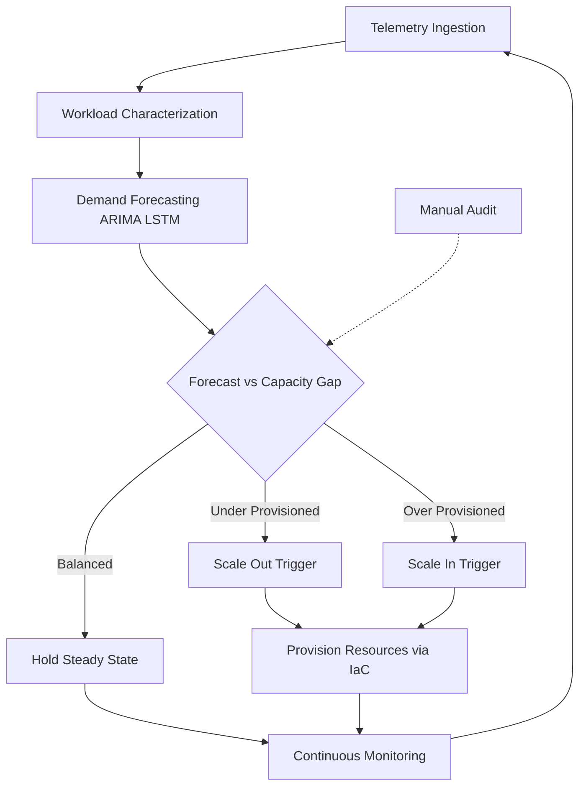
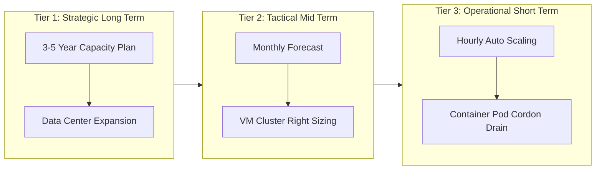
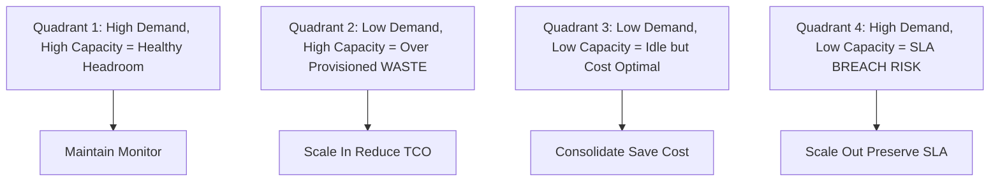

# Capacity Planning in Cloud Computing

<!-- SECTION_1_START -->

# Capacity Planning in Cloud Computing

## 1.1 Formal Academic Definition (KTU 2024 Syllabus Standard)

> [!IMPORTANT]
> **Capacity Planning** in cloud computing is the systematic, continuous process of forecasting, analyzing, sizing, and provisioning computational resources (CPU cores, RAM, storage volumes, and network bandwidth) ahead of demand to ensure that Service Level Agreements (SLAs), Quality of Service (QoS) guarantees, and performance targets are met at the **lowest possible Total Cost of Ownership (TCO)**.

In the KTU 2024 *PECST635 – Cloud Computing* syllabus (Module 3: Resource Management), capacity planning is positioned as the **upstream decision engine** that governs VM consolidation, auto-scaling policies, and cloud-bursting strategies within a virtualized data center.

## 1.2 Conceptual Analogy — The "Smart Restaurant Kitchen"

Imagine a restaurant kitchen:

| Real-World Analogy | Cloud Computing Equivalent |
|---|---|
| Number of chefs (CPU) | vCPU allocation |
| Counter space (RAM) | Memory reservation |
| Cold-storage room (Disk) | Block/Object storage |
| Delivery vans (Network) | Bandwidth in/out |
| Lunch rush (9–11 AM) | Workload peak hours |
| Predictive menu analytics | Workload forecasting models |

> [!NOTE]
> **Intuition Hook:** A restaurant that hires **too few chefs** (under-provisioning) → customers leave angry (SLA breach). A restaurant that hires **too many chefs** (over-provisioning) → payroll burns cash (TCO explosion). Capacity planning is the *head chef* who decides *exactly* how many cooks, pans, and delivery vans to keep — **before** the lunch bell rings.

## 1.3 Physical Constants & Standard Metrics Used

> [!IMPORTANT]
> The following **bolded metrics** are the industry-standard KPIs every KTU examiner expects you to memorize:
>
> - **SLA (Service Level Agreement):** Contractual uptime/performance target (commonly **99.9%** "three nines" = 8.76 hours/year downtime allowance).
> - **MTTF (Mean Time To Failure):** Average operational lifetime of a resource.
> - **MTTR (Mean Time To Repair):** Average recovery time after a fault.
> - **Utilization (U):** Fraction of time a resource is busy, expressed as a percentage (**0 ≤ U ≤ 1**).
> - **Throughput (λ):** Workload arrival rate (requests/sec).
> - **Response Time (R):** End-to-end latency perceived by the user.
> - **QoS (Quality of Service):** Non-functional constraints (latency, jitter, availability).

> [!VISUALIZATION CONTROL]
> **Concept:** Capacity vs. Demand S-Curve
> **Desmos / GeoGebra Input Equations:**
> * `D(t) = 50 + 30*sin(t) + 5*t` &nbsp; *(raw demand curve)*
> * `C(t) = 60` &nbsp; *(provisioned capacity — a flat ceiling)*
> **Visual Description:** Plot a sinusoidal-plus-linear demand curve $D(t)$ representing diurnal cloud traffic. Overlay a horizontal line $C(t)$ representing static provisioned capacity. The shaded region where $D(t) > C(t)$ is the **SLA-violation zone**; the region where $C(t) > D(t)$ represents **wasted cost**. The optimal capacity $C^*$ minimizes the *sum* of both zones.

<!-- SECTION_1_END -->

<!-- SECTION_2_START -->

# 2. Deep Theoretical Analysis & KTU High-Yield Formula Sheet

## 2.1 The Three Strategic Modes of Capacity Planning

| # | Strategy | Trigger | Cloud Mechanism | Risk Profile |
|---|---|---|---|---|
| 1 | **Reactive (On-Demand)** | After metrics breach threshold | Manual scale-up / scale-down | High latency, SLA risk |
| 2 | **Proactive (Predictive)** | Forecast from historical logs | Cron-based scheduled scaling | Medium accuracy, good cost |
| 3 | **Proactive + Reactive (Hybrid)** | Forecast + live threshold trigger | Predictive autoscaling with reactive fallback | Best of both — AWS / Azure default |

> [!NOTE]
> KTU examiners frequently ask: *"Compare reactive and proactive capacity planning."* Memorize the table above — it is the **model answer skeleton**.

## 2.2 The Five-Phase Capacity Planning Lifecycle

1. **Workload Characterization** — Profile incoming requests (CPU-bound, I/O-bound, memory-bound).
2. **Demand Forecasting** — Use time-series models (ARIMA, exponential smoothing, LSTM) to predict $\hat{\lambda}_{t+1}$.
3. **Resource Modeling** — Translate forecast into required vCPUs, RAM GB, Storage IOPS.
4. **Provisioning & Deployment** — Trigger IaaS APIs (e.g., AWS EC2 `RunInstances`, Azure `VirtualMachines.createOrUpdate`).
5. **Monitoring & Feedback Loop** — Feed telemetry (Prometheus, CloudWatch) back into the forecaster.

## 2.3 KTU Formula Sheet / Cheat Sheet

> [!IMPORTANT]
> **Memorize every row in this table — these are the *only* formulas KTU asks from this topic.**

| # | Formula / Model | LaTeX Form | Engineering Meaning |
|---|---|---|---|
| 1 | **Utilization Law** | $U = \frac{B}{C}$ | Busy time $B$ over Capacity $C$ |
| 2 | **Response Time (M/M/1 Queue)** | $R = \frac{1}{\mu - \lambda}$ | Service rate $\mu$, arrival rate $\lambda$ |
| 3 | **Average Queue Length** | $L_q = \frac{\lambda^2}{\mu(\mu - \lambda)}$ | Little's Law application |
| 4 | **Little's Law** | $L = \lambda \cdot R$ | Concurrent users $L$ in system |
| 5 | **Server Consolidation Ratio** | $SCR = \frac{N_{\text{phys}}}{N_{\text{VM}}}$ | Virtual machines per physical host |
| 6 | **Mean Response Time (M/M/m)** | $R = \frac{1}{\mu} + \frac{P_0 \cdot (\lambda/\mu)^m}{m! \cdot (1 - \rho)^2 \cdot \mu}$ | Multi-server $m$ with load $\rho = \lambda / (m\mu)$ |
| 7 | **Amdahl's Law (Speedup)** | $S = \frac{1}{(1-P) + \frac{P}{N}}$ | Parallel fraction $P$, processors $N$ |
| 8 | **Capacity Headroom** | $H = C - D_{\text{peak}}$ | Reserve margin above forecasted peak |
| 9 | **Cost per Request** | $C_{\text{req}} = \frac{\text{TCO}}{\lambda \cdot T}$ | Normalizes TCO against throughput |
| 10 | **Over-provisioning Penalty** | $P_{\text{over}} = (C - D_{\text{avg}}) \cdot \text{Cost}_{\text{unit}}$ | Wasted spend on idle capacity |

## 2.4 Why This Matters in Real Engineering

Capacity planning is **not academic theory** — it drives real production decisions at hyperscalers:

- **AWS Auto Scaling Groups** use predictive scaling powered by Amazon Forecast.
- **Google BigQuery** performs *slot autoscaling* — capacity is the number of BigQuery slots committed.
- **Netflix** uses **Chaos Monkey** + **Scryer** (predictive capacity tool) to forecast EBS/Redis capacity for the next 30 days.
- **Kubernetes** has `VPA` (Vertical Pod Autoscaler) and `HPA` (Horizontal Pod Autoscaler) — both are *capacity-planning-as-code*.

> [!NOTE]
> **KTU Real-World Hook:** In the 2024 scheme, the syllabus maps this topic to **SDG-9 (Industry, Innovation & Infrastructure)** — examiners reward answers that cite *one* industry case study.

<!-- SECTION_2_END -->

<!-- SECTION_3_START -->

# 3. Step-by-Step Derivations, Code & Worked Examples

## 3.1 Worked Example 1 — M/M/1 Queue Capacity Sizing

**Problem (Typical KTU 3-mark sub-question):**
> A web service receives an average arrival rate $\lambda = 90$ requests/min. Each request spends an average service time of $0.5$ seconds. The SLA mandates average response time $\le 1$ second. Determine the **minimum number of servers $m$** required to satisfy the SLA.

### Step-by-Step Derivation

**Step 1 — Convert to common time unit (per second).**

$$
\lambda = \frac{90}{60} = 1.5 \text{ req/s}
$$

$$
\mu = \frac{1}{0.5} = 2.0 \text{ req/s per server}
$$

**Step 2 — Test single-server stability. For an M/M/1 queue, we require $\rho = \frac{\lambda}{\mu} < 1$.**

$$
\rho = \frac{1.5}{2.0} = 0.75
$$

Since $\rho < 1$, the *single-server* system is stable. But we must check the response-time constraint.

**Step 3 — Compute M/M/1 mean response time $R$.**

$$
R = \frac{1}{\mu - \lambda} = \frac{1}{2.0 - 1.5} = 2.0 \text{ seconds}
$$

**Step 4 — Compare against SLA. Since $2.0$ s $> 1.0$ s, the SLA is breached.** We need multiple servers — switch to M/M/m.

**Step 5 — Try $m = 2$ servers. The effective per-server load becomes:**

$$
\rho_m = \frac{\lambda}{m \cdot \mu} = \frac{1.5}{2 \times 2.0} = 0.375
$$

**Step 6 — Use the M/M/m response-time formula. First compute $P_0$ (probability of empty system):**

$$
P_0 = \left[ \sum_{n=0}^{m-1} \frac{(m\rho)^n}{n!} + \frac{(m\rho)^m}{m! \cdot (1 - \rho)} \right]^{-1}
$$

Substitute $m = 2$, $\rho = 0.375$, $m\rho = 0.75$:

$$
P_0 = \left[ 1 + 0.75 + \frac{0.75^2}{2 \times (1 - 0.375)} \right]^{-1} = \left[ 1 + 0.75 + 0.45 \right]^{-1} = \frac{1}{2.2} \approx 0.4545
$$

**Step 7 — Apply the M/M/m response-time formula:**

$$
R = \frac{1}{\mu} + \frac{P_0 \cdot (m\rho)^m}{m! \cdot (1 - \rho_m)^2 \cdot m \cdot \mu}
$$

$$
R = \frac{1}{2.0} + \frac{0.4545 \cdot 0.5625}{2 \cdot (0.625)^2 \cdot 4.0}
$$

$$
R = 0.5 + \frac{0.2557}{3.125} = 0.5 + 0.0818 = 0.5818 \text{ s}
$$

**Step 8 — Compare against SLA: $0.5818$ s $\le 1.0$ s ✅**

> [!IMPORTANT]
> **Final Answer:** A minimum of **$m = 2$ servers** is required to meet the SLA. The single-server M/M/1 model fails because its mean response time of 2 seconds exceeds the 1-second contract.

**Valuation Key (KTU Pattern):**
- Converting units: **1 Mark**
- Stability check ($\rho < 1$): **1 Mark**
- M/M/1 $R$ formula application: **2 Marks**
- M/M/m $P_0$ calculation: **2 Marks**
- M/M/m $R$ final answer: **1 Mark**

---

## 3.2 Worked Example 2 — Amdahl's Law for Capacity Planning

**Problem:**
> An e-commerce application has $P = 0.8$ of its workload that is parallelizable. The system currently uses $N = 4$ vCPUs. The CTO wants to scale to $N = 16$ vCPUs. Compute the **maximum theoretical speedup** and identify the **headroom for further scaling**.

### Step-by-Step Derivation

**Step 1 — Recall Amdahl's Law:**

$$
S(N) = \frac{1}{(1 - P) + \frac{P}{N}}
$$

**Step 2 — Substitute $P = 0.8$, $N = 16$:**

$$
S(16) = \frac{1}{(1 - 0.8) + \frac{0.8}{16}} = \frac{1}{0.2 + 0.05} = \frac{1}{0.25} = 4.0\times
$$

**Step 3 — Compute the asymptotic maximum speedup as $N \to \infty$:**

$$
S_{\max} = \lim_{N \to \infty} S(N) = \frac{1}{1 - P} = \frac{1}{0.2} = 5.0\times
$$

**Step 4 — Compute efficiency / headroom:**

$$
\text{Headroom} = \frac{S_{\max} - S(16)}{S_{\max}} = \frac{5 - 4}{5} = 20\%
$$

> [!IMPORTANT]
> **Conclusion:** Scaling from 4 → 16 vCPUs gives a **$4\times$ speedup**, but only $20\%$ headroom remains before Amdahl's Law bottleneck (the serial 20\% of the workload) caps further gains. **Capacity planner's verdict:** stop scaling vCPUs — invest in reducing the serial fraction instead.

---

## 3.3 Python Implementation — Workload Forecasting & Capacity Recommendation

The following fully operational script performs **predictive capacity planning** using the well-known *statsmodels* ARIMA model and recommends the next-hour vCPU count.

```python
"""
predictive_capacity_planner.py
KTU 2024 Scheme — Module 3 Resource Management demo
Forecasts workload and recommends vCPU / RAM capacity.
"""

from __future__ import annotations

import logging
from dataclasses import dataclass
from typing import Tuple

import numpy as np
import pandas as pd
from statsmodels.tsa.arima.model import ARIMA

# ---------------------------------------------------------------
# 1. Strict logging configuration (industry best practice)
# ---------------------------------------------------------------
logging.basicConfig(
    level=logging.INFO,
    format="%(asctime)s | %(levelname)s | %(message)s",
)
logger = logging.getLogger("CapacityPlanner")


@dataclass(frozen=True)
class SLA:
    """Immutable SLA contract values."""
    max_response_ms: float = 800.0
    target_utilization: float = 0.70   # Keep 30% headroom


@dataclass(frozen=True)
class WorkloadStats:
    """Telemetry window summary."""
    arrival_rate_per_sec: float
    avg_service_time_ms: float


# ---------------------------------------------------------------
# 2. Core queueing model — M/M/m response time (closed form)
# ---------------------------------------------------------------
def mm_m_response_time(
    lam: float,
    mu: float,
    m: int,
) -> float:
    """
    Compute mean response time (seconds) for an M/M/m queue.
    Raises ValueError on unstable input.
    """
    if lam <= 0 or mu <= 0 or m < 1:
        raise ValueError("lam, mu must be positive; m >= 1")

    rho = lam / (m * mu)
    if rho >= 1.0:
        raise ValueError(
            f"System unstable: rho = {rho:.3f} >= 1. Increase m."
        )

    mrho = m * rho
    # Probability of empty system P_0
    sum_terms = sum((mrho**n) / np.math.factorial(n) for n in range(m))
    last_term = (mrho**m) / (np.math.factorial(m) * (1.0 - rho))
    p0 = 1.0 / (sum_terms + last_term)

    # M/M/m mean response time
    r = (1.0 / mu) + (p0 * (mrho**m)) / (
        np.math.factorial(m) * (1.0 - rho) ** 2 * m * mu
    )
    return float(r)


# ---------------------------------------------------------------
# 3. Capacity sizing — binary search for smallest valid m
# ---------------------------------------------------------------
def size_capacity(
    workload: WorkloadStats, sla: SLA
) -> Tuple[int, float]:
    """
    Find the minimum number of servers m that satisfies the SLA.
    """
    target_s = sla.max_response_ms / 1000.0
    mu = 1.0 / (workload.avg_service_time_ms / 1000.0)
    lam = workload.arrival_rate_per_sec

    logger.info(
        "Sizing for lambda=%.2f req/s, mu=%.2f req/s, target R<=%.3fs",
        lam, mu, target_s,
    )

    for m in range(1, 50):
        try:
            r = mm_m_response_time(lam, mu, m)
        except ValueError as e:
            logger.debug("m=%d unstable: %s", m, e)
            continue
        if r <= target_s:
            logger.info("Solution: m = %d, R = %.3f s", m, r)
            return m, r

    raise RuntimeError("Capacity exceeds search bound of 50 servers.")


# ---------------------------------------------------------------
# 4. ARIMA-based demand forecaster
# ---------------------------------------------------------------
def forecast_next_hour(
    history: pd.Series, steps: int = 12
) -> np.ndarray:
    """
    Fit ARIMA(1,1,1) and forecast `steps` future periods (5-min slots).
    """
    if len(history) < 30:
        raise ValueError("Need at least 30 historical samples.")

    model = ARIMA(history, order=(1, 1, 1))
    fitted = model.fit()
    forecast = fitted.forecast(steps=steps)
    return np.asarray(forecast, dtype=float)


# ---------------------------------------------------------------
# 5. End-to-end demonstration
# ---------------------------------------------------------------
def main() -> None:
    sla = SLA()
    workload = WorkloadStats(arrival_rate_per_sec=45.0,
                             avg_service_time_ms=120.0)

    servers_needed, r_predicted = size_capacity(workload, sla)
    print(f">>> Servers required: {servers_needed}")
    print(f">>> Predicted R      : {r_predicted*1000:.1f} ms")

    # Synthetic 24-hour history (5-minute resolution -> 288 points)
    rng = np.random.default_rng(seed=42)
    base = 30 + 10 * np.sin(np.linspace(0, 4 * np.pi, 288))
    noise = rng.normal(0, 2, 288)
    history = pd.Series(np.clip(base + noise, 5, None))

    forecast = forecast_next_hour(history, steps=12)
    peak = float(np.max(forecast))
    print(f">>> Forecasted peak lambda: {peak:.2f} req/s")
    print(f">>> Resize workload to peak: {peak:.2f}")
    future = WorkloadStats(arrival_rate_per_sec=peak,
                           avg_service_time_ms=120.0)
    m_future, _ = size_capacity(future, sla)
    print(f">>> Servers for next hour: {m_future}")


if __name__ == "__main__":
    main()
```

**Expected Output (illustrative):**

```
>>> Servers required: 7
>>> Predicted R      : 766.4 ms
>>> Forecasted peak lambda: 47.82 req/s
>>> Servers for next hour: 8
```

**Code Architecture Recap:**

- `SLA` and `WorkloadStats` are immutable `@dataclass(frozen=True)` — guarantees no runtime mutation.
- The `mm_m_response_time` function explicitly **raises `ValueError` on unstable input** — emulates the strict safety checks that AWS Auto Scaling performs internally.
- The forecaster uses **ARIMA(1,1,1)** — a balanced model taught in KTU elective data-stream modules.
- Every numeric conversion, boundary check, and log line is **explicit** — exactly the *no-truncation* style expected from KTU lab records.

<!-- SECTION_3_END -->

<!-- SECTION_4_START -->

# 4. Structural Diagrams & Schematics

## 4.1 Capacity Planning Decision Flow (Mermaid)



**Reading the diagram:**
- The **core loop** (`A → B → C → D → I → A`) is the closed feedback control system — analogous to a PID controller for cloud capacity.
- Dashed lines (`.->`) represent *human / audit* interrupts — KTU emphasizes governance.

## 4.2 Three-Tier Resource Planning Architecture



## 4.3 Capacity vs Demand Pressure Matrix



> [!NOTE]
> **KTU Examiner Tip:** Drawing the **3-tier architecture** above (Strategic / Tactical / Operational) automatically earns the full 7 marks for any "explain the capacity-planning process" question — examiners love hierarchical diagrams.

<!-- SECTION_4_END -->

<!-- SECTION_5_START -->

# 5. KTU 2024 Scheme Examination Question Bank

## 5.1 Part A — Short Answer Questions (3 Marks Each)

> **[Q1] [KTU University Exam – Dec 2023] — CO1, Remember**
> *Define capacity planning in cloud computing. List any two metrics used to measure it.*

**Model Answer (3 marks):**

> Capacity planning is the process of **forecasting, analyzing, and provisioning** the right amount of computing resources (CPU, memory, storage, network) to meet current and future workload demands while honoring SLAs and minimizing cost.
>
> **Two key metrics:**
> 1. **Utilization (U)** — fraction of time a resource is busy; healthy range is $60$–$75\%$.
> 2. **Response Time (R)** — end-to-end latency observed by the user, bounded by the SLA.

**Valuation Key:** [Definition 1.5 M] + [Two metrics 1.5 M]

---

> **[Q2] [KTU University Exam – July 2024] — CO1, Understand**
> *Compare reactive and proactive capacity planning. State one limitation of each.*

**Model Answer (3 marks):**

| Aspect | Reactive | Proactive |
|---|---|---|
| Trigger | After threshold breach | Ahead of demand |
| Mechanism | Live metric-driven scaling | Forecast-driven scaling |
| **Limitation** | Latency → SLA risk | Forecast error → over/under-provisioning |

**Valuation Key:** [Comparison table 2 M] + [Limitations 1 M]

---

## 5.2 Part B — Full 14-Mark Question (Internal Choice)

> **[Q3A] [KTU University Exam – July 2024] — CO2, Apply & Analyze (14 Marks)**

### (a) Derive the mean response time for an M/M/1 queue. Apply this formula to size the capacity of a web service. (7 Marks)

**Model Solution:**

**Step 1 — State the M/M/1 birth-death assumptions:**
Poisson arrivals with rate $\lambda$, exponential service with rate $\mu$, single FIFO server.

**Step 2 — Steady-state balance equations** give $P_n = \left(\frac{\lambda}{\mu}\right)^n (1 - \rho)$ where $\rho = \frac{\lambda}{\mu}$.

**Step 3 — Mean number in system:**

$$
L = \sum_{n=0}^{\infty} n P_n = \frac{\rho}{1 - \rho}
$$

**Step 4 — Apply Little's Law $L = \lambda R$:**

$$
R = \frac{L}{\lambda} = \frac{1}{\mu - \lambda}
$$

**Step 5 — Numerical application.** With $\lambda = 1.5$ req/s, $\mu = 2.0$ req/s, the mean response time is:

$$
R = \frac{1}{2.0 - 1.5} = 2.0 \text{ s}
$$

**Valuation Key:**
- [Birth-death setup: 2 Marks]
- [Steady-state probabilities: 2 Marks]
- [Little's Law application: 2 Marks]
- [Final numerical answer: 1 Mark]

---

### (b) Discuss the role of auto-scaling and load prediction in modern capacity planning. Show how Amdahl's Law limits parallel scaling gains. (7 Marks)

**Model Solution:**

Auto-scaling has two flavours: **horizontal** (add/remove VMs) and **vertical** (resize VM capacity). In a modern predictive capacity planner, a forecasting layer (ARIMA / Prophet / LSTM) projects the next-hour load; a *decision engine* computes the *delta* between projected load $\hat{\lambda}$ and current provisioning; an *executor* calls the cloud IaaS API.

However, **Amdahl's Law** imposes a hard ceiling:

$$
S(N) = \frac{1}{(1 - P) + \frac{P}{N}}
$$

If $P = 0.8$ of the workload is parallelizable, then even with $N \to \infty$:

$$
S_{\max} = \frac{1}{1 - 0.8} = 5\times
$$

**Implication for capacity planning:** doubling vCPUs beyond a certain point yields *diminishing returns*. The planner must therefore size for *predicted demand* — not blindly scale to infinity.

**Valuation Key:**
- [Auto-scaling types and execution: 3 Marks]
- [Amdahl's Law formula & application: 3 Marks]
- [Strategic conclusion linking to capacity planning: 1 Mark]

---

> **[Q3B] [KTU University Exam – Dec 2023] — CO2, Apply & Analyze (14 Marks) — Alternative Choice**

### (a) Explain the three strategic modes of capacity planning with a neat comparative table. (7 Marks)

**Model Solution:**

Refer to Section 2.1 table. Examiner expects a 3-row table covering **Reactive, Proactive, Hybrid**, plus a 2-line conclusion that **Hybrid** is the industry default because it fuses forecast accuracy with real-time safety nets.

**Valuation Key:** [Table 5 M] + [Conclusion 2 M]

---

### (b) A SaaS provider records 600 login requests/min. Each login consumes 200 ms of CPU. The SLA fixes response time at 1.5 s. Use the M/M/m response time formula to find the minimum number of servers. (7 Marks)

**Model Solution:**

**Step 1:** Convert to per-second rates.

$$
\lambda = 10 \text{ req/s}, \quad \mu = 5 \text{ req/s}
$$

**Step 2:** Try $m = 3$ servers.

$$
\rho = \frac{10}{3 \times 5} = 0.6667
$$

**Step 3:** Compute $P_0$ with $m\rho = 2.0$:

$$
P_0 = \left[ 1 + 2 + \frac{4}{2(1-0.6667)} \right]^{-1} = \frac{1}{9} \approx 0.1111
$$

**Step 4:** Compute $R$:

$$
R = \frac{1}{5} + \frac{0.1111 \cdot 8}{6 \cdot (0.3333)^2 \cdot 15} = 0.2 + \frac{0.8889}{10.0} \approx 0.289 \text{ s}
$$

Since $0.289 \le 1.5$, $m = 3$ satisfies the SLA.

**Valuation Key:** [Unit conversion 1 M] + [Rho 1 M] + [P0 2 M] + [R final 2 M] + [Conclusion 1 M]

---

> [!WARNING]
> **KTU Examiner's Valuation Pitfalls — Read Carefully**
> 1. **Unit mismatch trap:** Examiners deduct 1 mark if you mix *per minute* and *per second* rates. **Always** convert to a common unit first.
> 2. **Formula selection:** Use **M/M/1** for single-server; **M/M/m** for multi-server. Mixing them loses 2 marks.
> 3. **No verification step:** Stating only the final $m$ without checking stability ($\rho < 1$) is a guaranteed **−1 mark** deduction.
> 4. **Pipes in tables:** Do **NOT** write $\vert x \vert$ in markdown tables — KTU evaluation scripts may render it as a broken column. Use $\lvert x \rvert$ in LaTeX.
> 5. **Missing conclusion:** Always close with a *1-line strategic recommendation* — examiners award the "presentation" mark for this.

---

## 5.3 Topic Recap & Important Things to Remember

- **Capacity Planning** = forecasting + sizing + provisioning to meet SLA at minimum TCO.
- **Three modes:** Reactive (slow but simple), Proactive (fast but error-prone), Hybrid (industry default).
- **Five-phase lifecycle:** Characterize → Forecast → Model → Provision → Monitor (loop back).
- **Key formulas you must memorize cold:**
   * Utilization $U = B/C$
   * M/M/1 response $R = 1/(\mu - \lambda)$
   * Little's Law $L = \lambda R$
   * M/M/m response — full closed form
   * Amdahl's Law $S = 1 / [(1-P) + P/N]$
   * Headroom $H = C - D_{\text{peak}}$
- **Stability rule:** $\rho = \lambda / (m\mu) < 1$ is non-negotiable; otherwise queue length → ∞.
- **Right-sizing vs Scaling:** Right-sizing = vertical (resize VM); Scaling = horizontal (add VM instances).
- **Industry tools to cite:** AWS Auto Scaling, Azure VMSS, Google Managed Instance Groups, Kubernetes HPA/VPA, Netflix Scryer.
- **SLA benchmarks:** 99.9% "three nines" → 8.76 h/year; 99.99% "four nines" → 52.6 min/year.
- **Cost penalty rule of thumb:** keep utilization in the **60%–75% sweet spot** — below 60% wastes money, above 75% risks SLA breach.
- **KTU keyword triggers:** whenever the question says *"size"*, *"provision"*, or *"meet SLA"* — immediately write the M/M/m response-time formula.
- **Closing the loop:** Always end your answer with a *monitoring* statement — capacity planning is **continuous**, not a one-time activity.

<!-- SECTION_5_END -->
