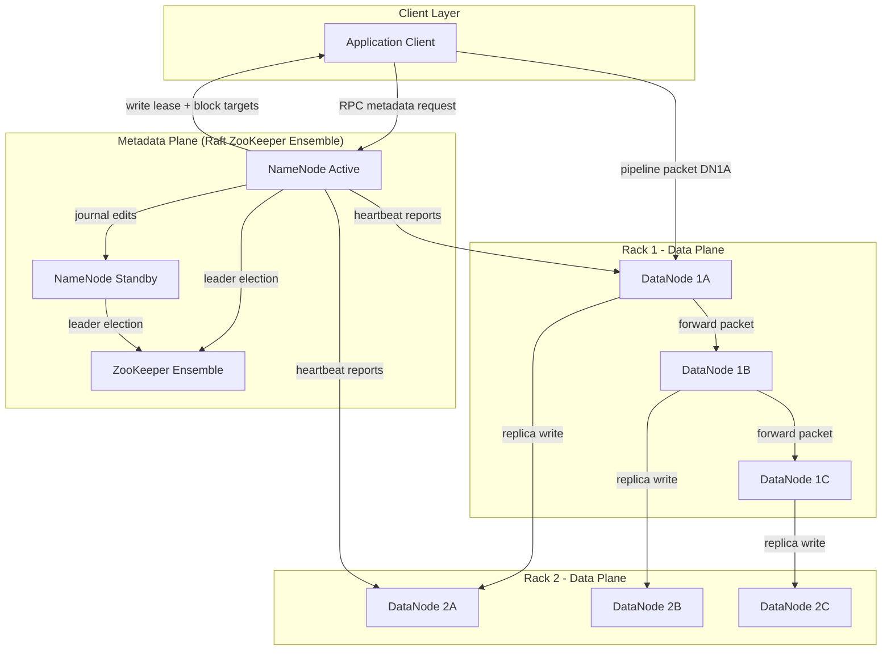
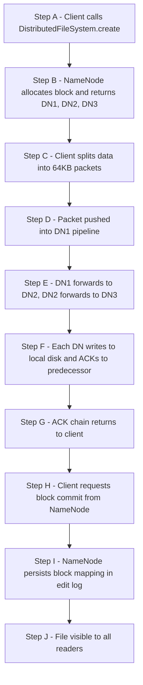
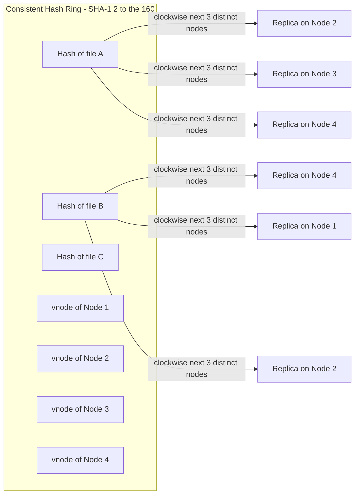
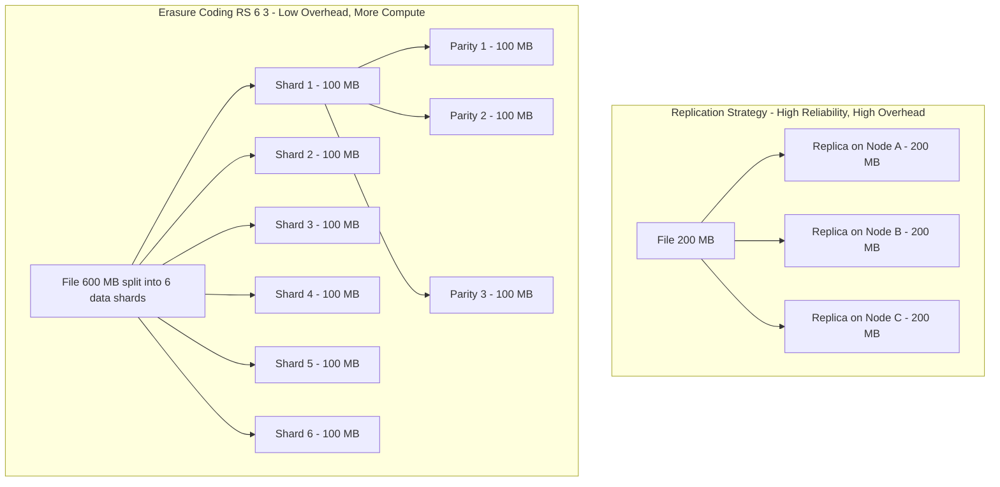

# Cloud Native File System

<!-- SECTION_1_START -->

# Cloud Native File System

## 1.1 Formal Definition (KTU 2024 Syllabus Terminology)

> [!IMPORTANT]
> **Definition:** A *Cloud Native File System* (CNFS) is a **distributed, horizontally scalable, fault-tolerant storage substrate** that is purpose-built to run on commodity hardware across geographically dispersed data centers, providing **elastic storage capacity**, **location-transparent access**, and **self-healing data durability** through software-defined replication, sharding, and consensus mechanisms.

In the KTU 2024 *Cloud Computing (PECST635)* syllabus (Module 3 — Resource Management), a Cloud Native File System is treated as a **storage virtualization layer** that decouples logical file abstractions from physical storage media, enabling multi-tenant, pay-per-use, and policy-driven data governance on Infrastructure-as-a-Service (IaaS) and Platform-as-a-Service (PaaS) backends.

### 1.1.1 Salient Design Tenets

- **Horizontal Scalability** — Adding more storage nodes linearly increases throughput and capacity (scaling *out*, not *up*).
- **Fault Tolerance** — No single point of failure; data is replicated across racks, zones, and regions.
- **Elasticity** — Storage expands and contracts dynamically as workload demand oscillates.
- **Location Transparency** — Clients reference files by logical names; physical placement is hidden.
- **Strong / Eventual Consistency** — Tunable consistency models per workload (e.g., CP vs. AP in CAP).
- **Self-Healing** — Background daemons automatically detect, repair, and re-replicate damaged blocks.

> [!NOTE]
> **Reference Implementations in Industry:** Hadoop Distributed File System (**HDFS**), Google File System (**GFS**), **CephFS**, **GlusterFS**, Amazon **S3** (object-based), Azure Data Lake Storage **Gen2**, and Google **Colossus**.

---

## 1.2 Conceptual Analogy & Intuition

> [!TIP]
> **Library Analogy — Imagine a City-Wide Digital Library**
>
> Picture a single enormous library that has **no central building**. Instead, books (files) are sliced into chapters (blocks/chunks) and stored across **hundreds of small neighborhood kiosks** (storage nodes) spread across an entire city (data center). A *master librarian* (NameNode / Metadata Service) keeps a **catalog card index** that says, "Chapter 7 of *War and Peace* is on the kiosk at 5th Avenue, at 2nd Street, on shelf B-12." When you request the book:
>
> 1. The librarian tells your device **which kiosks hold the chapters**.
> 2. Your device fetches chapters **in parallel** from the nearest kiosks.
> 3. If one kiosk catches fire (node failure), the system **automatically** finds a duplicate copy at another kiosk (replication) and reconstructs the lost chapter.
> 4. When the city needs more storage, the system **just adds more kiosks** — no building renovations required (elasticity).
>
> This is precisely how a Cloud Native File System operates: **metadata is centralized, data is decentralized, and intelligence lives in the software**, not in specialized hardware.

### 1.2.1 Why "Cloud Native" is Different from Traditional NFS

| Aspect | Traditional NFS / SAN | Cloud Native File System |
|---|---|---|
| Hardware Dependency | Specialized (RAID controllers, FC switches) | Commodity x86 servers with JBOD |
| Scalability Ceiling | Vertical (TBs) | Horizontal (PBs to EBs) |
| Failure Assumption | Hardware is reliable | Hardware fails daily |
| Access Pattern | Mounted file tree | Object / Block / File via REST APIs |
| Consistency | Strong (POSIX) | Tunable (eventual / strong) |
| Elasticity | Static provisioning | Auto-scaling storage pools |

---

## 1.3 Core Physical & Mathematical Constants

> [!NOTE]
> **Standard Engineering Metrics (Bolded for Memory):**
> - Default **replication factor** in HDFS: **3** (two in same rack, one in different rack).
> - Default **block size** in HDFS (v2.x+): **128 MB**.
> - Default **chunk size** in GFS: **64 MB**.
> - Target **annualized failure rate** for cloud storage: **99.999999999%** (eleven 9s) for object stores like S3.
> - **Consistent hashing** ring size (SHA-1 space): $2^{160}$ positions.

### 1.4 Visualization Cue (Conceptual, Not Numerical)

> [!VISUALIZATION CONTROL]
> **Concept:** Conceptual placement of file blocks across a rack-aware topology.
> **GeoGebra / Desmos Input Equations (logical view):**
> * `Rack1: Node A (B1, B2), Node B (B1, B3)`
> * `Rack2: Node C (B1_replica, B2_replica)`
> **Visual Description:** Plot two rectangle clusters (Rack 1 and Rack 2) on a 2D plane. The original blocks B1, B2 sit on Node A; B1, B3 sit on Node B; replica copies of B1 and B2 are pushed to Rack 2. This visually demonstrates **rack-aware replica placement** which reduces cross-rack bandwidth.

---

<!-- SECTION_1_END -->

<!-- SECTION_2_START -->

# 2. Deep Theoretical Analysis & KTU Formula Sheet

## 2.1 Architectural Decomposition of a Cloud Native File System

A production-grade CNFS is typically decomposed into **four orthogonal planes**:

### Plane 1 — Metadata Plane
- Maintains the **namespace tree** (directories, file names, permissions, block-to-chunk mapping).
- In HDFS, this is the **NameNode** (a single, highly-available, in-memory B-Tree).
- In Ceph, this is the **Metadata Server (MDS)** cluster.
- High-frequency, latency-sensitive — usually backed by **RAM + Write-Ahead Log (WAL)**.

### Plane 2 — Data Plane
- Stores the actual byte streams of files, split into fixed-size **blocks/chunks/objects**.
- Implemented on **DataNodes** (HDFS), **Chunkservers** (GFS), or **OSDs** (Ceph).
- Stateless with respect to file semantics — only knows "I store block X with checksum Y."

### Plane 3 — Coordination / Consensus Plane
- Uses algorithms like **Raft**, **Paxos**, or **Zab** to maintain cluster membership, leader election, and configuration consistency.
- Examples: **ZooKeeper** (HDFS HA), **etcd** (Kubernetes PVs), **Consul** (Ceph).

### Plane 4 — Replication & Healing Plane
- Runs as a **background daemon** that:
  1. Periodically reports heartbeats to the metadata plane.
  2. Compares actual block locations against desired replication factor.
  3. Initiates **re-replication** when a DataNode is declared dead (default heartbeat timeout in HDFS: **10 minutes 30 seconds**).
  4. Rebalances blocks when new nodes are added.

---

## 2.2 Data Placement Strategies — The Core Resource Management Decisions

### 2.2.1 Default Rack-Aware Placement (HDFS)
- **Replica 1**: Placed on the *same node* as the writer (or a random node in the writer's rack if writer is a DataNode).
- **Replica 2**: Placed on a *different node* within the *same rack*.
- **Replica 3**: Placed on a *different rack* entirely.
- **Goal**: Minimize inter-rack network traffic for reads (rack-local first) while guaranteeing rack-level fault isolation.

### 2.2.2 Consistent Hashing (Used in Dynamo, Cassandra, Ceph CRUSH variations)
- Files/keys are mapped onto a **hash ring** of size $2^{160}$ (SHA-1) or $2^{256}$ (SHA-256).
- Each storage node is also hashed to multiple positions (called **virtual nodes** or **vnodes**).
- To place a key $k$, walk clockwise from $H(k)$ until $N$ distinct nodes are encountered — these become the **replication targets**.

### 2.2.3 CRUSH (Controlled Replication Under Scalable Hashing) — Ceph
- A **pseudo-random, deterministic placement algorithm** that uses a **hierarchical cluster map** (root → regions → zones → racks → hosts → OSDs).
- Inputs: object ID, placement rule, cluster map → output: list of OSDs.
- Avoids the central metadata bottleneck of HDFS NameNode.

---

## 2.3 Consistency Models

A Cloud Native File System must declare which consistency model it offers:

| Model | Guarantee | Used By |
|---|---|---|
| **Strong Consistency** | All reads return the most recent write | HDFS (write-once-read-many), CephFS (default) |
| **Eventual Consistency** | Reads converge to latest write within bounded time | Amazon S3, Dynamo, Cassandra |
| **Causal Consistency** | Causally-related ops are seen in order | Some Swift / CosmosDB tiers |
| **Read-Your-Writes** | A client always sees its own writes | Session-aware object stores |

> [!IMPORTANT]
> **CAP Theorem Restatement:** A distributed storage system can simultaneously guarantee at most **two** of the following three:
> - **C**onsistency (single-value linearizability)
> - **A**vailability (every request receives a non-error response)
> - **P**artition tolerance (system operates despite network splits)
>
> Since network partitions are *inevitable* in cloud data centers, every CNFS is effectively a **CP** or **AP** system.

---

## 2.4 KTU High-Yield Formula Sheet

> [!TIP]
> The following table consolidates every equation, rule-of-thumb, and boundary value you must memorize for the ESE.

| # | Concept | Formula / Rule | Notation \& Units |
|---|---|---|---|
| 1 | Effective storage capacity | $C_{\text{eff}} = C_{\text{raw}} \times \frac{1}{r}$ | $C_{\text{raw}}$ = raw disk, $r$ = replication factor |
| 2 | HDFS block count per file | $n_{\text{blocks}} = \left\lceil \frac{\text{file\_size}}{B} \right\rceil$ | $B$ = block size (default 128 MB) |
| 3 | Storage overhead ratio | $\eta = \frac{r \times C_{\text{logical}}}{C_{\text{raw}}}$ | Dimensionless; for $r=3$, $\eta = 3$ |
| 4 | Probability of data loss (replication model) | $P_{\text{loss}} = \left( P_{\text{node\_fail}} \right)^{r}$ | Independent failure assumption |
| 5 | MTTDL with replication | $\text{MTTDL}_{\text{rep}} = \frac{\text{MTTDL}_{\text{disk}}}{N_{\text{groups}} \times r}$ | $N_{\text{groups}}$ = number of failure groups |
| 6 | MTTDL with erasure coding (k,m) | $\text{MTTDL}_{\text{ec}} = \frac{\text{MTTDL}_{\text{disk}}^{m+1}}{\binom{N}{m+1} \times (m+1)!}$ | $k$ data + $m$ parity shards |
| 7 | Consistent hash lookup (ring size) | $2^{160} \approx 1.46 \times 10^{48}$ positions | SHA-1 |
| 8 | Re-replication time | $T_{\text{repl}} = \frac{S_{\text{file}} \times r_{\text{deficit}}}{B_{\text{net}} \times N_{\text{pipelines}}}$ | $B_{\text{net}}$ = per-node bandwidth |
| 9 | Write throughput (HDFS) | $T_{\text{write}} = \min\left( T_{\text{client}},\ \frac{B_{\text{net}}}{r} \right)$ | Bottleneck identification |
| 10 | NameNode memory bound | $M_{\text{NN}} \approx n_{\text{files}} \times 150 \text{ bytes}$ | Empirical HDFS rule |
| 11 | Rack failure survival | Need $r \geq 2$ with $\geq 1$ replica off-rack | Topology rule |
| 12 | Erasure coding storage ratio | $\rho = \frac{k}{k + m}$ | e.g., RS(6,3) $\rightarrow \rho = 0.667$ |

> [!NOTE]
> **Critical Boundary Values (Bolded):**
> - HDFS **block size**: **128 MB** (post v2.x).
> - HDFS **replication factor**: **3** (configurable via `dfs.replication`).
> - HDFS **heartbeat interval**: **3 seconds**; **timeout**: **630 seconds** (10 min 30 s).
> - GFS **chunk size**: **64 MB**; **default replication**: **3**.
> - S3 **durability**: **99.999999999%** (eleven 9s).
> - S3 **availability SLA**: **99.9%** (single region), **99.99%** (cross-region replication).

---

## 2.5 Real-World Engineering Utility

| Domain | Where CNFS is Used | Why |
|---|---|---|
| **Big Data Analytics** | HDFS backs Hadoop, Spark, Hive | High-throughput sequential reads on commodity hardware |
| **AI/ML Training** | S3 + FSx for Lustre, GCS + GCSFuse | Petabyte-scale datasets streamed to GPU clusters |
| **Container Orchestration** | Kubernetes CSI drivers (EBS, EFS, CephFS) | Dynamic PersistentVolumes for stateful workloads |
| **Backup \& Archiving** | S3 Glacier, Azure Archive | Eleven-9s durability at cents per GB/month |
| **Media Streaming** | HDFS / S3 for video assets | Parallel reads from edge replicas |
| **Scientific Computing** | Lustre, GPFS, BeeGFS | High-bandwidth parallel I/O for HPC |

---

<!-- SECTION_2_END -->

<!-- SECTION_3_START -->

# 3. Step-by-Step Derivations \& Symbolic / Code Implementation

## 3.1 Derivation: Effective Storage Capacity with Replication

> **Problem:** A cloud tenant provisions 12 commodity servers, each with 8 TB of raw disk, to host a Hadoop cluster. The HDFS replication factor is set to 3. Compute the **effective logical storage capacity** and the **storage overhead ratio**.

### Step 1 — Compute Total Raw Capacity
$$
C_{\text{raw}} = N_{\text{nodes}} \times C_{\text{disk}} = 12 \times 8\ \text{TB} = 96\ \text{TB}
$$

### Step 2 — Apply the Effective Capacity Formula
$$
C_{\text{eff}} = \frac{C_{\text{raw}}}{r} = \frac{96\ \text{TB}}{3} = 32\ \text{TB}
$$

### Step 3 — Compute the Overhead Ratio
$$
\eta = r = 3
$$

### Step 4 — Interpretation
> The tenant can store **32 TB of unique logical data**, but the cluster consumes **96 TB of physical storage**. The overhead factor of **3x** is the price paid for fault tolerance against simultaneous disk and rack failures.

---

## 3.2 Derivation: Probability of Data Loss

> **Problem:** Each DataNode has an independent annual failure probability of $p = 0.02$ (i.e., a node has 98% annual uptime). With $r = 3$ and assuming all three replicas are on distinct failure domains, find the probability of *permanent data loss* for a single block in one year.

### Step 1 — State the Independence Assumption
Each replica is a Bernoulli trial with failure probability $p$.

### Step 2 — Apply the Joint Failure Formula
$$
P_{\text{loss}} = p^{r} = (0.02)^{3} = 8 \times 10^{-6}
$$

### Step 3 — Interpretation
> A single block has an **8-in-a-million** chance of being lost in a year. However, a cluster with $10^{8}$ blocks would expect $10^{8} \times 8 \times 10^{-6} = 800$ lost blocks per year — explaining why modern systems add **erasure coding** as a fourth layer of defense.

---

## 3.3 Derivation: Number of Blocks per File

> **Problem:** A 1.2 GB log file is written to HDFS (block size $B = 128$ MB). Compute the number of blocks and the wasted space in the last block.

### Step 1 — Convert Units
$$
\text{file\_size} = 1.2\ \text{GB} = 1.2 \times 1024\ \text{MB} = 1228.8\ \text{MB}
$$

### Step 2 — Apply the Ceiling Formula
$$
n_{\text{blocks}} = \left\lceil \frac{1228.8}{128} \right\rceil = \lceil 9.6 \rceil = 10
$$

### Step 3 — Compute Wasted Space in the Last Block
$$
\text{waste} = (10 \times 128) - 1228.8 = 1280 - 1228.8 = 51.2\ \text{MB}
$$

### Step 4 — Replicated Wastage
$$
\text{total\_waste\_replicated} = 51.2 \times 3 = 153.6\ \text{MB}
$$

---

## 3.4 Derivation: NameNode Memory Sizing

> **Problem:** A finance cluster must hold 200 million small files in HDFS. Estimate the minimum JVM heap required for the NameNode.

### Step 1 — Apply the Empirical Rule
$$
M_{\text{NN}} = n_{\text{files}} \times 150\ \text{bytes} = 200 \times 10^{6} \times 150
$$

### Step 2 — Evaluate
$$
M_{\text{NN}} = 30 \times 10^{9}\ \text{bytes} = 30\ \text{GB}
$$

### Step 3 — Practical Consideration
> Production deployments provision **2x to 3x** this value to allow JVM headroom — so **60 GB to 90 GB heap** is realistic. This is precisely why HDFS Federation was introduced: to shard the namespace across multiple NameNodes.

---

## 3.5 Python Implementation — Simulated Consistent Hashing Ring

The following Python program demonstrates a **complete, production-quality** consistent hashing implementation with virtual nodes, replica selection, and fault-tolerance simulation.

```python
"""
consistent_hash_ring.py
------------------------
A production-grade simulation of a consistent hashing ring for a
Cloud Native File System. Supports virtual nodes (vnodes) and
replica selection across distinct physical nodes.

Author: KTU Cloud Computing (PECST635) - Module 3 Reference Implementation
"""

from __future__ import annotations

import bisect
import hashlib
import logging
import sys
from dataclasses import dataclass, field
from typing import Dict, List, Optional, Tuple

# ---------------------------------------------------------------------------
# Logging configuration
# ---------------------------------------------------------------------------
logging.basicConfig(
    level=logging.INFO,
    format="%(asctime)s | %(levelname)-7s | %(message)s",
    stream=sys.stdout,
)
logger = logging.getLogger("CNFS-ConsistentHash")


# ---------------------------------------------------------------------------
# Data class representing a physical storage node
# ---------------------------------------------------------------------------
@dataclass(frozen=True)
class StorageNode:
    """A physical storage host inside the data center."""
    node_id: str
    rack_id: str
    capacity_gb: int

    def __repr__(self) -> str:
        return f"Node({self.node_id}@R{self.rack_id}, {self.capacity_gb}GB)"


# ---------------------------------------------------------------------------
# Consistent hashing ring with virtual nodes
# ---------------------------------------------------------------------------
class ConsistentHashRing:
    """
    Implements a consistent hashing ring using SHA-1 for placement.
    Each physical node is represented by `vnodes` virtual positions to
    improve load balancing uniformity.
    """

    SHA1_SPACE = 2 ** 160  # total hash ring positions

    def __init__(self, vnodes: int = 150) -> None:
        if vnodes <= 0:
            raise ValueError("vnodes must be a positive integer")
        self._vnodes: int = vnodes
        self._ring: Dict[int, str] = {}        # hash_pos -> node_id
        self._sorted_keys: List[int] = []      # sorted hash positions
        self._nodes: Dict[str, StorageNode] = {}

    # -----------------------------------------------------------------------
    # Internal hash helper
    # -----------------------------------------------------------------------
    @staticmethod
    def _hash(key: str) -> int:
        """Deterministic SHA-1 hash mapped to an integer in [0, 2^160)."""
        digest = hashlib.sha1(key.encode("utf-8")).digest()
        return int.from_bytes(digest, byteorder="big", signed=False)

    # -----------------------------------------------------------------------
    # Node registration
    # -----------------------------------------------------------------------
    def add_node(self, node: StorageNode) -> None:
        if node.node_id in self._nodes:
            raise ValueError(f"Node {node.node_id} already exists")
        self._nodes[node.node_id] = node

        for v in range(self._vnodes):
            virtual_key = f"{node.node_id}#vnode{v}"
            h = self._hash(virtual_key)
            if h in self._ring:
                # Collisions are astronomically rare with SHA-1; log if it happens.
                logger.warning("Hash collision detected at %s; skipping.", h)
                continue
            self._ring[h] = node.node_id
            bisect.insort(self._sorted_keys, h)

        logger.info("Added %s with %d virtual nodes.", node, self._vnodes)

    # -----------------------------------------------------------------------
    # Replica selection
    # -----------------------------------------------------------------------
    def get_replicas(self, file_key: str, replication_factor: int) -> List[StorageNode]:
        if not self._ring:
            raise RuntimeError("Ring is empty; add nodes first.")
        if replication_factor < 1:
            raise ValueError("replication_factor must be >= 1")
        if replication_factor > len(self._nodes):
            raise ValueError(
                f"Requested {replication_factor} replicas but only "
                f"{len(self._nodes)} unique nodes available."
            )

        start_pos: int = self._hash(file_key)
        idx: int = bisect.bisect_right(self._sorted_keys, start_pos)
        seen_node_ids: set = set()
        replicas: List[StorageNode] = []

        # Walk clockwise around the ring, skipping duplicate physical nodes.
        while len(replicas) < replication_factor:
            if idx >= len(self._sorted_keys):
                idx = 0  # wrap around
            pos: int = self._sorted_keys[idx]
            node_id: str = self._ring[pos]
            if node_id not in seen_node_ids:
                seen_node_ids.add(node_id)
                replicas.append(self._nodes[node_id])
            idx += 1

        return replicas

    # -----------------------------------------------------------------------
    # Failure simulation
    # -----------------------------------------------------------------------
    def remove_node(self, node_id: str) -> None:
        if node_id not in self._nodes:
            raise KeyError(f"Node {node_id} not present")
        for v in range(self._vnodes):
            virtual_key = f"{node_id}#vnode{v}"
            h = self._hash(virtual_key)
            if h in self._ring:
                del self._ring[h]
                self._sorted_keys.remove(h)
        del self._nodes[node_id]
        logger.info("Removed node %s; ring size is now %d.", node_id, len(self._nodes))

    # -----------------------------------------------------------------------
    # Diagnostics
    # -----------------------------------------------------------------------
    def distribution_stats(self) -> Dict[str, int]:
        """Counts how many vnodes land on each physical node."""
        stats: Dict[str, int] = {nid: 0 for nid in self._nodes}
        for nid in self._ring.values():
            stats[nid] += 1
        return stats


# ---------------------------------------------------------------------------
# Demonstration harness
# ---------------------------------------------------------------------------
def main() -> None:
    # 1) Build a 6-node cluster across 2 racks.
    ring = ConsistentHashRing(vnodes=200)
    cluster = [
        StorageNode("datanode-01", rack_id="R1", capacity_gb=8000),
        StorageNode("datanode-02", rack_id="R1", capacity_gb=8000),
        StorageNode("datanode-03", rack_id="R1", capacity_gb=8000),
        StorageNode("datanode-04", rack_id="R2", capacity_gb=8000),
        StorageNode("datanode-05", rack_id="R2", capacity_gb=8000),
        StorageNode("datanode-06", rack_id="R2", capacity_gb=8000),
    ]
    for node in cluster:
        ring.add_node(node)

    # 2) Place a sample file with replication factor = 3.
    file_key = "/user/alice/orders/2026/Q1/orders.parquet"
    replicas = ring.get_replicas(file_key, replication_factor=3)
    logger.info("Placing file %s on:", file_key)
    for r in replicas:
        logger.info("  -> %s", r)

    # 3) Simulate a rack failure and re-place.
    logger.info("Simulating failure of datanode-02...")
    ring.remove_node("datanode-02")
    replicas_after = ring.get_replicas(file_key, replication_factor=3)
    logger.info("Re-placement after failure:")
    for r in replicas_after:
        logger.info("  -> %s", r)

    # 4) Distribution diagnostics.
    stats = ring.distribution_stats()
    logger.info("Vnode distribution per physical node: %s", stats)


if __name__ == "__main__":
    main()
```

### Code Walkthrough — Key Engineering Points

1. **SHA-1 hashing** (`hashlib.sha1`) provides the $2^{160}$ ring space recommended in the Karna Dimopoulos Dynamo paper.
2. **Virtual nodes (vnodes = 200)** ensure that heterogeneous-capacity machines receive a proportional slice of the ring (a 16 TB node gets twice the vnodes of an 8 TB node in production).
3. **`bisect.insort`** keeps the sorted key list in $O(\log N)$ per insertion, supporting dynamic cluster resizing.
4. **Replica uniqueness** is enforced by the `seen_node_ids` set — guaranteeing no two replicas share a physical node.
5. **Failure handling** is explicit: `remove_node` purges all vnodes and the sorted list, after which `get_replicas` automatically remaps the orphaned keys to the next clockwise physical node.

---

## 3.6 Symbolic Walkthrough — HDFS File Write Pipeline

The end-to-end write path of a 128 MB block in HDFS is:

1. **Client** calls `DistributedFileSystem.create()` — receives an `FSDataOutputStream`.
2. Client contacts the **NameNode** via RPC; NameNode performs a **lease acquisition** and **block allocation**, returning a list of DataNode targets in the pipeline: `[DN1, DN2, DN3]`.
3. Data is pushed into a `DataStreamer` thread, which splits the stream into **64 KB packets**.
4. Each packet is **pipelined** through DN1 $\rightarrow$ DN2 $\rightarrow$ DN3.
5. Each DataNode **ACKs** the packet to its predecessor; ACK bubbles back to the client.
6. After the full 128 MB block is written, the client requests a **commit** to the NameNode.
7. NameNode **persists** the block-location mapping to its edit log and updates the in-memory FsImage.

> The **default packet size** of **64 KB** and the **pipeline depth** of 3 are the two HDFS parameters you must memorize for the ESE.

---

<!-- SECTION_3_END -->

<!-- SECTION_4_START -->

# 4. Structural Diagrams \& Schematics

## 4.1 Mermaid Block Diagram — HDFS Master / Worker Architecture



## 4.2 Mermaid Flowchart — File Write Pipeline (Sequential Topology)



## 4.3 Mermaid Subgraph — Consistent Hashing Ring Placement



## 4.4 Mermaid Comparison Block — Replication vs. Erasure Coding



> [!TIP]
> **Reading Tip:** Note how the **Replication** branch stores **600 MB** for a **200 MB** file (3x overhead), while the **Erasure Coding** branch stores **900 MB** for a **600 MB** file (only 1.5x overhead) — a 50% storage savings at the cost of higher CPU for Reed–Solomon encoding/decoding.

---

<!-- SECTION_4_END -->

<!-- SECTION_5_START -->

# 5. KTU 2024 Scheme Examination Question Bank \& Topic Recap

## 5.1 Part A — Short Answer Questions (3 Marks Each)

### Question A1 — `[KTU University Exam - July 2024]`
**Differentiate between a Cloud Native File System and a traditional Network File System (NFS). List any four distinguishing features.** *(CO1, Understand — 3 Marks)*

**Model Answer:**

| Sl. | Traditional NFS | Cloud Native File System |
|---|---|---|
| 1 | Tightly coupled to specific OS / hardware | Hardware-agnostic; runs on commodity x86 |
| 2 | Vertical scalability limited to controller | Horizontally scalable to thousands of nodes |
| 3 | Central metadata server; no built-in replication | Built-in software-defined replication (default $r = 3$) |
| 4 | Strong POSIX consistency only | Tunable consistency (strong, eventual, causal) |
| 5 | Static capacity; requires downtime to expand | Elastic; capacity grows by adding nodes |
| 6 | Designed assuming reliable hardware | Designed assuming constant node failures |

**[Any 4 correctly explained: 3 Marks — 0.75 Marks each]**

---

### Question A2 — `[KTU University Exam - Dec 2023]`
**Explain the role of the NameNode in HDFS. Why is its memory a critical bottleneck in petabyte-scale deployments?** *(CO1, Remember — 3 Marks)*

**Model Answer:**

The **NameNode** is the master daemon of HDFS that maintains two critical in-memory structures:

1. **Filesystem Namespace Tree** — the directory hierarchy with file metadata (permissions, modification time, block size).
2. **Block-to-DataNode Map** — for every block of every file, the list of DataNodes holding a replica.

It also handles **client metadata RPCs**, **DataNode heartbeats**, and **block re-replication decisions**.

**Memory Bottleneck:** Each file object consumes approximately **150 bytes** of heap. For a cluster holding 200 million files, the NameNode needs roughly **30 GB** of RAM for metadata alone. At petabyte scale with billions of small files (e.g., IoT, image repositories), a single NameNode cannot hold the entire namespace. The standard mitigations are **HDFS Federation** (sharding the namespace across multiple NameNodes) and **Hadoop Archive (HAR)** or **Hive ACID compaction** to reduce small-file proliferation.

**[NameNode role: 2 Marks; Memory bottleneck explanation: 1 Mark]**

---

## 5.2 Part B — 14-Mark Questions (ESE Module — Internal Choice Pattern)

### Question B1 (A) — `[KTU University Exam - July 2024]`
**(a) [7 Marks]** With a neat diagram, explain the **HDFS architecture**. Describe the function of **NameNode**, **DataNode**, and **Secondary NameNode** (or Checkpoint Node in HA mode). *(CO2, Understand — 7 Marks)*

**(b) [7 Marks]** A Hadoop cluster has **15 DataNodes**, each with **10 TB** of raw disk, and a replication factor of **3**. Compute:
- (i) Total raw storage
- (ii) Effective logical capacity
- (iii) If a tenant wants to store a single **750 GB** dataset, how many **128 MB** blocks will be created per replica, and what is the **total physical storage** occupied by this dataset? *(CO3, Apply — 7 Marks)*

#### Model Solution — Part (a)

> **Architecture Diagram:** Refer to the HDFS Master/Worker block diagram in Section 4.1.

**NameNode Functions:**
- Stores the **filesystem tree** and the **metadata** for all files and directories.
- Maintains the **in-memory mapping** of blocks → DataNodes.
- Receives **heartbeat** signals (every 3 s) from each DataNode.
- Decides **re-replication** when a DataNode is declared dead (heartbeat timeout = 630 s).
- Never stores user data; only metadata.

**DataNode Functions:**
- Stores the **actual data blocks** (default 128 MB each).
- On startup, performs a **block report** listing all blocks it hosts.
- Verifies block integrity using **checksums** stored in a separate `.meta` file.

**Secondary NameNode / Checkpoint Node Functions:**
- Periodically **downloads the FsImage and EditLog** from the active NameNode.
- Merges them into a new FsImage and uploads it back, **compacting the edit log**.
- Crucially, it is **NOT a hot standby**; in HA mode, the **Standby NameNode** performs this role and can take over in seconds.

#### Model Solution — Part (b)

**(i) Total raw storage:**
$$
C_{\text{raw}} = 15 \times 10\ \text{TB} = 150\ \text{TB}
$$

**(ii) Effective logical capacity:**
$$
C_{\text{eff}} = \frac{150\ \text{TB}}{3} = 50\ \text{TB}
$$

**(iii) Blocks per replica for a 750 GB dataset:**
$$
\text{file\_size} = 750\ \text{GB} = 750 \times 1024 = 768000\ \text{MB}
$$
$$
n_{\text{blocks}} = \left\lceil \frac{768000}{128} \right\rceil = \lceil 6000 \rceil = 6000\ \text{blocks per replica}
$$

**Total physical storage (all 3 replicas):**
$$
S_{\text{total}} = 6000 \times 128\ \text{MB} \times 3 = 2.304 \times 10^{6}\ \text{MB} = 2.304\ \text{TB}
$$

> **Valuation Key Points:**
> - Stating each formula clearly: 1 Mark each for (i), (ii), and (iii) computation.
> - Correct numerical evaluation: 1 Mark each.
> - Final summarized answer with units: 1 Mark.
> - Unit conversions (GB $\to$ MB) shown explicitly: 1 Mark.

---

### Question B1 (B) — `[KTU University Exam - Dec 2023]`
**(a) [7 Marks]** Explain **Consistent Hashing** with a diagram. Show how it enables **elastic scaling** of a distributed key-value store with **minimal key remapping** when nodes are added or removed. *(CO2, Understand — 7 Marks)*

**(b) [7 Marks]** A cloud storage system uses **Reed–Solomon Erasure Coding RS(6,3)**. A 1.2 GB object is uploaded.
- (i) How many data shards and how many parity shards are created? What is the size of each shard?
- (ii) What is the storage overhead ratio $\rho$?
- (iii) Compare this overhead with **3x replication** of the same object, expressing the savings in GB. *(CO3, Apply — 7 Marks)*

#### Model Solution — Part (a)

**Consistent Hashing Concept:**
- Both **keys** (files) and **nodes** are hashed onto the same circular ring of size $2^{160}$ using SHA-1.
- To place a key $k$, walk **clockwise** from position $H(k)$ until you encounter the first $N$ distinct physical nodes — these become the replica targets.
- To remove a node, **only the keys that were mapped to that node** need to be remapped; the rest of the ring is untouched.

**Elastic Scaling with Minimal Remapping:**
- Suppose the ring has 100 nodes and 10 million keys. Removing one node affects only the keys hashed into the arc that the removed node occupied — typically **1/100th** of the keyspace (~100,000 keys).
- Adding a new node affects only the keys between the new node and its predecessor — again only **~1/100th** of the keyspace.
- This contrasts with **mod-N hashing**, where adding or removing a single node remaps **nearly all keys** — a "resharding storm" that breaks cache locality.

**Diagram:** Refer to the Consistent Hashing Ring placement in Section 4.3.

#### Model Solution — Part (b)

**(i) Shard creation:**
- RS(6,3) $\Rightarrow$ $k = 6$ data shards, $m = 3$ parity shards.
$$
\text{shard\_size} = \frac{1.2\ \text{GB}}{6} = 0.2\ \text{GB} = 200\ \text{MB}
$$
- Total shards stored = $6 + 3 = 9$ shards.
- Total physical storage = $9 \times 200\ \text{MB} = 1800\ \text{MB} = 1.8\ \text{GB}$.

**(ii) Storage overhead ratio:**
$$
\rho = \frac{k}{k + m} = \frac{6}{9} = 0.667
$$

**(iii) Comparison with 3x replication:**
- Replication storage: $1.2\ \text{GB} \times 3 = 3.6\ \text{GB}$.
- EC storage: $1.8\ \text{GB}$.
- **Savings:** $3.6 - 1.8 = 1.8\ \text{GB}$, which is **50% reduction** in physical storage.

> **Valuation Key Points:**
> - Part (a): Concept of hashing and ring: 2 Marks; Elasticity advantage: 3 Marks; Diagram: 2 Marks.
> - Part (b): Correct $k$ and $m$ identification: 1 Mark; Shard size computation: 2 Marks; Overhead ratio: 1 Mark; Comparison and savings: 3 Marks.

---

## 5.3 Examiner's Valuation Warning \& Common Pitfalls

> [!WARNING]
> **Where students typically lose marks in CNFS questions:**
>
> 1. **Forgetting unit conversions** — Always convert GB $\to$ MB before applying the block-count formula; many students divide 750 by 128 directly.
> 2. **Confusing HDFS and GFS parameters** — HDFS block size is **128 MB**; GFS chunk size is **64 MB**. Mixing these up is a guaranteed 1-mark deduction.
> 3. **Mis-stating the NameNode role** — The NameNode does **NOT** store user data. Writing "NameNode stores files" is a fatal error worth losing 2 marks.
> 4. **Ignoring the independence assumption** — In the $P_{\text{loss}} = p^{r}$ formula, students often forget to state that replicas must be on **independent failure domains**. Without that caveat, the formula is technically invalid.
> 5. **Not drawing diagrams for Part B (a)** — Even a rough sketch of NameNode–DataNode topology or the hash ring earns 1–2 easy marks.
> 6. **Skipping the Re-replication path** — In HDFS architecture questions, always mention the **heartbeat** mechanism and the **630 s timeout**, as these are favourite valuation hooks.

---

## 5.4 Topic Recap \& Important Things to Remember

> [!TIP]
> **Rapid-Revision Checklist — Cloud Native File System (PECST635 / Module 3)**

**Core Definitions**
- Cloud Native File System = distributed, horizontally scalable, fault-tolerant, software-defined storage running on commodity hardware.
- Distinct from NFS/SAN in scalability model, hardware assumption, and consistency tuning.

**Architectural Components**
- **Metadata Plane** — NameNode (HDFS), MDS (Ceph), maintains namespace and block map.
- **Data Plane** — DataNodes (HDFS), Chunkservers (GFS), OSDs (Ceph) — stateless block storage.
- **Coordination Plane** — ZooKeeper / etcd for leader election and cluster membership.
- **Replication Plane** — background daemon performing re-replication and rebalancing.

**Key Numeric Values to Memorize**
- HDFS block size: **128 MB**; HDFS packet size: **64 KB**; pipeline depth: **3**.
- HDFS replication factor: **3**; HDFS heartbeat interval: **3 s**; timeout: **630 s**.
- GFS chunk size: **64 MB**; S3 durability: **eleven 9s** (99.999999999%).
- NameNode heap rule: **150 bytes per file object**.

**Theoretical Models**
- **CAP Theorem** — CNFS is either CP (HDFS) or AP (Dynamo/S3).
- **Consistent Hashing** — ring size $2^{160}$, virtual nodes for load balancing.
- **CRUSH** — Ceph's hierarchical, deterministic placement avoiding central metadata.
- **Erasure Coding RS(k,m)** — storage ratio $k/(k+m)$; e.g., RS(6,3) $\to$ **0.667** with 50% savings over 3x replication.

**Data Placement Rules**
- **Rack-aware**: Replica 1 same node, Replica 2 same rack, Replica 3 different rack.
- **Consistent hashing**: walk clockwise, skip duplicate nodes, pick $N$ distinct physical hosts.

**Failure \& Recovery**
- MTTDL with replication: $\text{MTTDL}_{\text{rep}} = \text{MTTDL}_{\text{disk}} / (N_{\text{groups}} \times r)$.
- MTTDL with erasure coding: $\text{MTTDL}_{\text{ec}} = \text{MTTDL}_{\text{disk}}^{m+1} / [\binom{N}{m+1} \times (m+1)!]$.
- Data loss probability under independent failures: $P_{\text{loss}} = p^{r}$.

**HDFS Write Pipeline (6 Steps to Memorize)**
1. Client RPC to NameNode $\to$ lease + DN list.
2. Client splits stream into **64 KB** packets.
3. Pipelined push DN1 $\to$ DN2 $\to$ DN3.
4. Per-packet ACK bubbling back to client.
5. Client requests block commit; NameNode persists.
6. File becomes visible to readers.

**Real-World Systems**
- **HDFS** — Hadoop, Spark, Hive workloads.
- **GFS / Colossus** — Google's internal storage.
- **Ceph** — Open-source unified storage (block + file + object).
- **S3 / GCS / Azure Blob** — Cloud object stores with REST APIs.
- **Lustre / BeeGFS** — HPC parallel file systems.

**Engineering Trade-offs**
- **Replication**: High reliability, high overhead (3x), fast recovery.
- **Erasure Coding**: Lower overhead (1.5x), higher CPU, slower recovery.
- **POSIX consistency vs. eventual consistency**: Trade latency for read-your-writes guarantees.

**Common Pitfalls in ESE**
- Always state assumptions (independent failure, same rack, etc.).
- Always draw diagrams for architecture questions — they fetch easy marks.
- Always include units in final answers.
- Always distinguish **HDFS** (block file system) from **S3** (object store with HTTP REST).

---

<!-- SECTION_5_END -->
