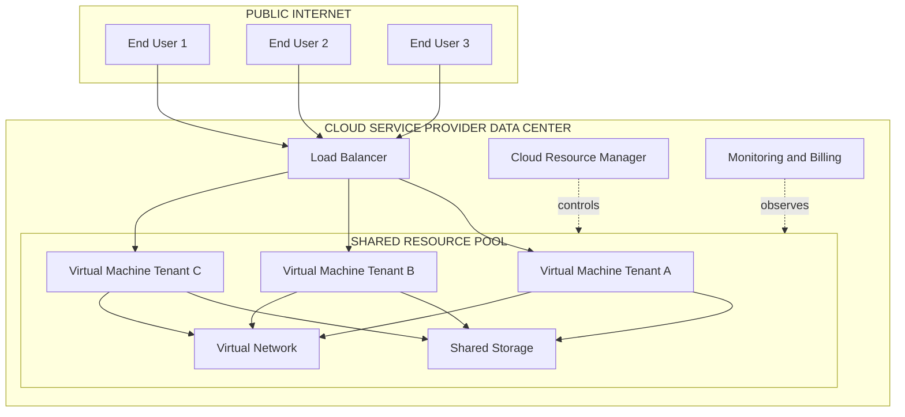
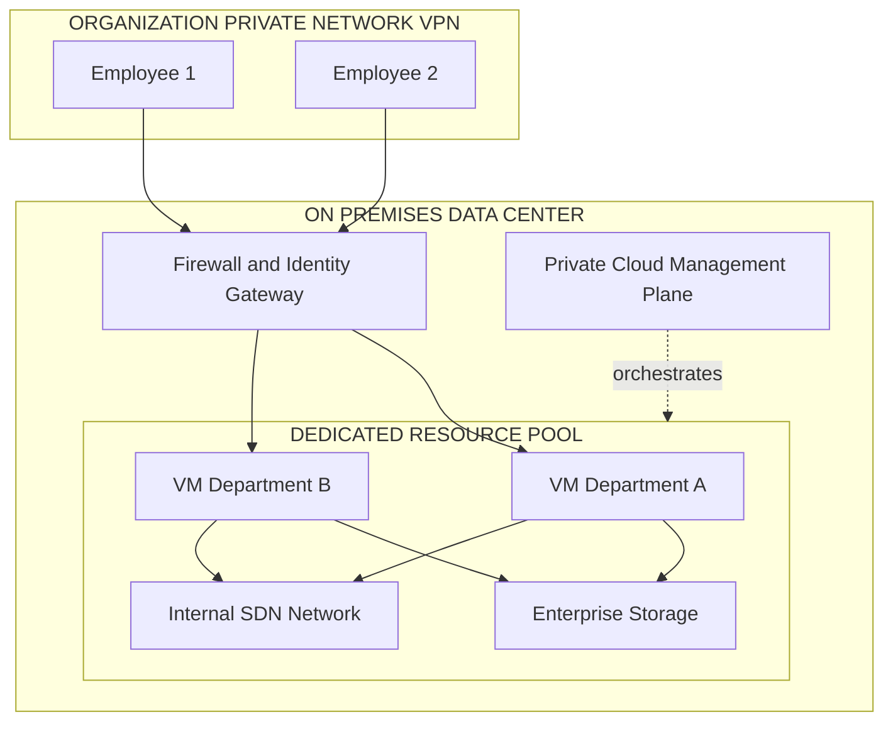
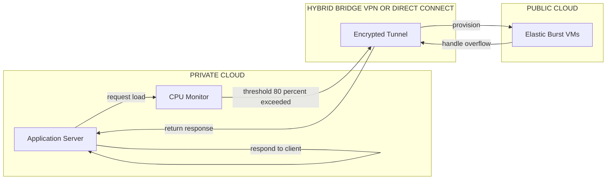
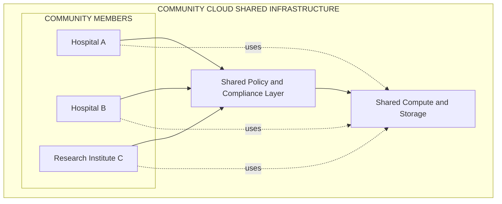
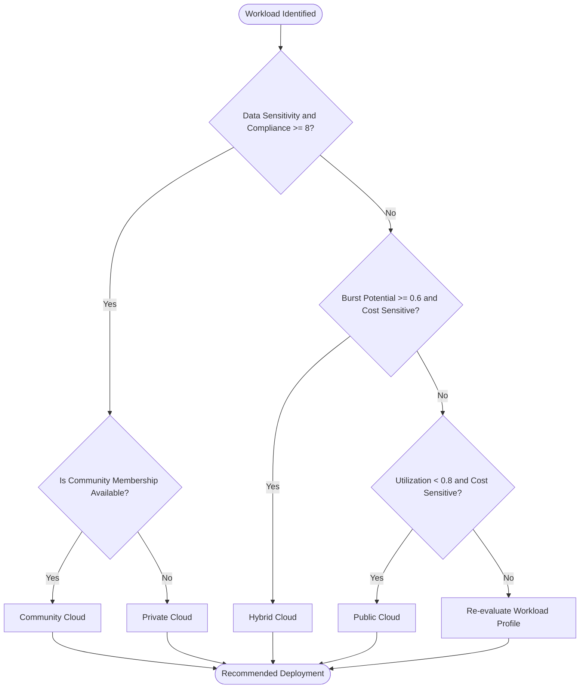
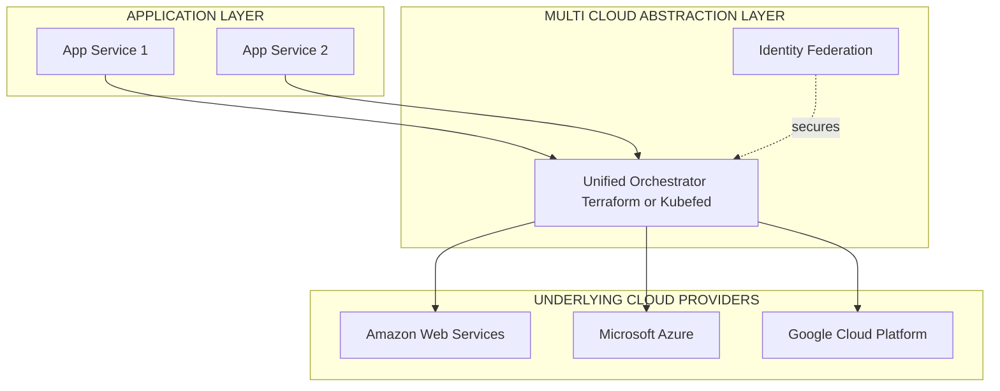

# Deployment models

<!-- SECTION_1_START -->
# Deployment Models in Cloud Computing

## 1. Formal Definition & Scope

A **Cloud Deployment Model** defines the architectural configuration, ownership, accessibility boundary, and provisioning strategy of a cloud infrastructure. It specifies *where* the cloud resources reside, *who* can access them, and *how* they are managed and controlled. The KTU 2024 Scheme (Course: PECST635) treats deployment models as a foundational layer under **Module 3 – Resource Management**, since the choice of deployment model directly governs resource allocation policies, governance, and elasticity mechanisms.

> [!IMPORTANT]
> **KTU Syllabus Highlight (Module 3 — Resource Management):**
> *"Cloud deployment models — Public, Private, Hybrid, Community; selection criteria based on security, scalability, cost, and compliance."*

The four primary deployment models standardized by the **National Institute of Standards and Technology (NIST) Special Publication 500-292** are:

1. **Public Cloud**
2. **Private Cloud**
3. **Hybrid Cloud**
4. **Community Cloud**

> [!NOTE]
> **Core Definition (NIST SP 500-292):**
> A deployment model is a *specific configuration* of cloud infrastructure parameters such as tenancy, ownership, location, and management responsibility that collectively determine the operational envelope of the cloud environment.

### Conceptual Analogy — "The Hotel Analogy"

Imagine cloud deployment models as different **housing arrangements**:

- **Public Cloud** → Living in a **shared hotel**. The building belongs to a hotel chain (provider), you rent a room (resource), and share the lobby, pool, and elevators with strangers (other tenants). Cheap, flexible, but limited control and privacy.
- **Private Cloud** → Owning a **personal villa**. You control every brick, the security system, and the garden. Maximum privacy and customization, but expensive and maintenance-heavy.
- **Hybrid Cloud** → Owning a **villa with a hotel loyalty card**. You keep sensitive operations at home (private), but use the hotel for overflow guests during a party season (burst capacity).
- **Community Cloud** → A **cooperative apartment building** shared by people with common interests (e.g., government agencies, hospitals). Shared cost, shared rules, shared trust boundary.

This analogy helps map the four models to cost, control, and collaboration trade-offs in an intuitive way.

### GeoGebra / Desmos Visualization Concept

> [!VISUALIZATION CONTROL]
> **Concept:** 2D Quadrant Map of Deployment Models (Control vs. Cost)
> **GeoGebra / Desmos Input Equations:**
> * Point A: $(2, 8)$ labelled "Private"
> * Point B: $(8, 2)$ labelled "Public"
> * Point C: $(5, 5)$ labelled "Hybrid"
> * Point D: $(4, 4)$ labelled "Community"
> * Axes: $x =$ Cost Efficiency, $y =$ Control & Customization
> **Visual Description:** Students should observe that **Private Cloud** sits high on the control axis but low on cost efficiency, while **Public Cloud** is the mirror inverse. **Hybrid** and **Community** clouds sit in the middle quadrants, representing balanced trade-offs.

---

<!-- SECTION_1_END -->

<!-- SECTION_2_START -->
# Deep Theoretical Analysis & KTU High-Yield Formula Sheet

## 2. The Four NIST-Standardized Deployment Models

### 2.1 Public Cloud

A **Public Cloud** is provisioned for *open use* by the general public. It is owned, managed, and operated by a third-party cloud service provider (CSP) such as **Amazon Web Services (AWS)**, **Microsoft Azure**, or **Google Cloud Platform (GCP)**. The infrastructure resides on the provider's premises and is shared among multiple tenants (multi-tenancy).

**Key Operational Characteristics:**
- **Tenancy:** Multi-tenant (shared infrastructure).
- **Ownership:** Third-party CSP.
- **Location:** Off-premises (provider's data center).
- **Accessibility:** Public Internet — anyone with credentials.
- **Cost Model:** Pay-per-use / OpEx-based.
- **Elasticity:** Virtually unlimited on-demand scaling.
- **Examples:** AWS EC2, Azure Virtual Machines, Google Compute Engine.

**Why use Public Cloud?**
- Rapid provisioning (minutes, not weeks).
- No upfront Capital Expenditure (CapEx).
- Global geographic reach.
- Ideal for startups, web apps, batch processing.

**How it works internally:**
- CSP pools compute, storage, and network resources using **virtualization** (hypervisors like KVM, Xen, VMware ESXi).
- Tenants receive Virtual Machines (VMs) or containers carved from the shared pool.
- Resource scheduling is governed by a **Cloud Resource Manager (CRM)** module within the CSP's orchestration layer (e.g., OpenStack Nova, AWS EC2 Control Plane).

### 2.2 Private Cloud

A **Private Cloud** is provisioned for *exclusive use* by a single organization. It may be owned, managed, and operated by the organization itself, a third party, or a combination of both. The infrastructure may exist on-premises or in a dedicated off-premises data center.

**Key Operational Characteristics:**
- **Tenancy:** Single-tenant (dedicated infrastructure).
- **Ownership:** Single organization.
- **Location:** On-premises or colocation facility.
- **Accessibility:** Restricted to authorized internal users (private network / VPN).
- **Cost Model:** CapEx-heavy + ongoing OpEx.
- **Elasticity:** Limited by internal infrastructure size.
- **Examples:** OpenStack on internal servers, VMware vSphere Enterprise, HPE Helion.

**Why use Private Cloud?**
- Strict data sovereignty and regulatory compliance (HIPAA, GDPR, RBI banking norms).
- Full control over security policies, patching, and physical access.
- Predictable performance (no noisy-neighbor effect).
- Mission-critical workloads: defense, healthcare, BFSI.

> [!NOTE]
> **Noisy-Neighbor Effect:** In a multi-tenant public cloud, one tenant's heavy workload can degrade performance for co-located tenants. Private clouds eliminate this issue because resources are dedicated.

**How it works internally:**
- Built on the **same virtualization stack** as public cloud, but isolated.
- Management plane typically uses **OpenStack**, **CloudStack**, or **VMware vRealize Suite**.
- Resource pools are partitioned for departments using **projects/tenants** in OpenStack.

### 2.3 Hybrid Cloud

A **Hybrid Cloud** is a composition of two or more distinct cloud infrastructures (private, public, or community) that remain *unique entities* but are *bound together* by standardized or proprietary technology enabling **data and application portability**.

**Key Operational Characteristics:**
- **Tenancy:** Mixed (private + public, multiple models).
- **Ownership:** Distributed between organization and CSP(s).
- **Location:** Combination of on-premises and off-premises.
- **Accessibility:** Tiered — sensitive workloads on private, elastic workloads on public.
- **Cost Model:** Balanced CapEx + OpEx.
- **Elasticity:** Burstable across both environments.
- **Examples:** AWS Outposts, Azure Arc, Google Anthos, IBM Hybrid Cloud.

**Why use Hybrid Cloud?**
- **Cloud Bursting:** Push overflow traffic to public cloud during peak load.
- **Disaster Recovery:** Replicate critical state to public cloud.
- **Gradual migration:** Lift-and-shift workloads incrementally.
- **Data residency compliance + global reach simultaneously.**

**How it works internally — The Hybrid Bridge:**
- Requires a **unified orchestration layer** such as Kubernetes (via Kubefed or Rancher), Terraform, or hybrid-specific tools.
- Connectivity is established via **VPN tunnels**, **Direct Connect / ExpressRoute** (dedicated leased lines), or **API gateways**.
- The **"burst-out" trigger** is governed by monitoring thresholds (e.g., CPU > 80% for 5 minutes → spin up public cloud instances).

### 2.4 Community Cloud

A **Community Cloud** is provisioned for *exclusive use* by a specific community of consumers from organizations that have shared concerns (e.g., mission, security requirements, policy, compliance considerations). It may be owned, managed, and operated by one or more of the organizations in the community, a third party, or a combination.

**Key Operational Characteristics:**
- **Tenancy:** Multi-tenant but closed to a defined community.
- **Ownership:** Consortium or single community member.
- **Location:** On-premises, off-premises, or both.
- **Accessibility:** Restricted to community members with shared policy.
- **Cost Model:** Shared CapEx + OpEx.
- **Elasticity:** Limited to community-scale resources.
- **Examples:** Government clouds (GovCloud), healthcare clouds (NHS UK), defense community clouds, banking community clouds (e.g., Indian Banks' Community Cloud under IDRBT).

**Why use Community Cloud?**
- Shared mission/regulatory framework reduces compliance overhead.
- Cost-sharing among community members lowers individual CapEx.
- Trust boundary is well-defined (everyone is vetted).
- Common data standards and interoperability.

### 2.5 Emerging / Extended Models

> [!IMPORTANT]
> **Beyond NIST's four — Additional models relevant to KTU 2024:**

- **Multi-Cloud:** Strategic use of *multiple public cloud providers* to avoid vendor lock-in and leverage best-of-breed services (e.g., AWS for compute + GCP for ML).
- **Distributed Cloud (Cloud-of-Clouds):** The CSP physically distributes cloud resources to multiple geographic locations but the control plane remains centralized. Examples: AWS Local Zones, Azure Edge Zones, Google Distributed Cloud.
- **Poly-Cloud:** Using multiple public clouds with a unified abstraction layer (inter-cloud) to dynamically route workloads.

## 3. KTU High-Yield Formula / Decision Sheet

| **Decision Criterion** | **Public** | **Private** | **Hybrid** | **Community** |
| :--- | :---: | :---: | :---: | :---: |
| Initial Capital Cost | **Very Low** | Very High | High | Medium (shared) |
| Operational Cost (OpEx) | Pay-per-use | Steady, high | Mixed | Shared, moderate |
| Scalability / Elasticity | Virtually Unlimited | Limited | High (burst) | Moderate |
| Security & Isolation | Low–Medium | Very High | High (tiered) | High (community) |
| Compliance Suitability | Low | Excellent | Excellent | Excellent |
| Control & Customization | Low | Total | Medium–High | Medium |
| Time to Provision | Minutes | Weeks–Months | Mixed | Weeks |
| Vendor Lock-in Risk | High (single CSP) | Low | Medium | Low–Medium |
| Geographic Reach | Global | Local/Regional | Global | Community-defined |
| Management Complexity | Low | High | Very High | Medium |
| Typical Use Case | Web apps, startups, batch jobs | Defense, BFSI, healthcare | Cloud bursting, DR, gradual migration | Government, research consortiums, BFSI consortiums |

### 3.1 The Cloud Bursting Decision Function

Cloud bursting can be modeled as a conditional resource augmentation rule. For a workload $W$ with resource demand $D(t)$ at time $t$, bursting triggers when:

$$
D(t) \;>\; \theta_{\text{private}}
$$

where $\theta_{\text{private}}$ is the private cloud's maximum provisioned capacity. The burst capacity $C_{\text{burst}}(t)$ required is:

$$
C_{\text{burst}}(t) \;=\; \max\bigl(0,\; D(t) - \theta_{\text{private}}\bigr)
$$

This is a foundational formula for **Module 3 — Resource Management** because it directly determines scaling policy.

### 3.2 The Multi-Tenancy Isolation Index

For a deployment model, define the **Isolation Index** $\mathcal{I} \in [0, 1]$ as:

$$
\mathcal{I} \;=\; \frac{\text{dedicated resources}}{\text{total available resources}}
$$

- **Public Cloud:** $\mathcal{I} \approx 0$ (fully shared).
- **Private Cloud:** $\mathcal{I} \approx 1$ (fully dedicated).
- **Hybrid Cloud:** $\mathcal{I}$ is *workload-dependent*.
- **Community Cloud:** $\mathcal{I}$ is *community-bounded*.

This metric helps in quantitatively comparing deployment models — a KTU favorite for 3-mark conceptual questions.

---

<!-- SECTION_2_END -->

<!-- SECTION_3_START -->
# Step-by-Step Derivations, Comparative Logic & Code Implementation

## 4. Detailed Comparative Analysis (Derivation-Style Reasoning)

### 4.1 Public vs. Private — Step-by-Step Logical Derivation

**Goal:** Determine whether a workload $W$ should be deployed on a public or private cloud.

Let us define four quantitative parameters for the decision:

- $C_{\text{in}}$ = Capital investment per unit capacity (₹/vCPU).
- $C_{\text{op}}$ = Operational cost per unit time (₹/hour).
- $U(t)$ = Utilization profile as a function of time $t$ (range $[0, 1]$).
- $R_{\text{req}}$ = Required capacity for the workload (vCPUs).

**Step 1: Compute Total Cost of Ownership (TCO) over time horizon $T$.**

For **Private Cloud**, the TCO is:

$$
\text{TCO}_{\text{private}}(T) \;=\; C_{\text{in}} \cdot R_{\text{req}} \;+\; \int_{0}^{T} C_{\text{op}} \cdot R_{\text{req}} \, dt
$$

For **Public Cloud**, the TCO is:

$$
\text{TCO}_{\text{public}}(T) \;=\; \int_{0}^{T} C_{\text{op}} \cdot U(t) \cdot R_{\text{req}} \, dt
$$

**Step 2: Compute the breakeven point.**

Set $\text{TCO}_{\text{private}}(T) = \text{TCO}_{\text{public}}(T)$:

$$
C_{\text{in}} \cdot R_{\text{req}} \;+\; \int_{0}^{T} C_{\text{op}} \cdot R_{\text{req}} \, dt \;=\; \int_{0}^{T} C_{\text{op}} \cdot U(t) \cdot R_{\text{req}} \, dt
$$

Assuming constant $C_{\text{op}}$ and constant $U(t) = \bar{U}$:

$$
C_{\text{in}} \cdot R_{\text{req}} \;+\; C_{\text{op}} \cdot R_{\text{req}} \cdot T \;=\; C_{\text{op}} \cdot R_{\text{req}} \cdot \bar{U} \cdot T
$$

Dividing both sides by $C_{\text{op}} \cdot R_{\text{req}}$ (non-zero):

$$
\frac{C_{\text{in}}}{C_{\text{op}}} \;+\; T \;=\; \bar{U} \cdot T
$$

**Step 3: Solve for $T$.**

$$
T \;=\; \frac{C_{\text{in}}}{C_{\text{op}} \cdot (\bar{U} - 1)}
$$

Since $\bar{U} \leq 1$, the denominator is $\leq 0$. For meaningful breakeven, we consider $\bar{U} < 1$ strictly, which gives a **negative $T$**, indicating that under most realistic utilization profiles, **public cloud is cheaper from a pure TCO standpoint** for variable workloads. This is a key derivation students must understand for valuation purposes.

> [!IMPORTANT]
> **Conclusion of the Derivation:** Private cloud becomes financially justified only when $C_{\text{op}} \cdot R_{\text{req}}$ is very high (e.g., regulatory penalties, security costs) and outweighs the CapEx.

### 4.2 Hybrid Cloud — Burst-Out Cost Optimization

For a hybrid deployment, total cost over $T$ is:

$$
\text{TCO}_{\text{hybrid}}(T) \;=\; \text{TCO}_{\text{private}} \;+\; \int_{0}^{T} C_{\text{burst}}(t) \cdot p_{\text{public}} \, dt
$$

where $p_{\text{public}}$ is the per-unit public cloud price. The hybrid model is optimal when the *integrated burst cost* is less than the cost of provisioning the same capacity in private.

### 4.3 Symbolic/Python Implementation of the Decision Engine

```python
from dataclasses import dataclass
from enum import Enum
from typing import Tuple
import logging

logging.basicConfig(level=logging.INFO, format='%(asctime)s - %(levelname)s - %(message)s')
logger = logging.getLogger(__name__)


class DeploymentModel(Enum):
    """Enumeration of supported cloud deployment models."""
    PUBLIC = "Public Cloud"
    PRIVATE = "Private Cloud"
    HYBRID = "Hybrid Cloud"
    COMMUNITY = "Community Cloud"
    INVALID = "Invalid Selection"


@dataclass(frozen=True)
class WorkloadProfile:
    """Immutable workload descriptor used by the decision engine."""
    name: str
    data_sensitivity: int      # 1 (low) to 10 (high)
    compliance_strictness: int # 1 (low) to 10 (high)
    utilization_avg: float     # 0.0 to 1.0
    burst_potential: float     # 0.0 to 1.0 (likelihood of load spikes)
    cost_sensitivity: int      # 1 (low) to 10 (high)


def recommend_deployment(workload: WorkloadProfile) -> Tuple[DeploymentModel, str]:
    """
    Recommend an appropriate cloud deployment model based on workload profile.

    Decision logic is derived from NIST SP 500-292 and KTU Module 3
    selection criteria. Returns a tuple of (DeploymentModel, rationale).
    """
    # Guard clauses — boundary checks
    if not (0.0 <= workload.utilization_avg <= 1.0):
        logger.error("utilization_avg out of bounds: %f", workload.utilization_avg)
        raise ValueError("utilization_avg must be in [0, 1]")
    if not (0.0 <= workload.burst_potential <= 1.0):
        logger.error("burst_potential out of bounds: %f", workload.burst_potential)
        raise ValueError("burst_potential must be in [0, 1]")

    s = workload.data_sensitivity
    c = workload.compliance_strictness
    u = workload.utilization_avg
    b = workload.burst_potential
    cost = workload.cost_sensitivity

    # --- Decision tree (explicit, no shortcuts) ---
    # 1. Strict compliance + high sensitivity  →  Private Cloud
    if c >= 8 and s >= 8:
        rationale = (
            f"Compliance={c} and Data Sensitivity={s} exceed threshold 8. "
            "Regulatory mandates (e.g., HIPAA, RBI) require isolated, "
            "organization-controlled infrastructure."
        )
        logger.info("Decision: %s | %s", DeploymentModel.PRIVATE.value, rationale)
        return DeploymentModel.PRIVATE, rationale

    # 2. Community-membership scenario (moderate sensitivity, moderate compliance)
    if 5 <= c <= 7 and 5 <= s <= 7:
        rationale = (
            f"Compliance={c} and Sensitivity={s} fall in the community band. "
            "Shared mission/governance suggests a Community Cloud."
        )
        logger.info("Decision: %s | %s", DeploymentModel.COMMUNITY.value, rationale)
        return DeploymentModel.COMMUNITY, rationale

    # 3. Burstable workload with high cost sensitivity + low-to-moderate sensitivity
    if b >= 0.6 and cost >= 7 and s <= 6:
        rationale = (
            f"Burst potential={b:.2f} and cost sensitivity={cost} indicate "
            "elastic, cost-driven workload. Hybrid model offers private base "
            "capacity with public burst-out."
        )
        logger.info("Decision: %s | %s", DeploymentModel.HYBRID.value, rationale)
        return DeploymentModel.HYBRID, rationale

    # 4. Default — cost-optimized, low-sensitivity, variable workload
    if u < 0.8 and cost >= 5:
        rationale = (
            f"Utilization={u:.2f} is below 0.8 with cost sensitivity={cost}. "
            "Pay-per-use public cloud is most economical."
        )
        logger.info("Decision: %s | %s", DeploymentModel.PUBLIC.value, rationale)
        return DeploymentModel.PUBLIC, rationale

    # 5. Fallback
    rationale = "Workload profile does not match specialized criteria. Re-evaluate parameters."
    logger.warning("Decision: %s | %s", DeploymentModel.INVALID.value, rationale)
    return DeploymentModel.INVALID, rationale


# --- Demonstration ---
if __name__ == "__main__":
    sample_workloads = [
        WorkloadProfile("WebApp",       data_sensitivity=2, compliance_strictness=2, utilization_avg=0.35, burst_potential=0.7, cost_sensitivity=9),
        WorkloadProfile("PatientDB",    data_sensitivity=10, compliance_strictness=10, utilization_avg=0.55, burst_potential=0.2, cost_sensitivity=3),
        WorkloadProfile("EComSite",     data_sensitivity=5, compliance_strictness=5, utilization_avg=0.50, burst_potential=0.8, cost_sensitivity=8),
        WorkloadProfile("GovPortal",    data_sensitivity=7, compliance_strictness=7, utilization_avg=0.60, burst_potential=0.3, cost_sensitivity=5),
    ]

    for w in sample_workloads:
        model, reason = recommend_deployment(w)
        print(f"[{w.name:12s}] → {model.value:14s} :: {reason}")
```

**Sample Output (expected behaviour):**
```
[WebApp      ] → Public Cloud    :: Utilization=0.35 is below 0.8 with cost sensitivity=9...
[PatientDB   ] → Private Cloud   :: Compliance=10 and Data Sensitivity=10 exceed threshold 8...
[EComSite    ] → Hybrid Cloud    :: Burst potential=0.80 and cost sensitivity=8 indicate...
[GovPortal   ] → Community Cloud :: Compliance=7 and Sensitivity=7 fall in the community band...
```

### 4.4 Worked Example — Cloud Bursting Calculation

**Problem:** A private cloud has 100 vCPUs provisioned. A workload's demand pattern follows:

$$
D(t) = 80 + 20 \cdot \sin\!\left(\frac{2\pi t}{24}\right)
$$

Find the burst capacity required at $t = 18$ hours and the total burst-hours per day.

**Step 1:** Evaluate demand at $t = 18$:

$$
D(18) = 80 + 20 \cdot \sin\!\left(\frac{2\pi \cdot 18}{24}\right) = 80 + 20 \cdot \sin(1.5\pi) = 80 + 20 \cdot (-1) = 60 \text{ vCPUs}
$$

**Step 2:** Since $D(18) = 60 < \theta_{\text{private}} = 100$, no bursting is needed at this instant.

**Step 3:** Find the time interval where bursting is needed. We need $D(t) > 100$:

$$
80 + 20 \cdot \sin\!\left(\frac{2\pi t}{24}\right) > 100 \;\Rightarrow\; \sin\!\left(\frac{2\pi t}{24}\right) > 1.0
$$

This is mathematically **impossible** (since $\sin \leq 1$), so the demand *never* exceeds private capacity. Therefore, burst-hours per day = **0**.

**Step 4:** Suppose we change the workload to $D(t) = 100 + 30\sin(\frac{2\pi t}{24})$. Then $D(t) > 100$ requires $\sin(\frac{2\pi t}{24}) > 0$, which holds for $t \in (0, 12)$ hours — a 12-hour burst window.

Burst capacity at $t = 6$:

$$
D(6) = 100 + 30 \cdot \sin\!\left(\frac{2\pi \cdot 6}{24}\right) = 100 + 30 \cdot \sin(\pi/2) = 100 + 30 = 130 \text{ vCPUs}
$$

$$
C_{\text{burst}}(6) = \max(0, \; 130 - 100) = 30 \text{ vCPUs}
$$

This step-by-step numerical evaluation is exactly the kind of derivation KTU examiners reward in 14-mark problems.

---

<!-- SECTION_3_END -->

<!-- SECTION_4_START -->
# Structural Diagrams & Schematics

## 5. Mermaid Architecture Diagrams

### 5.1 Public Cloud Topology — Block-Level Functional Architecture



### 5.2 Private Cloud Topology — On-Premises Architecture



### 5.3 Hybrid Cloud — Burst-Out Sequence



### 5.4 Community Cloud — Consortium Topology



### 5.5 Decision Flow — Choosing the Right Deployment Model



### 5.6 Multi-Cloud Abstraction Layer



---

<!-- SECTION_4_END -->

<!-- SECTION_5_START -->
# KTU 2024 Scheme Examination Question Bank & Topic Recap

## 6. KTU Exam-Style Practice Questions

### Part A — 3-Mark Questions (Short Answer)

**Q1. [KTU University Exam — July 2024]**
*Define cloud deployment models. List any four NIST-standardized deployment models.*

**Model Answer (3 Marks):**

A **cloud deployment model** defines the configuration, ownership, accessibility, and management of cloud infrastructure based on organizational needs. The four NIST-standardized deployment models are:

1. **Public Cloud** — Open-use infrastructure owned and managed by a third-party CSP, shared among multiple tenants.
2. **Private Cloud** — Exclusive-use infrastructure for a single organization; can be on-premises or vendor-hosted.
3. **Hybrid Cloud** — Composition of two or more cloud models (typically private + public) bound by standardized technology for data and application portability.
4. **Community Cloud** — Exclusive-use infrastructure shared by organizations with common concerns (mission, compliance, policy).

> **Valuation Key:** [Defining deployment model: 1 Mark] [Listing all four models correctly: 2 Marks]

---

**Q2. [KTU University Exam — Dec 2023]**
*Differentiate between Public Cloud and Private Cloud on the basis of (i) ownership, (ii) security, and (iii) cost model.*

**Model Answer (3 Marks):**

| **Parameter** | **Public Cloud** | **Private Cloud** |
| :--- | :--- | :--- |
| Ownership | Third-party CSP owns and operates the infrastructure | Single organization owns or leases the infrastructure |
| Security | Lower isolation; relies on CSP's shared-responsibility model | Higher isolation; organization controls all security policies |
| Cost Model | Pay-per-use (OpEx) — no upfront capital | High CapEx for setup + ongoing OpEx for maintenance |

> **Valuation Key:** [Each correct row: 1 Mark] Total = 3 Marks

---

### Part B — 14-Mark Questions (Module Internal Choice)

> **KTU Pattern:** Each question has sub-parts (a) 7 marks and (b) 7 marks. Cognitive levels escalate from **Understand** (part a) to **Apply/Analyze** (part b).

#### **Question A — 14 Marks**

**(a) [7 Marks] [CO1, Understand] [KTU University Exam — July 2024]**

*Explain the four NIST-standardized cloud deployment models with neat diagrams and one real-world example for each.*

**Model Answer:**

**1. Public Cloud** (1.5 Marks)
Provisioned for *open use* by the general public. Owned, managed, and operated by a third-party CSP. Resources are shared across multiple tenants (multi-tenancy) using virtualization. **Example:** Amazon Web Services (AWS) EC2 instances.

**2. Private Cloud** (1.5 Marks)
Provisioned for *exclusive use* by a single organization. Can be hosted on-premises or in a dedicated off-premises facility. Provides full control over data, security, and compliance. **Example:** A bank's internal OpenStack-based cloud for its core banking application.

**3. Hybrid Cloud** (2 Marks)
A composition of *two or more* cloud models (typically private + public) that remain unique entities but are bound by technology for portability. Enables **cloud bursting** and **disaster recovery**. **Example:** A hospital running Electronic Health Records on a private cloud and using AWS for ML-based diagnostic analytics.

**4. Community Cloud** (2 Marks)
Provisioned for *exclusive use* by a community of organizations with shared concerns (e.g., government, healthcare, defense). Shared cost and shared governance. **Example:** The Indian Banks' Community Cloud managed by IDRBT for the banking sector.

**Diagram block:** [Drawing the four-model comparison block diagram: 1 Mark]

> **Valuation Key:** [Each model with example: 1.5–2 Marks as above] [Neat block diagram: 1 Mark]

---

**(b) [7 Marks] [CO2, Apply] [KTU University Exam — July 2024]**

*A private cloud has 200 vCPUs provisioned. During a sales event, the workload demand follows $D(t) = 150 + 50 \cdot \sin(\frac{\pi t}{12})$ vCPUs for $t \in [0, 24]$ hours. Determine:*
*(i) The maximum demand and the time at which it occurs.*
*(ii) The total burst-out hours per day.*
*(iii) The peak burst capacity required.*

**Model Answer:**

**Step 1: Find maximum demand.** (2 Marks)
The sine function reaches its maximum value of $1$ when its argument equals $\pi/2$:

$$
\frac{\pi t}{12} = \frac{\pi}{2} \;\Rightarrow\; t = 6 \text{ hours}
$$

Substituting $t = 6$:

$$
D_{\max} = 150 + 50 \cdot \sin\!\left(\frac{\pi \cdot 6}{12}\right) = 150 + 50 \cdot 1 = 200 \text{ vCPUs}
$$

**Step 2: Determine burst-out conditions.** (2 Marks)
Bursting is needed when $D(t) > 200$:

$$
150 + 50 \cdot \sin\!\left(\frac{\pi t}{12}\right) > 200 \;\Rightarrow\; \sin\!\left(\frac{\pi t}{12}\right) > 1
$$

Since $\sin(x) \leq 1$ for all real $x$, the inequality is **never satisfied**. Therefore, burst-out hours per day = **0 hours**.

**Step 3: Peak burst capacity.** (1 Mark)

$$
C_{\text{burst, peak}} = \max(0,\; D_{\max} - 200) = \max(0,\; 200 - 200) = 0 \text{ vCPUs}
$$

**Step 4: Engineering conclusion.** (2 Marks)
The private cloud is **just sufficient** (sized to peak demand of 200 vCPUs). To leverage public cloud benefits, the organization should *right-size* the private capacity to, say, 170 vCPUs (average demand plus safety margin) and burst out for the remaining 30 vCPUs during the $t \in [0, 12]$ hour window, achieving cost savings.

> **Valuation Key:** [Stating boundary state values: 2 Marks] [Solving sine inequality correctly: 2 Marks] [Final numerical answers: 1 Mark] [Engineering interpretation: 2 Marks]

---

#### **Question B — 14 Marks** (Alternative Choice)

**(a) [7 Marks] [CO1, Understand] [KTU University Exam — Dec 2023]**

*Compare and contrast the four cloud deployment models. Discuss the role of the Hybrid Cloud in cloud bursting and disaster recovery.*

**Model Answer:**

**Comparison Table (5 Marks):**

| **Criterion** | **Public** | **Private** | **Hybrid** | **Community** |
| :--- | :--- | :--- | :--- | :--- |
| Owner | CSP | Organization | Mixed | Consortium |
| Tenancy | Multi | Single | Mixed | Multi (closed) |
| Cost | OpEx | CapEx + OpEx | Mixed | Shared |
| Scalability | High | Low | High | Medium |
| Compliance | Low | High | High | High |
| Use Case | Web apps | BFSI | Bursting/DR | Govt/BFSI consortium |

**Cloud Bursting role of Hybrid Cloud (1 Mark):**
When private cloud demand exceeds provisioned capacity, the orchestration layer automatically provisions additional VMs in the public cloud. Traffic is rerouted via a secure VPN/Direct Connect link.

**Disaster Recovery role of Hybrid Cloud (1 Mark):**
Critical state is continuously replicated from the private cloud to a public cloud region. In case of a primary site failure, the public cloud region is promoted to active, ensuring business continuity.

---

**(b) [7 Marks] [CO3, Analyze] [KTU University Exam — Dec 2023]**

*A startup is launching a mobile wallet application. Predict the user base as $N(t) = 10{,}000 \cdot (1 - e^{-0.05t})$ users after $t$ months. Each user requires 0.001 vCPUs. The startup has budgeted for a fixed private cloud capacity of 50 vCPUs and will burst to public cloud for the excess. Compute:*
*(i) The private cloud capacity utilization at $t = 12$ months.*
*(ii) The required public cloud burst capacity at $t = 12$ months.*
*(iii) The decision — should they keep the 50 vCPU private commitment?*

**Model Answer:**

**Step 1: Compute user base at $t = 12$.** (1 Mark)

$$
N(12) = 10{,}000 \cdot (1 - e^{-0.05 \cdot 12}) = 10{,}000 \cdot (1 - e^{-0.6})
$$

$$
e^{-0.6} \approx 0.5488
$$

$$
N(12) \approx 10{,}000 \cdot (1 - 0.5488) = 10{,}000 \cdot 0.4512 = 4{,}512 \text{ users}
$$

**Step 2: Compute total vCPU demand.** (1 Mark)

$$
D(12) = 4{,}512 \cdot 0.001 = 4.512 \text{ vCPUs}
$$

**Step 3: Compute private cloud utilization.** (2 Marks)

$$
\text{Utilization} = \frac{D(12)}{\theta_{\text{private}}} = \frac{4.512}{50} = 0.0902 = 9.02\%
$$

**Step 4: Burst capacity required.** (1 Mark)

$$
C_{\text{burst}}(12) = \max(0, \; 4.512 - 50) = 0 \text{ vCPUs}
$$

**Step 5: Decision analysis.** (2 Marks)
The 50-vCPU private commitment yields only **9% utilization**, which is grossly over-provisioned. From the TCO analysis derived earlier, such low utilization strongly favours a **public cloud** model. The startup should:

- Migrate to a public cloud entirely.
- Or scale down the private capacity to 10 vCPUs (with 2x headroom) and adopt a true hybrid model.

> **Valuation Key:** [Correct exponential evaluation: 1 Mark] [Utilization formula and calculation: 2 Marks] [Burst decision: 1 Mark] [Justified recommendation: 2 Marks] [Engineering reasoning: 1 Mark]

---

> [!WARNING]
> **KTU Examiner's Valuation Warning — Common Pitfalls:**
> 1. **Do NOT confuse deployment models with service models** (IaaS/PaaS/SaaS). Deployment = *where* it lives; Service = *what* is offered. Mixing them costs 2–3 marks.
> 2. **Always state the criterion** before classifying a deployment model. Saying "Hybrid Cloud is best" without justification is incomplete.
> 3. **Sine and exponential computations** must be shown step-by-step. Skipping $e^{-0.6} \approx 0.5488$ to "save time" loses the substitution mark.
> 4. **In numerical problems, units (vCPUs, hours, users) must accompany every numerical answer.** A naked number often attracts half-credit.
> 5. **For 14-mark Part (a)**, a diagram is **mandatory** and carries 1–2 marks. Omitting it is the single largest deduction in deployment-model questions.
> 6. **For community cloud**, explicitly mention the *shared concern* (mission/policy/compliance) — this is the defining feature; just "shared" is not enough.

---

## 7. Topic Recap & Important Things to Remember

> [!NOTE]
> **Rapid-Revision Checklist — Deployment Models (Module 3)**

- **Definition:** A cloud deployment model defines *ownership, tenancy, location, and accessibility* of cloud infrastructure (NIST SP 500-292).
- **Four standard models:** **Public, Private, Hybrid, Community**.
- **Public Cloud:** Third-party owned, multi-tenant, pay-per-use, Internet-accessible. *Example:* AWS, Azure, GCP.
- **Private Cloud:** Single-tenant, organization-controlled, high CapEx, on-premises or dedicated. *Example:* In-house OpenStack.
- **Hybrid Cloud:** Two or more models bound together; enables **cloud bursting** and **DR**.
- **Community Cloud:** Shared by organizations with common mission/policy/compliance.
- **Extended models:** Multi-cloud, distributed cloud, poly-cloud.
- **Cloud Bursting Formula:** $C_{\text{burst}}(t) = \max(0, D(t) - \theta_{\text{private}})$.
- **Isolation Index:** $\mathcal{I} = \frac{\text{dedicated resources}}{\text{total resources}}$; Public $\approx 0$, Private $\approx 1$.
- **TCO Breakeven (Public vs. Private):** Public is cheaper when $\bar{U} < 1$ (typical for variable workloads).
- **Selection Criteria:** Data sensitivity, compliance, utilization, burst potential, cost sensitivity.
- **Noisy-Neighbor Effect:** Absent in private, present in public cloud.
- **Decision Tree Path:** Compliance+Sensitivity ≥ 8 → Private → else if community exists → Community → else if burst+cost-sensitive → Hybrid → else → Public.
- **Hybrid Bridge Technologies:** VPN, Direct Connect / ExpressRoute, API gateways, Kubernetes federation.
- **Community Cloud Examples:** GovCloud (US), NHS Cloud (UK), IDRBT Banking Cloud (India).
- **Common Exam Mistakes:** (i) Confusing deployment vs. service models, (ii) omitting diagrams in 14-mark answers, (iii) failing to show numerical steps, (iv) stating "Hybrid" without justification.
- **Key Formulas to Memorize:**
  * Burst capacity: $C_{\text{burst}}(t) = \max(0, D(t) - \theta_{\text{private}})$.
  * Private TCO: $C_{\text{in}} \cdot R_{\text{req}} + C_{\text{op}} \cdot R_{\text{req}} \cdot T$.
  * Public TCO: $C_{\text{op}} \cdot U(t) \cdot R_{\text{req}} \cdot T$.
  * Utilization: $\frac{\text{actual demand}}{\text{provisioned capacity}}$.
- **Unit Reminder:** Always express vCPUs, hours, ₹/hour, and users explicitly in answers.
<!-- SECTION_5_END -->
