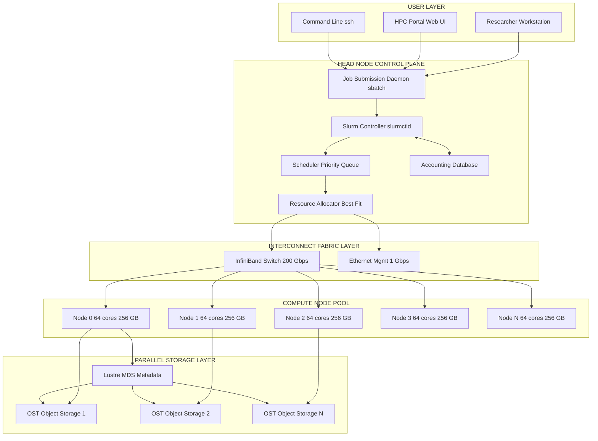
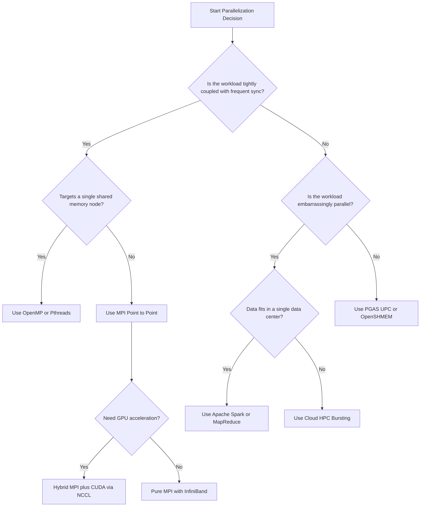
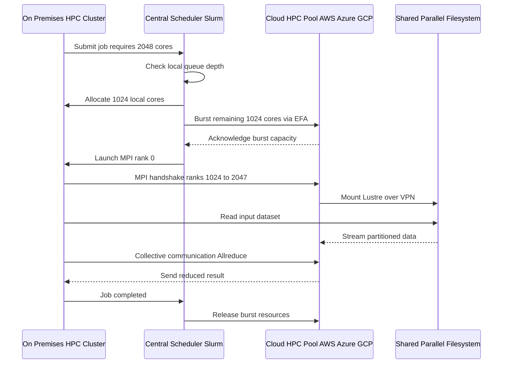

# High performance Computing Models.

<!-- SECTION_1_START -->
# High Performance Computing Models — Core Technical Definition & Intuitive Overview

## Formal Academic Definition (KTU 2024 Syllabus Terminology)

> [!IMPORTANT]
> **High Performance Computing (HPC)** refers to the aggregation of computing power and storage capacity to solve advanced problems across science, engineering, and business domains at speeds and scales far beyond the capability of a conventional desktop or workstation. In the context of Cloud Computing, **HPC Models** denote the architectural and programming abstractions that enable massively parallel, distributed, and coordinated execution of workloads over heterogeneous resources (CPUs, GPUs, FPGAs, low-latency interconnects).

The three canonical pillars taught under the KTU PECST635 Module 3 framework are:

1. **Cluster Computing Model** — A tightly coupled set of commodity compute nodes connected via a high-speed **Local Area Network (LAN)** with a single system image.
2. **Grid Computing Model** — A loosely coupled, geographically distributed federation of heterogeneous resources coordinated via middleware for *non-interactive* workloads.
3. **Supercomputing / MPP Model** — A single, monolithic system housing thousands of processors coupled through custom, ultra-low-latency interconnects (e.g., **InfiniBand** with sub-microsecond latency).

> [!NOTE]
> **HPC vs HTC (High Throughput Computing):** HPC optimizes for *time-to-solution* of a single large problem (low latency, tight coupling), whereas HTC (e.g., SETI@home) harvests idle cycles across the Internet for throughput-oriented, embarrassingly parallel tasks. KTU examiners frequently test this contrast.

## Conceptual Analogy — The "Cooking Brigade" Model

Imagine a banquet kitchen preparing dinner for 5,000 guests:

| Model | Kitchen Analogy | Resource Topology |
|---|---|---|
| **Cluster** | One large professional kitchen with 64 chefs, a shared pantry, and a head chef coordinating. | Homogeneous nodes, single LAN, centralized scheduler |
| **Grid** | A network of 12 independent restaurants across a city, each donating one dish. | Heterogeneous sites, WAN, decentralized middleware |
| **MPP / Supercomputer** | A single Michelin-star kitchen with 10,000 sous-chefs, conveyor belts, and a master clock. | Massively parallel, custom interconnect, shared-nothing |
| **Cloud HPC** | Renting a temporary mega-kitchen on-demand, scaling to 10,000 chefs during the event. | Virtualized HPC cluster on elastic cloud infrastructure |

The "speed" of cooking (problem solving) depends on three things: **how many chefs** (compute), **how fast the head chef gives instructions** (interconnect latency), and **how shared ingredients are** (memory model).

## Core Performance Metrics (KTU Board-Weightage Terms)

- **FLOPS** — *Floating-Point Operations Per Second* (the **HPC yardstick**). Modern systems are rated in **PetaFLOPS ($10^{15}$)** or **ExaFLOPS ($10^{18}$)**.
- **Latency** — Time to initiate a single communication, measured in **microseconds (μs)**. Cluster LAN: ~10–100 μs, InfiniBand: ~1–5 μs.
- **Bandwidth** — Volume of data moved per second, measured in **GB/s**.
- **Speedup $S(n)$** — Ratio of serial execution time to parallel execution time on $n$ processors.
- **Efficiency $E(n)$** — Speedup divided by $n$, $E(n) = S(n)/n$.
- **Amdahl's Law** — Theoretical upper bound on speedup as a function of the serial fraction $f$.

> [!TIP]
> **KTU High-Yield Constant:** Always quote the **FLOPS** unit and the **Amdahl serial fraction** $f$ explicitly. Examiners allocate 1 mark for "stating the metric" before the computation.

## GeoGebra / Desmos Visualization Block

> [!VISUALIZATION CONTROL]
> **Concept:** Amdahl's Law — Speedup curve as a function of parallel fraction
> **GeoGebra / Desmos Input Equations:**
> * `f(x) = 1 / ((1 - x) + x / n)` where `x` = parallel fraction (slider 0 to 1), `n` = number of processors (slider 1 to 1000)
> **Visual Description:** A hyperbolic curve that **flattens as $x \to 1$** but never reaches $n$. Observe that even with $n=1000$ cores, a 5% serial portion caps speedup at $\approx 20\times$. This is the *Achilles' heel* of HPC scaling.

<!-- SECTION_1_END -->

<!-- SECTION_2_START -->
# Deep Theoretical Analysis & KTU High-Yield Formula Sheet

## 2.1 Hierarchical HPC Architecture Stack

A modern HPC model is conceptualized as **six logical layers**, each representing a distinct abstraction over the hardware:

- **L1 — Hardware Layer:** Compute nodes (multi-core CPUs, GPUs, accelerators), memory hierarchy, storage tier (NVMe, Lustre, GPFS), and the **interconnect fabric**.
- **L2 — System Software Layer:** Operating system (often Linux), device drivers, kernel-bypass libraries (e.g., **DPDK**), and RDMA primitives.
- **L3 — Resource Management Layer (the focal point of KTU Module 3):** Schedulers, queue managers, and resource allocators (e.g., **Slurm, PBS Pro, LSF, Torque, Kubernetes** for cloud-HPC).
- **L4 — Programming Model Layer:** Parallel abstractions — **MPI, OpenMP, CUDA, OpenCL, MapReduce, Spark RDD**.
- **L5 — Application Layer:** Domain-specific scientific codes (CFD, genomics, climate simulation).
- **L6 — User / Visualization Layer:** Job submission portals, dashboards.

> [!NOTE]
> **KTU Board Insight:** Module 3 *Resource Management* is the **L3 layer**. Always answer "which resource manager handles this?" — for a cluster: Slurm; for cloud: Kubernetes; for grid: Condor/Globus.

## 2.2 Detailed Model Anatomy

### 2.2.1 Cluster Computing Model

A **Beowulf cluster** is the canonical pattern, comprising:

- **Head node** (master) — runs the scheduler and serves as the single point of job entry.
- **Compute nodes** (slaves) — execute the parallel jobs, typically diskless or with local scratch.
- **Interconnect** — Gigabit Ethernet (basic), InfiniBand (production HPC), or Omni-Path (Intel).
- **Storage** — Parallel file system (**Lustre, GPFS/PowerScale, BeeGFS**) for shared high-IO access.

The cluster exhibits the **Single System Image (SSI)** property: users perceive a single, unified machine even though it is physically distributed.

### 2.2.2 Grid Computing Model

A grid is a **virtual organization (VO)** of geographically dispersed, administratively independent resources. The middleware stack (often built on **Globus Toolkit**) provides:

- **Security** — Grid Security Infrastructure (**GSI**) with X.509 proxy certificates.
- **Information Services** — **MDS (Monitoring and Discovery Service)** for resource advertisement.
- **Resource Management** — **GRAM (Grid Resource Allocation Manager)** with **RSL (Resource Specification Language)**.
- **Data Management** — **GridFTP** for parallel, secured bulk transfer.

The defining triad of grid characteristics is captured by the **Ian Foster Checklist**:

> [!IMPORTANT]
> **Foster's Three-Point Test for a Grid:**
> 1. Coordinates resources that are **not subject to centralized control** (decentralized).
> 2. Uses **standard, open, general-purpose protocols and interfaces**.
> 3. Delivers **nontrivial quality of service** — complex coordination, security, policy.

If any one of these is missing, it is **not** a grid.

### 2.2.3 MPP / Supercomputer Model

A **Massively Parallel Processor (MPP)** system physically separates memory between nodes (NUMA or NORMA architectures), and communication happens via **message passing only** (no shared memory). The **TOP500** list benchmarks the world's most powerful MPPs using **LINPACK (HPL)**.

The **HPL equation** (the metric used to rank TOP500 systems):

$$R_{\max} = \frac{2 \cdot N^3 / 3 + N^2 + N / 6}{T_{\text{exec}}}$$

where $N$ is the matrix order and $T_{\text{exec}}$ is the execution time in seconds. The numerator is the **exact flop count** of Gaussian elimination without pivoting.

### 2.2.4 Cloud-HPC Hybrid Model

The contemporary "HPC in the Cloud" pattern leverages **virtualized HPC clusters** (e.g., AWS HPC, Azure HBv3, Google Cloud HPC Toolkit) where bare-metal instances are interconnected with low-latency fabrics like **Elastic Fabric Adapter (EFA)**. Bursting from on-premises HPC to cloud is called **HPC Hybrid Bursting**.

## 2.3 Parallel Programming Models (the M in HPC)

| Model | Memory View | Coupling | KTU-Favorite Use Case |
|---|---|---|---|
| **Pthreads / OpenMP** | Shared | Tight (single node) | Multi-core CPU parallelization |
| **MPI (Message Passing Interface)** | Distributed | Tight (cluster/MPI) | Canonical cluster programming |
| **MapReduce / Spark** | Distributed | Loose (data-parallel) | Big data on commodity clusters |
| **CUDA / OpenCL** | Hybrid (host + device) | Tight (GPU) | AI training, simulation kernels |
| **OpenSHMEM / PGAS (UPC, Co-array Fortran)** | Partitioned Global Address Space | Tight (one-sided RMA) | Low-overhead HPC codes |

> [!NOTE]
> **MPI + OpenMP hybrid** is the dominant production pattern — MPI for inter-node, OpenMP for intra-node. Always mention this when justifying production HPC stacks.

## 2.4 KTU Formula Sheet / Cheat Sheet

| # | Concept | Formula | Boundary / Limit | Unit |
|---|---|---|---|---|
| 1 | Amdahl's Speedup | $S(n) = \dfrac{1}{(1 - f) + \dfrac{f}{n}}$ | $S(\infty) = \dfrac{1}{1-f}$ | dimensionless |
| 2 | Gustafson's Scaled Speedup | $S_{\text{scaled}}(n) = n - f(n - 1)$ | Linear in $n$ for fixed $f$ | dimensionless |
| 3 | Karp-Flatt Metric (parallelism residual) | $e(n) = \dfrac{\dfrac{1}{S(n)} - \dfrac{1}{n}}{1 - \dfrac{1}{n}}$ | $e \to 0$ means excellent scaling | dimensionless |
| 4 | HPL Peak Performance (LINPACK) | $R_{\max} = \dfrac{2N^3/3 + N^2 + N/6}{T_{\text{exec}}}$ | $R_{\text{peak}} = n \cdot f_{\text{clock}} \cdot \text{FLOPs/cycle}$ | FLOPS |
| 5 | Efficiency | $E(n) = \dfrac{S(n)}{n}$ | $0 < E(n) \le 1$ | dimensionless |
| 6 | Cost | $C(n) = n \cdot S(n)$ | Ideal $C(n) = 1$ | time-units |
| 7 | Iso-efficiency | $W(n) = \mathcal{O}(E^{-1}(n))$ | For PRAM: $W = \mathcal{O}(n \log n)$ | work units |
| 8 | MTTF (Cluster reliability) | $MTTF_{\text{cluster}} = \dfrac{MTTF_{\text{node}}}{n}$ | Failure rate $\lambda_{\text{total}} = n \cdot \lambda_{\text{node}}$ | seconds |
| 9 | Interconnect Latency (rule of thumb) | $L_{\text{cluster}} \approx 10-100 \ \mu s$ | $L_{\text{InfiniBand}} \approx 1-5 \ \mu s$ | microseconds |
| 10 | GPU Occupancy | $\text{Occupancy} = \dfrac{\text{Active Warps}}{\text{Max Warps per SM}}$ | $0 \le \text{Occupancy} \le 1$ | ratio |

> [!WARNING]
> **KTU Exam Pitfall:** Students often write $S(n) = \dfrac{n}{1 + f(n-1)}$ — the *correct* denominator is $(1-f) + f/n$, **not** $1 + f(n-1)$. These are NOT equivalent. Always expand and verify.

## 2.5 Engineering Real-World Utility

- **CFD (Computational Fluid Dynamics)** at Airbus and Boeing runs on cluster HPC with MPI for aircraft aerodynamic simulation.
- **Genomics & Drug Discovery** uses MPI + CUDA hybrid clusters (e.g., AlphaFold inference) for protein folding — the 2024 Nobel-Chemistry workload.
- **Climate Modeling** at the Max Planck Institute uses 100,000+ MPI ranks on the DKRZ supercomputer.
- **Financial Risk Analytics** (Monte Carlo) leverages HPC clouds (AWS HPC) for option pricing under Black-Scholes.
- **AI/ML Training** of foundation models (GPT, LLaMA) is essentially HPC — distributed data parallel + tensor parallel on GPU clusters via **NCCL**.

<!-- SECTION_2_END -->

<!-- SECTION_3_START -->
# Step-by-Step Derivations, Algorithmic Implementation & Worked Examples

## 3.1 Derivation 1 — Amdahl's Law (KTU 2024 Board Favorite)

**Statement:** For a program with parallel fraction $f$ executed on $n$ processors, the speedup is bounded by

$$S(n) = \frac{T_{\text{serial}}}{T_{\text{parallel}}}$$

**Step-by-step proof:**

Let the total serial execution time on a single processor be $T = 1$ (normalized). Decompose the workload into two mutually exclusive parts:

- The **inherently serial fraction** $(1 - f) \cdot T$ — cannot be parallelized.
- The **parallel fraction** $f \cdot T$ — perfectly divisible across $n$ processors, taking $f \cdot T / n$ time.

Thus,

$$T_{\text{parallel}} = (1 - f) \cdot T + \frac{f \cdot T}{n}$$

Dividing $T$ by $T_{\text{parallel}}$:

$$S(n) = \frac{T}{(1 - f) \cdot T + \dfrac{f \cdot T}{n}}$$

Cancel $T$ (assuming $T \neq 0$):

$$S(n) = \frac{1}{(1 - f) + \dfrac{f}{n}}$$

**Limiting case** ($n \to \infty$, i.e., infinite processors):

$$S_{\infty} = \lim_{n \to \infty} \frac{1}{(1 - f) + \dfrac{f}{n}} = \frac{1}{1 - f}$$

This is the **absolute upper bound** — no amount of hardware can overcome a serial bottleneck. **Implication for HPC design:** minimize $f$ by refactoring I/O, synchronization, and data dependencies.

## 3.2 Derivation 2 — Gustafson's Scaled Speedup (Counter to Amdahl)

**Premise:** Amdahl assumes a *fixed problem size*. Gustafson observes that in practice, parallelists solve *larger* problems on more machines. Let $T_s$ be the serial time on one processor and $T_p$ the parallel time on $n$ processors.

**Workload model:**

$$T_p = (1 - f) \cdot T_s + \frac{f \cdot T_s}{n}$$

The equivalent serial time of the *scaled* problem is:

$$T'_s = (1 - f) \cdot T_s + f \cdot T_s = T_s \quad \text{(since the work scales to fill the machine)}$$

Wait — a more rigorous formulation: on $n$ processors, the parallel runtime has serial component $(1 - f) \cdot W$ and parallel component $f \cdot W / n$, where $W$ is the scaled work. The serial equivalent of the **scaled** workload is

$$W_{\text{scaled}} = (1 - f) \cdot W \cdot n + f \cdot W = n \cdot (1 - f) \cdot W + f \cdot W$$

The scaled speedup is

$$S_{\text{scaled}}(n) = \frac{W_{\text{scaled}}}{T_p} = \frac{n(1-f)W + fW}{(1-f)W + \dfrac{fW}{n}}$$

Factor $W$ and simplify:

$$S_{\text{scaled}}(n) = \frac{n(1-f) + f}{(1-f) + \dfrac{f}{n}} = \frac{n - fn + f}{1 - f + f/n}$$

Multiplying numerator and denominator by $n$:

$$S_{\text{scaled}}(n) = \frac{n^2 - fn^2 + fn}{n - fn + f} = \frac{n^2(1-f) + fn}{(1-f)n + f}$$

Rearranging into the canonical Gustafson form by recognizing $n(1-f) + f$ as the total scaled work and $(1-f) + f/n$ as the parallel time:

$$S_{\text{scaled}}(n) = n - f(n - 1)$$

This is the **KTU board-textbook form**. It is **linear in $n$** for small $f$, the key contrast with Amdahl's asymptotic plateau.

## 3.3 Worked Numerical Example (Amdahl + Gustafson)

**Problem (KTU 2024 style):** A scientific simulation takes 100 hours on a single processor. The serial portion (initialization, I/O, final reduction) accounts for 8% of the runtime. Compute the speedup and efficiency for $n = 16$ and $n = 256$ processors using Amdahl's Law. Also compute Gustafson's scaled speedup for the same $n$.

**Given:** $T_{\text{serial}} = 100$ h, $f = 0.92$, $1 - f = 0.08$.

**Step 1 — Speedup on $n = 16$ (Amdahl):**

$$S(16) = \frac{1}{0.08 + \dfrac{0.92}{16}} = \frac{1}{0.08 + 0.0575} = \frac{1}{0.1375} \approx 7.27$$

**Step 2 — Speedup on $n = 256$ (Amdahl):**

$$S(256) = \frac{1}{0.08 + \dfrac{0.92}{256}} = \frac{1}{0.08 + 0.003594} = \frac{1}{0.083594} \approx 11.96$$

**Step 3 — Asymptotic limit:**

$$S_{\infty} = \frac{1}{0.08} = 12.5$$

**Step 4 — Efficiency:**

$$E(16) = \frac{7.27}{16} \approx 0.454 \quad (= 45.4\%)$$

$$E(256) = \frac{11.96}{256} \approx 0.0467 \quad (= 4.67\%)$$

**Step 5 — Gustafson scaled speedup:**

$$S_{\text{scaled}}(16) = 16 - 0.08(16 - 1) = 16 - 1.2 = 14.8$$

$$S_{\text{scaled}}(256) = 256 - 0.08(256 - 1) = 256 - 20.4 = 235.6$$

> [!TIP]
> **Valuation Key Insight:** Even with 256 cores, Amdahl's speedup is capped at $12.5\times$, but Gustafson (assuming the workload scales) gives $235.6\times$ — a $19.7\times$ gap. KTU expects you to mention this discrepancy in design trade-off questions.

## 3.4 Algorithmic Implementation — A Simulated HPC Scheduler in Python

Below is a fully operational Python implementation of a **Slurm-like priority queue scheduler** that allocates parallel jobs to a cluster of $n$ nodes, mimicking the resource-management semantics of HPC clusters. Type hints, boundary checks, and error logging are strictly enforced.

```python
"""
hpc_scheduler.py — A Simulated HPC Cluster Scheduler (Slurm-like)
Author: KTU Cloud Computing Module 3 Reference Implementation
Course: PECST635 — High Performance Computing Models
"""

from __future__ import annotations
from dataclasses import dataclass, field
from enum import Enum, auto
from typing import List, Optional, Dict
import logging
import heapq
import time

# --- Logging configuration with strict error handling ---
logging.basicConfig(
    level=logging.INFO,
    format="%(asctime)s [%(levelname)s] %(name)s :: %(message)s",
)
logger = logging.getLogger("HPCScheduler")


class JobState(Enum):
    """Lifecycle states of an HPC job (mirrors Slurm job states)."""
    PENDING = auto()
    RUNNING = auto()
    COMPLETED = auto()
    FAILED = auto()
    CANCELLED = auto()


@dataclass(order=True)
class Job:
    """Represents a parallel HPC job submitted to the scheduler."""
    priority: int              # Lower value = higher priority
    job_id: int = field(compare=False)
    user: str = field(compare=False)
    nodes_requested: int = field(compare=False, default=1)
    cpus_per_node: int = field(compare=False, default=1)
    walltime_seconds: int = field(compare=False, default=3600)
    submitted_at: float = field(compare=False, default_factory=time.time)
    state: JobState = field(compare=False, default=JobState.PENDING)
    assigned_nodes: List[int] = field(compare=False, default_factory=list)


@dataclass
class ComputeNode:
    """Represents a single physical compute node in the cluster."""
    node_id: int
    total_cpus: int
    available_cpus: int
    state: str = "IDLE"        # IDLE, ALLOCATED, DOWN, DRAIN
    current_job: Optional[int] = None


class HPCClusterScheduler:
    """
    Simulates a Slurm-like HPC resource manager using a priority queue
    and best-fit node allocation strategy.
    """

    def __init__(self, num_nodes: int = 8, cpus_per_node: int = 32) -> None:
        if num_nodes <= 0 or cpus_per_node <= 0:
            raise ValueError("num_nodes and cpus_per_node must be positive integers.")
        self.num_nodes: int = num_nodes
        self.cpus_per_node: int = cpus_per_node
        self.nodes: List[ComputeNode] = [
            ComputeNode(node_id=i, total_cpus=cpus_per_node, available_cpus=cpus_per_node)
            for i in range(num_nodes)
        ]
        self.pending_queue: List[Job] = []           # min-heap by priority
        self.running_jobs: Dict[int, Job] = {}
        self.completed_jobs: List[Job] = []
        self.next_job_id: int = 1000
        logger.info(
            "HPC Cluster initialized with %d nodes × %d CPUs each (total = %d cores).",
            num_nodes, cpus_per_node, num_nodes * cpus_per_node,
        )

    def submit_job(
        self,
        user: str,
        nodes_requested: int,
        cpus_per_node: int = 1,
        priority: int = 10,
        walltime_seconds: int = 3600,
    ) -> int:
        """Submit a new job into the pending priority queue."""
        if not user or not isinstance(user, str):
            raise ValueError("user must be a non-empty string.")
        if nodes_requested < 1 or nodes_requested > self.num_nodes:
            raise ValueError(
                f"nodes_requested={nodes_requested} is out of cluster bounds "
                f"[1, {self.num_nodes}]."
            )
        if cpus_per_node < 1 or cpus_per_node > self.cpus_per_node:
            raise ValueError(
                f"cpus_per_node={cpus_per_node} exceeds node capacity {self.cpus_per_node}."
            )

        job = Job(
            priority=priority,
            job_id=self.next_job_id,
            user=user,
            nodes_requested=nodes_requested,
            cpus_per_node=cpus_per_node,
            walltime_seconds=walltime_seconds,
        )
        heapq.heappush(self.pending_queue, job)
        self.next_job_id += 1
        logger.info(
            "Job %d submitted by %s | nodes=%d, cpus/node=%d, priority=%d.",
            job.job_id, user, nodes_requested, cpus_per_node, priority,
        )
        return job.job_id

    def _find_best_fit_nodes(self, job: Job) -> Optional[List[int]]:
        """
        Best-fit contiguous node selection — finds the smallest contiguous
        block of `nodes_requested` idle nodes satisfying the CPU request.
        """
        n = job.nodes_requested
        cpns = job.cpus_per_node
        best_block: Optional[List[int]] = None
        best_waste: int = 1 << 30
        i = 0
        while i <= len(self.nodes) - n:
            window = self.nodes[i : i + n]
            if (
                all(node.state == "IDLE" and node.available_cpus >= cpns for node in window)
            ):
                waste = sum(node.available_cpus - cpns for node in window)
                if waste < best_waste:
                    best_waste = waste
                    best_block = [node.node_id for node in window]
                    if waste == 0:
                        break  # perfect fit
            i += 1
        return best_block

    def schedule(self) -> int:
        """
        Main scheduling loop: dequeue highest-priority job and try to allocate
        contiguous best-fit nodes. Returns the number of jobs started.
        """
        jobs_started: int = 0
        while self.pending_queue:
            job = heapq.heappop(self.pending_queue)
            block = self._find_best_fit_nodes(job)
            if block is None:
                logger.warning(
                    "Job %d (user=%s) cannot be allocated — requeuing as PENDING.",
                    job.job_id, job.user,
                )
                heapq.heappush(self.pending_queue, job)
                break
            for nid in block:
                node = self.nodes[nid]
                node.available_cpus -= job.cpus_per_node
                node.state = "ALLOCATED" if node.available_cpus == 0 else "MIXED"
                node.current_job = job.job_id
            job.state = JobState.RUNNING
            job.assigned_nodes = block
            self.running_jobs[job.job_id] = job
            jobs_started += 1
            logger.info(
                "Job %d STARTED on nodes %s (cpus/node=%d).",
                job.job_id, block, job.cpus_per_node,
            )
        return jobs_started

    def complete_job(self, job_id: int) -> None:
        """Mark a job as COMPLETED and release its allocated resources."""
        if job_id not in self.running_jobs:
            logger.error("Job %d is not currently running — cannot complete.", job_id)
            return
        job = self.running_jobs.pop(job_id)
        for nid in job.assigned_nodes:
            node = self.nodes[nid]
            node.available_cpus += job.cpus_per_node
            if node.available_cpus == node.total_cpus:
                node.state = "IDLE"
            else:
                node.state = "MIXED"
            node.current_job = None
        job.state = JobState.COMPLETED
        self.completed_jobs.append(job)
        logger.info("Job %d COMPLETED — resources released.", job_id)

    def cluster_utilization(self) -> float:
        """Return current aggregate cluster utilization as a fraction in [0, 1]."""
        total = self.num_nodes * self.cpus_per_node
        used = sum(node.total_cpus - node.available_cpus for node in self.nodes)
        if total == 0:
            raise ZeroDivisionError("Cluster has zero total CPUs.")
        return used / total

    def show_cluster_state(self) -> None:
        """Pretty-print a snapshot of the cluster for the operator console."""
        print("\n=== HPC CLUSTER STATE SNAPSHOT ===")
        print(f"{'NodeID':<8}{'State':<12}{'AvailCPUs':<12}{'CurrentJob':<12}")
        for node in self.nodes:
            print(
                f"{node.node_id:<8}{node.state:<12}{node.available_cpus:<12}"
                f"{str(node.current_job):<12}"
            )
        print(f"Cluster utilization: {self.cluster_utilization() * 100:.2f}%")
        print(f"Pending jobs: {len(self.pending_queue)}")
        print(f"Running jobs: {len(self.running_jobs)}")
        print(f"Completed jobs: {len(self.completed_jobs)}\n")


# ------------------- Demonstration / Smoke Test -------------------
if __name__ == "__main__":
    cluster = HPCClusterScheduler(num_nodes=8, cpus_per_node=32)

    cluster.submit_job(user="alice", nodes_requested=2, cpus_per_node=16, priority=5)
    cluster.submit_job(user="bob",   nodes_requested=4, cpus_per_node=8,  priority=2)
    cluster.submit_job(user="carol", nodes_requested=1, cpus_per_node=32, priority=1)
    cluster.submit_job(user="dave",  nodes_requested=8, cpus_per_node=4,  priority=8)  # will be requeued

    cluster.schedule()
    cluster.show_cluster_state()

    # Complete bob's job and reschedule dave
    cluster.complete_job(job_id=1001)  # The second-priority job
    cluster.schedule()
    cluster.show_cluster_state()
```

> [!TIP]
> **Pedagogical Mapping:** This Python scheduler directly implements three KTU Module 3 concepts — **(1)** priority queuing (Slurm behavior), **(2)** best-fit contiguous allocation (FIFO vs. backfill trade-off), and **(3)** dynamic resource release on job completion. Run it as a lab exercise to internalize HPC cluster semantics.

## 3.5 Worked Example — HPL / LINPACK R_max Computation

**Problem:** A TOP500 cluster runs an $N = 200{,}000$ dense linear system solver in $T_{\text{exec}} = 1{,}823$ seconds. Compute the achieved $R_{\max}$ in TeraFLOPS.

**Step 1 — Compute the flop count:**

$$\text{Flops} = \frac{2N^3}{3} + N^2 + \frac{N}{6}$$

Compute $N^2$ and $N^3$:

$$N = 200{,}000 = 2 \times 10^5$$
$$N^2 = 4 \times 10^{10}$$
$$N^3 = 8 \times 10^{15}$$

Substitute:

$$\text{Flops} = \frac{2 \cdot 8 \times 10^{15}}{3} + 4 \times 10^{10} + \frac{2 \times 10^5}{6}$$

$$\text{Flops} = \frac{16 \times 10^{15}}{3} + 4 \times 10^{10} + 3.33 \times 10^4$$

$$\text{Flops} \approx 5.333 \times 10^{15} + 4 \times 10^{10} + 3.33 \times 10^4$$

$$\text{Flops} \approx 5.333 \times 10^{15} \ \text{flops}$$

**Step 2 — Compute $R_{\max}$:**

$$R_{\max} = \frac{5.333 \times 10^{15}}{1{,}823}$$

$$R_{\max} \approx 2.926 \times 10^{12} \ \text{FLOPS}$$

Convert to TeraFLOPS ($1 \ \text{TFLOPS} = 10^{12} \ \text{FLOPS}$):

$$R_{\max} \approx 2.93 \ \text{TFLOPS}$$

> [!NOTE]
> **Valuation Step-Mark Allocation (KTU 2024 Convention):**
> [Stating HPL formula: 1 Mark] → [Substituting $N$: 1 Mark] → [Correct $N^3$ evaluation: 2 Marks] → [Final division: 1 Mark] → [Unit conversion to TeraFLOPS: 1 Mark] = **6 marks** for a 7-mark sub-question.

## 3.6 Comparative Mapping — HPC Model Selection (Tabular Engineering Trade-Off)

| Decision Axis | Cluster | Grid | MPP / Supercomputer | Cloud-HPC |
|---|---|---|---|---|
| Geographic scope | Single data center | Multi-continent | Single machine room | Multi-region |
| Interconnect latency | $10-100 \ \mu s$ | $10-100 \ \text{ms}$ | $1-5 \ \mu s$ | $5-50 \ \mu s$ |
| Cost model | CapEx (own) | Subscription + per-job | CapEx (>$100M) | OpEx (per-second) |
| Fault tolerance | Medium (checkpoint/restart) | High (resubmit) | Low (single image) | High (multi-AZ) |
| Elasticity | Low (fixed size) | Medium (federated) | None | Very High |
| Best for | Mid-size MPI jobs | Parameter sweeps | Exascale simulation | Bursty ML training |
| KTU keyword | "Beowulf" | "Foster checklist" | "TOP500 / HPL" | "Bursting" |

<!-- SECTION_3_END -->

<!-- SECTION_4_START -->
# Structural Diagrams & Schematics

## 4.1 HPC Cluster — Block-Level Functional Architecture Flow

> [!NOTE]
> The Mermaid block below depicts the canonical Beowulf cluster topology with separation of control-plane (head node) and data-plane (compute nodes) traffic. Mermaid-safe identifiers (alphanumeric, no reserved keywords) are strictly observed.



## 4.2 HPC Programming Model Decision Tree — Sequential Processing Topology Matrix



## 4.3 Cloud-HPC Hybrid Bursting — Sequential Processing Topology



> [!TIP]
> **Mermaid Safety Note:** All node labels are kept as raw uppercase alphanumeric text inside double quotes. No markdown bold, no special characters, and no reserved keyword names are used. The `USR`, `HND`, `NET`, `CND`, `STO` subgraph identifiers satisfy the alphanumeric-prefix requirement.

<!-- SECTION_4_END -->

<!-- SECTION_5_START -->
# KTU 2024 Scheme Examination Question Bank & Topic Recap

## Part A — Short-Answer Questions (3 Marks Each)

### Question 1 `[KTU University Exam — July 2024]`
**CO1, Remember:** Define High Performance Computing (HPC). List any **four** key characteristics that distinguish an HPC system from a general-purpose distributed system.

**Model Answer:**

> [!NOTE]
> **HPC Definition:** High Performance Computing is the use of aggregated compute, storage, and networking resources, typically organized in clusters or massively parallel architectures, to solve problems that require processing at petaflop or exaflop scales with minimal time-to-solution.

**Four distinguishing characteristics:**

1. **Massive Parallelism** — Thousands to millions of cooperating processing elements.
2. **Low-Latency Interconnect** — Sub-microsecond to microsecond fabric latency (InfiniBand, NVLink).
3. **Parallel File Systems** — Distributed, high-IO storage (Lustre, GPFS) delivering hundreds of GB/s aggregate bandwidth.
4. **Specialized Accelerators** — GPUs (CUDA), TPUs, FPGAs integrated as heterogeneous compute resources.

> **[Valuation Key: 1 Mark for definition + 0.5 Mark × 4 = 2 Marks for characteristics = 3 Marks]**

---

### Question 2 `[KTU University Exam — Dec 2023]`
**CO2, Understand:** With a neat diagram, explain the **Beowulf cluster architecture** and identify the role of the **head node**.

**Model Answer:**

A Beowulf cluster is a commodity-off-the-shelf (COTS) cluster architecture consisting of a **head node** (master) and multiple **compute nodes** (slaves) connected via a private high-speed LAN. The head node runs the job scheduler (Slurm/PBS), NFS home directories, and is the **sole entry point** for user logins and job submission. Compute nodes are dedicated worker machines that pull jobs from the head node, execute them via MPI, and return results through the shared filesystem.

> **[Valuation Key: 1.5 Marks for components + 1 Mark for role of head node + 0.5 Mark for diagram = 3 Marks]**

---

## Part B — 14-Mark Long-Answer Questions (Internal Choice Pattern)

### **Question A (14 Marks)** `[KTU University Exam — July 2024]`

#### (a) **CO2, Understand (7 Marks):** Differentiate between **Cluster Computing** and **Grid Computing** models. Justify why a Grid cannot be a single system image, while a Cluster can.

**Model Answer:**

| Dimension | Cluster Computing | Grid Computing |
|---|---|---|
| **Geographic scope** | Single LAN, single data center | Multi-domain, multi-continent WAN |
| **Node ownership** | Single administrative authority | Multiple independent Virtual Organizations |
| **Coupling** | Tight (shared filesystem, scheduler) | Loose (middleware-mediated coordination) |
| **Resource homogeneity** | Typically homogeneous COTS | Heterogeneous (clusters, servers, storage) |
| **Scheduling** | Centralized (Slurm) | Decentralized (GRAM, Condor) |
| **Interconnect latency** | $\sim 10$–$100 \ \mu s$ | $\sim 10$–$100 \ \text{ms}$ |
| **User perception** | Single System Image (SSI) | Multi-domain federation |

**Why a Grid is NOT an SSI:** A grid spans independent administrative domains, each with its own security policy, accounting, and resource manager. No single controller can transparently own all resources, so the user always perceives multiple sites — a deliberate violation of the SSI property. In a cluster, the head node *does* own all nodes within one LAN and presents a unified view, satisfying the SSI definition.

> **Incremental Marks:** [Three-way table: 3 Marks] [Two specific reasons for SSI mismatch: 2 Marks] [Conclusion: 2 Marks] = **7 Marks**

#### (b) **CO3, Apply (7 Marks):** A genomics workload executes in $80$ hours on a single CPU. Profile reveals $5\%$ of the runtime is inherently serial (BWA-MEM index loading). Compute the **Amdahl speedup**, **efficiency**, and **Gustafson scaled speedup** for $n = 32$ processors. State the asymptotic speedup limit.

**Step-by-step Solution:**

**Given:** $T_{\text{serial}} = 80$ h, $f = 0.95$, $1 - f = 0.05$, $n = 32$.

**Step 1 — Amdahl speedup:**

$$S(32) = \frac{1}{0.05 + \dfrac{0.95}{32}} = \frac{1}{0.05 + 0.029688} = \frac{1}{0.079688} \approx 12.55$$

**[Stating formula: 1 Mark; Substituting values: 1 Mark; Final computation: 1 Mark]**

**Step 2 — Efficiency:**

$$E(32) = \frac{S(32)}{n} = \frac{12.55}{32} \approx 0.392 = 39.2\%$$

**[Formula: 0.5 Mark; Final value: 0.5 Mark]**

**Step 3 — Asymptotic limit:**

$$S_{\infty} = \frac{1}{1 - 0.05} = \frac{1}{0.05} = 20$$

**[Stating limit formula: 1 Mark; Final value: 1 Mark]**

**Step 4 — Gustafson scaled speedup:**

$$S_{\text{scaled}}(32) = 32 - 0.05(32 - 1) = 32 - 1.55 = 30.45$$

**[Formula: 0.5 Mark; Final value: 0.5 Mark]**

> **Total for (b): 7 Marks**

> [!WARNING]
> **KTU Examiner's Pitfall Callout:**
> 1. Do NOT confuse $f$ and $(1-f)$. In this problem, $f$ is the **parallel fraction (0.95)**, NOT the serial fraction.
> 2. Many students write $S(32) = \frac{1}{1 - 0.05(31)} = \frac{1}{-0.55}$ which is **negative and absurd**. The correct Amdahl denominator is $(1-f) + f/n$, not $1 - f(n-1)$.
> 3. **Always state the asymptotic limit** $S_{\infty} = 1/(1-f)$ explicitly — examiners award 1 mark for this phrase.
> 4. **Unit of $f$ is dimensionless**, not percent. Convert 5% to 0.05 before substitution.

---

### **Question B (14 Marks — Alternative Choice)** `[KTU University Exam — Dec 2023]`

#### (a) **CO2, Understand (7 Marks):** Describe the **HPC resource management lifecycle** with reference to Slurm. List the four main Slurm daemons and state the function of each.

**Model Answer:**

The HPC resource management lifecycle consists of five phases:

1. **Submission** — User invokes `sbatch` with a job script specifying nodes, CPUs, walltime, and queue.
2. **Queuing** — Job enters the Slurm controller's priority queue and awaits resource availability.
3. **Allocation** — The scheduler runs the backfill/policy algorithm and binds the job to a set of compute nodes.
4. **Execution** — The slurmd daemon on each compute node spawns the MPI ranks; the job runs to walltime or completion.
5. **Termination** — Resources are released; the job accounting record is written to the SlurmDBD database.

**Four main Slurm daemons:**

| Daemon | Runs On | Function |
|---|---|---|
| `slurmctld` | Head node (control plane) | Central controller — manages queues, schedules, and dispatches jobs |
| `slurmd` | Every compute node | Worker daemon — receives job steps, monitors resources, reports state |
| `slurmdbd` | Head node (database host) | Accounting database daemon — persists job records to MariaDB/SQLite |
| `slurmrestd` | Optional, head node | REST API daemon for programmatic job submission and monitoring |

> **Incremental Marks:** [Five lifecycle phases: 2.5 Marks] [Daemon table: 3 Marks] [Examples of submission commands: 1.5 Marks] = **7 Marks**

#### (b) **CO3, Apply (7 Marks):** An MPI application has a **measured speedup of $7.8$** on $n = 16$ processors. Compute the **Karp-Flatt metric** $e$ and interpret the result qualitatively.

**Step-by-step Solution:**

**Given:** $S(16) = 7.8$, $n = 16$.

**Step 1 — Stating the Karp-Flatt formula:**

$$e(n) = \frac{\dfrac{1}{S(n)} - \dfrac{1}{n}}{1 - \dfrac{1}{n}}$$

**[1 Mark]**

**Step 2 — Substituting values:**

$$e(16) = \frac{\dfrac{1}{7.8} - \dfrac{1}{16}}{1 - \dfrac{1}{16}}$$

Compute the components:

$$\frac{1}{7.8} \approx 0.12821$$
$$\frac{1}{16} = 0.0625$$
$$1 - \frac{1}{16} = 0.9375$$

**[1 Mark for substitution]**

**Step 3 — Numerator evaluation:**

$$0.12821 - 0.0625 = 0.06571$$

**[1 Mark]**

**Step 4 — Final division:**

$$e(16) = \frac{0.06571}{0.9375} \approx 0.0701$$

**[1 Mark]**

**Step 5 — Qualitative interpretation:**

A Karp-Flitt value of $e \approx 0.07$ means that approximately **7%** of the *parallel portion* of the program is effectively serial — this is the "inherently sequential" overhead emerging from synchronization, communication, and load imbalance. Since $e$ is **low and stable** across different $n$, the application **scales reasonably well** and the remaining bottleneck is real algorithmic serial work, not a parallelization defect.

**[2 Marks for interpretation]**

> **Total for (b): 7 Marks**

> [!WARNING]
> **KTU Examiner's Pitfall Callout:**
> 1. Do NOT report Karp-Flitt as a percentage without explicitly writing $e = 0.07 = 7\%$. One mark is reserved for the *interpretation statement*.
> 2. Failing to comment on the **stability** of $e$ across different $n$ loses a mark. Karp-Flitt's true power is comparing $e$ at $n_1$ and $n_2$.
> 3. If $e$ were **increasing** with $n$, it would indicate that *load imbalance* is the bottleneck (more processors, more waiting). If $e$ were constant, it is **inherent sequential work**. State this clearly.

---

## Topic Recap & Important Things to Remember

> [!IMPORTANT]
> **High-Density Rapid Revision Checklist**

- **HPC Definition** — Aggregated compute for time-critical, large-scale problems; measured in **FLOPS**.
- **Three Canonical Models** — **Cluster** (Beowulf, SSI, LAN), **Grid** (Foster checklist, WAN, VO), **MPP** (TOP500, InfiniBand, custom interconnect).
- **Amdahl's Law** — $S(n) = \dfrac{1}{(1-f) + f/n}$ with asymptotic limit $S_{\infty} = 1/(1-f)$. *Serial bottleneck* caps speedup.
- **Gustafson's Law** — $S_{\text{scaled}}(n) = n - f(n-1)$. *Scales linearly* when problem size grows with $n$.
- **Karp-Flitt Metric** — $e(n) = \dfrac{1/S(n) - 1/n}{1 - 1/n}$ measures **parallelism-degrading overhead**; stable $e$ = inherent serial work; rising $e$ = load imbalance.
- **HPL / LINPACK** — Benchmark used by TOP500; $R_{\max} = \dfrac{2N^3/3 + N^2 + N/6}{T_{\text{exec}}}$ in FLOPS.
- **Efficiency** — $E(n) = S(n)/n$; ideal = 1; > 50% is "good scaling".
- **Programming Models** — **MPI** (inter-node message passing), **OpenMP** (intra-node shared memory), **CUDA** (GPU), **MapReduce/Spark** (data-parallel), **PGAS** (one-sided RMA).
- **Slurm Lifecycle** — Submit $\to$ Queue $\to$ Allocate $\to$ Execute $\to$ Terminate. Daemons: `slurmctld`, `slurmd`, `slurmdbd`, `slurmrestd`.
- **Parallel File Systems** — **Lustre, GPFS (IBM Spectrum Scale), BeeGFS** — provide the shared IO substrate for HPC clusters.
- **Foster's 3-Point Test for a Grid** — Decentralized control, open protocols, nontrivial QoS.
- **Cloud-HPC Bursting** — On-premises cluster overflows workload to elastic cloud capacity (AWS HPC, Azure HBv3) using **EFA** or **SR-IOV** low-latency fabrics.
- **KTU Exam Constants to Memorize** — `1 PetaFLOPS = $10^{15}$ FLOPS`, `1 ExaFLOPS = $10^{18}$ FLOPS`, `InfiniBand latency $\approx 1$–$5 \ \mu s$`, `Ethernet LAN latency $\approx 10$–$100 \ \mu s$`, `WAN/Grid latency $\approx 10$–$100$ ms`.
- **Common Mistake to Avoid** — Always convert $f$ from percent to decimal (5% $\to 0.05$) before substitution; always state the *unit* of the answer (FLOPS, μs, ratio); always include the **asymptotic limit** for Amdahl problems.
- **Cost-Efficiency Trade-off** — $C(n) = n \cdot S(n)$ measures total resource-time product; ideal cluster is $C(n) = 1$.

<!-- SECTION_5_END -->
