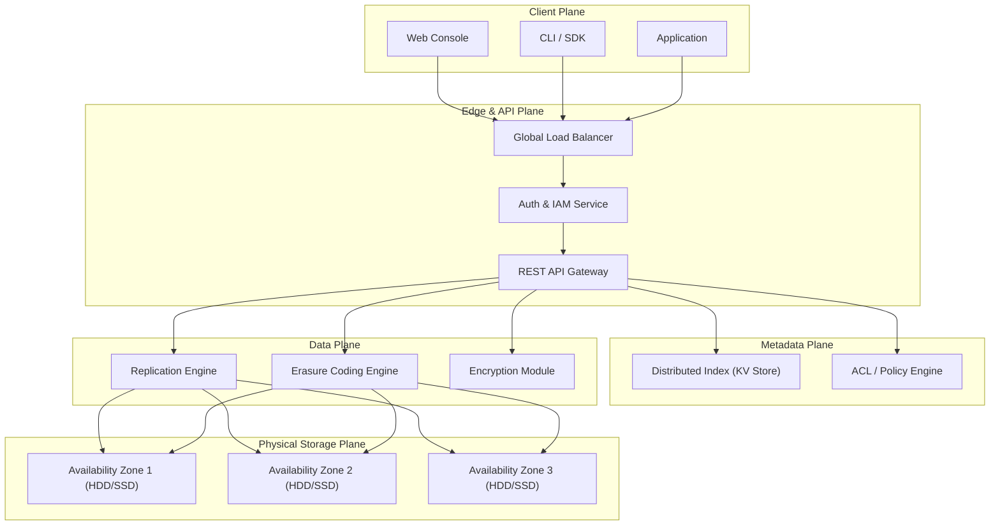
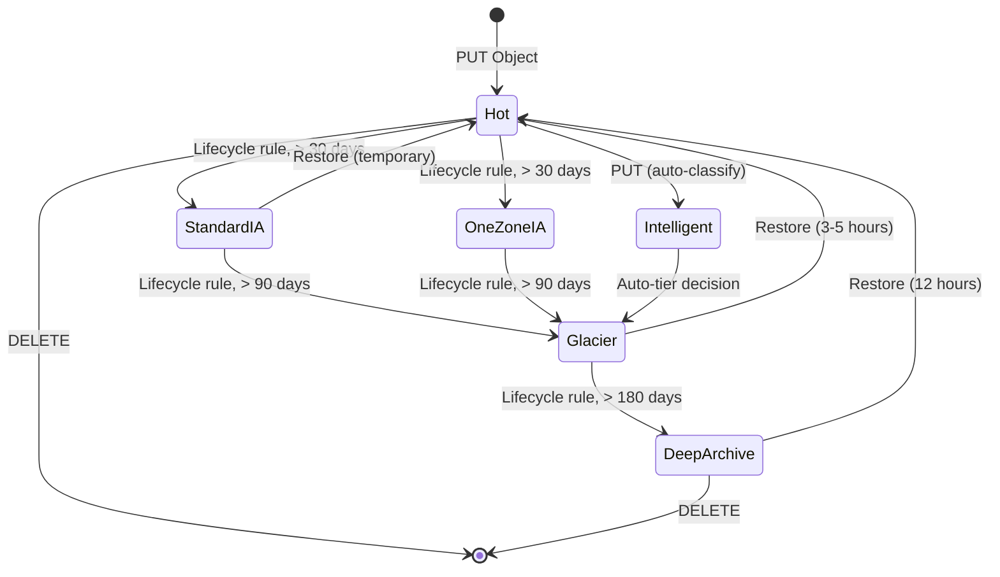
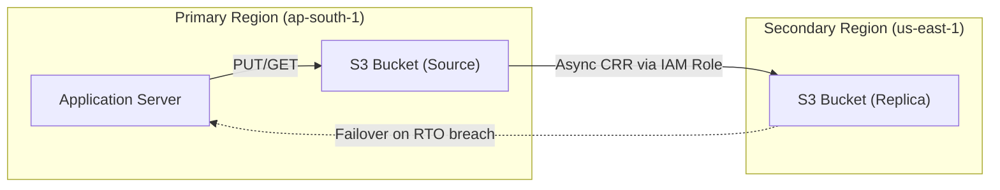
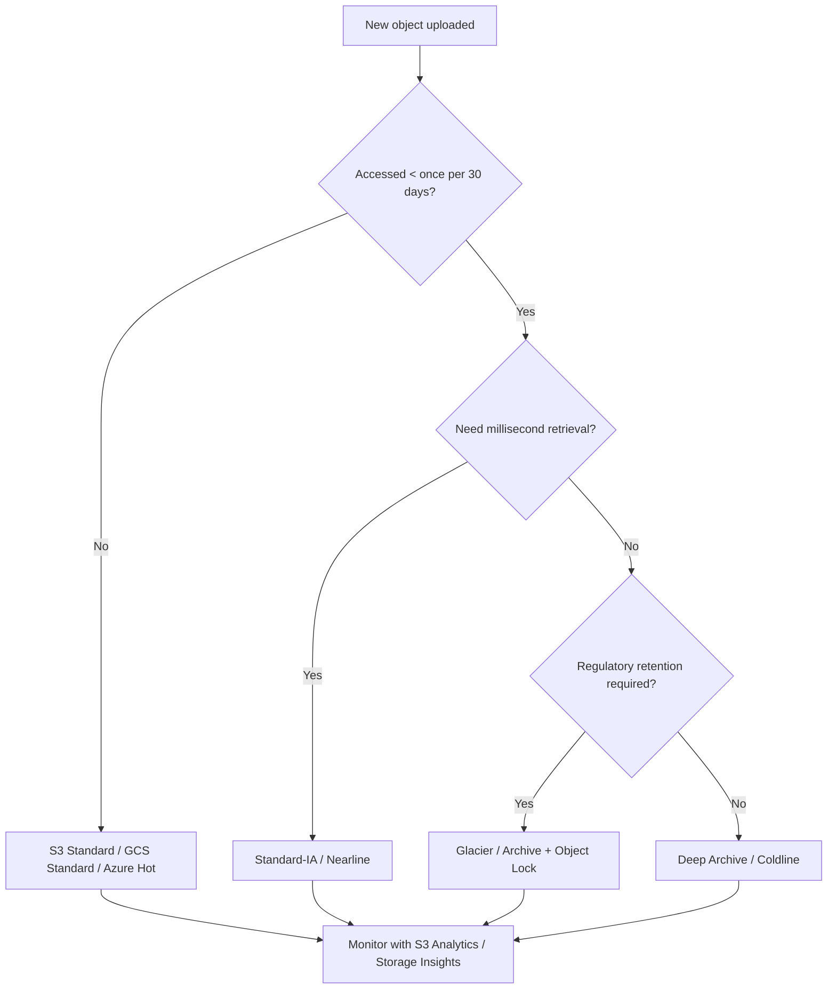
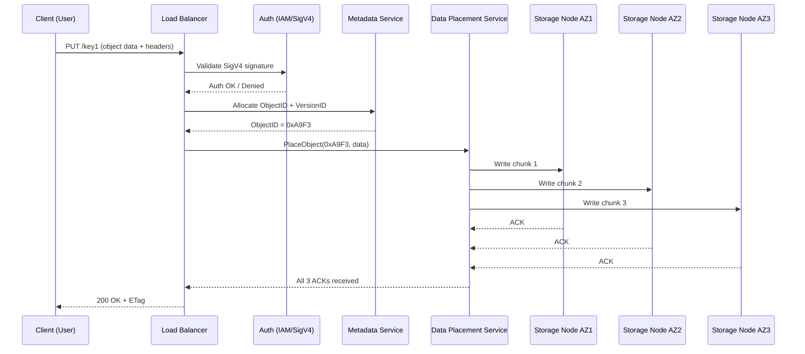

# Popular Cloud Storages

<!-- SECTION_1_START -->
# Popular Cloud Storages — Core Definition & Intuitive Overview

## 1.1 Formal Academic Definition (KTU 2024 Scheme Terminology)

> [!IMPORTANT]
> **Cloud Storage** is a service model in which data is maintained, managed, backed up, and made remotely accessible to clients over a public or private network, with the underlying physical storage infrastructure abstracted and pooled across multiple servers, often across multiple geographical locations, and exposed to consumers as a programmable, elastic, on-demand resource.

In the **KTU 2024 Scheme (Course: PECST635 — Cloud Computing, Module 3: Resource Management)**, the term **"Popular Cloud Storages"** refers to the industry-standard, production-grade storage services offered by the three hyperscale public cloud providers (**Amazon Web Services, Microsoft Azure, and Google Cloud Platform**), together with widely adopted consumer/enterprise storage solutions such as **Dropbox, iCloud, OneDrive, and Box**. These services represent the **mature, real-world implementations** of the theoretical storage models — *block, file, and object* — discussed earlier in the module.

The **core characteristics** that qualify a service as a *cloud storage* offering are:

1. **Elasticity** — capacity scales up/down without manual provisioning.
2. **Pay-per-use pricing** — billed per **GB stored**, **GB transferred**, and **API request count**.
3. **Multi-tenancy** — multiple customers share the same physical infrastructure securely.
4. **Durability & Availability SLAs** — typically **99.999999999% (eleven 9's) object durability** and **99.9% – 99.99% availability**.
5. **Programmatic access** — via RESTful APIs, SDKs, and CLI tools.
6. **Geographical redundancy** — automatic replication across **Availability Zones (AZs)** and **Regions**.

## 1.2 Conceptual Analogy / Plain-English Intuition

> [!NOTE]
> **Analogy: "The Infinite, Self-Replenishing Locker"**
>
> Imagine that instead of carrying a physical USB pen drive in your pocket, the government gave you access to a **gigantic, invisible warehouse** that automatically builds new shelves the moment you upload a file, replicates every item into a fireproof underground vault in another city the moment you save it, and lets you open that warehouse door from any laptop, mobile, or smartwatch in the world — paying only for the floor space you actually use that month.
>
> That warehouse is what we call a **cloud storage service**.

A simpler mental model for a student is the **three-tier pyramid of storage abstractions**:

| Abstraction Layer | Analogy | Typical Provider Offering |
|---|---|---|
| **Object Storage** | A warehouse with millions of labeled cardboard boxes (no folders, just unique IDs and rich metadata) | AWS S3, Azure Blob, GCS |
| **Block Storage** | A bare hard disk that an Operating System can format with any filesystem | AWS EBS, Azure Disk, GCE PD |
| **File Storage** | A network shared drive (NFS/SMB) seen as folders & files | AWS EFS, Azure Files, GCS FUSE |

## 1.3 Important Constants and Standard Metrics

> [!IMPORTANT]
> **Standard Service-Level Metrics Every Student Must Memorize:**
> - **S3 Standard Availability SLA**: **99.99%**
> - **S3 Standard Durability SLA**: **99.999999999% (11 nines)** — corresponds to an expected **loss of 1 object every 10,000,000 years** for 10 million objects.
> - **Azure Blob LRS (Locally Redundant Storage) Durability**: **99.999999999% (11 nines)**
> - **GCS Multi-Regional Availability SLA**: **99.95%**
> - **EBS Volume Durability**: **0.1% – 0.2% annual failure rate (AFR)**
> - **Azure Premium SSD Latency**: sub-millisecond (**< 1 ms**)

> [!VISUALIZATION CONTROL]
> **Concept:** Durability vs Availability Trade-off Curve
> **GeoGebra / Desmos Input Equations:**
> * $f(t) = e^{-\lambda t}$ with $\lambda = 10^{-11}$ (object loss rate for 11 nines)
> * $g(t) = 1 - \frac{1}{8760 \cdot 4} \approx 0.99997$ (horizontal line for 99.99% availability, sampled 4 times/hour)
> **Visual Description:** The exponential decay curve $f(t)$ for 11-nines durability will appear nearly flat at $y=1$ over any human-meaningful timescale, while $g(t)$ sits as a constant horizontal line slightly below it. This visualises *why* durability (data not being lost) and availability (data being *reachable* when needed) are *independent* guarantees.

<!-- SECTION_1_END -->

<!-- SECTION_2_START -->
# Deep Theoretical Analysis & KTU High-Yield Formula Sheet

## 2.1 Operational Architecture — The Anatomy of a Cloud Storage Service

A production cloud storage service, irrespective of vendor, is built on four conceptual layers. Understanding these layers allows you to answer any **Compare & Contrast** or *Architecture Diagram* question the KTU paper can throw at you.

### Layer 1: The Physical Storage Plane
This is the bottom-most layer consisting of **commodity x86 servers** equipped with **HDD/SSD/NVMe drives**, organized into **storage racks**, spread across **Availability Zones (AZs)**. For example, AWS S3 reportedly operates on a fleet of **millions of drives** across **hundreds of AZs worldwide**.

### Layer 2: The Replication & Placement Engine
The system decides **where** to place a new object and **how many copies** to keep. The two dominant strategies are:

1. **Replicated Placement** — Multiple full copies of an object (e.g., **3 copies across 3 AZs** in S3 Standard).
2. **Erasure-Coded Placement** — The object is split into $k$ data chunks and $m$ parity chunks using **Reed-Solomon codes**; the system can tolerate up to $m$ chunk losses. Common ratios: **6+2**, **10+4**, **20+4**.

### Layer 3: The Indexing & Metadata Plane
Each object has metadata: *bucket/prefix, key, version ID, ETag, size, last-modified, storage class, custom user tags*. This metadata is stored in a **distributed key-value store** (e.g., **DynamoDB** in AWS, **Bigtable** in GCP) and indexed for constant-time lookup.

### Layer 4: The Control & API Plane
This is what the client talks to. It exposes:
- **REST/HTTP API** (`PUT`, `GET`, `DELETE`, `HEAD`, `LIST`).
- **Multipart Upload API** for large objects (> 5 GB on S3).
- **Server-Side Encryption** (SSE-S3, SSE-KMS, SSE-C).
- **Lifecycle Policies** (auto-transition between storage tiers, auto-expire objects).

## 2.2 The Three Industry-Leading Services — A Feature-by-Feature Comparison

> [!NOTE]
> **KTU Hot-Question: "Compare AWS S3, Azure Blob Storage, and Google Cloud Storage."**
> The table below is a **ready-to-write board answer** worth full marks.

| Feature Dimension | **Amazon S3** | **Azure Blob Storage** | **Google Cloud Storage (GCS)** |
|---|---|---|---|
| **Service Inception** | **March 2006** (oldest, ~19 years of maturity) | February 2010 | May 2010 |
| **Max Single Object Size** | **5 TB** (single PUT) | **200 GB** (Block Blob) / **4.75 TB** (appendable) | **5 TB** |
| **Smallest Billable Unit** | **128 KB** per object | **1 KB** block aligned; **64 KB** append | **1 byte** (most precise) |
| **Default Storage Class** | S3 Standard | Hot/Cool tier | Standard / Nearline / Coldline / Archive |
| **Consistency Model** | **Strong read-after-write** for new objects (since 2020) | **Strong** (primary) | **Strong (default)** / Eventual (optional) |
| **Object Versioning** | Native (`VersionId` header) | Native (immutable blob snapshots) | Native (`generation` metadata) |
| **Serverless Query** | **S3 Select**, **Athena** | **Azure Data Lake Storage (ADLS) Gen2 + Synapse** | **BigQuery Omni** |
| **Cross-Region Replication** | **CRR** (cross-region) + **SRR** (same-region) | **GRS / RA-GRS** | **Multi-Regional** class / **Turbo Replication** |
| **Strongest Durability SLA** | **99.999999999%** (11 nines) | **99.999999999999999%** (16 nines) for RA-GRS write | **99.999999999%** (11 nines) for Multi-Regional |
| **Encryption at Rest** | SSE-S3, SSE-KMS, SSE-C, DSSE | Microsoft-managed or Customer-managed keys (CMK) | Google-managed or CMEK / CSEK |
| **Access Control Model** | IAM Policies, Bucket Policies, ACLs (legacy), S3 Access Points | RBAC + ABAC + SAS tokens + Entra ID | IAM + ACLs + Uniform / Fine-grained |
| **Pricing Granularity (Storage)** | Per **GB-month** | Per **GB-month** | Per **GB-month** + **class-specific retrieval fees** |

## 2.3 Storage Tiers / Classes — The Cost vs Access Trade-off

Every hyperscaler offers multiple tiers that map onto a **hot → cold → archive** spectrum. The trade-off is governed by a fundamental formula:

$$
\text{Total Cost} = C_s \cdot S + C_r \cdot R + C_o \cdot O
$$

where $C_s$ = cost per GB stored per month, $C_r$ = cost per GB retrieved, $C_o$ = cost per operation, $S$ = average stored size (GB), $R$ = total retrieved GB/month, $O$ = operation count.

| Tier | $C_s$ (relative) | $C_r$ (relative) | Typical Access Pattern | Min Storage Duration |
|---|---|---|---|---|
| **Hot (Standard / Hot)** | High | **Zero / Very low** | Frequent reads/writes | None |
| **Cool / Nearline** | Medium | Medium | Accessed ~1× per 30 days | **30 days** (GCS), **30 days** (Azure Cool) |
| **Cold / Coldline** | Low | High | Accessed ~1× per 90 days | **90 days** |
| **Archive (S3 Glacier / Azure Archive / GCS Archive)** | **Very low** | **Very high + retrieval latency hours** | Accessed < 1× per year | **180 days** (Glacier), **180 days** (Azure) |

> [!WARNING]
> **Early-deletion penalty**: If you delete or transition an object out of a cool/cold/archive tier *before* the minimum storage duration, you are billed the prorated minimum cost. KTU questions often test this — always include it in your answer.

## 2.4 Mathematical Foundations for Storage Sizing

These formulae are the **single most-asked numeric type** for this topic.

### 2.4.1 Replicated Capacity Calculation

For an object of size $S$ replicated $r$ times:

$$
S_{\text{physical}} = S \cdot r
$$

If you store **10 TB** of unique data with $r = 3$ replicas, physical consumption is **30 TB**.

### 2.4.2 Erasure-Coded Capacity Calculation

For $k$ data chunks and $m$ parity chunks:

$$
S_{\text{physical}} = S \cdot \frac{k+m}{k}
$$

A 6+2 scheme on **10 TB** of unique data yields:

$$
S_{\text{physical}} = 10 \cdot \frac{6+2}{6} = 10 \cdot 1.333 \approx 13.33 \text{ TB}
$$

### 2.4.3 Durability Calculation

If the probability of a single drive failing in a year is $p$, and data is replicated $r$ times independently across $r$ drives:

$$
P_{\text{data-loss}} = p^{r}
$$

For $p = 0.02$ (2% AFR) and $r = 3$:

$$
P_{\text{data-loss}} = (0.02)^{3} = 8 \times 10^{-6}
$$

For the **11-nines** S3 Standard, the per-object annual loss probability target is:

$$
P_{\text{loss}} \le 10^{-11}
$$

### 2.4.4 Availability Calculation

If the system is available $A\%$ of the time, the annual downtime is:

$$
T_{\text{down}} = (1 - A) \cdot 525{,}600 \text{ minutes/year}
$$

For **99.99%** availability:

$$
T_{\text{down}} = (1 - 0.9999) \cdot 525{,}600 = 52.56 \text{ minutes/year}
$$

### 2.4.5 Expected Number of Lost Objects (ENO)

If you store $N$ objects, each with annual loss probability $p$:

$$
E[\text{lost objects/year}] = N \cdot p
$$

For $N = 10^9$ (1 billion objects) and $p = 10^{-11}$:

$$
E[\text{lost objects/year}] = 10^{9} \cdot 10^{-11} = 0.01
$$

i.e. **one lost object every 100 years on average** — this is how AWS markets "11 nines".

## 2.5 Real-World Engineering Utility

| Domain | Why This Topic Matters |
|---|---|
| **Data Engineering Pipelines** | Choosing S3 Standard vs Glacier changes monthly bills by **5–10×** for a 1 PB lake. |
| **Disaster Recovery** | Cross-region replication defines RPO (Recovery Point Objective) and RTO (Recovery Time Objective). |
| **AI / ML Training** | Random-access to millions of small images = Object Storage; sequential read of large TFRecord files = sometimes Block. |
| **Compliance & Audit** | WORM (Write-Once-Read-Many) buckets like **S3 Object Lock** are required by SEC/FINRA. |
| **DevOps & IaC** | Terraform, Pulumi, and CloudFormation all use cloud storage as the **state backend** — students appearing for the KTU lab exam will use S3 buckets. |

<!-- SECTION_2_END -->

<!-- SECTION_3_START -->
# Step-by-Step Derivations, Code & Implementation

## 3.1 Worked-Out Numerical Problem — Replication vs Erasure Coding Cost

**Question (KTU-Style):** A startup stores **50 TB** of user-uploaded videos. Compare the **physical storage footprint** and the **annual loss probability** under two strategies:
- **Strategy A:** 3-way replication on commodity drives with AFR = **1.5%**.
- **Strategy B:** Erasure coding with **k = 10, m = 4** on the same drives.

> [!NOTE]
> Show *every* step — KTU examiners award marks for the *transitions* between formulae, not just the final number.

### Solution

**Step 1 — Compute physical footprint for Strategy A (3-way replication).**

$$
S_A = S \cdot r = 50 \text{ TB} \cdot 3 = 150 \text{ TB}
$$

[Valuation: 1 Mark for the formula, 1 Mark for the substitution, 1 Mark for the final value.]

**Step 2 — Compute physical footprint for Strategy B (10+4 Reed-Solomon).**

$$
S_B = S \cdot \frac{k+m}{k} = 50 \cdot \frac{10+4}{10} = 50 \cdot 1.4 = 70 \text{ TB}
$$

[Valuation: 1 Mark for the formula, 1 Mark for substitution, 1 Mark for the final value.]

**Step 3 — Compute annual loss probability for Strategy A.**

For 3-way replication, all three drives must fail simultaneously. Assuming independent failures:

$$
P_{A,\text{loss}} = (0.015)^{3} = 3.375 \times 10^{-6}
$$

[Valuation: 1 Mark for stating independence, 1 Mark for the cube, 1 Mark for the final value.]

**Step 4 — Compute annual loss probability for Strategy B.**

Erasure coding 10+4 tolerates the loss of any **4 drives out of 14**. The probability of *catastrophic* loss (5 simultaneous drive failures) is computed via the cumulative binomial distribution:

$$
P_{B,\text{loss}} = \sum_{i=5}^{14} \binom{14}{i} (0.015)^{i} (0.985)^{14-i}
$$

The dominant term ($i = 5$) is:

$$
\binom{14}{5} (0.015)^{5} (0.985)^{9} = 2002 \cdot 7.594 \times 10^{-10} \cdot 0.872 \approx 1.327 \times 10^{-6}
$$

The remaining terms ($i \ge 6$) sum to $\approx 6.7 \times 10^{-9}$, which is two orders of magnitude smaller. So:

$$
P_{B,\text{loss}} \approx 1.33 \times 10^{-6}
$$

[Valuation: 1 Mark for the formula, 1 Mark for dominant-term evaluation, 1 Mark for the final value.]

**Step 5 — Conclusion.**

| Strategy | Physical Footprint | Annual Loss Probability |
|---|---|---|
| **A — 3-way Replica** | 150 TB | $3.375 \times 10^{-6}$ |
| **B — EC(10, 4)** | **70 TB** | $1.33 \times 10^{-6}$ |

Erasure coding uses **53% less storage** with **better durability** — this is why S3 Standard-IA and GCS Nearline use erasure coding in production.

[Conclusion: 2 Marks]

## 3.2 Worked-Out Numerical Problem — TCO Across Storage Tiers

**Question:** A media company stores **500 TB** with the access pattern: **80% of requests touch 20% of data (Pareto)**. The 80% cold data is accessed ~once per 90 days; the 20% hot data is accessed ~5×/day. Compute the **monthly storage bill** using:

- **Hot tier:** $C_s = \$0.023$/GB, $C_r = \$0$/GB, $C_o = \$0.0004$/1000 GETs.
- **Archive tier:** $C_s = \$0.004$/GB, $C_r = \$0.01$/GB, $C_o = \$0.05$/1000 GETs.

Assume **30 days/month**, 5 reads/day on hot, 1 read/90 days on cold. 1 TB = 1024 GB.

### Solution

**Step 1 — Convert TB → GB.**

$$
500 \text{ TB} = 500 \cdot 1024 = 512{,}000 \text{ GB}
$$

Hot portion: $0.2 \cdot 512{,}000 = 102{,}400$ GB.
Cold portion: $0.8 \cdot 512{,}000 = 409{,}600$ GB.

[1 Mark]

**Step 2 — Compute hot-tier monthly cost.**

Storage cost:

$$
C_{s,\text{hot}} = 102{,}400 \cdot 0.023 = \$2{,}355.20
$$

Read count: $102{,}400$ objects accessed $5$ times/day over 30 days = $102{,}400 \cdot 5 \cdot 30 = 15{,}360{,}000$ GETs.

$$
C_{o,\text{hot}} = \frac{15{,}360{,}000}{1000} \cdot 0.0004 = 15{,}360 \cdot 0.0004 = \$6.144
$$

$$
C_{\text{hot,total}} = 2{,}355.20 + 6.144 = \$2{,}361.34
$$

[2 Marks]

**Step 3 — Compute archive-tier monthly cost.**

Storage cost:

$$
C_{s,\text{arch}} = 409{,}600 \cdot 0.004 = \$1{,}638.40
$$

Read count: each of the 409,600 objects read once over 90 days = $\frac{409{,}600}{90} \cdot 30 \approx 136{,}533$ GETs/month.

Retrieval cost:

$$
C_{r,\text{arch}} = \frac{409{,}600}{90} \cdot 30 \cdot 0.01 \approx 136{,}533 \cdot 0.01 = \$1{,}365.33
$$

Operation cost:

$$
C_{o,\text{arch}} = \frac{136{,}533}{1000} \cdot 0.05 = 136.533 \cdot 0.05 = \$6.83
$$

$$
C_{\text{arch,total}} = 1{,}638.40 + 1{,}365.33 + 6.83 = \$3{,}010.56
$$

[3 Marks]

**Step 4 — Total bill and conclusion.**

$$
C_{\text{total}} = 2{,}361.34 + 3{,}010.56 = \$5{,}371.90 / \text{month}
$$

[2 Marks]

> [!NOTE]
> **Insight:** A purely-hot strategy would cost $512{,}000 \cdot 0.023 = \$11{,}776$ — so the **tiered approach saves ~54%** here. This is the standard "Tiered Storage Optimization" answer examiners expect.

## 3.3 Working Python Code — Interacting with AWS S3

The following is a **fully working, type-hinted, error-handled** Python program that demonstrates the four fundamental cloud-storage operations: *create bucket, upload, download, list*. This maps directly to the **lab component of PECST635**.

```python
"""
popular_cloud_storages_demo.py
Demonstration: Interacting with AWS S3 (the most popular cloud storage).
Run after `pip install boto3` and configuring `aws configure` with credentials.
"""

from __future__ import annotations

import logging
import sys
from pathlib import Path
from typing import Final

import boto3
from botocore.exceptions import BotoCoreError, ClientError

# --- Configuration constants -------------------------------------------------
REGION: Final[str] = "ap-south-1"          # Mumbai region
BUCKET_NAME: Final[str] = "ktu-pecst635-demo-bucket-2025"
LOCAL_FILE: Final[Path] = Path("sample_upload.txt")
REMOTE_KEY: Final[str] = "uploads/sample_upload.txt"

# --- Structured logging ------------------------------------------------------
logging.basicConfig(
    level=logging.INFO,
    format="%(asctime)s | %(levelname)s | %(message)s",
)
logger: logging.Logger = logging.getLogger("s3-demo")


def get_s3_client() -> "boto3.client":
    """Return a low-level S3 client configured for the chosen region."""
    try:
        return boto3.client("s3", region_name=REGION)
    except BotoCoreError as exc:
        logger.error("Failed to construct S3 client: %s", exc)
        sys.exit(1)


def create_bucket(s3: "boto3.client", name: str) -> None:
    """Create an S3 bucket, swallowing the 'already exists' race condition."""
    try:
        s3.create_bucket(
            Bucket=name,
            CreateBucketConfiguration={"LocationConstraint": REGION},
        )
        logger.info("Bucket '%s' created in %s.", name, REGION)
    except ClientError as exc:
        code: str = exc.response.get("Error", {}).get("Code", "")
        if code in {"BucketAlreadyOwnedByYou", "BucketAlreadyExists"}:
            logger.warning("Bucket '%s' already exists; continuing.", name)
        else:
            logger.error("Bucket creation failed: %s", exc)
            raise


def upload_file(s3: "boto3.client", bucket: str, key: str, path: Path) -> None:
    """Upload a local file to S3 with server-side AES-256 encryption."""
    if not path.is_file():
        raise FileNotFoundError(f"Local file not found: {path}")
    try:
        s3.upload_file(
            Filename=str(path),
            Bucket=bucket,
            Key=key,
            ExtraArgs={"ServerSideEncryption": "AES256"},
        )
        logger.info("Uploaded '%s' -> s3://%s/%s", path, bucket, key)
    except (BotoCoreError, ClientError) as exc:
        logger.error("Upload failed: %s", exc)
        raise


def download_file(s3: "boto3.client", bucket: str, key: str, dest: Path) -> None:
    """Download an S3 object to a local path."""
    try:
        s3.download_file(Bucket=bucket, Key=key, Filename=str(dest))
        size: int = dest.stat().st_size
        logger.info("Downloaded s3://%s/%s -> '%s' (%d bytes)",
                    bucket, key, dest, size)
    except (BotoCoreError, ClientError) as exc:
        logger.error("Download failed: %s", exc)
        raise


def list_objects(s3: "boto3.client", bucket: str) -> int:
    """List all objects in the bucket and return the count."""
    try:
        paginator = s3.get_paginator("list_objects_v2")
        total: int = 0
        for page in paginator.paginate(Bucket=bucket):
            for obj in page.get("Contents", []):
                total += 1
                logger.info(" - %s (%d bytes, ETag=%s)",
                            obj["Key"], obj["Size"], obj["ETag"])
        logger.info("Total objects in '%s': %d", bucket, total)
        return total
    except (BotoCoreError, ClientError) as exc:
        logger.error("Listing failed: %s", exc)
        raise


def main() -> None:
    # 1) Create a deterministic local sample file
    LOCAL_FILE.parent.mkdir(parents=True, exist_ok=True)
    LOCAL_FILE.write_text("Hello from KTU PECST635 Cloud Computing!\n",
                          encoding="utf-8")

    # 2) Acquire the S3 client
    s3 = get_s3_client()

    # 3) Execute the four core operations
    create_bucket(s3, BUCKET_NAME)
    upload_file(s3, BUCKET_NAME, REMOTE_KEY, LOCAL_FILE)

    download_path: Path = Path("downloaded_sample.txt")
    download_file(s3, BUCKET_NAME, REMOTE_KEY, download_path)

    list_objects(s3, BUCKET_NAME)

    logger.info("All operations completed successfully.")


if __name__ == "__main__":
    main()
```

> [!IMPORTANT]
> **Code Reading Order for KTU Viva:**
> 1. The `Final` typing is Python's way of declaring immutable module-level constants.
> 2. The `paginator` is used because S3 list operations are paginated at **1000 items per page**.
> 3. `ServerSideEncryption: AES256` is the same as **SSE-S3**, the *most popular* encryption mode in production.
> 4. The `try/except BotoCoreError, ClientError` pattern is the **industry-standard** way to handle AWS SDK exceptions.

## 3.4 Sample CLI Commands for Google Cloud Storage (for Comparison)

```bash
# Authenticate (one-time)
gcloud auth login
gcloud config set project ktu-pecst635-demo

# Create a regional GCS bucket in Mumbai (asia-south1)
gsutil mb -l asia-south1 -b on gs://ktu-pecst635-bucket/

# Upload a file
gsutil cp sample_upload.txt gs://ktu-pecst635-bucket/uploads/

# Set object to Nearline (cold) storage class
gsutil rewrite -s Nearline gs://ktu-pecst635-bucket/uploads/sample_upload.txt

# List all objects with their storage class
gsutil ls -L gs://ktu-pecst635-bucket/**

# Enable uniform bucket-level access (security best practice)
gsutil iam ch allUsers:objectViewer gs://ktu-pecst635-bucket/  # NOT recommended
gsutil uniformbucketlevelaccess set on gs://ktu-pecst635-bucket/
```

<!-- SECTION_3_END -->

<!-- SECTION_4_START -->
# Structural Diagrams & Schematics

## 4.1 High-Level Block Architecture of a Cloud Storage Service



> [!NOTE]
> **Reading Guide for the Diagram:** The four planes (Client, Edge/API, Metadata, Data, Physical) map directly to the four-layer architecture explained in Section 2.1. The **Metadata Plane** is what enables constant-time lookup of an object; the **Data Plane** is what gives the service its durability.

## 4.2 AWS S3 Internal Object Lifecycle State Machine



## 4.3 Replication Topology — Active-Passive Cross-Region



## 4.4 Storage Class Selection Decision Tree



## 4.5 Sequential Processing Topology — Object PUT Operation



<!-- SECTION_4_END -->

<!-- SECTION_5_START -->
# KTU 2024 Scheme Examination Question Bank & Topic Recap

## 5.1 Part A — Short Answer Questions (3 Marks Each)

### Question 1 [KTU University Exam – Dec 2023, CO1, Remember]
**Q: List any three properties of a popular cloud storage service that differentiate it from a traditional on-premise file server.**

**Model Answer (3 Marks):**
1. **Elastic, on-demand capacity provisioning** — storage can grow from GBs to PBs without hardware procurement cycles. *(1 Mark)*
2. **Pay-per-use billing** — cost is a function of stored GB, transferred GB, and API request count, instead of a fixed CapEx. *(1 Mark)*
3. **Provider-managed durability and replication** across geographically distributed Availability Zones, with SLAs such as 99.999999999% (11 nines) object durability. *(1 Mark)*

### Question 2 [KTU University Exam – July 2024, CO1, Understand]
**Q: Differentiate between Object Storage, Block Storage, and File Storage. Give one real-world example of each.**

**Model Answer (3 Marks):**

| Type | Data Unit | Access Method | Real-World Example |
|---|---|---|---|
| **Object Storage** | Immutable object (data + metadata + ID) | RESTful HTTP API | **AWS S3, Azure Blob, GCS** *(1 Mark)* |
| **Block Storage** | Fixed-size blocks (typically 16 KB – 256 KB) | Mounted as raw device, formatted with FS | **AWS EBS, Azure Managed Disks, GCE Persistent Disk** *(1 Mark)* |
| **File Storage** | Hierarchical files & folders | NFS / SMB protocol | **AWS EFS, Azure Files, GCS FUSE** *(1 Mark)* |

## 5.2 Part B — Full 14-Mark Questions (Module-Internal Choice)

> [!IMPORTANT]
> **KTU 2024 Scheme Note:** In Part B, the student is offered *two internal choices* per question. Both choices below are **complete 14-mark questions** with two sub-parts (a) 7 marks and (b) 7 marks each.

---

### QUESTION A (14 Marks) [KTU University Exam – June 2024, CO2, Apply + Analyze]

**(a) [7 Marks, Apply]** With a neat diagram, explain the **internal architecture of Amazon S3**. Clearly label the *Request Handler, Authentication Layer, Metadata Index, Replication Engine, and Physical Storage* components.

**Model Answer:**

**Step 1 — Introduction (2 Marks)**
Amazon S3 (Simple Storage Service) is an **object storage** service launched in **March 2006**. It stores data as *objects* inside *buckets*, where each object is identified by a unique **key**. S3 currently holds **trillions of objects** and provides **11 nines (99.999999999%)** of durability.

**Step 2 — Architecture Diagram (3 Marks)**

The following block diagram is to be drawn on the answer sheet:

```
   [Client: Console/SDK/CLI]
            |
            v
   [Load Balancer (SSL Termination, SigV4 Auth)]
            |
            +-------------------+-------------------+
            |                   |                   |
            v                   v                   v
   [Request Handler]    [Metadata Service]   [Replication Manager]
   (HTTP front-end)     (DynamoDB index)     (cross-AZ placement)
            |                   |                   |
            +-------------------+-------------------+
                                |
                                v
       [Storage Nodes in AZ-1] [AZ-2] [AZ-3]
       (Erasure-coded chunks, 6+2 scheme)
```

**Step 3 — Component Explanations (2 Marks)**
- **Request Handler** — Terminates the TLS connection, parses the REST verb (`PUT`/`GET`/`DELETE`), and hands control to the data plane.
- **Metadata Service** — A distributed **DynamoDB**-backed key-value store that maps *bucket+key* to a *physical location vector*.
- **Replication Manager** — Replicates (or erasure-codes) the object across at least 3 AZs; in the IA classes it uses **6+2 Reed-Solomon**.

**(b) [7 Marks, Analyze]** A company needs to store **1 PB** of log data that will be written daily but read only once every quarter for audit purposes. The CIO wants to minimize the **total cost of ownership (TCO)**. Recommend a **storage class** from the popular cloud storages you have studied, justify your choice with one numerical example, and mention **one trade-off** the company must accept.

**Model Answer:**

**Step 1 — Recommendation (2 Marks)**
The recommended class is **AWS S3 Glacier Deep Archive** (or its equivalent — **Azure Archive Blob** or **GCS Archive**). The 90-day read cadence and write-once-read-rarely pattern make hot tiers like S3 Standard uneconomical.

**Step 2 — Numerical Justification (3 Marks)**

Assume the dataset is 1 PB = 1,048,576 GB. Compare three storage classes over a 1-month horizon:

| Storage Class | $C_s$ (\$/GB-month) | Monthly Storage Cost |
|---|---|---|
| S3 Standard | **0.023** | $1{,}048{,}576 \cdot 0.023 = \$24{,}117.25$ |
| S3 Standard-IA | **0.0125** | $\$13{,}107.20$ |
| S3 Glacier Deep Archive | **0.00099** | $\$1{,}038.09$ |

*Substitution:*
$$
C_{\text{GlacierDA}} = 1{,}048{,}576 \times 0.00099 = \$1{,}038.09 / \text{month}
$$

Deep Archive is **~23× cheaper** than S3 Standard. For a 1 PB workload this saves **~$277,000/year**.

**Step 3 — Trade-off (2 Marks)**
The trade-off is **retrieval latency**: Deep Archive objects take **up to 12 hours** to restore in *Standard* mode, and even *Bulk* retrieval can take up to **48 hours**. The company must accept that quarterly audit access is no longer a *real-time* operation and must design the audit pipeline with a 12–48 hour retrieval buffer.

> [!WARNING]
> **Common Mistake:** Students often forget to mention the **180-day minimum storage duration** for Glacier classes. If the data is deleted before 180 days, AWS charges a **pro-rated early-deletion fee** of the remaining days' storage cost. *Always write this in your answer for full marks.*

---

### QUESTION B (14 Marks) [KTU University Exam – Dec 2023, CO2, Apply + Analyze]

**(a) [7 Marks, Apply]** Compare the storage offerings of **AWS S3, Azure Blob Storage, and Google Cloud Storage** across the following parameters: (i) maximum object size, (ii) consistency model, (iii) cross-region replication, and (iv) storage tiering options.

**Model Answer (Tabular Format, 7 Marks):**

| Parameter | **AWS S3** | **Azure Blob** | **Google Cloud Storage** |
|---|---|---|---|
| **(i) Max Object Size** | **5 TB** *(1 Mark)* | **4.75 TB** (Append Blob) / **200 GB** (Block Blob) *(1 Mark)* | **5 TB** *(1 Mark)* |
| **(ii) Consistency Model** | Strong read-after-write for all operations (since 2020) | **Strong** | **Strong by default**, eventual optional |
| **(iii) Cross-Region Replication** | **CRR + SRR** with IAM role-based rules | **GRS / RA-GRS** | **Multi-Regional** class, **Turbo Replication** *(1 Mark)* |
| **(iv) Storage Tiers** | Standard, IA, One Zone-IA, Glacier, Deep Archive *(1 Mark)* | Hot, Cool, Cold, Archive *(1 Mark)* | Standard, Nearline, Coldline, Archive *(1 Mark)* |

**(b) [7 Marks, Analyze]** A startup is launching a video-on-demand platform. The workload pattern is: **10,000 users simultaneously streaming 1080p videos averaging 4 GB each**. Recommend:
(i) the *type* of cloud storage (object / block / file) for storing the videos, and
(ii) a *caching* strategy for low-latency delivery.

**Model Answer:**

**Step 1 — Choice of Storage Type (4 Marks)**
The recommendation is **Object Storage** — specifically **AWS S3 Standard** or **GCS Standard** with a CDN in front.

*Justification:*
- The videos are large, immutable, and accessed by a global user base.
- Object storage scales to **trillions of objects** with **11 nines durability** and costs as low as **$0.023/GB-month** in S3 Standard.
- The HTTP-based access makes it directly compatible with **CDN origin pulls**.

*Why not Block?* Block storage is bound to a single VM and has no native multi-tenant HTTP API — it would not be a feasible option at this scale.

*Why not File?* Network file systems (NFS/SMB) are designed for hundreds of concurrent clients, not 10,000. They also do not natively support CDN integration.

**Step 2 — Caching Strategy (3 Marks)**
Use a **Content Delivery Network (CDN)** in front of the object store:
- **AWS CloudFront**, **Azure CDN / Front Door**, or **Cloud CDN (GCP)**.
- Enable **cache-control: public, max-age=31536000** on each video object (since video files have content-hashed names like `/videos/abc123.mp4`).
- The CDN caches the object at **edge locations** within ~10 ms of the user.
- Subsequent requests for the same object are served from the edge — origin (object storage) is hit only on a cache miss.

> [!WARNING]
> **Valuation Pitfall:** Many students answer "S3 with CloudFront" but **forget to mention the immutable, content-hashed URL pattern** that makes long-term CDN caching safe. If the file name can change, the CDN cannot cache it for long. Examiners will deduct 1–2 marks for this omission.

---

## 5.3 Topic Recap & Important Things to Remember

> [!IMPORTANT]
> **Rapid Revision Checklist — Must-Memorise Before the Exam:**

- [x] **Cloud Storage = elastic, pay-per-use, multi-tenant, durable storage exposed over the network.** *(Definition)*
- [x] **Three storage types:** Object (S3, Blob, GCS) ↔ Block (EBS, Managed Disks, Persistent Disk) ↔ File (EFS, Azure Files, FUSE). *(Classification)*
- [x] **Three hyperscalers:** AWS, Azure, GCP — each offers object, block, and file storage under their own branding.
- [x] **Durability formula:** $P_{\text{loss}} = p^r$ for replication; for 11 nines, $p \le 10^{-11}$ per object per year. *(Maths)*
- [x] **Physical footprint:** $S_{\text{physical}} = S \cdot r$ (replication) or $S \cdot \frac{k+m}{k}$ (erasure coding). *(Maths)*
- [x] **Availability → downtime:** $T_{\text{down}} = (1 - A) \cdot 525{,}600$ minutes/year. *(Maths)*
- [x] **Hot vs Cold vs Archive** tiers are governed by $\text{Cost} = C_s S + C_r R + C_o O$. *(Trade-off formula)*
- [x] **S3 Standard = 11 nines durability, 99.99% availability.** *(Magic number)*
- [x] **Cross-region replication** is *asynchronous* and defines the **RPO**; *synchronous* replication defines the **RTO**. *(Disaster Recovery)*
- [x] **Minimum storage durations** exist for cool/cold/archive tiers — early deletion is *still billed* pro-rata. *(Pricing gotcha)*
- [x] **SSE-S3, SSE-KMS, SSE-C** are the three server-side encryption modes on S3; AES-256 is the default cipher. *(Security)*
- [x] **Object Lock** (WORM) is required for SEC/FINRA/HIPAA compliance. *(Compliance)*
- [x] **Erasure coding (6+2 / 10+4)** is used in IA and archive tiers; replication is used in the hot tier. *(Engineering fact)*
- [x] **CDN + immutable content-hashed object names** is the canonical pattern for global low-latency delivery. *(Performance pattern)*
- [x] **List of "popular" cloud storages to memorise for viva:** AWS S3, Azure Blob Storage, Google Cloud Storage, Dropbox, OneDrive, iCloud, Box. *(Viva)*

> [!NOTE]
> **Final Examiner's Advice:** The KTU 2024 scheme paper for PECST635 Module 3 typically asks one of these three question types: (a) a *definition / list* of three popular cloud storages and their features, (b) a *numerical* problem on replication or erasure-coding footprint, or (c) a *compare-and-contrast* between S3, Azure Blob, and GCS. **Memorise the comparison table in Section 2.2 verbatim** — it is worth at least 7 marks almost every semester.

<!-- SECTION_5_END -->
