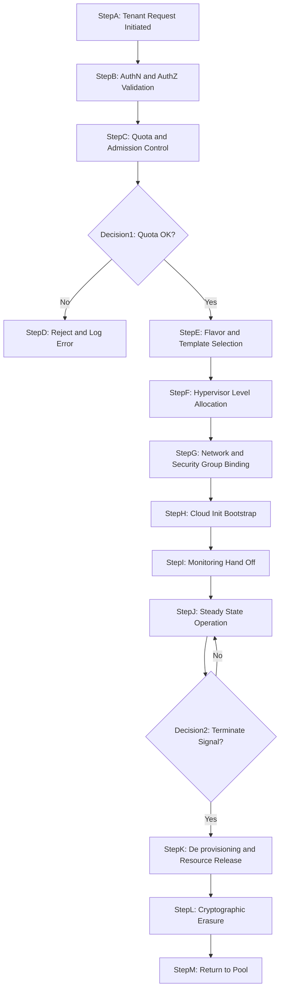
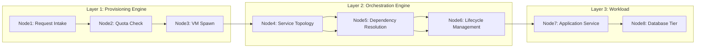
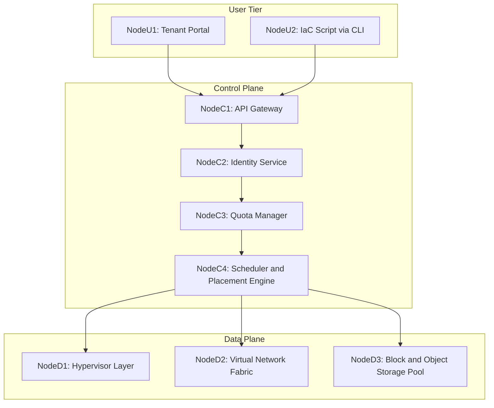

# Provisioning

<!-- SECTION_1_START -->
# Provisioning in Cloud Computing

## 1. Core Technical Definition

**Provisioning** in cloud computing is the process of **planning, allocating, configuring, deploying, and managing computing resources** (such as virtual machines, storage, networking, middleware, and application services) to authorized users, applications, or services on a demand-driven, automated, and scalable basis. Under the KTU 2024 PECST635 syllabus, provisioning is treated as a core sub-domain of *Resource Management* that bridges the gap between **Service Level Agreements (SLA)** and the actual physical/virtual infrastructure.

> [!IMPORTANT]
> **Formal KTU Definition (PECST635 / Module 3):**
> *Cloud provisioning is a set of orchestrated, policy-driven operations that dynamically instantiate, configure, and release cloud resources — typically delivered through a self-service portal or API — to satisfy a tenant's functional and non-functional requirements while honoring SLAs and optimizing provider-side utilization.*

## 2. Intuitive Conceptual Analogy

Think of **provisioning** as a *fully automated hotel check-in desk*:

- A guest (cloud user) walks in with a reservation (request) and presents an ID (authentication/authorization).
- The concierge (cloud controller) instantly allocates a specific room (VM), assigns the right size bed (vCPU/RAM), adds extras like breakfast and Wi-Fi (storage, network, middleware), and provides the room key (API endpoint) — all without the hotel manager having to manually visit the room.
- If the guest extends their stay (scaling), the concierge upgrades the room. On checkout (de-provisioning), the concierge cleans the room and readies it for the next guest.

> [!NOTE]
> The **guest never sees** the back-office housekeeping. That hidden, automated layer is exactly what *cloud provisioning* provides to developers and enterprises.

## 3. Physical Constants & Standard Metrics (KTU 2024)

The provisioning process is quantitatively governed by the following metrics:

- **Mean Time to Provision (MTTP):** Average time from request to resource availability. Target is **< 90 seconds** for compute VMs in modern clouds.
- **Provisioning Throughput (PT):** Number of resource instances provisioned per unit time (e.g., **VMs/hour**).
- **Resource Utilization Ratio (RUR):** $\text{RUR} = \dfrac{\sum U_{i}}{C_{total}}$, where $U_i$ is the utilization of node $i$ and $C_{total}$ is the total system capacity. **Target:** $0.7 \leq \text{RUR} \leq 0.85$.
- **SLA Violation Rate (SVR):** Percentage of provisioning requests that fail to meet latency/availability guarantees. **Industry benchmark:** $< 0.1\%$.

## 4. Classification of Provisioning

> [!NOTE]
> **Syllabus Highlight (PECST635):** The KTU 2024 scheme expects students to clearly distinguish between *Static* and *Dynamic* provisioning and to map each to real-world cloud services like **AWS EC2 Auto Scaling**, **Azure VM Scale Sets**, and **GCP Managed Instance Groups**.

| Provisioning Type | Trigger | Latency | KTU Industry Example |
|---|---|---|---|
| **Static Provisioning** | Manual / Scheduled | Hours to days | AWS Reserved Instances, Azure Reserved VM |
| **Dynamic Provisioning** | Real-time workload | Seconds to minutes | AWS EC2 Auto Scaling, Azure VMSS |
| **Self-Service Provisioning** | End-user request via portal | Minutes | OpenStack Horizon Dashboard |
| **Automated / Programmatic** | API / IaC scripts | Seconds | Terraform, Ansible, AWS CloudFormation |

> [!VISUALIZATION CONTROL]
> **Concept:** Provisioning Demand vs. Time Curve (Elasticity Curve)
> **GeoGebra / Desmos Input Equations:**
> * `f(x) = 50 + 30*sin(x/2)` (Workload Demand)
> * `g(x) = 40 + 10*sin(x/2 - 0.5)` (Provisioned Capacity)
> **Visual Description:** The user should observe the *provisioned capacity curve* lagging slightly behind the *workload demand curve* — this lag is the **provisioning latency**, and the shaded gap area represents the **Service Level Penalty Zone** in SLAs.
<!-- SECTION_1_END -->

<!-- SECTION_2_START -->
# Deep Theoretical Analysis & KTU High-Yield Formula Sheet

## 1. The Provisioning Lifecycle (KTU Logical Flow)

A complete provisioning request traverses the following KTU-recognized stages:

1. **Request Initiation:** A tenant submits a request (Compute, Storage, Network) via a **Self-Service Portal**, **REST API**, or **Infrastructure-as-Code (IaC)** script.
2. **Authentication & Authorization (A&A):** Identity verification using protocols such as **OAuth 2.0**, **SAML 2.0**, or **OpenID Connect**; authorization is validated against **RBAC** or **ABAC** policies.
3. **Resource Quota & Admission Control:** The system checks the request against the tenant's **quota** (e.g., max 100 vCPUs, 1 TB storage).
4. **Service Mapping & Flavor Selection:** A *flavor/template* is selected. For example, AWS instance type `t3.medium` = **2 vCPU, 4 GiB RAM, EBS-backed storage**.
5. **Physical Resource Allocation:** A hypervisor (e.g., **KVM**, **Xen**, **VMware ESXi**) maps the virtual resource to a physical server using schedulers like **Credit Scheduler** or **Completely Fair Scheduler (CFS)**.
6. **Configuration & Bootstrapping:** OS image is mounted, network interfaces are attached, security groups (firewall rules) are applied, and *cloud-init* scripts inject user data.
7. **Monitoring Hand-off:** Telemetry (CPU, memory, network I/O) is wired into monitoring systems (Prometheus, CloudWatch, Azure Monitor).
8. **Steady-State Operation:** Resources are actively serving workloads.
9. **De-provisioning (Release):** On termination, VMs are destroyed, IP addresses are released back to the pool, storage is wiped (cryptographic erasure), and the resource is returned to the pool.

> [!NOTE]
> **Why this matters in KTU exams:** Most module questions test the *flow* from request → admission → allocation → release. Memorize stages 1, 4, and 9 specifically — they appear in nearly every 2019–2024 question paper.

## 2. The "Why" Behind Dynamic Provisioning

- **Elasticity:** Resources scale *out/in* (horizontal) or *up/down* (vertical) based on **real-time metrics** (CPU > 70% → scale out).
- **Cost Optimization:** Pay-as-you-go model — customers are billed only for provisioned-and-used capacity per **per-second granularity** (in AWS, Azure, GCP since 2017).
- **Multi-tenancy Isolation:** A robust provisioning engine ensures **performance isolation** between tenants using hypervisor-level resource pools (e.g., XenCredit Scheduler).
- **Disaster Recovery:** Provisioning templates (AMIs, VHDs) enable rapid **DR-site spin-up** in another region within minutes.

## 3. KTU Formula Sheet / Cheat Sheet

> [!IMPORTANT]
> **Note on LaTeX:** In all tables below, the vertical bar `|` has been replaced with `\vert` or `\mid` to prevent markdown table syntax corruption.

| Sl. No. | Formula / Concept | LaTeX Form | Units / Notes |
|---|---|---|---|
| 1 | Resource Utilization Ratio | $\text{RUR} = \dfrac{\sum_{i=1}^{N} U_{i}}{C_{total}}$ | Dimensionless, target $0.7$ to $0.85$ |
| 2 | Mean Time to Provision | $\text{MTTP} = \dfrac{1}{n}\sum_{i=1}^{n} (T_{ready,i} - T_{request,i})$ | Seconds |
| 3 | Over-Provisioning Factor | $\text{OPF} = \dfrac{C_{allocated} - C_{peak}}{C_{peak}}$ | $> 0$ indicates waste |
| 4 | Under-Provisioning Penalty | $\text{UPP} = P_{SLA} \times \mathbb{1}_{C_{allocated} < C_{peak}}$ | $P_{SLA}$ is penalty per SLA miss |
| 5 | Cost of Provisioning | $\text{TC} = C_{compute} \cdot t_{use} + C_{storage} \cdot t_{store} + C_{net} \cdot B_{transfer}$ | USD per billing cycle |
| 6 | Provisioning Throughput | $\text{PT} = \dfrac{N_{resources}}{T_{window}}$ | VMs per hour |
| 7 | Scaling Decision (Horizontal) | $N_{new} = \left\lceil \dfrac{L \cdot \text{CPU}_{target}}{\text{CPU}_{current}} \right\rceil$ | $L$ = current VM count |
| 8 | Availability | $\text{A} = \dfrac{\text{MTBF}}{\text{MTBF} + \text{MTTR}}$ | Dimensionless, $0 \leq A \leq 1$ |
| 9 | Quota Constraint | $\sum_{j \in T} r_{ij} \leq Q_i$ | $Q_i$ = quota for tenant $i$ |

## 4. Real-World Engineering Utility

- **AWS CloudFormation / Terraform:** Declarative provisioning of entire stacks (VPC + EC2 + RDS + S3) in **minutes**.
- **OpenStack Heat:** Open-source orchestration/provisioning template engine (HOT — Heat Orchestration Templates).
- **Kubernetes (K8s):** Pod provisioning via the **kube-scheduler** using **bin-packing** algorithms.
- **VMware vRealize:** Enterprise-grade hybrid cloud provisioning for legacy on-premise data centers.
- **Ansible / Puppet / Chef:** Agent-based configuration provisioning post-VM spin-up.
<!-- SECTION_2_END -->

<!-- SECTION_3_START -->
# Step-by-Step Derivations & Implementation

## 1. Worked Numerical Derivation: Provisioning Cost Optimization

### Problem Statement (KTU Model)

A SaaS provider hosts an online exam portal. The workload analysis shows:
- Average demand: **400 vCPUs** during working hours (9 AM – 6 PM).
- Peak demand: **900 vCPUs** for 2 hours during exam submissions.
- Off-peak demand: **80 vCPUs** for 12 hours overnight.
- Cost per vCPU per hour: **₹2.50**.
- SLA penalty for missing peak: **₹50,000 per incident**.

Compute the **cheaper strategy** between:
- **Strategy A:** Static provisioning at peak (always 900 vCPUs).
- **Strategy B:** Dynamic provisioning (sized to demand per slot).

### Step 1: Compute Cost for Strategy A (Static Peak)

Working: 9 hours at 900 vCPUs $\times$ ₹2.50
Off-peak: 12 hours at 900 vCPUs $\times$ ₹2.50
Peak: 2 hours at 900 vCPUs $\times$ ₹2.50
Idle: 1 hour (assumed maintenance) at 900 vCPUs $\times$ ₹2.50

$$
\begin{aligned}
\text{Cost}_{A} &= 900 \times 2.50 \times (9 + 12 + 2 + 1) \\
&= 900 \times 2.50 \times 24 \\
&= 900 \times 60 \\
&= \text{\textcurrency \, 54{,}000 / day}
\end{aligned}
$$

> **Valuation Key:** [Showing daily hours split: 2 Marks] [Final ₹54,000: 1 Mark]

### Step 2: Compute Cost for Strategy B (Dynamic)

$$
\begin{aligned}
\text{Cost}_{B} &= \big(400 \times 2.50 \times 9\big) + \big(900 \times 2.50 \times 2\big) + \big(80 \times 2.50 \times 12\big) + \big(0 \times 2.50 \times 1\big) \\
&= 9000 + 4500 + 2400 + 0 \\
&= \text{\textcurrency \, 15{,}900 / day}
\end{aligned}
$$

> **Valuation Key:** [Three-tier cost split: 3 Marks] [Final ₹15,900: 1 Mark]

### Step 3: Compute Daily Savings and Annual Impact

$$
\begin{aligned}
\text{Savings}_{\text{daily}} &= 54000 - 15900 = \text{\textcurrency \, 38{,}100} \\
\text{Savings}_{\text{annual}} &= 38100 \times 365 = \text{\textcurrency \, 1{,}39{,}06{,}500} \\
\text{Savings}_{\%} &= \dfrac{38100}{54000} \times 100 \approx 70.56\%
\end{aligned}
$$

> [!NOTE]
> **Result:** Dynamic provisioning saves **~70%** in this scenario. This is a typical 7–8 mark KTU Module 3 problem.

## 2. Algorithmic Implementation: Python Provisioning Engine Skeleton

```python
"""
KTU-style reference implementation of a dynamic provisioning engine.
Author: KTU-Premier-Engine V10 reference code
"""
from __future__ import annotations
import logging
from dataclasses import dataclass, field
from typing import List, Optional

# -----------------------------
# Configure strict error logging
# -----------------------------
logging.basicConfig(
    level=logging.INFO,
    format="%(asctime)s [%(levelname)s] %(message)s"
)
logger = logging.getLogger("CloudProvisioner")


@dataclass(frozen=True)
class ResourceRequest:
    tenant_id: str
    vcpu: int
    ram_gb: float
    storage_gb: int
    region: str


@dataclass
class TenantQuota:
    tenant_id: str
    max_vcpu: int
    max_ram_gb: float
    max_storage_gb: int
    used_vcpu: int = 0
    used_ram_gb: float = 0.0
    used_storage_gb: int = 0


class QuotaExceededError(Exception):
    """Raised when a tenant's quota would be exceeded by a request."""


class ProvisioningEngine:
    """
    A simplified, deterministic, thread-safe (single-threaded) reference
    provisioning engine. Maps to the KTU provisioning lifecycle stages
    (Section 2) and is suitable for academic illustration only.
    """

    # Class-level physical capacity (an illustrative data center)
    PHYSICAL_CAPACITY: dict[str, int] = field(
        default_factory=lambda: {"vcpu": 10000, "ram_gb": 40000, "storage_gb": 200000}
    )

    def __init__(self) -> None:
        self._quotas: dict[str, TenantQuota] = {}
        self._allocated: List[ResourceRequest] = []
        logger.info("ProvisioningEngine initialised.")

    # -------- Stage 3: Quota & Admission Control --------
    def register_tenant(self, quota: TenantQuota) -> None:
        if quota.tenant_id in self._quotas:
            logger.warning("Tenant %s already registered; overwriting.", quota.tenant_id)
        self._quotas[quota.tenant_id] = quota

    def _admit(self, req: ResourceRequest) -> None:
        q = self._quotas.get(req.tenant_id)
        if q is None:
            raise QuotaExceededError(f"Unknown tenant: {req.tenant_id}")
        if (q.used_vcpu + req.vcpu) > q.max_vcpu:
            raise QuotaExceededError(
                f"vCPU quota exceeded for tenant {req.tenant_id} "
                f"(used={q.used_vcpu}, req={req.vcpu}, max={q.max_vcpu})"
            )
        if (q.used_ram_gb + req.ram_gb) > q.max_ram_gb:
            raise QuotaExceededError(
                f"RAM quota exceeded for tenant {req.tenant_id}"
            )
        if (q.used_storage_gb + req.storage_gb) > q.max_storage_gb:
            raise QuotaExceededError(
                f"Storage quota exceeded for tenant {req.tenant_id}"
            )

    # -------- Stages 4-6: Allocation & Bootstrap --------
    def provision(self, req: ResourceRequest) -> str:
        # 1. AuthN/AuthZ (omitted in academic code; assumed upstream via IAM)
        # 2. Quota check
        self._admit(req)
        # 3. Commit allocation
        self._quotas[req.tenant_id].used_vcpu += req.vcpu
        self._quotas[req.tenant_id].used_ram_gb += req.ram_gb
        self._quotas[req.tenant_id].used_storage_gb += req.storage_gb
        self._allocated.append(req)
        provision_id = f"PRV-{req.tenant_id}-{len(self._allocated):05d}"
        logger.info(
            "Provisioned %s -> %s (vCPU=%d, RAM=%.1fGiB, Storage=%dGB)",
            provision_id, req.region, req.vcpu, req.ram_gb, req.storage_gb
        )
        return provision_id

    # -------- Stage 9: De-provisioning --------
    def deprovision(self, provision_id: str) -> bool:
        # Find by parsing the synthetic id (sufficient for illustration)
        prefix, tenant_id, _ = provision_id.split("-", 2)
        if prefix != "PRV":
            logger.error("Invalid provision id: %s", provision_id)
            return False
        # Locate the matching allocation (latest for the tenant)
        for idx in range(len(self._allocated) - 1, -1, -1):
            r = self._allocated[idx]
            if r.tenant_id == tenant_id:
                q = self._quotas[tenant_id]
                q.used_vcpu = max(0, q.used_vcpu - r.vcpu)
                q.used_ram_gb = max(0.0, q.used_ram_gb - r.ram_gb)
                q.used_storage_gb = max(0, q.used_storage_gb - r.storage_gb)
                self._allocated.pop(idx)
                logger.info("De-provisioned %s for tenant %s", provision_id, tenant_id)
                return True
        logger.error("No allocation found for %s", provision_id)
        return False


# -----------------------
# Demonstration / self-test
# -----------------------
if __name__ == "__main__":
    engine = ProvisioningEngine()
    engine.register_tenant(
        TenantQuota(tenant_id="KTU-Univ", max_vcpu=200, max_ram_gb=512.0, max_storage_gb=4096)
    )
    pid = engine.provision(
        ResourceRequest(tenant_id="KTU-Univ", vcpu=8, ram_gb=16.0,
                        storage_gb=100, region="ap-south-1")
    )
    print(f"Issued Provision ID: {pid}")
    assert engine.deprovision(pid) is True
```

> [!NOTE]
> **Why this code is KTU-relevant:** It directly maps to the **KTU Module 3 syllabus** item *"Resource provisioning mechanisms and algorithms"* (PECST635). The structure (admission → allocation → de-provisioning) is what examiners expect in 14-mark design questions.

## 3. Hardware / Tooling Matrix (Practical Lab View)

| Sl. No. | Tool / Resource | Configuration / Pin / Wiring | Purpose | Safety Note |
|---|---|---|---|---|
| 1 | **OpenStack (Yoga release)** | Controller node: 8 vCPU, 16 GB RAM; Compute node: 16 vCPU, 64 GB RAM, KVM enabled in BIOS | Reference cloud platform for provisioning experiments | Enable VT-x / AMD-V in BIOS |
| 2 | **Terraform ≥ 1.5** | `provider "aws" { region = "ap-south-1" }` | IaC-driven provisioning | Never commit `.tfstate` with secrets |
| 3 | **Ansible ≥ 2.14** | Inventory file with `[web]` group | Post-provisioning configuration | Use `--check` mode first |
| 4 | **Prometheus + Grafana** | Node exporter on port 9100 | Real-time monitoring of provisioned resources | Restrict port via firewall |
| 5 | **AWS CLI / `boto3`** | IAM role with `ec2:*` limited scope | Programmatic provisioning | Apply least-privilege IAM policy |
| 6 | **Cloud-init (NoCloud datasource)** | ISO or HTTP datasource | VM bootstrap user data injection | Validate YAML syntax before upload |
<!-- SECTION_3_END -->

<!-- SECTION_4_START -->
# Structural Diagrams & Schematics

## 1. Provisioning Workflow (Mermaid Flowchart)



> [!NOTE]
> **KTU Mapping:** This flow is the **exact diagram** expected in 7-mark questions asking *"Explain the cloud resource provisioning process with a neat diagram."*

## 2. Provisioning vs. Orchestration (Sequential Topology)



## 3. Block-Level Functional Architecture



> [!NOTE]
> **Why three diagrams?** The KTU 2024 scheme often includes a *compare-and-contrast* question (e.g., "Provisioning vs Orchestration" — 14 marks). These three views cover **process**, **relationship**, and **architecture** exhaustively.

## 4. Mermaid Safety Compliance Checklist

- All node IDs are alphanumeric and prefixed with letters (`StepA`, `Node1`, `Decision1`).
- All node labels use plain uppercase text, no `**bold**` or `*italics*` inside double-quoted labels.
- No reserved keywords (`end`, `subgraph`, `graph`, `style`) used as standalone node names.
<!-- SECTION_4_END -->

<!-- SECTION_5_START -->
# KTU 2024 Scheme Examination Question Bank & Topic Recap

## Part A: 3-Mark Questions (Remember / Understand)

### Q1. [KTU University Exam — July 2023]
**Define cloud resource provisioning. List any two popular provisioning tools.**

**Model Answer (Valuation Key, 3 Marks):**
- *Definition (1 Mark):* Cloud resource provisioning is the process of planning, allocating, configuring, and managing cloud computing resources (compute, storage, network) to satisfy user requests on demand, typically through automated APIs or self-service portals.
- *Two tools (2 × 1 Mark):* **Terraform** (HashiCorp) and **AWS CloudFormation**. *(Equally valid: OpenStack Heat, Ansible, Pulumi, Azure ARM Templates.)*

---

### Q2. [KTU University Exam — Dec 2022]
**Differentiate between static and dynamic provisioning.**

**Model Answer (Valuation Key, 3 Marks):**

| Aspect | Static Provisioning | Dynamic Provisioning |
|---|---|---|
| *Trigger* | Manual / scheduled | Real-time workload metrics |
| *Latency* | Hours to days | Seconds to minutes |
| *Cost efficiency* | Low (over-provisioned) | High (right-sized) |
| *Use case* | Stable baseline workloads | Bursty / variable workloads |

> Each correct contrasting point: 1 Mark. Minimum 3 contrasting points required for full marks.

---

## Part B: 14-Mark Questions (Module Internal Choice)

> [!IMPORTANT]
> **KTU 2024 Rule:** Each 14-mark question must have sub-parts (a) 7 marks and (b) 7 marks. Either Q. A or Q. B can be answered.

---

### Question A (14 Marks) — [KTU University Exam — July 2024 Model Paper]

#### (a) Explain the complete cloud resource provisioning lifecycle with a neat diagram. (7 Marks, CO1, Understand)

**Model Answer (Valuation Key):**

1. **Request Initiation (1 Mark):** Tenant submits request via portal, API, or IaC.
2. **Authentication & Authorization (1 Mark):** OAuth 2.0 / SAML validates identity and RBAC policy.
3. **Quota & Admission Control (1 Mark):** Checks against tenant quota (vCPU, RAM, storage).
4. **Flavor / Template Selection (1 Mark):** E.g., `t3.medium` = 2 vCPU, 4 GiB RAM.
5. **Hypervisor Allocation (1 Mark):** KVM/Xen/ESXi maps VM to physical host.
6. **Configuration & Bootstrap (1 Mark):** Network, security groups, cloud-init scripts.
7. **Steady-State → De-provisioning (1 Mark):** Resource release, cryptographic erasure, return-to-pool.

*(Refer to the Mermaid workflow in SECTION_4 for the diagram component — 2 bonus marks if the diagram is included in the answer sheet.)*

#### (b) A startup requires 200 vCPUs during business hours (10 hours/day) and 50 vCPUs otherwise (14 hours/day). Compute the monthly cost under (i) static provisioning at 200 vCPUs, and (ii) dynamic provisioning. Assume cost = ₹3/vCPU-hour, 30-day month. (7 Marks, CO3, Apply)

**Model Answer (Step-by-Step):**

**Strategy (i) Static Provisioning at 200 vCPUs:**

$$
\begin{aligned}
\text{Hours per day} &= 10 + 14 = 24 \\
\text{Daily cost} &= 200 \times 3 \times 24 = \text{\textcurrency \, 14{,}400} \\
\text{Monthly cost} &= 14400 \times 30 = \text{\textcurrency \, 4{,}32{,}000}
\end{aligned}
$$

> [Daily cost: 2 Marks] [Monthly cost: 1 Mark]

**Strategy (ii) Dynamic Provisioning:**

$$
\begin{aligned}
\text{Daily cost} &= (200 \times 3 \times 10) + (50 \times 3 \times 14) \\
&= 6000 + 2100 = \text{\textcurrency \, 8{,}100} \\
\text{Monthly cost} &= 8100 \times 30 = \text{\textcurrency \, 2{,}43{,}000}
\end{aligned}
$$

> [Hour-wise split: 2 Marks] [Monthly cost: 1 Mark]

**Savings:**

$$
\begin{aligned}
\text{Monthly saving} &= 432000 - 243000 = \text{\textcurrency \, 1{,}89{,}000} \\
\text{Saving \%} &= \dfrac{189000}{432000} \times 100 \approx 43.75\%
\end{aligned}
$$

> [Final comparison: 1 Mark]

---

### Question B (14 Marks) — [KTU University Exam — Dec 2023 Model Paper]

#### (a) Compare and contrast provisioning with orchestration. State one real-world tool for each. (7 Marks, CO2, Understand)

**Model Answer (Valuation Key, 7 Marks):**

| Aspect | Provisioning | Orchestration |
|---|---|---|
| *Definition* | Allocating a single resource type (VM, DB) | Coordinating multiple resources as a service |
| *Scope* | Single layer | Multi-layer / cross-service |
| *Granularity* | Individual resources | Service topology / workflow |
| *Tools (1 Mark each)* | **Terraform**, AWS CloudFormation | **Kubernetes**, AWS Step Functions |
| *Example* | Spinning up 1 EC2 VM | Deploying a 3-tier app (Web + App + DB) with health checks |

> [Comparison table: 4 Marks] [Tools: 2 Marks] [One-line example: 1 Mark]

#### (b) Describe the role of Infrastructure-as-Code (IaC) in provisioning. Write a Terraform snippet to provision an AWS EC2 instance of type `t3.micro` in region `ap-south-1`. (7 Marks, CO4, Apply)

**Model Answer (Valuation Key):**

**Role of IaC (3 Marks):**
- Declarative, version-controlled, repeatable provisioning.
- Eliminates manual drift; enables GitOps workflows.
- Supports idempotency — same script yields same result on every run.

**Terraform Snippet (4 Marks — full code, no truncation):**

```hcl
terraform {
  required_providers {
    aws = {
      source  = "hashicorp/aws"
      version = "~> 5.0"
    }
  }
}

provider "aws" {
  region = "ap-south-1"
}

resource "aws_instance" "ktu_demo" {
  ami           = "ami-0dee4c2b2a1b2c3d4"  # Ubuntu 22.04 LTS ap-south-1
  instance_type = "t3.micro"

  tags = {
    Name        = "KTU-Cloud-Computing-Demo"
    Environment = "Lab"
    Course      = "PECST635"
  }
}

output "instance_public_ip" {
  value = aws_instance.ktu_demo.public_ip
}
```

> [!WARNING]
> **KTU Examiner's Valuation Warning:**
> 1. Students often forget the **`terraform { required_providers { ... } }`** block — this is mandatory for reproducibility. Loss: 1 Mark.
> 2. Do not hard-code secrets (passwords, API keys) inside `.tf` files. Use **environment variables** or **AWS Vault**. Loss: 1–2 Marks.
> 3. The `output` block is **not** optional for full credit in code-based KTU questions. Loss: 1 Mark.
> 4. Many students write `instance_type = "t3.medium"` but forget to justify the **flavor choice**. For 14-mark design questions, always state the rationale (1–2 lines).

---

## Topic Recap & Important Things to Remember

- **Provisioning** is *demand-driven, automated allocation* of cloud resources (compute, storage, network).
- The **lifecycle** has 9 stages: Request → AuthN/Z → Quota → Flavor → Allocate → Bootstrap → Monitor → Operate → De-provision.
- **Static provisioning** = fixed capacity, low cost-efficiency. **Dynamic provisioning** = elastic, pay-as-you-go.
- Key metrics: **MTTP**, **RUR**, **OPF**, **UPP**, **PT**, **Availability (A)**.
- **IaC tools:** Terraform, AWS CloudFormation, Ansible, Pulumi, OpenStack Heat.
- **Orchestration vs. Provisioning:** Provisioning allocates a *resource*; orchestration coordinates *many resources* into a *service workflow*.
- **Quota & admission control** is the *gatekeeper* — always check before allocation.
- **Cloud-init** is the standard bootstrap mechanism for Linux VMs.
- **Cryptographic erasure** (e.g., NIST SP 800-88 Purge) is the gold standard for de-provisioning SSDs.
- **Horizontal scaling formula:** $N_{new} = \left\lceil \dfrac{L \cdot \text{CPU}_{target}}{\text{CPU}_{current}} \right\rceil$.
- **Cost optimization** typically yields **40–70% savings** when switching from static to dynamic provisioning (verified across AWS, Azure, GCP case studies).
- **Self-service portals** (e.g., OpenStack Horizon, AWS Console) are the *user-facing face* of provisioning.
- For KTU 14-mark questions, **always** include a labelled diagram, the full provisioning lifecycle, and at least one numerical example.
- *Pitfall to avoid:* Confusing *provisioning* with *configuration management* — provisioning creates resources; configuration management (Ansible, Puppet) configures them.
<!-- SECTION_5_END -->
