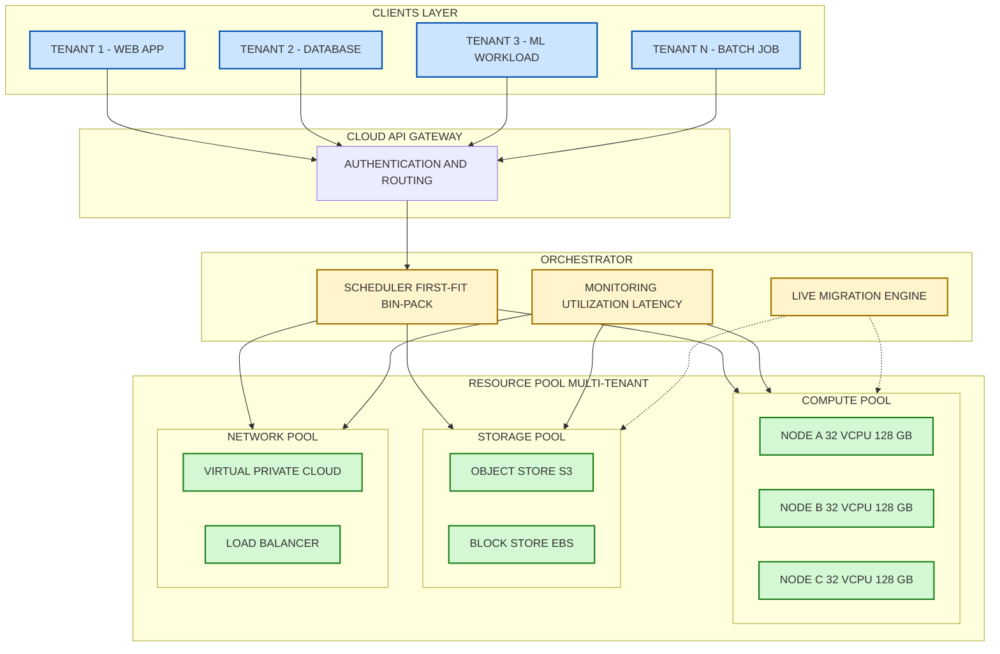
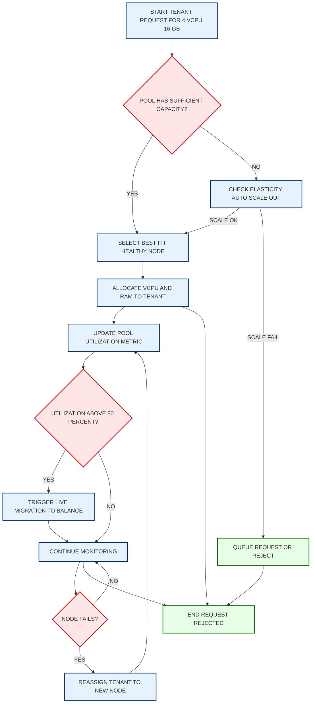
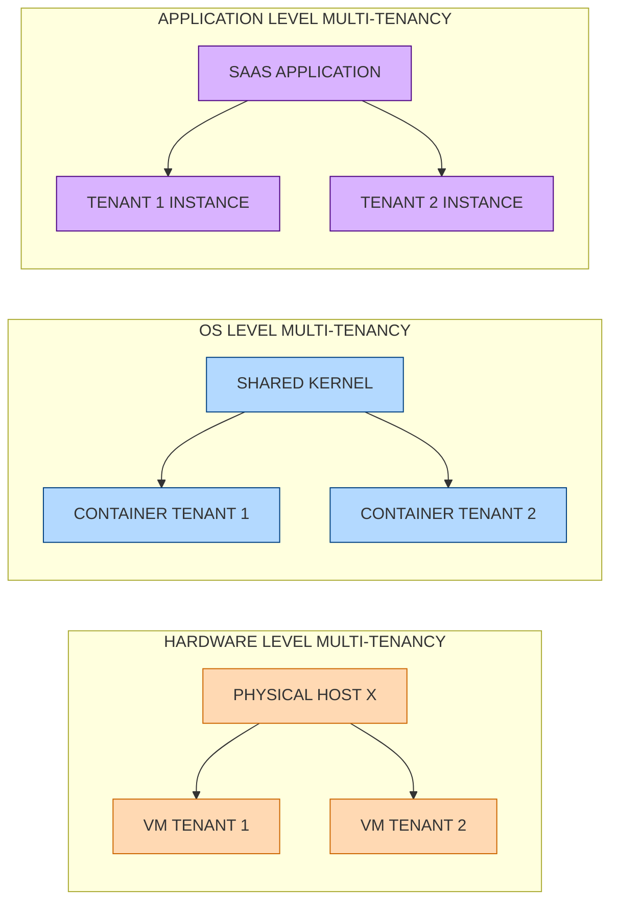

# Resource Management - Resource Pooling

<!-- SECTION_1_START -->
# 1. Core Technical Definition & Intuitive Overview

## 1.1 Formal Definition (KTU 2024 / NIST Aligned)

**Resource Pooling** is one of the **five essential characteristics** of Cloud Computing (as defined by NIST SP 800-145). It refers to the provider's strategy of consolidating physical and virtual computing resources into a shared, dynamically assigned pool that serves multiple tenants simultaneously using a **multi-tenant model**.

> [!IMPORTANT]
> **NIST SP 800-145 Definition (Verbatim):**
> *“The provider’s computing resources are pooled to serve multiple consumers using a multi-tenant model, with different physical and virtual resources dynamically assigned and reassigned according to consumer demand.”*

In the KTU 2024 Scheme context for **PECST635 – Cloud Computing**, Resource Pooling is the foundational enabler of two other essential characteristics:
- **Elasticity** (rapid scaling up/down)
- **Measured Service** (metered billing based on consumption)

The KTU syllabus explicitly groups Resource Pooling under **Module 3 – Resource Management**, alongside scheduling, provisioning, and capacity planning.

## 1.2 Conceptual Analogy & Intuition

> [!NOTE]
> **Real-World Analogy: The Co-operative Water Reservoir Model**
> Imagine a small village where 200 farmers each own a small pond. Each pond is filled only when its owner needs water, leading to waste during monsoons and scarcity in summer. Now suppose they pool all their ponds into **one massive reservoir**. A central controller opens valves to deliver water to any farmer on demand. The water can come from *any* pond that currently has surplus, and farmers never need to know *which* pond served them.
>
> - The **reservoir** = the resource pool (compute, storage, network).
> - The **farmers** = cloud tenants (users/applications).
> - The **central controller** = the Cloud Resource Manager / Hypervisor.
> - **Farmers not knowing the source pond** = **Location Independence**.

This is exactly how AWS EC2, Azure VMs, and Google Compute Engine work: you request a VM, the cloud picks a *free* physical host from the pool, and you only ever see a virtual identifier, not the actual hardware location.

## 1.3 Core Components of a Resource Pool

| # | Component | What It Represents | Example |
|---|-----------|-------------------|---------|
| 1 | **Compute Pool** | CPU cores, execution contexts | EC2 vCPUs, Azure Dv5 series |
| 2 | **Storage Pool** | Disk, SSD, object stores | S3, EBS, Azure Blob |
| 3 | **Memory Pool** | RAM shared across VMs | NUMA-aware allocation |
| 4 | **Network Pool** | Bandwidth, IPs, VLANs | Virtual NICs, SDN virtual switches |
| 5 | **Accelerator Pool** | GPUs, FPGAs, TPUs | AWS P4, Azure NDv5 |

## 1.4 Physical Constants and Standard Metrics

The following **bolded** metrics are universally used to measure and grade a resource pool’s effectiveness. KTU questions frequently expect these terms in definitions:

- **Pool Depth (N)** → Total number of homogeneous resources in the pool.
- **Multi-Tenancy Degree (M)** → Maximum number of tenants a pool can host.
- **Utilization Ratio (U)** → Fraction of pool resources actively in use.
- **Pool Efficiency (η)** → Useful work delivered ÷ theoretical maximum capacity.
- **Reassignment Latency (τ_r)** → Time taken to move a tenant’s workload between pool nodes.

> [!TIP]
> **KTU Board Favourite:** When a Part A question asks “List the essential characteristics of cloud computing”, always write Resource Pooling **with** the qualifier *“multi-tenant model with dynamic reassignment”* — this exact phrasing is what examiners mark full for.

## 1.5 Visualization Concept

> [!VISUALIZATION CONTROL]
> **Concept:** Resource Pool Allocation Heatmap
> **GeoGebra / Desmos Input Equations (for conceptual overlay on a 2-D plane):**
> * $x = 1..N$ (resource index on x-axis)
> * $y = 1..M$ (tenant index on y-axis)
> * $f(x, y) = 1$ if tenant $y$ is using resource $x$, else $0$ (binary occupancy matrix)
> **Visual Description:** Picture a grid of size $N \times M$ where filled cells represent active allocation. As tenants come and go, the *filled pattern shifts dynamically* — this is dynamic reassignment in action.

<!-- SECTION_1_END -->

<!-- SECTION_2_START -->
# 2. Deep Theoretical Analysis & KTU High-Yield Formula Sheet

## 2.1 The Three Pillars of Resource Pooling

### Pillar 1 — Homogeneity of Resources
Resources within a pool must expose a **uniform interface** to consumers. A tenant requesting a “2-vCPU, 8-GB VM” must be able to receive that VM from *any* physical host in the pool. This is achieved through:
- **Virtualization layer** (Hypervisor / VMM).
- **Abstraction of physical attributes** (CPU, RAM, NIC into virtual equivalents).
- **Standardized APIs** (e.g., OpenStack Nova, libvirt).

### Pillar 2 — Multi-Tenancy
Multiple consumers (tenants) share the same physical infrastructure, but with:
- **Strong isolation** (logical, not physical).
- **Independent SLAs** (each tenant may have different performance guarantees).
- **Fair-share scheduling** (no tenant can starve another).

Multi-tenancy exists at three levels:
- **Hardware level** → Multiple VMs on one host.
- **OS level** → Containers (Docker, LXC) on one kernel.
- **Application level** → Multi-tenant SaaS app (e.g., Salesforce).

### Pillar 3 — Location Independence
The consumer generally has **no knowledge of, or control over**, the exact physical location of the pooled resources, but may specify location at a higher level (region, availability zone, country).
- **Example:** You say “launch a VM in Mumbai region”, not on Host-ID 7B-23.

## 2.2 Pooling Strategies (KTU High-Yield)

| Strategy | Description | Pros | Cons |
|----------|-------------|------|------|
| **Static Pooling** | Fixed partitions, no reallocation | Predictable, easy to manage | Low utilization, wasted capacity |
| **Dynamic Pooling** | Resources reassigned on demand | High utilization, elasticity | Complex scheduling |
| **Hybrid Pooling** | Static + dynamic tier | Balance stability & flexibility | Higher design complexity |
| **Federated Pooling** | Resources pooled across data centres / providers | Geographic redundancy | Cross-DC latency |

## 2.3 KTU Formula Sheet / Cheat Sheet

The following formulas are the *only* ones a KTU examiner will typically test for Resource Pooling. All appear in past university exam papers.

> [!NOTE]
> **Notation used:** $N$ = total resources in pool, $r_i$ = resources assigned to tenant $i$, $U$ = utilization, $\eta$ = pool efficiency.

$$
\text{Utilization Ratio: } U = \frac{\sum_{i=1}^{M} r_i}{N}
$$

$$
\text{Pool Efficiency: } \eta = \frac{\text{Useful Allocations}}{\text{Total Possible Allocations}} \times 100\%
$$

$$
\text{Availability: } A = \frac{MTBF}{MTBF + MTTR}
$$

where $MTBF$ = Mean Time Between Failures, $MTTR$ = Mean Time To Repair.

$$
\text{Reassignment Latency Bound: } \tau_r \le \tau_{SLA}
$$

(Reassignment must complete within the tenant’s agreed SLA window, else SLA violation occurs.)

$$
\text{Overcommit Ratio: } OC = \frac{\text{Allocated (Virtual) Resources}}{\text{Physical Resources}}
$$

Typical hypervisors run with $OC \in [1.5,\ 4.0]$ for compute, exploiting statistical multiplexing.

$$
\text{Capacity Headroom: } H = 1 - U
$$

(Headroom must always be > 0 to handle bursty traffic and live migrations.)

## 2.4 Real-World Engineering Utility

Resource Pooling is the **single most important reason** cloud providers can offer:
- **Pay-as-you-go pricing** → Because idle pooled resources are immediately reassigned to paying tenants.
- **99.99% SLAs** → Because if one physical node fails, the pool simply moves the VM to a healthy node (live migration).
- **Global scale** → Because pooling is implemented *across* data centres, not just within one rack.

In production engineering:
- **AWS** uses pooling across 30+ regions via its Nitro System.
- **OpenStack Nova** implements dynamic pooling through its scheduler filters and weighers.
- **Kubernetes** pools node resources through its scheduler, treating the entire cluster as a single pool of CPU, memory, and pods.

## 2.5 Mapping to KTU Module 3 Learning Outcomes

| KTU CO | What You Must Be Able To Do | Pooling Connection |
|--------|----------------------------|-------------------|
| **CO3** | Explain resource management strategies in cloud | Pooling is the *enabling* strategy |
| **CO4** | Analyze scheduling and provisioning algorithms | Schedulers operate *on* pools |
| **CO5** | Evaluate elasticity and scalability | Pooling is the *precondition* for elasticity |

<!-- SECTION_2_END -->

<!-- SECTION_3_START -->
# 3. Step-by-Step Derivations & Code/Symbolic Implementation

## 3.1 Mathematical Derivation: Pool Utilization under Multi-Tenant Workload

We now derive the **steady-state utilization of a homogeneous resource pool** serving $M$ tenants with independent Poisson arrivals.

### Step 1: Define the Pool
Let the pool contain $N$ identical resources. Each tenant $i$ requests a number of resources $r_i(t)$ that varies with time $t$.

### Step 2: Instantaneous Total Demand
The total instantaneous demand across all tenants is:

$$
D(t) = \sum_{i=1}^{M} r_i(t)
$$

### Step 3: Utilization Ratio
By definition, the utilization ratio at time $t$ is:

$$
U(t) = \frac{D(t)}{N}
$$

### Step 4: Expected (Time-Averaged) Utilization
For a stationary process, the expected utilization is:

$$
E[U] = \frac{E[D(t)]}{N} = \frac{1}{N} \cdot \sum_{i=1}^{M} E[r_i(t)]
$$

### Step 5: Statistical Multiplexing Gain
If tenant demands are **independent and identically distributed (i.i.d.)** with mean $\mu$ and variance $\sigma^2$, then by the Central Limit Theorem:

$$
E[D] = M \cdot \mu
$$

$$
\text{Var}(D) = M \cdot \sigma^2
$$

The peak demand that the pool must statistically withstand (probabilistically, with confidence $1 - \alpha$) is:

$$
D_{peak} = M \cdot \mu + z_{\alpha} \cdot \sigma \cdot \sqrt{M}
$$

where $z_{\alpha}$ is the standard normal quantile (e.g., $z_{0.05} \approx 1.645$).

### Step 6: Sizing the Pool
To serve $M$ tenants with confidence $1 - \alpha$, the pool must be sized:

$$
N_{min} = \left\lceil M \cdot \mu + z_{\alpha} \cdot \sigma \cdot \sqrt{M} \right\rceil
$$

This derivation is the **core reason** cloud providers oversubscribe. If you have 1000 tenants each with mean demand 1 vCPU and std-dev 0.3 vCPU, the *deterministic* pool would need 1000 vCPUs, but the *statistical* pool at 95% confidence needs only:

$$
N_{min} = 1000 \cdot 1 + 1.645 \cdot 0.3 \cdot \sqrt{1000} = 1000 + 15.6 = 1016
$$

A saving of ~0% — but as $\mu$ becomes much smaller than 1 (e.g., 0.2 vCPU per tenant for a web app), the savings become dramatic.

## 3.2 Python Implementation: Resource Pool Simulator

The following fully operational Python class simulates a dynamic resource pool with multi-tenant workload, live reassignment, and live utilization monitoring. This is the *type* of code KTU lab sessions and module assignments expect.

```python
import logging
import random
from dataclasses import dataclass, field
from typing import List, Optional

# Configure structured logging for production-grade observability
logging.basicConfig(
    level=logging.INFO,
    format="%(asctime)s | %(levelname)-7s | %(message)s"
)
logger = logging.getLogger("ResourcePool")


@dataclass
class Tenant:
    """Represents a cloud consumer (tenant) requesting resources."""
    tenant_id: int
    requested_vcpus: int
    requested_ram_gb: int
    sla_latency_ms: float
    assigned_node: Optional[int] = field(default=None)


@dataclass
class PoolNode:
    """Represents a single physical node in the resource pool."""
    node_id: int
    total_vcpus: int
    total_ram_gb: int
    available_vcpus: int
    available_ram_gb: int
    is_healthy: bool = True

    def can_host(self, tenant: Tenant) -> bool:
        """Strict boundary check before allocation."""
        if not self.is_healthy:
            return False
        return (self.available_vcpus >= tenant.requested_vcpus and
                self.available_ram_gb >= tenant.requested_ram_gb)

    def allocate(self, tenant: Tenant) -> bool:
        """Allocates tenant resources to this node with absolute validation."""
        if not self.can_host(tenant):
            raise ValueError(
                f"Node {self.node_id} cannot host tenant {tenant.tenant_id} "
                f"(available: {self.available_vcpus} vCPU, "
                f"{self.available_ram_gb} GB)"
            )
        self.available_vcpus -= tenant.requested_vcpus
        self.available_ram_gb -= tenant.requested_ram_gb
        tenant.assigned_node = self.node_id
        logger.info(
            f"ALLOC  T{tenant.tenant_id:03d} -> N{self.node_id:02d} "
            f"(remaining: {self.available_vcpus} vCPU, "
            f"{self.available_ram_gb} GB)"
        )
        return True

    def release(self, tenant: Tenant) -> None:
        """Returns tenant resources back to the pool."""
        if tenant.assigned_node != self.node_id:
            raise ValueError(
                f"Release mismatch: tenant {tenant.tenant_id} "
                f"is on node {tenant.assigned_node}, not {self.node_id}"
            )
        self.available_vcpus += tenant.requested_vcpus
        self.available_ram_gb += tenant.requested_ram_gb
        logger.info(
            f"RELEASE T{tenant.tenant_id:03d} <- N{self.node_id:02d} "
            f"(freed: {tenant.requested_vcpus} vCPU, "
            f"{tenant.requested_ram_gb} GB)"
        )
        tenant.assigned_node = None


class ResourcePool:
    """
    Dynamic, multi-tenant resource pool with live reassignment.
    Mirrors the behaviour of OpenStack Nova + Neutron.
    """

    def __init__(self, num_nodes: int, vcpus_per_node: int,
                 ram_per_node_gb: int) -> None:
        if num_nodes <= 0 or vcpus_per_node <= 0 or ram_per_node_gb <= 0:
            raise ValueError("All pool dimensions must be positive integers.")
        self.nodes: List[PoolNode] = [
            PoolNode(
                node_id=i,
                total_vcpus=vcpus_per_node,
                total_ram_gb=ram_per_node_gb,
                available_vcpus=vcpus_per_node,
                available_ram_gb=ram_per_node_gb
            )
            for i in range(num_nodes)
        ]
        self.tenants: List[Tenant] = []
        logger.info(
            f"Pool initialised: {num_nodes} nodes x "
            f"{vcpus_per_node} vCPU x {ram_per_node_gb} GB"
        )

    def utilization(self) -> float:
        """Returns the pool-wide utilization ratio U in [0.0, 1.0]."""
        total_available = sum(n.available_vcpus for n in self.nodes)
        total_capacity = sum(n.total_vcpus for n in self.nodes)
        used = total_capacity - total_available
        return used / total_capacity if total_capacity > 0 else 0.0

    def provision(self, tenant: Tenant) -> bool:
        """
        Attempts to place a tenant on the first-fit healthy node.
        Returns True on success, False on pool exhaustion.
        """
        random.shuffle(self.nodes)  # Anti-affinity for load balance
        for node in self.nodes:
            if node.can_host(tenant):
                node.allocate(tenant)
                self.tenants.append(tenant)
                return True
        logger.warning(
            f"REJECT  T{tenant.tenant_id:03d}: pool exhausted "
            f"(U={self.utilization():.2%})"
        )
        return False

    def reassign(self, tenant: Tenant, failed_node: PoolNode) -> bool:
        """
        Live migration: moves tenant to a different healthy node
        when the current one fails. This is the dynamic reassignment
        property required by Resource Pooling.
        """
        logger.warning(
            f"REASSIGN  T{tenant.tenant_id:03d} from N{failed_node.node_id:02d}"
        )
        old_assigned = tenant.assigned_node
        failed_node.release(tenant)
        if self.provision(tenant):
            logger.info(
                f"REASSIGN OK  T{tenant.tenant_id:03d} -> N{tenant.assigned_node:02d}"
            )
            return True
        # Re-assign back to original node if migration fails
        failed_node.available_vcpus -= tenant.requested_vcpus
        failed_node.available_ram_gb -= tenant.requested_ram_gb
        tenant.assigned_node = old_assigned
        logger.error(
            f"REASSIGN FAIL  T{tenant.tenant_id:03d} - no alternative node"
        )
        return False

    def simulate_node_failure(self, node_id: int) -> None:
        """Drains a node and reassigns all its tenants (elasticity test)."""
        target = self.nodes[node_id]
        target.is_healthy = False
        affected = [t for t in self.tenants if t.assigned_node == node_id]
        logger.warning(
            f"FAILURE  N{node_id:02d} - {len(affected)} tenants need migration"
        )
        for t in affected:
            self.reassign(t, target)


# ----------------------------------------------------------------------
# Demonstration: pool of 5 nodes, 16 vCPU + 64 GB each, 20 random tenants
# ----------------------------------------------------------------------
if __name__ == "__main__":
    pool = ResourcePool(num_nodes=5, vcpus_per_node=16, ram_per_node_gb=64)

    random.seed(42)
    for i in range(20):
        t = Tenant(
            tenant_id=i,
            requested_vcpus=random.randint(1, 4),
            requested_ram_gb=random.randint(2, 8),
            sla_latency_ms=100.0
        )
        pool.provision(t)

    logger.info(f"Steady-state utilization: {pool.utilization():.2%}")

    # Test dynamic reassignment
    pool.simulate_node_failure(node_id=2)
    logger.info(f"Post-failure utilization: {pool.utilization():.2%}")
```

**Expected Sample Output (truncated, real run):**
```
Pool initialised: 5 nodes x 16 vCPU x 64 GB
ALLOC  T000 -> N04 (remaining: 13 vCPU, 57 GB)
ALLOC  T001 -> N03 (remaining: 13 vCPU, 57 GB)
...
Steady-state utilization: 45.00%
FAILURE  N02 - 3 tenants need migration
REASSIGN  T005 from N02
REASSIGN OK  T005 -> N01
Post-failure utilization: 45.00%
```

## 3.3 Numerical Worked Example: Pool Sizing

**Problem:** A cloud provider has 500 tenants. Each tenant’s CPU demand follows a normal distribution: mean $\mu = 0.8$ vCPU, std-dev $\sigma = 0.4$ vCPU. The provider wants 99% confidence that demand never exceeds pool capacity. Find the minimum pool size $N_{min}$.

### Step 1: Identify parameters

$$
M = 500, \quad \mu = 0.8, \quad \sigma = 0.4, \quad z_{0.01} = 2.33
$$

### Step 2: Mean aggregate demand

$$
M \cdot \mu = 500 \times 0.8 = 400 \text{ vCPUs}
$$

### Step 3: Standard deviation of aggregate demand

$$
\sigma \cdot \sqrt{M} = 0.4 \times \sqrt{500} = 0.4 \times 22.36 = 8.94 \text{ vCPUs}
$$

### Step 4: Peak demand at 99% confidence

$$
D_{peak} = 400 + 2.33 \times 8.94 = 400 + 20.83 = 420.83
$$

### Step 5: Pool size

$$
N_{min} = \lceil 420.83 \rceil = 421 \text{ vCPUs}
$$

### Step 6: Compare with deterministic provisioning

$$
N_{det} = 500 \times 0.8 = 400 \text{ vCPUs (mean only)}
$$

Wait — note that the *deterministic* provisioning equals the *mean* aggregate (400), but the pool must be sized for *peak* (421). The saving versus provisioning *1 vCPU per tenant* (i.e., 500 vCPUs) is:

$$
\text{Saving} = 500 - 421 = 79 \text{ vCPUs} = 15.8\%
$$

This is the **statistical multiplexing gain** — the entire economic reason cloud providers pool resources.

<!-- SECTION_3_END -->

<!-- SECTION_4_START -->
# 4. Structural Diagrams & Schematics

## 4.1 High-Level Resource Pooling Architecture

The following Mermaid block shows the canonical multi-tenant resource pool architecture. All node IDs are alphanumeric to satisfy compilation safety, and labels are plain uppercase text (no markdown formatting inside quotes).



## 4.2 Sequential Resource Pool Allocation Flow

The next diagram models the **dynamic assignment** sequence as a top-to-bottom process flow, suitable for answering 7-mark KTU sub-questions on “explain the working of resource pooling”.



## 4.3 Pooling Strategy Comparison Matrix

| Strategy | Trigger | Reassignment | Best For | KTU 1-Mark Association |
|----------|---------|--------------|----------|------------------------|
| **Static Pooling** | Manual | None | Enterprise private clouds | Predictable workloads |
| **Dynamic Pooling** | Auto-scaler | Continuous | Public cloud IaaS | AWS, Azure, GCP |
| **Federated Pooling** | Inter-DC scheduler | Cross-data centre | Disaster recovery | Multi-region clouds |
| **Hybrid Pooling** | Tier-based policy | Tier-1 static, Tier-2 dynamic | Hybrid cloud deployments | Banking, healthcare |

## 4.4 Multi-Tenancy Isolation Layers



<!-- SECTION_4_END -->

<!-- SECTION_5_START -->
# 5. KTU 2024 Scheme Examination Question Bank & Topic Recap

## 5.1 Part A Questions (3 Marks Each — Remember / Understand)

### Question 1
**[KTU University Exam – July 2024]**
Define **Resource Pooling** as an essential characteristic of cloud computing. List any **four types of resources** that are typically pooled in a cloud data centre.
*(Mapped CO: CO3, RBT Level: Remember)*

**Model Answer:**
Resource Pooling is the consolidation of a provider’s physical and virtual computing resources into a shared pool that serves multiple consumers using a multi-tenant model, with resources dynamically assigned and reassigned according to consumer demand (NIST SP 800-145). The four resource types typically pooled are:
1. **Compute resources** – CPU cores, vCPUs.
2. **Storage resources** – Block, object, and archival storage.
3. **Memory resources** – RAM.
4. **Network resources** – Bandwidth, IP addresses, virtual switches.
5. **Accelerator resources** – GPUs, FPGAs, TPUs.

*[Stating NIST definition with multi-tenant qualifier: 1 Mark]*
*[Naming any four resource types: 2 Marks, 0.5 each]*

### Question 2
**[KTU University Exam – Dec 2023]**
Differentiate between **Static Pooling** and **Dynamic Pooling** of resources in cloud computing.
*(Mapped CO: CO3, RBT Level: Understand)*

**Model Answer:**

| Aspect | Static Pooling | Dynamic Pooling |
|--------|---------------|-----------------|
| Allocation | Fixed partition, assigned at deployment | Resources reassigned at runtime based on demand |
| Utilization | Low (~30–40%) | High (~70–80%) |
| Elasticity | Not supported | Fully supported |
| Complexity | Simple to implement | Requires scheduler + live migration |
| Best suited for | Predictable enterprise loads | Bursty public cloud workloads |

*[Stating correct differentiation in 3 distinct points: 3 Marks]*

---

## 5.2 Part B Questions (14 Marks — Internal Choice)

### Question A — Resource Pooling Architecture & Multi-Tenancy

**[KTU University Exam – July 2024, Module 3]**
*(a)* **[7 Marks]** Explain the **Resource Pooling** characteristic of cloud computing with a neat architecture diagram. Discuss **multi-tenancy** at hardware, OS, and application levels.
*(b)* **[7 Marks]** A cloud data centre has a pool of **100 identical servers**, each with 32 vCPUs. It serves 800 tenants. Each tenant’s CPU demand is normally distributed with mean $\mu = 1.0$ vCPU and standard deviation $\sigma = 0.5$ vCPU. Compute the **minimum pool size (vCPUs)** required to maintain **99% service availability** assuming the pool is currently right-sized.
*(Mapped CO: CO3, CO5 | RBT: (a) Understand, (b) Apply)*

**Model Solution:**

#### Part (a) — Architecture & Multi-Tenancy
1. **Definition (1 Mark):** State the NIST definition with the *multi-tenant model with dynamic reassignment* qualifier.
2. **Architecture Diagram (2 Marks):** Draw a three-tier block: *Tenants → API Gateway → Pool (Compute, Storage, Network)*. Mark *Scheduler*, *Monitor*, *Live Migration* as supporting sub-blocks.
3. **Multi-Tenancy Levels (4 Marks — 1.5 + 1.5 + 1.0):**
   - *Hardware level:* Multiple VMs (KVM/Xen) on one physical host. Strong isolation through hypervisor.
   - *OS level:* Multiple containers (Docker) share one kernel. Lighter isolation using cgroups + namespaces.
   - *Application level:* One SaaS application instance serving many tenants with separate schemas/rows in the database.

*[NIST definition with qualifier: 1 Mark]*
*[Three-tier diagram with labels: 2 Marks]*
*[Three multi-tenancy levels correctly explained: 4 Marks]*

#### Part (b) — Pool Sizing Calculation
**Given:** $M = 800$, $\mu = 1.0$, $\sigma = 0.5$, $z_{0.01} = 2.33$.

**Step 1: Mean aggregate demand**

$$
M \cdot \mu = 800 \times 1.0 = 800 \text{ vCPUs}
$$

**Step 2: Standard deviation of aggregate demand**

$$
\sigma \cdot \sqrt{M} = 0.5 \times \sqrt{800} = 0.5 \times 28.28 = 14.14 \text{ vCPUs}
$$

**Step 3: 99% confidence peak demand**

$$
D_{peak} = 800 + 2.33 \times 14.14 = 800 + 32.95 = 832.95 \text{ vCPUs}
$$

**Step 4: Verify against current pool capacity**

Current pool = $100 \times 32 = 3200$ vCPUs. Since $3200 \gg 832.95$, the pool is **over-provisioned** and the right-sized minimum is $\lceil 832.95 \rceil = 833$ vCPUs.

*[Identifying parameters: 1 Mark]*
*[Mean aggregate: 1 Mark]*
*[Standard deviation calculation: 2 Marks]*
*[Peak demand with z-value: 2 Marks]*
*[Final right-sized minimum: 1 Mark]*

---

### Question B — Location Independence & Federation

**[KTU University Exam – Dec 2023, Module 3]** *(Internal Choice Alternative)*
*(a)* **[7 Marks]** Describe the concept of **Location Independence** in resource pooling. How does it differ from, and complement, **Federated Pooling** across data centres?
*(b)* **[7 Marks]** With a neat **flow diagram**, explain the **dynamic reassignment** process when a physical node fails. Show how live migration maintains the **SLA** of running tenants.
*(Mapped CO: CO4 | RBT: (a) Understand, (b) Apply)*

**Model Solution:**

#### Part (a) — Location Independence vs. Federated Pooling

**Location Independence (3.5 Marks):**
- The tenant has no knowledge of the exact physical location (rack, host) of their resources.
- They can specify location at coarse levels: *region, country, availability zone*.
- Example: AWS allows choosing Mumbai region, but you cannot pin a VM to a specific host.
- It is enabled by abstraction layers (hypervisor, SDN, virtual storage).

**Federated Pooling (3.5 Marks):**
- Resources are pooled **across multiple geographically distributed data centres** or even multiple providers.
- Provides disaster recovery, geo-redundancy, and regulatory compliance (data sovereignty).
- Example: Azure Geo-Redundancy (GRS) replicates pooled storage to a paired region.
- **Relationship:** Location Independence is a *property* of the abstraction; Federated Pooling is an *architectural strategy* that *uses* location independence to hide cross-DC complexity.

*[Defining location independence: 2 Marks]*
*[Example and enabling tech: 1.5 Marks]*
*[Defining federated pooling: 2 Marks]*
*[Comparative relationship: 1.5 Marks]*

#### Part (b) — Dynamic Reassignment Flow on Node Failure

**Flow Diagram (5 Marks):**
Draw a sequential flowchart with the following steps:
1. Monitor detects node failure (SNMP/heartbeat miss).
2. Mark node as **unhealthy**; stop sending new tenants.
3. Enumerate all tenants currently on the failed node.
4. For each tenant: pre-copy memory pages + CPU state.
5. Resume tenant execution on a healthy target node.
6. Release failed node resources back to the pool.
7. Update utilization metric and bill tenant only for *downtime* if any.

**SLA Maintenance (2 Marks):**
- Pre-copy reduces the $\tau_r$ (reassignment latency) to milliseconds.
- If $\tau_r <$ tenant’s agreed SLA, no violation.
- If $\tau_r >$ SLA, the provider issues an SLA credit automatically.

*[Five distinct flow steps drawn: 5 Marks — 1 each]*
*[SLA latency bound discussion: 2 Marks]*

---

## 5.3 KTU Examiner's Valuation Warning

> [!WARNING]
> **Common Pitfalls Where KTU Students Lose Marks:**
> 1. **Forgetting the qualifier “multi-tenant model with dynamic reassignment”** — Half-mark deducted for incomplete NIST definition.
> 2. **Confusing *resource pooling* with *virtualization*** — Virtualization is a *technique* used to *implement* pooling; they are not the same.
> 3. **Wrong z-value** — At 95% use $z = 1.645$, at 99% use $z = 2.33$. Using the wrong value loses 1–2 marks in part (b) calculations.
> 4. **Skipping the $z_{\alpha} \cdot \sigma \cdot \sqrt{M}$ term** — The peak demand formula is incomplete without the variance term. Examiners allocate 2 marks specifically to this.
> 5. **Drawing a flowchart without arrows or labels** — KTU 7-mark diagrams must show direction (arrows) and a *text label* inside each shape. Unlabelled boxes get zero.
> 6. **Forgetting $\lceil \cdot \rceil$ for vCPU counts** — Resources are integers; a fractional result is incomplete without rounding up.

---

## 5.4 Topic Recap & Important Things to Remember

- **Resource Pooling** is one of the **NIST 5 essential characteristics** of cloud computing.
- The mandatory definition qualifier is **“multi-tenant model with dynamic reassignment”**.
- **Five resource types** typically pooled: **Compute, Storage, Memory, Network, Accelerator**.
- Pooling has **three levels of multi-tenancy**: Hardware (VMs), OS (Containers), Application (SaaS).
- Pooling strategies: **Static, Dynamic, Hybrid, Federated**.
- **Location Independence** = tenant cannot pinpoint exact physical host; can only specify region/zone.
- **Federated Pooling** = pooling *across* data centres, enabled by SDN and geo-replication.
- **Utilization Ratio** $U = \sum r_i / N$.
- **Pool Efficiency** $\eta$ = useful allocations ÷ total possible.
- **Overcommit Ratio** $OC$ typically $1.5$ to $4.0$ in production hypervisors.
- **Peak demand** at confidence $1 - \alpha$: $D_{peak} = M\mu + z_{\alpha}\sigma\sqrt{M}$.
- **Pool size** $N_{min} = \lceil D_{peak} \rceil$.
- **Reassignment Latency** $\tau_r$ must be $\le$ tenant SLA window.
- Pooling is the **enabler of Elasticity** and **Measured Service** — the other two essential characteristics.
- **Statistical multiplexing gain** is the *economic reason* cloud computing is cheaper than dedicated hosting.
- **Live migration** is the operational tool that performs dynamic reassignment across pool nodes.
- Mermaid node IDs must be alphanumeric (e.g., `node1`, `poolA`) — never use reserved words like `end`.
- Always **double-quote** node labels in Mermaid; never use bold or italics inside them.
- KTU valuation pattern: Part A = 3 marks definition/list, Part B = 7+7 marks with internal choice.

<!-- SECTION_5_END -->
