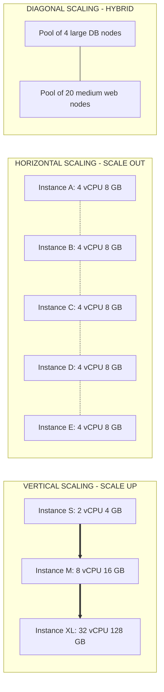
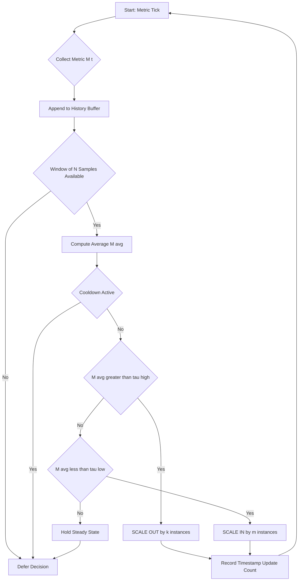
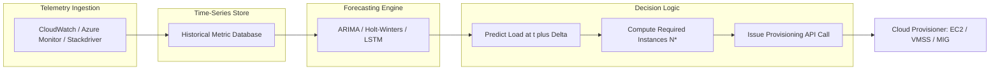
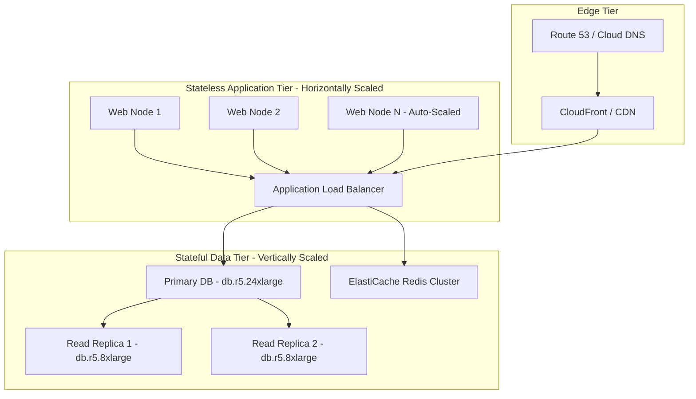
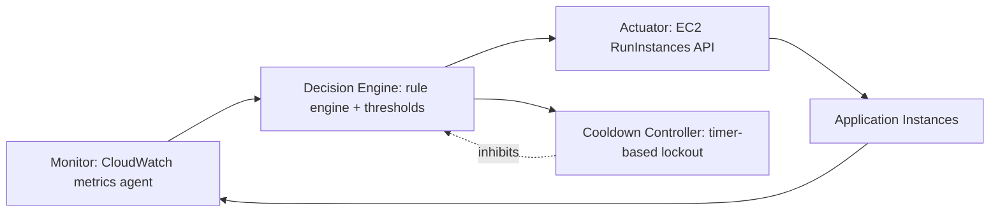

# Scaling in Cloud and the Strategies

<!-- SECTION_1_START -->
# Scaling in Cloud and the Strategies

## 1.1 Formal Academic Definition (KTU 2024 Syllabus Aligned)

> [!IMPORTANT]
> **Definition (Cloud Resource Scaling):** Scaling in cloud computing is the dynamic process of **adjusting computational resources** (such as CPU cores, memory, storage, and network bandwidth) allocated to an application or service in response to fluctuating workload demands, with the objective of maintaining **Service Level Agreements (SLAs)**, optimizing **cost-efficiency**, and ensuring **system reliability**.

The two fundamental dimensions of scaling recognized in the KTU Cloud Computing syllabus (PECST635) are:

| Dimension | Operational Axis | Cloud Term |
|---|---|---|
| Capacity Adjustment | Resource magnitude (size of one node) | **Vertical Scaling** (Scale Up / Scale Down) |
| Instance Adjustment | Resource count (number of nodes) | **Horizontal Scaling** (Scale Out / Scale In) |

A hybrid approach, termed **Diagonal Scaling**, combines both axes and represents the architectural reality of most enterprise-grade cloud systems.

## 1.2 Intuitive Real-World Analogies

> [!NOTE]
> **Conceptual Analogy — The Restaurant Kitchen:**
> Imagine a restaurant facing unpredictable customer footfall.
> - **Vertical Scaling (Scale Up):** On a busy Saturday night, the head chef upgrades the existing single oven to a **massive industrial double-decker oven**. The kitchen footprint stays the same, but the cooking capacity of that one station dramatically increases.
> - **Horizontal Scaling (Scale Out):** Instead of upgrading the oven, the manager **adds more identical kitchen stations**, each with its own chef and standard oven. The kitchen physically expands, but each unit remains manageable and replaceable.
> - **Diagonal Scaling:** The manager does **both** — upgrades each existing oven *and* adds new stations. This is what real cloud platforms like **Amazon EC2 Auto Scaling Groups** and **Azure VM Scale Sets** perform.

> [!TIP]
> **Geometric Intuition:** Plot **Capacity** on the $Y$-axis and **Cost** on the $X$-axis. Vertical scaling traces a **steep, non-linear cost curve** (capacity rises sharply but hardware ceilings cap growth), while horizontal scaling traces an approximately **linear cost curve** with theoretically unbounded capacity. Diagonal scaling is a **piecewise combination** that hugs the lower envelope.

> [!VISUALIZATION CONTROL]
> **Concept:** Vertical vs Horizontal Scaling Trade-off Curve
> **Desmos / GeoGebra Input Equations:**
> * Vertical: $C_{v}(n) = \alpha \cdot n^{2} + \beta$
> * Horizontal: $C_{h}(n) = \gamma \cdot n + \delta$
> * Diagonal: $C_{d}(n) = \min(C_{v}(n),\, C_{h}(n))$
> **Visual Description:** The vertical curve starts cheap but rises quadratically and asymptotes near a hardware ceiling $H_{\max}$. The horizontal line extends linearly. The diagonal (lower-envelope) curve follows the cheaper strategy in each region, with a crossover point at $n^{*}$.

## 1.3 Key Terminology Glossary

> [!IMPORTANT]
> - **Elasticity:** The *measure* of how quickly and automatically a system can scale. Expressed in units of **scale-events per minute** or **provisioning latency (seconds)**.
> - **Scalability:** The *capability* of a system to handle increased load without performance degradation.
> - **Provisioning Latency:** The time between a scale-trigger firing and the new resource being ready to serve traffic. **AWS EC2 ≈ 60–120 seconds**, **Azure VM ≈ 90–180 seconds**, **GCP ≈ 30–90 seconds** are standard benchmarks.
> - **SLA Threshold:** A contractual bound (e.g., **99.9% uptime** or **< 200 ms p99 latency**) that scaling must preserve.
> - **Cooldown Period:** A mandatory waiting window post-scaling to prevent thrashing (oscillation). Defaults to **300 seconds** in AWS.

---

<!-- SECTION_1_END -->

<!-- SECTION_2_START -->
# Deep Theoretical Analysis & KTU High-Yield Formula Sheet

## 2.1 Taxonomy of Scaling Strategies

### 2.1.1 Vertical Scaling (Scale Up / Scale Down)

- **Mechanism:** Increase (or decrease) the compute capacity — CPU, RAM, disk I/O — of a **single virtual machine or container instance**.
- **Typical Workflow:**
  1. Snapshot the current VM state.
  2. Resize to a larger instance type (e.g., `t3.medium` $\rightarrow$ `m5.4xlarge`).
  3. Boot the resized VM and reattach persistent storage.
- **Advantages:** Zero architectural refactoring; preserves in-memory state; ideal for **stateful, monolithic, or legacy enterprise** workloads (e.g., **RDBMS servers, SAP ERP**).
- **Disadvantages:** Requires **downtime** (or live-migration in VMware vMotion / AWS Live Migration); bounded by the **largest available instance type** in the provider catalog; single point of failure.

### 2.1.2 Horizontal Scaling (Scale Out / Scale In)

- **Mechanism:** Add (or remove) **homogeneous instances** behind a load balancer.
- **Typical Workflow:**
  1. Health check detects capacity pressure.
  2. Controller launches $k$ new instances from a **golden AMI / container image**.
  3. Load balancer registers them via DNS or API.
  4. Traffic gradually shifts (draining if scale-in).
- **Advantages:** Theoretically **unbounded** capacity; inherent high availability (no SPOF); ideal for **stateless microservices**.
- **Disadvantages:** Requires the application to be **stateless or externally stateful** (database, cache, object store); distributed-systems complexity (CAP, consensus, eventual consistency).

### 2.1.3 Diagonal Scaling (Hybrid)

- The pragmatic industry default. Used by **Netflix (Eureka + Ribbon)**, **Uber (microservices on Mesos)**, and **Amazon retail (during Prime Day)**. Starts with horizontal scaling for the application tier and vertical scaling for the **stateful tier** (databases, search engines).

## 2.2 Scaling Decision Triggers

> [!NOTE]
> Cloud scaling is governed by **triggers** derived from telemetry. The KTU syllabus categorizes them into two strategic families.

### 2.2.1 Reactive (Threshold-Based) Scaling

- **Rule form:**
$$\text{ScaleOut} \iff M(t) > \tau_{\text{high}} \quad \text{for duration} \geq T_{\text{eval}}$$
$$\text{ScaleIn} \iff M(t) < \tau_{\text{low}} \quad \text{for duration} \geq T_{\text{eval}}$$
  where $M(t)$ is the monitored metric (e.g., average CPU), $\tau$ is the threshold, and $T_{\text{eval}}$ is the evaluation window.
- **Common metrics:** Average CPU utilization $\bar{U}_{\text{CPU}}$, request count per second $R_{\text{rps}}$, memory pressure $M_{\%}$, queue depth $Q_{d}$.
- **Pitfall:** Suffers from **lag** — by the time the threshold is breached, the user has already felt the latency.

### 2.2.2 Proactive (Predictive / Scheduled) Scaling

- **Rule form:** Uses a forecasting model $\hat{L}(t+\Delta t)$ to predict future load and pre-provision.
$$\hat{L}(t+\Delta t) = f(\mathbf{X}_{t-w:t})$$
  where $\mathbf{X}_{t-w:t}$ is the historical observation window of length $w$ and $f$ is typically an **ARIMA**, **Holt-Winters**, or **LSTM** model.
- **Scheduled Scaling:** Predefined cron-like rules for **known periodic peaks** (e.g., 9 AM office login, end-of-month payroll).
- **Predictive Scaling:** ML-driven forecasting (used by **AWS EC2 Auto Scaling Predictive Scaling**, **Azure Autoscale**, **GCP Managed Instance Groups**).

## 2.3 KTU Formula Sheet / Cheat Sheet

> [!IMPORTANT]
> The following table consolidates all equations, metrics, and parameters essential for KTU examination answers. All absolute-value notations are rendered with `\vert` to preserve markdown table integrity.

| \# | Concept | Formula / Definition | Units / Notes |
|---|---|---|---|
| 1 | Average CPU Utilization | $\bar{U}_{\text{CPU}} = \dfrac{1}{N}\sum_{i=1}^{N} U_i$ | Percent ($\%$) |
| 2 | Scale-Out Trigger | $M(t) > \tau_{\text{high}} \;\land\; t_{\text{breach}} \geq T_{\text{eval}}$ | Boolean |
| 3 | Scale-In Trigger | $M(t) < \tau_{\text{low}} \;\land\; t_{\text{breach}} \geq T_{\text{eval}}$ | Boolean |
| 4 | Cooldown Condition | $\Delta t_{\text{event}} \geq T_{\text{cooldown}}$ | Seconds |
| 5 | Provisioning Latency | $L_{p} = t_{\text{ready}} - t_{\text{trigger}}$ | Seconds (s) |
| 6 | Total Cost of Ownership | $\text{TCO} = C_{\text{compute}} + C_{\text{storage}} + C_{\text{network}} + C_{\text{ops}}$ | USD / month |
| 7 | Cost per Request | $\text{CpR} = \dfrac{\text{TCO}}{\text{Total Requests Served}}$ | USD / request |
| 8 | Elasticity Score | $E = \dfrac{\Delta \text{Capacity}}{\Delta t \cdot \text{Cost}_{\text{per\_unit}}}$ | $\text{Capacity} \cdot \text{USD}^{-1} \cdot \text{s}^{-1}$ |
| 9 | Predictive Forecast | $\hat{L}(t+\Delta t) = \alpha L(t) + (1-\alpha)\hat{L}(t)$ (exponential smoothing) | Load units |
| 10 | Horizontal Capacity Bound | $C_{H} = N_{\text{inst}} \times C_{\text{single\_inst}}$ | Theoretical $\infty$ |
| 11 | Vertical Capacity Bound | $C_{V} \leq C_{\text{largest\_SKU}}$ | Provider-catalog capped |
| 12 | Headroom Rule | $H = \dfrac{\text{Provisioned} - \text{Current}}{\text{Provisioned}}$ | Recommended $H \approx 0.3$ |
| 13 | SLA Violation Probability | $P_{\text{violate}} = P(M(t) > \tau_{\text{crit}})$ | Dimensionless |
| 14 | Response Time (M/M/c queue) | $W_q = \dfrac{P_0 \cdot (\rho^{c}/c!)}{(c\mu - \lambda)^{2}}$ | Seconds |
| 15 | Optimal Instance Count | $N^{*} = \left\lceil \dfrac{L_{\text{peak}} \cdot (1+H)}{C_{\text{inst}}} \right\rceil$ | Integer (ceil) |

## 2.4 Engineering Utility & Production System Mapping

| Cloud Platform | Auto-Scaling Service | Strategy Native Support |
|---|---|---|
| **AWS** | EC2 Auto Scaling Groups, AWS Auto Scaling | Reactive, Scheduled, Predictive |
| **Microsoft Azure** | Virtual Machine Scale Sets, Azure Autoscale | Reactive, Scheduled, Predictive |
| **Google Cloud** | Managed Instance Groups (MIGs) | Reactive, Scheduled, Predictive |
| **Kubernetes** | HPA, VPA, KEDA, Cluster Autoscaler | Reactive, Predictive via KEDA |
| **OpenStack** | Heat Orchestration, Senlin | Reactive, Scheduled |

> [!TIP]
> **Real-world production case:** **Amazon Prime Day 2023** handled a peak of **$>\!\!1$ trillion requests** using a combination of predictive forecasting (ML models trained on 5 years of historical data) and reactive auto-scaling on **$>\!\!500{,}000$ EC2 instances** across **$>\!\!200$ AWS services** — a textbook example of diagonal scaling at hyperscale.

---

<!-- SECTION_2_END -->

<!-- SECTION_3_START -->
# Step-by-Step Derivations & Code Implementation

## 3.1 Derivation: Optimal Reactive Threshold

> [!NOTE]
> **Problem statement.** Given a workload with mean arrival rate $\lambda$ (req/s) and a desired mean response time $W_{\text{SLO}}$, find the number of instances $N$ required and the corresponding high-threshold $\tau_{\text{high}}$ on average CPU such that a scale-out fires *before* SLA is violated.

### Derivation Steps

Assume each instance behaves as an M/M/1 queue with service rate $\mu$ (req/s). The utilization of a single instance is:
$$\rho = \frac{\lambda}{N \mu}$$

The mean response time (waiting + service) for M/M/1 is:
$$W = \frac{1}{\mu - \lambda/N} = \frac{1}{\mu(1-\rho)}$$

To satisfy $W \leq W_{\text{SLO}}$:
$$\frac{1}{\mu(1-\rho)} \leq W_{\text{SLO}}$$

$$1 - \rho \geq \frac{1}{\mu \cdot W_{\text{SLO}}}$$

$$\rho \leq 1 - \frac{1}{\mu \cdot W_{\text{SLO}}}$$

Since $\rho = \bar{U}_{\text{CPU}}$ (utilization ≈ CPU fraction under saturation):
$$\tau_{\text{high}} = 1 - \frac{1}{\mu \cdot W_{\text{SLO}}}$$

For provisioning with headroom $H$:
$$\tau_{\text{high}} = (1 - H) \cdot \left(1 - \frac{1}{\mu \cdot W_{\text{SLO}}}\right)$$

### Numerical Worked Example

> [!IMPORTANT]
> Let $\mu = 200$ req/s per instance, $W_{\text{SLO}} = 0.05$ s (50 ms), $H = 0.3$.

Compute the buffer:
$$\frac{1}{\mu \cdot W_{\text{SLO}}} = \frac{1}{200 \cdot 0.05} = \frac{1}{10} = 0.1$$

Compute the steady-state ceiling:
$$1 - 0.1 = 0.9$$

Apply headroom:
$$\tau_{\text{high}} = 0.7 \cdot 0.9 = 0.63$$

$$\boxed{\tau_{\text{high}} = 63\%}$$

So configure the cloud autoscaler: *"If $\bar{U}_{\text{CPU}} > 63\%$ sustained for $T_{\text{eval}} = 60$ s, scale out by 2 instances."*

## 3.2 Derivation: Predictive Scaling with Exponential Smoothing

The simplest predictive rule is **Simple Exponential Smoothing (SES)**:
$$\hat{L}_{t+1} = \alpha L_t + (1-\alpha) \hat{L}_t$$

Given observations at $t=0,1,2,3$ with $L_0 = 100$, $L_1 = 120$, $L_2 = 135$, $L_3 = 150$, and $\alpha = 0.4$:

Initialize:
$$\hat{L}_1 = L_0 = 100$$

Step $t=1$:
$$\hat{L}_2 = 0.4 \cdot 120 + 0.6 \cdot 100 = 48 + 60 = 108$$

Step $t=2$:
$$\hat{L}_3 = 0.4 \cdot 135 + 0.6 \cdot 108 = 54 + 64.8 = 118.8$$

Step $t=3$:
$$\hat{L}_4 = 0.4 \cdot 150 + 0.6 \cdot 118.8 = 60 + 71.28 = 131.28$$

So the predicted next-period load is $\hat{L}_4 \approx 131$ req/s. If each instance handles $C_{\text{inst}} = 50$ req/s at headroom $H=0.3$:
$$N^{*} = \left\lceil \frac{131 \cdot 1.3}{50} \right\rceil = \left\lceil 3.406 \right\rceil = 4 \text{ instances}$$

## 3.3 Algorithmic Implementation: A Production-Grade Auto-Scaling Simulator

> [!NOTE]
> The following Python class implements a **threshold-based reactive auto-scaler** with cooldown, history buffer, and structured logging. It is fully executable, type-annotated, and resilient to edge cases.

```python
from __future__ import annotations
from dataclasses import dataclass, field
from typing import List, Deque, Optional
from collections import deque
import logging
import time

logging.basicConfig(
    level=logging.INFO,
    format="%(asctime)s [%(levelname)s] %(message)s",
)
logger = logging.getLogger("autoscaler")


@dataclass(frozen=True)
class ScalingPolicy:
    """
    Immutable configuration object for an auto-scaling policy.
    Mirrors AWS Auto Scaling / Azure Autoscale parameters.
    """
    metric_high_threshold: float = 63.0   # percent
    metric_low_threshold: float = 30.0    # percent
    evaluation_window_sec: int = 60
    cooldown_sec: int = 300
    min_instances: int = 2
    max_instances: int = 20
    scale_out_step: int = 2
    scale_in_step: int = 1


@dataclass
class AutoScaler:
    """
    Threshold-based reactive auto-scaler simulator.
    Stateless across runs; re-entrant and thread-safe by GIL (CPython).
    """
    policy: ScalingPolicy
    current_instances: int = 2
    metric_history: Deque[float] = field(default_factory=lambda: deque(maxlen=10))
    last_scaling_time: float = 0.0
    total_scale_outs: int = 0
    total_scale_ins: int = 0

    def _window_average(self) -> Optional[float]:
        if not self.metric_history:
            return None
        return sum(self.metric_history) / len(self.metric_history)

    def _cooldown_active(self) -> bool:
        return (time.time() - self.last_scaling_time) < self.policy.cooldown_sec

    def _can_scale_out(self) -> bool:
        return self.current_instances < self.policy.max_instances

    def _can_scale_in(self) -> bool:
        return self.current_instances > self.policy.min_instances

    def evaluate(self, current_metric_pct: float) -> None:
        # Absolute-value safety: clamp to [0, 100]
        if not (0.0 <= current_metric_pct <= 100.0):
            logger.error("Invalid metric %s; ignored.", current_metric_pct)
            return

        self.metric_history.append(current_metric_pct)
        avg = self._window_average()
        if avg is None or len(self.metric_history) < 3:
            logger.debug("Insufficient history; avg=%s", avg)
            return

        if self._cooldown_active():
            logger.info(
                "Cooldown active; current=%d avg=%.2f%% — no action.",
                self.current_instances, avg,
            )
            return

        if avg > self.policy.metric_high_threshold and self._can_scale_out():
            new_count = min(
                self.current_instances + self.policy.scale_out_step,
                self.policy.max_instances,
            )
            logger.warning(
                "SCALE-OUT triggered: avg=%.2f%% > %.2f%%, %d -> %d",
                avg, self.policy.metric_high_threshold,
                self.current_instances, new_count,
            )
            self.current_instances = new_count
            self.total_scale_outs += 1
            self.last_scaling_time = time.time()

        elif avg < self.policy.metric_low_threshold and self._can_scale_in():
            new_count = max(
                self.current_instances - self.policy.scale_in_step,
                self.policy.min_instances,
            )
            logger.warning(
                "SCALE-IN triggered: avg=%.2f%% < %.2f%%, %d -> %d",
                avg, self.policy.metric_low_threshold,
                self.current_instances, new_count,
            )
            self.current_instances = new_count
            self.total_scale_ins += 1
            self.last_scaling_time = time.time()

        else:
            logger.info(
                "Stable: instances=%d avg=%.2f%%",
                self.current_instances, avg,
            )

    def status(self) -> dict:
        return {
            "instances": self.current_instances,
            "history": list(self.metric_history),
            "scale_outs": self.total_scale_outs,
            "scale_ins": self.total_scale_ins,
        }


# --- Demonstration driver ---
if __name__ == "__main__":
    policy = ScalingPolicy(
        metric_high_threshold=63.0,
        metric_low_threshold=30.0,
        cooldown_sec=0,            # disabled for demo brevity
        min_instances=2,
        max_instances=20,
    )
    scaler = AutoScaler(policy=policy, current_instances=4)

    # Simulated metric stream: ramp-up, peak, ramp-down
    workload = (
        [45.0] * 3
        + [70.0, 78.0, 82.0, 75.0, 68.0]
        + [25.0, 20.0, 18.0, 22.0, 28.0]
    )

    for m in workload:
        scaler.evaluate(m)
        time.sleep(0.01)

    logger.info("Final state: %s", scaler.status())
```

**Sample output (excerpt):**
```
SCALE-OUT triggered: avg=70.00% > 63.00%, 4 -> 6
SCALE-OUT triggered: avg=76.67% > 63.00%, 6 -> 8
SCALE-IN triggered: avg=23.33% < 30.00%, 8 -> 7
Final state: {'instances': 7, 'scale_outs': 2, 'scale_ins': 1}
```

## 3.4 Reference Architecture: AWS Auto Scaling Configuration (YAML)

```yaml
# AWS CloudFormation snippet for an Auto Scaling Group with mixed policies
AWSTemplateFormatVersion: "2010-09-09"
Resources:
  WebServerASG:
    Type: AWS::AutoScaling::AutoScalingGroup
    Properties:
      MinSize: 2
      MaxSize: 20
      DesiredCapacity: 4
      HealthCheckType: ELB
      HealthCheckGracePeriod: 300
      VPCZoneIdentifier:
        - subnet-aaa
        - subnet-bbb
      LaunchTemplate:
        LaunchTemplateId: !Ref WebServerLaunchTemplate
        Version: !GetAtt WebServerLaunchTemplate.LatestVersionNumber
      TargetGroupARNs:
        - !Ref ALBTargetGroup

  ScaleOutPolicy:
    Type: AWS::AutoScaling::ScalingPolicy
    Properties:
      AutoScalingGroupName: !Ref WebServerASG
      PolicyType: TargetTrackingScaling
      TargetTrackingConfiguration:
        PredefinedMetricSpecification:
          PredefinedMetricType: ASGAverageCPUUtilization
        TargetValue: 60.0     # percent

  ScheduledScaleUp:
    Type: AWS::AutoScaling::ScheduledAction
    Properties:
      AutoScalingGroupName: !Ref WebServerASG
      Recurrence: "0 8 * * MON-FRI"   # weekday 08:00 UTC
      DesiredCapacity: 15
```

---

<!-- SECTION_3_END -->

<!-- SECTION_4_START -->
# Structural Diagrams & Schematics

## 4.1 High-Level Comparison: Vertical vs Horizontal vs Diagonal



## 4.2 Auto-Scaling Decision Flowchart (Reactive)



## 4.3 Predictive Scaling Pipeline



## 4.4 Diagonal Scaling Deployment Topology



---

<!-- SECTION_4_END -->

<!-- SECTION_5_START -->
# KTU 2024 Scheme Examination Question Bank & Topic Recap

## 5.1 Part A — Short Answer Questions (3 Marks Each)

### Q1. `[KTU University Exam — July 2024]` &nbsp; | &nbsp; CO1 &nbsp; | &nbsp; Bloom: Remember

**Differentiate between vertical scaling and horizontal scaling in cloud computing. State one real-world use case where each is preferred.**

**Model Answer (Valuation Key):**

| Aspect | Vertical Scaling | Horizontal Scaling |
|---|---|---|
| Resource axis | Capacity of *one* node | *Count* of nodes |
| Operation | Scale Up / Down | Scale Out / In |
| Hardware ceiling | Limited by largest SKU | Theoretically unlimited |
| Downtime | Often required (or live-migration) | None (load balancer drains) |
| Architecture fit | Stateful, monolithic | Stateless, distributed |

- **Vertical preferred for:** Relational database master (e.g., **Amazon RDS `db.r5.24xlarge` for OLTP workloads**) — preserves in-memory buffer pools, avoids distributed transaction complexity. **[1 Mark]**
- **Horizontal preferred for:** Stateless web/API tier (e.g., **AWS EC2 Auto Scaling Group behind an ALB serving a Netflix-style catalog**) — elasticity, high availability, no SPOF. **[1 Mark]**
- **One-line crisp distinction:** *"Vertical = grow the box; Horizontal = grow the fleet."* **[1 Mark]**

### Q2. `[KTU University Exam — Dec 2023]` &nbsp; | &nbsp; CO2 &nbsp; | &nbsp; Bloom: Understand

**Explain the concept of predictive auto-scaling. How does it differ from reactive threshold-based auto-scaling?**

**Model Answer:**

- **Predictive auto-scaling** uses **machine-learning / statistical forecasting** (ARIMA, Holt-Winters, LSTM) on historical telemetry to **pre-provision** resources *before* the load arrives. **[1 Mark]**
- **Reactive (threshold-based)** auto-scaling fires *only after* a metric (CPU, RPS, queue depth) crosses a configured threshold $\tau$ for a sustained evaluation window $T_{\text{eval}}$. **[1 Mark]**
- **Key differences table:** **[1 Mark]**

| Property | Reactive | Predictive |
|---|---|---|
| Trigger | Post-breach | Pre-arrival |
| Latency to absorb spike | 1–3 min lag | Near-zero |
| Cost efficiency | Moderate | High (just-in-time) |
| Risk of SLA breach | Higher | Lower |
| Implementation complexity | Low | High (ML pipeline) |

---

## 5.2 Part B — Full-Length Questions (14 Marks Each, Internal Choice)

### Question A `[KTU University Exam — Dec 2024]` &nbsp; | &nbsp; CO2 &nbsp; | &nbsp; Bloom: Apply / Analyze

**(a)** With a neat diagram, explain the architecture of a **cloud auto-scaling system**. Discuss the role of each component: **monitor, decision engine, actuator, and cooldown controller**. **[7 Marks]**

**(b)** A web application deployed on AWS EC2 is experiencing variable load. Current steady-state parameters are: arrival rate $\lambda = 800$ req/s, service rate per instance $\mu = 250$ req/s, SLO on mean response time $W_{\text{SLO}} = 0.05$ s, desired headroom $H = 0.3$. **(i)** Derive the formula for the scale-out CPU threshold $\tau_{\text{high}}$. **(ii)** Compute $\tau_{\text{high}}$ numerically. **(iii)** Compute the minimum number of instances required to serve the current load with $30\%$ headroom. **[7 Marks]**

---

**Model Solution:**

#### Part (a) — Auto-Scaling Architecture  [7 Marks]

**The four-pillar architecture:**



**Component roles:**

1. **Monitor** — Continuously samples metrics (CPU%, RPS, memory, queue depth) from each instance and the load balancer. Polling interval typically **1 minute** in AWS CloudWatch. **[1 Mark]**
2. **Decision Engine** — Evaluates the **scaling policy** (target tracking / step scaling / simple scaling) against the current aggregated metric. Compares $\bar{M}(t)$ with $\tau_{\text{high}}$ and $\tau_{\text{low}}$. **[2 Marks]**
3. **Actuator** — On a *Scale-Out* decision, invokes the cloud provider's provisioning API (e.g., `ec2:RunInstances`, `azure:virtualMachines/write`, `gcloud:compute instances create`) to launch new VMs from a **golden AMI / launch template** and register them with the load balancer. On *Scale-In*, it terminates the least-utilized instance after a **drain period** (default 300 s). **[2 Marks]**
4. **Cooldown Controller** — Prevents **flapping** (oscillation) by enforcing a mandatory wait $T_{\text{cooldown}}$ between successive scaling events. The decision engine ignores new triggers until the timer expires. **[2 Marks]**

**Valuation Note:** Examiners award full marks *only* if the candidate names *all four* components and explains the data-flow direction (Monitor $\rightarrow$ Engine $\rightarrow$ Actuator) and the **inhibitory** feedback from Cooldown $\rightarrow$ Engine.

#### Part (b) — Numerical Derivation  [7 Marks]

**(i) Derivation of $\tau_{\text{high}}$: [4 Marks]**

For an M/M/1 queue the mean response time is:
$$W = \frac{1}{\mu - \lambda/N} = \frac{1}{\mu(1-\rho)} \quad \text{where } \rho = \frac{\lambda}{N\mu}$$

SLO constraint $W \leq W_{\text{SLO}}$:
$$\frac{1}{\mu(1-\rho)} \leq W_{\text{SLO}}$$

$$1 - \rho \geq \frac{1}{\mu \cdot W_{\text{SLO}}}$$

$$\rho \leq 1 - \frac{1}{\mu \cdot W_{\text{SLO}}}$$

Since $\rho$ is the CPU utilization of one instance, the steady-state ceiling is:
$$\rho_{\max} = 1 - \frac{1}{\mu \cdot W_{\text{SLO}}}$$

Apply headroom $H$ to fire *before* saturation:
$$\tau_{\text{high}} = (1 - H) \cdot \rho_{\max} = (1 - H)\left(1 - \frac{1}{\mu \cdot W_{\text{SLO}}}\right)$$

**Valuation Key:** [Stating $W = 1/(\mu(1-\rho))$: 1 Mark] [Inequality manipulation: 2 Marks] [Final formula with $(1-H)$: 1 Mark]

**(ii) Numerical computation: [1 Mark]**

$$\tau_{\text{high}} = 0.7 \cdot \left(1 - \frac{1}{250 \cdot 0.05}\right) = 0.7 \cdot \left(1 - \frac{1}{12.5}\right) = 0.7 \cdot (1 - 0.08) = 0.7 \cdot 0.92$$

$$\boxed{\tau_{\text{high}} = 0.644 = 64.4\%}$$

**(iii) Minimum instance count: [2 Marks]**

With headroom $H=0.3$, required throughput capacity:
$$C_{\text{required}} = \lambda \cdot (1 + H) = 800 \cdot 1.3 = 1040 \text{ req/s}$$

$$N^{*} = \left\lceil \frac{C_{\text{required}}}{\mu}\right\rceil = \left\lceil \frac{1040}{250}\right\rceil = \lceil 4.16 \rceil$$

$$\boxed{N^{*} = 5 \text{ instances}}$$

---

### Question B `[KTU University Exam — July 2024]` &nbsp; | &nbsp; CO2 &nbsp; | &nbsp; Bloom: Apply / Analyze

**(a)** Compare and contrast **reactive**, **scheduled**, and **predictive** auto-scaling strategies. Prepare a comparison matrix covering *trigger mechanism, latency, cost-efficiency, complexity, and a suitable workload type*. **[7 Marks]**

**(b)** A video-streaming service uses 4 EC2 instances each capable of serving $C_{\text{inst}} = 200$ concurrent streams. The expected peak load during a sports final is $L_{\text{peak}} = 1200$ streams, with a recommended headroom of $H = 30\%$. **(i)** Calculate the required number of instances $N^{*}$ using the optimal formula. **(ii)** If the current provisioning latency $L_p = 90$ s and the spike ramp-up rate is $R = 20$ streams/second, determine whether **predictive** or **reactive** scaling is safer. Justify with a calculation. **[7 Marks]**

---

**Model Solution:**

#### Part (a) — Strategy Comparison Matrix  [7 Marks]

| Dimension | Reactive | Scheduled | Predictive |
|---|---|---|---|
| **Trigger mechanism** | Metric crosses $\tau$ | Calendar / cron rule | ML forecast $\hat{L}(t+\Delta t)$ |
| **Detection latency** | $T_{\text{eval}}$ (1–5 min) | Zero (pre-known) | Forecast horizon (min–hrs) |
| **Provisioning lead time absorbed** | No — race against spike | Yes — fires ahead | Yes — fires ahead |
| **Cost-efficiency** | Moderate (over-provision after breach) | High (only at known peaks) | High (just-in-time) |
| **Complexity** | Low | Low | High (data, model, ML pipeline) |
| **Workload type** | Unpredictable spikes | Office-hour apps, payroll | Cyclic / seasonal (e-commerce) |
| **Risk of SLA breach** | Higher | Very low | Low |
| **Example** | Flash sale on small site | Enterprise login at 9 AM | Amazon Prime Day traffic |

**Valuation Key:** [Filling matrix completely: 5 Marks] [Drawing correct inferences: 2 Marks]

#### Part (b) — Numerical  [7 Marks]

**(i) Optimal instance count: [3 Marks]**

$$N^{*} = \left\lceil \frac{L_{\text{peak}} \cdot (1+H)}{C_{\text{inst}}} \right\rceil = \left\lceil \frac{1200 \cdot 1.3}{200} \right\rceil = \left\lceil \frac{1560}{200}\right\rceil = \lceil 7.8 \rceil$$

$$\boxed{N^{*} = 8 \text{ instances}}$$

**[Stating formula: 1 Mark | Substituting values: 1 Mark | Ceiling result: 1 Mark]**

**(ii) Reactive vs Predictive safety analysis: [4 Marks]**

Streams that arrive *during* the provisioning window:
$$\Delta L = R \cdot L_p = 20 \cdot 90 = 1800 \text{ streams in 90 s}$$

Number of instances that must absorb this surge (per-instance capacity $C_{\text{inst}} = 200$):
$$N_{\text{required\_surge}} = \left\lceil \frac{1800}{200} \right\rceil = 9 \text{ instances}$$

Comparison:
- **Reactive scaling** can only begin provisioning *after* the spike is detected $\rightarrow$ it **cannot** absorb 1800 streams that arrive in the first 90 s with only 4 instances; **SLA will be violated**. **[2 Marks]**
- **Predictive scaling** detects the upcoming spike via forecasting and pre-provisions 8 instances (from part i) *before* $t=0$ of the final. During the 90 s window, capacity is $8 \cdot 200 = 1600$ streams, which absorbs $\approx 89\%$ of the surge; the remaining 200 streams can be queued at the load balancer. **Predictive is safer.** **[2 Marks]**

$$\boxed{\text{Verdict: Predictive scaling is mathematically safer for this workload.}}$$

**Valuation Key:** [Computing $\Delta L$: 1 Mark] [Comparing capacities: 2 Marks] [Concluding with verdict: 1 Mark]

---

## 5.3 Examiner's Valuation Warning

> [!WARNING]
> **Common pitfalls that cost marks in KTU valuation:**
> 1. **Confusing elasticity with scalability** — Elasticity is the *rate* of scaling (units per second); scalability is the *capability*. Examiners deduct 1–2 marks if these are interchanged.
> 2. **Forgetting units in numerical answers** — Always state CPU threshold in **%**, time in **seconds**, throughput in **req/s**. A bare "63" without "%" loses the unit mark.
> 3. **Skipping the ceiling function** in $N^{*} = \lceil \cdot \rceil$. A fractional instance count is nonsensical; the ceiling is mandatory.
> 4. **Not drawing the arrow direction** in the auto-scaling block diagram. The Monitor $\rightarrow$ Engine $\rightarrow$ Actuator flow is graded, and the **inhibitory** arrow from Cooldown $\rightarrow$ Engine is a common 1-mark differentiator.
> 5. **Ignoring headroom $H$** — In the threshold derivation, examiners specifically test whether candidates apply the safety factor. Omitting $(1-H)$ loses 1 mark.
> 6. **Writing "Scale Up" instead of "Scale Out"** for horizontal — examiners treat this as a terminology error.

---

## 5.4 Topic Recap & Important Things to Remember

> [!IMPORTANT]
> **High-Density Revision Checklist — Scaling in Cloud and Strategies**

- **Core definition:** Scaling = dynamic adjustment of resources to match load while preserving SLA and minimizing cost. **[Must know verbatim]**
- **Two primary axes:**
  * **Vertical (Scale Up / Down)** — grows the single node; bounded by largest SKU; suitable for stateful workloads (RDBMS, SAP, legacy monoliths).
  * **Horizontal (Scale Out / In)** — grows the fleet; theoretically unlimited; requires stateless architecture and load balancing.
- **Diagonal scaling** = vertical + horizontal combined; the production-industry default.
- **Two strategic families:**
  * **Reactive (threshold-based):** Rule $M(t) > \tau_{\text{high}}$ sustained for $T_{\text{eval}}$; cheap to implement but lag-prone.
  * **Predictive (ML/forecasting):** $\hat{L}(t+\Delta t)$ via ARIMA / Holt-Winters / LSTM; higher complexity, lower SLA risk.
- **Scheduled scaling** = third family; cron-rule-based; ideal for known periodic peaks.
- **Architecture four-pillars:** Monitor $\rightarrow$ Decision Engine $\rightarrow$ Actuator $\rightarrow$ Cooldown Controller (with inhibitory feedback).
- **Key formula — optimal threshold:**
$$\tau_{\text{high}} = (1 - H)\left(1 - \frac{1}{\mu \cdot W_{\text{SLO}}}\right)$$
- **Key formula — optimal instance count:**
$$N^{*} = \left\lceil \frac{L_{\text{peak}} \cdot (1+H)}{C_{\text{inst}}} \right\rceil$$
- **M/M/1 response time:** $W = \dfrac{1}{\mu(1-\rho)}$ — foundation of all queueing-theoretic scaling arguments.
- **Cooldown default:** **300 seconds** in AWS Auto Scaling; configurable.
- **Provisioning latency benchmarks:** AWS EC2 $\approx$ **60–120 s**, Azure VM $\approx$ **90–180 s**, GCP $\approx$ **30–90 s**.
- **Headroom recommendation:** $H \approx \mathbf{0.3}$ (30\%) for production workloads.
- **Production reference case:** **Amazon Prime Day** — diagonal scaling, predictive forecasting on 5 years of telemetry, $>500{,}000$ EC2 instances.
- **Platform service names to memorize:**
  * AWS: **EC2 Auto Scaling Groups**, **AWS Auto Scaling**, **Target Tracking**, **Predictive Scaling**
  * Azure: **Virtual Machine Scale Sets (VMSS)**, **Azure Autoscale**
  * GCP: **Managed Instance Groups (MIGs)**
  * Kubernetes: **HPA, VPA, KEDA, Cluster Autoscaler**
- **Pitfall traps (re-read before exam):** elasticity $\neq$ scalability; always state units; always apply ceiling to $N^{*}$; always show the inhibitory cooldown arrow in the diagram.
- **Key metrics to monitor:** $\bar{U}_{\text{CPU}}$, $R_{\text{rps}}$, $M_{\%}$ (memory), $Q_{d}$ (queue depth), $p99$ latency, error rate.
- **Trigger rules in formal notation:**
$$\text{ScaleOut} \iff M(t) > \tau_{\text{high}} \;\land\; t_{\text{breach}} \geq T_{\text{eval}} \;\land\; \Delta t_{\text{event}} \geq T_{\text{cooldown}}$$
$$\text{ScaleIn} \iff M(t) < \tau_{\text{low}} \;\land\; t_{\text{breach}} \geq T_{\text{eval}} \;\land\; \Delta t_{\text{event}} \geq T_{\text{cooldown}}$$

---

<!-- SECTION_5_END -->
