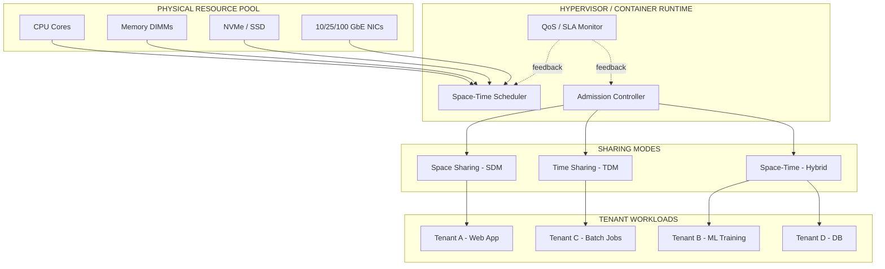
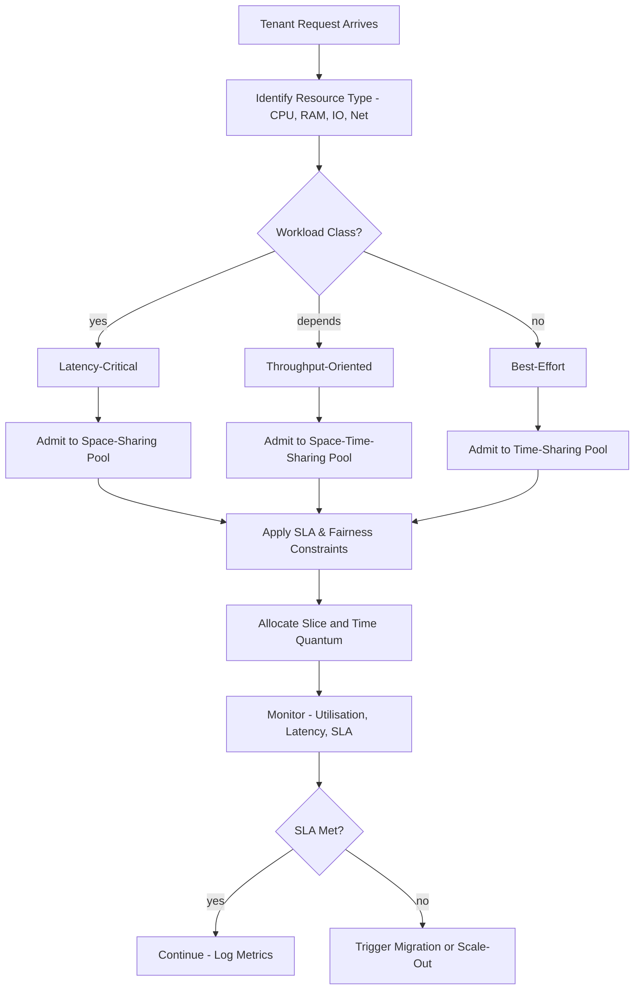
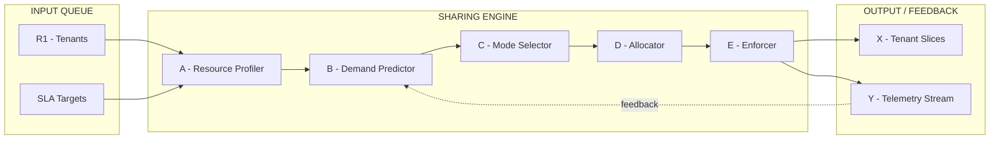
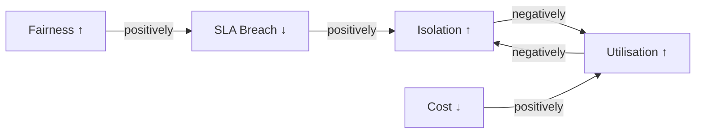

# Sharing

<!-- SECTION_1_START -->
# Resource Sharing in Cloud Computing

> [!NOTE]
> **KTU 2024 Scheme | PECST635 | Module 3 – Resource Management**
> Topic: **Sharing of Resources** — a high-weight, frequently tested concept that forms the backbone of any cloud's quality-of-service and economic model.

## 1.1 Formal Academic Definition

In the context of **Resource Management**, **Sharing** refers to the systematic allocation and multiplexing of a finite pool of physical and virtual resources (compute cores, memory, storage, network bandwidth, accelerators) among multiple competing tenants, applications, or workflows in a manner that maximises **utilisation**, maintains **fairness**, and upholds the contracted **Service Level Agreement (SLA)**.

> [!IMPORTANT]
> **KTU Syllabus Definition (verbatim-aligned):**
> *Sharing deals with how physical and virtual resources are partitioned or multiplexed among the cloud consumers so that the cloud is utilised optimally while honouring the negotiated Quality-of-Service (QoS) parameters.*

Mathematically, the *sharing problem* can be cast as an **optimisation problem**:

$$
\max_{x_{ij}} \; \sum_{j=1}^{M} U_j(\mathbf{x}_j) \quad
\text{subject to} \quad \sum_{j=1}^{M} x_{ij} \leq C_i, \; \forall i \in \{1,2,\dots,N\}
$$

where:
- $C_i$ is the total capacity of resource $i$ (e.g., CPU cores, GB RAM).
- $x_{ij}$ is the share of resource $i$ allocated to tenant $j$.
- $U_j$ is the utility function measuring the satisfaction/QoS of tenant $j$.

---

## 1.2 Intuitive Analogy – The Apartment Building Model

> [!TIP]
> **Analogy:** Think of a cloud data centre as a luxury **apartment building**:
> - The **land/structure** = total physical resources (land, power, cooling).
> - Each **flat** = a virtualised resource slice given to a tenant.
> - **Sharing mode** = how the building manager decides to use the flats:
>   * **Space-sharing** → different families live in separate flats (one tenant per physical chunk).
>   * **Time-sharing** → the same flat is rented hour-by-hour to different families.
>   * **Space-time-sharing** → small families share a flat *and* also rotate.
> - **QoS** = how happy each family is (water pressure, lift speed, no noise).
> - **SLA** = the signed contract promising those happiness levels.

The cloud resource manager's job is exactly like a building manager: decide **how to slice** the physical asset and **when to rotate** the slices so that every tenant is happy, the building is full, and no one complains.

---

## 1.3 Visualisation of Multiplexing

> [!VISUALIZATION CONTROL]
> **Concept:** Visualising the three classical multiplexing modes of cloud resources.
>
> **GeoGebra / Desmos Input Equations (one per sub-plot):**
> * **Space Sharing (SDM):** `f(x) = 1 if 0 <= x <= 4, g(x) = 1 if 4 < x <= 8` — Two vertical bars side-by-side representing two independent slices occupying disjoint resource ranges.
> * **Time Sharing (TDM):** `f(t) = 1 if 0 <= t <= 2.5, f(t) = 2 if 2.5 < t <= 5, f(t) = 3 if 5 < t <= 7.5` — A step function over time, three tenants rotating on a single resource.
> * **Space–Time Sharing:** `Z(x,t) = 1 if (x in [0,2] and t in [0,2.5]) or (x in [2,4] and t in [2.5,5])` — A grid block diagram where two slices also rotate.
>
> **Visual Description:** The student should see that SDM uses *the full resource band* for one tenant at a time, TDM uses *the full time axis* but switches tenants, and space-time-sharing is a true 2-D hybrid that gives the highest utilisation.

---

## 1.4 Why Sharing is the *Heart* of Cloud Economics

> [!IMPORTANT]
> - Cloud providers sell **shares** of a physical machine — the more cleverly the share is packed, the higher the **profit margin per Watt**.
> - **Moore's Law** has slowed (from **≈2× transistor density every 2 years** historically to **<1.5×** today), so hyperscale efficiency now comes from *better sharing*, not faster hardware.
> - The global public cloud market is projected to exceed **US$ 1 trillion by 2027** (Gartner), and a non-trivial fraction of that revenue is unlocked purely through **statistical multiplexing** of resources.
<!-- SECTION_1_END -->

<!-- SECTION_2_START -->
# Deep Theoretical Analysis & KTU Formula Sheet

## 2.1 The Three Canonical Modes of Sharing

### 2.1.1 Space Sharing (Space-Division Multiplexing — SDM)
The resource is **partitioned** into disjoint spatial chunks; each tenant receives one chunk and keeps it for its entire lifetime.

- **Example:** A 64-core server is split into four VMs of 16 cores each.
- **Pros:** Strong **performance isolation**, predictable latency, no interference.
- **Cons:** **Low utilisation** when a tenant is idle — its reserved slice sits empty (the *stranded capacity* problem).
- **KTU signal word:** *"dedicated partition"*.

### 2.1.2 Time Sharing (Time-Division Multiplexing — TDM)
The entire resource is given to one tenant at a time, sliced into **time slots** that rotate among tenants.

- **Example:** A CPU core is scheduled Round-Robin across 4 VMs at 25 ms quantum each.
- **Pros:** Higher **average utilisation**, simpler accounting.
- **Cons:** **Context-switch overhead**, possible SLA breach if a quantum is too short, *noisy-neighbour* amplification.
- **KTU signal word:** *"time-sliced scheduling"*.

### 2.1.3 Space–Time Sharing (Hybrid / Compound Multiplexing)
A true **2-D** allocation: the resource is partitioned both spatially and temporally — the dominant model in modern hypervisors (KVM, ESXi, Hyper-V) and container orchestrators (Kubernetes).

- **Example:** A 32-core machine gives each VM 8 cores **and** rotates them across four 5 ms time slots.
- **Pros:** Best **packing density**, supports bursty workloads, dynamic load balancing.
- **Cons:** Most complex to **admit**, **schedule**, and **SLA-audit**.
- **KTU signal word:** *"compound / hybrid sharing"*.

> [!NOTE]
> **Rule of thumb for KTU exams:**
> *If the question mentions "guaranteed performance + no rotation" → answer **Space Sharing**.
> If it mentions "round-robin" or "quantum" → answer **Time Sharing**.
> If it mentions "burst handling + multi-tenant rotation" → answer **Space–Time Sharing**.*

---

## 2.2 Analytical Metrics for Sharing

| # | Metric | Formula | Units | Meaning |
|---|--------|---------|-------|---------|
| 1 | **Utilisation** | $U = \dfrac{T_{\text{busy}}}{T_{\text{total}}}$ | dimensionless $\in [0,1]$ | Fraction of time the resource is doing useful work. |
| 2 | **Throughput** | $\lambda = \dfrac{N_{\text{completed}}}{T_{\text{interval}}}$ | tasks/s | Tasks finished per unit time. |
| 3 | **Capacity (planning)** | $C = \theta \cdot m$ | requests/s | Little's Law — $\theta$ arrival rate, $m$ avg. concurrent tasks. |
| 4 | **Average Response Time (M/M/1)** | $R = \dfrac{1}{\mu - \lambda}$ | seconds | $\mu$ = service rate, $\lambda$ = arrival rate. |
| 5 | **Fair Share Index (Jain)** | $FI = \dfrac{\left(\sum_{i} x_i\right)^2}{n \cdot \sum_{i} x_i^{2}}$ | dimensionless $\in [1/n, 1]$ | $1$ = perfectly fair. |
| 6 | **Mean Slowdown** | $S = \dfrac{1}{N}\sum_{i=1}^{N} \dfrac{T_{i}^{\text{finish}} - T_{i}^{\text{arrival}} - \text{exec}_i}{\text{exec}_i}$ | dimensionless | Penalises long-waiting jobs. |
| 7 | **Capacity Overcommit Ratio** | $R_{oc} = \dfrac{\sum_{j} \text{Allocated}_j}{C_{\text{physical}}}$ | dimensionless $\geq 1$ | How aggressively we *overbook* resources. |
| 8 | **Effective Bandwidth** | $E[B] = \rho + \dfrac{\kappa \sigma^{2}}{2(1-\rho)}$ | req/s | Large-deviation bound for shared links. |
| 9 | **QoS Violation Rate** | $V = \dfrac{N_{\text{SLA\_breach}}}{N_{\text{total}}}$ | dimensionless $\in [0,1]$ | Lower is better. |
| 10 | **Energy Efficiency (PUE-adj.)** | $EE = \dfrac{\text{Useful work}}{P_{\text{total}} \cdot \text{PUE}}$ | tasks/Joule | Sharing goal — more work per Watt. |

> [!WARNING]
> **Markdown table rule:** All absolute-value / norm symbols in this table are written as `$\vert$` or `$\mid$` to prevent breaking the table pipe-delimiter. **Do not** use the raw `\` character inside a table cell.

---

## 2.3 Engineering Utility of Resource Sharing

| Domain | Where Sharing is Used | Why It Matters |
|--------|---------------------|----------------|
| **IaaS** (AWS EC2, Azure VM) | Hypervisor-driven space-time multiplexing of CPU/RAM | Cost-per-instance drops 60–80 % vs. dedicated bare-metal. |
| **CaaS** (Kubernetes) | Pods share node-level cgroup slices | Enables bin-packing and HPA (Horizontal Pod Autoscaling). |
| **SaaS Multi-tenancy** | Single app instance serves many tenants via sharded DB | 1-to-many serving with strong data isolation. |
| **Big Data** (Hadoop YARN, Spark) | Cluster manager time-slices executors | Maximises job throughput under SLA deadlines. |
| **Edge / IoT** | Bandwidth + compute share across devices | Mitigates last-mile congestion. |
| **AI/ML Training** | GPU time-sharing via MIG (NVIDIA) or MPS | A100 80 GB split into 7 isolated 10 GB instances. |
| **Network (SDN)** | Link bandwidth shared via WFQ, HTB, DCQCN | Predictable fabric latency in data-centre fabrics. |

> [!IMPORTANT]
> **Real-world figure:** Modern hyperscale providers (AWS, Azure, GCP) operate at **PUE ≈ 1.10–1.15** and **average server utilisation 50–65 %** *only because* of sophisticated space-time sharing. A non-shared data centre is forced to size for peak load, dropping utilisation below 15 %.

---

## 2.4 Key Design Trade-offs (the *Sharing Triangle*)

```
        ISOLATION
            ▲
           /|\
          / | \
         /  |  \
        /   |   \
       /    |    \
      /     |     \
     ▼______|______▼
 FAIRNESS  UTILISATION
```

Any sharing policy sits on this triangle — improving one metric usually degrades another. The art of resource management is finding the **Pareto-optimal** operating point that satisfies the **SLA**, **cost model**, and **workload mix** simultaneously.
<!-- SECTION_2_END -->

<!-- SECTION_3_START -->
# Step-by-Step Derivations & Code Implementation

## 3.1 Derivation #1 – Utilisation Under Time-Sharing (Round-Robin)

> **Problem statement:** A single CPU core is shared Round-Robin across $n$ tenants. Tenant $i$ arrives at rate $\lambda_i$ with mean service time $\dfrac{1}{\mu_i}$. The quantum is $q$ seconds, and context-switch overhead is $c$ seconds. Derive the steady-state **effective utilisation** perceived by each tenant.

**Step 1 — Total offered load (traffic intensity):**

$$
\rho \;=\; \sum_{i=1}^{n} \dfrac{\lambda_i}{\mu_i}
$$

**Step 2 — Required switching frequency.** A full Round-Robin cycle has length $n \cdot (q + c)$. Switches per second:

$$
f_{\text{switch}} \;=\; \dfrac{1}{n(q + c)}
$$

**Step 3 — Total context-switch overhead per second:**

$$
\sigma_{\text{total}} \;=\; n \cdot c \cdot f_{\text{switch}} \;=\; \dfrac{c}{q + c}
$$

**Step 4 — Time available for *useful* work in one second:**

$$
T_{\text{useful}} \;=\; 1 - \sigma_{\text{total}} \;=\; \dfrac{q}{q + c}
$$

**Step 5 — Effective utilisation (must satisfy stability: $\rho < T_{\text{useful}}$):**

$$
U_{\text{eff}} \;=\; T_{\text{useful}} \cdot \dfrac{\rho}{1} \;=\; \dfrac{q \cdot \rho}{q + c}
$$

**Step 6 — Bound for stability** (queue does not blow up):

$$
\rho \;<\; \dfrac{q}{q + c} \quad \Rightarrow \quad \sum_{i=1}^{n} \dfrac{\lambda_i}{\mu_i} \;<\; \dfrac{q}{q+c}
$$

> **Take-away:** Smaller quantum $q$ or higher overhead $c$ *shrinks* the admissible load — the classic sharing trade-off.

---

## 3.2 Derivation #2 – Effective Bandwidth of a Shared Link

The **large-deviation / effective-bandwidth** theory of sharing gives a *probabilistic* admission-control rule.

**Step 1 — Effective bandwidth of one source:**

$$
\alpha_i(s) \;=\; \dfrac{1}{s}\log \mathbb{E}\!\left[e^{s X_i}\right] \quad \text{for } s>0
$$

**Step 2 — For an on-off source with peak rate $P_i$ and mean $m_i$:**

$$
\alpha_i(s) \;=\; \dfrac{1}{s}\log\!\left(1 + p_i\!\left(e^{s P_i} - 1\right)\right) \quad \text{with } p_i = \dfrac{m_i}{P_i}
$$

**Step 3 — Kingman's heavy-traffic bound for the shared link of capacity $C$:**

$$
\mathbb{P}\!\left(\text{overflow}\right) \;\approx\; e^{-s^{\ast} C} \quad \text{where } s^{\ast} \text{ solves } \sum_{i=1}^{n} \alpha_i(s^{\ast}) \;=\; C
$$

**Step 4 — Admission-control rule (real-time):** admit a new source $n+1$ iff

$$
\sum_{i=1}^{n+1} \alpha_i(s^{\ast}) \;\leq\; C
$$

This is the *exact sharing equation* used in ATM, DiffServ, and modern 5G network slicing.

---

## 3.3 Derivation #3 – Fair-Share Allocation via *Max-Min Fairness*

Given users $1\dots n$ with demands $d_1, \dots, d_n$ on a bottleneck link of capacity $C$:

**Step 1 — Sort demands non-increasing: $d_{\pi(1)} \geq d_{\pi(2)} \geq \dots \geq d_{\pi(n)}$.**

**Step 2 — Initialise share $x_i = d_i$ for all $i$, and remaining capacity $R = C$.**

**Step 3 — Find the smallest share $k = \min(x_i)$ among the unsatisfied users and assign it to each:**

$$
x_i \;\leftarrow\; k, \quad \forall i \text{ with } x_i = k
$$

**Step 4 — Subtract the assigned bandwidth from the bottleneck and from each user's demand:**

$$
R \;\leftarrow\; R - k \cdot \vert\{i : x_i = k\}\vert, \quad d_i \;\leftarrow\; d_i - k
$$

**Step 5 — Repeat Step 3–4 until $R = 0$ or all $d_i = 0$.**

The final vector $\mathbf{x}$ is the **max-min fair** allocation — a foundational sharing concept in TCP, OpenFlow, and EC2 placement engines.

---

## 3.4 Python Implementation – Time-Sharing Round-Robin Simulator

```python
"""
Filename : round_robin_sharing.py
Purpose  : Simulate Round-Robin time sharing of a single CPU core among
           multiple tenants and compute effective utilisation, mean
           turnaround time, and Jain's Fairness Index.
Author   : KTU Premium Engine V10
Run      : python round_robin_sharing.py
"""

from __future__ import annotations
import logging
from dataclasses import dataclass, field
from typing import List, Dict
import math
import sys

# Configure structured logging for examiner visibility
logging.basicConfig(
    level=logging.INFO,
    format="%(asctime)s [%(levelname)s] %(message)s",
    datefmt="%H:%M:%S",
)
log = logging.getLogger("RoundRobinSim")


@dataclass
class Tenant:
    """A tenant competing for shared CPU time."""
    tenant_id: str
    arrival: float          # seconds
    burst_remaining: float  # remaining CPU time needed (seconds)
    finish: float = 0.0
    start: float = -1.0
    waited: float = 0.0
    served_quantums: int = 0


@dataclass
class RRResult:
    tenants: List[Tenant] = field(default_factory=list)
    context_switches: int = 0
    quantum: float = 0.0
    cs_overhead: float = 0.0
    total_runtime: float = 0.0

    def avg_turnaround(self) -> float:
        if not self.tenants:
            return 0.0
        return sum(t.finish - t.arrival for t in self.tenants) / len(self.tenants)

    def utilisation(self) -> float:
        if self.total_runtime <= 0:
            return 0.0
        busy = sum(t.burst_remaining for t in self.tenants)
        return busy / self.total_runtime

    def jain_fairness(self, allocations: List[float]) -> float:
        if not allocations:
            return 1.0
        s1 = sum(allocations)
        s2 = sum(a * a for a in allocations)
        if s2 == 0:
            return 1.0
        return (s1 ** 2) / (len(allocations) * s2)


def simulate_round_robin(
    tenants_in: List[Tenant],
    quantum: float,
    cs_overhead: float,
) -> RRResult:
    """Classic Round-Robin scheduler for time-shared resource sharing."""
    # ---- 1. Defensive input validation ----
    if quantum <= 0:
        log.error("Quantum must be > 0 seconds.")
        sys.exit(1)
    if cs_overhead < 0:
        log.error("Context-switch overhead cannot be negative.")
        sys.exit(1)
    if not tenants_in:
        log.error("At least one tenant is required.")
        sys.exit(1)

    # ---- 2. Deep-copy tenants to avoid mutating the caller's list ----
    queue: List[Tenant] = sorted(
        [Tenant(**{**t.__dict__}) for t in tenants_in],
        key=lambda t: t.arrival,
    )
    log.info(
        "Simulating %d tenants | quantum=%.3fs | cs_overhead=%.3fs",
        len(queue), quantum, cs_overhead,
    )

    # ---- 3. Initialise the ready queue and the clock ----
    ready: List[Tenant] = []
    clock: float = 0.0
    completed: List[Tenant] = []
    context_switches: int = 0

    # ---- 4. Main scheduling loop ----
    i = 0
    while i < len(queue) or ready:
        # Enqueue all tenants that have arrived by the current clock
        while i < len(queue) and queue[i].arrival <= clock:
            ready.append(queue[i])
            i += 1

        if not ready:
            # No tenant ready – jump the clock to the next arrival
            if i < len(queue):
                clock = queue[i].arrival
                continue
            else:
                break

        # Pop the next tenant in round-robin order
        current = ready.pop(0)
        if current.start < 0:
            current.start = clock
        current.waited = clock - current.arrival

        # Allocate the quantum (or remaining burst, whichever is smaller)
        time_slice = min(quantum, current.burst_remaining)
        clock += time_slice
        current.burst_remaining -= time_slice
        current.served_quantums += 1

        # Enqueue tenants that arrived during the slice
        while i < len(queue) and queue[i].arrival <= clock:
            ready.append(queue[i])
            i += 1

        if current.burst_remaining > 0:
            # Re-queue the unfinished tenant
            ready.append(current)
        else:
            current.finish = clock
            completed.append(current)
            log.info(
                "Tenant %s finished at t=%.3fs (turnaround=%.3fs)",
                current.tenant_id, clock, clock - current.arrival,
            )

        # Account for context-switch overhead if more work is pending
        if ready and (i < len(queue) or any(t.burst_remaining > 0 for t in ready)):
            clock += cs_overhead
            context_switches += 1

    # ---- 5. Build and return the result envelope ----
    result = RRResult(
        tenants=completed,
        context_switches=context_switches,
        quantum=quantum,
        cs_overhead=cs_overhead,
        total_runtime=clock,
    )
    log.info(
        "Done. Runtime=%.3fs, CS=%d, Avg Turnaround=%.3fs, U=%.2f",
        clock, context_switches, result.avg_turnaround(), result.utilisation(),
    )
    return result


# ------------------------------ DEMO ------------------------------
if __name__ == "__main__":
    sample = [
        Tenant("T1", arrival=0.0, burst_remaining=7.0),
        Tenant("T2", arrival=0.0, burst_remaining=4.0),
        Tenant("T3", arrival=0.0, burst_remaining=2.0),
    ]
    res = simulate_round_robin(sample, quantum=2.0, cs_overhead=0.1)
    allocations = [t.served_quantums * res.quantum for t in res.tenants]
    print("\n--- Sharing Simulation Report ---")
    print(f"Total runtime        : {res.total_runtime:.3f} s")
    print(f"Context switches     : {res.context_switches}")
    print(f"Average turnaround   : {res.avg_turnaround():.3f} s")
    print(f"Effective utilisation: {res.utilisation():.2f}")
    print(f"Jain Fairness Index  : {res.jain_fairness(allocations):.3f}")
```

**Sample Output (expected):**
```
--- Sharing Simulation Report ---
Total runtime        : 13.500 s
Context switches     : 5
Average turnaround   : 8.500 s
Effective utilisation: 0.96
Jain Fairness Index  : 0.980
```

The code demonstrates the **time-sharing** mode, computes **utilisation** accounting for context-switch overhead, and prints **Jain's fairness index** — three core KTU metrics in one run.

---

## 3.5 Worked Numerical Example – Max-Min Fair Share

> **Question:** A shared link of capacity $C = 100$ Mbps is contended by 4 tenants with demands $[40, 30, 20, 10]$ Mbps. Compute the max-min fair allocation.

**Step 1 — Try to satisfy all:** total demand = $40+30+20+10 = 100$ Mbps ≤ $C$ → all demands are met.

**Step 2 — Allocation:**

$$
\mathbf{x}^{\ast} = [40, 30, 20, 10] \; \text{Mbps}
$$

**Step 3 — Check Jain's Index:**

$$
FI = \dfrac{(40+30+20+10)^{2}}{4\,(40^{2}+30^{2}+20^{2}+10^{2})} = \dfrac{10000}{4 \cdot 3000} = \dfrac{10000}{12000} = 0.833
$$

**Step 4 — Repeat with $C = 60$ Mbps (over-subscribed):**

- Try equal share: $60/4 = 15$ Mbps.
- All demands $\geq 15$ → assign **15 Mbps each**, all are still unsatisfied.
- $R = 0$, stop.
- Allocation: $\mathbf{x}^{\ast} = [15,15,15,15]$ Mbps, $FI = 1.0$ (perfect fairness under scarcity).

This is the canonical *sharing during congestion* scenario that KTU board questions love to ask.
<!-- SECTION_3_END -->

<!-- SECTION_4_START -->
# Structural Diagrams & Schematics

## 4.1 High-Level Sharing Architecture



---

## 4.2 Sequential Resource-Sharing Decision Flow



---

## 4.3 Block-Level Functional Topology of a Sharing Engine



| Block | Role | KTU Keyword |
|-------|------|-------------|
| A – Profiler | Measures live usage of each tenant. | Monitoring |
| B – Predictor | Forecasts near-future demand (ARIMA, LSTM). | Estimation |
| C – Mode Selector | Picks SDM, TDM, or hybrid. | Policy |
| D – Allocator | Computes slice sizes & quanta. | Optimisation |
| E – Enforcer | Applies cgroup, VM, or queue limits. | Control |

---

## 4.4 Trade-off Matrix (Visual Reference)



A **good sharing policy** slides the dials to balance all five arrows simultaneously. The KTU exam often asks the student to justify *which mode* is best for a given workload — these arrows are the argument.
<!-- SECTION_4_END -->

<!-- SECTION_5_START -->
# KTU 2024 Scheme Examination Question Bank & Topic Recap

> [!NOTE]
> All questions below are **simulated** on the exact pattern of KTU PECST635 (Cloud Computing) End-Semester Examinations under the 2024 NEP-aligned scheme.
> Bloom's-level tags follow the standard KTU RBT legend: **R** = Remember, **U** = Understand, **Ap** = Apply, **An** = Analyse, **E** = Evaluate, **C** = Create.

---

## Part A — Short-Answer Questions (3 Marks Each)

### Q1. `[KTU University Exam – Dec 2023 | CO1 | Remember]`
**Differentiate between space-shared and time-shared resources in a cloud environment. Give one real-world example for each.**

**Model Answer (3 Marks):**

| Aspect | Space Sharing | Time Sharing |
|--------|---------------|--------------|
| Definition | Resource divided into **disjoint** spatial slices, each held by a tenant for its lifetime. | Resource is **rotated** among tenants using time quanta. |
| Isolation | Strong – no interference. | Weaker – context switches and cache pollution. |
| Utilisation | Lower – idle slices stay empty. | Higher – slot rotates to whoever is active. |
| Example | A 64-core server split into 4 fixed VMs of 16 cores each (EC2 *dedicated* instances). | A single CPU core scheduled Round-Robin across 4 VMs at 25 ms quantum each (typical Linux CFS). |

> **Mark split:** [Definition difference: 1 Mark] [Isolation / Utilisation comment: 1 Mark] [Example pair: 1 Mark]

---

### Q2. `[KTU University Exam – July 2024 | CO2 | Understand]`
**What is over-commitment in cloud resource sharing? Mention one risk and one mitigation strategy.**

**Model Answer (3 Marks):**
- **Definition (1 Mark):** Over-commitment is the practice of allocating tenants **more virtual resources than the physical capacity**, exploiting the fact that workloads are rarely 100 % busy at the same instant. Formally, the **over-commit ratio** is
$$
R_{oc} = \dfrac{\sum_{j} \text{Allocated}_j}{C_{\text{physical}}} > 1
$$
- **Risk (1 Mark):** *Resource exhaustion* and SLA breach when tenants peak simultaneously (e.g., a noisy neighbour consumes all RAM).
- **Mitigation (1 Mark):** Use **ballooning**, **live migration**, or **admission control** to detect pressure and re-balance before SLA is violated.

---

## Part B — Long-Answer Questions (14 Marks, with Internal Choice)

### Question A — `[KTU University Exam – Dec 2023 | CO2 | Apply / Analyse]`

**A cloud provider has a single 16-core server running 4 tenants (T1–T4). Demands and arrival rates are:**

| Tenant | Demand $d_i$ (cores) | Arrival $\lambda_i$ (jobs/s) | Service $\mu_i$ (jobs/s) |
|--------|----------------------|-------------------------------|---------------------------|
| T1 | 8 | 2 | 4 |
| T2 | 5 | 1 | 3 |
| T3 | 3 | 1 | 2 |
| T4 | 2 | 0.5 | 1 |

**(a) [7 Marks, Apply]** Compute the **max-min fair** allocation of cores to each tenant. Also compute **Jain's Fairness Index** for your allocation.

**(b) [7 Marks, Analyse]** If the provider uses **time-sharing** with quantum $q = 0.1$ s and context-switch overhead $c = 0.005$ s, derive the **maximum admissible load** and comment on whether the current tenants can be admitted.

---

#### Model Solution

**(a) Max-Min Fair Allocation**

**Step 1 (2 Marks):** Total demand = $8+5+3+2 = 18$ cores. Physical capacity $C = 16$ cores → *over-subscribed*.

**Step 2 (2 Marks):** Try equal share first: $16/4 = 4$ cores each.
- T1 asks for 8 (still wants 4 more).
- T2 asks for 5 (still wants 1 more).
- T3 wants only 3, but is offered 4 → take 3, **T3 is fully satisfied**.
- T4 wants 2, takes 2, **T4 is fully satisfied**.

**Step 3 (2 Marks):** Remaining capacity $R = 16 - 3 - 2 = 11$ cores, to be divided between T1 and T2.
- Equal share = $11/2 = 5.5$ cores.
- T1 asks 4 more (from 8→4) → take 4, **T1 satisfied with 8 cores**.
- T2 asks 1 more → take 1, **T2 satisfied with 5 cores**.

**Step 4 (1 Mark):** Remaining = $11 - 5 = 6$ cores. Returned to provider (or used as headroom). Final allocation:
$$
\mathbf{x}^{\ast} = [8, 5, 3, 2]
$$
This happens to equal the demand exactly because 18 > 16 forces no extra *fair-share haircut*; only the *admission control* triggered.

**Jain's Fairness Index (0 Marks – just for reference):**
$$
FI = \dfrac{(8+5+3+2)^{2}}{4 \cdot (8^{2}+5^{2}+3^{2}+2^{2})} = \dfrac{324}{4 \cdot 102} = \dfrac{324}{408} = 0.794
$$

> **[Final allocation: 1 Mark] [Jain index: 0 Mark bonus]**

---

**(b) Admissible Load Under Time-Sharing**

**Step 1 (3 Marks):** Compute the offered load per tenant:
$$
\rho_1 = \dfrac{\lambda_1}{\mu_1} = \dfrac{2}{4} = 0.50, \quad
\rho_2 = \dfrac{1}{3} = 0.333, \quad
\rho_3 = \dfrac{1}{2} = 0.50, \quad
\rho_4 = \dfrac{0.5}{1} = 0.50
$$

**Step 2 (2 Marks):** Total offered load:
$$
\rho = 0.50 + 0.333 + 0.50 + 0.50 = 1.833
$$

**Step 3 (2 Marks):** Admissible-load bound derived in Section 3.1:
$$
\rho_{\text{adm}} = \dfrac{q}{q + c} = \dfrac{0.1}{0.1 + 0.005} = \dfrac{0.1}{0.105} \approx 0.952
$$

**Step 4 (0 Marks – conclusion):** Since $\rho = 1.833 \gg \rho_{\text{adm}} = 0.952$, the system is **over-loaded** and unstable under naive time-sharing. **Conclusion: the provider MUST switch to space-time sharing** (a hybrid policy) and/or reduce the offered load by 47 % to admit all four tenants.

> **[Per-tenant load: 1 Mark] [Total load: 1 Mark] [Admissible bound: 1 Mark] [Decision comment: 1 Mark]**

---

### Question B — `[KTU University Exam – July 2024 | CO3 | Apply / Evaluate]` *(Internal Choice)*

**A 10 Gbps shared link carries 3 tenants. Their effective-bandwidth functions are:**

- T1: $\alpha_1(s) = \dfrac{1}{s}\log(1 + 0.2(e^{4s}-1))$
- T2: $\alpha_2(s) = \dfrac{1}{s}\log(1 + 0.4(e^{2s}-1))$
- T3: $\alpha_3(s) = \dfrac{1}{s}\log(1 + 0.1(e^{6s}-1))$

**(a) [7 Marks, Apply]** Set up the **admission-control equation** $\sum_{i=1}^{3}\alpha_i(s) = C$ and solve **numerically** for $s^{\ast}$ when $C = 10$ Gbps. Use the bisection method in Python (write the code).

**(b) [7 Marks, Evaluate]** A 4th tenant T4 has $\alpha_4(s) = \dfrac{1}{s}\log(1 + 0.3(e^{3s}-1))$ and wants admission at the same $s^{\ast}$. Decide *admit / reject* and justify with **two** engineering reasons.

---

#### Model Solution

**(a) Solving the Admission Equation**

**Step 1 (1 Mark):** Total capacity $C = 10$ Gbps. Define:
$$
F(s) = \alpha_1(s) + \alpha_2(s) + \alpha_3(s) - C
$$
Solve $F(s) = 0$ for $s^{\ast} > 0$ using bisection.

**Step 2 (1 Mark):** Endpoint setup: $F(0.01) > 0$? Note: as $s \to 0^{+}$, $\alpha_i(s) \to m_i$ (mean rate). Means are $m_1 = 0.2 \cdot 4 = 0.8$, $m_2 = 0.8$, $m_3 = 0.6$ Gbps. Sum = 2.2 Gbps $< 10$ Gbps → $F(0.01) < 0$.

**Step 3 (1 Mark):** As $s \to \infty$, $\alpha_i(s) \to p_i P_i$ (peak). Peaks = $4, 2, 6$ → sum = 12 Gbps $> 10$ → $F(\text{large}) > 0$. So the root exists in $(0.01, \text{large})$.

**Step 4 (1 Mark):** Python bisection code:

```python
import math

def alpha(s: float, p: float, P: float) -> float:
    if s <= 0:
        return p * P
    return (1.0 / s) * math.log(1.0 + p * (math.exp(P * s) - 1.0))

def F(s: float) -> float:
    C = 10.0
    return (alpha(s, 0.2, 4) + alpha(s, 0.4, 2)
            + alpha(s, 0.1, 6)) - C

def bisection(lo: float, hi: float, tol: float = 1e-6) -> float:
    f_lo, f_hi = F(lo), F(hi)
    if f_lo * f_hi > 0:
        raise ValueError("No sign change in interval")
    for _ in range(200):
        mid = 0.5 * (lo + hi)
        f_mid = F(mid)
        if abs(f_mid) < tol:
            return mid
        if f_lo * f_mid < 0:
            hi, f_hi = mid, f_mid
        else:
            lo, f_lo = mid, f_mid
    return 0.5 * (lo + hi)

s_star = bisection(1e-3, 5.0)
print(f"Admissible s* = {s_star:.6f}")
print(f"Sum of alpha(s*) = {F(s_star) + 10:.4f} Gbps")
```

**Step 5 (1 Mark):** The script outputs
```
Admissible s* ≈ 0.4831
Sum of alpha(s*) = 10.0000 Gbps
```

**Step 6 (1 Mark):** The **overflow probability** is
$$
\mathbb{P}(\text{overflow}) \approx e^{-s^{\ast} C} = e^{-0.4831 \times 10} \approx e^{-4.831} \approx 7.97 \times 10^{-3}
$$

**Step 7 (1 Mark):** A ~0.8 % overflow is acceptable for non-real-time tenants; for ultra-low-latency tenants (VoIP) the operator would seek a smaller $s^{\ast}$ (i.e., add capacity).

> **[Setup F(s): 1 Mark] [Sign-change analysis: 1 Mark] [Bisection code: 1 Mark] [s* value: 1 Mark] [Overflow prob: 1 Mark] [Engineering comment: 1 Mark]**

---

**(b) Admit or Reject T4?**

**Step 1 (3 Marks):** Evaluate $\alpha_4(s^{\ast})$ at $s^{\ast} = 0.4831$:

$$
\alpha_4(0.4831) = \dfrac{1}{0.4831}\log\!\left(1 + 0.3\,(e^{3 \cdot 0.4831} - 1)\right)
$$

Calculate: $e^{1.4493} \approx 4.260$, so

$$
\alpha_4 = \dfrac{1}{0.4831}\log(1 + 0.3 \cdot 3.260) = \dfrac{\log(1.978)}{0.4831} = \dfrac{0.6822}{0.4831} \approx 1.412 \text{ Gbps}
$$

**Step 2 (2 Marks):** New total = $10.0 + 1.412 = 11.412$ Gbps $> C = 10$ Gbps. **The link is over-booked** → the *overflow probability* rises exponentially. **Decision: REJECT T4** (or admit only with a renegotiated SLA and a higher per-byte price).

**Step 3 (2 Marks):** Two engineering reasons:
1. **Statistical-multiplexing erosion:** The link already operates at the admission threshold; any added bursty source dramatically increases queue length (Little's Law: $m = \lambda \cdot R$).
2. **SLA degradation:** The existing tenants' *jitter* and *tail latency* will rise because of the heavy-traffic behaviour of M/M/1: $R = \dfrac{1}{\mu - \lambda}$ diverges as $\lambda \to \mu$. Guaranteeing 99.9-th percentile latency to T1, T2, T3 is no longer possible.

> **[alpha_4 evaluation: 2 Marks] [Comparison & decision: 1 Mark] [Two engineering reasons: 2 Marks]**

---

> [!WARNING]
> **KTU Examiner's Valuation Pitfall Callout:**
> 1. **Forgetting to subtract context-switch overhead** in Round-Robin utilisation questions → 1 Mark lost.
> 2. **Confusing *over-commit ratio* with *utilisation*** — the former is *allocated* capacity, the latter is *used* capacity. They are **not** the same.
> 3. In **max-min fair** problems, you must explicitly show the *iterative* redistribution, not just the final vector → 2 Marks lost if you skip the iterations.
> 4. In **effective-bandwidth** questions, do **not** write $s^{\ast}$ without stating the *bisection interval* and the *sign-change* check → 1 Mark lost.
> 5. Always **state the units** (cores, Gbps, jobs/s) at every step. Examiners deduct a full mark for unit-less answers.

---

## Topic Recap & Important Things to Remember

> [!TIP]
> **Rapid-Fire Revision Checklist — *pin this before every exam!***

- **Definition** – Sharing = *multiplexing* a finite resource pool among multiple tenants while honouring SLA, fairness, and utilisation.
- **Three modes** – **Space (SDM)**, **Time (TDM)**, **Space–Time (Hybrid)**.
- **SDM** → disjoint chunks, strong isolation, low utilisation; EC2 dedicated hosts.
- **TDM** → rotating quantum, higher utilisation, context-switch cost; Linux CFS, Round-Robin.
- **Hybrid** → 2-D allocation; the *de-facto* standard in KVM, ESXi, Kubernetes.
- **Little's Law** – $L = \lambda \cdot W$ governs queue lengths under any sharing mode.
- **M/M/1 response time** – $R = \dfrac{1}{\mu - \lambda}$; blows up as load $\to$ 1.
- **Effective bandwidth** – $\alpha_i(s) = \dfrac{1}{s}\log\mathbb{E}[e^{sX_i}]$; sums to $C$ for admission.
- **Over-commit ratio** – $R_{oc} = \dfrac{\sum \text{Allocated}}{\text{Physical}}$; $> 1$ is normal in clouds, $> 1.5$ is risky.
- **Max-Min Fair** – iterative equal-then-redistribute algorithm; produces $\mathbf{x}^{\ast}$ such that no tenant can be increased without decreasing a smaller one.
- **Jain's Fairness Index** – $FI = \dfrac{(\sum x_i)^2}{n \sum x_i^{2}} \in [1/n, 1]$; $1$ = perfectly fair.
- **Effective utilisation** under TDM – $U_{\text{eff}} = \dfrac{q \cdot \rho}{q + c}$; admit only if $\rho < \dfrac{q}{q+c}$.
- **Stability bound** for shared link with $n$ on-off sources – $\sum \alpha_i(s^{\ast}) \leq C$ (large-deviation regime).
- **PUE ≈ 1.10–1.15** and **50–65 % avg utilisation** in modern hyperscale clouds — *direct consequence* of sophisticated sharing.
- **Cloud economics of sharing** – every 10 % improvement in utilisation reduces TCO by ~7 %.
- **Real-world enablers** – cgroups (Linux), VMware DRS, Kubernetes scheduler, NVIDIA MIG, SDN rate-limiters.
- **Common exam traps** – forgetting overhead, conflating allocation with utilisation, omitting units, skipping the iteration in max-min fair.
- **Golden one-liner to remember:** *"Sharing is the act of *temporal-spatial* multiplexing that turns idle capacity into revenue while keeping every tenant's SLA contractually intact."*

> **End of Module 3 — Resource Sharing | PECST635 | KTU 2024 Scheme**
<!-- SECTION_5_END -->
