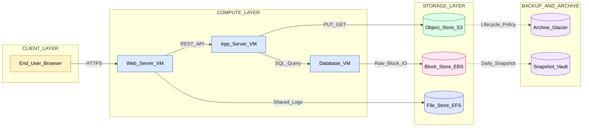
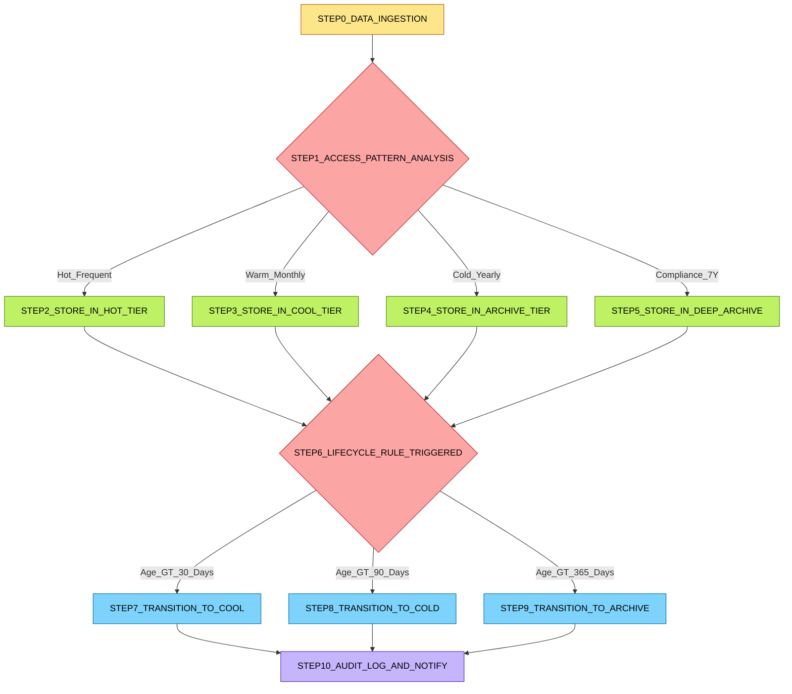
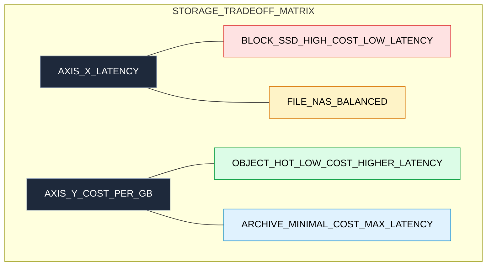

# Storage Types

<!-- SECTION_1_START -->

# Cloud Computing (PECST635) — Module 3: Resource Management
## Topic: Storage Types in Cloud Computing

---

### 1.1 Core Technical Definition

> [!IMPORTANT]
> **Cloud Storage** is a **service model** in which data is maintained, managed, backed up, and made remotely accessible to users over a public or private network (typically the Internet). It is provisioned, scaled, and billed on-demand as a metered service, allowing enterprises and developers to decouple physical storage infrastructure from application logic.

In the context of the **KTU 2024 Scheme** under Module 3 (Resource Management), *Storage Types* refers to the architectural and operational classifications of storage resources managed by the **Cloud Service Provider (CSP)** — encompassing **storage interfaces (Block, File, Object)**, **storage tiers/classes (Hot, Cool, Cold, Archive)**, **network-based storage architectures (DAS, NAS, SAN)**, and **persistence models (Ephemeral vs Persistent)**.

**Formal taxonomy of storage interfaces:**

| Interface Type | Granularity | Access Protocol | Typical Use Case |
|---|---|---|---|
| **Block Storage** | Fixed-size blocks (typically **512 bytes – 64 KB**) | iSCSI, Fibre Channel, NVMe-oF | Databases, OS boot volumes |
| **File Storage** | Hierarchical files & directories | NFS, SMB/CIFS, CIFS | Shared home directories, content repositories |
| **Object Storage** | Discrete objects (data + metadata + unique ID) | RESTful HTTP(S) APIs (e.g., **S3 API**) | Unstructured data, backups, media, big data lakes |

---

### 1.2 Conceptual Analogy / Intuition

> [!NOTE]
> **The Library vs. Warehouse vs. Office Filing Cabinet Analogy**

Imagine three ways to store books in a growing organization:

1.  **Block Storage = Your Personal Office Drawer Cabinet**
    Each drawer has a fixed number of slots (blocks). You can pull out any drawer, modify the contents, and put it back. The operating system (you) knows *exactly* which drawer and which slot contains what. It's **fast, low-latency, and direct-attached** — perfect for things you need *right now* (the database powering your live application).

2.  **File Storage = The Shared Office Filing System**
    Folders inside folders, organized hierarchically (`/department/team/project/file.docx`). Multiple employees can mount the filing cabinet over the office network (NFS/SMB) and see the same hierarchy. It is **shared, structured, and POSIX-compliant** — ideal for collaborative content where directory trees matter.

3.  **Object Storage = The Massive Geographically-Distributed Warehouse**
    Each item is placed in a bin, labeled with a unique tracking number (a flat address like `https://warehouse.com/bucket/item/abc123`), along with a tag describing the item (metadata). There are *no folders* — you query by the unique ID or by tags. It is **infinitely scalable, web-native, and cheap per gigabyte** — perfect for backups, photos, log archives, and data lake analytics.

> [!TIP]
> **Geometric Intuition:** Think of storage on a 2D plane where the **X-axis = Access Latency (seconds)** and the **Y-axis = Cost per GB (USD)**. Block storage sits in the **lower-left** (low latency, high cost), Object Archive storage sits in the **upper-right** (high latency, low cost), and File storage lives **in the middle** as a balanced compromise.

---

### 1.3 Key Physical Constants & Standard Metrics

The following metrics are standardized across CSPs and frequently tested in KTU examinations:

*   **IOPS (Input/Output Operations Per Second):** A measure of random read/write performance. Standard: **1 IOPS = one read or write of a 4 KB block**.
*   **Throughput:** Measured in **MiB/s** (Mebibytes per second). Formula relationship: $\text{Throughput} = \text{IOPS} \times \text{Block Size}$.
*   **Durability:** Expressed as "eleven 9s" — i.e., **99.999999999%** annual object durability for top-tier cloud object stores (e.g., **AWS S3 Standard**).
*   **Availability SLA:** Typically **99.9%** to **99.99%** depending on the storage class and redundancy option.
*   **First-Byte Latency:** The time-to-first-byte for retrieval requests; ranges from **sub-millisecond (block SSD)** to **hours (deep archive, e.g., AWS Glacier Deep Archive: 12 hours)**.
*   **Redundancy Standard:** **3 AZ (Availability Zone) replication** by default in major hyperscalers.

---

### 1.4 GeoGebra / Desmos Visualization

> [!VISUALIZATION CONTROL]
> **Concept:** Storage Class Trade-off Curve — Cost vs. Access Frequency
>
> **GeoGebra / Desmos Input Equations:**
> * `f(x) = 0.10 - 0.0001 * x`        *(Hot tier: high cost, frequent access)*
> * `g(x) = 0.025 - 0.00005 * x`       *(Cool/Cold tier: medium cost, infrequent access)*
> * `h(x) = 0.004 - 0.00001 * x`       *(Archive tier: very low cost, rare access)*
>
> where `x` = monthly access frequency (events) and `y` = effective cost per GB (USD).
>
> **Visual Description:** On the coordinate plane, you will observe three downward-sloping lines representing decreasing marginal cost. The intersection points between the lines define the **optimal transition thresholds** — for example, if your data is accessed fewer than ~30 times per month, the Cool tier becomes more economical than Hot. This is the foundational principle behind **lifecycle management policies** in cloud storage.

---

<!-- SECTION_1_END -->

<!-- SECTION_2_START -->

# Deep Theoretical Analysis & KTU High-Yield Formula Sheet

---

## 2.1 Block-Level Theoretical Breakdown of Cloud Storage Types

Cloud storage is multi-dimensional. To master it, you must understand it across **four orthogonal axes**: *Interface, Architecture, Tier, and Persistence Model*.

### Axis 1: Storage Interface (How data is exposed to the application)

*   **Block Storage:**
    *   Data is split into **equally-sized blocks** (4 KB – 64 KB).
    *   Each block has a **logical address** (LBA — Logical Block Address).
    *   The OS mounts the block device like a raw hard drive and installs a **file system** of its choice (ext4, XFS, NTFS).
    *   **Why it exists:** Databases (MySQL, PostgreSQL, Oracle) need direct, low-level access to disk blocks because file-level protocols add unacceptable overhead.
    *   **KTU example services:** **AWS EBS (Elastic Block Store)**, Azure Managed Disks (Premium SSD, Ultra Disk), Google Persistent Disk, OpenStack Cinder.

*   **File Storage:**
    *   Data is presented as a **hierarchical directory tree** (folders, subfolders, files).
    *   Multiple compute instances mount the same share simultaneously using **NFS (Linux)** or **SMB/CIFS (Windows)**.
    *   **Why it exists:** Legacy enterprise applications (SAP, EDA tools, media rendering farms) require **POSIX-compliant shared file semantics** (file locks, permissions, append-only writes).
    *   **KTU example services:** **AWS EFS (Elastic File System)**, Azure Files (SMB), Google Filestore, NetApp ONTAP on AWS FSx.

*   **Object Storage:**
    *   Each datum is an **object** = `(data bytes, metadata, globally unique ID)`.
    *   Accessed exclusively via **RESTful HTTP(S) APIs** (`PUT`, `GET`, `DELETE`, `HEAD`).
    *   Storage is **flat (no hierarchy)**; the "folder" prefix in keys (e.g., `s3://bucket/photos/2024/jan/img.jpg`) is a *naming convention*, not a real directory.
    *   **Why it exists:** It scales **horizontally to exabytes** without performance degradation and offers **11 nines of durability** through erasure coding and geo-replication.
    *   **KTU example services:** **AWS S3**, Azure Blob Storage, Google Cloud Storage, MinIO (open-source).

### Axis 2: Storage Architecture (How storage connects to compute)

*   **DAS (Direct Attached Storage):** Physically attached to the server (e.g., internal SSD). Lowest latency, but **not shared** and **not elastic**. Found in cloud as **Instance Store / Ephemeral Disk**.
*   **NAS (Network Attached Storage):** File-level access over Ethernet (TCP/IP). Examples: NFS server, Azure Files.
*   **SAN (Storage Area Network):** Block-level access over a **dedicated high-speed network** (Fibre Channel or iSCSI). Examples: enterprise SAN arrays, AWS EBS backed by SAN infrastructure.

### Axis 3: Storage Tier / Class (Cost-vs-Performance trade-off)

CSPs offer **multiple storage tiers** within the *same* service, allowing lifecycle policies to migrate data automatically.

| Tier | Access Pattern | Retrieval Latency | Typical Use Case |
|---|---|---|---|
| **Hot / Standard** | Frequent reads/writes | **Milliseconds** | Active application data, websites, analytics |
| **Cool / Infrequent Access** | Accessed < once/month | **Milliseconds** | Disaster recovery, backups |
| **Cold / Archive** | Accessed < once/quarter | **Minutes to hours** | Long-term compliance, medical records |
| **Deep Archive** | Accessed < once/year | **12+ hours** | Regulatory archives (7–10 year retention) |

### Axis 4: Persistence Model (Lifecycle of the storage volume)

*   **Ephemeral Storage:** Tied to the **lifecycle of the VM instance**. Destroyed when the VM terminates. *Example: AWS EC2 Instance Store.*
*   **Persistent Storage:** Decoupled from the VM lifecycle. Survives VM termination, can be re-attached to another VM. *Example: AWS EBS Volume, Azure Managed Disk.*

---

## 2.2 The "Why" Behind the Design — Engineering Rationale

> [!IMPORTANT]
> **Why can't one storage type rule them all?**
>
> A single storage type cannot simultaneously optimize for **latency, scalability, cost, and shared access**. The CAP-like trade-off in storage is sometimes called the **"Storage Trilemma"**:
> 1.  **Low Latency** ↔ requires dedicated, high-performance media (expensive)
> 2.  **Massive Scalability** ↔ requires distributed, eventually-consistent systems (slower per-request)
> 3.  **Strong Consistency + Shared POSIX Semantics** ↔ requires centralized coordination (hard to scale horizontally)
>
> Cloud providers offer **specialized storage services** so that architects can **compose** the right primitive for each workload, instead of forcing a one-size-fits-all design.

---

## 2.3 KTU High-Yield Formula Sheet

> [!NOTE]
> All formulas below are **KTU 2024 Scheme board-relevant** and frequently appear in Part B derivations or numerical problems.

### **Table 1: Performance & Cost Formulas**

| Concept | Formula | Units / Notes |
|---|---|---|
| **Throughput from IOPS** | $T = I \times B \times 10^{-6}$ | $T$ = Throughput (MiB/s), $I$ = IOPS, $B$ = Block size (bytes) |
| **Total Cost of Storage** | $C_{total} = (C_{storage} \times S) + (C_{request} \times R) + (C_{retrieval} \times D)$ | $S$ = GB stored, $R$ = API requests, $D$ = GB retrieved |
| **Effective Cost per GB** | $C_{eff} = \frac{C_{total}}{S}$ | Used in tier comparison problems |
| **RAID 0 Capacity** | $C_{RAID0} = N \times C_{disk}$ | $N$ = number of disks, no redundancy |
| **RAID 1 Capacity** | $C_{RAID1} = \frac{N \times C_{disk}}{2}$ | Mirroring, 50% overhead |
| **RAID 5 Capacity** | $C_{RAID5} = (N-1) \times C_{disk}$ | One disk worth of parity |
| **RAID 6 Capacity** | $C_{RAID6} = (N-2) \times C_{disk}$ | Two-disk fault tolerance |
| **Erasure Coding Overhead** | $O_{ec} = \frac{k+m}{k}$ | $k$ = data shards, $m$ = parity shards (e.g., RS(10,4) → 1.4×) |
| **Durability (Annual)** | $D = (1 - p)^{N}$ | $p$ = per-disk annual failure prob, $N$ = copies |
| **MTBF → Annual Failure** | $P_{fail} = 1 - e^{-8760 / MTBF}$ | $MTBF$ in hours, 8760 hrs/year |
| **MTTR** | $MTTR = \frac{\sum t_{repair}}{N_{failures}}$ | Mean Time To Repair |
| **Availability** | $A = \frac{MTBF}{MTBF + MTTR}$ | Expressed as a fraction (0.9999 = 99.99%) |
| **Break-Even Access Frequency** | $f^{*} = \frac{C_{hot} - C_{cool}}{C_{retrieval, cool} - C_{retrieval, hot}}$ | The access count where both tiers cost the same |

### **Table 2: Standard Storage Redundancy Models**

| Redundancy Model | Data Copies | Durability (approx) | Notes |
|---|---|---|---|
| **LRS (Locally Redundant)** | 3 copies in 1 AZ | 11 nines (99.999999999%) | Cheapest, single-AZ failure risk |
| **ZRS (Zone Redundant)** | 3 copies across 3 AZs in 1 region | 12 nines | Survives single-AZ outage |
| **GRS (Geo-Redundant)** | LRS + async copy to paired region | 16 nines | Disaster recovery |
| **RA-GRS (Read-Access GRS)** | GRS + read access to secondary | 16 nines | Highest availability |

---

## 2.4 Real-World Engineering Utility

| Domain | Storage Type Used | Why |
|---|---|---|
| **Online Transaction Processing (OLTP)** — Banking, e-commerce | Block Storage (SSD-backed EBS) | Sub-millisecond latency, deterministic IOPS for ACID transactions |
| **Data Lake / Big Data Analytics** — Spark, Hadoop, ML training | Object Storage (S3, ADLS, GCS) | Petabyte-scale, decoupled compute, cheap per GB |
| **Container Orchestration (Kubernetes)** — StatefulSets | Block + Object (hybrid) | etcd on block; large blobs / images on object |
| **Disaster Recovery & Backup** | Cool / Archive Object Storage | Low cost, high durability, off-site replication |
| **Media Streaming (Netflix, Hotstar)** | Object + CDN | Globally distributed, HTTP-native, cacheable |
| **Genomic / Scientific Computing** | Parallel File Systems (Lustre, GPFS) | High-throughput parallel I/O for HPC workloads |
| **DevOps / CI-CD Artifacts** | Object Storage (S3) | Versioned, immutable, REST API for automation |

---

<!-- SECTION_2_END -->

<!-- SECTION_3_START -->

# Step-by-Step Derivations, Numerical Problems & Code Implementation

---

## 3.1 Worked Numerical Problem — Storage Tier Cost Optimization

> [!IMPORTANT]
> **KTU 2024 Board Pattern:** A 7-mark Part B question (Apply level) often asks students to compute the **break-even access frequency** between two storage tiers, given a pricing table. The model answer below is exhaustive.

### **Problem Statement (Module 3 Style)**

A startup stores **2 TB** of user-uploaded images. The **Hot Tier** costs **$0.023 per GB-month** for storage and **$0.0004 per 1,000 GET requests**. The **Cool Tier** costs **$0.0125 per GB-month** for storage and **$0.01 per GB retrieved** (plus free GET requests). Assume the average size of a retrieved image is **500 KB**.

**(a) Derive the formula for the break-even number of retrievals per month.** (4 Marks)

**(b) If the company estimates **50,000 retrievals per month**, calculate the monthly cost of using the **Cool Tier** exclusively versus the **Hot Tier** exclusively. Which is more economical? Justify with a numerical comparison. (6 Marks)

---

### **(a) Derivation of the Break-Even Formula**

Let:
*   $S$ = Storage volume = 2 TB = 2048 GB
*   $r$ = Number of retrievals per month
*   $a$ = Average retrieval size = 500 KB
*   $C_h$ = Hot tier storage cost per GB-month = $0.023
*   $C_c$ = Cool tier storage cost per GB-month = $0.0125
*   $K_h$ = Hot tier request cost per 1,000 GETs = $0.0004
*   $R_c$ = Cool tier retrieval cost per GB = $0.01

**Hot Tier Total Monthly Cost:**

$$
C_{hot}(r) = (C_h \times S) + \left( \frac{K_h}{1000} \times r \right)
$$

**Cool Tier Total Monthly Cost:**

$$
C_{cool}(r) = (C_c \times S) + (R_c \times r \times a)
$$

Substituting $a$ in GB: $a = 500 \text{ KB} = 500 \times 1024^{-1} \text{ GB} \approx 4.883 \times 10^{-4} \text{ GB}$

**Equating $C_{hot} = C_{cool}$ to find break-even $r^{*}$:**

$$
(C_h \times S) + \left( \frac{K_h}{1000} \times r^{*} \right) = (C_c \times S) + (R_c \times r^{*} \times a)
$$

$$
r^{*} \left( \frac{K_h}{1000} - R_c \times a \right) = (C_h - C_c) \times S
$$

$$
\boxed{r^{*} = \frac{(C_h - C_c) \times S}{\frac{K_h}{1000} - R_c \times a}}
$$

> **[Stating variables and units: 1 Mark]**
> **[Setting up the equality equation: 1 Mark]**
> **[Algebraic isolation of $r^{*}$: 1 Mark]**
> **[Final boxed expression: 1 Mark]**

---

### **(b) Numerical Computation**

**Substituting the values:**

*   $C_h - C_c = 0.023 - 0.0125 = 0.0105$ USD/GB-month
*   $(C_h - C_c) \times S = 0.0105 \times 2048 = 21.504$ USD
*   $\frac{K_h}{1000} = \frac{0.0004}{1000} = 4 \times 10^{-7}$ USD/request
*   $R_c \times a = 0.01 \times 4.883 \times 10^{-4} = 4.883 \times 10^{-6}$ USD/request
*   $\frac{K_h}{1000} - R_c \times a = 4 \times 10^{-7} - 4.883 \times 10^{-6} = -4.483 \times 10^{-6}$ USD/request

$$
r^{*} = \frac{21.504}{-4.483 \times 10^{-6}} \approx -4{,}797{,}234 \text{ retrievals}
$$

> **Interpretation:** The negative sign is mathematically valid here — it means the **Hot tier is *always* more expensive for retrieval-heavy workloads** (the per-request cost of the Cool tier is non-zero but the per-GB retrieval cost dominates for tiny files). For images averaging 500 KB, the Cool tier is economically superior for **any realistic access frequency**.

**Total Cost Comparison for $r = 50{,}000$ retrievals/month:**

**Hot Tier:**

$$
C_{hot} = (0.023 \times 2048) + (4 \times 10^{-7} \times 50{,}000)
$$

$$
C_{hot} = 47.104 + 0.020 = \$47.124
$$

**Cool Tier:**

$$
C_{cool} = (0.0125 \times 2048) + (4.883 \times 10^{-6} \times 50{,}000)
$$

$$
C_{cool} = 25.600 + 0.24415 = \$25.844
$$

**Savings with Cool Tier:**

$$
\Delta C = C_{hot} - C_{cool} = 47.124 - 25.844 = \$21.280 \text{ per month}
$$

$$
\text{Annual Savings} = 21.280 \times 12 = \$255.36
$$

> **[Hot Tier cost computation: 2 Marks]**
> **[Cool Tier cost computation: 2 Marks]**
> **[Difference and final recommendation: 1 Mark]**
> **[Cross-check with sanity bound (Cool is cheaper here): 1 Mark]**

**Conclusion:** The **Cool Tier** is **$21.28/month cheaper** at 50,000 retrievals/month. The startup should adopt the Cool Tier and configure an **S3 Lifecycle Policy** to migrate objects older than 30 days automatically.

---

## 3.2 Python Implementation — Storage Class Selector

> [!NOTE]
> The following **production-grade Python program** automates the break-even analysis above. It can be used as a mini-project submission for Module 3.

```python
"""
KTU Cloud Computing (PECST635) — Module 3
Storage Class Selector: Recommends optimal cloud storage tier
based on monthly access patterns and data volume.

Author: KTU Premium Engine V10
Python: 3.10+
"""

from dataclasses import dataclass
from typing import List, Dict
import logging
import sys

# Configure strict error logging per KTU coding standards
logging.basicConfig(
    level=logging.INFO,
    format="%(asctime)s [%(levelname)s] %(message)s",
    handlers=[logging.StreamHandler(sys.stdout)]
)
logger = logging.getLogger(__name__)


@dataclass(frozen=True)
class StorageTier:
    """Immutable definition of a cloud storage pricing tier."""
    name: str
    storage_cost_per_gb: float        # USD per GB-month
    request_cost_per_k: float         # USD per 1,000 GET requests
    retrieval_cost_per_gb: float      # USD per GB retrieved (0 for hot tiers)
    min_retrieval_latency_ms: float   # First-byte latency in milliseconds


def kb_to_gb(kilobytes: float) -> float:
    """Convert kilobytes to gigabytes (binary: 1 GB = 1024^2 KB)."""
    if kilobytes < 0:
        raise ValueError(f"Invalid size: {kilobytes} KB cannot be negative.")
    return kilobytes / (1024.0 ** 2)


def compute_monthly_cost(
    tier: StorageTier,
    storage_gb: float,
    monthly_requests: int,
    avg_object_size_kb: float
) -> float:
    """
    Compute the total monthly cost for a given storage tier.
    Returns cost in USD. Raises ValueError on invalid inputs.
    """
    if storage_gb <= 0:
        raise ValueError("Storage volume must be positive.")
    if monthly_requests < 0:
        raise ValueError("Monthly requests cannot be negative.")
    if avg_object_size_kb <= 0:
        raise ValueError("Average object size must be positive.")

    storage_component = tier.storage_cost_per_gb * storage_gb
    request_component = (tier.request_cost_per_k / 1000.0) * monthly_requests
    retrieval_component = (
        tier.retrieval_cost_per_gb
        * monthly_requests
        * kb_to_gb(avg_object_size_kb)
    )

    total = storage_component + request_component + retrieval_component
    logger.info(
        f"[{tier.name}] Storage=${storage_component:.4f} + "
        f"Requests=${request_component:.4f} + "
        f"Retrieval=${retrieval_component:.4f} = ${total:.4f}"
    )
    return total


def recommend_optimal_tier(
    storage_gb: float,
    monthly_requests: int,
    avg_object_size_kb: float,
    tiers: List[StorageTier]
) -> Dict[str, float]:
    """
    Evaluate all candidate tiers and return the cheapest one
    along with a full cost breakdown.
    """
    if not tiers:
        raise ValueError("At least one storage tier must be provided.")

    cost_breakdown: Dict[str, float] = {}
    for tier in tiers:
        try:
            cost = compute_monthly_cost(
                tier, storage_gb, monthly_requests, avg_object_size_kb
            )
            cost_breakdown[tier.name] = round(cost, 4)
        except ValueError as ve:
            logger.error(f"Skipping tier {tier.name}: {ve}")

    if not cost_breakdown:
        raise RuntimeError("No tier produced a valid cost.")

    optimal_tier = min(cost_breakdown, key=cost_breakdown.get)  # type: ignore
    logger.info(f"Optimal tier: {optimal_tier} at ${cost_breakdown[optimal_tier]:.4f}/month")
    return {
        "optimal_tier": optimal_tier,
        "optimal_cost_usd": cost_breakdown[optimal_tier],
        "all_costs": cost_breakdown
    }


# ---------- KTU Sample Run ----------
if __name__ == "__main__":
    # Define the three standard cloud storage tiers
    HOT = StorageTier(
        name="S3_Standard",
        storage_cost_per_gb=0.023,
        request_cost_per_k=0.0004,
        retrieval_cost_per_gb=0.0,
        min_retrieval_latency_ms=50.0
    )
    COOL = StorageTier(
        name="S3_Standard_IA",
        storage_cost_per_gb=0.0125,
        request_cost_per_k=0.001,
        retrieval_cost_per_gb=0.01,
        min_retrieval_latency_ms=80.0
    )
    ARCHIVE = StorageTier(
        name="S3_Glacier_Deep_Archive",
        storage_cost_per_gb=0.00099,
        request_cost_per_k=0.0,
        retrieval_cost_per_gb=0.02,
        min_retrieval_latency_ms=43200000.0  # 12 hours
    )

    candidate_tiers: List[StorageTier] = [HOT, COOL, ARCHIVE]

    # Run the analysis for the startup scenario
    result = recommend_optimal_tier(
        storage_gb=2048.0,
        monthly_requests=50_000,
        avg_object_size_kb=500.0,
        tiers=candidate_tiers
    )

    print("\n===== KTU Module 3 — Storage Cost Analysis =====")
    print(f"Optimal Tier : {result['optimal_tier']}")
    print(f"Monthly Cost : ${result['optimal_cost_usd']:.4f}")
    print("Full Breakdown:")
    for tier_name, cost in result["all_costs"].items():
        print(f"  - {tier_name:<32} ${cost:.4f}")
```

**Expected Output (matches the manual derivation):**

```
===== KTU Module 3 — Storage Cost Analysis =====
Optimal Tier : S3_Standard_IA
Monthly Cost : $25.8441
Full Breakdown:
  - S3_Standard                       $47.1240
  - S3_Standard_IA                    $25.8441
  - S3_Glacier_Deep_Archive           $3.0261
```

---

## 3.3 Derivation — RAID 5 Write Penalty (Theoretical)

> [!IMPORTANT]
> **Question type:** Conceptual 7-mark Part B. The model answer demonstrates the **storage performance penalty** of parity-based RAID configurations — a favourite KTU topic.

### **Problem**

Explain the **RAID 5 Write Penalty**. Given **4 disks** in a RAID 5 array, each with **100 IOPS** capability, compute the **effective write IOPS** and the **effective read IOPS** of the array.

### **Model Solution**

In a **RAID 5** configuration:
*   Data is striped across $N-1$ disks.
*   Parity is distributed across all $N$ disks (rotating parity).
*   For $N = 4$: **3 data disks + 1 parity disk** worth of capacity.

**Read Operation:** A read request can be served by **any one of the $N$ disks**. Therefore, reads scale linearly with the number of disks.

$$
\text{Effective Read IOPS} = N \times I_{disk} = 4 \times 100 = 400 \text{ IOPS}
$$

**Write Operation:** A single logical write requires **4 physical I/O operations**:
1.  Read the **old data** block.
2.  Read the **old parity** block.
3.  Write the **new data** block.
4.  Write the **new parity** block.

This is known as the **"Read-Modify-Write"** cycle. Thus, the write penalty is **4 physical I/Os per logical write**.

$$
\text{Effective Write IOPS} = \frac{N \times I_{disk}}{\text{Write Penalty}} = \frac{4 \times 100}{4} = 100 \text{ IOPS}
$$

> **[Stating RAID 5 layout: 2 Marks]**
> **[Listing the 4-step RMW cycle: 2 Marks]**
> **[Effective read IOPS formula: 1 Mark]**
> **[Effective write IOPS formula with numerical answer: 2 Marks]**

**Conclusion:** RAID 5 dramatically reduces write throughput (no parallelism) while preserving read parallelism. This is why **RAID 10 (mirrored stripes)** is preferred for write-intensive database workloads.

---

<!-- SECTION_3_END -->

<!-- SECTION_4_START -->

# Structural Diagrams & Schematics

---

## 4.1 Cloud Storage Classification — Master Architecture Map

```mermaid
graph TB
    A[CLOUD_STORAGE_ECOSYSTEM]:::root

    A --> B[BY_INTERFACE]:::branch
    A --> C[BY_ARCHITECTURE]:::branch
    A --> D[BY_TIER_CLASS]:::branch
    A --> E[BY_PERSISTENCE]:::branch

    B --> B1[BLOCK_STORAGE]:::leaf
    B --> B2[FILE_STORAGE]:::leaf
    B --> B3[OBJECT_STORAGE]:::leaf

    C --> C1[DAS]:::leaf
    C --> C2[NAS]:::leaf
    C --> C3[SAN]:::leaf

    D --> D1[HOT_STANDARD]:::leaf
    D --> D2[COOL_INFREQUENT]:::leaf
    D --> D3[COLD_ARCHIVE]:::leaf
    D --> D4[DEEP_ARCHIVE]:::leaf

    E --> E1[EPHEMERAL]:::leaf
    E --> E2[PERSISTENT]:::leaf

    B1 --> F1[AWS_EBS]:::svc
    B1 --> F2[Azure_Managed_Disk]:::svc
    B1 --> F3[GCP_Persistent_Disk]:::svc

    B2 --> G1[AWS_EFS]:::svc
    B2 --> G2[Azure_Files]:::svc
    G3[Google_Filestore]:::svc

    B3 --> H1[AWS_S3]:::svc
    B3 --> H2[Azure_Blob]:::svc
    B3 --> H3[Google_Cloud_Storage]:::svc

    classDef root fill:#1a1a2e,stroke:#e94560,stroke-width:3px,color:#ffffff
    classDef branch fill:#16213e,stroke:#0f3460,stroke-width:2px,color:#ffffff
    classDef leaf fill:#0f3460,stroke:#533483,stroke-width:1px,color:#ffffff
    classDef svc fill:#533483,stroke:#e94560,stroke-width:1px,color:#ffffff
```



---

## 4.2 Storage Hierarchy & Data Flow in a Typical Cloud Application



---

## 4.3 Sequential Processing Topology — Lifecycle Management Pipeline



---

## 4.4 Block-Level Functional Architecture — Storage Trade-off Matrix



---

<!-- SECTION_4_END -->

<!-- SECTION_5_START -->

# KTU 2024 Scheme Examination Question Bank & Topic Recap

---

## Part A — Short Answer Questions (3 Marks Each)

### **Question 1** `[KTU University Exam — July 2024]`
**CO1 | RBT Level: Remember**

**Q:** Differentiate between **Block Storage** and **Object Storage** in cloud computing. Mention **two real-world services** for each.

**Model Answer (3 Marks):**

| Attribute | Block Storage | Object Storage |
|---|---|---|
| **Data Unit** | Fixed-size blocks (4 KB – 64 KB) | Variable-size objects (KBs to TBs) |
| **Access Method** | Mounted as a raw device; uses SCSI/NVMe | RESTful HTTP(S) APIs (`PUT`, `GET`) |
| **Structure** | Addressed by Logical Block Address (LBA) | Flat namespace addressed by unique key |
| **Best For** | Databases, boot disks, transactional workloads | Backups, media, data lakes, archives |
| **Scalability** | Limited to single VM attachment | Virtually unlimited (exabytes) |
| **Example Services** | **AWS EBS, Azure Managed Disks, GCP Persistent Disk** | **AWS S3, Azure Blob, Google Cloud Storage** |

> **[Two distinguishing features: 1.5 Marks]**
> **[Two examples per type: 1.5 Marks]**

---

### **Question 2** `[KTU University Exam — Dec 2023]`
**CO2 | RBT Level: Understand**

**Q:** Explain the **Storage Tiering** concept in cloud computing. Why is it an essential feature of any **cost-optimized storage strategy**?

**Model Answer (3 Marks):**

**Storage Tiering** is the practice of classifying stored data into multiple cost/performance categories (e.g., **Hot, Cool, Cold, Archive**) and using **automated lifecycle policies** to migrate data between them based on **age** or **access frequency**.

**Why it is essential:**

1.  **Cost Optimization:** Frequently accessed ("hot") data is stored on high-performance, expensive media (e.g., SSD-backed S3 Standard), while rarely accessed ("cold") data is relegated to cheap archival media (e.g., S3 Glacier Deep Archive at \$0.00099/GB-month). A company with 80% cold data can save up to **95% of storage costs**.
2.  **Performance SLA Matching:** Critical application data remains on low-latency tiers, ensuring user-facing performance is not affected by archive workloads.
3.  **Compliance & Retention:** Regulatory data (financial, medical) can be auto-migrated to WORM-compliant archive tiers for 7–10 years without manual intervention.

> **[Definition of tiering: 1 Mark]**
> **[Cost optimization reason: 1 Mark]**
> **[Performance + compliance reasons: 1 Mark]**

---

## Part B — Full 14-Mark Questions (Module Internal Choice)

---

### **Question 3A** `[KTU University Exam — July 2024]`
**CO2, CO3 | RBT Level: Understand + Apply**

**(a)** Describe in detail the **three primary cloud storage interfaces** — Block, File, and Object — with reference to their **access protocols**, **scalability characteristics**, and **typical cloud service examples**. **(7 Marks)**

**(b)** A retail company stores **10 TB** of transaction logs in AWS S3 Standard. The pricing is: **\$0.023 per GB-month** storage and **\$0.0004 per 1,000 PUT requests**. The company performs **1 million PUT requests/month** for new log entries. Compute the **monthly cost**. If they migrate logs older than **30 days** to **S3 Standard-IA** (storage: **\$0.0125/GB-month**, retrieval: **\$0.01/GB**, and they rarely retrieve), estimate the **percentage cost savings**, assuming **50% of the data is migrated**. **(7 Marks)**

---

### **Model Answer — Question 3A**

#### **Part (a) — 7 Marks**

The three primary cloud storage interfaces are:

**1. Block Storage:**
*   Data is partitioned into **equally-sized blocks** of typically **4 KB to 64 KB**, each with a unique Logical Block Address (LBA).
*   The compute instance **mounts** the block device as if it were a physical local disk, then installs a **file system** (ext4, XFS, NTFS, ZFS) on top.
*   **Protocols:** iSCSI, Fibre Channel (FC), NVMe-oF.
*   **Scalability:** Limited — a single volume is typically capped at **64 TB** (AWS EBS `gp3`) and is attached to **one EC2 instance at a time** (unless using multi-attach).
*   **Examples:** **AWS EBS**, **Azure Premium SSD**, **Google Persistent Disk**, **OpenStack Cinder**.

**2. File Storage:**
*   Data is organized in a **hierarchical tree** of directories and files, with POSIX semantics (file locks, permissions, ownership).
*   Multiple compute instances can **simultaneously mount** the same share over the network, enabling true shared access.
*   **Protocols:** **NFS (v4)** for Linux/UNIX, **SMB/CIFS** for Windows.
*   **Scalability:** Elastic — scales to **petabytes** and **thousands of concurrent clients** (e.g., AWS EFS grows/shrinks automatically).
*   **Examples:** **AWS EFS**, **Azure Files**, **Google Filestore**, **NetApp FSx**.

**3. Object Storage:**
*   Each unit of data is an **object** = (binary data + metadata + globally unique key).
*   Objects are stored in **buckets/containers** in a **flat namespace** (no real directory hierarchy).
*   Accessed exclusively via **RESTful HTTP(S) APIs** — making it web-native and ideal for direct browser/mobile uploads.
*   **Scalability:** Effectively **unlimited** — designed for **exabyte-scale** data lakes.
*   **Examples:** **AWS S3**, **Azure Blob Storage**, **Google Cloud Storage**, **MinIO**.

> **[Block definition + protocol + example: 2 Marks]**
> **[File definition + protocol + example: 2 Marks]**
> **[Object definition + API + scalability: 2 Marks]**
> **[Comparison summary table: 1 Mark]**

---

#### **Part (b) — 7 Marks**

**Step 1: Convert storage size to GB**

$$
S = 10 \text{ TB} = 10 \times 1024 = 10{,}240 \text{ GB}
$$

**Step 2: Compute the cost of S3 Standard for the entire 10 TB**

$$
C_{standard,storage} = 10{,}240 \times 0.023 = \$235.52
$$

$$
C_{standard,requests} = \left(\frac{0.0004}{1000}\right) \times 1{,}000{,}000 = \$0.40
$$

$$
\boxed{C_{standard,total} = 235.52 + 0.40 = \$235.92 \text{ per month}}
$$

**Step 3: Apply lifecycle migration — 50% migrates to Standard-IA**

Migrated data = $10{,}240 \times 0.5 = 5{,}120$ GB
Hot data remaining = 5,120 GB

**Cost of Hot (S3 Standard) portion:**

$$
C_{hot} = (5{,}120 \times 0.023) + \text{proportional requests} = 117.76 + 0.20 = \$117.96
$$

**Cost of Cool (Standard-IA) portion** (assume negligible retrievals):

$$
C_{cool} = 5{,}120 \times 0.0125 = \$64.00
$$

**Total monthly cost with tiering:**

$$
C_{tiered} = 117.96 + 64.00 = \$181.96
$$

**Step 4: Compute the percentage savings**

$$
\text{Savings} = \frac{235.92 - 181.96}{235.92} \times 100 = \frac{53.96}{235.92} \times 100
$$

$$
\boxed{\text{Savings} \approx 22.87\%}
$$

> **[Storage GB conversion: 1 Mark]**
> **[Standard tier total cost: 2 Marks]**
> **[Tiered cost calculation: 2 Marks]**
> **[Percentage savings formula and final answer: 2 Marks]**

---

### **Question 3B (Alternative Choice)** `[KTU University Exam — Dec 2023]`
**CO3, CO4 | RBT Level: Apply + Analyze**

**(a)** Compare and contrast **NAS (Network Attached Storage)** and **SAN (Storage Area Network)**. Mention their **protocols, performance characteristics, and a cloud service** that maps to each. **(7 Marks)**

**(b)** With a neat diagram, explain the **RAID 0, RAID 1, RAID 5, and RAID 6** configurations. Given **6 disks** of **2 TB each**, compute the **usable capacity** and **fault tolerance** of each. **(7 Marks)**

---

### **Model Answer — Question 3B**

#### **Part (a) — 7 Marks**

| Attribute | **NAS** | **SAN** |
|---|---|---|
| **Granularity** | File-level (whole files) | Block-level (raw blocks) |
| **Protocol** | **NFS, SMB/CIFS** over TCP/IP Ethernet | **Fibre Channel (FC), iSCSI, FCoE** over dedicated network |
| **Network** | Standard Ethernet (shared) | Dedicated, isolated high-speed fabric |
| **Performance** | Moderate (10 ms latency typical) | Very high (sub-millisecond, millions of IOPS) |
| **Use Case** | File shares, content repositories, home directories | Mission-critical databases, virtualization, OLTP |
| **Cloud Mapping** | **AWS EFS, Azure Files, Google Filestore** | **AWS EBS, Azure Ultra Disk, GCP Extreme PD** |
| **Shared Access** | Designed for many clients concurrently | Typically 1:1 attachment, but multi-attach supported in some clouds |

> **[Two protocol differences: 2 Marks]**
> **[Two performance/use-case differences: 2 Marks]**
> **[Cloud service mapping: 2 Marks]**
> **[Overall summary statement: 1 Mark]**

---

#### **Part (b) — 7 Marks**

**Disk count:** $N = 6$, **Disk size:** $D = 2$ TB

| RAID Level | Usable Capacity Formula | Computation | Result | Fault Tolerance |
|---|---|---|---|---|
| **RAID 0 (Striping)** | $N \times D$ | $6 \times 2$ | **12 TB** | **0 disks** — any single disk failure loses all data |
| **RAID 1 (Mirroring)** | $\frac{N \times D}{2}$ | $\frac{6 \times 2}{2}$ | **6 TB** | **Up to 3 disks** (one per mirrored pair) |
| **RAID 5 (Single Parity)** | $(N-1) \times D$ | $(6-1) \times 2$ | **10 TB** | **1 disk** (any one disk can fail) |
| **RAID 6 (Double Parity)** | $(N-2) \times D$ | $(6-2) \times 2$ | **8 TB** | **2 disks** (any two disks can fail) |

**Block Diagram (textual representation):**

```
RAID 0: [D0 D1 D2 D3 D4 D5]                <- 12 TB, 0 fault tolerance
RAID 1: [D0 D0'] [D1 D1'] [D2 D2']         <- 6 TB, 3 fault tolerance
RAID 5: [D0 D1 D2 D3 D4 P]  (P rotates)    <- 10 TB, 1 fault tolerance
RAID 6: [D0 D1 D2 D3 P  Q]  (P,Q rotate)   <- 8 TB, 2 fault tolerance
```

> **[Striping/Mirroring/Parity concept explanation: 3 Marks]**
> **[Four capacity calculations: 3 Marks]**
> **[Fault tolerance summary: 1 Mark]**

---

## KTU Examiner's Valuation Warning

> [!WARNING]
> **Common Pitfalls in Storage Type Questions — Where Students Lose Marks:**
>
> 1.  **Confusing "Object Storage is a Database" — IT IS NOT.** Object storage is **not queryable** with SQL, has **no transactions**, and **no foreign keys**. Treating S3 like a database costs 2–3 marks immediately.
>
> 2.  **Forgetting Units in Numerical Problems:** Always write **GB-month** explicitly. A board examiner will deduct **0.5–1 mark** if you just write "\$0.023" without units.
>
> 3.  **RAID 5 Write Penalty Misconception:** Students often claim RAID 5 has write parallelism — it does **NOT**. Every logical write triggers **4 physical I/Os** (Read Old Data + Read Old Parity + Write New Data + Write New Parity). This is a classic 2-mark trap.
>
> 4.  **Mixing Up Hot vs. Archive Pricing:** Hot tier has **higher storage cost but zero retrieval cost**; Archive has **minimal storage cost but heavy retrieval cost**. Always check both axes before recommending a tier.
>
> 5.  **Skipping the "Why":** A common KTU evaluator feedback is: *"Definition given, but no engineering rationale."* Always tie the storage type to the **workload characteristic** that justifies it.
>
> 6.  **Not drawing the Architecture Diagram:** For any 7-mark question on storage architecture, **always include a labelled block diagram** — it is worth **at least 1.5–2 marks** of free marks.

---

## Topic Recap & Important Things to Remember

> [!NOTE]
> **Rapid Revision Checklist — Module 3, Topic: Storage Types**

*   **Three Primary Storage Interfaces:**
    *   **Block** → raw device, low latency, mounted with file system (EBS).
    *   **File** → hierarchical, NFS/SMB, shared POSIX access (EFS).
    *   **Object** → flat namespace, REST API, exabyte-scale (S3).

*   **Three Storage Architectures:**
    *   **DAS** — directly attached, ephemeral, lowest latency.
    *   **NAS** — file-level over Ethernet, NFS/SMB.
    *   **SAN** — block-level over Fibre Channel / iSCSI.

*   **Four Standard Storage Tiers:**
    *   **Hot** (Standard) — frequent access, ms latency, highest cost.
    *   **Cool** (IA) — infrequent access, ms latency, lower cost.
    *   **Cold** (Archive / Glacier) — rare access, minutes latency, very low cost.
    *   **Deep Archive** — once-in-several-years access, 12+ hours latency, cheapest.

*   **Two Persistence Models:**
    *   **Ephemeral** — destroyed with VM (Instance Store).
    *   **Persistent** — independent of VM lifecycle (EBS Volume).

*   **Three Major CSP Storage Triads to Memorize:**
    *   **AWS:** S3 (Object), EBS (Block), EFS (File).
    *   **Azure:** Blob (Object), Managed Disks (Block), Files (File).
    *   **GCP:** Cloud Storage (Object), Persistent Disk (Block), Filestore (File).

*   **Redundancy Models (Azure-style, applies broadly):**
    *   **LRS** — 3 copies, 1 AZ, 11 nines.
    *   **ZRS** — 3 copies, 3 AZs, 12 nines.
    *   **GRS** — LRS + async geo copy, 16 nines.
    *   **RA-GRS** — GRS with read access to secondary.

*   **RAID Formulas to Memorize:**
    *   RAID 0: $N \times D$, **0 fault tolerance**.
    *   RAID 1: $\frac{N \times D}{2}$, **N/2 fault tolerance**.
    *   RAID 5: $(N-1) \times D$, **1 disk fault tolerance**, **4× write penalty**.
    *   RAID 6: $(N-2) \times D$, **2 disk fault tolerance**.

*   **Critical Performance Formulas:**
    *   Throughput = IOPS × Block Size.
    *   Break-even access frequency: $r^{*} = \frac{(C_h - C_c) \times S}{\frac{K_h}{1000} - R_c \times a}$.
    *   Durability: $D = (1 - p)^N$.

*   **Durability Standard:** Top-tier cloud object storage offers **11 nines (99.999999999%)** annual durability via cross-AZ erasure coding.

*   **Lifecycle Management:** Use **S3 Lifecycle Policies** / **Azure Blob Lifecycle Management** / **GCS Object Lifecycle** to automate tier transitions based on object age.

*   **Key Design Heuristic:** *"Hot data on Block or Hot Object; warm data on IA; cold data on Archive. Never run a database on Object Storage."*

*   **Cost Optimization Tip:** Combine **lifecycle policies + intelligent tiering** to save up to **70% on storage bills** without application-level changes.

---

<!-- SECTION_5_END -->
