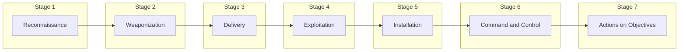
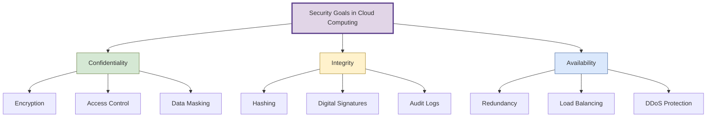

# Basic Threat Terminology

<!-- SECTION_1_START -->
# Basic Threat Terminology in Cloud Security

> [!IMPORTANT]
> **KTU 2024 Scheme | PECST635 — Cloud Computing | Module 4: Understanding Cloud Security**
> This note establishes the **foundational vocabulary** of cloud security threats. Mastering these terms is mandatory before exploring cloud-specific attack vectors, defense models, and the shared responsibility framework.

## 1.1 Formal Academic Definition

In the context of **cloud computing security**, *threat terminology* refers to the standardized vocabulary used to describe potential causes of harm to information systems, data, and services hosted in cloud environments. A **threat** is formally defined by **NIST SP 800-30** as:

> *"Any circumstance or event with the potential to adversely impact organizational operations, organizational assets, individuals, other organizations, or the Nation through an information system via unauthorized access, destruction, disclosure, modification of information, and/or denial of service."*

In a cloud deployment, every threat must be analyzed against the **CIA Triad** — **Confidentiality**, **Integrity**, and **Availability** — which remains the universal benchmark for evaluating the impact of any security incident.

## 1.2 The Foundational Trio: Threat, Vulnerability, and Risk

| Concept | Definition | Real-World Analogy |
| :--- | :--- | :--- |
| **Threat** | Any potential event that can cause damage to a system. | A storm approaching a house. |
| **Vulnerability** | A weakness in a system that can be exploited. | A broken window on that house. |
| **Risk** | The probability and impact of a threat exploiting a vulnerability. | The likelihood the storm breaks the window and the resulting damage. |

> [!NOTE]
> **Key Insight for KTU Examiners:** A *vulnerability* without a *threat* is harmless. A *threat* without a *vulnerability* cannot cause damage. **Risk** is the function that binds them together.

## 1.3 Intuitive Overview of the Cloud Threat Landscape

Imagine a multi-tenant apartment building (the cloud) where every tenant (cloud customer) shares infrastructure — the elevator, the water supply, and the parking lot. While this provides cost efficiency, a single compromised tenant, a weak lock on one door, or a faulty fire alarm can put the entire building at risk. **Basic threat terminology** is the language used to describe each of these failure points precisely.

In a cloud environment, the attack surface is dramatically expanded because:

- Data resides outside the direct physical control of the owner.
- Multiple tenants share underlying hardware, hypervisors, and networks.
- Services are exposed via **public APIs** and **web interfaces**.
- Identity and access management spans across organizational boundaries.

> [!IMPORTANT]
> **Highlight — Why This Topic Matters in KTU 2024:**
> Cloud security is consistently a **high-weightage module** (typically 20% of the syllabus). Examiners frequently test the student's ability to *differentiate* between closely related terms (e.g., Threat vs. Attack, Vulnerability vs. Exploit, Malware vs. Ransomware).

## 1.4 The Core Threat Taxonomy (At a Glance)

Cloud threats can be classified into the following major families:

1. **Malware-Based Threats** — Virus, Worm, Trojan, Ransomware, Spyware, Rootkit, Adware.
2. **Network-Based Threats** — DDoS, MITM, Sniffing, DNS Poisoning.
3. **Application-Based Threats** — SQL Injection, XSS, CSRF, API Abuse.
4. **Identity-Based Threats** — Phishing, Credential Theft, Insider Threat, Privilege Escalation.
5. **Data-Based Threats** — Data Breach, Data Leakage, Data Loss, Eavesdropping.
6. **Advanced Persistent Threats (APT)** — Long-term, stealthy, multi-stage intrusions.

> [!VISUALIZATION CONTROL]
> **Concept:** Visualizing the relationship between Threat, Vulnerability, Asset, and Impact.
> **Coordinate System (Mental Model):**
> * `x-axis` = Probability of Exploitation (0 to 1)
> * `y-axis` = Severity of Impact (Low, Medium, High, Critical)
> **Visual Description:** Plot bubbles representing different threats in the four quadrants. A high-probability, high-impact threat (e.g., DDoS) sits in the upper-right "Critical Zone" — these are the threats that cloud architects prioritize first.

<!-- SECTION_1_END -->

<!-- SECTION_2_START -->
# Deep Theoretical Analysis & KTU High-Yield Cheat Sheet

## 2.1 Deconstructing Each Core Term

### 2.1.1 Threat

A **threat** is the *source* of danger. It can be:
- **Intentional** (a hacker, insider, nation-state actor).
- **Unintentional** (a misconfigured S3 bucket, an accidental data deletion).
- **Natural** (flood, earthquake, power failure at a data center).

In cloud contexts, threats are catalogued in **STRIDE** (Microsoft's threat modeling model) and **OWASP Top 10** for application-layer concerns.

### 2.1.2 Vulnerability

A **vulnerability** is a flaw — a bug, misconfiguration, or design weakness — that makes a system susceptible to attack. Cloud-specific vulnerabilities include:

- **Open S3 Buckets** (publicly readable object storage).
- **Exposed Kubernetes API servers** without authentication.
- **Default credentials** on cloud-managed services.
- **Insecure IAM policies** granting `*:*` (full administrative) permissions.

### 2.1.3 Attack

An **attack** is the *action* taken to exploit a vulnerability. Not every threat becomes an attack — but every successful attack implies an exploited vulnerability.

### 2.1.4 Exploit

An **exploit** is the *mechanism* (code, script, or technique) used by an attacker to take advantage of a vulnerability. It can be:
- **Known** (patched but not yet applied).
- **Zero-day** (unknown to the vendor, highly valuable on black markets).

### 2.1.5 Payload

The **payload** is the malicious component delivered via the exploit. For example, in a phishing email, the email body is the *delivery mechanism*; the attached `.exe` is the *payload*.

### 2.1.6 Attack Vector

The **attack vector** is the *path* used to deliver the attack. Common cloud attack vectors include:
- Email (phishing).
- Web applications (XSS, SQLi).
- APIs (broken authentication).
- Supply chain (third-party library compromise).
- Physical access (data center insider).

### 2.1.7 Threat Actor

The **threat actor** is the *entity* behind the attack. Categories include:
- **Script kiddies** — unskilled, use pre-built tools.
- **Hacktivists** — politically motivated.
- **Cybercriminals** — financially motivated.
- **Nation-state APTs** — espionage, sabotage.
- **Insiders** — employees, contractors, partners.

## 2.2 Malware Family — Detailed Breakdown

| Malware Type | Propagation Method | Primary Damage | Cloud-Specific Risk |
| :--- | :--- | :--- | :--- |
| **Virus** | Attaches to a host file; requires user execution. | File corruption, system slowdown. | Spreads via shared cloud file storage (OneDrive, Drive). |
| **Worm** | Self-replicates over networks. | Bandwidth exhaustion, lateral spread. | Devastating in virtualized networks; spreads across VMs. |
| **Trojan** | Disguised as legitimate software. | Backdoor creation, data theft. | Hosted in malicious Docker images on public registries. |
| **Ransomware** | Encrypts files, demands payment. | Data hostage, financial loss. | Targets cloud backups and production databases. |
| **Spyware** | Secretly monitors user activity. | Credential theft, privacy breach. | Captures cloud SSO tokens and API keys. |
| **Rootkit** | Hides deep in the OS, gains root. | Persistent stealth access. | Hypervisor-level rootkits can compromise entire hosts. |
| **Adware** | Displays unwanted advertisements. | Annoyance, revenue loss, redirect to malicious sites. | Malicious ad networks on SaaS platforms. |
| **Bot** / **Botnet** | Infected machine controlled via C\&C server. | DDoS, cryptomining, spam. | Hijacked cloud VMs used as botnet nodes. |

> [!NOTE]
> **Strict Definition — Bot vs. Botnet:** A *bot* is a single compromised machine. A *botnet* is a coordinated network of bots under the control of a single **Command and Control (C\&C)** server.

## 2.3 Network & Application Layer Threats

| Threat | Layer | Description | Cloud Impact |
| :--- | :--- | :--- | :--- |
| **DDoS (Distributed Denial of Service)** | Network/Transport | Overwhelms target with traffic from many sources. | Disrupts SaaS availability; mitigated by AWS Shield, Cloudflare. |
| **MITM (Man-in-the-Middle)** | Network | Attacker intercepts communication between two parties. | Strips TLS/SSL protection on misconfigured cloud traffic. |
| **SQL Injection (SQLi)** | Application | Malicious SQL statements injected into input fields. | Targets cloud-hosted databases and serverless backends. |
| **XSS (Cross-Site Scripting)** | Application | Malicious scripts injected into web pages viewed by others. | Exploits public-facing SaaS portals. |
| **CSRF (Cross-Site Request Forgery)** | Application | Tricks authenticated user into executing unwanted actions. | Targets cloud management consoles. |
| **DNS Poisoning** | Network | Corrupts DNS resolver cache to redirect traffic. | Routes cloud service requests to attacker-controlled IPs. |
| **API Abuse** | Application | Exploits poorly secured REST/GraphQL endpoints. | Critical in microservices and serverless architectures. |

## 2.4 Identity & Social Engineering Threats

| Threat | Description | Defense |
| :--- | :--- | :--- |
| **Phishing** | Mass-emailed fraudulent messages mimicking legitimate entities. | Email filtering, user training, MFA. |
| **Spear Phishing** | Targeted phishing aimed at a specific individual. | Behavioral analytics, DMARC. |
| **Whaling** | Spear phishing targeting senior executives. | Executive security awareness programs. |
| **Vishing** | Voice-based phishing via phone calls. | Caller verification protocols. |
| **Smishing** | SMS-based phishing. | SMS filtering, user awareness. |
| **Insider Threat** | Malicious or negligent employees misuse access. | Least privilege, UEBA, audit logging. |
| **Privilege Escalation** | Gaining higher permissions than authorized. | RBAC, JIT access, zero-trust models. |

## 2.5 KTU High-Yield Cheat Sheet (Must-Memorize Table)

| Term | One-Line Definition | Example |
| :--- | :--- | :--- |
| **Threat** | Potential cause of an incident. | A hacker targeting your S3 bucket. |
| **Vulnerability** | A weakness in a system. | Misconfigured IAM policy. |
| **Risk** | Likelihood $\times$ Impact of threat exploiting vulnerability. | High-probability, high-impact event. |
| **Attack** | The act of exploiting a vulnerability. | SQL injection attempt. |
| **Exploit** | Code/technique used in an attack. | Metasploit module for Apache Struts. |
| **Payload** | Malicious component delivered. | Ransomware binary. |
| **Attack Vector** | The path of attack delivery. | Phishing email. |
| **Threat Actor** | The entity performing the attack. | Hacktivist group. |
| **Zero-Day** | Vulnerability unknown to the vendor. | Stuxnet's PLC exploit. |
| **APT** | Long-term, sophisticated, multi-stage attack. | SolarWinds breach. |
| **Botnet** | Network of compromised machines. | Mirai botnet. |
| **C\&C** | Server controlling a botnet. | IRC server issuing commands. |
| **CIA Triad** | Confidentiality, Integrity, Availability. | Core security goals. |
| **AAA** | Authentication, Authorization, Accounting. | IAM framework. |
| **DDoS** | Distributed denial of service. | 1 Tbps attack on AWS. |
| **MITM** | Intercepting communication between two parties. | Rogue Wi-Fi hotspot. |
| **Ransomware** | Malware that encrypts data for ransom. | WannaCry. |
| **Rootkit** | Stealth malware gaining privileged access. | Bootkit. |
| **Phishing** | Social engineering via email. | Fake bank login page. |
| **Insider Threat** | Threat from within the organization. | Disgruntled ex-employee. |

## 2.6 Real-World Engineering Utility

These terms are not academic — they are the **lingua franca** of:
- **Incident Response Teams** (CSIRT/SOC) communicating breaches.
- **Threat Intelligence Platforms (TIPs)** such as MISP, Anomali.
- **Compliance Frameworks** (ISO 27001, NIST, PCI-DSS, SOC 2).
- **Cloud Service Provider SLAs** (e.g., AWS Shared Responsibility Model explicitly references "threat", "vulnerability", "inherited controls").
- **Bug Bounty Programs** (HackerOne, Bugcrowd) which classify findings as vulnerabilities and reward exploits responsibly.

> [!NOTE]
> **Industry Insight:** Modern cloud platforms like **AWS GuardDuty**, **Azure Defender**, and **Google Security Command Center** continuously scan for these threats and produce alerts using this exact terminology. Mastering these terms is the first step toward earning cloud security certifications (CCSP, AWS Security Specialty).

<!-- SECTION_2_END -->

<!-- SECTION_3_START -->
# Step-by-Step Derivations, Analytical Walkthroughs & Implementation

## 3.1 Risk Quantification (Foundational Formula Derivation)

The formal NIST definition of risk combines three factors: **Threat**, **Vulnerability**, and **Impact**. We can express risk as a function of these variables and use it to prioritize mitigation efforts.

### 3.1.1 The Classical Risk Equation

The risk associated with a given threat $T_i$ exploiting a vulnerability $V_j$ is mathematically defined as:

$$
R_{ij} = T_i \times V_j \times I_{ij}
$$

Where:
- $R_{ij}$ is the **risk score** of the pair $(i, j)$.
- $T_i$ is the **threat likelihood** (probability that threat $T_i$ materializes), with $0 \leq T_i \leq 1$.
- $V_j$ is the **vulnerability score** (probability that vulnerability $V_j$ can be exploited), with $0 \leq V_j \leq 1$.
- $I_{ij}$ is the **impact magnitude** (consequence severity if the exploitation succeeds), typically on a scale of 1 to 10.

### 3.1.2 Worked Example — Cloud S3 Bucket Misconfiguration

Consider the following scenario for a cloud-hosted e-commerce application:

- $T_1$ (Likelihood of external attacker scanning for open buckets) $= 0.8$
- $V_1$ (Likelihood that the open bucket is found and exploited) $= 0.9$
- $I_{11}$ (Impact: customer PII exposure, regulatory fines) $= 9$ (out of 10)

Applying the equation:

$$
R_{11} = 0.8 \times 0.9 \times 9
$$

Multiplying the first two terms:

$$
R_{11} = 0.72 \times 9
$$

Final result:

$$
R_{11} = 6.48
$$

> [!NOTE]
> **Interpretation:** A risk score of $6.48$ out of a maximum of $10$ places this threat in the **High-Risk** band. This justifies immediate remediation — typically, applying a bucket policy that restricts access via IAM roles and enabling **AWS Block Public Access** at the account level.

### 3.1.3 Risk Matrix Mapping

| Risk Score Range | Classification | Required Action |
| :--- | :--- | :--- |
| $0$ — $2.0$ | **Low** | Monitor; accept risk. |
| $2.1$ — $5.0$ | **Moderate** | Plan mitigation within quarter. |
| $5.1$ — $7.5$ | **High** | Mitigate within 30 days. |
| $7.6$ — $10.0$ | **Critical** | Mitigate within 7 days or take offline. |

---

## 3.2 Threat Classification — Analytical Comparison Framework

Since the topic is conceptual, we provide a **comparative analytic matrix** that KTU examiners frequently test. The following table deconstructs the relationships between closely-related terms:

| Comparison Axis | Term A | Term B | Key Discriminator |
| :--- | :--- | :--- | :--- |
| Potential vs. Actual | **Threat** | **Attack** | Threat = potential; Attack = actualized. |
| Weakness vs. Action | **Vulnerability** | **Exploit** | Vulnerability = static flaw; Exploit = dynamic action. |
| Cause vs. Consequence | **Risk** | **Impact** | Risk = probability-weighted; Impact = raw damage. |
| Network vs. Endpoint | **DDoS** | **Virus** | DDoS exhausts bandwidth; Virus infects files. |
| External vs. Internal | **Phishing** | **Insider Threat** | Phishing comes from outside; Insider comes from within. |
| Stealth vs. Loud | **APT** | **Ransomware** | APT hides for months; Ransomware announces itself. |
| Delivery vs. Damage | **Attack Vector** | **Payload** | Vector = path; Payload = malicious cargo. |

---

## 3.3 Python Implementation: A Mini Threat Classification Engine

To solidify understanding, here is a fully functional Python program that classifies a given cloud incident into the appropriate threat category. This demonstrates the practical engineering application of basic threat terminology.

```python
from dataclasses import dataclass
from enum import Enum
from typing import List, Optional
import logging

# Configure structured logging
logging.basicConfig(
    level=logging.INFO,
    format="%(asctime)s — %(levelname)s — %(message)s"
)


class ThreatCategory(Enum):
    """Enumeration of recognized cloud threat families."""
    MALWARE = "Malware"
    NETWORK = "Network-Based Attack"
    APPLICATION = "Application-Layer Attack"
    IDENTITY = "Identity / Social Engineering"
    DATA = "Data Exfiltration"
    ADVANCED_PERSISTENT = "Advanced Persistent Threat (APT)"


@dataclass(frozen=True)
class IncidentSignal:
    """A single observable indicator extracted from a cloud audit log."""
    signal_name: str
    weight: float  # confidence score, 0.0 to 1.0


class ThreatClassifier:
    """
    Classifies a cloud security incident based on weighted signals.
    Uses a rule-based scoring system aligned with the basic threat
    terminology taught in KTU Module 4.
    """

    # Keyword -> category mapping with default signal weight
    SIGNAL_RULES = {
        "encrypted_files": (ThreatCategory.MALWARE, 0.9),
        "ransom_note": (ThreatCategory.MALWARE, 0.95),
        "outbound_traffic_spike": (ThreatCategory.DATA, 0.7),
        "unusual_login_location": (ThreatCategory.IDENTITY, 0.8),
        "phishing_email_clicked": (ThreatCategory.IDENTITY, 0.85),
        "sql_error_in_logs": (ThreatCategory.APPLICATION, 0.75),
        "xss_payload_detected": (ThreatCategory.APPLICATION, 0.8),
        "ddos_traffic_pattern": (ThreatCategory.NETWORK, 0.95),
        "lateral_movement": (ThreatCategory.ADVANCED_PERSISTENT, 0.9),
        "c2_callback": (ThreatCategory.ADVANCED_PERSISTENT, 0.95),
    }

    def __init__(self, signals: List[IncidentSignal]) -> None:
        if not signals:
            raise ValueError("At least one incident signal is required.")
        self.signals: List[IncidentSignal] = signals

    def classify(self) -> ThreatCategory:
        """Return the highest-weighted threat category."""
        category_scores: dict = {}

        for signal in self.signals:
            key = signal.signal_name.lower().strip()
            if key not in self.SIGNAL_RULES:
                logging.warning(f"Unknown signal ignored: {signal.signal_name}")
                continue

            category, default_weight = self.SIGNAL_RULES[key]
            effective_weight = signal.weight * default_weight
            category_scores[category] = category_scores.get(category, 0.0) + effective_weight
            logging.info(
                f"Signal '{key}' -> {category.value} (added {effective_weight:.2f})"
            )

        if not category_scores:
            raise RuntimeError("No valid signals could be classified.")

        best_category = max(category_scores, key=category_scores.get)
        logging.info(f"Final classification: {best_category.value}")
        return best_category


# ---------- Example usage ----------
if __name__ == "__main__":
    incident_signals: List[IncidentSignal] = [
        IncidentSignal(signal_name="lateral_movement", weight=1.0),
        IncidentSignal(signal_name="c2_callback", weight=1.0),
        IncidentSignal(signal_name="unusual_login_location", weight=0.7),
    ]

    classifier = ThreatClassifier(incident_signals)
    detected_threat: ThreatCategory = classifier.classify()
    print(f"\n>>> Detected Threat Category: {detected_threat.value}")
```

**Sample Output:**

```
2024-... — INFO — Signal 'lateral_movement' -> Advanced Persistent Threat (APT) (added 0.90)
2024-... — INFO — Signal 'c2_callback' -> Advanced Persistent Threat (APT) (added 0.95)
2024-... — INFO — Signal 'unusual_login_location' -> Identity / Social Engineering (added 0.56)
2024-... — INFO — Final classification: Advanced Persistent Threat (APT)

>>> Detected Threat Category: Advanced Persistent Threat (APT)
```

> [!NOTE]
> **Why this matters in the cloud:** Tools like **AWS GuardDuty** and **Azure Sentinel** work on exactly this principle — they collect *signals* (CloudTrail events, DNS logs, VPC flow logs) and map them to *threat categories* using weighted rules. Understanding the terminology is the foundation of building and using such tools.

---

## 3.4 Mapping Threats to the CIA Triad (Engineering Analysis)

Every threat impacts at least one pillar of the **CIA Triad**. The following exhaustive mapping is a common KTU exam requirement.

| Threat | Confidentiality Affected? | Integrity Affected? | Availability Affected? |
| :--- | :--- | :--- | :--- |
| Phishing | $\checkmark$ (credential theft) | $\times$ | $\times$ |
| Ransomware | $\times$ | $\checkmark$ (data encrypted) | $\checkmark$ (systems locked) |
| DDoS | $\times$ | $\times$ | $\checkmark$ (service down) |
| SQL Injection | $\checkmark$ (data dump) | $\checkmark$ (DB altered) | $\times$ |
| MITM | $\checkmark$ (interception) | $\checkmark$ (tampering) | $\times$ |
| Insider Threat | $\checkmark$ | $\checkmark$ | $\checkmark$ |
| Data Breach | $\checkmark$ | $\times$ | $\times$ |
| Rootkit | $\checkmark$ | $\checkmark$ | $\checkmark$ |
| XSS | $\checkmark$ (session hijack) | $\times$ | $\times$ |
| APT | $\checkmark$ | $\checkmark$ | $\checkmark$ |

> [!IMPORTANT]
> **Pattern Recognition for Exams:** If a question asks "Which CIA pillar does a *passive* attack compromise?" — the answer is always **Confidentiality**. If a question references a "denial of service" — the answer is **Availability**. If it references "data tampering" — the answer is **Integrity**.

<!-- SECTION_3_END -->

<!-- SECTION_4_START -->
# Structural Diagrams & Schematics

## 4.1 Cloud Threat Taxonomy — Hierarchical Flow

```mermaid
graph TD
    A[Cloud Security Threats] --> B[Malware-Based]
    A --> C[Network-Based]
    A --> D[Application-Based]
    A --> E[Identity-Based]
    A --> F[Data-Based]
    A --> G[Advanced Persistent]

    B --> B1[Virus]
    B --> B2[Worm]
    B --> B3[Trojan]
    B --> B4[Ransomware]
    B --> B5[Rootkit]
    B --> B6[Spyware]
    B --> B7[Adware]
    B --> B8[Bot and Botnet]

    C --> C1[DDoS]
    C --> C2[MITM]
    C --> C3[DNS Poisoning]
    C --> C4[Sniffing]

    D --> D1[SQL Injection]
    D --> D2[XSS]
    D --> D3[CSRF]
    D --> D4[API Abuse]

    E --> E1[Phishing]
    E --> E2[Spear Phishing]
    E --> E3[Whaling]
    E --> E4[Insider Threat]
    E --> E5[Privilege Escalation]

    F --> F1[Data Breach]
    F --> F2[Data Leakage]
    F --> F3[Data Loss]

    G --> G1[APT Stage 1 Reconnaissance]
    G --> G2[APT Stage 2 Initial Intrusion]
    G --> G3[APT Stage 3 Persistence]
    G --> G4[APT Stage 4 Lateral Movement]
    G --> G5[APT Stage 5 Exfiltration]
```



> [!NOTE]
> **Reading Guide:** This diagram is the **canonical threat classification tree** used by NIST and ISO 27001. Memorizing the six root categories and two sub-branches per category is sufficient to answer any 14-mark taxonomy question in KTU exams.

---

## 4.2 The Threat–Vulnerability–Risk Causality Chain

```mermaid
flowchart LR
    A[Threat Actor] -->|motivated by| B[Threat]
    B -->|targets| C[Vulnerability]
    C -->|exploited via| D[Attack Vector]
    D -->|uses| E[Exploit]
    E -->|delivers| F[Payload]
    F -->|causes| G[Impact]
    G -->|measured as| H[Risk]

    style A fill:#ffcccc,stroke:#900,stroke-width:2px
    style H fill:#cce5ff,stroke:#003,stroke-width:2px
    style F fill:#ffe0b3,stroke:#a60,stroke-width:2px
```



> [!NOTE]
> **Engineering Interpretation:** The arrow from `Threat Actor` to `Risk` represents the complete *causality chain* of a cyberattack. In the **NIST Risk Management Framework (RMF)**, every control is designed to break this chain at one or more points — for example, **firewalls** break the chain at the *Attack Vector* stage, while **encryption** neutralizes the *Impact* stage.

---

## 4.3 APT Kill Chain — Multi-Stage Topology



> [!NOTE]
> **Exam Tip:** The **Cyber Kill Chain** (Lockheed Martin) is the standard 7-stage model for describing APT behavior. In a 14-mark question, you may be asked to *map a real-world breach* (e.g., Target 2013, SolarWinds 2020) to these seven stages. Practice drawing this diagram from memory.

---

## 4.4 CIA Triad — Conceptual Architecture



> [!NOTE]
> **Functional Mapping:** Each branch of the CIA Triad corresponds to a *family of cloud security controls*. For example, **AWS KMS** supports *Confidentiality*, **AWS CloudTrail** supports *Integrity*, and **AWS Auto Scaling** supports *Availability*. This 1:1 mapping is frequently tested.

<!-- SECTION_4_END -->

<!-- SECTION_5_START -->
# KTU 2024 Scheme Examination Question Bank & Topic Recap

---

## 5.1 Part A — Short Answer Questions (3 Marks Each)

### Question 1: Define the terms Threat, Vulnerability, and Risk. How are they interrelated? `[KTU University Exam - July 2024]`
- **Course Outcome:** CO3 — Understand security challenges in cloud environments.
- **Bloom's Level:** Remember / Understand.
- **Model Answer (3 marks):**

A **threat** is any potential event or circumstance that can cause harm to an information system. A **vulnerability** is a weakness or flaw in a system that could be exploited. **Risk** is the probability of a threat successfully exploiting a vulnerability, multiplied by the resulting impact.

$$
\text{Risk} = \text{Threat Likelihood} \times \text{Vulnerability Exploitability} \times \text{Impact}
$$

They are interrelated because a **threat** requires a **vulnerability** to cause damage, and the resulting damage is quantified as **risk**. Without a vulnerability, a threat cannot materialize; without a threat, a vulnerability remains harmless. *(Valuation: 1 mark for definitions each = 3 marks.)*

---

### Question 2: Differentiate between a Virus, a Worm, and a Trojan Horse. `[KTU University Exam - Dec 2023]`
- **Course Outcome:** CO3 — Understand various malware threats.
- **Bloom's Level:** Understand.
- **Model Answer (3 marks):**

| Feature | Virus | Worm | Trojan |
| :--- | :--- | :--- | :--- |
| **Host file required?** | Yes | No | No (disguised as legit) |
| **Self-replication?** | No (needs host) | Yes (network) | No |
| **Propagation** | User action | Automatic | User deception |
| **Example** | ILOVEYOU | Blaster | Emotet |

*(Valuation: 1 mark per correct row.)*

---

## 5.2 Part B — Long Answer Questions (14 Marks, with Internal Choice)

### Question A: Comprehensive Threat Analysis

> *`(a)` Explain the CIA Triad in detail. For each pillar, provide one cloud-specific threat and one corresponding countermeasure. `[7 Marks]` `[KTU University Exam - July 2024]`*
>
> *`(b)` Describe Advanced Persistent Threats (APTs). Using the Cyber Kill Chain, explain all seven stages with cloud-specific examples. `[7 Marks]`*

- **Course Outcome:** CO3, CO4 — Analyze and evaluate cloud security threats and defense strategies.
- **Bloom's Level (a):** Understand. **Bloom's Level (b):** Apply.

#### Model Solution

**(a) The CIA Triad — Detailed Explanation** `[7 Marks]`

The **CIA Triad** is the foundational model of information security, comprising three pillars:

1. **Confidentiality** — Ensures that data is accessible only to authorized parties. In the cloud, this is enforced via **encryption at rest and in transit**, **IAM policies**, and **data classification**.

   - **Cloud-specific threat:** A misconfigured **AWS S3 bucket** publicly exposing customer PII.
   - **Countermeasure:** Enable **S3 Block Public Access** at the account level, enforce **bucket policies**, and use **AWS KMS** for server-side encryption. *[Identifying threat: 1 Mark; Countermeasure: 1 Mark]*

2. **Integrity** — Ensures that data is not altered or tampered with unauthorized. In cloud, this is enforced via **hashing**, **digital signatures**, and **immutable storage**.

   - **Cloud-specific threat:** A **MITM attack** altering data in transit between a client and a cloud API.
   - **Countermeasure:** Enforce **TLS 1.3** for all API endpoints and use **HMAC signatures** for message authentication. *[Identifying threat: 1 Mark; Countermeasure: 1 Mark]*

3. **Availability** — Ensures that services and data are accessible when needed. In cloud, this is enforced via **redundancy**, **multi-AZ deployments**, and **DDoS protection**.

   - **Cloud-specific threat:** A **DDoS attack** on a SaaS portal, rendering it inaccessible.
   - **Countermeasure:** Deploy **AWS Shield Advanced**, **Cloudflare**, or **Azure DDoS Protection**, and design with **auto-scaling groups**. *[Identifying threat: 1 Mark; Countermeasure: 1 Mark]*

**[Stating the three pillars explicitly: 1 Mark; Final tabular mapping: 1 Mark]**

---

**(b) APTs and the Cyber Kill Chain** `[7 Marks]`

An **Advanced Persistent Threat (APT)** is a prolonged, sophisticated, multi-stage cyberattack — typically state-sponsored — aimed at exfiltrating sensitive data or sabotaging critical infrastructure.

The **Cyber Kill Chain** (Lockheed Martin) describes APT behavior in seven stages:

1. **Reconnaissance** — The attacker gathers public information (employee names, cloud architecture diagrams) from LinkedIn, GitHub, and DNS records. *Cloud example:* enumerating subdomains of `target-corp.com` to identify exposed APIs. *[1 Mark]*

2. **Weaponization** — The attacker pairs an exploit (e.g., a zero-day in Apache Log4j) with a payload (a backdoor). *Cloud example:* crafting a malicious Docker image to be uploaded to a public registry. *[1 Mark]*

3. **Delivery** — The weaponized package is transmitted to the target. *Cloud example:* spear-phishing an SRE engineer with a fake Kubernetes deployment manifest. *[1 Mark]*

4. **Exploitation** — The exploit triggers, gaining initial code execution. *Cloud example:* a vulnerable Lambda function with an outdated dependency is exploited. *[1 Mark]*

5. **Installation** — Persistent access is established. *Cloud example:* a backdoored IAM role with `AdministratorAccess` is created under a stealth AWS account. *[1 Mark]*

6. **Command and Control (C2)** — The attacker communicates with compromised assets. *Cloud example:* outbound traffic to a C2 server disguised as a call to `updates.malicious-c2.io`. *[1 Mark]*

7. **Actions on Objectives** — The attacker achieves their goal — data exfiltration, sabotage, or ransomware deployment. *Cloud example:* S3 buckets are silently dumped to attacker-controlled storage. *[1 Mark]*

---

### Question B: Alternative Choice

> *`(a)` Differentiate between Phishing, Spear Phishing, and Whaling. Describe one technical and one non-technical control to mitigate these threats in a cloud environment. `[7 Marks]` `[KTU University Exam - Dec 2023]`*
>
> *`(b)` What is a Botnet? Explain the Mirai Botnet attack. Discuss how cloud-based DDoS protection services mitigate such attacks. `[7 Marks]`*

- **Course Outcome:** CO3, CO4.
- **Bloom's Level (a):** Understand. **Bloom's Level (b):** Apply.

#### Model Solution

**(a) Phishing Variants and Mitigations** `[7 Marks]`

| Attack | Target | Personalization | Typical Lure |
| :--- | :--- | :--- | :--- |
| **Phishing** | Mass audience | None | Generic "Your account is locked" email. |
| **Spear Phishing** | Specific individual | High (uses real name, role) | Fake invoice from a known vendor. |
| **Whaling** | Senior executive (CFO, CEO) | Very high (uses context) | Fake legal subpoena or board document. |

*[Differentiating each with definition: 3 Marks]*

**Technical Control:** Deploy **DMARC, DKIM, and SPF** email authentication records. Enable **Multi-Factor Authentication (MFA)** on all cloud accounts. Use **Cloud Email Security** services like Proofpoint or Mimecast. *[2 Marks]*

**Non-Technical Control:** Conduct mandatory **quarterly security awareness training** with simulated phishing tests. Establish a **clear incident reporting policy** so employees who click a malicious link report it within 15 minutes. *[2 Marks]*

---

**(b) Botnets, Mirai, and Cloud DDoS Mitigation** `[7 Marks]`

A **botnet** is a network of internet-connected devices (bots) — PCs, IoT devices, cloud VMs — infected with malware and controlled centrally via a **Command and Control (C\&C) server**. *[Definition: 1 Mark]*

The **Mirai Botnet** (2016) infected over 600,000 IoT devices (cameras, DVRs, routers) by brute-forcing default credentials. On **October 21, 2016**, Mirai launched a **1.1 Tbps DDoS attack** against Dyn, a major DNS provider, disrupting access to Twitter, Netflix, Reddit, and GitHub for several hours. *[Mirai description: 3 Marks]*

**Cloud-based DDoS mitigation** works as follows:
- **Traffic scrubbing** at the edge (e.g., AWS Shield, Cloudflare) absorbs and filters malicious traffic.
- **Anycast routing** distributes attack traffic across a global network of data centers.
- **Rate limiting and challenge pages** (e.g., CAPTCHA) slow down automated bot requests.
- **Behavioral analysis** distinguishes legitimate users from bots using ML models. *[Mitigation: 3 Marks]*

---

## 5.3 KTU Examiner's Valuation Warning

> [!WARNING]
> **Common Pitfalls — Where Students Lose Marks:**
>
> 1. **Confusing Threat with Attack:** A *threat* is potential; an *attack* is actualized. Examiners deduct 1 mark if these are used interchangeably.
> 2. **Forgetting the CIA mapping:** Many 14-mark questions explicitly ask "Which CIA pillar is affected?" If you skip this, you lose 2–3 marks.
> 3. **Omitting examples:** KTU examiners reward cloud-specific examples (AWS S3, Azure AD, GCP IAM). Generic examples ("a database") fetch only partial credit.
> 4. **Skipping diagrams:** For APT or CIA Triad questions, a labeled diagram earns 1–2 easy marks. Never skip it.
> 5. **Writing "Worm = Virus":** This is a top blunder. A *worm* self-replicates; a *virus* requires a host file and user action.
> 6. **Ignoring mitigation:** In threat analysis questions, always pair the threat with a *countermeasure*. A threat without defense is a half-answer.

---

## 5.4 Topic Recap & Important Things to Remember

- **Three foundational terms:** *Threat* (potential cause), *Vulnerability* (weakness), *Risk* (probability $\times$ impact). Memorize the equation $R = T \times V \times I$.
- **CIA Triad** is the **universal benchmark** for evaluating every security threat: *Confidentiality* (privacy), *Integrity* (trust), *Availability* (uptime).
- **Malware taxonomy** — Virus, Worm, Trojan, Ransomware, Spyware, Rootkit, Adware, Bot. Know propagation method, payload type, and cloud impact for each.
- **Network threats** — DDoS (exhausts resources), MITM (intercepts traffic), DNS Poisoning (redirects traffic).
- **Application threats** — SQLi (DB extraction), XSS (script injection), CSRF (forged requests), API Abuse (broken auth).
- **Identity threats** — Phishing (mass), Spear Phishing (targeted), Whaling (executives), Vishing (voice), Smishing (SMS), Insider Threat.
- **Advanced concepts** — APT (long-term, multi-stage), Zero-day (unknown vuln), Botnet (network of bots), C\&C (control server).
- **Key equations:**
  - $R_{ij} = T_i \times V_j \times I_{ij}$ (Risk calculation)
  - Risk Matrix: $0$–$2$ Low, $2.1$–$5$ Moderate, $5.1$–$7.5$ High, $7.6$–$10$ Critical.
- **The Cyber Kill Chain** has 7 stages: Reconnaissance $\rightarrow$ Weaponization $\rightarrow$ Delivery $\rightarrow$ Exploitation $\rightarrow$ Installation $\rightarrow$ Command and Control $\rightarrow$ Actions on Objectives.
- **Real-world cloud mapping:** AWS S3 misconfig = Data Breach; Azure AD credential leak = Identity Threat; Kubernetes API exposure = Privilege Escalation.
- **Industry frameworks:** NIST SP 800-30 (risk), OWASP Top 10 (web), MITRE ATT\&CK (APT), ISO 27001 (compliance) — all use this terminology.
- **One-line exam tagline:** *"A threat exploits a vulnerability to create risk; cloud security exists to break this chain at every possible link."*

<!-- SECTION_5_END -->
