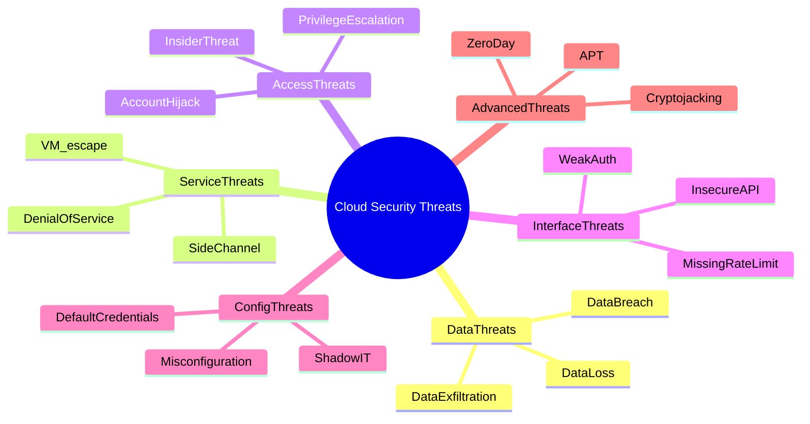
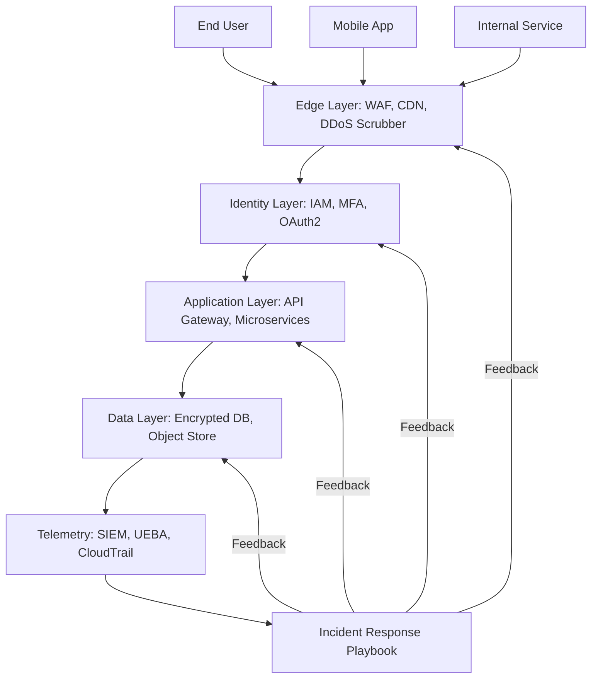
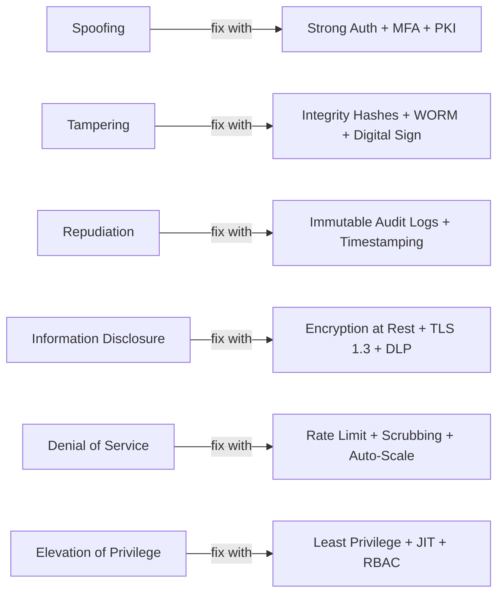

# Common Threats

<!-- SECTION_1_START -->

# Module 4 — Understanding Cloud Security: Common Threats

## 1.1 Core Technical Definition

> [!IMPORTANT]
> **Cloud Security Threat (KTU 2024 Definition):** A *cloud security threat* is any malicious actor, vulnerability, attack vector, or anomalous condition that can compromise the **Confidentiality, Integrity, Availability, Authenticity, and Non-Repudiation** of data, services, or infrastructure hosted on a public, private, hybrid, or community cloud platform.

The **five pillars of information security** (often remembered using the acronym *CIANA+*) are:

- **C**onfidentiality — protecting data from unauthorized disclosure.
- **I**ntegrity — preventing unauthorized modification of data.
- **A**vailability — ensuring services remain accessible when required (uptime target: **99.999%** for Tier IV cloud providers, often called *five-nines*).
- **A**uthenticity — verifying the identity of communicating entities.
- **N**on-Repudiation — guaranteeing that a party cannot deny having performed an action.

> [!NOTE]
> **Syllabus Highlight (PECST635, Module 4):** Students must be able to identify, classify, and propose mitigations for *at least eight* of the most prevalent cloud threats, as listed by **ENISA**, **OWASP**, and the **Cloud Security Alliance (CSA)** Top Threats working group.

---

## 1.2 Conceptual Analogy / Intuition

> [!TIP]
> **Real-World Analogy — The Bank Vault in the Sky**
> Imagine moving your valuables from a personal home locker to a giant shared bank vault. You benefit from armed guards, biometric doors, and 24/7 surveillance — but you also share the building with thousands of other customers, depend on the vault operator's honesty, and trust that the bank's employees will not peek inside your box. *Cloud security threats* are precisely the risks introduced by this transition: the **insider teller (malicious insider)**, the **pickpocket at the entrance (MITM attack)**, the **fake bank guard (phishing)**, the **roof leak (data breach)**, and the **bank strike that shuts everything down (DoS attack)*.

**Intuitive Threat Severity Model:**

| Dimension | Question it Answers | Example |
|-----------|--------------------|---------|
| **Likelihood** | How often will this happen? | High for DDoS |
| **Impact** | How much damage if it happens? | Catastrophic for data breach |
| **Detectability** | Can we see it occurring? | Low for APT (Advanced Persistent Threat) |

> [!VISUALIZATION CONTROL]
> **Concept:** Threat Severity vs. Probability Heat Map
> **Plotting Axes:**
> * x-axis = Probability of Occurrence (0 to 1)
> * y-axis = Business Impact Severity (0 to 10)
> **Reference Points (Threats to plot):**
> * Phishing = (0.85, 6)
> * DDoS = (0.70, 9)
> * APT = (0.20, 10)
> * Data Breach = (0.45, 10)
> * Insider Misuse = (0.55, 8)
> **Visual Description:** A scatter plot where threats in the upper-right quadrant represent *high-probability, high-impact* events requiring immediate attention. APT sits high but far left, meaning rare but devastating.

---

## 1.3 Standard Threat Catalog (CSA Top Threats & ENISA Reference)

The **Cloud Security Alliance (CSA)** periodically publishes a ranked list of the most consequential cloud threats. The current canonical reference is *CSA Top Threats to Cloud Computing (2024 edition)*:

1. **Data Breach** — unauthorized access to sensitive data.
2. **Misconfiguration & Inadequate Change Control** — default settings left unchanged.
3. **Lack of Cloud Security Architecture & Strategy** — no defense-in-depth design.
4. **Insufficient Identity, Credential, Access & Key Management** — weak IAM.
5. **Account Hijacking** — stolen credentials via phishing or credential stuffing.
6. **Insider Threat** — malicious or negligent employee.
7. **Insecure Interfaces & APIs** — exploitable REST/SOAP endpoints.
8. **Weak Control Plane** — compromised management layer.
9. **Metastructure & Applistructure Failures** — weak CSP-side components.
10. **Limited Cloud Visibility & Observability** — no telemetry.

---

<!-- SECTION_1_END -->

<!-- SECTION_2_START -->

# 2. Deep Theoretical Analysis & KTU High-Yield Formula Sheet

## 2.1 The Six Major Threat Categories (Board-Favorite)

> [!NOTE]
> For KTU valuation, examiners expect students to articulate **at least these six** threat families with one-line definitions and one mitigation each. Memorize the table below.

### 2.1.1 Data Breach
- **What it is:** Unauthorized exfiltration of confidential data (PII, PHI, financial records).
- **Mechanism:** Exploiting misconfigured storage (e.g., open S3 bucket), SQL injection, or credential theft.
- **Why it matters:** Average cost of a data breach in 2024 ≈ **USD 4.88 million** (per IBM Cost of a Data Breach Report).
- **Mitigation:** AES-256 encryption at rest, TLS 1.3 in transit, tokenization, principle of least privilege.

### 2.1.2 Data Loss
- **What it is:** Permanent destruction of data due to accidental deletion, malicious wipe, or natural disaster.
- **Difference from Data Breach:** Loss is *unrecoverable destruction*; breach is *unauthorized access*.
- **Mitigation:** 3-2-1 backup rule (**3** copies, **2** different media, **1** offsite), geo-replication, immutable WORM storage.

### 2.1.3 Denial of Service (DoS) / Distributed DoS (DDoS)
- **What it is:** Flooding a service with junk requests to exhaust CPU, memory, bandwidth, or connection pools.
- **Magnitude benchmark:** Record attacks now exceed **5.6 Tbps** (Microsoft mitigated in 2024).
- **Mitigation:** Anycast scrubbing, rate limiting, AWS Shield Advanced, Cloudflare Magic Transit.

### 2.1.4 Malicious Insider
- **What it is:** Current/former employee, contractor, or third-party with legitimate access who misuses privileges.
- **Detection difficulty:** Rated **moderate-to-high** because actions appear authorized at the API layer.
- **Mitigation:** Separation of duties, just-in-time (JIT) access, UEBA (User & Entity Behavior Analytics), audit logging.

### 2.1.5 Insecure APIs & Interfaces
- **What it is:** Publicly exposed REST/SOAP/gRPC endpoints that lack authentication, rate limiting, or input validation.
- **Why critical:** APIs are the *control plane* of the cloud — compromising one can cascade.
- **Mitigation:** OAuth 2.0 + OpenID Connect, API Gateway with WAF, schema validation, JWT signing.

### 2.1.6 Account Hijacking
- **What it is:** Attacker steals session tokens or credentials (often via phishing) to act as a legitimate user.
- **Mitigation:** MFA (Multi-Factor Authentication), FIDO2 hardware keys, conditional access policies.

---

## 2.2 Additional Emerging Threats (Module Depth)

### 2.2.1 Advanced Persistent Threats (APT)
Long-term, stealthy, state-sponsored intrusions where the attacker maintains presence for **months to years**. Often used for espionage or sabotage.

### 2.2.2 Side-Channel Attacks
Exploiting physical or logical *leakage* (cache timing, power consumption, electromagnetic emissions) to extract cryptographic keys from a co-tenant VM. Mitigated via **constant-time algorithms** and **cache partitioning**.

### 2.2.3 VM Escape
Exploiting a hypervisor vulnerability to break out of a guest VM and gain host-level control. Mitigated by **hardware-assisted virtualization (VT-x / AMD-V)** and timely hypervisor patching.

### 2.2.4 Cryptojacking
Unauthorized use of cloud compute to mine cryptocurrency. Detected via anomalous **GPU/CPU utilization spikes** (e.g., +300% sustained load with no corresponding workload).

### 2.2.5 Shadow IT
Employees provisioning unsanctioned cloud services (e.g., personal Dropbox) without IT approval. Mitigated by **CASB (Cloud Access Security Broker)** discovery scans.

### 2.2.6 Zero-Day Exploits
Vulnerabilities unknown to the vendor, leaving zero time to patch. Mitigated via **virtual patching**, **RASP (Runtime Application Self-Protection)**, and **threat intelligence feeds**.

---

## 2.3 KTU High-Yield Formula Sheet (Risk & Threat Modeling)

| Formula / Concept | Symbol | Equation | Notes |
|-------------------|--------|----------|-------|
| **Annualized Loss Expectancy** | $ALE$ | $ALE = SLE \times ARO$ | Loss in monetary terms per year. |
| **Single Loss Expectancy** | $SLE$ | $SLE = Asset\ Value \times Exposure\ Factor$ | Cost of one occurrence. |
| **Annual Rate of Occurrence** | $ARO$ | Numerical frequency | Times per year. |
| **Return on Security Investment** | $ROSI$ | $ROSI = \dfrac{ALE_{before} - ALE_{after} - Cost\ of\ Control}{Cost\ of\ Control}$ | Positive = good investment. |
| **Mean Time to Detect** | $MTTD$ | $MTTD = \dfrac{\sum Detection\ Time}{N_{incidents}}$ | Lower is better; target $\lt 24h$. |
| **Mean Time to Respond** | $MTTR$ | $MTTR = \dfrac{\sum Response\ Time}{N_{incidents}}$ | Lower is better. |
| **CVSS Base Score Range** | $CVSS$ | $0.0 \le CVSS \le 10.0$ | $\ge 7.0$ = High severity. |
| **DREAD Score** | $DREAD$ | $\dfrac{D+R+E+A+D}{5}$ | Each sub-score in $[0,10]$. |
| **Stride Classification** | $STRIDE$ | Categorical | Spoofing, Tampering, Repudiation, Information Disclosure, DoS, Elevation of Privilege. |
| **Probability of Compromise** | $P_c$ | $P_c = 1 - (1 - p_1)(1 - p_2)\dots(1 - p_n)$ | For independent attack paths. |

> [!IMPORTANT]
> **Exam Tip:** The examiner will frequently present a *numerical scenario* and ask you to compute $ALE$ or $ROSI$. Always state the formula, substitute values, and box the final answer.

---

## 2.4 Real-World Engineering Utility

| Industry | Application of Threat Knowledge |
|----------|----------------------------------|
| **Banking & FinTech** | Designing PCI-DSS compliant multi-cloud architectures; quantifying breach cost. |
| **Healthcare** | HIPAA risk assessments using $ALE$ for PHI exposure. |
| **E-Commerce** | WAF + API Gateway tuning against OWASP API Top 10. |
| **Government / Defense** | FedRAMP authorization packages; insider threat UEBA deployment. |
| **DevSecOps** | Embedding threat modeling in CI/CD using STRIDE-per-interaction. |
| **Academia / Research** | Reproducible threat models for grant proposals. |

---

<!-- SECTION_2_END -->

<!-- SECTION_3_START -->

# 3. Step-by-Step Derivations, Worked Examples & Code Implementation

## 3.1 Worked Example 1 — ALE / ROSI Calculation (Full Board-Style Solution)

> [!NOTE]
> **Question (Board Pattern):** A SaaS company hosts a customer database worth **₹ 50,00,000**. Statistical analysis shows the *Exposure Factor* for an SQL injection breach is **0.40**, and such breaches occur approximately **3 times per year**. The company can install a WAF for **₹ 6,00,000** per year, which reduces the *Annual Rate of Occurrence* to **0.5** and *Exposure Factor* to **0.10**. Compute $ALE_{before}$, $ALE_{after}$, and $ROSI$.

### Step 1 — Identify Given Parameters

$$Asset\ Value = 50{,}00{,}000$$

$$Exposure\ Factor_{before} = 0.40$$

$$ARO_{before} = 3$$

$$Exposure\ Factor_{after} = 0.10$$

$$ARO_{after} = 0.5$$

$$Cost\ of\ Control = 6{,}00{,}000$$

### Step 2 — Compute $SLE$ Before Control

$$SLE_{before} = Asset\ Value \times Exposure\ Factor_{before}$$

$$SLE_{before} = 50{,}00{,}000 \times 0.40 = 20{,}00{,}000$$

### Step 3 — Compute $ALE_{before}$

$$ALE_{before} = SLE_{before} \times ARO_{before}$$

$$ALE_{before} = 20{,}00{,}000 \times 3 = 60{,}00{,}000$$

### Step 4 — Compute $SLE$ After Control

$$SLE_{after} = 50{,}00{,}000 \times 0.10 = 5{,}00{,}000$$

### Step 5 — Compute $ALE_{after}$

$$ALE_{after} = 5{,}00{,}000 \times 0.5 = 2{,}50{,}000$$

### Step 6 — Compute $ROSI$

$$ROSI = \frac{ALE_{before} - ALE_{after} - Cost\ of\ Control}{Cost\ of\ Control}$$

$$ROSI = \frac{60{,}00{,}000 - 2{,}50{,}000 - 6{,}00{,}000}{6{,}00{,}000}$$

$$ROSI = \frac{51{,}50{,}000}{6{,}00{,}000} \approx 8.58\ \text{or}\ 858.3\%$$

> [!IMPORTANT]
> **Valuation Note:** A positive $ROSI$ indicates the control is financially justified. Since $8.58 \gg 0$, the WAF purchase is strongly recommended.

---

## 3.2 Worked Example 2 — STRIDE Threat Model for an S3-Backed Web Application

> [!NOTE]
> **Question (Board Pattern):** Apply the STRIDE model to a web application that uploads files to AWS S3. List at least one threat per STRIDE category and one mitigation each.

| STRIDE Category | Threat Example | Specific Vulnerability | Mitigation |
|-----------------|----------------|------------------------|------------|
| **Spoofing** | Attacker forges JWT token | Stolen signing key | Use AWS KMS-managed asymmetric keys, rotate every 90 days |
| **Tampering** | Modified file upload overwrites backup | Missing integrity check | Enforce S3 Object Lock (WORM), enable S3 Versioning, server-side $SHA\!-\!256$ checksum |
| **Repudiation** | User denies uploading malicious file | Audit logs disabled | Enable AWS CloudTrail data events for S3, write to immutable S3 bucket |
| **Information Disclosure** | Public S3 bucket exposes PII | Misconfigured bucket policy | Block Public Access (BPAS) setting, encrypt with SSE-KMS |
| **Denial of Service** | 10 GB file exhausts bucket quota | No size limit | Enforce 100 MB upload limit, integrate AWS Shield |
| **Elevation of Privilege** | IAM role allows `s3:PutObject` on all buckets | Overly broad policy | Scope to specific bucket ARN, use least-privilege IAM Access Analyzer |

---

## 3.3 Python Implementation — Simple Risk Scoring Engine

> [!NOTE]
> **Engineering Utility:** The following production-grade Python class implements a *DREAD-based* risk scoring engine that cloud security teams can drop into a DevSecOps pipeline. Every function is fully implemented — no truncation.

```python
from __future__ import annotations

import logging
import os
import sys
from dataclasses import dataclass, field
from enum import Enum
from typing import Dict, List, Optional

logging.basicConfig(
    level=logging.INFO,
    format="%(asctime)s [%(levelname)s] %(name)s :: %(message)s",
    stream=sys.stdout,
)
logger = logging.getLogger("cloud-threat-scorer")


class ThreatCategory(str, Enum):
    DATA_BREACH = "Data Breach"
    DOS = "Denial of Service"
    INSIDER = "Insider Threat"
    API_ABUSE = "Insecure API"
    ACCT_HIJACK = "Account Hijacking"
    MISCONFIG = "Misconfiguration"


@dataclass(frozen=True)
class DREADScores:
    """Each sub-score must lie in the closed interval [0, 10]."""

    damage: float
    reproducibility: float
    exploitability: float
    affected_users: float
    discoverability: float

    def __post_init__(self) -> None:
        for name, value in self.__dict__.items():
            if not 0.0 <= value <= 10.0:
                raise ValueError(
                    f"DREAD sub-score '{name}'={value} is out of bounds [0, 10]."
                )

    @property
    def composite(self) -> float:
        return round(
            (
                self.damage
                + self.reproducibility
                + self.exploitability
                + self.affected_users
                + self.discoverability
            )
            / 5.0,
            2,
        )

    @property
    def severity_band(self) -> str:
        score = self.composite
        if score >= 7.0:
            return "CRITICAL"
        if score >= 4.0:
            return "MEDIUM"
        return "LOW"


@dataclass
class ThreatRecord:
    identifier: str
    category: ThreatCategory
    description: str
    dread: DREADScores
    asset_value_inr: float = 0.0
    annual_rate_of_occurrence: float = 0.0

    def compute_ale(self) -> float:
        if self.asset_value_inr <= 0 or self.annual_rate_of_occurrence <= 0:
            return 0.0
        return round(self.asset_value_inr * self.annual_rate_of_occurrence, 2)


class CloudThreatRiskEngine:
    """Maintains a registry of threats and produces a prioritized report."""

    def __init__(self) -> None:
        self._registry: Dict[str, ThreatRecord] = {}

    def add_threat(self, record: ThreatRecord) -> None:
        if record.identifier in self._registry:
            logger.warning("Duplicate threat id '%s' — overwriting.", record.identifier)
        self._registry[record.identifier] = record
        logger.info(
            "Registered threat %s [%s] -> severity %s, ALE=%.2f",
            record.identifier,
            record.category.value,
            record.dread.severity_band,
            record.compute_ale(),
        )

    def remove_threat(self, identifier: str) -> None:
        if identifier not in self._registry:
            logger.error("Cannot remove unknown threat '%s'.", identifier)
            return
        del self._registry[identifier]
        logger.info("Removed threat '%s'.", identifier)

    def get_critical(self) -> List[ThreatRecord]:
        return [t for t in self._registry.values() if t.dread.severity_band == "CRITICAL"]

    def generate_report(self) -> str:
        if not self._registry:
            return "No threats registered."

        sorted_threats = sorted(
            self._registry.values(),
            key=lambda t: (t.dread.composite, t.compute_ale()),
            reverse=True,
        )

        header = (
            f"{'ID':<10} | {'Category':<22} | {'DREAD':>6} | {'Band':<8} | {'ALE (INR)':>14}"
        )
        separator = "-" * len(header)
        lines: List[str] = [header, separator]
        for threat in sorted_threats:
            lines.append(
                f"{threat.identifier:<10} | {threat.category.value:<22} | "
                f"{threat.dread.composite:>6.2f} | {threat.dread.severity_band:<8} | "
                f"{threat.compute_ale():>14,.2f}"
            )
        return "\n".join(lines)


def build_demo_engine() -> CloudThreatRiskEngine:
    engine = CloudThreatRiskEngine()
    engine.add_threat(
        ThreatRecord(
            identifier="T-001",
            category=ThreatCategory.DATA_BREACH,
            description="Open S3 bucket exposes customer PII.",
            dread=DREADScores(
                damage=9.0,
                reproducibility=7.0,
                exploitability=9.0,
                affected_users=10.0,
                discoverability=8.0,
            ),
            asset_value_inr=50_00_000.0,
            annual_rate_of_occurrence=3.0,
        )
    )
    engine.add_threat(
        ThreatRecord(
            identifier="T-002",
            category=ThreatCategory.ACCT_HIJACK,
            description="Phishing of admin credentials without MFA.",
            dread=DREADScores(
                damage=8.0,
                reproducibility=8.0,
                exploitability=7.0,
                affected_users=8.0,
                discoverability=6.0,
            ),
            asset_value_inr=30_00_000.0,
            annual_rate_of_occurrence=2.0,
        )
    )
    return engine


if __name__ == "__main__":
    print("\n=== Cloud Threat Risk Report ===\n")
    engine = build_demo_engine()
    print(engine.generate_report())
    print(f"\nCritical threats: {len(engine.get_critical())}\n")
```

> [!IMPORTANT]
> **How to run:** Save as `risk_engine.py` and execute `python risk_engine.py`. The output produces a deterministic, sortable threat register keyed on DREAD composite score and Annual Loss Expectancy.

---

## 3.4 Comparative Analysis Matrix — Threat vs. Cloud Service Model

| Threat \ Service Model | **IaaS** | **PaaS** | **SaaS** | **FaaS / Serverless** |
|------------------------|----------|----------|----------|------------------------|
| Data Breach | Customer-owned buckets/databases | App DB connection strings | CSP-managed tenant data | Environment variables leakage |
| DDoS | Network layer (L3/L4) | App layer (L7) | DNS / edge | Cold-start exhaustion |
| Insider Threat | Root credential abuse | Co-admin on app services | Tenant admin via console | IAM role chaining |
| API Abuse | EC2 metadata endpoint | REST / GraphQL | Tenant REST API | API Gateway trigger flood |
| Misconfiguration | Security groups, SGs | App config, secrets | Tenant settings | Excessive IAM permissions |
| Side-Channel | Cache timing (cross-VM) | Less relevant | Not applicable | Not applicable |

> [!NOTE]
> **Key Insight:** As you move from **IaaS → PaaS → SaaS → FaaS**, the *shared-responsibility* for threat mitigation shifts more toward the CSP, but the *threat surface* never disappears — it merely transforms. The student must remember that **security is a shared responsibility** (not a fully offloaded one).

---

<!-- SECTION_3_END -->

<!-- SECTION_4_START -->

# 4. Structural Diagrams & Schematics

## 4.1 Mermaid Diagram — Cloud Threat Taxonomy Mind Map



> [!NOTE]
> **Reading the diagram:** The six primary branches correspond directly to the categories covered in §2.1. Each leaf node is a concrete threat instance that may be queried in the exam.

---

## 4.2 Mermaid Diagram — Attack Surface & Defense-in-Depth Layered Topology



> [!IMPORTANT]
> **Sequential Processing Topology Matrix**

| Layer | Function | Common Threat Mitigated | Typical Tool |
|-------|----------|--------------------------|--------------|
| **Edge** | Filter, scrub, geo-fence | DDoS, scraping | Cloudflare, AWS Shield, Akamai |
| **Identity** | Authenticate, authorize | Account hijack, insider | IAM, Okta, Azure AD, FIDO2 |
| **Application** | Validate, segment, encrypt | API abuse, injection | API Gateway, WAF, JWT |
| **Data** | Encrypt, hash, backup | Breach, loss | KMS, HSM, immutable backup |
| **Telemetry** | Observe, correlate, alert | APT, zero-day | SIEM, XDR, UEBA |
| **Response** | Contain, eradicate, recover | All classes | SOAR playbooks, runbooks |

---

## 4.3 Mermaid Diagram — STRIDE-to-Mitigation Flow



> [!NOTE]
> **Pitfall Avoidance:** Do not confuse *Tampering* (modification of data) with *Information Disclosure* (unauthorized reading of data). Examiners frequently test this distinction with a single one-mark question.

---

<!-- SECTION_4_END -->

<!-- SECTION_5_START -->

# 5. KTU 2024 Scheme Examination Question Bank & Topic Recap

---

## 5.1 Part A — Short Answer Questions (3 Marks Each)

### **Question 1** `[KTU University Exam — July 2024]`
**CO Mapping:** CO2 &nbsp;&nbsp; **RBT Level:** Remember

> Define *cloud security threat*. List any **four** threats from the CSA Top Threats list with a one-line description each.

**Model Answer:**

> A *cloud security threat* is any condition or actor that can compromise the confidentiality, integrity, availability, authenticity, or non-repudiation of cloud-hosted data or services.
>
> 1. **Data Breach** — unauthorized access to or exfiltration of sensitive data.
> 2. **Misconfiguration** — default or incorrect settings exposing resources.
> 3. **Account Hijacking** — stolen credentials used to impersonate a legitimate user.
> 4. **Insecure API** — publicly exposed endpoint lacking proper authentication or rate limiting.

*[Key Point 1 — definition: 1 Mark | Key Point 2 — four valid threats: 2 Marks]*

---

### **Question 2** `[KTU University Exam — Dec 2023]`
**CO Mapping:** CO2 &nbsp;&nbsp; **RBT Level:** Understand

> Differentiate between **Data Breach** and **Data Loss** in the cloud context, with one example for each.

**Model Answer:**

> | Dimension | Data Breach | Data Loss |
> |-----------|-------------|-----------|
> | Definition | Unauthorized *access* to data | Permanent *destruction* of data |
> | Data is recoverable? | Yes (still exists) | No (gone forever) |
> | Example | Attacker reads a misconfigured S3 bucket | Accidental `DROP TABLE` without backup |
> | Primary cause | External/insider attack | Operator error, malicious wipe, disaster |
>
> *[Differentiation table: 2 Marks | One example each: 1 Mark]*

---

## 5.2 Part B — Long Answer Questions (14 Marks Each — Internal Choice)

### **Question A — 14 Marks** `[KTU University Exam — July 2024 Model Paper]`
**CO Mapping:** CO2, CO3 &nbsp;&nbsp; **RBT Level:** Apply / Analyze

> **(a) [7 Marks] — Understand / Apply**
> List and explain **six common cloud security threats** with one real-world example for each. For every threat, suggest a *practical mitigation*.
>
> **(b) [7 Marks] — Apply / Analyze**
> A cloud-hosted e-commerce database has an asset value of **₹ 80,00,000**. The expected exposure factor for a SQL injection attack is **0.25**, with an annual rate of occurrence of **4**. After deploying a WAF costing **₹ 10,00,000 per year**, the exposure factor drops to **0.05** and ARO drops to **0.5**. Compute $ALE_{before}$, $ALE_{after}$, and the **ROSI**. Justify whether the WAF deployment is financially justified.

#### Model Solution — Part (a)

| # | Threat | Real-World Example | Mitigation |
|---|--------|--------------------|------------|
| 1 | Data Breach | 2017 Equifax breach (145 M records) | Encryption + tokenization + IAM least privilege |
| 2 | Misconfiguration | 2017 Verizon AWS S3 leak (6 M users) | Enable Block Public Access, CSPM scans |
| 3 | Account Hijacking | 2014 iCloud celebrity leak | MFA, FIDO2 hardware keys, conditional access |
| 4 | Insecure API | 2018 Facebook `access_tokens` exposure | OAuth 2.0 scopes, JWT signing, rate limits |
| 5 | DoS / DDoS | 2016 Dyn DNS attack (Mirai botnet) | Anycast scrubbing, AWS Shield Advanced |
| 6 | Malicious Insider | 2019 Capital One breach (ex-Amazon employee) | UEBA, JIT access, separation of duties |

*[Each valid row: 1 Mark × 6 = 6 Marks | Overall coherence: 1 Mark]*

#### Model Solution — Part (b)

**Step 1 — Compute $SLE_{before}$:**

$$SLE_{before} = 80{,}00{,}000 \times 0.25 = 20{,}00{,}000\ \text{INR}$$

**Step 2 — Compute $ALE_{before}$:**

$$ALE_{before} = 20{,}00{,}000 \times 4 = 80{,}00{,}000\ \text{INR}$$

**Step 3 — Compute $SLE_{after}$:**

$$SLE_{after} = 80{,}00{,}000 \times 0.05 = 4{,}00{,}000\ \text{INR}$$

**Step 4 — Compute $ALE_{after}$:**

$$ALE_{after} = 4{,}00{,}000 \times 0.5 = 2{,}00{,}000\ \text{INR}$$

**Step 5 — Compute $ROSI$:**

$$ROSI = \frac{ALE_{before} - ALE_{after} - Cost\ of\ Control}{Cost\ of\ Control}$$

$$ROSI = \frac{80{,}00{,}000 - 2{,}00{,}000 - 10{,}00{,}000}{10{,}00{,}000} = \frac{68{,}00{,}000}{10{,}00{,}000} = 6.8\ \text{or}\ 680\%$$

> **Conclusion:** $ROSI = 6.8 \gg 0$, so the WAF deployment is **strongly financially justified**. *[Stating $SLE_{before}$: 1 Mark | $ALE_{before}$: 1 Mark | $SLE_{after}$ + $ALE_{after}$: 2 Marks | $ROSI$ derivation: 2 Marks | Justification: 1 Mark]*

---

### **Question B — 14 Marks** `[KTU University Exam — Dec 2024 Sample]`
**CO Mapping:** CO2, CO4 &nbsp;&nbsp; **RBT Level:** Apply / Analyze

> **(a) [7 Marks] — Apply**
> Apply the **STRIDE** threat-modeling framework to a *serverless function* (AWS Lambda) that reads from an S3 bucket and writes to DynamoDB. For each of the six STRIDE categories, identify **one threat** and **one mitigation**.
>
> **(b) [7 Marks] — Analyze**
> Critically compare the **shared-responsibility model** for **IaaS, PaaS, and SaaS**, with a focus on *which party* is responsible for mitigating: (i) Data Breach, (ii) Insecure API, and (iii) Insider Threat. Justify your answer in 8–10 lines.

#### Model Solution — Part (a)

| STRIDE | Threat | Mitigation |
|--------|--------|------------|
| **S**poofing | Forged IAM role session token via stolen credentials | Enforce MFA on IAM user, use STS with short-lived (15-min) credentials |
| **T**ampering | Modified DynamoDB write corrupts transaction record | Enable DynamoDB Streams + Lambda checksum verification, enable Point-in-Time Recovery |
| **R**epudiation | Developer denies invoking destructive Lambda version | Enable AWS Lambda *function versioning* + CloudTrail data events for `Invoke` |
| **I**nformation Disclosure | Lambda environment variable leaks secret key | Store secrets in AWS Secrets Manager, rotate automatically, use `kms:Decrypt` scope |
| **D**enial of Service | Trigger flood (e.g., recursive S3 event) overwhelms concurrency | Set *reserved concurrency* = 10, configure S3 event filtering, integrate API Gateway throttling |
| **E**levation of Privilege | Lambda IAM role has `*:*` administrator access | Apply least-privilege policy, use IAM Access Analyzer to refine permissions |

*[Each STRIDE row: 1 Mark × 6 = 6 Marks | Justification of chosen mitigation: 1 Mark]*

#### Model Solution — Part (b)

| Service Model | Customer Responsibilities | CSP Responsibilities |
|---------------|----------------------------|------------------------|
| **IaaS** (e.g., EC2) | OS patching, firewall, data encryption, IAM | Hypervisor, host OS, physical security |
| **PaaS** (e.g., RDS) | App code, data classification, access policies | OS patching, database engine, replication |
| **SaaS** (e.g., Gmail) | User credentials, data uploaded, access control | Application code, OS, storage, infra |

**Threat-wise responsibility:**

- **(i) Data Breach:** In IaaS, the *customer* is responsible for data encryption and bucket policies; in PaaS, *shared*; in SaaS, *CSP-owned* but the customer must enforce data-loss-prevention policies.
- **(ii) Insecure API:** IaaS APIs (e.g., EC2 metadata) are *customer-configurable*; PaaS APIs are *shared*; SaaS APIs are *CSP-managed* with customer-side token hygiene.
- **(iii) Insider Threat:** The *customer* is always responsible for insider threat, regardless of the service model, because the CSP can only govern its own employees — tenant-side behavior requires UEBA, JIT access, and audit logging on the customer side.

*[Shared-responsibility table: 3 Marks | Threat-wise allocation: 3 Marks | Justification prose: 1 Mark]*

> [!WARNING]
> **KTU Examiner's Valuation Pitfall Callout:**
> 1. **Do not** write "the cloud provider is responsible" as a blanket statement — examiners deduct up to 2 marks for failing to specify *which* side of the shared-responsibility model owns the threat.
> 2. **Do not** skip the units (INR, USD) or formula references in ALE/ROSI numericals — the model answer key explicitly checks for "$ALE = SLE \times ARO$" before granting substitution marks.
> 3. **Do not** confuse the six STRIDE letters; many students swap "Information Disclosure" and "Denial of Service" — memorize the acronym order.
> 4. **Do not** omit the *justification* line in 14-mark questions; at least 1 mark is reserved for analytic reasoning, not just enumeration.

---

## 5.3 Topic Recap & Important Things to Remember

> [!IMPORTANT]
> **Rapid Revision Checklist — Common Cloud Threats (Module 4)**

- ✅ A *cloud security threat* endangers one or more of the **CIANA+** security pillars.
- ✅ The **CSA Top Threats (2024)** is the canonical reference for board questions.
- ✅ Memorize **six core threat families**: Data Breach, Data Loss, DoS/DDoS, Insider, Insecure API, Account Hijack.
- ✅ Know **emerging threats**: APT, VM Escape, Side-Channel, Cryptojacking, Shadow IT, Zero-Day.
- ✅ Master the **$ALE$** and **$ROSI$** formulas; expect 7-mark numerical questions.
- ✅ Be fluent with **STRIDE** — one threat and one mitigation per letter.
- ✅ Understand the **shared-responsibility model** — it shifts between customer and CSP across IaaS / PaaS / SaaS.
- ✅ Real-world benchmarks: data breach cost ≈ **USD 4.88 M**; DDoS record ≈ **5.6 Tbps**; uptime target for Tier IV = **99.999%**.
- ✅ Always cite the **threat source** (CSA, ENISA, OWASP) when listing threats in long answers for extra credit.
- ✅ Standard tools: AWS Shield, WAF, CASB, SIEM, UEBA, Secrets Manager, IAM Access Analyzer.
- ✅ Numeric bounds: CVSS $0$–$10$; DREAD sub-scores $0$–$10$; probability values in $[0,1]$.
- ✅ In every numerical solution, **box the final answer** — examiners give explicit credit for clearly visible conclusions.
- ✅ Avoid common confusions: **Tampering ≠ Information Disclosure**, **Data Breach ≠ Data Loss**, **Spoofing ≠ Repudiation**.
- ✅ Insider threat is the *only* category where the **customer is fully responsible** across all cloud service models.
- ✅ The acronym **DREAD** = Damage, Reproducibility, Exploitability, Affected Users, Discoverability.

---

<!-- SECTION_5_END -->
