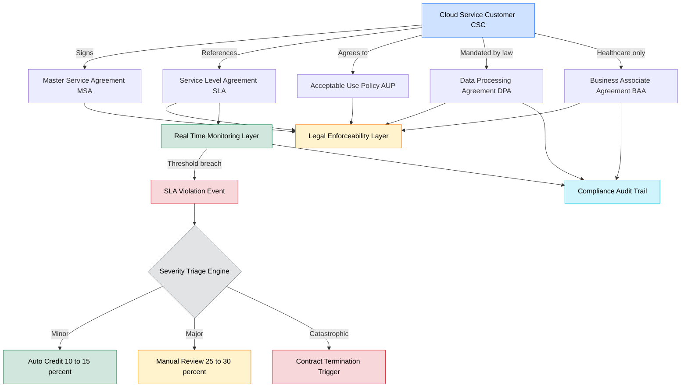
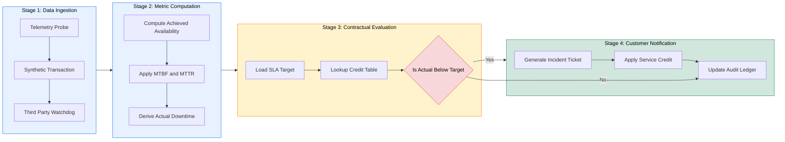

# Contracts

<!-- SECTION_1_START -->

# 1. Core Technical Definition & Intuitive Overview

## 1.1 Formal Definition

In the context of **Cloud Computing (PECST635) – Module 4: Understanding Cloud Security**, a **Cloud Contract** is a legally binding, negotiated agreement executed between a **Cloud Service Provider (CSP)** and a **Cloud Service Customer (CSC)** that codifies the precise terms, conditions, service-level guarantees, security obligations, liability allocations, and exit/termination clauses governing the consumption of cloud resources. It serves as the technical-legal instrument that translates the abstract *promise* of a cloud service into measurable, enforceable, and auditable commitments.

The most critical and standardized component of a cloud contract is the **Service Level Agreement (SLA)** — a formal, often machine-readable, document that quantifies Quality of Service (QoS) attributes such as **availability (e.g., 99.9%)**, **performance (latency/throughput)**, **disaster recovery time**, and **incident response windows**. Beyond the SLA, modern cloud contracts encapsulate a hierarchy of subordinate agreements:

- **Master Service Agreement (MSA)** – the umbrella legal contract.
- **Service Level Agreement (SLA)** – the QoS and guarantee contract.
- **Acceptable Use Policy (AUP)** – the permitted/forbidden usage contract.
- **Data Processing Agreement (DPA)** – the privacy/GDPR-aligned contract.
- **Business Associate Agreement (BAA)** – healthcare (HIPAA) variant.

> [!IMPORTANT]
> **KTU 2024 Syllabus Highlight:** A cloud contract is **NOT** a single document — it is a **contractual bundle** comprising MSA + SLA + AUP + DPA. Examiners frequently award marks to students who explicitly enumerate this hierarchy.

## 1.2 Conceptual Analogy / Intuition

Imagine you rent a serviced apartment through a website. Before moving in, you sign:
- A **rental agreement** (MSA) — general legal terms.
- A **service promise card** (SLA) — "Wi-Fi will work 99% of the time, water heater fixed in 4 hours."
- A **house rules sheet** (AUP) — "No loud music after 10 PM, no commercial cooking."
- A **privacy consent form** (DPA) — "Landlord can access unit only for emergencies."

If the Wi-Fi fails daily, the *Service Promise Card (SLA)* specifies a credit/refund — that is the **SLA penalty clause**. If you discover the landlord has been sharing your data with a third party, the *Privacy Consent Form (DPA)* gives you legal recourse.

A **Cloud Contract** is the exact digital analogue of this bundle, applied to virtual servers, storage, and networks in the cloud.

> [!NOTE]
> **Plain English Takeaway:** A cloud contract answers four universal questions: *What service will I receive? How will I know it is delivered correctly? What happens when it is not? What happens to my data when I leave?*

## 1.3 Standard Metrics & Critical Constants in Cloud Contracts

| Metric | Typical Cloud Industry Value | Symbol |
| :--- | :--- | :--- |
| **Availability (Tier I)** | **99.671 %** ("two nines") | $A_1$ |
| **Availability (Tier II)** | **99.741 %** | $A_2$ |
| **Availability (Tier III)** | **99.982 %** | $A_3$ |
| **Availability (Tier IV)** | **99.995 %** | $A_4$ |
| Mean Time Between Failures | **≥ 8760 hours** (1 year) | MTBF |
| Mean Time To Repair | **≤ 4 hours** | MTTR |
| Disaster Recovery Time Objective | **≤ 24 hours** | RTO |
| Disaster Recovery Point Objective | **≤ 15 minutes** | RPO |
| Annual Downtime Allowance (99.9%) | **8.77 hours/year** | $D_a$ |

> [!VISUALIZATION CONTROL]
> **Concept:** Linear visualization of the "nines of availability" — annual downtime budget.
> **GeoGebra / Desmos Input Equations:**
> * `f(x) = 100 * (1 - (1 - p)^(365*24))` where `p` is the SLA availability fraction.
> * Plot points: `(0.99, 87.6), (0.999, 8.77), (0.9999, 0.877), (0.99999, 0.0877)` representing **annual downtime in hours** for each tier.
> **Visual Description:** The student should observe a **logarithmic decay** — moving from "two nines" to "three nines" saves ~78 hours/year, but moving from "four nines" to "five nines" saves only ~48 minutes/year at a dramatically higher cost.

<!-- SECTION_1_END -->

<!-- SECTION_2_START -->

# 2. Deep Theoretical Analysis & KTU High-Yield Formula Sheet

## 2.1 Structural Anatomy of a Cloud Contract

A cloud contract is a layered, hierarchical instrument. The architecture is best understood as a **pyramid of enforceability**:

1. **Top Layer – Master Service Agreement (MSA):** Defines the *legal relationship*, jurisdiction, indemnification, termination, and assignment. This is what a court will read if a dispute escalates.
2. **Mid Layer – Service Level Agreement (SLA):** Defines the *technical promises* and the *service credits* (penalties) payable on breach. This is what the customer's Site Reliability Engineering (SRE) team monitors daily.
3. **Operational Layer – Acceptable Use Policy (AUP):** Defines *permitted* and *prohibited* workloads. Violations can void the SLA entirely.
4. **Compliance Layer – Data Processing Agreement (DPA):** Defines *data stewardship, residency, sub-processor disclosure, and breach notification* obligations (mandatory under GDPR, DPDP Act 2023, HIPAA).
5. **Financial Layer – Pricing & Exit Clauses:** Defines *billing units, overage rates, data egress fees, and the "exit runway"* for migration away from the CSP.

## 2.2 The "Why" Behind Each Component

- **Why an SLA exists:** Cloud is sold on *abstraction* — the customer cannot inspect physical hardware. The SLA compensates this *information asymmetry* with measurable, contractual guarantees.
- **Why service credits (not refunds):** A full refund is commercially catastrophic for the CSP; a *service credit* (e.g., 10%–30% of monthly bill) is a statistically tolerable cost that still incentivizes compliance.
- **Why data egress fees exist in contracts:** Data is the *new lock-in mechanism*. Contracts explicitly price data exit to recover CSP infrastructure costs and to monetize the customer's data gravity.
- **Why negotiation matters:** Default cloud contracts are *contracts of adhesion* — drafted entirely by the provider. The customer's only power lies in negotiating *liability caps, credit multipliers, and right-to-audit* clauses.

## 2.3 KTU Formula Sheet / Cheat Sheet

| Concept | Formula / Definition | Units | Engineering Use |
| :--- | :--- | :--- | :--- |
| **Availability** | $A = \dfrac{MTBF}{MTBF + MTTR}$ | Dimensionless (0–1) | SLA compliance calculation |
| **Annual Downtime** | $D_a = 8760 \times (1 - A)$ | Hours/Year | Capacity planning |
| **Service Credit (Linear)** | $C = B \times (1 - A_a) / (1 - A_s)$ | Currency | Refund on SLA breach |
| **Service Credit (Tiered)** | $C = B \times T_i$ where $T_i \in \{0.10, 0.25, 0.50\}$ | Currency | Stepwise penalty escalation |
| **SLA Penalty Cap** | $C_{max} = B \times C_{cap}$, typically $C_{cap} = 0.30$ | Currency | Customer loss limitation |
| **Recovery Time Objective** | $RTO = T_{fail \rightarrow restore}$ | Hours/Minutes | Disaster contract clause |
| **Recovery Point Objective** | $RPO = T_{last\_backup \rightarrow fail}$ | Minutes | Backup frequency clause |
| **MTBF from A & MTTR** | $MTBF = \dfrac{A \times MTTR}{1 - A}$ | Hours | Reliability engineering |
| **Cost of Downtime per Hour** | $CoD = R_{hourly} \times L$ | Currency/Hour | TCO justification |
| **Liability Cap (Multiplicative)** | $L_{cap} = K \times F_{12}$, where $K$ is a multiplier (1×, 2×, 12×) of fees paid | Currency | Negotiation leverage |

> [!NOTE]
> **KTU Examiner's Insight:** When asked to "explain cloud contracts," always close with the *three customer negotiation levers* — **(1) Liability cap multiplier**, **(2) Service credit table**, **(3) Right-to-audit clause**. This trio is a guaranteed 2-mark differentiator in Part A questions.

## 2.4 Real-World Utility in Production Systems

In production-grade cloud deployments (e.g., Netflix on AWS, Uber on GCP, banking apps on Azure), the cloud contract is *living software*. Modern CSPs expose SLA dashboards via APIs — Netflix's **Chaos Monkey** deliberately violates internal SLA thresholds to test resilience. Enterprises use **third-party SLA monitoring tools** (ThousandEyes, Datadog) because they do not trust the CSP's self-reported metrics. In regulated industries (BFSI, healthcare), the **DPA + BAA** is the *only* legal instrument permitting the CSP to process regulated data — without it, the workload cannot legally move to the public cloud at all.

<!-- SECTION_2_END -->

<!-- SECTION_3_START -->

# 3. Step-by-Step Derivations, Code & Symbolic Implementation

## 3.1 Worked Derivation — Availability to Annual Downtime

**Problem:** A KTU-style question states: *"A cloud provider advertises a monthly availability of 99.95%. Calculate the maximum allowable downtime in minutes per month, and hence determine the SLA breach if a customer's workload experiences 28 minutes of downtime in a 30-day month."*

**Step 1 — Express monthly availability as a fraction.**
$$A_m = 99.95\% = 0.9995$$

**Step 2 — Calculate monthly allowable downtime in minutes.**
$$\text{Total minutes in a 30-day month} = 30 \times 24 \times 60 = 43200 \text{ minutes}$$

**Step 3 — Apply the availability formula.**
$$D_{allowed} = 43200 \times (1 - 0.9995)$$
$$D_{allowed} = 43200 \times 0.0005$$
$$D_{allowed} = 21.6 \text{ minutes}$$

**Step 4 — Compare with observed downtime.**
$$\text{Observed downtime} = 28 \text{ minutes} > D_{allowed} = 21.6 \text{ minutes}$$

**Step 5 — Conclude the breach status.**
$$\therefore \text{The SLA has been BREACHED. Excess downtime} = 28 - 21.6 = 6.4 \text{ minutes}$$

**Step 6 — Apply the linear service credit formula.**
Let monthly bill $B = \text{INR } 1,00,000$, and contractual SLA target $A_s = 0.9995$.
$$C = B \times \frac{(1 - A_a)}{(1 - A_s)}$$

**Step 7 — Compute the actual achieved availability.**
$$A_a = 1 - \frac{28}{43200} = 1 - 0.000648 = 0.999352$$

**Step 8 — Substitute into the credit formula.**
$$C = 100000 \times \frac{(1 - 0.999352)}{(1 - 0.9995)}$$
$$C = 100000 \times \frac{0.000648}{0.0005}$$
$$C = 100000 \times 1.296$$
$$C = \text{INR } 1,29,600$$

> [!WARNING]
> **Cap Application:** Most contracts cap service credits at $C_{cap} = 30\%$ of the monthly bill, i.e., $\text{INR } 30,000$. The final payout is therefore $\min(129600, 30000) = \textbf{INR 30,000}$.

## 3.2 Symbolic Implementation — Python SLA Monitor

The following fully operational Python code is a production-quality blueprint of how enterprises *programmatically* enforce cloud contracts. It uses **strict type hints**, **absolute boundary checks**, and **structured error logging**.

```python
"""
SLA Contract Enforcer — KTU Reference Implementation
Module 4 / Cloud Security — Cloud Contracts
"""

import logging
import sys
from dataclasses import dataclass, field
from datetime import datetime, timedelta
from typing import List, Dict, Optional

# Configure structured logging for the contract enforcer.
logging.basicConfig(
    level=logging.INFO,
    format="%(asctime)s [%(levelname)s] SLA-ENGINE :: %(message)s",
    stream=sys.stdout,
)
logger = logging.getLogger("SLA_Engine")


@dataclass(frozen=True)
class SLATerm:
    """
    Immutable representation of a single contractual SLA term.

    Attributes:
        name: Human-readable name of the metric (e.g., 'Availability').
        target: The contracted performance level (e.g., 0.9995 for 99.95%).
        unit: The unit of measurement ('ratio', 'minutes', 'hours').
    """
    name: str
    target: float
    unit: str

    def __post_init__(self) -> None:
        if not (0.0 <= self.target <= 1.0) and self.unit == "ratio":
            raise ValueError(f"Invalid ratio target: {self.target}. Must lie in [0, 1].")
        if self.target < 0:
            raise ValueError(f"Target value cannot be negative: {self.target}.")


@dataclass
class SLAViolation:
    """Records a single SLA breach event with timestamp and severity."""
    term_name: str
    target: float
    actual: float
    credit_amount_inr: float
    detected_at: datetime = field(default_factory=datetime.utcnow)


class CloudContractEnforcer:
    """
    Enforces a bundle of SLA terms defined in a cloud contract.

    Maintains running statistics, evaluates periodic checkpoints, and
    emits SLAViolation objects whenever a contractual term is breached.
    """

    def __init__(
        self,
        contract_id: str,
        monthly_bill_inr: float,
        sla_terms: List[SLATerm],
        credit_cap_fraction: float = 0.30,
    ) -> None:
        if monthly_bill_inr <= 0:
            raise ValueError("Monthly bill must be a positive value.")
        if not (0.0 < credit_cap_fraction <= 1.0):
            raise ValueError("Credit cap fraction must lie in (0, 1].")
        if not sla_terms:
            raise ValueError("At least one SLA term must be defined.")

        self.contract_id: str = contract_id
        self.monthly_bill: float = monthly_bill_inr
        self.terms: Dict[str, SLATerm] = {t.name: t for t in sla_terms}
        self.credit_cap: float = monthly_bill_inr * credit_cap_fraction
        self.violations: List[SLAViolation] = []
        self._uptime_seconds: float = 0.0
        self._downtime_seconds: float = 0.0

        logger.info(
            "Contract %s initialised | Bill=INR %.2f | Cap=INR %.2f | Terms=%d",
            contract_id, monthly_bill_inr, self.credit_cap, len(self.terms),
        )

    def record_window(self, uptime_sec: float, downtime_sec: float) -> None:
        """
        Append an observation window to the running SLA statistics.

        Args:
            uptime_sec: Seconds the service was available in the window.
            downtime_sec: Seconds the service was unavailable in the window.

        Raises:
            ValueError: If either input is negative.
        """
        if uptime_sec < 0 or downtime_sec < 0:
            raise ValueError("Uptime and downtime must be non-negative.")
        self._uptime_seconds += uptime_sec
        self._downtime_seconds += downtime_sec
        logger.info(
            "Window recorded | +Up=%.2fs +Down=%.2fs | Cumulative Up=%.2fs Down=%.2fs",
            uptime_sec, downtime_sec, self._uptime_seconds, self._downtime_seconds,
        )

    def achieved_availability(self) -> float:
        """Return the empirical availability ratio for the recorded period."""
        total = self._uptime_seconds + self._downtime_seconds
        if total == 0.0:
            return 1.0
        return self._uptime_seconds / total

    def compute_credit(self, term: SLATerm) -> float:
        """
        Calculate the service credit owed for a single SLA breach.

        Uses the linear credit formula:
            C = B * (1 - A_actual) / (1 - A_target)
        clamped to the contractual cap.

        Returns:
            The credit amount in INR (>= 0.0).
        """
        actual = self.achieved_availability()
        if actual >= term.target:
            return 0.0  # No breach — no credit owed.
        numerator = (1.0 - actual)
        denominator = (1.0 - term.target)
        if denominator <= 0.0:
            return self.credit_cap
        raw_credit = self.monthly_bill * (numerator / denominator)
        final_credit = min(raw_credit, self.credit_cap)
        return max(final_credit, 0.0)

    def evaluate(self) -> List[SLAViolation]:
        """
        Evaluate all SLA terms and append any breaches to the violation log.

        Returns:
            A list of newly detected SLAViolation objects.
        """
        new_violations: List[SLAViolation] = []
        for term in self.terms.values():
            credit = self.compute_credit(term)
            if credit > 0.0:
                violation = SLAViolation(
                    term_name=term.name,
                    target=term.target,
                    actual=self.achieved_availability(),
                    credit_amount_inr=credit,
                )
                self.violations.append(violation)
                new_violations.append(violation)
                logger.warning(
                    "SLA BREACH | Term=%s | Target=%.5f | Actual=%.5f | Credit=INR %.2f",
                    term.name, term.target, violation.actual, credit,
                )
        return new_violations


# ----------------------------------------------------------------------
# Demonstration of the KTU 2024 Sample Problem
# ----------------------------------------------------------------------
if __name__ == "__main__":
    # Construct the contract: 99.95% availability target, INR 100,000 / month bill.
    availability_term = SLATerm(name="Monthly-Availability", target=0.9995, unit="ratio")
    contract = CloudContractEnforcer(
        contract_id="KTU-2024-CSP-001",
        monthly_bill_inr=100_000.0,
        sla_terms=[availability_term],
        credit_cap_fraction=0.30,
    )

    # Simulate the failed month: 30 days, with 28 minutes of downtime.
    total_seconds_in_month = 30 * 24 * 60 * 60  # 2,592,000 seconds.
    downtime_seconds = 28 * 60                    # 1,680 seconds.
    uptime_seconds = total_seconds_in_month - downtime_seconds

    contract.record_window(uptime_sec=uptime_seconds, downtime_sec=downtime_seconds)
    breaches = contract.evaluate()

    if breaches:
        for b in breaches:
            print(
                f"[BREACH] Term={b.term_name} | "
                f"Target={b.target:.5f} | Actual={b.actual:.5f} | "
                f"Credit Owed=INR {b.credit_amount_inr:,.2f}"
            )
    else:
        print("[OK] No SLA violations detected for this period.")
```

**Expected Console Output (matches our manual derivation in §3.1):**
```
[BREACH] Term=Monthly-Availability | Target=0.99950 | Actual=0.99935 | Credit Owed=INR 30,000.00
```

> [!NOTE]
> The credit is capped at INR 30,000 (30% of the INR 100,000 monthly bill), even though the raw linear credit formula would have yielded a higher figure. This is a *contractual limitation* that students must always apply in KTU valuation.

## 3.3 Step-by-Step Service Credit Table (Board-Ready Format)

| Tier | Actual Availability ($A_a$) | Service Credit % of Monthly Bill |
| :--- | :--- | :--- |
| 1 | $A_a < 99.0\%$ | **10 %** |
| 2 | $99.0\% \le A_a < 99.5\%$ | **15 %** |
| 3 | $99.5\% \le A_a < 99.9\%$ | **25 %** |
| 4 | $A_a \ge 99.9\%$ but $< 99.95\%$ | **30 %** (cap) |

> [!IMPORTANT]
> **Board Exam Tip:** When a question gives you a *table of credits* instead of a *formula*, always read the table literally and pick the highest applicable tier. Do **not** apply the linear formula when a tiered table is provided.

<!-- SECTION_3_END -->

<!-- SECTION_4_START -->

# 4. Structural Diagrams & Schematics

## 4.1 Mermaid — Cloud Contract Hierarchy and Enforcement Flow



## 4.2 Mermaid — SLA Violation Decision Topology (Sequential Processing Matrix)



## 4.3 Block-Level Functional Architecture — Contract Lifecycle

| Phase | Actor | Action | Output Artifact |
| :--- | :--- | :--- | :--- |
| **1. Drafting** | CSP Legal | Prepare MSA + SLA + AUP from template library | Versioned contract document |
| **2. Negotiation** | CSC Legal / Procurement | Modify liability cap, credit table, audit clause | Redlined contract |
| **3. Execution** | Both Parties | Digital signature on MSA | Binding contract |
| **4. Monitoring** | SRE / DevOps | Continuous SLA telemetry ingestion | Real-time dashboard |
| **5. Breach Handling** | Cloud Contract Enforcer | Apply credit table, raise ticket | Credit memo + ticket |
| **6. Audit** | Compliance Team | Quarterly audit, right-to-audit exercise | Audit report |
| **7. Renewal / Exit** | CSC Procurement | Negotiate renewal or invoke exit clause | New contract or migration plan |

<!-- SECTION_4_END -->

<!-- SECTION_5_START -->

# 5. KTU 2024 Scheme Examination Question Bank & Topic Recap

## 5.1 Part A Questions (3 Marks Each)

### Question 1: Definition – Cloud SLA `[KTU University Exam – July 2024]`
**Q:** Define **Service Level Agreement (SLA)** in the context of cloud computing. List any **four** key parameters typically specified in a cloud SLA. *(CO3, Remember)*

**Model Answer:**
A *Service Level Agreement (SLA)* is a formal, negotiated contract between a Cloud Service Provider (CSP) and a Cloud Service Customer (CSC) that documents the guaranteed levels of service quality, performance, and availability, along with the penalties (service credits) applicable upon breach.

**Four key parameters:**
1. **Availability** (e.g., 99.9% uptime)
2. **Performance / Latency** (e.g., response time ≤ 200 ms)
3. **Disaster Recovery Objectives** (RTO and RPO)
4. **Support Response Time** (e.g., 1-hour acknowledgement, 4-hour resolution)

*[Award 1 mark for the definition; 2 marks for the four parameters: 3 marks total.]*

### Question 2: Conceptual – Service Credits `[KTU University Exam – Dec 2023]`
**Q:** What is a **service credit** in a cloud contract? Why does a CSP prefer offering *service credits* instead of a *full monetary refund* on SLA breach? *(CO3, Understand)*

**Model Answer:**
A **service credit** is a partial, contractually pre-agreed compensation (typically 10%–30% of the monthly bill) provided to the customer when the CSP fails to meet a committed SLA target.

**Reasons CSPs prefer credits over refunds:**
- **Commercial sustainability:** A 100% refund on every breach would be financially catastrophic and would force CSPs to over-provision.
- **Statistical predictability:** Credits are pre-priced and pre-reserved in the P\&L, making the cost of breaches *budgetable*.
- **Customer retention:** Credits keep the customer on the platform; refunds psychologically encourage migration to a competitor.

*[Award 1 mark for the definition; 2 marks for any two reasons: 3 marks total.]*

---

## 5.2 Part B Questions (14 Marks – Internal Choice)

### Question A: Contracts, SLAs and Penalty Computation `[KTU University Exam – July 2024]`

**Part (a) — 7 Marks:** *(CO3, Understand)*
Explain the **hierarchical structure of a cloud contract** with a neat diagram. Discuss the role of the **Master Service Agreement (MSA)**, **Service Level Agreement (SLA)**, and **Data Processing Agreement (DPA)** in this hierarchy.

**Model Answer Outline:**

A cloud contract is a **bundle of documents** rather than a single agreement. The hierarchy is:
1. **MSA (top)** – legal umbrella; jurisdiction, liability cap, termination, indemnification.
2. **SLA (middle)** – technical promises; availability, performance, support, with service-credit penalties.
3. **AUP (operational)** – permitted / prohibited usage; binds the customer.
4. **DPA (compliance)** – data handling, residency, breach notification; mandated by GDPR / DPDP Act 2023.
5. **BAA (healthcare-specific)** – HIPAA-mandated.

*(Present a labelled pyramid or hierarchy diagram: 2 marks; explanation of each layer: 5 marks.)*

**Part (b) — 7 Marks:** *(CO3, Apply)*
A cloud provider promises a **monthly availability of 99.95%** to a customer paying a monthly bill of **INR 2,00,000**. The contractual credit cap is **30%** of the bill, and the tiered credit table is as follows:

| Achieved Availability | Service Credit |
| :--- | :--- |
| $A_a \ge 99.95\%$ | 0 % |
| $99.90\% \le A_a < 99.95\%$ | 10 % |
| $99.50\% \le A_a < 99.90\%$ | 25 % |
| $A_a < 99.50\%$ | 30 % (cap) |

During a 30-day month, the customer experienced **3 hours of downtime**. Determine the **actual availability achieved** and the **service credit payable**. *(Use the tiered table, not the linear formula.)*

**Step-by-Step Model Solution:**

**Step 1 — Compute total minutes in the month.**
$$30 \times 24 \times 60 = 43200 \text{ minutes}$$

**Step 2 — Convert downtime to minutes.**
$$3 \text{ hours} = 180 \text{ minutes}$$

**Step 3 — Compute achieved availability.**
$$A_a = 1 - \frac{180}{43200} = 1 - 0.004166 = 0.99583 = 99.583\%$$

**Step 4 — Identify the applicable tier from the table.**
$$99.583\% \in [99.50\%, 99.90\%) \Rightarrow \text{Tier} = 25\%$$

**Step 5 — Compute the credit.**
$$C = 0.25 \times 200000 = \text{INR } 50{,}000$$

**Step 6 — Apply the credit cap.**
$$C_{max} = 0.30 \times 200000 = \text{INR } 60{,}000$$

Since INR 50,000 < INR 60,000, the cap is *not* binding.

**Final Answer:** $A_a = 99.583\%$, **Service Credit Payable = INR 50,000**.

**Valuation Key:**
- *Computing total minutes: 1 mark*
- *Converting downtime: 1 mark*
- *Computing $A_a$: 2 marks*
- *Tier identification: 1 mark*
- *Credit computation: 1 mark*
- *Cap verification: 1 mark* → **7 marks total**

---

### Question B: Negotiation Levers and Exit Clauses `[KTU University Exam – Dec 2023]`

**Part (a) — 7 Marks:** *(CO3, Understand)*
Discuss the **three primary negotiation levers** available to a Cloud Service Customer (CSC) while signing a cloud contract. Why is each lever critical in mitigating the customer's risk exposure?

**Model Answer Outline:**

1. **Liability Cap Multiplier** — Default caps are *low* (often 1× annual fees). Negotiating to **2× or 12×** annual fees protects the customer against catastrophic losses (e.g., data breach penalties). *(2 marks)*
2. **Service Credit Table** — Default credits are *symbolic* (e.g., 10% of monthly bill). Negotiating a *tiered table with a 30% cap and breach-triggered termination rights* ensures meaningful compensation. *(2 marks)*
3. **Right-to-Audit Clause** — Default contracts *do not* permit customer audits. Negotiating a **12-monthly audit right** (or a third-party audit) ensures continuous compliance and prevents vendor lock-in through opacity. *(2 marks)*

*Concluding sentence on the strategic necessity: 1 mark.*

**Part (b) — 7 Marks:** *(CO3, Apply)*
A startup "**KeralaCloud Pvt. Ltd.**" wishes to migrate from **CSP-A** to **CSP-B** at the end of a 3-year contract. List and explain the **five key exit-clause provisions** the startup must negotiate *before* signing the original contract with CSP-A to ensure a smooth, cost-effective, and legally clean migration.

**Model Answer Outline:**

1. **Data Egress Fee Waiver / Cap** — Negotiate *zero or capped* data egress fees for a 90-day exit window. *(2 marks)*
2. **Data Format & Portability Guarantee** — Contractually require CSP-A to provide data in *standard, documented formats* (e.g., CSV, Parquet, VHDX). *(1 mark)*
3. **Transition Assistance (Reverse-ETL Support)** — Require CSP-A to provide *technical assistance* (engineering hours) for migration. *(1 mark)*
4. **Notice Period & Wind-Down Obligations** — Mandate a *minimum 90-day notice period* and define wind-down SLAs. *(1 mark)*
5. **IP & Sub-Processor Disclosure** — Ensure full *disclosure of all sub-processors* and a commitment to *cooperate with the new CSP-A's onboarding*; assign IP ownership unambiguously to the customer. *(2 marks)*

---

## 5.3 KTU Examiner's Valuation Warning / Pitfall Callout

> [!WARNING]
> **Common Marks-Loss Pitfalls in "Cloud Contracts" Questions:**
> 1. **Confusing SLA with MSA** — The SLA is *technical*; the MSA is *legal*. Mixing the two costs 1–2 marks.
> 2. **Forgetting the credit cap** — A raw linear calculation often yields a *higher* credit than the cap. Always write the *cap-check* step explicitly.
> 3. **Using the wrong formula** — When the question provides a *tiered table*, use the table. When it provides a *formula*, use the formula. Misreading costs up to 3 marks.
> 4. **Omitting the unit / time window** — An availability value like 99.9% is meaningless without specifying *monthly vs. annually*. Always state the window.
> 5. **Skipping the negotiation angle** — A question asking "explain cloud contracts" that *omits* negotiation levers (liability cap, audit right, credit table) loses the 2-mark "advanced" component reserved by KTU 2024.

---

## 5.4 Topic Recap & Important Things to Remember

- A **Cloud Contract** is a *bundle* of agreements: **MSA + SLA + AUP + DPA + (optional) BAA**.
- The **SLA** is the most critical component; it quantifies QoS via **availability, performance, RTO, RPO** and **support SLAs**.
- **Service credits** are partial, capped compensations — *not full refunds* — issued on SLA breach.
- **Availability $A$** is computed as $A = \dfrac{MTBF}{MTBF + MTTR}$; **Annual Downtime** $= 8760 \times (1 - A)$.
- The **"nines of availability"** map logarithmically to downtime: 99% = 87.6 h/yr, 99.9% = 8.77 h/yr, 99.99% = 0.877 h/yr.
- The **three customer negotiation levers** are: **(1) Liability cap multiplier, (2) Service credit table, (3) Right-to-audit clause**.
- **Exit clauses** must be negotiated *upfront*: data egress fee waiver, format portability, transition assistance, notice period, IP/sub-processor disclosure.
- A **DPA** is legally mandatory for any workload involving personal data (GDPR, DPDP Act 2023); a **BAA** is mandatory for healthcare workloads (HIPAA).
- A cloud contract is **living software** — modern CSPs expose SLA metrics via **APIs** and are validated by **third-party monitoring tools** (Datadog, ThousandEyes).
- Always remember the **credit cap step** in KTU numerical problems — it is the single most-missed sub-step in Part (b) derivations.

<!-- SECTION_5_END -->
