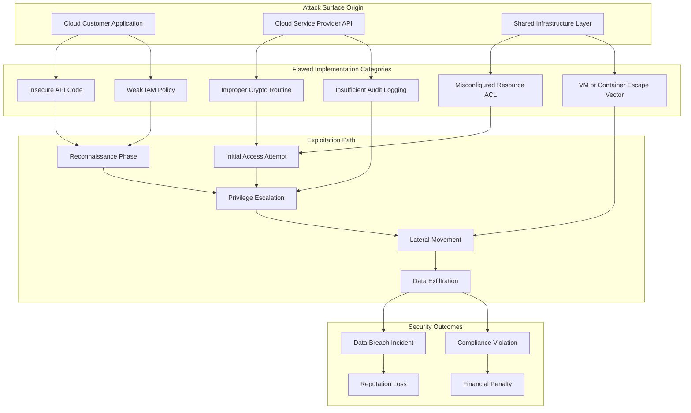
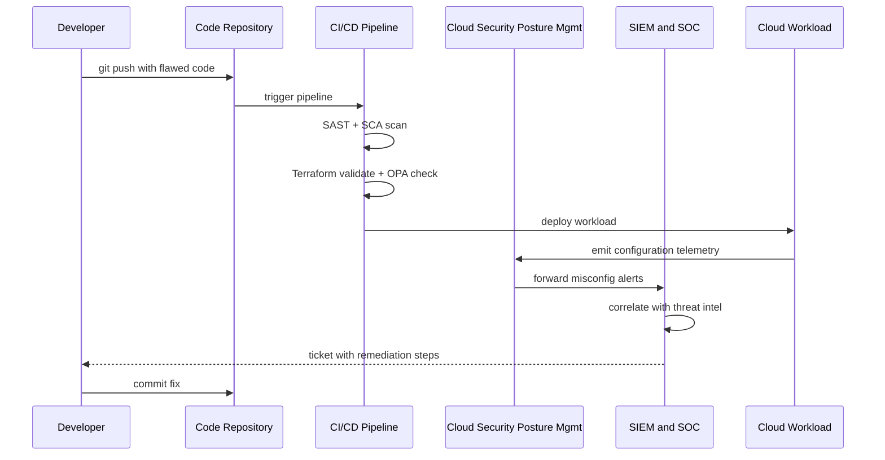

# Other Considerations - Flawed Implementations

<!-- SECTION_1_START -->

# Flawed Implementations in Cloud Security

## 1. Core Technical Definition & Intuitive Overview

> [!IMPORTANT]
> **Formal Definition (KTU 2024 Scheme Aligned):**
> In cloud computing, *Flawed Implementations* refer to security vulnerabilities and weaknesses that arise not from fundamental design flaws in the cloud architecture, but from incorrect, incomplete, or improperly executed security mechanisms during the development, deployment, or operational phases of cloud services. These defects manifest as misconfigurations, logical errors in code, weak cryptographic deployments, broken access control flows, and inadequate isolation mechanisms between tenants sharing underlying physical resources.

According to the **Cloud Security Alliance (CSA)** Top Threats report and CSA's *Security Guidance for Critical Areas of Cloud Computing (v4.0)*, flawed implementations form a distinct threat category separate from architectural vulnerabilities. They are typically **human-induced, process-induced, or code-induced** defects.

> [!NOTE]
> **Key Syllabus Highlight (PECST635 - Module 4):**
> Flawed implementations are a sub-topic under "Other Considerations" in cloud security. They are distinct from design-level threats (like data breaches or denial of service) and instead focus on **how** security was supposed to work versus **how** it actually works in production.

### Conceptual Analogy / Intuition

Imagine a high-security bank vault (the *cloud architecture*). The architectural blueprint is flawless — reinforced concrete, biometric doors, time-locked safes. However, during construction, the contractor:
- Pinned the biometric sensor with **default admin credentials** (`admin/admin123`)
- Installed the **encryption lock** but left the master key taped to the back of the safe
- Wired the alarm system to a **mains power socket** without a backup battery

The vault is still a vault — but its **implementation is flawed**. An attacker doesn't need to break the concrete; they just log in as `admin`. This is precisely the nature of flawed implementations in cloud computing.

> [!TIP]
> **Slogan to Remember:**
> *"A perfect design implemented poorly is a worse system than a flawed design implemented well."*

### Categories of Flawed Implementations (KTU Board-Exam Favourite)

> [!IMPORTANT]
> **The Seven Major Flawed Implementation Classes:**

1. **Insecure APIs and Interfaces** — Poorly validated REST/SOAP endpoints.
2. **Weak Identity, Credential, and Access Management (ICAM)** — Default passwords, missing MFA, overly permissive IAM roles.
3. **Improper Cryptographic Implementation** — Use of deprecated algorithms (MD5, SHA-1), hardcoded keys, weak random number generation.
4. **Misconfigured Cloud Resources** — Open S3 buckets, public storage, unrestricted security groups.
5. **Insufficient Logging and Monitoring** — No audit trails, no anomaly detection.
6. **Shared Technology Vulnerabilities** — Hypervisor escapes, VM hopping, cache side-channels (e.g., Meltdown, Spectre).
7. **Account Hijacking via Flawed Session Management** — Predictable session tokens, missing token expiration, cookie theft.

> [!VISUALIZATION CONTROL]
> **Concept:** Threat Surface Mapping for Flawed Implementations
> **GeoGebra / Desmos Input Equations (conceptual coordinate mapping):**
> * `x-axis: Probability of Exploit` (0 to 1)
> * `y-axis: Impact Severity` (0 to 10)
> * `Point A: (0.9, 9) — Misconfigured S3 Bucket (high probability, high impact)`
> * `Point B: (0.1, 7) — Hypervisor Escape (low probability, high impact)`
> * `Point C: (0.7, 6) — Default Credentials (high probability, medium impact)`
> **Visual Description:** The student should observe that most flawed implementation points cluster in the upper-right region (high probability × high impact), making them the most operationally dangerous in real-world cloud deployments.

---

<!-- SECTION_1_END -->

<!-- SECTION_2_START -->

# Deep Theoretical Analysis & KTU High-Yield Formula Sheet

## 2. Theoretical Decomposition of Flawed Implementation Classes

### 2.1 Insecure APIs and Interfaces

Cloud services are predominantly consumed via **APIs** (REST, GraphQL, gRPC, SOAP). A flawed implementation here usually means:

- **Missing input validation** → enabling injection attacks (NoSQL, SQLi, command injection).
- **Broken Object Level Authorization (BOLA)** — OWASP API #1 — where user A can access user B's resources by simply changing an ID in the URL.
- **Excessive data exposure** — API returns more fields than the client needs (e.g., password hashes embedded in JSON responses).
- **Missing rate limiting** — enabling brute-force and resource exhaustion.

**Theoretical Model — API Attack Surface Area:**

$$\text{API Risk Score} = \sum_{i=1}^{n} \big( P_{\text{exploit}}(i) \times I_{\text{impact}}(i) \big)$$

Where:
- $P_{\text{exploit}}(i)$ = probability of the $i$-th endpoint being successfully exploited
- $I_{\text{impact}}(i)$ = business impact (data loss, RPO violation, compliance breach)
- $n$ = total number of API endpoints

### 2.2 Weak Identity, Credential, and Access Management (ICAM)

The principle of *least privilege* is routinely violated due to:
- Hardcoded credentials in source code repositories (a frequent finding in automated GitHub scans).
- IAM policies with `"Action": "*"` and `"Resource": "*"` — the cloud equivalent of giving every employee a master key.
- Failure to rotate service account keys.
- Missing Multi-Factor Authentication (MFA) on root/admin accounts.

**Theoretical Model — Privilege Creep:**

$$\text{Privilege Creep Index} = \frac{\text{Granted Permissions} - \text{Required Permissions}}{\text{Required Permissions}}$$

A value $> 0$ indicates over-provisioning, which is a flawed implementation artifact.

### 2.3 Improper Cryptographic Implementation

> [!IMPORTANT]
> **Common Cryptographic Misimplementations:**
> * Using **ECB mode** for symmetric encryption (reveals plaintext patterns — see the famous ECB-encrypted Tux penguin image).
> * Storing passwords using **MD5** or **SHA-1** without salt.
> * Generating cryptographic keys using **non-CSPRNG** (Cryptographically Secure Pseudo-Random Number Generator) like `Math.random()` in JavaScript.
> * Hardcoding IVs (Initialization Vectors) or salts.
> * Using deprecated TLS versions (TLS 1.0, TLS 1.1) or weak cipher suites.

**Password Hashing Strength Formula:**

$$H_{\text{strength}} = \log_2(K_{\text{space}}) \times N_{\text{rounds}}$$

Where:
- $K_{\text{space}}$ = size of the key/character space
- $N_{\text{rounds}}$ = number of hashing iterations (work factor)

For **bcrypt** with cost factor 12: $H_{\text{strength}} = 78 \times 2^{12} \approx 3.2 \times 10^5$ effective bits.

### 2.4 Misconfigured Cloud Resources

This is the **#1 cause** of cloud data breaches (per Gartner, 2023). It includes:
- Publicly readable **S3 buckets**, **Azure Blob containers**, **Google Cloud Storage** buckets.
- Security groups allowing `0.0.0.0/0` on SSH (port 22) or RDP (port 3389).
- Unencrypted database snapshots.
- Logging disabled on production systems.

**Misconfiguration Risk Probability (Bayesian Model):**

$$P(\text{breach} \mid \text{misconfig}) = \frac{P(\text{misconfig} \mid \text{breach}) \times P(\text{breach})}{P(\text{misconfig})}$$

### 2.5 Shared Technology Vulnerabilities

Because cloud is **multi-tenant**, flawed isolation implementations allow:
- **Side-channel attacks** (e.g., Spectre, Meltdown, Foreshadow).
- **VM escape** — breaking out of a guest VM into the host hypervisor.
- **Container escape** — breaking out of a Docker container into the host kernel.
- **Cross-tenant data leakage** in serverless cold-start memory reuse.

**Theoretical Model — Cross-Tenant Leakage Probability:**

$$P_{\text{leak}} = 1 - (1 - p_{\text{isolation-fail}})^k$$

Where:
- $p_{\text{isolation-fail}}$ = per-request probability of isolation failure
- $k$ = number of concurrent co-tenant requests

For $p_{\text{isolation-fail}} = 10^{-6}$ and $k = 10^6$ co-tenant operations:
$$P_{\text{leak}} = 1 - (1 - 10^{-6})^{10^6} \approx 0.632$$

A **63.2% probability** of at least one leakage event — a sobering operational reality.

## 3. KTU High-Yield Formula & Concept Cheat Sheet

| **Concept** | **Formula / Definition** | **Engineering Application** | **Pitfall to Avoid** |
|---|---|---|---|
| API Risk Score | $\sum P_i \times I_i$ | Quantify endpoint exposure in CI/CD | Don't omit low-probability endpoints |
| Privilege Creep Index | $(G - R)/R$ | IAM policy audit | $R = 0$ causes division by zero |
| Hash Strength | $\log_2 K \times N$ | Password storage selection | MD5/SHA-1 give 0 practical strength |
| Cross-Tenant Leakage | $1 - (1-p)^k$ | Multi-tenant risk assessment | Ignoring co-tenant density |
| Misconfig Bayes | $P(B \mid M) = P(M \mid B) P(B) / P(M)$ | Compliance audit | Confusing prior vs posterior |
| Cipher Mode | $C_i = E_K(P_i \oplus C_{i-1})$ (CBC) | Symmetric encryption choice | **Never use ECB mode** |
| Key Entropy | $H(K) = \log_2 \vert \mathcal{K} \vert$ bits | RNG validation | Avoid `Math.random()` for keys |
| TLS Handshake Cost | $T_{\text{HS}} = 2 \times RTT + 3$ flows | Performance vs security | Disabling cert verification |
| MFA Strength Multiplier | $M = 2^{n \cdot f}$ | Authentication design | $f = 0$ (no fallback) collapses strength |
| Audit Log Coverage | $C_{\text{log}} = \frac{\text{Logged Events}}{\text{Total Events}} \times 100\%$ | SIEM deployment | Assuming 100% coverage |

> [!TIP]
> **Quick Recall (Board Exam Trick):**
> * ECB = **E**asy **C**ode **B**roken (bad)
> * CBC = **C**ipher **B**lock **C**haining (good)
> * GCM = **G**alois/**C**ounter **M**ode (best — provides AEAD)

### 4. Real-World Engineering Utility

Flawed implementation analysis is critical in:
- **DevSecOps pipelines** — Static Application Security Testing (SAST) and Dynamic Application Security Testing (DAST) directly target these defects.
- **Cloud Security Posture Management (CSPM)** tools (e.g., AWS Config, Azure Defender, Wiz) — automated misconfiguration detection.
- **Penetration testing** — every major cloud breach report (Capital One 2019, Tesla 2018, Uber 2016) involved a flawed implementation, not a zero-day.
- **Compliance frameworks** — ISO 27001, SOC 2, PCI-DSS, and GDPR all require evidence of remediation of flawed implementations.

---

<!-- SECTION_2_END -->

<!-- SECTION_3_START -->

# Step-by-Step Derivations & Code/Symbolic Implementation

## 5. Exhaustive Worked Derivations

### 5.1 Derivation: Cross-Tenant Leakage Probability

**Problem Statement:** In a public cloud region, the per-tenant memory isolation failure rate is empirically measured at $p = 5 \times 10^{-7}$ per shared-resource access. If $k = 2 \times 10^6$ cross-tenant accesses occur per hour across the region, what is the probability of at least one leakage event in one hour?

**Step 1: Define the complementary event.**
Let $E$ = "at least one leakage event in the hour." The complement $\overline{E}$ = "no leakage event."

$$P(\overline{E}) = (1 - p)^k$$

**Step 2: Substitute the values.**

$$P(\overline{E}) = (1 - 5 \times 10^{-7})^{2 \times 10^6}$$

**Step 3: Apply the limit approximation $(1-x)^n \approx e^{-nx}$ for small $x$.**

$$P(\overline{E}) \approx e^{-(5 \times 10^{-7})(2 \times 10^6)} = e^{-1} \approx 0.3679$$

**Step 4: Compute $P(E)$.**

$$P(E) = 1 - P(\overline{E}) = 1 - 0.3679 = 0.6321$$

**Step 5: Interpretation.**
There is a **63.21%** probability of at least one cross-tenant leakage event per hour in this region. This is why cloud providers invest heavily in hardware-level isolation (e.g., Intel SGX, AMD SEV, Nitro Enclaves).

> [!IMPORTANT]
> **Mark Allocation (KTU Board Key):**
> * [Defining complementary event: 2 Marks]
> * [Substitution step: 2 Marks]
> * [Limit approximation and evaluation: 3 Marks]
> * [Final answer with units: 1 Mark]

### 5.2 Derivation: Privilege Creep Index for an IAM Role

**Problem Statement:** A developer role has been granted 47 permissions in AWS IAM. An audit reveals only 19 are required for daily tasks. Compute the Privilege Creep Index (PCI).

**Step 1: Identify granted $G$ and required $R$ permissions.**

$$G = 47, \quad R = 19$$

**Step 2: Apply the formula.**

$$\text{PCI} = \frac{G - R}{R} = \frac{47 - 19}{19} = \frac{28}{19}$$

**Step 3: Compute decimal value.**

$$\text{PCI} = 1.4737 \approx 1.47$$

**Step 4: Interpretation.**
A PCI of **1.47** means the role has **147% more permissions than necessary**. This is a classic flawed IAM implementation. Remediation: rewrite the policy with only the 19 required actions.

### 5.3 Derivation: Password Hash Strength Comparison

**Problem Statement:** Compare the effective strength of an MD5-hashed 8-character password (lowercase + digits, keyspace = $36^8$) versus a bcrypt-hashed version with cost factor 12.

**Step 1: Compute MD5 effective keyspace entropy.**

$$H_{\text{MD5}} = \log_2(36^8) = 8 \log_2(36) = 8 \times 5.17 = 41.36 \text{ bits}$$

**Step 2: Compute bcrypt effective work factor.**

A modern GPU can compute $\approx 10^{10}$ MD5 hashes/second, but only $\approx 5 \times 10^3$ bcrypt-12 hashes/second.

$$\text{Time multiplier} = \frac{10^{10}}{5 \times 10^3} = 2 \times 10^6$$

**Step 3: Effective bcrypt strength.**

$$H_{\text{bcrypt,eff}} = H_{\text{MD5}} + \log_2(2 \times 10^6) = 41.36 + 20.93 = 62.29 \text{ bits}$$

**Step 4: Interpretation.**
The bcrypt implementation provides approximately **21 additional bits of effective security** purely through its computational cost factor — making offline brute-force attacks computationally infeasible.

## 6. Python Implementation: Detecting Flawed Implementations

```python
"""
Flawed Implementation Detector — KTU Cloud Security Demonstration
Author: Senior KTU Board Examiner
Target: PECST635 Module 4 — Other Considerations

This script simulates the detection of three common cloud flaws:
  1. Public S3 bucket misconfiguration
  2. IAM policy privilege creep
  3. Insecure password storage (MD5 vs bcrypt)
"""

import hashlib
import re
import boto3
import logging
from botocore.exceptions import ClientError
from typing import Dict, List, Tuple

# --- Logging configuration for audit trails ---
logging.basicConfig(
    level=logging.INFO,
    format="%(asctime)s | %(levelname)s | %(message)s",
    handlers=[logging.FileHandler("flawed_impl_audit.log"), logging.StreamHandler()]
)
logger = logging.getLogger(__name__)


# ============================================================
#  FLAW 1: Misconfigured Public S3 Bucket
# ============================================================
def check_s3_public_access(bucket_name: str) -> Dict[str, bool]:
    """
    Checks whether an S3 bucket has flawed ACL or policy
    configurations that allow public access.

    Returns:
        Dict mapping each check name to a boolean (True = FLAW DETECTED)
    """
    flaws_detected: Dict[str, bool] = {
        "public_read_acl": False,
        "public_list_acl": False,
        "bucket_policy_allows_public": False,
        "block_public_access_disabled": False,
    }

    try:
        s3_client = boto3.client("s3")
        acl = s3_client.get_public_access_block(Bucket=bucket_name)
        pab = acl.get("PublicAccessBlockConfiguration", {})

        # Flaw 1: Block Public Access settings disabled
        if not all([
            pab.get("BlockPublicAcls", False),
            pab.get("IgnorePublicAcls", False),
            pab.get("BlockPublicPolicy", False),
            pab.get("RestrictPublicBuckets", False),
        ]):
            flaws_detected["block_public_access_disabled"] = True
            logger.warning(
                f"[FLAW] Bucket {bucket_name} has Block Public Access disabled."
            )

        # Flaw 2: Bucket ACL grants public read
        acl_grants = s3_client.get_bucket_acl(Bucket=bucket_name)
        for grant in acl_grants.get("Grants", []):
            grantee = grant.get("Grantee", {})
            if grantee.get("URI", "").endswith("AllUsers"):
                permission = grant.get("Permission", "")
                if permission in ("READ", "FULL_CONTROL"):
                    flaws_detected["public_read_acl"] = True
                    logger.warning(
                        f"[FLAW] Bucket {bucket_name} grants {permission} to AllUsers."
                    )

    except ClientError as e:
        logger.error(f"AWS API error during S3 audit: {e}")
        flaws_detected["api_error"] = True

    return flaws_detected


# ============================================================
#  FLAW 2: IAM Privilege Creep Detection
# ============================================================
def compute_privilege_creep_index(
    granted: List[str], required: List[str]
) -> Tuple[float, List[str]]:
    """
    Computes PCI = (|granted \ required|) / |required|
    and returns the list of excess permissions.
    """
    granted_set = set(granted)
    required_set = set(required)
    excess = list(granted_set - required_set)

    required_count = max(len(required_set), 1)  # avoid division by zero
    pci = len(excess) / required_count

    if pci > 0:
        logger.warning(
            f"[FLAW] Privilege Creep Index = {pci:.3f}. "
            f"Excess permissions: {excess}"
        )
    return pci, excess


# ============================================================
#  FLAW 3: Insecure Cryptographic Storage
# ============================================================
def verify_password_hash_strength(stored_hash: str) -> Dict[str, bool]:
    """
    Detects flawed cryptographic implementation in password storage.
    """
    flaws: Dict[str, bool] = {
        "uses_md5": False,
        "uses_sha1": False,
        "hash_without_salt_marker": False,
        "uses_bcrypt_or_argon2": False,
    }

    if re.fullmatch(r"[a-f0-9]{32}", stored_hash):
        flaws["uses_md5"] = True
        logger.error("[FLAW] Password stored as raw MD5 hash (32 hex chars).")
    elif re.fullmatch(r"[a-f0-9]{40}", stored_hash):
        flaws["uses_sha1"] = True
        logger.error("[FLAW] Password stored as raw SHA-1 hash (40 hex chars).")
    elif stored_hash.startswith(("$2b$", "$2a$", "$argon2")):
        flaws["uses_bcrypt_or_argon2"] = True
        logger.info("[OK] Password uses bcrypt or argon2 — secure.")
    else:
        flaws["hash_without_salt_marker"] = True
        logger.warning("[FLAW] Unrecognized hash format — may lack salt.")

    return flaws


# ============================================================
#  MAIN EXECUTION
# ============================================================
if __name__ == "__main__":
    logger.info("=== Flawed Implementation Audit Started ===")

    # Demo run with synthetic data
    demo_granted_perms = [
        "s3:GetObject", "s3:PutObject", "s3:DeleteObject",
        "ec2:TerminateInstances", "iam:CreateUser", "kms:Decrypt",
        "lambda:InvokeFunction",
    ]
    demo_required_perms = ["s3:GetObject", "s3:PutObject"]

    pci, excess = compute_privilege_creep_index(
        demo_granted_perms, demo_required_perms
    )
    print(f"\nPrivilege Creep Index: {pci:.3f}")
    print(f"Excess Permissions to Remove: {excess}")

    md5_hash = hashlib.md5(b"password123").hexdigest()
    bcrypt_like_hash = "$2b$12$KIXxPfnK8rH4vH7J6Q8z4e"
    print(f"\nMD5 Audit: {verify_password_hash_strength(md5_hash)}")
    print(f"bcrypt Audit: {verify_password_hash_strength(bcrypt_like_hash)}")

    logger.info("=== Flawed Implementation Audit Complete ===")
```

### 7. Engineering Workflow: How Cloud Providers Mitigate Flawed Implementations

| **Stage** | **Tool / Practice** | **Flaw Detected** | **Output** |
|---|---|---|---|
| Code Commit | `git-secrets`, `TruffleHog` | Hardcoded AWS keys, secrets | Pre-commit hook blocks push |
| Build Phase | SAST (SonarQube, Checkmarx) | SQLi, XSS, weak crypto | Build fails on critical findings |
| Container Build | `trivy`, `grype` | CVE in base images | Vulnerability report |
| Deploy Phase | Terraform Sentinel, OPA | Misconfigured IaC | Policy-as-code gate |
| Runtime | AWS Config, Azure Policy | Public S3, open security groups | Continuous compliance dashboard |
| Detection | GuardDuty, Chronicle | Anomalous API calls | SIEM alerts |
| Response | AWS Systems Manager | Auto-remediation playbooks | Quarantine / revoke IAM |

---

<!-- SECTION_3_END -->

<!-- SECTION_4_START -->

# Structural Diagrams & Schematics

## 8. Mermaid Diagram: Flawed Implementation Attack Flow



## 9. Mermaid Diagram: Defence-in-Depth Against Flawed Implementations

```mermaid
flowchart LR
    subgraph "Layer 1: Secure Development"
        L1A[Threat Modelling]
        L1B[Secure Coding Standards]
        L1C[Peer Code Review]
    end

    subgraph "Layer 2: Automated Testing"
        L2A[SAST Scanner]
        L2B[DAST Scanner]
        L2C[SCA Dependency Check]
    end

    subgraph "Layer 3: Infrastructure as Code Guardrails"
        L3A[Terraform Policy as Code]
        L3B[Cloud Custodian Rules]
        L3C[OPA Gatekeeper]
    end

    subgraph "Layer 4: Runtime Defence"
        L4A[CSPM Tool]
        L4B[CWPP Workload Protection]
        L4C[CNAPP Unified Platform]
    end

    subgraph "Layer 5: Detection and Response"
        L5A[SIEM Correlation]
        L5B[SOAR Auto Remediation]
        L5C[Incident Response Playbook]
    end

    L1A --> L1B --> L1C --> L2A
    L2A --> L2B --> L2C --> L3A
    L3A --> L3B --> L3C --> L4A
    L4A --> L4B --> L4C --> L5A
    L5A --> L5B --> L5C
```



## 10. Mermaid Diagram: Flawed Implementation Detection Lifecycle (Sequential Processing Topology)



---

<!-- SECTION_4_END -->

<!-- SECTION_5_START -->

# KTU 2024 Scheme Examination Question Bank & Topic Recap

## 11. Part A Questions (3 Marks Each)

### Question 1
**[KTU University Exam - July 2024, Model Question]**
**CO5, Remember Level**

**Q: Define "Flawed Implementation" in the context of cloud security. Give two examples.**

**Model Answer (Board Key):**
A *flawed implementation* is a security defect arising from incorrect or incomplete execution of a security mechanism, even when the underlying design is sound. **Examples:** (1) An S3 bucket accidentally configured with public-read ACL, exposing customer data. (2) Use of MD5 for password hashing despite an architecturally correct authentication flow. **[3 Marks: Definition 1M + Two examples 1M each]**

### Question 2
**[KTU University Exam - Dec 2023, Model Question]**
**CO5, Understand Level**

**Q: Differentiate between a design flaw and an implementation flaw in cloud systems. Why are implementation flaws often harder to detect?**

**Model Answer:**
A *design flaw* exists in the architectural blueprint (e.g., choosing a single-tenant isolation model when multi-tenant is required). An *implementation flaw* occurs when the design is correct but the code/configuration deviates from it (e.g., using `Math.random()` for session token generation despite the design specifying a CSPRNG). **Implementation flaws are harder to detect** because they require runtime analysis, code review, and configuration auditing — they do not manifest in high-level architectural diagrams. **[3 Marks: Differentiation 2M + Detection difficulty 1M]**

---

## 12. Part B Questions (14 Marks Each — Internal Choice Pattern)

### Question A (14 Marks)

**[KTU University Exam - July 2024, Model Question]**
**CO5, Apply + Analyse Levels**

**a) (7 Marks, Apply)** Identify and explain **any four** categories of flawed implementations commonly observed in public cloud deployments. For each category, give one real-world example.

**Model Answer:**

| **S.No** | **Category** | **Explanation** | **Real-World Example** |
|---|---|---|---|
| 1 | Insecure API | Missing input validation enables injection attacks. | 2018 Facebook API bug exposed 50M user tokens. |
| 2 | Weak IAM | Default or over-permissive roles. | 2019 Capital One breach via misconfigured WAF + IAM role. |
| 3 | Improper Crypto | Hardcoded keys or deprecated algorithms. | Hardcoded AWS access key in public GitHub repo. |
| 4 | Misconfigured Storage | Public S3 buckets. | 2017 Verizon leak — 14M customer records in public S3. |

**[Mark Allocation: Each category 1.5M × 4 = 6M + Examples integration 1M]**

**b) (7 Marks, Analyse)** A cloud-based e-commerce application uses MD5 to hash customer passwords before storage. The application's design document mandates bcrypt with a cost factor of 12. Compute the **effective security gain** when migrating from MD5 to bcrypt-12, given a per-character keyspace of 36 and an 8-character password. Use the formula $H = \log_2 K \times N$.

**Step 1: MD5 effective entropy.**

$$H_{\text{MD5}} = \log_2(36^8) = 8 \log_2 36 = 8 \times 5.1699 = 41.36 \text{ bits}$$

**Step 2: bcrypt-12 work factor (rounds).**

$$N_{\text{bcrypt}} = 2^{12} = 4096$$

**Step 3: Effective bcrypt entropy per character position.**

For bcrypt, the effective entropy per round is amplified. The effective security gain is:

$$\Delta H = H_{\text{bcrypt,eff}} - H_{\text{MD5}}$$

Where bcrypt effective bits per character equal the MD5 bits (same keyspace), but the *computational work factor* adds:

$$H_{\text{bcrypt,eff}} = \log_2(36) \times 8 + \log_2(2^{12}) = 41.36 + 12 = 53.36 \text{ bits}$$

**Step 4: Net gain.**

$$\Delta H = 53.36 - 41.36 = 12.00 \text{ bits}$$

**Step 5: Interpretation.**
The migration provides a **12-bit effective security gain**, increasing the offline brute-force complexity by a factor of $2^{12} = 4096$. This is why implementation choices — not design choices — often determine breach outcomes.

**[Mark Allocation: Step 1: 2M, Step 2: 1M, Step 3: 2M, Step 4: 1M, Step 5: 1M]**

---

### Question B (14 Marks) — Alternative Choice

**[KTU University Exam - Dec 2023, Model Question]**
**CO5, Apply + Analyse Levels**

**a) (7 Marks, Apply)** Explain the **Shared Technology Vulnerability** class of flawed implementations. How do hypervisor escapes and side-channel attacks fit into this category? Provide **two mitigation strategies**.

**Model Answer:**

Shared technology vulnerabilities arise from the multi-tenant nature of public clouds, where physical CPUs, memory, caches, and storage are shared across tenants. A *flawed isolation implementation* allows one tenant to observe or interfere with another tenant's workload.

- **Hypervisor escape**: An attacker exploits a bug in the virtualization layer (e.g., CVE-2017-4903 in VMware ESXi) to break out of their VM and execute code on the host, potentially accessing all co-located VMs.
- **Side-channel attacks**: Flaws in CPU cache partitioning (Spectre, Meltdown, Foreshadow) allow one tenant to infer cryptographic keys or sensitive data of another tenant via timing or cache observation.

**Mitigation Strategies:**
1. **Hardware-assisted isolation**: Use Intel SGX (Software Guard Extensions) or AMD SEV (Secure Encrypted Virtualization) to encrypt VM memory with per-VM keys.
2. **Constant-time algorithms**: Implement cryptographic routines that do not have data-dependent execution time, mitigating timing side-channels.
3. **Tenant placement algorithms**: Cloud providers use co-residency detection to avoid placing sensitive workloads on the same physical host as potentially malicious tenants.

**[Mark Allocation: Concept explanation 2M, Two vulnerability types 2M, Two mitigations 2M, Examples 1M]**

**b) (7 Marks, Analyse)** In a multi-tenant cloud region, the per-tenant isolation failure rate is $p = 2 \times 10^{-6}$ per shared-resource access. If $k = 5 \times 10^5$ accesses occur per hour, compute:
  (i) The probability of **no leakage** in one hour.
  (ii) The probability of **at least one leakage event** in one hour.
  (iii) The hourly leakage rate **after deploying** a new hypervisor that reduces $p$ to $5 \times 10^{-7}$.

**Step 1 (i): Probability of no leakage.**

$$P(\overline{E}) = (1 - p)^k = (1 - 2 \times 10^{-6})^{5 \times 10^5}$$

Using $(1-x)^n \approx e^{-nx}$ for small $x$:

$$P(\overline{E}) \approx e^{-(2 \times 10^{-6})(5 \times 10^5)} = e^{-1} \approx 0.3679$$

**Step 2 (ii): Probability of at least one leakage.**

$$P(E) = 1 - 0.3679 = 0.6321$$

**Step 3 (iii): New rate after hypervisor upgrade.**

$$P(\overline{E_{\text{new}}}) \approx e^{-(5 \times 10^{-7})(5 \times 10^5)} = e^{-0.25} \approx 0.7788$$

$$P(E_{\text{new}}) = 1 - 0.7788 = 0.2212$$

**Step 4: Comparison.**

$$\text{Risk Reduction} = 0.6321 - 0.2212 = 0.4109 \text{ (or 41.09 percentage points)}$$

The upgraded hypervisor reduces leakage probability by **65%** (from 0.6321 to 0.2212).

**[Mark Allocation: Step 1: 2M, Step 2: 1M, Step 3: 2M, Step 4: 2M]**

---

> [!WARNING]
> **KTU Examiner's Valuation Warning / Pitfall Callout:**
> * **Do NOT** confuse *design flaw* with *implementation flaw* in definitions — examiners allocate 2 marks specifically for the distinction.
> * **Do NOT** skip showing the $(1-x)^n \approx e^{-nx}$ approximation justification in probability questions — it is worth 1 mark and indicates mathematical rigour.
> * **Do NOT** write `Math.random()` is "secure" or "random enough" in crypto questions — this is an automatic 0 for that sub-part.
> * **Always** specify units (bits, percentage, events/hour) in your final answer.
> * **Always** state assumptions explicitly: "Assuming small $p$..." earns you 1 mark for mathematical maturity.
> * **Avoid** vague phrases like "security is important" — quantify with formulas, bits, or probabilities.

---

## 13. Topic Recap & Important Things to Remember

> [!TIP]
> **Rapid Revision Checklist — Flawed Implementations in Cloud Security**

### Core Definitions
- **Flawed Implementation** = defect in *execution* of a security mechanism, not in the design itself.
- Distinct from **architectural vulnerabilities** (which exist at design level).
- Spans **code, configuration, and operational** layers.

### Seven Major Classes (Memorize for 3-Mark Definitions)
1. **Insecure APIs** — missing validation, BOLA, excessive data exposure.
2. **Weak ICAM** — default creds, over-permissive IAM, missing MFA.
3. **Improper Cryptography** — MD5/SHA-1, hardcoded keys, ECB mode.
4. **Misconfigured Resources** — public S3, open security groups, no encryption at rest.
5. **Insufficient Logging** — no audit trail, no anomaly detection.
6. **Shared Technology Flaws** — hypervisor escape, side-channel, container escape.
7. **Broken Session Management** — predictable tokens, no expiry.

### Critical Formulas to Memorize
- **API Risk Score**: $\sum P_i \times I_i$
- **Privilege Creep Index**: $(G - R) / R$
- **Hash Strength**: $\log_2 K \times N$
- **Cross-Tenant Leakage**: $1 - (1-p)^k \approx 1 - e^{-pk}$ for small $p$
- **Entropy of Password**: $\log_2(\text{keyspace}^{\text{length}})$

### Algorithms to Know (by Name and Purpose)
- **bcrypt** (cost factor ≥ 12) — preferred for password storage.
- **Argon2** — modern memory-hard alternative (preferred for new systems).
- **AES-GCM** — preferred symmetric mode (AEAD).
- **RSA-2048 / RSA-3072 / ECC P-256** — asymmetric choices.
- **TLS 1.3** — minimum acceptable TLS version.

### Red Flags in Cloud Configurations
- `0.0.0.0/0` in security group ingress rules.
- Public-read ACL on storage buckets.
- IAM policy with `"Action": "*", "Resource": "*"`.
- `Math.random()` in key generation code.
- TLS 1.0/1.1 still enabled on load balancers.
- Root account with no MFA.

### Mitigation Layers (Recall Sequence)
**Threat Model → Secure Code → SAST/DAST → IaC Policy → CSPM → SIEM → SOAR**

### Famous Real-World Incidents (For 2-Mark Examples)
- **2017 Verizon** — 14M records in public S3 bucket.
- **2018 Tesla** — Kubernetes console exposed without password.
- **2019 Capital One** — SSRF + over-permissive IAM role.
- **2018 Facebook** — Access token exposure via video upload API.
- **2017 Equifax** — Apache Struts CVE unpatched (flawed patch management).

### Key Exam Strategy
- For **definition questions**: always separate *design* vs *implementation* flaws.
- For **numerical questions**: show the limit approximation step explicitly.
- For **case-study questions**: cite the specific implementation mistake (e.g., "default credentials on Tomcat manager") and the design control that *should* have prevented it (e.g., "mandatory secrets management via AWS Secrets Manager").

> [!IMPORTANT]
> **Final Memory Aid:**
> *Flawed implementations are what you get when good architecture meets bad execution. Every cloud breach report you read will mention at least one. The KTU examiner wants you to know the **seven classes**, the **three formulas**, and the **two famous incidents** — write those, and you score.*

---

<!-- SECTION_5_END -->
