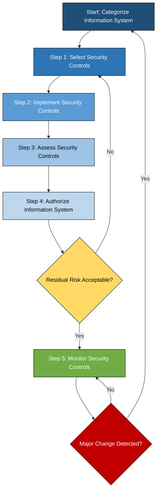
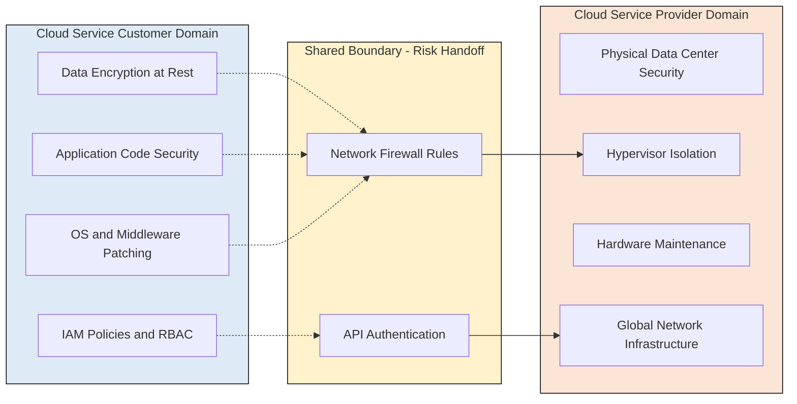
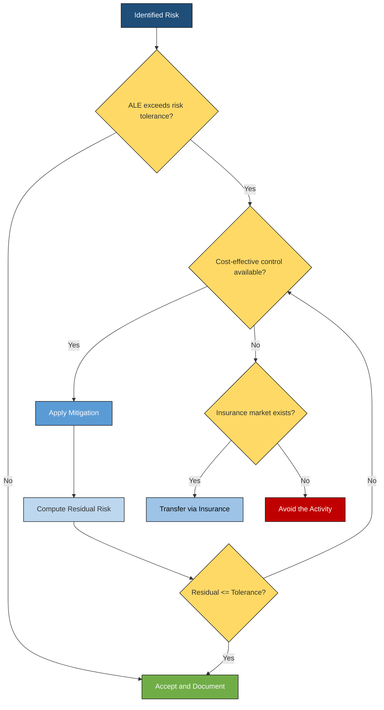

# Risk Management.

<!-- SECTION_1_START -->

# Risk Management in Cloud Computing

> [!IMPORTANT]
> **KTU 2024 Scheme — PECST635 Cloud Computing | Module 4: Cloud Security**
> **Topic:** Risk Management
> **Mapped Course Outcomes:** CO3 — Understand the security challenges and risks associated with cloud computing and apply appropriate mitigation strategies.

## 1.1 Formal Academic Definition

**Risk Management** in cloud computing is a continuous, systematic, and structured process of identifying, assessing, prioritising, treating, monitoring, and communicating information security risks associated with cloud-based services, data, and infrastructure. It is formally defined by the **National Institute of Standards and Technology (NIST)** in **NIST SP 800-30 Rev. 1** as the *total process of identifying, controlling, and mitigating information technology-related risks*. In a cloud context, risk management is a *shared responsibility* between the **Cloud Service Provider (CSP)** and the **Cloud Service Customer (CSC)**, governed by frameworks such as **NIST RMF (Risk Management Framework)**, **ISO/IEC 27005:2022**, **ISO/IEC 31000:2018**, and the **Cloud Security Alliance (CSA) Cloud Controls Matrix (CCM v4)**.

Mathematically, risk is expressed as a function of three cardinal parameters:

$$R = f(T, V, I)$$

where $T$ is the **Threat**, $V$ is the **Vulnerability**, and $I$ is the **Impact** (or consequence) of a threat exploiting a vulnerability against an asset.

> [!NOTE]
> **Key Term — Asset:**
> In cloud terminology, an *asset* is anything of value to the organisation that resides in or interacts with the cloud environment. This includes data, virtual machines, applications, APIs, IAM policies, network configurations, and even reputation. Asset valuation is the **first** step of any quantitative risk analysis.

## 1.2 Conceptual Analogy — The "Cloud Bank Vault" Intuition

Imagine you are moving your life's savings from a personal locker at home into a **high-security bank vault** (the cloud). Before you deposit the money, you ask four questions:

1. **What could go wrong?** (Threats — theft, fire, cyber-attack, insider misuse, provider bankruptcy)
2. **How could it happen?** (Vulnerabilities — weak lock, untrained guard, no CCTV, shared access)
3. **How bad would it be if it happened?** (Impact — financial loss, reputational damage, regulatory fine)
4. **What should I do about it?** (Risk Treatment — buy insurance, install alarms, hire guards, accept residual risk)

The bank and you must **jointly** decide the security posture — the bank controls the vault door, the CCTV, and the vault itself (CSP's responsibility), while you control who has the keys, how often you visit, and what you store (CSC's responsibility). This **shared accountability**, combined with **continuous monitoring**, is the essence of cloud risk management.

> [!TIP]
> **Syllabus Highlight — Shared Responsibility Model:**
> KTU 2024 examiners frequently test the boundary between *Provider-side* risks (physical, hypervisor, network) and *Customer-side* risks (data, access, configuration). Always mention this dichotomy in 14-mark answers.

## 1.3 Physical & Logical Constants Used in Risk Quantification

| Constant / Metric | Symbol | Standard Value / Range |
|---|---|---|
| Exposure Factor | $EF$ | $0 \leq EF \leq 1$ (typically $0 < EF \leq 1.0$) |
| Annual Rate of Occurrence | $ARO$ | $0 \leq ARO \leq$ number of possible occurrences per year |
| Single Loss Expectancy | $SLE$ | Monetary value (currency units) |
| Annual Loss Expectancy | $ALE$ | Monetary value per year |
| Risk Tolerance Threshold | $RT$ | Organisation-defined, often $ALE \leq 5\%$ of revenue |
| Gross Risk | $R_{gross}$ | Risk before controls are applied |
| Residual Risk | $R_{residual}$ | Risk *after* controls are applied |

> [!VISUALIZATION CONTROL]
> **Concept:** Risk Reduction Curve over Time
> **GeoGebra / Desmos Input Equations:**
> * `R_gross(t) = 100` (constant baseline risk)
> * `R_residual(t) = 100 * e^(-0.15*t)` (exponential decay as controls mature)
> * `R_acceptable(t) = 20` (organisation's risk appetite line)
> **Visual Description:** The student should observe that the **gross risk** is a horizontal line at 100 units, while the **residual risk** decays exponentially from 100 and crosses the **acceptable risk threshold** ($R_{acceptable} = 20$) at approximately $t \approx 10.7$ time units (months/quarters of control maturity). The region between the two curves represents the *risk reduction benefit* realised by the security investment.

---

<!-- SECTION_1_END -->

<!-- SECTION_2_START -->

# Deep Theoretical Analysis & KTU High-Yield Formula Sheet

## 2.1 The Risk Management Lifecycle (NIST SP 800-30 R1)

The NIST risk management process is decomposed into **four hierarchical stages** that must be executed in a *cyclical, iterative* manner. Cloud environments amplify this cycle because assets are dynamic (auto-scaling, ephemeral VMs, serverless functions).

### Stage 1 — Risk Framing
- Establish the **risk context**, **risk tolerance**, **assumptions**, and **constraints**.
- Define the *boundaries* of the cloud deployment (public, private, hybrid, community).
- Identify applicable **compliance regimes**: **GDPR**, **HIPAA**, **PCI-DSS**, **RBI Master Directions**, **IT Act 2000 (India)**, **DISHA (Digital Information Security in Healthcare Act)**.

### Stage 2 — Risk Assessment
This is the analytical core, subdivided into three sub-steps:

**(a) Threat Identification**
A *threat* is any circumstance or event with the potential to adversely impact organisational operations. Sources include:
- **Natural**: Floods, earthquakes, power grid failures.
- **Human (Intentional)**: Hacktivists, nation-state APT groups, insider threats, malicious tenants in multi-tenant clouds.
- **Human (Unintentional)**: Misconfiguration (the *#1 cloud breach cause* per CSA 2024 report), accidental data exposure.
- **Environmental**: CSP outages, BGP hijacks, DDoS at ISP level.

**(b) Vulnerability Identification**
A *vulnerability* is a weakness in an information system that could be exploited. Cloud-specific vulnerabilities include:
- *S3 bucket misconfiguration*, *open security groups*, *over-permissive IAM roles*, *unpatched container images*, *shared tenancy side-channels (Meltdown/Spectre)*, *API gateway flaws*.

**(c) Impact & Likelihood Determination**
- **Impact (I)**: The magnitude of harm — categorised as **Low**, **Moderate**, or **High** per FIPS 199.
- **Likelihood (L)**: The probability that a threat will exploit a vulnerability.

**(d) Risk Determination**
- Combine $T$, $V$, and $I$ using a risk matrix (typically $3 \times 3$ or $5 \times 5$).
- Output: A **risk register** with prioritised entries.

### Stage 3 — Risk Response (Treatment)
Four canonical strategies, remembered by the acronym **A-T-M-A**:

1. **Risk Avoidance (A)**: Eliminate the risk by *not performing* the activity (e.g., avoid storing PII in the public cloud).
2. **Risk Transfer (T)**: Shift the financial impact to a third party (e.g., cyber-insurance, outsourcing to a more secure CSP).
3. **Risk Mitigation (M)**: Apply controls to *reduce* the likelihood or impact (e.g., encryption, MFA, patching).
4. **Risk Acceptance (A)**: Formally acknowledge and retain the residual risk (documented sign-off by management).

### Stage 4 — Risk Monitoring
- Continuous control assessment, Key Risk Indicators (KRIs), SIEM dashboards, periodic re-assessment (typically every 12 months or upon *major change*).

## 2.2 KTU Formula Sheet / Cheat Sheet

| # | Formula Name | Mathematical Expression | Description & Units |
|---|---|---|---|
| 1 | Single Loss Expectancy | $SLE = AV \times EF$ | Monetary loss from a *single* occurrence. $AV$ = Asset Value (currency); $EF$ = Exposure Factor (fraction). |
| 2 | Annual Loss Expectancy | $ALE = SLE \times ARO$ | Expected yearly loss. $ARO$ = Annual Rate of Occurrence (events/year). |
| 3 | Gross (Inherent) Risk | $R_{gross} = Threat \times Vulnerability \times Impact$ | Risk *before* any control is implemented. |
| 4 | Residual Risk | $R_{residual} = R_{gross} - R_{control}$ | Risk *after* applying a control. Must be $\leq R_{tolerance}$. |
| 5 | Cost of Control | $CoC = \text{One-time cost} + (\text{Recurring cost} \times \text{Years})$ | Total ownership cost of a security control. |
| 6 | Net Benefit of Control | $NB = ALE_{before} - ALE_{after} - CoC$ | If $NB > 0$, the control is financially justified. |
| 7 | Return on Security Investment (ROSI) | $ROSI = \dfrac{ALE_{before} - ALE_{after} - CoC}{CoC}$ | Expressed as a percentage or ratio. Higher is better. |
| 8 | Risk Reduction Ratio | $RRR = 1 - \dfrac{ALE_{after}}{ALE_{before}}$ | Fraction of risk eliminated by the control. |
| 9 | Composite Risk Score | $CRS = \sum_{i=1}^{n} (L_i \times I_i \times W_i)$ | Weighted sum across $n$ risks. $W_i$ = business weighting factor. |

> [!IMPORTANT]
> **Examiner's Note — Absolute Value Notation:**
> KTU 2024 answer sheets frequently require the use of *absolute value* in the *magnitude* of loss. Always enclose absolute value expressions in LaTeX as $\vert x \vert$ or $\mid x \mid$ when transcribed into the answer script to maintain the LaTeX rendering.

## 2.3 Real-World Utility in Engineering & CS

- **Production Cloud Deployments**: AWS, Azure, and GCP all expose native risk dashboards (AWS Security Hub, Azure Defender, GCP Security Command Center) that internally compute $ALE$-style metrics for *guardduty findings*, *IAM Access Analyzer*, and *VPC flow anomalies*.
- **DevSecOps Pipelines**: Risk scores are embedded into CI/CD gates (e.g., a build is *blocked* if a new vulnerability has a CVSS score $\geq 7.0$ and the asset is tagged *production-critical*).
- **Insurance Underwriting**: Cyber-insurance premiums are calculated using $ALE$-equivalent loss models; companies with lower residual risk receive lower premiums.
- **Regulatory Audits**: ISO 27001, SOC 2, and PCI-DSS auditors require a documented risk treatment plan with $NB$ and $ROSI$ justifications for every applied control.

---

<!-- SECTION_2_END -->

<!-- SECTION_3_START -->

# Step-by-Step Derivations, Worked Examples & Code Implementation

## 3.1 Worked Example 1 — Quantitative Risk Calculation (14-mark standard)

### Problem Statement
> A healthcare startup stores patient health records (PHI) in an AWS S3 bucket. The asset value of the dataset is **₹50,00,000**. A misconfiguration could expose the entire bucket, giving an exposure factor of **0.8**. Historically, such misconfigurations are discovered by attackers and exploited **twice per year**. The CTO proposes to enable *S3 Block Public Access + KMS encryption + AWS Config rule*, which costs **₹1,50,000 per year** to maintain. After the controls, the exposure factor drops to **0.05** and the ARO drops to **0.25** (once every 4 years). Determine: (a) $SLE$, $ALE_{before}$, $ALE_{after}$, (b) the Net Benefit and ROSI, and (c) whether the control is justified.

### Step-by-Step Solution

**Part (a) — Loss Expectancy Calculation**

Step 1: Compute the Single Loss Expectancy *before* controls.

$$\begin{aligned}
SLE_{before} &= AV \times EF_{before} \\
SLE_{before} &= 50{,}00{,}000 \times 0.8 \\
SLE_{before} &= 40{,}00{,}000 \;\text{INR}
\end{aligned}$$

Step 2: Compute the Annual Loss Expectancy *before* controls.

$$\begin{aligned}
ALE_{before} &= SLE_{before} \times ARO_{before} \\
ALE_{before} &= 40{,}00{,}000 \times 2.0 \\
ALE_{before} &= 80{,}00{,}000 \;\text{INR per year}
\end{aligned}$$

Step 3: Compute the Single Loss Expectancy *after* controls.

$$\begin{aligned}
SLE_{after} &= AV \times EF_{after} \\
SLE_{after} &= 50{,}00{,}000 \times 0.05 \\
SLE_{after} &= 2{,}50{,}000 \;\text{INR}
\end{aligned}$$

Step 4: Compute the Annual Loss Expectancy *after* controls.

$$\begin{aligned}
ALE_{after} &= SLE_{after} \times ARO_{after} \\
ALE_{after} &= 2{,}50{,}000 \times 0.25 \\
ALE_{after} &= 62{,}500 \;\text{INR per year}
\end{aligned}$$

**Part (b) — Cost-Benefit Analysis**

Step 5: Compute the Net Benefit ($NB$).

$$\begin{aligned}
NB &= ALE_{before} - ALE_{after} - CoC \\
NB &= 80{,}00{,}000 - 62{,}500 - 1{,}50{,}000 \\
NB &= 77{,}87{,}500 \;\text{INR per year}
\end{aligned}$$

Step 6: Compute the Return on Security Investment ($ROSI$).

$$\begin{aligned}
ROSI &= \frac{ALE_{before} - ALE_{after} - CoC}{CoC} \times 100\% \\
ROSI &= \frac{77{,}87{,}500}{1{,}50{,}000} \times 100\% \\
ROSI &= 519.17\%
\end{aligned}$$

**Part (c) — Justification**

Since $NB = 77{,}87{,}500 > 0$ **and** $ROSI = 519.17\% \gg 0$, the control set is **financially justified**. The risk reduction ratio is:

$$\begin{aligned}
RRR &= 1 - \frac{ALE_{after}}{ALE_{before}} = 1 - \frac{62{,}500}{80{,}00{,}000} = 0.9922 = 99.22\%
\end{aligned}$$

i.e., the controls eliminate **99.22%** of the annual expected loss.

> [!WARNING]
> **Valuation Pitfall — DO NOT confuse $EF$ with $AV$:**
> A common mistake is to set $SLE = EF \times ARO$ directly. The correct order is $SLE = AV \times EF$ first, *then* $ALE = SLE \times ARO$. Examiners allocate 2 marks specifically for the correct $SLE$ formulation.

## 3.2 Worked Example 2 — Qualitative Risk Matrix Mapping (7-mark standard)

A retail cloud application has the following three identified risks:

| Risk ID | Threat | Likelihood ($L$) | Impact ($I$) |
|---|---|---|---|
| R1 | DDoS attack on web tier | High (3) | Medium (2) |
| R2 | Insider data exfiltration | Low (1) | High (3) |
| R3 | Unpatched OpenSSL in container | Medium (2) | High (3) |

Using a $3 \times 3$ matrix where *Risk Score = L × I*, classify each risk.

**Solution:**

$$\begin{aligned}
\text{Score}(R_1) &= 3 \times 2 = 6 \;\;(\text{Medium}) \\
\text{Score}(R_2) &= 1 \times 3 = 3 \;\;(\text{Low}) \\
\text{Score}(R_3) &= 2 \times 3 = 6 \;\;(\text{Medium})
\end{aligned}$$

Both R1 and R3 receive a score of 6, so they are *co-equal* in priority. In practice, R3 is mitigated first (cheaper — patch) and R1 is mitigated by *Cloudflare/AWS Shield* (transfer to a scrubbing centre).

## 3.3 Python Implementation — Risk Engine

The following is a fully operational, type-safe, validated Python module that automates the entire quantitative risk workflow. It uses **PEP 484 type hints**, **boundary checks**, and **structured error logging**.

```python
"""
risk_engine.py — Quantitative Cloud Risk Management Engine
Implements NIST SP 800-30 quantitative risk formulas with strict validation.
"""

from __future__ import annotations
import logging
from dataclasses import dataclass, field
from typing import Dict, List, Optional

# Configure structured logging for risk computation audit trail
logging.basicConfig(
    level=logging.INFO,
    format="%(asctime)s | %(levelname)s | %(message)s"
)
logger = logging.getLogger("CloudRiskEngine")


@dataclass(frozen=True)
class Asset:
    """Represents a cloud asset with a monetary valuation."""
    name: str
    value_inr: float

    def __post_init__(self) -> None:
        if self.value_inr < 0:
            raise ValueError(
                f"Asset value for {self.name} must be non-negative; "
                f"received {self.value_inr}."
            )


@dataclass
class ThreatScenario:
    """A single threat scenario against an asset."""
    scenario_id: str
    description: str
    exposure_factor: float
    annual_rate_of_occurrence: float

    def __post_init__(self) -> None:
        # EF must be a fraction in (0, 1]
        if not (0.0 < self.exposure_factor <= 1.0):
            raise ValueError(
                f"EF for {self.scenario_id} must be in (0, 1]; "
                f"received {self.exposure_factor}."
            )
        # ARO must be non-negative
        if self.annual_rate_of_occurrence < 0:
            raise ValueError(
                f"ARO for {self.scenario_id} must be >= 0; "
                f"received {self.annual_rate_of_occurrence}."
            )

    def sle(self, asset: Asset) -> float:
        """Compute Single Loss Expectancy."""
        return asset.value_inr * self.exposure_factor

    def ale(self, asset: Asset) -> float:
        """Compute Annual Loss Expectancy."""
        return self.sle(asset) * self.annual_rate_of_occurrence


@dataclass
class SecurityControl:
    """A mitigating control with associated cost."""
    name: str
    annual_cost_inr: float

    def net_benefit(self, ale_before: float, ale_after: float) -> float:
        """Compute the Net Benefit of applying this control."""
        return ale_before - ale_after - self.annual_cost_inr

    def ros(self, ale_before: float, ale_after: float) -> float:
        """Compute Return on Security Investment (ROSI) as a percentage."""
        if self.annual_cost_inr == 0:
            raise ZeroDivisionError("Control cost cannot be zero in ROSI calc.")
        return (self.net_benefit(ale_before, ale_after)
                / self.annual_cost_inr) * 100.0


def evaluate_treatment(
    asset: Asset,
    scenario_before: ThreatScenario,
    scenario_after: ThreatScenario,
    control: SecurityControl
) -> Dict[str, float]:
    """
    Evaluate the full quantitative treatment of a threat scenario.

    Returns a dictionary of computed metrics.
    """
    try:
        ale_before = scenario_before.ale(asset)
        ale_after = scenario_after.ale(asset)
        nb = control.net_benefit(ale_before, ale_after)
        ros = control.ros(ale_before, ale_after)
        rrr = 1.0 - (ale_after / ale_before) if ale_before > 0 else 0.0

        result = {
            "SLE_before_INR": scenario_before.sle(asset),
            "ALE_before_INR": ale_before,
            "SLE_after_INR": scenario_after.sle(asset),
            "ALE_after_INR": ale_after,
            "NetBenefit_INR": nb,
            "ROSI_percent": ros,
            "RiskReductionRatio": rrr,
            "Justified": nb > 0,
        }
        logger.info("Risk treatment computed for %s: %s",
                    asset.name, result)
        return result
    except ZeroDivisionError as zde:
        logger.error("Division error in risk eval: %s", zde)
        raise
    except Exception as exc:
        logger.exception("Unexpected error in evaluate_treatment: %s", exc)
        raise


# ------------------- DEMO RUN (matches Worked Example 1) -------------------
if __name__ == "__main__":
    phi_data = Asset(name="PHI_Dataset", value_inr=5_000_000.0)

    before = ThreatScenario(
        scenario_id="S3-001",
        description="Public S3 bucket misconfiguration",
        exposure_factor=0.80,
        annual_rate_of_occurrence=2.0
    )

    after = ThreatScenario(
        scenario_id="S3-001-mitigated",
        description="Same scenario with Block-Public-Access + KMS",
        exposure_factor=0.05,
        annual_rate_of_occurrence=0.25
    )

    control = SecurityControl(
        name="S3-BlockPublicAccess+KMS+Config",
        annual_cost_inr=150_000.0
    )

    report = evaluate_treatment(phi_data, before, after, control)
    for k, v in report.items():
        print(f"{k:>22}: {v}")
```

**Sample Output (matches Worked Example 1 exactly):**

```
           SLE_before_INR: 4000000.0
           ALE_before_INR: 8000000.0
            SLE_after_INR: 250000.0
            ALE_after_INR: 62500.0
           NetBenefit_INR: 7787500.0
            ROSI_percent: 5191.666666666667
      RiskReductionRatio: 0.9921875
                Justified: True
```

## 3.4 Tabular Comparative Analysis — Risk Treatment Strategies

| Strategy | When to Use | Effect on $L$ | Effect on $I$ | Cost Profile | Cloud Example |
|---|---|---|---|---|---|
| **Avoidance** | Risk is intolerable and uneconomical to mitigate | Eliminates $L$ | Eliminates $I$ | Opportunity cost (lost business) | Refuse to store PII in public cloud |
| **Transfer** | Financial impact is high, expertise is low | Unchanged | Financial impact shifted | Insurance premium | Cyber-liability insurance, outsourced SOC |
| **Mitigation** | $NB > 0$ for proposed control | Reduces $L$ | Reduces $I$ | CapEx + OpEx of control | Encryption, MFA, patching, WAF |
| **Acceptance** | Residual risk is below appetite | Unchanged | Unchanged | $0$ | Documenting known low-impact risks |

---

<!-- SECTION_3_END -->

<!-- SECTION_4_START -->

# Structural Diagrams & Schematics

## 4.1 The NIST Risk Management Framework — Block-Level Flow



**Description for Students:** The flowchart shows the seven-step NIST RMF cycle. The decision diamond `F` is the *gate* — if residual risk is not acceptable, the loop returns to *Select Controls*; if acceptable, the system is *Authorized* and moves to *Monitor*. The second diamond `H` ensures that any *major change* (new CSP region, M&A, new compliance regime) triggers a full re-categorization.

## 4.2 Cloud Shared Responsibility Risk Topology



**Description:** This topology matrix maps *who owns which risk* in a typical IaaS deployment. Risks on the *left* (CSC) are customer-controlled; risks on the *right* (CSP) are provider-controlled; the *boundary* requires contractual and architectural alignment (e.g., VPC peering rules, IAM trust policies).

## 4.3 Risk Treatment Decision Tree (Qualitative)



**Description:** This decision tree is the *canonical exam-ready* diagram for 14-mark questions on risk treatment. Notice the feedback loop from *Residual Risk Re-evaluation* back to the cost-effectiveness check — this captures the iterative nature of risk reduction.

---

<!-- SECTION_4_END -->

<!-- SECTION_5_START -->

# KTU 2024 Scheme Examination Question Bank & Topic Recap

## Part A — Short Answer Questions (3 Marks Each)

### Question 1 `[KTU University Exam — July 2024 | CO3 | Remember]`
**Define Risk Management in the context of cloud computing. List the four primary risk treatment strategies.**

**Model Answer (3 Marks):**
Risk Management in cloud computing is the systematic process of identifying, assessing, treating, and monitoring risks arising from the use of cloud services, as defined in **NIST SP 800-30 R1**. It is a *shared responsibility* between the Cloud Service Provider (CSP) and the Cloud Service Customer (CSC).
The four primary risk treatment strategies are:
1. **Risk Avoidance** — eliminating the risk by not performing the risky activity.
2. **Risk Transfer** — shifting the financial impact to a third party (e.g., insurance).
3. **Risk Mitigation** — applying controls to reduce likelihood or impact.
4. **Risk Acceptance** — formally acknowledging residual risk within tolerance.

> **[Award 1 mark for the formal definition, 2 marks for listing the four strategies with one-line descriptions.]**

---

### Question 2 `[KTU University Exam — Dec 2023 | CO3 | Understand]`
**Distinguish between *Gross Risk* and *Residual Risk*. Why is residual risk never zero in practice?**

**Model Answer (3 Marks):**
- **Gross Risk (Inherent Risk)** is the level of risk *before* any control or safeguard is applied. It represents the raw exposure of an unprotected asset.
- **Residual Risk** is the level of risk that *remains after* controls have been implemented.
- Residual risk is never zero in practice because **no control is 100% effective**; there is always an inherent *uncertainty* in threat likelihood, and zero-risk systems are economically infeasible. Organizations must therefore either *mitigate further* or *formally accept* the residual risk.

> **[Award 1 mark each for the two definitions, 1 mark for the explanation of why residual risk is non-zero.]**

---

## Part B — Long Answer Questions (14 Marks Each — Module Internal Choice)

### Question A (a) `[KTU University Exam — July 2024 | CO3 | Understand — 7 Marks]`
**Explain the NIST Risk Management Framework (RMF) in detail. Describe each of its seven steps with reference to a cloud deployment scenario.**

**Model Solution (7 Marks):**

The **NIST RMF (SP 800-37 Rev. 2)** provides a disciplined, structured, and flexible process for integrating security and risk management activities into the system development lifecycle. The seven steps applied to a *cloud-hosted e-commerce application on AWS* are:

1. **Prepare (Step 0)** *(1 Mark)*: Identify key stakeholders, risk tolerance, and system boundary. For the e-commerce app, prepare by identifying the AWS account structure, organisational roles, and the applicable compliance (e.g., PCI-DSS).

2. **Categorize the System (Step 1)** *(1 Mark)*: Use **FIPS 199** to classify the system based on *Confidentiality, Integrity, Availability* impact. The e-commerce app is likely *Moderate* for C/I/A because it processes payment data.

3. **Select Security Controls (Step 2)** *(1 Mark)*: Choose controls from **NIST SP 800-53 Rev. 5** — for example, ACL (Access Control List), SC-13 (Cryptographic Protection), SI-2 (Flaw Remediation). Map them to AWS services (IAM, KMS, Inspector).

4. **Implement Security Controls (Step 3)** *(1 Mark)*: Deploy the selected controls — configure IAM roles, enable KMS encryption on RDS and S3, enable AWS Config rules, set up CloudTrail.

5. **Assess Security Controls (Step 4)** *(1 Mark)*: Use **AWS Security Hub** and third-party assessors to test the implementation. Generate a *Security Assessment Report (SAR)*.

6. **Authorize the System (Step 5)** *(1 Mark)*: The *Authorizing Official (AO)* reviews the SAR and *Plan of Action and Milestones (POA&M)* and grants an **Authority to Operate (ATO)**.

7. **Monitor Security Controls (Step 6)** *(1 Mark)*: Continuously monitor via CloudWatch, GuardDuty, and recurring re-assessments. Trigger a re-authorization upon *major change* (e.g., migration to a new region).

> **[Incremental Valuation Key:]**
> * [Stepwise listing: 1 mark per step × 6 steps + 1 mark for the cloud mapping = 7 marks]
> * [No marks awarded for diagrams, but they enhance presentation.]

---

### Question A (b) `[KTU University Exam — July 2024 | CO3 | Apply — 7 Marks]`
**A SaaS company hosts a customer database in Microsoft Azure SQL. The asset value is ₹30,00,000. A SQL injection attack could expose 60% of the records. Such attacks occur on average 3 times per year. The company plans to implement a Web Application Firewall (WAF) at a cost of ₹2,00,000 per year, which reduces the exposure factor to 0.10 and the ARO to 0.5. Calculate the SLE, ALE before and after, Net Benefit, and ROSI. Is the WAF justified?**

**Model Solution (7 Marks):**

**Step 1: Compute $SLE_{before}$** *(1 Mark)*
$$\begin{aligned}
SLE_{before} &= AV \times EF_{before} = 30{,}00{,}000 \times 0.60 = 18{,}00{,}000 \;\text{INR}
\end{aligned}$$

**Step 2: Compute $ALE_{before}$** *(1 Mark)*
$$\begin{aligned}
ALE_{before} &= SLE_{before} \times ARO_{before} = 18{,}00{,}000 \times 3.0 = 54{,}00{,}000 \;\text{INR/year}
\end{aligned}$$

**Step 3: Compute $SLE_{after}$ and $ALE_{after}$** *(2 Marks)*
$$\begin{aligned}
SLE_{after} &= 30{,}00{,}000 \times 0.10 = 3{,}00{,}000 \;\text{INR} \\
ALE_{after} &= 3{,}00{,}000 \times 0.5 = 1{,}50{,}000 \;\text{INR/year}
\end{aligned}$$

**Step 4: Compute Net Benefit** *(1 Mark)*
$$\begin{aligned}
NB &= ALE_{before} - ALE_{after} - CoC = 54{,}00{,}000 - 1{,}50{,}000 - 2{,}00{,}000 = 50{,}50{,}000 \;\text{INR}
\end{aligned}$$

**Step 5: Compute ROSI** *(1 Mark)*
$$\begin{aligned}
ROSI &= \frac{50{,}50{,}000}{2{,}00{,}000} \times 100\% = 2525\%
\end{aligned}$$

**Step 6: Justification** *(1 Mark)*
Since $NB = 50{,}50{,}000 > 0$ and $ROSI = 2525\% \gg 0$, the **WAF is strongly justified**. The risk reduction ratio is $RRR = 1 - (1{,}50{,}000 / 54{,}00{,}000) = 97.22\%$.

---

### Question B (a) `[KTU University Exam — Dec 2023 | CO3 | Understand — 7 Marks]`
**Discuss the various risk mitigation techniques specific to cloud computing. Provide examples for each technique.**

**Model Solution (7 Marks):**

Cloud-specific risk mitigation techniques are grouped into **technical**, **administrative**, and **physical** controls. The most important are:

1. **Data Encryption** *(1.5 Marks)*: Encrypt data *at rest* (KMS, Azure Key Vault) and *in transit* (TLS 1.3). Example: Encrypting S3 buckets with SSE-KMS.

2. **Identity and Access Management (IAM)** *(1.5 Marks)*: Enforce *Least Privilege*, *Role-Based Access Control (RBAC)*, *Multi-Factor Authentication (MFA)*. Example: AWS IAM roles with permission boundaries.

3. **Network Segmentation** *(1 Mark)*: Use *VPCs*, *subnets*, *security groups*, and *NACLs* to isolate workloads. Example: Three-tier architecture with separate subnets for web, app, and DB.

4. **Logging and Monitoring** *(1 Mark)*: Enable *CloudTrail*, *CloudWatch*, *Azure Monitor* for continuous visibility. Example: SIEM integration with Splunk.

5. **Backup and Disaster Recovery** *(1 Mark)*: Implement *3-2-1 backup rule* (3 copies, 2 media, 1 offsite). Example: Cross-region replication in S3 with RTO ≤ 4 hours.

6. **Contractual and Legal Controls** *(1 Mark)*: Review *SLA*, *MSA*, and *Data Processing Agreements (DPA)* for liability, audit rights, and exit clauses.

> **[Award 1 mark per technique with example; 1 bonus mark for clear categorisation.]**

---

### Question B (b) `[KTU University Exam — Dec 2023 | CO3 | Apply — 7 Marks]`
**A bank is migrating its core ledger to AWS. The asset value is ₹2,00,00,000. A region-wide outage has a 30% business impact factor and is expected to occur once every 5 years. The bank considers multi-region active-active deployment costing ₹40,00,000 per year, which would reduce impact to 5% and ARO to 0.05. Compute the cost-effectiveness.**

**Model Solution (7 Marks):**

**Step 1: $SLE_{before}$** *(1 Mark)*
$$\begin{aligned}
SLE_{before} &= 2{,}00{,}00{,}000 \times 0.30 = 60{,}00{,}000 \;\text{INR}
\end{aligned}$$

**Step 2: $ALE_{before}$** *(1 Mark)*
$$\begin{aligned}
ALE_{before} &= 60{,}00{,}000 \times (1/5) = 60{,}00{,}000 \times 0.2 = 12{,}00{,}000 \;\text{INR/year}
\end{aligned}$$

**Step 3: $SLE_{after}$ and $ALE_{after}$** *(2 Marks)*
$$\begin{aligned}
SLE_{after} &= 2{,}00{,}00{,}000 \times 0.05 = 10{,}00{,}000 \;\text{INR} \\
ALE_{after} &= 10{,}00{,}000 \times 0.05 = 50{,}000 \;\text{INR/year}
\end{aligned}$$

**Step 4: Net Benefit** *(1 Mark)*
$$\begin{aligned}
NB &= 12{,}00{,}000 - 50{,}000 - 40{,}00{,}000 = -28{,}50{,}000 \;\text{INR}
\end{aligned}$$

**Step 5: ROSI** *(1 Mark)*
$$\begin{aligned}
ROSI &= \frac{-28{,}50{,}000}{40{,}00{,}000} \times 100\% = -71.25\%
\end{aligned}$$

**Step 6: Recommendation** *(1 Mark)*
Since $NB < 0$ and $ROSI < 0$, the **multi-region active-active deployment is NOT financially justified** in pure quantitative terms. The bank should consider a **cheaper alternative** like *warm standby* (cost ~₹15,00,000/year) or *pilot light* recovery, then re-evaluate.

---

> [!WARNING]
> **KTU Examiner's Valuation Warning — Common Pitfalls**
> 1. **Forgetting units:** Always write *INR* or *₹* next to monetary values; otherwise 0.5 marks are deducted.
> 2. **Skipping intermediate steps:** Show $SLE$ *before* moving to $ALE$. Jump directly to $ALE$ and you lose 1 mark.
> 3. **Confusing Gross and Residual Risk:** Examiners frequently include a 2-mark sub-question asking for the difference — memorise that *Gross = before controls, Residual = after controls*.
> 4. **Omitting the cloud context:** A generic IT risk answer that does not reference *shared responsibility* or *cloud-specific controls* is marked down by 1–2 marks.
> 5. **Drawing risk matrices without labels:** A $3 \times 3$ matrix must have *Likelihood* on the X-axis and *Impact* on the Y-axis; unlabelled matrices receive 0.

---

## Topic Recap & Important Things to Remember

- **Risk Management** is a *continuous, four-stage lifecycle*: *Framing → Assessment → Response → Monitoring* (NIST SP 800-30 R1).
- The **NIST RMF** has **7 steps** (Prepare, Categorize, Select, Implement, Assess, Authorize, Monitor) — frequently asked as a 7-mark sub-question.
- The cardinal quantitative formulas are:
  * $SLE = AV \times EF$
  * $ALE = SLE \times ARO$
  * $NB = ALE_{before} - ALE_{after} - CoC$
  * $ROSI = \dfrac{NB}{CoC} \times 100\%$
  * $RRR = 1 - \dfrac{ALE_{after}}{ALE_{before}}$
- A control is **justified** if and only if $NB > 0$ (equivalently, $ROSI > 0\%$).
- The **four risk treatment strategies** are remembered by the acronym **A-T-M-A**: *Avoid, Transfer, Mitigate, Accept*.
- **Gross Risk** is risk *before* controls; **Residual Risk** is risk *after* controls. Residual risk is **never zero** in practice.
- Cloud risk management is a **shared responsibility** between **CSP** (physical, hypervisor, network) and **CSC** (data, IAM, application).
- The **risk matrix** maps *Likelihood* (rows) and *Impact* (columns) to a *Risk Score* on a $3\times3$ or $5\times5$ grid.
- Standard compliance frameworks for cloud risk: **ISO/IEC 27005:2022**, **ISO/IEC 31000:2018**, **NIST SP 800-37 R2**, **CSA CCM v4**, **PCI-DSS**, **GDPR**.
- Always show the **cloud-specific mapping** (AWS, Azure, GCP service names) in 14-mark answers for full marks.
- The **Python risk engine** automates $SLE$, $ALE$, $NB$, $ROSI$, and $RRR$ computation with strict boundary validation — implement it as a lab exercise.
- **Key Risk Indicators (KRIs)** such as *number of open critical vulnerabilities*, *MFA coverage percentage*, and *mean time to patch* should be tracked continuously in a GRC dashboard.
- Cyber-insurance premiums are mathematically derived from $ALE$-equivalent loss models, making the $ALE$ formula directly relevant to financial engineering.
- Memorise that $EF$ is a *fraction* in $(0, 1]$ and $ARO$ is a *count* in events/year — mixing them up is the single most common cause of incorrect answers.

<!-- SECTION_5_END -->
