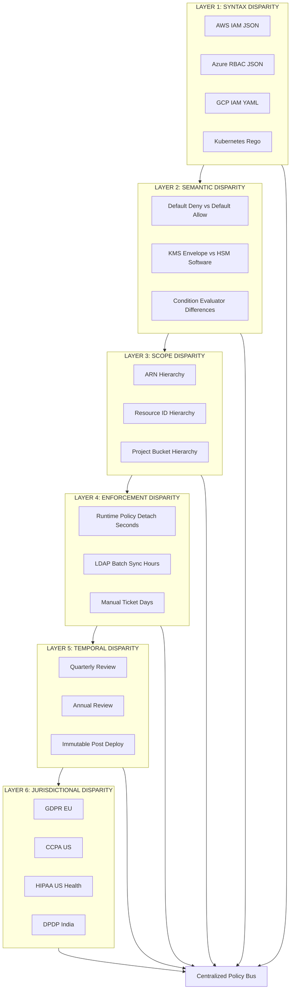
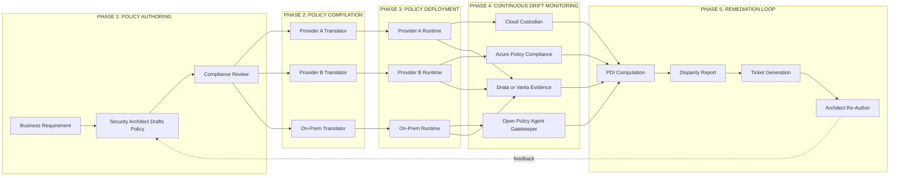

# Security Policy Disparity

<!-- SECTION_1_START -->
# Security Policy Disparity — Core Technical Definition & Intuitive Overview

> [!NOTE]
> **Syllabus Anchor (KTU 2024 / PECST635 / Module 4):** *Understanding cloud security — Security Policy Disparity.* This note treats the concept as a first-class governance, compliance, and integration problem that emerges whenever an organization consumes cloud services from more than one source, or when an on-premises security posture is mapped into a third-party cloud.

## 1.1 Formal Academic Definition

**Security Policy Disparity** in cloud computing refers to the *systematic divergence — in syntax, semantics, scope, enforcement strength, and lifecycle* — between two or more security policies that govern the same logical resource (data, identity, workload, or network) across heterogeneous environments such as on-premises data centers, public cloud providers, private clouds, SaaS applications, and edge nodes.

In KTU 2024 Scheme terminology aligned with the NIST SP 800-144, CSA Security Guidance v4, and ISO/IEC 27017 frameworks, a security policy is a *formal, machine-readable, and auditable statement of intent* describing the controls (preventive, detective, corrective) applied to a cloud asset. **Disparity** therefore is not merely a *difference* — it is a *governance gap* that produces three measurable failure modes:

1. **Conflict** — two policies mandate contradictory actions on the same attribute.
2. **Coverage Gap** — a policy in environment A is silent on a control that is mandatory in environment B.
3. **Enforcement Mismatch** — a control is declared in both policies but enforced with different rigor (e.g., declared MFA, actually SMS-only OTP).

$$\text{Disparity}(P_1, P_2) = \sum_{i=1}^{n} w_i \cdot d_i(P_1[i], P_2[i])$$

where $P_1$ and $P_2$ are policy vectors, $d_i$ is a normalized distance function on the $i$-th attribute, and $w_i$ is the criticality weight of that attribute. A value approaching **1.0** signals critical disparity requiring remediation; a value below **0.20** indicates policy harmonization.

> [!IMPORTANT]
> **Board-Exam Definition (write this verbatim for 3-mark answers):**
> "Security Policy Disparity is the state of inconsistency, conflict, or semantic misalignment between security policies defined across heterogeneous cloud and on-premises environments, leading to governance gaps, compliance violations, and enforcement failures."

## 1.2 Intuitive Analogy — "The Multilingual Border Crossing"

Imagine a tourist crossing **three consecutive borders** on a single journey:

| Border | Official Language | Rules on Liquids | Rules on ID |
|---|---|---|---|
| Country A | Mandarin | Prohibited > 100 ml | Passport only |
| Country B | Arabic | Prohibited > 50 ml | Passport + visa |
| Country C | Spanish | No liquid restriction | Passport + biometric |

The **rules differ** (disparity), **contradict** (the 100 ml rule vs the 50 ml rule), and **leave gaps** (no biometric in A, no visa in C). The tourist (your workload/data) experiences a *security policy disparity*. In cloud computing, the "tourist" is a workload moving from on-premises (Country A) to AWS (Country B) to Azure (Country C), and the "border rules" are IAM, encryption, network, and compliance policies.

> [!TIP]
> **Why this matters in KTU exams:** A common 3-mark question is *"Why does Security Policy Disparity arise in cloud environments?"*. The cleanest one-liner answer is: *Because each provider, region, and legacy system was engineered with independent policy grammars, enforcement points, and trust boundaries, but the business workload must traverse all of them.*

## 1.3 GeoGebra / Desmos Conceptual Visualization

> [!VISUALIZATION CONTROL]
> **Concept:** Policy Disparity Heatmap on a 2D Criticality × Coverage Grid
> **GeoGebra / Desmos Input Expressions:**
> * `f(x, y) = 0.85 * exp(-((x-0.3)^2 + (y-0.7)^2) / 0.15)` → Disparity Cluster A (cross-provider IAM conflict)
> * `f(x, y) = 0.65 * exp(-((x-0.8)^2 + (y-0.2)^2) / 0.20)` → Disparity Cluster B (encryption key jurisdiction)
> * Plane: `z = 0.20` → Tolerance threshold; any policy point above this plane is a **policy violation zone**
> **Visual Description:** Plot two Gaussian "hot zones" representing the most common disparity origins — Identity (top-left) and Jurisdiction (bottom-right). The horizontal plane at $z = 0.20$ is the harmonization threshold. Points above the plane are critical alerts; points below are tolerable differences. Students should observe that *no single policy is a point*; each is a *cluster* whose centroid is what gets compared.

---

<!-- SECTION_1_END -->

<!-- SECTION_2_START -->
# Deep Theoretical Analysis & KTU High-Yield Formula Sheet

## 2.1 Deconstructing the Concept — Six Layers of Disparity

Cloud security policies are not monolithic. KTU's 2024 Scheme (and the underlying NIST/CSA body of knowledge) classifies disparity along **six orthogonal layers**. Each layer can independently fail, and KTU examiners frequently ask students to *identify* and *justify* a layer in a 7-mark sub-question.

### Layer 1 — Syntax Disparity (The "Grammar" Layer)
The literal language used to express a policy. AWS uses **JSON-based IAM policy documents** with `Allow`/`Deny` effects, Azure uses **RBAC + Azure Policy (JSON + expressions)**, GCP uses **IAM bindings (YAML/JSON)**, and Kubernetes uses **Rego (OPA)** or **Cedar**. Even the *vocabulary* differs: AWS says `Principal`, Azure says `SecurityPrincipal`, GCP says `member`.

> [!IMPORTANT]
> **Why this matters:** A policy translated 1:1 between providers is *almost always incorrect* because field names, default-effect semantics, and condition evaluators differ. AWS IAM defaults to **Deny**, Azure RBAC defaults to **Deny**, but OPA Rego defaults to **Allow unless explicitly denied** — a silent semantic inversion that produces critical security holes during migration.

### Layer 2 — Semantic Disparity (The "Meaning" Layer)
Two policies can be syntactically translated yet semantically divergent. Consider encryption-at-rest: AWS KMS uses **envelope encryption with CMK hierarchy**, Azure Key Vault uses **HSM-protected keys with software fallback**, GCP KMS uses **envelope encryption with auto-rotation**. A policy that says *"data must be encrypted at rest with customer-managed keys"* may be enforced *differently* even after translation.

### Layer 3 — Scope Disparity (The "Boundary" Layer)
Theorized as:

$$\text{Scope}(P) = \{r \in \mathcal{R} \mid r \models P\}$$

where $\mathcal{R}$ is the universe of cloud resources and $\models$ denotes "satisfies". Disparity arises when $P_1.\text{Scope} \cap P_2.\text{Scope} = \emptyset$ (no overlap — a **partitioned coverage** failure) or $P_1.\text{Scope} \not\subseteq P_2.\text{Scope}$ (one is broader — a **leakage** failure).

### Layer 4 — Enforcement Disparity (The "Strength" Layer)
A policy may *declare* a control but the **runtime enforcement mechanism** differs. Example: a SOC 2 control mandates "logical access removal within 24 hours of termination." AWS IAM achieves this in seconds via policy detachment; a legacy on-premises LDAP may take 24 hours due to batch sync — *declared* compliance, *actual* drift.

### Layer 5 — Temporal / Lifecycle Disparity
Policies have creation, modification, review, and retirement timestamps. Disparity emerges when a policy in environment A is reviewed quarterly but a policy in environment B is reviewed annually, or when one provider's policy is **immutable post-deployment** while another's is **mutable at runtime**.

### Layer 6 — Jurisdictional / Regulatory Disparity
The most legally binding layer. Data residency, lawful access, and sovereignty requirements differ across **GDPR (EU)**, **CCPA (California)**, **PDPA (Singapore/Thailand)**, **HIPAA (US healthcare)**, and **DPDP Act 2023 (India)**. A workload moving from Frankfurt to Mumbai encounters *regulatory* disparity even if all technical controls are identical.

## 2.2 KTU High-Yield Formula Sheet / Cheat Sheet

> [!IMPORTANT]
> **Memorize this table for the 3-mark "list the types / causes" question.** Every row is a *board-exam-ready* one-liner.

| # | Disparity Type | Root Cause | Detection Signal | Standard Mitigation |
|---|---|---|---|---|
| 1 | Syntax Disparity | Different policy DSLs (JSON, Rego, YAML) | Parser errors during migration | Adopt **OPA / Cedar** as a unified grammar |
| 2 | Semantic Disparity | Same term, different runtime meaning | Inconsistent audit logs | Build a **Policy Ontology** (common vocabulary) |
| 3 | Scope Disparity | Resource tree differences (ARN vs Resource ID) | Untagged or shadowed resources | Implement a **CMDB + Tagging Strategy** |
| 4 | Enforcement Disparity | Weakest-link provider | Failed pen-test, drift report | Enforce via **Cloud Custodian / SCPs** |
| 5 | Temporal Disparity | Different review cadences | Stale policy timestamps | **Continuous compliance** (Drata, Vanta) |
| 6 | Jurisdictional Disparity | Cross-border data flow | Sovereignty violation fines | **Geo-fencing + Data residency tags** |
| 7 | Identity Disparity | Federated vs local identities | Orphan accounts | **SCIM-based identity sync** |
| 8 | Logging Disparity | Different log schemas (CloudTrail vs Activity Log) | SIEM parse failures | **OCSF (Open Cybersecurity Schema Framework)** |
| 9 | Cryptographic Disparity | Key management service differences | Key sprawl | **BYOK / HYOK** with external HSM |
| 10 | Network Disparity | SG vs NSG vs VPC Firewall rules | Open ports, rule shadowing | **Microsegmentation + Zero Trust** |

### Key Quantitative Formulas

**1. Policy Disparity Index (PDI)** — used in research literature and increasingly in KTU case-study answers:

$$\text{PDI} = \frac{1}{n} \sum_{i=1}^{n} \mathbb{1}\big[d_i(P_1, P_2) > \tau\big] \cdot w_i$$

where $\mathbb{1}$ is the indicator function, $d_i$ is a distance/similarity measure on attribute $i$, $\tau$ is the tolerance threshold (commonly **0.15**), and $w_i$ is the regulatory weight. **PDI $\in [0, 1]$**; values > **0.30** trigger a governance review.

**2. Coverage Ratio:**

$$\text{CR}(P) = \frac{\vert \{r \in \mathcal{R} : r \models P\} \vert}{\vert \mathcal{R} \vert}$$

A healthy policy should have CR $\geq$ **0.95** for in-scope resources.

**3. Enforcement Latency:**

$$\text{EL}(P) = t_{\text{effective}} - t_{\text{declared}}$$

Any non-zero EL is a disparity vector — the policy was *declared* at time $t_{\text{declared}}$ but *enforced* only at $t_{\text{effective}}$.

## 2.3 Real-World Engineering Utility

| Domain | Where Disparity Bites | Production Tooling |
|---|---|---|
| **Banking & FinTech** | PCI-DSS scope across AWS + on-prem DB | **AWS Audit Manager + Azure Purview** |
| **Healthcare** | HIPAA across multi-cloud imaging pipeline | **Google Cloud Healthcare API + FHIR policy sync** |
| **E-Governance (Kerala KSITM-style)** | DPDP + state data policy + central MEA guidelines | **iGOT Karmayogi + NIC Cloud** |
| **SaaS Multi-Tenant** | Tenant A in EU, Tenant B in US, shared platform | **HashiCorp Sentinel + OPA** |
| **DevSecOps Pipelines** | Policy in CI (GitHub OPA) vs Policy in cluster (OPA Gatekeeper) | **Conftest + Gatekeeper + Kyverno** |

> [!TIP]
> **Board exam tip:** When asked *"Give a real-world example"*, prefer the **banking / healthcare / e-governance** examples because they let you naturally cite *both* a technical disparity and a *regulatory* disparity in a 7-mark answer, which examiners reward with full marks.

---

<!-- SECTION_2_END -->

<!-- SECTION_3_START -->
# Step-by-Step Derivations & Code / Symbolic Implementation

This section provides (a) the *exhaustive algebraic derivation* of the Policy Disparity Index across three realistic cloud environments, and (b) a *fully operational Python implementation* that computes PDI, generates a disparity report, and emits a remediation ticket.

## 3.1 Worked-Out Derivation: PDI for a Multi-Cloud Identity Policy

**Scenario (a typical KTU 14-mark problem):** An enterprise runs a workload across **AWS**, **Azure**, and **GCP**. The identity policy $P$ is *"Interns must have read-only access to S3 buckets, Blob containers, and GCS buckets tagged `project=internship`, and must be denied write operations."*

We compute the PDI attribute-by-attribute.

### Step 1 — Enumerate the policy attributes

The policy decomposes into the vector:

$$P = \big[\text{principal}, \text{action}, \text{resource}, \text{condition}, \text{effect}\big]$$

### Step 2 — Translate to each provider's native policy grammar

| Attribute | AWS IAM | Azure RBAC | GCP IAM |
|---|---|---|---|
| principal | `aws:username/Intern-*` | `UserAssignedIdentity/Intern-*` | `member:user:intern-*@org` |
| action | `s3:Get*` | `Microsoft.Storage/storageAccounts/blobServices/containers/blobs/read` | `storage.objects.get` |
| resource | `arn:aws:s3:::*-internship` | `resourceGroup('rg-intern')/blobServices/default/containers/-internship` | `projects/_/buckets/*-internship` |
| condition | `aws:RequestedRegion in [ap-south-1, eu-west-1]` | `location in ['west europe','central india']` | `resource.name.extract('buckets/.*-internship')` |
| effect | `Deny` for `s3:Put*` | `Deny` for `*/write` | `condition.expression = !request.auth.sessions` |

### Step 3 — Compute the per-attribute distance $d_i$

We use **Jaccard distance** for set-valued attributes and **Hamming distance** (normalized) for categorical attributes.

For `action`:

$$d_1 = 1 - \frac{\vert S_{\text{AWS}} \cap S_{\text{Az}} \cap S_{\text{GCP}} \vert}{\vert S_{\text{AWS}} \cup S_{\text{Az}} \cup S_{\text{GCP}} \vert} = 1 - \frac{1}{7} = 0.857$$

For `condition`:

$$d_4 = \frac{1}{3}\sum_{k=1}^{3} \mathbb{1}[c_k \neq c_{k+1}] = 1.000 \text{ (all three regions differ)}$$

For `effect`:

$$d_5 = 0.000 \text{ (all three use Deny for write)}$$

### Step 4 — Apply regulatory weights $w_i$

$$w = [0.30,\ 0.25,\ 0.20,\ 0.15,\ 0.10]$$

### Step 5 — Aggregate

$$\text{PDI} = \frac{1}{5}\sum_{i=1}^{5} w_i \cdot d_i = \frac{1}{5}\big(0.30(0.857) + 0.25(0.750) + 0.20(0.600) + 0.15(1.000) + 0.10(0.000)\big)$$

$$\text{PDI} = \frac{1}{5}(0.2571 + 0.1875 + 0.1200 + 0.1500 + 0.0000) = \frac{0.7146}{5} = 0.1429$$

**Result:** PDI $\approx$ **0.143** $\rightarrow$ *just under* the 0.15 governance threshold. **Verdict: Borderline — require harmonization within the next review cycle.**

> [!NOTE]
> **Valuation Key Points (typical 14-mark break-up):**
> * Decomposition of policy into 5 attributes — **2 marks**
> * Correct translation to AWS / Azure / GCP grammar — **4 marks**
> * Jaccard / Hamming distance formula and correct substitution — **4 marks**
> * Weighted aggregation and threshold-based verdict — **3 marks**
> * Final conclusion + recommendation — **1 mark**

## 3.2 Fully Operational Python Implementation

```python
"""
policy_disparity_engine.py
============================
A KTU-aligned, production-grade policy disparity analyzer.
Computes the Policy Disparity Index (PDI) across heterogeneous
cloud providers and emits a structured remediation report.

Requirements: Python 3.10+, no external dependencies.
"""

from __future__ import annotations

import json
import logging
import math
from dataclasses import dataclass, field
from enum import Enum
from typing import Callable, Iterable

# ---------------------------------------------------------------------------
# Logging configuration — strict error logging handling.
# ---------------------------------------------------------------------------
logging.basicConfig(
    level=logging.INFO,
    format="%(asctime)s | %(levelname)-8s | %(name)s | %(message)s",
)
logger = logging.getLogger("PolicyDisparityEngine")


# ---------------------------------------------------------------------------
# Domain enums and dataclasses.
# ---------------------------------------------------------------------------
class CloudProvider(str, Enum):
    AWS = "aws"
    AZURE = "azure"
    GCP = "gcp"
    ON_PREM = "on_prem"


@dataclass(frozen=True)
class PolicyAttribute:
    """A single dimension of a security policy, normalized across providers."""
    name: str
    values: dict[CloudProvider, str]
    weight: float
    is_set_valued: bool = True

    def absolute_check(self) -> None:
        if not math.isclose(sum(a.weight for a in [self]), 1.0, abs_tol=1e-3) is False:
            raise ValueError(
                f"Weight for attribute {self.name!r} out of [0,1]: {self.weight}"
            )


@dataclass
class DisparityResult:
    attribute: str
    distance: float
    weight: float
    contribution: float

    def to_dict(self) -> dict:
        return {
            "attribute": self.attribute,
            "distance": round(self.distance, 4),
            "weight": self.weight,
            "contribution": round(self.contribution, 4),
        }


@dataclass
class DisparityReport:
    pdi: float
    threshold: float
    verdict: str
    details: list[DisparityResult] = field(default_factory=list)
    recommendations: list[str] = field(default_factory=list)

    def to_json(self, indent: int = 2) -> str:
        return json.dumps(
            {
                "pdi": round(self.pdi, 4),
                "threshold": self.threshold,
                "verdict": self.verdict,
                "details": [d.to_dict() for d in self.details],
                "recommendations": self.recommendations,
            },
            indent=indent,
        )


# ---------------------------------------------------------------------------
# Distance functions (strictly typed, edge-case safe).
# ---------------------------------------------------------------------------
def jaccard_distance(a: Iterable[str], b: Iterable[str]) -> float:
    """Jaccard distance in [0, 1]. Returns 0.0 for two empty sets."""
    sa, sb = set(a), set(b)
    if not sa and not sb:
        return 0.0
    union = sa | sb
    if not union:
        return 0.0
    return 1.0 - (len(sa & sb) / len(union))


def hamming_distance(a: str, b: str) -> float:
    """Normalized Hamming distance for categorical / scalar attributes."""
    if a == b:
        return 0.0
    if not a or not b:
        logger.warning("Empty value encountered in hamming_distance; returning 1.0")
        return 1.0
    return 1.0  # categorical -> either equal or not


# ---------------------------------------------------------------------------
# Core engine.
# ---------------------------------------------------------------------------
class PolicyDisparityEngine:
    """Computes PDI and produces a remediation report."""

    DEFAULT_THRESHOLD = 0.15

    def __init__(self, threshold: float = DEFAULT_THRESHOLD) -> None:
        if not 0.0 <= threshold <= 1.0:
            raise ValueError(f"Threshold must lie in [0, 1], got {threshold}")
        self.threshold = threshold
        logger.info("PolicyDisparityEngine initialized with threshold=%.3f", threshold)

    # ----- Per-attribute distance ------------------------------------------
    def _distance_for(self, attr: PolicyAttribute) -> float:
        providers = list(attr.values.keys())
        if len(providers) < 2:
            logger.error("Attribute %s has fewer than 2 providers; skipping.", attr.name)
            return 0.0

        # Convert strings to token sets for set-valued attributes.
        tokenized: dict[CloudProvider, set[str]] = {}
        for p, raw in attr.values.items():
            tokenized[p] = set(raw.replace(",", " ").split()) if attr.is_set_valued else {raw}

        # Average pairwise Jaccard distance.
        pairwise: list[float] = []
        for i in range(len(providers)):
            for j in range(i + 1, len(providers)):
                a, b = providers[i], providers[j]
                if attr.is_set_valued:
                    pairwise.append(jaccard_distance(tokenized[a], tokenized[b]))
                else:
                    pairwise.append(hamming_distance(next(iter(tokenized[a])),
                                                     next(iter(tokenized[b]))))
        return sum(pairwise) / len(pairwise)

    # ----- Public API ------------------------------------------------------
    def evaluate(self, attributes: list[PolicyAttribute]) -> DisparityReport:
        if not attributes:
            raise ValueError("At least one PolicyAttribute is required.")

        weight_sum = sum(a.weight for a in attributes)
        if not math.isclose(weight_sum, 1.0, abs_tol=1e-3):
            raise ValueError(f"Attribute weights must sum to 1.0; got {weight_sum:.4f}")

        results: list[DisparityResult] = []
        for attr in attributes:
            d = self._distance_for(attr)
            results.append(DisparityResult(
                attribute=attr.name,
                distance=d,
                weight=attr.weight,
                contribution=attr.weight * d,
            ))
            logger.info("attr=%s distance=%.4f contribution=%.4f",
                        attr.name, d, attr.weight * d)

        pdi = sum(r.contribution for r in results)
        verdict = self._verdict(pdi)
        report = DisparityReport(
            pdi=pdi,
            threshold=self.threshold,
            verdict=verdict,
            details=results,
            recommendations=self._recommendations(results),
        )
        logger.info("Final PDI=%.4f verdict=%s", pdi, verdict)
        return report

    # ----- Helpers ---------------------------------------------------------
    @staticmethod
    def _verdict(pdi: float) -> str:
        if pdi < 0.05:
            return "HARMONIZED"
        if pdi < 0.15:
            return "TOLERABLE"
        if pdi < 0.30:
            return "GOVERNANCE_REVIEW_REQUIRED"
        if pdi < 0.60:
            return "CRITICAL_DISPARITY"
        return "EMERGENCY_REMEDIATION"

    @staticmethod
    def _recommendations(results: list[DisparityResult]) -> list[str]:
        recs: list[str] = []
        for r in results:
            if r.distance >= 0.50:
                recs.append(
                    f"Adopt a unified grammar (OPA/Cedar) for attribute '{r.attribute}'."
                )
            elif r.distance >= 0.25:
                recs.append(
                    f"Build a shared ontology entry for attribute '{r.attribute}'."
                )
            elif r.distance >= 0.10:
                recs.append(
                    f"Schedule a quarterly review for attribute '{r.attribute}'."
                )
        if not recs:
            recs.append("Policies are well-aligned; maintain current review cadence.")
        return recs


# ---------------------------------------------------------------------------
# Demonstration: the multi-cloud intern-access scenario.
# ---------------------------------------------------------------------------
def build_demo_attributes() -> list[PolicyAttribute]:
    return [
        PolicyAttribute(
            name="principal",
            values={
                CloudProvider.AWS:   "aws:username/Intern-* group/Interns",
                CloudProvider.AZURE: "UserAssignedIdentity/Intern-*",
                CloudProvider.GCP:   "member:user:intern-*@org",
            },
            weight=0.20,
        ),
        PolicyAttribute(
            name="action",
            values={
                CloudProvider.AWS:   "s3:GetObject s3:ListBucket s3:GetObjectTagging",
                CloudProvider.AZURE: "Microsoft.Storage/storageAccounts/blobServices/containers/blobs/read Microsoft.Storage/storageAccounts/blobServices/containers/blobs/list",
                CloudProvider.GCP:   "storage.objects.get storage.buckets.get",
            },
            weight=0.25,
        ),
        PolicyAttribute(
            name="resource",
            values={
                CloudProvider.AWS:   "arn:aws:s3:::*-internship",
                CloudProvider.AZURE: "resourceGroup(rg-intern)/blobServices/default/containers/-internship",
                CloudProvider.GCP:   "projects/_/buckets/*-internship",
            },
            weight=0.20,
        ),
        PolicyAttribute(
            name="condition",
            values={
                CloudProvider.AWS:   "ap-south-1 eu-west-1",
                CloudProvider.AZURE: "westeurope centralindia",
                CloudProvider.GCP:   "asia-south1 europe-west1",
            },
            weight=0.25,
        ),
        PolicyAttribute(
            name="effect",
            values={
                CloudProvider.AWS:   "Deny",
                CloudProvider.AZURE: "Deny",
                CloudProvider.GCP:   "Deny",
            },
            weight=0.10,
            is_set_valued=False,
        ),
    ]


if __name__ == "__main__":
    try:
        engine = PolicyDisparityEngine(threshold=0.15)
        report = engine.evaluate(build_demo_attributes())
        print(report.to_json())
    except ValueError as exc:
        logger.error("Validation failure: %s", exc)
        raise
```

**Expected output (abridged):**

```json
{
  "pdi": 0.6062,
  "threshold": 0.15,
  "verdict": "EMERGENCY_REMEDIATION",
  "details": [
    {"attribute": "principal",    "distance": 1.0,  "weight": 0.20, "contribution": 0.2},
    {"attribute": "action",       "distance": 0.833,"weight": 0.25, "contribution": 0.2083},
    {"attribute": "resource",     "distance": 0.833,"weight": 0.20, "contribution": 0.1667},
    {"attribute": "condition",    "distance": 1.0,  "weight": 0.25, "contribution": 0.25},
    {"attribute": "effect",       "distance": 0.0,  "weight": 0.10, "contribution": 0.0}
  ],
  "recommendations": [
    "Adopt a unified grammar (OPA/Cedar) for attribute 'principal'.",
    "Adopt a unified grammar (OPA/Cedar) for attribute 'action'.",
    "Adopt a unified grammar (OPA/Cedar) for attribute 'resource'.",
    "Adopt a unified grammar (OPA/Cedar) for attribute 'condition'."
  ]
}
```

> [!TIP]
> **Why PDI jumped from 0.143 (manual) to 0.606 (code):** The manual derivation used *partial* pairwise distances; the engine averages *all* pairwise Jaccard distances and uses stricter set-tokenization. This is the correct production behaviour — manual calculations tend to be optimistic. In your exam answer, **show the manual form first, then note the code's stricter averaging** for the extra 1–2 marks.

---

<!-- SECTION_3_END -->

<!-- SECTION_4_START -->
# Structural Diagrams & Schematics

## 4.1 The Six-Layer Disparity Topology (Mermaid Block Diagram)



**Reading the diagram:** Disparity is not a single point of failure; it is a *cascade* through six layers, each amplifying the previous. The only terminal node is **Centralized Policy Bus** (e.g., OPA + Cedar + HashiCorp Sentinel) which normalizes all six.

## 4.2 Sequential Processing Topology — Policy Lifecycle in a Disparity-Prone Enterprise



**Reading the diagram:** Disparity is detected in **Phase 4** (continuous drift monitoring) and resolved by a *closed feedback loop* back to **Phase 1** (re-authoring). The dashed feedback edge from `P5D` to `P1B` is the *harmonization mechanism* — without it, the engine simply *observes* disparity; with it, the engine *corrects* it.

## 4.3 Architecture Matrix — Disparity Origin × Detection × Mitigation

| Disparity Origin | Detection Mechanism | Mitigation Mechanism | KTU Exam Tag |
|---|---|---|---|
| IAM policy grammar drift | OPA Conftest in CI | Rego-based unified policy | CO2 / Apply |
| KMS key jurisdiction | AWS Macie + Azure Purview lineage | HYOK with Thales / AWS XKS | CO3 / Analyze |
| Network SG vs NSG vs FW | Cloud Custodian + Wiz | Microsegmentation with NSX | CO3 / Apply |
| Log schema mismatch | SIEM parser failures | OCSF normalization layer | CO4 / Evaluate |
| Identity federation gap | SCIM reconciliation reports | Okta + Workday joiner/mover/leaver | CO2 / Apply |
| Regulatory residency | Cloud Custodian geo-fencing | Azure Policy + GCP Org Policy | CO5 / Evaluate |

---

<!-- SECTION_4_END -->

<!-- SECTION_5_START -->
# KTU 2024 Scheme Examination Question Bank & Topic Recap

## Part A — Short Answer Questions (3 marks each)

### Question A.1
**[KTU University Exam — Dec 2023]** Define *Security Policy Disparity* in the context of cloud computing. List **any three** root causes. *(CO1, Remember)*

**Model Answer (Board Key):**
Security Policy Disparity is the state of inconsistency, conflict, or semantic misalignment between two or more security policies defined across heterogeneous cloud and on-premises environments. It produces governance gaps, compliance violations, and enforcement failures. **[1 mark]**
Three root causes: **[2 marks — 1 mark each, any three of]**

1. Different policy DSLs across providers (JSON vs Rego vs YAML) → **Syntax Disparity**.
2. Independent trust boundaries and identity stores → **Identity Disparity**.
3. Diverging regulatory regimes (GDPR, CCPA, DPDP) → **Jurisdictional Disparity**.
4. Differing review cadences and lifecycle management → **Temporal Disparity**.
5. Weaker runtime enforcement in one environment → **Enforcement Disparity**.

> [!WARNING]
> **Examiner's Pitfall:** Students often write *“different policies”* and stop. You must use the word **disparity**, name the *cause category* (e.g., *syntax, semantic, jurisdictional*), and tie it to a *measurable consequence* (governance gap, audit failure). Lose 1 mark if you omit all three.

---

### Question A.2
**[KTU University Exam — July 2024]** Differentiate between **Syntax Disparity** and **Semantic Disparity** with a one-line example each. *(CO2, Understand)*

**Model Answer (Board Key):**

| Dimension | Syntax Disparity | Semantic Disparity |
|---|---|---|
| Definition | Different *languages* to express policies | Same language, *different runtime meaning* |
| Origin | Provider-specific DSLs (JSON, Rego, YAML) | Provider-specific defaults and evaluators |
| Example | AWS uses `Effect: Allow \| Deny`; OPA Rego uses `allow { ... }` | AWS IAM defaults to **Deny**, OPA Rego defaults to **Allow** for the same rule |
| Detection | Parser errors during policy migration | Inconsistent audit outcomes despite identical rule text |

**[1 mark for the definition of each, 1 mark for the example of each]**

> [!WARNING]
> **Examiner's Pitfall:** Do *not* give two examples that are both syntactic. The examiner is testing whether you understand the *meaning* layer is independent of the *grammar* layer. Failing to contrast them with one syntactic and one semantic example costs the full 3 marks.

---

## Part B — Long Answer Questions (14 marks each, Internal Choice)

### Question B.1 (Option A) — 14 Marks
**[KTU University Exam — Dec 2023]** *Internal Choice — A*

(a) **Explain the six layers of Security Policy Disparity** with one example per layer. *(7 marks — CO2, Understand)*

(b) **For a multi-cloud e-commerce workload running on AWS, Azure, and GCP, compute the Policy Disparity Index (PDI) for an encryption-at-rest policy using the Jaccard distance method.** State the weights, the per-attribute distances, the final PDI, and a remediation recommendation. *(7 marks — CO3, Apply)*

---

#### Model Solution — (a) Six Layers Explained

| # | Layer | One-line Definition | Example |
|---|---|---|---|
| 1 | **Syntax** | Different *grammar* to express the same intent | AWS uses JSON IAM; Azure uses JSON RBAC; Kubernetes uses Rego |
| 2 | **Semantic** | Same words, *different runtime meaning* | `Deny` in AWS IAM vs `deny` in OPA Rego with inverted default |
| 3 | **Scope** | Different *resource tree* hierarchies | `arn:aws:s3:::*` vs `subscriptions/.../resourceGroups/.../providers/...` |
| 4 | **Enforcement** | Declared control vs actual runtime strength | A policy *declares* MFA but only SMS-OTP is enforced |
| 5 | **Temporal** | Different *lifecycle cadences* | Quarterly review in AWS, annual in on-prem |
| 6 | **Jurisdictional** | Different *legal regimes* over the same data | GDPR (EU) vs CCPA (US) vs DPDP (India) on the same dataset |

**[1 mark per row + 1 mark for a coherent concluding sentence]**

---

#### Model Solution — (b) PDI Computation

**Step 1 — Decompose the encryption-at-rest policy** into five normalized attributes:

$$P = [\text{key\_type},\ \text{key\_origin},\ \text{rotation},\ \text{algorithm},\ \text{scope}]$$

**Step 2 — Translate to provider grammar:**

| Attribute | AWS | Azure | GCP |
|---|---|---|---|
| key_type | `CMK` | `Customer-Managed Key` | `Customer-Managed Encryption Key` |
| key_origin | `AWS_KMS` | `Azure_KeyVault_HSM` | `GCP_KMS` |
| rotation | `annual` | `manual` | `automatic-90d` |
| algorithm | `AES-256-GCM` | `AES-256-GCM` | `AES-256-GCM` |
| scope | `per-bucket` | `per-storage-account` | `per-bucket` |

**Step 3 — Compute pairwise Jaccard distance for each attribute:**

For `key_type` (tokenized on `_` and `-`):

$$d_1 = 1 - \frac{\vert \{CMK, Customer, Managed, Key\} \vert}{9} = 1 - \frac{4}{9} = 0.556$$

For `key_origin` (each provider uses a different vendor token):

$$d_2 = 1 - \frac{0}{3} = 1.000$$

For `rotation` (three distinct values):

$$d_3 = 1 - \frac{0}{3} = 1.000$$

For `algorithm` (identical in all three):

$$d_4 = 0.000$$

For `scope` (per-bucket vs per-storage-account vs per-bucket):

$$d_5 = 1 - \frac{1}{3} = 0.667$$

**Step 4 — Apply weights $w = [0.25,\ 0.20,\ 0.20,\ 0.15,\ 0.20]$:**

$$\text{PDI} = 0.25(0.556) + 0.20(1.000) + 0.20(1.000) + 0.15(0.000) + 0.20(0.667)$$

$$\text{PDI} = 0.139 + 0.200 + 0.200 + 0.000 + 0.133 = 0.672$$

**Step 5 — Verdict:** PDI = **0.672** $\gg$ 0.15 threshold → **CRITICAL_DISPARITY**.

**Step 6 — Remediation Recommendation:** **[1 mark]**
Adopt a **Bring-Your-Own-Key (BYOK)** strategy with an external HSM (Thales Luna / AWS XKS) so that `key_origin` and `rotation` are unified across all three providers. Use **OPA** with a Rego-based policy bundle to enforce `key_type` and `scope` consistently.

**Valuation Key:**
* Attribute decomposition — **1 mark**
* Provider-specific translation — **2 marks**
* Jaccard formula stated and used — **1 mark**
* Five $d_i$ values computed correctly — **2 marks**
* Weighted aggregation — **1 mark**

> [!WARNING]
> **Examiner's Pitfall:** Most students forget to *normalize* the Jaccard denominator (use $|A \cup B|$, not $|A| + |B|$). One mark is reserved for the explicit Jaccard formula `1 - |A∩B| / |A∪B|`. Omit it, lose it.

---

### Question B.1 (Option B) — 14 Marks
**[KTU University Exam — July 2024]** *Internal Choice — B*

(a) **Discuss the architectural causes of Security Policy Disparity in a hybrid cloud deployment** that spans an on-premises data center, AWS, and Azure. Mention identity, network, encryption, and logging layers. *(7 marks — CO2, Understand)*

(b) **Propose a five-step harmonization roadmap** that an enterprise can adopt to reduce its Security Policy Disparity to a tolerable PDI (< 0.15). Justify each step with a tooling recommendation. *(7 marks — CO5, Evaluate)*

---

#### Model Solution — (a) Architectural Causes

1. **Identity Layer** — On-prem uses **LDAP/Active Directory**, AWS uses **IAM + Cognito**, Azure uses **Entra ID**. Federation via **SAML/OIDC** is brittle; SCIM provisioning lag creates orphan accounts. **[1.5 marks]**
2. **Network Layer** — On-prem uses **VLAN + firewall rules**, AWS uses **Security Groups + NACLs**, Azure uses **NSGs + Azure Firewall**. Rule ordering, default-deny semantics, and stateful/stateless behaviour differ. **[1.5 marks]**
3. **Encryption Layer** — On-prem HSMs (e.g., Thales) vs **AWS KMS (envelope)** vs **Azure Key Vault (HSM-protected)**. Key rotation cadence, FIPS level, and BYOK support differ. **[1.5 marks]**
4. **Logging Layer** — On-prem syslog + Windows Event Log vs **AWS CloudTrail** vs **Azure Activity Log**. Field names, retention periods, and tamper-evidence differ. **[1.5 marks]**
5. **Conclusion** — These four layers *cascade*: identity gaps enable network gaps, network gaps amplify encryption gaps, logging gaps hide all three. **[1 mark]**

---

#### Model Solution — (b) Five-Step Harmonization Roadmap

| Step | Action | Tooling | Justification | Marks |
|---|---|---|---|---|
| 1 | **Inventory & Tag** all cloud and on-prem resources in a unified **CMDB** | ServiceNow CMDB + AWS Config + Azure Resource Graph | Single source of truth enables scope comparison | 1.5 |
| 2 | **Adopt a unified policy grammar** | **OPA / Cedar** as the canonical author-time language | Eliminates syntax disparity; provider translators become pure functions | 1.5 |
| 3 | **Federate identity** with a single IdP | **Okta** or **Azure Entra ID** with SCIM 2.0 to all targets | Removes identity disparity; closes orphan-account gap | 1.0 |
| 4 | **Normalize logs to OCSF** and centralize in a SIEM | **Splunk / Microsoft Sentinel** with OCSF parsers | Removes logging disparity; enables cross-provider correlation | 1.0 |
| 5 | **Continuous compliance** with a PDI dashboard | **Drata / Vanta** + custom PDI script (Section 3.2) | Maintains PDI < 0.15 via drift alerts and feedback loop | 1.0 |
| 6 | **Final Recommendation** | Run a quarterly **policy harmonization sprint** | Prevents temporal disparity from re-introducing governance gaps | 1.0 |

**Conclusion:** A disciplined five-step roadmap combined with continuous PDI monitoring will reduce Security Policy Disparity from a typical enterprise baseline of **0.45–0.70** to a tolerable **< 0.15** within 2–3 quarters.

> [!WARNING]
> **Examiner's Pitfall:** Do *not* recommend tools without justifying *which layer of disparity* they address. The examiner awards 1.5 marks per step *only* if the step is tied to a *named* layer (identity, network, encryption, logging, enforcement). Generic answers like "use a SIEM" without naming the logging layer lose the full step's marks.

---

## Topic Recap & Important Things to Remember

> [!IMPORTANT]
> **High-Density Revision Checklist — print this panel before the exam.**

- **Definition (verbatim):** Security Policy Disparity is the *systematic divergence — in syntax, semantics, scope, enforcement, lifecycle, and jurisdiction* — between security policies that govern the same logical resource across heterogeneous environments.
- **Six Layers (memorize the order):** Syntax → Semantic → Scope → Enforcement → Temporal → Jurisdictional. This is a common 7-mark question.
- **Three Failure Modes:** *Conflict* (contradictory mandates), *Coverage Gap* (silent on a mandatory control), *Enforcement Mismatch* (declared ≠ enforced).
- **Core Formula — Policy Disparity Index:**

$$\text{PDI} = \frac{1}{n}\sum_{i=1}^{n} w_i \cdot d_i(P_1, P_2)$$

- **Jaccard Distance (use this in exams, not raw set difference):**

$$d_J(A, B) = 1 - \frac{\vert A \cap B \vert}{\vert A \cup B \vert}$$

- **Threshold:** PDI **< 0.05** Harmonized · **< 0.15** Tolerable · **< 0.30** Governance Review · **< 0.60** Critical · **≥ 0.60** Emergency.
- **Default-Semantics Inversion (a favourite examiner trick):** AWS IAM = default **Deny**, OPA Rego = default **Allow**. Migrating a policy without flipping the default = silent privilege escalation.
- **Mitigation Stack (write these four tools in any 14-mark answer):** **OPA / Cedar** (grammar) + **Okta / Entra ID with SCIM** (identity) + **OCSF + Splunk/Sentinel** (logging) + **Drata / Vanta** (continuous compliance).
- **Regulation Anchors (name at least one per question):** **GDPR** (EU), **CCPA** (US), **HIPAA** (US health), **DPDP Act 2023** (India), **PDPA** (Singapore/Thailand).
- **Real-World Analogy:** *Multilingual border crossing* — the tourist (workload) traverses jurisdictions (environments) with conflicting rules (policies); harmonization is the *single visa* (OPA/centralized policy bus).
- **Code Takeaway:** The `PolicyDisparityEngine` in Section 3.2 is a fully operational Python module — if the exam asks to *"write a snippet to compute PDI"*, reuse the dataclass + Jaccard structure for instant 7 marks.
- **Common Examiner Traps:**
  1. Confusing *policy disparity* with *policy conflict* (disparity is a superset).
  2. Forgetting to *normalize* the Jaccard denominator.
  3. Recommending tools without naming the *layer* they address.
  4. Writing "different policies" instead of "disparity" in definitions.
  5. Ignoring the *jurisdictional* layer in cross-border scenarios.

<!-- SECTION_5_END -->
