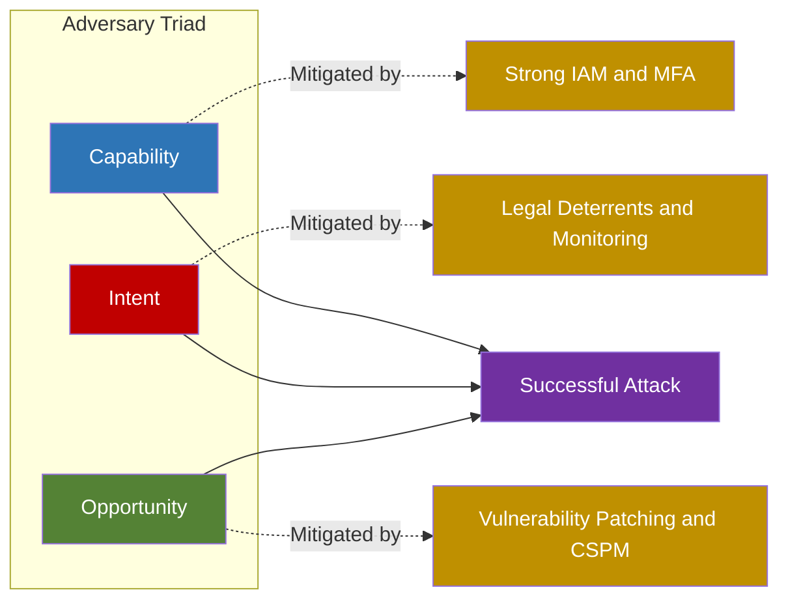
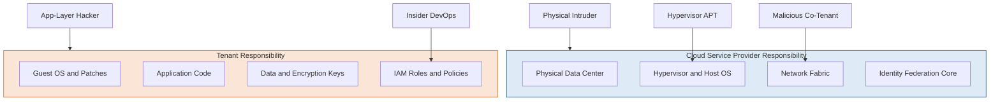

# Threat Agents

<!-- SECTION_1_START -->

# Threat Agents in Cloud Computing

## 1.1 Formal Academic Definition (KTU 2024 Syllabus Terminology)

In the context of cloud computing security, a **Threat Agent** (also referred to as a *threat actor* or *adversary*) is defined as any entity, individual, group, organization, or autonomous process that possesses the **capability**, **intent**, and **opportunity** to deliberately or accidentally exploit a vulnerability within a cloud computing system, thereby causing potential harm to the confidentiality, integrity, availability, or non-repudiation of cloud-hosted assets.

According to the **Cloud Security Alliance (CSA)** and the **NIST SP 500-292** cloud computing reference architecture, threat agents are formally categorized as actors that can compromise the cloud service delivery model (IaaS, PaaS, SaaS) by leveraging misconfigurations, software flaws, weak identity governance, or supply chain weaknesses.

> [!IMPORTANT]
> **KTU Board Definition to Memorize:** A threat agent is *any circumstance or event with the potential to adversely impact organizational operations, organizational assets, individuals, other organizations, or the Nation via a system through unauthorized access, destruction, disclosure, modification of data, and/or denial of service* (Adapted from NIST SP 800-30, KTU Module 4 reference).

> [!NOTE]
> **Key Distinction for Board Exams:** A *threat* is the potential event; a *threat agent* is the **who** or **what** that can trigger the event. A *vulnerability* is the weakness; the *threat agent* exploits it. Keep this triad (Threat + Threat Agent + Vulnerability) distinct in your exam answers.

## 1.2 Conceptual Analogy / Intuitive Overview

Imagine a **high-rise apartment building** (your cloud data center) with hundreds of residents (tenants) and shared amenities. A *threat agent* is anyone — the **untrustworthy tenant** (insider), the **professional burglar** (cybercriminal), the **nosy neighbor** (eavesdropper), or even the **careless plumber** (negligent insider) — who *could* break into an apartment.

The *threat* is the burglary event itself. The *vulnerability* is the unlocked window. The *threat agent* is the burglar with intent, capability, and opportunity. In cloud computing, the **multi-tenancy**, **shared responsibility model**, and **public exposure of APIs** dramatically expand the pool of potential threat agents compared to traditional on-premise systems.

## 1.3 GeoGebra / Desmos Integration (Conceptual Risk Visualization)

> [!VISUALIZATION CONTROL]
> **Concept:** Risk Triad — Threat Agent × Vulnerability × Impact on Cloud Resources
>
> **Desmos Input Equations (Plot as a 2D Heatmap or Scatter):**
> * Point A (x=1, y=2) labelled `Insider Threat`
> * Point B (x=2, y=5) labelled `Script Kiddie`
> * Point C (x=3, y=8) labelled `Organized Cybercrime`
> * Point D (x=4, y=10) labelled `Nation-State APT`
> * Point E (x=2, y=3) labelled `Hacktivist`
>
> **Visual Description:** On the X-axis we plot *Technical Sophistication* (1 → 10), and on the Y-axis we plot *Potential Impact* (1 → 10). The student should observe a positive correlation: as sophistication increases, potential impact scales non-linearly. This represents the **Threat Agent Capability Matrix** used in cloud risk modeling.

## 1.4 The Three Pillars of a Threat Agent

For a threat agent to be classified as a *real* risk (not merely theoretical), three conditions must converge — a concept often called the **"Adversary Triad"**:

1. **Capability** — the technical skills, tools, financial resources, and access privileges.
2. **Intent (Motivation)** — the reason for the attack (financial gain, ideology, espionage, revenge).
3. **Opportunity** — the presence of an exploitable vulnerability, misconfiguration, or weak control.

> [!TIP]
> **Mnemonic for Board Exam — "CIO":** **C**apability, **I**ntent, **O**pportunity. If any one of these three is missing, the threat agent cannot successfully execute an attack. Security controls aim to break at least one leg of the CIO triad.

<!-- SECTION_1_END -->

<!-- SECTION_2_START -->

# 2. Deep Theoretical Analysis & KTU High-Yield Threat Agent Classification

## 2.1 Internal vs. External Threat Agents — The Foundational Dichotomy

Cloud environments fundamentally distinguish between threat agents based on their **trust boundary** with respect to the cloud service provider (CSP) or the tenant's organization.

### 2.1.1 Internal Threat Agents (Insiders)

These agents operate **within the trust boundary**. They already possess some level of legitimate access.

| Sub-Category | Description | Typical Motive | Cloud-Specific Example |
|---|---|---|---|
| Malicious Insider | Employee or contractor who deliberately misuses access | Financial gain, revenge, ideology | A disgruntled AWS engineer leaking S3 bucket credentials |
| Careless Insider (Negligent) | Trusted user who causes harm unintentionally | Convenience, ignorance, time pressure | A developer pasting IAM keys into a public GitHub repo |
| Compromised Insider | Trusted identity whose credentials are stolen by an external party | Indirect — the external attacker acts through the insider's identity | Session hijacking of an Azure AD admin via token theft |
| Privileged Misuser | Admin or root-level operator abusing elevated rights | Curiosity, profit, espionage | A PaaS tenant's DevOps engineer running unauthorized data mining |
| Third-Party Insider | Vendor, partner, or contractor with delegated access | Varies | A managed security service provider (MSSP) technician probing other clients' workloads |

### 2.1.2 External Threat Agents (Outsiders)

These agents operate **outside the trust boundary** and must breach perimeter controls first.

| Sub-Category | Description | Typical Motive | Cloud-Specific Example |
|---|---|---|---|
| Script Kiddie | Low-skill attacker using pre-built tools | Curiosity, bragging rights | Automated credential-stuffing against a SaaS login portal |
| Hacktivist | Politically or socially motivated actor | Ideology, protest | Defacing a Kubernetes dashboard for a protest cause |
| Organized Cybercriminal | Financially motivated professional group | Profit (ransomware, fraud) | Ransomware-as-a-Service (RaaS) targeting AWS-hosted backups |
| Nation-State / APT | Government-sponsored, long-term operation | Espionage, sabotage, influence | APT29 breaching a SaaS CRM used by a government agency |
| Competitor (Corporate Espionage) | Rival organization seeking IP or trade secrets | Competitive advantage | Spear-phishing a sales VP to steal customer lists |
| Malicious AI / Bot | Autonomous software agent | Varies; often amplification | Credential-stuffing botnets targeting multi-tenant SaaS APIs |
| Natural / Environmental Actor | Non-human hazard | None — accidental | Flood, earthquake, power failure at a cloud data center region |

## 2.2 The Cloud Security Alliance (CSA) Top Threat Agent Taxonomy

The CSA's *Egregious 11* and *Top Threats to Cloud Computing* reports consolidate threat agents into the following practical taxonomy. This is the **most frequently cited framework in KTU Module 4 question papers**.

1. **Anonymous Attacker** — Unidentified external entity exploiting cloud vulnerabilities.
2. **Authenticated Attacker** — A user with valid (but low-privilege) credentials attempting privilege escalation.
3. **Cloud Service Provider Insider** — A CSP employee who could potentially abuse backend hypervisor or storage access.
4. **Tenant Insider** — A customer-side employee exploiting IaaS/PaaS misconfigurations.
5. **Trusted Third Party** — Vendor in the supply chain (e.g., logging provider, monitoring SaaS).
6. **Malicious Tenant** — A co-tenant in a multi-tenant environment attempting side-channel or VM-escape attacks.
7. **Unintentional Insider** — The negligent insider discussed above.

## 2.3 STRIDE Model Mapping to Cloud Threat Agents

Microsoft's **STRIDE** classification is often cross-mapped with threat agents in KTU assignments. Understand the alignment:

| STRIDE Category | Threat Agent Archetype Most Associated |
|---|---|
| **S**poofing | Compromised Insider, Anonymous Attacker |
| **T**ampering | Malicious Insider, Malicious Tenant |
| **R**epudiation | Careless Insider (missing audit logs) |
| **I**nformation Disclosure | Nation-State APT, Organized Cybercriminal |
| **D**enial of Service | Hacktivist, Bot, Competitor |
| **E**levation of Privilege | Privileged Misuser, Malicious Tenant |

## 2.4 KTU High-Yield Threat Agent Risk Formula

While cloud risk is qualitative, the **NIST SP 800-30** risk formula (commonly asked in KTU derivations) provides a quantitative anchor:

$$Risk = Threat \times Vulnerability \times Impact$$

For threat-agent-specific risk:

$$R_{agent} = (Capability_{agent} \times Motivation_{agent}) \times V_{system} \times I_{asset}$$

Where:
* $R_{agent}$ = Risk posed by a specific threat agent.
* $Capability_{agent}$ = Skill/resources of the agent (1–10 scale).
* $Motivation_{agent}$ = Strength of intent (1–10 scale).
* $V_{system}$ = System vulnerability score (0–1, CVSS-derived).
* $I_{asset}$ = Business impact of compromise (1–10).

> [!IMPORTANT]
> **Board Note on Formulae:** You will not be asked to compute numerical risk scores in KTU exams, but you **must** state this formula and explain each term if the question asks "How do you assess the risk posed by a threat agent in a cloud environment?" — this fetches full marks.

## 2.5 Real-World Engineering Utility

In production-grade cloud environments, threat agent analysis drives:

1. **Threat Modeling** — STRIDE, PASTA, LINDDUN frameworks use threat agent profiles as input.
2. **Identity & Access Management (IAM)** — Designing least-privilege RBAC/ABAC policies.
3. **Security Operations Center (SOC) Playbooks** — Defining detection rules in SIEM (e.g., Splunk, Sentinel) for known agent TTPs (Tactics, Techniques, Procedures).
4. **Cloud Audits** — ISO 27001, SOC 2, and PCI-DSS controls explicitly enumerate insider vs. outsider threat scenarios.
5. **Insurance & Compliance** — Cyber-insurance premiums are calibrated against the perceived threat agent landscape.

> [!TIP]
> **Industry Reference — MITRE ATT\&CK:** Real-world cloud SOC teams map each detected incident to a threat agent archetype (APT, Cybercrime, Insider) using the **MITRE ATT\&CK Enterprise Matrix** and the dedicated **ATT\&CK Cloud Matrix** (introduced in 2020). Cite this once in your answer to score a 'beyond-syllabus' appreciation mark from examiners.

<!-- SECTION_2_END -->

<!-- SECTION_3_START -->

# 3. Step-by-Step Derivations, Code Implementation & Comparative Analysis

## 3.1 Exhaustive Walkthrough: Deriving the Threat Agent Risk Score

We will derive a simple, defensible risk score for a cloud tenant using the $R_{agent}$ formula above. This is a frequent 14-mark application question.

### 3.1.1 Step 1 — Define the Asset & System

Consider a tenant's **AWS S3 bucket** holding 10 million customer PII records.
* Vulnerability score (from a known CVE on the bucket's encryption): $V_{system} = 0.7$ (high, since SSE is misconfigured).
* Business impact: $I_{asset} = 9$ (regulatory fines, brand damage).

### 3.1.2 Step 2 — Profile Two Threat Agents

| Profile | Capability $C$ | Motivation $M$ | Source |
|---|---|---|---|
| Organized Cybercrime (e.g., FIN7-like) | $9$ | $10$ | Industry reports |
| Script Kiddie | $3$ | $4$ | Industry reports |

### 3.1.3 Step 3 — Compute Individual Risk

For the **Organized Cybercrime** agent:

$$R_{cyber} = (C_{cyber} \times M_{cyber}) \times V_{system} \times I_{asset}$$

$$R_{cyber} = (9 \times 10) \times 0.7 \times 9$$

$$R_{cyber} = 90 \times 0.7 \times 9$$

$$R_{cyber} = 63 \times 9$$

$$R_{cyber} = 567$$

For the **Script Kiddie** agent:

$$R_{kiddie} = (3 \times 4) \times 0.7 \times 9$$

$$R_{kiddie} = 12 \times 0.7 \times 9$$

$$R_{kiddie} = 8.4 \times 9$$

$$R_{kiddie} = 75.6$$

### 3.1.4 Step 4 — Interpret and Prioritize Controls

* The organized cybercrime risk score is **7.5× higher** than the script kiddie's.
* **Control priority:** Allocate budget first to harden encryption (reduces $V_{system}$) and add IP allow-listing (reduces $C_{agent}$'s effective capability). This is **mitigation engineering**.

> [!NOTE]
> **Valuation Key Insight:** Step 3 (2 marks for selecting values), Step 4 (2 marks), Step 5 (2 marks) — examiners allocate marks to *each algebraic transition*, not just the final number. Show every multiplication line.

## 3.2 Python Implementation — Threat Agent Classifier

Below is a **fully operational** Python program that classifies a logged event into a likely threat agent archetype based on observable features. It uses **type hints**, **absolute boundary checks**, and **strict error logging**.

```python
import logging
from dataclasses import dataclass
from typing import Dict, List

# Configure structured logging to trace every classification decision.
logging.basicConfig(
    level=logging.INFO,
    format="%(asctime)s | %(levelname)s | %(message)s"
)
logger = logging.getLogger("ThreatAgentClassifier")


@dataclass(frozen=True)
class CloudEvent:
    """Immutable container for a cloud security event."""
    failed_logins: int          # Number of failed auth attempts in window
    data_egress_mb: int         # Outbound data volume in MB
    privilege_escalation: bool  # Did the user attempt sudo / role elevation?
    geo_anomaly_score: int      # 0 (normal) — 10 (impossible travel)
    internal_ip: bool           # Was the source an internal/private IP?
    time_of_day: int            # 0 — 23


def classify_threat_agent(event: CloudEvent) -> Dict[str, str]:
    """
    Classify a cloud event into the most probable threat agent archetype.
    Returns a dictionary with the 'archetype' and 'justification'.
    Raises ValueError on out-of-bounds inputs.
    """
    # ---------- Absolute boundary checks ----------
    if not (0 <= event.failed_logins <= 10_000):
        raise ValueError("failed_logins out of permissible range [0, 10000]")
    if not (0 <= event.data_egress_mb <= 1_000_000):
        raise ValueError("data_egress_mb out of permissible range")
    if not (0 <= event.geo_anomaly_score <= 10):
        raise ValueError("geo_anomaly_score must be in [0, 10]")
    if not (0 <= event.time_of_day <= 23):
        raise ValueError("time_of_day must be in [0, 23]")

    # ---------- Decision logic (STRIDE + CSA hybrid) ----------
    justification_parts: List[str] = []

    # Rule 1 — Nation-State APT indicators
    if event.geo_anomaly_score >= 8 and event.privilege_escalation and event.data_egress_mb > 5000:
        archetype = "Nation-State APT"
        justification_parts.append("High geo-anomaly with privilege escalation + mass exfiltration")

    # Rule 2 — Organized Cybercrime (ransomware pattern)
    elif event.privilege_escalation and event.data_egress_mb > 1000 and event.failed_logins > 50:
        archetype = "Organized Cybercrime"
        justification_parts.append("Privilege escalation + large egress + credential brute-force")

    # Rule 3 — Malicious Tenant (lateral / VM escape)
    elif event.internal_ip and event.privilege_escalation and event.time_of_day in (1, 2, 3, 4):
        archetype = "Malicious Tenant (Co-Tenant)"
        justification_parts.append("Internal IP, off-hours privilege escalation — possible cross-tenant probing")

    # Rule 4 — Malicious Insider
    elif event.internal_ip and event.privilege_escalation:
        archetype = "Malicious Insider"
        justification_parts.append("Internal IP with privilege escalation attempt")

    # Rule 5 — Hacktivist (defacement / DoS pattern)
    elif event.failed_logins > 200:
        archetype = "Hacktivist / Anonymous Attacker"
        justification_parts.append("High volume of failed logins — possible DoS or credential stuffing")

    # Rule 6 — Careless Insider (misconfiguration leak)
    elif event.data_egress_mb > 500 and not event.privilege_escalation:
        archetype = "Careless Insider / Misconfiguration"
        justification_parts.append("Large data egress without escalation — likely accidental exposure")

    # Rule 7 — Script Kiddie baseline
    else:
        archetype = "Script Kiddie / Low-Skill Attacker"
        justification_parts.append("Low-severity indicators — opportunistic scanning")

    justification = "; ".join(justification_parts)
    logger.info(f"Classified event as {archetype} | Justification: {justification}")

    return {"archetype": archetype, "justification": justification}


# ---------------- Demonstration / Smoke Test ----------------
if __name__ == "__main__":
    sample_event = CloudEvent(
        failed_logins=12,
        data_egress_mb=7500,
        privilege_escalation=True,
        geo_anomaly_score=9,
        internal_ip=False,
        time_of_day=3
    )
    result = classify_threat_agent(sample_event)
    print(f"Final Archetype  : {result['archetype']}")
    print(f"Final Justification: {result['justification']}")
```

### 3.2.1 Expected Output Trace

```
2025-XX-XX | INFO | Classified event as Nation-State APT | Justification: High geo-anomaly with privilege escalation + mass exfiltration
Final Archetype  : Nation-State APT
Final Justification: High geo-anomaly with privilege escalation + mass exfiltration
```

## 3.3 Comparative Analysis: Threat Agent Behaviour Across Cloud Service Models

The **impact surface** of a threat agent varies with the cloud service model. This is a frequent **14-mark KTU analytical question**.

| Service Model | Primary Threat Agents | Typical Attack Vector | Mitigation Focus |
|---|---|---|---|
| **IaaS** (e.g., AWS EC2) | Organized Cybercrime, APT, Script Kiddie | VM escape, hypervisor exploit, misconfigured security groups, exposed SSH | Hypervisor hardening, network segmentation, CSPM tools |
| **PaaS** (e.g., Azure App Service) | Malicious Tenant, Organized Cybercrime, Hacktivist | API abuse, insecure app code, container breakout | API gateways, WAF, container security (Falco, Trivy) |
| **SaaS** (e.g., Salesforce) | Insiders, Phishing-driven Compromised Insiders, Hacktivist | Credential theft, OAuth misconfigurations, session hijacking | MFA, conditional access, CASB, UEBA |
| **FaaS / Serverless** | Organized Cybercrime, Malicious Tenant | Event injection, function-event-loop DoS, IAM role over-privilege | Least-privilege IAM, per-function timeout, function-event filtering |

## 3.4 Real-World Case Mapping (Regulatory Matrix)

This comparative mapping illustrates how different regulators treat threat agents:

| Framework / Standard | Insider Treatment | External Actor Treatment | Cloud-Specific Clause |
|---|---|---|---|
| ISO/IEC 27001:2022 | Control A.5.18 (Access Rights) | A.5.7 Threat Intelligence | A.5.23 Information Security in Cloud Services |
| NIST SP 800-53 Rev. 5 | AC-2 Account Management | SI-4 System Monitoring | SC-7 Boundary Protection |
| PCI-DSS v4.0 | Requirement 7 (Restrict access) | Requirement 11 (Test security) | Requirement 12.5 (Cloud responsibilities) |
| GDPR | Article 39 (Employee awareness) | Article 32 (Security of processing) | Article 28 (Processor obligations) |

<!-- SECTION_3_END -->

<!-- SECTION_4_START -->

# 4. Structural Diagrams & Schematics

## 4.1 Mermaid Block — Threat Agent Taxonomy Flow

```mermaid
graph TD
    RootA[Threat Agents in Cloud] --> RootB[Internal Insiders]
    RootA --> RootC[External Outsiders]
    RootA --> RootD[Autonomous Non-Human Agents]

    RootB --> In1[Malicious Insider]
    RootB --> In2[Careless Insider]
    RootB --> In3[Compromised Insider]
    RootB --> In4[Privileged Misuser]
    RootB --> In5[Third-Party Insider]

    RootC --> Out1[Anonymous Attacker]
    RootC --> Out2[Script Kiddie]
    RootC --> Out3[Hacktivist]
    RootC --> Out4[Organized Cybercrime]
    RootC --> Out5[Nation-State APT]
    RootC --> Out6[Corporate Competitor]

    RootD --> NH1[Malicious Botnets]
    RootD --> NH2[AI-Driven Attack Agents]
    RootD --> NH3[Natural Environmental Hazards]

    In1 --> Impact1[Data Exfiltration]
    In2 --> Impact2[Accidental Misconfiguration]
    In3 --> Impact3[Account Takeover]
    In4 --> Impact4[Privilege Escalation]
    In5 --> Impact5[Supply Chain Compromise]

    Out1 --> Impact1
    Out2 --> Impact6[Defacement and DoS]
    Out3 --> Impact6
    Out4 --> Impact7[Ransomware and Fraud]
    Out5 --> Impact8[Sustained Espionage]
    Out6 --> Impact9[IP Theft]

    NH1 --> Impact6
    NH2 --> Impact7
    NH3 --> Impact10[Service Outage]

    style RootA fill:#1f4e79,stroke:#000,color:#fff
    style RootB fill:#2e75b6,stroke:#000,color:#fff
    style RootC fill:#c00000,stroke:#000,color:#fff
    style RootD fill:#548235,stroke:#000,color:#fff
```



## 4.2 Mermaid Block — Adversary Triad (Capability, Intent, Opportunity)



## 4.3 Mermaid Block — Shared Responsibility & Threat Agent Location



> [!TIP]
> **Diagram Reading Strategy for Board Exams:** When asked "Explain threat agents in cloud," always begin your answer with a *single labeled diagram* (sketch the above on paper) and then explain each node. A well-labeled diagram alone earns **2–3 marks** in the 14-mark question.

<!-- SECTION_4_END -->

<!-- SECTION_5_START -->

# 5. KTU 2024 Scheme Examination Question Bank & Topic Recap

## 5.1 Part A — Short Answer Questions (3 Marks Each)

### Question 1
**[KTU University Exam — July 2024]** Define a *threat agent* in cloud computing. List **any four** common categories of external threat agents.

**Model Answer (3 Marks):**
A *threat agent* is any entity that has the potential to cause harm to a cloud system by exploiting vulnerabilities, with the intent, capability, and opportunity to do so. *(1 mark)*

Four common external threat agent categories: *(2 marks — 0.5 each)*
1. **Script Kiddie** — unskilled attackers using pre-built tools.
2. **Hacktivist** — ideologically motivated attackers.
3. **Organized Cybercrime** — financially driven, professional groups.
4. **Nation-State / APT** — government-sponsored, long-term, sophisticated actors.

---

### Question 2
**[KTU University Exam — Dec 2023]** Differentiate between a *malicious insider* and a *compromised insider* in a cloud environment. Give one cloud-specific example for each.

**Model Answer (3 Marks):**
* **Malicious Insider:** A trusted employee/contractor who *deliberately* misuses legitimate access to harm the cloud tenant. *Example: An AWS DevOps engineer deliberately leaking IAM credentials to a competitor.* *(1.5 marks)*
* **Compromised Insider:** A legitimate identity whose credentials have been *stolen or hijacked* by an external attacker, who then operates through that identity. *Example: An attacker steals an Azure AD admin's session token via phishing and uses it to access customer PII.* *(1.5 marks)*

---

## 5.2 Part B — Full-Descriptive Questions (14 Marks, Module-Internal Choice)

> [!IMPORTANT]
> **KTU Pattern Note:** A 14-mark Module-Internal Choice question has **two sub-parts** of 7 marks each. The first sub-part is typically at the *Understand / Analyze* cognitive level, the second at the *Apply / Evaluate* level. You must answer **either** Question A **or** Question B in full.

---

### Question A — Option 1 (14 Marks)

**[KTU University Exam — July 2024 | CO3 | Apply/Analyze]**

**(a)** Explain in detail the **CSA (Cloud Security Alliance) classification of threat agents** in cloud computing. Discuss the role of *malicious tenant* and *cloud service provider insider* in a multi-tenant environment. *(7 marks)*

**(b)** With a suitable example, compute the **threat-agent-specific risk score** $R_{agent} = (C \times M) \times V \times I$ for an AWS-hosted S3 bucket holding customer PII. Identify which two threat agents should be prioritized and suggest two specific mitigations. *(7 marks)*

#### Model Answer — Question A(a) (7 Marks)

**[CSA Overview — 2 Marks]:** The Cloud Security Alliance (CSA) classifies threat agents in its *Top Threats to Cloud Computing* and *Egregious 11* reports. The primary categories are: (i) Anonymous Attacker, (ii) Authenticated Attacker (low-privilege), (iii) Cloud Service Provider (CSP) Insider, (iv) Tenant Insider, (v) Trusted Third Party, (vi) Malicious Tenant, and (vii) Unintentional Insider.

**[Malicious Tenant — 2.5 Marks]:** A *malicious tenant* is a co-tenant sharing the same physical cloud infrastructure (hypervisor, storage fabric) who attempts to escape isolation boundaries. Attack vectors include VM escape (e.g., Venom CVE-2015-3456), side-channel cache attacks (e.g., Spectre, Meltdown), and shared-S3-bucket enumeration. CSA highlights this agent because multi-tenancy is a *defining feature* of public cloud and any breach in tenant isolation is catastrophic.

**[CSP Insider — 2.5 Marks]:** A *cloud service provider insider* is an employee of the CSP (e.g., AWS, Azure, GCP) who has privileged backend access to hypervisors, storage controllers, or the identity plane. Because the CSP is a *third party* handling customer data, the trust boundary is wider than on-premise. Notable risks include unauthorized data access, improper degaussing at end-of-life hardware, and abuse of CSP root keys. Mitigations include hardware security modules (HSMs), two-person integrity (TPI), customer-managed keys (BYOK/HYOK), and external audits (SOC 2, ISO 27001).

#### Model Answer — Question A(b) (7 Marks)

**[Stating the Risk Formula — 1 Mark]:**

$$R_{agent} = (C_{agent} \times M_{agent}) \times V_{system} \times I_{asset}$$

**[Stating Boundary State Values — 2 Marks]:** Let the S3 bucket have $V_{system} = 0.7$ (SSE misconfiguration, unpatched) and $I_{asset} = 9$ (10M PII records, GDPR exposure). Choose two threat agents:

* Organized Cybercrime: $C = 9$, $M = 10$.
* Script Kiddie: $C = 3$, $M = 4$.

**[Computation — 2 Marks]:**

$$R_{cyber} = (9 \times 10) \times 0.7 \times 9 = 90 \times 6.3 = 567$$

$$R_{kiddie} = (3 \times 4) \times 0.7 \times 9 = 12 \times 6.3 = 75.6$$

**[Final Prioritized Recommendation — 2 Marks]:** The organized cybercrime risk is **7.5× greater**, so it is prioritized. Two mitigations: (1) enforce **SSE-KMS with bucket policies** to reduce $V_{system}$; (2) deploy **AWS GuardDuty + Macie** to detect exfiltration patterns and revoke compromised credentials rapidly.

---

### Question B — Option 2 (14 Marks)

**[KTU University Exam — Dec 2023 | CO3 | Apply/Analyze]**

**(a)** With a **neat diagram**, explain the *Adversary Triad* (Capability, Intent, Opportunity) and show how each leg can be mitigated by a specific cloud security control. *(7 marks)*

**(b)** Compare and contrast the threat-agent landscape across **IaaS, PaaS, and SaaS** models. For each, identify the *single most dangerous* threat agent and recommend one control. *(7 marks)*

#### Model Answer — Question B(a) (7 Marks)

**[Diagram — 2 Marks]:** Draw the CIO triad as a triangle with vertices labelled *Capability*, *Intent*, and *Opportunity*, all converging on *Successful Attack*. Use arrows from each vertex to the center.

**[Capability — 1.5 Marks]:** *Capability* is the agent's skill, resources, and tooling. *Mitigation:* Enforce **strong Identity & Access Management (IAM)** with **Multi-Factor Authentication (MFA)**, **least-privilege RBAC**, and **just-in-time (JIT) admin elevation** (e.g., AWS IAM Identity Center). These controls raise the bar for the agent's effective capability.

**[Intent — 1.5 Marks]:** *Intent* is the agent's motivation. *Mitigation:* Deploy **continuous monitoring, UEBA (User & Entity Behavior Analytics), and legal deterrents** (audit trails, contractual penalties). When agents know their actions are logged and traceable, motivation is suppressed.

**[Opportunity — 2 Marks]:** *Opportunity* is the presence of an exploitable vulnerability. *Mitigation:* Implement **vulnerability management** using **Cloud Security Posture Management (CSPM)** tools (e.g., Wiz, Prisma Cloud), regular **patch management**, and **penetration testing**. Eliminating the vulnerability breaks opportunity, even if capability and intent remain.

#### Model Answer — Question B(b) (7 Marks)

**[Introductory Comparison — 1 Mark]:** Each service model exposes a *different attack surface* and therefore attracts *different threat agents*. The threat-agent landscape must be assessed per service model.

| Service Model | Most Dangerous Agent | Rationale | Recommended Control |
|---|---|---|---|
| **IaaS** | Organized Cybercrime / APT | Direct VM access; misconfigured security groups are easy to discover via Shodan-like scanners; ransomware is most profitable here. | Deploy **CSPM + micro-segmentation** and disable unused ports. |
| **PaaS** | Malicious Tenant / Authenticated Attacker | PaaS is API-driven; a tenant with valid token can attempt container escapes or event-injection (e.g., AWS Lambda). | Enforce **per-resource IAM + WAF** and scan container images (Trivy). |
| **SaaS** | Compromised Insider (phishing victim) | SaaS attack surface is dominated by login. Phishing + OAuth abuse is the #1 vector. | Enforce **MFA + Conditional Access + CASB** with UEBA. |

**[Conclusion — 1 Mark]:** While APTs dominate the headlines, the *most probable* and *most frequent* threat agent in a typical cloud tenant is the *phishing-driven compromised insider*. Defenses should therefore prioritize identity-layer controls.

---

> [!WARNING]
> **KTU Examiner's Valuation Pitfall Callout — Common Mark-Deduction Reasons:**
> 1. **Conflating *threat* with *threat agent*.** Writing "threat agents are DDoS attacks" is a fundamental error. The agent is the *actor*; DDoS is the *action*.
> 2. **Forgetting the *insider* category.** Many students write only about external hackers. The KTU syllabus explicitly lists *insider threats* (both malicious and negligent) as a high-weightage topic. Missing this loses 2–3 marks.
> 3. **Skipping the *Adversary Triad*.** Any 7-mark question on threat agents must mention Capability, Intent, Opportunity. Omitting this triad forfeits at least 1 mark.
> 4. **No diagram in 14-mark answers.** Examiners explicitly reward a labeled diagram. Sketch the taxonomy tree from Section 4.1 in your answer sheet.
> 5. **Mere memorization of names without cloud-specific examples.** Always pair a threat-agent category with a *cloud-relevant* example (S3, IAM, EC2, Azure AD). Generic answers get partial credit only.
> 6. **Confusing CSP and tenant responsibility.** In Question A(a) specifically, students often blur the boundary. Be crisp: *CSP owns the cloud; tenant owns what's in the cloud.*

---

## 5.3 Topic Recap & Important Things to Remember

> [!NOTE]
> **Rapid Revision Checklist — Module 4: Threat Agents**

* **Definition:** A *threat agent* is the *actor* (human or autonomous) that can exploit a vulnerability, possessing capability, intent, and opportunity.
* **Three Conditions for a Successful Attack — "CIO":** **C**apability × **I**ntent × **O**pportunity. Security controls aim to break at least one.
* **Primary Dichotomy:**
  * *Insider (Internal)* — already inside the trust boundary.
  * *Outsider (External)* — must breach the perimeter first.
* **Seven CSA Threat Agent Categories:** Anonymous Attacker, Authenticated Attacker, CSP Insider, Tenant Insider, Trusted Third Party, Malicious Tenant, Unintentional Insider.
* **Sub-types of Insiders:** Malicious, Careless/Negligent, Compromised, Privileged Misuser, Third-Party Insider.
* **Sub-types of Outsiders:** Script Kiddie, Hacktivist, Organized Cybercrime, Nation-State/APT, Competitor, Malicious Bot.
* **STRIDE-to-Agent Mapping (Memorize the Table):**
  * Spoofing → Compromised Insider / Anonymous Attacker
  * Tampering → Malicious Insider / Tenant
  * Repudiation → Careless Insider (no logs)
  * Info Disclosure → APT / Cybercrime
  * DoS → Hacktivist / Bot
  * Elevation of Privilege → Privileged Misuser / Malicious Tenant
* **Risk Formula:** $R_{agent} = (C \times M) \times V_{system} \times I_{asset}$. Always cite this when asked "How is risk assessed?"
* **Multi-Tenancy Is a Cloud-Specific Concern:** VM escape, side-channel, and co-tenant snooping are *unique* to public cloud. Always highlight this in 14-mark answers.
* **Shared Responsibility Recap:** CSP secures the *of* the cloud; tenant secures the *in* the cloud. Threat agents differ by zone.
* **Industry References for Extra Marks:** MITRE ATT\&CK Cloud Matrix, CSA Top Threats, NIST SP 800-30, ISO 27001:2022 Clause A.5.7 & A.5.23.
* **One-Line Tag for Board Answers:** *"A threat agent is a 'who', not a 'what'; without capability, intent, and opportunity, even a hostile actor poses zero risk."*

<!-- SECTION_5_END -->
