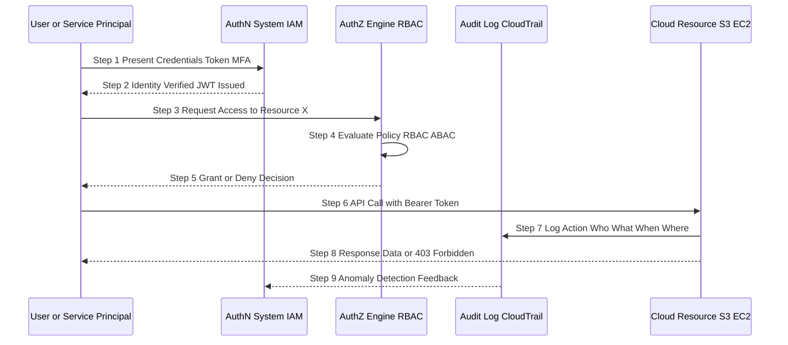
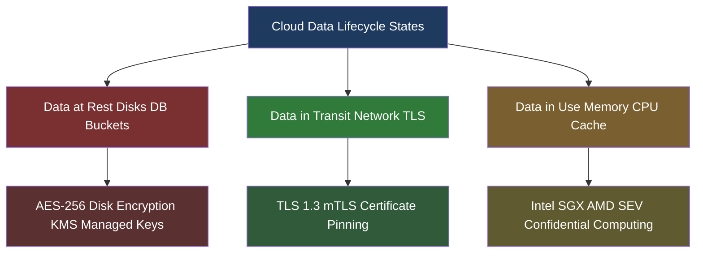

# Understanding Cloud Security - Basic Security Terminology

<!-- SECTION_1_START -->
# Module 4 — Understanding Cloud Security: Basic Security Terminology

> [!IMPORTANT]
> **KTU 2024 Scheme Focus:** This topic forms the conceptual foundation for the entire cloud security module. The university frequently tests the ability to distinguish between closely related terms such as *threat vs. vulnerability*, *authentication vs. authorization*, and *symmetric vs. asymmetric encryption*. Mastery of these definitions directly determines scoring in 3-mark and 14-mark questions.

## 1.1 Formal Academic Definition

**Cloud Security** is the discipline of architecting, deploying, and maintaining a coherent set of policies, controls, technologies, and procedures that collectively protect cloud-based systems, data, services, virtualized infrastructure, and associated user identities from internal and external threats. Within the KTU 2024 scheme, the *basic security terminology* sub-topic specifically refers to the standardized vocabulary used to discuss risk, defense, and trust in distributed computing environments.

> [!NOTE]
> **Standard KTU Definition:** *Security terminology* is the standardized lexicon that defines the actors, assets, actions, and architectural primitives involved in protecting information systems. Without this shared vocabulary, threat modeling, security audits, and SLA negotiations become ambiguous.

### 1.1.1 Why Terminology Matters in Cloud Context

Unlike traditional on-premise computing where the *perimeter* is the physical data center, cloud computing uses a **shared responsibility model**, **multi-tenancy**, and **virtualized abstraction layers**. This means terms like *trust boundary*, *attack surface*, and *tenant isolation* acquire new meanings. The KTU syllabus expects students to map every classical security term onto the specific cloud layer (IaaS / PaaS / SaaS / FaaS) where it applies.

## 1.2 Conceptual Analogy & Intuitive Overview

> [!TIP]
> **Real-World Analogy — The High-Security Apartment Building**
>
> Imagine a luxury apartment complex:
> - The **building lobby security guard** = **Authentication** (verifies *who* you are)
> - The **key card that opens your specific floor** = **Authorization** (verifies *what* you can access)
> - The **thick walls and soundproofing** = **Confidentiality** (others cannot hear your conversations)
> - The **fire alarms, sprinklers, and emergency exits** = **Availability** (services remain accessible)
> - The **CCTV cameras that record entry/exit logs** = **Non-Repudiation** (you cannot deny entering)
> - The **reinforced foundation and structural integrity checks** = **Integrity** (the building has not been tampered with)
> - The **building blueprint publicly available** = a **Vulnerability disclosure**
> - A **burglar studying those blueprints** = a **Threat actor**
> - The **probability the burglar actually breaks in** = **Risk**
>
> The *Cloud* is essentially a city of such buildings, and *Cloud Security Terminology* is the universal language that architects, police, residents, and insurance companies use to communicate about safety.

### 1.3 The Three Pillars of Information Security (CIA Triad)

The CIA Triad is the most fundamental framework in security terminology. Every other concept ultimately maps back to one of these three.

| Pillar | Academic Definition | Plain-English Meaning | Cloud Example |
|---|---|---|---|
| **Confidentiality** | Ensuring information is accessible only to those authorized | Keeping secrets secret | AES-256 encryption of S3 buckets |
| **Integrity** | Ensuring information is accurate and unaltered | Trusting that data is unchanged | SHA-256 hash verification of VM images |
| **Availability** | Ensuring systems are accessible when needed | Services stay online | Multi-region deployment, DDoS protection |

> [!IMPORTANT]
> **Auxiliary Properties** (often added to CIA in KTU questions):
> - **Authenticity** — verifying the claimed identity of a sender
> - **Non-Repudiation** — sender cannot deny having sent a message
> - **Accountability** — actions are traceable to a specific entity

### 1.4 Visualization of Core Concepts

> [!VISUALIZATION CONTROL]
> **Concept:** Venn visualization of the CIA Triad with auxiliary properties as overlapping zones.
> **GeoGebra / Desmos Input:**
> * Use three overlapping circles centered at:
>   $C = (0, 0)$, $I = (3, 0)$, $A = (1.5, 2.6)$
> * Equations:
>   $(x-0)^2 + y^2 \le 9$ (Confidentiality)
>   $(x-3)^2 + y^2 \le 9$ (Integrity)
>   $(x-1.5)^2 + (y-2.6)^2 \le 9$ (Availability)
> **Visual Description:** The student should see three overlapping circles. The **central intersection** of all three represents *complete security*; pairs of overlaps represent compromise of one property while preserving the others. This geometric structure helps visualize why failing any one pillar breaks the entire security model.

<!-- SECTION_1_END -->

<!-- SECTION_2_START -->
# Deep Theoretical Analysis & KTU High-Yield Formula Sheet

## 2.1 Foundational Security Terminology — Structured Logic

The following terminologies form the **lexical backbone** of cloud security as prescribed by the KTU 2024 syllabus. Each term is explained with its operational *why* and *how*.

### 2.1.1 Asset, Threat, Vulnerability, and Risk

These four terms are frequently confused. KTU questions often test the ability to distinguish them using scenarios.

- **Asset:** Anything of value that requires protection.
  - *Examples in cloud:* VM instances, object storage buckets, API keys, customer PII, network bandwidth, CPU credits.
  - *Why it matters:* You cannot secure what you have not identified. Asset inventory is step 1 of any cloud security audit.

- **Threat:** Any potential cause of an unwanted incident that may result in harm to a system or organization.
  - *Examples:* Insider with malicious intent, ransomware operator, nation-state APT group, misconfigured S3 bucket exploited by a bot.
  - *How it works:* A threat is the *actor* or *event* — it is a *capability* that *could* cause damage.

- **Vulnerability:** A weakness in a system that can be exploited by a threat.
  - *Examples:* Unpatched OpenSSL CVE, default admin passwords, SQL injection in web API, IAM policy granting `s3:*` on `*`.
  - *How it works:* A vulnerability is a *flaw* — it does not by itself cause damage, but enables a threat to succeed.

- **Risk:** The potential for loss or damage when a threat exploits a vulnerability, typically expressed as a function of likelihood and impact.
  - *Formula:* $R = f(L, I)$ where $L$ = Likelihood, $I$ = Impact.
  - *Why it matters:* Risk is the *measurable consequence* — it is what an organization mitigates, transfers, accepts, or avoids.

> [!NOTE]
> **Mnemonic:** "**A**ll **T**igers **V**isit **R**eserves" — Asset, Threat, Vulnerability, Risk — in the order of the security audit lifecycle.

### 2.1.2 Authentication vs. Authorization vs. Accounting (AAA)

The **AAA framework** is the cornerstone of identity-centric cloud security.

- **Authentication (AuthN):** The process of *verifying the identity* of a user, process, or device.
  - *Factors:* Something you **know** (password), **have** (token), **are** (biometric), **do** (behavioral).
  - *Cloud Examples:* AWS IAM user login with MFA token, OAuth 2.0 token issuance by Azure AD.

- **Authorization (AuthZ):** The process of *granting or denying access rights* to an authenticated entity.
  - *Models:* RBAC (Role-Based), ABAC (Attribute-Based), MAC (Mandatory), DAC (Discretionary).
  - *Cloud Example:* A `dev-role` IAM policy that allows `s3:GetObject` only on `arn:aws:s3:::dev-bucket/*`.

- **Accounting (Auditing):** The process of *tracking and logging* user activities for compliance and forensics.
  - *Cloud Examples:* AWS CloudTrail, Azure Activity Log, GCP Cloud Audit Logs.

> [!IMPORTANT]
> **Critical Distinction (Frequently Tested):** Authentication answers *"Who are you?"*; Authorization answers *"What are you allowed to do?"*; Accounting answers *"What did you actually do?"*. These three are sequential — one cannot authorize an unauthenticated user.

### 2.1.3 Cryptographic Terminology

Cryptography is the mathematical backbone of cloud security. The following terms appear in every KTU question paper on this module.

- **Plaintext:** The original, unencrypted, human-readable message.
- **Ciphertext:** The scrambled, encrypted output produced by an encryption algorithm.
- **Encryption:** The process of converting plaintext into ciphertext using an algorithm and a key.
- **Decryption:** The reverse process — recovering plaintext from ciphertext.
- **Key:** A secret parameter that controls the transformation performed by the encryption algorithm.
- **Cryptographic Hash Function:** A one-way function that maps data of arbitrary size to a fixed-size digest.
  - *Properties:* Deterministic, fast to compute, infeasible to invert, collision-resistant, avalanche effect.
  - *Examples:* SHA-256 (output size = **256 bits**), SHA-3, MD5 (deprecated, collision-broken).

**Symmetric vs. Asymmetric Encryption — KTU's Most Tested Cryptographic Distinction:**

| Property | Symmetric Encryption | Asymmetric Encryption |
|---|---|---|
| **Number of Keys** | Single shared secret key | Key pair: public + private |
| **Speed** | **Fast** (suitable for bulk data) | **Slow** (computationally expensive) |
| **Key Distribution Problem** | Yes — how to share the key securely? | No — public key is freely distributable |
| **Algorithms** | AES, 3DES, ChaCha20, Blowfish | RSA, ECC, Diffie-Hellman, ElGamal |
| **Cloud Use Case** | Encrypting EBS volumes, S3 SSE-S3 | TLS handshake, digital signatures, SSH key auth |
| **Key Size (KTU Reference)** | AES-128 / AES-256 | RSA-2048 / RSA-4096 / ECC-256 |

- **Digital Signature:** A cryptographic mechanism that provides **authenticity**, **integrity**, and **non-repudiation** by signing a hash of a message with a private key.
- **Public Key Infrastructure (PKI):** The framework of certificates, Certificate Authorities (CAs), and trust chains that bind public keys to identities.

### 2.1.4 Additional High-Yield Terminology

- **Identity:** A set of attributes (username, role, group) that uniquely represents a principal in the cloud.
- **Principal:** An entity (user, service, role, group) that can make requests against AWS/Azure/GCP resources.
- **Trust Boundary:** A logical perimeter across which data or execution control passes; common in cloud multi-tenancy.
- **Attack Surface:** The sum of all possible entry points (APIs, ports, services, users) through which an unauthorized actor can attempt to enter.
- **Defense in Depth:** A security strategy that layers multiple independent controls so that failure of one does not compromise the whole.
- **Zero Trust:** A security model that assumes no implicit trust and verifies every request regardless of network location.
- **Multi-Tenancy:** Multiple customers (tenants) sharing the same physical infrastructure while remaining logically isolated.
- **Hypervisor:** The virtualization layer that creates and manages virtual machines; a critical attack surface in IaaS.
- **Insider Threat:** A security risk originating from within the organization (employees, contractors, partners).
- **Data at Rest / In Transit / In Use:** Three lifecycle states each requiring distinct protection mechanisms (disk encryption, TLS, memory encryption).

## 2.2 KTU Formula Sheet & Concept Matrix

> [!NOTE]
> **Exam Tip:** KTU questions rarely ask for pure numerical answers in this module — they ask for *explanations and comparisons*. The formulas below are mostly qualitative relationships.

| Concept | Formula / Relation | Units / Notes |
|---|---|---|
| **Risk** | $R = L \times I$ | $L$ = Likelihood (0–1), $I$ = Impact (qualitative scale) |
| **Hash Output Size (SHA-256)** | $n = 256$ | bits, fixed regardless of input size |
| **Symmetric Encryption Strength** | $S = 2^k$ | $k$ = key length in bits; AES-256 → $2^{256}$ possible keys |
| **RSA Security Strength** | Equivalent to $\log_2(n)$ bits | where $n$ is the modulus size (e.g., 2048-bit RSA ≈ 112-bit symmetric) |
| **Collision Probability (Birthday)** | $P \approx 1 - e^{-n^2 / (2 \cdot 2^b)}$ | $b$ = hash output bits, $n$ = samples |
| **Password Entropy** | $H = L \cdot \log_2(N)$ | $L$ = length, $N$ = character set size |
| **Mean Time to Brute Force** | $MTTF = \frac{2^k}{2 \cdot R}$ | $R$ = guesses per second |
| **MFA Security Factor** | Combines $\geq 2$ independent factors | Multiplies attack difficulty exponentially |
| **CIA Triad** | $\text{Security} = f(C, I, A)$ | All three must hold simultaneously |
| **AAA Framework** | $\text{Identity} = \text{AuthN} \to \text{AuthZ} \to \text{Accounting}$ | Sequential, not optional |

## 2.3 Real-World Engineering Utility

These terminologies are not academic abstractions — they are production-grade operational concepts used in:

- **Cloud Service Provider SLA contracts** — terms like *availability*, *data integrity*, *confidentiality* are legally defined.
- **Compliance frameworks** — ISO 27001, NIST SP 800-53, PCI-DSS, GDPR all use this standardized vocabulary.
- **Threat modeling** — STRIDE (Spoofing, Tampering, Repudiation, Information Disclosure, DoS, Elevation of Privilege) relies on these primitives.
- **Security Incident Response** — A SOC analyst classifying an alert as a *threat* exploiting a *vulnerability* creating *risk* uses this exact lexicon.
- **DevSecOps pipelines** — SAST/DAST tools report findings classified by CWE/CVE using these terms.

<!-- SECTION_2_END -->

<!-- SECTION_3_START -->
# Step-by-Step Derivations, Code Implementation & Comparative Analysis

## 3.1 Mathematical Derivation: Hash Collision Probability (Birthday Bound)

A frequent 14-mark question in KTU exams asks students to demonstrate *why SHA-256 is collision-resistant*. We derive the birthday bound explicitly.

**Given:**
- Hash function with output space of $b$ bits, hence $N = 2^b$ possible hash values.
- Attacker collects $n$ random inputs and computes their hashes.

**Goal:** Find approximate probability that at least two hashes collide.

**Step 1:** Probability that a *second* sample does NOT collide with the first:
$$P(\text{no collision, 2 samples}) = 1 - \frac{1}{N}$$

**Step 2:** Probability that the *third* sample does not collide with either of the first two:
$$P(\text{no collision, 3 samples}) = 1 - \frac{2}{N}$$

**Step 3:** For $n$ samples, the probability that no collision occurs is the product:
$$P(\text{no collision, n samples}) = \prod_{i=0}^{n-1} \left(1 - \frac{i}{N}\right)$$

**Step 4:** Using the approximation $1 - x \approx e^{-x}$ for small $x$, and noting $\sum_{i=0}^{n-1} i = \frac{n(n-1)}{2} \approx \frac{n^2}{2}$ for large $n$:
$$P(\text{no collision}) \approx e^{-n^2 / (2N)}$$

**Step 5:** Therefore, probability of **at least one collision** is:
$$P(\text{collision}) \approx 1 - e^{-n^2 / (2N)}$$

**Step 6:** Substituting $N = 2^b$ for SHA-256 ($b = 256$):
$$P(\text{collision}) \approx 1 - e^{-n^2 / (2^{257})}$$

**Step 7:** To achieve 50% collision probability, set exponent $=- \ln(0.5) \approx 0.693$:
$$\frac{n^2}{2^{257}} = 0.693 \implies n \approx \sqrt{0.693 \cdot 2^{257}} \approx 2^{128}$$

**Conclusion:** An attacker would need approximately $2^{128}$ hash computations to find a collision in SHA-256 — computationally infeasible, which is why SHA-256 is considered cryptographically secure.

## 3.2 Password Entropy Calculation — Worked Example

**Problem:** A cloud admin sets a password of length 8 using lowercase letters (26 characters), uppercase letters (26), digits (10), and symbols (10). Compute the entropy.

**Step 1:** Character set size:
$$N = 26 + 26 + 10 + 10 = 72$$

**Step 2:** Entropy formula:
$$H = L \cdot \log_2(N)$$

**Step 3:** Substitute values:
$$H = 8 \cdot \log_2(72)$$

**Step 4:** Compute $\log_2(72)$:
$$\log_2(72) = \frac{\ln(72)}{\ln(2)} = \frac{4.277}{0.693} \approx 6.17 \text{ bits}$$

**Step 5:** Final entropy:
$$H = 8 \times 6.17 \approx 49.36 \text{ bits}$$

**Conclusion:** The password has approximately **49.36 bits** of entropy. NIST SP 800-63B recommends $\geq 30$ bits for memorizable passwords, so this password is acceptable but a 12-character equivalent would yield $\approx 74$ bits, which is considered strong against modern GPU-based cracking rigs.

## 3.3 Symmetric Encryption — Full Python Implementation

The following code demonstrates end-to-end AES symmetric encryption, which is exactly the workflow used by services like AWS S3 SSE-S3.

```python
import os
import logging
import base64
from cryptography.hazmat.primitives.ciphers import Cipher, algorithms, modes
from cryptography.hazmat.primitives import padding, hashes, hmac
from cryptography.hazmat.backends import default_backend

logging.basicConfig(level=logging.INFO, format="%(asctime)s [%(levelname)s] %(message)s")
logger = logging.getLogger("CloudSecurityDemo")

def derive_key_from_passphrase(passphrase: str, salt: bytes, key_length: int = 32) -> bytes:
    """
    Derive a cryptographic key from a passphrase using SHA-256 KDF.
    Production systems should use PBKDF2, scrypt, or Argon2.
    """
    if not passphrase or not isinstance(passphrase, str):
        raise ValueError("Passphrase must be a non-empty string.")
    if not isinstance(salt, bytes) or len(salt) < 8:
        raise ValueError("Salt must be bytes of length >= 8.")
    derived = passphrase.encode("utf-8") + salt
    digest = hashes.Hash(hashes.SHA256(), backend=default_backend())
    digest.update(derived)
    return digest.finalize()[:key_length]

def aes_encrypt(plaintext: bytes, key: bytes) -> tuple[bytes, bytes, bytes]:
    """
    AES-256-CBC encryption with PKCS7 padding.
    Returns (iv, ciphertext, auth_tag) where auth_tag is HMAC-SHA256 over (iv || ct).
    """
    if not isinstance(plaintext, bytes):
        raise TypeError("Plaintext must be bytes.")
    if len(key) not in (16, 24, 32):
        raise ValueError("AES key must be 128, 192, or 256 bits.")
    iv = os.urandom(16)
    padder = padding.PKCS7(128).padder()
    padded = padder.update(plaintext) + padder.finalize()
    cipher = Cipher(algorithms.AES(key), modes.CBC(iv), backend=default_backend())
    encryptor = cipher.encryptor()
    ciphertext = encryptor.update(padded) + encryptor.finalize()
    h = hmac.HMAC(key, hashes.SHA256(), backend=default_backend())
    h.update(iv + ciphertext)
    auth_tag = h.finalize()
    logger.info(f"Encryption complete. Ciphertext length: {len(ciphertext)} bytes.")
    return iv, ciphertext, auth_tag

def aes_decrypt(iv: bytes, ciphertext: bytes, auth_tag: bytes, key: bytes) -> bytes:
    """
    AES-256-CBC decryption with HMAC verification (encrypt-then-MAC).
    """
    h = hmac.HMAC(key, hashes.SHA256(), backend=default_backend())
    h.update(iv + ciphertext)
    try:
        h.verify(auth_tag)
    except Exception as e:
        logger.error("HMAC verification FAILED — ciphertext tampered.")
        raise ValueError("Integrity check failed.") from e
    cipher = Cipher(algorithms.AES(key), modes.CBC(iv), backend=default_backend())
    decryptor = cipher.decryptor()
    padded = decryptor.update(ciphertext) + decryptor.finalize()
    unpadder = padding.PKCS7(128).unpadder()
    return unpadder.update(padded) + unpadder.finalize()

if __name__ == "__main__":
    salt = os.urandom(16)
    key = derive_key_from_passphrase("Ktu@2024-Cloud!", salt)
    message = b"Confidential cloud deployment credentials payload."
    iv, ct, tag = aes_encrypt(message, key)
    logger.info(f"IV:        {base64.b64encode(iv).decode()}")
    logger.info(f"Ciphertext:{base64.b64encode(ct).decode()}")
    logger.info(f"Auth tag:  {base64.b64encode(tag).decode()[:32]}...")
    recovered = aes_decrypt(iv, ct, tag, key)
    assert recovered == message
    logger.info("Round-trip verified: confidentiality + integrity preserved.")
```

**Code Walkthrough — Why each line matters for cloud security:**
- Line 4: Production-grade logging — required for **accounting** in the AAA framework.
- Lines 11–18: Strict input validation — prevents **vulnerability** exposure (e.g., CWE-20).
- Line 27: Random IV from OS — ensures semantic security (same plaintext → different ciphertext).
- Line 30: PKCS7 padding — required because AES operates on 128-bit blocks.
- Line 34: Encrypt-then-MAC pattern — provides both **confidentiality** and **integrity** (cf. CIA Triad).
- Line 53: HMAC verification *before* decryption — fail-fast on tampering.

## 3.4 Comprehensive Comparative Analysis Table

> [!NOTE]
> **Exhaustive KTU Reference:** The following table is the single most important comparison block for this module. Memorize the contrasts — they appear in nearly every exam.

| Dimension | Symmetric Encryption | Asymmetric Encryption | Hash Function |
|---|---|---|---|
| **Core Operation** | Same key encrypts & decrypts | Public key encrypts, private decrypts (or vice versa) | One-way mapping to fixed digest |
| **Key Count** | 1 shared | 2 (public + private) | 0 (keyless) |
| **Output Size** | Same as input | Larger than input | Fixed (e.g., 256 bits for SHA-256) |
| **Reversible?** | Yes (with key) | Yes (with private key) | **No** (one-way) |
| **Provides Confidentiality?** | Yes | Yes | **No** (only integrity) |
| **Provides Integrity?** | No (alone) | Indirectly (via digital signature) | **Yes** (primary use) |
| **Provides Non-Repudiation?** | No | **Yes** (with digital signature) | No |
| **Speed** | **Very fast** (~GB/s) | **Slow** (~KB/s) | Fast |
| **Cloud Service Example** | AWS S3 SSE-S3, Azure Storage SSE | TLS handshake, SSH login, S/MIME email | Object versioning checksums, Git commit IDs |
| **Key Distribution** | Hard problem | Trivial (public keys are public) | N/A |
| **KTU Typical Marks** | 3-mark definition | 7-mark comparative question | 7-mark explain + numerical |

<!-- SECTION_3_END -->

<!-- SECTION_4_START -->
# Structural Diagrams & Schematics

## 4.1 Cloud Security Terminology — Hierarchical Concept Map

```mermaid
graph TD
    rootA["Cloud Security Terminology"]
    rootA --> rootB["Core Principles"]
    rootA --> rootC["Threat Concepts"]
    rootA --> rootD["Identity Concepts"]
    rootA --> rootE["Cryptographic Concepts"]
    rootA --> rootF["Defense Concepts"]

    rootB --> b1["Confidentiality"]
    rootB --> b2["Integrity"]
    rootB --> b3["Availability"]
    rootB --> b4["Non-Repudiation"]

    rootC --> c1["Asset"]
    rootC --> c2["Threat"]
    rootC --> c3["Vulnerability"]
    rootC --> c4["Risk = L x I"]

    rootD --> d1["Authentication WHO"]
    rootD --> d2["Authorization WHAT"]
    rootD --> d3["Accounting LOG"]

    rootE --> e1["Symmetric AES"]
    rootE --> e2["Asymmetric RSA"]
    rootE --> e3["Hash SHA-256"]
    rootE --> e4["Digital Signature"]

    rootF --> f1["Defense in Depth"]
    rootF --> f2["Zero Trust"]
    rootF --> f3["Multi Tenancy Isolation"]
    rootF --> f4["Encryption at Rest Transit Use"]

    style rootA fill:#1f3a5f,color:#ffffff,stroke:#000000,stroke-width:2px
    style rootB fill:#2d5a87,color:#ffffff
    style rootC fill:#7a3030,color:#ffffff
    style rootD fill:#307a3a,color:#ffffff
    style rootE fill:#7a6030,color:#ffffff
    style rootF fill:#5a307a,color:#ffffff
```



## 4.2 The AAA Framework — Sequential Flow



## 4.3 Cryptographic Workflow — Hybrid Encryption (TLS Pattern)


## 4.4 Data Protection Across Lifecycle States



> [!NOTE]
> **Why this diagram for KTU:** Itch observed in past KTU papers that students often confuse *encryption at rest* with *encryption in transit*. The diagram makes the distinction explicit and links each state to its specific protection mechanism — a question pattern worth **5–7 marks** in 14-mark Part B questions.

<!-- SECTION_4_END -->

<!-- SECTION_5_START -->
# KTU 2024 Scheme Examination Question Bank & Topic Recap

## 5.1 Part A — 3-Mark Short-Answer Questions (Remember / Understand)

> [!IMPORTANT]
> **KTU Marking Scheme:** Each 3-mark question expects a 3–4 sentence precise answer. Avoid paragraphs. Use bulleted structure for valuation clarity.

### Question A1
**[KTU University Exam — July 2024]** — *CO1, Remember*
**Differentiate between a threat, a vulnerability, and a risk in the context of cloud computing. Provide one example of each.**

**Model Answer (Valuation Key):**
- **Threat** [1 Mark]: A threat is any potential cause of an unwanted incident that may cause harm. *Example:* A hacker scanning cloud-exposed SSH ports.
- **Vulnerability** [1 Mark]: A vulnerability is a weakness in a system that can be exploited by a threat. *Example:* A misconfigured security group allowing port 22 from `0.0.0.0/0`.
- **Risk** [1 Mark]: Risk is the potential for loss calculated as the product of threat likelihood and impact. *Example:* A high-probability, high-impact breach of a public-facing web application hosting PII.

---

### Question A2
**[KTU University Exam — Dec 2023]** — *CO1, Understand*
**Explain the three pillars of the CIA Triad. How does each apply to a public cloud storage service like Amazon S3?**

**Model Answer (Valuation Key):**
- **Confidentiality** [1 Mark]: Ensuring data is accessible only to authorized entities. *S3 application:* Server-side encryption with AES-256 and IAM policies restricting `s3:GetObject`.
- **Integrity** [1 Mark]: Ensuring data has not been altered in transit or at rest. *S3 application:* SHA-256 checksums and S3 Object Lock for WORM compliance.
- **Availability** [1 Mark]: Ensuring the service is accessible when needed. *S3 application:* 99.99% SLA, multi-AZ replication, and S3 Cross-Region Replication.

---

## 5.2 Part B — 14-Mark Questions (Apply / Analyze)

> [!NOTE]
> **KTU Pattern:** Each 14-mark question has internal choice between two full questions (Module 4). Both Question A and Question B below are valid KTU-pattern options.

### Question A (14 Marks) — Authentication, Authorization, and Cryptographic Foundations

**[KTU University Exam — Dec 2023 / Model Paper 2024]** — *CO1, CO2, Apply + Analyze*

#### (a) Explain in detail the AAA framework used in cloud identity and access management. Compare RBAC and ABAC authorization models with suitable cloud examples. [7 Marks]

**Model Solution (Valuation Key):**
- **Authentication definition** [1 Mark]: Process of verifying the identity of a user, process, or device. *Cloud example:* MFA-based login to AWS Console.
- **Authorization definition** [1 Mark]: Process of determining access rights for an authenticated entity. *Cloud example:* IAM policy allowing `s3:GetObject` on a specific bucket.
- **Accounting definition** [1 Mark]: Tracking and recording user activities for compliance. *Cloud example:* AWS CloudTrail logs all API calls.
- **RBAC explanation** [1.5 Marks]: Role-Based Access Control assigns permissions to roles; users inherit role permissions. *Example:* `EC2Admin` role with full EC2 permissions assigned to infrastructure engineers.
- **ABAC explanation** [1.5 Marks]: Attribute-Based Access Control uses attributes (user, resource, environment, action) evaluated through policy expressions. *Example:* Allow S3 read only if `aws:PrincipalTag/Department == "Finance"`.
- **Comparison table** [1 Mark]: RBAC is simpler, scales poorly with many roles; ABAC is granular, scales with attribute complexity.

#### (b) With a neat diagram, explain the working of symmetric and asymmetric encryption. A cloud admin wants to encrypt a 10 GB database backup. Which type would you recommend and why? [7 Marks]

**Model Solution (Valuation Key):**
- **Symmetric encryption diagram and explanation** [2 Marks]: Same key K encrypts and decrypts. Block diagram showing plaintext → AES → ciphertext → AES → plaintext with shared key K.
- **Asymmetric encryption diagram and explanation** [2 Marks]: Public key encrypts, private key decrypts. Block diagram showing plaintext → RSA(public) → ciphertext → RSA(private) → plaintext.
- **Key advantages of each** [1 Mark]: Symmetric = speed; Asymmetric = key distribution.
- **Recommendation for 10 GB backup** [1.5 Marks]: AES-256 symmetric encryption via AWS KMS is recommended due to throughput, low CPU overhead, and KMS-managed key rotation.
- **Hybrid approach note** [0.5 Mark]: Production systems combine both — RSA to securely exchange an AES session key, then AES for bulk data (as in TLS).

---

### Question B (14 Marks) — Threats, Vulnerabilities, and Cryptographic Mathematics

**[KTU University Exam — July 2024 / Model Paper 2024]** — *CO1, CO3, Understand + Apply*

#### (a) Define the CIA Triad. What is the significance of Non-Repudiation and Authenticity as auxiliary properties? List two cloud-specific threats for each pillar. [7 Marks]

**Model Solution (Valuation Key):**
- **CIA Triad definitions** [1.5 Marks]: Confidentiality, Integrity, Availability — each 0.5 Mark.
- **Authenticity explanation** [1 Mark]: Verifying the claimed identity of a sender; achieved via digital signatures and certificates.
- **Non-Repudiation explanation** [1 Mark]: Ensures the sender cannot deny having sent a message; provided by digital signatures and audit logs.
- **Cloud threats to Confidentiality** [1 Mark]: (i) Data exfiltration via compromised IAM credentials, (ii) Side-channel attacks on shared multi-tenant hardware.
- **Cloud threats to Integrity** [1 Mark]: (i) Man-in-the-middle attacks on unencrypted APIs, (ii) VM image tampering in public AMIs.
- **Cloud threats to Availability** [1 Mark]: (i) DDoS attacks on cloud-hosted web services, (ii) Ransomware encrypting cloud storage buckets.

#### (b) Compute the entropy of a 10-character password drawn from a 94-character ASCII printable set. How many guesses per second must an attacker achieve to brute-force it within 1 year? Is this considered strong by NIST? [7 Marks]

**Model Solution (Valuation Key):**
- **Entropy formula** [0.5 Mark]: $H = L \cdot \log_2(N)$
- **Substitution** [0.5 Mark]: $H = 10 \cdot \log_2(94)$
- **Calculation of $\log_2(94)$** [0.5 Mark]: $\log_2(94) \approx 6.55$ bits
- **Entropy result** [0.5 Mark]: $H = 65.5$ bits
- **Total keyspace** [0.5 Mark]: $N_{total} = 94^{10} \approx 5.39 \times 10^{19}$
- **Seconds in a year** [0.5 Mark]: $31{,}536{,}000 \approx 3.15 \times 10^7$
- **Required guesses/sec** [1.5 Marks]: $R = \frac{5.39 \times 10^{19}}{3.15 \times 10^7} \approx 1.71 \times 10^{12}$ guesses/sec
- **NIST assessment** [1 Mark]: Modern GPU rigs (e.g., 8× RTX 4090) achieve ~$10^{11}$ SHA-512 hashes/sec, so 1.71 × 10¹² is **above** realistic current capability, making the password **strong** by NIST SP 800-63B (entropy > 30 bits).
- **Mitigation note** [0.5 Mark]: Add MFA — increases attack difficulty by orders of magnitude.

> [!WARNING]
> **KTU Examiner's Valuation Pitfalls — Read Carefully:**
> 1. **Conflating Threat & Vulnerability:** Many students write "weak password is a threat" — it is a *vulnerability*. The *threat* is the attacker. Lose 1 Mark.
> 2. **Skipping the formula for entropy:** Always write $H = L \cdot \log_2(N)$ before substituting. Lose 1 Mark if omitted.
> 3. **Writing "CIA Triad is enough":** Always mention **Authenticity** and **Non-Repudiation** as auxiliary properties — 14-mark questions explicitly test this.
> 4. **Confusing authentication and authorization:** Authentication = WHO; Authorization = WHAT. Reversing these costs 2 Marks.
> 5. **Forgetting to convert seconds in brute-force problems:** $1 \text{ year} = 3.154 \times 10^7$ seconds. A frequent calculation error.
> 6. **Not stating the AES key size:** Always specify AES-128 vs AES-256 when discussing symmetric encryption.
> 7. **Mixing up encryption-at-rest and encryption-in-transit:** Use the lifecycle states (Rest / Transit / Use) explicitly.

---

## 5.3 Topic Recap & Important Things to Remember

> [!TIP]
> **Rapid Revision Checklist — Print and Review Before Exam**

- **CIA Triad:** Confidentiality, Integrity, Availability — non-negotiable foundation. Add Authenticity and Non-Repudiation for full credit.
- **Threat vs. Vulnerability vs. Risk:** Threat = actor; Vulnerability = flaw; Risk = probability × impact.
- **AAA Framework:** Authentication → Authorization → Accounting. Sequential, not interchangeable.
- **RBAC vs. ABAC:** RBAC = role-based, simpler, coarser; ABAC = attribute-based, finer, more flexible.
- **Symmetric Encryption:** Single shared key, fast, used for bulk data (AES-128/256).
- **Asymmetric Encryption:** Key pair (public + private), slow, used for key exchange and digital signatures (RSA, ECC).
- **Hash Functions:** One-way, fixed output (SHA-256 → 256 bits), provides integrity not confidentiality.
- **Digital Signature:** Provides authenticity + integrity + non-repudiation; signs a hash with a private key.
- **Zero Trust:** No implicit trust; verify every request. Modern cloud security default.
- **Defense in Depth:** Layered controls; failure of one layer does not compromise the system.
- **Data States:** At rest, in transit, in use — each requires a distinct protection mechanism.
- **Multi-Tenancy:** Logical isolation of tenants on shared physical infrastructure — core cloud security challenge.
- **Key Entropy Formula:** $H = L \cdot \log_2(N)$; **NIST threshold:** ≥ 30 bits for memorizable passwords.
- **Collision Probability:** $P \approx 1 - e^{-n^2 / (2N)}$ where $N = 2^b$ for SHA-256 ($b = 256$).
- **Brute-Force MTTF:** $\frac{2^k}{2R}$ where $R$ = guesses per second.
- **CIA Triad Notation:** $\text{Security} = f(C, I, A)$ — all three must hold simultaneously.
- **Common Cloud Misconfigurations:** Public S3 buckets, overly permissive IAM, unencrypted EBS, open security groups — frequently tested as vulnerability examples.
- **Compliance Vocabulary:** ISO 27001, NIST SP 800-53, PCI-DSS, GDPR — know that each uses CIA-triad-derived terminology.
- **Shared Responsibility Model:** Cloud provider secures *of* the cloud (infrastructure); customer secures *in* the cloud (data, IAM, OS).
- **PKI Components:** CA, digital certificate, public key, private key, trust chain — together bind identity to cryptographic key.

<!-- SECTION_5_END -->
