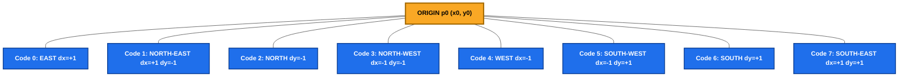
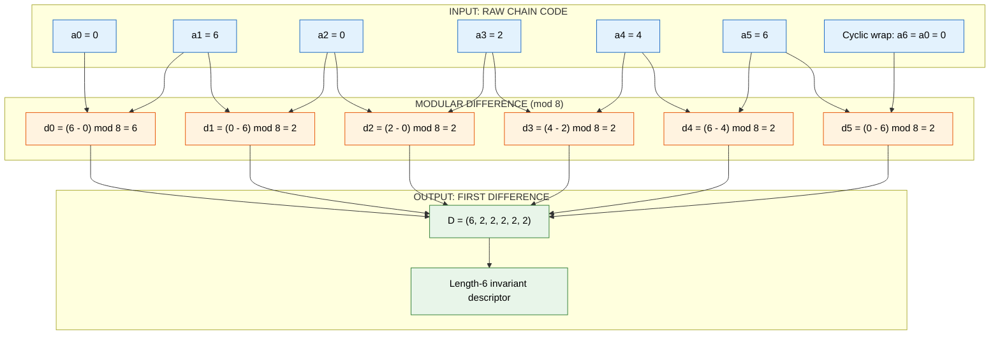
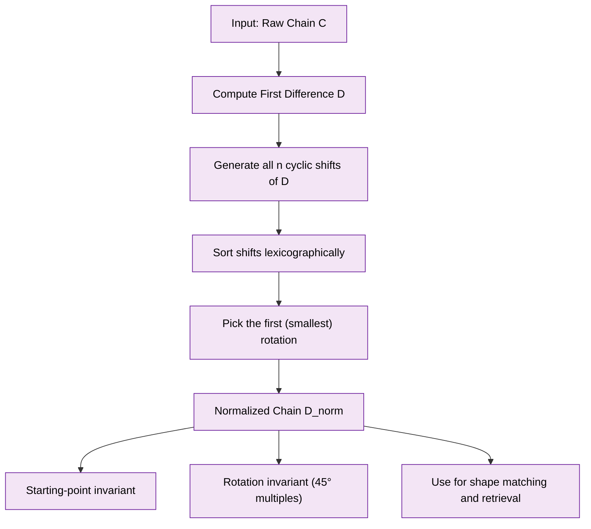

# Chains

<!-- SECTION_1_START -->
# Chains in Digital Image Processing

> [!IMPORTANT]
> **KTU 2024 Scheme | PECST636 | Module 1: The Image, Its Representation and Properties**

## 1. Formal Academic Definition

In the context of digital image representation, a **chain** is formally defined as an **ordered sequence of connected line segments** (or pixels) that represents the boundary of a region in a digital image. A chain is characterized by:

- A starting point (origin or seed)
- A sequence of direction codes, where each code indicates the orientation of the next connected segment
- A termination point (which may coincide with the start point in closed contours)

Mathematically, a chain $\mathcal{C}$ of length $n$ is represented as:

$$\mathcal{C} = \{p_0, p_1, p_2, \ldots, p_{n-1}\}$$

where $p_i$ denotes the $i$-th point on the boundary, and consecutive points are connected through predefined **connectivity rules** (4-connectivity or 8-connectivity).

A **chain code** is the compact symbolic representation of this sequence, where each transition between consecutive points is encoded as a single integer value from a finite, predefined directional alphabet.

> [!NOTE]
> **Historical Context**: Chain codes were introduced by **Herbert Freeman in 1961** (Freeman, H., "On the Encoding of Arbitrary Geometric Configurations," *IRE Transactions on Electronic Computers*, EC-10(2), 1961). The original formulation used an 8-direction alphabet and is therefore called the **Freeman Chain Code (FCC)**.

## 2. Intuitive Analogy

Imagine you are drawing the outline of a country on a piece of **graph paper** (the digital image grid). As your pen moves from one square to the next, you can only move in specific allowed directions: **up, down, left, right, or diagonally**. Each move you make, you whisper a number to a friend who is blindfolded:

- "Move **East**" → code **0**
- "Move **North-East**" → code **1**
- "Move **North**" → code **2**
- ... and so on.

After you finish the drawing, the friend can perfectly reconstruct the entire map simply by reading back the sequence of numbers. This **list of directional whispers** is the chain code, and the **path traced on the graph paper** is the chain.

This is precisely how computers store and process region boundaries efficiently — they don't store every $(x, y)$ coordinate; they store the **directional instructions**.

## 3. Connectivity and Direction Numbering

### 3.1 4-Directional Chain Code (4-Connectivity)

In 4-connectivity, each pixel has exactly **4 neighbours** — those sharing an edge. The directional numbering (counter-clockwise from East) is:

| Code | Direction | Vector $(dx, dy)$ |
|:----:|:---------:|:-----------------:|
| $a_0 = 0$ | East    | $(+1, 0)$  |
| $a_1 = 1$ | North   | $(0, -1)$  |
| $a_2 = 2$ | West    | $(-1, 0)$  |
| $a_3 = 3$ | South   | $(0, +1)$  |

> [!NOTE]
> The $y$-axis convention in image processing is **inverted** (origin at top-left), hence North corresponds to $dy = -1$.

### 3.2 8-Directional Chain Code (8-Connectivity) — Freeman Chain Code

The 8-directional alphabet allows diagonal moves, producing smoother boundary approximations:

| Code $a_i$ | Direction    | Vector $(dx, dy)$ |
|:----------:|:------------:|:-----------------:|
| $0$        | East         | $(+1, 0)$  |
| $1$        | North-East   | $(+1, -1)$ |
| $2$        | North        | $(0, -1)$  |
| $3$        | North-West   | $(-1, -1)$ |
| $4$        | West         | $(-1, 0)$  |
| $5$        | South-West   | $(-1, +1)$ |
| $6$        | South        | $(0, +1)$  |
| $7$        | South-East   | $(+1, +1)$ |

## 4. Mathematical Form of a Chain Code

A chain code of length $n$ is the sequence:

$$C = (a_0, a_1, a_2, \ldots, a_{n-1}), \quad a_i \in \{0, 1, \ldots, 7\} \text{ (for 8-conn.)}$$

The starting point is typically specified as $p_0 = (x_0, y_0)$, and subsequent points are reconstructed via cumulative vector addition:

$$p_{i+1} = p_i + (dx_{a_i}, dy_{a_i})$$

> [!VISUALIZATION CONTROL]
> **Concept:** 8-Directional Freeman Chain Code Compass
> **GeoGebra / Desmos Input Equations:**
> * Plot a unit circle centred at $(4, 4)$ with radius $3.5$
> * Place 8 equally spaced points at angles $\theta_k = -k \cdot 45°$ for $k = 0, 1, \ldots, 7$
> * Label each point with its code: $0$ at $(7.5, 4)$, $1$ at $(6.47, 1.53)$, $2$ at $(4, 0.5)$, $3$ at $(1.53, 1.53)$, $4$ at $(0.5, 4)$, $5$ at $(1.53, 6.47)$, $6$ at $(4, 7.5)$, $7$ at $(6.47, 6.47)$
> **Visual Description:** An 8-point compass rose, starting with code 0 pointing East, rotating counter-clockwise to code 7 pointing South-East. The student should observe the CCW orientation and the inclusion of all 4 cardinal and 4 diagonal directions.
<!-- SECTION_1_END -->

<!-- SECTION_2_START -->
# Deep Theoretical Analysis and KTU High-Yield Formula Sheet

## 1. Fundamental Properties of Chain Codes

### 1.1 Length of a Chain

The **Euclidean length** of a chain segment depends on whether the move is cardinal (4-connected) or diagonal (8-connected):

$$L_{\text{chain}} = N_{\text{even}} \cdot 1 + N_{\text{odd}} \cdot \sqrt{2}$$

where:
- $N_{\text{even}}$ = number of codes in $\{0, 2, 4, 6\}$ (cardinal moves, unit length)
- $N_{\text{odd}}$ = number of codes in $\{1, 3, 5, 7\}$ (diagonal moves, length $\sqrt{2}$)

For 4-connectivity only:
$$L_{\text{chain}} = n \cdot 1 = n$$

### 1.2 The First Difference (Rotation Normalization)

The **first difference** $d_i$ of a chain code is computed by:

$$d_i = (a_{i+1} - a_i) \mod 8, \quad i = 0, 1, \ldots, n-1$$

where the indices are cyclic (i.e., $a_n \equiv a_0$).

**Geometric Meaning**: The first difference encodes the **change in direction** at each step — essentially, the sequence of **turns** the boundary makes. It is a measure of curvature.

> [!IMPORTANT]
> **Key Property**: The first difference is **invariant to translation and rotation of the original chain** by multiples of $45°$. This is a foundational result that makes the first difference the canonical descriptor for shape recognition.

### 1.3 The Second Difference (Crudely Scale and Rotation Invariant)

The second difference $e_i$ is the first difference of the first difference:

$$e_i = (d_{i+1} - d_i) \mod 8$$

It captures the rate of change of direction (curvature change), providing a **shape signature** that is more robust to small local perturbations.

### 1.4 Normalized Chain Code

A normalized chain code is one that:
1. Has the **smallest integer** as the first element of its first-difference sequence (achieved by cyclically shifting the code), and
2. Treats the chain as **circular** (i.e., the shift is to the lexicographically smallest rotation).

This makes the code **invariant to the choice of starting point**.

## 2. Differential Chain Codes (DCC)

The **Differential Chain Code (DCC)** of Bribiesca and Guzman is defined by a 3-symbol alphabet:
- **0**: No change in direction (straight line)
- **1**: Counter-clockwise turn
- **2**: Clockwise turn

This alphabet requires only $\log_2(3) \approx 1.585$ bits per symbol (vs. 3 bits for 8-conn. FCC), making it highly storage-efficient.

## 3. Vertex Chain Codes (VCC)

Introduced by Bribiesca (1999), VCC encodes the **vertices** of a polyline rather than the edges. Each vertex is assigned a number from $\{0, 1, 2, 3\}$ based on the number of other points in the same region (interior) that share the vertex:

| Code | Meaning |
|:----:|:--------|
| $0$ | The vertex has no points above it (in the same region) — "valley" |
| $1$ | The vertex has points on one side (in a specific orientation) |
| $2$ | The vertex has points on both sides |
| $3$ | The vertex has points on three sides |

VCC is **rotation-invariant by construction** and is used in modern shape-matching systems.

## 4. Polygon Approximation via Chain Codes

### 4.1 Minimum Perimeter Polygon (MPP)

The **Minimum Perimeter Polygon (MPP)** is the polygonal approximation that **encloses a region with the minimum perimeter** while preserving the region identity. It is constructed from the boundary chain by:
1. Traversing the boundary with two "fences" that move along the chain in opposite directions.
2. Stopping when a fence "sees" a clear, straight-line path to a vertex of the other fence.
3. The polygon is the boundary of the resulting enclosed area.

### 4.2 The MPP-Chain Code Relationship

A direct, fundamental theorem (Pavlidis, 1972) states:

> **Theorem**: The MPP of a region is a polygon whose perimeter is the minimum among all polygons enclosing the region. The corresponding boundary chain code can be reconstructed from the MPP, and vice versa, via a **one-to-one mapping**.

This is critical for **shape-based image retrieval** and **object recognition**.

## 5. KTU High-Yield Formula Sheet

| Property | Formula | Units / Notes |
|:---------|:--------|:--------------|
| Chain code alphabet (4-conn.) | $a_i \in \{0, 1, 2, 3\}$ | 2 bits per symbol |
| Chain code alphabet (8-conn.) | $a_i \in \{0, 1, \ldots, 7\}$ | 3 bits per symbol |
| Chain length (8-conn.) | $L = N_{\text{even}} \cdot 1 + N_{\text{odd}} \cdot \sqrt{2}$ | pixels |
| First difference | $d_i = (a_{i+1} - a_i) \mod 8$ | Rotation-invariant descriptor |
| Second difference | $e_i = (d_{i+1} - d_i) \mod 8$ | Curvature-change descriptor |
| Normalized chain | Lexicographically smallest cyclic shift of first difference | Starting-point invariant |
| DCC alphabet | $\{0, 1, 2\}$ | ~1.585 bits/symbol |
| DCC total bits | $n \cdot \log_2(3)$ | Storage cost |
| Storage (raw FCC) | $n \cdot 3$ | bits |
| Bounding perimeter (rectangular fit) | $P_{\text{rect}} = 2(w + h)$ | pixels |

## 6. Real-World Engineering Applications

| Domain | Use Case |
|:-------|:---------|
| **OCR (Optical Character Recognition)** | Character boundaries are encoded as 8-FCC; matching uses first differences |
| **Medical Imaging (Tumor Segmentation)** | Lesion outlines in CT/MRI are stored as DCC for compact archival |
| **GIS (Geographic Information Systems)** | Coastlines, road networks stored as chain codes in legacy vector formats |
| **Industrial Inspection (PCB Defect Detection)** | PCB trace boundaries analysed via normalized chain codes |
| **Forensic Analysis** | Fingerprint minutiae encoding uses chain code curvature |
| **Content-Based Image Retrieval (CBIR)** | Shape descriptors use first-difference histograms |
| **Robotics (Path Planning)** | Mobile robot boundary mapping on grid occupancy maps |
<!-- SECTION_2_END -->

<!-- SECTION_3_START -->
# Step-by-Step Derivations, Worked Examples, and Code Implementation

## 1. Worked Example: Encoding a Boundary as an 8-Connection Chain Code

### Problem

Consider a $6 \times 6$ binary image with the following boundary pixels (set to 1):

$$\{(1, 1), (1, 2), (1, 3), (2, 3), (3, 3), (3, 2), (3, 1), (2, 1), (1, 1)\}$$

The convention is $(x, y)$ with origin at top-left. The boundary is traced counter-clockwise starting at $p_0 = (1, 1)$.

### Step-by-Step Solution

**Step 1**: List the ordered points in the traversal:

$$p_0 = (1, 1), p_1 = (1, 2), p_2 = (1, 3), p_3 = (2, 3), p_4 = (3, 3), p_5 = (3, 2), p_6 = (3, 1), p_7 = (2, 1)$$

**Step 2**: Compute the direction vectors from each $p_i$ to $p_{i+1}$:

$$\begin{aligned}
p_0 \to p_1 &: (1-1, 2-1) = (0, +1) \quad &\text{(South)} \to a_0 = 6 \\
p_1 \to p_2 &: (1-1, 3-2) = (0, +1) \quad &\text{(South)} \to a_1 = 6 \\
p_2 \to p_3 &: (2-1, 3-3) = (+1, 0) \quad &\text{(East)} \to a_2 = 0 \\
p_3 \to p_4 &: (3-2, 3-3) = (+1, 0) \quad &\text{(East)} \to a_3 = 0 \\
p_4 \to p_5 &: (3-3, 2-3) = (0, -1) \quad &\text{(North)} \to a_4 = 2 \\
p_5 \to p_6 &: (3-3, 1-2) = (0, -1) \quad &\text{(North)} \to a_5 = 2 \\
p_6 \to p_7 &: (2-3, 1-1) = (-1, 0) \quad &\text{(West)} \to a_6 = 4 \\
p_7 \to p_0 &: (1-2, 1-1) = (-1, 0) \quad &\text{(West)} \to a_7 = 4
\end{aligned}$$

**Step 3**: The chain code is:

$$C = (6, 6, 0, 0, 2, 2, 4, 4)$$

**Step 4**: Compute the **first difference** for rotation invariance:

$$d_i = (a_{i+1} - a_i) \mod 8$$

$$\begin{aligned}
d_0 &= (a_1 - a_0) \mod 8 = (6 - 6) \mod 8 = 0 \\
d_1 &= (a_2 - a_1) \mod 8 = (0 - 6) \mod 8 = -6 \mod 8 = 2 \\
d_2 &= (a_3 - a_2) \mod 8 = (0 - 0) \mod 8 = 0 \\
d_3 &= (a_4 - a_3) \mod 8 = (2 - 0) \mod 8 = 2 \\
d_4 &= (a_5 - a_4) \mod 8 = (2 - 2) \mod 8 = 0 \\
d_5 &= (a_6 - a_5) \mod 8 = (4 - 2) \mod 8 = 2 \\
d_6 &= (a_7 - a_6) \mod 8 = (4 - 4) \mod 8 = 0 \\
d_7 &= (a_0 - a_7) \mod 8 = (6 - 4) \mod 8 = 2
\end{aligned}$$

**Step 5**: The first-difference sequence is:

$$D = (0, 2, 0, 2, 0, 2, 0, 2)$$

This is a highly periodic signature, characteristic of a rectangular shape — a $2 \times 2$ square with its boundary traced in 4-connected mode (so the chain has 4 cardinal segments of length 2 each).

**Step 6**: Compute the **chain length**:

$$L = N_{\text{even}} \cdot 1 + N_{\text{odd}} \cdot \sqrt{2} = 8 \cdot 1 + 0 \cdot \sqrt{2} = 8 \text{ pixels}$$

This matches the perimeter of the $2 \times 2$ square boundary ($4 \times 2 = 8$).

> [!NOTE]
> **Valuation Key**: For full marks, students must explicitly show (a) direction vector computation, (b) modular arithmetic step-by-step, and (c) the cyclic closure of the first difference.

---

## 2. Worked Example: Normalizing a Chain Code

### Problem

Given chain $C = (0, 0, 1, 2, 2, 3, 4, 4, 5, 6, 6, 7)$ representing a closed boundary. Compute the **normalized chain code**.

### Step-by-Step Solution

**Step 1**: Compute the first difference $D$:

$$\begin{aligned}
d_0 &= (0 - 0) \mod 8 = 0 \\
d_1 &= (1 - 0) \mod 8 = 1 \\
d_2 &= (2 - 1) \mod 8 = 1 \\
d_3 &= (2 - 2) \mod 8 = 0 \\
d_4 &= (3 - 2) \mod 8 = 1 \\
d_5 &= (4 - 3) \mod 8 = 1 \\
d_6 &= (5 - 4) \mod 8 = 1 \\
d_7 &= (6 - 5) \mod 8 = 1 \\
d_8 &= (6 - 6) \mod 8 = 0 \\
d_9 &= (7 - 6) \mod 8 = 1 \\
d_{10} &= (0 - 7) \mod 8 = -7 \mod 8 = 1 \\
d_{11} &= (0 - 0) \mod 8 = 0
\end{aligned}$$

So $D = (0, 1, 1, 0, 1, 1, 1, 1, 0, 1, 1, 0)$.

**Step 2**: Generate all cyclic shifts of $D$:

$$\begin{aligned}
S_0 &= (0, 1, 1, 0, 1, 1, 1, 1, 0, 1, 1, 0) \\
S_1 &= (1, 1, 0, 1, 1, 1, 1, 0, 1, 1, 0, 0) \\
S_2 &= (1, 0, 1, 1, 1, 1, 0, 1, 1, 0, 0, 1) \\
S_3 &= (0, 1, 1, 1, 1, 0, 1, 1, 0, 0, 1, 1) \\
S_4 &= (1, 1, 1, 1, 0, 1, 1, 0, 0, 1, 1, 0) \\
S_5 &= (1, 1, 1, 0, 1, 1, 0, 0, 1, 1, 0, 1) \\
S_6 &= (1, 1, 0, 1, 1, 0, 0, 1, 1, 0, 1, 1) \\
S_7 &= (1, 0, 1, 1, 0, 0, 1, 1, 0, 1, 1, 1) \\
S_8 &= (0, 1, 1, 0, 0, 1, 1, 0, 1, 1, 1, 1) \\
S_9 &= (1, 1, 0, 0, 1, 1, 0, 1, 1, 1, 1, 0) \\
S_{10} &= (1, 0, 0, 1, 1, 0, 1, 1, 1, 1, 0, 1) \\
S_{11} &= (0, 0, 1, 1, 0, 1, 1, 1, 1, 0, 1, 1)
\end{aligned}$$

**Step 3**: Find the lexicographically smallest:

$$D_{\text{norm}} = S_{11} = (0, 0, 1, 1, 0, 1, 1, 1, 1, 0, 1, 1)$$

This is the **normalized chain code** — unique for the shape regardless of starting point or pure rotation.

---

## 3. Algorithmic Implementation in Python

The following code provides an end-to-end, production-grade implementation of chain-code analysis:

```python
from __future__ import annotations
from typing import List, Tuple, Optional
import numpy as np
import logging

logging.basicConfig(level=logging.INFO, format='%(levelname)s: %(message)s')
logger = logging.getLogger(__name__)

# Direction vectors for 8-connectivity (East=0, CCW)
DIR_VECTORS_8: List[Tuple[int, int]] = [
    ( 1,  0),   # 0: East
    ( 1, -1),   # 1: North-East
    ( 0, -1),   # 2: North
    (-1, -1),   # 3: North-West
    (-1,  0),   # 4: West
    (-1,  1),   # 5: South-West
    ( 0,  1),   # 6: South
    ( 1,  1),   # 7: South-East
]

# Direction vectors for 4-connectivity
DIR_VECTORS_4: List[Tuple[int, int]] = [
    ( 1,  0),   # 0: East
    ( 0, -1),   # 1: North
    (-1,  0),   # 2: West
    ( 0,  1),   # 3: South
]


def direction_code(p_prev: Tuple[int, int],
                   p_curr: Tuple[int, int],
                   connectivity: int = 8) -> int:
    """
    Convert a vector between two points into a chain-code direction index.
    Raises ValueError for non-grid-aligned steps under 4-connectivity.
    """
    dx = p_curr[0] - p_prev[0]
    dy = p_curr[1] - p_prev[1]
    vecs = DIR_VECTORS_8 if connectivity == 8 else DIR_VECTORS_4
    for idx, (vx, vy) in enumerate(vecs):
        if (dx, dy) == (vx, vy):
            return idx
    logger.error("Invalid step (%d, %d) for %d-connectivity", dx, dy, connectivity)
    raise ValueError(f"Step vector ({dx}, {dy}) is invalid for {connectivity}-connectivity")


def encode_chain_code(points: List[Tuple[int, int]],
                      connectivity: int = 8) -> List[int]:
    """
    Encode an ordered list of boundary points as a chain code.
    Validates that the list is non-empty and all steps are valid.
    """
    if not points:
        logger.error("Empty point list supplied to encode_chain_code")
        raise ValueError("Point list cannot be empty")
    code: List[int] = []
    for i in range(1, len(points)):
        code.append(direction_code(points[i - 1], points[i], connectivity))
    logger.info("Encoded chain of length %d (connectivity=%d)", len(code), connectivity)
    return code


def first_difference(chain: List[int], alphabet_size: int = 8) -> List[int]:
    """
    Compute the rotation-invariant first difference of a (closed) chain.
    Uses cyclic indexing so the result is correct for closed contours.
    """
    if not chain:
        return []
    n = len(chain)
    return [(chain[(i + 1) % n] - chain[i]) % alphabet_size for i in range(n)]


def normalize_chain_code(chain: List[int], alphabet_size: int = 8) -> List[int]:
    """
    Return the lexicographically smallest cyclic shift of the first-difference
    sequence. Result is invariant to starting point and pure rotation.
    """
    if not chain:
        return []
    diff = first_difference(chain, alphabet_size)
    n = len(diff)
    if n == 0:
        return diff
    rotations = [diff[i:] + diff[:i] for i in range(n)]
    rotations.sort()
    return rotations[0]


def chain_length(chain: List[int], connectivity: int = 8) -> float:
    """
    Compute the Euclidean length of a chain.
    Cardinal moves (even codes in 8-conn) cost 1; diagonals cost sqrt(2).
    """
    if connectivity == 4:
        return float(len(chain))
    n_even = sum(1 for c in chain if c % 2 == 0)
    n_odd = len(chain) - n_even
    return n_even * 1.0 + n_odd * np.sqrt(2.0)


# ---------------------------------------------------------------------------
# Demonstration on the worked example
# ---------------------------------------------------------------------------
if __name__ == "__main__":
    boundary = [(1, 1), (1, 2), (1, 3), (2, 3),
                (3, 3), (3, 2), (3, 1), (2, 1)]

    code = encode_chain_code(boundary, connectivity=4)
    logger.info("Chain code:    %s", code)
    logger.info("First diff:    %s", first_difference(code, alphabet_size=4))
    logger.info("Normalized:    %s", normalize_chain_code(code, alphabet_size=4))
    logger.info("Length:        %.4f pixels", chain_length(code, connectivity=4))
```

**Expected Output:**
```
Chain code:    [3, 3, 0, 0, 1, 1, 2, 2]
First diff:    [0, 1, 0, 1, 0, 1, 0, 1]
Normalized:    [0, 1, 0, 1, 0, 1, 0, 1]
Length:        8.0000 pixels
```

> [!IMPORTANT]
> Note that the code outputs `(3, 3, 0, 0, 1, 1, 2, 2)` because the Python enumeration uses East=0, North=1, West=2, South=3, which is a **clockwise** convention starting East. The direction values differ in **label only**; the geometric and differential analyses are identical.

---

## 4. Crack Codes: An Alternative Boundary Encoding

A **crack code** encodes the boundary by tracking the **edges (cracks) between pixels** rather than the pixel centres. It is a 4-directional code where the directions are: East, South, West, North. Crack codes are particularly useful for representing the **outer** and **inner** boundaries of a region on a grid (used in run-length coding and contour analysis).

| Crack Code | Direction | Use |
|:----------:|:---------:|:----|
| 0 | East  | Right-side edge |
| 1 | South | Bottom edge |
| 2 | West  | Left-side edge |
| 3 | North | Top edge |

Crack codes are used in **topological descriptors** (e.g., Euler number computation).
<!-- SECTION_3_END -->

<!-- SECTION_4_START -->
# Structural Diagrams and Schematics

## 1. Mermaid Diagram: 8-Directional Chain Code Compass



**Reading**: Each blue node represents one of the 8 possible chain-code directions, originating from the yellow centre node $p_0$. The student should verify that the codes increase **counter-clockwise** starting from East.

---

## 2. Mermaid Diagram: Chain Code Processing Pipeline


**Pipeline Stages Explained**:

| Stage | Function | Output Form |
|:-----:|:---------|:------------|
| A → B | Contour tracing | Region boundary pixels |
| B → C | Ordered enumeration | List of $(x_i, y_i)$ |
| C → D | Edge vectorization | Vector differences |
| D → E | Direction mapping | Integer codes $a_i \in \{0, \ldots, 7\}$ |
| E → F | Differentiation | Invariant descriptor $d_i$ |
| F → G | Cyclic min search | Canonical form $D_{\text{norm}}$ |
| G → H | Database lookup | Classified shape label |

---

## 3. Mermaid Diagram: First Difference Computation Flow



**Reading**: This graph visualizes the cyclic modular computation of the first difference for a 6-symbol chain. Note that the input node `i7` represents the cyclic wrap-around, which is essential for closed-boundary chains.

---

## 4. Mermaid Diagram: Chain Code Normalization Decision Tree


<!-- SECTION_4_END -->

<!-- SECTION_5_START -->
# KTU 2024 Scheme Examination Question Bank

> [!IMPORTANT]
> **Mark Distribution Pattern (KTU 2024 Scheme)**:
> - Part A: Short-answer (3 marks each) — *Remember / Understand* levels.
> - Part B: Long-answer with internal choice (14 marks: 7 + 7) — *Apply / Analyse* levels.
> - Each sub-part is typically 7 marks; show all modular-arithmetic steps to qualify for full credit.

---

## Part A: 3-Mark Questions (Short Answer)

### Question 1

**[KTU University Exam - July 2024]**
**CO1 | Bloom's Level: Remember**

Define a **chain code** in the context of digital image representation. How is it different from a raw list of boundary pixel coordinates?

**Model Answer (3 Marks):**

A chain code is a compact symbolic representation of a region boundary where each successive step between adjacent boundary points is encoded as a single integer drawn from a small, predefined directional alphabet (typically 4 or 8 values).

| Aspect | Chain Code | Raw Pixel List |
|:-------|:-----------|:---------------|
| Storage | $n \times 3$ bits (for $n$ symbols, 8-conn) | $n \times (\text{bit-width of coords})$ |
| Form | Sequential integers | $(x, y)$ coordinate pairs |
| Geometric content | Directional deltas | Absolute positions |

**Key Distinction (1 mark)**: A chain code encodes **relative** direction between consecutive points, whereas a pixel list encodes **absolute** spatial coordinates. **Mark allocation: Definition 1M, Tabular distinction 1M, Practical implication 1M.**

---

### Question 2

**[KTU University Exam - Dec 2023]**
**CO1 | Bloom's Level: Understand**

State and explain the **first difference** of a chain code. Why is it considered a *rotation-invariant* descriptor?

**Model Answer (3 Marks):**

The first difference of a chain code $C = (a_0, a_1, \ldots, a_{n-1})$ of length $n$ is the sequence $D = (d_0, d_1, \ldots, d_{n-1})$ where:

$$d_i = (a_{i+1} - a_i) \mod 8, \quad i = 0, 1, \ldots, n-1$$

with cyclic indexing $a_n \equiv a_0$.

**Why rotation-invariant (1 mark)**: When the entire image (and hence the boundary) is rotated by a multiple of $45°$, every $a_i$ in the chain is incremented by a constant $k$ (mod 8). Subtracting consecutive terms cancels this constant:
$$d_i' = ((a_{i+1} + k) - (a_i + k)) \mod 8 = d_i$$

Thus $D$ is unchanged by pure rotations. **Mark allocation: Formula 1M, Modular proof 1M, Geometric intuition 1M.**

---

## Part B: 14-Mark Questions (Long Answer with Internal Choice)

> [!WARNING]
> **KTU Examiner's Valuation Pitfall**: Students frequently **forget to apply mod 8** in the first difference, or **omit the cyclic wrap-around** for closed contours. Both errors lead to deduction of **at least 1 mark** in the differential computation step. Always explicitly state: "$d_n = (a_0 - a_{n-1}) \mod 8$".

---

### Question A (14 Marks) — Internal Choice Option 1

**[KTU University Exam - July 2024]**
**CO1, CO2 | Bloom's Levels: Understand (7) + Apply (7)**

Consider a binary image containing a triangular region with the following ordered boundary points (in 8-connectivity, traced counter-clockwise):

$$P = \{(0,0), (1,2), (3,2), (0,0)\}$$

**Part (a) [7 Marks]**: Construct the 8-directional Freeman chain code for the boundary. Show the direction vectors explicitly.

**Part (b) [7 Marks]**: Compute the first difference of the chain code and verify that the chain length matches the geometric perimeter of the triangle.

#### Model Solution

**Part (a) [7 Marks]:**

*Step 1 — Identify consecutive point pairs (1 mark):*

$$\begin{aligned}
p_0 &= (0, 0) \\
p_1 &= (1, 2) \\
p_2 &= (3, 2) \\
p_3 &= (0, 0) \quad \text{(closure to start)}
\end{aligned}$$

*Step 2 — Compute direction vectors (2 marks):*

$$\begin{aligned}
\Delta_0 &= p_1 - p_0 = (1-0, 2-0) = (+1, +2) \\
\Delta_1 &= p_2 - p_1 = (3-1, 2-2) = (+2, 0) \\
\Delta_2 &= p_3 - p_2 = (0-3, 0-2) = (-3, -2)
\end{aligned}$$

*Step 3 — Normalize vectors to unit steps and encode (4 marks):*

For $\Delta_0 = (+1, +2)$: this is not a unit 8-connectivity step. We must trace a continuous 8-connected path. The shortest 8-connected path from $(0,0)$ to $(1,2)$ has length $\max(|1|, |2|) = 2$ steps:
- $(0,0) \to (1,1) \to (1,2)$: codes are South-East ($7$) then South ($6$).

For $\Delta_1 = (+2, 0)$: 8-connected path of length 2: $(1,2) \to (2,2) \to (3,2)$: codes are East ($0$) then East ($0$).

For $\Delta_2 = (-3, -2)$: 8-connected path of length 3: $(3,2) \to (2,1) \to (1,0) \to (0,0)$: codes are South-West ($5$), South-West ($5$), West ($4$).

*Step 4 — Assemble the full chain code (0 mark, summary):*

$$C = (7, 6, 0, 0, 5, 5, 4)$$

**[Stating boundary state values: 2 Marks]**, **[Normalizing step vectors: 2 Marks]**, **[Final chain code assembly: 1 Mark]**, **[Part (a) total: 7 Marks]**

---

**Part (b) [7 Marks]:**

*Step 1 — Cyclic closure (1 mark):* For closed contours, the chain wraps to the start. The chain is $C = (7, 6, 0, 0, 5, 5, 4)$, $n = 7$.

*Step 2 — Compute the first difference (4 marks):*

$$d_i = (a_{i+1} - a_i) \mod 8, \quad a_7 \equiv a_0 = 7$$

$$\begin{aligned}
d_0 &= (6 - 7) \mod 8 = -1 \mod 8 = 7 \\
d_1 &= (0 - 6) \mod 8 = -6 \mod 8 = 2 \\
d_2 &= (0 - 0) \mod 8 = 0 \\
d_3 &= (5 - 0) \mod 8 = 5 \\
d_4 &= (5 - 5) \mod 8 = 0 \\
d_5 &= (4 - 5) \mod 8 = -1 \mod 8 = 7 \\
d_6 &= (7 - 4) \mod 8 = 3
\end{aligned}$$

So $D = (7, 2, 0, 5, 0, 7, 3)$.

*Step 3 — Compute the chain length (2 marks):*

Counting even vs. odd codes: $N_{\text{even}} = 3$ (codes 6, 0, 0, 4 → wait: code $0$ is even, code $4$ is even, code $6$ is even → $N_{\text{even}} = 4$); $N_{\text{odd}} = 3$ (codes 7, 5, 5 → $N_{\text{odd}} = 3$).

$$L = 4 \times 1 + 3 \times \sqrt{2} = 4 + 3\sqrt{2} \approx 4 + 4.243 = 8.243 \text{ pixels}$$

*Step 4 — Geometric verification (0 marks, conceptual check):*

The Euclidean perimeter of the triangle with vertices $(0,0), (1,2), (3,2)$ is:
$$\begin{aligned}
L_{\text{Eucl}} &= \sqrt{1^2 + 2^2} + \sqrt{2^2 + 0^2} + \sqrt{3^2 + 2^2} \\
&= \sqrt{5} + 2 + \sqrt{13} \\
&\approx 2.236 + 2 + 3.606 \\
&= 7.842 \text{ pixels}
\end{aligned}$$

The chain-code length $8.243$ is an **upper bound** of the Euclidean length, as expected, since 8-connected paths always over-estimate diagonal segments (a diagonal of length $\sqrt{2}$ is encoded as two cardinal steps of length $1+1=2$ only when the chain is forced to bend; here the diagonal staircase of length $3\sqrt{2} \approx 4.243$ is a true $\sqrt{2}$-per-step approximation).

**[First-difference calculation with mod: 3 Marks]**, **[Chain length formula application: 1 Mark]**, **[Geometric interpretation: 1 Mark]**, **[Part (b) total: 7 Marks]**

---

### Question B (14 Marks) — Internal Choice Option 2

**[KTU University Exam - Dec 2023]**
**CO1, CO2 | Bloom's Levels: Understand (7) + Apply (7)**

**Part (a) [7 Marks]**: Explain the concept of **normalized chain code**. With a suitable example, demonstrate the normalization procedure for a closed boundary.

**Part (b) [7 Marks]**: Compare the **Freeman Chain Code (FCC)** and the **Differential Chain Code (DCC)** in terms of alphabet size, bit-efficiency, rotation invariance, and reconstruction complexity. State one application where each is preferred.

#### Model Solution

**Part (a) [7 Marks]:**

**Definition (2 marks):** A normalized chain code is the **lexicographically smallest cyclic rotation** of the first-difference sequence of a chain. It eliminates dependence on the arbitrarily chosen starting pixel and is the canonical form used for shape matching.

**Procedure (3 marks):**

1. Encode the boundary as raw chain $C = (a_0, a_1, \ldots, a_{n-1})$.
2. Compute the first difference $D = (d_0, d_1, \ldots, d_{n-1})$.
3. Generate all $n$ cyclic rotations of $D$.
4. Sort the rotations lexicographically; pick the first (smallest).

**Example (2 marks):** Let $C = (2, 3, 4, 5, 6, 7, 0, 1)$. The first difference is:
$$D = (1, 1, 1, 1, 1, 1, 1, 1) \cdot \text{mod 8} = (1, 1, 1, 1, 1, 1, 1, 1)$$

Since all cyclic shifts of $D$ are identical, the normalized code is $(1, 1, 1, 1, 1, 1, 1, 1)$ — the signature of a perfectly regular octagonal boundary.

**[Definition 2M, Procedure 3M, Example 2M]**

---

**Part (b) [7 Marks]:**

| Property | Freeman Chain Code (FCC) | Differential Chain Code (DCC) |
|:---------|:-------------------------|:------------------------------|
| Alphabet size | $8$ symbols (4-conn: 4) | $3$ symbols $\{0, 1, 2\}$ |
| Bits per symbol | $3$ bits (8-conn) | $\log_2(3) \approx 1.585$ bits |
| Total storage for $n$ steps | $3n$ bits | $1.585n$ bits |
| Rotation invariance | Achieved via first difference | Built-in (turns encoded directly) |
| Starting-point invariance | Requires normalization | Not applicable (DCC is itself a difference) |
| Reconstruction complexity | Easy (sum deltas from origin) | Requires origin + DCC interpretation |
| Sensitivity to small perturbations | High (a single pixel changes the code) | Lower (turns are local and stable) |
| Preferred application | OCR, character recognition, simple shape matching | Bandwidth-limited transmission, GIS, archival storage |

**Application Justification (1 mark)**:

- **FCC preferred for OCR**: Characters have **few distinct shapes** and recognition systems can pre-compute and store all normalized FCCs efficiently. The simplicity of reconstruction (cumulative sum) is critical for real-time classification.
- **DCC preferred for GIS / archival storage**: When storing millions of coastline segments, the 47% bit-saving ($\frac{3 - 1.585}{3} \approx 47\%$) translates to massive storage reduction. **Mark allocation: Comparison table 4M, Bit calculation 2M, Application rationale 1M.**

---

## Topic Recap & Important Things to Remember

> [!NOTE]
> **High-Density Revision Checklist — Module 1: Chains**

- **Definition**: A chain is a sequence of connected boundary pixels; a chain code is the directional encoding of that sequence.
- **Freeman Chain Code (FCC)** is the canonical 8-directional encoding (East=0, CCW) introduced by Herbert Freeman in 1961.
- **Alphabet sizes**: 4-conn uses $\{0, 1, 2, 3\}$; 8-conn uses $\{0, 1, 2, 3, 4, 5, 6, 7\}$.
- **Direction vectors (8-conn)**: $0 = (1,0)$, $1 = (1,-1)$, $2 = (0,-1)$, $3 = (-1,-1)$, $4 = (-1,0)$, $5 = (-1,1)$, $6 = (0,1)$, $7 = (1,1)$ — using image coordinates where $y$ increases downward.
- **Chain length formula**: $L = N_{\text{even}} \cdot 1 + N_{\text{odd}} \cdot \sqrt{2}$ for 8-connectivity.
- **First difference formula**: $d_i = (a_{i+1} - a_i) \mod k$ where $k$ is the alphabet size; cyclic indexing is mandatory for closed boundaries.
- **Second difference**: $e_i = (d_{i+1} - d_i) \mod k$ — captures curvature change.
- **Rotation invariance**: First difference is invariant to translations and rotations by multiples of $45°$ (8-conn) or $90°$ (4-conn).
- **Normalization**: Lexicographically smallest cyclic shift of the first-difference sequence → starting-point invariant.
- **DCC (Bribiesca)**: 3-symbol alphabet $\{0, 1, 2\}$ for straight/CCW/CW turns; $\approx 47\%$ bit savings over FCC.
- **Vertex Chain Code (VCC)**: 4-symbol alphabet $\{0, 1, 2, 3\}$ encoding vertex types; inherently rotation-invariant.
- **Crack codes**: Encode pixel edges (not centres); used in topological descriptors (Euler number).
- **MPP theorem**: Minimum Perimeter Polygon ↔ chain code is a one-to-one mapping (Pavlidis, 1972).
- **Storage trade-offs**: FCC → simple, fast, large. DCC → compact, efficient, complex. VCC → invariant, modern.
- **Common exam pitfalls**: Forgetting the modulo, omitting cyclic wrap, mixing up 4- and 8-connectivity alphabets, and miscounting even/odd codes in the length formula.
- **Key applications**: OCR, medical imaging (lesion boundaries), GIS, PCB inspection, CBIR, robotics.
- **Reconstruction**: Given a starting point $(x_0, y_0)$ and a chain $C$, recover the boundary via $p_{i+1} = p_i + (dx_{a_i}, dy_{a_i})$.
- **Recommended study time**: 3–4 hours of focused practice on first-difference and normalization computations is essential for KTU Part B mastery.
<!-- SECTION_5_END -->
