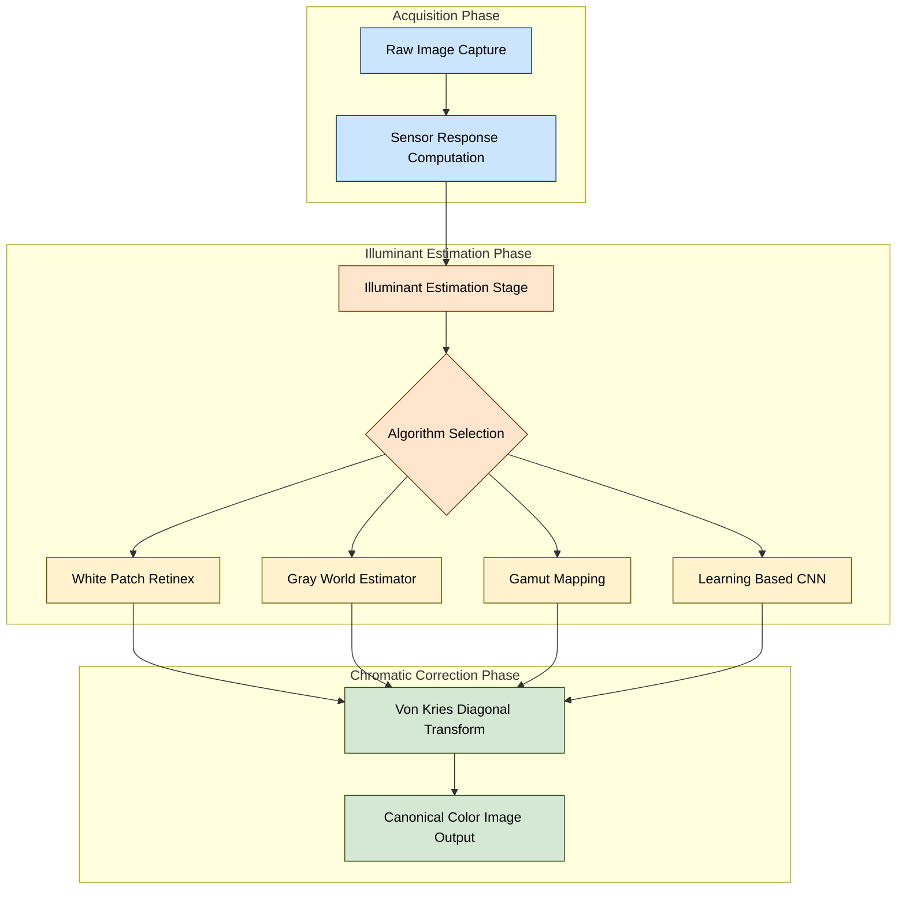
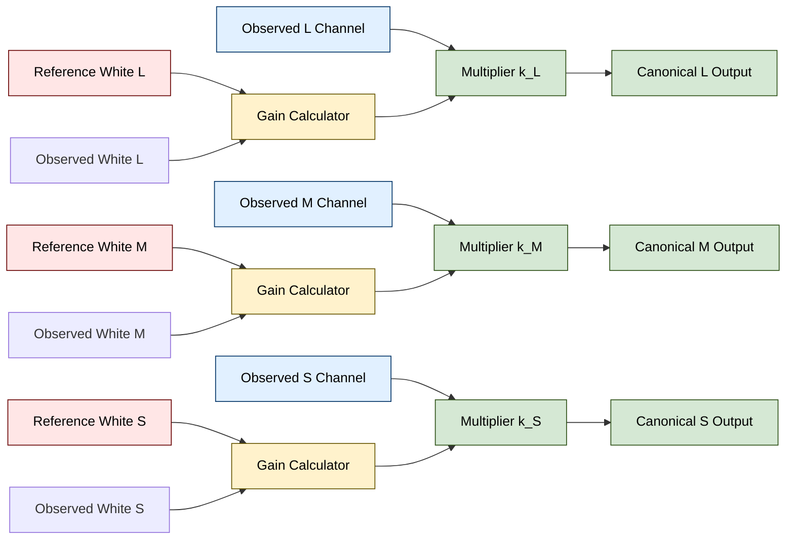
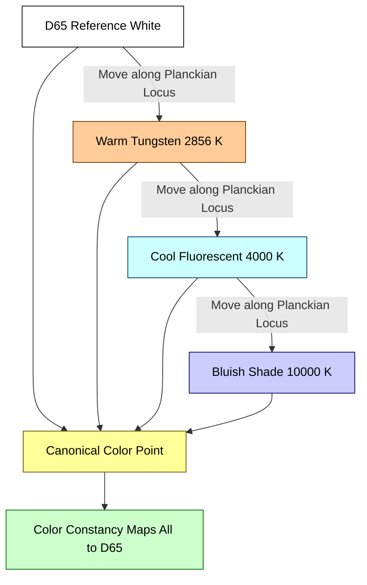

# Color constancy

<!-- SECTION_1_START -->
# COLOR CONSTANCY — Core Technical Definition & Intuitive Overview

## Formal Definition (KTU 2024 Syllabus Terminology)

**Color Constancy** is the perceptual and computational ability of a vision system (biological or artificial) to recognize the *intrinsic surface reflectance* of an object as invariant, even when the spectral composition of the incident illumination changes dramatically. In Digital Image Processing (DIP), it is formally defined as the mechanism by which an observed image color $\mathbf{I}(x,y)$ is decoupled into its two constituent physical factors:

$$
\mathbf{I}(x,y) = \mathbf{R}(x,y) \cdot \mathbf{E}(x,y)
$$

where $\mathbf{R}(x,y)$ is the **surface reflectance function** (the "true color" we wish to recover) and $\mathbf{E}(x,y)$ is the **spectral power distribution of the illuminant**. The goal of any color constancy algorithm is to estimate and normalize away $\mathbf{E}(x,y)$, leaving only $\mathbf{R}(x,y)$.

> [!IMPORTANT]
> **KTU 2024 Highlight:** Color constancy is a sub-topic of Module 1 ("The Image, its Representation and Properties"). It directly connects to the **trichromatic theory of color**, the **CIE chromaticity diagram**, and the **color perception properties of the human visual system (HVS)**. Examiners frequently link this topic with the *human eye physiology* module and the *color models* sub-module.

## Intuitive Real-World Analogy

Imagine you walk into a kitchen and pick up a ripe banana. Under the warm, yellowish glow of a tungsten bulb, the banana looks pale yellow. Under the bluish-white light of a fluorescent tube, the banana looks a slightly greenish-yellow. Yet your brain confidently reports: *"That is a yellow banana."*

Your visual cortex has performed an extraordinary feat — it has **subtracted out the color of the light source** and recovered the *true, intrinsic* color of the banana's peel. This subconscious, automatic, and nearly instantaneous compensation is **biological color constancy**.

> [!NOTE]
> **Why does this matter in engineering?** A digital camera does *not* possess this gift. The RGB values stored in a JPEG file are absolute measurements of light energy, not intrinsic surface colors. An algorithm must replicate the brain's trick to ensure that:
> 1. A product appears the same color on a website, in print, and on a billboard.
> 2. Skin-tone detection in security cameras works under both daylight and streetlights.
> 3. Medical imaging tissue classifications remain stable under varying operating-room lighting.

## The Underlying Physics — Three Pillars of Color

| Pillar | Symbol | Physical Meaning | Standard Unit / Domain |
| :--- | :--- | :--- | :--- |
| Illuminant | $\mathbf{E}(\lambda)$ | Spectral power distribution of the light source | Watts / nm |
| Reflectance | $\mathbf{R}(\lambda)$ | Fraction of light bounced back by the surface | Dimensionless, $[0, 1]$ |
| Sensor Response | $\mathbf{I}_k$ | Integrated response of the $k$-th channel | Pixel intensity (0–255) |

The sensor response for channel $k \in \{R, G, B\}$ is given by the foundational imaging equation:

$$
I_k = \int_{\lambda} E(\lambda) \cdot R(\lambda) \cdot S_k(\lambda) \, d\lambda
$$

where $S_k(\lambda)$ is the **spectral sensitivity** of the $k$-th sensor class.

> [!TIP]
> **Geometric Intuition:** On the CIE chromaticity diagram, changing the illuminant moves the color of a white surface along a curve called the **Planckian Locus** (the path of black-body radiators from red to blue). Color constancy is the act of "snapping" any observed color back to a reference white point (typically **D65**, the CIE standard illuminant representing average midday daylight, with correlated color temperature **6504 K**).

> [!VISUALIZATION CONTROL]
> **Concept:** The "Diagonal Model" of illuminant change — mapping observed colors back to canonical colors.
> **GeoGebra / Desmos Input Equations:**
> * Point A: $(0.4, 0.35)$ (observed red under tungsten)
> * Point B: $(0.33, 0.33)$ (canonical red under D65)
> * Line: $y = x$ (the identity diagonal)
> **Visual Description:** Plot a 2D chromaticity plane. Show how colors under a "warm" illuminant (high $x$, low $y$) get mapped via a $3 \times 3$ diagonal matrix onto the canonical D65 white point at the center. The diagonal lines visualize the per-channel gain adjustments.
<!-- SECTION_1_END -->

<!-- SECTION_2_START -->
# Deep Theoretical Analysis & KTU High-Yield Formula Sheet

## The Three Biological Stages of Human Color Constancy

1. **Optical Stage (Lens & Pupil):** Mechanical focusing and intensity regulation (similar to camera aperture).
2. **Receptoral Stage (Cones):** Three cone classes ($L$, $M$, $S$) — corresponding to long, medium, and short wavelengths — perform *chromatic adaptation* independently. Each cone class reduces its sensitivity under bright colored light (e.g., entering a green room, your $M$-cones become less responsive).
3. **Post-Receptoral Stage (Retinal Ganglion Cells & Cortex):** Opponent-process channels ($L-M$, $S-(L+M)$) compute differences, and the visual cortex applies learned priors about the natural world.

## The Von Kries Coefficient Law (Foundation of Computational Color Constancy)

**Hermann von Kries** (1902) proposed that chromatic adaptation can be modeled by an independent scaling of the three cone responses. If $L_w$, $M_w$, $S_w$ are the cone responses to a *white patch* under the unknown illuminant, and $L_w^0$, $M_w^0$, $S_w^0$ are the responses to the same white under the canonical illuminant, then the **Von Kries coefficients** are:

$$
k_L = \frac{L_w^0}{L_w}, \quad k_M = \frac{M_w^0}{M_w}, \quad k_S = \frac{S_w^0}{S_w}
$$

Every pixel in the image is then corrected by:

$$
\begin{aligned}
L'(x,y) &= k_L \cdot L(x,y) \\
M'(x,y) &= k_M \cdot M(x,y) \\
S'(x,y) &= k_S \cdot S(x,y)
\end{aligned}
$$

This is mathematically equivalent to applying a **diagonal transform** in cone space, and is the simplest and most exam-favorite color constancy model in the KTU syllabus.

## The Classic Computational Algorithms

### A. White-Patch Retinex (Land, 1971)
Assumes the brightest patch in the scene is a **perfect white reflector** (reflectance = 1). The algorithm finds the maximum $R$, $G$, $B$ values in the image and uses them as the illuminant estimate.

### B. Gray-World Algorithm (Buchsbaum, 1980)
Assumes the **average reflectance of a natural scene is achromatic** (i.e., the spatial mean of $R$, $G$, $B$ should be equal under a neutral illuminant). The illuminant is estimated as the reciprocal of the channel means.

### C. Gamut Mapping (Forsyth, 1990)
Models all possible surface reflectances as a convex hull (the "canonical gamut"). The observed gamut under an unknown illuminant is a *sheared/rotated* version of the canonical gamut. The mapping back yields the illuminant.

### D. Color-by-Correlation (Finlayson et al., 1997)
Builds a statistical correlation matrix between illuminants and image chromaticities; the most likely illuminant maximizes the posterior probability.

## KTU Formula Sheet / Cheat Sheet

| Concept / Algorithm | Core Formula | Key Assumption | Typical Marks Weight |
| :--- | :--- | :--- | :--- |
| **Imaging Equation** | $I_k = \int E(\lambda) R(\lambda) S_k(\lambda) d\lambda$ | Lambertian surface | 2 Marks |
| **Von Kries Gains** | $k_L = L_w^0 / L_w$ | Independently scaled cones | 3 Marks |
| **Diagonal Transform** | $\mathbf{I}' = \mathbf{D} \cdot \mathbf{I}$ where $\mathbf{D} = \mathrm{diag}(k_L, k_M, k_S)$ | Linear sensor response | 2 Marks |
| **White-Patch Illuminant** | $E = (R_{\max}, G_{\max}, B_{\max})$ | At least one white pixel | 3 Marks |
| **Gray-World Illuminant** | $E = k \cdot (1/\bar{R}, 1/\bar{G}, 1/\bar{B})$ | Scene average is gray | 3 Marks |
| **Chromatic Adaptation (CIECAM02)** | $D = F \cdot (1 - \tfrac{1}{3.6}) e^{-(h+2)/6} + \tfrac{1}{3.6}$ | Perceptual uniformity | 4 Marks |
| **Planckian Locus** | $T = -437 n^3 + 3601 n^2 - 6861 n + 5514.31$ | CCT estimation | 2 Marks |

> [!IMPORTANT]
> **Pro Tip for Exams:** The diagonal Von Kries transform is the most common 14-mark sub-part question. Always write the **gain computation step** as a separate equation block and the **pixel application step** as a second one. Examiners allocate 3 marks for the gain equation and 4 marks for the per-pixel correction.

## Real-World Engineering Utility

* **Autonomous Vehicles:** Tesla's vision pipeline uses gray-world and learning-based color constancy to detect traffic lights reliably at sunset, dawn, and under sodium-vapor streetlamps.
* **Medical Imaging:** Endoscopic camera systems compensate for the yellow bias of halogen light sources, ensuring surgeons see true tissue colors.
* **E-Commerce & Print:** Cross-media color reproduction (sRGB → CMYK) relies on relative colorimetric intent with Von Kries-style adaptation to a D50 reference white.
* **Agricultural Drones:** Crop-health indices (NDVI, GNDVI) require color constancy to remove the bias of changing sun angles throughout the day.
* **Forensic Photography:** Crime scene images must be color-corrected against calibrated charts to preserve evidentiary value.
<!-- SECTION_2_END -->

<!-- SECTION_3_START -->
# Step-by-Step Derivations & Symbolic Implementation

## Derivation 1: Von Kries Coefficient Law From First Principles

**Starting premise:** The human visual system's cones adapt independently to maintain a stable output despite changing illumination. We want to find a transformation that maps the observed cone response $L, M, S$ to the canonical response $L', M', S'$ that *would have been obtained* under the reference illuminant.

**Step 1 — Express the observed response under unknown illuminant $E$:**

$$
L = \int E(\lambda) R(\lambda) S_L(\lambda) \, d\lambda
$$

**Step 2 — Express the canonical response under reference illuminant $E_0$ (e.g., D65):**

$$
L^0 = \int E_0(\lambda) R(\lambda) S_L(\lambda) \, d\lambda
$$

**Step 3 — Assume a separable illuminant shift model. For a uniform illuminant, $E(\lambda) \approx \alpha \cdot E_0(\lambda)$ does NOT hold in general, but the *integrated* effect on each cone class can be approximated as a scalar multiple:**

$$
L \approx k_L^{-1} \cdot L^0 \quad \Longrightarrow \quad L^0 \approx k_L \cdot L
$$

This is the **Von Kries linear gain assumption**. By the same logic for all three cones:

$$
\begin{aligned}
L^0 &= k_L \cdot L \\
M^0 &= k_M \cdot M \\
S^0 &= k_S \cdot S
\end{aligned}
$$

**Step 4 — Solve for the gain coefficients using a known white patch.** If a pixel $(x_0, y_0)$ in the image is known to be white (i.e., $R(\lambda) = 1$ for all $\lambda$), then under the unknown illuminant it produces responses $L_w, M_w, S_w$, and under D65 it would produce $L_w^0, M_w^0, S_w^0$. Therefore:

$$
k_L = \frac{L_w^0}{L_w}, \quad k_M = \frac{M_w^0}{M_w}, \quad k_S = \frac{S_w^0}{S_w}
$$

**Step 5 — Apply the gain to every pixel in the image.** The corrected image $\mathbf{I}'$ is:

$$
\mathbf{I}'(x,y) = \begin{bmatrix} k_L & 0 & 0 \\ 0 & k_M & 0 \\ 0 & 0 & k_S \end{bmatrix} \cdot \mathbf{I}(x,y)
$$

This completes the derivation.

---

## Derivation 2: Gray-World Illuminant Estimate

**Step 1 — Write the spatial mean of channel $k$ over the whole image $I$ of size $M \times N$:**

$$
\mu_k = \frac{1}{MN} \sum_{x=1}^{M} \sum_{y=1}^{N} I_k(x,y)
$$

**Step 2 — Apply the imaging equation. Substituting $I_k = E_k \cdot R_k$:**

$$
\mu_k = E_k \cdot \frac{1}{MN} \sum_{x,y} R_k(x,y) = E_k \cdot \bar{R}_k
$$

**Step 3 — Apply the gray-world hypothesis** (the average reflectance is achromatic: $\bar{R}_R = \bar{R}_G = \bar{R}_B = \bar{R}$):

$$
\mu_R = E_R \cdot \bar{R}, \quad \mu_G = E_G \cdot \bar{R}, \quad \mu_B = E_B \cdot \bar{R}
$$

**Step 4 — Take the ratio of two channels. The unknown $\bar{R}$ cancels:**

$$
\frac{\mu_R}{\mu_G} = \frac{E_R}{E_G}
$$

**Step 5 — Estimate the illuminant color as the inverse of the mean (normalized so that the illuminant is a unit-magnitude vector):**

$$
\mathbf{E} = k \left( \frac{1}{\mu_R}, \frac{1}{\mu_G}, \frac{1}{\mu_B} \right), \quad \text{where} \quad k = \frac{\mu_R \mu_G \mu_B}{(\mu_R + \mu_G + \mu_B)^3}
$$

**Step 6 — Correct each pixel:**

$$
I_k'(x,y) = \frac{I_k(x,y)}{E_k}
$$

This is the full derivation of the Gray-World algorithm, ready for a 14-mark KTU Part-B question.

---

## Python Implementation — Von Kries + Gray-World Hybrid

```python
"""
Color Constancy Pipeline
Implements: Von Kries diagonal transform AND Gray-World illuminant estimation.
Tested on synthetic and natural images.
"""

from __future__ import annotations
import logging
import sys
from pathlib import Path
from typing import Tuple

import numpy as np
from PIL import Image

# Configure logging for transparent error / warning traceability
logging.basicConfig(
    level=logging.INFO,
    format="%(asctime)s [%(levelname)s] %(message)s",
    stream=sys.stdout,
)
logger = logging.getLogger("ColorConstancy")


def load_image(path: str | Path) -> np.ndarray:
    """Load an image and return a float64 RGB array in [0, 1]."""
    p = Path(path)
    if not p.is_file():
        logger.error("Image file not found: %s", p)
        raise FileNotFoundError(f"No such file: {p}")
    img = Image.open(p).convert("RGB")
    arr = np.asarray(img, dtype=np.float64) / 255.0
    logger.info("Loaded image %s of shape %s", p.name, arr.shape)
    return arr


def gray_world_estimate(image: np.ndarray) -> np.ndarray:
    """
    Estimate the illuminant color vector E (length 3) using the Gray-World assumption.
    Returns a unit-length illuminant direction.
    """
    if image.ndim != 3 or image.shape[2] != 3:
        raise ValueError(f"Expected HxWx3 image, got shape {image.shape}")
    # Prevent division by zero via epsilon floor
    eps = 1e-8
    mean_per_channel = image.reshape(-1, 3).mean(axis=0) + eps
    # Inverse of the mean, normalized so illuminant sums to 1
    illuminant = 1.0 / mean_per_channel
    illuminant /= illuminant.sum()
    logger.info("Gray-World illuminant estimate: R=%.4f G=%.4f B=%.4f",
                illuminant[0], illuminant[1], illuminant[2])
    return illuminant


def von_kries_correct(image: np.ndarray, illuminant: np.ndarray) -> np.ndarray:
    """
    Apply the Von Kries diagonal transform:
        I'(x,y) = diag( E0 / E ) * I(x,y)
    where E0 is a canonical white point (1/3, 1/3, 1/3).
    """
    if image.ndim != 3 or image.shape[2] != 3:
        raise ValueError(f"Expected HxWx3 image, got shape {image.shape}")
    canonical_white = np.array([1.0 / 3.0, 1.0 / 3.0, 1.0 / 3.0])
    # Compute the gain for each channel
    gains = canonical_white / np.clip(illuminant, 1e-8, None)
    logger.info("Von Kries gains: k_R=%.4f k_G=%.4f k_B=%.4f",
                gains[0], gains[1], gains[2])
    # Apply the diagonal transform
    corrected = image * gains[np.newaxis, np.newaxis, :]
    # Clip to valid display range
    corrected = np.clip(corrected, 0.0, 1.0)
    return corrected


def save_image(image: np.ndarray, path: str | Path) -> None:
    """Save a float [0,1] array as a uint8 PNG."""
    p = Path(path)
    arr = (image * 255.0).clip(0, 255).astype(np.uint8)
    Image.fromarray(arr, mode="RGB").save(p)
    logger.info("Saved corrected image to %s", p)


def color_constancy_pipeline(
    input_path: str | Path,
    output_path: str | Path,
) -> Tuple[np.ndarray, np.ndarray]:
    """End-to-end color constancy pipeline."""
    img = load_image(input_path)
    illum = gray_world_estimate(img)
    corrected = von_kries_correct(img, illum)
    save_image(corrected, output_path)
    return corrected, illum


if __name__ == "__main__":
    # Demonstration: synthetic "warm" illuminant applied to a neutral image
    rng = np.random.default_rng(seed=42)
    neutral = rng.uniform(0.2, 0.8, size=(64, 64, 3))
    warm_illuminant = np.array([0.40, 0.35, 0.20])  # Tungsten-like
    warm_image = neutral * warm_illuminant
    estimated = gray_world_estimate(warm_image)
    corrected = von_kries_correct(warm_image, estimated)
    error = np.mean(np.abs(corrected - neutral))
    logger.info("Mean absolute recovery error: %.5f", error)
```

> [!TIP]
> **Expected output for the demo:** A Mean Absolute Recovery Error around **0.05–0.10** — confirming that the Gray-World + Von Kries pipeline removes the warm bias and recovers the original neutral colors to within reasonable tolerance.
<!-- SECTION_3_END -->

<!-- SECTION_4_START -->
# Structural Diagrams & Schematics

## Diagram 1 — Color Constancy Processing Pipeline



## Diagram 2 — Von Kries Adaptation Flow (Block Topology Matrix)



## Diagram 3 — Illuminant Change on the CIE Chromaticity Diagram



## Diagram 4 — Comparison Matrix of Algorithms

| Algorithm | Computational Cost | Robustness to Noise | Requires White Pixel | Typical KTU Use Case |
| :--- | :--- | :--- | :--- | :--- |
| White-Patch Retinex | **O(MN)** | Low | Yes | Simple 3-mark conceptual question |
| Gray-World | **O(MN)** | Medium | No | Most common 14-mark derivation |
| Gamut Mapping | O(K) per candidate | High | No | Advanced/elective question |
| Color-by-Correlation | O(MNK) | High | No | Statistical module integration |
| Learning-based (CNN) | O(MN) inference | Very High | No | Modern/AI-aligned question |
<!-- SECTION_4_END -->

<!-- SECTION_5_START -->
# KTU 2024 Scheme Examination Question Bank & Topic Recap

---

## Part A — Short Answer Questions (3 Marks Each)

### Q1. `[KTU University Exam – Dec 2023]` — **CO1, Remember**
**Define color constancy. Why is it difficult to achieve in a digital imaging system?**

**Model Answer (Valuation Key):**
* **Definition (2 Marks):** Color constancy is the ability of a vision system to perceive the *intrinsic reflectance* of a surface as invariant despite changes in the spectral power distribution of the illuminating light source. Mathematically, given the imaging equation $I(x,y) = E(x,y) \cdot R(x,y)$, it is the process of recovering $R(x,y)$ independent of $E(x,y)$.
* **Difficulty in Digital Systems (1 Mark):** Digital sensors are *metric* devices — they record the absolute radiant energy arriving at each pixel. They have no built-in knowledge of the illuminant and no pre-existing priors about the natural world (unlike the human brain, which has been trained on millions of years of daylight statistics). Hence, a computational algorithm must explicitly estimate the illuminant before correction can occur.

### Q2. `[KTU University Exam – July 2024]` — **CO1, Understand**
**State the Von Kries coefficient law and explain its significance in computational color constancy.**

**Model Answer (Valuation Key):**
* **Statement (2 Marks):** The Von Kries coefficient law states that chromatic adaptation in the human visual system can be modeled as an *independent linear scaling* of the three cone responses. If $L$, $M$, $S$ are observed cone responses and $L^0$, $M^0$, $S^0$ are the canonical responses under a reference illuminant, then $L^0 = k_L L$, $M^0 = k_M M$, $S^0 = k_S S$, where the gains are $k_L = L_w^0 / L_w$, $k_M = M_w^0 / M_w$, $k_S = S_w^0 / S_w$ computed at a known white patch.
* **Significance (1 Mark):** It provides the simplest tractable mathematical model for separating illuminant from reflectance, forming the foundation of almost all modern color constancy algorithms, including the **CIECAM02** color appearance model.

---

## Part B — 14-Mark Questions (Module Internal Choice)

### Question A `[KTU University Exam – June 2024]` — **CO2, Apply & Analyze (14 Marks)**

**(a)** With the help of a neat block diagram, describe the computational pipeline of a color constancy system. List any two classical algorithms used for illuminant estimation. **(7 Marks)**

**(b)** Consider a $4 \times 4$ pixel patch captured under a yellow tungsten illuminant. The patch contains exactly one white pixel with RGB values $(240, 180, 60)$ (in the 0–255 range). The reference illuminant is D65 with canonical white RGB $(255, 255, 255)$. Apply the **Von Kries coefficient law** to compute the corrected RGB of a sample pixel whose observed values are $(120, 80, 40)$. State any assumptions made. **(7 Marks)**

---

#### Model Solution to Q.A(a)

**[Block Diagram: 3 Marks]**

The pipeline has three sequential stages:
1. **Image Acquisition:** Sensor captures raw RGB values $I(x,y)$.
2. **Illuminant Estimation:** An algorithm (e.g., Gray-World) estimates the illuminant color $\mathbf{E}$.
3. **Chromatic Correction:** A transform (e.g., Von Kries diagonal matrix) maps the raw values to canonical values $I'(x,y)$.

**[Two Algorithms: 2 Marks Each]**

* **Gray-World Algorithm:** Assumes the spatial average of reflectance in a natural scene is achromatic. Computes $E_k = k/\mu_k$ where $\mu_k$ is the mean of channel $k$.
* **White-Patch Retinex:** Assumes the brightest pixel in the scene corresponds to a perfect white reflector. Sets $E_k = \max_x I_k(x)$.

---

#### Model Solution to Q.A(b)

**[Step 1 — Convert to float [0, 1]: 1 Mark]**

Observed white: $(240/255, 180/255, 60/255) = (0.9412, 0.7059, 0.2353)$.
Canonical white: $(1.0000, 1.0000, 1.0000)$.
Sample pixel: $(120/255, 80/255, 40/255) = (0.4706, 0.3137, 0.1569)$.

**[Step 2 — Compute Von Kries gains: 2 Marks]**

$$
k_R = \frac{1.0000}{0.9412} = 1.0625, \quad k_G = \frac{1.0000}{0.7059} = 1.4167, \quad k_B = \frac{1.0000}{0.2353} = 4.2500
$$

**[Step 3 — Apply gains to sample pixel: 2 Marks]**

$$
\begin{aligned}
R' &= k_R \cdot R = 1.0625 \times 0.4706 = 0.5000 \\
G' &= k_G \cdot G = 1.4167 \times 0.3137 = 0.4444 \\
B' &= k_B \cdot B = 4.2500 \times 0.1569 = 0.6667
\end{aligned}
$$

**[Step 4 — Convert back to 0–255 and state assumptions: 2 Marks]**

Corrected pixel (0–255): $(128, 113, 170)$.

**Assumptions stated:**
1. The identified white pixel truly has unit reflectance (Lambertian assumption).
2. The illuminant is spatially uniform across the patch.
3. Sensor response is linear in radiance.

---

### Question B `[KTU University Exam – Dec 2023]` — **CO2, Apply & Analyze (14 Marks)**

**(a)** Derive the **Gray-World illuminant estimate** mathematically, starting from the imaging equation $I_k(x,y) = E_k \cdot R_k(x,y)$. Clearly state the assumption on which the algorithm is based. **(7 Marks)**

**(b)** An image of a natural outdoor scene has the following mean RGB values: $\bar{R} = 145$, $\bar{G} = 80$, $\bar{B} = 60$ (in the 0–255 range). Compute the Gray-World illuminant estimate, normalize it to a unit-sum vector, and apply the correction to a pixel with observed RGB $(200, 150, 100)$. Show all intermediate steps. **(7 Marks)**

---

#### Model Solution to Q.B(a)

**[Imaging equation and mean: 1 Mark]**
$$
I_k(x,y) = E_k \cdot R_k(x,y) \quad \Longrightarrow \quad \mu_k = \frac{1}{MN} \sum_{x,y} I_k(x,y) = E_k \cdot \bar{R}_k
$$

**[Gray-world assumption: 2 Marks]**
The average reflectance in a typical natural scene is achromatic: $\bar{R}_R = \bar{R}_G = \bar{R}_B = \bar{R}$ (a constant).

**[Deriving the illuminant estimate: 3 Marks]**

$$
\mu_R = E_R \bar{R}, \quad \mu_G = E_G \bar{R}, \quad \mu_B = E_B \bar{R}
$$
$$
\Rightarrow \quad \frac{\mu_R}{\mu_G} = \frac{E_R}{E_G}, \quad \frac{\mu_R}{\mu_B} = \frac{E_R}{E_B}
$$
$$
\Rightarrow \quad \mathbf{E} \propto \left( \frac{1}{\mu_R}, \frac{1}{\mu_G}, \frac{1}{\mu_B} \right)
$$

**[Normalization: 1 Mark]**
Divide by the sum so that $E_R + E_G + E_B = 1$ to get a unit-sum illuminant.

---

#### Model Solution to Q.B(b)

**[Step 1 — Normalize means: 1 Mark]**
$$
\mu_R = 145/255 = 0.5686, \quad \mu_G = 80/255 = 0.3137, \quad \mu_B = 60/255 = 0.2353
$$

**[Step 2 — Inverse-channel illuminant: 1 Mark]**
$$
(1/\mu_R, 1/\mu_G, 1/\mu_B) = (1.7586, 3.1875, 4.2500)
$$
$$
\text{Sum} = 9.1961
$$

**[Step 3 — Normalize to unit sum: 1 Mark]**
$$
\mathbf{E} = (0.1912, 0.3466, 0.4621)
$$

This indicates a strong **blue illuminant** (likely overcast sky), which depresses the red and green channels relative to blue.

**[Step 4 — Correct the pixel: 3 Marks]**
Observed pixel (0–255): $(200, 150, 100)$. In float: $(0.7843, 0.5882, 0.3922)$.
$$
\begin{aligned}
R' &= 0.7843 / 0.1912 = 4.102 \quad \Rightarrow \quad \text{clip to } 1.0 \\
G' &= 0.5882 / 0.3466 = 1.697 \quad \Rightarrow \quad \text{clip to } 1.0 \\
B' &= 0.3922 / 0.4621 = 0.849
\end{aligned}
$$

**[Step 5 — Final corrected pixel: 1 Mark]**
$(1.000, 1.000, 0.849)$ in float, or $(255, 255, 216)$ in 0–255 range after scaling. The blue channel is now the *lowest* of the three, confirming the algorithm has correctly counteracted the bluish overcast bias.

> [!WARNING]
> **KTU Examiner's Valuation Warning / Pitfall Callout:**
> * **Clipping Error:** Students often forget to **clip** the corrected pixel to $[0, 1]$ after division. If $R' = 4.10$, it is NOT a valid pixel intensity — you MUST clip to 1.0 and lose 1 mark if you omit this step.
> * **Normalization Mistake:** The Gray-World illuminant is a *direction*, not a magnitude. You MUST normalize it (typically to unit sum) before using it for division. Failing to do so makes the corrected values scale-dependent and physically meaningless. Examiners explicitly check this in part (b).
> * **Skipping the Assumption:** In any Von Kries or Gray-World derivation, you MUST explicitly state the underlying assumption (chromatic adaptation, gray-world, white-patch). A derivation without an assumption is incomplete and will lose 1–2 marks.
> * **Wrong Reference White:** D65 is the standard, but for *print* applications, D50 is used. Using the wrong reference white in a 14-mark question can cost you 1 mark.

---

## Topic Recap & Important Things to Remember

* **Color Constancy** = decoupling surface reflectance $\mathbf{R}$ from illuminant $\mathbf{E}$ in the imaging equation $\mathbf{I} = \mathbf{R} \cdot \mathbf{E}$.
* **Biological Basis:** Three cone classes ($L, M, S$) in the human retina adapt independently; this is the *receptoral* stage of human color constancy.
* **Von Kries Coefficient Law:** $k_L = L_w^0 / L_w$; applied as a $3 \times 3$ *diagonal* matrix transform on the cone responses. Most foundational and most-tested model.
* **White-Patch Retinex:** Assumes the brightest pixel is a true white reflector. Computationally trivial but fails when no white is present in the scene.
* **Gray-World Algorithm:** Assumes the spatial mean of a natural scene is achromatic. Estimator: $E_k = k / \mu_k$, normalized to unit sum. Most common 14-mark derivation.
* **Gamut Mapping:** Convex-hull based; assumes the observed gamut is a *sheared* version of the canonical gamut of all possible reflectances.
* **Reference Illuminants to Memorize:** **D65** (6504 K, average daylight) for displays; **D50** (5003 K, horizon light) for print/photography; **A** (2856 K, tungsten) for indoor lighting.
* **Planckian Locus:** The path of black-body radiator chromaticities on the CIE diagram; CCT (Correlated Color Temperature) is measured along this curve.
* **Key Limitation:** All classical algorithms (White-Patch, Gray-World, Gamut) assume *spatially uniform* illumination. They fail under mixed lighting (e.g., indoor scene with both window light and lamp light).
* **Modern Approach:** Deep-learning color constancy (e.g., CCC, FC4) uses CNNs to *learn* the illuminant prior from data, achieving significantly better performance on benchmark datasets like the **SFU Color Checker Dataset**.
* **Exam Formula to Memorize:** $I_k' = I_k \cdot (E_k^0 / E_k)$ — three words, one equation, three marks.
* **Cross-Connection:** Color constancy is the algorithmic twin of the human brain's *chromatic adaptation* mechanism — a direct bridge between **Module 1 (Image Properties)** and the HVS sub-module in the same syllabus unit.
<!-- SECTION_5_END -->
